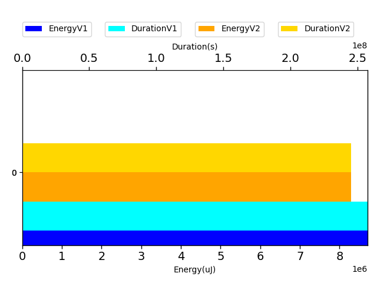
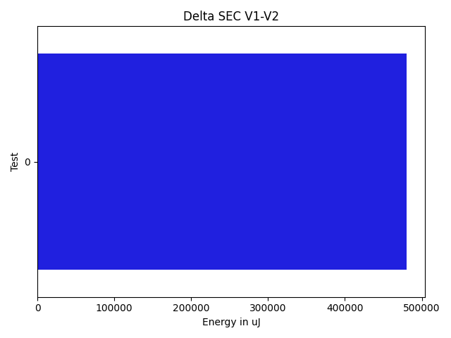
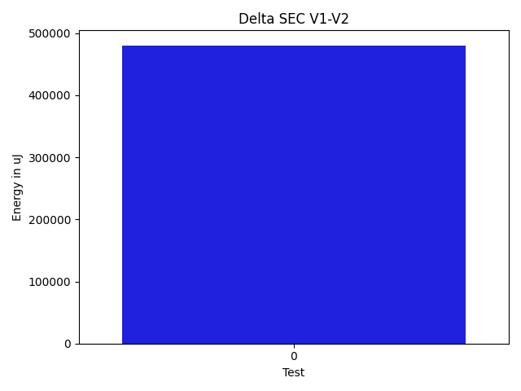
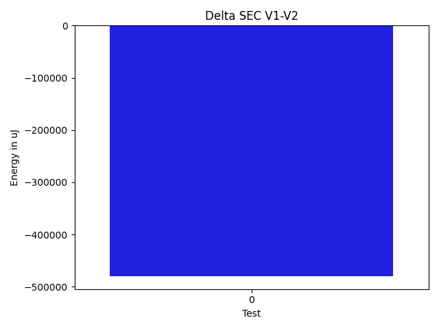
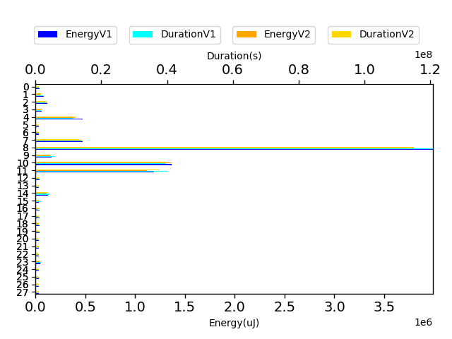

# commons-io cb8953

https://github.com/apache/commons-io/commit/cb8953

| Index | EnergyV1 | EnergyV2 | DeltaEnergy | DurationV1 | DurationsV2 | DeltaDuration |
| --- | --- | --- | --- | --- | --- | --- |
| 0 | 8705996.295461081 | 8225586.045831206 | 480410.2496298747 | 257570514.09869653 | 239522470.71294 | 18048043.385756522 |

| TestClassName | Index |
| --- | --- |
| org.apache.commons.io.input.CharSequenceInputStreamTest | 0 |

| Time Label | Time (s) |
| --- | --- |
| Selection | 183.52903985977173 |
| Injection | 17.821444749832153 |
| Total | 2194.431027173996 |
## org.apache.commons.io.input.CharSequenceInputStreamTest

| Test | EnergyV1 | EnergyV2 | DeltaEnergy | DurationV1 | DurationsV2 | DeltaDuration |
| --- | --- | --- | --- | --- | --- | --- |
| org.apache.commons.io.input.CharSequenceInputStreamTest-testSingleByteRead_RequiredCharsets | 37453.3661183581 | 35862.005225991044 | 1591.3608923670545 | 1056515.9092579158 | 952457.08497317 | 104058.82428474585 |
| org.apache.commons.io.input.CharSequenceInputStreamTest-testIO_356_B10_D13_S0_UTF8 | 85356.89050179182 | 50261.32863026847 | 35095.56187152334 | 2281790.611109771 | 1826735.3357554474 | 455055.27535432344 |
| org.apache.commons.io.input.CharSequenceInputStreamTest-testIO_356_Loop_UTF8 | 119226.82945810085 | 114550.46182500168 | 4676.367633099173 | 3447892.902831671 | 3100891.7597097745 | 347001.1431218963 |
| org.apache.commons.io.input.CharSequenceInputStreamTest-testIO_356_Loop_UTF16 | 59907.22105422719 | 48560.95704651965 | 11346.264007707541 | 1682112.9911240372 | 1730960.0219625398 | -48847.03083850257 |
| org.apache.commons.io.input.CharSequenceInputStreamTest-testIO_356_B10_D10_S0_UTF8 | 475027.6348904122 | 388864.1700691525 | 86163.46482125972 | 11330593.266452484 | 12038584.404525034 | -707991.1380725503 |
| org.apache.commons.io.input.CharSequenceInputStreamTest-testMarkSupported | 33875.77742731571 | 35959.09846317768 | -2083.321035861969 | 548727.1957432032 | 543912.3135520443 | 4814.882191158831 |
| org.apache.commons.io.input.CharSequenceInputStreamTest-testMarkReset_USASCII | 35870.772092960775 | 34727.35203740859 | 1143.420055552182 | 480121.78389885277 | 530065.9894945419 | -49944.20559568913 |
| org.apache.commons.io.input.CharSequenceInputStreamTest-testBufferedRead_AvailableCharset | 470198.8817528384 | 463888.19427085656 | 6310.687481981819 | 13814668.294571407 | 12748706.996516854 | 1065961.2980545536 |
| org.apache.commons.io.input.CharSequenceInputStreamTest-testAvailable | 3987019.65800767 | 3783530.3310137345 | 203489.32699393574 | 120782445.04443437 | 111557279.0552083 | 9225165.989226073 |
| org.apache.commons.io.input.CharSequenceInputStreamTest-testLargeBufferedRead_UTF8 | 161054.53808830792 | 145483.0268055841 | 15571.511282723834 | 5842474.269961301 | 4494182.162129359 | 1348292.107831942 |
| org.apache.commons.io.input.CharSequenceInputStreamTest-testLargeSingleByteRead_RequiredCharsets | 1368281.1205682638 | 1361136.81044488 | 7144.310123383766 | 39459861.23484284 | 38395788.095891565 | 1064073.1389512718 |
| org.apache.commons.io.input.CharSequenceInputStreamTest-testLargeBufferedRead_RequiredCharsets | 1190344.9557608252 | 1116651.4046347467 | 73693.55112607847 | 40228354.82578151 | 36691169.45692282 | 3537185.3688586876 |
| org.apache.commons.io.input.CharSequenceInputStreamTest-testIO_356_B10_D10_S1_UTF8 | 38436.85673928384 | 35785.97242237608 | 2650.884316907759 | 1302677.4197940687 | 1208297.4264384555 | 94379.9933556132 |
| org.apache.commons.io.input.CharSequenceInputStreamTest-testIO_356_B10_D20_S0_UTF8 | 36072.294205628335 | 35976.329654335976 | 95.96455129235983 | 533617.8109500483 | 476525.184007287 | 57092.62694276124 |
| org.apache.commons.io.input.CharSequenceInputStreamTest-testLargeSingleByteRead_UTF8 | 125825.72929171531 | 110015.86626260047 | 15809.863029114844 | 4231053.273000262 | 3704097.5365002975 | 526955.7364999643 |
| org.apache.commons.io.input.CharSequenceInputStreamTest-testBufferedRead_RequiredCharset | 35312.20594504184 | 34837.8241863469 | 474.38175869493716 | 1468925.493040142 | 815851.0630861275 | 653074.4299540146 |
| org.apache.commons.io.input.CharSequenceInputStreamTest-testBufferedRead_UTF8 | 37680.69069075836 | 40312.04182294055 | -2631.351132182186 | 687257.1723684627 | 562917.8929350686 | 124339.27943339408 |
| org.apache.commons.io.input.CharSequenceInputStreamTest-testSingleByteRead_UTF16 | 37920.69018892209 | 35110.07727701035 | 2810.6129119117395 | 591806.2667022889 | 635236.5514033732 | -43430.28470108437 |
| org.apache.commons.io.input.CharSequenceInputStreamTest-testCharsetMismatchInfiniteLoop_RequiredCharsets | 41253.75500509032 | 35255.16292651312 | 5998.592078577203 | 768273.0004964999 | 621995.5271499375 | 146277.47334656247 |
| org.apache.commons.io.input.CharSequenceInputStreamTest-testReadZero_EmptyString | 37937.37093711668 | 38267.453254648484 | -330.08231753180735 | 488754.6042617522 | 488035.4375659996 | 719.1666957526468 |
| org.apache.commons.io.input.CharSequenceInputStreamTest-testIO_356_B10_D13_S1_UTF8 | 33362.61901652318 | 33123.04921112396 | 239.5698053992237 | 855689.4824419783 | 560775.3413252309 | 294914.1411167474 |
| org.apache.commons.io.input.CharSequenceInputStreamTest-testReadZero_RequiredCharsets | 36014.94134985884 | 36589.08752248591 | -574.1461726270718 | 698772.5469091586 | 1018054.9082365292 | -319282.3613273706 |
| org.apache.commons.io.input.CharSequenceInputStreamTest-testSkip_UTF8 | 32535.471365130463 | 33919.74844597646 | -1384.2770808459973 | 794278.5726924008 | 843321.8322788929 | -49043.25958649209 |
| org.apache.commons.io.input.CharSequenceInputStreamTest-testIO_356_B10_D10_S2_UTF8 | 48430.921277731926 | 37071.778690198924 | 11359.142587533002 | 1654262.8836076874 | 1272373.6477046998 | 381889.23590298765 |
| org.apache.commons.io.input.CharSequenceInputStreamTest-testSkip_USASCII | 34252.097137250006 | 34509.11578474159 | -257.01864749158267 | 673997.403596621 | 652293.9045503542 | 21703.499046266777 |
| org.apache.commons.io.input.CharSequenceInputStreamTest-testIO_356_B10_D10_S0_UTF16 | 34479.58180658263 | 39051.898074981735 | -4572.316268399103 | 667835.2176856326 | 866306.4424500295 | -198471.2247643969 |
| org.apache.commons.io.input.CharSequenceInputStreamTest-testSingleByteRead_UTF8 | 36313.451474841684 | 34666.63779105374 | 1646.8136837879429 | 571000.4901938103 | 553879.3356968181 | 17121.15449699224 |
| org.apache.commons.io.input.CharSequenceInputStreamTest-testMarkReset_UTF8 | 36549.97330853343 | 31618.86203655062 | 4931.111271982809 | 626754.1309463382 | 631776.0049694383 | -5021.874023100128 |

