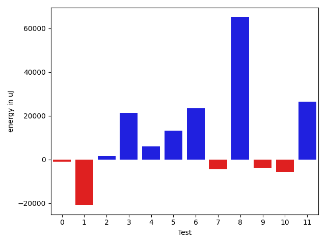
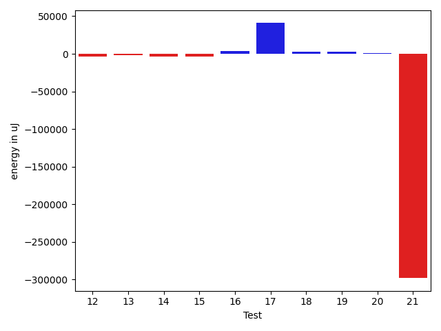
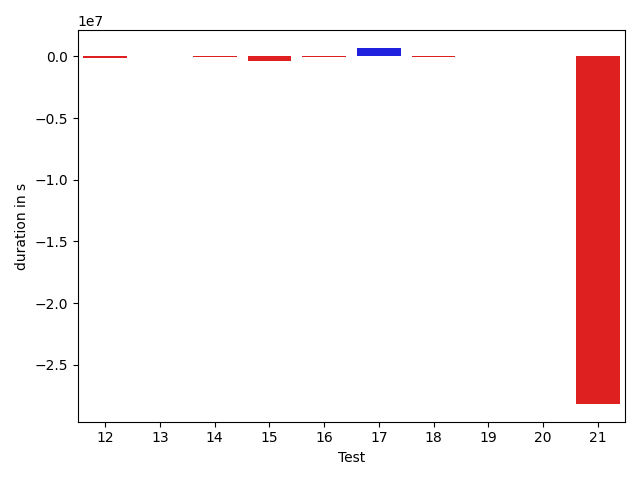
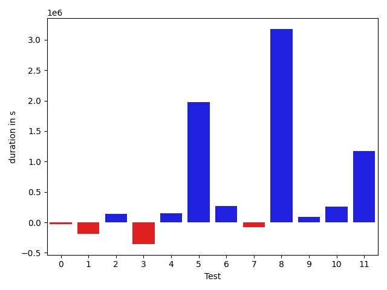
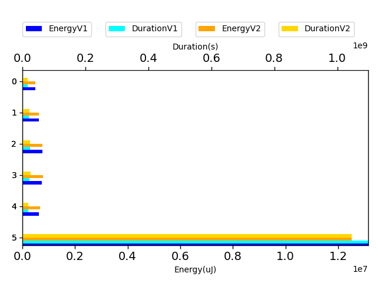
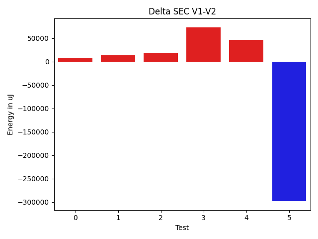

# commons-io 167eff

https://github.com/apache/commons-io/commit/167eff

## Delta Energy per test method

| ID | EnergyV1 | EnergyV2 | DeltaEnergy |
| --- | --- | --- | --- |
| 0 | 32175.415118516084 | 31265.350200081724 | -910.0649184343602 |
| 1 | 143595.8534775924 | 122811.82483198345 | -20784.028645608953 |
| 2 | 31191.8156883208 | 32847.25687367032 | 1655.4411853495185 |
| 3 | 253730.04540197912 | 275084.0268567635 | 21353.9814547844 |
| 4 | 30694.620174943593 | 36690.95797805628 | 5996.337803112685 |
| 5 | 633205.2995052852 | 646395.0598344067 | 13189.760329121491 |
| 6 | 230254.2464764018 | 253607.84091481258 | 23353.59443841077 |
| 7 | 528461.7218860587 | 524038.372796201 | -4423.349089857715 |
| 8 | 506147.38795373274 | 571370.7856296091 | 65223.39767587639 |
| 9 | 34231.02002956261 | 30411.664966826465 | -3819.3550627361474 |
| 10 | 35746.74879997554 | 30067.32904428603 | -5679.419755689509 |
| 11 | 62657.408132519646 | 89114.03420796557 | 26456.62607544592 |
| 12 | 33294.80929075608 | 29894.507638675772 | -3400.3016520803067 |
| 13 | 33940.00048027861 | 31930.01370913876 | -2009.9867711398547 |
| 14 | 34273.421914955645 | 30792.615214797523 | -3480.806700158122 |
| 15 | 281890.30674204195 | 278250.5938117417 | -3639.712930300273 |
| 16 | 33921.05656813459 | 37954.47851075376 | 4033.4219426191703 |
| 17 | 216085.93190305267 | 256921.22309560893 | 40835.291192556266 |
| 18 | 34033.760738265555 | 36414.629594556114 | 2380.868856290559 |
| 19 | 33834.937596161515 | 36387.471658458686 | 2552.5340622971707 |
| 20 | 37001.104849729716 | 37593.04807634387 | 591.9432266141521 |
| 21 | 13137542.45480706 | 12839208.947796445 | -298333.5070106145 |

## Delta Duration per test method

| ID | DurationV1 | DurationsV2 | DeltaDuration |
| --- | --- | --- | --- |
| 0 | 1493610.2320933263 | 1467390.8593117548 | -26219.372781571466 |
| 1 | 4815968.684000038 | 4630367.623005225 | -185601.0609948123 |
| 2 | 900413.6842158776 | 1040445.1026798275 | 140031.41846394993 |
| 3 | 9472181.442765353 | 9116027.970150722 | -356153.47261463106 |
| 4 | 947992.7304888056 | 1094194.5523658814 | 146201.82187707582 |
| 5 | 21461086.829727992 | 23441816.69107765 | 1980729.8613496572 |
| 6 | 8096456.445189004 | 8369271.398480008 | 272814.9532910045 |
| 7 | 16214600.34302723 | 16135968.855215354 | -78631.48781187646 |
| 8 | 15451869.350724168 | 18629670.449354783 | 3177801.0986306146 |
| 9 | 966362.5229916158 | 1055686.0646634179 | 89323.54167180206 |
| 10 | 1077026.3061010758 | 1333389.4461123808 | 256363.140011305 |
| 11 | 2097370.193053405 | 3265871.9644457065 | 1168501.7713923017 |
| 12 | 1200736.9775368383 | 1105297.594666798 | -95439.38287004037 |
| 13 | 775294.7573727444 | 839083.5878290171 | 63788.8304562727 |
| 14 | 1073431.560364699 | 1062978.7377418962 | -10452.822622802807 |
| 15 | 8584368.003455989 | 8219971.944255019 | -364396.05920097046 |
| 16 | 950305.6405257776 | 918058.7354734467 | -32246.905052330927 |
| 17 | 6090060.792980233 | 6781676.478354175 | 691615.6853739414 |
| 18 | 811952.7968074647 | 787629.5843660202 | -24323.212441444513 |
| 19 | 877834.8045564841 | 925556.7001915097 | 47721.895635025576 |
| 20 | 870350.1031069553 | 880236.6360006097 | 9886.532893654425 |
| 21 | 1098046482.9212298 | 1069859200.780695 | -28187282.140534878 |

## Misc.

| ID | Test Class | Test Method |
| --- | --- | --- |
| 0 | org.apache.commons.io.file.PathUtilsDeleteFileTest | testDeleteFileDirectory1FileSize0 |
| 1 | org.apache.commons.io.file.PathUtilsDeleteFileTest | testDeleteReadOnlyFileDirectory1FileSize1 |
| 2 | org.apache.commons.io.file.PathUtilsDeleteFileTest | testDeleteFileDirectory1FileSize1 |
| 3 | org.apache.commons.io.file.PathUtilsDeleteFileTest | testDeleteFileDoesNotExist |
| 4 | org.apache.commons.io.file.PathUtilsDeleteFileTest | testSetReadOnlyFileDirectory1FileSize1 |
| 5 | org.apache.commons.io.FileUtilsCleanSymlinksTestCase | testStillClearsIfGivenDirectoryIsASymlink |
| 6 | org.apache.commons.io.FileUtilsCleanDirectoryTestCase | testThrowsOnCannotDeleteFile |
| 7 | org.apache.commons.io.FileUtilsCleanDirectoryTestCase | testDeletesRegular |
| 8 | org.apache.commons.io.file.PathUtilsDeleteTest | testDeleteDirectory1FileSize1OverrideReadOnly |
| 9 | org.apache.commons.io.file.PathUtilsDeleteTest | testDeleteDirectory1FileSize0NoOption |
| 10 | org.apache.commons.io.file.PathUtilsDeleteTest | testDeleteDirectory1FileSize1NoOption |
| 11 | org.apache.commons.io.file.PathUtilsDeleteTest | testDeleteDirectory1FileSize0 |
| 12 | org.apache.commons.io.file.PathUtilsDeleteTest | testDeleteDirectory1FileSize0OverrideReadonly |
| 13 | org.apache.commons.io.file.PathUtilsDeleteTest | testDeleteFileDoesNotExist |
| 14 | org.apache.commons.io.file.PathUtilsDeleteTest | testDeleteDirectory1FileSize1 |
| 15 | org.apache.commons.io.FileUtilsTestCase | testCopyDirectoryToNonExistingDest |
| 16 | org.apache.commons.io.FileUtilsTestCase | testForceDeleteAFile3 |
| 17 | org.apache.commons.io.FileUtilsTestCase | testForceDeleteReadOnlyFile |
| 18 | org.apache.commons.io.FileUtilsTestCase | testForceDeleteAFile2 |
| 19 | org.apache.commons.io.FileUtilsTestCase | testDeleteQuietlyDir |
| 20 | org.apache.commons.io.FileUtilsTestCase | testForceDeleteAFile1 |
| 21 | org.apache.commons.io.monitor.FileAlterationObserverTestCase | testDirectory |

| Test | IterationV1 | IterationV2 | DeltaIteration |
| --- | --- | --- | --- |
| 0 | 99 | 99 | 0 |
| 1 | 99 | 99 | 0 |
| 2 | 63 | 52 | -11 |
| 3 | 99 | 99 | 0 |
| 4 | 70 | 73 | 3 |
| 5 | 99 | 99 | 0 |
| 6 | 99 | 99 | 0 |
| 7 | 99 | 99 | 0 |
| 8 | 99 | 99 | 0 |
| 9 | 67 | 70 | 3 |
| 10 | 74 | 66 | -8 |
| 11 | 86 | 90 | 4 |
| 12 | 75 | 72 | -3 |
| 13 | 52 | 54 | 2 |
| 14 | 79 | 76 | -3 |
| 15 | 99 | 99 | 0 |
| 16 | 54 | 65 | 11 |
| 17 | 99 | 99 | 0 |
| 18 | 50 | 48 | -2 |
| 19 | 66 | 65 | -1 |
| 20 | 44 | 49 | 5 |
| 21 | 99 | 99 | 0 |

| Time Label | Time (s) |
| --- | --- |
| Selection | 183.5668432712555 |
| Injection | 18.8448965549469 |
| Total | 273.8443660736084 |

| Index | EnergyV1 | EnergyV2 | DeltaEnergy |
| --- | --- | --- | --- |
| 0 | 491387.749861352 | 498699.4167405553 | 7311.666879203345 |
| 1 | 633205.2995052852 | 646395.0598344067 | 13189.760329121491 |
| 2 | 758715.9683624605 | 777646.2137110136 | 18930.245348553057 |
| 3 | 740290.7966017809 | 813580.9504112992 | 73290.15380951832 |
| 4 | 636767.098397386 | 683521.444747463 | 46754.34635007696 |
| 5 | 13137542.45480706 | 12839208.947796445 | -298333.5070106145 |

| Index | DurationV1 | DurationsV2 | DeltaDuration |
| --- | --- | --- | --- |
| 0 | 17630166.7735634 | 17348426.10751341 | -281740.6660499908 |
| 1 | 21461086.829727992 | 23441816.69107765 | 1980729.8613496572 |
| 2 | 24311056.788216233 | 24505240.25369536 | 194183.46547912806 |
| 3 | 22642091.668144546 | 27291977.844813995 | 4649886.176669449 |
| 4 | 18184872.141432904 | 18513130.07864078 | 328257.93720787764 |
| 5 | 1098046482.9212298 | 1069859200.780695 | -28187282.140534878 |

| Index | TestClassName | #Tests |
| --- | --- | --- |
| 0 | org.apache.commons.io.file.PathUtilsDeleteFileTest | 5 |
| 1 | org.apache.commons.io.FileUtilsCleanSymlinksTestCase | 1 |
| 2 | org.apache.commons.io.FileUtilsCleanDirectoryTestCase | 2 |
| 3 | org.apache.commons.io.file.PathUtilsDeleteTest | 7 |
| 4 | org.apache.commons.io.FileUtilsTestCase | 6 |
| 5 | org.apache.commons.io.monitor.FileAlterationObserverTestCase | 1 |
