# commons-io 1ac7be

https://github.com/apache/commons-io/commit/1ac7be

| Index | EnergyV1 | EnergyV2 | DeltaEnergy | DurationV1 | DurationsV2 | DeltaDuration |
| --- | --- | --- | --- | --- | --- | --- |
| 0 | 551903.928833029 | 582537.7685818132 | -30633.8397487842 | 15955591.028399495 | 16780866.8188149 | -825275.7904154044 |
| 1 | 847139.0063728068 | 946910.789005944 | -99771.78263313719 | 26435828.391624175 | 27452219.974218123 | -1016391.5825939476 |
| 2 | 1106408.5320990002 | 1106916.1352467285 | -507.60314772836864 | 38485007.16596866 | 39505969.53106679 | -1020962.3650981337 |
| 3 | 1727740.3558050091 | 1733044.4833151803 | -5304.127510171151 | 61563173.33681898 | 55120651.91849137 | 6442521.418327607 |
| 4 | 709357.3723878564 | 713641.5943113473 | -4284.221923490986 | 25186768.922627285 | 27115492.6596222 | -1928723.7369949147 |
| 5 | 574567.8847190379 | 602389.9642681831 | -27822.079549145186 | 18342488.73580369 | 19031893.304802887 | -689404.5689991973 |
| 6 | 301726.15522174543 | 327155.6381421786 | -25429.48292043316 | 9353123.124287238 | 12190905.988082385 | -2837782.8637951463 |
| 7 | 494546.7571205767 | 626478.3362771287 | -131931.57915655198 | 15060386.892577663 | 17823841.216772377 | -2763454.3241947144 |

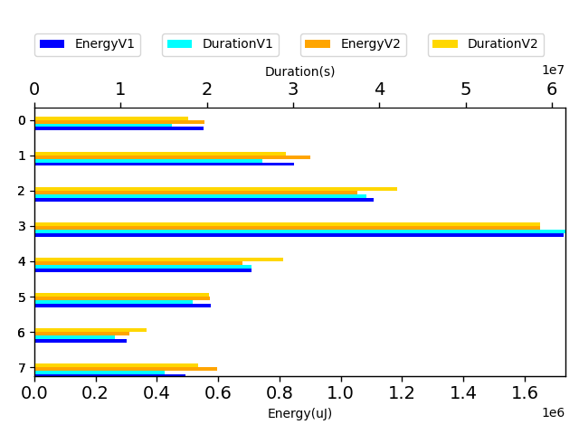

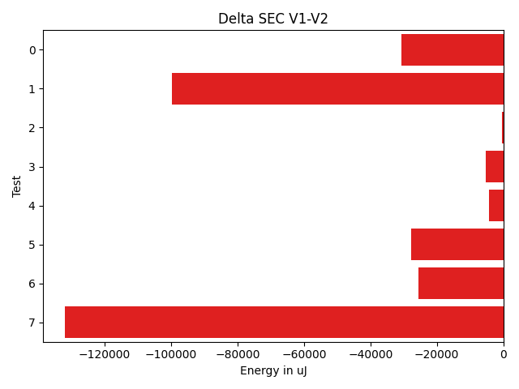

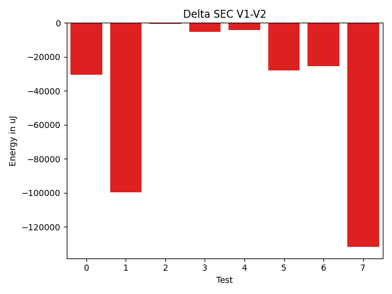

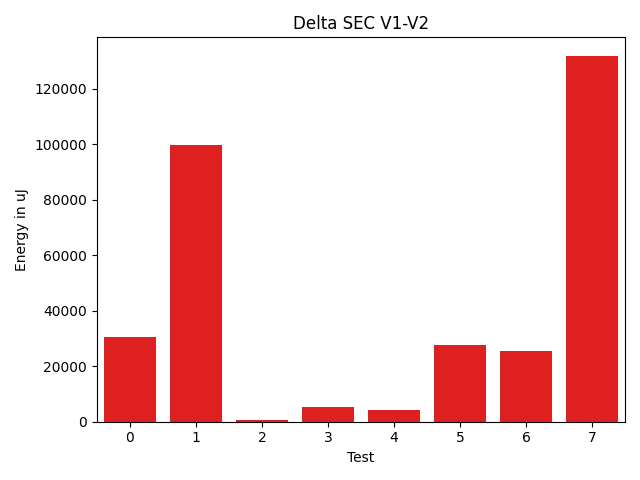

| TestClassName | Index |
| --- | --- |
| org.apache.commons.io.file.PathUtilsTest | 0 |
| org.apache.commons.io.FileUtilsTestCase | 1 |
| org.apache.commons.io.filefilter.FileFilterTestCase | 2 |
| org.apache.commons.io.filefilter.NameFileFilterTest | 3 |
| org.apache.commons.io.FileUtilsListFilesTestCase | 4 |
| org.apache.commons.io.file.DirectoryStreamFilterTest | 5 |
| org.apache.commons.io.FileUtilsDirectoryContainsTestCase | 6 |
| org.apache.commons.io.IOCaseTestCase | 7 |
| Time Label | Time (s) |
| --- | --- |
| Selection | 179.6017870903015 |
| Injection | 19.072049140930176 |
| Total | 3114.3995587825775 |
## org.apache.commons.io.file.PathUtilsTest

| Test | EnergyV1 | EnergyV2 | DeltaEnergy | DurationV1 | DurationsV2 | DeltaDuration |
| --- | --- | --- | --- | --- | --- | --- |
| org.apache.commons.io.file.PathUtilsTest-testNewDirectoryStream | 551903.928833029 | 582537.7685818132 | -30633.8397487842 | 15955591.028399495 | 16780866.8188149 | -825275.7904154044 |

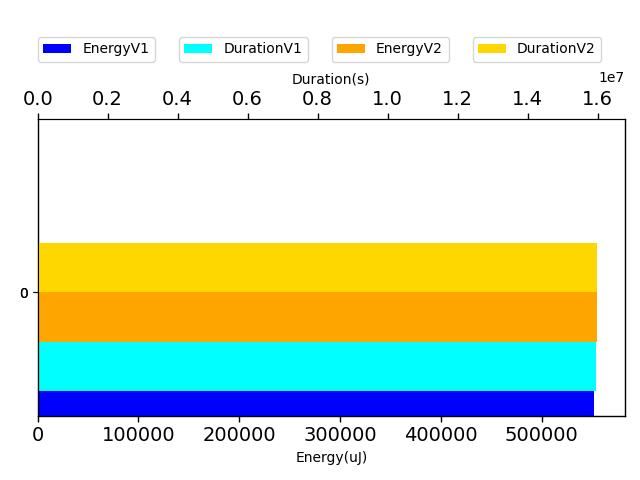

## org.apache.commons.io.FileUtilsTestCase

| Test | EnergyV1 | EnergyV2 | DeltaEnergy | DurationV1 | DurationsV2 | DeltaDuration |
| --- | --- | --- | --- | --- | --- | --- |
| org.apache.commons.io.FileUtilsTestCase-testIterateFiles | 128241.7716546776 | 144363.11235719116 | -16121.340702513553 | 4366651.6456287755 | 3931864.050863414 | 434787.5947653614 |
| org.apache.commons.io.FileUtilsTestCase-testListFiles | 160877.14165791738 | 168311.01660195243 | -7433.874944035051 | 4959460.853314633 | 4663666.713477753 | 295794.13983687945 |
| org.apache.commons.io.FileUtilsTestCase-testIterateFilesAndDirs | 86473.77528126852 | 86765.44120874479 | -291.6659274762642 | 3136598.1037999634 | 3226507.81919598 | -89909.71539601684 |
| org.apache.commons.io.FileUtilsTestCase-testListFilesWithDirs | 471546.3177789433 | 547471.2188380557 | -75924.90105911245 | 13973117.788880805 | 15630181.390680972 | -1657063.601800168 |

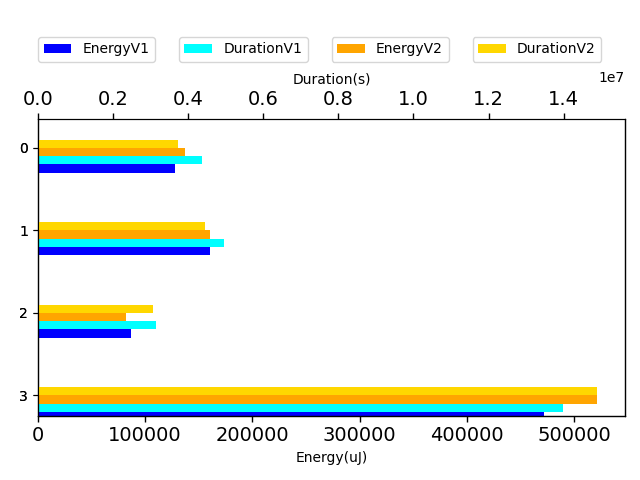

## org.apache.commons.io.filefilter.FileFilterTestCase

| Test | EnergyV1 | EnergyV2 | DeltaEnergy | DurationV1 | DurationsV2 | DeltaDuration |
| --- | --- | --- | --- | --- | --- | --- |
| org.apache.commons.io.filefilter.FileFilterTestCase-testSuffix | 31106.98017460812 | 38743.19902998631 | -7636.218855378189 | 1449997.8147984724 | 1633175.992329556 | -183178.17753108358 |
| org.apache.commons.io.filefilter.FileFilterTestCase-testDeprecatedWildcard | 95851.92518164075 | 116005.05847740354 | -20153.13329576279 | 3241698.965869979 | 3476515.979154185 | -234817.01328420592 |
| org.apache.commons.io.filefilter.FileFilterTestCase-testNameFilter | 446196.27333557815 | 438586.7556678575 | 7609.517667720676 | 13993539.822510585 | 14254927.116470184 | -261387.293959599 |
| org.apache.commons.io.filefilter.FileFilterTestCase-testFileEqualsFilter | 66880.80348859022 | 61243.51301812018 | 5637.290470470034 | 2264599.7740407186 | 2485272.9582945374 | -220673.18425381882 |
| org.apache.commons.io.filefilter.FileFilterTestCase-testFilterArray_PathVisitorFileFilter_FileExistsNo | 139235.91717260817 | 169584.9917228698 | -30349.074550261634 | 5157654.640774883 | 5769038.225756493 | -611383.5849816101 |
| org.apache.commons.io.filefilter.FileFilterTestCase-testPathEqualsFilter | 61888.12302238529 | 31256.034270803655 | 30632.088751581636 | 1506076.887964021 | 1519175.4497482171 | -13098.56178419618 |
| org.apache.commons.io.filefilter.FileFilterTestCase-testWildcard | 78840.50458240346 | 56387.35828519314 | 22453.146297210318 | 2355692.9684336428 | 2365441.12600655 | -9748.157572907396 |
| org.apache.commons.io.filefilter.FileFilterTestCase-testPrefix | 31853.97306390591 | 32413.74732853045 | -559.7742646245424 | 3353220.418678157 | 2108953.4354475923 | 1244266.9832305647 |
| org.apache.commons.io.filefilter.FileFilterTestCase-testPrefixCaseInsensitive | 33092.95410238378 | 40239.12833106218 | -7146.174228678399 | 1070034.1192902671 | 1228628.5718981917 | -158594.45260792458 |
| org.apache.commons.io.filefilter.FileFilterTestCase-testFilterArray_PathVisitorFileFilter_FileExistsYes | 121461.07797489638 | 122456.34911490195 | -995.2711400055705 | 4092491.753607927 | 4664840.675961285 | -572348.922353358 |

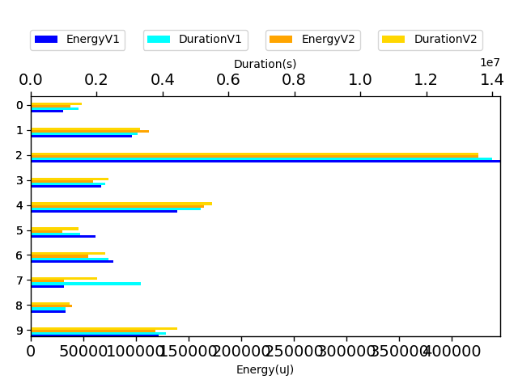

## org.apache.commons.io.filefilter.NameFileFilterTest

| Test | EnergyV1 | EnergyV2 | DeltaEnergy | DurationV1 | DurationsV2 | DeltaDuration |
| --- | --- | --- | --- | --- | --- | --- |
| org.apache.commons.io.filefilter.NameFileFilterTest-testJavadocExampleUsingNio | 1697232.7904464127 | 1702990.8888274264 | -5758.0983810136095 | 60458382.55939901 | 54022572.23822746 | 6435810.321171552 |
| org.apache.commons.io.filefilter.NameFileFilterTest-testNoCounting | 30507.56535859635 | 30053.594487753937 | 453.9708708424114 | 1104790.7774199713 | 1098079.6802639107 | 6711.097156060627 |

## org.apache.commons.io.FileUtilsListFilesTestCase

| Test | EnergyV1 | EnergyV2 | DeltaEnergy | DurationV1 | DurationsV2 | DeltaDuration |
| --- | --- | --- | --- | --- | --- | --- |
| org.apache.commons.io.FileUtilsListFilesTestCase-testListFilesByExtension | 35472.33295359998 | 38031.78564889962 | -2559.4526952996384 | 2620344.670405958 | 2553722.53357128 | 66622.13683467777 |
| org.apache.commons.io.FileUtilsListFilesTestCase-testListFiles | 500186.2629743413 | 505767.23563878227 | -5580.972664440982 | 16575403.974575266 | 18123610.606031336 | -1548206.6314560696 |
| org.apache.commons.io.FileUtilsListFilesTestCase-testIterateFilesByExtension | 173698.7764599151 | 169842.57302366546 | 3856.2034362496343 | 5991020.277646061 | 6438159.520019583 | -447139.2423735224 |

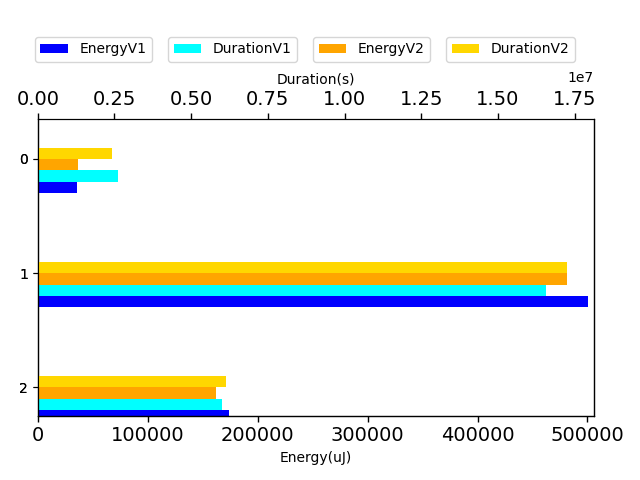

## org.apache.commons.io.file.DirectoryStreamFilterTest

| Test | EnergyV1 | EnergyV2 | DeltaEnergy | DurationV1 | DurationsV2 | DeltaDuration |
| --- | --- | --- | --- | --- | --- | --- |
| org.apache.commons.io.file.DirectoryStreamFilterTest-testFilterByNameNot | 58268.02020798769 | 62993.701693891955 | -4725.681485904264 | 2208822.7246151315 | 2120401.566721288 | 88421.15789384348 |
| org.apache.commons.io.file.DirectoryStreamFilterTest-testFilterByName | 516299.86451105017 | 539396.2625742912 | -23096.39806324104 | 16133666.01118856 | 16911491.7380816 | -777825.7268930413 |

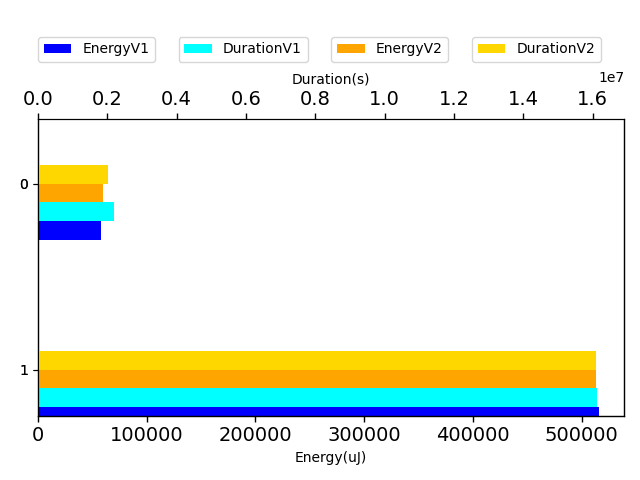

## org.apache.commons.io.FileUtilsDirectoryContainsTestCase

| Test | EnergyV1 | EnergyV2 | DeltaEnergy | DurationV1 | DurationsV2 | DeltaDuration |
| --- | --- | --- | --- | --- | --- | --- |
| org.apache.commons.io.FileUtilsDirectoryContainsTestCase-testCanonicalPath | 33521.409084573694 | 30014.706060681943 | 3506.7030238917505 | 1119031.9328131038 | 1531613.277084187 | -412581.34427108313 |
| org.apache.commons.io.FileUtilsDirectoryContainsTestCase-testDirectoryDoesNotContainsDirectory | 164085.9102356076 | 201866.89372076278 | -37780.983485155186 | 6061634.4597166125 | 7398470.7387803085 | -1336836.279063696 |
| org.apache.commons.io.FileUtilsDirectoryContainsTestCase-testDirectoryContainsFile | 36969.59955951209 | 35037.207916969506 | 1932.391642542585 | 638600.0278528613 | 924591.7274608293 | -285991.699607968 |
| org.apache.commons.io.FileUtilsDirectoryContainsTestCase-testDirectoryContainsDirectory | 32274.658769124435 | 31672.71979337353 | 601.9389757509052 | 765941.3982561334 | 1200052.4453586228 | -434111.0471024894 |
| org.apache.commons.io.FileUtilsDirectoryContainsTestCase-testDirectoryDoesNotContainFile | 34874.57757292764 | 28564.11065039084 | 6310.466922536802 | 767915.3056485254 | 1136177.7993984378 | -368262.4937499125 |

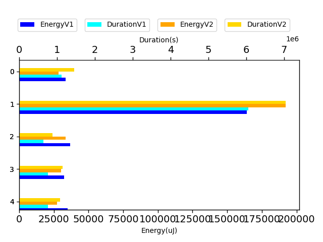

## org.apache.commons.io.IOCaseTestCase

| Test | EnergyV1 | EnergyV2 | DeltaEnergy | DurationV1 | DurationsV2 | DeltaDuration |
| --- | --- | --- | --- | --- | --- | --- |
| org.apache.commons.io.IOCaseTestCase-test_checkStartsWith_case | 462670.31201053807 | 594967.8752618986 | -132297.56325136055 | 14111896.787287321 | 17093228.33999574 | -2981331.552708421 |
| org.apache.commons.io.IOCaseTestCase-test_checkStartsWith_functionality | 31876.445110038614 | 31510.461015230034 | 365.98409480858027 | 948490.1052903421 | 730612.8767766369 | 217877.2285137052 |

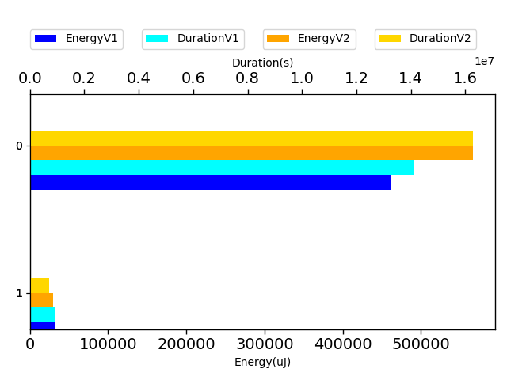

