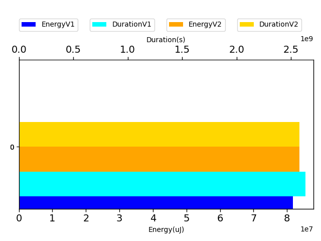
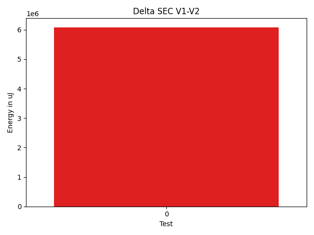
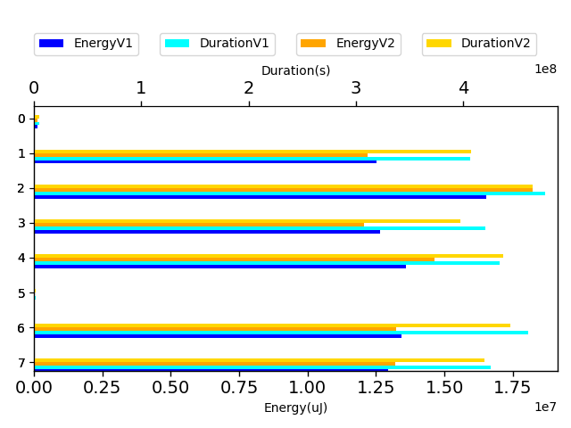

# commons-io 82b029

https://github.com/apache/commons-io/commit/82b029

| Index | EnergyV1 | EnergyV2 | DeltaEnergy |
| --- | --- | --- | --- |
| 0 | 81798448.22120596 | 87884529.77223545 | 6086081.551029488 |

| Index | DurationV1 | DurationsV2 | DeltaDuration |
| --- | --- | --- | --- |
| 0 | 2629787093.9069085 | 2705070827.7852273 | 75283733.87831879 |

| Index | TestClassName | #Tests |
| --- | --- | --- |
| 0 | org.apache.commons.io.input.ReadAheadInputStreamTest | 8 |

| Time Label | Time (s) |
| --- | --- |
| Selection | 180.98642230033875 |
| Injection | 18.1212260723114 |
| Total | 2679.017842531204 |
## org.apache.commons.io.input.ReadAheadInputStreamTest

| Test | IterationV1 | IterationV2 | DeltaIteration |
| --- | --- | --- | --- |
| org.apache.commons.io.input.ReadAheadInputStreamTest-testReadPastEOF | 99 | 99 | 0 |
| org.apache.commons.io.input.ReadAheadInputStreamTest-testBytesSkipped | 99 | 99 | 0 |
| org.apache.commons.io.input.ReadAheadInputStreamTest-testReadMultipleBytes | 99 | 99 | 0 |
| org.apache.commons.io.input.ReadAheadInputStreamTest-testBytesSkippedAfterRead | 99 | 99 | 0 |
| org.apache.commons.io.input.ReadAheadInputStreamTest-testSkipFromFileChannel | 99 | 99 | 0 |
| org.apache.commons.io.input.ReadAheadInputStreamTest-testBytesSkippedAfterEOF | 99 | 99 | 0 |
| org.apache.commons.io.input.ReadAheadInputStreamTest-testReadOneByte | 99 | 99 | 0 |
| org.apache.commons.io.input.ReadAheadInputStreamTest-testNegativeBytesSkippedAfterRead | 99 | 99 | 0 |

| Test | EnergyV1 | EnergyV2 | DeltaEnergy |
| --- | --- | --- | --- |
| org.apache.commons.io.input.ReadAheadInputStreamTest-testReadPastEOF | 121253.74395656685 | 145561.67385291104 | 24307.929896344198 |
| org.apache.commons.io.input.ReadAheadInputStreamTest-testBytesSkipped | 12530776.82462334 | 12800178.78777301 | 269401.96314966865 |
| org.apache.commons.io.input.ReadAheadInputStreamTest-testReadMultipleBytes | 16515035.658206254 | 19132019.554112345 | 2616983.8959060907 |
| org.apache.commons.io.input.ReadAheadInputStreamTest-testBytesSkippedAfterRead | 12647951.312239632 | 12669846.234672826 | 21894.922433193773 |
| org.apache.commons.io.input.ReadAheadInputStreamTest-testSkipFromFileChannel | 13586729.125073425 | 15353099.926080395 | 1766370.801006969 |
| org.apache.commons.io.input.ReadAheadInputStreamTest-testBytesSkippedAfterEOF | 30649.446121770576 | 49819.38401379207 | 19169.937892021495 |
| org.apache.commons.io.input.ReadAheadInputStreamTest-testReadOneByte | 13428024.50843744 | 13883651.557270354 | 455627.04883291386 |
| org.apache.commons.io.input.ReadAheadInputStreamTest-testNegativeBytesSkippedAfterRead | 12938027.60254754 | 13850352.654459823 | 912325.0519122835 |

| Test | DurationV1 | DurationsV2 | DeltaDuration |
| --- | --- | --- | --- |
| org.apache.commons.io.input.ReadAheadInputStreamTest-testReadPastEOF | 4739910.410950644 | 5534681.983965899 | 794771.5730152549 |
| org.apache.commons.io.input.ReadAheadInputStreamTest-testBytesSkipped | 406283181.4582666 | 427525771.78448033 | 21242590.326213717 |
| org.apache.commons.io.input.ReadAheadInputStreamTest-testReadMultipleBytes | 476625344.03889465 | 487878575.76266253 | 11253231.723767877 |
| org.apache.commons.io.input.ReadAheadInputStreamTest-testBytesSkippedAfterRead | 420338820.4858707 | 416729612.46629924 | -3609208.019571483 |
| org.apache.commons.io.input.ReadAheadInputStreamTest-testSkipFromFileChannel | 433955922.6271524 | 459057668.4321717 | 25101745.80501932 |
| org.apache.commons.io.input.ReadAheadInputStreamTest-testBytesSkippedAfterEOF | 1918983.963683553 | 1950538.5362035283 | 31554.57251997525 |
| org.apache.commons.io.input.ReadAheadInputStreamTest-testReadOneByte | 460540632.12173927 | 465988143.68071187 | 5447511.558972597 |
| org.apache.commons.io.input.ReadAheadInputStreamTest-testNegativeBytesSkippedAfterRead | 425384298.80035067 | 440405835.1387318 | 15021536.338381112 |

