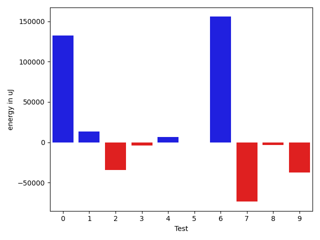
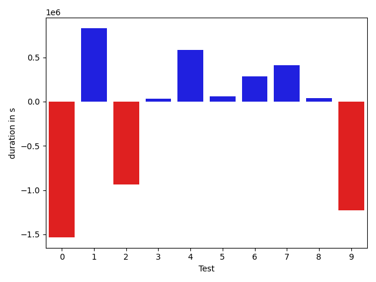
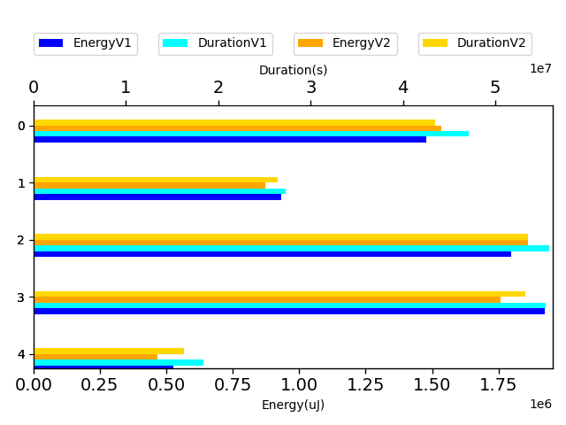
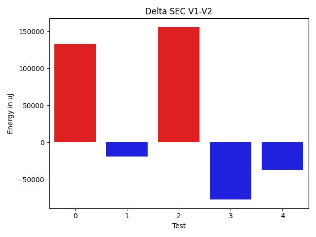

# commons-io aafc32

https://github.com/apache/commons-io/commit/aafc32

## Delta Energy per test method

| ID | EnergyV1 | EnergyV2 | DeltaEnergy |
| --- | --- | --- | --- |
| 0 | 1478202.043258743 | 1610775.6883487056 | 132573.64508996275 |
| 1 | 138790.7984380528 | 152137.83421702823 | 13347.035778975434 |
| 2 | 216094.84883777142 | 181919.63163020165 | -34175.217207569774 |
| 3 | 106924.10946228399 | 102608.64457594222 | -4315.464886341768 |
| 4 | 472121.7838488146 | 478355.5457282681 | 6233.761879453494 |
| 5 | 32784.45410073646 | 32601.586244031772 | -182.86785670468817 |
| 6 | 1765829.8996518808 | 1921522.1907136021 | 155692.29106172128 |
| 7 | 1887340.2884067404 | 1813722.9148735346 | -73617.37353320583 |
| 8 | 36536.00057481181 | 33104.65546292409 | -3431.34511188772 |
| 9 | 528102.5746007697 | 490846.2235812485 | -37256.351019521186 |

## Delta Duration per test method

| ID | DurationV1 | DurationsV2 | DeltaDuration |
| --- | --- | --- | --- |
| 0 | 47140325.25219658 | 45607233.686472334 | -1533091.5657242462 |
| 1 | 4096524.1180822984 | 4925387.653203117 | 828863.5351208183 |
| 2 | 6374218.808284234 | 5436418.831060377 | -937799.9772238573 |
| 3 | 3229773.6036299365 | 3263548.428260193 | 33774.82463025674 |
| 4 | 13588686.75757027 | 14173398.869100086 | 584712.111529816 |
| 5 | 1113932.8431485035 | 1173128.211530823 | 59195.368382319575 |
| 6 | 54743146.87279513 | 55029416.309019096 | 286269.43622396886 |
| 7 | 54390145.81901464 | 54799308.61105562 | 409162.79204098135 |
| 8 | 1053306.2020798638 | 1091378.9179443663 | 38072.71586450259 |
| 9 | 18368912.32333353 | 17138969.16271036 | -1229943.1606231704 |

## Misc.

| ID | Test Class | Test Method |
| --- | --- | --- |
| 0 | org.apache.commons.io.filefilter.DirectoryFileFilterTest | testJavadocExampleUsingNio |
| 1 | org.apache.commons.io.FileUtilsTestCase | testIterateFiles |
| 2 | org.apache.commons.io.FileUtilsTestCase | testListFiles |
| 3 | org.apache.commons.io.FileUtilsTestCase | testIterateFilesAndDirs |
| 4 | org.apache.commons.io.FileUtilsTestCase | testListFilesWithDirs |
| 5 | org.apache.commons.io.filefilter.AgeFileFilterTest | testNoCounting |
| 6 | org.apache.commons.io.filefilter.AgeFileFilterTest | testJavadocExampleUsingNio |
| 7 | org.apache.commons.io.filefilter.NameFileFilterTest | testJavadocExampleUsingNio |
| 8 | org.apache.commons.io.filefilter.NameFileFilterTest | testNoCounting |
| 9 | org.apache.commons.io.FileUtilsListFilesTestCase | testListFiles |

| Test | IterationV1 | IterationV2 | DeltaIteration |
| --- | --- | --- | --- |
| 0 | 99 | 99 | 0 |
| 1 | 99 | 99 | 0 |
| 2 | 99 | 99 | 0 |
| 3 | 99 | 99 | 0 |
| 4 | 99 | 99 | 0 |
| 5 | 83 | 68 | -15 |
| 6 | 99 | 99 | 0 |
| 7 | 99 | 99 | 0 |
| 8 | 71 | 76 | 5 |
| 9 | 99 | 99 | 0 |

| Time Label | Time (s) |
| --- | --- |
| Selection | 174.91481256484985 |
| Injection | 17.75053334236145 |
| Total | 2692.328253030777 |

| Index | EnergyV1 | EnergyV2 | DeltaEnergy |
| --- | --- | --- | --- |
| 0 | 1478202.043258743 | 1610775.6883487056 | 132573.64508996275 |
| 1 | 933931.5405869228 | 915021.6561514402 | -18909.884435482556 |
| 2 | 1798614.3537526173 | 1954123.776957634 | 155509.42320501665 |
| 3 | 1923876.2889815522 | 1846827.5703364587 | -77048.7186450935 |
| 4 | 528102.5746007697 | 490846.2235812485 | -37256.351019521186 |

| Index | DurationV1 | DurationsV2 | DeltaDuration |
| --- | --- | --- | --- |
| 0 | 47140325.25219658 | 45607233.686472334 | -1533091.5657242462 |
| 1 | 27289203.28756674 | 27798753.781623773 | 509550.4940570332 |
| 2 | 55857079.715943635 | 56202544.520549916 | 345464.8046062812 |
| 3 | 55443452.0210945 | 55890687.528999984 | 447235.50790548325 |
| 4 | 18368912.32333353 | 17138969.16271036 | -1229943.1606231704 |

| Index | TestClassName | #Tests |
| --- | --- | --- |
| 0 | org.apache.commons.io.filefilter.DirectoryFileFilterTest | 1 |
| 1 | org.apache.commons.io.FileUtilsTestCase | 4 |
| 2 | org.apache.commons.io.filefilter.AgeFileFilterTest | 2 |
| 3 | org.apache.commons.io.filefilter.NameFileFilterTest | 2 |
| 4 | org.apache.commons.io.FileUtilsListFilesTestCase | 1 |
