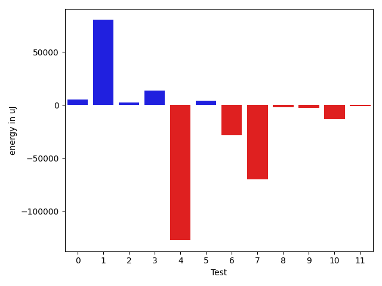
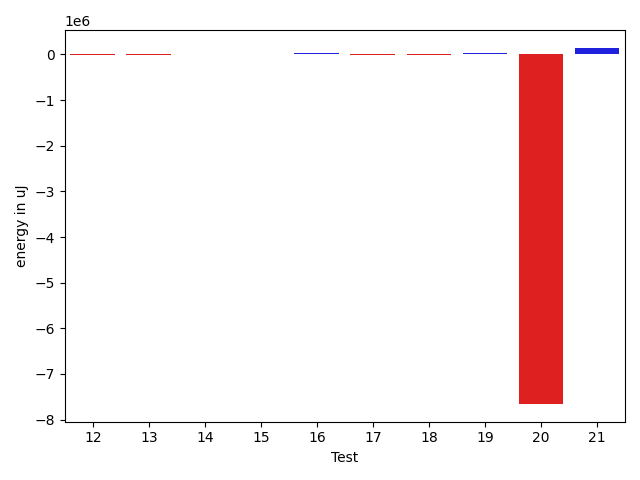
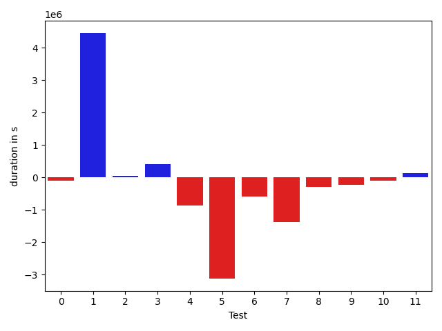
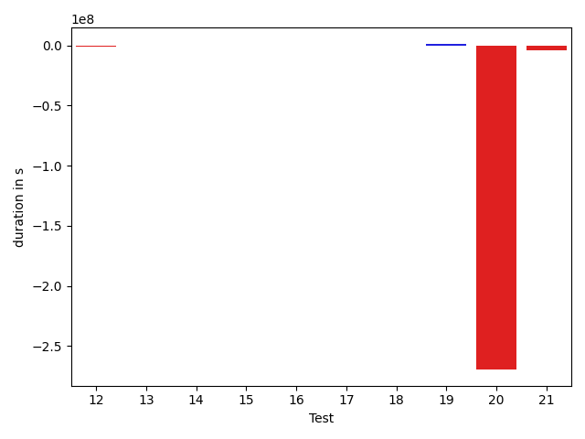
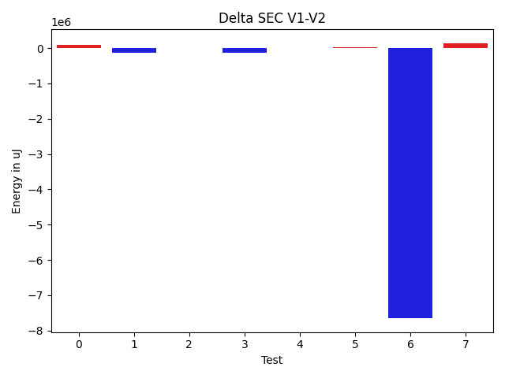

# commons-io 8ae947

https://github.com/apache/commons-io/commit/8ae947

## Delta Energy per test method

| ID | EnergyV1 | EnergyV2 | DeltaEnergy |
| --- | --- | --- | --- |
| 0 | 58753.095607483 | 63769.46888382842 | 5016.373276345417 |
| 1 | 789239.8704386402 | 869461.347569999 | 80221.47713135881 |
| 2 | 77733.25026506867 | 80006.44308805716 | 2273.1928229884943 |
| 3 | 68098.28684200702 | 81947.47351039897 | 13849.18666839195 |
| 4 | 680333.6554852668 | 553052.7449840959 | -127280.9105011709 |
| 5 | 617392.2468906936 | 621655.3791398075 | 4263.132249113987 |
| 6 | 112728.40764928047 | 84377.7140470485 | -28350.69360223197 |
| 7 | 414102.76319004584 | 344120.4281374963 | -69982.33505254955 |
| 8 | 36722.816614757205 | 34982.652663923815 | -1740.1639508333901 |
| 9 | 38873.56892710138 | 36402.47026622041 | -2471.0986608809762 |
| 10 | 274448.98676744406 | 261309.75437138564 | -13139.232396058418 |
| 11 | 40239.904454733 | 39310.14569867301 | -929.7587560599859 |
| 12 | 241211.2055544424 | 226325.94024597196 | -14885.265308470436 |
| 13 | 40771.76801660817 | 37483.109099739166 | -3288.6589168690043 |
| 14 | 56899.20928271371 | 54986.10150451002 | -1913.1077782036882 |
| 15 | 35057.92217783495 | 35065.0054096267 | 7.083231791744765 |
| 16 | 246759.10412088135 | 277581.1145449161 | 30822.01042403473 |
| 17 | 79639.03690188305 | 65532.363626916056 | -14106.673274966997 |
| 18 | 484031.4997149602 | 477051.0056940848 | -6980.494020875427 |
| 19 | 6969212.130210134 | 6995408.161440964 | 26196.031230829656 |
| 20 | 18272140.150146745 | 10616591.112064661 | -7655549.038082084 |
| 21 | 6984719.822459599 | 7125686.290798358 | 140966.46833875868 |

## Delta Duration per test method

| ID | DurationV1 | DurationsV2 | DeltaDuration |
| --- | --- | --- | --- |
| 0 | 2561376.232963763 | 2466242.840494871 | -95133.39246889204 |
| 1 | 26411106.21805748 | 30863325.18497301 | 4452218.966915529 |
| 2 | 3142768.0017955047 | 3196655.093989988 | 53887.09219448315 |
| 3 | 2821838.9626089004 | 3233622.4546216484 | 411783.492012748 |
| 4 | 19825437.12160531 | 18957263.12176095 | -868173.9998443611 |
| 5 | 24194439.842617948 | 21073393.412022356 | -3121046.4305955917 |
| 6 | 3492472.487059836 | 2891376.751801093 | -601095.7352587427 |
| 7 | 11133299.808340639 | 9754776.321036708 | -1378523.4873039313 |
| 8 | 1046991.6745947524 | 745503.8858785073 | -301487.7887162451 |
| 9 | 1257196.2481262612 | 1023261.7747935597 | -233934.47333270148 |
| 10 | 7052492.649105699 | 6951254.34934257 | -101238.2997631291 |
| 11 | 913651.8223445385 | 1041378.4800523263 | 127726.65770778782 |
| 12 | 6848312.622000558 | 6155528.932823666 | -692783.6891768919 |
| 13 | 1036240.3397962234 | 789787.0619924413 | -246453.27780378214 |
| 14 | 1483174.4534104879 | 1472671.1490425067 | -10503.304367981153 |
| 15 | 994038.2453913454 | 1019223.1509885115 | 25184.90559716616 |
| 16 | 10400831.400092177 | 10534355.723674387 | 133524.32358220965 |
| 17 | 2829749.8407181487 | 2764171.058394637 | -65578.78232351178 |
| 18 | 15628747.128138065 | 15846480.986972226 | 217733.8588341605 |
| 19 | 532935350.8319085 | 534326109.1227176 | 1390758.290809095 |
| 20 | 1141808196.3657005 | 872309374.1574292 | -269498822.20827127 |
| 21 | 536963094.8691577 | 532973723.7827536 | -3989371.086404085 |

## Misc.

| ID | Test Class | Test Method |
| --- | --- | --- |
| 0 | org.apache.commons.io.FileUtilsCleanSymlinksTestCase | testStillClearsIfGivenDirectoryIsASymlink |
| 1 | org.apache.commons.io.FileUtilsCleanSymlinksTestCase | testCleanDirWithParentSymlinks |
| 2 | org.apache.commons.io.FileUtilsCleanSymlinksTestCase | testCleanDirWithSymlinkFile |
| 3 | org.apache.commons.io.FileUtilsCleanSymlinksTestCase | testCleanDirWithASymlinkDir |
| 4 | org.apache.commons.io.FileDeleteStrategyTestCase | testDeleteForce |
| 5 | org.apache.commons.io.filefilter.FileFilterTestCase | testEmpty |
| 6 | org.apache.commons.io.FileUtilsTestCase | testCopyDirectoryToDirectory_NonExistingDest |
| 7 | org.apache.commons.io.FileUtilsTestCase | testCopyDirectoryToNonExistingDest |
| 8 | org.apache.commons.io.FileUtilsTestCase | testForceDeleteAFile2 |
| 9 | org.apache.commons.io.FileUtilsTestCase | testForceDeleteAFile3 |
| 10 | org.apache.commons.io.FileUtilsTestCase | testCopyDirectoryPreserveDates |
| 11 | org.apache.commons.io.FileUtilsTestCase | testForceDeleteDir |
| 12 | org.apache.commons.io.FileUtilsTestCase | testForceDeleteReadOnlyFile |
| 13 | org.apache.commons.io.FileUtilsTestCase | testDeleteQuietlyDir |
| 14 | org.apache.commons.io.FileUtilsTestCase | testMoveDirectory_CopyDelete |
| 15 | org.apache.commons.io.FileUtilsTestCase | testForceDeleteAFile1 |
| 16 | org.apache.commons.io.FileUtilsCleanDirectoryTestCase | testThrowsOnCannotDeleteFile |
| 17 | org.apache.commons.io.FileUtilsCleanDirectoryTestCase | testDeletesNested |
| 18 | org.apache.commons.io.FileUtilsCleanDirectoryTestCase | testDeletesRegular |
| 19 | org.apache.commons.io.FileCleaningTrackerTestCase | testFileCleanerDirectory_ForceStrategy |
| 20 | org.apache.commons.io.monitor.FileAlterationObserverTestCase | testDirectory |
| 21 | org.apache.commons.io.FileCleanerTestCase | testFileCleanerDirectory_ForceStrategy |

| Test | IterationV1 | IterationV2 | DeltaIteration |
| --- | --- | --- | --- |
| 0 | 99 | 99 | 0 |
| 1 | 99 | 99 | 0 |
| 2 | 99 | 99 | 0 |
| 3 | 99 | 99 | 0 |
| 4 | 99 | 99 | 0 |
| 5 | 99 | 99 | 0 |
| 6 | 99 | 99 | 0 |
| 7 | 99 | 99 | 0 |
| 8 | 40 | 50 | 10 |
| 9 | 79 | 65 | -14 |
| 10 | 99 | 99 | 0 |
| 11 | 60 | 76 | 16 |
| 12 | 99 | 99 | 0 |
| 13 | 47 | 61 | 14 |
| 14 | 99 | 99 | 0 |
| 15 | 49 | 43 | -6 |
| 16 | 99 | 99 | 0 |
| 17 | 99 | 99 | 0 |
| 18 | 99 | 99 | 0 |
| 19 | 99 | 99 | 0 |
| 20 | 99 | 99 | 0 |
| 21 | 99 | 99 | 0 |

| Time Label | Time (s) |
| --- | --- |
| Selection | 181.181147813797 |
| Injection | 18.35735845565796 |
| Total | 3536.1573956012726 |

## Aggregation per test class

| Index | EnergyV1 | EnergyV2 | DeltaEnergy |
| --- | --- | --- | --- |
| 0 | 993824.5031531989 | 1095184.7330522835 | 101360.22989908466 |
| 1 | 680333.6554852668 | 553052.7449840959 | -127280.9105011709 |
| 2 | 617392.2468906936 | 621655.3791398075 | 4263.132249113987 |
| 3 | 1291056.5526349612 | 1154363.3214445957 | -136693.2311903655 |
| 4 | 810429.6407377246 | 820164.483865917 | 9734.843128192355 |
| 5 | 6969212.130210134 | 6995408.161440964 | 26196.031230829656 |
| 6 | 18272140.150146745 | 10616591.112064661 | -7655549.038082084 |
| 7 | 6984719.822459599 | 7125686.290798358 | 140966.46833875868 |

| Index | DurationV1 | DurationsV2 | DeltaDuration |
| --- | --- | --- | --- |
| 0 | 34937089.41542565 | 39759845.57407952 | 4822756.15865387 |
| 1 | 19825437.12160531 | 18957263.12176095 | -868173.9998443611 |
| 2 | 24194439.842617948 | 21073393.412022356 | -3121046.4305955917 |
| 3 | 35257870.350170344 | 31844761.857751887 | -3413108.492418457 |
| 4 | 28859328.368948393 | 29145007.769041248 | 285679.4000928551 |
| 5 | 532935350.8319085 | 534326109.1227176 | 1390758.290809095 |
| 6 | 1141808196.3657005 | 872309374.1574292 | -269498822.20827127 |
| 7 | 536963094.8691577 | 532973723.7827536 | -3989371.086404085 |
| Index | TestClassName | #Tests |
| --- | --- | --- |
| 0 | org.apache.commons.io.FileUtilsCleanSymlinksTestCase | 4 |
| 1 | org.apache.commons.io.FileDeleteStrategyTestCase | 1 |
| 2 | org.apache.commons.io.filefilter.FileFilterTestCase | 1 |
| 3 | org.apache.commons.io.FileUtilsTestCase | 10 |
| 4 | org.apache.commons.io.FileUtilsCleanDirectoryTestCase | 3 |
| 5 | org.apache.commons.io.FileCleaningTrackerTestCase | 1 |
| 6 | org.apache.commons.io.monitor.FileAlterationObserverTestCase | 1 |
| 7 | org.apache.commons.io.FileCleanerTestCase | 1 |
