# gson b1fb9c

https://github.com/google/gson.git/commit/b1fb9c

## Delta Energy per test method

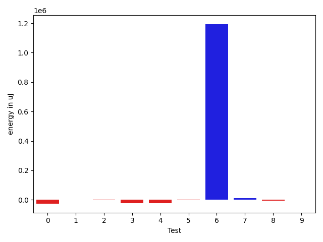

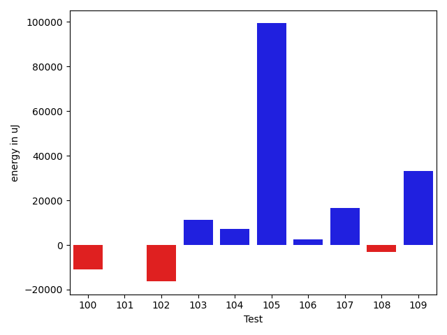

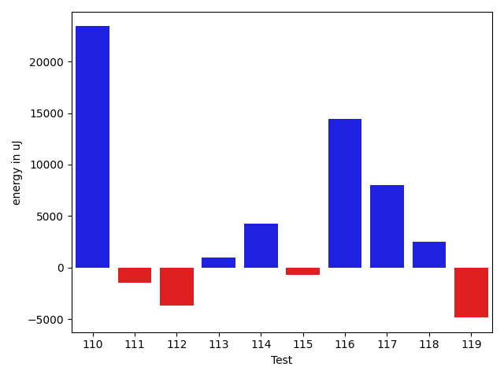

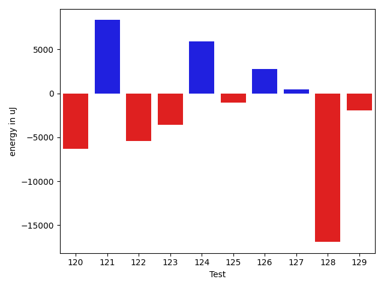

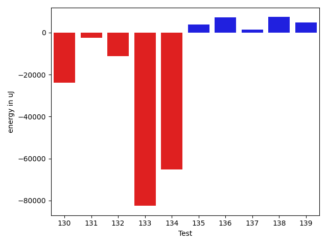

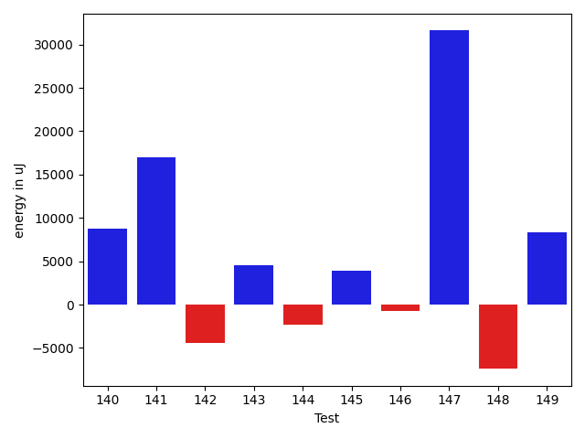

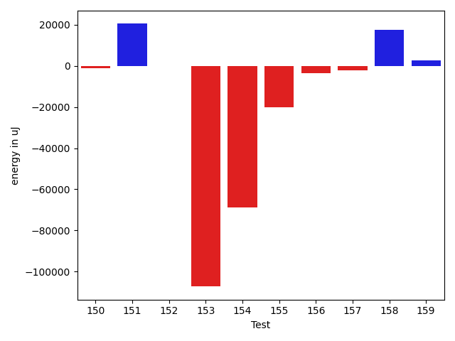

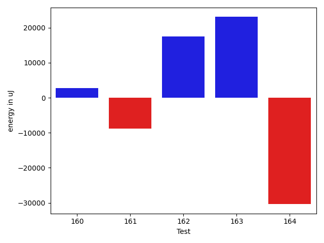

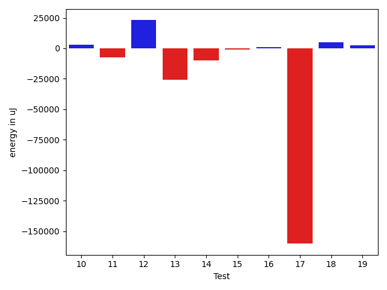

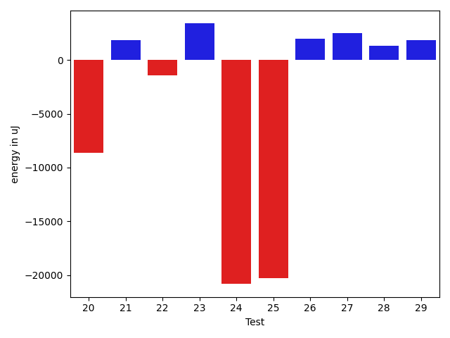

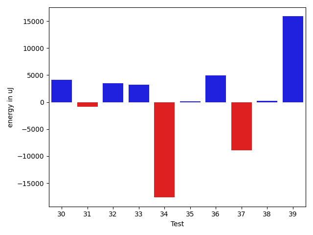

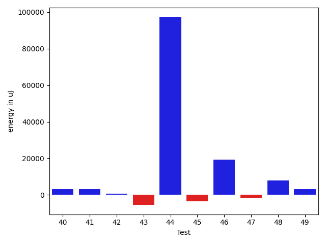

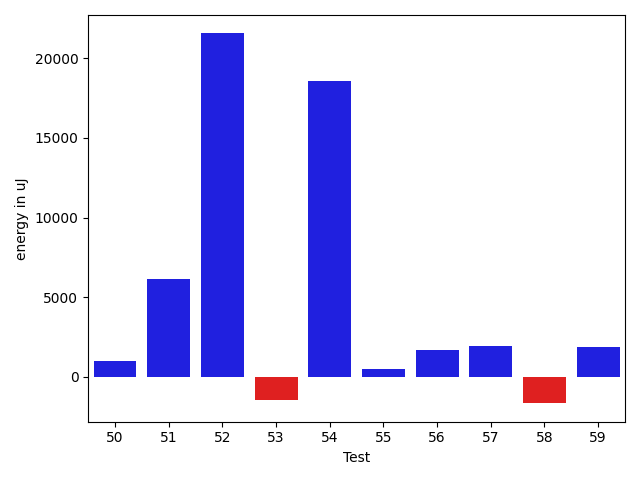

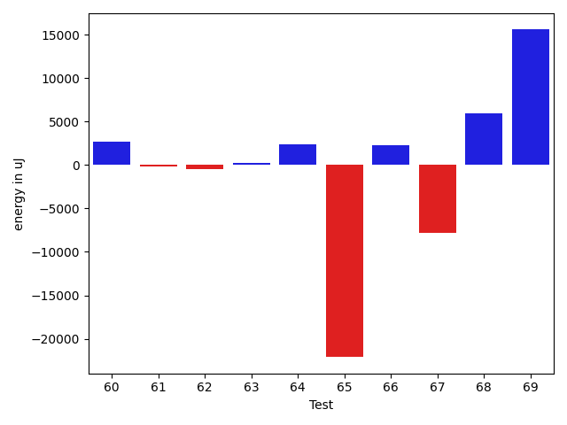

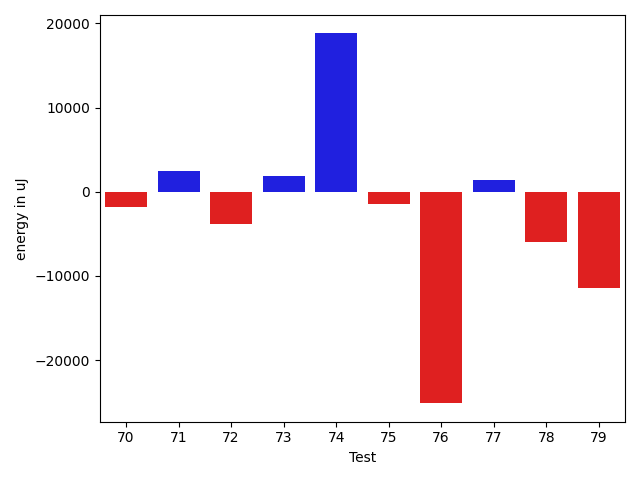

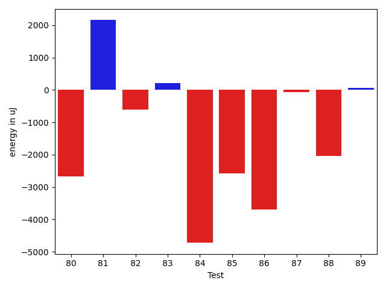

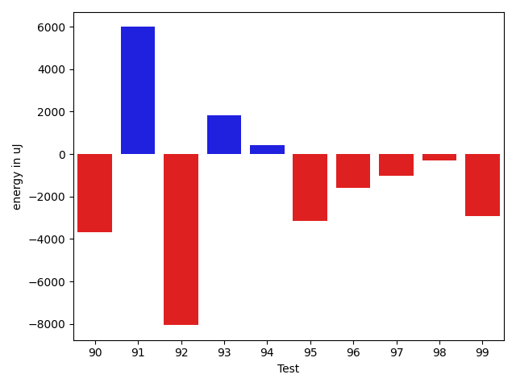

| ID | EnergyV1 | EnergyV2 | DeltaEnergy |
| --- | --- | --- | --- |
| 0 | 69877.65286445181 | 43871.915810635765 | -26005.737053816047 |
| 1 | 68219.47779323481 | 68442.35419497108 | 222.87640173627005 |
| 2 | 46323.58460636626 | 43370.94179584263 | -2952.6428105236337 |
| 3 | 76320.25218588323 | 54611.645444455804 | -21708.60674142743 |
| 4 | 79566.56806563413 | 55876.19287605531 | -23690.375189578815 |
| 5 | 42495.864187603154 | 40400.30126786065 | -2095.562919742508 |
| 6 | 132503.63629305825 | 1326067.0884737147 | 1193563.4521806564 |
| 7 | 71678.2106660527 | 84413.5914836784 | 12735.3808176257 |
| 8 | 44766.11748874653 | 40633.6241941223 | -4132.493294624233 |
| 9 | 44789.72734964211 | 45327.121258802144 | 537.3939091600332 |
| 10 | 40994.543187268035 | 43928.81527673051 | 2934.2720894624726 |
| 11 | 49864.95897489885 | 42387.273204394616 | -7477.685770504235 |
| 12 | 41786.522365908895 | 64837.52267569704 | 23051.00030978814 |
| 13 | 71076.46197868635 | 45502.89302064406 | -25573.56895804229 |
| 14 | 54004.262052908496 | 44235.953843874464 | -9768.308209034032 |
| 15 | 44592.05193921814 | 43740.72328509863 | -851.3286541195048 |
| 16 | 43542.04695135365 | 44370.41628173425 | 828.3693303805994 |
| 17 | 218907.03229867434 | 58701.055710557106 | -160205.97658811725 |
| 18 | 42246.17678029045 | 47326.52729204735 | 5080.3505117569 |
| 19 | 41868.21019151213 | 44421.750944762476 | 2553.540753250345 |
| 20 | 65391.782865448185 | 56758.9674258144 | -8632.815439633785 |
| 21 | 43486.82367271744 | 45327.17420768738 | 1840.3505349699408 |
| 22 | 46037.8546110822 | 44583.68987490412 | -1454.1647361780779 |
| 23 | 45067.98734954934 | 48449.04693278617 | 3381.0595832368344 |
| 24 | 72218.59487325192 | 51398.366916030776 | -20820.22795722114 |
| 25 | 66021.97360213843 | 45764.19364133569 | -20257.77996080274 |
| 26 | 42662.45750115687 | 44630.77883681616 | 1968.3213356592896 |
| 27 | 44725.50500550249 | 47236.29770311393 | 2510.7926976114395 |
| 28 | 44772.67580918626 | 46100.11099128999 | 1327.4351821037344 |
| 29 | 44188.55788755417 | 46044.326171875 | 1855.7682843208313 |
| 30 | 41942.15982114941 | 46075.90829229421 | 4133.748471144798 |
| 31 | 46292.21317086283 | 45422.08017578311 | -870.1329950797226 |
| 32 | 42638.59323426774 | 46100.787668945544 | 3462.1944346778037 |
| 33 | 42032.25935251507 | 45269.189265658846 | 3236.929913143773 |
| 34 | 62918.73767061229 | 45272.389177158344 | -17646.348493453945 |
| 35 | 45211.89905154645 | 45364.11612319063 | 152.2170716441833 |
| 36 | 42872.43015935215 | 47818.17556036516 | 4945.7454010130095 |
| 37 | 64571.54297498275 | 55629.187872394315 | -8942.355102588437 |
| 38 | 45536.301785936215 | 45758.368217989715 | 222.06643205349974 |
| 39 | 88806.7242291905 | 104679.81960107354 | 15873.095371883042 |
| 40 | 40746.81744414217 | 43856.578202630306 | 3109.7607584881334 |
| 41 | 46497.73970600724 | 49652.75068207006 | 3155.0109760628184 |
| 42 | 42946.4561865751 | 43581.16022023833 | 634.7040336632272 |
| 43 | 46020.052996701175 | 40491.33614762722 | -5528.716849073957 |
| 44 | 91663.21957105407 | 188989.85071597082 | 97326.63114491676 |
| 45 | 45553.55343872067 | 42110.50543125598 | -3443.048007464691 |
| 46 | 44864.04876776937 | 64237.53884390048 | 19373.490076131115 |
| 47 | 44596.0038247196 | 42871.7279500233 | -1724.275874696301 |
| 48 | 45268.8806896836 | 53038.34591396272 | 7769.46522427912 |
| 49 | 318505.0039190138 | 321690.1870816059 | 3185.1831625921186 |
| 50 | 46623.22179721334 | 47596.15934136329 | 972.9375441499506 |
| 51 | 39060.248550421464 | 45191.5407825247 | 6131.292232103238 |
| 52 | 44892.514667479896 | 66458.66902094912 | 21566.154353469225 |
| 53 | 43875.536109817316 | 42418.82727057542 | -1456.7088392418955 |
| 54 | 51417.47482130979 | 69969.43513040595 | 18551.96030909616 |
| 55 | 42360.023671822666 | 42825.99564278819 | 465.97197096552554 |
| 56 | 42756.05438831342 | 44422.701636589845 | 1666.647248276422 |
| 57 | 42339.3093593715 | 44234.30628172698 | 1894.99692235548 |
| 58 | 45478.83003852171 | 43807.88295132955 | -1670.9470871921585 |
| 59 | 47708.56695075776 | 49549.15092234325 | 1840.583971585489 |
| 60 | 39784.91520839009 | 42436.26009640502 | 2651.34488801493 |
| 61 | 39805.56062151833 | 39610.955805334925 | -194.60481618340418 |
| 62 | 44139.14676393308 | 43627.65468107497 | -511.4920828581089 |
| 63 | 41474.91310186684 | 41682.791089622304 | 207.87798775546253 |
| 64 | 42437.13773535501 | 44786.58260494357 | 2349.4448695885585 |
| 65 | 62838.219181408014 | 40742.03196223573 | -22096.187219172287 |
| 66 | 44091.99769337483 | 46349.91923324598 | 2257.921539871146 |
| 67 | 66059.39242950428 | 58243.17668004483 | -7816.21574945945 |
| 68 | 43575.17000695258 | 49526.62577750081 | 5951.455770548229 |
| 69 | 58027.410118261854 | 73598.49929565714 | 15571.089177395283 |
| 70 | 43857.10905952191 | 42062.717704590825 | -1794.3913549310819 |
| 71 | 42822.28784541691 | 45309.98718834022 | 2487.6993429233116 |
| 72 | 46972.02710675665 | 43110.03479287858 | -3861.9923138780723 |
| 73 | 43411.69587887036 | 45294.80272464703 | 1883.106845776667 |
| 74 | 48180.829262321335 | 66974.35960832503 | 18793.530346003696 |
| 75 | 44842.891215532836 | 43345.77959730315 | -1497.1116182296828 |
| 76 | 75938.90639268034 | 50811.85314940216 | -25127.053243278177 |
| 77 | 42568.12514610251 | 43940.390072809045 | 1372.2649267065353 |
| 78 | 45461.13901957602 | 39451.9441180824 | -6009.194901493618 |
| 79 | 171502.75759614335 | 160012.7496421768 | -11490.00795396656 |
| 80 | 41482.131826148165 | 38816.93171275937 | -2665.200113388797 |
| 81 | 39604.27474921408 | 41759.00938383653 | 2154.7346346224513 |
| 82 | 44344.47804894722 | 43732.54131130244 | -611.9367376447772 |
| 83 | 44349.12202638658 | 44562.67318702633 | 213.55116063974856 |
| 84 | 45520.923092202866 | 40795.991767095795 | -4724.931325107071 |
| 85 | 44246.100258900275 | 41663.756152133195 | -2582.344106767079 |
| 86 | 44973.29140574951 | 41267.01267036504 | -3706.2787353844687 |
| 87 | 42501.80282958652 | 42437.70725907241 | -64.09557051410957 |
| 88 | 43602.83268038556 | 41557.85546821356 | -2044.9772121720016 |
| 89 | 43642.530688993385 | 43708.93613235434 | 66.40544336095627 |
| 90 | 45147.46006442736 | 41454.675723669934 | -3692.7843407574255 |
| 91 | 41033.91975402832 | 47020.26556998491 | 5986.345815956593 |
| 92 | 45755.725108104394 | 37695.46607392079 | -8060.259034183604 |
| 93 | 42360.079749570185 | 44200.760279046764 | 1840.68052947658 |
| 94 | 42143.004096466466 | 42551.74028692068 | 408.7361904542122 |
| 95 | 43764.48695145012 | 40600.918409347534 | -3163.5685421025846 |
| 96 | 42866.910315549554 | 41288.6186597922 | -1578.2916557573553 |
| 97 | 43492.973576419055 | 42482.17417907715 | -1010.799397341907 |
| 98 | 45042.531005859375 | 44728.262410759926 | -314.26859509944916 |
| 99 | 46046.57891504151 | 43124.91027256493 | -2921.6686424765794 |
| 100 | 54608.245455044125 | 43534.613065115314 | -11073.63238992881 |
| 101 | 40948.24380191155 | 40835.62568734138 | -112.61811457017029 |
| 102 | 61023.56131591321 | 44678.91719843526 | -16344.644117477954 |
| 103 | 131004.95397920434 | 142131.144556497 | 11126.190577292655 |
| 104 | 183104.86725734064 | 190175.08647742486 | 7070.2192200842255 |
| 105 | 167283.35472266137 | 266652.72262203356 | 99369.36789937218 |
| 106 | 41295.89941448357 | 43687.56345453713 | 2391.6640400535616 |
| 107 | 86731.90054042463 | 103316.06148738414 | 16584.160946959513 |
| 108 | 43721.44514770243 | 40511.51937652773 | -3209.9257711746977 |
| 109 | 44402.54420198988 | 77437.44171816827 | 33034.89751617839 |
| 110 | 44208.95377563316 | 67628.11530509053 | 23419.161529457364 |
| 111 | 44320.259926070496 | 42843.73845008961 | -1476.5214759808878 |
| 112 | 47343.00532274253 | 43611.21468822035 | -3731.790634522178 |
| 113 | 42831.07142783474 | 43830.363990942715 | 999.2925631079779 |
| 114 | 44200.746816300205 | 48454.89260347311 | 4254.145787172907 |
| 115 | 44609.36195568414 | 43916.55970028323 | -692.8022554009076 |
| 116 | 79931.0872336491 | 94367.58013448973 | 14436.492900840633 |
| 117 | 46447.92105649371 | 54480.956365473874 | 8033.035308980165 |
| 118 | 43361.50733116492 | 45828.992521734275 | 2467.4851905693577 |
| 119 | 46443.35811028952 | 41580.27884716766 | -4863.079263121857 |
| 120 | 44211.83643865585 | 37888.94802921824 | -6322.888409437612 |
| 121 | 46050.38733432232 | 54394.859058273425 | 8344.471723951108 |
| 122 | 44690.64093818785 | 39237.29564345088 | -5453.345294736966 |
| 123 | 59509.06070837387 | 55936.647480609376 | -3572.4132277644967 |
| 124 | 44576.263170801205 | 50501.514217971315 | 5925.25104717011 |
| 125 | 42685.99455774197 | 41607.36053032486 | -1078.6340274171089 |
| 126 | 38790.60911641212 | 41550.990470239485 | 2760.381353827368 |
| 127 | 45521.48716626324 | 46003.941555758036 | 482.45438949479285 |
| 128 | 59845.788862441084 | 42933.44195902329 | -16912.346903417798 |
| 129 | 239252.7718200778 | 237315.31970399592 | -1937.4521160818695 |
| 130 | 794417.9345993259 | 770505.9169157406 | -23912.01768358529 |
| 131 | 45401.10593519473 | 42864.46713558051 | -2536.638799614222 |
| 132 | 53611.33057824765 | 42502.75523548044 | -11108.57534276721 |
| 133 | 194347.4360405384 | 111844.50329288386 | -82502.93274765453 |
| 134 | 132820.95790511565 | 67719.21440983433 | -65101.74349528132 |
| 135 | 35901.3513218927 | 39656.26731249648 | 3754.915990603782 |
| 136 | 44776.7624331573 | 52016.17725050652 | 7239.414817349214 |
| 137 | 42408.02658029077 | 43839.977718357615 | 1431.9511380668482 |
| 138 | 38237.92812054198 | 45612.32463354275 | 7374.396513000764 |
| 139 | 43169.59760433843 | 47920.67968131602 | 4751.082076977589 |
| 140 | 36431.04048140919 | 45157.329044009384 | 8726.288562600195 |
| 141 | 69013.77704302293 | 85979.63978876747 | 16965.86274574454 |
| 142 | 44696.674049872665 | 40294.03108737485 | -4402.642962497812 |
| 143 | 46035.79588085734 | 50558.49639672234 | 4522.700515864999 |
| 144 | 42627.704291820526 | 40281.6542073274 | -2346.050084493123 |
| 145 | 45095.94727877742 | 49021.977166336204 | 3926.0298875587832 |
| 146 | 41656.28307774663 | 40926.66244149208 | -729.620636254549 |
| 147 | 41366.02934896221 | 72973.90379949546 | 31607.874450533243 |
| 148 | 136174.79985673045 | 128767.63387350459 | -7407.165983225859 |
| 149 | 44781.20542294935 | 53102.97258070281 | 8321.767157753457 |
| 150 | 48046.512145061075 | 46924.769795298576 | -1121.7423497624986 |
| 151 | 39080.7818441065 | 59567.587142996956 | 20486.805298890453 |
| 152 | 45886.538339345956 | 45746.17085061663 | -140.36748872932367 |
| 153 | 174056.4113927771 | 66795.72319563742 | -107260.6881971397 |
| 154 | 280059.64627486584 | 211300.32462211052 | -68759.32165275532 |
| 155 | 80553.4838936344 | 60310.70529196855 | -20242.77860166585 |
| 156 | 49978.879537132576 | 46333.19932517234 | -3645.680211960236 |
| 157 | 40871.647889614105 | 38881.2494392395 | -1990.3984503746033 |
| 158 | 42762.02381553319 | 60449.57974690372 | 17687.55593137053 |
| 159 | 47707.159457344475 | 50411.81829586842 | 2704.6588385239447 |
| 160 | 42781.98979813286 | 45601.1108180679 | 2819.121019935039 |
| 161 | 55009.67838946771 | 46223.87149231275 | -8785.806897154958 |
| 162 | 46364.269881216824 | 63789.23386870627 | 17424.96398748945 |
| 163 | 45340.14769327469 | 68396.60909621444 | 23056.46140293975 |
| 164 | 77069.98780177362 | 46686.85014524682 | -30383.1376565268 |

## Delta Duration per test method

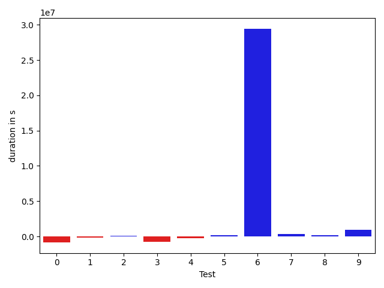

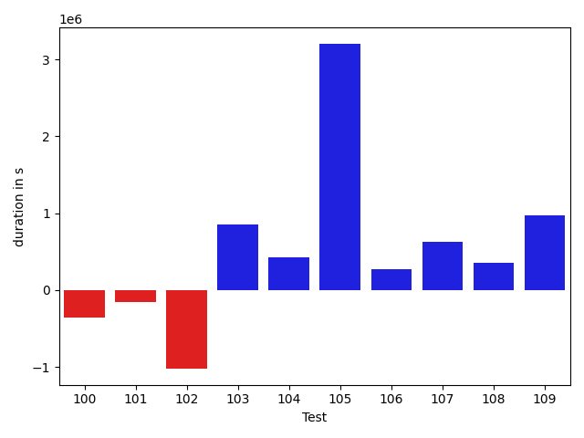

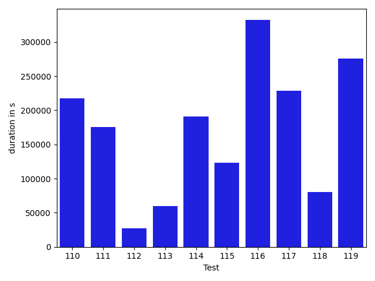

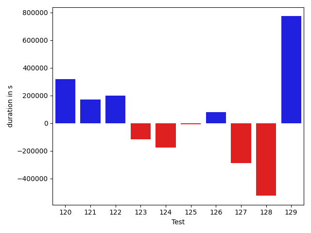

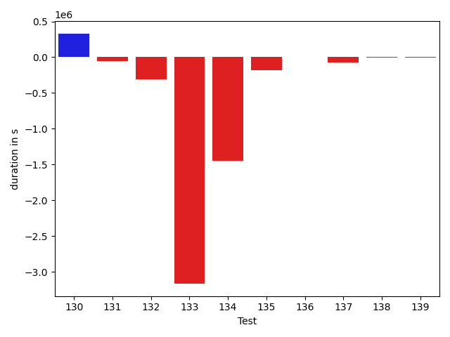

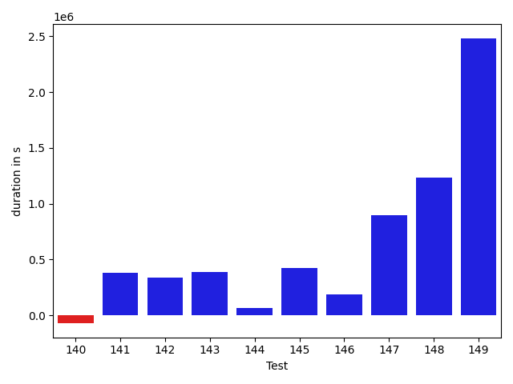

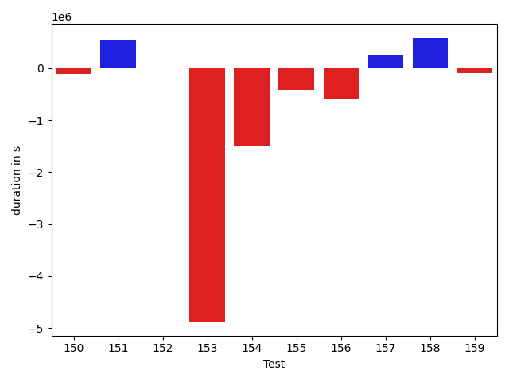

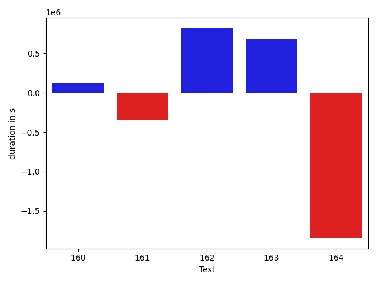

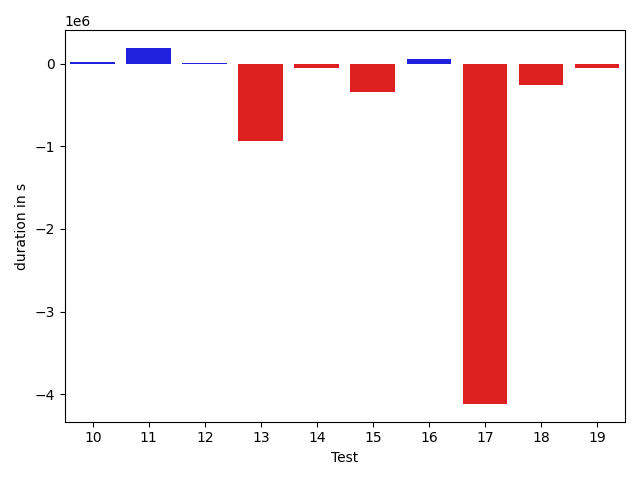

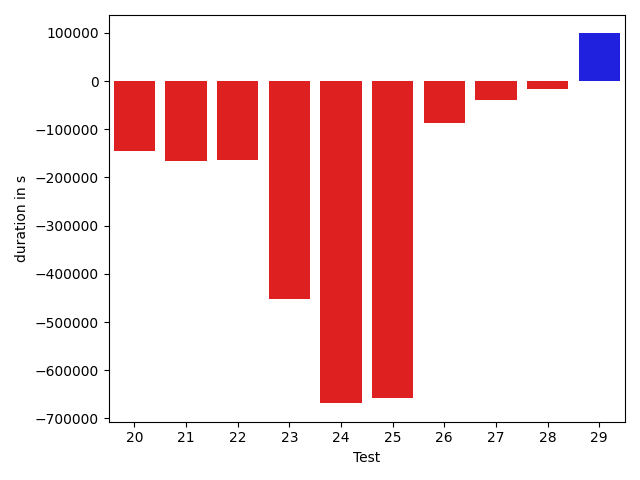

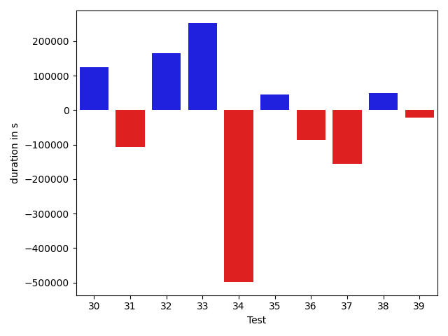

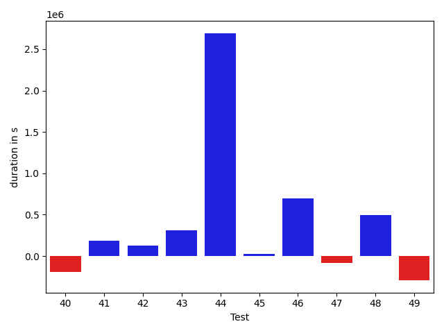

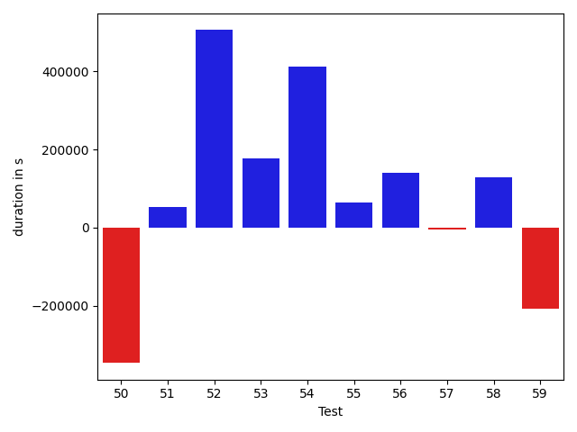

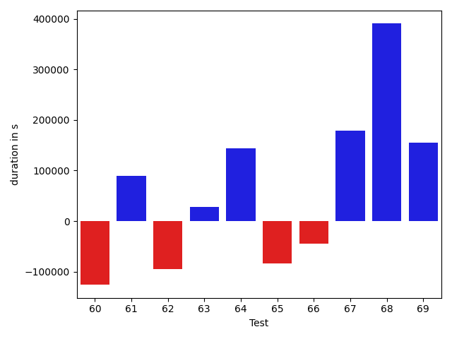

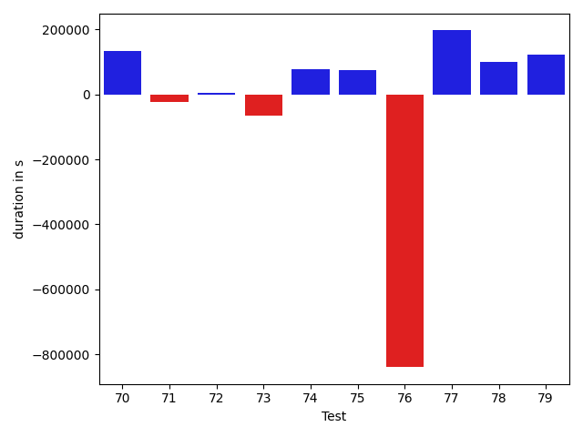

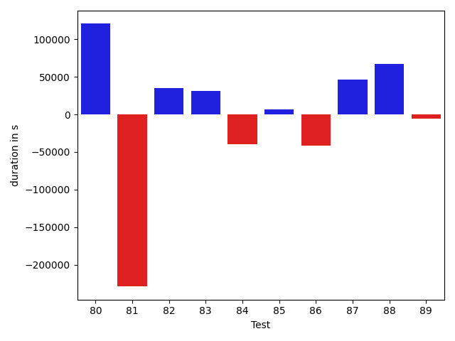

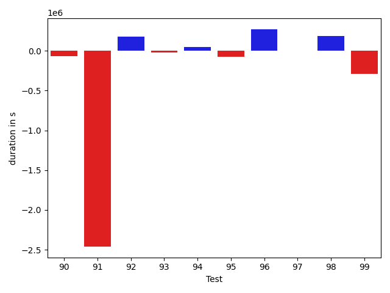

| ID | DurationV1 | DurationsV2 | DeltaDuration |
| --- | --- | --- | --- |
| 0 | 2003027.9470174087 | 1162577.7748737668 | -840450.1721436419 |
| 1 | 1785827.5753733986 | 1577730.2599452976 | -208097.315428101 |
| 2 | 665756.5080334585 | 729359.143733084 | 63602.635699625476 |
| 3 | 2295972.512145062 | 1533012.090185836 | -762960.421959226 |
| 4 | 1813397.575019025 | 1538914.5723146098 | -274483.00270441524 |
| 5 | 703449.7872724445 | 887122.1953148053 | 183672.4080423608 |
| 6 | 3508845.010331165 | 32937093.808080867 | 29428248.797749702 |
| 7 | 1907071.2395969436 | 2262618.5730902413 | 355547.3334932977 |
| 8 | 555888.6150074403 | 751585.7518180539 | 195697.13681061356 |
| 9 | 448834.5443050792 | 1415081.026661504 | 966246.4823564249 |
| 10 | 806850.0725459501 | 826480.6191702368 | 19630.546624286682 |
| 11 | 565789.1344374112 | 754282.236404831 | 188493.10196741985 |
| 12 | 1366610.6872798784 | 1369536.860455383 | 2926.173175504664 |
| 13 | 1637394.0435175141 | 696787.9769444 | -940606.0665731141 |
| 14 | 1271689.094869567 | 1220983.7590668888 | -50705.33580267825 |
| 15 | 1114213.237581867 | 774945.9882067018 | -339267.2493751652 |
| 16 | 639784.7746665796 | 691585.8749219468 | 51801.10025536723 |
| 17 | 5242291.145229827 | 1125025.7298126335 | -4117265.4154171934 |
| 18 | 1062680.1660018847 | 802025.5069127062 | -260654.65908917855 |
| 19 | 644137.3434262874 | 595371.5511575156 | -48765.792268771795 |
| 20 | 1261332.154892059 | 1116987.4844980843 | -144344.67039397475 |
| 21 | 601697.2839578949 | 435705.86088752747 | -165991.42307036743 |
| 22 | 822404.642717978 | 658315.3540933966 | -164089.28862458142 |
| 23 | 1307629.0046783898 | 856061.0346447269 | -451567.97003366286 |
| 24 | 1840513.6543515888 | 1172101.0398798408 | -668412.614471748 |
| 25 | 1440443.9713071547 | 782692.3713259201 | -657751.5999812346 |
| 26 | 736999.5037071808 | 650055.4226310644 | -86944.08107611642 |
| 27 | 660678.8127581603 | 622292.0338767201 | -38386.77888144017 |
| 28 | 871377.2829783831 | 854224.5029651965 | -17152.780013186624 |
| 29 | 339557.292570591 | 438270.94140625 | 98713.64883565903 |
| 30 | 696196.0684637718 | 820648.8257701283 | 124452.75730635645 |
| 31 | 724180.934702998 | 617993.687580714 | -106187.24712228402 |
| 32 | 716691.2179760992 | 881220.5844499519 | 164529.36647385266 |
| 33 | 614566.1760197463 | 865826.4830954447 | 251260.3070756984 |
| 34 | 1142691.193482102 | 643672.4376742757 | -499018.7558078262 |
| 35 | 607777.9770959641 | 652097.288833967 | 44319.31173800281 |
| 36 | 769323.0333113074 | 682237.8428688144 | -87085.19044249307 |
| 37 | 1586272.7571216417 | 1431276.9570752818 | -154995.8000463599 |
| 38 | 926412.2527909409 | 975651.9612720434 | 49239.70848110248 |
| 39 | 2420484.124910157 | 2398125.6597428536 | -22358.46516730357 |
| 40 | 1097008.5529674594 | 904308.4987843586 | -192700.05418310082 |
| 41 | 1004419.3785704875 | 1188152.7033014384 | 183733.32473095087 |
| 42 | 1167949.1239123633 | 1298522.9649042606 | 130573.84099189728 |
| 43 | 1015024.5507266377 | 1322591.995662171 | 307567.4449355332 |
| 44 | 2598407.6152967187 | 5290630.669392774 | 2692223.054096055 |
| 45 | 1311193.5824126673 | 1337380.8310284344 | 26187.24861576711 |
| 46 | 1167173.6566723108 | 1866248.3288837536 | 699074.6722114428 |
| 47 | 1396781.333891694 | 1311568.4914141195 | -85212.84247757448 |
| 48 | 987683.2363195296 | 1479563.620806051 | 491880.38448652136 |
| 49 | 7598695.038560724 | 7306594.4902983755 | -292100.5482623484 |
| 50 | 1081579.5330178959 | 734924.9270005797 | -346654.6060173162 |
| 51 | 705484.0956257179 | 758455.6837903431 | 52971.588164625224 |
| 52 | 827251.693734748 | 1333366.0509120172 | 506114.3571772692 |
| 53 | 827613.3142006824 | 1004893.5271858048 | 177280.21298512234 |
| 54 | 1545961.4502269104 | 1958700.9861356467 | 412739.5359087363 |
| 55 | 943205.0282919445 | 1008073.8243944049 | 64868.79610246036 |
| 56 | 880480.8129500663 | 1020606.3289927731 | 140125.5160427068 |
| 57 | 680228.8468107716 | 676404.5660843062 | -3824.2807264653966 |
| 58 | 699387.058408319 | 829512.9993598005 | 130125.94095148146 |
| 59 | 1054741.3386224313 | 847367.4882735366 | -207373.85034889472 |
| 60 | 853236.0094288993 | 727404.0121032121 | -125831.9973256872 |
| 61 | 753999.744938934 | 843625.6900684462 | 89625.94512951223 |
| 62 | 848219.132640309 | 752740.2395591831 | -95478.89308112592 |
| 63 | 680747.7272166386 | 708782.3371674791 | 28034.609950840473 |
| 64 | 640950.2360037274 | 784552.4454337643 | 143602.20943003683 |
| 65 | 1260099.1806396963 | 1175896.145997778 | -84203.03464191826 |
| 66 | 1052228.8164720575 | 1007427.3619823267 | -44801.454489730764 |
| 67 | 1532402.9980613035 | 1711109.4383827616 | 178706.44032145804 |
| 68 | 976151.8848742561 | 1366477.7371029612 | 390325.8522287051 |
| 69 | 1568121.4296393269 | 1722694.595179861 | 154573.16554053407 |
| 70 | 652358.7508061088 | 786689.439259575 | 134330.68845346617 |
| 71 | 838606.0183455138 | 815589.7527959673 | -23016.265549546573 |
| 72 | 728665.5024232978 | 732168.5307171703 | 3503.028293872485 |
| 73 | 762275.0682578891 | 695871.1438383159 | -66403.92441957328 |
| 74 | 1366372.1783044497 | 1443945.47635479 | 77573.29805034027 |
| 75 | 1083808.8700200925 | 1157711.1677525146 | 73902.29773242213 |
| 76 | 1845647.9246482188 | 1006382.8703804065 | -839265.0542678123 |
| 77 | 1134657.5668914719 | 1331100.3007023986 | 196442.7338109268 |
| 78 | 718075.5364146254 | 817024.4538411256 | 98948.91742650024 |
| 79 | 3910188.1463503344 | 4032333.9058124907 | 122145.75946215633 |
| 80 | 726714.7061948404 | 847333.6234535943 | 120618.9172587539 |
| 81 | 1059898.318364858 | 830902.4852057018 | -228995.83315915614 |
| 82 | 589850.3822063557 | 624632.0141840642 | 34781.631977708545 |
| 83 | 733987.0002729304 | 764863.77928378 | 30876.779010849656 |
| 84 | 839835.3159642174 | 800177.6871552549 | -39657.62880896253 |
| 85 | 801873.3824207975 | 808257.9997414141 | 6384.617320616613 |
| 86 | 768212.4562333822 | 727111.5785172434 | -41100.87771613884 |
| 87 | 666566.1482602998 | 712490.3361147953 | 45924.18785449548 |
| 88 | 425683.06652969494 | 492494.61550176144 | 66811.54897206649 |
| 89 | 601183.6257609297 | 595824.4705299521 | -5359.1552309775725 |
| 90 | 638868.2751241608 | 568262.5936324295 | -70605.68149173132 |
| 91 | 2868634.850616455 | 408611.864559114 | -2460022.986057341 |
| 92 | 1022397.1420170139 | 1200027.5866095098 | 177630.4445924959 |
| 93 | 858452.4945806935 | 833332.4157204288 | -25120.078860264737 |
| 94 | 620389.4407726364 | 667170.7760681787 | 46781.33529554226 |
| 95 | 521213.9021611559 | 446898.53641080856 | -74315.36575034732 |
| 96 | 724941.2930853411 | 994366.439459063 | 269425.1463737219 |
| 97 | 411617.99665980786 | 413134.5817260742 | 1516.585066266358 |
| 98 | 447925.87408447266 | 631006.8330284506 | 183080.95894397795 |
| 99 | 1210610.9220749822 | 922893.947877679 | -287716.9741973032 |
| 100 | 1647569.3876246014 | 1287384.440131714 | -360184.94749288727 |
| 101 | 718145.2794808982 | 556792.1295605182 | -161353.14992037998 |
| 102 | 2035185.2165972556 | 1013053.692671919 | -1022131.5239253365 |
| 103 | 3511241.7904331414 | 4370014.356775816 | 858772.5663426742 |
| 104 | 4648984.312216267 | 5077073.596007081 | 428089.28379081376 |
| 105 | 4263399.699527231 | 7469013.306087735 | 3205613.606560504 |
| 106 | 672801.6387890191 | 948150.1440513615 | 275348.5052623424 |
| 107 | 2130692.796796988 | 2757897.1940011126 | 627204.3972041244 |
| 108 | 1064475.100751668 | 1415905.0202171174 | 351429.9194654494 |
| 109 | 818880.881450867 | 1794894.1816469333 | 976013.3001960663 |
| 110 | 1161456.9149449684 | 1378981.2972734605 | 217524.38232849212 |
| 111 | 798801.6316228367 | 974226.5532643233 | 175424.92164148658 |
| 112 | 750263.9744260792 | 777280.6893494378 | 27016.71492335864 |
| 113 | 695664.2815797657 | 755725.1075413823 | 60060.82596161659 |
| 114 | 854396.7938917679 | 1045664.4559815626 | 191267.66208979476 |
| 115 | 800436.2486645745 | 923657.3372113626 | 123221.08854678809 |
| 116 | 2089420.1283525839 | 2421390.536571847 | 331970.40821926296 |
| 117 | 848705.9198135572 | 1077399.8956115562 | 228693.97579799907 |
| 118 | 1046102.0477635409 | 1126241.9113250175 | 80139.86356147658 |
| 119 | 663387.624428503 | 938700.6776048318 | 275313.0531763288 |
| 120 | 414972.66280794144 | 733354.0476974695 | 318381.38488952804 |
| 121 | 1093790.1228043865 | 1266883.396749636 | 173093.27394524938 |
| 122 | 813037.4087904968 | 1011729.6303440058 | 198692.221553509 |
| 123 | 1697627.1672846968 | 1581393.1562068902 | -116234.01107780659 |
| 124 | 1239216.4795105113 | 1064077.9431325279 | -175138.5363779834 |
| 125 | 596327.5707511475 | 589383.795567992 | -6943.775183155434 |
| 126 | 793514.4248900423 | 874918.496643099 | 81404.07175305672 |
| 127 | 1308328.0794158927 | 1021415.203108606 | -286912.8763072867 |
| 128 | 1095392.2035046988 | 571154.7767620984 | -524237.4267426004 |
| 129 | 5220039.037437776 | 5993361.226614967 | 773322.1891771909 |
| 130 | 17958927.03873156 | 18287539.215586595 | 328612.1768550351 |
| 131 | 1029015.0896124104 | 978663.1504322618 | -50351.93918014865 |
| 132 | 1679812.8418851234 | 1372559.7073025545 | -307253.1345825689 |
| 133 | 6074553.5049519455 | 2909192.8772606486 | -3165360.627691297 |
| 134 | 3224163.6322030826 | 1778052.1353119118 | -1446111.4968911707 |
| 135 | 1104567.336662315 | 919935.280918834 | -184632.05574348103 |
| 136 | 1026489.8710010311 | 1027127.9288766574 | 638.0578756262548 |
| 137 | 955815.9242665478 | 882090.2770588428 | -73725.64720770495 |
| 138 | 840301.048261282 | 838497.6782494105 | -1803.3700118715642 |
| 139 | 979273.5696491506 | 975592.6817220896 | -3680.887927060947 |
| 140 | 903754.2898177609 | 834241.6843491704 | -69512.60546859051 |
| 141 | 1943070.3261283496 | 2323507.862390589 | 380437.53626223933 |
| 142 | 859345.5448559509 | 1197423.7178429482 | 338078.1729869973 |
| 143 | 761481.653261502 | 1153619.9121235344 | 392138.2588620323 |
| 144 | 494528.5373017788 | 562945.1363268984 | 68416.59902511956 |
| 145 | 695990.1444094484 | 1122975.6343112034 | 426985.489901755 |
| 146 | 578932.8701551557 | 765262.4666661099 | 186329.5965109542 |
| 147 | 1295815.4365825434 | 2194377.481372517 | 898562.0447899736 |
| 148 | 3491360.87750821 | 4725287.498681994 | 1233926.6211737841 |
| 149 | 994180.2977825128 | 3475886.91033402 | 2481706.612551507 |
| 150 | 703814.3811739575 | 595236.0705714226 | -108578.31060253491 |
| 151 | 633679.4899903946 | 1179133.4315434177 | 545453.9415530232 |
| 152 | 777000.6444430331 | 777791.1766884804 | 790.5322454472771 |
| 153 | 6331478.868605992 | 1457926.2136035548 | -4873552.6550024375 |
| 154 | 6689834.951823555 | 5200369.642271592 | -1489465.3095519627 |
| 155 | 1954060.4468913577 | 1536859.6909418646 | -417200.75594949303 |
| 156 | 1641519.385325675 | 1059359.121707614 | -582160.2636180609 |
| 157 | 573222.7979379892 | 826442.4625415802 | 253219.66460359097 |
| 158 | 920035.2287930194 | 1499706.687227802 | 579671.4584347825 |
| 159 | 1001994.096919876 | 904797.6742787797 | -97196.4226410964 |
| 160 | 736041.8106543901 | 860868.901445839 | 124827.09079144883 |
| 161 | 1203407.5473261487 | 856050.0224123917 | -347357.524913757 |
| 162 | 802009.7388621198 | 1616042.5347281208 | 814032.7958660009 |
| 163 | 867562.746102585 | 1547056.9190319611 | 679494.1729293761 |
| 164 | 2708379.4331000806 | 865437.8085243623 | -1842941.6245757183 |

## Misc.

| ID | Test Class | Test Method |
| --- | --- | --- |
| 0 | com.google.gson.functional.StreamingTypeAdaptersTest | testNullSafe |
| 1 | com.google.gson.functional.StreamingTypeAdaptersTest | testSerializeWithCustomTypeAdapter |
| 2 | com.google.gson.functional.StreamingTypeAdaptersTest | testDeserializeWithCustomTypeAdapter |
| 3 | com.google.gson.functional.InstanceCreatorTest | testInstanceCreatorForParametrizedType |
| 4 | com.google.gson.functional.InstanceCreatorTest | testInstanceCreatorForCollectionType |
| 5 | com.google.gson.functional.DefaultTypeAdaptersTest | testTreeSetDeserialization |
| 6 | com.google.gson.functional.DefaultTypeAdaptersTest | testNullSerialization |
| 7 | com.google.gson.functional.DefaultTypeAdaptersTest | testDateSerializationInCollection |
| 8 | com.google.gson.functional.DefaultTypeAdaptersTest | testSetSerialization |
| 9 | com.google.gson.functional.DefaultTypeAdaptersTest | testTreeSetSerialization |
| 10 | com.google.gson.functional.CollectionTest | testCollectionOfObjectSerialization |
| 11 | com.google.gson.functional.CollectionTest | testRawCollectionSerialization |
| 12 | com.google.gson.functional.CollectionTest | testStack |
| 13 | com.google.gson.functional.CollectionTest | testRawCollectionOfBagOfPrimitivesNotAllowed |
| 14 | com.google.gson.functional.CollectionTest | testPriorityQueue |
| 15 | com.google.gson.functional.CollectionTest | testFieldIsArrayList |
| 16 | com.google.gson.functional.CollectionTest | testCollectionOfStringsDeserialization |
| 17 | com.google.gson.functional.CollectionTest | testWildcardPrimitiveCollectionSerilaization |
| 18 | com.google.gson.functional.CollectionTest | testWildcardPrimitiveCollectionDeserilaization |
| 19 | com.google.gson.functional.CollectionTest | testQueueDeserialization |
| 20 | com.google.gson.functional.CollectionTest | testCollectionOfBagOfPrimitivesSerialization |
| 21 | com.google.gson.functional.CollectionTest | testRawCollectionOfIntegersSerialization |
| 22 | com.google.gson.functional.CollectionTest | testQueueSerialization |
| 23 | com.google.gson.functional.CollectionTest | testSetDeserialization |
| 24 | com.google.gson.functional.CollectionTest | testWildcardCollectionField |
| 25 | com.google.gson.functional.CollectionTest | testSetSerialization |
| 26 | com.google.gson.functional.CollectionTest | testTopLevelListOfIntegerCollectionsDeserialization |
| 27 | com.google.gson.functional.CollectionTest | testTopLevelCollectionOfIntegersSerialization |
| 28 | com.google.gson.functional.CollectionTest | testCollectionOfObjectWithNullSerialization |
| 29 | com.google.gson.functional.CollectionTest | testCollectionOfStringsSerialization |
| 30 | com.google.gson.functional.CollectionTest | testLinkedListSerialization |
| 31 | com.google.gson.functional.CollectionTest | testRawCollectionDeserializationNotAlllowed |
| 32 | com.google.gson.functional.CollectionTest | testNullsInListDeserialization |
| 33 | com.google.gson.functional.CollectionTest | testNullsInListSerialization |
| 34 | com.google.gson.functional.CollectionTest | testTopLevelCollectionOfIntegersDeserialization |
| 35 | com.google.gson.functional.CollectionTest | testLinkedListDeserialization |
| 36 | com.google.gson.functional.CollectionTest | testVector |
| 37 | com.google.gson.functional.ThrowableFunctionalTest | testExceptionWithoutCause |
| 38 | com.google.gson.functional.ThrowableFunctionalTest | testErrornWithCause |
| 39 | com.google.gson.functional.ThrowableFunctionalTest | testSerializedNameOnExceptionFields |
| 40 | com.google.gson.functional.ThrowableFunctionalTest | testErrorWithoutCause |
| 41 | com.google.gson.functional.ThrowableFunctionalTest | testExceptionWithCause |
| 42 | com.google.gson.functional.ParameterizedTypesTest | testParameterizedTypeGenericArraysSerialization |
| 43 | com.google.gson.functional.ParameterizedTypesTest | testVariableTypeDeserialization |
| 44 | com.google.gson.functional.ParameterizedTypesTest | testVariableTypeFieldsAndGenericArraysSerialization |
| 45 | com.google.gson.functional.ParameterizedTypesTest | testParameterizedTypeGenericArraysDeserialization |
| 46 | com.google.gson.functional.ParameterizedTypesTest | testVariableTypeFieldsAndGenericArraysDeserialization |
| 47 | com.google.gson.functional.ParameterizedTypesTest | testParameterizedTypeWithVariableTypeDeserialization |
| 48 | com.google.gson.functional.ParameterizedTypesTest | testVariableTypeArrayDeserialization |
| 49 | com.google.gson.functional.CircularReferenceTest | testCircularSerialization |
| 50 | com.google.gson.functional.CircularReferenceTest | testDirectedAcyclicGraphDeserialization |
| 51 | com.google.gson.functional.CircularReferenceTest | testDirectedAcyclicGraphSerialization |
| 52 | com.google.gson.functional.MapTest | testSerializeMaps |
| 53 | com.google.gson.functional.MapTest | testMapSerializationWithNullValues |
| 54 | com.google.gson.functional.MapTest | testInterfaceTypeMapWithSerializer |
| 55 | com.google.gson.functional.MapTest | testConcurrentSkipListMap |
| 56 | com.google.gson.functional.MapTest | testComplexKeysSerialization |
| 57 | com.google.gson.functional.MapTest | testMapDeserializationWithDuplicateKeys |
| 58 | com.google.gson.functional.MapTest | testMapDeserializationWithIntegerKeys |
| 59 | com.google.gson.functional.MapTest | testMapDeserializationWithNullKey |
| 60 | com.google.gson.functional.MapTest | testMapDeserializationWithUnquotedLongKeys |
| 61 | com.google.gson.functional.MapTest | testMapStandardSubclassDeserialization |
| 62 | com.google.gson.functional.MapTest | testReadMapsWithEmptyStringKey |
| 63 | com.google.gson.functional.MapTest | testMapSerializationWithNullValuesSerialized |
| 64 | com.google.gson.functional.MapTest | testStringKeyDeserialization |
| 65 | com.google.gson.functional.MapTest | testMapSerializationWithIntegerKeys |
| 66 | com.google.gson.functional.MapTest | testSortedMap |
| 67 | com.google.gson.functional.MapTest | testInterfaceTypeMap |
| 68 | com.google.gson.functional.MapTest | testMapSerializationWithWildcardValues |
| 69 | com.google.gson.functional.MapTest | testParameterizedMapSubclassSerialization |
| 70 | com.google.gson.functional.MapTest | testMapDeserializationWithNullValue |
| 71 | com.google.gson.functional.MapTest | testMapDeserializationWithLongKeys |
| 72 | com.google.gson.functional.MapTest | testMapSubclassSerialization |
| 73 | com.google.gson.functional.MapTest | testBooleanKeyDeserialization |
| 74 | com.google.gson.functional.MapTest | testMapNamePromotionWithJsonElementReader |
| 75 | com.google.gson.functional.MapTest | testNumberKeyDeserialization |
| 76 | com.google.gson.functional.MapTest | testComplexKeysDeserialization |
| 77 | com.google.gson.functional.MapTest | testConcurrentMap |
| 78 | com.google.gson.functional.MapTest | testMapDeserializationWithWildcardValues |
| 79 | com.google.gson.functional.MapTest | testConcurrentNavigableMap |
| 80 | com.google.gson.functional.MapTest | testMapSerializationWithNullKey |
| 81 | com.google.gson.functional.MapTest | testHashMapDeserialization |
| 82 | com.google.gson.functional.MapTest | testMapSerializationEmpty |
| 83 | com.google.gson.functional.MapTest | testMapOfMapDeserialization |
| 84 | com.google.gson.functional.MapTest | testMapDeserializationWithUnquotedIntegerKeys |
| 85 | com.google.gson.functional.MapTest | testGeneralMapField |
| 86 | com.google.gson.functional.MapTest | testDeerializeMapOfMaps |
| 87 | com.google.gson.functional.MapTest | testSerializeMapOfMaps |
| 88 | com.google.gson.functional.MapTest | testMapOfMapSerialization |
| 89 | com.google.gson.functional.MapTest | testMapDeserializationEmpty |
| 90 | com.google.gson.functional.MapTest | testMapSerializationWithNullValue |
| 91 | com.google.gson.functional.MapTest | testWriteMapsWithEmptyStringKey |
| 92 | com.google.gson.functional.MapTest | testMapSerializationWithNullValueButSerializeNulls |
| 93 | com.google.gson.functional.MapTest | testConcurrentHashMap |
| 94 | com.google.gson.functional.MapTest | testMapDeserialization |
| 95 | com.google.gson.functional.MapTest | testMapSerialization |
| 96 | com.google.gson.functional.MapTest | testMapSubclassDeserialization |
| 97 | com.google.gson.functional.MapTest | testRawMapSerialization |
| 98 | com.google.gson.functional.MapTest | testMapWithQuotes |
| 99 | com.google.gson.functional.ObjectTest | testEmptyCollectionInAnObjectDeserialization |
| 100 | com.google.gson.functional.ObjectTest | testSingletonLists |
| 101 | com.google.gson.functional.ObjectTest | testEmptyCollectionInAnObjectSerialization |
| 102 | com.google.gson.functional.ObjectTest | testTruncatedDeserialization |
| 103 | com.google.gson.functional.InheritanceTest | testSubInterfacesOfCollectionSerialization |
| 104 | com.google.gson.functional.InheritanceTest | testSubInterfacesOfCollectionDeserialization |
| 105 | com.google.gson.functional.InheritanceTest | testClassWithBaseCollectionFieldSerialization |
| 106 | com.google.gson.functional.EnumTest | testEnumSubclassAsParameterizedType |
| 107 | com.google.gson.functional.EnumTest | testEnumSubclass |
| 108 | com.google.gson.functional.EnumTest | testEnumSubclassWithRegisteredTypeAdapter |
| 109 | com.google.gson.functional.EnumTest | testEnumSet |
| 110 | com.google.gson.functional.EnumTest | testCollectionOfEnumsSerialization |
| 111 | com.google.gson.functional.EnumTest | testCollectionOfEnumsDeserialization |
| 112 | com.google.gson.functional.JsonParserTest | testExtraCommasInArrays |
| 113 | com.google.gson.functional.JsonParserTest | testExtraCommasInMaps |
| 114 | com.google.gson.functional.MapAsArrayTypeAdapterTest | testMultipleEnableComplexKeyRegistrationHasNoEffect |
| 115 | com.google.gson.functional.MapAsArrayTypeAdapterTest | testMapWithTypeVariableDeserialization |
| 116 | com.google.gson.functional.MapAsArrayTypeAdapterTest | testSerializeComplexMapWithTypeAdapter |
| 117 | com.google.gson.functional.MapAsArrayTypeAdapterTest | testTwoTypesCollapseToOneDeserialize |
| 118 | com.google.gson.functional.MapAsArrayTypeAdapterTest | testMapWithTypeVariableSerialization |
| 119 | com.google.gson.functional.PrettyPrintingTest | testPrettyPrintListOfPrimitiveArrays |
| 120 | com.google.gson.functional.PrettyPrintingTest | testMap |
| 121 | com.google.gson.functional.PrettyPrintingTest | testPrettyPrintList |
| 122 | com.google.gson.functional.PrettyPrintingTest | testEmptyMapField |
| 123 | com.google.gson.functional.TypeVariableTest | testAdvancedTypeVariables |
| 124 | com.google.gson.functional.TypeVariableTest | testTypeVariablesViaTypeParameter |
| 125 | com.google.gson.functional.NullObjectAndFieldTest | testExplicitSerializationOfNullCollectionMembers |
| 126 | com.google.gson.functional.NullObjectAndFieldTest | testPrintPrintingObjectWithNulls |
| 127 | com.google.gson.functional.NullObjectAndFieldTest | testExplicitSerializationOfNullArrayMembers |
| 128 | com.google.gson.functional.NullObjectAndFieldTest | testExplicitSerializationOfNullStringMembers |
| 129 | com.google.gson.JavaSerializationTest | testMapIsSerializable |
| 130 | com.google.gson.JavaSerializationTest | testNumberIsSerializable |
| 131 | com.google.gson.JavaSerializationTest | testListIsSerializable |
| 132 | com.google.gson.functional.MoreSpecificTypeSerializationTest | testListOfParameterizedSubclassFields |
| 133 | com.google.gson.functional.MoreSpecificTypeSerializationTest | testListOfSubclassFields |
| 134 | com.google.gson.functional.MoreSpecificTypeSerializationTest | testMapOfSubclassFields |
| 135 | com.google.gson.functional.MoreSpecificTypeSerializationTest | testMapOfParameterizedSubclassFields |
| 136 | com.google.gson.functional.ArrayTest | testArrayOfCollectionSerialization |
| 137 | com.google.gson.functional.ArrayTest | testArrayOfCollectionDeserialization |
| 138 | com.google.gson.DefaultMapJsonSerializerTest | testNonEmptyMapSerialization |
| 139 | com.google.gson.DefaultMapJsonSerializerTest | testEmptyMapNoTypeSerialization |
| 140 | com.google.gson.DefaultMapJsonSerializerTest | testEmptyMapSerialization |
| 141 | com.google.gson.functional.CustomTypeAdaptersTest | testCustomAdapterInvokedForCollectionElementSerializationWithType |
| 142 | com.google.gson.functional.CustomTypeAdaptersTest | testCustomAdapterInvokedForCollectionElementDeserialization |
| 143 | com.google.gson.functional.CustomTypeAdaptersTest | testCustomAdapterInvokedForMapElementDeserialization |
| 144 | com.google.gson.functional.CustomTypeAdaptersTest | testCustomAdapterInvokedForMapElementSerialization |
| 145 | com.google.gson.functional.CustomTypeAdaptersTest | testCustomAdapterInvokedForMapElementSerializationWithType |
| 146 | com.google.gson.functional.CustomTypeAdaptersTest | testCustomAdapterInvokedForCollectionElementSerialization |
| 147 | com.google.gson.functional.TreeTypeAdaptersTest | testDeserializeId |
| 148 | com.google.gson.functional.TreeTypeAdaptersTest | testSerializeId |
| 149 | com.google.gson.functional.RawSerializationTest | testCollectionOfObjects |
| 150 | com.google.gson.functional.RawSerializationTest | testCollectionOfPrimitives |
| 151 | com.google.gson.functional.EscapingTest | testEscapeAllHtmlCharacters |
| 152 | com.google.gson.functional.PrimitiveTest | testStringsAsBooleans |
| 153 | com.google.gson.functional.PrintFormattingTest | testCompactFormattingLeavesNoWhiteSpace |
| 154 | com.google.gson.internal.bind.RecursiveTypesResolveTest | testIssue603PrintStream |
| 155 | com.google.gson.functional.DelegateTypeAdapterTest | testDelegateInvoked |
| 156 | com.google.gson.ObjectTypeAdapterTest | testSerialize |
| 157 | com.google.gson.ObjectTypeAdapterTest | testSerializeNullValue |
| 158 | com.google.gson.functional.LeniencyTest | testLenientFromJson |
| 159 | com.google.gson.functional.ReadersWritersTest | testTypeMismatchThrowsJsonSyntaxExceptionForStrings |
| 160 | com.google.gson.functional.ReadersWritersTest | testTypeMismatchThrowsJsonSyntaxExceptionForReaders |
| 161 | com.google.gson.functional.UncategorizedTest | testTrailingWhitespace |
| 162 | com.google.gson.MixedStreamTest | testWriteHtmlSafe |
| 163 | com.google.gson.MixedStreamTest | testWriteLenient |
| 164 | com.google.gson.CommentsTest | testParseComments |

| Test | IterationV1 | IterationV2 | DeltaIteration |
| --- | --- | --- | --- |
| 0 | 87 | 91 | 4 |
| 1 | 99 | 97 | -2 |
| 2 | 50 | 46 | -4 |
| 3 | 99 | 99 | 0 |
| 4 | 99 | 99 | 0 |
| 5 | 42 | 59 | 17 |
| 6 | 99 | 99 | 0 |
| 7 | 99 | 99 | 0 |
| 8 | 32 | 36 | 4 |
| 9 | 46 | 46 | 0 |
| 10 | 44 | 58 | 14 |
| 11 | 34 | 32 | -2 |
| 12 | 99 | 99 | 0 |
| 13 | 58 | 60 | 2 |
| 14 | 98 | 99 | 1 |
| 15 | 51 | 52 | 1 |
| 16 | 60 | 53 | -7 |
| 17 | 65 | 68 | 3 |
| 18 | 53 | 44 | -9 |
| 19 | 50 | 47 | -3 |
| 20 | 44 | 55 | 11 |
| 21 | 29 | 21 | -8 |
| 22 | 56 | 49 | -7 |
| 23 | 66 | 61 | -5 |
| 24 | 88 | 84 | -4 |
| 25 | 60 | 76 | 16 |
| 26 | 51 | 56 | 5 |
| 27 | 46 | 36 | -10 |
| 28 | 41 | 55 | 14 |
| 29 | 22 | 10 | -12 |
| 30 | 66 | 61 | -5 |
| 31 | 38 | 42 | 4 |
| 32 | 46 | 53 | 7 |
| 33 | 51 | 46 | -5 |
| 34 | 54 | 53 | -1 |
| 35 | 51 | 50 | -1 |
| 36 | 54 | 59 | 5 |
| 37 | 89 | 85 | -4 |
| 38 | 74 | 82 | 8 |
| 39 | 99 | 99 | 0 |
| 40 | 67 | 76 | 9 |
| 41 | 84 | 82 | -2 |
| 42 | 80 | 90 | 10 |
| 43 | 90 | 86 | -4 |
| 44 | 98 | 99 | 1 |
| 45 | 82 | 93 | 11 |
| 46 | 95 | 95 | 0 |
| 47 | 84 | 88 | 4 |
| 48 | 86 | 86 | 0 |
| 49 | 99 | 99 | 0 |
| 50 | 36 | 41 | 5 |
| 51 | 40 | 40 | 0 |
| 52 | 74 | 71 | -3 |
| 53 | 69 | 66 | -3 |
| 54 | 98 | 99 | 1 |
| 55 | 66 | 69 | 3 |
| 56 | 73 | 75 | 2 |
| 57 | 43 | 53 | 10 |
| 58 | 49 | 53 | 4 |
| 59 | 65 | 55 | -10 |
| 60 | 46 | 50 | 4 |
| 61 | 48 | 45 | -3 |
| 62 | 46 | 58 | 12 |
| 63 | 28 | 30 | 2 |
| 64 | 46 | 44 | -2 |
| 65 | 55 | 65 | 10 |
| 66 | 82 | 78 | -4 |
| 67 | 95 | 96 | 1 |
| 68 | 75 | 62 | -13 |
| 69 | 99 | 99 | 0 |
| 70 | 48 | 46 | -2 |
| 71 | 68 | 63 | -5 |
| 72 | 43 | 40 | -3 |
| 73 | 37 | 53 | 16 |
| 74 | 99 | 99 | 0 |
| 75 | 54 | 53 | -1 |
| 76 | 63 | 73 | 10 |
| 77 | 95 | 88 | -7 |
| 78 | 46 | 50 | 4 |
| 79 | 99 | 99 | 0 |
| 80 | 48 | 55 | 7 |
| 81 | 55 | 53 | -2 |
| 82 | 51 | 43 | -8 |
| 83 | 60 | 57 | -3 |
| 84 | 51 | 58 | 7 |
| 85 | 63 | 58 | -5 |
| 86 | 48 | 48 | 0 |
| 87 | 43 | 45 | 2 |
| 88 | 29 | 25 | -4 |
| 89 | 50 | 47 | -3 |
| 90 | 39 | 34 | -5 |
| 91 | 17 | 25 | 8 |
| 92 | 58 | 50 | -8 |
| 93 | 54 | 65 | 11 |
| 94 | 57 | 43 | -14 |
| 95 | 35 | 22 | -13 |
| 96 | 56 | 65 | 9 |
| 97 | 30 | 16 | -14 |
| 98 | 15 | 27 | 12 |
| 99 | 54 | 63 | 9 |
| 100 | 97 | 99 | 2 |
| 101 | 36 | 35 | -1 |
| 102 | 58 | 53 | -5 |
| 103 | 99 | 99 | 0 |
| 104 | 83 | 83 | 0 |
| 105 | 88 | 82 | -6 |
| 106 | 67 | 62 | -5 |
| 107 | 99 | 99 | 0 |
| 108 | 92 | 91 | -1 |
| 109 | 60 | 65 | 5 |
| 110 | 86 | 85 | -1 |
| 111 | 64 | 57 | -7 |
| 112 | 62 | 67 | 5 |
| 113 | 61 | 62 | 1 |
| 114 | 56 | 64 | 8 |
| 115 | 63 | 75 | 12 |
| 116 | 99 | 99 | 0 |
| 117 | 56 | 64 | 8 |
| 118 | 84 | 84 | 0 |
| 119 | 39 | 46 | 7 |
| 120 | 21 | 35 | 14 |
| 121 | 90 | 85 | -5 |
| 122 | 50 | 65 | 15 |
| 123 | 99 | 99 | 0 |
| 124 | 89 | 86 | -3 |
| 125 | 39 | 33 | -6 |
| 126 | 50 | 57 | 7 |
| 127 | 90 | 88 | -2 |
| 128 | 35 | 40 | 5 |
| 129 | 99 | 99 | 0 |
| 130 | 99 | 99 | 0 |
| 131 | 70 | 73 | 3 |
| 132 | 96 | 97 | 1 |
| 133 | 87 | 91 | 4 |
| 134 | 72 | 67 | -5 |
| 135 | 61 | 61 | 0 |
| 136 | 79 | 75 | -4 |
| 137 | 62 | 58 | -4 |
| 138 | 45 | 44 | -1 |
| 139 | 34 | 27 | -7 |
| 140 | 53 | 57 | 4 |
| 141 | 95 | 96 | 1 |
| 142 | 70 | 65 | -5 |
| 143 | 50 | 59 | 9 |
| 144 | 23 | 31 | 8 |
| 145 | 53 | 43 | -10 |
| 146 | 27 | 28 | 1 |
| 147 | 76 | 81 | 5 |
| 148 | 96 | 97 | 1 |
| 149 | 66 | 67 | 1 |
| 150 | 43 | 25 | -18 |
| 151 | 30 | 32 | 2 |
| 152 | 60 | 57 | -3 |
| 153 | 86 | 85 | -1 |
| 154 | 99 | 99 | 0 |
| 155 | 93 | 97 | 4 |
| 156 | 84 | 90 | 6 |
| 157 | 25 | 21 | -4 |
| 158 | 61 | 54 | -7 |
| 159 | 61 | 55 | -6 |
| 160 | 57 | 59 | 2 |
| 161 | 59 | 54 | -5 |
| 162 | 71 | 64 | -7 |
| 163 | 74 | 71 | -3 |
| 164 | 66 | 58 | -8 |

| Time Label | Time (s) |
| --- | --- |
| Selection | 35.33037185668945 |
| Injection | 19.549589157104492 |
| Total | 1528.51597905159 |

## Aggregation per test class

| Index | EnergyV1 | EnergyV2 | DeltaEnergy |
| --- | --- | --- | --- |
| 0 | 184420.71526405288 | 155685.21180144948 | -28735.503462603403 |
| 1 | 155886.82025151735 | 110487.83832051112 | -45398.98193100623 |
| 2 | 336233.5559851028 | 1536841.7266781784 | 1200608.1706930758 |
| 3 | 1487364.7723586124 | 1277068.5305005899 | -210296.24185802252 |
| 4 | 286159.12614025886 | 299576.7045761579 | 13417.57843589905 |
| 5 | 360912.21547522355 | 475320.46522297885 | 114408.2497477553 |
| 6 | 404188.4742666485 | 414477.88720549387 | 10289.412938845344 |
| 7 | 2274494.5196192698 | 2266931.381318007 | -7563.138301262632 |
| 8 | 202626.62948791042 | 172174.06622345687 | -30452.56326445355 |
| 9 | 481393.17595920636 | 598958.9536559554 | 117565.77769674902 |
| 10 | 304681.00300630415 | 375424.4397917974 | 70743.43678549328 |
| 11 | 90174.07675057727 | 87441.57867916307 | -2732.4980714142002 |
| 12 | 258550.62439329206 | 287048.9813254542 | 28498.356932162133 |
| 13 | 181396.22282145557 | 173101.38157811022 | -8294.841243345349 |
| 14 | 104085.32387917508 | 106438.16169858069 | 2352.837819405613 |
| 15 | 186843.87970285842 | 172095.73451534566 | -14748.145187512768 |
| 16 | 1079071.8123545984 | 1050685.703755317 | -28386.108599281404 |
| 17 | 416681.0758457944 | 261722.7402506951 | -154958.3355950993 |
| 18 | 87184.78901344807 | 95856.15496886414 | 8671.36595541607 |
| 19 | 117838.5662062896 | 138690.33335886814 | 20851.76715257854 |
| 20 | 289126.1816220975 | 307062.46108802035 | 17936.279465922853 |
| 21 | 177540.82920569266 | 201741.53767300004 | 24200.708467307384 |
| 22 | 92827.71756801043 | 100027.74237600138 | 7200.024807990951 |
| 23 | 39080.7818441065 | 59567.587142996956 | 20486.805298890453 |
| 24 | 45886.538339345956 | 45746.17085061663 | -140.36748872932367 |
| 25 | 174056.4113927771 | 66795.72319563742 | -107260.6881971397 |
| 26 | 280059.64627486584 | 211300.32462211052 | -68759.32165275532 |
| 27 | 80553.4838936344 | 60310.70529196855 | -20242.77860166585 |
| 28 | 90850.52742674667 | 85214.44876441185 | -5636.078662334825 |
| 29 | 42762.02381553319 | 60449.57974690372 | 17687.55593137053 |
| 30 | 90489.14925547733 | 96012.92911393632 | 5523.779858458991 |
| 31 | 55009.67838946771 | 46223.87149231275 | -8785.806897154958 |
| 32 | 91704.41757449151 | 132185.8429649207 | 40481.4253904292 |
| 33 | 77069.98780177362 | 46686.85014524682 | -30383.1376565268 |

| Index | DurationV1 | DurationsV2 | DeltaDuration |
| --- | --- | --- | --- |
| 0 | 4454612.030424265 | 3469667.178552149 | -984944.8518721163 |
| 1 | 4109370.087164087 | 3071926.6625004457 | -1037443.4246636415 |
| 2 | 7124089.196513073 | 38253501.35496546 | 31129412.15845239 |
| 3 | 29505499.904528134 | 21607429.299535267 | -7898070.6049928665 |
| 4 | 7034597.066360686 | 6897515.7801759755 | -137081.28618471045 |
| 5 | 9644213.099231921 | 13906506.902091565 | 4262293.8028596435 |
| 6 | 9385758.667204337 | 8799975.101089299 | -585783.5661150385 |
| 7 | 45993927.93693308 | 45665353.03267243 | -328574.9042606503 |
| 8 | 5611510.805777738 | 3780124.21024183 | -1831386.595535908 |
| 9 | 12423625.80217664 | 16916101.25887063 | 4492475.456693992 |
| 10 | 6647108.964356348 | 9270054.390454309 | 2622945.426097961 |
| 11 | 1445928.256005845 | 1533005.7968908201 | 87077.54088497511 |
| 12 | 5639061.138486024 | 6594354.136701345 | 955292.9982153215 |
| 13 | 2985187.818831328 | 3950667.7523959433 | 965479.9335646154 |
| 14 | 2936843.646795208 | 2645471.099339418 | -291372.54745579 |
| 15 | 3793562.278561781 | 3056872.2720817956 | -736690.0064799855 |
| 16 | 24207981.165781744 | 25259563.592633825 | 1051582.426852081 |
| 17 | 12083097.315702466 | 6979740.000793949 | -5103357.3149085175 |
| 18 | 1982305.795267579 | 1909218.2059355 | -73087.58933207882 |
| 19 | 2723328.9077281933 | 2648332.0443206704 | -74996.8634075229 |
| 20 | 5333349.076112185 | 7125734.729661282 | 1792385.6535490975 |
| 21 | 4787176.314090753 | 6919664.980054511 | 2132488.665963758 |
| 22 | 1697994.6789564705 | 4071122.9809054425 | 2373128.301948972 |
| 23 | 633679.4899903946 | 1179133.4315434177 | 545453.9415530232 |
| 24 | 777000.6444430331 | 777791.1766884804 | 790.5322454472771 |
| 25 | 6331478.868605992 | 1457926.2136035548 | -4873552.6550024375 |
| 26 | 6689834.951823555 | 5200369.642271592 | -1489465.3095519627 |
| 27 | 1954060.4468913577 | 1536859.6909418646 | -417200.75594949303 |
| 28 | 2214742.183263664 | 1885801.5842491942 | -328940.5990144699 |
| 29 | 920035.2287930194 | 1499706.687227802 | 579671.4584347825 |
| 30 | 1738035.9075742662 | 1765666.5757246185 | 27630.668150352314 |
| 31 | 1203407.5473261487 | 856050.0224123917 | -347357.524913757 |
| 32 | 1669572.4849647048 | 3163099.453760082 | 1493526.968795377 |
| 33 | 2708379.4331000806 | 865437.8085243623 | -1842941.6245757183 |
| Index | TestClassName | #Tests |
| --- | --- | --- |
| 0 | com.google.gson.functional.StreamingTypeAdaptersTest | 3 |
| 1 | com.google.gson.functional.InstanceCreatorTest | 2 |
| 2 | com.google.gson.functional.DefaultTypeAdaptersTest | 5 |
| 3 | com.google.gson.functional.CollectionTest | 27 |
| 4 | com.google.gson.functional.ThrowableFunctionalTest | 5 |
| 5 | com.google.gson.functional.ParameterizedTypesTest | 7 |
| 6 | com.google.gson.functional.CircularReferenceTest | 3 |
| 7 | com.google.gson.functional.MapTest | 47 |
| 8 | com.google.gson.functional.ObjectTest | 4 |
| 9 | com.google.gson.functional.InheritanceTest | 3 |
| 10 | com.google.gson.functional.EnumTest | 6 |
| 11 | com.google.gson.functional.JsonParserTest | 2 |
| 12 | com.google.gson.functional.MapAsArrayTypeAdapterTest | 5 |
| 13 | com.google.gson.functional.PrettyPrintingTest | 4 |
| 14 | com.google.gson.functional.TypeVariableTest | 2 |
| 15 | com.google.gson.functional.NullObjectAndFieldTest | 4 |
| 16 | com.google.gson.JavaSerializationTest | 3 |
| 17 | com.google.gson.functional.MoreSpecificTypeSerializationTest | 4 |
| 18 | com.google.gson.functional.ArrayTest | 2 |
| 19 | com.google.gson.DefaultMapJsonSerializerTest | 3 |
| 20 | com.google.gson.functional.CustomTypeAdaptersTest | 6 |
| 21 | com.google.gson.functional.TreeTypeAdaptersTest | 2 |
| 22 | com.google.gson.functional.RawSerializationTest | 2 |
| 23 | com.google.gson.functional.EscapingTest | 1 |
| 24 | com.google.gson.functional.PrimitiveTest | 1 |
| 25 | com.google.gson.functional.PrintFormattingTest | 1 |
| 26 | com.google.gson.internal.bind.RecursiveTypesResolveTest | 1 |
| 27 | com.google.gson.functional.DelegateTypeAdapterTest | 1 |
| 28 | com.google.gson.ObjectTypeAdapterTest | 2 |
| 29 | com.google.gson.functional.LeniencyTest | 1 |
| 30 | com.google.gson.functional.ReadersWritersTest | 2 |
| 31 | com.google.gson.functional.UncategorizedTest | 1 |
| 32 | com.google.gson.MixedStreamTest | 2 |
| 33 | com.google.gson.CommentsTest | 1 |
