# gson 08bbb2

https://github.com/google/gson.git/commit/08bbb2

| Index | EnergyV1 | EnergyV2 | DeltaEnergy |
| --- | --- | --- | --- |
| 0 | 1365727.9904809566 | 894705.2012540024 | -471022.7892269542 |
| 1 | 141857.51998623548 | 165411.58979932682 | 23554.069813091337 |
| 2 | 481897.8629643537 | 449362.1109549767 | -32535.752009377 |
| 3 | 545547.2168610508 | 584141.3590505853 | 38594.1421895345 |
| 4 | 356051.4339080438 | 469105.8920413233 | 113054.45813327952 |
| 5 | 2534607.380147845 | 2634061.9197045136 | 99454.5395566686 |
| 6 | 133885.77559796133 | 124807.02942831497 | -9078.746169646358 |
| 7 | 190128.27905465433 | 268358.52579982055 | 78230.24674516622 |
| 8 | 416678.34385343984 | 555661.8638943674 | 138983.5200409275 |
| 9 | 751014.1591984472 | 684128.788057912 | -66885.37114053522 |
| 10 | 89692.01617957407 | 734221.1496572718 | 644529.1334776977 |
| 11 | 361755.01137485093 | 458083.9418504213 | 96328.93047557038 |
| 12 | 181165.5725409662 | 199482.20393748308 | 18316.631396516867 |
| 13 | 245031.3671693295 | 246799.89838506278 | 1768.5312157332955 |
| 14 | 335982.08123446157 | 690655.0885774771 | 354673.0073430156 |
| 15 | 78820.49321640363 | 122758.70507441927 | 43938.21185801564 |
| 16 | 179039.83350907685 | 194628.72217392022 | 15588.888664843369 |
| 17 | 551669.6500532364 | 536993.452435439 | -14676.197617797414 |
| 18 | 457767.1267980999 | 449960.9911433281 | -7806.135654771817 |
| 19 | 541752.4888560307 | 615798.1828984456 | 74045.69404241489 |
| 20 | 1195125.1162773855 | 756850.5020742649 | -438274.6142031206 |
| 21 | 168476.36179772334 | 190218.79485181827 | 21742.43305409493 |
| 22 | 98242.0231877713 | 147983.3137492937 | 49741.290561522415 |
| 23 | 323149.4776614192 | 296806.3448450401 | -26343.132816379075 |
| 24 | 127688.01259576934 | 83076.59751031535 | -44611.41508545399 |
| 25 | 243272.96461564227 | 255222.78999219032 | 11949.825376548048 |
| 26 | 261536.28491733933 | 759831.3764062198 | 498295.09148888045 |
| 27 | 221038.87336728902 | 243042.3159617307 | 22003.442594441673 |
| 28 | 97541.29288036947 | 66286.85595764406 | -31254.436922725406 |
| 29 | 447587.2328586816 | 446557.5963696481 | -1029.6364890334662 |
| 30 | 59494.311071552125 | 53569.2623043502 | -5925.048767201923 |
| 31 | 47147.274612023146 | 49211.47316750376 | 2064.198555480616 |
| 32 | 296036.49524373026 | 180018.86957083314 | -116017.62567289712 |
| 33 | 72170.07774477015 | 56736.467967873235 | -15433.60977689692 |
| 34 | 134457.16078343976 | 134494.19245601914 | 37.03167257938185 |
| 35 | 266595.8603439416 | 305355.7587147524 | 38759.898370810784 |
| 36 | 132335.78981627652 | 139007.2850975206 | 6671.495281244075 |
| 37 | 304264.2793053189 | 397295.5681448893 | 93031.28883957042 |
| 38 | 45771.722970383205 | 46797.69697642731 | 1025.9740060441036 |
| 39 | 44520.82759579554 | 46510.64852080207 | 1989.8209250065265 |
| 40 | 96271.29791927338 | 88072.28268563747 | -8199.015233635902 |
| 41 | 133362.15177369118 | 87529.70521672443 | -45832.44655696675 |
| 42 | 52228.17197352648 | 64553.952851968934 | 12325.780878442456 |

| Index | DurationV1 | DurationsV2 | DeltaDuration |
| --- | --- | --- | --- |
| 0 | 37309811.352754265 | 16571633.789732976 | -20738177.563021287 |
| 1 | 3560609.0511064404 | 3389553.2854940426 | -171055.7656123978 |
| 2 | 10107627.103911985 | 10926242.955766918 | 818615.8518549334 |
| 3 | 6448552.576510159 | 8473013.246585807 | 2024460.6700756475 |
| 4 | 7752816.627917863 | 12726085.394513398 | 4973268.766595535 |
| 5 | 56653969.14401046 | 58453715.291044995 | 1799746.1470345333 |
| 6 | 1765120.4292329215 | 1484818.2580823214 | -280302.1711506001 |
| 7 | 5986441.50141714 | 6110587.051702908 | 124145.5502857687 |
| 8 | 9571448.521204848 | 13476166.066463392 | 3904717.5452585444 |
| 9 | 15496387.025914213 | 11660851.614584243 | -3835535.4113299698 |
| 10 | 1423039.8020053792 | 20189430.819192052 | 18766391.01718667 |
| 11 | 7841220.460592348 | 13117330.202832961 | 5276109.742240613 |
| 12 | 2979205.917777789 | 4500681.038477415 | 1521475.1206996264 |
| 13 | 4199973.863529529 | 5379760.732681225 | 1179786.8691516956 |
| 14 | 5716366.480163111 | 22238347.63880752 | 16521981.158644408 |
| 15 | 1572750.085865825 | 3400670.563528539 | 1827920.4776627142 |
| 16 | 4190007.799172174 | 5398376.3992394805 | 1208368.6000673063 |
| 17 | 10389020.080212915 | 13678008.700901516 | 3288988.6206886005 |
| 18 | 4579279.27407264 | 4533283.502454879 | -45995.77161776088 |
| 19 | 13586189.76951803 | 16927784.72430981 | 3341594.9547917787 |
| 20 | 31085547.350959253 | 11341869.807574995 | -19743677.543384258 |
| 21 | 4119753.6250650743 | 4903109.640425572 | 783356.0153604979 |
| 22 | 2472236.369128636 | 3804144.7403604146 | 1331908.3712317785 |
| 23 | 7735089.187011179 | 6390693.9782779785 | -1344395.2087332 |
| 24 | 2527956.34149524 | 2042416.8587983705 | -485539.48269686964 |
| 25 | 7135073.599319419 | 6025098.649718057 | -1109974.9496013615 |
| 26 | 5116863.893262977 | 21764219.495510288 | 16647355.60224731 |
| 27 | 2819864.8607252925 | 3652819.6266558818 | 832954.7659305893 |
| 28 | 2167294.677355422 | 1714952.900852135 | -452341.77650328726 |
| 29 | 6840075.202568849 | 6439473.578818824 | -400601.6237500245 |
| 30 | 1603301.006275482 | 1955714.2829041001 | 352413.2766286181 |
| 31 | 968715.2114815748 | 1071879.0162672233 | 103163.80478564848 |
| 32 | 6426408.918196365 | 3405827.0766595798 | -3020581.8415367855 |
| 33 | 2123300.1330221826 | 1561734.1595007055 | -561565.9735214771 |
| 34 | 1865746.0438045487 | 2136198.6007498056 | 270452.5569452569 |
| 35 | 4548046.798849165 | 6019355.810317084 | 1471309.0114679188 |
| 36 | 1858215.442527616 | 1763162.0605513854 | -95053.38197623054 |
| 37 | 7431972.512228696 | 8980186.639820855 | 1548214.1275921594 |
| 38 | 753078.9566111009 | 1026459.5560233388 | 273380.5994122379 |
| 39 | 973542.6842638088 | 1013209.7465068193 | 39667.0622430105 |
| 40 | 1594708.6024374962 | 913670.5276328325 | -681038.0748046637 |
| 41 | 3548625.12849313 | 1092100.080605343 | -2456525.047887787 |
| 42 | 1026779.121508643 | 1781491.7414336386 | 754712.6199249956 |

| Index | TestClassName | #Tests |
| --- | --- | --- |
| 0 | com.google.gson.functional.CustomTypeAdaptersTest | 19 |
| 1 | com.google.gson.functional.StreamingTypeAdaptersTest | 3 |
| 2 | com.google.gson.functional.JsonAdapterAnnotationOnClassesTest | 9 |
| 3 | com.google.gson.MixedStreamTest | 12 |
| 4 | com.google.gson.functional.InstanceCreatorTest | 5 |
| 5 | com.google.gson.functional.DefaultTypeAdaptersTest | 19 |
| 6 | com.google.gson.OverrideCoreTypeAdaptersTest | 3 |
| 7 | com.google.gson.functional.JsonAdapterSerializerDeserializerTest | 3 |
| 8 | com.google.gson.internal.bind.RecursiveTypesResolveTest | 5 |
| 9 | com.google.gson.functional.NamingPolicyTest | 14 |
| 10 | com.google.gson.LongSerializationPolicyTest | 2 |
| 11 | com.google.gson.functional.MapTest | 8 |
| 12 | com.google.gson.functional.ReadersWritersTest | 4 |
| 13 | com.google.gson.functional.CustomDeserializerTest | 5 |
| 14 | com.google.gson.functional.TypeAdapterPrecedenceTest | 8 |
| 15 | com.google.gson.JsonParserTest | 1 |
| 16 | com.google.gson.functional.ObjectTest | 4 |
| 17 | com.google.gson.functional.VersioningTest | 10 |
| 18 | com.google.gson.functional.PrimitiveTest | 10 |
| 19 | com.google.gson.functional.JsonAdapterAnnotationOnFieldsTest | 10 |
| 20 | com.google.gson.functional.NullObjectAndFieldTest | 16 |
| 21 | com.google.gson.functional.TypeVariableTest | 3 |
| 22 | com.google.gson.functional.EnumTest | 1 |
| 23 | com.google.gson.functional.MapAsArrayTypeAdapterTest | 5 |
| 24 | com.google.gson.functional.JavaUtilConcurrentAtomicTest | 2 |
| 25 | com.google.gson.functional.ParameterizedTypesTest | 4 |
| 26 | com.google.gson.functional.FieldNamingTest | 5 |
| 27 | com.google.gson.functional.SecurityTest | 5 |
| 28 | com.google.gson.CommentsTest | 1 |
| 29 | com.google.gson.functional.ExclusionStrategyFunctionalTest | 9 |
| 30 | com.google.gson.functional.UncategorizedTest | 1 |
| 31 | com.google.gson.DefaultMapJsonSerializerTest | 1 |
| 32 | com.google.gson.functional.TypeHierarchyAdapterTest | 3 |
| 33 | com.google.gson.GsonTypeAdapterTest | 1 |
| 34 | com.google.gson.functional.FieldExclusionTest | 3 |
| 35 | com.google.gson.functional.CustomSerializerTest | 5 |
| 36 | com.google.gson.GsonBuilderTest | 3 |
| 37 | com.google.gson.functional.CircularReferenceTest | 1 |
| 38 | com.google.gson.functional.EscapingTest | 1 |
| 39 | com.google.gson.functional.CollectionTest | 1 |
| 40 | com.google.gson.JsonObjectTest | 2 |
| 41 | com.google.gson.functional.ArrayTest | 2 |
| 42 | com.google.gson.functional.PrintFormattingTest | 1 |

| Time Label | Time (s) |
| --- | --- |
| Selection | 34.69138026237488 |
| Injection | 20.671958208084106 |
| Total | 1556.469886302948 |
## com.google.gson.functional.CustomTypeAdaptersTest

| Test | IterationV1 | IterationV2 | DeltaIteration |
| --- | --- | --- | --- |
| com.google.gson.functional.CustomTypeAdaptersTest-testCustomAdapterInvokedForCollectionElementDeserialization | 84 | 71 | -13 |
| com.google.gson.functional.CustomTypeAdaptersTest-testCustomAdapterInvokedForMapElementDeserialization | 56 | 60 | 4 |
| com.google.gson.functional.CustomTypeAdaptersTest-testCustomAdapterInvokedForMapElementSerializationWithType | 49 | 52 | 3 |
| com.google.gson.functional.CustomTypeAdaptersTest-testCustomNestedSerializers | 67 | 55 | -12 |
| com.google.gson.functional.CustomTypeAdaptersTest-testCustomSerializers | 60 | 53 | -7 |
| com.google.gson.functional.CustomTypeAdaptersTest-testCustomNestedDeserializers | 59 | 52 | -7 |
| com.google.gson.functional.CustomTypeAdaptersTest-testCustomTypeAdapterDoesNotAppliesToSubClasses | 89 | 88 | -1 |
| com.google.gson.functional.CustomTypeAdaptersTest-testRegisterHierarchyAdapterForDate | 69 | 77 | 8 |
| com.google.gson.functional.CustomTypeAdaptersTest-testCustomAdapterInvokedForCollectionElementSerializationWithType | 94 | 87 | -7 |
| com.google.gson.functional.CustomTypeAdaptersTest-testCustomByteArrayDeserializerAndInstanceCreator | 81 | 75 | -6 |
| com.google.gson.functional.CustomTypeAdaptersTest-testCustomByteArraySerializer | 51 | 42 | -9 |
| com.google.gson.functional.CustomTypeAdaptersTest-testEnsureCustomSerializerNotInvokedForNullValues | 83 | 82 | -1 |
| com.google.gson.functional.CustomTypeAdaptersTest-testEnsureCustomDeserializerNotInvokedForNullValues | 59 | 50 | -9 |
| com.google.gson.functional.CustomTypeAdaptersTest-testCustomAdapterInvokedForCollectionElementSerialization | 33 | 25 | -8 |
| com.google.gson.functional.CustomTypeAdaptersTest-testCustomDeserializers | 57 | 59 | 2 |
| com.google.gson.functional.CustomTypeAdaptersTest-testCustomDeserializerInvokedForPrimitives | 44 | 49 | 5 |
| com.google.gson.functional.CustomTypeAdaptersTest-testCustomTypeAdapterAppliesToSubClassesSerializedAsBaseClass | 46 | 41 | -5 |
| com.google.gson.functional.CustomTypeAdaptersTest-testCustomSerializerInvokedForPrimitives | 50 | 27 | -23 |
| com.google.gson.functional.CustomTypeAdaptersTest-testCustomAdapterInvokedForMapElementSerialization | 11 | 22 | 11 |

| Test | EnergyV1 | EnergyV2 | DeltaEnergy |
| --- | --- | --- | --- |
| com.google.gson.functional.CustomTypeAdaptersTest-testCustomAdapterInvokedForCollectionElementDeserialization | 39171.43636818666 | 56911.67599004356 | 17740.239621856897 |
| com.google.gson.functional.CustomTypeAdaptersTest-testCustomAdapterInvokedForMapElementDeserialization | 38800.82875423223 | 45344.223960524374 | 6543.395206292145 |
| com.google.gson.functional.CustomTypeAdaptersTest-testCustomAdapterInvokedForMapElementSerializationWithType | 54895.8999755499 | 45764.35028532154 | -9131.549690228363 |
| com.google.gson.functional.CustomTypeAdaptersTest-testCustomNestedSerializers | 54019.407445401994 | 42297.67424262599 | -11721.733202776006 |
| com.google.gson.functional.CustomTypeAdaptersTest-testCustomSerializers | 505813.0359570553 | 44849.592807804875 | -460963.4431492504 |
| com.google.gson.functional.CustomTypeAdaptersTest-testCustomNestedDeserializers | 38620.117707154364 | 43337.65015184347 | 4717.532444689103 |
| com.google.gson.functional.CustomTypeAdaptersTest-testCustomTypeAdapterDoesNotAppliesToSubClasses | 39174.34524534756 | 44809.00058660185 | 5634.655341254285 |
| com.google.gson.functional.CustomTypeAdaptersTest-testRegisterHierarchyAdapterForDate | 42247.175404974696 | 66450.46870376909 | 24203.293298794393 |
| com.google.gson.functional.CustomTypeAdaptersTest-testCustomAdapterInvokedForCollectionElementSerializationWithType | 38769.09062293276 | 43018.19848017722 | 4249.10785724446 |
| com.google.gson.functional.CustomTypeAdaptersTest-testCustomByteArrayDeserializerAndInstanceCreator | 37534.04649386385 | 45465.33997401381 | 7931.293480149965 |
| com.google.gson.functional.CustomTypeAdaptersTest-testCustomByteArraySerializer | 44385.570817811444 | 44934.39561258056 | 548.8247947691198 |
| com.google.gson.functional.CustomTypeAdaptersTest-testEnsureCustomSerializerNotInvokedForNullValues | 72896.63227283549 | 44266.49818185869 | -28630.134090976797 |
| com.google.gson.functional.CustomTypeAdaptersTest-testEnsureCustomDeserializerNotInvokedForNullValues | 94717.55379042239 | 61025.03632521676 | -33692.51746520563 |
| com.google.gson.functional.CustomTypeAdaptersTest-testCustomAdapterInvokedForCollectionElementSerialization | 45016.31177892652 | 43368.17590811849 | -1648.135870808037 |
| com.google.gson.functional.CustomTypeAdaptersTest-testCustomDeserializers | 54910.62255699093 | 44715.10984328215 | -10195.512713708777 |
| com.google.gson.functional.CustomTypeAdaptersTest-testCustomDeserializerInvokedForPrimitives | 38918.18462896903 | 42920.03187411778 | 4001.847245148754 |
| com.google.gson.functional.CustomTypeAdaptersTest-testCustomTypeAdapterAppliesToSubClassesSerializedAsBaseClass | 39141.65501534572 | 46632.145448811956 | 7490.490433466235 |
| com.google.gson.functional.CustomTypeAdaptersTest-testCustomSerializerInvokedForPrimitives | 42942.10201214312 | 44552.34493345022 | 1610.242921307101 |
| com.google.gson.functional.CustomTypeAdaptersTest-testCustomAdapterInvokedForMapElementSerialization | 43753.9736328125 | 44043.28794384003 | 289.31431102752686 |

| Test | DurationV1 | DurationsV2 | DeltaDuration |
| --- | --- | --- | --- |
| com.google.gson.functional.CustomTypeAdaptersTest-testCustomAdapterInvokedForCollectionElementDeserialization | 1154822.3188192649 | 1265374.7584806993 | 110552.43966143439 |
| com.google.gson.functional.CustomTypeAdaptersTest-testCustomAdapterInvokedForMapElementDeserialization | 826667.3556189719 | 841020.125680166 | 14352.770061194082 |
| com.google.gson.functional.CustomTypeAdaptersTest-testCustomAdapterInvokedForMapElementSerializationWithType | 1120671.286975512 | 663830.9161566048 | -456840.3708189073 |
| com.google.gson.functional.CustomTypeAdaptersTest-testCustomNestedSerializers | 1264216.7456094394 | 946061.2796907844 | -318155.46591865504 |
| com.google.gson.functional.CustomTypeAdaptersTest-testCustomSerializers | 16004409.59014204 | 851521.4160728892 | -15152888.174069151 |
| com.google.gson.functional.CustomTypeAdaptersTest-testCustomNestedDeserializers | 878789.3956387482 | 741979.8099464473 | -136809.58569230093 |
| com.google.gson.functional.CustomTypeAdaptersTest-testCustomTypeAdapterDoesNotAppliesToSubClasses | 1243803.9940796513 | 1087119.0600238563 | -156684.93405579496 |
| com.google.gson.functional.CustomTypeAdaptersTest-testRegisterHierarchyAdapterForDate | 1478782.4286780013 | 1303618.6190782387 | -175163.80959976255 |
| com.google.gson.functional.CustomTypeAdaptersTest-testCustomAdapterInvokedForCollectionElementSerializationWithType | 1587917.8579845577 | 1127453.9383454241 | -460463.9196391336 |
| com.google.gson.functional.CustomTypeAdaptersTest-testCustomByteArrayDeserializerAndInstanceCreator | 966855.4480923943 | 960825.3415717754 | -6030.106520618894 |
| com.google.gson.functional.CustomTypeAdaptersTest-testCustomByteArraySerializer | 692247.7524283502 | 625083.8580687603 | -67163.8943595899 |
| com.google.gson.functional.CustomTypeAdaptersTest-testEnsureCustomSerializerNotInvokedForNullValues | 2088254.3930998468 | 1141317.7128495798 | -946936.680250267 |
| com.google.gson.functional.CustomTypeAdaptersTest-testEnsureCustomDeserializerNotInvokedForNullValues | 2595782.6889456636 | 1324046.1385584767 | -1271736.550387187 |
| com.google.gson.functional.CustomTypeAdaptersTest-testCustomAdapterInvokedForCollectionElementSerialization | 1062377.315599192 | 552975.8035211265 | -509401.5120780654 |
| com.google.gson.functional.CustomTypeAdaptersTest-testCustomDeserializers | 1604899.9459953601 | 719812.9788111908 | -885086.9671841693 |
| com.google.gson.functional.CustomTypeAdaptersTest-testCustomDeserializerInvokedForPrimitives | 757508.4642938628 | 660903.1059962312 | -96605.35829763161 |
| com.google.gson.functional.CustomTypeAdaptersTest-testCustomTypeAdapterAppliesToSubClassesSerializedAsBaseClass | 780771.2479241304 | 603848.6325517655 | -176922.61537236487 |
| com.google.gson.functional.CustomTypeAdaptersTest-testCustomSerializerInvokedForPrimitives | 681545.5378683534 | 718029.3144524395 | 36483.776584086125 |
| com.google.gson.functional.CustomTypeAdaptersTest-testCustomAdapterInvokedForMapElementSerialization | 519487.5849609375 | 436810.97987651825 | -82676.60508441925 |

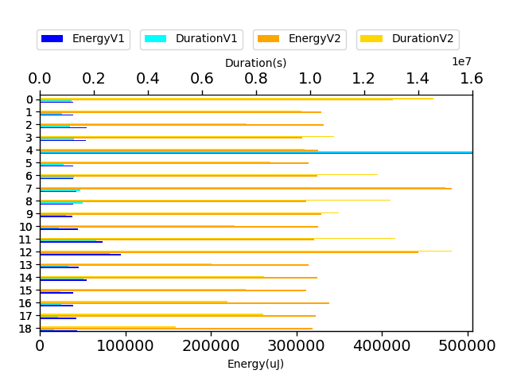

## com.google.gson.functional.StreamingTypeAdaptersTest

| Test | IterationV1 | IterationV2 | DeltaIteration |
| --- | --- | --- | --- |
| com.google.gson.functional.StreamingTypeAdaptersTest-testNullSafe | 89 | 91 | 2 |
| com.google.gson.functional.StreamingTypeAdaptersTest-testSerializeWithCustomTypeAdapter | 91 | 88 | -3 |
| com.google.gson.functional.StreamingTypeAdaptersTest-testDeserializeWithCustomTypeAdapter | 63 | 60 | -3 |

| Test | EnergyV1 | EnergyV2 | DeltaEnergy |
| --- | --- | --- | --- |
| com.google.gson.functional.StreamingTypeAdaptersTest-testNullSafe | 56007.17434238097 | 60725.83694876751 | 4718.662606386541 |
| com.google.gson.functional.StreamingTypeAdaptersTest-testSerializeWithCustomTypeAdapter | 42729.60725225233 | 58771.49581461873 | 16041.888562366395 |
| com.google.gson.functional.StreamingTypeAdaptersTest-testDeserializeWithCustomTypeAdapter | 43120.73839160218 | 45914.25703594058 | 2793.518644338401 |

| Test | DurationV1 | DurationsV2 | DeltaDuration |
| --- | --- | --- | --- |
| com.google.gson.functional.StreamingTypeAdaptersTest-testNullSafe | 1447762.109303313 | 1380557.8336921204 | -67204.27561119269 |
| com.google.gson.functional.StreamingTypeAdaptersTest-testSerializeWithCustomTypeAdapter | 1249781.7893884662 | 1361986.4676004671 | 112204.67821200099 |
| com.google.gson.functional.StreamingTypeAdaptersTest-testDeserializeWithCustomTypeAdapter | 863065.1524146614 | 647008.9842014551 | -216056.16821320623 |

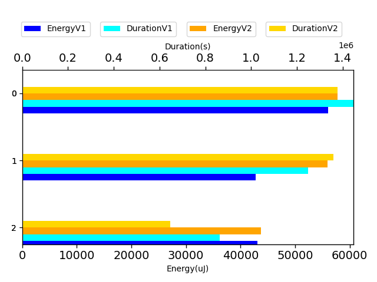

## com.google.gson.functional.JsonAdapterAnnotationOnClassesTest

| Test | IterationV1 | IterationV2 | DeltaIteration |
| --- | --- | --- | --- |
| com.google.gson.functional.JsonAdapterAnnotationOnClassesTest-testJsonAdapterInvoked | 99 | 99 | 0 |
| com.google.gson.functional.JsonAdapterAnnotationOnClassesTest-testRegisteredDeserializerOverridesJsonAdapter | 83 | 83 | 0 |
| com.google.gson.functional.JsonAdapterAnnotationOnClassesTest-testRegisteredSerializerOverridesJsonAdapter | 52 | 48 | -4 |
| com.google.gson.functional.JsonAdapterAnnotationOnClassesTest-testSuperclassTypeAdapterNotInvoked | 59 | 53 | -6 |
| com.google.gson.functional.JsonAdapterAnnotationOnClassesTest-testNullSafeObjectFromJson | 67 | 72 | 5 |
| com.google.gson.functional.JsonAdapterAnnotationOnClassesTest-testJsonAdapterFactoryInvoked | 80 | 85 | 5 |
| com.google.gson.functional.JsonAdapterAnnotationOnClassesTest-testRegisteredAdapterOverridesJsonAdapter | 47 | 48 | 1 |
| com.google.gson.functional.JsonAdapterAnnotationOnClassesTest-testIncorrectTypeAdapterFails | 57 | 53 | -4 |
| com.google.gson.functional.JsonAdapterAnnotationOnClassesTest-testIncorrectJsonAdapterType | 75 | 78 | 3 |

| Test | EnergyV1 | EnergyV2 | DeltaEnergy |
| --- | --- | --- | --- |
| com.google.gson.functional.JsonAdapterAnnotationOnClassesTest-testJsonAdapterInvoked | 73319.11675129535 | 65074.49467258618 | -8244.622078709173 |
| com.google.gson.functional.JsonAdapterAnnotationOnClassesTest-testRegisteredDeserializerOverridesJsonAdapter | 64566.5484132376 | 50012.321663287774 | -14554.226749949827 |
| com.google.gson.functional.JsonAdapterAnnotationOnClassesTest-testRegisteredSerializerOverridesJsonAdapter | 46399.49011276441 | 49223.45039939341 | 2823.9602866290006 |
| com.google.gson.functional.JsonAdapterAnnotationOnClassesTest-testSuperclassTypeAdapterNotInvoked | 44380.674492550585 | 66495.8352721069 | 22115.16077955631 |
| com.google.gson.functional.JsonAdapterAnnotationOnClassesTest-testNullSafeObjectFromJson | 46732.90711769568 | 40405.493419504724 | -6327.413698190954 |
| com.google.gson.functional.JsonAdapterAnnotationOnClassesTest-testJsonAdapterFactoryInvoked | 47285.04440067519 | 40965.413860994 | -6319.630539681195 |
| com.google.gson.functional.JsonAdapterAnnotationOnClassesTest-testRegisteredAdapterOverridesJsonAdapter | 50392.19645021308 | 40961.640725783116 | -9430.555724429963 |
| com.google.gson.functional.JsonAdapterAnnotationOnClassesTest-testIncorrectTypeAdapterFails | 47497.674815004735 | 43362.24732118966 | -4135.4274938150775 |
| com.google.gson.functional.JsonAdapterAnnotationOnClassesTest-testIncorrectJsonAdapterType | 61324.21041091707 | 52861.21362013092 | -8462.99679078615 |

| Test | DurationV1 | DurationsV2 | DeltaDuration |
| --- | --- | --- | --- |
| com.google.gson.functional.JsonAdapterAnnotationOnClassesTest-testJsonAdapterInvoked | 2000822.2498890564 | 1815978.436117984 | -184843.81377107254 |
| com.google.gson.functional.JsonAdapterAnnotationOnClassesTest-testRegisteredDeserializerOverridesJsonAdapter | 1606154.9659224814 | 1536965.4328710386 | -69189.53305144282 |
| com.google.gson.functional.JsonAdapterAnnotationOnClassesTest-testRegisteredSerializerOverridesJsonAdapter | 672441.1663423529 | 958599.2546663723 | 286158.08832401945 |
| com.google.gson.functional.JsonAdapterAnnotationOnClassesTest-testSuperclassTypeAdapterNotInvoked | 868029.586140991 | 1803801.5490671073 | 935771.9629261163 |
| com.google.gson.functional.JsonAdapterAnnotationOnClassesTest-testNullSafeObjectFromJson | 868334.699807876 | 946756.469277076 | 78421.76946919993 |
| com.google.gson.functional.JsonAdapterAnnotationOnClassesTest-testJsonAdapterFactoryInvoked | 1084192.56755929 | 1033694.6330597391 | -50497.93449955084 |
| com.google.gson.functional.JsonAdapterAnnotationOnClassesTest-testRegisteredAdapterOverridesJsonAdapter | 897284.4381170837 | 754837.3935153612 | -142447.0446017225 |
| com.google.gson.functional.JsonAdapterAnnotationOnClassesTest-testIncorrectTypeAdapterFails | 804436.4103035277 | 736078.4324100043 | -68357.9778935234 |
| com.google.gson.functional.JsonAdapterAnnotationOnClassesTest-testIncorrectJsonAdapterType | 1305931.0198293247 | 1339531.354782236 | 33600.33495291136 |

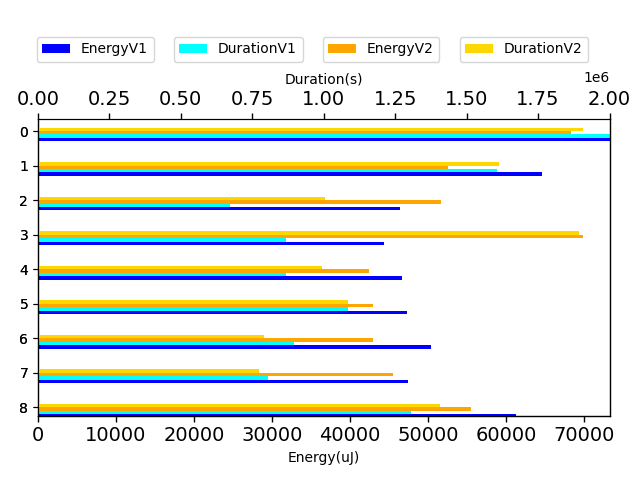

## com.google.gson.MixedStreamTest

| Test | IterationV1 | IterationV2 | DeltaIteration |
| --- | --- | --- | --- |
| com.google.gson.MixedStreamTest-testReaderDoesNotMutateState | 25 | 27 | 2 |
| com.google.gson.MixedStreamTest-testWriteClosed | 29 | 23 | -6 |
| com.google.gson.MixedStreamTest-testWriteHtmlSafe | 61 | 66 | 5 |
| com.google.gson.MixedStreamTest-testWriteLenient | 71 | 64 | -7 |
| com.google.gson.MixedStreamTest-testReadClosed | 53 | 48 | -5 |
| com.google.gson.MixedStreamTest-testReadNulls | 19 | 34 | 15 |
| com.google.gson.MixedStreamTest-testReadMixedStreamed | 29 | 34 | 5 |
| com.google.gson.MixedStreamTest-testReadInvalidState | 27 | 24 | -3 |
| com.google.gson.MixedStreamTest-testWriteNulls | 21 | 14 | -7 |
| com.google.gson.MixedStreamTest-testWriteDoesNotMutateState | 28 | 29 | 1 |
| com.google.gson.MixedStreamTest-testWriteInvalidState | 23 | 25 | 2 |
| com.google.gson.MixedStreamTest-testWriteMixedStreamed | 28 | 41 | 13 |

| Test | EnergyV1 | EnergyV2 | DeltaEnergy |
| --- | --- | --- | --- |
| com.google.gson.MixedStreamTest-testReaderDoesNotMutateState | 45765.34817838669 | 43682.19305957854 | -2083.1551188081503 |
| com.google.gson.MixedStreamTest-testWriteClosed | 45579.61085536145 | 43185.07156980038 | -2394.53928556107 |
| com.google.gson.MixedStreamTest-testWriteHtmlSafe | 46194.02697212295 | 45978.317866145 | -215.70910597794864 |
| com.google.gson.MixedStreamTest-testWriteLenient | 45740.4754081518 | 96734.90366844114 | 50994.42826028934 |
| com.google.gson.MixedStreamTest-testReadClosed | 44919.44908449215 | 48004.41594001455 | 3084.966855522398 |
| com.google.gson.MixedStreamTest-testReadNulls | 45165.50342941284 | 44753.604732274776 | -411.8986971380655 |
| com.google.gson.MixedStreamTest-testReadMixedStreamed | 48209.11376241967 | 41677.10269757372 | -6532.011064845952 |
| com.google.gson.MixedStreamTest-testReadInvalidState | 44235.16688834131 | 41948.57367324829 | -2286.5932150930166 |
| com.google.gson.MixedStreamTest-testWriteNulls | 43430.450949668884 | 44962.57373046875 | 1532.1227807998657 |
| com.google.gson.MixedStreamTest-testWriteDoesNotMutateState | 44168.700215913355 | 43375.20552805439 | -793.494687858969 |
| com.google.gson.MixedStreamTest-testWriteInvalidState | 45566.76888990402 | 45564.75170177221 | -2.0171881318092346 |
| com.google.gson.MixedStreamTest-testWriteMixedStreamed | 46572.60222687572 | 44274.64488321355 | -2297.957343662172 |

| Test | DurationV1 | DurationsV2 | DeltaDuration |
| --- | --- | --- | --- |
| com.google.gson.MixedStreamTest-testReaderDoesNotMutateState | 412567.39011988044 | 676793.9235834032 | 264226.5334635228 |
| com.google.gson.MixedStreamTest-testWriteClosed | 408958.03534488194 | 436318.73552918434 | 27360.700184302405 |
| com.google.gson.MixedStreamTest-testWriteHtmlSafe | 844556.5876538206 | 829970.1097824414 | -14586.477871379233 |
| com.google.gson.MixedStreamTest-testWriteLenient | 830807.7770474222 | 1960452.7071165114 | 1129644.9300690892 |
| com.google.gson.MixedStreamTest-testReadClosed | 686680.6693297313 | 678323.7327800761 | -8356.936549655162 |
| com.google.gson.MixedStreamTest-testReadNulls | 363123.6901855469 | 487081.66123338975 | 123957.97104784288 |
| com.google.gson.MixedStreamTest-testReadMixedStreamed | 513860.5604174882 | 609354.5221339504 | 95493.96171646216 |
| com.google.gson.MixedStreamTest-testReadInvalidState | 467578.76595428586 | 509824.98566764593 | 42246.21971336007 |
| com.google.gson.MixedStreamTest-testWriteNulls | 365593.7811231613 | 470863.3586425781 | 105269.57751941681 |
| com.google.gson.MixedStreamTest-testWriteDoesNotMutateState | 524043.0742337182 | 434015.2567099035 | -90027.81752381474 |
| com.google.gson.MixedStreamTest-testWriteInvalidState | 425881.19444060326 | 517135.9335554242 | 91254.73911482096 |
| com.google.gson.MixedStreamTest-testWriteMixedStreamed | 604901.0506596193 | 862878.3198512979 | 257977.2691916786 |

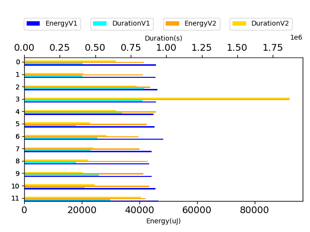

## com.google.gson.functional.InstanceCreatorTest

| Test | IterationV1 | IterationV2 | DeltaIteration |
| --- | --- | --- | --- |
| com.google.gson.functional.InstanceCreatorTest-testInstanceCreatorForParametrizedType | 99 | 99 | 0 |
| com.google.gson.functional.InstanceCreatorTest-testInstanceCreatorReturnsSubTypeForTopLevelObject | 50 | 49 | -1 |
| com.google.gson.functional.InstanceCreatorTest-testInstanceCreatorForCollectionType | 99 | 99 | 0 |
| com.google.gson.functional.InstanceCreatorTest-testInstanceCreatorReturnsBaseType | 64 | 62 | -2 |
| com.google.gson.functional.InstanceCreatorTest-testInstanceCreatorReturnsSubTypeForField | 61 | 61 | 0 |

| Test | EnergyV1 | EnergyV2 | DeltaEnergy |
| --- | --- | --- | --- |
| com.google.gson.functional.InstanceCreatorTest-testInstanceCreatorForParametrizedType | 114676.54174856325 | 78509.52442888996 | -36167.017319673294 |
| com.google.gson.functional.InstanceCreatorTest-testInstanceCreatorReturnsSubTypeForTopLevelObject | 41679.54503234746 | 44269.80807816764 | 2590.263045820182 |
| com.google.gson.functional.InstanceCreatorTest-testInstanceCreatorForCollectionType | 47016.240894776616 | 43193.62573402206 | -3822.6151607545544 |
| com.google.gson.functional.InstanceCreatorTest-testInstanceCreatorReturnsBaseType | 107876.40150160887 | 243602.66363518866 | 135726.2621335798 |
| com.google.gson.functional.InstanceCreatorTest-testInstanceCreatorReturnsSubTypeForField | 44802.704730747595 | 59530.270165055 | 14727.565434307406 |

| Test | DurationV1 | DurationsV2 | DeltaDuration |
| --- | --- | --- | --- |
| com.google.gson.functional.InstanceCreatorTest-testInstanceCreatorForParametrizedType | 2325159.6787506565 | 2304452.6402291777 | -20707.038521478884 |
| com.google.gson.functional.InstanceCreatorTest-testInstanceCreatorReturnsSubTypeForTopLevelObject | 722776.1394153907 | 666608.4252305329 | -56167.71418485779 |
| com.google.gson.functional.InstanceCreatorTest-testInstanceCreatorForCollectionType | 1374326.4819850656 | 1473805.2784898444 | 99478.79650477879 |
| com.google.gson.functional.InstanceCreatorTest-testInstanceCreatorReturnsBaseType | 2618202.816825159 | 6802431.839111646 | 4184229.022286487 |
| com.google.gson.functional.InstanceCreatorTest-testInstanceCreatorReturnsSubTypeForField | 712351.5109415916 | 1478787.2114521964 | 766435.7005106048 |

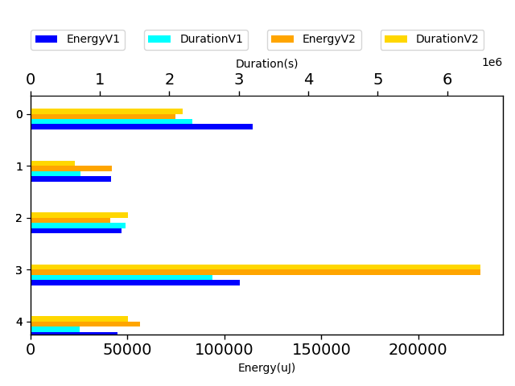

## com.google.gson.functional.DefaultTypeAdaptersTest

| Test | IterationV1 | IterationV2 | DeltaIteration |
| --- | --- | --- | --- |
| com.google.gson.functional.DefaultTypeAdaptersTest-testDateSerializationWithPatternNotOverridenByTypeAdapter | 96 | 95 | -1 |
| com.google.gson.functional.DefaultTypeAdaptersTest-testDateSerializationWithPattern | 95 | 96 | 1 |
| com.google.gson.functional.DefaultTypeAdaptersTest-testOverrideBigIntegerTypeAdapter | 99 | 99 | 0 |
| com.google.gson.functional.DefaultTypeAdaptersTest-testSqlDateSerialization | 74 | 74 | 0 |
| com.google.gson.functional.DefaultTypeAdaptersTest-testClassSerialization | 67 | 62 | -5 |
| com.google.gson.functional.DefaultTypeAdaptersTest-testTimestampSerialization | 94 | 97 | 3 |
| com.google.gson.functional.DefaultTypeAdaptersTest-testDefaultDateDeserializationUsingBuilder | 99 | 99 | 0 |
| com.google.gson.functional.DefaultTypeAdaptersTest-testOverrideBigDecimalTypeAdapter | 99 | 99 | 0 |
| com.google.gson.functional.DefaultTypeAdaptersTest-testNullSerialization | 99 | 99 | 0 |
| com.google.gson.functional.DefaultTypeAdaptersTest-testDefaultCalendarDeserialization | 23 | 24 | 1 |
| com.google.gson.functional.DefaultTypeAdaptersTest-testDateDeserializationWithPattern | 87 | 84 | -3 |
| com.google.gson.functional.DefaultTypeAdaptersTest-testDateSerializationInCollection | 99 | 99 | 0 |
| com.google.gson.functional.DefaultTypeAdaptersTest-testBitSetDeserialization | 34 | 35 | 1 |
| com.google.gson.functional.DefaultTypeAdaptersTest-testDefaultCalendarSerialization | 27 | 24 | -3 |
| com.google.gson.functional.DefaultTypeAdaptersTest-testDefaultGregorianCalendarDeserialization | 26 | 21 | -5 |
| com.google.gson.functional.DefaultTypeAdaptersTest-testSetSerialization | 34 | 37 | 3 |
| com.google.gson.functional.DefaultTypeAdaptersTest-testBitSetSerialization | 21 | 19 | -2 |
| com.google.gson.functional.DefaultTypeAdaptersTest-testDefaultGregorianCalendarSerialization | 26 | 24 | -2 |
| com.google.gson.functional.DefaultTypeAdaptersTest-testClassDeserialization | 24 | 24 | 0 |

| Test | EnergyV1 | EnergyV2 | DeltaEnergy |
| --- | --- | --- | --- |
| com.google.gson.functional.DefaultTypeAdaptersTest-testDateSerializationWithPatternNotOverridenByTypeAdapter | 42468.678651656715 | 43274.47792134415 | 805.7992696874353 |
| com.google.gson.functional.DefaultTypeAdaptersTest-testDateSerializationWithPattern | 42797.88618715284 | 42595.8473289313 | -202.03885822154552 |
| com.google.gson.functional.DefaultTypeAdaptersTest-testOverrideBigIntegerTypeAdapter | 72148.11470773215 | 82017.23205197352 | 9869.117344241371 |
| com.google.gson.functional.DefaultTypeAdaptersTest-testSqlDateSerialization | 45010.016617721296 | 44515.06614160627 | -494.9504761150238 |
| com.google.gson.functional.DefaultTypeAdaptersTest-testClassSerialization | 41267.49273090981 | 39537.280233366924 | -1730.2124975428887 |
| com.google.gson.functional.DefaultTypeAdaptersTest-testTimestampSerialization | 44994.84503133157 | 43303.463984552225 | -1691.3810467793446 |
| com.google.gson.functional.DefaultTypeAdaptersTest-testDefaultDateDeserializationUsingBuilder | 378783.8341303691 | 378567.5001864258 | -216.33394394331845 |
| com.google.gson.functional.DefaultTypeAdaptersTest-testOverrideBigDecimalTypeAdapter | 44329.588491358685 | 42038.56743182206 | -2291.0210595366225 |
| com.google.gson.functional.DefaultTypeAdaptersTest-testNullSerialization | 1385358.9217854145 | 1490824.2042259634 | 105465.282440549 |
| com.google.gson.functional.DefaultTypeAdaptersTest-testDefaultCalendarDeserialization | 45286.15421593189 | 45872.85612142086 | 586.7019054889679 |
| com.google.gson.functional.DefaultTypeAdaptersTest-testDateDeserializationWithPattern | 44225.51873565186 | 43424.7407125644 | -800.778023087456 |
| com.google.gson.functional.DefaultTypeAdaptersTest-testDateSerializationInCollection | 45150.10614729709 | 44789.67972180522 | -360.4264254918671 |
| com.google.gson.functional.DefaultTypeAdaptersTest-testBitSetDeserialization | 43063.09796912386 | 40916.5263611461 | -2146.571607977763 |
| com.google.gson.functional.DefaultTypeAdaptersTest-testDefaultCalendarSerialization | 45266.595993340015 | 44377.963650107384 | -888.6323432326317 |
| com.google.gson.functional.DefaultTypeAdaptersTest-testDefaultGregorianCalendarDeserialization | 43431.19661155343 | 40078.23728275299 | -3352.95932880044 |
| com.google.gson.functional.DefaultTypeAdaptersTest-testSetSerialization | 42964.81699334609 | 43003.29165901853 | 38.47466567243828 |
| com.google.gson.functional.DefaultTypeAdaptersTest-testBitSetSerialization | 39517.7280626297 | 42743.54656600952 | 3225.818503379822 |
| com.google.gson.functional.DefaultTypeAdaptersTest-testDefaultGregorianCalendarSerialization | 45611.431794553995 | 39754.35620570183 | -5857.075588852167 |
| com.google.gson.functional.DefaultTypeAdaptersTest-testClassDeserialization | 42931.35529077053 | 42427.081918001175 | -504.2733727693558 |

| Test | DurationV1 | DurationsV2 | DeltaDuration |
| --- | --- | --- | --- |
| com.google.gson.functional.DefaultTypeAdaptersTest-testDateSerializationWithPatternNotOverridenByTypeAdapter | 1159426.295111971 | 1191229.2386322152 | 31802.94352024421 |
| com.google.gson.functional.DefaultTypeAdaptersTest-testDateSerializationWithPattern | 1114058.34863772 | 1150489.009396336 | 36430.66075861594 |
| com.google.gson.functional.DefaultTypeAdaptersTest-testOverrideBigIntegerTypeAdapter | 1716262.853166786 | 1788186.6538050345 | 71923.80063824845 |
| com.google.gson.functional.DefaultTypeAdaptersTest-testSqlDateSerialization | 1000365.6878033478 | 993739.9777963599 | -6625.710006987909 |
| com.google.gson.functional.DefaultTypeAdaptersTest-testClassSerialization | 747145.1203454332 | 762820.4186239925 | 15675.298278559232 |
| com.google.gson.functional.DefaultTypeAdaptersTest-testTimestampSerialization | 1128903.6948567599 | 1150117.084959999 | 21213.3901032391 |
| com.google.gson.functional.DefaultTypeAdaptersTest-testDefaultDateDeserializationUsingBuilder | 9574447.413192824 | 9105531.896098197 | -468915.517094627 |
| com.google.gson.functional.DefaultTypeAdaptersTest-testOverrideBigDecimalTypeAdapter | 1204884.364542056 | 1256165.4683372527 | 51281.10379519663 |
| com.google.gson.functional.DefaultTypeAdaptersTest-testNullSerialization | 32197044.26005365 | 35044835.303045616 | 2847791.042991966 |
| com.google.gson.functional.DefaultTypeAdaptersTest-testDefaultCalendarDeserialization | 534062.3286374807 | 481648.799421072 | -52413.52921640873 |
| com.google.gson.functional.DefaultTypeAdaptersTest-testDateDeserializationWithPattern | 963308.4893172487 | 1058291.5513925573 | 94983.06207530864 |
| com.google.gson.functional.DefaultTypeAdaptersTest-testDateSerializationInCollection | 1337343.469959572 | 1303105.6451006276 | -34237.8248589444 |
| com.google.gson.functional.DefaultTypeAdaptersTest-testBitSetDeserialization | 484638.30784986843 | 500760.50749729545 | 16122.199647427013 |
| com.google.gson.functional.DefaultTypeAdaptersTest-testDefaultCalendarSerialization | 485884.7895692885 | 463785.6933711767 | -22099.096198111773 |
| com.google.gson.functional.DefaultTypeAdaptersTest-testDefaultGregorianCalendarDeserialization | 416146.3057715297 | 424696.77383232117 | 8550.468060791492 |
| com.google.gson.functional.DefaultTypeAdaptersTest-testSetSerialization | 1239312.6205554875 | 501596.81815620366 | -737715.8023992837 |
| com.google.gson.functional.DefaultTypeAdaptersTest-testBitSetSerialization | 399464.81594753265 | 396243.5855331421 | -3221.230414390564 |
| com.google.gson.functional.DefaultTypeAdaptersTest-testDefaultGregorianCalendarSerialization | 466174.67790302634 | 392831.87874662876 | -73342.79915639758 |
| com.google.gson.functional.DefaultTypeAdaptersTest-testClassDeserialization | 485095.3007888794 | 487638.98729896545 | 2543.6865100860596 |

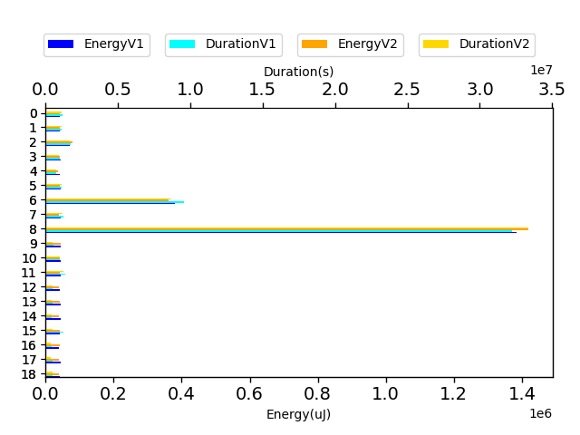

## com.google.gson.OverrideCoreTypeAdaptersTest

| Test | IterationV1 | IterationV2 | DeltaIteration |
| --- | --- | --- | --- |
| com.google.gson.OverrideCoreTypeAdaptersTest-testOverrideStringAdapter | 29 | 27 | -2 |
| com.google.gson.OverrideCoreTypeAdaptersTest-testOverridePrimitiveBooleanAdapter | 17 | 18 | 1 |
| com.google.gson.OverrideCoreTypeAdaptersTest-testOverrideWrapperBooleanAdapter | 40 | 43 | 3 |

| Test | EnergyV1 | EnergyV2 | DeltaEnergy |
| --- | --- | --- | --- |
| com.google.gson.OverrideCoreTypeAdaptersTest-testOverrideStringAdapter | 42804.4833270479 | 40892.21054200828 | -1912.2727850396186 |
| com.google.gson.OverrideCoreTypeAdaptersTest-testOverridePrimitiveBooleanAdapter | 45448.16207122803 | 39321.4885559082 | -6126.673515319824 |
| com.google.gson.OverrideCoreTypeAdaptersTest-testOverrideWrapperBooleanAdapter | 45633.13019968539 | 44593.33033039848 | -1039.7998692869078 |

| Test | DurationV1 | DurationsV2 | DeltaDuration |
| --- | --- | --- | --- |
| com.google.gson.OverrideCoreTypeAdaptersTest-testOverrideStringAdapter | 514926.47615153715 | 425324.34737348557 | -89602.12877805158 |
| com.google.gson.OverrideCoreTypeAdaptersTest-testOverridePrimitiveBooleanAdapter | 521596.14263916016 | 470964.5813064575 | -50631.56133270264 |
| com.google.gson.OverrideCoreTypeAdaptersTest-testOverrideWrapperBooleanAdapter | 728597.8104422241 | 588529.3294023784 | -140068.48103984573 |

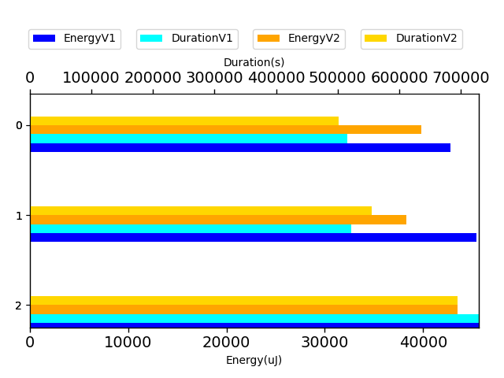

## com.google.gson.functional.JsonAdapterSerializerDeserializerTest

| Test | IterationV1 | IterationV2 | DeltaIteration |
| --- | --- | --- | --- |
| com.google.gson.functional.JsonAdapterSerializerDeserializerTest-testJsonSerializerDeserializerBasedJsonAdapterOnFields | 99 | 99 | 0 |
| com.google.gson.functional.JsonAdapterSerializerDeserializerTest-testDifferentJsonAdaptersForGenericFieldsOfSameRawType | 99 | 99 | 0 |
| com.google.gson.functional.JsonAdapterSerializerDeserializerTest-testJsonSerializerDeserializerBasedJsonAdapterOnClass | 96 | 93 | -3 |

| Test | EnergyV1 | EnergyV2 | DeltaEnergy |
| --- | --- | --- | --- |
| com.google.gson.functional.JsonAdapterSerializerDeserializerTest-testJsonSerializerDeserializerBasedJsonAdapterOnFields | 104183.70734498647 | 136801.9410608671 | 32618.233715880633 |
| com.google.gson.functional.JsonAdapterSerializerDeserializerTest-testDifferentJsonAdaptersForGenericFieldsOfSameRawType | 46146.74301447713 | 89497.19722975617 | 43350.454215279045 |
| com.google.gson.functional.JsonAdapterSerializerDeserializerTest-testJsonSerializerDeserializerBasedJsonAdapterOnClass | 39797.82869519072 | 42059.38750919727 | 2261.558814006552 |

| Test | DurationV1 | DurationsV2 | DeltaDuration |
| --- | --- | --- | --- |
| com.google.gson.functional.JsonAdapterSerializerDeserializerTest-testJsonSerializerDeserializerBasedJsonAdapterOnFields | 2892094.0879479125 | 3336561.8623216017 | 444467.7743736892 |
| com.google.gson.functional.JsonAdapterSerializerDeserializerTest-testDifferentJsonAdaptersForGenericFieldsOfSameRawType | 1779742.4440007168 | 1590985.3726383578 | -188757.07136235898 |
| com.google.gson.functional.JsonAdapterSerializerDeserializerTest-testJsonSerializerDeserializerBasedJsonAdapterOnClass | 1314604.9694685102 | 1183039.8167429483 | -131565.152725562 |

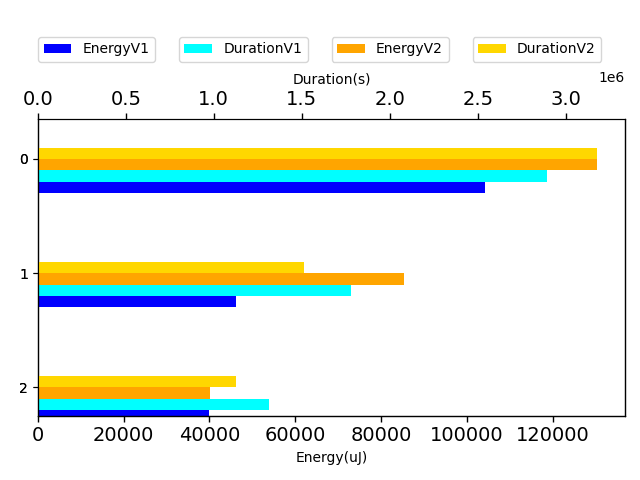

## com.google.gson.internal.bind.RecursiveTypesResolveTest

| Test | IterationV1 | IterationV2 | DeltaIteration |
| --- | --- | --- | --- |
| com.google.gson.internal.bind.RecursiveTypesResolveTest-testIssue440WeakReference | 91 | 91 | 0 |
| com.google.gson.internal.bind.RecursiveTypesResolveTest-testRecursiveResolveSimple | 98 | 96 | -2 |
| com.google.gson.internal.bind.RecursiveTypesResolveTest-testRecursiveTypeVariablesResolve1 | 54 | 50 | -4 |
| com.google.gson.internal.bind.RecursiveTypesResolveTest-testIssue603PrintStream | 99 | 99 | 0 |
| com.google.gson.internal.bind.RecursiveTypesResolveTest-testRecursiveTypeVariablesResolve12 | 46 | 51 | 5 |

| Test | EnergyV1 | EnergyV2 | DeltaEnergy |
| --- | --- | --- | --- |
| com.google.gson.internal.bind.RecursiveTypesResolveTest-testIssue440WeakReference | 47761.745382198 | 45446.41945034449 | -2315.325931853513 |
| com.google.gson.internal.bind.RecursiveTypesResolveTest-testRecursiveResolveSimple | 66519.05593790658 | 110871.28256537428 | 44352.226627467695 |
| com.google.gson.internal.bind.RecursiveTypesResolveTest-testRecursiveTypeVariablesResolve1 | 45658.325957648616 | 78964.59364259195 | 33306.267684943334 |
| com.google.gson.internal.bind.RecursiveTypesResolveTest-testIssue603PrintStream | 210722.52566832182 | 270715.1038544985 | 59992.57818617666 |
| com.google.gson.internal.bind.RecursiveTypesResolveTest-testRecursiveTypeVariablesResolve12 | 46016.69090736482 | 49664.46438155814 | 3647.7734741933164 |

| Test | DurationV1 | DurationsV2 | DeltaDuration |
| --- | --- | --- | --- |
| com.google.gson.internal.bind.RecursiveTypesResolveTest-testIssue440WeakReference | 1147352.5055884584 | 1276898.1116262153 | 129545.6060377569 |
| com.google.gson.internal.bind.RecursiveTypesResolveTest-testRecursiveResolveSimple | 1572600.4251546576 | 2930896.112146185 | 1358295.6869915272 |
| com.google.gson.internal.bind.RecursiveTypesResolveTest-testRecursiveTypeVariablesResolve1 | 1179865.6037726502 | 1922493.2444978151 | 742627.6407251649 |
| com.google.gson.internal.bind.RecursiveTypesResolveTest-testIssue603PrintStream | 4914661.218591815 | 6594008.66137935 | 1679347.4427875355 |
| com.google.gson.internal.bind.RecursiveTypesResolveTest-testRecursiveTypeVariablesResolve12 | 756968.7680972664 | 751869.9368138268 | -5098.831283439649 |

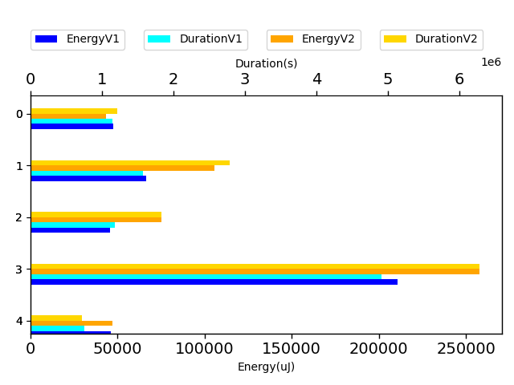

## com.google.gson.functional.NamingPolicyTest

| Test | IterationV1 | IterationV2 | DeltaIteration |
| --- | --- | --- | --- |
| com.google.gson.functional.NamingPolicyTest-testAtSignInSerializedName | 52 | 48 | -4 |
| com.google.gson.functional.NamingPolicyTest-testGsonDuplicateNameUsingSerializedNameFieldNamingPolicySerialization | 81 | 83 | 2 |
| com.google.gson.functional.NamingPolicyTest-testGsonWithSerializedNameFieldNamingPolicySerialization | 65 | 62 | -3 |
| com.google.gson.functional.NamingPolicyTest-testComplexFieldNameStrategy | 71 | 78 | 7 |
| com.google.gson.functional.NamingPolicyTest-testDeprecatedNamingStrategy | 64 | 58 | -6 |
| com.google.gson.functional.NamingPolicyTest-testGsonWithNonDefaultFieldNamingPolicySerialization | 42 | 32 | -10 |
| com.google.gson.functional.NamingPolicyTest-testGsonWithNonDefaultFieldNamingPolicyDeserialiation | 46 | 47 | 1 |
| com.google.gson.functional.NamingPolicyTest-testGsonWithLowerCaseDashPolicySerialization | 33 | 28 | -5 |
| com.google.gson.functional.NamingPolicyTest-testGsonWithLowerCaseUnderscorePolicyDeserialiation | 28 | 30 | 2 |
| com.google.gson.functional.NamingPolicyTest-testGsonWithLowerCaseDashPolicyDeserialiation | 29 | 33 | 4 |
| com.google.gson.functional.NamingPolicyTest-testGsonWithSerializedNameFieldNamingPolicyDeserialization | 26 | 33 | 7 |
| com.google.gson.functional.NamingPolicyTest-testGsonWithUpperCamelCaseSpacesPolicyDeserialiation | 31 | 31 | 0 |
| com.google.gson.functional.NamingPolicyTest-testGsonWithUpperCamelCaseSpacesPolicySerialiation | 28 | 24 | -4 |
| com.google.gson.functional.NamingPolicyTest-testGsonWithLowerCaseUnderscorePolicySerialization | 33 | 15 | -18 |

| Test | EnergyV1 | EnergyV2 | DeltaEnergy |
| --- | --- | --- | --- |
| com.google.gson.functional.NamingPolicyTest-testAtSignInSerializedName | 39605.42973613932 | 45083.15214808481 | 5477.722411945491 |
| com.google.gson.functional.NamingPolicyTest-testGsonDuplicateNameUsingSerializedNameFieldNamingPolicySerialization | 131509.76244091126 | 84271.66743590473 | -47238.09500500653 |
| com.google.gson.functional.NamingPolicyTest-testGsonWithSerializedNameFieldNamingPolicySerialization | 42089.21934254524 | 39080.77320991424 | -3008.4461326310047 |
| com.google.gson.functional.NamingPolicyTest-testComplexFieldNameStrategy | 38366.29787478932 | 44071.78442524502 | 5705.486550455702 |
| com.google.gson.functional.NamingPolicyTest-testDeprecatedNamingStrategy | 40732.534551106386 | 43531.54298825457 | 2799.008437148186 |
| com.google.gson.functional.NamingPolicyTest-testGsonWithNonDefaultFieldNamingPolicySerialization | 39631.03596990533 | 44841.083128311206 | 5210.047158405876 |
| com.google.gson.functional.NamingPolicyTest-testGsonWithNonDefaultFieldNamingPolicyDeserialiation | 118967.27598522285 | 73408.42947868118 | -45558.84650654167 |
| com.google.gson.functional.NamingPolicyTest-testGsonWithLowerCaseDashPolicySerialization | 43352.141270172084 | 44523.8979819268 | 1171.756711754715 |
| com.google.gson.functional.NamingPolicyTest-testGsonWithLowerCaseUnderscorePolicyDeserialiation | 37815.20407912135 | 42184.805736200884 | 4369.601657079533 |
| com.google.gson.functional.NamingPolicyTest-testGsonWithLowerCaseDashPolicyDeserialiation | 42180.569263812155 | 45355.53573200083 | 3174.966468188679 |
| com.google.gson.functional.NamingPolicyTest-testGsonWithSerializedNameFieldNamingPolicyDeserialization | 44612.13129398227 | 44653.541792403325 | 41.41049842105713 |
| com.google.gson.functional.NamingPolicyTest-testGsonWithUpperCamelCaseSpacesPolicyDeserialiation | 44067.49129621778 | 45298.519188433886 | 1231.0278922161087 |
| com.google.gson.functional.NamingPolicyTest-testGsonWithUpperCamelCaseSpacesPolicySerialiation | 45977.18363934755 | 45142.835574269295 | -834.3480650782585 |
| com.google.gson.functional.NamingPolicyTest-testGsonWithLowerCaseUnderscorePolicySerialization | 42107.882455174346 | 42681.21923828125 | 573.3367831069045 |

| Test | DurationV1 | DurationsV2 | DeltaDuration |
| --- | --- | --- | --- |
| com.google.gson.functional.NamingPolicyTest-testAtSignInSerializedName | 759868.3840575037 | 742143.4684511996 | -17724.915606304072 |
| com.google.gson.functional.NamingPolicyTest-testGsonDuplicateNameUsingSerializedNameFieldNamingPolicySerialization | 3428259.68921589 | 2319372.129279482 | -1108887.559936408 |
| com.google.gson.functional.NamingPolicyTest-testGsonWithSerializedNameFieldNamingPolicySerialization | 1124693.3961048806 | 928653.517963331 | -196039.87814154965 |
| com.google.gson.functional.NamingPolicyTest-testComplexFieldNameStrategy | 963213.7652875865 | 929049.3958015591 | -34164.3694860274 |
| com.google.gson.functional.NamingPolicyTest-testDeprecatedNamingStrategy | 1149331.1649147922 | 787365.0512500573 | -361966.1136647349 |
| com.google.gson.functional.NamingPolicyTest-testGsonWithNonDefaultFieldNamingPolicySerialization | 1156025.2511862118 | 627906.5016595428 | -528118.749526669 |
| com.google.gson.functional.NamingPolicyTest-testGsonWithNonDefaultFieldNamingPolicyDeserialiation | 2931559.5239415853 | 1450593.9148165453 | -1480965.60912504 |
| com.google.gson.functional.NamingPolicyTest-testGsonWithLowerCaseDashPolicySerialization | 514696.66035496164 | 505580.9759650454 | -9115.684389916249 |
| com.google.gson.functional.NamingPolicyTest-testGsonWithLowerCaseUnderscorePolicyDeserialiation | 605153.5062136576 | 608243.0418437961 | 3089.535630138591 |
| com.google.gson.functional.NamingPolicyTest-testGsonWithLowerCaseDashPolicyDeserialiation | 654339.7787681296 | 671187.8671071474 | 16848.088339017704 |
| com.google.gson.functional.NamingPolicyTest-testGsonWithSerializedNameFieldNamingPolicyDeserialization | 549272.8206885755 | 522471.18827168585 | -26801.632416889654 |
| com.google.gson.functional.NamingPolicyTest-testGsonWithUpperCamelCaseSpacesPolicyDeserialiation | 504253.3613171354 | 449506.94393211044 | -54746.41738502495 |
| com.google.gson.functional.NamingPolicyTest-testGsonWithUpperCamelCaseSpacesPolicySerialiation | 481056.7341824323 | 578778.8885064125 | 97722.15432398021 |
| com.google.gson.functional.NamingPolicyTest-testGsonWithLowerCaseUnderscorePolicySerialization | 674662.9896808702 | 539998.7297363281 | -134664.25994454208 |

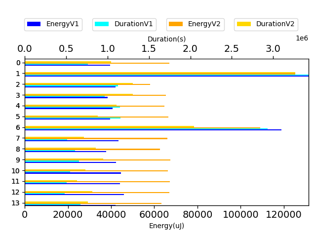

## com.google.gson.LongSerializationPolicyTest

| Test | IterationV1 | IterationV2 | DeltaIteration |
| --- | --- | --- | --- |
| com.google.gson.LongSerializationPolicyTest-testDefaultLongSerializationIntegration | 33 | 31 | -2 |
| com.google.gson.LongSerializationPolicyTest-testStringLongSerializationIntegration | 29 | 21 | -8 |

| Test | EnergyV1 | EnergyV2 | DeltaEnergy |
| --- | --- | --- | --- |
| com.google.gson.LongSerializationPolicyTest-testDefaultLongSerializationIntegration | 49951.82739756012 | 693059.3711362109 | 643107.5437386507 |
| com.google.gson.LongSerializationPolicyTest-testStringLongSerializationIntegration | 39740.18878201395 | 41161.77852106094 | 1421.5897390469909 |

| Test | DurationV1 | DurationsV2 | DeltaDuration |
| --- | --- | --- | --- |
| com.google.gson.LongSerializationPolicyTest-testDefaultLongSerializationIntegration | 665530.0208190724 | 19604252.027207494 | 18938722.006388422 |
| com.google.gson.LongSerializationPolicyTest-testStringLongSerializationIntegration | 757509.7811863068 | 585178.7919845581 | -172330.98920174874 |

## com.google.gson.functional.MapTest

| Test | IterationV1 | IterationV2 | DeltaIteration |
| --- | --- | --- | --- |
| com.google.gson.functional.MapTest-testSerializeMaps | 78 | 82 | 4 |
| com.google.gson.functional.MapTest-testInterfaceTypeMapWithSerializer | 97 | 99 | 2 |
| com.google.gson.functional.MapTest-testMapSerializationWithNullValuesSerialized | 83 | 86 | 3 |
| com.google.gson.functional.MapTest-testMapSubclassDeserialization | 80 | 79 | -1 |
| com.google.gson.functional.MapTest-testCustomSerializerForSpecificMapType | 59 | 72 | 13 |
| com.google.gson.functional.MapTest-testGeneralMapField | 84 | 88 | 4 |
| com.google.gson.functional.MapTest-testMapSerializationWithNullValueButSerializeNulls | 53 | 64 | 11 |
| com.google.gson.functional.MapTest-testInterfaceTypeMap | 98 | 99 | 1 |

| Test | EnergyV1 | EnergyV2 | DeltaEnergy |
| --- | --- | --- | --- |
| com.google.gson.functional.MapTest-testSerializeMaps | 44467.66436402417 | 51557.87792398578 | 7090.213559961616 |
| com.google.gson.functional.MapTest-testInterfaceTypeMapWithSerializer | 44641.63262150446 | 71806.15257457439 | 27164.519953069925 |
| com.google.gson.functional.MapTest-testMapSerializationWithNullValuesSerialized | 44921.785136096805 | 49249.63080591991 | 4327.845669823102 |
| com.google.gson.functional.MapTest-testMapSubclassDeserialization | 44962.78423584245 | 39099.90274389782 | -5862.88149194463 |
| com.google.gson.functional.MapTest-testCustomSerializerForSpecificMapType | 44605.339086048145 | 37853.156455322816 | -6752.182630725329 |
| com.google.gson.functional.MapTest-testGeneralMapField | 43222.61925172068 | 43189.93286694243 | -32.68638477825152 |
| com.google.gson.functional.MapTest-testMapSerializationWithNullValueButSerializeNulls | 41533.98741931854 | 55602.212250566045 | 14068.224831247506 |
| com.google.gson.functional.MapTest-testInterfaceTypeMap | 53399.19926029573 | 109725.0762292121 | 56325.876968916375 |

| Test | DurationV1 | DurationsV2 | DeltaDuration |
| --- | --- | --- | --- |
| com.google.gson.functional.MapTest-testSerializeMaps | 873650.7548586836 | 1331276.842234002 | 457626.0873753184 |
| com.google.gson.functional.MapTest-testInterfaceTypeMapWithSerializer | 1303174.608390347 | 2038008.227502244 | 734833.619111897 |
| com.google.gson.functional.MapTest-testMapSerializationWithNullValuesSerialized | 1047270.2710505034 | 1767588.2154313275 | 720317.9443808241 |
| com.google.gson.functional.MapTest-testMapSubclassDeserialization | 888130.911989664 | 1253621.7476938372 | 365490.8357041732 |
| com.google.gson.functional.MapTest-testCustomSerializerForSpecificMapType | 682578.087109807 | 870616.5570867953 | 188038.4699769884 |
| com.google.gson.functional.MapTest-testGeneralMapField | 942330.146492423 | 1115065.387120245 | 172735.240627822 |
| com.google.gson.functional.MapTest-testMapSerializationWithNullValueButSerializeNulls | 727990.1608379146 | 1546957.077000789 | 818966.9161628745 |
| com.google.gson.functional.MapTest-testInterfaceTypeMap | 1376095.5198630057 | 3194196.1487637213 | 1818100.6289007156 |

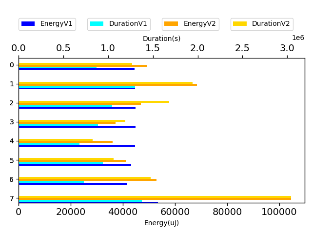

## com.google.gson.functional.ReadersWritersTest

| Test | IterationV1 | IterationV2 | DeltaIteration |
| --- | --- | --- | --- |
| com.google.gson.functional.ReadersWritersTest-testReadWriteTwoObjects | 60 | 60 | 0 |
| com.google.gson.functional.ReadersWritersTest-testReadWriteTwoStrings | 78 | 77 | -1 |
| com.google.gson.functional.ReadersWritersTest-testTopLevelNullObjectDeserializationWithReaderAndSerializeNulls | 22 | 23 | 1 |
| com.google.gson.functional.ReadersWritersTest-testTopLevelNullObjectSerializationWithWriterAndSerializeNulls | 18 | 23 | 5 |

| Test | EnergyV1 | EnergyV2 | DeltaEnergy |
| --- | --- | --- | --- |
| com.google.gson.functional.ReadersWritersTest-testReadWriteTwoObjects | 45249.09262024086 | 66321.0522420694 | 21071.959621828544 |
| com.google.gson.functional.ReadersWritersTest-testReadWriteTwoStrings | 45041.241661409855 | 45627.373376770105 | 586.1317153602504 |
| com.google.gson.functional.ReadersWritersTest-testTopLevelNullObjectDeserializationWithReaderAndSerializeNulls | 44561.86516666412 | 46920.54272866249 | 2358.6775619983673 |
| com.google.gson.functional.ReadersWritersTest-testTopLevelNullObjectSerializationWithWriterAndSerializeNulls | 46313.37309265137 | 40613.23558998108 | -5700.137502670288 |

| Test | DurationV1 | DurationsV2 | DeltaDuration |
| --- | --- | --- | --- |
| com.google.gson.functional.ReadersWritersTest-testReadWriteTwoObjects | 928905.9233349538 | 2117657.5755850426 | 1188751.6522500888 |
| com.google.gson.functional.ReadersWritersTest-testReadWriteTwoStrings | 1194279.0569147018 | 1227614.2712941954 | 33335.21437949361 |
| com.google.gson.functional.ReadersWritersTest-testTopLevelNullObjectDeserializationWithReaderAndSerializeNulls | 453132.1971182823 | 691074.6654720306 | 237942.46835374832 |
| com.google.gson.functional.ReadersWritersTest-testTopLevelNullObjectSerializationWithWriterAndSerializeNulls | 402888.7404098511 | 464334.5261261463 | 61445.78571629524 |

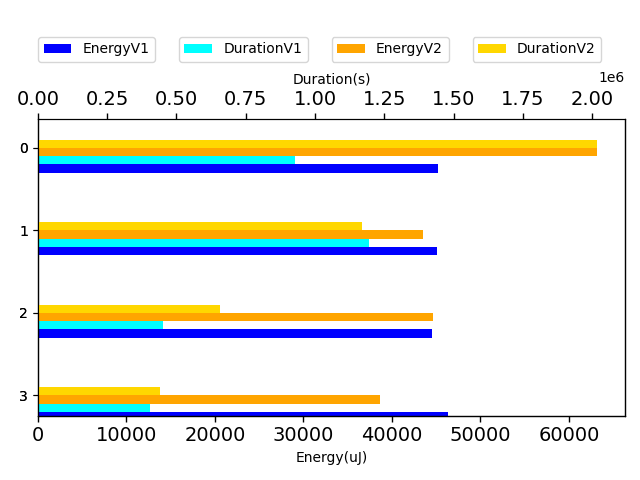

## com.google.gson.functional.CustomDeserializerTest

| Test | IterationV1 | IterationV2 | DeltaIteration |
| --- | --- | --- | --- |
| com.google.gson.functional.CustomDeserializerTest-testCustomDeserializerReturnsNullForArrayElementsForArrayField | 64 | 62 | -2 |
| com.google.gson.functional.CustomDeserializerTest-testJsonTypeFieldBasedDeserialization | 99 | 99 | 0 |
| com.google.gson.functional.CustomDeserializerTest-testCustomDeserializerReturnsNullForTopLevelObject | 45 | 53 | 8 |
| com.google.gson.functional.CustomDeserializerTest-testCustomDeserializerReturnsNullForArrayElements | 46 | 46 | 0 |
| com.google.gson.functional.CustomDeserializerTest-testCustomDeserializerReturnsNull | 66 | 68 | 2 |

| Test | EnergyV1 | EnergyV2 | DeltaEnergy |
| --- | --- | --- | --- |
| com.google.gson.functional.CustomDeserializerTest-testCustomDeserializerReturnsNullForArrayElementsForArrayField | 43159.42351428236 | 43608.11755633938 | 448.6940420570172 |
| com.google.gson.functional.CustomDeserializerTest-testJsonTypeFieldBasedDeserialization | 66905.6927995193 | 67229.62802399171 | 323.9352244724141 |
| com.google.gson.functional.CustomDeserializerTest-testCustomDeserializerReturnsNullForTopLevelObject | 44183.488634676905 | 44352.96279528442 | 169.4741606075113 |
| com.google.gson.functional.CustomDeserializerTest-testCustomDeserializerReturnsNullForArrayElements | 45227.13525885632 | 43354.32784097318 | -1872.8074178831375 |
| com.google.gson.functional.CustomDeserializerTest-testCustomDeserializerReturnsNull | 45555.62696199459 | 48254.862168474094 | 2699.235206479505 |

| Test | DurationV1 | DurationsV2 | DeltaDuration |
| --- | --- | --- | --- |
| com.google.gson.functional.CustomDeserializerTest-testCustomDeserializerReturnsNullForArrayElementsForArrayField | 835964.918886308 | 983830.4221809602 | 147865.5032946522 |
| com.google.gson.functional.CustomDeserializerTest-testJsonTypeFieldBasedDeserialization | 1400762.2157029598 | 1869443.9184331181 | 468681.70273015834 |
| com.google.gson.functional.CustomDeserializerTest-testCustomDeserializerReturnsNullForTopLevelObject | 631709.8707336766 | 671881.0544432893 | 40171.1837096127 |
| com.google.gson.functional.CustomDeserializerTest-testCustomDeserializerReturnsNullForArrayElements | 650428.9303834192 | 935975.3528350805 | 285546.4224516613 |
| com.google.gson.functional.CustomDeserializerTest-testCustomDeserializerReturnsNull | 681107.9278231661 | 918629.9847887766 | 237522.05696561048 |

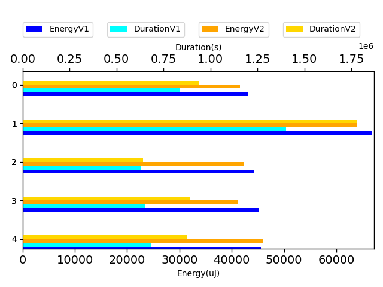

## com.google.gson.functional.TypeAdapterPrecedenceTest

| Test | IterationV1 | IterationV2 | DeltaIteration |
| --- | --- | --- | --- |
| com.google.gson.functional.TypeAdapterPrecedenceTest-testSerializeNonstreamingTypeAdapterFollowedByStreamingTypeAdapter | 30 | 19 | -11 |
| com.google.gson.functional.TypeAdapterPrecedenceTest-testNonstreamingFollowedByNonstreaming | 82 | 84 | 2 |
| com.google.gson.functional.TypeAdapterPrecedenceTest-testStreamingFollowedByNonstreamingHierarchical | 21 | 15 | -6 |
| com.google.gson.functional.TypeAdapterPrecedenceTest-testStreamingFollowedByNonstreaming | 17 | 26 | 9 |
| com.google.gson.functional.TypeAdapterPrecedenceTest-testNonstreamingHierarchicalFollowedByNonstreaming | 20 | 26 | 6 |
| com.google.gson.functional.TypeAdapterPrecedenceTest-testStreamingHierarchicalFollowedByNonstreamingHierarchical | 41 | 28 | -13 |
| com.google.gson.functional.TypeAdapterPrecedenceTest-testStreamingFollowedByStreaming | 38 | 36 | -2 |
| com.google.gson.functional.TypeAdapterPrecedenceTest-testStreamingHierarchicalFollowedByNonstreaming | 17 | 15 | -2 |

| Test | EnergyV1 | EnergyV2 | DeltaEnergy |
| --- | --- | --- | --- |
| com.google.gson.functional.TypeAdapterPrecedenceTest-testSerializeNonstreamingTypeAdapterFollowedByStreamingTypeAdapter | 44227.895226759836 | 39557.77726364136 | -4670.117963118479 |
| com.google.gson.functional.TypeAdapterPrecedenceTest-testNonstreamingFollowedByNonstreaming | 43065.07639496844 | 86342.36657540497 | 43277.29018043653 |
| com.google.gson.functional.TypeAdapterPrecedenceTest-testStreamingFollowedByNonstreamingHierarchical | 37407.36953353882 | 61658.275634765625 | 24250.906101226807 |
| com.google.gson.functional.TypeAdapterPrecedenceTest-testStreamingFollowedByNonstreaming | 39007.09541320801 | 42375.01527547836 | 3367.919862270355 |
| com.google.gson.functional.TypeAdapterPrecedenceTest-testNonstreamingHierarchicalFollowedByNonstreaming | 46721.39560317993 | 39689.60023790598 | -7031.7953652739525 |
| com.google.gson.functional.TypeAdapterPrecedenceTest-testStreamingHierarchicalFollowedByNonstreamingHierarchical | 42111.067730029026 | 329923.6940572262 | 287812.6263271972 |
| com.google.gson.functional.TypeAdapterPrecedenceTest-testStreamingFollowedByStreaming | 42598.241513441564 | 45578.278600437436 | 2980.0370869958715 |
| com.google.gson.functional.TypeAdapterPrecedenceTest-testStreamingHierarchicalFollowedByNonstreaming | 40843.93981933594 | 45530.08093261719 | 4686.14111328125 |

| Test | DurationV1 | DurationsV2 | DeltaDuration |
| --- | --- | --- | --- |
| com.google.gson.functional.TypeAdapterPrecedenceTest-testSerializeNonstreamingTypeAdapterFollowedByStreamingTypeAdapter | 451216.84721585736 | 633695.9535255432 | 182479.10630968586 |
| com.google.gson.functional.TypeAdapterPrecedenceTest-testNonstreamingFollowedByNonstreaming | 1070111.0866584224 | 2227327.050889289 | 1157215.9642308666 |
| com.google.gson.functional.TypeAdapterPrecedenceTest-testStreamingFollowedByNonstreamingHierarchical | 529867.0572633743 | 7760848.311828613 | 7230981.254565239 |
| com.google.gson.functional.TypeAdapterPrecedenceTest-testStreamingFollowedByNonstreaming | 527782.8467254639 | 570317.8620159924 | 42535.015290528536 |
| com.google.gson.functional.TypeAdapterPrecedenceTest-testNonstreamingHierarchicalFollowedByNonstreaming | 1252213.2798461914 | 988447.8562605679 | -263765.4235856235 |
| com.google.gson.functional.TypeAdapterPrecedenceTest-testStreamingHierarchicalFollowedByNonstreamingHierarchical | 533839.5239324586 | 9041388.388747461 | 8507548.864815002 |
| com.google.gson.functional.TypeAdapterPrecedenceTest-testStreamingFollowedByStreaming | 803178.6377767151 | 622234.33199513 | -180944.30578158505 |
| com.google.gson.functional.TypeAdapterPrecedenceTest-testStreamingHierarchicalFollowedByNonstreaming | 548157.2007446289 | 394087.8835449219 | -154069.31719970703 |

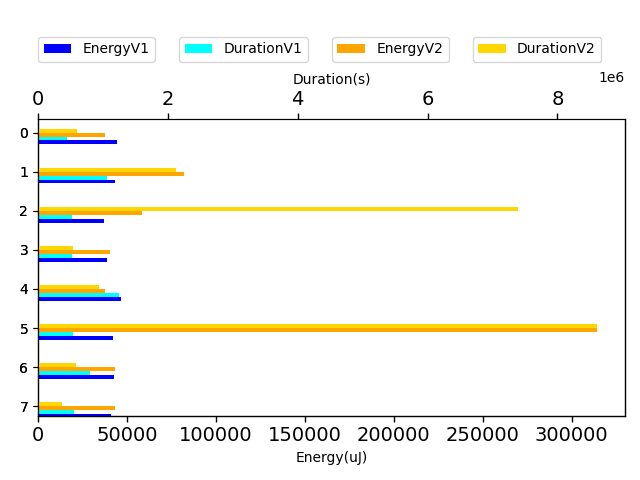

## com.google.gson.JsonParserTest

| Test | IterationV1 | IterationV2 | DeltaIteration |
| --- | --- | --- | --- |
| com.google.gson.JsonParserTest-testReadWriteTwoObjects | 68 | 71 | 3 |

| Test | EnergyV1 | EnergyV2 | DeltaEnergy |
| --- | --- | --- | --- |
| com.google.gson.JsonParserTest-testReadWriteTwoObjects | 78820.49321640363 | 122758.70507441927 | 43938.21185801564 |

| Test | DurationV1 | DurationsV2 | DeltaDuration |
| --- | --- | --- | --- |
| com.google.gson.JsonParserTest-testReadWriteTwoObjects | 1572750.085865825 | 3400670.563528539 | 1827920.4776627142 |

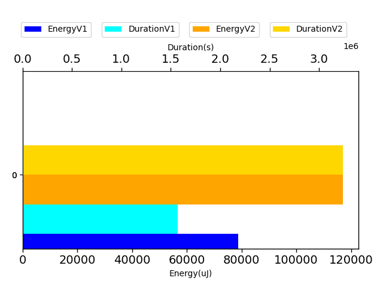

## com.google.gson.functional.ObjectTest

| Test | IterationV1 | IterationV2 | DeltaIteration |
| --- | --- | --- | --- |
| com.google.gson.functional.ObjectTest-testSingletonLists | 99 | 97 | -2 |
| com.google.gson.functional.ObjectTest-testAnonymousLocalClassesCustomSerialization | 78 | 66 | -12 |
| com.google.gson.functional.ObjectTest-testInnerClassDeserialization | 84 | 85 | 1 |
| com.google.gson.functional.ObjectTest-testJsonObjectSerialization | 24 | 32 | 8 |

| Test | EnergyV1 | EnergyV2 | DeltaEnergy |
| --- | --- | --- | --- |
| com.google.gson.functional.ObjectTest-testSingletonLists | 45819.120904477066 | 63298.84441531671 | 17479.72351083964 |
| com.google.gson.functional.ObjectTest-testAnonymousLocalClassesCustomSerialization | 46659.01430986204 | 43607.105340419876 | -3051.9089694421637 |
| com.google.gson.functional.ObjectTest-testInnerClassDeserialization | 44012.80167279525 | 42378.05800110558 | -1634.74367168967 |
| com.google.gson.functional.ObjectTest-testJsonObjectSerialization | 42548.89662194252 | 45344.71441707807 | 2795.8177951355465 |

| Test | DurationV1 | DurationsV2 | DeltaDuration |
| --- | --- | --- | --- |
| com.google.gson.functional.ObjectTest-testSingletonLists | 1395037.0300651211 | 2130423.094243634 | 735386.0641785129 |
| com.google.gson.functional.ObjectTest-testAnonymousLocalClassesCustomSerialization | 939418.4595915535 | 1530536.398629057 | 591117.9390375034 |
| com.google.gson.functional.ObjectTest-testInnerClassDeserialization | 1223932.0377189154 | 1252363.0821174409 | 28431.044398525497 |
| com.google.gson.functional.ObjectTest-testJsonObjectSerialization | 631620.2717965841 | 485053.8242493486 | -146566.44754723553 |

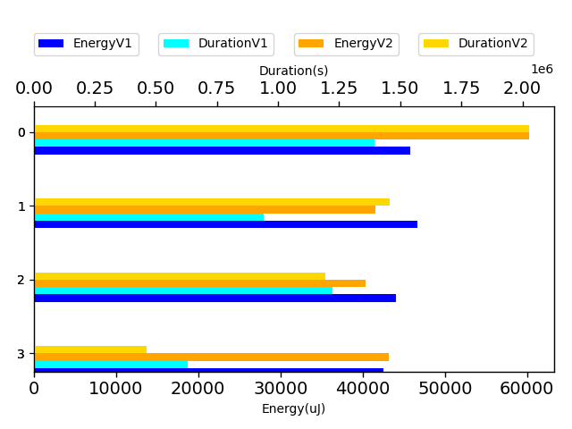

## com.google.gson.functional.VersioningTest

| Test | IterationV1 | IterationV2 | DeltaIteration |
| --- | --- | --- | --- |
| com.google.gson.functional.VersioningTest-testVersionedGsonMixingSinceAndUntilDeserialization | 36 | 47 | 11 |
| com.google.gson.functional.VersioningTest-testVersionedUntilSerialization | 99 | 99 | 0 |
| com.google.gson.functional.VersioningTest-testIgnoreLaterVersionClassSerialization | 49 | 51 | 2 |
| com.google.gson.functional.VersioningTest-testVersionedGsonWithUnversionedClassesSerialization | 45 | 45 | 0 |
| com.google.gson.functional.VersioningTest-testVersionedClassesSerialization | 61 | 72 | 11 |
| com.google.gson.functional.VersioningTest-testVersionedGsonMixingSinceAndUntilSerialization | 88 | 84 | -4 |
| com.google.gson.functional.VersioningTest-testVersionedUntilDeserialization | 26 | 38 | 12 |
| com.google.gson.functional.VersioningTest-testVersionedClassesDeserialization | 41 | 40 | -1 |
| com.google.gson.functional.VersioningTest-testVersionedGsonWithUnversionedClassesDeserialization | 37 | 31 | -6 |
| com.google.gson.functional.VersioningTest-testIgnoreLaterVersionClassDeserialization | 16 | 25 | 9 |

| Test | EnergyV1 | EnergyV2 | DeltaEnergy |
| --- | --- | --- | --- |
| com.google.gson.functional.VersioningTest-testVersionedGsonMixingSinceAndUntilDeserialization | 41756.850593942494 | 38431.786355605276 | -3325.064238337218 |
| com.google.gson.functional.VersioningTest-testVersionedUntilSerialization | 159639.26698993225 | 167358.69512810462 | 7719.42813817237 |
| com.google.gson.functional.VersioningTest-testIgnoreLaterVersionClassSerialization | 45301.18269857959 | 43497.47768835219 | -1803.7050102274006 |
| com.google.gson.functional.VersioningTest-testVersionedGsonWithUnversionedClassesSerialization | 41454.874789942136 | 38680.63140500607 | -2774.2433849360677 |
| com.google.gson.functional.VersioningTest-testVersionedClassesSerialization | 44193.24612152063 | 40727.75975481383 | -3465.4863667067984 |
| com.google.gson.functional.VersioningTest-testVersionedGsonMixingSinceAndUntilSerialization | 43111.1723004261 | 40956.99254595149 | -2154.1797544746078 |
| com.google.gson.functional.VersioningTest-testVersionedUntilDeserialization | 45930.74459308386 | 39286.524687572586 | -6644.219905511272 |
| com.google.gson.functional.VersioningTest-testVersionedClassesDeserialization | 44855.1026413041 | 39930.0075890867 | -4925.095052217403 |
| com.google.gson.functional.VersioningTest-testVersionedGsonWithUnversionedClassesDeserialization | 43186.863194134174 | 47041.07587528974 | 3854.2126811555645 |
| com.google.gson.functional.VersioningTest-testIgnoreLaterVersionClassDeserialization | 42240.346130371094 | 41082.50140565634 | -1157.844724714756 |

| Test | DurationV1 | DurationsV2 | DeltaDuration |
| --- | --- | --- | --- |
| com.google.gson.functional.VersioningTest-testVersionedGsonMixingSinceAndUntilDeserialization | 625139.9753021408 | 953541.7436408318 | 328401.768338691 |
| com.google.gson.functional.VersioningTest-testVersionedUntilSerialization | 3909817.101691986 | 4662485.468711851 | 752668.3670198652 |
| com.google.gson.functional.VersioningTest-testIgnoreLaterVersionClassSerialization | 901226.8465921942 | 808257.7151726037 | -92969.13141959044 |
| com.google.gson.functional.VersioningTest-testVersionedGsonWithUnversionedClassesSerialization | 842048.2452352567 | 1340109.4295668406 | 498061.1843315839 |
| com.google.gson.functional.VersioningTest-testVersionedClassesSerialization | 944159.8366276798 | 1096773.0470652292 | 152613.2104375494 |
| com.google.gson.functional.VersioningTest-testVersionedGsonMixingSinceAndUntilSerialization | 1150106.9203906467 | 1334941.8353528923 | 184834.91496224562 |
| com.google.gson.functional.VersioningTest-testVersionedUntilDeserialization | 546193.0582900941 | 1403095.5589423478 | 856902.5006522536 |
| com.google.gson.functional.VersioningTest-testVersionedClassesDeserialization | 550600.266020796 | 1001002.3033608439 | 450402.0373400479 |
| com.google.gson.functional.VersioningTest-testVersionedGsonWithUnversionedClassesDeserialization | 523053.67719957215 | 531662.2992761759 | 8608.622076603759 |
| com.google.gson.functional.VersioningTest-testIgnoreLaterVersionClassDeserialization | 396674.1528625488 | 546139.2998118997 | 149465.14694935083 |

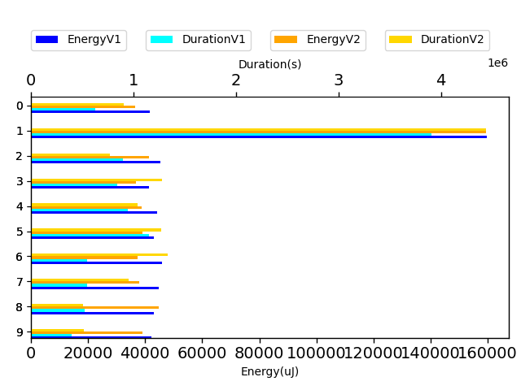

## com.google.gson.functional.PrimitiveTest

| Test | IterationV1 | IterationV2 | DeltaIteration |
| --- | --- | --- | --- |
| com.google.gson.functional.PrimitiveTest-testHtmlCharacterSerialization | 19 | 26 | 7 |
| com.google.gson.functional.PrimitiveTest-testNegativeInfinityFloatSerialization | 15 | 12 | -3 |
| com.google.gson.functional.PrimitiveTest-testDoubleNaNSerialization | 32 | 28 | -4 |
| com.google.gson.functional.PrimitiveTest-testDoubleInfinitySerialization | 17 | 14 | -3 |
| com.google.gson.functional.PrimitiveTest-testLongAsStringSerialization | 10 | 29 | 19 |
| com.google.gson.functional.PrimitiveTest-testMoreSpecificSerialization | 42 | 39 | -3 |
| com.google.gson.functional.PrimitiveTest-testLongAsStringDeserialization | 25 | 26 | 1 |
| com.google.gson.functional.PrimitiveTest-testFloatNaNSerialization | 10 | 22 | 12 |
| com.google.gson.functional.PrimitiveTest-testFloatInfinitySerialization | 15 | 10 | -5 |
| com.google.gson.functional.PrimitiveTest-testNegativeInfinitySerialization | 11 | 14 | 3 |

| Test | EnergyV1 | EnergyV2 | DeltaEnergy |
| --- | --- | --- | --- |
| com.google.gson.functional.PrimitiveTest-testHtmlCharacterSerialization | 46726.73355674744 | 43054.30605378747 | -3672.4275029599667 |
| com.google.gson.functional.PrimitiveTest-testNegativeInfinityFloatSerialization | 45189.042419433594 | 46198.109375 | 1009.0669555664062 |
| com.google.gson.functional.PrimitiveTest-testDoubleNaNSerialization | 55899.61803559121 | 48156.8064551875 | -7742.811580403708 |
| com.google.gson.functional.PrimitiveTest-testDoubleInfinitySerialization | 45787.85014343262 | 44659.80322265625 | -1128.0469207763672 |
| com.google.gson.functional.PrimitiveTest-testLongAsStringSerialization | 44798.333984375 | 45303.13360399008 | 504.799619615078 |
| com.google.gson.functional.PrimitiveTest-testMoreSpecificSerialization | 46110.52629837401 | 43293.66561238928 | -2816.8606859847278 |
| com.google.gson.functional.PrimitiveTest-testLongAsStringDeserialization | 42870.91536551714 | 43078.31170347333 | 207.3963379561901 |
| com.google.gson.functional.PrimitiveTest-testFloatNaNSerialization | 42077.814453125 | 45544.49281215668 | 3466.6783590316772 |
| com.google.gson.functional.PrimitiveTest-testFloatInfinitySerialization | 43594.535705566406 | 43996.8896484375 | 402.35394287109375 |
| com.google.gson.functional.PrimitiveTest-testNegativeInfinitySerialization | 44711.7568359375 | 46675.47265625 | 1963.7158203125 |

| Test | DurationV1 | DurationsV2 | DeltaDuration |
| --- | --- | --- | --- |
| com.google.gson.functional.PrimitiveTest-testHtmlCharacterSerialization | 444846.9892139435 | 386531.2190387547 | -58315.77017518878 |
| com.google.gson.functional.PrimitiveTest-testNegativeInfinityFloatSerialization | 332061.71743774414 | 473197.1181640625 | 141135.40072631836 |
| com.google.gson.functional.PrimitiveTest-testDoubleNaNSerialization | 724194.7113679005 | 644689.0808293521 | -79505.63053854834 |
| com.google.gson.functional.PrimitiveTest-testDoubleInfinitySerialization | 387869.1409301758 | 341769.2381591797 | -46099.902770996094 |
| com.google.gson.functional.PrimitiveTest-testLongAsStringSerialization | 571574.775390625 | 415237.11031283066 | -156337.66507779434 |
| com.google.gson.functional.PrimitiveTest-testMoreSpecificSerialization | 524085.7433482975 | 596352.6122850983 | 72266.8689368008 |
| com.google.gson.functional.PrimitiveTest-testLongAsStringDeserialization | 499518.83218717575 | 451064.9446785748 | -48453.88750860095 |
| com.google.gson.functional.PrimitiveTest-testFloatNaNSerialization | 413179.462890625 | 361024.37173604965 | -52155.09115457535 |
| com.google.gson.functional.PrimitiveTest-testFloatInfinitySerialization | 320360.76263427734 | 371011.4677734375 | 50650.705139160156 |
| com.google.gson.functional.PrimitiveTest-testNegativeInfinitySerialization | 361587.138671875 | 492406.33947753906 | 130819.20080566406 |

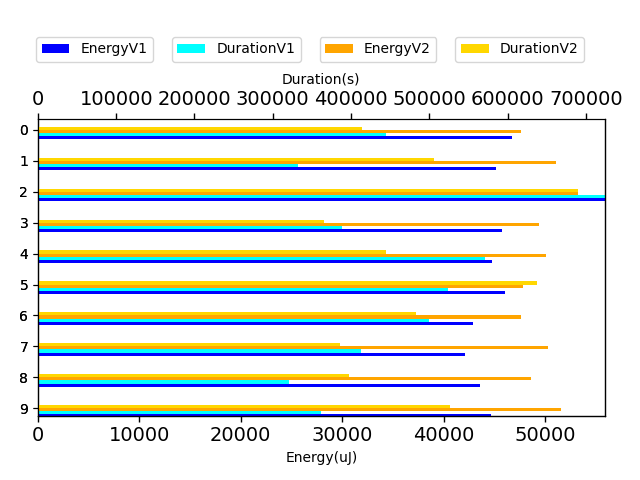

## com.google.gson.functional.JsonAdapterAnnotationOnFieldsTest

| Test | IterationV1 | IterationV2 | DeltaIteration |
| --- | --- | --- | --- |
| com.google.gson.functional.JsonAdapterAnnotationOnFieldsTest-testPrimitiveFieldAnnotationTakesPrecedenceOverDefault | 97 | 99 | 2 |
| com.google.gson.functional.JsonAdapterAnnotationOnFieldsTest-testClassAnnotationAdapterFactoryTakesPrecedenceOverDefault | 99 | 99 | 0 |
| com.google.gson.functional.JsonAdapterAnnotationOnFieldsTest-testJsonAdapterWrappedInNullSafeAsRequested | 67 | 70 | 3 |
| com.google.gson.functional.JsonAdapterAnnotationOnFieldsTest-testClassAnnotationAdapterTakesPrecedenceOverDefault | 96 | 97 | 1 |
| com.google.gson.functional.JsonAdapterAnnotationOnFieldsTest-testFieldAnnotationWorksForParameterizedType | 96 | 98 | 2 |
| com.google.gson.functional.JsonAdapterAnnotationOnFieldsTest-testFieldAnnotationTakesPrecedenceOverClassAnnotation | 87 | 86 | -1 |
| com.google.gson.functional.JsonAdapterAnnotationOnFieldsTest-testJsonAdapterInvokedOnlyForAnnotatedFields | 72 | 82 | 10 |
| com.google.gson.functional.JsonAdapterAnnotationOnFieldsTest-testFieldAnnotationTakesPrecedenceOverRegisteredTypeAdapter | 98 | 98 | 0 |
| com.google.gson.functional.JsonAdapterAnnotationOnFieldsTest-testNonPrimitiveFieldAnnotationTakesPrecedenceOverDefault | 26 | 42 | 16 |
| com.google.gson.functional.JsonAdapterAnnotationOnFieldsTest-testRegisteredTypeAdapterTakesPrecedenceOverClassAnnotationAdapter | 43 | 60 | 17 |

| Test | EnergyV1 | EnergyV2 | DeltaEnergy |
| --- | --- | --- | --- |
| com.google.gson.functional.JsonAdapterAnnotationOnFieldsTest-testPrimitiveFieldAnnotationTakesPrecedenceOverDefault | 57402.26470336385 | 42465.912215237 | -14936.352488126853 |
| com.google.gson.functional.JsonAdapterAnnotationOnFieldsTest-testClassAnnotationAdapterFactoryTakesPrecedenceOverDefault | 45475.433330880165 | 44235.935928143954 | -1239.4974027362114 |
| com.google.gson.functional.JsonAdapterAnnotationOnFieldsTest-testJsonAdapterWrappedInNullSafeAsRequested | 43861.51571847689 | 42136.02377424663 | -1725.4919442302635 |
| com.google.gson.functional.JsonAdapterAnnotationOnFieldsTest-testClassAnnotationAdapterTakesPrecedenceOverDefault | 123719.28042541844 | 218560.14417326948 | 94840.86374785104 |
| com.google.gson.functional.JsonAdapterAnnotationOnFieldsTest-testFieldAnnotationWorksForParameterizedType | 45411.635166180364 | 51666.5500786726 | 6254.914912492233 |
| com.google.gson.functional.JsonAdapterAnnotationOnFieldsTest-testFieldAnnotationTakesPrecedenceOverClassAnnotation | 43784.11531669436 | 42176.812715369684 | -1607.302601324678 |
| com.google.gson.functional.JsonAdapterAnnotationOnFieldsTest-testJsonAdapterInvokedOnlyForAnnotatedFields | 44358.297802418776 | 42323.26981630367 | -2035.0279861151066 |
| com.google.gson.functional.JsonAdapterAnnotationOnFieldsTest-testFieldAnnotationTakesPrecedenceOverRegisteredTypeAdapter | 49245.94493579548 | 45572.88314697915 | -3673.0617888163324 |
| com.google.gson.functional.JsonAdapterAnnotationOnFieldsTest-testNonPrimitiveFieldAnnotationTakesPrecedenceOverDefault | 44036.39878040552 | 41660.79977918612 | -2375.5990012194015 |
| com.google.gson.functional.JsonAdapterAnnotationOnFieldsTest-testRegisteredTypeAdapterTakesPrecedenceOverClassAnnotationAdapter | 44457.602676396855 | 44999.851271037376 | 542.2485946405213 |

| Test | DurationV1 | DurationsV2 | DeltaDuration |
| --- | --- | --- | --- |
| com.google.gson.functional.JsonAdapterAnnotationOnFieldsTest-testPrimitiveFieldAnnotationTakesPrecedenceOverDefault | 1459760.4277681885 | 1616959.12352396 | 157198.69575577136 |
| com.google.gson.functional.JsonAdapterAnnotationOnFieldsTest-testClassAnnotationAdapterFactoryTakesPrecedenceOverDefault | 1474090.756966838 | 1622964.7585546412 | 148874.00158780324 |
| com.google.gson.functional.JsonAdapterAnnotationOnFieldsTest-testJsonAdapterWrappedInNullSafeAsRequested | 851246.8248253656 | 1000301.3618232699 | 149054.5369979043 |
| com.google.gson.functional.JsonAdapterAnnotationOnFieldsTest-testClassAnnotationAdapterTakesPrecedenceOverDefault | 3286688.725497842 | 5559502.682709903 | 2272813.9572120616 |
| com.google.gson.functional.JsonAdapterAnnotationOnFieldsTest-testFieldAnnotationWorksForParameterizedType | 1323453.1801383812 | 1395450.4776973892 | 71997.297559008 |
| com.google.gson.functional.JsonAdapterAnnotationOnFieldsTest-testFieldAnnotationTakesPrecedenceOverClassAnnotation | 1143348.9093883652 | 1296053.995560037 | 152705.08617167175 |
| com.google.gson.functional.JsonAdapterAnnotationOnFieldsTest-testJsonAdapterInvokedOnlyForAnnotatedFields | 1006193.7929481596 | 1082945.2318012873 | 76751.43885312765 |
| com.google.gson.functional.JsonAdapterAnnotationOnFieldsTest-testFieldAnnotationTakesPrecedenceOverRegisteredTypeAdapter | 1476267.687889322 | 1497738.6778910405 | 21470.990001718514 |
| com.google.gson.functional.JsonAdapterAnnotationOnFieldsTest-testNonPrimitiveFieldAnnotationTakesPrecedenceOverDefault | 572085.3267908096 | 833451.4322587273 | 261366.10546791763 |
| com.google.gson.functional.JsonAdapterAnnotationOnFieldsTest-testRegisteredTypeAdapterTakesPrecedenceOverClassAnnotationAdapter | 993054.137304759 | 1022416.9824895562 | 29362.84518479719 |

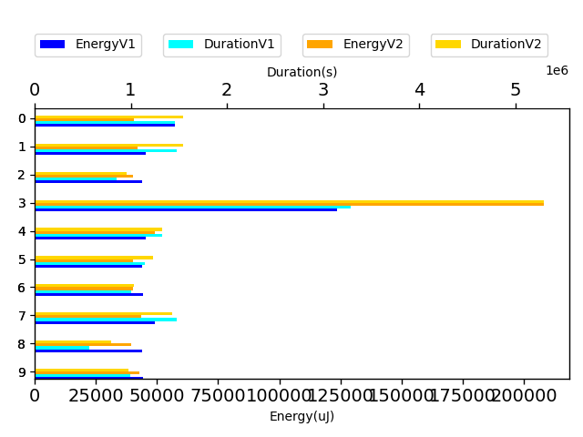

## com.google.gson.functional.NullObjectAndFieldTest

| Test | IterationV1 | IterationV2 | DeltaIteration |
| --- | --- | --- | --- |
| com.google.gson.functional.NullObjectAndFieldTest-testCustomTypeAdapterPassesNullDesrialization | 43 | 49 | 6 |
| com.google.gson.functional.NullObjectAndFieldTest-testCustomSerializationOfNulls | 57 | 52 | -5 |
| com.google.gson.functional.NullObjectAndFieldTest-testAbsentJsonElementsAreSetToNull | 65 | 71 | 6 |
| com.google.gson.functional.NullObjectAndFieldTest-testPrintPrintingObjectWithNulls | 51 | 56 | 5 |
| com.google.gson.functional.NullObjectAndFieldTest-testNullWrappedPrimitiveMemberSerialization | 44 | 49 | 5 |
| com.google.gson.functional.NullObjectAndFieldTest-testExplicitNullSetsFieldToNullDuringDeserialization | 37 | 39 | 2 |
| com.google.gson.functional.NullObjectAndFieldTest-testExplicitSerializationOfNullArrayMembers | 85 | 79 | -6 |
| com.google.gson.functional.NullObjectAndFieldTest-testExplicitSerializationOfNulls | 38 | 46 | 8 |
| com.google.gson.functional.NullObjectAndFieldTest-testCustomTypeAdapterPassesNullSerialization | 22 | 21 | -1 |
| com.google.gson.functional.NullObjectAndFieldTest-testExplicitSerializationOfNullStringMembers | 33 | 31 | -2 |
| com.google.gson.functional.NullObjectAndFieldTest-testTopLevelNullObjectSerialization | 24 | 13 | -11 |
| com.google.gson.functional.NullObjectAndFieldTest-testExplicitSerializationOfNullCollectionMembers | 35 | 33 | -2 |
| com.google.gson.functional.NullObjectAndFieldTest-testNullWrappedPrimitiveMemberDeserialization | 33 | 23 | -10 |
| com.google.gson.functional.NullObjectAndFieldTest-testExplicitDeserializationOfNulls | 36 | 26 | -10 |
| com.google.gson.functional.NullObjectAndFieldTest-testTopLevelNullObjectDeserialization | 20 | 21 | 1 |
| com.google.gson.functional.NullObjectAndFieldTest-testPrintPrintingArraysWithNulls | 18 | 23 | 5 |

| Test | EnergyV1 | EnergyV2 | DeltaEnergy |
| --- | --- | --- | --- |
| com.google.gson.functional.NullObjectAndFieldTest-testCustomTypeAdapterPassesNullDesrialization | 39491.863246262015 | 45088.00934089563 | 5596.146094633616 |
| com.google.gson.functional.NullObjectAndFieldTest-testCustomSerializationOfNulls | 75671.44943246924 | 60465.572868588555 | -15205.87656388068 |
| com.google.gson.functional.NullObjectAndFieldTest-testAbsentJsonElementsAreSetToNull | 41932.30135305174 | 48446.62557289559 | 6514.324219843846 |
| com.google.gson.functional.NullObjectAndFieldTest-testPrintPrintingObjectWithNulls | 39519.99253334089 | 46949.58972909518 | 7429.597195754293 |
| com.google.gson.functional.NullObjectAndFieldTest-testNullWrappedPrimitiveMemberSerialization | 36138.064835982135 | 44532.95221290639 | 8394.887376924256 |
| com.google.gson.functional.NullObjectAndFieldTest-testExplicitNullSetsFieldToNullDuringDeserialization | 37120.19662237159 | 46872.07166871082 | 9751.875046339228 |
| com.google.gson.functional.NullObjectAndFieldTest-testExplicitSerializationOfNullArrayMembers | 54204.729654377516 | 47414.82349806457 | -6789.9061563129435 |
| com.google.gson.functional.NullObjectAndFieldTest-testExplicitSerializationOfNulls | 36320.03414985044 | 44834.58677646037 | 8514.552626609926 |
| com.google.gson.functional.NullObjectAndFieldTest-testCustomTypeAdapterPassesNullSerialization | 36932.022449970245 | 44909.21469116211 | 7977.192241191864 |
| com.google.gson.functional.NullObjectAndFieldTest-testExplicitSerializationOfNullStringMembers | 42443.86670036055 | 44784.33826287696 | 2340.47156251641 |
| com.google.gson.functional.NullObjectAndFieldTest-testTopLevelNullObjectSerialization | 524155.9296542406 | 46224.109375 | -477931.8202792406 |
| com.google.gson.functional.NullObjectAndFieldTest-testExplicitSerializationOfNullCollectionMembers | 43121.99465516163 | 46599.78741528909 | 3477.792760127457 |
| com.google.gson.functional.NullObjectAndFieldTest-testNullWrappedPrimitiveMemberDeserialization | 40634.791735390434 | 45342.98323392868 | 4708.191498538246 |
| com.google.gson.functional.NullObjectAndFieldTest-testExplicitDeserializationOfNulls | 41966.29623720725 | 46753.292082846165 | 4786.995845638914 |
| com.google.gson.functional.NullObjectAndFieldTest-testTopLevelNullObjectDeserialization | 60207.62639045715 | 51339.73895359039 | -8867.88743686676 |
| com.google.gson.functional.NullObjectAndFieldTest-testPrintPrintingArraysWithNulls | 45263.95662689209 | 46292.80639195442 | 1028.8497650623322 |

| Test | DurationV1 | DurationsV2 | DeltaDuration |
| --- | --- | --- | --- |
| com.google.gson.functional.NullObjectAndFieldTest-testCustomTypeAdapterPassesNullDesrialization | 1075187.9817016723 | 652809.0906482845 | -422378.8910533878 |
| com.google.gson.functional.NullObjectAndFieldTest-testCustomSerializationOfNulls | 2171580.156363196 | 1495135.6972029032 | -676444.459160293 |
| com.google.gson.functional.NullObjectAndFieldTest-testAbsentJsonElementsAreSetToNull | 916918.9862347271 | 862180.4675456854 | -54738.518689041724 |
| com.google.gson.functional.NullObjectAndFieldTest-testPrintPrintingObjectWithNulls | 796942.562460656 | 677302.8843805745 | -119639.67808008159 |
| com.google.gson.functional.NullObjectAndFieldTest-testNullWrappedPrimitiveMemberSerialization | 936545.6959045853 | 732032.1869895337 | -204513.50891505159 |
| com.google.gson.functional.NullObjectAndFieldTest-testExplicitNullSetsFieldToNullDuringDeserialization | 765615.5406787564 | 681352.08597573 | -84263.45470302645 |
| com.google.gson.functional.NullObjectAndFieldTest-testExplicitSerializationOfNullArrayMembers | 1662130.11647201 | 1385744.6523097206 | -276385.4641622894 |
| com.google.gson.functional.NullObjectAndFieldTest-testExplicitSerializationOfNulls | 1536367.8592613 | 761782.8316137416 | -774585.0276475584 |
| com.google.gson.functional.NullObjectAndFieldTest-testCustomTypeAdapterPassesNullSerialization | 657900.1825928688 | 447934.72890758514 | -209965.45368528366 |
| com.google.gson.functional.NullObjectAndFieldTest-testExplicitSerializationOfNullStringMembers | 584633.9294378492 | 518412.47670475626 | -66221.45273309294 |
| com.google.gson.functional.NullObjectAndFieldTest-testTopLevelNullObjectSerialization | 16507613.528734684 | 517404.7861328125 | -15990208.742601871 |
| com.google.gson.functional.NullObjectAndFieldTest-testExplicitSerializationOfNullCollectionMembers | 571116.3126034511 | 597419.4951692754 | 26303.18256582436 |
| com.google.gson.functional.NullObjectAndFieldTest-testNullWrappedPrimitiveMemberDeserialization | 557673.2273523142 | 447031.47243642807 | -110641.7549158861 |
| com.google.gson.functional.NullObjectAndFieldTest-testExplicitDeserializationOfNulls | 571293.4037943892 | 639881.5715793073 | 68588.1677849181 |
| com.google.gson.functional.NullObjectAndFieldTest-testTopLevelNullObjectDeserialization | 1404624.0808830261 | 422395.93938684464 | -982228.1414961815 |
| com.google.gson.functional.NullObjectAndFieldTest-testPrintPrintingArraysWithNulls | 369403.78648376465 | 503049.44059181213 | 133645.65410804749 |

## com.google.gson.functional.TypeVariableTest

| Test | IterationV1 | IterationV2 | DeltaIteration |
| --- | --- | --- | --- |
| com.google.gson.functional.TypeVariableTest-testBasicTypeVariables | 62 | 61 | -1 |
| com.google.gson.functional.TypeVariableTest-testAdvancedTypeVariables | 99 | 99 | 0 |
| com.google.gson.functional.TypeVariableTest-testTypeVariablesViaTypeParameter | 86 | 85 | -1 |

| Test | EnergyV1 | EnergyV2 | DeltaEnergy |
| --- | --- | --- | --- |
| com.google.gson.functional.TypeVariableTest-testBasicTypeVariables | 44547.518011895416 | 43599.80218935663 | -947.715822538783 |
| com.google.gson.functional.TypeVariableTest-testAdvancedTypeVariables | 67672.9719564034 | 80978.53579792065 | 13305.563841517243 |
| com.google.gson.functional.TypeVariableTest-testTypeVariablesViaTypeParameter | 56255.871829424534 | 65640.45686454099 | 9384.585035116455 |

| Test | DurationV1 | DurationsV2 | DeltaDuration |
| --- | --- | --- | --- |
| com.google.gson.functional.TypeVariableTest-testBasicTypeVariables | 726330.8639243105 | 856514.5399478399 | 130183.67602352938 |
| com.google.gson.functional.TypeVariableTest-testAdvancedTypeVariables | 2136135.9808908626 | 2419409.128011982 | 283273.1471211193 |
| com.google.gson.functional.TypeVariableTest-testTypeVariablesViaTypeParameter | 1257286.780249901 | 1627185.9724657505 | 369899.1922158494 |

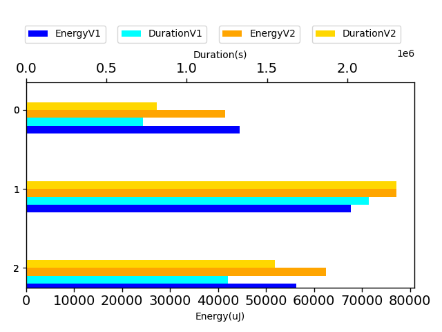

## com.google.gson.functional.EnumTest

| Test | IterationV1 | IterationV2 | DeltaIteration |
| --- | --- | --- | --- |
| com.google.gson.functional.EnumTest-testEnumSubclassWithRegisteredTypeAdapter | 99 | 99 | 0 |

| Test | EnergyV1 | EnergyV2 | DeltaEnergy |
| --- | --- | --- | --- |
| com.google.gson.functional.EnumTest-testEnumSubclassWithRegisteredTypeAdapter | 98242.0231877713 | 147983.3137492937 | 49741.290561522415 |

| Test | DurationV1 | DurationsV2 | DeltaDuration |
| --- | --- | --- | --- |
| com.google.gson.functional.EnumTest-testEnumSubclassWithRegisteredTypeAdapter | 2472236.369128636 | 3804144.7403604146 | 1331908.3712317785 |

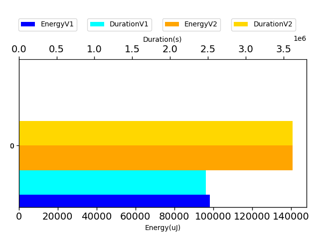

## com.google.gson.functional.MapAsArrayTypeAdapterTest

| Test | IterationV1 | IterationV2 | DeltaIteration |
| --- | --- | --- | --- |
| com.google.gson.functional.MapAsArrayTypeAdapterTest-testMultipleEnableComplexKeyRegistrationHasNoEffect | 73 | 76 | 3 |
| com.google.gson.functional.MapAsArrayTypeAdapterTest-testMapWithTypeVariableDeserialization | 67 | 70 | 3 |
| com.google.gson.functional.MapAsArrayTypeAdapterTest-testSerializeComplexMapWithTypeAdapter | 99 | 99 | 0 |
| com.google.gson.functional.MapAsArrayTypeAdapterTest-testMapWithTypeVariableSerialization | 83 | 92 | 9 |
| com.google.gson.functional.MapAsArrayTypeAdapterTest-testTwoTypesCollapseToOneDeserialize | 78 | 81 | 3 |

| Test | EnergyV1 | EnergyV2 | DeltaEnergy |
| --- | --- | --- | --- |
| com.google.gson.functional.MapAsArrayTypeAdapterTest-testMultipleEnableComplexKeyRegistrationHasNoEffect | 44044.04932901384 | 45590.42976450696 | 1546.3804354931199 |
| com.google.gson.functional.MapAsArrayTypeAdapterTest-testMapWithTypeVariableDeserialization | 45977.282115932125 | 45552.594552458424 | -424.6875634737007 |
| com.google.gson.functional.MapAsArrayTypeAdapterTest-testSerializeComplexMapWithTypeAdapter | 107012.5270521956 | 91661.75224418474 | -15350.774808010858 |
| com.google.gson.functional.MapAsArrayTypeAdapterTest-testMapWithTypeVariableSerialization | 42664.07974958958 | 45247.28857652233 | 2583.2088269327505 |
| com.google.gson.functional.MapAsArrayTypeAdapterTest-testTwoTypesCollapseToOneDeserialize | 83451.53941468801 | 68754.27970736762 | -14697.259707320394 |

| Test | DurationV1 | DurationsV2 | DeltaDuration |
| --- | --- | --- | --- |
| com.google.gson.functional.MapAsArrayTypeAdapterTest-testMultipleEnableComplexKeyRegistrationHasNoEffect | 1047828.4721862976 | 890508.4839346709 | -157319.98825162672 |
| com.google.gson.functional.MapAsArrayTypeAdapterTest-testMapWithTypeVariableDeserialization | 1143615.2847903655 | 870994.7031430686 | -272620.5816472969 |
| com.google.gson.functional.MapAsArrayTypeAdapterTest-testSerializeComplexMapWithTypeAdapter | 2444532.738066867 | 2227038.313161651 | -217494.42490521586 |
| com.google.gson.functional.MapAsArrayTypeAdapterTest-testMapWithTypeVariableSerialization | 1164276.1020042887 | 1077523.8103066143 | -86752.29169767443 |
| com.google.gson.functional.MapAsArrayTypeAdapterTest-testTwoTypesCollapseToOneDeserialize | 1934836.5899633593 | 1324628.667731973 | -610207.9222313862 |

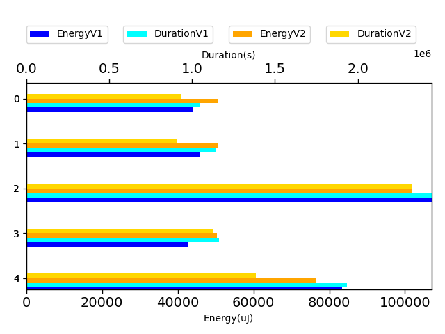

## com.google.gson.functional.JavaUtilConcurrentAtomicTest

| Test | IterationV1 | IterationV2 | DeltaIteration |
| --- | --- | --- | --- |
| com.google.gson.functional.JavaUtilConcurrentAtomicTest-testAtomicLongWithStringSerializationPolicy | 68 | 55 | -13 |
| com.google.gson.functional.JavaUtilConcurrentAtomicTest-testAtomicLongArrayWithStringSerializationPolicy | 98 | 99 | 1 |

| Test | EnergyV1 | EnergyV2 | DeltaEnergy |
| --- | --- | --- | --- |
| com.google.gson.functional.JavaUtilConcurrentAtomicTest-testAtomicLongWithStringSerializationPolicy | 48591.17298263136 | 40948.30502424056 | -7642.8679583908015 |
| com.google.gson.functional.JavaUtilConcurrentAtomicTest-testAtomicLongArrayWithStringSerializationPolicy | 79096.83961313797 | 42128.29248607479 | -36968.54712706318 |

| Test | DurationV1 | DurationsV2 | DeltaDuration |
| --- | --- | --- | --- |
| com.google.gson.functional.JavaUtilConcurrentAtomicTest-testAtomicLongWithStringSerializationPolicy | 1055865.9634303795 | 803975.3008660432 | -251890.66256433632 |
| com.google.gson.functional.JavaUtilConcurrentAtomicTest-testAtomicLongArrayWithStringSerializationPolicy | 1472090.3780648608 | 1238441.5579323273 | -233648.82013253355 |

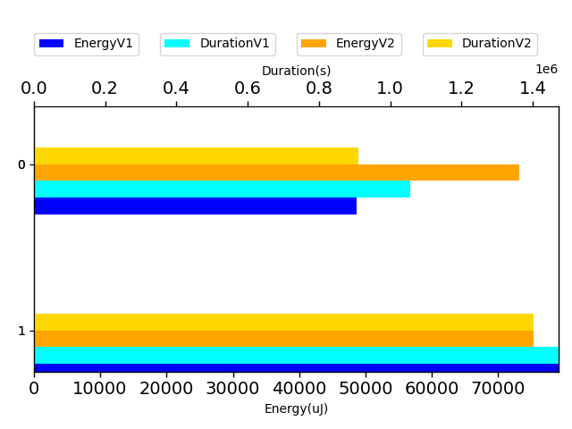

## com.google.gson.functional.ParameterizedTypesTest

| Test | IterationV1 | IterationV2 | DeltaIteration |
| --- | --- | --- | --- |
| com.google.gson.functional.ParameterizedTypesTest-testParameterizedTypeWithReaderDeserialization | 73 | 61 | -12 |
| com.google.gson.functional.ParameterizedTypesTest-testParameterizedTypeWithCustomSerializer | 93 | 92 | -1 |
| com.google.gson.functional.ParameterizedTypesTest-testParameterizedTypeDeserialization | 99 | 99 | 0 |
| com.google.gson.functional.ParameterizedTypesTest-testParameterizedTypesWithCustomDeserializer | 89 | 79 | -10 |

| Test | EnergyV1 | EnergyV2 | DeltaEnergy |
| --- | --- | --- | --- |
| com.google.gson.functional.ParameterizedTypesTest-testParameterizedTypeWithReaderDeserialization | 43500.60402965711 | 44934.886461953654 | 1434.2824322965462 |
| com.google.gson.functional.ParameterizedTypesTest-testParameterizedTypeWithCustomSerializer | 72310.56956346343 | 65061.578434551266 | -7248.9911289121665 |
| com.google.gson.functional.ParameterizedTypesTest-testParameterizedTypeDeserialization | 83322.05283385885 | 93538.88269350838 | 10216.82985964953 |
| com.google.gson.functional.ParameterizedTypesTest-testParameterizedTypesWithCustomDeserializer | 44139.73818866289 | 51687.44240217701 | 7547.704213514124 |

| Test | DurationV1 | DurationsV2 | DeltaDuration |
| --- | --- | --- | --- |
| com.google.gson.functional.ParameterizedTypesTest-testParameterizedTypeWithReaderDeserialization | 941041.9216482831 | 1202473.302303575 | 261431.38065529184 |
| com.google.gson.functional.ParameterizedTypesTest-testParameterizedTypeWithCustomSerializer | 2221400.343170355 | 1503231.0853242911 | -718169.2578460639 |
| com.google.gson.functional.ParameterizedTypesTest-testParameterizedTypeDeserialization | 2837695.681888842 | 2021560.4192368584 | -816135.2626519836 |
| com.google.gson.functional.ParameterizedTypesTest-testParameterizedTypesWithCustomDeserializer | 1134935.6526119397 | 1297833.842853333 | 162898.1902413934 |

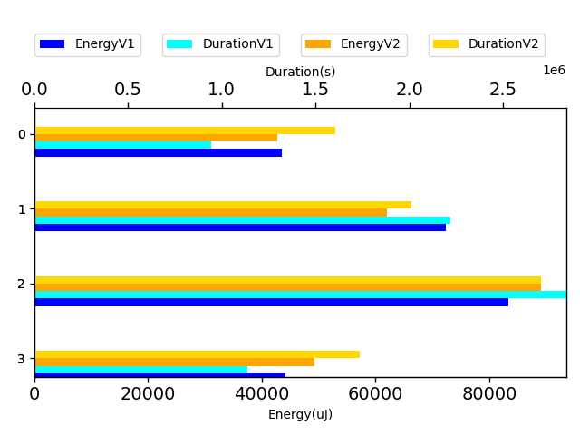

## com.google.gson.functional.FieldNamingTest

| Test | IterationV1 | IterationV2 | DeltaIteration |
| --- | --- | --- | --- |
| com.google.gson.functional.FieldNamingTest-testIdentity | 92 | 89 | -3 |
| com.google.gson.functional.FieldNamingTest-testLowerCaseWithUnderscores | 43 | 41 | -2 |
| com.google.gson.functional.FieldNamingTest-testUpperCamelCaseWithSpaces | 37 | 48 | 11 |
| com.google.gson.functional.FieldNamingTest-testUpperCamelCase | 47 | 38 | -9 |
| com.google.gson.functional.FieldNamingTest-testLowerCaseWithDashes | 33 | 40 | 7 |

| Test | EnergyV1 | EnergyV2 | DeltaEnergy |
| --- | --- | --- | --- |
| com.google.gson.functional.FieldNamingTest-testIdentity | 94321.74734595112 | 603855.4212155552 | 509533.673869604 |
| com.google.gson.functional.FieldNamingTest-testLowerCaseWithUnderscores | 39461.772906991304 | 41214.18062307736 | 1752.4077160860543 |
| com.google.gson.functional.FieldNamingTest-testUpperCamelCaseWithSpaces | 43869.820425913815 | 38465.2570061001 | -5404.563419813712 |
| com.google.gson.functional.FieldNamingTest-testUpperCamelCase | 43026.39781752917 | 38209.567738863916 | -4816.830078665254 |
| com.google.gson.functional.FieldNamingTest-testLowerCaseWithDashes | 40856.546420953935 | 38086.9498226233 | -2769.596598330638 |

| Test | DurationV1 | DurationsV2 | DeltaDuration |
| --- | --- | --- | --- |
| com.google.gson.functional.FieldNamingTest-testIdentity | 1932571.741686287 | 18595842.043878097 | 16663270.30219181 |
| com.google.gson.functional.FieldNamingTest-testLowerCaseWithUnderscores | 1183141.0438161632 | 632993.5287145366 | -550147.5151016266 |
| com.google.gson.functional.FieldNamingTest-testUpperCamelCaseWithSpaces | 545751.1330896087 | 809703.7653616611 | 263952.63227205235 |
| com.google.gson.functional.FieldNamingTest-testUpperCamelCase | 730827.6068777917 | 882789.7597387835 | 151962.15286099177 |
| com.google.gson.functional.FieldNamingTest-testLowerCaseWithDashes | 724572.3677931263 | 842890.3978172044 | 118318.03002407809 |

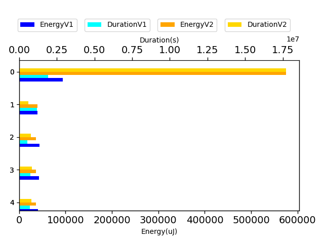

## com.google.gson.functional.SecurityTest

| Test | IterationV1 | IterationV2 | DeltaIteration |
| --- | --- | --- | --- |
| com.google.gson.functional.SecurityTest-testNonExecutableJsonSerialization | 37 | 55 | 18 |
| com.google.gson.functional.SecurityTest-testNonExecutableJsonDeserialization | 39 | 32 | -7 |
| com.google.gson.functional.SecurityTest-testJsonWithNonExectuableTokenWithRegularGsonDeserialization | 34 | 31 | -3 |
| com.google.gson.functional.SecurityTest-testJsonWithNonExectuableTokenWithConfiguredGsonDeserialization | 23 | 36 | 13 |
| com.google.gson.functional.SecurityTest-testJsonWithNonExectuableTokenSerialization | 7 | 20 | 13 |

| Test | EnergyV1 | EnergyV2 | DeltaEnergy |
| --- | --- | --- | --- |
| com.google.gson.functional.SecurityTest-testNonExecutableJsonSerialization | 44356.07089055842 | 68375.46929868576 | 24019.398408127337 |
| com.google.gson.functional.SecurityTest-testNonExecutableJsonDeserialization | 44133.85380041988 | 45927.38712142734 | 1793.5333210074605 |
| com.google.gson.functional.SecurityTest-testJsonWithNonExectuableTokenWithRegularGsonDeserialization | 43011.80459805601 | 43739.4379282156 | 727.6333301595878 |
| com.google.gson.functional.SecurityTest-testJsonWithNonExectuableTokenWithConfiguredGsonDeserialization | 46574.8940782547 | 40089.96764878713 | -6484.926429467567 |
| com.google.gson.functional.SecurityTest-testJsonWithNonExectuableTokenSerialization | 42962.25 | 44910.05396461487 | 1947.8039646148682 |

| Test | DurationV1 | DurationsV2 | DeltaDuration |
| --- | --- | --- | --- |
| com.google.gson.functional.SecurityTest-testNonExecutableJsonSerialization | 959123.3958967071 | 1190995.73588337 | 231872.33998666296 |
| com.google.gson.functional.SecurityTest-testNonExecutableJsonDeserialization | 605207.4222169037 | 774964.8961929334 | 169757.47397602978 |
| com.google.gson.functional.SecurityTest-testJsonWithNonExectuableTokenWithRegularGsonDeserialization | 491703.03017982177 | 619261.676753589 | 127558.64657376718 |
| com.google.gson.functional.SecurityTest-testJsonWithNonExectuableTokenWithConfiguredGsonDeserialization | 436080.37180685997 | 692734.8550173802 | 256654.48321052024 |
| com.google.gson.functional.SecurityTest-testJsonWithNonExectuableTokenSerialization | 327750.640625 | 374862.462808609 | 47111.82218360901 |

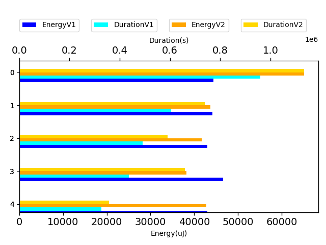

## com.google.gson.CommentsTest

| Test | IterationV1 | IterationV2 | DeltaIteration |
| --- | --- | --- | --- |
| com.google.gson.CommentsTest-testParseComments | 71 | 77 | 6 |

| Test | EnergyV1 | EnergyV2 | DeltaEnergy |
| --- | --- | --- | --- |
| com.google.gson.CommentsTest-testParseComments | 97541.29288036947 | 66286.85595764406 | -31254.436922725406 |

| Test | DurationV1 | DurationsV2 | DeltaDuration |
| --- | --- | --- | --- |
| com.google.gson.CommentsTest-testParseComments | 2167294.677355422 | 1714952.900852135 | -452341.77650328726 |

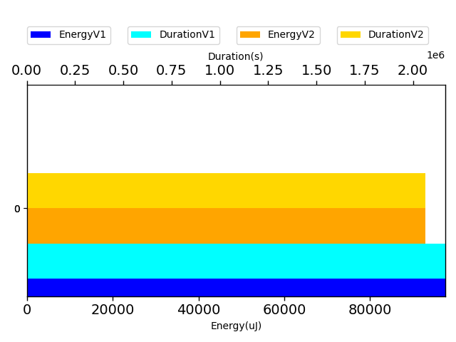

## com.google.gson.functional.ExclusionStrategyFunctionalTest

| Test | IterationV1 | IterationV2 | DeltaIteration |
| --- | --- | --- | --- |
| com.google.gson.functional.ExclusionStrategyFunctionalTest-testExcludeTopLevelClassDeserializationDoesNotImpactSerialization | 32 | 33 | 1 |
| com.google.gson.functional.ExclusionStrategyFunctionalTest-testExclusionStrategySerialization | 99 | 99 | 0 |
| com.google.gson.functional.ExclusionStrategyFunctionalTest-testExclusionStrategySerializationDoesNotImpactSerialization | 34 | 29 | -5 |
| com.google.gson.functional.ExclusionStrategyFunctionalTest-testExcludeTopLevelClassSerializationDoesNotImpactDeserialization | 38 | 38 | 0 |
| com.google.gson.functional.ExclusionStrategyFunctionalTest-testExclusionStrategyWithMode | 46 | 43 | -3 |
| com.google.gson.functional.ExclusionStrategyFunctionalTest-testExcludeTopLevelClassDeserialization | 12 | 21 | 9 |
| com.google.gson.functional.ExclusionStrategyFunctionalTest-testExclusionStrategySerializationDoesNotImpactDeserialization | 49 | 41 | -8 |
| com.google.gson.functional.ExclusionStrategyFunctionalTest-testExclusionStrategyDeserialization | 44 | 50 | 6 |
| com.google.gson.functional.ExclusionStrategyFunctionalTest-testExcludeTopLevelClassSerialization | 13 | 24 | 11 |

| Test | EnergyV1 | EnergyV2 | DeltaEnergy |
| --- | --- | --- | --- |
| com.google.gson.functional.ExclusionStrategyFunctionalTest-testExcludeTopLevelClassDeserializationDoesNotImpactSerialization | 44639.48966833018 | 42310.7180946907 | -2328.771573639475 |
| com.google.gson.functional.ExclusionStrategyFunctionalTest-testExclusionStrategySerialization | 93622.57979283317 | 90156.99661836044 | -3465.583174472733 |
| com.google.gson.functional.ExclusionStrategyFunctionalTest-testExclusionStrategySerializationDoesNotImpactSerialization | 42233.19847882481 | 44202.2926556021 | 1969.0941767772892 |
| com.google.gson.functional.ExclusionStrategyFunctionalTest-testExcludeTopLevelClassSerializationDoesNotImpactDeserialization | 42781.471439241024 | 44606.203992286086 | 1824.7325530450616 |
| com.google.gson.functional.ExclusionStrategyFunctionalTest-testExclusionStrategyWithMode | 43765.20115607593 | 45693.81597346021 | 1928.6148173842812 |
| com.google.gson.functional.ExclusionStrategyFunctionalTest-testExcludeTopLevelClassDeserialization | 43985.740234375 | 45972.6448841095 | 1986.904649734497 |
| com.google.gson.functional.ExclusionStrategyFunctionalTest-testExclusionStrategySerializationDoesNotImpactDeserialization | 43280.34510481078 | 45018.02764261663 | 1737.6825378058493 |
| com.google.gson.functional.ExclusionStrategyFunctionalTest-testExclusionStrategyDeserialization | 46228.56123223754 | 47162.36190212532 | 933.8006698877798 |
| com.google.gson.functional.ExclusionStrategyFunctionalTest-testExcludeTopLevelClassSerialization | 47050.645751953125 | 41434.53460639715 | -5616.111145555973 |

| Test | DurationV1 | DurationsV2 | DeltaDuration |
| --- | --- | --- | --- |
| com.google.gson.functional.ExclusionStrategyFunctionalTest-testExcludeTopLevelClassDeserializationDoesNotImpactSerialization | 517623.7613691515 | 490765.5021121737 | -26858.25925697782 |
| com.google.gson.functional.ExclusionStrategyFunctionalTest-testExclusionStrategySerialization | 2343052.6914491924 | 2206389.3891885667 | -136663.30226062564 |
| com.google.gson.functional.ExclusionStrategyFunctionalTest-testExclusionStrategySerializationDoesNotImpactSerialization | 631823.521779074 | 506789.0394630283 | -125034.48231604567 |
| com.google.gson.functional.ExclusionStrategyFunctionalTest-testExcludeTopLevelClassSerializationDoesNotImpactDeserialization | 530327.4658462632 | 503203.0276761345 | -27124.438170128735 |
| com.google.gson.functional.ExclusionStrategyFunctionalTest-testExclusionStrategyWithMode | 678816.3426749818 | 601260.2576272952 | -77556.08504768659 |
| com.google.gson.functional.ExclusionStrategyFunctionalTest-testExcludeTopLevelClassDeserialization | 455674.3876953125 | 442305.37822437286 | -13369.009470939636 |
| com.google.gson.functional.ExclusionStrategyFunctionalTest-testExclusionStrategySerializationDoesNotImpactDeserialization | 719252.0373808555 | 592801.0714975686 | -126450.9658832869 |
| com.google.gson.functional.ExclusionStrategyFunctionalTest-testExclusionStrategyDeserialization | 607903.228016595 | 689365.3461324105 | 81462.11811581545 |
| com.google.gson.functional.ExclusionStrategyFunctionalTest-testExcludeTopLevelClassSerialization | 355601.7663574219 | 406594.56689727306 | 50992.80053985119 |

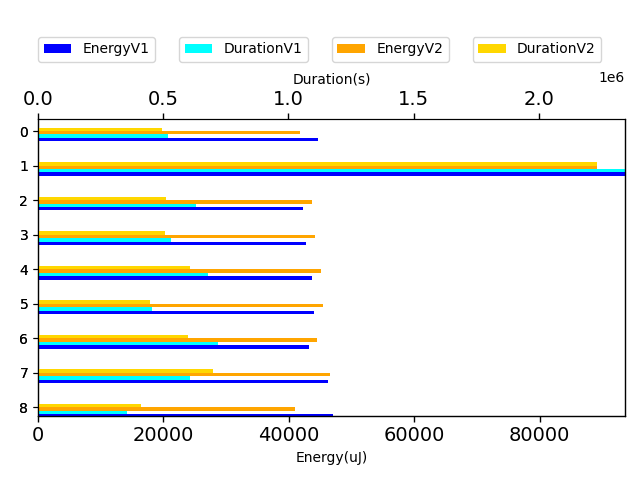

## com.google.gson.functional.UncategorizedTest

| Test | IterationV1 | IterationV2 | DeltaIteration |
| --- | --- | --- | --- |
| com.google.gson.functional.UncategorizedTest-testReturningDerivedClassesDuringDeserialization | 99 | 99 | 0 |

| Test | EnergyV1 | EnergyV2 | DeltaEnergy |
| --- | --- | --- | --- |
| com.google.gson.functional.UncategorizedTest-testReturningDerivedClassesDuringDeserialization | 59494.311071552125 | 53569.2623043502 | -5925.048767201923 |

| Test | DurationV1 | DurationsV2 | DeltaDuration |
| --- | --- | --- | --- |
| com.google.gson.functional.UncategorizedTest-testReturningDerivedClassesDuringDeserialization | 1603301.006275482 | 1955714.2829041001 | 352413.2766286181 |

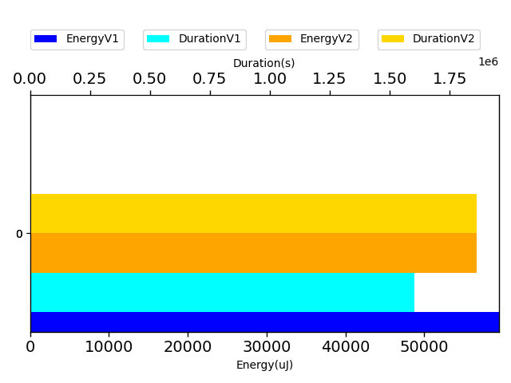

## com.google.gson.DefaultMapJsonSerializerTest

| Test | IterationV1 | IterationV2 | DeltaIteration |
| --- | --- | --- | --- |
| com.google.gson.DefaultMapJsonSerializerTest-testNonEmptyMapSerialization | 59 | 61 | 2 |

| Test | EnergyV1 | EnergyV2 | DeltaEnergy |
| --- | --- | --- | --- |
| com.google.gson.DefaultMapJsonSerializerTest-testNonEmptyMapSerialization | 47147.274612023146 | 49211.47316750376 | 2064.198555480616 |

| Test | DurationV1 | DurationsV2 | DeltaDuration |
| --- | --- | --- | --- |
| com.google.gson.DefaultMapJsonSerializerTest-testNonEmptyMapSerialization | 968715.2114815748 | 1071879.0162672233 | 103163.80478564848 |

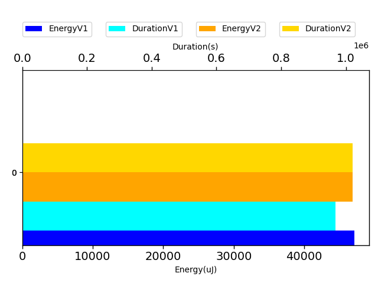

## com.google.gson.functional.TypeHierarchyAdapterTest

| Test | IterationV1 | IterationV2 | DeltaIteration |
| --- | --- | --- | --- |
| com.google.gson.functional.TypeHierarchyAdapterTest-testTypeHierarchy | 99 | 99 | 0 |
| com.google.gson.functional.TypeHierarchyAdapterTest-testRegisterSuperTypeFirst | 53 | 48 | -5 |
| com.google.gson.functional.TypeHierarchyAdapterTest-testRegisterSubTypeFirstAllowed | 8 | 14 | 6 |

| Test | EnergyV1 | EnergyV2 | DeltaEnergy |
| --- | --- | --- | --- |
| com.google.gson.functional.TypeHierarchyAdapterTest-testTypeHierarchy | 147685.74391507995 | 93042.48601039418 | -54643.25790468577 |
| com.google.gson.functional.TypeHierarchyAdapterTest-testRegisterSuperTypeFirst | 45975.993516150316 | 41319.20289637647 | -4656.790619773848 |
| com.google.gson.functional.TypeHierarchyAdapterTest-testRegisterSubTypeFirstAllowed | 102374.7578125 | 45657.1806640625 | -56717.5771484375 |

| Test | DurationV1 | DurationsV2 | DeltaDuration |
| --- | --- | --- | --- |
| com.google.gson.functional.TypeHierarchyAdapterTest-testTypeHierarchy | 3380960.2849335987 | 2471182.7998567456 | -909777.4850768531 |
| com.google.gson.functional.TypeHierarchyAdapterTest-testRegisterSuperTypeFirst | 708771.0160752666 | 621401.4193809594 | -87369.59669430729 |
| com.google.gson.functional.TypeHierarchyAdapterTest-testRegisterSubTypeFirstAllowed | 2336677.6171875 | 313242.857421875 | -2023434.759765625 |

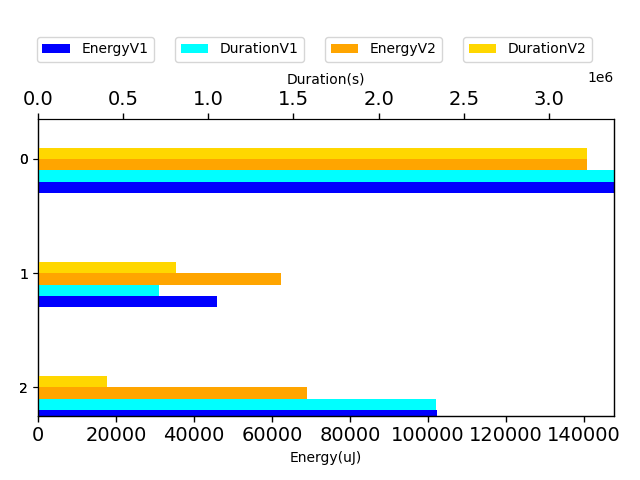

## com.google.gson.GsonTypeAdapterTest

| Test | IterationV1 | IterationV2 | DeltaIteration |
| --- | --- | --- | --- |
| com.google.gson.GsonTypeAdapterTest-testDeserializerForAbstractClass | 99 | 99 | 0 |

| Test | EnergyV1 | EnergyV2 | DeltaEnergy |
| --- | --- | --- | --- |
| com.google.gson.GsonTypeAdapterTest-testDeserializerForAbstractClass | 72170.07774477015 | 56736.467967873235 | -15433.60977689692 |

| Test | DurationV1 | DurationsV2 | DeltaDuration |
| --- | --- | --- | --- |
| com.google.gson.GsonTypeAdapterTest-testDeserializerForAbstractClass | 2123300.1330221826 | 1561734.1595007055 | -561565.9735214771 |

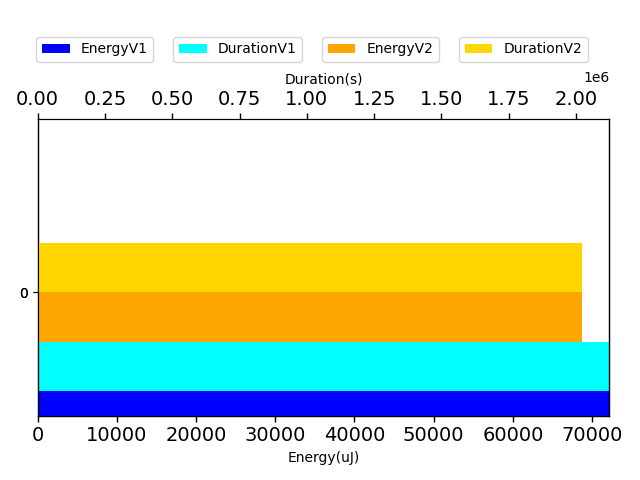

## com.google.gson.functional.FieldExclusionTest

| Test | IterationV1 | IterationV2 | DeltaIteration |
| --- | --- | --- | --- |
| com.google.gson.functional.FieldExclusionTest-testInnerClassExclusion | 24 | 21 | -3 |
| com.google.gson.functional.FieldExclusionTest-testDefaultInnerClassExclusion | 76 | 85 | 9 |
| com.google.gson.functional.FieldExclusionTest-testDefaultNestedStaticClassIncluded | 34 | 36 | 2 |

| Test | EnergyV1 | EnergyV2 | DeltaEnergy |
| --- | --- | --- | --- |
| com.google.gson.functional.FieldExclusionTest-testInnerClassExclusion | 44957.42573052645 | 45086.90008163452 | 129.4743511080742 |
| com.google.gson.functional.FieldExclusionTest-testDefaultInnerClassExclusion | 44234.75781947268 | 44782.720483827274 | 547.9626643545926 |
| com.google.gson.functional.FieldExclusionTest-testDefaultNestedStaticClassIncluded | 45264.977233440615 | 44624.571890557345 | -640.4053428832704 |

| Test | DurationV1 | DurationsV2 | DeltaDuration |
| --- | --- | --- | --- |
| com.google.gson.functional.FieldExclusionTest-testInnerClassExclusion | 400839.20023697615 | 501783.45880413055 | 100944.25856715441 |
| com.google.gson.functional.FieldExclusionTest-testDefaultInnerClassExclusion | 951120.1719553138 | 1062787.7605588182 | 111667.58860350447 |
| com.google.gson.functional.FieldExclusionTest-testDefaultNestedStaticClassIncluded | 513786.67161225865 | 571627.3813868565 | 57840.7097745979 |

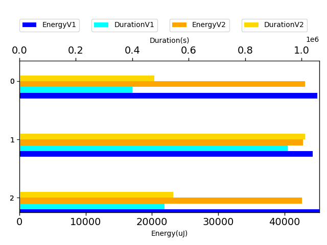

## com.google.gson.functional.CustomSerializerTest

| Test | IterationV1 | IterationV2 | DeltaIteration |
| --- | --- | --- | --- |
| com.google.gson.functional.CustomSerializerTest-testBaseClassSerializerInvokedForBaseClassFieldsHoldingSubClassInstances | 37 | 38 | 1 |
| com.google.gson.functional.CustomSerializerTest-testBaseClassSerializerInvokedForBaseClassFields | 26 | 30 | 4 |
| com.google.gson.functional.CustomSerializerTest-testSerializerReturnsNull | 57 | 42 | -15 |
| com.google.gson.functional.CustomSerializerTest-testSubClassSerializerInvokedForBaseClassFieldsHoldingArrayOfSubClassInstances | 57 | 55 | -2 |
| com.google.gson.functional.CustomSerializerTest-testSubClassSerializerInvokedForBaseClassFieldsHoldingSubClassInstances | 70 | 71 | 1 |

| Test | EnergyV1 | EnergyV2 | DeltaEnergy |
| --- | --- | --- | --- |
| com.google.gson.functional.CustomSerializerTest-testBaseClassSerializerInvokedForBaseClassFieldsHoldingSubClassInstances | 41885.16449768727 | 42917.67700707641 | 1032.5125093891402 |
| com.google.gson.functional.CustomSerializerTest-testBaseClassSerializerInvokedForBaseClassFields | 42334.43531040847 | 39218.32471270859 | -3116.1105976998806 |
| com.google.gson.functional.CustomSerializerTest-testSerializerReturnsNull | 45672.250427039806 | 44150.984139864726 | -1521.26628717508 |
| com.google.gson.functional.CustomSerializerTest-testSubClassSerializerInvokedForBaseClassFieldsHoldingArrayOfSubClassInstances | 44559.41307193997 | 43525.38217319008 | -1034.0308987498865 |
| com.google.gson.functional.CustomSerializerTest-testSubClassSerializerInvokedForBaseClassFieldsHoldingSubClassInstances | 92144.5970368661 | 135543.39068191257 | 43398.79364504648 |

| Test | DurationV1 | DurationsV2 | DeltaDuration |
| --- | --- | --- | --- |
| com.google.gson.functional.CustomSerializerTest-testBaseClassSerializerInvokedForBaseClassFieldsHoldingSubClassInstances | 572444.5932948743 | 710013.6080249533 | 137569.01473007898 |
| com.google.gson.functional.CustomSerializerTest-testBaseClassSerializerInvokedForBaseClassFields | 483145.0576374084 | 695237.0874999743 | 212092.02986256592 |
| com.google.gson.functional.CustomSerializerTest-testSerializerReturnsNull | 612845.6386728194 | 808964.2261357389 | 196118.58746291953 |
| com.google.gson.functional.CustomSerializerTest-testSubClassSerializerInvokedForBaseClassFieldsHoldingArrayOfSubClassInstances | 903254.8619283419 | 839306.587939879 | -63948.27398846287 |
| com.google.gson.functional.CustomSerializerTest-testSubClassSerializerInvokedForBaseClassFieldsHoldingSubClassInstances | 1976356.647315721 | 2965834.3007165394 | 989477.6534008184 |

## com.google.gson.GsonBuilderTest

| Test | IterationV1 | IterationV2 | DeltaIteration |
| --- | --- | --- | --- |
| com.google.gson.GsonBuilderTest-testTransientFieldExclusion | 38 | 40 | 2 |
| com.google.gson.GsonBuilderTest-testExcludeFieldsWithModifiers | 42 | 58 | 16 |
| com.google.gson.GsonBuilderTest-testCreatingMoreThanOnce | 11 | 25 | 14 |

| Test | EnergyV1 | EnergyV2 | DeltaEnergy |
| --- | --- | --- | --- |
| com.google.gson.GsonBuilderTest-testTransientFieldExclusion | 42773.74982822973 | 44403.4374478048 | 1629.6876195750665 |
| com.google.gson.GsonBuilderTest-testExcludeFieldsWithModifiers | 44949.28315210929 | 47570.78282206502 | 2621.4996699557305 |
| com.google.gson.GsonBuilderTest-testCreatingMoreThanOnce | 44612.7568359375 | 47033.064827650785 | 2420.3079917132854 |

| Test | DurationV1 | DurationsV2 | DeltaDuration |
| --- | --- | --- | --- |
| com.google.gson.GsonBuilderTest-testTransientFieldExclusion | 649899.5315736943 | 710293.2732061411 | 60393.74163244676 |
| com.google.gson.GsonBuilderTest-testExcludeFieldsWithModifiers | 793009.275211734 | 664402.1436621385 | -128607.1315495955 |
| com.google.gson.GsonBuilderTest-testCreatingMoreThanOnce | 415306.6357421875 | 388466.6436831057 | -26839.992059081793 |

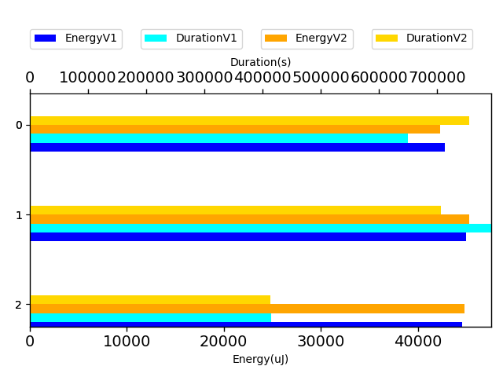

## com.google.gson.functional.CircularReferenceTest

| Test | IterationV1 | IterationV2 | DeltaIteration |
| --- | --- | --- | --- |
| com.google.gson.functional.CircularReferenceTest-testSelfReferenceCustomHandlerSerialization | 99 | 99 | 0 |

| Test | EnergyV1 | EnergyV2 | DeltaEnergy |
| --- | --- | --- | --- |
| com.google.gson.functional.CircularReferenceTest-testSelfReferenceCustomHandlerSerialization | 304264.2793053189 | 397295.5681448893 | 93031.28883957042 |

| Test | DurationV1 | DurationsV2 | DeltaDuration |
| --- | --- | --- | --- |
| com.google.gson.functional.CircularReferenceTest-testSelfReferenceCustomHandlerSerialization | 7431972.512228696 | 8980186.639820855 | 1548214.1275921594 |

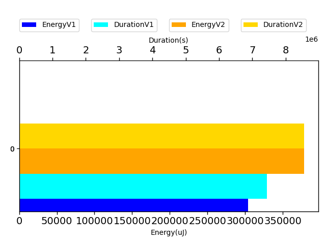

## com.google.gson.functional.EscapingTest

| Test | IterationV1 | IterationV2 | DeltaIteration |
| --- | --- | --- | --- |
| com.google.gson.functional.EscapingTest-testGsonAcceptsEscapedAndNonEscapedJsonDeserialization | 73 | 75 | 2 |

| Test | EnergyV1 | EnergyV2 | DeltaEnergy |
| --- | --- | --- | --- |
| com.google.gson.functional.EscapingTest-testGsonAcceptsEscapedAndNonEscapedJsonDeserialization | 45771.722970383205 | 46797.69697642731 | 1025.9740060441036 |

| Test | DurationV1 | DurationsV2 | DeltaDuration |
| --- | --- | --- | --- |
| com.google.gson.functional.EscapingTest-testGsonAcceptsEscapedAndNonEscapedJsonDeserialization | 753078.9566111009 | 1026459.5560233388 | 273380.5994122379 |

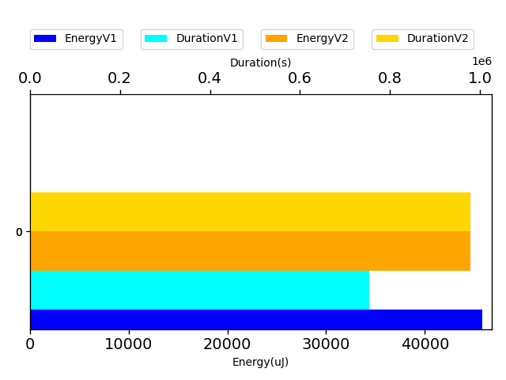

## com.google.gson.functional.CollectionTest

| Test | IterationV1 | IterationV2 | DeltaIteration |
| --- | --- | --- | --- |
| com.google.gson.functional.CollectionTest-testUserCollectionTypeAdapter | 78 | 76 | -2 |

| Test | EnergyV1 | EnergyV2 | DeltaEnergy |
| --- | --- | --- | --- |
| com.google.gson.functional.CollectionTest-testUserCollectionTypeAdapter | 44520.82759579554 | 46510.64852080207 | 1989.8209250065265 |

| Test | DurationV1 | DurationsV2 | DeltaDuration |
| --- | --- | --- | --- |
| com.google.gson.functional.CollectionTest-testUserCollectionTypeAdapter | 973542.6842638088 | 1013209.7465068193 | 39667.0622430105 |

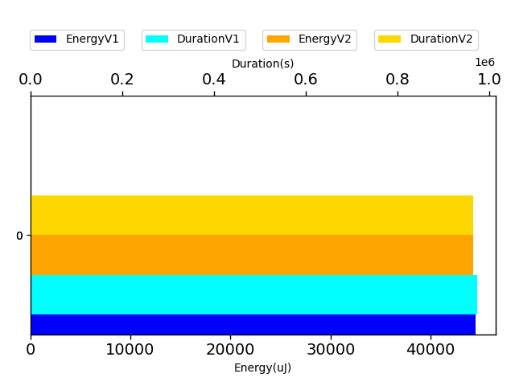

## com.google.gson.JsonObjectTest

| Test | IterationV1 | IterationV2 | DeltaIteration |
| --- | --- | --- | --- |
| com.google.gson.JsonObjectTest-testWritePropertyWithEmptyStringName | 18 | 16 | -2 |
| com.google.gson.JsonObjectTest-testPropertyWithQuotes | 22 | 23 | 1 |

| Test | EnergyV1 | EnergyV2 | DeltaEnergy |
| --- | --- | --- | --- |
| com.google.gson.JsonObjectTest-testWritePropertyWithEmptyStringName | 42716.896484375 | 42206.713134765625 | -510.183349609375 |
| com.google.gson.JsonObjectTest-testPropertyWithQuotes | 53554.40143489838 | 45865.56955087185 | -7688.831884026527 |

| Test | DurationV1 | DurationsV2 | DeltaDuration |
| --- | --- | --- | --- |
| com.google.gson.JsonObjectTest-testWritePropertyWithEmptyStringName | 505288.708404541 | 407162.6852416992 | -98126.0231628418 |
| com.google.gson.JsonObjectTest-testPropertyWithQuotes | 1089419.8940329552 | 506507.8423911333 | -582912.0516418219 |

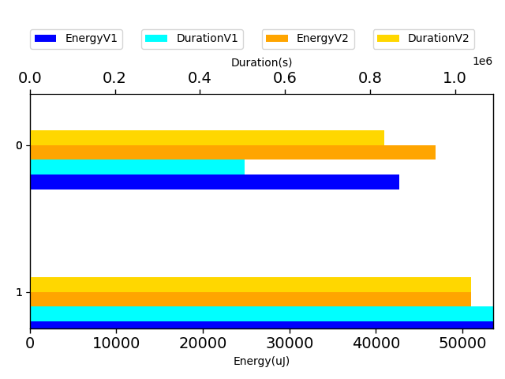

## com.google.gson.functional.ArrayTest

| Test | IterationV1 | IterationV2 | DeltaIteration |
| --- | --- | --- | --- |
| com.google.gson.functional.ArrayTest-testNullsInArrayWithSerializeNullPropertySetSerialization | 25 | 30 | 5 |
| com.google.gson.functional.ArrayTest-testArrayElementsAreArrays | 24 | 14 | -10 |

| Test | EnergyV1 | EnergyV2 | DeltaEnergy |
| --- | --- | --- | --- |
| com.google.gson.functional.ArrayTest-testNullsInArrayWithSerializeNullPropertySetSerialization | 91135.728099823 | 44169.51307805255 | -46966.21502177045 |
| com.google.gson.functional.ArrayTest-testArrayElementsAreArrays | 42226.42367386818 | 43360.192138671875 | 1133.7684648036957 |

| Test | DurationV1 | DurationsV2 | DeltaDuration |
| --- | --- | --- | --- |
| com.google.gson.functional.ArrayTest-testNullsInArrayWithSerializeNullPropertySetSerialization | 3136613.835791528 | 675919.0710838586 | -2460694.7647076696 |
| com.google.gson.functional.ArrayTest-testArrayElementsAreArrays | 412011.292701602 | 416181.0095214844 | 4169.716819882393 |

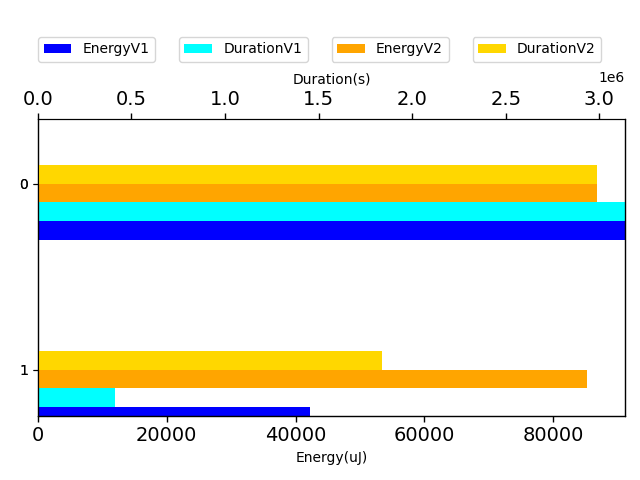

## com.google.gson.functional.PrintFormattingTest

| Test | IterationV1 | IterationV2 | DeltaIteration |
| --- | --- | --- | --- |
| com.google.gson.functional.PrintFormattingTest-testJsonObjectWithNullValuesSerialized | 28 | 34 | 6 |

| Test | EnergyV1 | EnergyV2 | DeltaEnergy |
| --- | --- | --- | --- |
| com.google.gson.functional.PrintFormattingTest-testJsonObjectWithNullValuesSerialized | 52228.17197352648 | 64553.952851968934 | 12325.780878442456 |

| Test | DurationV1 | DurationsV2 | DeltaDuration |
| --- | --- | --- | --- |
| com.google.gson.functional.PrintFormattingTest-testJsonObjectWithNullValuesSerialized | 1026779.121508643 | 1781491.7414336386 | 754712.6199249956 |

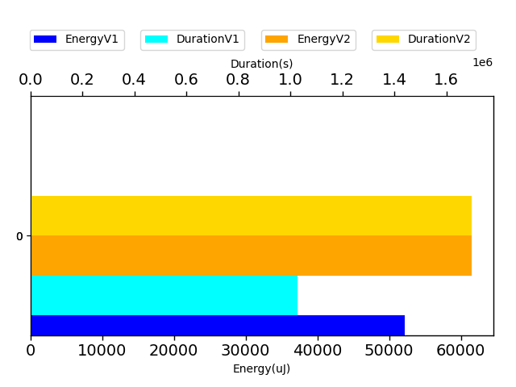

