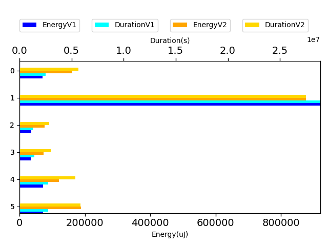
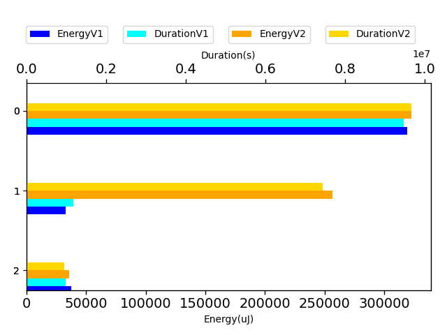

# gson 7a9fd5

https://github.com/google/gson.git/commit/7a9fd5

| Index | EnergyV1 | EnergyV2 | DeltaEnergy |
| --- | --- | --- | --- |
| 0 | 1206784.058105478 | 724612.505647622 | -482171.552457856 |
| 1 | 389822.8660828195 | 645654.7800797621 | 255831.91399694257 |

| Index | DurationV1 | DurationsV2 | DeltaDuration |
| --- | --- | --- | --- |
| 0 | 39615516.542144954 | 23089143.52809411 | -16526373.014050845 |
| 1 | 11624793.778389784 | 18962963.658385612 | 7338169.8799958285 |

| Index | TestClassName | #Tests |
| --- | --- | --- |
| 0 | com.google.gson.functional.DefaultTypeAdaptersTest | 6 |
| 1 | com.google.gson.DefaultDateTypeAdapterTest | 3 |

| Time Label | Time (s) |
| --- | --- |
| Selection | 34.945706605911255 |
| Injection | 14.244420528411865 |
| Total | 1387.9878978729248 |
## com.google.gson.functional.DefaultTypeAdaptersTest

| Test | IterationV1 | IterationV2 | DeltaIteration |
| --- | --- | --- | --- |
| com.google.gson.functional.DefaultTypeAdaptersTest-testDateSerializationWithPatternNotOverridenByTypeAdapter | 99 | 99 | 0 |
| com.google.gson.functional.DefaultTypeAdaptersTest-testDateSerializationWithPattern | 92 | 95 | 3 |
| com.google.gson.functional.DefaultTypeAdaptersTest-testSqlDateSerialization | 91 | 90 | -1 |
| com.google.gson.functional.DefaultTypeAdaptersTest-testTimestampSerialization | 97 | 98 | 1 |
| com.google.gson.functional.DefaultTypeAdaptersTest-testDateDeserializationWithPattern | 99 | 99 | 0 |
| com.google.gson.functional.DefaultTypeAdaptersTest-testDateSerializationInCollection | 99 | 99 | 0 |

| Test | EnergyV1 | EnergyV2 | DeltaEnergy |
| --- | --- | --- | --- |
| com.google.gson.functional.DefaultTypeAdaptersTest-testDateSerializationWithPatternNotOverridenByTypeAdapter | 70890.03151856292 | 78382.37112252257 | 7492.3396039596555 |
| com.google.gson.functional.DefaultTypeAdaptersTest-testDateSerializationWithPattern | 919864.3259811391 | 423464.1423577115 | -496400.1836234276 |
| com.google.gson.functional.DefaultTypeAdaptersTest-testSqlDateSerialization | 36507.28520228628 | 37361.223892472044 | 853.9386901857652 |
| com.google.gson.functional.DefaultTypeAdaptersTest-testTimestampSerialization | 35146.656511677334 | 35999.91659774162 | 853.2600860642851 |
| com.google.gson.functional.DefaultTypeAdaptersTest-testDateDeserializationWithPattern | 71670.38661440223 | 58276.53974963733 | -13393.846864764899 |
| com.google.gson.functional.DefaultTypeAdaptersTest-testDateSerializationInCollection | 72705.37227740994 | 91128.31192753691 | 18422.939650126966 |

| Test | DurationV1 | DurationsV2 | DeltaDuration |
| --- | --- | --- | --- |
| com.google.gson.functional.DefaultTypeAdaptersTest-testDateSerializationWithPatternNotOverridenByTypeAdapter | 2518274.7823719773 | 2609985.387283192 | 91710.60491121467 |
| com.google.gson.functional.DefaultTypeAdaptersTest-testDateSerializationWithPattern | 28876802.05012335 | 12638403.060759824 | -16238398.989363525 |
| com.google.gson.functional.DefaultTypeAdaptersTest-testSqlDateSerialization | 1305287.1737210508 | 1310469.8326907614 | 5182.658969710581 |
| com.google.gson.functional.DefaultTypeAdaptersTest-testTimestampSerialization | 1432830.0804689876 | 1374901.9444174403 | -57928.13605154725 |
| com.google.gson.functional.DefaultTypeAdaptersTest-testDateDeserializationWithPattern | 2739073.3552636867 | 2464801.2133588265 | -274272.14190486027 |
| com.google.gson.functional.DefaultTypeAdaptersTest-testDateSerializationInCollection | 2743249.1001959005 | 2690582.089584068 | -52667.01061183261 |

## com.google.gson.DefaultDateTypeAdapterTest

| Test | IterationV1 | IterationV2 | DeltaIteration |
| --- | --- | --- | --- |
| com.google.gson.DefaultDateTypeAdapterTest-testDateDeserializationISO8601 | 99 | 99 | 0 |
| com.google.gson.DefaultDateTypeAdapterTest-testDatePattern | 55 | 52 | -3 |
| com.google.gson.DefaultDateTypeAdapterTest-testDateSerialization | 57 | 65 | 8 |

| Test | EnergyV1 | EnergyV2 | DeltaEnergy |
| --- | --- | --- | --- |
| com.google.gson.DefaultDateTypeAdapterTest-testDateDeserializationISO8601 | 319069.9581747161 | 339054.4003772752 | 19984.44220255909 |
| com.google.gson.DefaultDateTypeAdapterTest-testDatePattern | 33190.53840724717 | 269143.4014224454 | 235952.8630151982 |
| com.google.gson.DefaultDateTypeAdapterTest-testDateSerialization | 37562.36950085628 | 37456.97828004153 | -105.39122081475216 |

| Test | DurationV1 | DurationsV2 | DeltaDuration |
| --- | --- | --- | --- |
| com.google.gson.DefaultDateTypeAdapterTest-testDateDeserializationISO8601 | 9460671.653349183 | 10149531.481847452 | 688859.8284982685 |
| com.google.gson.DefaultDateTypeAdapterTest-testDatePattern | 1184476.2989599076 | 7813503.729553086 | 6629027.430593178 |
| com.google.gson.DefaultDateTypeAdapterTest-testDateSerialization | 979645.8260806922 | 999928.4469850727 | 20282.620904380456 |

