# gson d9cc7b

https://github.com/google/gson.git/commit/d9cc7b

| Index | EnergyV1 | EnergyV2 | DeltaEnergy |
| --- | --- | --- | --- |
| 0 | 136670.32521380606 | 133273.06934574505 | -3397.255868061009 |
| 1 | 288115.0395740841 | 331109.06383061246 | 42994.024256528355 |
| 2 | 1063271.274040481 | 1046095.8554578635 | -17175.418582617538 |
| 3 | 894402.0471832871 | 989470.9049171363 | 95068.8577338492 |
| 4 | 83945.20679644495 | 94535.98227775382 | 10590.775481308869 |
| 5 | 491153.1155099919 | 511088.0853508271 | 19934.969840835198 |
| 6 | 395650.46487989277 | 386691.82135425933 | -8958.643525633437 |
| 7 | 319326.93879130983 | 249793.46033354913 | -69533.4784577607 |
| 8 | 750376.2106892669 | 622647.086587436 | -127729.12410183088 |
| 9 | 347673.0311363881 | 359372.25750800164 | 11699.226371613564 |
| 10 | 149455.70391675842 | 194848.7620361305 | 45393.05811937209 |
| 11 | 144275.73979338972 | 193526.63305723277 | 49250.893263843056 |
| 12 | 233468.8868578184 | 257981.58193315723 | 24512.695075338823 |
| 13 | 127152.07817848076 | 114291.6970542419 | -12860.381124238862 |
| 14 | 541915.9537266135 | 539715.0192735572 | -2200.9344530563103 |
| 15 | 561110.0072549188 | 570489.2202739253 | 9379.213019006536 |
| 16 | 571278.7958747456 | 472797.4118129867 | -98481.38406175887 |
| 17 | 613779.184746348 | 604411.0084661212 | -9368.176280226791 |
| 18 | 137817.69021535528 | 95495.70264661495 | -42321.987568740326 |
| 19 | 232035.42602435133 | 270289.123919818 | 38253.6978954667 |
| 20 | 227072.8162128132 | 245019.72977281225 | 17946.913559999055 |
| 21 | 216800.9971687554 | 222456.10596841748 | 5655.108799662092 |
| 22 | 42970.36923169865 | 66355.59916053902 | 23385.229928840366 |
| 23 | 301735.7476840472 | 91789.35741442346 | -209946.39026962375 |
| 24 | 66243.53409724585 | 64319.68759385651 | -1923.8465033893372 |
| 25 | 91530.79712145533 | 75634.45468190304 | -15896.342439552289 |
| 26 | 44821.334641950205 | 57526.074166134 | 12704.739524183795 |
| 27 | 278686.76834745274 | 974896.2762534696 | 696209.5079060169 |
| 28 | 663996.2787154866 | 131447.1856163708 | -532549.0930991159 |
| 29 | 305171.3664059255 | 281727.6083013841 | -23443.758104541397 |
| 30 | 156484.66718404897 | 247288.8453141191 | 90804.17813007013 |
| 31 | 266775.3540080997 | 133820.6650507975 | -132954.6889573022 |
| 32 | 177266.50626138478 | 97943.77463496092 | -79322.73162642386 |
| 33 | 50024.19517128754 | 58078.812636824296 | 8054.617465536758 |
| 34 | 45565.84528127313 | 42264.337384680286 | -3301.5078965928406 |
| 35 | 88346.58207142353 | 90708.94386094809 | 2362.361789524555 |

| Index | DurationV1 | DurationsV2 | DeltaDuration |
| --- | --- | --- | --- |
| 0 | 4231806.672343031 | 3591031.089830815 | -640775.5825122157 |
| 1 | 7003497.820576931 | 7701718.861625682 | 698221.0410487503 |
| 2 | 24817735.569971524 | 27484340.042355906 | 2666604.472384382 |
| 3 | 17119724.20656799 | 19820508.665807612 | 2700784.4592396207 |
| 4 | 1221145.3266004398 | 1213543.2819247216 | -7602.0446757182945 |
| 5 | 11978632.175510667 | 12564806.72247163 | 586174.5469609629 |
| 6 | 5644711.843488961 | 4505857.6473570205 | -1138854.196131941 |
| 7 | 8083938.199151869 | 4639265.1016047 | -3444673.097547169 |
| 8 | 12559788.700298158 | 10531650.466030922 | -2028138.2342672367 |
| 9 | 4143865.854543722 | 4250895.03383201 | 107029.17928828811 |
| 10 | 2870741.3110923767 | 4821936.31931266 | 1951195.0082202833 |
| 11 | 2317047.019908783 | 3613116.9870262695 | 1296069.9671174865 |
| 12 | 4821147.750351961 | 5220139.785664267 | 398992.03531230614 |
| 13 | 3194567.084978142 | 2922608.4507282637 | -271958.6342498781 |
| 14 | 10279693.182530409 | 9624049.396407457 | -655643.7861229517 |
| 15 | 16680520.447091334 | 16940552.77506314 | 260032.3279718049 |
| 16 | 10515697.03279402 | 7346109.476600148 | -3169587.5561938714 |
| 17 | 10818705.253726998 | 12091131.206193024 | 1272425.952466026 |
| 18 | 5341226.825324945 | 2394589.137875662 | -2946637.687449283 |
| 19 | 5973951.4912476605 | 7182111.647287507 | 1208160.1560398461 |
| 20 | 3948590.160426519 | 5819040.596437807 | 1870450.4360112883 |
| 21 | 3663152.899364211 | 2807951.8145207176 | -855201.0848434935 |
| 22 | 931486.0250599484 | 1828160.8110361139 | 896674.7859761654 |
| 23 | 7175688.3550405465 | 2591417.7939233636 | -4584270.561117183 |
| 24 | 1699228.6618095026 | 1794302.8452264343 | 95074.18341693166 |
| 25 | 2540241.9178707413 | 2156328.085180539 | -383913.83269020217 |
| 26 | 670518.3015471874 | 1394680.0524588078 | 724161.7509116204 |
| 27 | 5129063.201675313 | 28442521.17257054 | 23313457.97089523 |
| 28 | 17511214.506933067 | 2507797.7837947733 | -15003416.723138293 |
| 29 | 7977283.530647541 | 7360482.486999132 | -616801.0436484097 |
| 30 | 5560915.803258108 | 8128373.025429409 | 2567457.222171301 |
| 31 | 5795820.888449173 | 1626457.1573844342 | -4169363.731064739 |
| 32 | 4028774.4086099435 | 2472503.2141617206 | -1556271.1944482229 |
| 33 | 960909.758691557 | 1519261.2244159342 | 558351.4657243772 |
| 34 | 751068.2894078195 | 489940.4886021223 | -261127.80080569722 |
| 35 | 1505113.5812080503 | 882914.2663906217 | -622199.3148174286 |

| Index | TestClassName | #Tests |
| --- | --- | --- |
| 0 | com.google.gson.functional.StreamingTypeAdaptersTest | 3 |
| 1 | com.google.gson.functional.InstanceCreatorTest | 5 |
| 2 | com.google.gson.functional.DefaultTypeAdaptersTest | 15 |
| 3 | com.google.gson.functional.CustomTypeAdaptersTest | 19 |
| 4 | com.google.gson.LongSerializationPolicyTest | 2 |
| 5 | com.google.gson.functional.MapTest | 8 |
| 6 | com.google.gson.functional.PrimitiveTest | 9 |
| 7 | com.google.gson.functional.CustomDeserializerTest | 5 |
| 8 | com.google.gson.functional.NullObjectAndFieldTest | 14 |
| 9 | com.google.gson.functional.TypeAdapterPrecedenceTest | 8 |
| 10 | com.google.gson.functional.JsonAdapterAnnotationOnClassesTest | 3 |
| 11 | com.google.gson.functional.FieldExclusionTest | 3 |
| 12 | com.google.gson.functional.TypeHierarchyAdapterTest | 3 |
| 13 | com.google.gson.functional.EnumTest | 1 |
| 14 | com.google.gson.functional.VersioningTest | 10 |
| 15 | com.google.gson.functional.MapAsArrayTypeAdapterTest | 5 |
| 16 | com.google.gson.functional.ExclusionStrategyFunctionalTest | 9 |
| 17 | com.google.gson.functional.NamingPolicyTest | 12 |
| 18 | com.google.gson.functional.JavaUtilConcurrentAtomicTest | 2 |
| 19 | com.google.gson.functional.ParameterizedTypesTest | 4 |
| 20 | com.google.gson.functional.FieldNamingTest | 5 |
| 21 | com.google.gson.functional.SecurityTest | 5 |
| 22 | com.google.gson.functional.CollectionTest | 1 |
| 23 | com.google.gson.functional.JsonAdapterAnnotationOnFieldsTest | 2 |
| 24 | com.google.gson.functional.UncategorizedTest | 1 |
| 25 | com.google.gson.GsonTypeAdapterTest | 1 |
| 26 | com.google.gson.functional.PrintFormattingTest | 1 |
| 27 | com.google.gson.functional.CustomSerializerTest | 5 |
| 28 | com.google.gson.GsonBuilderTest | 3 |
| 29 | com.google.gson.functional.CircularReferenceTest | 1 |
| 30 | com.google.gson.functional.ObjectTest | 3 |
| 31 | com.google.gson.OverrideCoreTypeAdaptersTest | 3 |
| 32 | com.google.gson.MixedStreamTest | 2 |
| 33 | com.google.gson.functional.EscapingTest | 1 |
| 34 | com.google.gson.functional.ArrayTest | 1 |
| 35 | com.google.gson.functional.ReadersWritersTest | 2 |

| Time Label | Time (s) |
| --- | --- |
| Selection | 34.79553508758545 |
| Injection | 19.81629252433777 |
| Total | 1514.8038094043732 |
## com.google.gson.functional.StreamingTypeAdaptersTest

| Test | IterationV1 | IterationV2 | DeltaIteration |
| --- | --- | --- | --- |
| com.google.gson.functional.StreamingTypeAdaptersTest-testNullSafe | 95 | 94 | -1 |
| com.google.gson.functional.StreamingTypeAdaptersTest-testDeserializeWithCustomTypeAdapter | 94 | 96 | 2 |
| com.google.gson.functional.StreamingTypeAdaptersTest-testSerializeWithCustomTypeAdapter | 91 | 92 | 1 |

| Test | EnergyV1 | EnergyV2 | DeltaEnergy |
| --- | --- | --- | --- |
| com.google.gson.functional.StreamingTypeAdaptersTest-testNullSafe | 48054.982434564015 | 44763.49786687545 | -3291.484567688567 |
| com.google.gson.functional.StreamingTypeAdaptersTest-testDeserializeWithCustomTypeAdapter | 43444.18677992764 | 44071.71538669072 | 627.5286067630805 |
| com.google.gson.functional.StreamingTypeAdaptersTest-testSerializeWithCustomTypeAdapter | 45171.15599931442 | 44437.85609217888 | -733.2999071355371 |

| Test | DurationV1 | DurationsV2 | DeltaDuration |
| --- | --- | --- | --- |
| com.google.gson.functional.StreamingTypeAdaptersTest-testNullSafe | 1568992.7375652778 | 1180076.885671392 | -388915.85189388576 |
| com.google.gson.functional.StreamingTypeAdaptersTest-testDeserializeWithCustomTypeAdapter | 1376510.7367789077 | 1203807.1104700367 | -172703.62630887097 |
| com.google.gson.functional.StreamingTypeAdaptersTest-testSerializeWithCustomTypeAdapter | 1286303.1979988455 | 1207147.093689386 | -79156.10430945945 |

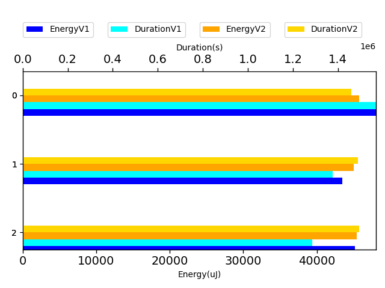

## com.google.gson.functional.InstanceCreatorTest

| Test | IterationV1 | IterationV2 | DeltaIteration |
| --- | --- | --- | --- |
| com.google.gson.functional.InstanceCreatorTest-testInstanceCreatorForParametrizedType | 99 | 99 | 0 |
| com.google.gson.functional.InstanceCreatorTest-testInstanceCreatorReturnsBaseType | 73 | 64 | -9 |
| com.google.gson.functional.InstanceCreatorTest-testInstanceCreatorReturnsSubTypeForField | 68 | 63 | -5 |
| com.google.gson.functional.InstanceCreatorTest-testInstanceCreatorForCollectionType | 99 | 99 | 0 |
| com.google.gson.functional.InstanceCreatorTest-testInstanceCreatorReturnsSubTypeForTopLevelObject | 48 | 50 | 2 |

| Test | EnergyV1 | EnergyV2 | DeltaEnergy |
| --- | --- | --- | --- |
| com.google.gson.functional.InstanceCreatorTest-testInstanceCreatorForParametrizedType | 81135.98049269168 | 94282.62546327192 | 13146.644970580237 |
| com.google.gson.functional.InstanceCreatorTest-testInstanceCreatorReturnsBaseType | 48310.41431483719 | 94940.70926950303 | 46630.29495466584 |
| com.google.gson.functional.InstanceCreatorTest-testInstanceCreatorReturnsSubTypeForField | 71520.51699059413 | 49571.7020468923 | -21948.81494370183 |
| com.google.gson.functional.InstanceCreatorTest-testInstanceCreatorForCollectionType | 46132.1399951875 | 47511.03164693847 | 1378.8916517509715 |
| com.google.gson.functional.InstanceCreatorTest-testInstanceCreatorReturnsSubTypeForTopLevelObject | 41015.98778077363 | 44802.995404006724 | 3787.0076232330975 |

| Test | DurationV1 | DurationsV2 | DeltaDuration |
| --- | --- | --- | --- |
| com.google.gson.functional.InstanceCreatorTest-testInstanceCreatorForParametrizedType | 2095758.4793090303 | 2233544.180100705 | 137785.70079167467 |
| com.google.gson.functional.InstanceCreatorTest-testInstanceCreatorReturnsBaseType | 1065346.6291663311 | 2253748.798531692 | 1188402.1693653609 |
| com.google.gson.functional.InstanceCreatorTest-testInstanceCreatorReturnsSubTypeForField | 1663635.0589867362 | 1009924.8401050484 | -653710.2188816878 |
| com.google.gson.functional.InstanceCreatorTest-testInstanceCreatorForCollectionType | 1386747.977310573 | 1412093.052906734 | 25345.075596160954 |
| com.google.gson.functional.InstanceCreatorTest-testInstanceCreatorReturnsSubTypeForTopLevelObject | 792009.6758042609 | 792407.9899815023 | 398.3141772414092 |

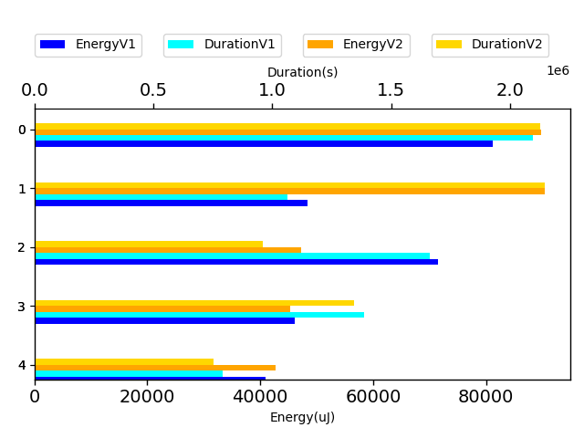

## com.google.gson.functional.DefaultTypeAdaptersTest

| Test | IterationV1 | IterationV2 | DeltaIteration |
| --- | --- | --- | --- |
| com.google.gson.functional.DefaultTypeAdaptersTest-testDateSerializationWithPatternNotOverridenByTypeAdapter | 97 | 96 | -1 |
| com.google.gson.functional.DefaultTypeAdaptersTest-testDateSerializationWithPattern | 92 | 89 | -3 |
| com.google.gson.functional.DefaultTypeAdaptersTest-testOverrideBigIntegerTypeAdapter | 99 | 99 | 0 |
| com.google.gson.functional.DefaultTypeAdaptersTest-testSqlDateSerialization | 85 | 83 | -2 |
| com.google.gson.functional.DefaultTypeAdaptersTest-testClassSerialization | 64 | 60 | -4 |
| com.google.gson.functional.DefaultTypeAdaptersTest-testTimestampSerialization | 97 | 96 | -1 |
| com.google.gson.functional.DefaultTypeAdaptersTest-testDefaultDateDeserializationUsingBuilder | 99 | 99 | 0 |
| com.google.gson.functional.DefaultTypeAdaptersTest-testOverrideBigDecimalTypeAdapter | 99 | 99 | 0 |
| com.google.gson.functional.DefaultTypeAdaptersTest-testDateDeserializationWithPattern | 86 | 81 | -5 |
| com.google.gson.functional.DefaultTypeAdaptersTest-testDateSerializationInCollection | 99 | 99 | 0 |
| com.google.gson.functional.DefaultTypeAdaptersTest-testDefaultCalendarDeserialization | 27 | 36 | 9 |
| com.google.gson.functional.DefaultTypeAdaptersTest-testClassDeserialization | 23 | 33 | 10 |
| com.google.gson.functional.DefaultTypeAdaptersTest-testDefaultGregorianCalendarDeserialization | 26 | 27 | 1 |
| com.google.gson.functional.DefaultTypeAdaptersTest-testDefaultCalendarSerialization | 33 | 26 | -7 |
| com.google.gson.functional.DefaultTypeAdaptersTest-testDefaultGregorianCalendarSerialization | 15 | 23 | 8 |

| Test | EnergyV1 | EnergyV2 | DeltaEnergy |
| --- | --- | --- | --- |
| com.google.gson.functional.DefaultTypeAdaptersTest-testDateSerializationWithPatternNotOverridenByTypeAdapter | 44025.88495673752 | 43078.96216821858 | -946.9227885189393 |
| com.google.gson.functional.DefaultTypeAdaptersTest-testDateSerializationWithPattern | 42383.21763849747 | 41781.59024888411 | -601.6273896133571 |
| com.google.gson.functional.DefaultTypeAdaptersTest-testOverrideBigIntegerTypeAdapter | 76125.5163926144 | 51230.0509856182 | -24895.465406996198 |
| com.google.gson.functional.DefaultTypeAdaptersTest-testSqlDateSerialization | 39875.628499576655 | 47119.92771761175 | 7244.299218035092 |
| com.google.gson.functional.DefaultTypeAdaptersTest-testClassSerialization | 41127.10129777805 | 38837.2405624355 | -2289.860735342547 |
| com.google.gson.functional.DefaultTypeAdaptersTest-testTimestampSerialization | 43898.088003794575 | 42101.44648884596 | -1796.641514948613 |
| com.google.gson.functional.DefaultTypeAdaptersTest-testDefaultDateDeserializationUsingBuilder | 364162.8993264247 | 381504.2558006771 | 17341.356474252418 |
| com.google.gson.functional.DefaultTypeAdaptersTest-testOverrideBigDecimalTypeAdapter | 68336.20252671727 | 51282.20977977275 | -17053.992746944525 |
| com.google.gson.functional.DefaultTypeAdaptersTest-testDateDeserializationWithPattern | 44343.511488796496 | 45393.55625798098 | 1050.044769184482 |
| com.google.gson.functional.DefaultTypeAdaptersTest-testDateSerializationInCollection | 82857.9029495438 | 87248.97426778731 | 4391.071318243514 |
| com.google.gson.functional.DefaultTypeAdaptersTest-testDefaultCalendarDeserialization | 42022.212291285396 | 43102.13987552494 | 1079.9275842395436 |
| com.google.gson.functional.DefaultTypeAdaptersTest-testClassDeserialization | 43921.017273664474 | 46108.00227469113 | 2186.9850010266528 |
| com.google.gson.functional.DefaultTypeAdaptersTest-testDefaultGregorianCalendarDeserialization | 42900.97738701105 | 41753.77140209079 | -1147.2059849202633 |
| com.google.gson.functional.DefaultTypeAdaptersTest-testDefaultCalendarSerialization | 42371.36022385955 | 43156.72076627612 | 785.3605424165726 |
| com.google.gson.functional.DefaultTypeAdaptersTest-testDefaultGregorianCalendarSerialization | 44919.75378417969 | 42397.00686144829 | -2522.7469227313995 |

| Test | DurationV1 | DurationsV2 | DeltaDuration |
| --- | --- | --- | --- |
| com.google.gson.functional.DefaultTypeAdaptersTest-testDateSerializationWithPatternNotOverridenByTypeAdapter | 1302085.1312685446 | 1572149.8718466437 | 270064.74057809915 |
| com.google.gson.functional.DefaultTypeAdaptersTest-testDateSerializationWithPattern | 1214859.3800264613 | 1240508.8039527154 | 25649.423926254036 |
| com.google.gson.functional.DefaultTypeAdaptersTest-testOverrideBigIntegerTypeAdapter | 1896330.6008917803 | 1925292.7875836277 | 28962.186691847397 |
| com.google.gson.functional.DefaultTypeAdaptersTest-testSqlDateSerialization | 1227756.4678267022 | 1237694.7081632442 | 9938.240336542018 |
| com.google.gson.functional.DefaultTypeAdaptersTest-testClassSerialization | 801947.8380496041 | 1072449.715151734 | 270501.87710212986 |
| com.google.gson.functional.DefaultTypeAdaptersTest-testTimestampSerialization | 1295514.1571367984 | 1392282.479669984 | 96768.3225331856 |
| com.google.gson.functional.DefaultTypeAdaptersTest-testDefaultDateDeserializationUsingBuilder | 9310736.891178366 | 10465154.94234439 | 1154418.051166024 |
| com.google.gson.functional.DefaultTypeAdaptersTest-testOverrideBigDecimalTypeAdapter | 1443596.3952141234 | 1837450.6177873085 | 393854.2225731851 |
| com.google.gson.functional.DefaultTypeAdaptersTest-testDateDeserializationWithPattern | 1158285.6630647553 | 1253467.6582108515 | 95181.99514609622 |
| com.google.gson.functional.DefaultTypeAdaptersTest-testDateSerializationInCollection | 2467229.432968516 | 2504880.2703929725 | 37650.83742445661 |
| com.google.gson.functional.DefaultTypeAdaptersTest-testDefaultCalendarDeserialization | 620202.7573766559 | 680809.1370916618 | 60606.37971500587 |
| com.google.gson.functional.DefaultTypeAdaptersTest-testClassDeserialization | 477691.10674905777 | 519579.8565967728 | 41888.74984771502 |
| com.google.gson.functional.DefaultTypeAdaptersTest-testDefaultGregorianCalendarDeserialization | 591167.5957759619 | 578253.8479465693 | -12913.747829392552 |
| com.google.gson.functional.DefaultTypeAdaptersTest-testDefaultCalendarSerialization | 569747.8857816029 | 535891.7730361372 | -33856.11274546571 |
| com.google.gson.functional.DefaultTypeAdaptersTest-testDefaultGregorianCalendarSerialization | 440584.26666259766 | 668473.5725812912 | 227889.30591869354 |

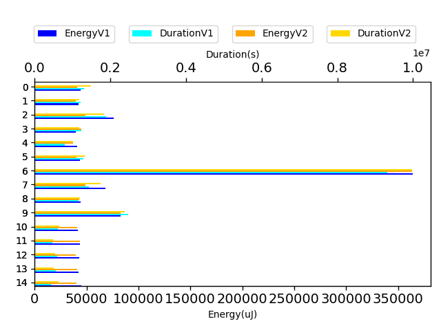

## com.google.gson.functional.CustomTypeAdaptersTest

| Test | IterationV1 | IterationV2 | DeltaIteration |
| --- | --- | --- | --- |
| com.google.gson.functional.CustomTypeAdaptersTest-testCustomAdapterInvokedForMapElementDeserialization | 57 | 60 | 3 |
| com.google.gson.functional.CustomTypeAdaptersTest-testCustomNestedSerializers | 67 | 59 | -8 |
| com.google.gson.functional.CustomTypeAdaptersTest-testCustomNestedDeserializers | 59 | 51 | -8 |
| com.google.gson.functional.CustomTypeAdaptersTest-testCustomTypeAdapterDoesNotAppliesToSubClasses | 88 | 88 | 0 |
| com.google.gson.functional.CustomTypeAdaptersTest-testCustomAdapterInvokedForCollectionElementSerializationWithType | 95 | 95 | 0 |
| com.google.gson.functional.CustomTypeAdaptersTest-testCustomByteArrayDeserializerAndInstanceCreator | 69 | 76 | 7 |
| com.google.gson.functional.CustomTypeAdaptersTest-testCustomByteArraySerializer | 53 | 47 | -6 |
| com.google.gson.functional.CustomTypeAdaptersTest-testEnsureCustomSerializerNotInvokedForNullValues | 90 | 88 | -2 |
| com.google.gson.functional.CustomTypeAdaptersTest-testCustomAdapterInvokedForCollectionElementDeserialization | 76 | 80 | 4 |
| com.google.gson.functional.CustomTypeAdaptersTest-testCustomAdapterInvokedForMapElementSerializationWithType | 73 | 66 | -7 |
| com.google.gson.functional.CustomTypeAdaptersTest-testRegisterHierarchyAdapterForDate | 76 | 76 | 0 |
| com.google.gson.functional.CustomTypeAdaptersTest-testCustomSerializerInvokedForPrimitives | 41 | 51 | 10 |
| com.google.gson.functional.CustomTypeAdaptersTest-testCustomSerializers | 63 | 69 | 6 |
| com.google.gson.functional.CustomTypeAdaptersTest-testEnsureCustomDeserializerNotInvokedForNullValues | 68 | 62 | -6 |
| com.google.gson.functional.CustomTypeAdaptersTest-testCustomTypeAdapterAppliesToSubClassesSerializedAsBaseClass | 38 | 47 | 9 |
| com.google.gson.functional.CustomTypeAdaptersTest-testCustomAdapterInvokedForMapElementSerialization | 18 | 27 | 9 |
| com.google.gson.functional.CustomTypeAdaptersTest-testCustomDeserializers | 55 | 55 | 0 |
| com.google.gson.functional.CustomTypeAdaptersTest-testCustomDeserializerInvokedForPrimitives | 43 | 48 | 5 |
| com.google.gson.functional.CustomTypeAdaptersTest-testCustomAdapterInvokedForCollectionElementSerialization | 35 | 40 | 5 |

| Test | EnergyV1 | EnergyV2 | DeltaEnergy |
| --- | --- | --- | --- |
| com.google.gson.functional.CustomTypeAdaptersTest-testCustomAdapterInvokedForMapElementDeserialization | 42285.713159864645 | 47225.81699836989 | 4940.103838505245 |
| com.google.gson.functional.CustomTypeAdaptersTest-testCustomNestedSerializers | 47932.327377648115 | 44668.575040159805 | -3263.7523374883094 |
| com.google.gson.functional.CustomTypeAdaptersTest-testCustomNestedDeserializers | 44552.247189203 | 42196.051844643924 | -2356.195344559077 |
| com.google.gson.functional.CustomTypeAdaptersTest-testCustomTypeAdapterDoesNotAppliesToSubClasses | 67687.44673015611 | 45474.78184090637 | -22212.66488924974 |
| com.google.gson.functional.CustomTypeAdaptersTest-testCustomAdapterInvokedForCollectionElementSerializationWithType | 45964.82735976607 | 70852.24492773789 | 24887.417567971825 |
| com.google.gson.functional.CustomTypeAdaptersTest-testCustomByteArrayDeserializerAndInstanceCreator | 66181.6160904762 | 45474.03041285461 | -20707.58567762158 |
| com.google.gson.functional.CustomTypeAdaptersTest-testCustomByteArraySerializer | 41496.41423575817 | 42377.089807118624 | 880.6755713604507 |
| com.google.gson.functional.CustomTypeAdaptersTest-testEnsureCustomSerializerNotInvokedForNullValues | 44157.77125439359 | 48364.77495910468 | 4207.003704711089 |
| com.google.gson.functional.CustomTypeAdaptersTest-testCustomAdapterInvokedForCollectionElementDeserialization | 45923.533280636104 | 45712.25950327216 | -211.27377736394556 |
| com.google.gson.functional.CustomTypeAdaptersTest-testCustomAdapterInvokedForMapElementSerializationWithType | 44360.56585797289 | 48159.53806998349 | 3798.9722120106017 |
| com.google.gson.functional.CustomTypeAdaptersTest-testRegisterHierarchyAdapterForDate | 46088.1493331478 | 43625.39955573052 | -2462.7497774172807 |
| com.google.gson.functional.CustomTypeAdaptersTest-testCustomSerializerInvokedForPrimitives | 43982.94530018039 | 42161.638194097155 | -1821.3071060832372 |
| com.google.gson.functional.CustomTypeAdaptersTest-testCustomSerializers | 46029.071694731094 | 45198.87029514303 | -830.2013995880625 |
| com.google.gson.functional.CustomTypeAdaptersTest-testEnsureCustomDeserializerNotInvokedForNullValues | 45379.784815273524 | 152695.60842186332 | 107315.8236065898 |
| com.google.gson.functional.CustomTypeAdaptersTest-testCustomTypeAdapterAppliesToSubClassesSerializedAsBaseClass | 43798.00920000768 | 46501.72409300211 | 2703.7148929944306 |
| com.google.gson.functional.CustomTypeAdaptersTest-testCustomAdapterInvokedForMapElementSerialization | 42438.26107788086 | 47733.89785516262 | 5295.636777281761 |
| com.google.gson.functional.CustomTypeAdaptersTest-testCustomDeserializers | 47271.432405961306 | 44029.37889409003 | -3242.0535118712796 |
| com.google.gson.functional.CustomTypeAdaptersTest-testCustomDeserializerInvokedForPrimitives | 44339.99840202305 | 42641.903026300315 | -1698.0953757227326 |
| com.google.gson.functional.CustomTypeAdaptersTest-testCustomAdapterInvokedForCollectionElementSerialization | 44531.93241820653 | 44377.321177595615 | -154.61124061091687 |

| Test | DurationV1 | DurationsV2 | DeltaDuration |
| --- | --- | --- | --- |
| com.google.gson.functional.CustomTypeAdaptersTest-testCustomAdapterInvokedForMapElementDeserialization | 937433.5901113336 | 783180.6011352076 | -154252.98897612607 |
| com.google.gson.functional.CustomTypeAdaptersTest-testCustomNestedSerializers | 1151520.8493002388 | 1039147.3941264555 | -112373.45517378324 |
| com.google.gson.functional.CustomTypeAdaptersTest-testCustomNestedDeserializers | 932591.2777497638 | 884640.9204109997 | -47950.35733876412 |
| com.google.gson.functional.CustomTypeAdaptersTest-testCustomTypeAdapterDoesNotAppliesToSubClasses | 1338221.718919401 | 1182874.3402162325 | -155347.3787031686 |
| com.google.gson.functional.CustomTypeAdaptersTest-testCustomAdapterInvokedForCollectionElementSerializationWithType | 1228686.0398492934 | 1353219.5238584229 | 124533.48400912946 |
| com.google.gson.functional.CustomTypeAdaptersTest-testCustomByteArrayDeserializerAndInstanceCreator | 1394384.5371717273 | 951173.8196388534 | -443210.71753287385 |
| com.google.gson.functional.CustomTypeAdaptersTest-testCustomByteArraySerializer | 652355.070078844 | 882500.9906559285 | 230145.92057708453 |
| com.google.gson.functional.CustomTypeAdaptersTest-testEnsureCustomSerializerNotInvokedForNullValues | 1081957.934223662 | 1239162.6553391016 | 157204.72111543966 |
| com.google.gson.functional.CustomTypeAdaptersTest-testCustomAdapterInvokedForCollectionElementDeserialization | 1040203.3299617971 | 1037825.0324222506 | -2378.2975395465037 |
| com.google.gson.functional.CustomTypeAdaptersTest-testCustomAdapterInvokedForMapElementSerializationWithType | 833215.2829817269 | 833912.7489589013 | 697.4659771743463 |
| com.google.gson.functional.CustomTypeAdaptersTest-testRegisterHierarchyAdapterForDate | 912046.4680489701 | 844504.083376085 | -67542.38467288506 |
| com.google.gson.functional.CustomTypeAdaptersTest-testCustomSerializerInvokedForPrimitives | 777357.1691691272 | 717238.8719141195 | -60118.29725500778 |
| com.google.gson.functional.CustomTypeAdaptersTest-testCustomSerializers | 741952.7738303548 | 955349.7506777067 | 213396.97684735188 |
| com.google.gson.functional.CustomTypeAdaptersTest-testEnsureCustomDeserializerNotInvokedForNullValues | 749027.5888598722 | 3771022.391710667 | 3021994.802850795 |
| com.google.gson.functional.CustomTypeAdaptersTest-testCustomTypeAdapterAppliesToSubClassesSerializedAsBaseClass | 817347.6296600524 | 649057.0706485425 | -168290.55901150987 |
| com.google.gson.functional.CustomTypeAdaptersTest-testCustomAdapterInvokedForMapElementSerialization | 471228.54668426514 | 428459.201053977 | -42769.345630288124 |
| com.google.gson.functional.CustomTypeAdaptersTest-testCustomDeserializers | 867350.103616472 | 858486.393955776 | -8863.709660695982 |
| com.google.gson.functional.CustomTypeAdaptersTest-testCustomDeserializerInvokedForPrimitives | 703303.1453311015 | 696362.6937905856 | -6940.4515405158745 |
| com.google.gson.functional.CustomTypeAdaptersTest-testCustomAdapterInvokedForCollectionElementSerialization | 489541.1510199876 | 712390.1819178014 | 222849.0308978138 |

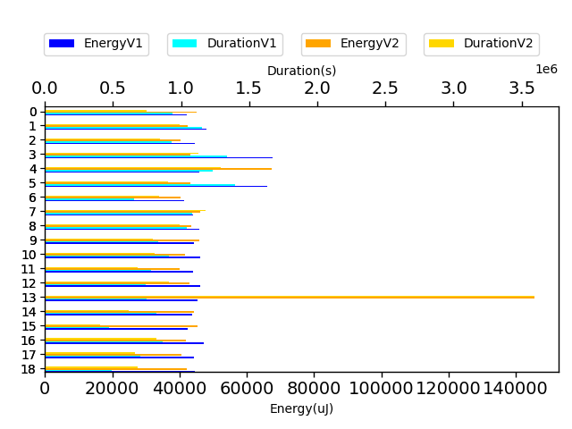

## com.google.gson.LongSerializationPolicyTest

| Test | IterationV1 | IterationV2 | DeltaIteration |
| --- | --- | --- | --- |
| com.google.gson.LongSerializationPolicyTest-testDefaultLongSerializationIntegration | 27 | 41 | 14 |
| com.google.gson.LongSerializationPolicyTest-testStringLongSerializationIntegration | 24 | 27 | 3 |

| Test | EnergyV1 | EnergyV2 | DeltaEnergy |
| --- | --- | --- | --- |
| com.google.gson.LongSerializationPolicyTest-testDefaultLongSerializationIntegration | 42672.40830472857 | 46764.7084962009 | 4092.3001914723354 |
| com.google.gson.LongSerializationPolicyTest-testStringLongSerializationIntegration | 41272.798491716385 | 47771.27378155291 | 6498.475289836526 |

| Test | DurationV1 | DurationsV2 | DeltaDuration |
| --- | --- | --- | --- |
| com.google.gson.LongSerializationPolicyTest-testDefaultLongSerializationIntegration | 615263.0303977802 | 595121.246175614 | -20141.784222166287 |
| com.google.gson.LongSerializationPolicyTest-testStringLongSerializationIntegration | 605882.2962026596 | 618422.0357491076 | 12539.739546447992 |

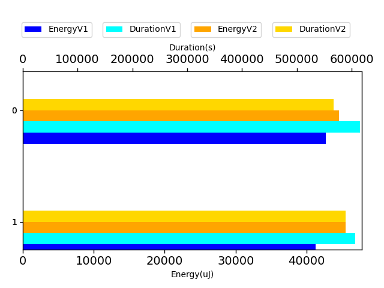

## com.google.gson.functional.MapTest

| Test | IterationV1 | IterationV2 | DeltaIteration |
| --- | --- | --- | --- |
| com.google.gson.functional.MapTest-testSerializeMaps | 74 | 79 | 5 |
| com.google.gson.functional.MapTest-testInterfaceTypeMapWithSerializer | 99 | 99 | 0 |
| com.google.gson.functional.MapTest-testMapSubclassDeserialization | 90 | 89 | -1 |
| com.google.gson.functional.MapTest-testCustomSerializerForSpecificMapType | 62 | 62 | 0 |
| com.google.gson.functional.MapTest-testGeneralMapField | 82 | 87 | 5 |
| com.google.gson.functional.MapTest-testInterfaceTypeMap | 99 | 99 | 0 |
| com.google.gson.functional.MapTest-testMapSerializationWithNullValuesSerialized | 91 | 83 | -8 |
| com.google.gson.functional.MapTest-testMapSerializationWithNullValueButSerializeNulls | 66 | 70 | 4 |

| Test | EnergyV1 | EnergyV2 | DeltaEnergy |
| --- | --- | --- | --- |
| com.google.gson.functional.MapTest-testSerializeMaps | 43325.31823393386 | 49904.764686792434 | 6579.446452858574 |
| com.google.gson.functional.MapTest-testInterfaceTypeMapWithSerializer | 66704.67105628441 | 60164.49606895783 | -6540.17498732658 |
| com.google.gson.functional.MapTest-testMapSubclassDeserialization | 55883.79603505512 | 52025.64194088072 | -3858.1540941744024 |
| com.google.gson.functional.MapTest-testCustomSerializerForSpecificMapType | 39588.55623857335 | 43218.77361742733 | 3630.2173788539803 |
| com.google.gson.functional.MapTest-testGeneralMapField | 44651.67751000672 | 55690.11221283174 | 11038.43470282502 |
| com.google.gson.functional.MapTest-testInterfaceTypeMap | 149275.27228831378 | 152928.54508538818 | 3653.2727970744018 |
| com.google.gson.functional.MapTest-testMapSerializationWithNullValuesSerialized | 45933.995937728454 | 52381.1887607908 | 6447.192823062345 |
| com.google.gson.functional.MapTest-testMapSerializationWithNullValueButSerializeNulls | 45789.82821009621 | 44774.56297775804 | -1015.2652323381699 |

| Test | DurationV1 | DurationsV2 | DeltaDuration |
| --- | --- | --- | --- |
| com.google.gson.functional.MapTest-testSerializeMaps | 1155541.5207268125 | 1174359.443001552 | 18817.92227473948 |
| com.google.gson.functional.MapTest-testInterfaceTypeMapWithSerializer | 1674264.9811997514 | 1696423.5001250303 | 22158.518925278913 |
| com.google.gson.functional.MapTest-testMapSubclassDeserialization | 1114088.427575237 | 1203723.0273513345 | 89634.59977609757 |
| com.google.gson.functional.MapTest-testCustomSerializerForSpecificMapType | 822280.5088619988 | 1238388.6515640283 | 416108.14270202955 |
| com.google.gson.functional.MapTest-testGeneralMapField | 1179281.6132939374 | 1151038.581687626 | -28243.031606311444 |
| com.google.gson.functional.MapTest-testInterfaceTypeMap | 3698933.12878019 | 3520451.425724263 | -178481.70305592706 |
| com.google.gson.functional.MapTest-testMapSerializationWithNullValuesSerialized | 1320015.292584603 | 1507500.7787788892 | 187485.48619428626 |
| com.google.gson.functional.MapTest-testMapSerializationWithNullValueButSerializeNulls | 1014226.7024881376 | 1072921.314238908 | 58694.61175077036 |

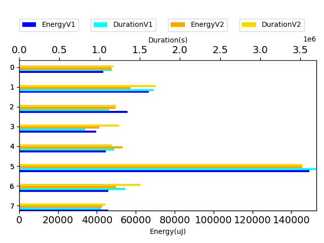

## com.google.gson.functional.PrimitiveTest

| Test | IterationV1 | IterationV2 | DeltaIteration |
| --- | --- | --- | --- |
| com.google.gson.functional.PrimitiveTest-testDoubleInfinitySerialization | 18 | 12 | -6 |
| com.google.gson.functional.PrimitiveTest-testHtmlCharacterSerialization | 22 | 15 | -7 |
| com.google.gson.functional.PrimitiveTest-testFloatInfinitySerialization | 17 | 18 | 1 |
| com.google.gson.functional.PrimitiveTest-testDoubleNaNSerialization | 42 | 36 | -6 |
| com.google.gson.functional.PrimitiveTest-testLongAsStringSerialization | 22 | 23 | 1 |
| com.google.gson.functional.PrimitiveTest-testNegativeInfinitySerialization | 15 | 15 | 0 |
| com.google.gson.functional.PrimitiveTest-testFloatNaNSerialization | 18 | 18 | 0 |
| com.google.gson.functional.PrimitiveTest-testLongAsStringDeserialization | 27 | 33 | 6 |
| com.google.gson.functional.PrimitiveTest-testNegativeInfinityFloatSerialization | 13 | 16 | 3 |

| Test | EnergyV1 | EnergyV2 | DeltaEnergy |
| --- | --- | --- | --- |
| com.google.gson.functional.PrimitiveTest-testDoubleInfinitySerialization | 44821.049140930176 | 45735.81103515625 | 914.7618942260742 |
| com.google.gson.functional.PrimitiveTest-testHtmlCharacterSerialization | 40578.82610869408 | 43667.189025878906 | 3088.3629171848297 |
| com.google.gson.functional.PrimitiveTest-testFloatInfinitySerialization | 38875.36404418945 | 43682.3995513916 | 4807.035507202148 |
| com.google.gson.functional.PrimitiveTest-testDoubleNaNSerialization | 53159.8347331956 | 46447.27618121501 | -6712.55855198059 |
| com.google.gson.functional.PrimitiveTest-testLongAsStringSerialization | 43352.11576986313 | 39058.94528055191 | -4293.170489311218 |
| com.google.gson.functional.PrimitiveTest-testNegativeInfinitySerialization | 45996.585998535156 | 43535.007568359375 | -2461.5784301757812 |
| com.google.gson.functional.PrimitiveTest-testFloatNaNSerialization | 40797.4446182251 | 42301.71033477783 | 1504.2657165527344 |
| com.google.gson.functional.PrimitiveTest-testLongAsStringDeserialization | 43411.967610791326 | 39903.534226293676 | -3508.43338449765 |
| com.google.gson.functional.PrimitiveTest-testNegativeInfinityFloatSerialization | 44657.27685546875 | 42359.948150634766 | -2297.3287048339844 |

| Test | DurationV1 | DurationsV2 | DeltaDuration |
| --- | --- | --- | --- |
| com.google.gson.functional.PrimitiveTest-testDoubleInfinitySerialization | 386539.55864334106 | 436136.5380859375 | 49596.979442596436 |
| com.google.gson.functional.PrimitiveTest-testHtmlCharacterSerialization | 551503.678933382 | 409911.79510498047 | -141591.88382840157 |
| com.google.gson.functional.PrimitiveTest-testFloatInfinitySerialization | 532485.260673523 | 335930.7723388672 | -196554.48833465576 |
| com.google.gson.functional.PrimitiveTest-testDoubleNaNSerialization | 2079632.2433310752 | 1011966.7988442043 | -1067665.444486871 |
| com.google.gson.functional.PrimitiveTest-testLongAsStringSerialization | 387796.9511284828 | 616452.7610201836 | 228655.80989170074 |
| com.google.gson.functional.PrimitiveTest-testNegativeInfinitySerialization | 409378.86193847656 | 377260.5662841797 | -32118.295654296875 |
| com.google.gson.functional.PrimitiveTest-testFloatNaNSerialization | 444727.62474823 | 426238.0785064697 | -18489.546241760254 |
| com.google.gson.functional.PrimitiveTest-testLongAsStringDeserialization | 475996.20535221696 | 512880.603834796 | 36884.39848257904 |
| com.google.gson.functional.PrimitiveTest-testNegativeInfinityFloatSerialization | 376651.4587402344 | 379079.73333740234 | 2428.2745971679688 |

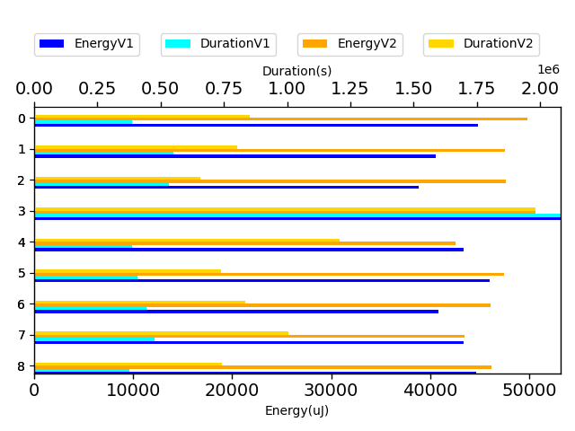

## com.google.gson.functional.CustomDeserializerTest

| Test | IterationV1 | IterationV2 | DeltaIteration |
| --- | --- | --- | --- |
| com.google.gson.functional.CustomDeserializerTest-testCustomDeserializerReturnsNullForArrayElementsForArrayField | 70 | 63 | -7 |
| com.google.gson.functional.CustomDeserializerTest-testCustomDeserializerReturnsNull | 71 | 61 | -10 |
| com.google.gson.functional.CustomDeserializerTest-testJsonTypeFieldBasedDeserialization | 99 | 99 | 0 |
| com.google.gson.functional.CustomDeserializerTest-testCustomDeserializerReturnsNullForTopLevelObject | 39 | 38 | -1 |
| com.google.gson.functional.CustomDeserializerTest-testCustomDeserializerReturnsNullForArrayElements | 51 | 52 | 1 |

| Test | EnergyV1 | EnergyV2 | DeltaEnergy |
| --- | --- | --- | --- |
| com.google.gson.functional.CustomDeserializerTest-testCustomDeserializerReturnsNullForArrayElementsForArrayField | 42288.70266910725 | 45568.81902092697 | 3280.1163518197136 |
| com.google.gson.functional.CustomDeserializerTest-testCustomDeserializerReturnsNull | 124875.476852158 | 51801.15904887639 | -73074.3178032816 |
| com.google.gson.functional.CustomDeserializerTest-testJsonTypeFieldBasedDeserialization | 70006.57157142804 | 61002.83920597451 | -9003.732365453528 |
| com.google.gson.functional.CustomDeserializerTest-testCustomDeserializerReturnsNullForTopLevelObject | 42343.78488509388 | 45287.92234646557 | 2944.1374613716907 |
| com.google.gson.functional.CustomDeserializerTest-testCustomDeserializerReturnsNullForArrayElements | 39812.40281352268 | 46132.720711305665 | 6320.317897782981 |

| Test | DurationV1 | DurationsV2 | DeltaDuration |
| --- | --- | --- | --- |
| com.google.gson.functional.CustomDeserializerTest-testCustomDeserializerReturnsNullForArrayElementsForArrayField | 946425.3010602599 | 826881.363587408 | -119543.93747285195 |
| com.google.gson.functional.CustomDeserializerTest-testCustomDeserializerReturnsNull | 3326831.2829076345 | 929246.197573969 | -2397585.0853336654 |
| com.google.gson.functional.CustomDeserializerTest-testJsonTypeFieldBasedDeserialization | 1961729.6380980024 | 1613303.1056434163 | -348426.5324545861 |
| com.google.gson.functional.CustomDeserializerTest-testCustomDeserializerReturnsNullForTopLevelObject | 748244.8832387861 | 635808.6327196088 | -112436.2505191773 |
| com.google.gson.functional.CustomDeserializerTest-testCustomDeserializerReturnsNullForArrayElements | 1100707.093847186 | 634025.8020802974 | -466681.2917668887 |

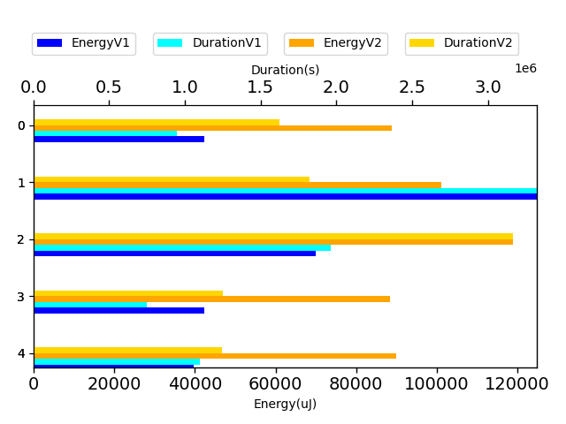

## com.google.gson.functional.NullObjectAndFieldTest

| Test | IterationV1 | IterationV2 | DeltaIteration |
| --- | --- | --- | --- |
| com.google.gson.functional.NullObjectAndFieldTest-testExplicitDeserializationOfNulls | 26 | 34 | 8 |
| com.google.gson.functional.NullObjectAndFieldTest-testExplicitSerializationOfNullCollectionMembers | 42 | 37 | -5 |
| com.google.gson.functional.NullObjectAndFieldTest-testCustomSerializationOfNulls | 60 | 51 | -9 |
| com.google.gson.functional.NullObjectAndFieldTest-testPrintPrintingObjectWithNulls | 59 | 63 | 4 |
| com.google.gson.functional.NullObjectAndFieldTest-testExplicitSerializationOfNullStringMembers | 40 | 40 | 0 |
| com.google.gson.functional.NullObjectAndFieldTest-testTopLevelNullObjectSerialization | 21 | 23 | 2 |
| com.google.gson.functional.NullObjectAndFieldTest-testExplicitSerializationOfNullArrayMembers | 89 | 87 | -2 |
| com.google.gson.functional.NullObjectAndFieldTest-testExplicitSerializationOfNulls | 52 | 48 | -4 |
| com.google.gson.functional.NullObjectAndFieldTest-testNullWrappedPrimitiveMemberSerialization | 48 | 50 | 2 |
| com.google.gson.functional.NullObjectAndFieldTest-testNullWrappedPrimitiveMemberDeserialization | 31 | 22 | -9 |
| com.google.gson.functional.NullObjectAndFieldTest-testCustomTypeAdapterPassesNullSerialization | 40 | 46 | 6 |
| com.google.gson.functional.NullObjectAndFieldTest-testTopLevelNullObjectDeserialization | 20 | 20 | 0 |
| com.google.gson.functional.NullObjectAndFieldTest-testCustomTypeAdapterPassesNullDesrialization | 47 | 51 | 4 |
| com.google.gson.functional.NullObjectAndFieldTest-testPrintPrintingArraysWithNulls | 24 | 18 | -6 |

| Test | EnergyV1 | EnergyV2 | DeltaEnergy |
| --- | --- | --- | --- |
| com.google.gson.functional.NullObjectAndFieldTest-testExplicitDeserializationOfNulls | 42474.42255088687 | 44764.38023405906 | 2289.9576831721934 |
| com.google.gson.functional.NullObjectAndFieldTest-testExplicitSerializationOfNullCollectionMembers | 42756.71768845749 | 41747.14317538141 | -1009.574513076077 |
| com.google.gson.functional.NullObjectAndFieldTest-testCustomSerializationOfNulls | 45151.67256837002 | 43459.409962463425 | -1692.2626059065951 |
| com.google.gson.functional.NullObjectAndFieldTest-testPrintPrintingObjectWithNulls | 44349.81542372615 | 44938.67012984421 | 588.8547061180652 |
| com.google.gson.functional.NullObjectAndFieldTest-testExplicitSerializationOfNullStringMembers | 44497.81099971355 | 43525.81526071936 | -971.9957389941846 |
| com.google.gson.functional.NullObjectAndFieldTest-testTopLevelNullObjectSerialization | 143069.69725608826 | 49586.22562777996 | -93483.4716283083 |
| com.google.gson.functional.NullObjectAndFieldTest-testExplicitSerializationOfNullArrayMembers | 69012.0186572302 | 43254.561988527734 | -25757.45666870247 |
| com.google.gson.functional.NullObjectAndFieldTest-testExplicitSerializationOfNulls | 45903.049871913056 | 45020.766915684326 | -882.2829562287297 |
| com.google.gson.functional.NullObjectAndFieldTest-testNullWrappedPrimitiveMemberSerialization | 44220.9624244523 | 43866.689709804115 | -354.2727146481848 |
| com.google.gson.functional.NullObjectAndFieldTest-testNullWrappedPrimitiveMemberDeserialization | 47865.93389872089 | 44571.87246084213 | -3294.0614378787577 |
| com.google.gson.functional.NullObjectAndFieldTest-testCustomTypeAdapterPassesNullSerialization | 45327.55303624868 | 43589.358839185326 | -1738.1941970633561 |
| com.google.gson.functional.NullObjectAndFieldTest-testTopLevelNullObjectDeserialization | 46383.67914390564 | 47987.52568817139 | 1603.846544265747 |
| com.google.gson.functional.NullObjectAndFieldTest-testCustomTypeAdapterPassesNullDesrialization | 42795.757382218464 | 43713.1390757474 | 917.381693528936 |
| com.google.gson.functional.NullObjectAndFieldTest-testPrintPrintingArraysWithNulls | 46567.119787335396 | 42621.527519226074 | -3945.5922681093216 |

| Test | DurationV1 | DurationsV2 | DeltaDuration |
| --- | --- | --- | --- |
| com.google.gson.functional.NullObjectAndFieldTest-testExplicitDeserializationOfNulls | 817778.0968450308 | 612732.1154876588 | -205045.98135737202 |
| com.google.gson.functional.NullObjectAndFieldTest-testExplicitSerializationOfNullCollectionMembers | 570962.0721450227 | 602902.483456732 | 31940.411311709322 |
| com.google.gson.functional.NullObjectAndFieldTest-testCustomSerializationOfNulls | 792287.0165707617 | 746817.4550896464 | -45469.56148111529 |
| com.google.gson.functional.NullObjectAndFieldTest-testPrintPrintingObjectWithNulls | 785190.7272819723 | 840782.237969202 | 55591.51068722969 |
| com.google.gson.functional.NullObjectAndFieldTest-testExplicitSerializationOfNullStringMembers | 639542.6368716103 | 606555.3347717738 | -32987.302099836525 |
| com.google.gson.functional.NullObjectAndFieldTest-testTopLevelNullObjectSerialization | 3941067.0265522003 | 686675.294767499 | -3254391.7317847013 |
| com.google.gson.functional.NullObjectAndFieldTest-testExplicitSerializationOfNullArrayMembers | 1216350.3564257524 | 1332838.7698398633 | 116488.4134141109 |
| com.google.gson.functional.NullObjectAndFieldTest-testExplicitSerializationOfNulls | 516621.28690547385 | 1120399.337359807 | 603778.0504543332 |
| com.google.gson.functional.NullObjectAndFieldTest-testNullWrappedPrimitiveMemberSerialization | 582222.0410733325 | 715558.7167480954 | 133336.6756747628 |
| com.google.gson.functional.NullObjectAndFieldTest-testNullWrappedPrimitiveMemberDeserialization | 482083.421768683 | 656956.858030796 | 174873.43626211304 |
| com.google.gson.functional.NullObjectAndFieldTest-testCustomTypeAdapterPassesNullSerialization | 636107.1809808845 | 694045.8039950086 | 57938.62301412411 |
| com.google.gson.functional.NullObjectAndFieldTest-testTopLevelNullObjectDeserialization | 536700.8396205902 | 722518.5835380554 | 185817.7439174652 |
| com.google.gson.functional.NullObjectAndFieldTest-testCustomTypeAdapterPassesNullDesrialization | 646174.4122186576 | 680510.6396954132 | 34336.22747675562 |
| com.google.gson.functional.NullObjectAndFieldTest-testPrintPrintingArraysWithNulls | 396701.5850381851 | 512356.83528137207 | 115655.25024318695 |

## com.google.gson.functional.TypeAdapterPrecedenceTest

| Test | IterationV1 | IterationV2 | DeltaIteration |
| --- | --- | --- | --- |
| com.google.gson.functional.TypeAdapterPrecedenceTest-testSerializeNonstreamingTypeAdapterFollowedByStreamingTypeAdapter | 20 | 23 | 3 |
| com.google.gson.functional.TypeAdapterPrecedenceTest-testNonstreamingFollowedByNonstreaming | 86 | 89 | 3 |
| com.google.gson.functional.TypeAdapterPrecedenceTest-testStreamingFollowedByNonstreamingHierarchical | 19 | 25 | 6 |
| com.google.gson.functional.TypeAdapterPrecedenceTest-testStreamingHierarchicalFollowedByNonstreaming | 24 | 28 | 4 |
| com.google.gson.functional.TypeAdapterPrecedenceTest-testNonstreamingHierarchicalFollowedByNonstreaming | 23 | 20 | -3 |
| com.google.gson.functional.TypeAdapterPrecedenceTest-testStreamingFollowedByStreaming | 41 | 38 | -3 |
| com.google.gson.functional.TypeAdapterPrecedenceTest-testStreamingFollowedByNonstreaming | 26 | 17 | -9 |
| com.google.gson.functional.TypeAdapterPrecedenceTest-testStreamingHierarchicalFollowedByNonstreamingHierarchical | 30 | 30 | 0 |

| Test | EnergyV1 | EnergyV2 | DeltaEnergy |
| --- | --- | --- | --- |
| com.google.gson.functional.TypeAdapterPrecedenceTest-testSerializeNonstreamingTypeAdapterFollowedByStreamingTypeAdapter | 42344.335715293884 | 43251.84743261337 | 907.5117173194885 |
| com.google.gson.functional.TypeAdapterPrecedenceTest-testNonstreamingFollowedByNonstreaming | 46633.63011759313 | 48187.3623699218 | 1553.7322523286712 |
| com.google.gson.functional.TypeAdapterPrecedenceTest-testStreamingFollowedByNonstreamingHierarchical | 45719.86687088013 | 41753.3370578289 | -3966.5298130512238 |
| com.google.gson.functional.TypeAdapterPrecedenceTest-testStreamingHierarchicalFollowedByNonstreaming | 40604.55763280392 | 45784.85923219472 | 5180.301599390805 |
| com.google.gson.functional.TypeAdapterPrecedenceTest-testNonstreamingHierarchicalFollowedByNonstreaming | 44291.95060420036 | 44546.21023082733 | 254.25962662696838 |
| com.google.gson.functional.TypeAdapterPrecedenceTest-testStreamingFollowedByStreaming | 41999.81219731679 | 46151.85602062806 | 4152.043823311273 |
| com.google.gson.functional.TypeAdapterPrecedenceTest-testStreamingFollowedByNonstreaming | 44250.19010478258 | 44395.080139160156 | 144.89003437757492 |
| com.google.gson.functional.TypeAdapterPrecedenceTest-testStreamingHierarchicalFollowedByNonstreamingHierarchical | 41828.687893517315 | 45301.70502482727 | 3473.0171313099563 |

| Test | DurationV1 | DurationsV2 | DeltaDuration |
| --- | --- | --- | --- |
| com.google.gson.functional.TypeAdapterPrecedenceTest-testSerializeNonstreamingTypeAdapterFollowedByStreamingTypeAdapter | 429526.7873649597 | 438925.59875774384 | 9398.811392784119 |
| com.google.gson.functional.TypeAdapterPrecedenceTest-testNonstreamingFollowedByNonstreaming | 1039197.477067874 | 1122284.3171649312 | 83086.84009705717 |
| com.google.gson.functional.TypeAdapterPrecedenceTest-testStreamingFollowedByNonstreamingHierarchical | 339023.67137527466 | 369892.7075654268 | 30869.03619015217 |
| com.google.gson.functional.TypeAdapterPrecedenceTest-testStreamingHierarchicalFollowedByNonstreaming | 536847.6305421591 | 402197.83583100885 | -134649.79471115023 |
| com.google.gson.functional.TypeAdapterPrecedenceTest-testNonstreamingHierarchicalFollowedByNonstreaming | 435155.3067083359 | 497508.8800907135 | 62353.573382377625 |
| com.google.gson.functional.TypeAdapterPrecedenceTest-testStreamingFollowedByStreaming | 495842.6079576496 | 547095.5472592276 | 51252.93930157798 |
| com.google.gson.functional.TypeAdapterPrecedenceTest-testStreamingFollowedByNonstreaming | 412073.3276062012 | 393468.1631164551 | -18605.164489746094 |
| com.google.gson.functional.TypeAdapterPrecedenceTest-testStreamingHierarchicalFollowedByNonstreamingHierarchical | 456199.04592126794 | 479521.98404650297 | 23322.93812523503 |

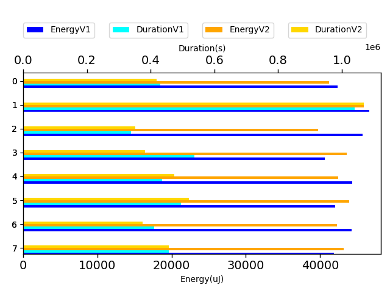

## com.google.gson.functional.JsonAdapterAnnotationOnClassesTest

| Test | IterationV1 | IterationV2 | DeltaIteration |
| --- | --- | --- | --- |
| com.google.gson.functional.JsonAdapterAnnotationOnClassesTest-testRegisteredAdapterOverridesJsonAdapter | 62 | 64 | 2 |
| com.google.gson.functional.JsonAdapterAnnotationOnClassesTest-testRegisteredSerializerOverridesJsonAdapter | 89 | 96 | 7 |
| com.google.gson.functional.JsonAdapterAnnotationOnClassesTest-testRegisteredDeserializerOverridesJsonAdapter | 51 | 54 | 3 |

| Test | EnergyV1 | EnergyV2 | DeltaEnergy |
| --- | --- | --- | --- |
| com.google.gson.functional.JsonAdapterAnnotationOnClassesTest-testRegisteredAdapterOverridesJsonAdapter | 44301.61639890353 | 63359.97739554887 | 19058.360996645344 |
| com.google.gson.functional.JsonAdapterAnnotationOnClassesTest-testRegisteredSerializerOverridesJsonAdapter | 60689.52250224845 | 87419.11906228647 | 26729.596560038015 |
| com.google.gson.functional.JsonAdapterAnnotationOnClassesTest-testRegisteredDeserializerOverridesJsonAdapter | 44464.56501560643 | 44069.66557829516 | -394.8994373112728 |

| Test | DurationV1 | DurationsV2 | DeltaDuration |
| --- | --- | --- | --- |
| com.google.gson.functional.JsonAdapterAnnotationOnClassesTest-testRegisteredAdapterOverridesJsonAdapter | 773724.1551758915 | 1728197.1258392944 | 954472.9706634029 |
| com.google.gson.functional.JsonAdapterAnnotationOnClassesTest-testRegisteredSerializerOverridesJsonAdapter | 1394637.2613227086 | 2289464.452881664 | 894827.1915589555 |
| com.google.gson.functional.JsonAdapterAnnotationOnClassesTest-testRegisteredDeserializerOverridesJsonAdapter | 702379.8945937764 | 804274.7405917018 | 101894.84599792538 |

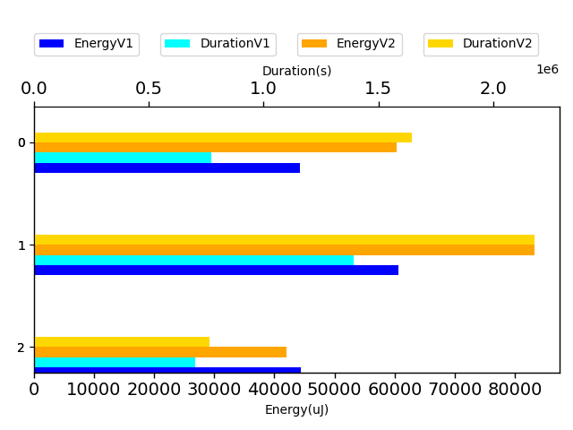

## com.google.gson.functional.FieldExclusionTest

| Test | IterationV1 | IterationV2 | DeltaIteration |
| --- | --- | --- | --- |
| com.google.gson.functional.FieldExclusionTest-testDefaultInnerClassExclusion | 78 | 83 | 5 |
| com.google.gson.functional.FieldExclusionTest-testInnerClassExclusion | 27 | 23 | -4 |
| com.google.gson.functional.FieldExclusionTest-testDefaultNestedStaticClassIncluded | 44 | 37 | -7 |

| Test | EnergyV1 | EnergyV2 | DeltaEnergy |
| --- | --- | --- | --- |
| com.google.gson.functional.FieldExclusionTest-testDefaultInnerClassExclusion | 56033.56002157622 | 102798.73703739015 | 46765.17701581393 |
| com.google.gson.functional.FieldExclusionTest-testInnerClassExclusion | 43336.46035068482 | 45148.59852075577 | 1812.1381700709462 |
| com.google.gson.functional.FieldExclusionTest-testDefaultNestedStaticClassIncluded | 44905.71942112869 | 45579.29749908684 | 673.5780779581473 |

| Test | DurationV1 | DurationsV2 | DeltaDuration |
| --- | --- | --- | --- |
| com.google.gson.functional.FieldExclusionTest-testDefaultInnerClassExclusion | 1343311.899354674 | 2450934.645293206 | 1107622.745938532 |
| com.google.gson.functional.FieldExclusionTest-testInnerClassExclusion | 384411.7385578528 | 421930.934381485 | 37519.19582363218 |
| com.google.gson.functional.FieldExclusionTest-testDefaultNestedStaticClassIncluded | 589323.3819962562 | 740251.4073515788 | 150928.02535532264 |

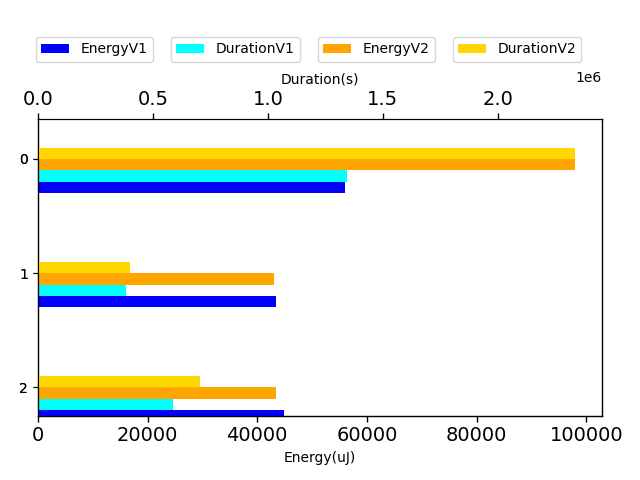

## com.google.gson.functional.TypeHierarchyAdapterTest

| Test | IterationV1 | IterationV2 | DeltaIteration |
| --- | --- | --- | --- |
| com.google.gson.functional.TypeHierarchyAdapterTest-testRegisterSuperTypeFirst | 53 | 50 | -3 |
| com.google.gson.functional.TypeHierarchyAdapterTest-testTypeHierarchy | 99 | 99 | 0 |
| com.google.gson.functional.TypeHierarchyAdapterTest-testRegisterSubTypeFirstAllowed | 14 | 15 | 1 |

| Test | EnergyV1 | EnergyV2 | DeltaEnergy |
| --- | --- | --- | --- |
| com.google.gson.functional.TypeHierarchyAdapterTest-testRegisterSuperTypeFirst | 42382.495148930415 | 44898.214432228844 | 2515.719283298429 |
| com.google.gson.functional.TypeHierarchyAdapterTest-testTypeHierarchy | 147962.71775869268 | 167234.04456391666 | 19271.326805223973 |
| com.google.gson.functional.TypeHierarchyAdapterTest-testRegisterSubTypeFirstAllowed | 43123.67395019531 | 45849.32293701172 | 2725.6489868164062 |

| Test | DurationV1 | DurationsV2 | DeltaDuration |
| --- | --- | --- | --- |
| com.google.gson.functional.TypeHierarchyAdapterTest-testRegisterSuperTypeFirst | 794508.084949044 | 813063.8966006971 | 18555.811651653028 |
| com.google.gson.functional.TypeHierarchyAdapterTest-testTypeHierarchy | 3709682.9754615105 | 4090197.329798433 | 380514.3543369225 |
| com.google.gson.functional.TypeHierarchyAdapterTest-testRegisterSubTypeFirstAllowed | 316956.68994140625 | 316878.5592651367 | -78.13067626953125 |

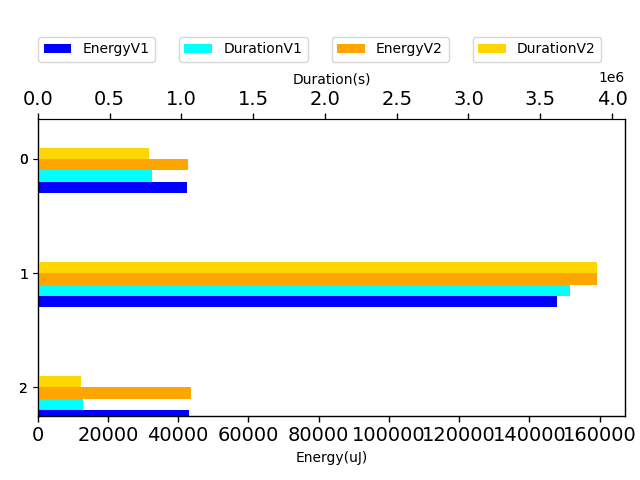

## com.google.gson.functional.EnumTest

| Test | IterationV1 | IterationV2 | DeltaIteration |
| --- | --- | --- | --- |
| com.google.gson.functional.EnumTest-testEnumSubclassWithRegisteredTypeAdapter | 99 | 99 | 0 |

| Test | EnergyV1 | EnergyV2 | DeltaEnergy |
| --- | --- | --- | --- |
| com.google.gson.functional.EnumTest-testEnumSubclassWithRegisteredTypeAdapter | 127152.07817848076 | 114291.6970542419 | -12860.381124238862 |

| Test | DurationV1 | DurationsV2 | DeltaDuration |
| --- | --- | --- | --- |
| com.google.gson.functional.EnumTest-testEnumSubclassWithRegisteredTypeAdapter | 3194567.084978142 | 2922608.4507282637 | -271958.6342498781 |

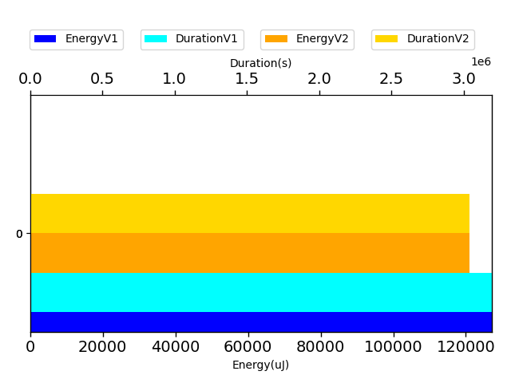

## com.google.gson.functional.VersioningTest

| Test | IterationV1 | IterationV2 | DeltaIteration |
| --- | --- | --- | --- |
| com.google.gson.functional.VersioningTest-testVersionedUntilSerialization | 99 | 99 | 0 |
| com.google.gson.functional.VersioningTest-testIgnoreLaterVersionClassSerialization | 52 | 55 | 3 |
| com.google.gson.functional.VersioningTest-testVersionedGsonMixingSinceAndUntilSerialization | 79 | 92 | 13 |
| com.google.gson.functional.VersioningTest-testVersionedGsonWithUnversionedClassesDeserialization | 28 | 37 | 9 |
| com.google.gson.functional.VersioningTest-testVersionedGsonMixingSinceAndUntilDeserialization | 49 | 53 | 4 |
| com.google.gson.functional.VersioningTest-testVersionedGsonWithUnversionedClassesSerialization | 54 | 49 | -5 |
| com.google.gson.functional.VersioningTest-testVersionedClassesSerialization | 70 | 70 | 0 |
| com.google.gson.functional.VersioningTest-testVersionedUntilDeserialization | 35 | 39 | 4 |
| com.google.gson.functional.VersioningTest-testVersionedClassesDeserialization | 43 | 39 | -4 |
| com.google.gson.functional.VersioningTest-testIgnoreLaterVersionClassDeserialization | 14 | 25 | 11 |

| Test | EnergyV1 | EnergyV2 | DeltaEnergy |
| --- | --- | --- | --- |
| com.google.gson.functional.VersioningTest-testVersionedUntilSerialization | 151317.715584337 | 138414.03897954617 | -12903.676604790846 |
| com.google.gson.functional.VersioningTest-testIgnoreLaterVersionClassSerialization | 42189.10034289138 | 44484.2191487982 | 2295.1188059068154 |
| com.google.gson.functional.VersioningTest-testVersionedGsonMixingSinceAndUntilSerialization | 44121.85163276743 | 44267.40493936297 | 145.55330659553874 |
| com.google.gson.functional.VersioningTest-testVersionedGsonWithUnversionedClassesDeserialization | 41586.791874643415 | 43817.854488349825 | 2231.06261370641 |
| com.google.gson.functional.VersioningTest-testVersionedGsonMixingSinceAndUntilDeserialization | 43234.606860904154 | 43371.3873338734 | 136.78047296924342 |
| com.google.gson.functional.VersioningTest-testVersionedGsonWithUnversionedClassesSerialization | 45079.391979728105 | 45679.604477323075 | 600.21249759497 |
| com.google.gson.functional.VersioningTest-testVersionedClassesSerialization | 43043.319530127905 | 45161.869676928225 | 2118.5501468003204 |
| com.google.gson.functional.VersioningTest-testVersionedUntilDeserialization | 44659.767916682875 | 47336.85028022769 | 2677.082363544818 |
| com.google.gson.functional.VersioningTest-testVersionedClassesDeserialization | 47150.90324378904 | 43178.24966207029 | -3972.653581718754 |
| com.google.gson.functional.VersioningTest-testIgnoreLaterVersionClassDeserialization | 39532.50476074219 | 44003.54028707743 | 4471.035526335239 |

| Test | DurationV1 | DurationsV2 | DeltaDuration |
| --- | --- | --- | --- |
| com.google.gson.functional.VersioningTest-testVersionedUntilSerialization | 4034807.727544273 | 3500983.2701855507 | -533824.4573587221 |
| com.google.gson.functional.VersioningTest-testIgnoreLaterVersionClassSerialization | 677365.7524762277 | 689127.1342025001 | 11761.381726272404 |
| com.google.gson.functional.VersioningTest-testVersionedGsonMixingSinceAndUntilSerialization | 1104077.8935499147 | 1036914.8646911156 | -67163.02885879914 |
| com.google.gson.functional.VersioningTest-testVersionedGsonWithUnversionedClassesDeserialization | 543705.1769615039 | 544696.1832253115 | 991.0062638075324 |
| com.google.gson.functional.VersioningTest-testVersionedGsonMixingSinceAndUntilDeserialization | 582133.7985378944 | 695577.5908311526 | 113443.79229325824 |
| com.google.gson.functional.VersioningTest-testVersionedGsonWithUnversionedClassesSerialization | 670911.3561556229 | 700233.3375061492 | 29321.98135052633 |
| com.google.gson.functional.VersioningTest-testVersionedClassesSerialization | 852023.1248373821 | 857543.7251320116 | 5520.600294629461 |
| com.google.gson.functional.VersioningTest-testVersionedUntilDeserialization | 651284.7542416749 | 512512.3298632987 | -138772.42437837622 |
| com.google.gson.functional.VersioningTest-testVersionedClassesDeserialization | 642619.8516438841 | 686530.6854239675 | 43910.833780083456 |
| com.google.gson.functional.VersioningTest-testIgnoreLaterVersionClassDeserialization | 520763.74658203125 | 399930.27534639835 | -120833.4712356329 |

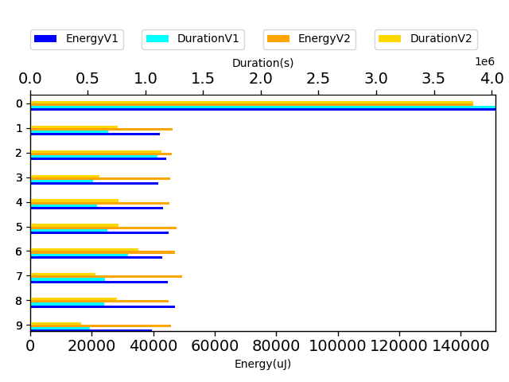

## com.google.gson.functional.MapAsArrayTypeAdapterTest

| Test | IterationV1 | IterationV2 | DeltaIteration |
| --- | --- | --- | --- |
| com.google.gson.functional.MapAsArrayTypeAdapterTest-testMultipleEnableComplexKeyRegistrationHasNoEffect | 75 | 75 | 0 |
| com.google.gson.functional.MapAsArrayTypeAdapterTest-testMapWithTypeVariableDeserialization | 82 | 78 | -4 |
| com.google.gson.functional.MapAsArrayTypeAdapterTest-testSerializeComplexMapWithTypeAdapter | 99 | 99 | 0 |
| com.google.gson.functional.MapAsArrayTypeAdapterTest-testTwoTypesCollapseToOneDeserialize | 79 | 77 | -2 |
| com.google.gson.functional.MapAsArrayTypeAdapterTest-testMapWithTypeVariableSerialization | 94 | 90 | -4 |

| Test | EnergyV1 | EnergyV2 | DeltaEnergy |
| --- | --- | --- | --- |
| com.google.gson.functional.MapAsArrayTypeAdapterTest-testMultipleEnableComplexKeyRegistrationHasNoEffect | 39363.08611497778 | 42906.77363104983 | 3543.687516072052 |
| com.google.gson.functional.MapAsArrayTypeAdapterTest-testMapWithTypeVariableDeserialization | 41707.96370364948 | 110697.521300125 | 68989.55759647551 |
| com.google.gson.functional.MapAsArrayTypeAdapterTest-testSerializeComplexMapWithTypeAdapter | 389705.0075508716 | 272707.4537501553 | -116997.5538007163 |
| com.google.gson.functional.MapAsArrayTypeAdapterTest-testTwoTypesCollapseToOneDeserialize | 51148.40290231598 | 98195.61424740034 | 47047.21134508436 |
| com.google.gson.functional.MapAsArrayTypeAdapterTest-testMapWithTypeVariableSerialization | 39185.546983103995 | 45981.857345194934 | 6796.310362090939 |

| Test | DurationV1 | DurationsV2 | DeltaDuration |
| --- | --- | --- | --- |
| com.google.gson.functional.MapAsArrayTypeAdapterTest-testMultipleEnableComplexKeyRegistrationHasNoEffect | 1102413.9631316923 | 1229263.2477306197 | 126849.28459892748 |
| com.google.gson.functional.MapAsArrayTypeAdapterTest-testMapWithTypeVariableDeserialization | 987280.0052239215 | 3017395.2056444716 | 2030115.20042055 |
| com.google.gson.functional.MapAsArrayTypeAdapterTest-testSerializeComplexMapWithTypeAdapter | 11921441.52835325 | 8307503.942639787 | -3613937.585713463 |
| com.google.gson.functional.MapAsArrayTypeAdapterTest-testTwoTypesCollapseToOneDeserialize | 1402692.4326514946 | 2964120.6647556075 | 1561428.2321041129 |
| com.google.gson.functional.MapAsArrayTypeAdapterTest-testMapWithTypeVariableSerialization | 1266692.5177309779 | 1422269.7142926543 | 155577.19656167645 |

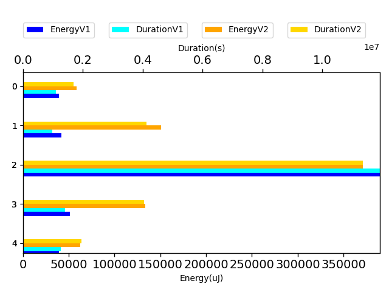

## com.google.gson.functional.ExclusionStrategyFunctionalTest

| Test | IterationV1 | IterationV2 | DeltaIteration |
| --- | --- | --- | --- |
| com.google.gson.functional.ExclusionStrategyFunctionalTest-testExclusionStrategyWithMode | 41 | 47 | 6 |
| com.google.gson.functional.ExclusionStrategyFunctionalTest-testExcludeTopLevelClassDeserialization | 19 | 23 | 4 |
| com.google.gson.functional.ExclusionStrategyFunctionalTest-testExclusionStrategyDeserialization | 48 | 53 | 5 |
| com.google.gson.functional.ExclusionStrategyFunctionalTest-testExclusionStrategySerialization | 99 | 99 | 0 |
| com.google.gson.functional.ExclusionStrategyFunctionalTest-testExclusionStrategySerializationDoesNotImpactDeserialization | 55 | 48 | -7 |
| com.google.gson.functional.ExclusionStrategyFunctionalTest-testExcludeTopLevelClassDeserializationDoesNotImpactSerialization | 28 | 28 | 0 |
| com.google.gson.functional.ExclusionStrategyFunctionalTest-testExcludeTopLevelClassSerialization | 16 | 19 | 3 |
| com.google.gson.functional.ExclusionStrategyFunctionalTest-testExclusionStrategySerializationDoesNotImpactSerialization | 32 | 30 | -2 |
| com.google.gson.functional.ExclusionStrategyFunctionalTest-testExcludeTopLevelClassSerializationDoesNotImpactDeserialization | 32 | 32 | 0 |

| Test | EnergyV1 | EnergyV2 | DeltaEnergy |
| --- | --- | --- | --- |
| com.google.gson.functional.ExclusionStrategyFunctionalTest-testExclusionStrategyWithMode | 44247.118503175785 | 43804.65025470604 | -442.4682484697478 |
| com.google.gson.functional.ExclusionStrategyFunctionalTest-testExcludeTopLevelClassDeserialization | 42595.062854766846 | 44238.71644067764 | 1643.6535859107971 |
| com.google.gson.functional.ExclusionStrategyFunctionalTest-testExclusionStrategyDeserialization | 48882.23503913244 | 50479.23428733464 | 1596.999248202199 |
| com.google.gson.functional.ExclusionStrategyFunctionalTest-testExclusionStrategySerialization | 108926.93013543822 | 110203.6685332413 | 1276.7383978030848 |
| com.google.gson.functional.ExclusionStrategyFunctionalTest-testExclusionStrategySerializationDoesNotImpactDeserialization | 41960.98831238188 | 47524.33557407438 | 5563.347261692499 |
| com.google.gson.functional.ExclusionStrategyFunctionalTest-testExcludeTopLevelClassDeserializationDoesNotImpactSerialization | 158672.00921936333 | 45709.055184438825 | -112962.9540349245 |
| com.google.gson.functional.ExclusionStrategyFunctionalTest-testExcludeTopLevelClassSerialization | 42569.28192138672 | 44995.85261917114 | 2426.570697784424 |
| com.google.gson.functional.ExclusionStrategyFunctionalTest-testExclusionStrategySerializationDoesNotImpactSerialization | 42551.74228035612 | 42960.31070653163 | 408.56842617550865 |
| com.google.gson.functional.ExclusionStrategyFunctionalTest-testExcludeTopLevelClassSerializationDoesNotImpactDeserialization | 40873.42760874424 | 42881.588212811155 | 2008.160604066914 |

| Test | DurationV1 | DurationsV2 | DeltaDuration |
| --- | --- | --- | --- |
| com.google.gson.functional.ExclusionStrategyFunctionalTest-testExclusionStrategyWithMode | 625624.641716487 | 712188.6069606297 | 86563.96524414269 |
| com.google.gson.functional.ExclusionStrategyFunctionalTest-testExcludeTopLevelClassDeserialization | 350473.5887298584 | 389508.54974770546 | 39034.96101784706 |
| com.google.gson.functional.ExclusionStrategyFunctionalTest-testExclusionStrategyDeserialization | 1023479.5856993783 | 894108.2889398821 | -129371.29675949621 |
| com.google.gson.functional.ExclusionStrategyFunctionalTest-testExclusionStrategySerialization | 2975847.5433176486 | 2566248.188850767 | -409599.3544668816 |
| com.google.gson.functional.ExclusionStrategyFunctionalTest-testExclusionStrategySerializationDoesNotImpactDeserialization | 668197.4048408995 | 630690.9545898677 | -37506.45025103178 |
| com.google.gson.functional.ExclusionStrategyFunctionalTest-testExcludeTopLevelClassDeserializationDoesNotImpactSerialization | 3307840.385848537 | 523844.0425365791 | -2783996.343311958 |
| com.google.gson.functional.ExclusionStrategyFunctionalTest-testExcludeTopLevelClassSerialization | 461114.68127441406 | 350198.5513763428 | -110916.12989807129 |
| com.google.gson.functional.ExclusionStrategyFunctionalTest-testExclusionStrategySerializationDoesNotImpactSerialization | 598286.2408584529 | 715974.4161349749 | 117688.17527652206 |
| com.google.gson.functional.ExclusionStrategyFunctionalTest-testExcludeTopLevelClassSerializationDoesNotImpactDeserialization | 504832.9605083433 | 563347.877463399 | 58514.91695505567 |

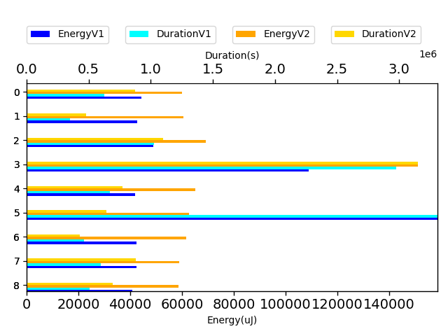

## com.google.gson.functional.NamingPolicyTest

| Test | IterationV1 | IterationV2 | DeltaIteration |
| --- | --- | --- | --- |
| com.google.gson.functional.NamingPolicyTest-testGsonDuplicateNameUsingSerializedNameFieldNamingPolicySerialization | 86 | 90 | 4 |
| com.google.gson.functional.NamingPolicyTest-testGsonWithNonDefaultFieldNamingPolicyDeserialiation | 44 | 53 | 9 |
| com.google.gson.functional.NamingPolicyTest-testDeprecatedNamingStrategy | 70 | 71 | 1 |
| com.google.gson.functional.NamingPolicyTest-testGsonWithNonDefaultFieldNamingPolicySerialization | 42 | 42 | 0 |
| com.google.gson.functional.NamingPolicyTest-testGsonWithLowerCaseDashPolicyDeserialiation | 33 | 29 | -4 |
| com.google.gson.functional.NamingPolicyTest-testGsonWithUpperCamelCaseSpacesPolicyDeserialiation | 28 | 23 | -5 |
| com.google.gson.functional.NamingPolicyTest-testGsonWithSerializedNameFieldNamingPolicySerialization | 56 | 60 | 4 |
| com.google.gson.functional.NamingPolicyTest-testGsonWithUpperCamelCaseSpacesPolicySerialiation | 32 | 34 | 2 |
| com.google.gson.functional.NamingPolicyTest-testGsonWithLowerCaseDashPolicySerialization | 29 | 33 | 4 |
| com.google.gson.functional.NamingPolicyTest-testGsonWithSerializedNameFieldNamingPolicyDeserialization | 25 | 32 | 7 |
| com.google.gson.functional.NamingPolicyTest-testGsonWithLowerCaseUnderscorePolicyDeserialiation | 30 | 33 | 3 |
| com.google.gson.functional.NamingPolicyTest-testGsonWithLowerCaseUnderscorePolicySerialization | 21 | 25 | 4 |

| Test | EnergyV1 | EnergyV2 | DeltaEnergy |
| --- | --- | --- | --- |
| com.google.gson.functional.NamingPolicyTest-testGsonDuplicateNameUsingSerializedNameFieldNamingPolicySerialization | 112025.64883879173 | 73689.66420226423 | -38335.9846365275 |
| com.google.gson.functional.NamingPolicyTest-testGsonWithNonDefaultFieldNamingPolicyDeserialiation | 64251.26450053349 | 100078.5092099707 | 35827.244709437204 |
| com.google.gson.functional.NamingPolicyTest-testDeprecatedNamingStrategy | 43859.1735429352 | 42521.05852200379 | -1338.1150209314073 |
| com.google.gson.functional.NamingPolicyTest-testGsonWithNonDefaultFieldNamingPolicySerialization | 42059.5993670218 | 38631.67059329178 | -3427.9287737300183 |
| com.google.gson.functional.NamingPolicyTest-testGsonWithLowerCaseDashPolicyDeserialiation | 44319.65184995206 | 40494.25200942904 | -3825.399840523023 |
| com.google.gson.functional.NamingPolicyTest-testGsonWithUpperCamelCaseSpacesPolicyDeserialiation | 41941.08735965192 | 46401.80524253845 | 4460.717882886529 |
| com.google.gson.functional.NamingPolicyTest-testGsonWithSerializedNameFieldNamingPolicySerialization | 43628.41942843664 | 53299.73319560202 | 9671.313767165382 |
| com.google.gson.functional.NamingPolicyTest-testGsonWithUpperCamelCaseSpacesPolicySerialiation | 45695.10179619631 | 43124.32371432788 | -2570.778081868426 |
| com.google.gson.functional.NamingPolicyTest-testGsonWithLowerCaseDashPolicySerialization | 43393.123562179506 | 40178.7845132685 | -3214.3390489110025 |
| com.google.gson.functional.NamingPolicyTest-testGsonWithSerializedNameFieldNamingPolicyDeserialization | 42185.54166728258 | 43501.24281267822 | 1315.7011453956366 |
| com.google.gson.functional.NamingPolicyTest-testGsonWithLowerCaseUnderscorePolicyDeserialiation | 45893.614598579705 | 42009.64276447869 | -3883.9718341010157 |
| com.google.gson.functional.NamingPolicyTest-testGsonWithLowerCaseUnderscorePolicySerialization | 44526.95823478699 | 40480.32168626785 | -4046.6365485191345 |

| Test | DurationV1 | DurationsV2 | DeltaDuration |
| --- | --- | --- | --- |
| com.google.gson.functional.NamingPolicyTest-testGsonDuplicateNameUsingSerializedNameFieldNamingPolicySerialization | 2639935.408646963 | 2146578.237696584 | -493357.1709503792 |
| com.google.gson.functional.NamingPolicyTest-testGsonWithNonDefaultFieldNamingPolicyDeserialiation | 1160819.6470143283 | 2525670.4384254543 | 1364850.791411126 |
| com.google.gson.functional.NamingPolicyTest-testDeprecatedNamingStrategy | 1070386.8677999761 | 919594.9131296752 | -150791.95467030094 |
| com.google.gson.functional.NamingPolicyTest-testGsonWithNonDefaultFieldNamingPolicySerialization | 822098.1298762909 | 1210404.3439417672 | 388306.2140654763 |
| com.google.gson.functional.NamingPolicyTest-testGsonWithLowerCaseDashPolicyDeserialiation | 483205.6508861957 | 711320.0448694453 | 228114.39398324955 |
| com.google.gson.functional.NamingPolicyTest-testGsonWithUpperCamelCaseSpacesPolicyDeserialiation | 654257.0403175801 | 615164.9410750866 | -39092.09924249351 |
| com.google.gson.functional.NamingPolicyTest-testGsonWithSerializedNameFieldNamingPolicySerialization | 1160992.430747664 | 1063579.8642516364 | -97412.56649602763 |
| com.google.gson.functional.NamingPolicyTest-testGsonWithUpperCamelCaseSpacesPolicySerialiation | 506328.67881831294 | 509625.1036017083 | 3296.4247833953705 |
| com.google.gson.functional.NamingPolicyTest-testGsonWithLowerCaseDashPolicySerialization | 552772.0242898613 | 664506.318761727 | 111734.29447186564 |
| com.google.gson.functional.NamingPolicyTest-testGsonWithSerializedNameFieldNamingPolicyDeserialization | 625328.3922374845 | 534194.2847930491 | -91134.10744443536 |
| com.google.gson.functional.NamingPolicyTest-testGsonWithLowerCaseUnderscorePolicyDeserialiation | 658803.5374584515 | 588451.3542995141 | -70352.18315893738 |
| com.google.gson.functional.NamingPolicyTest-testGsonWithLowerCaseUnderscorePolicySerialization | 483777.44563388824 | 602041.3613473773 | 118263.91571348906 |

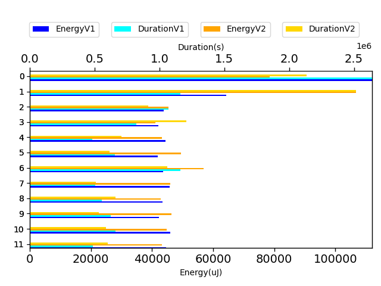

## com.google.gson.functional.JavaUtilConcurrentAtomicTest

| Test | IterationV1 | IterationV2 | DeltaIteration |
| --- | --- | --- | --- |
| com.google.gson.functional.JavaUtilConcurrentAtomicTest-testAtomicLongWithStringSerializationPolicy | 55 | 61 | 6 |
| com.google.gson.functional.JavaUtilConcurrentAtomicTest-testAtomicLongArrayWithStringSerializationPolicy | 99 | 99 | 0 |

| Test | EnergyV1 | EnergyV2 | DeltaEnergy |
| --- | --- | --- | --- |
| com.google.gson.functional.JavaUtilConcurrentAtomicTest-testAtomicLongWithStringSerializationPolicy | 38017.47683321595 | 45012.53575232072 | 6995.058919104769 |
| com.google.gson.functional.JavaUtilConcurrentAtomicTest-testAtomicLongArrayWithStringSerializationPolicy | 99800.21338213932 | 50483.16689429424 | -49317.04648784508 |

| Test | DurationV1 | DurationsV2 | DeltaDuration |
| --- | --- | --- | --- |
| com.google.gson.functional.JavaUtilConcurrentAtomicTest-testAtomicLongWithStringSerializationPolicy | 1328329.5236226467 | 888240.9577277709 | -440088.5658948758 |
| com.google.gson.functional.JavaUtilConcurrentAtomicTest-testAtomicLongArrayWithStringSerializationPolicy | 4012897.301702298 | 1506348.1801478914 | -2506549.121554407 |

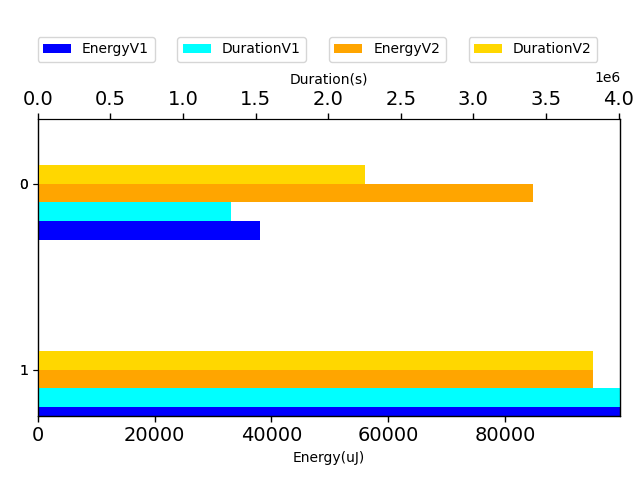

## com.google.gson.functional.ParameterizedTypesTest

| Test | IterationV1 | IterationV2 | DeltaIteration |
| --- | --- | --- | --- |
| com.google.gson.functional.ParameterizedTypesTest-testParameterizedTypeWithReaderDeserialization | 62 | 71 | 9 |
| com.google.gson.functional.ParameterizedTypesTest-testParameterizedTypeWithCustomSerializer | 89 | 93 | 4 |
| com.google.gson.functional.ParameterizedTypesTest-testParameterizedTypeDeserialization | 99 | 98 | -1 |
| com.google.gson.functional.ParameterizedTypesTest-testParameterizedTypesWithCustomDeserializer | 75 | 78 | 3 |

| Test | EnergyV1 | EnergyV2 | DeltaEnergy |
| --- | --- | --- | --- |
| com.google.gson.functional.ParameterizedTypesTest-testParameterizedTypeWithReaderDeserialization | 45343.33500784836 | 40243.49033321827 | -5099.844674630091 |
| com.google.gson.functional.ParameterizedTypesTest-testParameterizedTypeWithCustomSerializer | 51436.320132268724 | 44892.78453609193 | -6543.535596176793 |
| com.google.gson.functional.ParameterizedTypesTest-testParameterizedTypeDeserialization | 84730.70005232538 | 130800.07345863084 | 46069.37340630546 |
| com.google.gson.functional.ParameterizedTypesTest-testParameterizedTypesWithCustomDeserializer | 50525.07083190886 | 54352.77559187699 | 3827.704759968132 |

| Test | DurationV1 | DurationsV2 | DeltaDuration |
| --- | --- | --- | --- |
| com.google.gson.functional.ParameterizedTypesTest-testParameterizedTypeWithReaderDeserialization | 1007992.235849884 | 1167414.4460711544 | 159422.21022127045 |
| com.google.gson.functional.ParameterizedTypesTest-testParameterizedTypeWithCustomSerializer | 1603442.299119459 | 1260248.3912940072 | -343193.9078254518 |
| com.google.gson.functional.ParameterizedTypesTest-testParameterizedTypeDeserialization | 2051325.4884626558 | 3312526.0221098657 | 1261200.5336472099 |
| com.google.gson.functional.ParameterizedTypesTest-testParameterizedTypesWithCustomDeserializer | 1311191.467815662 | 1441922.7878124784 | 130731.31999681634 |

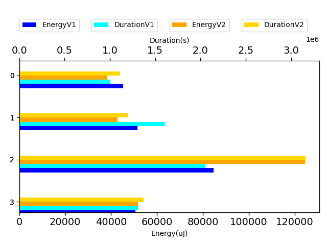

## com.google.gson.functional.FieldNamingTest

| Test | IterationV1 | IterationV2 | DeltaIteration |
| --- | --- | --- | --- |
| com.google.gson.functional.FieldNamingTest-testIdentity | 95 | 93 | -2 |
| com.google.gson.functional.FieldNamingTest-testUpperCamelCase | 48 | 44 | -4 |
| com.google.gson.functional.FieldNamingTest-testLowerCaseWithDashes | 35 | 41 | 6 |
| com.google.gson.functional.FieldNamingTest-testUpperCamelCaseWithSpaces | 46 | 52 | 6 |
| com.google.gson.functional.FieldNamingTest-testLowerCaseWithUnderscores | 46 | 40 | -6 |

| Test | EnergyV1 | EnergyV2 | DeltaEnergy |
| --- | --- | --- | --- |
| com.google.gson.functional.FieldNamingTest-testIdentity | 50271.44540194814 | 82702.83862692105 | 32431.393224972904 |
| com.google.gson.functional.FieldNamingTest-testUpperCamelCase | 43989.499339459624 | 38851.12674950561 | -5138.372589954015 |
| com.google.gson.functional.FieldNamingTest-testLowerCaseWithDashes | 47146.450959279086 | 41358.119380629185 | -5788.331578649901 |
| com.google.gson.functional.FieldNamingTest-testUpperCamelCaseWithSpaces | 42751.08496543487 | 40941.240811792246 | -1809.8441536426253 |
| com.google.gson.functional.FieldNamingTest-testLowerCaseWithUnderscores | 42914.3355466915 | 41166.40420396413 | -1747.9313427273737 |

| Test | DurationV1 | DurationsV2 | DeltaDuration |
| --- | --- | --- | --- |
| com.google.gson.functional.FieldNamingTest-testIdentity | 1495854.8503699107 | 2344810.9399378523 | 848956.0895679416 |
| com.google.gson.functional.FieldNamingTest-testUpperCamelCase | 543631.2853330555 | 998050.1374762108 | 454418.8521431553 |
| com.google.gson.functional.FieldNamingTest-testLowerCaseWithDashes | 625188.979326543 | 683831.3644606457 | 58642.38513410266 |
| com.google.gson.functional.FieldNamingTest-testUpperCamelCaseWithSpaces | 667252.705714681 | 941732.8446169808 | 274480.1389022998 |
| com.google.gson.functional.FieldNamingTest-testLowerCaseWithUnderscores | 616662.3396823283 | 850615.3099461168 | 233952.97026378848 |

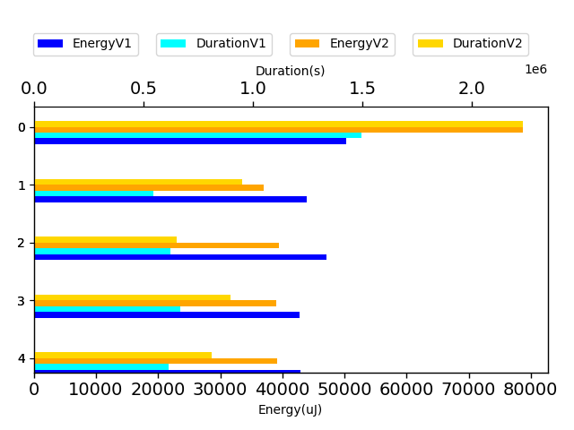

## com.google.gson.functional.SecurityTest

| Test | IterationV1 | IterationV2 | DeltaIteration |
| --- | --- | --- | --- |
| com.google.gson.functional.SecurityTest-testNonExecutableJsonSerialization | 55 | 48 | -7 |
| com.google.gson.functional.SecurityTest-testNonExecutableJsonDeserialization | 40 | 24 | -16 |
| com.google.gson.functional.SecurityTest-testJsonWithNonExectuableTokenWithConfiguredGsonDeserialization | 30 | 26 | -4 |
| com.google.gson.functional.SecurityTest-testJsonWithNonExectuableTokenSerialization | 15 | 21 | 6 |
| com.google.gson.functional.SecurityTest-testJsonWithNonExectuableTokenWithRegularGsonDeserialization | 29 | 28 | -1 |

| Test | EnergyV1 | EnergyV2 | DeltaEnergy |
| --- | --- | --- | --- |
| com.google.gson.functional.SecurityTest-testNonExecutableJsonSerialization | 43728.416128405 | 45786.602114314104 | 2058.1859859091055 |
| com.google.gson.functional.SecurityTest-testNonExecutableJsonDeserialization | 44454.60047329835 | 43038.00876843929 | -1416.5917048590563 |
| com.google.gson.functional.SecurityTest-testJsonWithNonExectuableTokenWithConfiguredGsonDeserialization | 43828.88441372197 | 47026.387880027294 | 3197.503466305323 |
| com.google.gson.functional.SecurityTest-testJsonWithNonExectuableTokenSerialization | 43280.54248046875 | 39315.28972053528 | -3965.2527599334717 |
| com.google.gson.functional.SecurityTest-testJsonWithNonExectuableTokenWithRegularGsonDeserialization | 41508.55367286131 | 47289.81748510152 | 5781.263812240213 |

| Test | DurationV1 | DurationsV2 | DeltaDuration |
| --- | --- | --- | --- |
| com.google.gson.functional.SecurityTest-testNonExecutableJsonSerialization | 1139170.826209956 | 594973.1375936279 | -544197.6886163282 |
| com.google.gson.functional.SecurityTest-testNonExecutableJsonDeserialization | 887806.7112019716 | 614147.4506964684 | -273659.2605055033 |
| com.google.gson.functional.SecurityTest-testJsonWithNonExectuableTokenWithConfiguredGsonDeserialization | 636386.395528459 | 522327.212636292 | -114059.18289216701 |
| com.google.gson.functional.SecurityTest-testJsonWithNonExectuableTokenSerialization | 378428.2712402344 | 511140.8625488281 | 132712.59130859375 |
| com.google.gson.functional.SecurityTest-testJsonWithNonExectuableTokenWithRegularGsonDeserialization | 621360.69518359 | 565363.1510455012 | -55997.54413808882 |

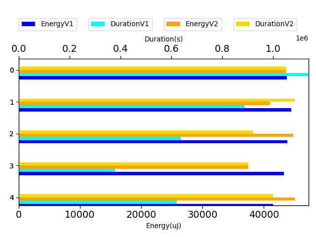

## com.google.gson.functional.CollectionTest

| Test | IterationV1 | IterationV2 | DeltaIteration |
| --- | --- | --- | --- |
| com.google.gson.functional.CollectionTest-testUserCollectionTypeAdapter | 74 | 79 | 5 |

| Test | EnergyV1 | EnergyV2 | DeltaEnergy |
| --- | --- | --- | --- |
| com.google.gson.functional.CollectionTest-testUserCollectionTypeAdapter | 42970.36923169865 | 66355.59916053902 | 23385.229928840366 |

| Test | DurationV1 | DurationsV2 | DeltaDuration |
| --- | --- | --- | --- |
| com.google.gson.functional.CollectionTest-testUserCollectionTypeAdapter | 931486.0250599484 | 1828160.8110361139 | 896674.7859761654 |

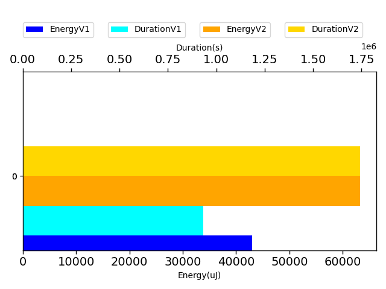

## com.google.gson.functional.JsonAdapterAnnotationOnFieldsTest

| Test | IterationV1 | IterationV2 | DeltaIteration |
| --- | --- | --- | --- |
| com.google.gson.functional.JsonAdapterAnnotationOnFieldsTest-testRegisteredTypeAdapterTakesPrecedenceOverClassAnnotationAdapter | 96 | 97 | 1 |
| com.google.gson.functional.JsonAdapterAnnotationOnFieldsTest-testFieldAnnotationTakesPrecedenceOverRegisteredTypeAdapter | 99 | 99 | 0 |

| Test | EnergyV1 | EnergyV2 | DeltaEnergy |
| --- | --- | --- | --- |
| com.google.gson.functional.JsonAdapterAnnotationOnFieldsTest-testRegisteredTypeAdapterTakesPrecedenceOverClassAnnotationAdapter | 203250.38122511128 | 46461.80707747895 | -156788.57414763235 |
| com.google.gson.functional.JsonAdapterAnnotationOnFieldsTest-testFieldAnnotationTakesPrecedenceOverRegisteredTypeAdapter | 98485.3664589359 | 45327.55033694451 | -53157.81612199139 |

| Test | DurationV1 | DurationsV2 | DeltaDuration |
| --- | --- | --- | --- |
| com.google.gson.functional.JsonAdapterAnnotationOnFieldsTest-testRegisteredTypeAdapterTakesPrecedenceOverClassAnnotationAdapter | 4923571.574822791 | 1140965.789021624 | -3782605.7858011667 |
| com.google.gson.functional.JsonAdapterAnnotationOnFieldsTest-testFieldAnnotationTakesPrecedenceOverRegisteredTypeAdapter | 2252116.780217755 | 1450452.0049017395 | -801664.7753160156 |

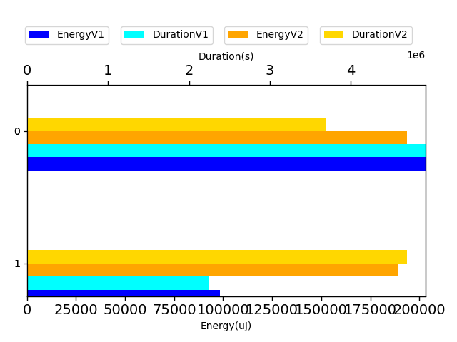

## com.google.gson.functional.UncategorizedTest

| Test | IterationV1 | IterationV2 | DeltaIteration |
| --- | --- | --- | --- |
| com.google.gson.functional.UncategorizedTest-testReturningDerivedClassesDuringDeserialization | 99 | 99 | 0 |

| Test | EnergyV1 | EnergyV2 | DeltaEnergy |
| --- | --- | --- | --- |
| com.google.gson.functional.UncategorizedTest-testReturningDerivedClassesDuringDeserialization | 66243.53409724585 | 64319.68759385651 | -1923.8465033893372 |

| Test | DurationV1 | DurationsV2 | DeltaDuration |
| --- | --- | --- | --- |
| com.google.gson.functional.UncategorizedTest-testReturningDerivedClassesDuringDeserialization | 1699228.6618095026 | 1794302.8452264343 | 95074.18341693166 |

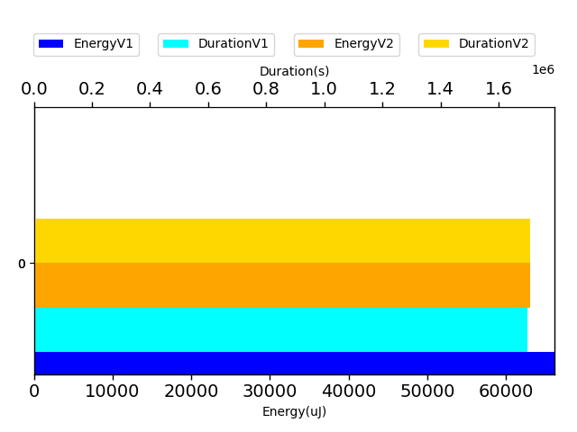

## com.google.gson.GsonTypeAdapterTest

| Test | IterationV1 | IterationV2 | DeltaIteration |
| --- | --- | --- | --- |
| com.google.gson.GsonTypeAdapterTest-testDeserializerForAbstractClass | 99 | 99 | 0 |

| Test | EnergyV1 | EnergyV2 | DeltaEnergy |
| --- | --- | --- | --- |
| com.google.gson.GsonTypeAdapterTest-testDeserializerForAbstractClass | 91530.79712145533 | 75634.45468190304 | -15896.342439552289 |

| Test | DurationV1 | DurationsV2 | DeltaDuration |
| --- | --- | --- | --- |
| com.google.gson.GsonTypeAdapterTest-testDeserializerForAbstractClass | 2540241.9178707413 | 2156328.085180539 | -383913.83269020217 |

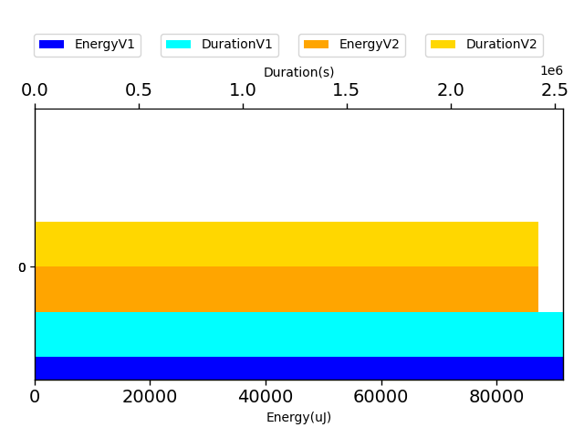

## com.google.gson.functional.PrintFormattingTest

| Test | IterationV1 | IterationV2 | DeltaIteration |
| --- | --- | --- | --- |
| com.google.gson.functional.PrintFormattingTest-testJsonObjectWithNullValuesSerialized | 30 | 27 | -3 |

| Test | EnergyV1 | EnergyV2 | DeltaEnergy |
| --- | --- | --- | --- |
| com.google.gson.functional.PrintFormattingTest-testJsonObjectWithNullValuesSerialized | 44821.334641950205 | 57526.074166134 | 12704.739524183795 |

| Test | DurationV1 | DurationsV2 | DeltaDuration |
| --- | --- | --- | --- |
| com.google.gson.functional.PrintFormattingTest-testJsonObjectWithNullValuesSerialized | 670518.3015471874 | 1394680.0524588078 | 724161.7509116204 |

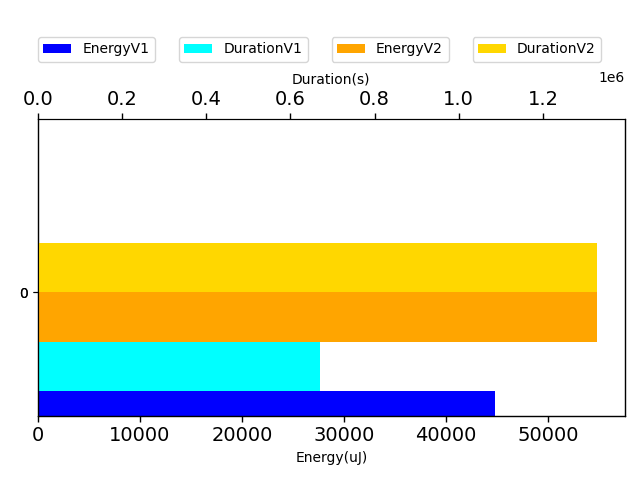

## com.google.gson.functional.CustomSerializerTest

| Test | IterationV1 | IterationV2 | DeltaIteration |
| --- | --- | --- | --- |
| com.google.gson.functional.CustomSerializerTest-testBaseClassSerializerInvokedForBaseClassFieldsHoldingSubClassInstances | 45 | 39 | -6 |
| com.google.gson.functional.CustomSerializerTest-testBaseClassSerializerInvokedForBaseClassFields | 36 | 43 | 7 |
| com.google.gson.functional.CustomSerializerTest-testSubClassSerializerInvokedForBaseClassFieldsHoldingArrayOfSubClassInstances | 60 | 55 | -5 |
| com.google.gson.functional.CustomSerializerTest-testSerializerReturnsNull | 45 | 47 | 2 |
| com.google.gson.functional.CustomSerializerTest-testSubClassSerializerInvokedForBaseClassFieldsHoldingSubClassInstances | 74 | 63 | -11 |

| Test | EnergyV1 | EnergyV2 | DeltaEnergy |
| --- | --- | --- | --- |
| com.google.gson.functional.CustomSerializerTest-testBaseClassSerializerInvokedForBaseClassFieldsHoldingSubClassInstances | 41921.62643549086 | 45509.06982553054 | 3587.443390039676 |
| com.google.gson.functional.CustomSerializerTest-testBaseClassSerializerInvokedForBaseClassFields | 44802.85368258176 | 45198.91940322481 | 396.0657206430551 |
| com.google.gson.functional.CustomSerializerTest-testSubClassSerializerInvokedForBaseClassFieldsHoldingArrayOfSubClassInstances | 48419.49774630715 | 38604.935594606504 | -9814.562151700644 |
| com.google.gson.functional.CustomSerializerTest-testSerializerReturnsNull | 45974.595129520436 | 46208.02875466221 | 233.43362514177716 |
| com.google.gson.functional.CustomSerializerTest-testSubClassSerializerInvokedForBaseClassFieldsHoldingSubClassInstances | 97568.19535355254 | 799375.3226754456 | 701807.127321893 |

| Test | DurationV1 | DurationsV2 | DeltaDuration |
| --- | --- | --- | --- |
| com.google.gson.functional.CustomSerializerTest-testBaseClassSerializerInvokedForBaseClassFieldsHoldingSubClassInstances | 832669.7411387992 | 585482.8350739984 | -247186.9060648008 |
| com.google.gson.functional.CustomSerializerTest-testBaseClassSerializerInvokedForBaseClassFields | 521203.18113867217 | 569484.620632147 | 48281.43949347478 |
| com.google.gson.functional.CustomSerializerTest-testSubClassSerializerInvokedForBaseClassFieldsHoldingArrayOfSubClassInstances | 804416.7259259 | 1001372.1672068466 | 196955.4412809466 |
| com.google.gson.functional.CustomSerializerTest-testSerializerReturnsNull | 591556.8616593538 | 599031.696057887 | 7474.834398533218 |
| com.google.gson.functional.CustomSerializerTest-testSubClassSerializerInvokedForBaseClassFieldsHoldingSubClassInstances | 2379216.6918125874 | 25687149.853599664 | 23307933.161787078 |

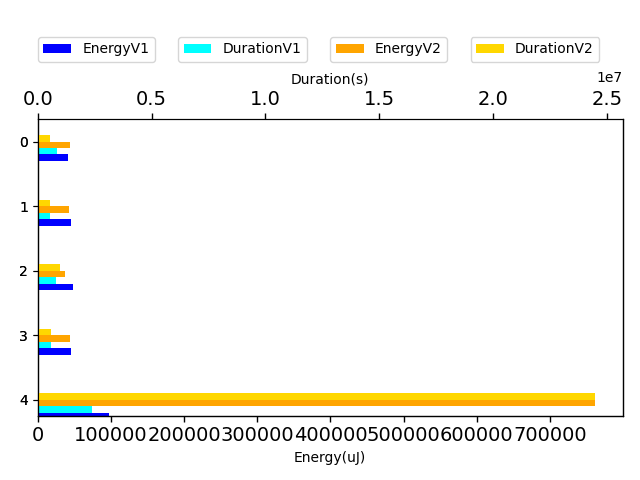

## com.google.gson.GsonBuilderTest

| Test | IterationV1 | IterationV2 | DeltaIteration |
| --- | --- | --- | --- |
| com.google.gson.GsonBuilderTest-testTransientFieldExclusion | 48 | 32 | -16 |
| com.google.gson.GsonBuilderTest-testExcludeFieldsWithModifiers | 54 | 59 | 5 |
| com.google.gson.GsonBuilderTest-testCreatingMoreThanOnce | 17 | 18 | 1 |

| Test | EnergyV1 | EnergyV2 | DeltaEnergy |
| --- | --- | --- | --- |
| com.google.gson.GsonBuilderTest-testTransientFieldExclusion | 41298.16100153961 | 41492.49206116935 | 194.33105962974514 |
| com.google.gson.GsonBuilderTest-testExcludeFieldsWithModifiers | 41675.324028033894 | 42307.660199488586 | 632.3361714546918 |
| com.google.gson.GsonBuilderTest-testCreatingMoreThanOnce | 581022.7936859131 | 47647.03335571289 | -533375.7603302002 |

| Test | DurationV1 | DurationsV2 | DeltaDuration |
| --- | --- | --- | --- |
| com.google.gson.GsonBuilderTest-testTransientFieldExclusion | 624209.907410449 | 840604.2728600027 | 216394.3654495537 |
| com.google.gson.GsonBuilderTest-testExcludeFieldsWithModifiers | 914226.6797533304 | 954306.5195025807 | 40079.83974925033 |
| com.google.gson.GsonBuilderTest-testCreatingMoreThanOnce | 15972777.919769287 | 712886.9914321899 | -15259890.928337097 |

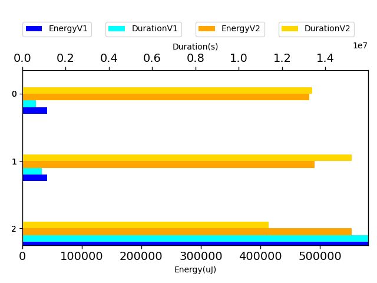

## com.google.gson.functional.CircularReferenceTest

| Test | IterationV1 | IterationV2 | DeltaIteration |
| --- | --- | --- | --- |
| com.google.gson.functional.CircularReferenceTest-testSelfReferenceCustomHandlerSerialization | 99 | 99 | 0 |

| Test | EnergyV1 | EnergyV2 | DeltaEnergy |
| --- | --- | --- | --- |
| com.google.gson.functional.CircularReferenceTest-testSelfReferenceCustomHandlerSerialization | 305171.3664059255 | 281727.6083013841 | -23443.758104541397 |

| Test | DurationV1 | DurationsV2 | DeltaDuration |
| --- | --- | --- | --- |
| com.google.gson.functional.CircularReferenceTest-testSelfReferenceCustomHandlerSerialization | 7977283.530647541 | 7360482.486999132 | -616801.0436484097 |

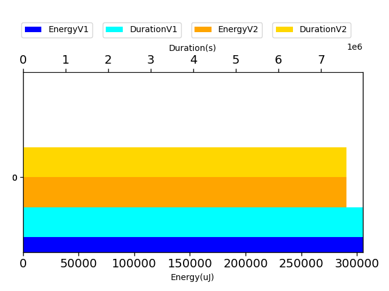

## com.google.gson.functional.ObjectTest

| Test | IterationV1 | IterationV2 | DeltaIteration |
| --- | --- | --- | --- |
| com.google.gson.functional.ObjectTest-testInnerClassDeserialization | 85 | 86 | 1 |
| com.google.gson.functional.ObjectTest-testAnonymousLocalClassesCustomSerialization | 78 | 74 | -4 |
| com.google.gson.functional.ObjectTest-testJsonObjectSerialization | 29 | 21 | -8 |

| Test | EnergyV1 | EnergyV2 | DeltaEnergy |
| --- | --- | --- | --- |
| com.google.gson.functional.ObjectTest-testInnerClassDeserialization | 44752.41128689812 | 80542.1842164 | 35789.77292950188 |
| com.google.gson.functional.ObjectTest-testAnonymousLocalClassesCustomSerialization | 51868.39694314219 | 105160.86172123137 | 53292.46477808918 |
| com.google.gson.functional.ObjectTest-testJsonObjectSerialization | 59863.85895400867 | 61585.79937648773 | 1721.9404224790633 |

| Test | DurationV1 | DurationsV2 | DeltaDuration |
| --- | --- | --- | --- |
| com.google.gson.functional.ObjectTest-testInnerClassDeserialization | 1699462.2095074544 | 2742466.532660683 | 1043004.3231532287 |
| com.google.gson.functional.ObjectTest-testAnonymousLocalClassesCustomSerialization | 2076112.1901782802 | 3452593.0949310875 | 1376480.9047528072 |
| com.google.gson.functional.ObjectTest-testJsonObjectSerialization | 1785341.403572373 | 1933313.3978376389 | 147971.99426526576 |

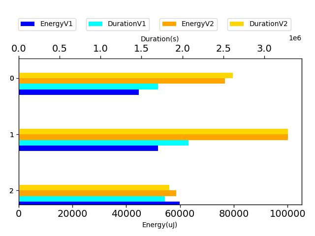

## com.google.gson.OverrideCoreTypeAdaptersTest

| Test | IterationV1 | IterationV2 | DeltaIteration |
| --- | --- | --- | --- |
| com.google.gson.OverrideCoreTypeAdaptersTest-testOverrideWrapperBooleanAdapter | 42 | 42 | 0 |
| com.google.gson.OverrideCoreTypeAdaptersTest-testOverridePrimitiveBooleanAdapter | 23 | 15 | -8 |
| com.google.gson.OverrideCoreTypeAdaptersTest-testOverrideStringAdapter | 16 | 29 | 13 |

| Test | EnergyV1 | EnergyV2 | DeltaEnergy |
| --- | --- | --- | --- |
| com.google.gson.OverrideCoreTypeAdaptersTest-testOverrideWrapperBooleanAdapter | 180359.28291358677 | 43246.41971470452 | -137112.86319888226 |
| com.google.gson.OverrideCoreTypeAdaptersTest-testOverridePrimitiveBooleanAdapter | 41106.70470046997 | 44605.35339355469 | 3498.648693084717 |
| com.google.gson.OverrideCoreTypeAdaptersTest-testOverrideStringAdapter | 45309.36639404297 | 45968.89194253832 | 659.5255484953523 |

| Test | DurationV1 | DurationsV2 | DeltaDuration |
| --- | --- | --- | --- |
| com.google.gson.OverrideCoreTypeAdaptersTest-testOverrideWrapperBooleanAdapter | 4728035.658739548 | 555962.8881095474 | -4172072.7706300006 |
| com.google.gson.OverrideCoreTypeAdaptersTest-testOverridePrimitiveBooleanAdapter | 581404.975528717 | 580528.7013549805 | -876.2741737365723 |
| com.google.gson.OverrideCoreTypeAdaptersTest-testOverrideStringAdapter | 486380.2541809082 | 489965.5679199062 | 3585.3137389980257 |

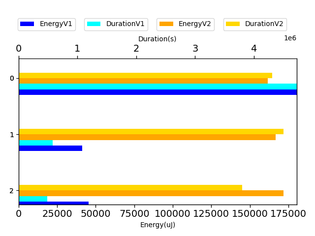

## com.google.gson.MixedStreamTest

| Test | IterationV1 | IterationV2 | DeltaIteration |
| --- | --- | --- | --- |
| com.google.gson.MixedStreamTest-testWriteLenient | 68 | 69 | 1 |
| com.google.gson.MixedStreamTest-testWriteHtmlSafe | 64 | 67 | 3 |

| Test | EnergyV1 | EnergyV2 | DeltaEnergy |
| --- | --- | --- | --- |
| com.google.gson.MixedStreamTest-testWriteLenient | 99986.7797606323 | 53084.80315298906 | -46901.97660764324 |
| com.google.gson.MixedStreamTest-testWriteHtmlSafe | 77279.72650075248 | 44858.97148197187 | -32420.755018780612 |

| Test | DurationV1 | DurationsV2 | DeltaDuration |
| --- | --- | --- | --- |
| com.google.gson.MixedStreamTest-testWriteLenient | 2246562.8438982703 | 1441371.3512936286 | -805191.4926046417 |
| com.google.gson.MixedStreamTest-testWriteHtmlSafe | 1782211.5647116734 | 1031131.862868092 | -751079.7018435814 |

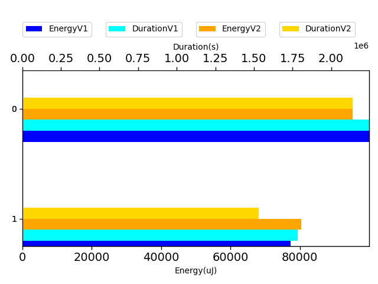

## com.google.gson.functional.EscapingTest

| Test | IterationV1 | IterationV2 | DeltaIteration |
| --- | --- | --- | --- |
| com.google.gson.functional.EscapingTest-testGsonAcceptsEscapedAndNonEscapedJsonDeserialization | 63 | 63 | 0 |

| Test | EnergyV1 | EnergyV2 | DeltaEnergy |
| --- | --- | --- | --- |
| com.google.gson.functional.EscapingTest-testGsonAcceptsEscapedAndNonEscapedJsonDeserialization | 50024.19517128754 | 58078.812636824296 | 8054.617465536758 |

| Test | DurationV1 | DurationsV2 | DeltaDuration |
| --- | --- | --- | --- |
| com.google.gson.functional.EscapingTest-testGsonAcceptsEscapedAndNonEscapedJsonDeserialization | 960909.758691557 | 1519261.2244159342 | 558351.4657243772 |

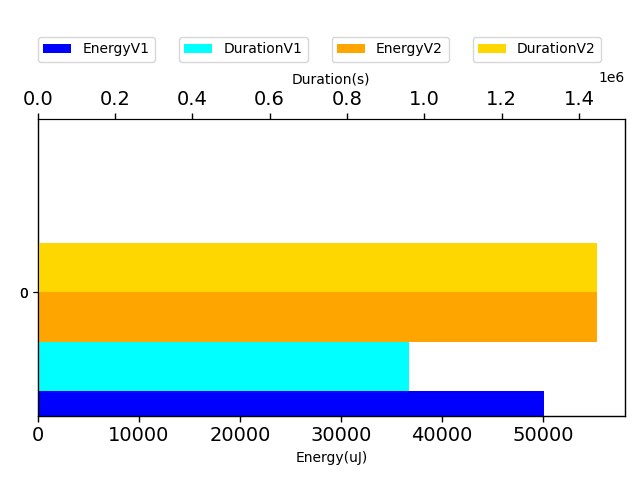

## com.google.gson.functional.ArrayTest

| Test | IterationV1 | IterationV2 | DeltaIteration |
| --- | --- | --- | --- |
| com.google.gson.functional.ArrayTest-testNullsInArrayWithSerializeNullPropertySetSerialization | 26 | 29 | 3 |

| Test | EnergyV1 | EnergyV2 | DeltaEnergy |
| --- | --- | --- | --- |
| com.google.gson.functional.ArrayTest-testNullsInArrayWithSerializeNullPropertySetSerialization | 45565.84528127313 | 42264.337384680286 | -3301.5078965928406 |

| Test | DurationV1 | DurationsV2 | DeltaDuration |
| --- | --- | --- | --- |
| com.google.gson.functional.ArrayTest-testNullsInArrayWithSerializeNullPropertySetSerialization | 751068.2894078195 | 489940.4886021223 | -261127.80080569722 |

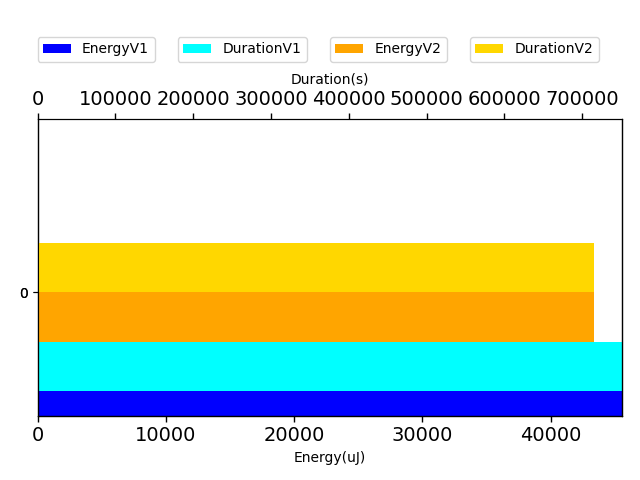

## com.google.gson.functional.ReadersWritersTest

| Test | IterationV1 | IterationV2 | DeltaIteration |
| --- | --- | --- | --- |
| com.google.gson.functional.ReadersWritersTest-testTopLevelNullObjectDeserializationWithReaderAndSerializeNulls | 25 | 26 | 1 |
| com.google.gson.functional.ReadersWritersTest-testTopLevelNullObjectSerializationWithWriterAndSerializeNulls | 15 | 18 | 3 |

| Test | EnergyV1 | EnergyV2 | DeltaEnergy |
| --- | --- | --- | --- |
| com.google.gson.functional.ReadersWritersTest-testTopLevelNullObjectDeserializationWithReaderAndSerializeNulls | 43068.951395154 | 44594.47661012411 | 1525.5252149701118 |
| com.google.gson.functional.ReadersWritersTest-testTopLevelNullObjectSerializationWithWriterAndSerializeNulls | 45277.63067626953 | 46114.467250823975 | 836.8365745544434 |

| Test | DurationV1 | DurationsV2 | DeltaDuration |
| --- | --- | --- | --- |
| com.google.gson.functional.ReadersWritersTest-testTopLevelNullObjectDeserializationWithReaderAndSerializeNulls | 789242.9677436948 | 442965.04710656404 | -346277.92063713074 |
| com.google.gson.functional.ReadersWritersTest-testTopLevelNullObjectSerializationWithWriterAndSerializeNulls | 715870.6134643555 | 439949.2192840576 | -275921.39418029785 |

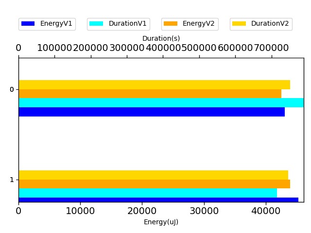

