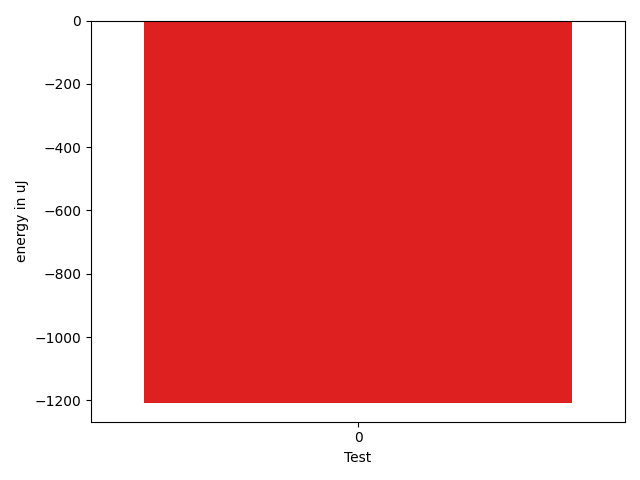
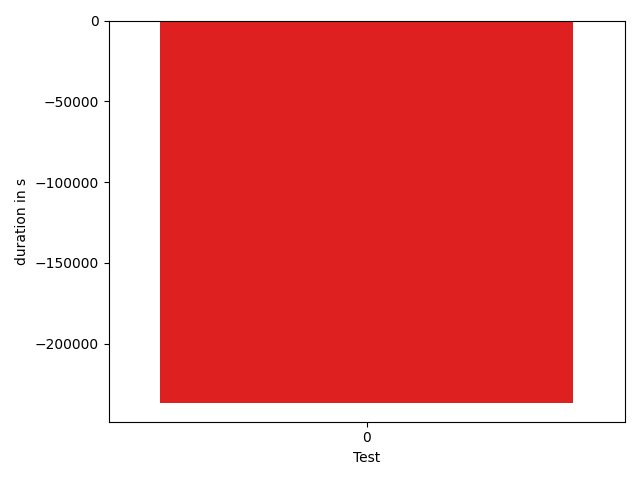
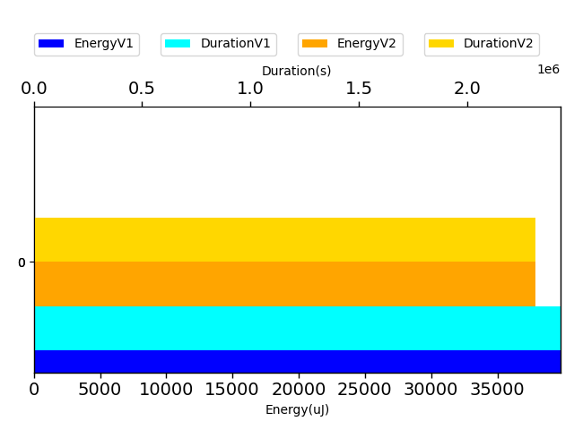

# gson 3090a7

https://github.com/google/gson.git/commit/3090a7

## Delta Energy per test method

| ID | EnergyV1 | EnergyV2 | DeltaEnergy |
| --- | --- | --- | --- |
| 0 | 39772.79337002512 | 38565.57396440764 | -1207.2194056174849 |

## Delta Duration per test method

| ID | DurationV1 | DurationsV2 | DeltaDuration |
| --- | --- | --- | --- |
| 0 | 2431735.948287432 | 2195365.863458443 | -236370.08482898911 |

## Misc.

| ID | Test Class | Test Method |
| --- | --- | --- |
| 0 | com.google.gson.JsonArrayTest | testDeepCopy |

| Test | IterationV1 | IterationV2 | DeltaIteration |
| --- | --- | --- | --- |
| 0 | 99 | 99 | 0 |

| Time Label | Time (s) |
| --- | --- |
| Selection | 34.612841844558716 |
| Injection | 13.556593418121338 |
| Total | 1358.1389043331146 |

## Aggregation per test class

| Index | EnergyV1 | EnergyV2 | DeltaEnergy |
| --- | --- | --- | --- |
| 0 | 39772.79337002512 | 38565.57396440764 | -1207.2194056174849 |

| Index | DurationV1 | DurationsV2 | DeltaDuration |
| --- | --- | --- | --- |
| 0 | 2431735.948287432 | 2195365.863458443 | -236370.08482898911 |
| Index | TestClassName | #Tests |
| --- | --- | --- |
| 0 | com.google.gson.JsonArrayTest | 1 |
