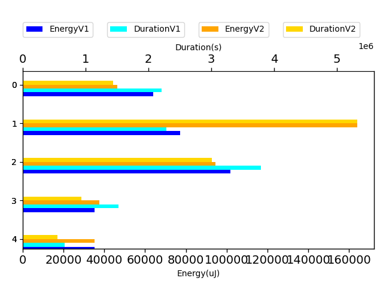

# gson ada597

https://github.com/google/gson.git/commit/ada597

| Index | EnergyV1 | EnergyV2 | DeltaEnergy |
| --- | --- | --- | --- |
| 0 | 313689.55733771104 | 396753.92863437446 | 83064.37129666342 |

| Index | DurationV1 | DurationsV2 | DeltaDuration |
| --- | --- | --- | --- |
| 0 | 10480263.341509348 | 11823589.304720724 | 1343325.9632113762 |

| Index | TestClassName | #Tests |
| --- | --- | --- |
| 0 | com.google.gson.stream.JsonWriterTest | 5 |

| Time Label | Time (s) |
| --- | --- |
| Selection | 34.668235778808594 |
| Injection | 13.326864957809448 |
| Total | 1362.672641992569 |
## com.google.gson.stream.JsonWriterTest

| Test | IterationV1 | IterationV2 | DeltaIteration |
| --- | --- | --- | --- |
| com.google.gson.stream.JsonWriterTest-testNonFiniteDoubles | 39 | 37 | -2 |
| com.google.gson.stream.JsonWriterTest-testTopLevelValueTypes | 77 | 76 | -1 |
| com.google.gson.stream.JsonWriterTest-testPrettyPrintObject | 47 | 40 | -7 |
| com.google.gson.stream.JsonWriterTest-testDoubles | 64 | 63 | -1 |
| com.google.gson.stream.JsonWriterTest-testPrettyPrintArray | 22 | 23 | 1 |

| Test | EnergyV1 | EnergyV2 | DeltaEnergy |
| --- | --- | --- | --- |
| com.google.gson.stream.JsonWriterTest-testNonFiniteDoubles | 64060.39897053939 | 48757.14641979328 | -15303.25255074611 |
| com.google.gson.stream.JsonWriterTest-testTopLevelValueTypes | 77317.83789288875 | 172171.09338762608 | 94853.25549473733 |
| com.google.gson.stream.JsonWriterTest-testPrettyPrintObject | 101920.59895777021 | 99312.48290650282 | -2608.116051267396 |
| com.google.gson.stream.JsonWriterTest-testDoubles | 35232.12716855888 | 39446.95864343089 | 4214.831474872008 |
| com.google.gson.stream.JsonWriterTest-testPrettyPrintArray | 35158.5943479538 | 37066.24727702141 | 1907.6529290676117 |

| Test | DurationV1 | DurationsV2 | DeltaDuration |
| --- | --- | --- | --- |
| com.google.gson.stream.JsonWriterTest-testNonFiniteDoubles | 2211231.1846272307 | 1510938.0159405144 | -700293.1686867164 |
| com.google.gson.stream.JsonWriterTest-testTopLevelValueTypes | 2283022.201922166 | 5592524.732024472 | 3309502.530102306 |
| com.google.gson.stream.JsonWriterTest-testPrettyPrintObject | 3795359.9281713907 | 3158542.5530247972 | -636817.3751465934 |
| com.google.gson.stream.JsonWriterTest-testDoubles | 1522734.3248499308 | 980026.2242135282 | -542708.1006364026 |
| com.google.gson.stream.JsonWriterTest-testPrettyPrintArray | 667915.7019386292 | 581557.7795174122 | -86357.92242121696 |

