# gson b8f616

https://github.com/google/gson.git/commit/b8f616

## Delta Energy per test method

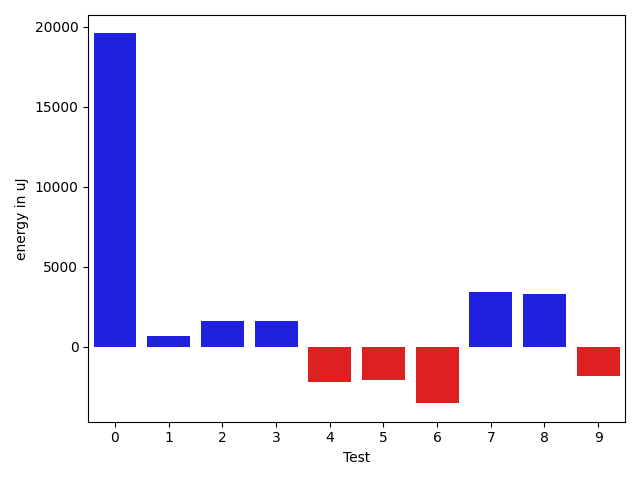

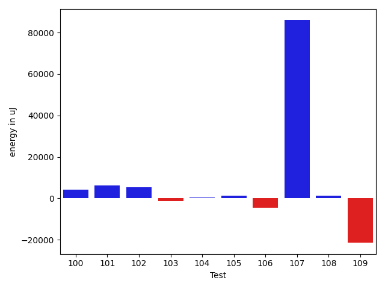

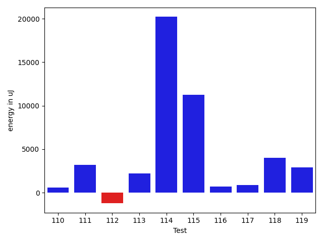

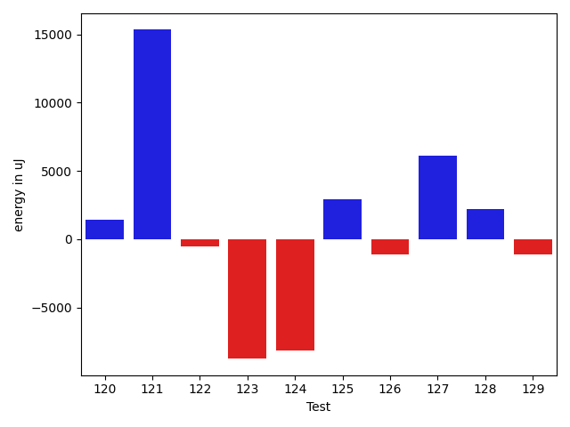

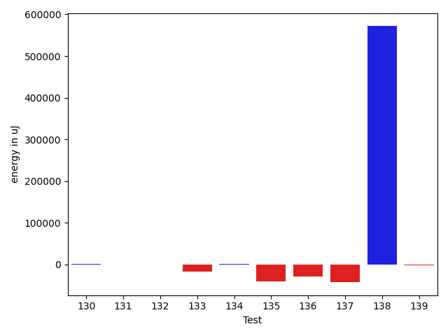

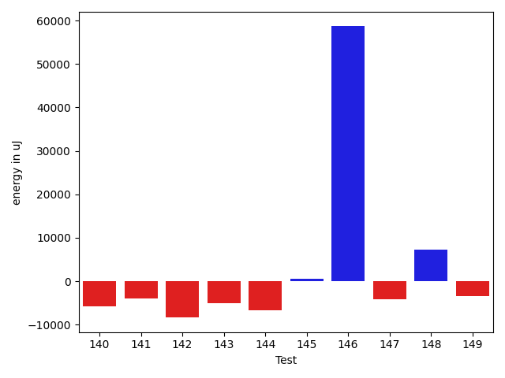

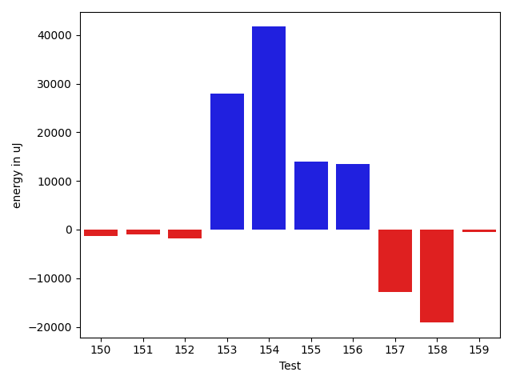

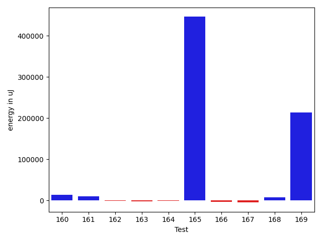

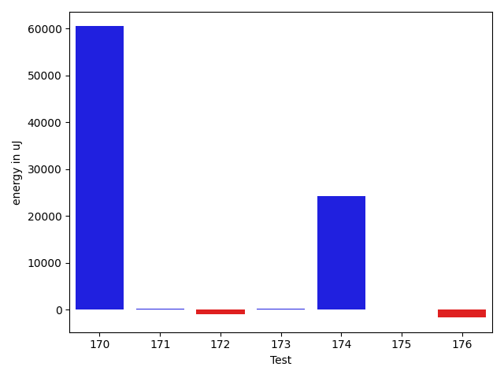

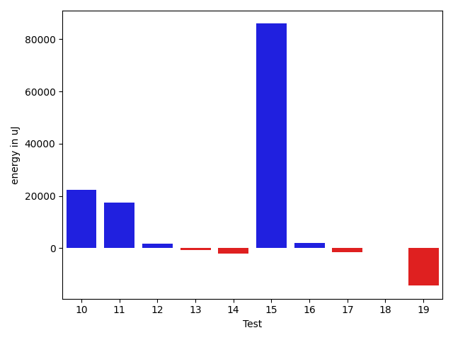

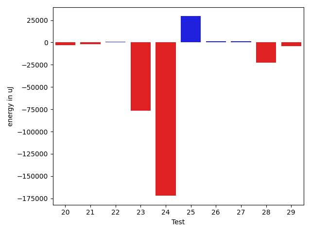

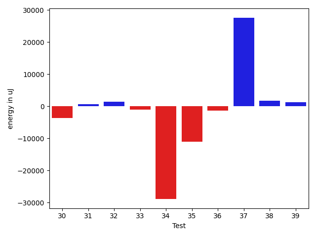

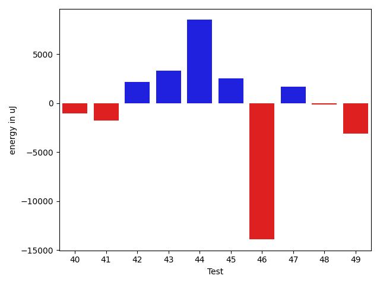

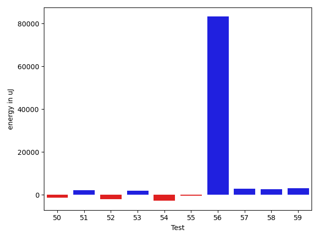

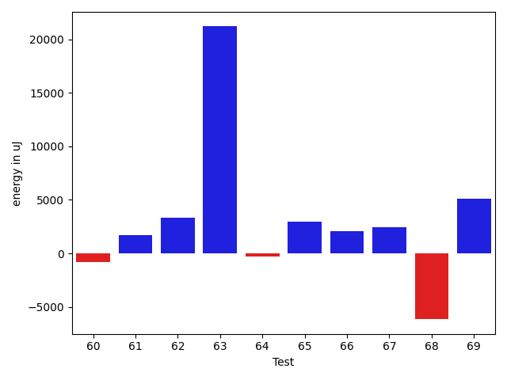

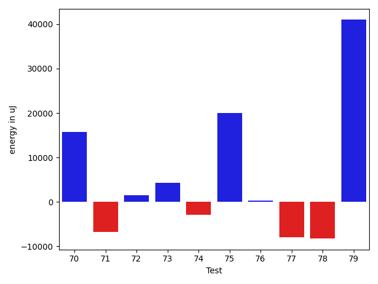

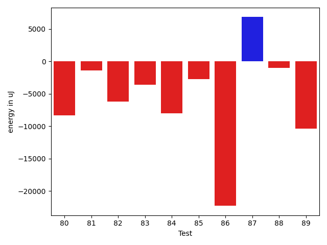

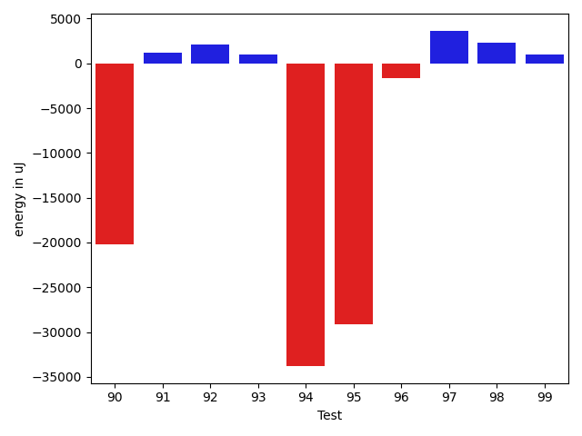

| ID | EnergyV1 | EnergyV2 | DeltaEnergy |
| --- | --- | --- | --- |
| 0 | 43125.11700347868 | 62713.91003223827 | 19588.793028759595 |
| 1 | 42766.26219893684 | 43437.16843639085 | 670.9062374540081 |
| 2 | 42255.25170422922 | 43855.948121680616 | 1600.6964174513996 |
| 3 | 40102.85742962395 | 41709.007601040204 | 1606.1501714162514 |
| 4 | 44068.736089550555 | 41872.73007019257 | -2196.0060193579848 |
| 5 | 42665.53680849075 | 40566.04318793863 | -2099.4936205521226 |
| 6 | 53125.43972521922 | 49598.86054349426 | -3526.579181724963 |
| 7 | 41695.17398473888 | 45143.15734495098 | 3447.9833602121 |
| 8 | 41634.231036822195 | 44936.86253733812 | 3302.6315005159267 |
| 9 | 41179.580461640544 | 39358.461168660666 | -1821.119292979878 |
| 10 | 43145.581897080374 | 65576.89201122319 | 22431.310114142812 |
| 11 | 45012.449891383534 | 62547.596732765734 | 17535.1468413822 |
| 12 | 42348.254114998876 | 44108.549292579904 | 1760.2951775810288 |
| 13 | 43579.6482865535 | 42782.057643125496 | -797.5906434280041 |
| 14 | 43062.5482667986 | 40947.88727631436 | -2114.6609904842408 |
| 15 | 57285.55441646371 | 143206.2945939966 | 85920.74017753289 |
| 16 | 42668.13777229702 | 44752.47494221511 | 2084.337169918086 |
| 17 | 42576.90277469811 | 40997.39789870287 | -1579.5048759952406 |
| 18 | 44083.02716341323 | 44315.70081209032 | 232.67364867708966 |
| 19 | 60479.00515104354 | 46172.387725748995 | -14306.617425294542 |
| 20 | 56105.85578267413 | 52986.14785904518 | -3119.70792362895 |
| 21 | 50261.30195725894 | 48318.13481531391 | -1943.1671419450286 |
| 22 | 92324.55089901038 | 93341.3692092764 | 1016.8183102660114 |
| 23 | 127458.77970885459 | 50890.72197478068 | -76568.05773407391 |
| 24 | 226378.21442028263 | 54405.53680866447 | -171972.67761161816 |
| 25 | 42990.3991085319 | 72361.35026230925 | 29370.95115377735 |
| 26 | 41482.65590966457 | 42583.02178090187 | 1100.3658712372999 |
| 27 | 43400.366215601956 | 44747.0867158214 | 1346.720500219446 |
| 28 | 64297.92594635193 | 41682.848140332935 | -22615.07780601899 |
| 29 | 90903.97126447945 | 86531.59798816555 | -4372.373276313898 |
| 30 | 45010.0438285172 | 41338.23819720745 | -3671.8056313097477 |
| 31 | 43749.26305585215 | 44353.929301519776 | 604.6662456676277 |
| 32 | 43938.19583413788 | 45448.09967810841 | 1509.9038439705328 |
| 33 | 44664.41859503591 | 43712.10283961386 | -952.3157554220525 |
| 34 | 398840.4412160944 | 369916.1582379427 | -28924.282978151692 |
| 35 | 56108.26108774367 | 45092.780980050484 | -11015.480107693184 |
| 36 | 44038.16804649006 | 42659.39406176381 | -1378.7739847262492 |
| 37 | 43539.601981456275 | 71189.3707594149 | 27649.768777958627 |
| 38 | 43172.445797355846 | 44884.92734648916 | 1712.4815491333138 |
| 39 | 43287.863862633705 | 44577.648072967306 | 1289.7842103336006 |
| 40 | 44624.26391196251 | 43573.896541489084 | -1050.3673704734247 |
| 41 | 45309.13306507468 | 43539.69187927246 | -1769.4411858022213 |
| 42 | 39661.20227588508 | 41857.412879626194 | 2196.210603741114 |
| 43 | 40927.73929721117 | 44242.61615935224 | 3314.876862141071 |
| 44 | 44299.47684744377 | 52801.70147667644 | 8502.224629232667 |
| 45 | 43638.13900166756 | 46182.96056210695 | 2544.8215604393918 |
| 46 | 56542.40603427085 | 42629.313946088216 | -13913.092088182631 |
| 47 | 41104.97703757195 | 42793.01775484081 | 1688.0407172688574 |
| 48 | 45036.41394998541 | 44918.24297995068 | -118.17097003473464 |
| 49 | 44893.121026319895 | 41790.41938350839 | -3102.701642811502 |
| 50 | 44749.71469116211 | 43520.30938043073 | -1229.4053107313812 |
| 51 | 40904.373474121094 | 43198.835320265964 | 2294.46184614487 |
| 52 | 44229.95666633909 | 42154.59518637076 | -2075.3614799683273 |
| 53 | 40456.0990932064 | 42531.497308343794 | 2075.398215137393 |
| 54 | 43685.0610653162 | 40957.030302643776 | -2728.0307626724243 |
| 55 | 45755.54071807861 | 45313.68450307846 | -441.8562150001526 |
| 56 | 43752.27627169341 | 126898.24836934844 | 83145.97209765503 |
| 57 | 44405.28096431494 | 47242.46167592704 | 2837.1807116121054 |
| 58 | 43397.615107224934 | 46136.22283949192 | 2738.607732266988 |
| 59 | 58458.16178077612 | 61624.195784370866 | 3166.0340035947447 |
| 60 | 44543.2057077717 | 43720.10704539433 | -823.0986623773715 |
| 61 | 43533.384039871904 | 45249.37013620528 | 1715.9860963333776 |
| 62 | 42774.98415194575 | 46082.4472087625 | 3307.463056816756 |
| 63 | 85064.40782831449 | 106248.79742998617 | 21184.389601671675 |
| 64 | 45238.61543960021 | 44978.920794333855 | -259.6946452663542 |
| 65 | 45693.81834994015 | 48662.46394962464 | 2968.645599684489 |
| 66 | 43265.34768944979 | 45320.669372558594 | 2055.3216831088066 |
| 67 | 39966.71846497059 | 42378.603794664145 | 2411.885329693556 |
| 68 | 46112.696044921875 | 39967.17875003815 | -6145.517294883728 |
| 69 | 39762.8646132946 | 44858.77313244715 | 5095.908519152552 |
| 70 | 46787.75599235714 | 62514.9934957659 | 15727.23750340876 |
| 71 | 46939.58032365306 | 40222.47896528244 | -6717.101358370623 |
| 72 | 37081.383343569 | 38547.89623106504 | 1466.5128874960355 |
| 73 | 40636.46481370926 | 44954.513749718666 | 4318.048936009407 |
| 74 | 46667.89453520837 | 43806.2272487695 | -2861.6672864388674 |
| 75 | 65466.61870819857 | 85494.8875034398 | 20028.268795241223 |
| 76 | 43776.39395624786 | 44124.53746937658 | 348.1435131287144 |
| 77 | 46719.314670154345 | 38803.25927913189 | -7916.055391022455 |
| 78 | 45326.904399640116 | 37089.80806342514 | -8237.096336214978 |
| 79 | 51948.20781537049 | 92917.46686526261 | 40969.25904989212 |
| 80 | 46428.848809149116 | 38092.82781653106 | -8336.020992618054 |
| 81 | 41810.61390975234 | 40400.614086918926 | -1409.9998228334152 |
| 82 | 48754.76990782097 | 42531.683353278786 | -6223.086554542184 |
| 83 | 44186.59513943829 | 40584.18420757726 | -3602.410931861028 |
| 84 | 46588.72711378895 | 38570.04699026048 | -8018.680123528466 |
| 85 | 45937.66746425629 | 43224.344383478165 | -2713.323080778122 |
| 86 | 73353.90151468696 | 51069.06931351889 | -22284.832201168072 |
| 87 | 39458.885416030884 | 46308.338963896036 | 6849.453547865152 |
| 88 | 42567.33889428794 | 41540.05829838896 | -1027.2805958989775 |
| 89 | 56982.713520680736 | 46640.09497138596 | -10342.618549294777 |
| 90 | 76527.48365062101 | 56343.32360821638 | -20184.160042404634 |
| 91 | 45351.22510698148 | 46551.26755872079 | 1200.0424517393112 |
| 92 | 43735.18236029602 | 45855.687338311596 | 2120.504978015575 |
| 93 | 42670.77142234916 | 43665.44452800925 | 994.6731056600911 |
| 94 | 130698.55220685687 | 96869.7232443362 | -33828.82896252067 |
| 95 | 168811.8744542004 | 139629.13863738184 | -29182.735816818575 |
| 96 | 45474.99210262799 | 43865.50285008696 | -1609.4892525410323 |
| 97 | 40120.128045597696 | 43755.80822675745 | 3635.6801811597543 |
| 98 | 40788.18533172509 | 43099.05511554709 | 2310.869783821996 |
| 99 | 40740.15462856797 | 41715.39970975239 | 975.2450811844174 |
| 100 | 37250.41960891434 | 41336.01707139611 | 4085.5974624817754 |
| 101 | 39683.46973471493 | 45850.367432708495 | 6166.897697993569 |
| 102 | 39134.192947387695 | 44554.64161109924 | 5420.448663711548 |
| 103 | 42945.11204766231 | 41655.713200919854 | -1289.398846742457 |
| 104 | 39762.88376989178 | 40236.19098382908 | 473.30721393730346 |
| 105 | 45188.24787084933 | 46528.11782376723 | 1339.8699529178994 |
| 106 | 46932.65282586249 | 42270.29594899402 | -4662.356876868471 |
| 107 | 107138.56917269608 | 193132.8473273971 | 85994.27815470101 |
| 108 | 44013.23093669336 | 45163.325048144136 | 1150.0941114507732 |
| 109 | 87455.84560586585 | 65995.07670053786 | -21460.76890532799 |
| 110 | 42597.08398748882 | 43203.45007437005 | 606.3660868812294 |
| 111 | 43029.430725097656 | 46220.20666503906 | 3190.7759399414062 |
| 112 | 41481.95607430373 | 40263.67691676188 | -1218.2791575418523 |
| 113 | 43345.39764775708 | 45588.39049869031 | 2242.992850933224 |
| 114 | 61885.88969427547 | 82096.05544560263 | 20210.165751327157 |
| 115 | 96473.22430617796 | 107700.69282487538 | 11227.468518697424 |
| 116 | 44195.87343775465 | 44886.26195955656 | 690.3885218019132 |
| 117 | 41063.015045166016 | 41939.87167453766 | 876.8566293716431 |
| 118 | 39196.500433899 | 43185.76193013572 | 3989.2614962367225 |
| 119 | 38861.44307512666 | 41765.96271890991 | 2904.519643783249 |
| 120 | 59000.47495831576 | 60426.438144032494 | 1425.9631857167333 |
| 121 | 44591.12373350249 | 59928.84536872742 | 15337.72163522493 |
| 122 | 43829.713300704956 | 43325.375717163086 | -504.3375835418701 |
| 123 | 53579.13421664919 | 44825.14144692448 | -8753.992769724711 |
| 124 | 54353.95019688457 | 46207.550343066454 | -8146.399853818119 |
| 125 | 40147.744260787964 | 43092.40771484375 | 2944.663454055786 |
| 126 | 46077.05521273613 | 44976.05262374878 | -1101.0025889873505 |
| 127 | 40626.120891571045 | 46766.7878112793 | 6140.666919708252 |
| 128 | 41223.82928276062 | 43442.939569950104 | 2219.1102871894836 |
| 129 | 43495.947998046875 | 42395.07489013672 | -1100.8731079101562 |
| 130 | 44211.971258342266 | 46229.35136690736 | 2017.380108565092 |
| 131 | 45520.58222863433 | 45354.14345242327 | -166.43877621106367 |
| 132 | 46244.33709495308 | 45730.99947946698 | -513.3376154861035 |
| 133 | 83885.52343689193 | 66681.13790837096 | -17204.385528520972 |
| 134 | 44491.26697755746 | 45261.230623077055 | 769.9636455195941 |
| 135 | 86088.62743235007 | 45114.43091753065 | -40974.19651481942 |
| 136 | 73184.83960645163 | 44309.22966034819 | -28875.60994610344 |
| 137 | 88249.08819321729 | 45300.172245025635 | -42948.91594819166 |
| 138 | 98849.57948831395 | 671242.4983492644 | 572392.9188609504 |
| 139 | 42149.265306775924 | 39611.87285834181 | -2537.3924484341114 |
| 140 | 45406.180645430126 | 39646.71693862481 | -5759.4637068053125 |
| 141 | 45362.81055424555 | 41393.72206247419 | -3969.088491771363 |
| 142 | 45418.24883623677 | 37066.1643706287 | -8352.084465608074 |
| 143 | 74368.42764693443 | 69246.50670442593 | -5121.920942508499 |
| 144 | 50665.63920077917 | 44031.8815180457 | -6633.757682733471 |
| 145 | 44247.565979003906 | 44778.32688140869 | 530.7609024047852 |
| 146 | 108366.25810002376 | 167015.91645563414 | 58649.65835561039 |
| 147 | 44565.819656013635 | 40434.74333079574 | -4131.076325217895 |
| 148 | 41653.11665869923 | 48966.456933385845 | 7313.340274686612 |
| 149 | 46813.190009223996 | 43482.3692299677 | -3330.820779256297 |
| 150 | 42043.33954550326 | 40648.93116360286 | -1394.4083819004009 |
| 151 | 45100.78970720072 | 44131.4772797171 | -969.3124274836155 |
| 152 | 43035.72021484375 | 41139.12643957138 | -1896.5937752723694 |
| 153 | 50385.01606070169 | 78297.24936822621 | 27912.233307524526 |
| 154 | 50533.85291286149 | 92241.67140036922 | 41707.81848750773 |
| 155 | 73218.58524451926 | 87173.43970130234 | 13954.854456783083 |
| 156 | 62776.23561180303 | 76225.14598014402 | 13448.910368340992 |
| 157 | 68087.28141922214 | 55223.30978904493 | -12863.971630177213 |
| 158 | 105052.85308197372 | 85919.88430408426 | -19132.96877788946 |
| 159 | 45700.22821213864 | 45209.603283526696 | -490.62492861194187 |
| 160 | 46334.87469528443 | 60638.32346015445 | 14303.448764870016 |
| 161 | 58694.32117593155 | 69498.19477963707 | 10803.873603705513 |
| 162 | 47883.6397051736 | 46808.26772928098 | -1075.3719758926163 |
| 163 | 46000.293823848115 | 44319.77683474207 | -1680.5169891060432 |
| 164 | 44524.83617733445 | 43877.43384666741 | -647.4023306670424 |
| 165 | 54590.77021282945 | 500665.4236730681 | 446074.65346023865 |
| 166 | 45942.739838857386 | 43340.617715638335 | -2602.122123219051 |
| 167 | 46382.84553877775 | 41811.842408718236 | -4571.003130059515 |
| 168 | 42907.9733925835 | 51362.2020217308 | 8454.2286291473 |
| 169 | 265483.623626709 | 479430.3592529297 | 213946.7356262207 |
| 170 | 324715.85084103304 | 385185.46460769157 | 60469.61376665853 |
| 171 | 40004.41009283066 | 40202.744362175465 | 198.33426934480667 |
| 172 | 44844.12850439886 | 43846.37103047344 | -997.7574739254196 |
| 173 | 43625.658354462765 | 43826.33286720514 | 200.67451274237828 |
| 174 | 39843.007360458374 | 64148.07520900294 | 24305.067848544568 |
| 175 | 49005.371702194214 | 49089.56065368652 | 84.18895149230957 |
| 176 | 44013.318301621825 | 42315.77782351989 | -1697.5404781019315 |

## Delta Duration per test method

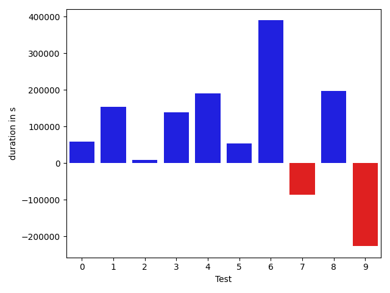

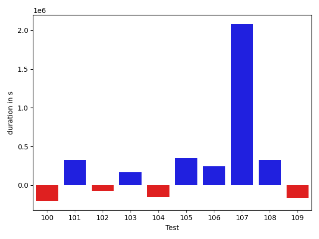

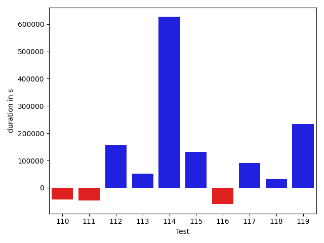

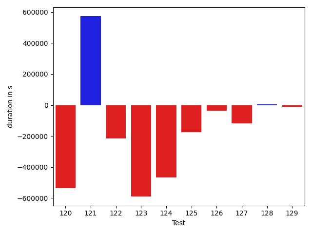

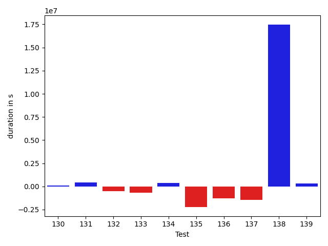

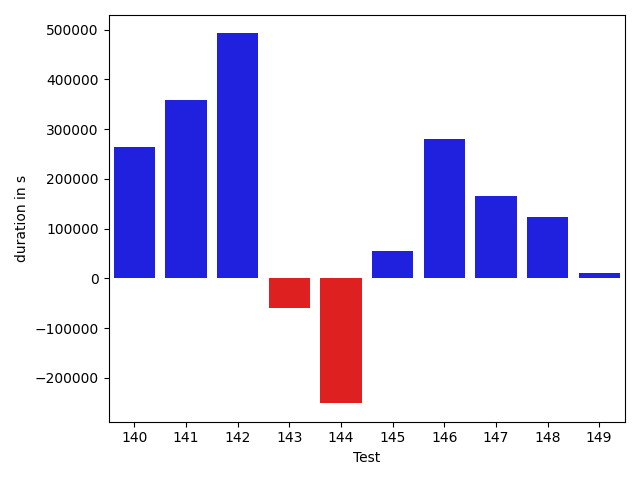

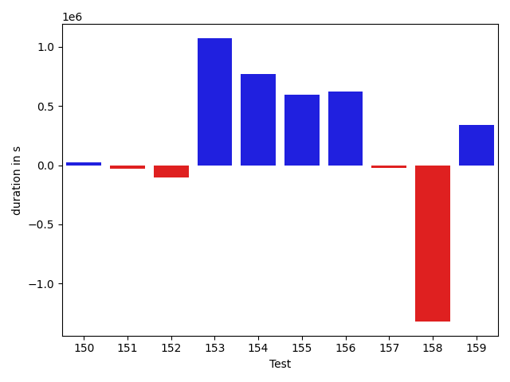

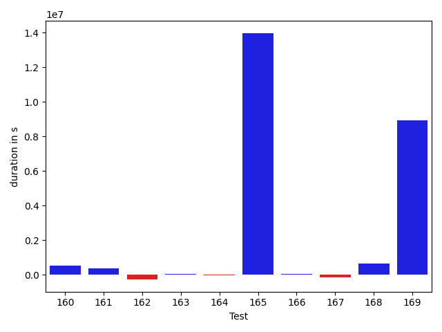

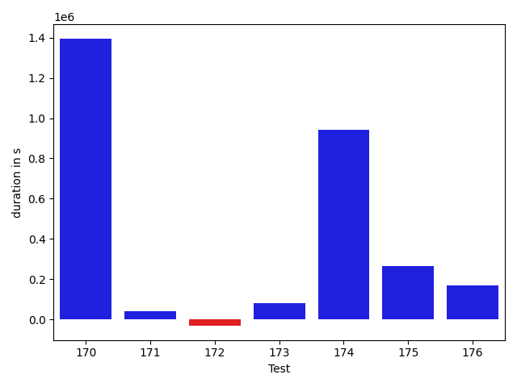

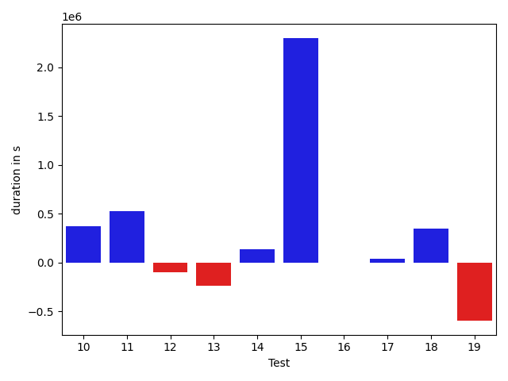

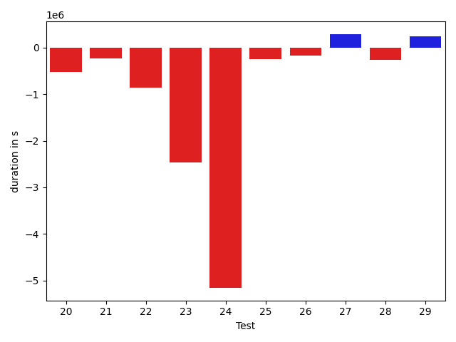

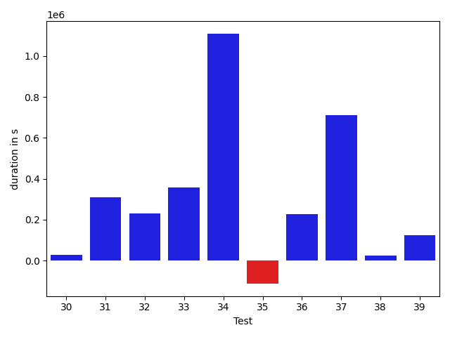

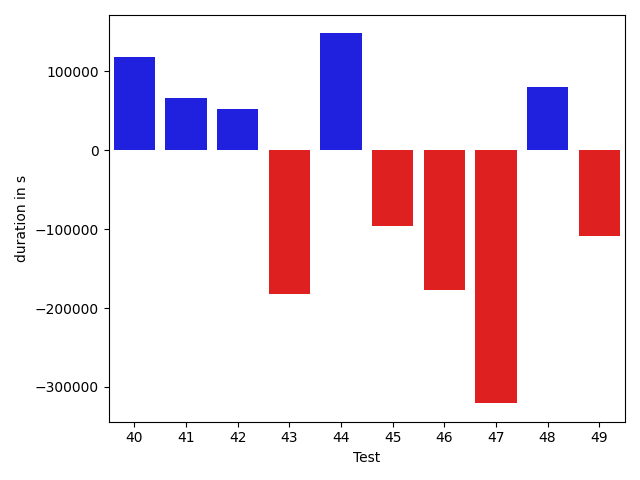

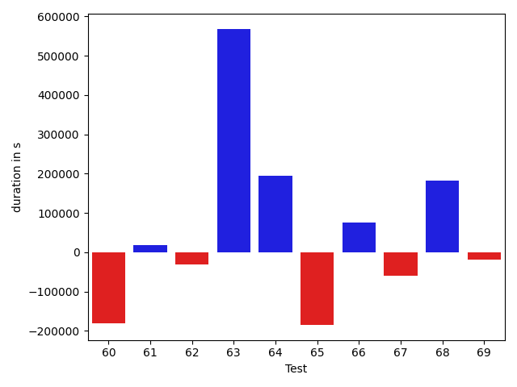

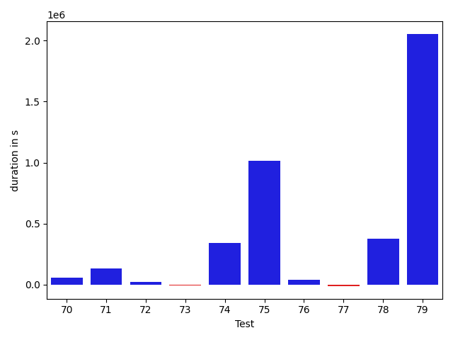

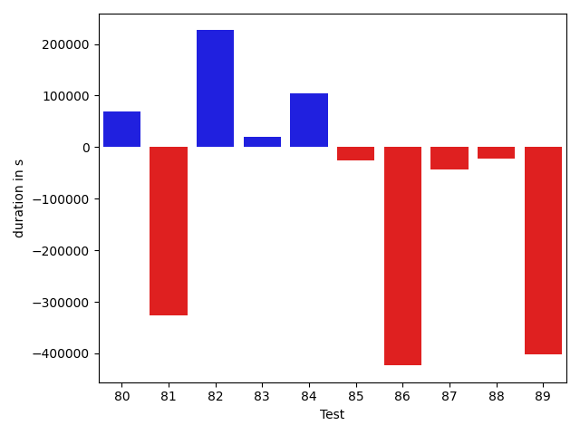

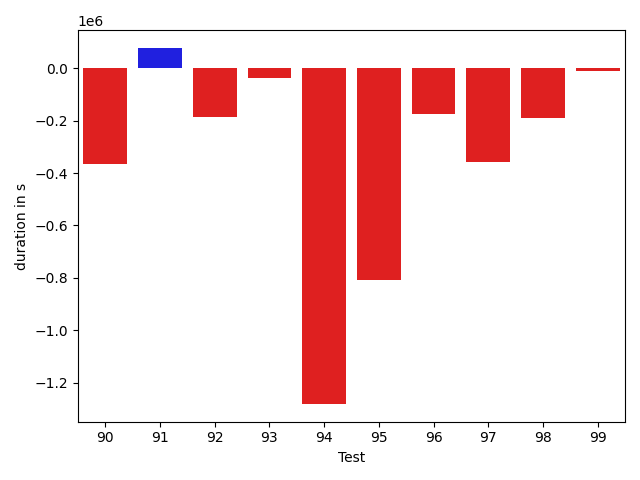

| ID | DurationV1 | DurationsV2 | DeltaDuration |
| --- | --- | --- | --- |
| 0 | 1211594.7771860538 | 1269974.7651920554 | 58379.98800600157 |
| 1 | 649818.2915598962 | 803908.0335193181 | 154089.7419594219 |
| 2 | 778698.2395302423 | 787674.2975520127 | 8976.058021770441 |
| 3 | 1067800.0714131715 | 1207365.1280841327 | 139565.0566709612 |
| 4 | 811691.336016919 | 1001967.4961598155 | 190276.16014289646 |
| 5 | 422680.046892643 | 477339.9426847026 | 54659.8957920596 |
| 6 | 1184116.3194342235 | 1573941.9171475074 | 389825.59771328396 |
| 7 | 810078.2392699677 | 723235.651960144 | -86842.5873098236 |
| 8 | 1087258.5430094171 | 1284067.0579951708 | 196808.5149857537 |
| 9 | 842895.5380980128 | 616238.2195928355 | -226657.31850517727 |
| 10 | 1679993.8700818156 | 2051845.789558861 | 371851.9194770453 |
| 11 | 798483.7406949864 | 1326924.5681451838 | 528440.8274501974 |
| 12 | 1192800.136598208 | 1094030.345594176 | -98769.7910040319 |
| 13 | 1358424.4780832285 | 1122134.1435281096 | -236290.3345551188 |
| 14 | 986768.7303318543 | 1124756.1127366896 | 137987.3824048353 |
| 15 | 1202844.5662364082 | 3499945.279847858 | 2297100.71361145 |
| 16 | 632082.567979493 | 630628.4228669542 | -1454.1451125387102 |
| 17 | 778324.5212760217 | 815845.5541671498 | 37521.032891128096 |
| 18 | 679947.1577968036 | 1026021.0424698204 | 346073.8846730167 |
| 19 | 1786859.3930077623 | 1191298.0574166467 | -595561.3355911155 |
| 20 | 1995491.9726362007 | 1476994.7599354577 | -518497.212700743 |
| 21 | 1419945.081334253 | 1186481.471245627 | -233463.61008862616 |
| 22 | 2906237.2044912493 | 2049211.3870643973 | -857025.817426852 |
| 23 | 3604688.7809677743 | 1143964.7316115168 | -2460724.0493562575 |
| 24 | 6271534.942428833 | 1112779.0637480214 | -5158755.878680811 |
| 25 | 1682247.4917985646 | 1433332.547082391 | -248914.94471617346 |
| 26 | 876443.8150238949 | 710021.3100607855 | -166422.5049631094 |
| 27 | 946719.9169289744 | 1236668.4333495307 | 289948.51642055623 |
| 28 | 1282334.1690487806 | 1021218.125312312 | -261116.04373646853 |
| 29 | 1829671.8400624853 | 2080035.5941920448 | 250363.7541295595 |
| 30 | 496551.91680696607 | 523400.5392795205 | 26848.622472554445 |
| 31 | 712996.3343079577 | 1023191.9685866996 | 310195.6342787419 |
| 32 | 783089.2100244361 | 1012273.3318105623 | 229184.12178612617 |
| 33 | 877327.8325685267 | 1233450.480731501 | 356122.6481629743 |
| 34 | 8993841.238672607 | 10103299.688216291 | 1109458.4495436847 |
| 35 | 1442888.4013091284 | 1329853.8532786174 | -113034.54803051101 |
| 36 | 804399.6834606148 | 1029762.3984454129 | 225362.7149847981 |
| 37 | 1235689.5551052964 | 1946945.9040602937 | 711256.3489549973 |
| 38 | 492108.82070111425 | 515968.71077810455 | 23859.890076990298 |
| 39 | 482632.1216586828 | 607107.1185867973 | 124474.99692811444 |
| 40 | 476828.2777653262 | 595079.7028861038 | 118251.42512077757 |
| 41 | 429299.4327417314 | 495117.43005371094 | 65817.99731197953 |
| 42 | 589648.2551638711 | 642041.2810714012 | 52393.0259075301 |
| 43 | 690691.3768996298 | 508619.2124029109 | -182072.1644967189 |
| 44 | 861541.8495079989 | 1009718.6823300133 | 148176.83282201434 |
| 45 | 807109.8013481506 | 710925.9368406965 | -96183.8645074541 |
| 46 | 1549358.7817357357 | 1372091.009442008 | -177267.7722937276 |
| 47 | 890171.8820226198 | 569507.6060274097 | -320664.27599521016 |
| 48 | 711754.15003966 | 791619.682078369 | 79865.53203870892 |
| 49 | 1012679.7780803646 | 903570.3754730279 | -109109.40260733664 |
| 50 | 650495.677532196 | 495214.1680504773 | -155281.50948171876 |
| 51 | 567328.7843322754 | 465136.6166678779 | -102192.16766439751 |
| 52 | 677567.3911548593 | 760259.6971803448 | 82692.30602548551 |
| 53 | 612732.0043494015 | 674234.2130063704 | 61502.2086569689 |
| 54 | 472970.9225152135 | 510412.3396844864 | 37441.4171692729 |
| 55 | 596373.9074172974 | 585936.0468945503 | -10437.86052274704 |
| 56 | 622398.8185297921 | 3458720.8970451374 | 2836322.078515345 |
| 57 | 678978.934742868 | 699723.1155453771 | 20744.18080250919 |
| 58 | 947627.6738793866 | 1020749.4033560778 | 73121.72947669122 |
| 59 | 1690885.1020938146 | 1543229.6903852387 | -147655.4117085759 |
| 60 | 1300971.5222196267 | 1119888.7107567978 | -181082.8114628289 |
| 61 | 786059.0866419764 | 803909.315797803 | 17850.229155826615 |
| 62 | 1052266.5990916183 | 1022034.767748011 | -30231.83134360728 |
| 63 | 2026750.5966151864 | 2595538.4320188984 | 568787.835403712 |
| 64 | 1275834.9837846817 | 1470444.378670922 | 194609.39488624036 |
| 65 | 1009121.6183234828 | 823559.1129898626 | -185562.50533362024 |
| 66 | 457351.2516383529 | 532868.5577697754 | 75517.30613142252 |
| 67 | 516729.8666342497 | 457269.89470507205 | -59459.97192917764 |
| 68 | 452155.0029296875 | 633986.0488168001 | 181831.04588711262 |
| 69 | 463749.3770697117 | 445063.65276574716 | -18685.724303964525 |
| 70 | 1793572.328328652 | 1854181.6162486183 | 60609.28791996627 |
| 71 | 467227.85996583523 | 602683.7358430624 | 135455.87587722717 |
| 72 | 812158.2799926363 | 837016.6934554346 | 24858.413462798344 |
| 73 | 510888.89746522903 | 503877.3810429573 | -7011.5164222717285 |
| 74 | 587529.4572793873 | 931696.2088837593 | 344166.75160437205 |
| 75 | 1432924.2477896702 | 2449620.945329475 | 1016696.697539805 |
| 76 | 480976.97578319185 | 523156.30065807863 | 42179.32487488678 |
| 77 | 594901.1847055777 | 583614.816517368 | -11286.368188209715 |
| 78 | 923657.0991866768 | 1302416.6133622322 | 378759.51417555544 |
| 79 | 611099.3463415315 | 2663900.329336368 | 2052800.9829948365 |
| 80 | 538480.8758753389 | 607341.2393186102 | 68860.36344327126 |
| 81 | 1190061.3585235602 | 863345.2249744586 | -326716.13354910165 |
| 82 | 621195.2531598061 | 847789.7791320756 | 226594.52597226948 |
| 83 | 489091.7203679411 | 508664.76499955915 | 19573.044631618075 |
| 84 | 531374.0998710934 | 636013.2251247503 | 104639.12525365688 |
| 85 | 525565.3413710594 | 499080.22611141205 | -26485.11525964737 |
| 86 | 1658218.7266237782 | 1234738.0299802076 | -423480.69664357067 |
| 87 | 478793.0028247833 | 436338.26740296185 | -42454.735421821475 |
| 88 | 738813.9057089076 | 716344.0778859872 | -22469.8278229204 |
| 89 | 1334353.8937677322 | 932467.2917985069 | -401886.60196922533 |
| 90 | 1835475.8546919534 | 1468914.7956046092 | -366561.0590873442 |
| 91 | 880933.7852592276 | 958930.5159902083 | 77996.73073098063 |
| 92 | 807124.6824668013 | 621245.4833984401 | -185879.1990683612 |
| 93 | 702889.7713580648 | 667796.8027706803 | -35092.96858738456 |
| 94 | 3838290.485927669 | 2556603.4871791513 | -1281686.9987485176 |
| 95 | 4434964.144633272 | 3627888.601275896 | -807075.5433573755 |
| 96 | 845577.6868856689 | 671959.0095252381 | -173618.67736043083 |
| 97 | 829866.9289046836 | 471787.8662486486 | -358079.06265603495 |
| 98 | 1129497.025443623 | 939833.9194409199 | -189663.1060027032 |
| 99 | 1202860.1116719572 | 1192843.4461219017 | -10016.665550055448 |
| 100 | 794019.6824432586 | 588400.8668150939 | -205618.81562816468 |
| 101 | 1233290.1561089526 | 1562366.802437129 | 329076.6463281764 |
| 102 | 546638.6226081848 | 468530.87031555176 | -78107.75229263306 |
| 103 | 609760.856009062 | 774423.3325808707 | 164662.4765718087 |
| 104 | 886696.4485707425 | 734271.8955264396 | -152424.55304430285 |
| 105 | 883361.3736327668 | 1236780.118310949 | 353418.7446781823 |
| 106 | 1108996.223835721 | 1353732.3961707787 | 244736.17233505775 |
| 107 | 3133421.8866787227 | 5216428.827282747 | 2083006.9406040246 |
| 108 | 1298851.5523227262 | 1623744.7321767018 | 324893.17985397554 |
| 109 | 2014584.6721782498 | 1849998.0337381517 | -164586.63844009815 |
| 110 | 984508.415343742 | 941308.598041761 | -43199.817301981035 |
| 111 | 484345.998626709 | 438502.9630126953 | -45843.03561401367 |
| 112 | 669409.0944087687 | 826736.8218372457 | 157327.72742847702 |
| 113 | 470535.51566748694 | 523094.9332187027 | 52559.41755121574 |
| 114 | 1216002.1323281268 | 1842266.1315964507 | 626263.9992683239 |
| 115 | 2488213.5962756136 | 2620017.353780555 | 131803.75750494143 |
| 116 | 569219.4218380486 | 509329.5316308955 | -59889.890207153105 |
| 117 | 399437.9370727539 | 490899.7861390114 | 91461.84906625748 |
| 118 | 668526.8376419405 | 700422.1997473727 | 31895.3621054322 |
| 119 | 663957.04998933 | 897368.6733851875 | 233411.62339585752 |
| 120 | 2071537.0829192637 | 1535738.6118836647 | -535798.471035599 |
| 121 | 857541.7497900167 | 1429904.4138303518 | 572362.6640403351 |
| 122 | 576738.9601306915 | 361902.21354675293 | -214836.7465839386 |
| 123 | 1216212.9000652959 | 626015.92555787 | -590196.9745074259 |
| 124 | 920893.4151298329 | 454603.8376651257 | -466289.5774647072 |
| 125 | 616292.3111009598 | 441775.3966522217 | -174516.9144487381 |
| 126 | 401351.1782567501 | 366302.77951812744 | -35048.398738622665 |
| 127 | 543203.1199798584 | 425288.6603240967 | -117914.45965576172 |
| 128 | 472614.6696357727 | 478021.71530270576 | 5407.04566693306 |
| 129 | 441260.2800292969 | 430688.7339477539 | -10571.546081542969 |
| 130 | 426692.1691595316 | 529579.5785808861 | 102887.40942135453 |
| 131 | 906511.0891424455 | 1326274.1325172782 | 419763.0433748327 |
| 132 | 1571664.814532439 | 1043501.6445118566 | -528163.1700205824 |
| 133 | 2071646.2906111465 | 1382126.6813882622 | -689519.6092228843 |
| 134 | 1067617.5971518892 | 1444885.4788123623 | 377267.88166047307 |
| 135 | 3288063.666017793 | 1067954.8289722372 | -2220108.837045556 |
| 136 | 2467719.685449987 | 1199594.2856917437 | -1268125.3997582435 |
| 137 | 2307966.6944295056 | 863011.9686870575 | -1444954.7257424481 |
| 138 | 1839689.9468907197 | 19309651.85809338 | 17469961.91120266 |
| 139 | 594507.1975151709 | 934458.0147738568 | 339950.81725868594 |
| 140 | 620429.0247015912 | 885206.3780522319 | 264777.3533506406 |
| 141 | 603619.692704215 | 961276.6072487306 | 357656.91454451566 |
| 142 | 558266.7961060556 | 1050532.8199854316 | 492266.023879376 |
| 143 | 1359128.8985878818 | 1300019.4219263294 | -59109.47666155244 |
| 144 | 1002829.8281151323 | 752096.5622902433 | -250733.26582488895 |
| 145 | 348071.8527832031 | 403534.46628952026 | 55462.61350631714 |
| 146 | 2932760.862875375 | 3213537.3156309007 | 280776.4527555257 |
| 147 | 712611.4800152143 | 879222.8687256589 | 166611.38871044456 |
| 148 | 768343.8229995368 | 892749.8339075285 | 124406.01090799179 |
| 149 | 548397.5096950475 | 558852.701755818 | 10455.192060770467 |
| 150 | 593825.4777718559 | 615295.7407243017 | 21470.262952445773 |
| 151 | 513991.1028118016 | 482827.855786236 | -31163.247025565594 |
| 152 | 515621.52197265625 | 411680.7884864807 | -103940.73348617554 |
| 153 | 1057096.8775545026 | 2130316.452787204 | 1073219.5752327016 |
| 154 | 1137093.7206844757 | 1906191.3318022995 | 769097.6111178237 |
| 155 | 1955417.0202096098 | 2552247.0954077244 | 596830.0751981146 |
| 156 | 1647589.249656299 | 2268373.040149222 | 620783.7904929232 |
| 157 | 1769144.955883697 | 1745853.8204929358 | -23291.135390761076 |
| 158 | 3477495.529448271 | 2157737.298161299 | -1319758.2312869718 |
| 159 | 609875.8750160905 | 949863.3937375073 | 339987.5187214168 |
| 160 | 1030283.7710920167 | 1537320.6606008955 | 507036.8895088788 |
| 161 | 1441256.2063609734 | 1810813.4311989974 | 369557.224838024 |
| 162 | 879834.7248305886 | 603399.6292897388 | -276435.0955408497 |
| 163 | 792890.7210534961 | 823634.2752330147 | 30743.5541795186 |
| 164 | 619390.9562138913 | 595152.9452671111 | -24238.01094678021 |
| 165 | 1123830.944470384 | 15087612.78716785 | 13963781.842697468 |
| 166 | 672172.9994918604 | 717955.2742305992 | 45782.27473873878 |
| 167 | 696234.9894974922 | 540347.9446082518 | -155887.0448892404 |
| 168 | 750262.141716531 | 1404281.0136453556 | 654018.8719288246 |
| 169 | 7163701.5997924805 | 16097377.989807129 | 8933676.390014648 |
| 170 | 8367041.804576479 | 9762128.855557572 | 1395087.0509810932 |
| 171 | 508858.6931974888 | 548283.7558544874 | 39425.062656998634 |
| 172 | 686670.413345015 | 655176.3994821747 | -31494.013862840366 |
| 173 | 492272.6141927504 | 570953.0746685863 | 78680.46047583583 |
| 174 | 721731.5667953491 | 1663291.2480372973 | 941559.6812419482 |
| 175 | 452393.6949939728 | 715789.1624145508 | 263395.467420578 |
| 176 | 681484.6211111061 | 851393.7647179833 | 169909.1436068772 |

## Misc.

| ID | Test Class | Test Method |
| --- | --- | --- |
| 0 | com.google.gson.functional.CustomTypeAdaptersTest | testCustomAdapterInvokedForCollectionElementDeserialization |
| 1 | com.google.gson.functional.CustomTypeAdaptersTest | testCustomTypeAdapterAppliesToSubClassesSerializedAsBaseClass |
| 2 | com.google.gson.functional.CustomTypeAdaptersTest | testCustomAdapterInvokedForMapElementDeserialization |
| 3 | com.google.gson.functional.CustomTypeAdaptersTest | testCustomAdapterInvokedForMapElementSerializationWithType |
| 4 | com.google.gson.functional.CustomTypeAdaptersTest | testCustomNestedSerializers |
| 5 | com.google.gson.functional.CustomTypeAdaptersTest | testCustomAdapterInvokedForMapElementSerialization |
| 6 | com.google.gson.functional.CustomTypeAdaptersTest | testCustomSerializers |
| 7 | com.google.gson.functional.CustomTypeAdaptersTest | testCustomNestedDeserializers |
| 8 | com.google.gson.functional.CustomTypeAdaptersTest | testCustomTypeAdapterDoesNotAppliesToSubClasses |
| 9 | com.google.gson.functional.CustomTypeAdaptersTest | testCustomAdapterInvokedForCollectionElementSerialization |
| 10 | com.google.gson.functional.CustomTypeAdaptersTest | testCustomAdapterInvokedForCollectionElementSerializationWithType |
| 11 | com.google.gson.functional.CustomTypeAdaptersTest | testCustomDeserializers |
| 12 | com.google.gson.functional.CustomTypeAdaptersTest | testEnsureCustomSerializerNotInvokedForNullValues |
| 13 | com.google.gson.functional.CustomTypeAdaptersTest | testRegisterHierarchyAdapterForDate |
| 14 | com.google.gson.functional.CustomTypeAdaptersTest | testCustomByteArrayDeserializerAndInstanceCreator |
| 15 | com.google.gson.functional.CustomTypeAdaptersTest | testEnsureCustomDeserializerNotInvokedForNullValues |
| 16 | com.google.gson.functional.CustomTypeAdaptersTest | testCustomDeserializerInvokedForPrimitives |
| 17 | com.google.gson.functional.CustomTypeAdaptersTest | testCustomSerializerInvokedForPrimitives |
| 18 | com.google.gson.functional.CustomTypeAdaptersTest | testCustomByteArraySerializer |
| 19 | com.google.gson.functional.StreamingTypeAdaptersTest | testNullSafe |
| 20 | com.google.gson.functional.StreamingTypeAdaptersTest | testSerializeWithCustomTypeAdapter |
| 21 | com.google.gson.functional.StreamingTypeAdaptersTest | testDeserializeWithCustomTypeAdapter |
| 22 | com.google.gson.functional.InstanceCreatorTest | testInstanceCreatorForParametrizedType |
| 23 | com.google.gson.functional.InstanceCreatorTest | testInstanceCreatorReturnsBaseType |
| 24 | com.google.gson.functional.InstanceCreatorTest | testInstanceCreatorReturnsSubTypeForField |
| 25 | com.google.gson.functional.InstanceCreatorTest | testInstanceCreatorForCollectionType |
| 26 | com.google.gson.functional.InstanceCreatorTest | testInstanceCreatorReturnsSubTypeForTopLevelObject |
| 27 | com.google.gson.functional.DefaultTypeAdaptersTest | testDateSerializationWithPatternNotOverridenByTypeAdapter |
| 28 | com.google.gson.functional.DefaultTypeAdaptersTest | testDateSerializationWithPattern |
| 29 | com.google.gson.functional.DefaultTypeAdaptersTest | testOverrideBigIntegerTypeAdapter |
| 30 | com.google.gson.functional.DefaultTypeAdaptersTest | testDefaultGregorianCalendarDeserialization |
| 31 | com.google.gson.functional.DefaultTypeAdaptersTest | testSqlDateSerialization |
| 32 | com.google.gson.functional.DefaultTypeAdaptersTest | testClassSerialization |
| 33 | com.google.gson.functional.DefaultTypeAdaptersTest | testTimestampSerialization |
| 34 | com.google.gson.functional.DefaultTypeAdaptersTest | testDefaultDateDeserializationUsingBuilder |
| 35 | com.google.gson.functional.DefaultTypeAdaptersTest | testOverrideBigDecimalTypeAdapter |
| 36 | com.google.gson.functional.DefaultTypeAdaptersTest | testDateDeserializationWithPattern |
| 37 | com.google.gson.functional.DefaultTypeAdaptersTest | testDateSerializationInCollection |
| 38 | com.google.gson.functional.DefaultTypeAdaptersTest | testDefaultCalendarSerialization |
| 39 | com.google.gson.functional.DefaultTypeAdaptersTest | testDefaultCalendarDeserialization |
| 40 | com.google.gson.functional.DefaultTypeAdaptersTest | testClassDeserialization |
| 41 | com.google.gson.functional.DefaultTypeAdaptersTest | testDefaultGregorianCalendarSerialization |
| 42 | com.google.gson.functional.NullObjectAndFieldTest | testCustomTypeAdapterPassesNullSerialization |
| 43 | com.google.gson.functional.NullObjectAndFieldTest | testExplicitDeserializationOfNulls |
| 44 | com.google.gson.functional.NullObjectAndFieldTest | testCustomSerializationOfNulls |
| 45 | com.google.gson.functional.NullObjectAndFieldTest | testPrintPrintingObjectWithNulls |
| 46 | com.google.gson.functional.NullObjectAndFieldTest | testExplicitSerializationOfNullArrayMembers |
| 47 | com.google.gson.functional.NullObjectAndFieldTest | testExplicitSerializationOfNullStringMembers |
| 48 | com.google.gson.functional.NullObjectAndFieldTest | testNullWrappedPrimitiveMemberSerialization |
| 49 | com.google.gson.functional.NullObjectAndFieldTest | testExplicitSerializationOfNulls |
| 50 | com.google.gson.functional.NullObjectAndFieldTest | testTopLevelNullObjectSerialization |
| 51 | com.google.gson.functional.NullObjectAndFieldTest | testNullWrappedPrimitiveMemberDeserialization |
| 52 | com.google.gson.functional.NullObjectAndFieldTest | testCustomTypeAdapterPassesNullDesrialization |
| 53 | com.google.gson.functional.NullObjectAndFieldTest | testExplicitSerializationOfNullCollectionMembers |
| 54 | com.google.gson.functional.NullObjectAndFieldTest | testPrintPrintingArraysWithNulls |
| 55 | com.google.gson.functional.NullObjectAndFieldTest | testTopLevelNullObjectDeserialization |
| 56 | com.google.gson.LongSerializationPolicyTest | testDefaultLongSerializationIntegration |
| 57 | com.google.gson.LongSerializationPolicyTest | testStringLongSerializationIntegration |
| 58 | com.google.gson.functional.MapTest | testSerializeMaps |
| 59 | com.google.gson.functional.MapTest | testInterfaceTypeMapWithSerializer |
| 60 | com.google.gson.functional.MapTest | testMapSubclassDeserialization |
| 61 | com.google.gson.functional.MapTest | testCustomSerializerForSpecificMapType |
| 62 | com.google.gson.functional.MapTest | testGeneralMapField |
| 63 | com.google.gson.functional.MapTest | testInterfaceTypeMap |
| 64 | com.google.gson.functional.MapTest | testMapSerializationWithNullValuesSerialized |
| 65 | com.google.gson.functional.MapTest | testMapSerializationWithNullValueButSerializeNulls |
| 66 | com.google.gson.functional.TypeAdapterPrecedenceTest | testSerializeNonstreamingTypeAdapterFollowedByStreamingTypeAdapter |
| 67 | com.google.gson.functional.TypeAdapterPrecedenceTest | testStreamingFollowedByNonstreamingHierarchical |
| 68 | com.google.gson.functional.TypeAdapterPrecedenceTest | testStreamingHierarchicalFollowedByNonstreaming |
| 69 | com.google.gson.functional.TypeAdapterPrecedenceTest | testNonstreamingHierarchicalFollowedByNonstreaming |
| 70 | com.google.gson.functional.TypeAdapterPrecedenceTest | testNonstreamingFollowedByNonstreaming |
| 71 | com.google.gson.functional.TypeAdapterPrecedenceTest | testStreamingHierarchicalFollowedByNonstreamingHierarchical |
| 72 | com.google.gson.functional.TypeAdapterPrecedenceTest | testStreamingFollowedByStreaming |
| 73 | com.google.gson.functional.TypeAdapterPrecedenceTest | testStreamingFollowedByNonstreaming |
| 74 | com.google.gson.functional.NamingPolicyTest | testGsonWithNonDefaultFieldNamingPolicySerialization |
| 75 | com.google.gson.functional.NamingPolicyTest | testGsonDuplicateNameUsingSerializedNameFieldNamingPolicySerialization |
| 76 | com.google.gson.functional.NamingPolicyTest | testGsonWithSerializedNameFieldNamingPolicyDeserialization |
| 77 | com.google.gson.functional.NamingPolicyTest | testGsonWithUpperCamelCaseSpacesPolicyDeserialiation |
| 78 | com.google.gson.functional.NamingPolicyTest | testGsonWithSerializedNameFieldNamingPolicySerialization |
| 79 | com.google.gson.functional.NamingPolicyTest | testGsonWithNonDefaultFieldNamingPolicyDeserialiation |
| 80 | com.google.gson.functional.NamingPolicyTest | testGsonWithLowerCaseUnderscorePolicySerialization |
| 81 | com.google.gson.functional.NamingPolicyTest | testDeprecatedNamingStrategy |
| 82 | com.google.gson.functional.NamingPolicyTest | testGsonWithLowerCaseDashPolicySerialization |
| 83 | com.google.gson.functional.NamingPolicyTest | testGsonWithLowerCaseDashPolicyDeserialiation |
| 84 | com.google.gson.functional.NamingPolicyTest | testGsonWithUpperCamelCaseSpacesPolicySerialiation |
| 85 | com.google.gson.functional.NamingPolicyTest | testGsonWithLowerCaseUnderscorePolicyDeserialiation |
| 86 | com.google.gson.functional.FieldExclusionTest | testDefaultInnerClassExclusion |
| 87 | com.google.gson.functional.FieldExclusionTest | testInnerClassExclusion |
| 88 | com.google.gson.functional.FieldExclusionTest | testDefaultNestedStaticClassIncluded |
| 89 | com.google.gson.functional.CustomDeserializerTest | testCustomDeserializerReturnsNull |
| 90 | com.google.gson.functional.CustomDeserializerTest | testJsonTypeFieldBasedDeserialization |
| 91 | com.google.gson.functional.CustomDeserializerTest | testCustomDeserializerReturnsNullForArrayElementsForArrayField |
| 92 | com.google.gson.functional.CustomDeserializerTest | testCustomDeserializerReturnsNullForTopLevelObject |
| 93 | com.google.gson.functional.CustomDeserializerTest | testCustomDeserializerReturnsNullForArrayElements |
| 94 | com.google.gson.functional.EnumTest | testEnumSubclassWithRegisteredTypeAdapter |
| 95 | com.google.gson.functional.VersioningTest | testVersionedUntilSerialization |
| 96 | com.google.gson.functional.VersioningTest | testIgnoreLaterVersionClassSerialization |
| 97 | com.google.gson.functional.VersioningTest | testVersionedUntilDeserialization |
| 98 | com.google.gson.functional.VersioningTest | testVersionedClassesSerialization |
| 99 | com.google.gson.functional.VersioningTest | testVersionedGsonMixingSinceAndUntilSerialization |
| 100 | com.google.gson.functional.VersioningTest | testVersionedGsonWithUnversionedClassesDeserialization |
| 101 | com.google.gson.functional.VersioningTest | testVersionedGsonWithUnversionedClassesSerialization |
| 102 | com.google.gson.functional.VersioningTest | testIgnoreLaterVersionClassDeserialization |
| 103 | com.google.gson.functional.VersioningTest | testVersionedClassesDeserialization |
| 104 | com.google.gson.functional.VersioningTest | testVersionedGsonMixingSinceAndUntilDeserialization |
| 105 | com.google.gson.functional.MapAsArrayTypeAdapterTest | testMultipleEnableComplexKeyRegistrationHasNoEffect |
| 106 | com.google.gson.functional.MapAsArrayTypeAdapterTest | testMapWithTypeVariableDeserialization |
| 107 | com.google.gson.functional.MapAsArrayTypeAdapterTest | testSerializeComplexMapWithTypeAdapter |
| 108 | com.google.gson.functional.MapAsArrayTypeAdapterTest | testMapWithTypeVariableSerialization |
| 109 | com.google.gson.functional.MapAsArrayTypeAdapterTest | testTwoTypesCollapseToOneDeserialize |
| 110 | com.google.gson.functional.ExclusionStrategyFunctionalTest | testExclusionStrategyWithMode |
| 111 | com.google.gson.functional.ExclusionStrategyFunctionalTest | testExcludeTopLevelClassDeserialization |
| 112 | com.google.gson.functional.ExclusionStrategyFunctionalTest | testExclusionStrategySerializationDoesNotImpactDeserialization |
| 113 | com.google.gson.functional.ExclusionStrategyFunctionalTest | testExcludeTopLevelClassDeserializationDoesNotImpactSerialization |
| 114 | com.google.gson.functional.ExclusionStrategyFunctionalTest | testExclusionStrategyDeserialization |
| 115 | com.google.gson.functional.ExclusionStrategyFunctionalTest | testExclusionStrategySerialization |
| 116 | com.google.gson.functional.ExclusionStrategyFunctionalTest | testExcludeTopLevelClassSerializationDoesNotImpactDeserialization |
| 117 | com.google.gson.functional.ExclusionStrategyFunctionalTest | testExcludeTopLevelClassSerialization |
| 118 | com.google.gson.functional.ExclusionStrategyFunctionalTest | testExclusionStrategySerializationDoesNotImpactSerialization |
| 119 | com.google.gson.functional.JsonAdapterAnnotationOnClassesTest | testRegisteredDeserializerOverridesJsonAdapter |
| 120 | com.google.gson.functional.JsonAdapterAnnotationOnClassesTest | testRegisteredSerializerOverridesJsonAdapter |
| 121 | com.google.gson.functional.JsonAdapterAnnotationOnClassesTest | testRegisteredAdapterOverridesJsonAdapter |
| 122 | com.google.gson.functional.PrimitiveTest | testNegativeInfinitySerialization |
| 123 | com.google.gson.functional.PrimitiveTest | testDoubleNaNSerialization |
| 124 | com.google.gson.functional.PrimitiveTest | testLongAsStringDeserialization |
| 125 | com.google.gson.functional.PrimitiveTest | testHtmlCharacterSerialization |
| 126 | com.google.gson.functional.PrimitiveTest | testFloatInfinitySerialization |
| 127 | com.google.gson.functional.PrimitiveTest | testFloatNaNSerialization |
| 128 | com.google.gson.functional.PrimitiveTest | testDoubleInfinitySerialization |
| 129 | com.google.gson.functional.PrimitiveTest | testNegativeInfinityFloatSerialization |
| 130 | com.google.gson.functional.PrimitiveTest | testLongAsStringSerialization |
| 131 | com.google.gson.functional.ParameterizedTypesTest | testParameterizedTypeWithReaderDeserialization |
| 132 | com.google.gson.functional.ParameterizedTypesTest | testParameterizedTypeWithCustomSerializer |
| 133 | com.google.gson.functional.ParameterizedTypesTest | testParameterizedTypeDeserialization |
| 134 | com.google.gson.functional.ParameterizedTypesTest | testParameterizedTypesWithCustomDeserializer |
| 135 | com.google.gson.functional.ObjectTest | testAnonymousLocalClassesCustomSerialization |
| 136 | com.google.gson.functional.ObjectTest | testInnerClassDeserialization |
| 137 | com.google.gson.functional.ObjectTest | testJsonObjectSerialization |
| 138 | com.google.gson.functional.FieldNamingTest | testIdentity |
| 139 | com.google.gson.functional.FieldNamingTest | testLowerCaseWithUnderscores |
| 140 | com.google.gson.functional.FieldNamingTest | testUpperCamelCase |
| 141 | com.google.gson.functional.FieldNamingTest | testUpperCamelCaseWithSpaces |
| 142 | com.google.gson.functional.FieldNamingTest | testLowerCaseWithDashes |
| 143 | com.google.gson.functional.JavaUtilConcurrentAtomicTest | testAtomicLongArrayWithStringSerializationPolicy |
| 144 | com.google.gson.functional.JavaUtilConcurrentAtomicTest | testAtomicLongWithStringSerializationPolicy |
| 145 | com.google.gson.functional.TypeHierarchyAdapterTest | testRegisterSubTypeFirstAllowed |
| 146 | com.google.gson.functional.TypeHierarchyAdapterTest | testTypeHierarchy |
| 147 | com.google.gson.functional.TypeHierarchyAdapterTest | testRegisterSuperTypeFirst |
| 148 | com.google.gson.functional.SecurityTest | testNonExecutableJsonSerialization |
| 149 | com.google.gson.functional.SecurityTest | testNonExecutableJsonDeserialization |
| 150 | com.google.gson.functional.SecurityTest | testJsonWithNonExectuableTokenWithConfiguredGsonDeserialization |
| 151 | com.google.gson.functional.SecurityTest | testJsonWithNonExectuableTokenWithRegularGsonDeserialization |
| 152 | com.google.gson.functional.SecurityTest | testJsonWithNonExectuableTokenSerialization |
| 153 | com.google.gson.functional.EscapingTest | testGsonAcceptsEscapedAndNonEscapedJsonDeserialization |
| 154 | com.google.gson.functional.CollectionTest | testUserCollectionTypeAdapter |
| 155 | com.google.gson.functional.JsonAdapterAnnotationOnFieldsTest | testRegisteredTypeAdapterTakesPrecedenceOverClassAnnotationAdapter |
| 156 | com.google.gson.functional.JsonAdapterAnnotationOnFieldsTest | testFieldAnnotationTakesPrecedenceOverRegisteredTypeAdapter |
| 157 | com.google.gson.functional.UncategorizedTest | testReturningDerivedClassesDuringDeserialization |
| 158 | com.google.gson.GsonTypeAdapterTest | testDeserializerForAbstractClass |
| 159 | com.google.gson.functional.PrintFormattingTest | testJsonObjectWithNullValuesSerialized |
| 160 | com.google.gson.MixedStreamTest | testWriteHtmlSafe |
| 161 | com.google.gson.MixedStreamTest | testWriteLenient |
| 162 | com.google.gson.functional.CustomSerializerTest | testBaseClassSerializerInvokedForBaseClassFieldsHoldingSubClassInstances |
| 163 | com.google.gson.functional.CustomSerializerTest | testSubClassSerializerInvokedForBaseClassFieldsHoldingArrayOfSubClassInstances |
| 164 | com.google.gson.functional.CustomSerializerTest | testBaseClassSerializerInvokedForBaseClassFields |
| 165 | com.google.gson.functional.CustomSerializerTest | testSubClassSerializerInvokedForBaseClassFieldsHoldingSubClassInstances |
| 166 | com.google.gson.functional.CustomSerializerTest | testSerializerReturnsNull |
| 167 | com.google.gson.GsonBuilderTest | testTransientFieldExclusion |
| 168 | com.google.gson.GsonBuilderTest | testExcludeFieldsWithModifiers |
| 169 | com.google.gson.GsonBuilderTest | testCreatingMoreThanOnce |
| 170 | com.google.gson.functional.CircularReferenceTest | testSelfReferenceCustomHandlerSerialization |
| 171 | com.google.gson.OverrideCoreTypeAdaptersTest | testOverrideStringAdapter |
| 172 | com.google.gson.OverrideCoreTypeAdaptersTest | testOverrideWrapperBooleanAdapter |
| 173 | com.google.gson.OverrideCoreTypeAdaptersTest | testOverridePrimitiveBooleanAdapter |
| 174 | com.google.gson.functional.ReadersWritersTest | testTopLevelNullObjectDeserializationWithReaderAndSerializeNulls |
| 175 | com.google.gson.functional.ReadersWritersTest | testTopLevelNullObjectSerializationWithWriterAndSerializeNulls |
| 176 | com.google.gson.functional.ArrayTest | testNullsInArrayWithSerializeNullPropertySetSerialization |

| Test | IterationV1 | IterationV2 | DeltaIteration |
| --- | --- | --- | --- |
| 0 | 76 | 80 | 4 |
| 1 | 46 | 60 | 14 |
| 2 | 61 | 57 | -4 |
| 3 | 68 | 53 | -15 |
| 4 | 72 | 59 | -13 |
| 5 | 23 | 29 | 6 |
| 6 | 63 | 64 | 1 |
| 7 | 64 | 49 | -15 |
| 8 | 92 | 87 | -5 |
| 9 | 43 | 37 | -6 |
| 10 | 96 | 97 | 1 |
| 11 | 59 | 51 | -8 |
| 12 | 89 | 80 | -9 |
| 13 | 69 | 64 | -5 |
| 14 | 81 | 80 | -1 |
| 15 | 68 | 61 | -7 |
| 16 | 38 | 47 | 9 |
| 17 | 51 | 46 | -5 |
| 18 | 46 | 56 | 10 |
| 19 | 96 | 95 | -1 |
| 20 | 90 | 88 | -2 |
| 21 | 95 | 96 | 1 |
| 22 | 99 | 99 | 0 |
| 23 | 68 | 64 | -4 |
| 24 | 64 | 61 | -3 |
| 25 | 99 | 99 | 0 |
| 26 | 50 | 48 | -2 |
| 27 | 74 | 98 | 24 |
| 28 | 72 | 92 | 20 |
| 29 | 99 | 99 | 0 |
| 30 | 25 | 25 | 0 |
| 31 | 54 | 78 | 24 |
| 32 | 58 | 75 | 17 |
| 33 | 70 | 92 | 22 |
| 34 | 99 | 99 | 0 |
| 35 | 99 | 99 | 0 |
| 36 | 60 | 83 | 23 |
| 37 | 96 | 99 | 3 |
| 38 | 34 | 35 | 1 |
| 39 | 25 | 29 | 4 |
| 40 | 28 | 36 | 8 |
| 41 | 26 | 20 | -6 |
| 42 | 38 | 43 | 5 |
| 43 | 25 | 33 | 8 |
| 44 | 55 | 54 | -1 |
| 45 | 64 | 60 | -4 |
| 46 | 86 | 86 | 0 |
| 47 | 34 | 38 | 4 |
| 48 | 43 | 47 | 4 |
| 49 | 53 | 51 | -2 |
| 50 | 19 | 30 | 11 |
| 51 | 16 | 30 | 14 |
| 52 | 44 | 47 | 3 |
| 53 | 38 | 39 | 1 |
| 54 | 25 | 24 | -1 |
| 55 | 18 | 22 | 4 |
| 56 | 27 | 37 | 10 |
| 57 | 26 | 29 | 3 |
| 58 | 80 | 72 | -8 |
| 59 | 99 | 99 | 0 |
| 60 | 89 | 87 | -2 |
| 61 | 56 | 70 | 14 |
| 62 | 82 | 84 | 2 |
| 63 | 99 | 99 | 0 |
| 64 | 91 | 94 | 3 |
| 65 | 76 | 64 | -12 |
| 66 | 24 | 22 | -2 |
| 67 | 23 | 27 | 4 |
| 68 | 14 | 24 | 10 |
| 69 | 24 | 29 | 5 |
| 70 | 87 | 87 | 0 |
| 71 | 33 | 23 | -10 |
| 72 | 33 | 34 | 1 |
| 73 | 22 | 25 | 3 |
| 74 | 47 | 52 | 5 |
| 75 | 86 | 90 | 4 |
| 76 | 35 | 32 | -3 |
| 77 | 37 | 27 | -10 |
| 78 | 64 | 69 | 5 |
| 79 | 48 | 49 | 1 |
| 80 | 28 | 32 | 4 |
| 81 | 60 | 63 | 3 |
| 82 | 28 | 28 | 0 |
| 83 | 32 | 32 | 0 |
| 84 | 31 | 30 | -1 |
| 85 | 22 | 23 | 1 |
| 86 | 82 | 86 | 4 |
| 87 | 21 | 27 | 6 |
| 88 | 35 | 32 | -3 |
| 89 | 63 | 73 | 10 |
| 90 | 99 | 99 | 0 |
| 91 | 70 | 79 | 9 |
| 92 | 45 | 42 | -3 |
| 93 | 53 | 52 | -1 |
| 94 | 99 | 99 | 0 |
| 95 | 99 | 99 | 0 |
| 96 | 46 | 57 | 11 |
| 97 | 34 | 32 | -2 |
| 98 | 73 | 71 | -2 |
| 99 | 90 | 86 | -4 |
| 100 | 40 | 29 | -11 |
| 101 | 56 | 53 | -3 |
| 102 | 19 | 21 | 2 |
| 103 | 39 | 41 | 2 |
| 104 | 46 | 45 | -1 |
| 105 | 78 | 70 | -8 |
| 106 | 74 | 80 | 6 |
| 107 | 99 | 99 | 0 |
| 108 | 96 | 90 | -6 |
| 109 | 83 | 70 | -13 |
| 110 | 45 | 48 | 3 |
| 111 | 15 | 14 | -1 |
| 112 | 59 | 48 | -11 |
| 113 | 28 | 29 | 1 |
| 114 | 56 | 50 | -6 |
| 115 | 99 | 99 | 0 |
| 116 | 38 | 37 | -1 |
| 117 | 16 | 22 | 6 |
| 118 | 39 | 35 | -4 |
| 119 | 56 | 55 | -1 |
| 120 | 89 | 92 | 3 |
| 121 | 71 | 71 | 0 |
| 122 | 19 | 17 | -2 |
| 123 | 46 | 37 | -9 |
| 124 | 28 | 29 | 1 |
| 125 | 21 | 17 | -4 |
| 126 | 23 | 20 | -3 |
| 127 | 19 | 17 | -2 |
| 128 | 20 | 23 | 3 |
| 129 | 13 | 15 | 2 |
| 130 | 25 | 26 | 1 |
| 131 | 78 | 78 | 0 |
| 132 | 94 | 89 | -5 |
| 133 | 92 | 94 | 2 |
| 134 | 83 | 82 | -1 |
| 135 | 75 | 75 | 0 |
| 136 | 86 | 86 | 0 |
| 137 | 31 | 20 | -11 |
| 138 | 89 | 95 | 6 |
| 139 | 38 | 35 | -3 |
| 140 | 36 | 40 | 4 |
| 141 | 51 | 46 | -5 |
| 142 | 33 | 48 | 15 |
| 143 | 99 | 98 | -1 |
| 144 | 61 | 62 | 1 |
| 145 | 14 | 20 | 6 |
| 146 | 99 | 99 | 0 |
| 147 | 49 | 54 | 5 |
| 148 | 40 | 42 | 2 |
| 149 | 32 | 37 | 5 |
| 150 | 28 | 36 | 8 |
| 151 | 34 | 29 | -5 |
| 152 | 12 | 22 | 10 |
| 153 | 73 | 77 | 4 |
| 154 | 72 | 77 | 5 |
| 155 | 97 | 93 | -4 |
| 156 | 99 | 99 | 0 |
| 157 | 99 | 99 | 0 |
| 158 | 99 | 99 | 0 |
| 159 | 30 | 35 | 5 |
| 160 | 67 | 75 | 8 |
| 161 | 74 | 78 | 4 |
| 162 | 38 | 31 | -7 |
| 163 | 54 | 65 | 11 |
| 164 | 36 | 28 | -8 |
| 165 | 58 | 76 | 18 |
| 166 | 42 | 46 | 4 |
| 167 | 55 | 48 | -7 |
| 168 | 50 | 40 | -10 |
| 169 | 16 | 15 | -1 |
| 170 | 99 | 99 | 0 |
| 171 | 24 | 25 | 1 |
| 172 | 34 | 35 | 1 |
| 173 | 37 | 25 | -12 |
| 174 | 21 | 28 | 7 |
| 175 | 20 | 18 | -2 |
| 176 | 29 | 35 | 6 |

| Time Label | Time (s) |
| --- | --- |
| Selection | 34.9803740978241 |
| Injection | 19.685678482055664 |
| Total | 1517.0547630786896 |

## Aggregation per test class

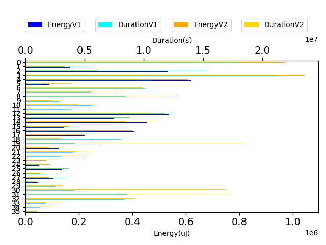

| Index | EnergyV1 | EnergyV2 | DeltaEnergy |
| --- | --- | --- | --- |
| 0 | 836380.2910264177 | 982427.0002469388 | 146046.70922052104 |
| 1 | 166846.1628909766 | 147476.6704001081 | -19369.49249086849 |
| 2 | 530634.6000463441 | 313582.0000359327 | -217052.6000104114 |
| 3 | 1094884.3637087876 | 1053247.770740159 | -41636.59296862851 |
| 4 | 615884.2211785791 | 614891.6371432834 | -992.5840352957603 |
| 5 | 88157.55723600835 | 174140.71004527548 | 85983.15280926714 |
| 6 | 408704.19240544527 | 442702.52518816956 | 33998.33278272429 |
| 7 | 340552.81128592533 | 358765.1074915401 | 18212.29620561475 |
| 8 | 573612.5564290257 | 585639.8872674501 | 12027.330838424386 |
| 9 | 155380.1258250058 | 138917.46657580388 | -16462.65924920191 |
| 10 | 265267.3760609284 | 239055.81800464398 | -26211.55805628441 |
| 11 | 130698.55220685687 | 96869.7232443362 | -33828.82896252067 |
| 12 | 534711.4126712902 | 525697.8348394785 | -9013.577831811737 |
| 13 | 330728.54641196714 | 393089.66284884035 | 62361.11643687321 |
| 14 | 453268.37135192036 | 495084.3679895692 | 41815.996637648845 |
| 15 | 142453.04176694492 | 162121.24623166982 | 19668.2044647249 |
| 16 | 407545.46661848365 | 401260.68148402 | -6284.785134463629 |
| 17 | 220141.7097380368 | 203027.51146333825 | -17114.198274698545 |
| 18 | 247522.555232019 | 134723.83282290446 | -112798.72240911453 |
| 19 | 277186.0848310023 | 828960.9745793339 | 551774.8897483316 |
| 20 | 125034.0668477136 | 113278.38822247164 | -11755.67862524197 |
| 21 | 197179.6437350413 | 252228.9866678386 | 55049.3429327973 |
| 22 | 218646.15613547096 | 218368.36104624489 | -277.79508922607056 |
| 23 | 50385.01606070169 | 78297.24936822621 | 27912.233307524526 |
| 24 | 50533.85291286149 | 92241.67140036922 | 41707.81848750773 |
| 25 | 135994.8208563223 | 163398.58568144636 | 27403.76482512406 |
| 26 | 68087.28141922214 | 55223.30978904493 | -12863.971630177213 |
| 27 | 105052.85308197372 | 85919.88430408426 | -19132.96877788946 |
| 28 | 45700.22821213864 | 45209.603283526696 | -490.62492861194187 |
| 29 | 105029.19587121598 | 130136.5182397915 | 25107.322368575522 |
| 30 | 238942.279758043 | 679011.519799397 | 440069.240041354 |
| 31 | 354774.44255807024 | 572604.4036833787 | 217829.96112530847 |
| 32 | 324715.85084103304 | 385185.46460769157 | 60469.61376665853 |
| 33 | 128474.19695169228 | 127875.44825985405 | -598.7486918382347 |
| 34 | 88848.37906265259 | 113237.63586268947 | 24389.256800036877 |
| 35 | 44013.318301621825 | 42315.77782351989 | -1697.5404781019315 |

| Index | DurationV1 | DurationsV2 | DeltaDuration |
| --- | --- | --- | --- |
| 0 | 18176301.17148937 | 22437843.768802498 | 4261542.597313128 |
| 1 | 5202296.446978216 | 3854774.2885977314 | -1347522.1583804847 |
| 2 | 15341152.234710317 | 6449309.039567112 | -8891843.195143204 |
| 3 | 21286378.751162626 | 24753373.279567506 | 3466994.5284048803 |
| 4 | 10690424.562099274 | 9999286.867149943 | -691137.6949493308 |
| 5 | 1301377.75327266 | 4158444.0125905145 | 2857066.2593178544 |
| 6 | 10089517.182649773 | 10399353.811723612 | 309836.62907383963 |
| 7 | 5473832.864024354 | 5866947.580647468 | 393114.7166231135 |
| 8 | 8526856.960254833 | 12416639.673748147 | 3889782.7134933136 |
| 9 | 2875825.635157469 | 2387420.375269157 | -488405.2598883123 |
| 10 | 5560777.98754378 | 4649354.889562445 | -911423.0979813356 |
| 11 | 3838290.485927669 | 2556603.4871791513 | -1281686.9987485176 |
| 12 | 12513171.663279407 | 11032306.610287687 | -1480865.05299172 |
| 13 | 8439215.708648186 | 11280684.107679328 | 2841468.399031142 |
| 14 | 7950198.94920319 | 8892578.31900469 | 942379.3698014999 |
| 15 | 3593035.8826986104 | 3863011.6990992045 | 269975.8164005941 |
| 16 | 5615259.003487989 | 4114178.84109554 | -1501080.162392449 |
| 17 | 5617439.791437921 | 5196787.937229759 | -420651.85420816205 |
| 18 | 8063750.045897286 | 3130561.0833510384 | -4933188.962546248 |
| 19 | 4216512.657917752 | 23141125.67815363 | 18924613.020235877 |
| 20 | 2361958.726703014 | 2052115.9842165727 | -309842.7424864415 |
| 21 | 3993444.1956737926 | 4496294.650646079 | 502850.4549722867 |
| 22 | 2940179.435250898 | 2961406.920660365 | 21227.485409467015 |
| 23 | 1057096.8775545026 | 2130316.452787204 | 1073219.5752327016 |
| 24 | 1137093.7206844757 | 1906191.3318022995 | 769097.6111178237 |
| 25 | 3603006.2698659087 | 4820620.1355569465 | 1217613.8656910378 |
| 26 | 1769144.955883697 | 1745853.8204929358 | -23291.135390761076 |
| 27 | 3477495.529448271 | 2157737.298161299 | -1319758.2312869718 |
| 28 | 609875.8750160905 | 949863.3937375073 | 339987.5187214168 |
| 29 | 2471539.97745299 | 3348134.091799893 | 876594.1143469028 |
| 30 | 4088120.34606022 | 17827754.911188316 | 13739634.565128095 |
| 31 | 8610198.731006503 | 18042006.948060736 | 9431808.217054233 |
| 32 | 8367041.804576479 | 9762128.855557572 | 1395087.0509810932 |
| 33 | 1687801.7207352542 | 1774413.2300052484 | 86611.50926999422 |
| 34 | 1174125.261789322 | 2379080.410451848 | 1204955.1486625262 |
| 35 | 681484.6211111061 | 851393.7647179833 | 169909.1436068772 |
| Index | TestClassName | #Tests |
| --- | --- | --- |
| 0 | com.google.gson.functional.CustomTypeAdaptersTest | 19 |
| 1 | com.google.gson.functional.StreamingTypeAdaptersTest | 3 |
| 2 | com.google.gson.functional.InstanceCreatorTest | 5 |
| 3 | com.google.gson.functional.DefaultTypeAdaptersTest | 15 |
| 4 | com.google.gson.functional.NullObjectAndFieldTest | 14 |
| 5 | com.google.gson.LongSerializationPolicyTest | 2 |
| 6 | com.google.gson.functional.MapTest | 8 |
| 7 | com.google.gson.functional.TypeAdapterPrecedenceTest | 8 |
| 8 | com.google.gson.functional.NamingPolicyTest | 12 |
| 9 | com.google.gson.functional.FieldExclusionTest | 3 |
| 10 | com.google.gson.functional.CustomDeserializerTest | 5 |
| 11 | com.google.gson.functional.EnumTest | 1 |
| 12 | com.google.gson.functional.VersioningTest | 10 |
| 13 | com.google.gson.functional.MapAsArrayTypeAdapterTest | 5 |
| 14 | com.google.gson.functional.ExclusionStrategyFunctionalTest | 9 |
| 15 | com.google.gson.functional.JsonAdapterAnnotationOnClassesTest | 3 |
| 16 | com.google.gson.functional.PrimitiveTest | 9 |
| 17 | com.google.gson.functional.ParameterizedTypesTest | 4 |
| 18 | com.google.gson.functional.ObjectTest | 3 |
| 19 | com.google.gson.functional.FieldNamingTest | 5 |
| 20 | com.google.gson.functional.JavaUtilConcurrentAtomicTest | 2 |
| 21 | com.google.gson.functional.TypeHierarchyAdapterTest | 3 |
| 22 | com.google.gson.functional.SecurityTest | 5 |
| 23 | com.google.gson.functional.EscapingTest | 1 |
| 24 | com.google.gson.functional.CollectionTest | 1 |
| 25 | com.google.gson.functional.JsonAdapterAnnotationOnFieldsTest | 2 |
| 26 | com.google.gson.functional.UncategorizedTest | 1 |
| 27 | com.google.gson.GsonTypeAdapterTest | 1 |
| 28 | com.google.gson.functional.PrintFormattingTest | 1 |
| 29 | com.google.gson.MixedStreamTest | 2 |
| 30 | com.google.gson.functional.CustomSerializerTest | 5 |
| 31 | com.google.gson.GsonBuilderTest | 3 |
| 32 | com.google.gson.functional.CircularReferenceTest | 1 |
| 33 | com.google.gson.OverrideCoreTypeAdaptersTest | 3 |
| 34 | com.google.gson.functional.ReadersWritersTest | 2 |
| 35 | com.google.gson.functional.ArrayTest | 1 |
