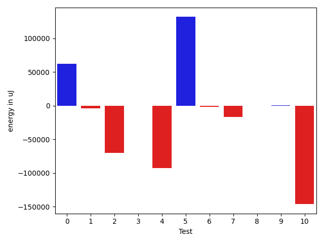
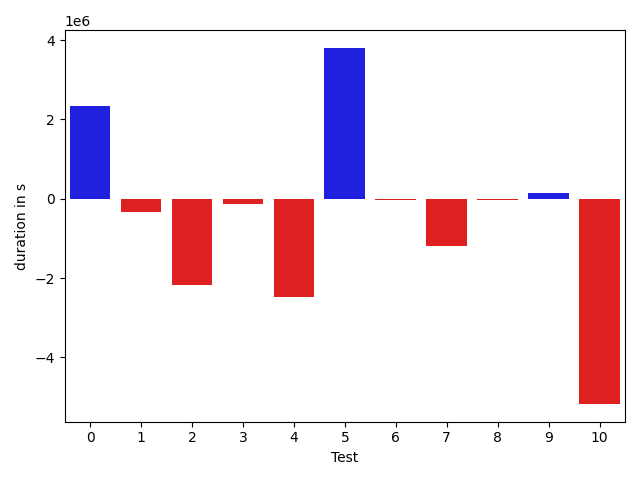
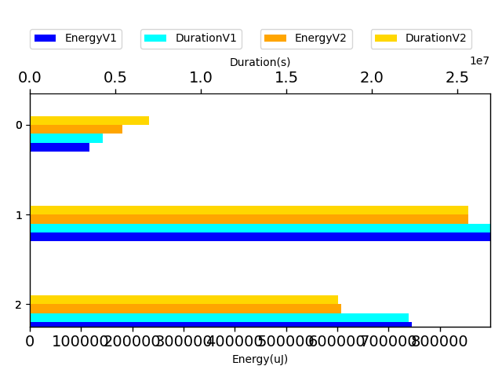

# gson 584809

https://github.com/google/gson.git/commit/584809

## Delta Energy per test method

| ID | EnergyV1 | EnergyV2 | DeltaEnergy |
| --- | --- | --- | --- |
| 0 | 116934.65564573245 | 178982.02475165884 | 62047.369105926395 |
| 1 | 50251.52515953851 | 46307.289286454696 | -3944.235873083817 |
| 2 | 512657.9051550176 | 442434.6380516713 | -70223.2671033463 |
| 3 | 36701.677546948195 | 36734.791600670666 | 33.114053722471 |
| 4 | 130023.26774082905 | 37611.53248025661 | -92411.73526057243 |
| 5 | 43731.2349280966 | 175455.46918883326 | 131724.23426073667 |
| 6 | 37009.94198739156 | 35323.374143220164 | -1686.5678441713972 |
| 7 | 53143.48074098304 | 36305.64148145914 | -16837.8392595239 |
| 8 | 34977.21917733125 | 34583.68237553479 | -393.5368017964647 |
| 9 | 34735.26866222077 | 35507.613429736855 | 772.344767516086 |
| 10 | 711091.2382242073 | 564791.9926044329 | -146299.24561977445 |

## Delta Duration per test method

| ID | DurationV1 | DurationsV2 | DeltaDuration |
| --- | --- | --- | --- |
| 0 | 4278322.332533903 | 6614893.417939976 | 2336571.0854060724 |
| 1 | 1694405.0821734353 | 1353895.549724636 | -340509.53244879935 |
| 2 | 15631768.177062158 | 13459833.0672816 | -2171935.1097805575 |
| 3 | 825695.0403725244 | 691427.511774458 | -134267.52859806642 |
| 4 | 3852529.0169061776 | 1379600.329241467 | -2472928.687664711 |
| 5 | 1564060.2756897479 | 5366943.884481237 | 3802883.608791489 |
| 6 | 759069.2540401695 | 723694.409900363 | -35374.84413980658 |
| 7 | 1872518.293751385 | 685053.202867806 | -1187465.090883579 |
| 8 | 717234.0635501362 | 687524.6163108894 | -29709.4472392468 |
| 9 | 1108128.7975920306 | 1262125.7991134808 | 153997.00152145023 |
| 10 | 21027569.733864784 | 15856912.664929833 | -5170657.068934951 |

## Misc.

| ID | Test Class | Test Method |
| --- | --- | --- |
| 0 | com.google.gson.functional.StreamingTypeAdaptersTest | testNullSafe |
| 1 | com.google.gson.functional.TypeAdapterPrecedenceTest | testSerializeNonstreamingTypeAdapterFollowedByStreamingTypeAdapter |
| 2 | com.google.gson.functional.TypeAdapterPrecedenceTest | testStreamingFollowedByStreaming |
| 3 | com.google.gson.functional.TypeAdapterPrecedenceTest | testStreamingFollowedByNonstreaming |
| 4 | com.google.gson.functional.TypeAdapterPrecedenceTest | testStreamingHierarchicalFollowedByNonstreaming |
| 5 | com.google.gson.functional.TypeAdapterPrecedenceTest | testNonstreamingHierarchicalFollowedByNonstreaming |
| 6 | com.google.gson.functional.TypeAdapterPrecedenceTest | testStreamingHierarchicalFollowedByNonstreamingHierarchical |
| 7 | com.google.gson.functional.TypeAdapterPrecedenceTest | testStreamingFollowedByNonstreamingHierarchical |
| 8 | com.google.gson.functional.TypeAdapterPrecedenceTest | testNonstreamingFollowedByNonstreaming |
| 9 | com.google.gson.functional.JsonAdapterAnnotationOnClassesTest | testRegisteredDeserializerOverridesJsonAdapter |
| 10 | com.google.gson.functional.JsonAdapterAnnotationOnClassesTest | testRegisteredSerializerOverridesJsonAdapter |

| Test | IterationV1 | IterationV2 | DeltaIteration |
| --- | --- | --- | --- |
| 0 | 99 | 99 | 0 |
| 1 | 69 | 74 | 5 |
| 2 | 62 | 53 | -9 |
| 3 | 29 | 29 | 0 |
| 4 | 41 | 37 | -4 |
| 5 | 68 | 60 | -8 |
| 6 | 31 | 36 | 5 |
| 7 | 31 | 24 | -7 |
| 8 | 43 | 33 | -10 |
| 9 | 72 | 72 | 0 |
| 10 | 98 | 99 | 1 |

| Time Label | Time (s) |
| --- | --- |
| Selection | 35.03642678260803 |
| Injection | 14.197906494140625 |
| Total | 1369.9504289627075 |

## Aggregation per test class

| Index | EnergyV1 | EnergyV2 | DeltaEnergy |
| --- | --- | --- | --- |
| 0 | 116934.65564573245 | 178982.02475165884 | 62047.369105926395 |
| 1 | 898496.2524361359 | 844756.4186081006 | -53739.83382803528 |
| 2 | 745826.5068864281 | 600299.6060341697 | -145526.90085225843 |

| Index | DurationV1 | DurationsV2 | DeltaDuration |
| --- | --- | --- | --- |
| 0 | 4278322.332533903 | 6614893.417939976 | 2336571.0854060724 |
| 1 | 26917279.203545738 | 24347972.57158246 | -2569306.631963279 |
| 2 | 22135698.531456813 | 17119038.464043316 | -5016660.067413498 |
| Index | TestClassName | #Tests |
| --- | --- | --- |
| 0 | com.google.gson.functional.StreamingTypeAdaptersTest | 1 |
| 1 | com.google.gson.functional.TypeAdapterPrecedenceTest | 8 |
| 2 | com.google.gson.functional.JsonAdapterAnnotationOnClassesTest | 2 |
