# gson 9bf25c

https://github.com/google/gson.git/commit/9bf25c

| Index | EnergyV1 | EnergyV2 | DeltaEnergy |
| --- | --- | --- | --- |
| 0 | 356512.50320696924 | 396568.58325000526 | 40056.080043036025 |
| 1 | 138805.32768223603 | 151120.58209253778 | 12315.254410301743 |
| 2 | 205776.85634395515 | 293982.8137931247 | 88205.95744916954 |
| 3 | 157569.55575101357 | 315481.9693712741 | 157912.41362026054 |
| 4 | 179365.98106123979 | 166100.44884389304 | -13265.532217346743 |
| 5 | 359452.3141105953 | 203230.14293700116 | -156222.17117359416 |
| 6 | 350378.31020633975 | 264994.886209241 | -85383.42399709875 |
| 7 | 359690.5951594827 | 270800.45401692716 | -88890.14114255551 |
| 8 | 333041.5164332544 | 346309.51338053157 | 13267.996947277163 |
| 9 | 123574.59994428004 | 149392.14424490376 | 25817.54430062372 |
| 10 | 403955.1565105121 | 358555.72404671257 | -45399.432463799545 |
| 11 | 67229.83339799296 | 274786.6095447819 | 207556.77614678896 |
| 12 | 498200.574426207 | 458693.80743035616 | -39506.766995850834 |
| 13 | 147479.33674964367 | 163440.32672552 | 15960.98997587632 |
| 14 | 2176948.523178539 | 2068290.1941605394 | -108658.32901799935 |
| 15 | 290209.88736204116 | 299353.23500723153 | 9143.34764519037 |
| 16 | 155812.79438635422 | 115661.6993854978 | -40151.09500085641 |
| 17 | 47756.78779062518 | 52026.73885729683 | 4269.951066671645 |
| 18 | 220781.6104403395 | 177296.97876996058 | -43484.631670378905 |
| 19 | 223263.89840756112 | 175644.5907786377 | -47619.307628923416 |
| 20 | 120575.09855809661 | 79603.34895819335 | -40971.749599903254 |
| 21 | 306187.4516903429 | 67576.72532558198 | -238610.72636476095 |
| 22 | 124725.09630651961 | 136661.1958089684 | 11936.099502448778 |
| 23 | 169808.8758903358 | 167958.46896485577 | -1850.406925480027 |
| 24 | 86049.98246252564 | 124221.10825746664 | 38171.12579494099 |
| 25 | 277299.7485200865 | 128290.45784248205 | -149009.29067760447 |
| 26 | 110947.30947865729 | 151545.97365739674 | 40598.66417873945 |
| 27 | 95736.75019310319 | 111447.43901807012 | 15710.688824966928 |
| 28 | 88966.07607283666 | 106660.97348821795 | 17694.89741538129 |
| 29 | 153309.80055093765 | 144868.13246542215 | -8441.6680855155 |
| 30 | 38321.152698241174 | 41323.41347980499 | 3002.2607815638185 |

| Index | DurationV1 | DurationsV2 | DeltaDuration |
| --- | --- | --- | --- |
| 0 | 4659050.857781792 | 7504993.324482522 | 2845942.46670073 |
| 1 | 4128555.9058893807 | 4218161.127228446 | 89605.22133906558 |
| 2 | 5216843.489758235 | 6248109.611930576 | 1031266.1221723408 |
| 3 | 2034698.2752656126 | 6805397.429074075 | 4770699.153808462 |
| 4 | 5509189.534029699 | 4349963.611904729 | -1159225.9221249698 |
| 5 | 10959097.410048008 | 5845994.084417259 | -5113103.325630749 |
| 6 | 10406224.680325206 | 6776505.249174006 | -3629719.4311512 |
| 7 | 10451674.5822544 | 7758569.469985236 | -2693105.112269164 |
| 8 | 11088519.680398531 | 8076553.965669772 | -3011965.7147287596 |
| 9 | 3079264.6336442796 | 3501101.169278743 | 421836.53563446365 |
| 10 | 10602339.580747802 | 9342741.420369072 | -1259598.16037873 |
| 11 | 1612545.0612292134 | 9285254.381144533 | 7672709.31991532 |
| 12 | 12059975.541362997 | 10553395.223681033 | -1506580.3176819645 |
| 13 | 4119494.7745753443 | 4243686.809726172 | 124192.03515082784 |
| 14 | 52873331.92302263 | 57183172.08908164 | 4309840.16605901 |
| 15 | 6636675.096386364 | 5369002.045882744 | -1267673.05050362 |
| 16 | 3875264.9379783175 | 3263385.051628124 | -611879.8863501935 |
| 17 | 677488.2462928896 | 988219.471067759 | 310731.2247748694 |
| 18 | 4492440.373514353 | 4239139.53152711 | -253300.84198724292 |
| 19 | 6554387.425626185 | 4192450.047002211 | -2361937.3786239736 |
| 20 | 3680900.2409456433 | 2251241.9413214466 | -1429658.2996241967 |
| 21 | 9532285.891697513 | 2181071.8087579934 | -7351214.08293952 |
| 22 | 2183864.416103328 | 2649740.961165761 | 465876.545062433 |
| 23 | 5347514.2604079805 | 4174922.2045702436 | -1172592.055837737 |
| 24 | 2146271.768891779 | 2986424.090297523 | 840152.3214057442 |
| 25 | 8395015.177357519 | 3123945.4428439047 | -5271069.734513614 |
| 26 | 2387855.46691344 | 3278335.0926644797 | 890479.62575104 |
| 27 | 2234711.7824482718 | 3452796.4526565797 | 1218084.670208308 |
| 28 | 2292478.4663033243 | 2463844.753988538 | 171366.2876852136 |
| 29 | 4155365.377327442 | 3613985.02016443 | -541380.357163012 |
| 30 | 651928.3070741296 | 472433.4654560089 | -179494.84161812067 |

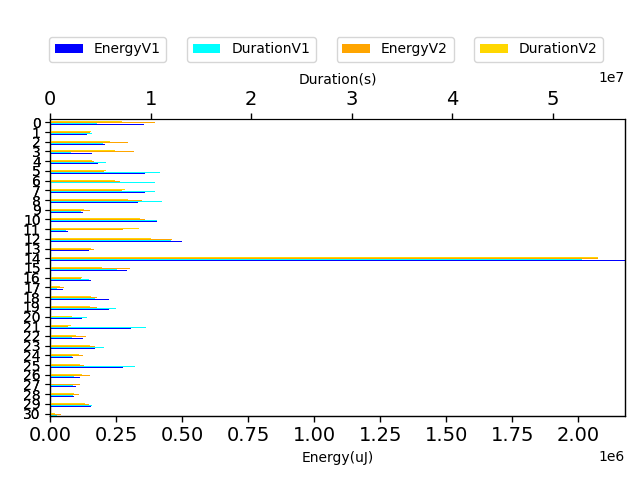

| Index | TestClassName | #Tests |
| --- | --- | --- |
| 0 | com.google.gson.functional.TypeAdapterPrecedenceTest | 8 |
| 1 | com.google.gson.functional.StreamingTypeAdaptersTest | 1 |
| 2 | com.google.gson.functional.JsonAdapterAnnotationOnClassesTest | 4 |
| 3 | com.google.gson.OverrideCoreTypeAdaptersTest | 3 |
| 4 | com.google.gson.functional.JsonAdapterSerializerDeserializerTest | 2 |
| 5 | com.google.gson.functional.ThrowableFunctionalTest | 4 |
| 6 | com.google.gson.functional.MapTest | 4 |
| 7 | com.google.gson.functional.CollectionTest | 5 |
| 8 | com.google.gson.functional.EnumTest | 6 |
| 9 | com.google.gson.JsonParserTest | 2 |
| 10 | com.google.gson.functional.ParameterizedTypesTest | 5 |
| 11 | com.google.gson.functional.ObjectTest | 1 |
| 12 | com.google.gson.functional.JsonAdapterAnnotationOnFieldsTest | 9 |
| 13 | com.google.gson.functional.TypeVariableTest | 3 |
| 14 | com.google.gson.functional.DefaultTypeAdaptersTest | 9 |
| 15 | com.google.gson.functional.JavaUtilConcurrentAtomicTest | 7 |
| 16 | com.google.gson.functional.RuntimeTypeAdapterFactoryFunctionalTest | 1 |
| 17 | com.google.gson.functional.UncategorizedTest | 1 |
| 18 | com.google.gson.functional.EscapingTest | 4 |
| 19 | com.google.gson.functional.MapAsArrayTypeAdapterTest | 2 |
| 20 | com.google.gson.functional.NamingPolicyTest | 1 |
| 21 | com.google.gson.functional.CustomTypeAdaptersTest | 1 |
| 22 | com.google.gson.GsonTypeAdapterTest | 3 |
| 23 | com.google.gson.functional.TypeHierarchyAdapterTest | 2 |
| 24 | com.google.gson.DefaultInetAddressTypeAdapterTest | 1 |
| 25 | com.google.gson.functional.JavaUtilTest | 2 |
| 26 | com.google.gson.functional.DelegateTypeAdapterTest | 2 |
| 27 | com.google.gson.functional.CustomDeserializerTest | 2 |
| 28 | com.google.gson.functional.ReadersWritersTest | 2 |
| 29 | com.google.gson.functional.StringTest | 2 |
| 30 | com.google.gson.functional.PrimitiveTest | 1 |

| Time Label | Time (s) |
| --- | --- |
| Selection | 36.11319828033447 |
| Injection | 19.437798738479614 |
| Total | 1613.62921667099 |
## com.google.gson.functional.TypeAdapterPrecedenceTest

| Test | IterationV1 | IterationV2 | DeltaIteration |
| --- | --- | --- | --- |
| com.google.gson.functional.TypeAdapterPrecedenceTest-testStreamingFollowedByNonstreaming | 31 | 28 | -3 |
| com.google.gson.functional.TypeAdapterPrecedenceTest-testStreamingHierarchicalFollowedByNonstreaming | 14 | 24 | 10 |
| com.google.gson.functional.TypeAdapterPrecedenceTest-testNonstreamingHierarchicalFollowedByNonstreaming | 27 | 36 | 9 |
| com.google.gson.functional.TypeAdapterPrecedenceTest-testStreamingHierarchicalFollowedByNonstreamingHierarchical | 34 | 26 | -8 |
| com.google.gson.functional.TypeAdapterPrecedenceTest-testNonstreamingFollowedByNonstreaming | 34 | 28 | -6 |
| com.google.gson.functional.TypeAdapterPrecedenceTest-testStreamingFollowedByNonstreamingHierarchical | 85 | 86 | 1 |
| com.google.gson.functional.TypeAdapterPrecedenceTest-testStreamingFollowedByStreaming | 22 | 27 | 5 |
| com.google.gson.functional.TypeAdapterPrecedenceTest-testSerializeNonstreamingTypeAdapterFollowedByStreamingTypeAdapter | 19 | 26 | 7 |

| Test | EnergyV1 | EnergyV2 | DeltaEnergy |
| --- | --- | --- | --- |
| com.google.gson.functional.TypeAdapterPrecedenceTest-testStreamingFollowedByNonstreaming | 45876.29870957928 | 37955.14981608093 | -7921.14889349835 |
| com.google.gson.functional.TypeAdapterPrecedenceTest-testStreamingHierarchicalFollowedByNonstreaming | 43403.122131347656 | 40698.72368299961 | -2704.3984483480453 |
| com.google.gson.functional.TypeAdapterPrecedenceTest-testNonstreamingHierarchicalFollowedByNonstreaming | 42752.396195329726 | 40686.79498875854 | -2065.601206571184 |
| com.google.gson.functional.TypeAdapterPrecedenceTest-testStreamingHierarchicalFollowedByNonstreamingHierarchical | 44357.13000908593 | 42777.833819299936 | -1579.2961897859932 |
| com.google.gson.functional.TypeAdapterPrecedenceTest-testNonstreamingFollowedByNonstreaming | 45750.80711470649 | 39038.44743620604 | -6712.359678500448 |
| com.google.gson.functional.TypeAdapterPrecedenceTest-testStreamingFollowedByNonstreamingHierarchical | 44477.76173508013 | 111215.03545894177 | 66737.27372386164 |
| com.google.gson.functional.TypeAdapterPrecedenceTest-testStreamingFollowedByStreaming | 43335.68432569504 | 43485.70000512898 | 150.01567943394184 |
| com.google.gson.functional.TypeAdapterPrecedenceTest-testSerializeNonstreamingTypeAdapterFollowedByStreamingTypeAdapter | 46559.30298614502 | 40710.898042589426 | -5848.4049435555935 |

| Test | DurationV1 | DurationsV2 | DeltaDuration |
| --- | --- | --- | --- |
| com.google.gson.functional.TypeAdapterPrecedenceTest-testStreamingFollowedByNonstreaming | 428961.03165572695 | 597928.0798367858 | 168967.04818105884 |
| com.google.gson.functional.TypeAdapterPrecedenceTest-testStreamingHierarchicalFollowedByNonstreaming | 495933.58892822266 | 488364.36094486713 | -7569.227983355522 |
| com.google.gson.functional.TypeAdapterPrecedenceTest-testNonstreamingHierarchicalFollowedByNonstreaming | 569618.4757457748 | 724364.5358633237 | 154746.0601175489 |
| com.google.gson.functional.TypeAdapterPrecedenceTest-testStreamingHierarchicalFollowedByNonstreamingHierarchical | 400329.9403371884 | 643458.011264354 | 243128.07092716557 |
| com.google.gson.functional.TypeAdapterPrecedenceTest-testNonstreamingFollowedByNonstreaming | 618082.3763844317 | 677000.7154409662 | 58918.33905653446 |
| com.google.gson.functional.TypeAdapterPrecedenceTest-testStreamingFollowedByNonstreamingHierarchical | 1095120.888398813 | 3194911.113084287 | 2099790.224685474 |
| com.google.gson.functional.TypeAdapterPrecedenceTest-testStreamingFollowedByStreaming | 601104.5004806519 | 550759.9596983194 | -50344.54078233242 |
| com.google.gson.functional.TypeAdapterPrecedenceTest-testSerializeNonstreamingTypeAdapterFollowedByStreamingTypeAdapter | 449900.05585098267 | 628206.5483496189 | 178306.49249863625 |

## com.google.gson.functional.StreamingTypeAdaptersTest

| Test | IterationV1 | IterationV2 | DeltaIteration |
| --- | --- | --- | --- |
| com.google.gson.functional.StreamingTypeAdaptersTest-testNullSafe | 99 | 99 | 0 |

| Test | EnergyV1 | EnergyV2 | DeltaEnergy |
| --- | --- | --- | --- |
| com.google.gson.functional.StreamingTypeAdaptersTest-testNullSafe | 138805.32768223603 | 151120.58209253778 | 12315.254410301743 |

| Test | DurationV1 | DurationsV2 | DeltaDuration |
| --- | --- | --- | --- |
| com.google.gson.functional.StreamingTypeAdaptersTest-testNullSafe | 4128555.9058893807 | 4218161.127228446 | 89605.22133906558 |

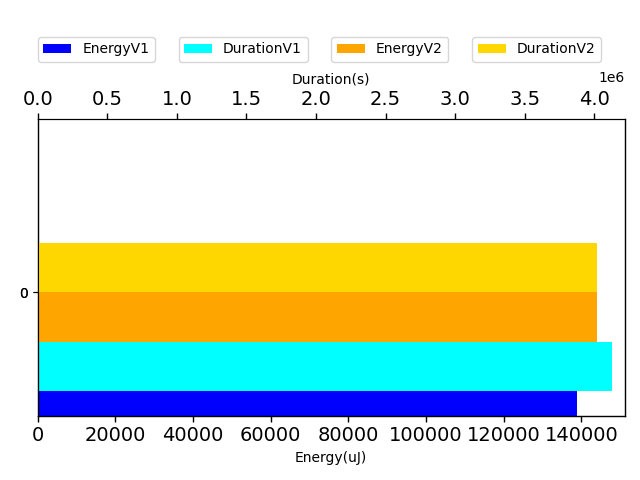

## com.google.gson.functional.JsonAdapterAnnotationOnClassesTest

| Test | IterationV1 | IterationV2 | DeltaIteration |
| --- | --- | --- | --- |
| com.google.gson.functional.JsonAdapterAnnotationOnClassesTest-testJsonAdapterInvoked | 99 | 99 | 0 |
| com.google.gson.functional.JsonAdapterAnnotationOnClassesTest-testJsonAdapterFactoryInvoked | 94 | 95 | 1 |
| com.google.gson.functional.JsonAdapterAnnotationOnClassesTest-testRegisteredDeserializerOverridesJsonAdapter | 45 | 61 | 16 |
| com.google.gson.functional.JsonAdapterAnnotationOnClassesTest-testRegisteredSerializerOverridesJsonAdapter | 59 | 62 | 3 |

| Test | EnergyV1 | EnergyV2 | DeltaEnergy |
| --- | --- | --- | --- |
| com.google.gson.functional.JsonAdapterAnnotationOnClassesTest-testJsonAdapterInvoked | 68833.11623591193 | 152717.68028441622 | 83884.56404850428 |
| com.google.gson.functional.JsonAdapterAnnotationOnClassesTest-testJsonAdapterFactoryInvoked | 41685.6594024661 | 44412.54034884953 | 2726.880946383426 |
| com.google.gson.functional.JsonAdapterAnnotationOnClassesTest-testRegisteredDeserializerOverridesJsonAdapter | 43562.4941546762 | 45057.70974680259 | 1495.2155921263911 |
| com.google.gson.functional.JsonAdapterAnnotationOnClassesTest-testRegisteredSerializerOverridesJsonAdapter | 51695.58655090091 | 51794.88341305638 | 99.29686215546826 |

| Test | DurationV1 | DurationsV2 | DeltaDuration |
| --- | --- | --- | --- |
| com.google.gson.functional.JsonAdapterAnnotationOnClassesTest-testJsonAdapterInvoked | 2150045.0071927803 | 3087677.7102542403 | 937632.70306146 |
| com.google.gson.functional.JsonAdapterAnnotationOnClassesTest-testJsonAdapterFactoryInvoked | 1145433.0079585935 | 1175284.2586822473 | 29851.250723653706 |
| com.google.gson.functional.JsonAdapterAnnotationOnClassesTest-testRegisteredDeserializerOverridesJsonAdapter | 776931.9413461951 | 1027888.5145827237 | 250956.57323652867 |
| com.google.gson.functional.JsonAdapterAnnotationOnClassesTest-testRegisteredSerializerOverridesJsonAdapter | 1144433.5332606663 | 957259.1284113651 | -187174.4048493012 |

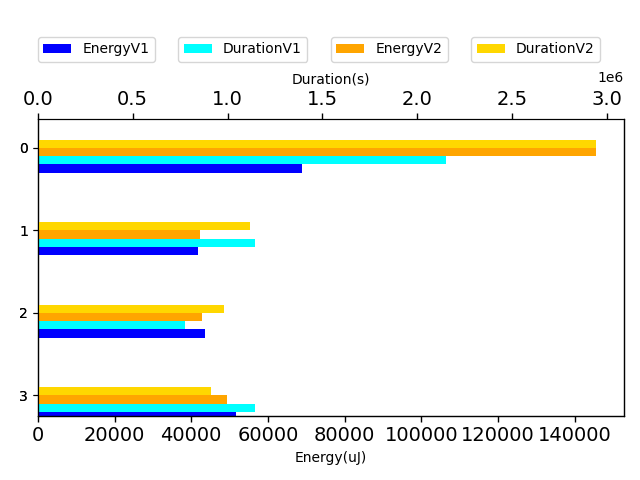

## com.google.gson.OverrideCoreTypeAdaptersTest

| Test | IterationV1 | IterationV2 | DeltaIteration |
| --- | --- | --- | --- |
| com.google.gson.OverrideCoreTypeAdaptersTest-testOverrideStringAdapter | 30 | 19 | -11 |
| com.google.gson.OverrideCoreTypeAdaptersTest-testOverrideWrapperBooleanAdapter | 26 | 29 | 3 |
| com.google.gson.OverrideCoreTypeAdaptersTest-testOverridePrimitiveBooleanAdapter | 15 | 27 | 12 |

| Test | EnergyV1 | EnergyV2 | DeltaEnergy |
| --- | --- | --- | --- |
| com.google.gson.OverrideCoreTypeAdaptersTest-testOverrideStringAdapter | 46138.229236054234 | 223881.00914382935 | 177742.7799077751 |
| com.google.gson.OverrideCoreTypeAdaptersTest-testOverrideWrapperBooleanAdapter | 64476.78952765465 | 48663.51394727826 | -15813.275580376387 |
| com.google.gson.OverrideCoreTypeAdaptersTest-testOverridePrimitiveBooleanAdapter | 46954.53698730469 | 42937.44628016651 | -4017.0907071381807 |

| Test | DurationV1 | DurationsV2 | DeltaDuration |
| --- | --- | --- | --- |
| com.google.gson.OverrideCoreTypeAdaptersTest-testOverrideStringAdapter | 494276.0797296846 | 5578736.621196747 | 5084460.541467062 |
| com.google.gson.OverrideCoreTypeAdaptersTest-testOverrideWrapperBooleanAdapter | 1141484.0402624905 | 721072.7489899956 | -420411.29127249494 |
| com.google.gson.OverrideCoreTypeAdaptersTest-testOverridePrimitiveBooleanAdapter | 398938.1552734375 | 505588.0588873327 | 106649.90361389518 |

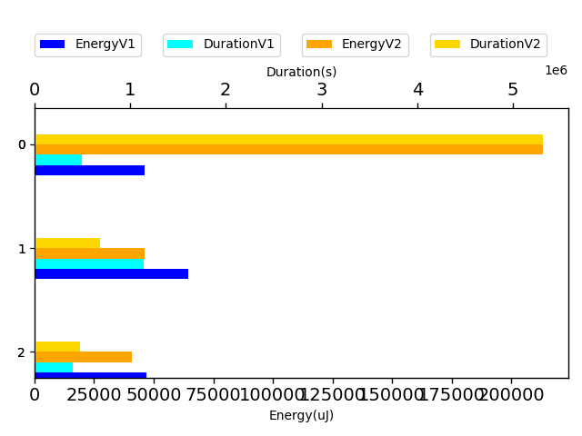

## com.google.gson.functional.JsonAdapterSerializerDeserializerTest

| Test | IterationV1 | IterationV2 | DeltaIteration |
| --- | --- | --- | --- |
| com.google.gson.functional.JsonAdapterSerializerDeserializerTest-testJsonSerializerDeserializerBasedJsonAdapterOnFields | 99 | 99 | 0 |
| com.google.gson.functional.JsonAdapterSerializerDeserializerTest-testJsonSerializerDeserializerBasedJsonAdapterOnClass | 99 | 99 | 0 |

| Test | EnergyV1 | EnergyV2 | DeltaEnergy |
| --- | --- | --- | --- |
| com.google.gson.functional.JsonAdapterSerializerDeserializerTest-testJsonSerializerDeserializerBasedJsonAdapterOnFields | 137557.20743125444 | 124184.79548918146 | -13372.411942072984 |
| com.google.gson.functional.JsonAdapterSerializerDeserializerTest-testJsonSerializerDeserializerBasedJsonAdapterOnClass | 41808.77362998533 | 41915.65335471158 | 106.87972472625552 |

| Test | DurationV1 | DurationsV2 | DeltaDuration |
| --- | --- | --- | --- |
| com.google.gson.functional.JsonAdapterSerializerDeserializerTest-testJsonSerializerDeserializerBasedJsonAdapterOnFields | 3938842.40984866 | 2938615.517680667 | -1000226.8921679934 |
| com.google.gson.functional.JsonAdapterSerializerDeserializerTest-testJsonSerializerDeserializerBasedJsonAdapterOnClass | 1570347.124181039 | 1411348.0942240627 | -158999.02995697618 |

## com.google.gson.functional.ThrowableFunctionalTest

| Test | IterationV1 | IterationV2 | DeltaIteration |
| --- | --- | --- | --- |
| com.google.gson.functional.ThrowableFunctionalTest-testExceptionWithoutCause | 99 | 99 | 0 |
| com.google.gson.functional.ThrowableFunctionalTest-testErrornWithCause | 95 | 96 | 1 |
| com.google.gson.functional.ThrowableFunctionalTest-testErrorWithoutCause | 94 | 88 | -6 |
| com.google.gson.functional.ThrowableFunctionalTest-testExceptionWithCause | 99 | 97 | -2 |

| Test | EnergyV1 | EnergyV2 | DeltaEnergy |
| --- | --- | --- | --- |
| com.google.gson.functional.ThrowableFunctionalTest-testExceptionWithoutCause | 166360.47666913684 | 54373.78653032469 | -111986.69013881215 |
| com.google.gson.functional.ThrowableFunctionalTest-testErrornWithCause | 67082.81955141717 | 55185.22535063822 | -11897.594200778949 |
| com.google.gson.functional.ThrowableFunctionalTest-testErrorWithoutCause | 64853.85084001211 | 42923.52426943157 | -21930.326570580546 |
| com.google.gson.functional.ThrowableFunctionalTest-testExceptionWithCause | 61155.16705002919 | 50747.606786606695 | -10407.560263422492 |

| Test | DurationV1 | DurationsV2 | DeltaDuration |
| --- | --- | --- | --- |
| com.google.gson.functional.ThrowableFunctionalTest-testExceptionWithoutCause | 5021334.457317281 | 1590740.0433540493 | -3430594.4139632313 |
| com.google.gson.functional.ThrowableFunctionalTest-testErrornWithCause | 1909532.7249542903 | 1402957.1630968633 | -506575.561857427 |
| com.google.gson.functional.ThrowableFunctionalTest-testErrorWithoutCause | 1714896.4219520178 | 1371945.333375765 | -342951.0885762528 |
| com.google.gson.functional.ThrowableFunctionalTest-testExceptionWithCause | 2313333.805824419 | 1480351.5445905817 | -832982.2612338373 |

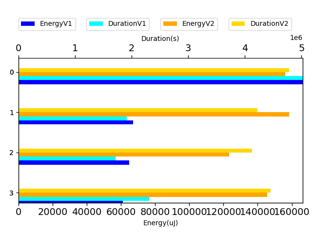

## com.google.gson.functional.MapTest

| Test | IterationV1 | IterationV2 | DeltaIteration |
| --- | --- | --- | --- |
| com.google.gson.functional.MapTest-testConcurrentSkipListMap | 78 | 72 | -6 |
| com.google.gson.functional.MapTest-testConcurrentMap | 97 | 97 | 0 |
| com.google.gson.functional.MapTest-testConcurrentNavigableMap | 99 | 99 | 0 |
| com.google.gson.functional.MapTest-testConcurrentHashMap | 65 | 70 | 5 |

| Test | EnergyV1 | EnergyV2 | DeltaEnergy |
| --- | --- | --- | --- |
| com.google.gson.functional.MapTest-testConcurrentSkipListMap | 54244.249189136906 | 42523.76067011529 | -11720.488519021616 |
| com.google.gson.functional.MapTest-testConcurrentMap | 42918.45240136406 | 44239.124079983216 | 1320.6716786191537 |
| com.google.gson.functional.MapTest-testConcurrentNavigableMap | 205728.45615096623 | 134619.82982434204 | -71108.62632662419 |
| com.google.gson.functional.MapTest-testConcurrentHashMap | 47487.15246487252 | 43612.171634800456 | -3874.9808300720615 |

| Test | DurationV1 | DurationsV2 | DeltaDuration |
| --- | --- | --- | --- |
| com.google.gson.functional.MapTest-testConcurrentSkipListMap | 2743973.455877805 | 933200.4011719911 | -1810773.054705814 |
| com.google.gson.functional.MapTest-testConcurrentMap | 1383409.8760551794 | 1348911.6639869339 | -34498.21206824551 |
| com.google.gson.functional.MapTest-testConcurrentNavigableMap | 5098017.281065302 | 3477689.6067618486 | -1620327.6743034534 |
| com.google.gson.functional.MapTest-testConcurrentHashMap | 1180824.0673269206 | 1016703.5772532325 | -164120.4900736881 |

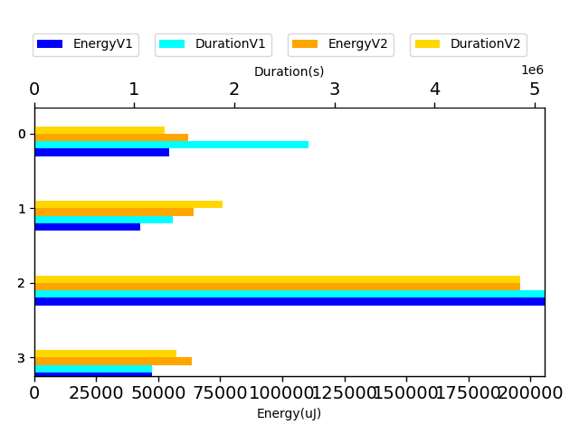

## com.google.gson.functional.CollectionTest

| Test | IterationV1 | IterationV2 | DeltaIteration |
| --- | --- | --- | --- |
| com.google.gson.functional.CollectionTest-testStack | 98 | 99 | 1 |
| com.google.gson.functional.CollectionTest-testPriorityQueue | 99 | 99 | 0 |
| com.google.gson.functional.CollectionTest-testFieldIsArrayList | 87 | 81 | -6 |
| com.google.gson.functional.CollectionTest-testWildcardCollectionField | 97 | 98 | 1 |
| com.google.gson.functional.CollectionTest-testVector | 73 | 66 | -7 |

| Test | EnergyV1 | EnergyV2 | DeltaEnergy |
| --- | --- | --- | --- |
| com.google.gson.functional.CollectionTest-testStack | 43282.23309327161 | 43260.71603263012 | -21.51706064149039 |
| com.google.gson.functional.CollectionTest-testPriorityQueue | 65311.041812844545 | 56076.37895481262 | -9234.662858031923 |
| com.google.gson.functional.CollectionTest-testFieldIsArrayList | 67722.6262102031 | 43769.31712636604 | -23953.309083837063 |
| com.google.gson.functional.CollectionTest-testWildcardCollectionField | 140150.1087953661 | 80891.16698477701 | -59258.941810589095 |
| com.google.gson.functional.CollectionTest-testVector | 43224.585247797295 | 46802.87491834136 | 3578.2896705440653 |

| Test | DurationV1 | DurationsV2 | DeltaDuration |
| --- | --- | --- | --- |
| com.google.gson.functional.CollectionTest-testStack | 1640409.2014982356 | 1350610.9884210592 | -289798.21307717636 |
| com.google.gson.functional.CollectionTest-testPriorityQueue | 1840652.5791322426 | 1618323.6607156827 | -222328.91841655993 |
| com.google.gson.functional.CollectionTest-testFieldIsArrayList | 1788782.6630996177 | 1555107.5440131607 | -233675.11908645695 |
| com.google.gson.functional.CollectionTest-testWildcardCollectionField | 3732115.5094837775 | 2376686.1119861403 | -1355429.3974976372 |
| com.google.gson.functional.CollectionTest-testVector | 1449714.6290405283 | 857841.1648491945 | -591873.4641913339 |

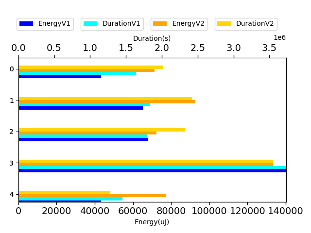

## com.google.gson.functional.EnumTest

| Test | IterationV1 | IterationV2 | DeltaIteration |
| --- | --- | --- | --- |
| com.google.gson.functional.EnumTest-testEnumSubclassAsParameterizedType | 91 | 89 | -2 |
| com.google.gson.functional.EnumTest-testEnumCaseMapping | 88 | 82 | -6 |
| com.google.gson.functional.EnumTest-testEnumSubclass | 99 | 99 | 0 |
| com.google.gson.functional.EnumTest-testEnumSubclassWithRegisteredTypeAdapter | 95 | 95 | 0 |
| com.google.gson.functional.EnumTest-testEnumClassWithFields | 53 | 52 | -1 |
| com.google.gson.functional.EnumTest-testEnumSet | 77 | 80 | 3 |

| Test | EnergyV1 | EnergyV2 | DeltaEnergy |
| --- | --- | --- | --- |
| com.google.gson.functional.EnumTest-testEnumSubclassAsParameterizedType | 36887.48160624815 | 46077.44495766595 | 9189.963351417806 |
| com.google.gson.functional.EnumTest-testEnumCaseMapping | 53671.067180522485 | 50853.45046897637 | -2817.616711546114 |
| com.google.gson.functional.EnumTest-testEnumSubclass | 106657.90678329278 | 112268.21119148175 | 5610.3044081889675 |
| com.google.gson.functional.EnumTest-testEnumSubclassWithRegisteredTypeAdapter | 61009.32165781131 | 45941.41769116554 | -15067.903966645776 |
| com.google.gson.functional.EnumTest-testEnumClassWithFields | 37003.679796885386 | 45147.67344689183 | 8143.993650006443 |
| com.google.gson.functional.EnumTest-testEnumSet | 37812.059408494286 | 46021.31562435014 | 8209.256215855858 |

| Test | DurationV1 | DurationsV2 | DeltaDuration |
| --- | --- | --- | --- |
| com.google.gson.functional.EnumTest-testEnumSubclassAsParameterizedType | 1365904.0276032262 | 981031.1027953259 | -384872.92480790033 |
| com.google.gson.functional.EnumTest-testEnumCaseMapping | 2231609.2739805537 | 1162847.326178059 | -1068761.9478024947 |
| com.google.gson.functional.EnumTest-testEnumSubclass | 3384763.7902561165 | 2883784.0710035204 | -500979.71925259614 |
| com.google.gson.functional.EnumTest-testEnumSubclassWithRegisteredTypeAdapter | 2065187.5858021635 | 1177149.3346756697 | -888038.2511264938 |
| com.google.gson.functional.EnumTest-testEnumClassWithFields | 912835.5001196173 | 937615.468272076 | 24779.968152458663 |
| com.google.gson.functional.EnumTest-testEnumSet | 1128219.5026368527 | 934126.6627451207 | -194092.83989173197 |

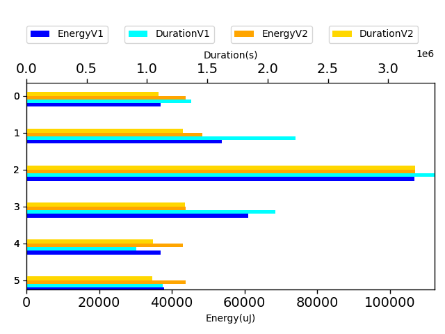

## com.google.gson.JsonParserTest

| Test | IterationV1 | IterationV2 | DeltaIteration |
| --- | --- | --- | --- |
| com.google.gson.JsonParserTest-testReadWriteTwoObjects | 77 | 79 | 2 |
| com.google.gson.JsonParserTest-testParseMixedArray | 58 | 67 | 9 |

| Test | EnergyV1 | EnergyV2 | DeltaEnergy |
| --- | --- | --- | --- |
| com.google.gson.JsonParserTest-testReadWriteTwoObjects | 80452.18490123883 | 105602.75466909523 | 25150.569767856403 |
| com.google.gson.JsonParserTest-testParseMixedArray | 43122.41504304121 | 43789.389575808535 | 666.9745327673227 |

| Test | DurationV1 | DurationsV2 | DeltaDuration |
| --- | --- | --- | --- |
| com.google.gson.JsonParserTest-testReadWriteTwoObjects | 2080170.1470841449 | 2612885.740248859 | 532715.593164714 |
| com.google.gson.JsonParserTest-testParseMixedArray | 999094.4865601347 | 888215.4290298843 | -110879.0575302504 |

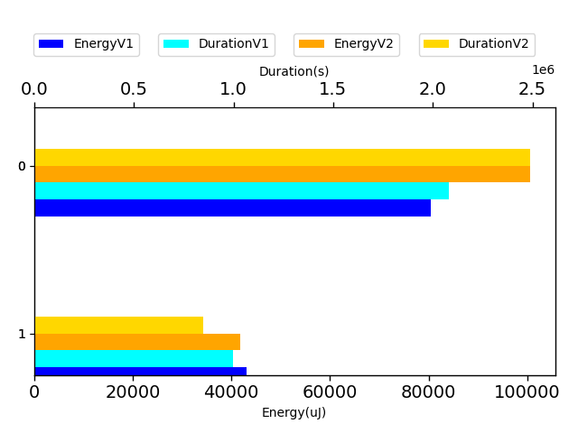

## com.google.gson.functional.ParameterizedTypesTest

| Test | IterationV1 | IterationV2 | DeltaIteration |
| --- | --- | --- | --- |
| com.google.gson.functional.ParameterizedTypesTest-testVariableTypeArrayDeserialization | 99 | 97 | -2 |
| com.google.gson.functional.ParameterizedTypesTest-testVariableTypeDeserialization | 99 | 99 | 0 |
| com.google.gson.functional.ParameterizedTypesTest-testParameterizedTypeGenericArraysDeserialization | 99 | 98 | -1 |
| com.google.gson.functional.ParameterizedTypesTest-testVariableTypeFieldsAndGenericArraysDeserialization | 99 | 99 | 0 |
| com.google.gson.functional.ParameterizedTypesTest-testParameterizedTypeWithVariableTypeDeserialization | 98 | 97 | -1 |

| Test | EnergyV1 | EnergyV2 | DeltaEnergy |
| --- | --- | --- | --- |
| com.google.gson.functional.ParameterizedTypesTest-testVariableTypeArrayDeserialization | 65851.95513710432 | 80471.54675825279 | 14619.591621148473 |
| com.google.gson.functional.ParameterizedTypesTest-testVariableTypeDeserialization | 71943.39068341735 | 75170.85263889117 | 3227.4619554738165 |
| com.google.gson.functional.ParameterizedTypesTest-testParameterizedTypeGenericArraysDeserialization | 43030.15000443961 | 46694.950620893964 | 3664.800616454355 |
| com.google.gson.functional.ParameterizedTypesTest-testVariableTypeFieldsAndGenericArraysDeserialization | 177349.33447964152 | 96947.73575376737 | -80401.59872587415 |
| com.google.gson.functional.ParameterizedTypesTest-testParameterizedTypeWithVariableTypeDeserialization | 45780.32620590929 | 59270.63827490726 | 13490.31206899797 |

| Test | DurationV1 | DurationsV2 | DeltaDuration |
| --- | --- | --- | --- |
| com.google.gson.functional.ParameterizedTypesTest-testVariableTypeArrayDeserialization | 1642437.7424803874 | 2375042.2361019626 | 732604.4936215752 |
| com.google.gson.functional.ParameterizedTypesTest-testVariableTypeDeserialization | 1973522.6599166028 | 1657140.2994972216 | -316382.3604193812 |
| com.google.gson.functional.ParameterizedTypesTest-testParameterizedTypeGenericArraysDeserialization | 1370899.2471659547 | 1504183.1470803532 | 133283.89991439856 |
| com.google.gson.functional.ParameterizedTypesTest-testVariableTypeFieldsAndGenericArraysDeserialization | 4348274.498741685 | 2426558.585154879 | -1921715.9135868065 |
| com.google.gson.functional.ParameterizedTypesTest-testParameterizedTypeWithVariableTypeDeserialization | 1267205.4324431708 | 1379817.1525346555 | 112611.72009148472 |

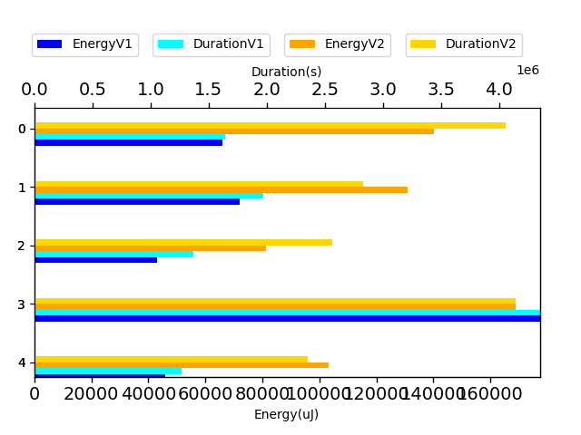

## com.google.gson.functional.ObjectTest

| Test | IterationV1 | IterationV2 | DeltaIteration |
| --- | --- | --- | --- |
| com.google.gson.functional.ObjectTest-testSingletonLists | 99 | 99 | 0 |

| Test | EnergyV1 | EnergyV2 | DeltaEnergy |
| --- | --- | --- | --- |
| com.google.gson.functional.ObjectTest-testSingletonLists | 67229.83339799296 | 274786.6095447819 | 207556.77614678896 |

| Test | DurationV1 | DurationsV2 | DeltaDuration |
| --- | --- | --- | --- |
| com.google.gson.functional.ObjectTest-testSingletonLists | 1612545.0612292134 | 9285254.381144533 | 7672709.31991532 |

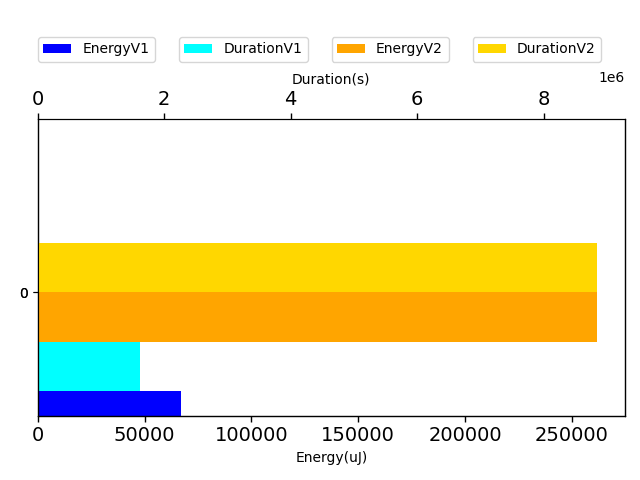

## com.google.gson.functional.JsonAdapterAnnotationOnFieldsTest

| Test | IterationV1 | IterationV2 | DeltaIteration |
| --- | --- | --- | --- |
| com.google.gson.functional.JsonAdapterAnnotationOnFieldsTest-testPrimitiveFieldAnnotationTakesPrecedenceOverDefault | 99 | 99 | 0 |
| com.google.gson.functional.JsonAdapterAnnotationOnFieldsTest-testClassAnnotationAdapterFactoryTakesPrecedenceOverDefault | 97 | 99 | 2 |
| com.google.gson.functional.JsonAdapterAnnotationOnFieldsTest-testJsonAdapterWrappedInNullSafeAsRequested | 79 | 82 | 3 |
| com.google.gson.functional.JsonAdapterAnnotationOnFieldsTest-testFieldAnnotationWorksForParameterizedType | 99 | 99 | 0 |
| com.google.gson.functional.JsonAdapterAnnotationOnFieldsTest-testRegisteredTypeAdapterTakesPrecedenceOverClassAnnotationAdapter | 65 | 70 | 5 |
| com.google.gson.functional.JsonAdapterAnnotationOnFieldsTest-testFieldAnnotationTakesPrecedenceOverClassAnnotation | 94 | 94 | 0 |
| com.google.gson.functional.JsonAdapterAnnotationOnFieldsTest-testFieldAnnotationTakesPrecedenceOverRegisteredTypeAdapter | 96 | 96 | 0 |
| com.google.gson.functional.JsonAdapterAnnotationOnFieldsTest-testClassAnnotationAdapterTakesPrecedenceOverDefault | 91 | 94 | 3 |
| com.google.gson.functional.JsonAdapterAnnotationOnFieldsTest-testNonPrimitiveFieldAnnotationTakesPrecedenceOverDefault | 38 | 35 | -3 |

| Test | EnergyV1 | EnergyV2 | DeltaEnergy |
| --- | --- | --- | --- |
| com.google.gson.functional.JsonAdapterAnnotationOnFieldsTest-testPrimitiveFieldAnnotationTakesPrecedenceOverDefault | 66522.13826570041 | 71204.75419103896 | 4682.615925338541 |
| com.google.gson.functional.JsonAdapterAnnotationOnFieldsTest-testClassAnnotationAdapterFactoryTakesPrecedenceOverDefault | 45497.708006909146 | 47007.78415445951 | 1510.0761475503605 |
| com.google.gson.functional.JsonAdapterAnnotationOnFieldsTest-testJsonAdapterWrappedInNullSafeAsRequested | 44595.34886170937 | 42128.47259943921 | -2466.8762622701615 |
| com.google.gson.functional.JsonAdapterAnnotationOnFieldsTest-testFieldAnnotationWorksForParameterizedType | 45700.712398301366 | 48284.49175760235 | 2583.7793593009847 |
| com.google.gson.functional.JsonAdapterAnnotationOnFieldsTest-testRegisteredTypeAdapterTakesPrecedenceOverClassAnnotationAdapter | 88462.66607318594 | 46253.45836448821 | -42209.20770869774 |
| com.google.gson.functional.JsonAdapterAnnotationOnFieldsTest-testFieldAnnotationTakesPrecedenceOverClassAnnotation | 44424.45672600623 | 45545.422825300135 | 1120.9660992939025 |
| com.google.gson.functional.JsonAdapterAnnotationOnFieldsTest-testFieldAnnotationTakesPrecedenceOverRegisteredTypeAdapter | 53897.434904292735 | 68141.40793446699 | 14243.973030174253 |
| com.google.gson.functional.JsonAdapterAnnotationOnFieldsTest-testClassAnnotationAdapterTakesPrecedenceOverDefault | 67423.7365929028 | 45833.69226132416 | -21590.04433157864 |
| com.google.gson.functional.JsonAdapterAnnotationOnFieldsTest-testNonPrimitiveFieldAnnotationTakesPrecedenceOverDefault | 41676.37259719898 | 44294.32334223669 | 2617.950745037713 |

| Test | DurationV1 | DurationsV2 | DeltaDuration |
| --- | --- | --- | --- |
| com.google.gson.functional.JsonAdapterAnnotationOnFieldsTest-testPrimitiveFieldAnnotationTakesPrecedenceOverDefault | 1531346.0088611853 | 1414120.6779514346 | -117225.33090975066 |
| com.google.gson.functional.JsonAdapterAnnotationOnFieldsTest-testClassAnnotationAdapterFactoryTakesPrecedenceOverDefault | 1207732.8029053272 | 1235532.7226487985 | 27799.919743471313 |
| com.google.gson.functional.JsonAdapterAnnotationOnFieldsTest-testJsonAdapterWrappedInNullSafeAsRequested | 1187075.8712795922 | 1259272.315101814 | 72196.44382222183 |
| com.google.gson.functional.JsonAdapterAnnotationOnFieldsTest-testFieldAnnotationWorksForParameterizedType | 1482003.3402027807 | 1348478.766148396 | -133524.5740543846 |
| com.google.gson.functional.JsonAdapterAnnotationOnFieldsTest-testRegisteredTypeAdapterTakesPrecedenceOverClassAnnotationAdapter | 2180674.4566073697 | 879221.8411909746 | -1301452.615416395 |
| com.google.gson.functional.JsonAdapterAnnotationOnFieldsTest-testFieldAnnotationTakesPrecedenceOverClassAnnotation | 1026173.2675573687 | 1288919.512442823 | 262746.2448854543 |
| com.google.gson.functional.JsonAdapterAnnotationOnFieldsTest-testFieldAnnotationTakesPrecedenceOverRegisteredTypeAdapter | 1575987.346764146 | 1355459.9761018895 | -220527.37066225638 |
| com.google.gson.functional.JsonAdapterAnnotationOnFieldsTest-testClassAnnotationAdapterTakesPrecedenceOverDefault | 1300042.1379718296 | 1186846.7671195709 | -113195.37085225875 |
| com.google.gson.functional.JsonAdapterAnnotationOnFieldsTest-testNonPrimitiveFieldAnnotationTakesPrecedenceOverDefault | 568940.3092133971 | 585542.6449753309 | 16602.33576193382 |

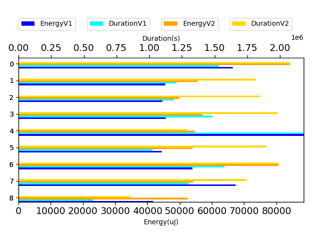

## com.google.gson.functional.TypeVariableTest

| Test | IterationV1 | IterationV2 | DeltaIteration |
| --- | --- | --- | --- |
| com.google.gson.functional.TypeVariableTest-testBasicTypeVariables | 64 | 67 | 3 |
| com.google.gson.functional.TypeVariableTest-testAdvancedTypeVariables | 99 | 99 | 0 |
| com.google.gson.functional.TypeVariableTest-testTypeVariablesViaTypeParameter | 96 | 96 | 0 |

| Test | EnergyV1 | EnergyV2 | DeltaEnergy |
| --- | --- | --- | --- |
| com.google.gson.functional.TypeVariableTest-testBasicTypeVariables | 42147.209861382216 | 43876.56462142087 | 1729.3547600386519 |
| com.google.gson.functional.TypeVariableTest-testAdvancedTypeVariables | 59260.660945368116 | 74312.13713487264 | 15051.476189504523 |
| com.google.gson.functional.TypeVariableTest-testTypeVariablesViaTypeParameter | 46071.46594289335 | 45251.624969226476 | -819.8409736668764 |

| Test | DurationV1 | DurationsV2 | DeltaDuration |
| --- | --- | --- | --- |
| com.google.gson.functional.TypeVariableTest-testBasicTypeVariables | 998162.2952431957 | 821697.0025766575 | -176465.29266653827 |
| com.google.gson.functional.TypeVariableTest-testAdvancedTypeVariables | 1868347.5551124536 | 2077358.6151350578 | 209011.0600226042 |
| com.google.gson.functional.TypeVariableTest-testTypeVariablesViaTypeParameter | 1252984.924219695 | 1344631.1920144565 | 91646.26779476157 |

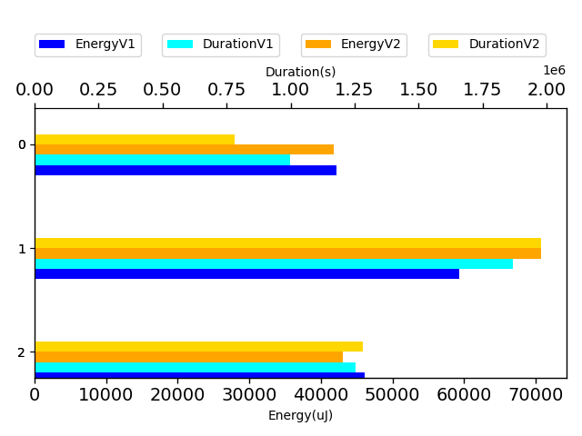

## com.google.gson.functional.DefaultTypeAdaptersTest

| Test | IterationV1 | IterationV2 | DeltaIteration |
| --- | --- | --- | --- |
| com.google.gson.functional.DefaultTypeAdaptersTest-testOverrideBigIntegerTypeAdapter | 99 | 99 | 0 |
| com.google.gson.functional.DefaultTypeAdaptersTest-testTimestampSerialization | 81 | 82 | 1 |
| com.google.gson.functional.DefaultTypeAdaptersTest-testDefaultDateDeserializationUsingBuilder | 99 | 99 | 0 |
| com.google.gson.functional.DefaultTypeAdaptersTest-testOverrideBigDecimalTypeAdapter | 98 | 99 | 1 |
| com.google.gson.functional.DefaultTypeAdaptersTest-testNullSerialization | 99 | 99 | 0 |
| com.google.gson.functional.DefaultTypeAdaptersTest-testDateDeserializationWithPattern | 93 | 83 | -10 |
| com.google.gson.functional.DefaultTypeAdaptersTest-testDateSerializationInCollection | 99 | 97 | -2 |
| com.google.gson.functional.DefaultTypeAdaptersTest-testBitSetDeserialization | 41 | 51 | 10 |
| com.google.gson.functional.DefaultTypeAdaptersTest-testSqlDateSerialization | 71 | 58 | -13 |

| Test | EnergyV1 | EnergyV2 | DeltaEnergy |
| --- | --- | --- | --- |
| com.google.gson.functional.DefaultTypeAdaptersTest-testOverrideBigIntegerTypeAdapter | 65612.17498002693 | 80334.3410880416 | 14722.166108014673 |
| com.google.gson.functional.DefaultTypeAdaptersTest-testTimestampSerialization | 42681.77934799845 | 43006.925799785604 | 325.1464517871573 |
| com.google.gson.functional.DefaultTypeAdaptersTest-testDefaultDateDeserializationUsingBuilder | 375948.2724567789 | 377400.94179013616 | 1452.6693333572475 |
| com.google.gson.functional.DefaultTypeAdaptersTest-testOverrideBigDecimalTypeAdapter | 44272.12693797989 | 61210.06761699167 | 16937.94067901178 |
| com.google.gson.functional.DefaultTypeAdaptersTest-testNullSerialization | 1469078.449417888 | 1323160.2846562173 | -145918.16476167063 |
| com.google.gson.functional.DefaultTypeAdaptersTest-testDateDeserializationWithPattern | 41187.36771939216 | 39582.4578541481 | -1604.909865244059 |
| com.google.gson.functional.DefaultTypeAdaptersTest-testDateSerializationInCollection | 54743.25617287433 | 53827.33995867587 | -915.9162141984634 |
| com.google.gson.functional.DefaultTypeAdaptersTest-testBitSetDeserialization | 43529.75793508775 | 39712.932720782424 | -3816.825214305325 |
| com.google.gson.functional.DefaultTypeAdaptersTest-testSqlDateSerialization | 39895.338210512404 | 50054.902675760735 | 10159.564465248332 |

| Test | DurationV1 | DurationsV2 | DeltaDuration |
| --- | --- | --- | --- |
| com.google.gson.functional.DefaultTypeAdaptersTest-testOverrideBigIntegerTypeAdapter | 1818971.8522452703 | 2094959.6338260893 | 275987.78158081905 |
| com.google.gson.functional.DefaultTypeAdaptersTest-testTimestampSerialization | 1033900.2514475833 | 1186680.2639095995 | 152780.0124620162 |
| com.google.gson.functional.DefaultTypeAdaptersTest-testDefaultDateDeserializationUsingBuilder | 9696241.501241187 | 9882362.650747597 | 186121.14950641058 |
| com.google.gson.functional.DefaultTypeAdaptersTest-testOverrideBigDecimalTypeAdapter | 1321279.612719311 | 1429453.2597459378 | 108173.64702662686 |
| com.google.gson.functional.DefaultTypeAdaptersTest-testNullSerialization | 34473179.75048228 | 35056209.19081051 | 583029.4403282255 |
| com.google.gson.functional.DefaultTypeAdaptersTest-testDateDeserializationWithPattern | 1121335.749905299 | 3951943.5056492942 | 2830607.7557439953 |
| com.google.gson.functional.DefaultTypeAdaptersTest-testDateSerializationInCollection | 1503550.7230803804 | 1591686.5954917353 | 88135.87241135491 |
| com.google.gson.functional.DefaultTypeAdaptersTest-testBitSetDeserialization | 673364.407422747 | 757072.8672725656 | 83708.45984981861 |
| com.google.gson.functional.DefaultTypeAdaptersTest-testSqlDateSerialization | 1231508.0744785704 | 1232804.121628317 | 1296.0471497466788 |

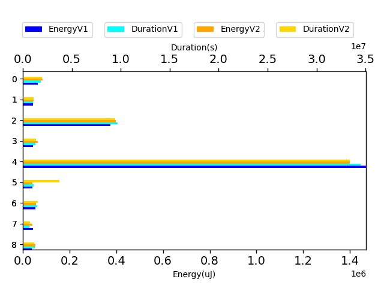

## com.google.gson.functional.JavaUtilConcurrentAtomicTest

| Test | IterationV1 | IterationV2 | DeltaIteration |
| --- | --- | --- | --- |
| com.google.gson.functional.JavaUtilConcurrentAtomicTest-testAtomicLongArray | 90 | 91 | 1 |
| com.google.gson.functional.JavaUtilConcurrentAtomicTest-testAtomicLongWithStringSerializationPolicy | 72 | 69 | -3 |
| com.google.gson.functional.JavaUtilConcurrentAtomicTest-testAtomicIntegerArray | 93 | 88 | -5 |
| com.google.gson.functional.JavaUtilConcurrentAtomicTest-testAtomicBoolean | 20 | 30 | 10 |
| com.google.gson.functional.JavaUtilConcurrentAtomicTest-testAtomicInteger | 19 | 26 | 7 |
| com.google.gson.functional.JavaUtilConcurrentAtomicTest-testAtomicLongArrayWithStringSerializationPolicy | 23 | 21 | -2 |
| com.google.gson.functional.JavaUtilConcurrentAtomicTest-testAtomicLong | 18 | 18 | 0 |

| Test | EnergyV1 | EnergyV2 | DeltaEnergy |
| --- | --- | --- | --- |
| com.google.gson.functional.JavaUtilConcurrentAtomicTest-testAtomicLongArray | 38875.922905216394 | 41601.40565123394 | 2725.482746017544 |
| com.google.gson.functional.JavaUtilConcurrentAtomicTest-testAtomicLongWithStringSerializationPolicy | 44564.882974477485 | 40335.8982956383 | -4228.984678839188 |
| com.google.gson.functional.JavaUtilConcurrentAtomicTest-testAtomicIntegerArray | 40977.17847722412 | 44370.64511010277 | 3393.466632878648 |
| com.google.gson.functional.JavaUtilConcurrentAtomicTest-testAtomicBoolean | 44249.6179523468 | 43332.287496520206 | -917.3304558265954 |
| com.google.gson.functional.JavaUtilConcurrentAtomicTest-testAtomicInteger | 42083.34894180298 | 44692.90617334843 | 2609.5572315454483 |
| com.google.gson.functional.JavaUtilConcurrentAtomicTest-testAtomicLongArrayWithStringSerializationPolicy | 38590.80802869797 | 42058.53470134735 | 3467.7266726493835 |
| com.google.gson.functional.JavaUtilConcurrentAtomicTest-testAtomicLong | 40868.12808227539 | 42961.55757904053 | 2093.4294967651367 |

| Test | DurationV1 | DurationsV2 | DeltaDuration |
| --- | --- | --- | --- |
| com.google.gson.functional.JavaUtilConcurrentAtomicTest-testAtomicLongArray | 1233798.1841309294 | 1232904.399152367 | -893.7849785625003 |
| com.google.gson.functional.JavaUtilConcurrentAtomicTest-testAtomicLongWithStringSerializationPolicy | 914339.7434781832 | 969768.5088585734 | 55428.76538039022 |
| com.google.gson.functional.JavaUtilConcurrentAtomicTest-testAtomicIntegerArray | 1248104.6425438167 | 1278193.711505092 | 30089.068961275276 |
| com.google.gson.functional.JavaUtilConcurrentAtomicTest-testAtomicBoolean | 475917.67293548584 | 421111.3374822391 | -54806.33545324672 |
| com.google.gson.functional.JavaUtilConcurrentAtomicTest-testAtomicInteger | 1612668.5402069092 | 535238.5917493105 | -1077429.9484575987 |
| com.google.gson.functional.JavaUtilConcurrentAtomicTest-testAtomicLongArrayWithStringSerializationPolicy | 578715.5560262203 | 517773.07608413696 | -60942.47994208336 |
| com.google.gson.functional.JavaUtilConcurrentAtomicTest-testAtomicLong | 573130.7570648193 | 414012.4210510254 | -159118.33601379395 |

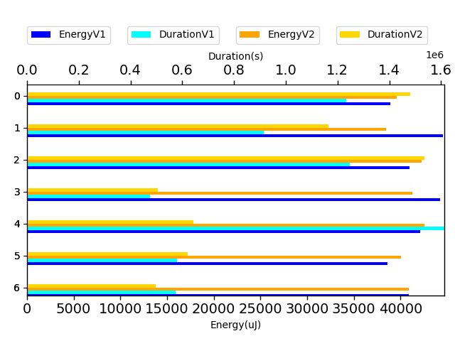

## com.google.gson.functional.RuntimeTypeAdapterFactoryFunctionalTest

| Test | IterationV1 | IterationV2 | DeltaIteration |
| --- | --- | --- | --- |
| com.google.gson.functional.RuntimeTypeAdapterFactoryFunctionalTest-testSubclassesAutomaticallySerialized | 99 | 99 | 0 |

| Test | EnergyV1 | EnergyV2 | DeltaEnergy |
| --- | --- | --- | --- |
| com.google.gson.functional.RuntimeTypeAdapterFactoryFunctionalTest-testSubclassesAutomaticallySerialized | 155812.79438635422 | 115661.6993854978 | -40151.09500085641 |

| Test | DurationV1 | DurationsV2 | DeltaDuration |
| --- | --- | --- | --- |
| com.google.gson.functional.RuntimeTypeAdapterFactoryFunctionalTest-testSubclassesAutomaticallySerialized | 3875264.9379783175 | 3263385.051628124 | -611879.8863501935 |

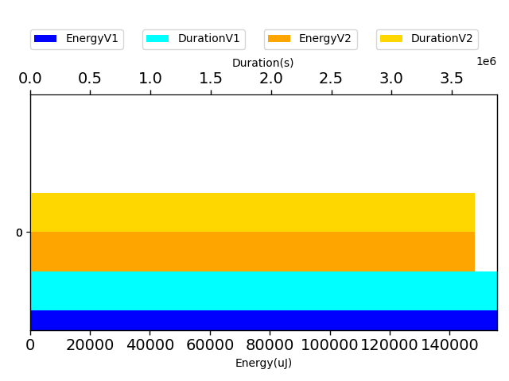

## com.google.gson.functional.UncategorizedTest

| Test | IterationV1 | IterationV2 | DeltaIteration |
| --- | --- | --- | --- |
| com.google.gson.functional.UncategorizedTest-testGsonInstanceReusableForSerializationAndDeserialization | 55 | 59 | 4 |

| Test | EnergyV1 | EnergyV2 | DeltaEnergy |
| --- | --- | --- | --- |
| com.google.gson.functional.UncategorizedTest-testGsonInstanceReusableForSerializationAndDeserialization | 47756.78779062518 | 52026.73885729683 | 4269.951066671645 |

| Test | DurationV1 | DurationsV2 | DeltaDuration |
| --- | --- | --- | --- |
| com.google.gson.functional.UncategorizedTest-testGsonInstanceReusableForSerializationAndDeserialization | 677488.2462928896 | 988219.471067759 | 310731.2247748694 |

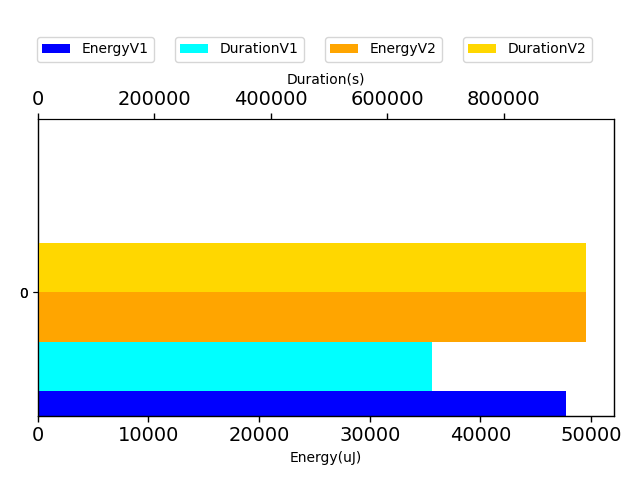

## com.google.gson.functional.EscapingTest

| Test | IterationV1 | IterationV2 | DeltaIteration |
| --- | --- | --- | --- |
| com.google.gson.functional.EscapingTest-testGsonDoubleDeserialization | 47 | 48 | 1 |
| com.google.gson.functional.EscapingTest-testGsonAcceptsEscapedAndNonEscapedJsonDeserialization | 82 | 81 | -1 |
| com.google.gson.functional.EscapingTest-testEscapingObjectFields | 55 | 47 | -8 |
| com.google.gson.functional.EscapingTest-testEscapingQuotesInStringArray | 37 | 37 | 0 |

| Test | EnergyV1 | EnergyV2 | DeltaEnergy |
| --- | --- | --- | --- |
| com.google.gson.functional.EscapingTest-testGsonDoubleDeserialization | 46200.19895981597 | 40028.596144570605 | -6171.6028152453655 |
| com.google.gson.functional.EscapingTest-testGsonAcceptsEscapedAndNonEscapedJsonDeserialization | 93382.04201103616 | 55561.892961996695 | -37820.149049039464 |
| com.google.gson.functional.EscapingTest-testEscapingObjectFields | 45424.316553284065 | 40642.10601970973 | -4782.210533574333 |
| com.google.gson.functional.EscapingTest-testEscapingQuotesInStringArray | 35775.052916203276 | 41064.383643683555 | 5289.330727480279 |

| Test | DurationV1 | DurationsV2 | DeltaDuration |
| --- | --- | --- | --- |
| com.google.gson.functional.EscapingTest-testGsonDoubleDeserialization | 846709.1328337651 | 952919.7633729271 | 106210.63053916197 |
| com.google.gson.functional.EscapingTest-testGsonAcceptsEscapedAndNonEscapedJsonDeserialization | 1858249.147310983 | 1541823.448868086 | -316425.6984428968 |
| com.google.gson.functional.EscapingTest-testEscapingObjectFields | 842886.3532047578 | 799718.6617783364 | -43167.6914264214 |
| com.google.gson.functional.EscapingTest-testEscapingQuotesInStringArray | 944595.7401648473 | 944677.6575077608 | 81.91734291345347 |

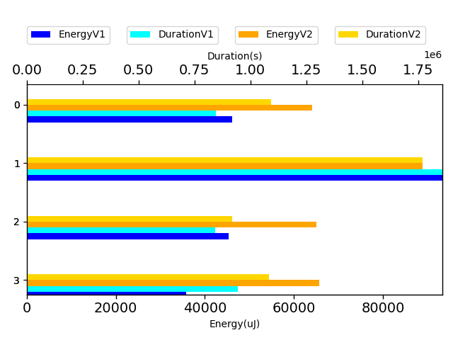

## com.google.gson.functional.MapAsArrayTypeAdapterTest

| Test | IterationV1 | IterationV2 | DeltaIteration |
| --- | --- | --- | --- |
| com.google.gson.functional.MapAsArrayTypeAdapterTest-testSerializeComplexMapWithTypeAdapter | 99 | 99 | 0 |
| com.google.gson.functional.MapAsArrayTypeAdapterTest-testMultipleEnableComplexKeyRegistrationHasNoEffect | 81 | 76 | -5 |

| Test | EnergyV1 | EnergyV2 | DeltaEnergy |
| --- | --- | --- | --- |
| com.google.gson.functional.MapAsArrayTypeAdapterTest-testSerializeComplexMapWithTypeAdapter | 181237.49366368557 | 131000.00936797471 | -50237.48429571086 |
| com.google.gson.functional.MapAsArrayTypeAdapterTest-testMultipleEnableComplexKeyRegistrationHasNoEffect | 42026.404743875566 | 44644.581410663 | 2618.1766667874326 |

| Test | DurationV1 | DurationsV2 | DeltaDuration |
| --- | --- | --- | --- |
| com.google.gson.functional.MapAsArrayTypeAdapterTest-testSerializeComplexMapWithTypeAdapter | 5292766.4474709 | 3173089.921701948 | -2119676.5257689515 |
| com.google.gson.functional.MapAsArrayTypeAdapterTest-testMultipleEnableComplexKeyRegistrationHasNoEffect | 1261620.9781552847 | 1019360.1253002628 | -242260.85285502183 |

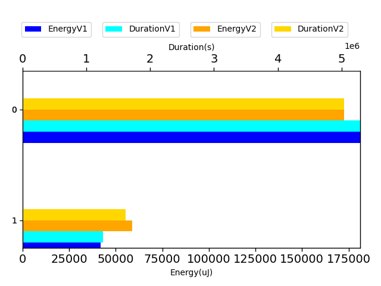

## com.google.gson.functional.NamingPolicyTest

| Test | IterationV1 | IterationV2 | DeltaIteration |
| --- | --- | --- | --- |
| com.google.gson.functional.NamingPolicyTest-testComplexFieldNameStrategy | 94 | 84 | -10 |

| Test | EnergyV1 | EnergyV2 | DeltaEnergy |
| --- | --- | --- | --- |
| com.google.gson.functional.NamingPolicyTest-testComplexFieldNameStrategy | 120575.09855809661 | 79603.34895819335 | -40971.749599903254 |

| Test | DurationV1 | DurationsV2 | DeltaDuration |
| --- | --- | --- | --- |
| com.google.gson.functional.NamingPolicyTest-testComplexFieldNameStrategy | 3680900.2409456433 | 2251241.9413214466 | -1429658.2996241967 |

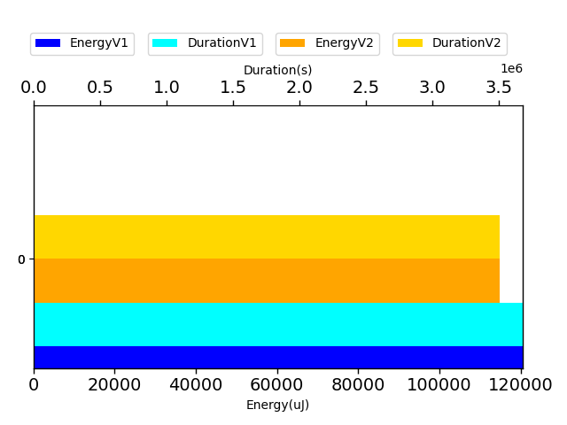

## com.google.gson.functional.CustomTypeAdaptersTest

| Test | IterationV1 | IterationV2 | DeltaIteration |
| --- | --- | --- | --- |
| com.google.gson.functional.CustomTypeAdaptersTest-testRegisterHierarchyAdapterForDate | 84 | 82 | -2 |

| Test | EnergyV1 | EnergyV2 | DeltaEnergy |
| --- | --- | --- | --- |
| com.google.gson.functional.CustomTypeAdaptersTest-testRegisterHierarchyAdapterForDate | 306187.4516903429 | 67576.72532558198 | -238610.72636476095 |

| Test | DurationV1 | DurationsV2 | DeltaDuration |
| --- | --- | --- | --- |
| com.google.gson.functional.CustomTypeAdaptersTest-testRegisterHierarchyAdapterForDate | 9532285.891697513 | 2181071.8087579934 | -7351214.08293952 |

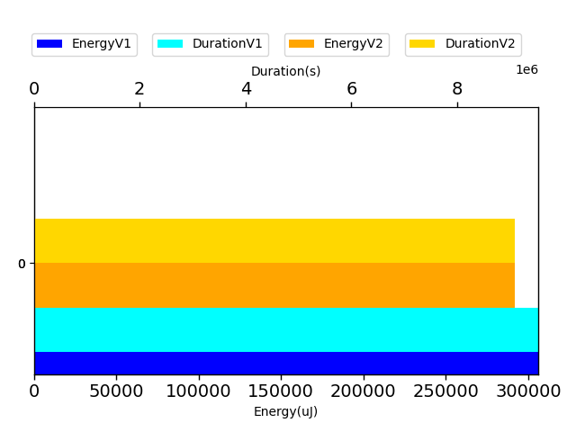

## com.google.gson.GsonTypeAdapterTest

| Test | IterationV1 | IterationV2 | DeltaIteration |
| --- | --- | --- | --- |
| com.google.gson.GsonTypeAdapterTest-testTypeAdapterThrowsException | 35 | 33 | -2 |
| com.google.gson.GsonTypeAdapterTest-testTypeAdapterDoesNotAffectNonAdaptedTypes | 20 | 24 | 4 |
| com.google.gson.GsonTypeAdapterTest-testTypeAdapterProperlyConvertsTypes | 35 | 23 | -12 |

| Test | EnergyV1 | EnergyV2 | DeltaEnergy |
| --- | --- | --- | --- |
| com.google.gson.GsonTypeAdapterTest-testTypeAdapterThrowsException | 36693.18909859852 | 42506.65570338711 | 5813.466604788584 |
| com.google.gson.GsonTypeAdapterTest-testTypeAdapterDoesNotAffectNonAdaptedTypes | 44686.25249862671 | 57403.53151297569 | 12717.279014348984 |
| com.google.gson.GsonTypeAdapterTest-testTypeAdapterProperlyConvertsTypes | 43345.65470929438 | 36751.00859260559 | -6594.646116688789 |

| Test | DurationV1 | DurationsV2 | DeltaDuration |
| --- | --- | --- | --- |
| com.google.gson.GsonTypeAdapterTest-testTypeAdapterThrowsException | 1023873.2555213261 | 499743.3820060246 | -524129.8735153015 |
| com.google.gson.GsonTypeAdapterTest-testTypeAdapterDoesNotAffectNonAdaptedTypes | 470201.49673461914 | 1061793.650746584 | 591592.1540119648 |
| com.google.gson.GsonTypeAdapterTest-testTypeAdapterProperlyConvertsTypes | 689789.6638473829 | 1088203.9284131527 | 398414.2645657698 |

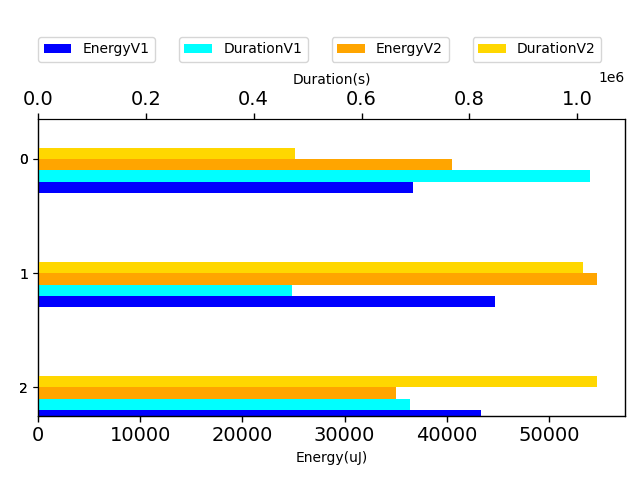

## com.google.gson.functional.TypeHierarchyAdapterTest

| Test | IterationV1 | IterationV2 | DeltaIteration |
| --- | --- | --- | --- |
| com.google.gson.functional.TypeHierarchyAdapterTest-testTypeHierarchy | 99 | 99 | 0 |
| com.google.gson.functional.TypeHierarchyAdapterTest-testRegisterSuperTypeFirst | 56 | 48 | -8 |

| Test | EnergyV1 | EnergyV2 | DeltaEnergy |
| --- | --- | --- | --- |
| com.google.gson.functional.TypeHierarchyAdapterTest-testTypeHierarchy | 123493.81984314055 | 122739.18574218241 | -754.6341009581374 |
| com.google.gson.functional.TypeHierarchyAdapterTest-testRegisterSuperTypeFirst | 46315.056047195256 | 45219.28322267337 | -1095.7728245218823 |

| Test | DurationV1 | DurationsV2 | DeltaDuration |
| --- | --- | --- | --- |
| com.google.gson.functional.TypeHierarchyAdapterTest-testTypeHierarchy | 3387292.3993394277 | 3524449.191228483 | 137156.79188905517 |
| com.google.gson.functional.TypeHierarchyAdapterTest-testRegisterSuperTypeFirst | 1960221.861068553 | 650473.0133417608 | -1309748.847726792 |

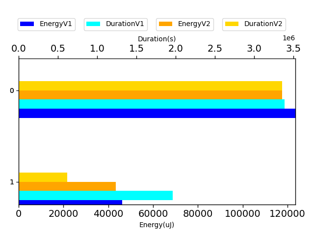

## com.google.gson.DefaultInetAddressTypeAdapterTest

| Test | IterationV1 | IterationV2 | DeltaIteration |
| --- | --- | --- | --- |
| com.google.gson.DefaultInetAddressTypeAdapterTest-testInetAddressSerializationAndDeserialization | 99 | 99 | 0 |

| Test | EnergyV1 | EnergyV2 | DeltaEnergy |
| --- | --- | --- | --- |
| com.google.gson.DefaultInetAddressTypeAdapterTest-testInetAddressSerializationAndDeserialization | 86049.98246252564 | 124221.10825746664 | 38171.12579494099 |

| Test | DurationV1 | DurationsV2 | DeltaDuration |
| --- | --- | --- | --- |
| com.google.gson.DefaultInetAddressTypeAdapterTest-testInetAddressSerializationAndDeserialization | 2146271.768891779 | 2986424.090297523 | 840152.3214057442 |

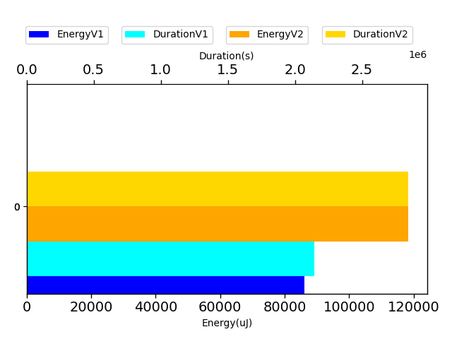

## com.google.gson.functional.JavaUtilTest

| Test | IterationV1 | IterationV2 | DeltaIteration |
| --- | --- | --- | --- |
| com.google.gson.functional.JavaUtilTest-testCurrency | 99 | 99 | 0 |
| com.google.gson.functional.JavaUtilTest-testProperties | 42 | 27 | -15 |

| Test | EnergyV1 | EnergyV2 | DeltaEnergy |
| --- | --- | --- | --- |
| com.google.gson.functional.JavaUtilTest-testCurrency | 239901.03510084588 | 88035.77079240026 | -151865.26430844562 |
| com.google.gson.functional.JavaUtilTest-testProperties | 37398.71341924061 | 40254.68705008179 | 2855.973630841181 |

| Test | DurationV1 | DurationsV2 | DeltaDuration |
| --- | --- | --- | --- |
| com.google.gson.functional.JavaUtilTest-testCurrency | 7702982.489374436 | 2456813.424747696 | -5246169.06462674 |
| com.google.gson.functional.JavaUtilTest-testProperties | 692032.6879830833 | 667132.0180962086 | -24900.669886874733 |

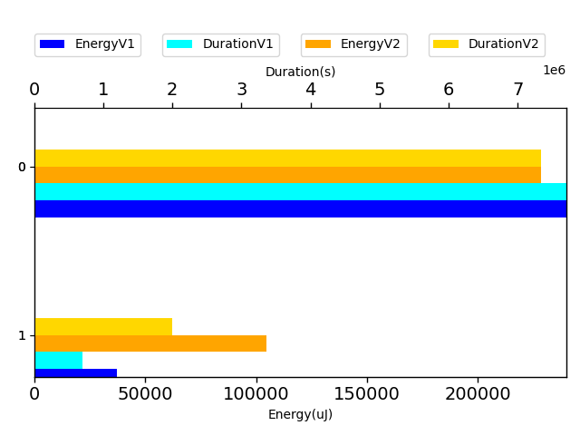

## com.google.gson.functional.DelegateTypeAdapterTest

| Test | IterationV1 | IterationV2 | DeltaIteration |
| --- | --- | --- | --- |
| com.google.gson.functional.DelegateTypeAdapterTest-testDelegateInvoked | 99 | 99 | 0 |
| com.google.gson.functional.DelegateTypeAdapterTest-testDelegateInvokedOnStrings | 30 | 31 | 1 |

| Test | EnergyV1 | EnergyV2 | DeltaEnergy |
| --- | --- | --- | --- |
| com.google.gson.functional.DelegateTypeAdapterTest-testDelegateInvoked | 66233.84609878805 | 110454.90220980172 | 44221.05611101366 |
| com.google.gson.functional.DelegateTypeAdapterTest-testDelegateInvokedOnStrings | 44713.46337986924 | 41091.07144759502 | -3622.391932274215 |

| Test | DurationV1 | DurationsV2 | DeltaDuration |
| --- | --- | --- | --- |
| com.google.gson.functional.DelegateTypeAdapterTest-testDelegateInvoked | 1778854.1136632343 | 2379951.510963303 | 601097.3973000688 |
| com.google.gson.functional.DelegateTypeAdapterTest-testDelegateInvokedOnStrings | 609001.3532502055 | 898383.5817011767 | 289382.2284509712 |

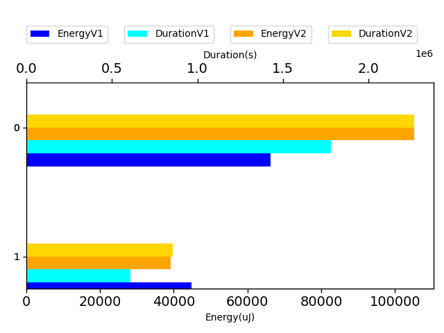

## com.google.gson.functional.CustomDeserializerTest

| Test | IterationV1 | IterationV2 | DeltaIteration |
| --- | --- | --- | --- |
| com.google.gson.functional.CustomDeserializerTest-testDefaultConstructorNotCalledOnObject | 62 | 52 | -10 |
| com.google.gson.functional.CustomDeserializerTest-testDefaultConstructorNotCalledOnField | 72 | 64 | -8 |

| Test | EnergyV1 | EnergyV2 | DeltaEnergy |
| --- | --- | --- | --- |
| com.google.gson.functional.CustomDeserializerTest-testDefaultConstructorNotCalledOnObject | 54583.842048766914 | 59585.39135520162 | 5001.549306434703 |
| com.google.gson.functional.CustomDeserializerTest-testDefaultConstructorNotCalledOnField | 41152.90814433627 | 51862.0476628685 | 10709.139518532233 |

| Test | DurationV1 | DurationsV2 | DeltaDuration |
| --- | --- | --- | --- |
| com.google.gson.functional.CustomDeserializerTest-testDefaultConstructorNotCalledOnObject | 1223474.974024502 | 2161090.4219337953 | 937615.4479092932 |
| com.google.gson.functional.CustomDeserializerTest-testDefaultConstructorNotCalledOnField | 1011236.8084237695 | 1291706.0307227843 | 280469.2222990148 |

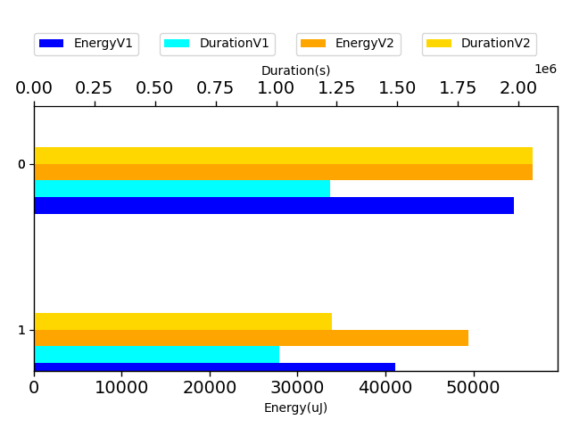

## com.google.gson.functional.ReadersWritersTest

| Test | IterationV1 | IterationV2 | DeltaIteration |
| --- | --- | --- | --- |
| com.google.gson.functional.ReadersWritersTest-testReadWriteTwoObjects | 79 | 72 | -7 |
| com.google.gson.functional.ReadersWritersTest-testReadWriteTwoStrings | 73 | 70 | -3 |

| Test | EnergyV1 | EnergyV2 | DeltaEnergy |
| --- | --- | --- | --- |
| com.google.gson.functional.ReadersWritersTest-testReadWriteTwoObjects | 45258.834098917236 | 48074.06058380297 | 2815.2264848857376 |
| com.google.gson.functional.ReadersWritersTest-testReadWriteTwoStrings | 43707.24197391942 | 58586.91290441498 | 14879.670930495558 |

| Test | DurationV1 | DurationsV2 | DeltaDuration |
| --- | --- | --- | --- |
| com.google.gson.functional.ReadersWritersTest-testReadWriteTwoObjects | 1120970.1490670575 | 1249213.9259176836 | 128243.7768506261 |
| com.google.gson.functional.ReadersWritersTest-testReadWriteTwoStrings | 1171508.3172362666 | 1214630.8280708543 | 43122.51083458774 |

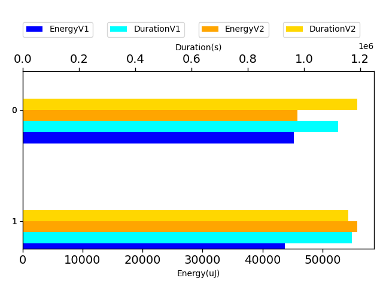

## com.google.gson.functional.StringTest

| Test | IterationV1 | IterationV2 | DeltaIteration |
| --- | --- | --- | --- |
| com.google.gson.functional.StringTest-testSingleQuoteInStringSerialization | 22 | 25 | 3 |
| com.google.gson.functional.StringTest-testEscapingQuotesInStringSerialization | 22 | 18 | -4 |

| Test | EnergyV1 | EnergyV2 | DeltaEnergy |
| --- | --- | --- | --- |
| com.google.gson.functional.StringTest-testSingleQuoteInStringSerialization | 107935.27064704895 | 100716.3525505662 | -7218.918096482754 |
| com.google.gson.functional.StringTest-testEscapingQuotesInStringSerialization | 45374.5299038887 | 44151.77991485596 | -1222.7499890327454 |

| Test | DurationV1 | DurationsV2 | DeltaDuration |
| --- | --- | --- | --- |
| com.google.gson.functional.StringTest-testSingleQuoteInStringSerialization | 3700602.0720882416 | 3259264.6416472793 | -441337.4304409623 |
| com.google.gson.functional.StringTest-testEscapingQuotesInStringSerialization | 454763.3052392006 | 354720.3785171509 | -100042.92672204971 |

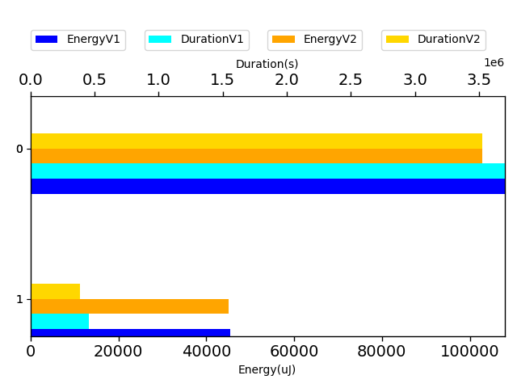

## com.google.gson.functional.PrimitiveTest

| Test | IterationV1 | IterationV2 | DeltaIteration |
| --- | --- | --- | --- |
| com.google.gson.functional.PrimitiveTest-testQuotedStringSerializationAndDeserialization | 28 | 21 | -7 |

| Test | EnergyV1 | EnergyV2 | DeltaEnergy |
| --- | --- | --- | --- |
| com.google.gson.functional.PrimitiveTest-testQuotedStringSerializationAndDeserialization | 38321.152698241174 | 41323.41347980499 | 3002.2607815638185 |

| Test | DurationV1 | DurationsV2 | DeltaDuration |
| --- | --- | --- | --- |
| com.google.gson.functional.PrimitiveTest-testQuotedStringSerializationAndDeserialization | 651928.3070741296 | 472433.4654560089 | -179494.84161812067 |

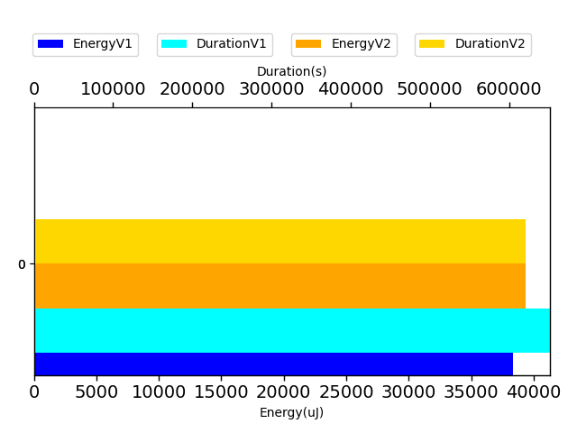

