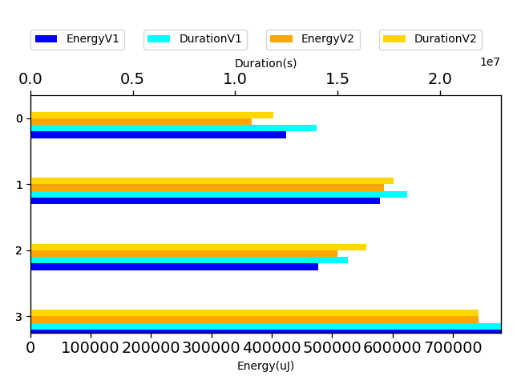
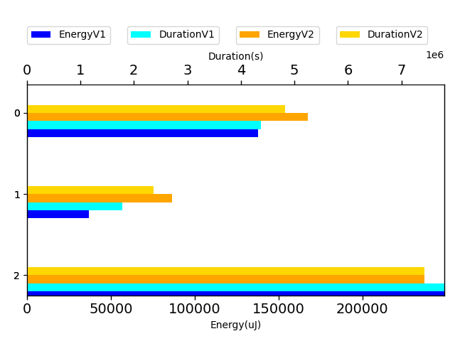
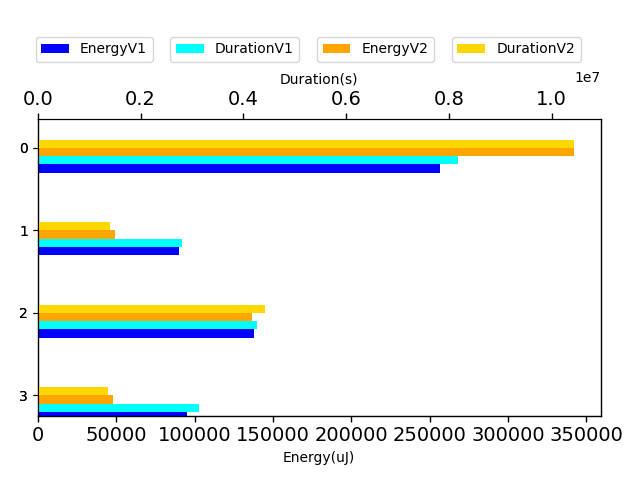
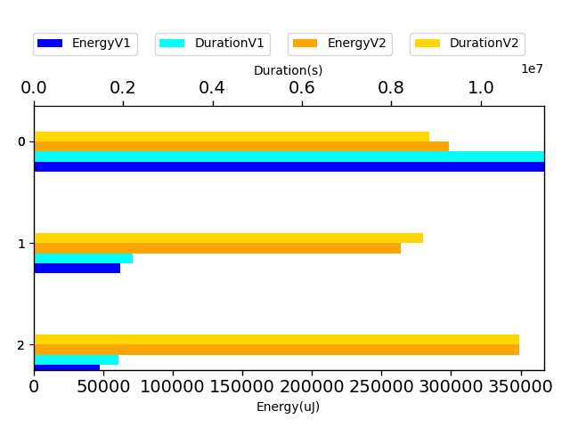
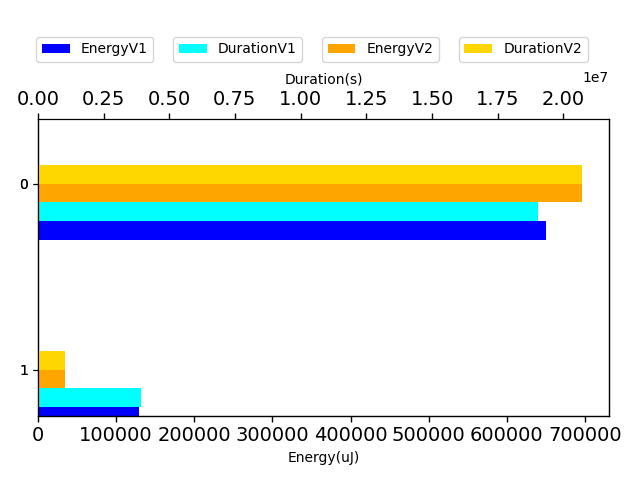

# gson 423ff0

https://github.com/google/gson.git/commit/423ff0

| Index | EnergyV1 | EnergyV2 | DeltaEnergy |
| --- | --- | --- | --- |
| 0 | 423439.7573649563 | 378602.6591282721 | -44837.09823668422 |
| 1 | 579552.4349118618 | 604829.4556090683 | 25277.02069720649 |
| 2 | 476550.5885742302 | 525512.2559136243 | 48961.6673393941 |
| 3 | 779587.8355838247 | 767123.1826623408 | -12464.652921483852 |

| Index | DurationV1 | DurationsV2 | DeltaDuration |
| --- | --- | --- | --- |
| 0 | 13957977.387656547 | 12377471.896118484 | -1580505.4915380627 |
| 1 | 18384363.307288587 | 18502280.829015866 | 117917.52172727883 |
| 2 | 15510966.643392215 | 17119494.19744525 | 1608527.5540530365 |
| 3 | 22965765.189824067 | 22832650.10991951 | -133115.07990455627 |

| Index | TestClassName | #Tests |
| --- | --- | --- |
| 0 | com.google.gson.functional.MapTest | 3 |
| 1 | com.google.gson.functional.NamingPolicyTest | 4 |
| 2 | com.google.gson.functional.MapAsArrayTypeAdapterTest | 3 |
| 3 | com.google.gson.functional.FieldNamingTest | 2 |

| Time Label | Time (s) |
| --- | --- |
| Selection | 33.77347683906555 |
| Injection | 14.019433975219727 |
| Total | 1373.1203353404999 |
## com.google.gson.functional.MapTest

| Test | IterationV1 | IterationV2 | DeltaIteration |
| --- | --- | --- | --- |
| com.google.gson.functional.MapTest-testInterfaceTypeMapWithSerializer | 99 | 99 | 0 |
| com.google.gson.functional.MapTest-testGeneralMapField | 99 | 99 | 0 |
| com.google.gson.functional.MapTest-testInterfaceTypeMap | 99 | 99 | 0 |

| Test | EnergyV1 | EnergyV2 | DeltaEnergy |
| --- | --- | --- | --- |
| com.google.gson.functional.MapTest-testInterfaceTypeMapWithSerializer | 137744.08718636833 | 129211.388623925 | -8532.69856244333 |
| com.google.gson.functional.MapTest-testGeneralMapField | 36831.197909896226 | 66595.57112045705 | 29764.37321056083 |
| com.google.gson.functional.MapTest-testInterfaceTypeMap | 248864.47226869172 | 182795.69938389 | -66068.77288480173 |

| Test | DurationV1 | DurationsV2 | DeltaDuration |
| --- | --- | --- | --- |
| com.google.gson.functional.MapTest-testInterfaceTypeMapWithSerializer | 4374038.283371556 | 4081428.3168740207 | -292609.9664975349 |
| com.google.gson.functional.MapTest-testGeneralMapField | 1780943.8146063713 | 2005027.2348414315 | 224083.42023506016 |
| com.google.gson.functional.MapTest-testInterfaceTypeMap | 7802995.289678621 | 6291016.344403032 | -1511978.945275589 |

## com.google.gson.functional.NamingPolicyTest

| Test | IterationV1 | IterationV2 | DeltaIteration |
| --- | --- | --- | --- |
| com.google.gson.functional.NamingPolicyTest-testGsonWithNonDefaultFieldNamingPolicySerialization | 85 | 85 | 0 |
| com.google.gson.functional.NamingPolicyTest-testGsonWithUpperCamelCaseSpacesPolicyDeserialiation | 59 | 50 | -9 |
| com.google.gson.functional.NamingPolicyTest-testGsonWithNonDefaultFieldNamingPolicyDeserialiation | 86 | 86 | 0 |
| com.google.gson.functional.NamingPolicyTest-testGsonWithUpperCamelCaseSpacesPolicySerialiation | 53 | 52 | -1 |

| Test | EnergyV1 | EnergyV2 | DeltaEnergy |
| --- | --- | --- | --- |
| com.google.gson.functional.NamingPolicyTest-testGsonWithNonDefaultFieldNamingPolicySerialization | 256807.19977631018 | 359146.60909697594 | 102339.40932066576 |
| com.google.gson.functional.NamingPolicyTest-testGsonWithUpperCamelCaseSpacesPolicyDeserialiation | 89786.08478339207 | 51720.75956277971 | -38065.32522061236 |
| com.google.gson.functional.NamingPolicyTest-testGsonWithNonDefaultFieldNamingPolicyDeserialiation | 138005.80305502223 | 143545.90476692916 | 5540.101711906929 |
| com.google.gson.functional.NamingPolicyTest-testGsonWithUpperCamelCaseSpacesPolicySerialiation | 94953.34729713725 | 50416.18218238348 | -44537.16511475377 |

| Test | DurationV1 | DurationsV2 | DeltaDuration |
| --- | --- | --- | --- |
| com.google.gson.functional.NamingPolicyTest-testGsonWithNonDefaultFieldNamingPolicySerialization | 8168500.578666223 | 10954434.323005036 | 2785933.7443388123 |
| com.google.gson.functional.NamingPolicyTest-testGsonWithUpperCamelCaseSpacesPolicyDeserialiation | 2815644.720673862 | 1468496.7571382183 | -1347147.9635356436 |
| com.google.gson.functional.NamingPolicyTest-testGsonWithNonDefaultFieldNamingPolicyDeserialiation | 4258702.0982944695 | 4636437.134558841 | 377735.0362643711 |
| com.google.gson.functional.NamingPolicyTest-testGsonWithUpperCamelCaseSpacesPolicySerialiation | 3141515.9096540343 | 1442912.614313772 | -1698603.2953402624 |

## com.google.gson.functional.MapAsArrayTypeAdapterTest

| Test | IterationV1 | IterationV2 | DeltaIteration |
| --- | --- | --- | --- |
| com.google.gson.functional.MapAsArrayTypeAdapterTest-testMultipleEnableComplexKeyRegistrationHasNoEffect | 89 | 91 | 2 |
| com.google.gson.functional.MapAsArrayTypeAdapterTest-testSerializeComplexMapWithTypeAdapter | 99 | 99 | 0 |
| com.google.gson.functional.MapAsArrayTypeAdapterTest-testMapWithTypeVariableSerialization | 99 | 99 | 0 |

| Test | EnergyV1 | EnergyV2 | DeltaEnergy |
| --- | --- | --- | --- |
| com.google.gson.functional.MapAsArrayTypeAdapterTest-testMultipleEnableComplexKeyRegistrationHasNoEffect | 366651.1454147426 | 172099.53730710346 | -194551.60810763913 |
| com.google.gson.functional.MapAsArrayTypeAdapterTest-testSerializeComplexMapWithTypeAdapter | 62425.389924058305 | 152092.65512593347 | 89667.26520187515 |
| com.google.gson.functional.MapAsArrayTypeAdapterTest-testMapWithTypeVariableSerialization | 47474.05323542931 | 201320.06348058736 | 153846.01024515805 |

| Test | DurationV1 | DurationsV2 | DeltaDuration |
| --- | --- | --- | --- |
| com.google.gson.functional.MapAsArrayTypeAdapterTest-testMultipleEnableComplexKeyRegistrationHasNoEffect | 11409685.003062816 | 5327812.734874029 | -6081872.268188788 |
| com.google.gson.functional.MapAsArrayTypeAdapterTest-testSerializeComplexMapWithTypeAdapter | 2212453.2818083735 | 5245227.641948329 | 3032774.3601399558 |
| com.google.gson.functional.MapAsArrayTypeAdapterTest-testMapWithTypeVariableSerialization | 1888828.3585210238 | 6546453.820622892 | 4657625.462101868 |

## com.google.gson.functional.FieldNamingTest

| Test | IterationV1 | IterationV2 | DeltaIteration |
| --- | --- | --- | --- |
| com.google.gson.functional.FieldNamingTest-testUpperCamelCase | 88 | 86 | -2 |
| com.google.gson.functional.FieldNamingTest-testUpperCamelCaseWithSpaces | 70 | 74 | 4 |

| Test | EnergyV1 | EnergyV2 | DeltaEnergy |
| --- | --- | --- | --- |
| com.google.gson.functional.FieldNamingTest-testUpperCamelCase | 650317.5118610451 | 730619.0062030219 | 80301.49434197671 |
| com.google.gson.functional.FieldNamingTest-testUpperCamelCaseWithSpaces | 129270.32372277947 | 36504.17645931891 | -92766.14726346056 |

| Test | DurationV1 | DurationsV2 | DeltaDuration |
| --- | --- | --- | --- |
| com.google.gson.functional.FieldNamingTest-testUpperCamelCase | 19034117.406332664 | 21730349.128470276 | 2696231.7221376114 |
| com.google.gson.functional.FieldNamingTest-testUpperCamelCaseWithSpaces | 3931647.7834914033 | 1102300.9814492336 | -2829346.8020421695 |

