# gson 8101ab

https://github.com/google/gson.git/commit/8101ab

## Delta Energy per test method

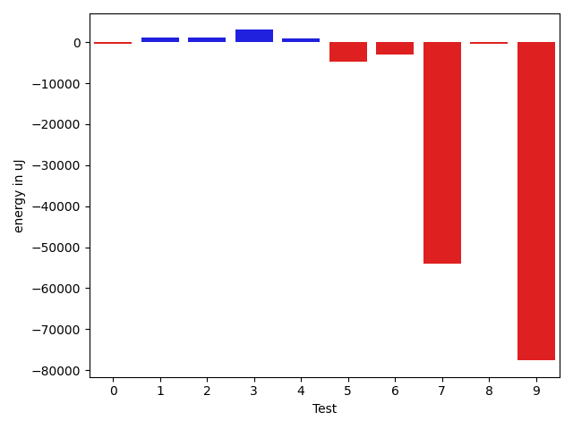

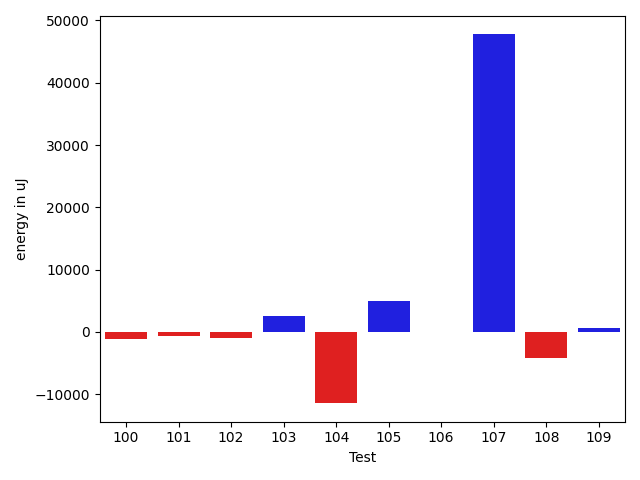

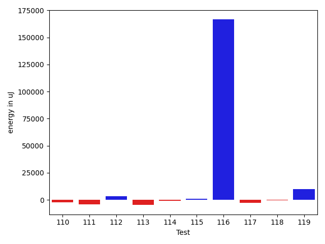

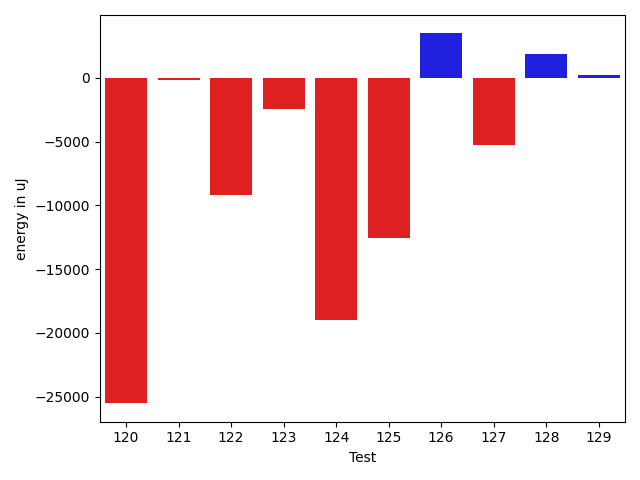

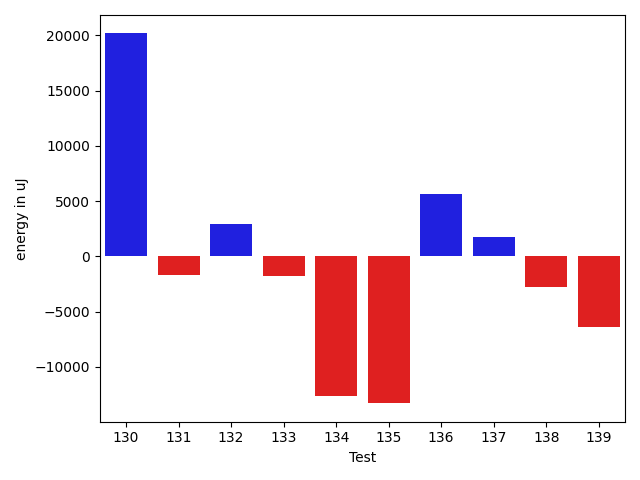

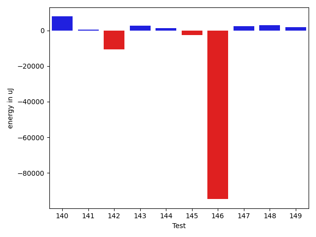

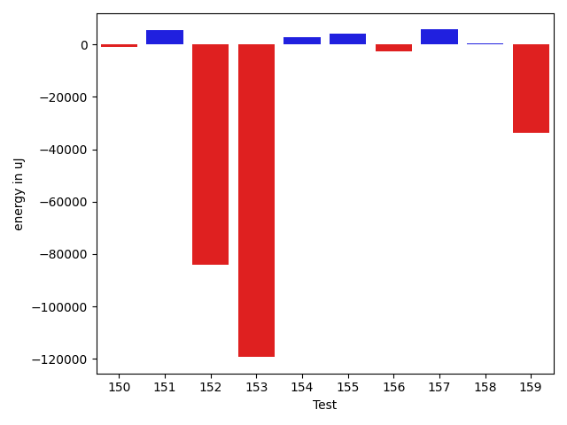

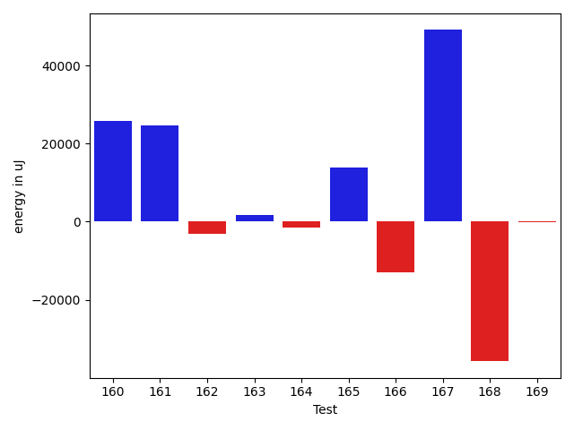

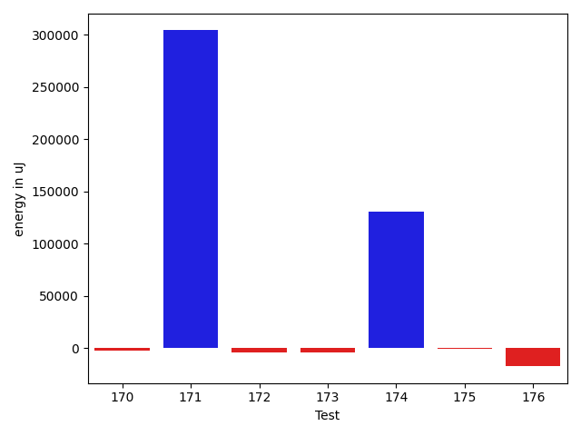

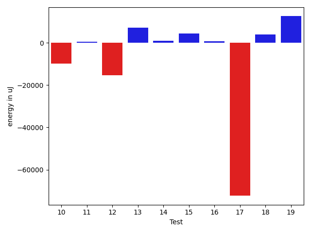

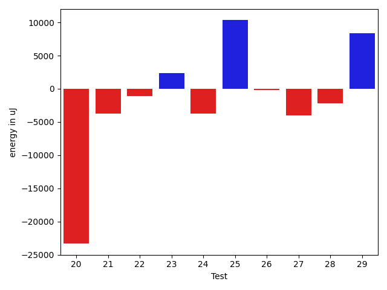

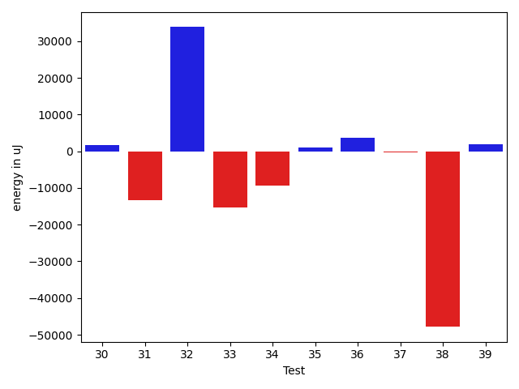

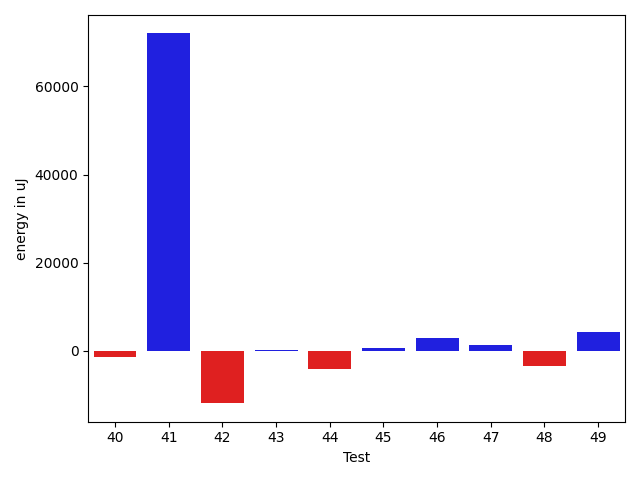

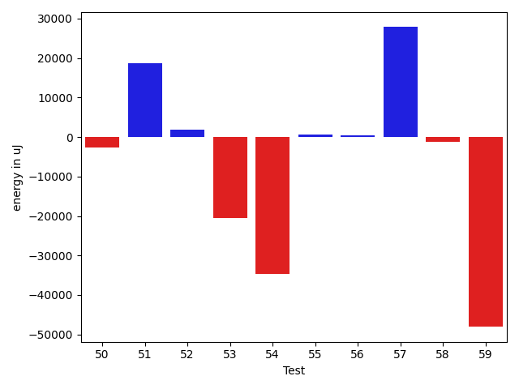

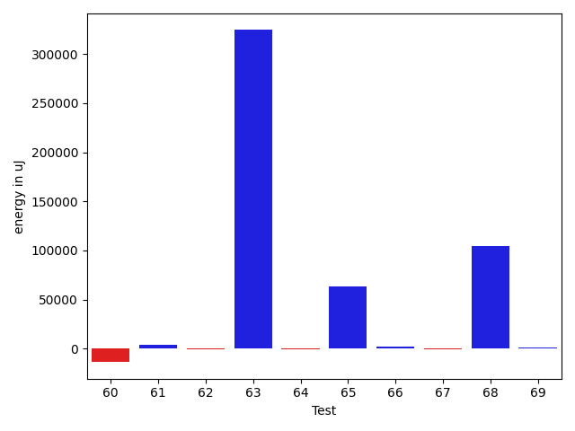

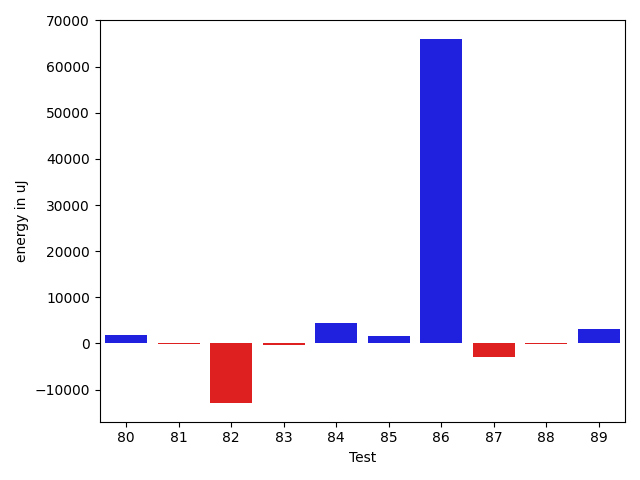

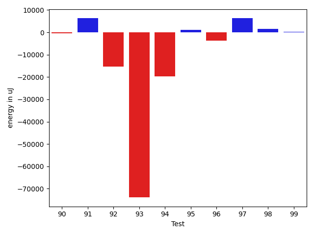

| ID | EnergyV1 | EnergyV2 | DeltaEnergy |
| --- | --- | --- | --- |
| 0 | 43078.551080351404 | 42655.144192950684 | -423.40688740072073 |
| 1 | 42868.34615373862 | 44048.140484002855 | 1179.794330264238 |
| 2 | 42540.52747038209 | 43688.166185527385 | 1147.6387151452946 |
| 3 | 42223.947206838755 | 45236.994642505575 | 3013.04743566682 |
| 4 | 42998.65972194623 | 44038.887429735594 | 1040.2277077893668 |
| 5 | 45754.135261637966 | 41023.61714895459 | -4730.518112683378 |
| 6 | 45746.66423932191 | 42788.763585049484 | -2957.9006542724237 |
| 7 | 96972.41707470955 | 42892.966225230135 | -54079.45084947941 |
| 8 | 42686.556327390485 | 42403.90861880011 | -282.64770859037526 |
| 9 | 120984.6744120337 | 43340.98961702784 | -77643.68479500586 |
| 10 | 52759.658390820725 | 42950.94753714532 | -9808.710853675402 |
| 11 | 43911.52434495867 | 44294.23612682635 | 382.7117818676779 |
| 12 | 57484.79379213569 | 42082.15668707125 | -15402.637105064445 |
| 13 | 38878.43113180428 | 46114.04989826391 | 7235.618766459629 |
| 14 | 41427.06641197324 | 42295.13537237012 | 868.0689603968785 |
| 15 | 41970.84348692546 | 46248.07941314993 | 4277.2359262244645 |
| 16 | 43893.55809116974 | 44647.929243788356 | 754.3711526186162 |
| 17 | 126831.56884566386 | 54519.07625327035 | -72312.49259239351 |
| 18 | 37281.04061770439 | 41162.26660823822 | 3881.2259905338287 |
| 19 | 56940.67538271478 | 69469.43019728681 | 12528.754814572036 |
| 20 | 71497.8017068064 | 48167.12867808657 | -23330.673028719822 |
| 21 | 45906.90867399887 | 42149.95766454724 | -3756.95100945163 |
| 22 | 42641.184440135956 | 41558.95011917059 | -1082.2343209653627 |
| 23 | 44596.012537062896 | 46974.80101064973 | 2378.7884735868356 |
| 24 | 43786.37463378906 | 40080.199462890625 | -3706.1751708984375 |
| 25 | 43358.670424169024 | 53693.06467800595 | 10334.394253836923 |
| 26 | 45106.96538707102 | 44917.93088391726 | -189.03450315375812 |
| 27 | 45103.24280273753 | 41084.46665966507 | -4018.7761430724568 |
| 28 | 109713.96063231089 | 107483.16333199038 | -2230.7973003205116 |
| 29 | 42489.299797058105 | 50849.09321594238 | 8359.793418884277 |
| 30 | 42331.00592621369 | 44054.72499932349 | 1723.7190731097944 |
| 31 | 99900.62923702803 | 86578.1985982228 | -13322.430638805221 |
| 32 | 45313.94101199634 | 79152.92935655505 | 33838.988344558704 |
| 33 | 58369.54411000433 | 43039.60127318412 | -15329.942836820213 |
| 34 | 57951.6557582423 | 48506.09954525891 | -9445.556212983385 |
| 35 | 43248.776183589885 | 44245.15458590718 | 996.3784023172921 |
| 36 | 42800.58327330435 | 46403.114479137985 | 3602.531205833635 |
| 37 | 44395.03998387377 | 44158.93761955726 | -236.10236431650992 |
| 38 | 90305.17244938765 | 42462.83804635928 | -47842.33440302838 |
| 39 | 43232.15382517664 | 45170.360617114 | 1938.2067919373585 |
| 40 | 44922.23401374226 | 43553.187980361996 | -1369.046033380262 |
| 41 | 361138.17309446435 | 433144.49300014565 | 72006.3199056813 |
| 42 | 57585.36327485054 | 45726.8737585436 | -11858.489516306938 |
| 43 | 40991.14173176867 | 41128.32238829136 | 137.18065652268706 |
| 44 | 45733.74815065222 | 41552.442489925525 | -4181.305660726699 |
| 45 | 44217.01817321777 | 44848.87325984053 | 631.8550866227597 |
| 46 | 42221.325716369145 | 45253.43777809486 | 3032.1120617257184 |
| 47 | 41132.32515716553 | 42540.69693815708 | 1408.3717809915543 |
| 48 | 46563.82811945535 | 43115.6289968011 | -3448.1991226542523 |
| 49 | 38595.81503429543 | 42897.514381587505 | 4301.699347292073 |
| 50 | 44200.60362589732 | 41624.87048598379 | -2575.733139913529 |
| 51 | 43585.9617167376 | 62313.01814130321 | 18727.056424565613 |
| 52 | 42554.068557560444 | 44435.72971665859 | 1881.6611590981483 |
| 53 | 70147.6691549455 | 49582.808424758485 | -20564.860730187014 |
| 54 | 79229.57426449117 | 44517.26757522268 | -34712.30668926849 |
| 55 | 41797.71428779628 | 42524.69762169257 | 726.9833338962853 |
| 56 | 44336.21031980928 | 44834.2585314895 | 498.0482116802159 |
| 57 | 38627.626838202596 | 66453.41320669324 | 27825.78636849064 |
| 58 | 47440.97509703698 | 46222.4151001429 | -1218.5599968940805 |
| 59 | 179195.74330636405 | 131136.95834074577 | -48058.78496561828 |
| 60 | 54634.13208228042 | 41009.67082011487 | -13624.461262165547 |
| 61 | 40936.00368963768 | 45007.68978533332 | 4071.6860956956443 |
| 62 | 43651.46858994485 | 43357.95266691615 | -293.5159230287027 |
| 63 | 48234.438079833984 | 372720.81640625 | 324486.378326416 |
| 64 | 40026.04086633354 | 39711.675283957695 | -314.3655823758454 |
| 65 | 83297.07061595746 | 147125.05694934767 | 63827.9863333902 |
| 66 | 42867.113560602476 | 44964.79513827338 | 2097.6815776709045 |
| 67 | 44914.234354138134 | 44649.87953329286 | -264.3548208452776 |
| 68 | 97701.97927321083 | 202257.4486806566 | 104555.46940744578 |
| 69 | 43734.577480226755 | 44666.37773984601 | 931.8002596192528 |
| 70 | 39470.98293860292 | 41627.06379940891 | 2156.080860805989 |
| 71 | 42351.8592538028 | 46746.63002058168 | 4394.770766778878 |
| 72 | 75563.01361794857 | 45565.37275285459 | -29997.640865093977 |
| 73 | 37844.146653516655 | 41471.85967852927 | 3627.713025012614 |
| 74 | 44523.17672276497 | 45030.10233211517 | 506.92560935020447 |
| 75 | 49802.83979963771 | 63282.61090453158 | 13479.771104893873 |
| 76 | 41617.90547260507 | 43304.98483391445 | 1687.0793613093847 |
| 77 | 42708.72759458494 | 43654.22142912244 | 945.4938345374976 |
| 78 | 43770.85231110855 | 43426.04031523747 | -344.8119958710813 |
| 79 | 49619.18596762679 | 41635.18038439945 | -7984.005583227343 |
| 80 | 40514.03739070892 | 42304.70176696777 | 1790.66437625885 |
| 81 | 47105.73742234707 | 46876.91016556253 | -228.82725678454153 |
| 82 | 58192.09750366211 | 45172.44707489014 | -13019.650428771973 |
| 83 | 45346.17531812191 | 44947.51113677025 | -398.6641813516617 |
| 84 | 37791.84152889252 | 42204.667739868164 | 4412.826210975647 |
| 85 | 43158.587196588516 | 44700.4111328125 | 1541.8239362239838 |
| 86 | 44147.97797429422 | 110241.04269554392 | 66093.0647212497 |
| 87 | 45065.569455340505 | 42093.05741428399 | -2972.512041056514 |
| 88 | 44079.06136083603 | 43950.0280714035 | -129.03328943252563 |
| 89 | 43005.19974611653 | 46075.07363346219 | 3069.8738873456605 |
| 90 | 46029.23942643404 | 45654.974573135376 | -374.2648532986641 |
| 91 | 45747.11070235493 | 52119.51580468392 | 6372.405102328994 |
| 92 | 76082.71535282637 | 60828.15435773428 | -15254.560995092092 |
| 93 | 120354.1145520253 | 46391.17223556897 | -73962.94231645633 |
| 94 | 79761.36219156312 | 60090.44844522509 | -19670.913746338032 |
| 95 | 46088.494679151016 | 47247.560217824044 | 1159.0655386730286 |
| 96 | 47733.95685058832 | 43950.13146287203 | -3783.8253877162933 |
| 97 | 41201.60998460008 | 47522.055439526855 | 6320.445454926776 |
| 98 | 42778.01573989447 | 44350.899903457146 | 1572.884163562674 |
| 99 | 43932.09061414376 | 44129.528121858835 | 197.4375077150762 |
| 100 | 44669.16227340698 | 43449.969289527275 | -1219.1929838797078 |
| 101 | 43314.18071490526 | 42665.46293436224 | -648.7177805430256 |
| 102 | 44921.1397895515 | 43864.85191618814 | -1056.2878733633552 |
| 103 | 43227.36424716802 | 45763.483566914554 | 2536.1193197465327 |
| 104 | 75934.26322802767 | 64464.300704337744 | -11469.96252368993 |
| 105 | 39274.136849087445 | 44239.93532933257 | 4965.798480245125 |
| 106 | 41836.159380157944 | 41762.45994210737 | -73.69943805057119 |
| 107 | 133608.09165770645 | 181399.56241827304 | 47791.47076056659 |
| 108 | 39885.56776337431 | 35636.33485298875 | -4249.232910385559 |
| 109 | 40862.91585718671 | 41559.76897194554 | 696.8531147588292 |
| 110 | 40827.83302934791 | 38694.40855921394 | -2133.4244701339703 |
| 111 | 44804.98059844971 | 40855.7781124115 | -3949.202486038208 |
| 112 | 44502.55649708254 | 47750.98236679117 | 3248.425869708626 |
| 113 | 43868.47541398404 | 39061.527587674136 | -4806.947826309901 |
| 114 | 37967.24286203027 | 37084.66758794246 | -882.5752740878088 |
| 115 | 40618.296598523855 | 41563.26825691649 | 944.9716583926347 |
| 116 | 43733.37967287326 | 210284.9958206569 | 166551.61614778364 |
| 117 | 43157.43411026044 | 40638.92761271104 | -2518.506497549395 |
| 118 | 44775.1123046875 | 44636.71028137207 | -138.4020233154297 |
| 119 | 46007.28063590721 | 55885.47545079343 | 9878.194814886214 |
| 120 | 136954.4660390925 | 111437.76166524307 | -25516.70437384944 |
| 121 | 43739.26806640625 | 43546.5390625 | -192.72900390625 |
| 122 | 157837.34812688836 | 148622.3810526317 | -9214.967074256652 |
| 123 | 46341.18726093424 | 43909.18346328914 | -2432.0037976450985 |
| 124 | 90072.21422169684 | 71119.00173883222 | -18953.21248286462 |
| 125 | 58763.72314426838 | 46195.873763062424 | -12567.849381205953 |
| 126 | 41677.02930355114 | 45148.49670601289 | 3471.467402461749 |
| 127 | 61608.237936493904 | 56312.52102485605 | -5295.716911637857 |
| 128 | 43486.15360671282 | 45375.416896641254 | 1889.2632899284363 |
| 129 | 45043.21326303482 | 45299.200067043304 | 255.9868040084839 |
| 130 | 43047.86642310063 | 63211.07412390523 | 20163.207700804596 |
| 131 | 48342.579868372966 | 46680.44131872078 | -1662.1385496521834 |
| 132 | 56332.37476510579 | 59270.88372313084 | 2938.5089580250497 |
| 133 | 45455.77193135049 | 43712.77935686032 | -1742.9925744901702 |
| 134 | 60340.52165589188 | 47719.525102369334 | -12620.996553522542 |
| 135 | 60799.44397183483 | 47504.793726193035 | -13294.650245641795 |
| 136 | 69160.75570619106 | 74834.49358052947 | 5673.737874338403 |
| 137 | 39764.48893356323 | 41534.30262207985 | 1769.8136885166168 |
| 138 | 44392.26654815674 | 41601.15139770508 | -2791.11515045166 |
| 139 | 57175.11063751951 | 50809.29260253906 | -6365.818034980446 |
| 140 | 38357.923767089844 | 46258.156494140625 | 7900.232727050781 |
| 141 | 41651.85353088379 | 42106.83630371094 | 454.98277282714844 |
| 142 | 52100.059576880114 | 41486.55846646744 | -10613.501110412675 |
| 143 | 43243.078063964844 | 45980.030517578125 | 2736.9524536132812 |
| 144 | 41365.31000047922 | 42684.853454589844 | 1319.5434541106224 |
| 145 | 42521.98100244999 | 40110.12597067654 | -2411.855031773448 |
| 146 | 204290.5539352418 | 109521.96462791084 | -94768.58930733096 |
| 147 | 41786.256357289014 | 44285.19493843995 | 2498.9385811509346 |
| 148 | 41059.98581516196 | 44138.99737326885 | 3079.0115581068894 |
| 149 | 41023.50574976106 | 42944.51004203348 | 1921.004292272417 |
| 150 | 43511.64834568053 | 42457.284319135375 | -1054.364026545154 |
| 151 | 38761.40249540988 | 44117.592886118175 | 5356.190390708296 |
| 152 | 126710.62940283824 | 42615.69373758017 | -84094.93566525806 |
| 153 | 161369.07755450963 | 42080.52028858221 | -119288.55726592742 |
| 154 | 39367.3106301222 | 42283.45428715274 | 2916.1436570305377 |
| 155 | 39681.87789637387 | 43880.01176452264 | 4198.133868148769 |
| 156 | 47576.02254676819 | 45125.32823181152 | -2450.694314956665 |
| 157 | 41874.12191615082 | 47548.2653006504 | 5674.143384499577 |
| 158 | 39811.618243032426 | 40091.62887917989 | 280.0106361474609 |
| 159 | 118060.92638567305 | 84479.78021419352 | -33581.14617147953 |
| 160 | 65980.53328148578 | 91756.4215674618 | 25775.88828597602 |
| 161 | 64435.65987391447 | 89003.13006938771 | 24567.470195473245 |
| 162 | 47033.49575413203 | 43814.542811209336 | -3218.952942922697 |
| 163 | 45017.67704987526 | 46626.89816093445 | 1609.2211110591888 |
| 164 | 44868.755219742656 | 43315.28650724888 | -1553.4687124937773 |
| 165 | 54836.1412395128 | 68601.99574127643 | 13765.854501763635 |
| 166 | 65472.092739296146 | 52383.11935946345 | -13088.973379832692 |
| 167 | 79868.7162242727 | 128936.69661729278 | 49067.98039302007 |
| 168 | 103648.33730876062 | 67890.84438323793 | -35757.49292552269 |
| 169 | 43400.12469699852 | 43248.51777560264 | -151.60692139588355 |
| 170 | 45380.324194329834 | 42938.683189389514 | -2441.6410049403203 |
| 171 | 71909.69547186825 | 375860.1269411409 | 303950.43146927265 |
| 172 | 45211.73378053806 | 41243.87399171281 | -3967.859788825248 |
| 173 | 43308.97851615865 | 39592.387609605605 | -3716.590906553043 |
| 174 | 252439.81808323477 | 383044.9834727944 | 130605.16538955964 |
| 175 | 42389.73348603048 | 42011.04676207948 | -378.68672395100293 |
| 176 | 59578.39313901664 | 42200.704257786274 | -17377.688881230366 |

## Delta Duration per test method

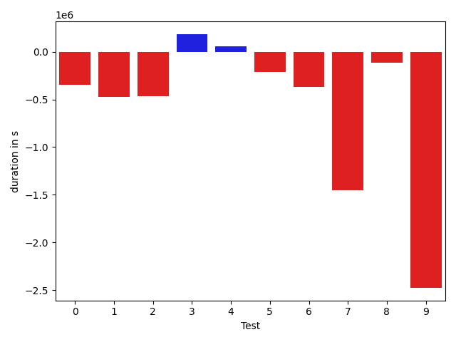

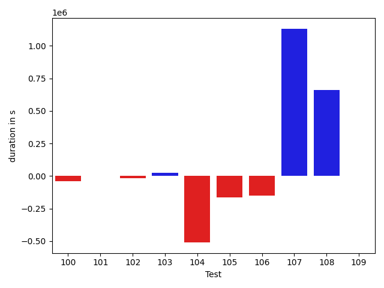

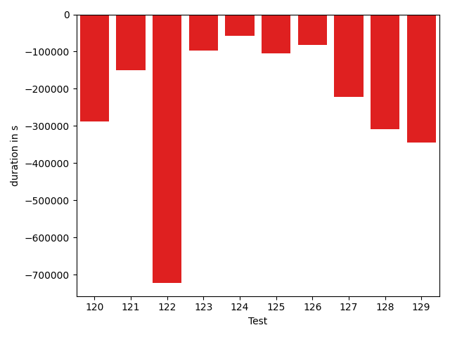

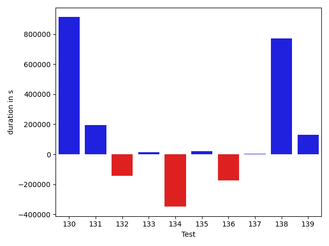

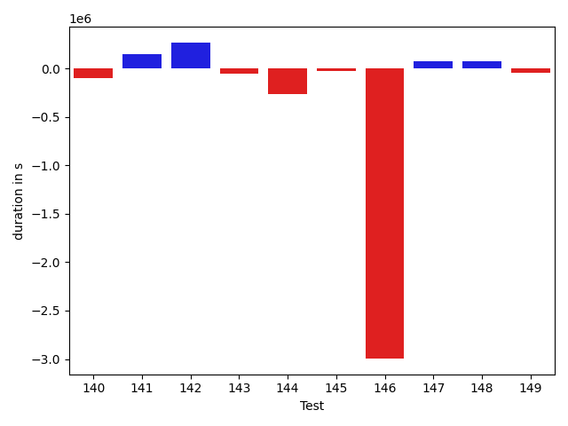

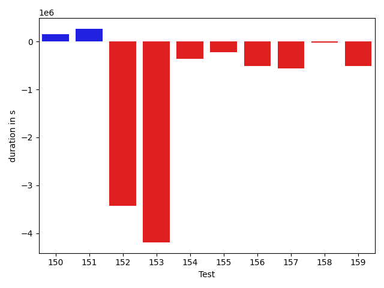

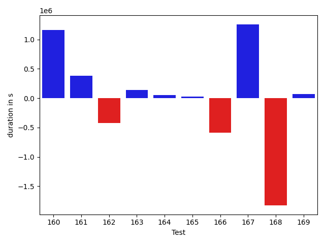

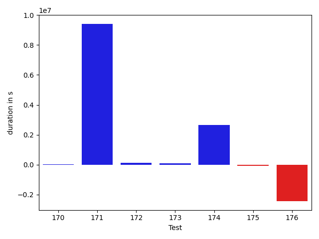

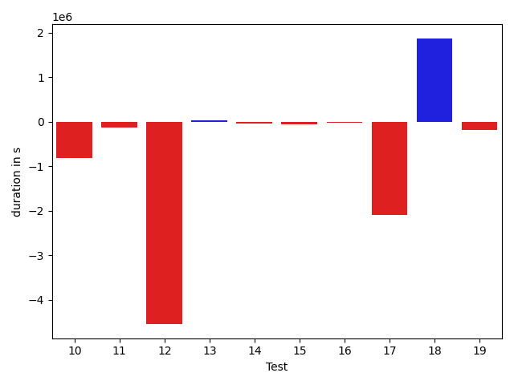

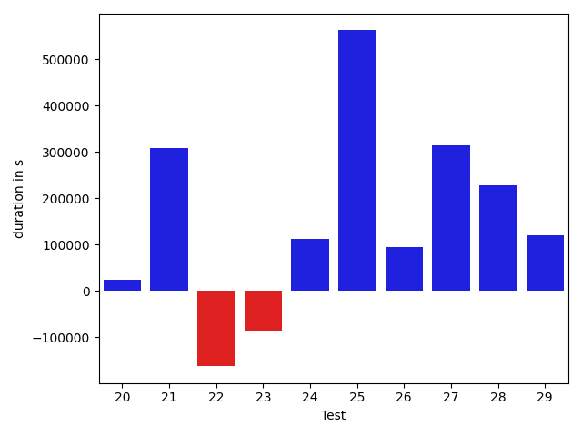

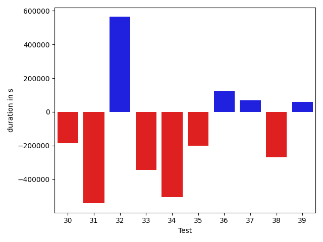

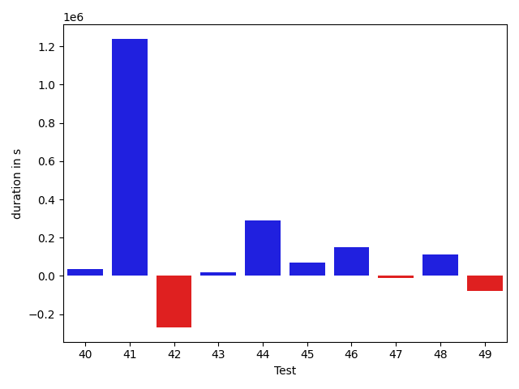

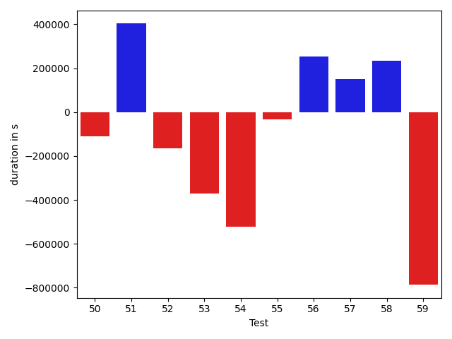

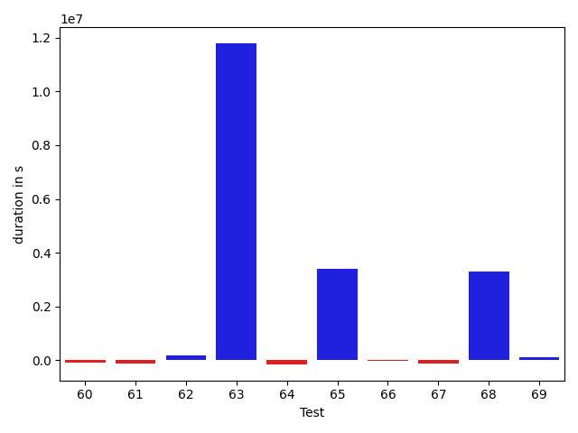

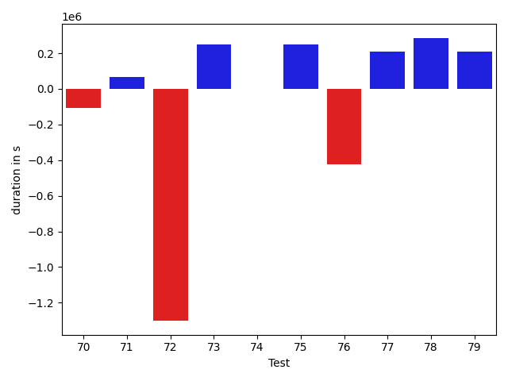

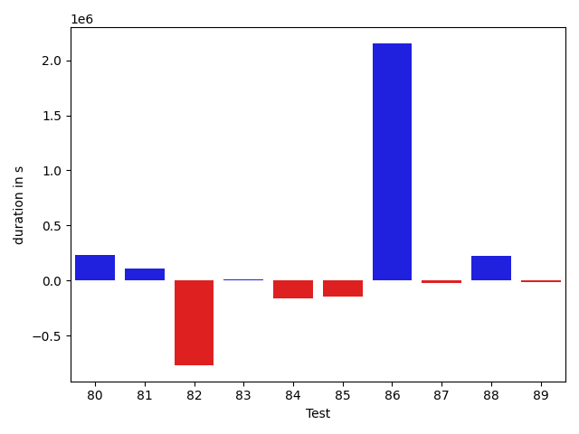

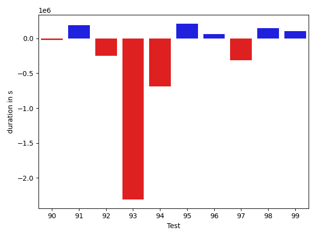

| ID | DurationV1 | DurationsV2 | DeltaDuration |
| --- | --- | --- | --- |
| 0 | 1151557.6384753578 | 806651.0848935938 | -344906.553581764 |
| 1 | 1164156.7637262752 | 689623.9473497763 | -474532.8163764989 |
| 2 | 1284464.5403808192 | 821015.0181824054 | -463449.52219841385 |
| 3 | 755199.3781008441 | 939552.5524168208 | 184353.17431597668 |
| 4 | 1185950.7522568114 | 1240905.6868248964 | 54954.93456808501 |
| 5 | 1403772.8043416608 | 1189798.8276309073 | -213973.97671075352 |
| 6 | 1432275.4346878706 | 1065866.2120507897 | -366409.2226370808 |
| 7 | 2480943.432181909 | 1027110.1190109674 | -1453833.3131709418 |
| 8 | 714077.0163064623 | 595715.0628059863 | -118361.95350047608 |
| 9 | 3281007.396355909 | 804658.9215157799 | -2476348.474840129 |
| 10 | 1522121.4085513589 | 709792.3727208318 | -812329.0358305271 |
| 11 | 1111406.5591510336 | 974279.5607384533 | -137126.99841258035 |
| 12 | 5382420.592727033 | 842712.1170352654 | -4539708.475691768 |
| 13 | 724095.9439203143 | 749583.690868757 | 25487.746948442655 |
| 14 | 851364.4242077078 | 811722.1561098368 | -39642.26809787098 |
| 15 | 722457.5488748953 | 657743.5053691596 | -64714.043505735695 |
| 16 | 574576.9982145323 | 544890.9319444608 | -29686.06627007143 |
| 17 | 3182761.8579850416 | 1097774.8004328925 | -2084987.057552149 |
| 18 | 636050.2968081534 | 2505987.5430808067 | 1869937.2462726533 |
| 19 | 1584113.5071953489 | 1392818.206665741 | -191295.3005296078 |
| 20 | 1328818.0859979289 | 1353042.0501690833 | 24223.964171154425 |
| 21 | 1202773.2522316827 | 1511225.9018428666 | 308452.6496111839 |
| 22 | 681777.8135025501 | 518619.0622039654 | -163158.75129858474 |
| 23 | 831434.910436189 | 744865.6700663955 | -86569.2403697935 |
| 24 | 397885.4968261719 | 510593.52014160156 | 112708.02331542969 |
| 25 | 681718.4603084086 | 1244489.2325584423 | 562770.7722500337 |
| 26 | 501157.3442901338 | 596293.9400277119 | 95136.59573757811 |
| 27 | 638812.6121967108 | 953674.6218297232 | 314862.00963301247 |
| 28 | 2614905.341387355 | 2843524.7109476426 | 228619.3695602878 |
| 29 | 479642.0158653259 | 599964.8737869263 | 120322.85792160034 |
| 30 | 721341.5690408046 | 535371.5237041302 | -185970.04533667443 |
| 31 | 2709066.359147852 | 2166547.585314479 | -542518.7738333726 |
| 32 | 1083901.7202034001 | 1647691.7756586066 | 563790.0554552064 |
| 33 | 1714113.5339757435 | 1368571.3844808757 | -345542.1494948678 |
| 34 | 1288705.8381243162 | 782073.2262491023 | -506632.6118752139 |
| 35 | 831392.7391374484 | 631048.4275302694 | -200344.311607179 |
| 36 | 911765.5070447542 | 1034525.9926281023 | 122760.48558334808 |
| 37 | 1164432.6841702654 | 1232833.9530730625 | 68401.26890279702 |
| 38 | 2062280.6774142622 | 1792015.223476889 | -270265.4539373731 |
| 39 | 712573.618250439 | 773117.5140549884 | 60543.89580454945 |
| 40 | 903829.429611934 | 938924.642038028 | 35095.21242609399 |
| 41 | 9110439.135991294 | 10349748.171043701 | 1239309.0350524075 |
| 42 | 1620178.053008086 | 1351300.730714708 | -268877.32229337795 |
| 43 | 638403.5117347123 | 658486.2532528043 | 20082.741518091992 |
| 44 | 1183665.7230019881 | 1473749.806778898 | 290084.08377690986 |
| 45 | 546929.9297626019 | 616090.2213433702 | 69160.2915807683 |
| 46 | 754198.072740207 | 903922.607234512 | 149724.53449430503 |
| 47 | 493520.7127761841 | 483387.75856781006 | -10132.954208374023 |
| 48 | 927364.5239816301 | 1040245.0689804237 | 112880.54499879363 |
| 49 | 605351.9887184529 | 526908.7651889324 | -78443.22352952044 |
| 50 | 614356.1472931914 | 503924.1016297806 | -110432.0456634108 |
| 51 | 683498.7223429047 | 1086346.201698035 | 402847.47935513034 |
| 52 | 641055.3914882541 | 475612.3124717474 | -165443.07901650667 |
| 53 | 2257908.030329834 | 1887471.9960759813 | -370436.0342538529 |
| 54 | 1931230.0535480897 | 1410424.6870866306 | -520805.3664614591 |
| 55 | 1184780.4863643122 | 1153008.0741044385 | -31772.4122598737 |
| 56 | 879836.1635963137 | 1133646.604550261 | 253810.44095394737 |
| 57 | 1341619.3762800402 | 1491354.931454328 | 149735.55517428764 |
| 58 | 1062650.6326746726 | 1296069.7766994208 | 233419.14402474812 |
| 59 | 4181977.9367890498 | 3395268.3898221124 | -786709.5469669374 |
| 60 | 1321126.734947756 | 1225956.925557103 | -95169.80939065292 |
| 61 | 845803.0436674495 | 712559.0964201839 | -133243.9472472656 |
| 62 | 615743.7041136833 | 789559.0567183731 | 173815.35260468978 |
| 63 | 524400.3715515137 | 12317786.896484375 | 11793386.524932861 |
| 64 | 1124678.3541411741 | 971179.4635968423 | -153498.89054433187 |
| 65 | 1737641.9072709114 | 5143439.196922239 | 3405797.2896513278 |
| 66 | 749237.431388828 | 727224.2679918112 | -22013.16339701682 |
| 67 | 762750.3533984064 | 654606.4154831093 | -108143.93791529711 |
| 68 | 2525206.7519287607 | 5836998.233586055 | 3311791.4816572946 |
| 69 | 474062.19134008884 | 570784.5333548622 | 96722.3420147734 |
| 70 | 938842.4783597399 | 832668.8405440392 | -106173.63781570073 |
| 71 | 514459.7159284351 | 581407.7920606025 | 66948.07613216736 |
| 72 | 2048012.3574715485 | 747514.1701597511 | -1300498.1873117974 |
| 73 | 746515.4153026951 | 994592.3781658201 | 248076.96286312502 |
| 74 | 497539.8727221489 | 498194.6935367584 | 654.8208146095276 |
| 75 | 1221959.5588248956 | 1469539.8613734236 | 247580.30254852795 |
| 76 | 1086466.3250554649 | 662700.7686280229 | -423765.556427442 |
| 77 | 647752.3889567081 | 858933.0656673128 | 211180.6767106047 |
| 78 | 489965.38340239075 | 774926.6392976256 | 284961.2558952349 |
| 79 | 665199.54632062 | 873725.2909030316 | 208525.7445824116 |
| 80 | 425178.97800302505 | 660405.888092041 | 235226.91008901596 |
| 81 | 434565.3975402117 | 544068.3785077184 | 109502.98096750677 |
| 82 | 1249616.2556152344 | 480612.134765625 | -769004.1208496094 |
| 83 | 392699.0058259964 | 401042.07678198814 | 8343.070955991745 |
| 84 | 626377.9383165836 | 468040.55490112305 | -158337.3834154606 |
| 85 | 579914.1275194883 | 433064.7921142578 | -146849.33540523052 |
| 86 | 1128563.4525284613 | 3281535.689914246 | 2152972.2373857847 |
| 87 | 752840.2922258973 | 727736.9897311924 | -25103.302494704956 |
| 88 | 368454.5230836868 | 594078.89985466 | 225624.3767709732 |
| 89 | 557978.6361744504 | 547126.5908346176 | -10852.04533983278 |
| 90 | 422181.47780150175 | 402888.4826145172 | -19292.99518698454 |
| 91 | 589636.8693954803 | 777442.7616045402 | 187805.8922090599 |
| 92 | 1627791.9422352682 | 1378489.275298272 | -249302.66693699616 |
| 93 | 3248864.6095272643 | 940636.9211628824 | -2308227.688364382 |
| 94 | 1708086.072801447 | 1022223.4014119494 | -685862.6713894976 |
| 95 | 760557.1741567226 | 972170.2187325296 | 211613.04457580694 |
| 96 | 548442.0999699235 | 607997.4187065959 | 59555.3187366724 |
| 97 | 854691.6878660435 | 543177.6947682495 | -311513.993097794 |
| 98 | 507507.2669516243 | 653737.6840136824 | 146230.4170620581 |
| 99 | 482940.75454071537 | 587320.3199784756 | 104379.5654377602 |
| 100 | 563462.9975360576 | 523090.8120902581 | -40372.18544579949 |
| 101 | 521116.52129390836 | 525093.7729393342 | 3977.2516454258002 |
| 102 | 560609.9332710858 | 544294.6854925619 | -16315.247778523946 |
| 103 | 1013731.7234612382 | 1038073.3435541026 | 24341.62009286438 |
| 104 | 2196858.2403823948 | 1687614.284373063 | -509243.95600933186 |
| 105 | 840071.5397244324 | 676007.4060626605 | -164064.1336617719 |
| 106 | 861218.661253581 | 710503.5408984298 | -150715.12035515124 |
| 107 | 3928328.863977098 | 5059055.861026555 | 1130726.9970494574 |
| 108 | 806294.7897364364 | 1466139.8908644444 | 659845.101128008 |
| 109 | 1217693.365575911 | 1220694.3427715828 | 3000.9771956717595 |
| 110 | 1310387.442984928 | 1252492.874475046 | -57894.56850988185 |
| 111 | 443786.82988739014 | 443238.3434457779 | -548.4864416122437 |
| 112 | 873080.8884612942 | 865059.2960929881 | -8021.592368306126 |
| 113 | 630614.4107561328 | 752301.181049384 | 121686.77029325115 |
| 114 | 802430.0983985174 | 775932.3750926309 | -26497.723305886495 |
| 115 | 691981.6162492484 | 632182.0883213596 | -59799.52792788879 |
| 116 | 972555.0039046874 | 5535744.463159658 | 4563189.459254971 |
| 117 | 585048.6311357981 | 724791.4601470593 | 139742.82901126123 |
| 118 | 348575.4951171875 | 382364.47368621826 | 33788.97856903076 |
| 119 | 735040.967348465 | 1034848.5662185864 | 299807.5988701214 |
| 120 | 3307164.23629645 | 3018752.5565414396 | -288411.6797550102 |
| 121 | 526068.55078125 | 375527.595703125 | -150540.955078125 |
| 122 | 4170671.8556759944 | 3448931.7832031166 | -721740.0724728778 |
| 123 | 1009580.1198113398 | 912025.3251871559 | -97554.79462418391 |
| 124 | 2390601.7625588044 | 2333426.0281926603 | -57175.734366144054 |
| 125 | 1259825.6784455967 | 1155023.5335884502 | -104802.14485714654 |
| 126 | 1005769.8068030467 | 924215.2840816895 | -81554.52272135718 |
| 127 | 1372369.5558934794 | 1149899.5928528297 | -222469.96304064966 |
| 128 | 756329.1002658606 | 447101.7515475154 | -309227.34871834517 |
| 129 | 722092.1927079558 | 377212.6241159439 | -344879.5685920119 |
| 130 | 872991.3243444789 | 1786445.938913103 | 913454.6145686241 |
| 131 | 1184884.5417130773 | 1381167.978208082 | 196283.4364950047 |
| 132 | 1984645.2773803144 | 1839999.690253508 | -144645.58712680638 |
| 133 | 1090961.0623137823 | 1105130.3295776485 | 14169.267263866263 |
| 134 | 1511018.312826822 | 1162084.4179679612 | -348933.8948588609 |
| 135 | 1276795.0091782385 | 1296995.0206528157 | 20200.011474577244 |
| 136 | 1698532.9549025297 | 1525907.6033826806 | -172625.35151984915 |
| 137 | 503151.9298686981 | 505703.8773857355 | 2551.9475170373917 |
| 138 | 432912.19024658203 | 1203435.1449432373 | 770522.9546966553 |
| 139 | 887075.286886394 | 1015395.0650653839 | 128319.77817898989 |
| 140 | 464181.8668823242 | 366385.9724121094 | -97795.89447021484 |
| 141 | 406563.88105773926 | 551229.5908203125 | 144665.70976257324 |
| 142 | 1102136.9348292283 | 1369266.0244715991 | 267129.0896423708 |
| 143 | 408193.46923828125 | 353477.490234375 | -54715.97900390625 |
| 144 | 848996.4617047012 | 584746.1591796875 | -264250.3025250137 |
| 145 | 568420.0025296211 | 540409.0896013081 | -28010.912928313017 |
| 146 | 5805505.357675981 | 2811037.4656052096 | -2994467.892070771 |
| 147 | 678042.2871400925 | 748055.5120024167 | 70013.22486232419 |
| 148 | 618710.3476871052 | 694746.3566024341 | 76036.00891532889 |
| 149 | 740490.4417649916 | 692550.3397000339 | -47940.102064957726 |
| 150 | 555698.9038472162 | 701911.0389273233 | 146212.13508010714 |
| 151 | 1377043.7806621436 | 1641396.6575606326 | 264352.87689848896 |
| 152 | 4174490.4627185343 | 749699.7201762206 | -3424790.7425423134 |
| 153 | 5471312.021221651 | 1282997.705456933 | -4188314.3157647178 |
| 154 | 928886.1063738391 | 561206.5830446463 | -367679.5233291928 |
| 155 | 712921.7473803789 | 483902.4155894406 | -229019.33179093827 |
| 156 | 896181.5456395149 | 389248.5612487793 | -506932.9843907356 |
| 157 | 1303780.184703046 | 747927.627416352 | -555852.557286694 |
| 158 | 666527.4560543465 | 648377.9668757796 | -18149.48917856696 |
| 159 | 2929658.0862520314 | 2416914.1135707195 | -512743.9726813119 |
| 160 | 1679909.8801049627 | 2838050.682571173 | 1158140.8024662104 |
| 161 | 1634406.7153841546 | 2017811.5896236151 | 383404.87423946057 |
| 162 | 943092.9833905075 | 518765.745449597 | -424327.2379409105 |
| 163 | 403155.43016934395 | 548016.7473907471 | 144861.31722140312 |
| 164 | 445456.3224475086 | 498106.89707028866 | 52650.574622780085 |
| 165 | 1478310.1773602208 | 1510082.7171872684 | 31772.539827047614 |
| 166 | 1333752.1546074757 | 746793.1351682767 | -586959.019439199 |
| 167 | 2066296.5103610829 | 3324216.0605645617 | 1257919.550203479 |
| 168 | 3604879.8328033728 | 1780721.8260245316 | -1824158.0067788411 |
| 169 | 602533.1649592437 | 674622.6263426766 | 72089.46138343285 |
| 170 | 731070.8966325682 | 747183.3092250201 | 16112.412592451903 |
| 171 | 1677445.1511279144 | 11088967.485390633 | 9411522.33426272 |
| 172 | 903333.5452467247 | 1023477.2690541965 | 120143.7238074718 |
| 173 | 724118.1397544947 | 808351.494246549 | 84233.35449205432 |
| 174 | 6266252.099953787 | 8931621.35530919 | 2665369.255355403 |
| 175 | 1005932.8836182345 | 930208.4273372036 | -75724.4562810309 |
| 176 | 2834732.7979848124 | 400545.61232867837 | -2434187.185656134 |

## Misc.

| ID | Test Class | Test Method |
| --- | --- | --- |
| 0 | com.google.gson.functional.CustomTypeAdaptersTest | testCustomAdapterInvokedForCollectionElementDeserialization |
| 1 | com.google.gson.functional.CustomTypeAdaptersTest | testCustomAdapterInvokedForMapElementSerializationWithType |
| 2 | com.google.gson.functional.CustomTypeAdaptersTest | testCustomNestedSerializers |
| 3 | com.google.gson.functional.CustomTypeAdaptersTest | testCustomNestedDeserializers |
| 4 | com.google.gson.functional.CustomTypeAdaptersTest | testCustomTypeAdapterDoesNotAppliesToSubClasses |
| 5 | com.google.gson.functional.CustomTypeAdaptersTest | testRegisterHierarchyAdapterForDate |
| 6 | com.google.gson.functional.CustomTypeAdaptersTest | testCustomAdapterInvokedForCollectionElementSerializationWithType |
| 7 | com.google.gson.functional.CustomTypeAdaptersTest | testEnsureCustomSerializerNotInvokedForNullValues |
| 8 | com.google.gson.functional.CustomTypeAdaptersTest | testCustomDeserializerInvokedForPrimitives |
| 9 | com.google.gson.functional.CustomTypeAdaptersTest | testCustomSerializers |
| 10 | com.google.gson.functional.CustomTypeAdaptersTest | testCustomDeserializers |
| 11 | com.google.gson.functional.CustomTypeAdaptersTest | testCustomByteArrayDeserializerAndInstanceCreator |
| 12 | com.google.gson.functional.CustomTypeAdaptersTest | testCustomByteArraySerializer |
| 13 | com.google.gson.functional.CustomTypeAdaptersTest | testCustomTypeAdapterAppliesToSubClassesSerializedAsBaseClass |
| 14 | com.google.gson.functional.CustomTypeAdaptersTest | testCustomAdapterInvokedForMapElementDeserialization |
| 15 | com.google.gson.functional.CustomTypeAdaptersTest | testCustomSerializerInvokedForPrimitives |
| 16 | com.google.gson.functional.CustomTypeAdaptersTest | testCustomAdapterInvokedForCollectionElementSerialization |
| 17 | com.google.gson.functional.CustomTypeAdaptersTest | testEnsureCustomDeserializerNotInvokedForNullValues |
| 18 | com.google.gson.functional.CustomTypeAdaptersTest | testCustomAdapterInvokedForMapElementSerialization |
| 19 | com.google.gson.functional.StreamingTypeAdaptersTest | testNullSafe |
| 20 | com.google.gson.functional.StreamingTypeAdaptersTest | testSerializeWithCustomTypeAdapter |
| 21 | com.google.gson.functional.StreamingTypeAdaptersTest | testDeserializeWithCustomTypeAdapter |
| 22 | com.google.gson.functional.ExclusionStrategyFunctionalTest | testExclusionStrategySerializationDoesNotImpactSerialization |
| 23 | com.google.gson.functional.ExclusionStrategyFunctionalTest | testExclusionStrategyWithMode |
| 24 | com.google.gson.functional.ExclusionStrategyFunctionalTest | testExcludeTopLevelClassSerialization |
| 25 | com.google.gson.functional.ExclusionStrategyFunctionalTest | testExclusionStrategySerializationDoesNotImpactDeserialization |
| 26 | com.google.gson.functional.ExclusionStrategyFunctionalTest | testExcludeTopLevelClassDeserializationDoesNotImpactSerialization |
| 27 | com.google.gson.functional.ExclusionStrategyFunctionalTest | testExclusionStrategyDeserialization |
| 28 | com.google.gson.functional.ExclusionStrategyFunctionalTest | testExclusionStrategySerialization |
| 29 | com.google.gson.functional.ExclusionStrategyFunctionalTest | testExcludeTopLevelClassDeserialization |
| 30 | com.google.gson.functional.ExclusionStrategyFunctionalTest | testExcludeTopLevelClassSerializationDoesNotImpactDeserialization |
| 31 | com.google.gson.functional.InstanceCreatorTest | testInstanceCreatorForParametrizedType |
| 32 | com.google.gson.functional.InstanceCreatorTest | testInstanceCreatorReturnsSubTypeForField |
| 33 | com.google.gson.functional.InstanceCreatorTest | testInstanceCreatorForCollectionType |
| 34 | com.google.gson.functional.InstanceCreatorTest | testInstanceCreatorReturnsBaseType |
| 35 | com.google.gson.functional.InstanceCreatorTest | testInstanceCreatorReturnsSubTypeForTopLevelObject |
| 36 | com.google.gson.functional.DefaultTypeAdaptersTest | testDateSerializationWithPatternNotOverridenByTypeAdapter |
| 37 | com.google.gson.functional.DefaultTypeAdaptersTest | testDateSerializationWithPattern |
| 38 | com.google.gson.functional.DefaultTypeAdaptersTest | testOverrideBigIntegerTypeAdapter |
| 39 | com.google.gson.functional.DefaultTypeAdaptersTest | testSqlDateSerialization |
| 40 | com.google.gson.functional.DefaultTypeAdaptersTest | testTimestampSerialization |
| 41 | com.google.gson.functional.DefaultTypeAdaptersTest | testDefaultDateDeserializationUsingBuilder |
| 42 | com.google.gson.functional.DefaultTypeAdaptersTest | testOverrideBigDecimalTypeAdapter |
| 43 | com.google.gson.functional.DefaultTypeAdaptersTest | testDefaultCalendarDeserialization |
| 44 | com.google.gson.functional.DefaultTypeAdaptersTest | testDateSerializationInCollection |
| 45 | com.google.gson.functional.DefaultTypeAdaptersTest | testDefaultGregorianCalendarDeserialization |
| 46 | com.google.gson.functional.DefaultTypeAdaptersTest | testDateDeserializationWithPattern |
| 47 | com.google.gson.functional.DefaultTypeAdaptersTest | testDefaultGregorianCalendarSerialization |
| 48 | com.google.gson.functional.DefaultTypeAdaptersTest | testClassSerialization |
| 49 | com.google.gson.functional.DefaultTypeAdaptersTest | testDefaultCalendarSerialization |
| 50 | com.google.gson.functional.DefaultTypeAdaptersTest | testClassDeserialization |
| 51 | com.google.gson.LongSerializationPolicyTest | testDefaultLongSerializationIntegration |
| 52 | com.google.gson.LongSerializationPolicyTest | testStringLongSerializationIntegration |
| 53 | com.google.gson.functional.MapTest | testInterfaceTypeMapWithSerializer |
| 54 | com.google.gson.functional.MapTest | testMapSerializationWithNullValuesSerialized |
| 55 | com.google.gson.functional.MapTest | testMapSubclassDeserialization |
| 56 | com.google.gson.functional.MapTest | testCustomSerializerForSpecificMapType |
| 57 | com.google.gson.functional.MapTest | testGeneralMapField |
| 58 | com.google.gson.functional.MapTest | testMapSerializationWithNullValueButSerializeNulls |
| 59 | com.google.gson.functional.MapTest | testInterfaceTypeMap |
| 60 | com.google.gson.functional.MapTest | testSerializeMaps |
| 61 | com.google.gson.GsonBuilderTest | testExcludeFieldsWithModifiers |
| 62 | com.google.gson.GsonBuilderTest | testTransientFieldExclusion |
| 63 | com.google.gson.GsonBuilderTest | testCreatingMoreThanOnce |
| 64 | com.google.gson.functional.CustomDeserializerTest | testCustomDeserializerReturnsNullForArrayElementsForArrayField |
| 65 | com.google.gson.functional.CustomDeserializerTest | testJsonTypeFieldBasedDeserialization |
| 66 | com.google.gson.functional.CustomDeserializerTest | testCustomDeserializerReturnsNullForArrayElements |
| 67 | com.google.gson.functional.CustomDeserializerTest | testCustomDeserializerReturnsNullForTopLevelObject |
| 68 | com.google.gson.functional.CustomDeserializerTest | testCustomDeserializerReturnsNull |
| 69 | com.google.gson.functional.NullObjectAndFieldTest | testExplicitDeserializationOfNulls |
| 70 | com.google.gson.functional.NullObjectAndFieldTest | testCustomTypeAdapterPassesNullDesrialization |
| 71 | com.google.gson.functional.NullObjectAndFieldTest | testExplicitSerializationOfNullCollectionMembers |
| 72 | com.google.gson.functional.NullObjectAndFieldTest | testCustomSerializationOfNulls |
| 73 | com.google.gson.functional.NullObjectAndFieldTest | testPrintPrintingObjectWithNulls |
| 74 | com.google.gson.functional.NullObjectAndFieldTest | testTopLevelNullObjectSerialization |
| 75 | com.google.gson.functional.NullObjectAndFieldTest | testExplicitSerializationOfNullArrayMembers |
| 76 | com.google.gson.functional.NullObjectAndFieldTest | testExplicitSerializationOfNulls |
| 77 | com.google.gson.functional.NullObjectAndFieldTest | testCustomTypeAdapterPassesNullSerialization |
| 78 | com.google.gson.functional.NullObjectAndFieldTest | testExplicitSerializationOfNullStringMembers |
| 79 | com.google.gson.functional.NullObjectAndFieldTest | testNullWrappedPrimitiveMemberSerialization |
| 80 | com.google.gson.functional.NullObjectAndFieldTest | testPrintPrintingArraysWithNulls |
| 81 | com.google.gson.functional.NullObjectAndFieldTest | testNullWrappedPrimitiveMemberDeserialization |
| 82 | com.google.gson.functional.NullObjectAndFieldTest | testTopLevelNullObjectDeserialization |
| 83 | com.google.gson.functional.TypeAdapterPrecedenceTest | testStreamingHierarchicalFollowedByNonstreaming |
| 84 | com.google.gson.functional.TypeAdapterPrecedenceTest | testSerializeNonstreamingTypeAdapterFollowedByStreamingTypeAdapter |
| 85 | com.google.gson.functional.TypeAdapterPrecedenceTest | testNonstreamingHierarchicalFollowedByNonstreaming |
| 86 | com.google.gson.functional.TypeAdapterPrecedenceTest | testNonstreamingFollowedByNonstreaming |
| 87 | com.google.gson.functional.TypeAdapterPrecedenceTest | testStreamingFollowedByStreaming |
| 88 | com.google.gson.functional.TypeAdapterPrecedenceTest | testStreamingFollowedByNonstreamingHierarchical |
| 89 | com.google.gson.functional.TypeAdapterPrecedenceTest | testStreamingHierarchicalFollowedByNonstreamingHierarchical |
| 90 | com.google.gson.functional.TypeAdapterPrecedenceTest | testStreamingFollowedByNonstreaming |
| 91 | com.google.gson.functional.NamingPolicyTest | testGsonWithNonDefaultFieldNamingPolicySerialization |
| 92 | com.google.gson.functional.NamingPolicyTest | testGsonDuplicateNameUsingSerializedNameFieldNamingPolicySerialization |
| 93 | com.google.gson.functional.NamingPolicyTest | testGsonWithSerializedNameFieldNamingPolicySerialization |
| 94 | com.google.gson.functional.NamingPolicyTest | testGsonWithNonDefaultFieldNamingPolicyDeserialiation |
| 95 | com.google.gson.functional.NamingPolicyTest | testDeprecatedNamingStrategy |
| 96 | com.google.gson.functional.NamingPolicyTest | testGsonWithSerializedNameFieldNamingPolicyDeserialization |
| 97 | com.google.gson.functional.NamingPolicyTest | testGsonWithUpperCamelCaseSpacesPolicySerialiation |
| 98 | com.google.gson.functional.NamingPolicyTest | testGsonWithLowerCaseDashPolicySerialization |
| 99 | com.google.gson.functional.NamingPolicyTest | testGsonWithLowerCaseUnderscorePolicyDeserialiation |
| 100 | com.google.gson.functional.NamingPolicyTest | testGsonWithLowerCaseDashPolicyDeserialiation |
| 101 | com.google.gson.functional.NamingPolicyTest | testGsonWithLowerCaseUnderscorePolicySerialization |
| 102 | com.google.gson.functional.NamingPolicyTest | testGsonWithUpperCamelCaseSpacesPolicyDeserialiation |
| 103 | com.google.gson.functional.JsonAdapterAnnotationOnClassesTest | testRegisteredAdapterOverridesJsonAdapter |
| 104 | com.google.gson.functional.JsonAdapterAnnotationOnClassesTest | testRegisteredSerializerOverridesJsonAdapter |
| 105 | com.google.gson.functional.JsonAdapterAnnotationOnClassesTest | testRegisteredDeserializerOverridesJsonAdapter |
| 106 | com.google.gson.functional.VersioningTest | testVersionedGsonMixingSinceAndUntilDeserialization |
| 107 | com.google.gson.functional.VersioningTest | testVersionedUntilSerialization |
| 108 | com.google.gson.functional.VersioningTest | testVersionedGsonWithUnversionedClassesSerialization |
| 109 | com.google.gson.functional.VersioningTest | testVersionedClassesSerialization |
| 110 | com.google.gson.functional.VersioningTest | testVersionedGsonMixingSinceAndUntilSerialization |
| 111 | com.google.gson.functional.VersioningTest | testIgnoreLaterVersionClassDeserialization |
| 112 | com.google.gson.functional.VersioningTest | testIgnoreLaterVersionClassSerialization |
| 113 | com.google.gson.functional.VersioningTest | testVersionedGsonWithUnversionedClassesDeserialization |
| 114 | com.google.gson.functional.VersioningTest | testVersionedClassesDeserialization |
| 115 | com.google.gson.functional.VersioningTest | testVersionedUntilDeserialization |
| 116 | com.google.gson.functional.FieldExclusionTest | testDefaultInnerClassExclusion |
| 117 | com.google.gson.functional.FieldExclusionTest | testDefaultNestedStaticClassIncluded |
| 118 | com.google.gson.functional.FieldExclusionTest | testInnerClassExclusion |
| 119 | com.google.gson.functional.TypeHierarchyAdapterTest | testRegisterSuperTypeFirst |
| 120 | com.google.gson.functional.TypeHierarchyAdapterTest | testTypeHierarchy |
| 121 | com.google.gson.functional.TypeHierarchyAdapterTest | testRegisterSubTypeFirstAllowed |
| 122 | com.google.gson.functional.EnumTest | testEnumSubclassWithRegisteredTypeAdapter |
| 123 | com.google.gson.functional.MapAsArrayTypeAdapterTest | testMultipleEnableComplexKeyRegistrationHasNoEffect |
| 124 | com.google.gson.functional.MapAsArrayTypeAdapterTest | testSerializeComplexMapWithTypeAdapter |
| 125 | com.google.gson.functional.MapAsArrayTypeAdapterTest | testMapWithTypeVariableSerialization |
| 126 | com.google.gson.functional.MapAsArrayTypeAdapterTest | testMapWithTypeVariableDeserialization |
| 127 | com.google.gson.functional.MapAsArrayTypeAdapterTest | testTwoTypesCollapseToOneDeserialize |
| 128 | com.google.gson.functional.ReadersWritersTest | testTopLevelNullObjectDeserializationWithReaderAndSerializeNulls |
| 129 | com.google.gson.functional.ReadersWritersTest | testTopLevelNullObjectSerializationWithWriterAndSerializeNulls |
| 130 | com.google.gson.functional.ParameterizedTypesTest | testParameterizedTypeWithReaderDeserialization |
| 131 | com.google.gson.functional.ParameterizedTypesTest | testParameterizedTypeWithCustomSerializer |
| 132 | com.google.gson.functional.ParameterizedTypesTest | testParameterizedTypeDeserialization |
| 133 | com.google.gson.functional.ParameterizedTypesTest | testParameterizedTypesWithCustomDeserializer |
| 134 | com.google.gson.functional.ObjectTest | testAnonymousLocalClassesCustomSerialization |
| 135 | com.google.gson.functional.ObjectTest | testInnerClassDeserialization |
| 136 | com.google.gson.functional.ObjectTest | testJsonObjectSerialization |
| 137 | com.google.gson.functional.PrimitiveTest | testLongAsStringSerialization |
| 138 | com.google.gson.functional.PrimitiveTest | testDoubleInfinitySerialization |
| 139 | com.google.gson.functional.PrimitiveTest | testLongAsStringDeserialization |
| 140 | com.google.gson.functional.PrimitiveTest | testFloatInfinitySerialization |
| 141 | com.google.gson.functional.PrimitiveTest | testNegativeInfinityFloatSerialization |
| 142 | com.google.gson.functional.PrimitiveTest | testDoubleNaNSerialization |
| 143 | com.google.gson.functional.PrimitiveTest | testNegativeInfinitySerialization |
| 144 | com.google.gson.functional.PrimitiveTest | testFloatNaNSerialization |
| 145 | com.google.gson.functional.PrimitiveTest | testHtmlCharacterSerialization |
| 146 | com.google.gson.functional.FieldNamingTest | testIdentity |
| 147 | com.google.gson.functional.FieldNamingTest | testLowerCaseWithUnderscores |
| 148 | com.google.gson.functional.FieldNamingTest | testUpperCamelCase |
| 149 | com.google.gson.functional.FieldNamingTest | testUpperCamelCaseWithSpaces |
| 150 | com.google.gson.functional.FieldNamingTest | testLowerCaseWithDashes |
| 151 | com.google.gson.functional.JavaUtilConcurrentAtomicTest | testAtomicLongArrayWithStringSerializationPolicy |
| 152 | com.google.gson.functional.JavaUtilConcurrentAtomicTest | testAtomicLongWithStringSerializationPolicy |
| 153 | com.google.gson.functional.EscapingTest | testGsonAcceptsEscapedAndNonEscapedJsonDeserialization |
| 154 | com.google.gson.functional.SecurityTest | testNonExecutableJsonDeserialization |
| 155 | com.google.gson.functional.SecurityTest | testJsonWithNonExectuableTokenWithConfiguredGsonDeserialization |
| 156 | com.google.gson.functional.SecurityTest | testJsonWithNonExectuableTokenSerialization |
| 157 | com.google.gson.functional.SecurityTest | testNonExecutableJsonSerialization |
| 158 | com.google.gson.functional.SecurityTest | testJsonWithNonExectuableTokenWithRegularGsonDeserialization |
| 159 | com.google.gson.functional.JsonAdapterAnnotationOnFieldsTest | testRegisteredTypeAdapterTakesPrecedenceOverClassAnnotationAdapter |
| 160 | com.google.gson.functional.JsonAdapterAnnotationOnFieldsTest | testFieldAnnotationTakesPrecedenceOverRegisteredTypeAdapter |
| 161 | com.google.gson.functional.UncategorizedTest | testReturningDerivedClassesDuringDeserialization |
| 162 | com.google.gson.OverrideCoreTypeAdaptersTest | testOverrideWrapperBooleanAdapter |
| 163 | com.google.gson.OverrideCoreTypeAdaptersTest | testOverridePrimitiveBooleanAdapter |
| 164 | com.google.gson.OverrideCoreTypeAdaptersTest | testOverrideStringAdapter |
| 165 | com.google.gson.GsonTypeAdapterTest | testDeserializerForAbstractClass |
| 166 | com.google.gson.functional.PrintFormattingTest | testJsonObjectWithNullValuesSerialized |
| 167 | com.google.gson.MixedStreamTest | testWriteLenient |
| 168 | com.google.gson.MixedStreamTest | testWriteHtmlSafe |
| 169 | com.google.gson.functional.CustomSerializerTest | testBaseClassSerializerInvokedForBaseClassFields |
| 170 | com.google.gson.functional.CustomSerializerTest | testSerializerReturnsNull |
| 171 | com.google.gson.functional.CustomSerializerTest | testSubClassSerializerInvokedForBaseClassFieldsHoldingSubClassInstances |
| 172 | com.google.gson.functional.CustomSerializerTest | testSubClassSerializerInvokedForBaseClassFieldsHoldingArrayOfSubClassInstances |
| 173 | com.google.gson.functional.CustomSerializerTest | testBaseClassSerializerInvokedForBaseClassFieldsHoldingSubClassInstances |
| 174 | com.google.gson.functional.CircularReferenceTest | testSelfReferenceCustomHandlerSerialization |
| 175 | com.google.gson.functional.CollectionTest | testUserCollectionTypeAdapter |
| 176 | com.google.gson.functional.ArrayTest | testNullsInArrayWithSerializeNullPropertySetSerialization |

| Test | IterationV1 | IterationV2 | DeltaIteration |
| --- | --- | --- | --- |
| 0 | 73 | 78 | 5 |
| 1 | 60 | 56 | -4 |
| 2 | 62 | 60 | -2 |
| 3 | 57 | 49 | -8 |
| 4 | 91 | 86 | -5 |
| 5 | 75 | 70 | -5 |
| 6 | 97 | 97 | 0 |
| 7 | 88 | 84 | -4 |
| 8 | 52 | 43 | -9 |
| 9 | 62 | 68 | 6 |
| 10 | 47 | 51 | 4 |
| 11 | 75 | 73 | -2 |
| 12 | 45 | 46 | 1 |
| 13 | 54 | 39 | -15 |
| 14 | 62 | 64 | 2 |
| 15 | 48 | 41 | -7 |
| 16 | 38 | 33 | -5 |
| 17 | 63 | 60 | -3 |
| 18 | 26 | 21 | -5 |
| 19 | 98 | 94 | -4 |
| 20 | 95 | 93 | -2 |
| 21 | 93 | 96 | 3 |
| 22 | 22 | 32 | 10 |
| 23 | 43 | 53 | 10 |
| 24 | 13 | 15 | 2 |
| 25 | 48 | 48 | 0 |
| 26 | 33 | 32 | -1 |
| 27 | 52 | 44 | -8 |
| 28 | 99 | 99 | 0 |
| 29 | 19 | 18 | -1 |
| 30 | 33 | 29 | -4 |
| 31 | 99 | 99 | 0 |
| 32 | 68 | 68 | 0 |
| 33 | 99 | 99 | 0 |
| 34 | 73 | 64 | -9 |
| 35 | 52 | 48 | -4 |
| 36 | 70 | 73 | 3 |
| 37 | 93 | 92 | -1 |
| 38 | 99 | 99 | 0 |
| 39 | 64 | 54 | -10 |
| 40 | 69 | 65 | -4 |
| 41 | 99 | 99 | 0 |
| 42 | 99 | 99 | 0 |
| 43 | 35 | 25 | -10 |
| 44 | 93 | 94 | 1 |
| 45 | 23 | 30 | 7 |
| 46 | 66 | 55 | -11 |
| 47 | 19 | 24 | 5 |
| 48 | 59 | 66 | 7 |
| 49 | 31 | 25 | -6 |
| 50 | 29 | 29 | 0 |
| 51 | 28 | 32 | 4 |
| 52 | 25 | 23 | -2 |
| 53 | 99 | 99 | 0 |
| 54 | 84 | 87 | 3 |
| 55 | 90 | 83 | -7 |
| 56 | 52 | 58 | 6 |
| 57 | 82 | 85 | 3 |
| 58 | 74 | 69 | -5 |
| 59 | 99 | 99 | 0 |
| 60 | 69 | 74 | 5 |
| 61 | 46 | 55 | 9 |
| 62 | 49 | 41 | -8 |
| 63 | 20 | 11 | -9 |
| 64 | 71 | 68 | -3 |
| 65 | 99 | 99 | 0 |
| 66 | 51 | 61 | 10 |
| 67 | 49 | 52 | 3 |
| 68 | 67 | 69 | 2 |
| 69 | 27 | 34 | 7 |
| 70 | 45 | 53 | 8 |
| 71 | 34 | 35 | 1 |
| 72 | 47 | 50 | 3 |
| 73 | 49 | 54 | 5 |
| 74 | 22 | 21 | -1 |
| 75 | 93 | 92 | -1 |
| 76 | 51 | 48 | -3 |
| 77 | 44 | 56 | 12 |
| 78 | 37 | 42 | 5 |
| 79 | 44 | 45 | 1 |
| 80 | 22 | 18 | -4 |
| 81 | 24 | 33 | 9 |
| 82 | 16 | 17 | 1 |
| 83 | 23 | 23 | 0 |
| 84 | 22 | 17 | -5 |
| 85 | 23 | 15 | -8 |
| 86 | 86 | 88 | 2 |
| 87 | 26 | 39 | 13 |
| 88 | 23 | 21 | -2 |
| 89 | 33 | 25 | -8 |
| 90 | 26 | 20 | -6 |
| 91 | 34 | 43 | 9 |
| 92 | 80 | 86 | 6 |
| 93 | 60 | 68 | 8 |
| 94 | 41 | 42 | 1 |
| 95 | 62 | 67 | 5 |
| 96 | 25 | 25 | 0 |
| 97 | 38 | 36 | -2 |
| 98 | 32 | 32 | 0 |
| 99 | 29 | 25 | -4 |
| 100 | 30 | 33 | 3 |
| 101 | 28 | 36 | 8 |
| 102 | 31 | 33 | 2 |
| 103 | 66 | 68 | 2 |
| 104 | 90 | 93 | 3 |
| 105 | 49 | 56 | 7 |
| 106 | 40 | 43 | 3 |
| 107 | 99 | 99 | 0 |
| 108 | 43 | 48 | 5 |
| 109 | 78 | 70 | -8 |
| 110 | 80 | 84 | 4 |
| 111 | 18 | 21 | 3 |
| 112 | 51 | 49 | -2 |
| 113 | 36 | 39 | 3 |
| 114 | 41 | 37 | -4 |
| 115 | 29 | 35 | 6 |
| 116 | 86 | 88 | 2 |
| 117 | 41 | 44 | 3 |
| 118 | 11 | 18 | 7 |
| 119 | 57 | 50 | -7 |
| 120 | 99 | 99 | 0 |
| 121 | 14 | 10 | -4 |
| 122 | 99 | 99 | 0 |
| 123 | 72 | 80 | 8 |
| 124 | 99 | 99 | 0 |
| 125 | 95 | 92 | -3 |
| 126 | 70 | 77 | 7 |
| 127 | 77 | 73 | -4 |
| 128 | 26 | 25 | -1 |
| 129 | 25 | 22 | -3 |
| 130 | 72 | 70 | -2 |
| 131 | 89 | 91 | 2 |
| 132 | 97 | 96 | -1 |
| 133 | 80 | 80 | 0 |
| 134 | 82 | 74 | -8 |
| 135 | 86 | 85 | -1 |
| 136 | 25 | 30 | 5 |
| 137 | 19 | 23 | 4 |
| 138 | 18 | 17 | -1 |
| 139 | 30 | 21 | -9 |
| 140 | 15 | 13 | -2 |
| 141 | 17 | 14 | -3 |
| 142 | 37 | 40 | 3 |
| 143 | 15 | 13 | -2 |
| 144 | 26 | 15 | -11 |
| 145 | 24 | 27 | 3 |
| 146 | 93 | 94 | 1 |
| 147 | 48 | 41 | -7 |
| 148 | 45 | 38 | -7 |
| 149 | 48 | 50 | 2 |
| 150 | 37 | 49 | 12 |
| 151 | 98 | 99 | 1 |
| 152 | 61 | 60 | -1 |
| 153 | 72 | 67 | -5 |
| 154 | 29 | 30 | 1 |
| 155 | 36 | 28 | -8 |
| 156 | 22 | 17 | -5 |
| 157 | 54 | 49 | -5 |
| 158 | 36 | 38 | 2 |
| 159 | 95 | 90 | -5 |
| 160 | 99 | 99 | 0 |
| 161 | 99 | 99 | 0 |
| 162 | 36 | 30 | -6 |
| 163 | 23 | 22 | -1 |
| 164 | 27 | 24 | -3 |
| 165 | 99 | 99 | 0 |
| 166 | 30 | 28 | -2 |
| 167 | 74 | 74 | 0 |
| 168 | 71 | 78 | 7 |
| 169 | 41 | 27 | -14 |
| 170 | 44 | 44 | 0 |
| 171 | 64 | 73 | 9 |
| 172 | 54 | 58 | 4 |
| 173 | 31 | 39 | 8 |
| 174 | 99 | 99 | 0 |
| 175 | 77 | 72 | -5 |
| 176 | 35 | 26 | -9 |

| Time Label | Time (s) |
| --- | --- |
| Selection | 34.55802512168884 |
| Injection | 19.71746063232422 |
| Total | 1512.6817877292633 |

## Aggregation per test class

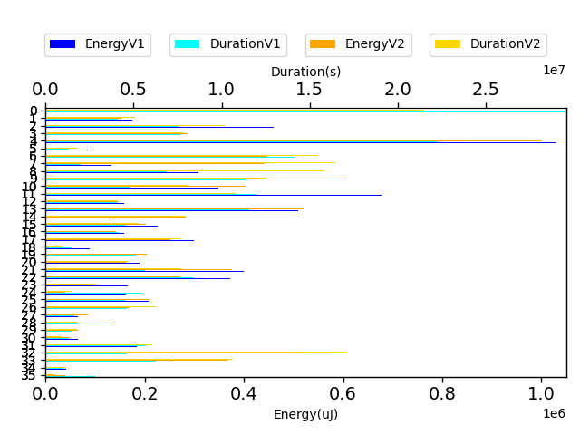

| Index | EnergyV1 | EnergyV2 | DeltaEnergy |
| --- | --- | --- | --- |
| 0 | 1050292.9640615068 | 836431.4552699081 | -213861.50879159872 |
| 1 | 174345.38576352003 | 159786.51653992065 | -14558.86922359938 |
| 2 | 459126.71658054815 | 470696.39436155546 | 11569.67778100731 |
| 3 | 304784.5463008609 | 301521.98335912806 | -3262.5629417328164 |
| 4 | 1028034.525623621 | 1043581.5922199016 | 15547.066596280667 |
| 5 | 86140.03027429804 | 106748.7478579618 | 20608.71758366376 |
| 6 | 555409.6453509263 | 466281.48962085997 | -89128.15573006636 |
| 7 | 132821.9103594165 | 461086.4588584995 | 328264.548499083 |
| 8 | 308806.43867024244 | 478708.8555855282 | 169902.41691528575 |
| 9 | 656819.1401291438 | 634764.5031979614 | -22054.636931182467 |
| 10 | 348623.65200662427 | 419866.76639727986 | 71243.1143906556 |
| 11 | 676583.9534450112 | 576609.7501288289 | -99974.20331618225 |
| 12 | 158435.76432428314 | 154467.71960058488 | -3968.044723698258 |
| 13 | 508782.1196578437 | 545368.7586562644 | 36586.638998420676 |
| 14 | 131665.9260878212 | 295560.63371474005 | 163894.70762691885 |
| 15 | 226701.01474140596 | 210869.7761785365 | -15831.238562869461 |
| 16 | 157837.34812688836 | 148622.3810526317 | -9214.967074256652 |
| 17 | 298462.3918669445 | 262685.07669605274 | -35777.31517089176 |
| 18 | 88529.36686974764 | 90674.61696368456 | 2145.25009393692 |
| 19 | 193178.5929879299 | 212875.17852261718 | 19696.58553468727 |
| 20 | 190300.72133391775 | 170058.81240909183 | -20241.908924825926 |
| 21 | 400572.0720609873 | 392571.3078294875 | -8000.764231499808 |
| 22 | 371671.9502031343 | 283347.9513007885 | -88323.99890234583 |
| 23 | 165472.03189824813 | 86733.28662369834 | -78738.74527454979 |
| 24 | 161369.07755450963 | 42080.52028858221 | -119288.55726592742 |
| 25 | 208310.95123244752 | 218928.68846331717 | 10617.73723086965 |
| 26 | 184041.45966715884 | 176236.2017816553 | -7805.257885503524 |
| 27 | 64435.65987391447 | 89003.13006938771 | 24567.470195473245 |
| 28 | 136919.92802374996 | 133756.72747939266 | -3163.2005443573 |
| 29 | 54836.1412395128 | 68601.99574127643 | 13765.854501763635 |
| 30 | 65472.092739296146 | 52383.11935946345 | -13088.973379832692 |
| 31 | 183517.05353303332 | 196827.5410005307 | 13310.487467497383 |
| 32 | 249210.85665989332 | 542883.5895074515 | 293672.7328475582 |
| 33 | 252439.81808323477 | 383044.9834727944 | 130605.16538955964 |
| 34 | 42389.73348603048 | 42011.04676207948 | -378.68672395100293 |
| 35 | 59578.39313901664 | 42200.704257786274 | -17377.688881230366 |

| Index | DurationV1 | DurationsV2 | DeltaDuration |
| --- | --- | --- | --- |
| 0 | 29560660.787253987 | 18075384.11098239 | -11485276.676271599 |
| 1 | 4115704.8454249604 | 4257086.158677692 | 141381.31325273123 |
| 2 | 7548675.563853649 | 8547397.155266538 | 998721.5914128888 |
| 3 | 7627180.19058876 | 6595932.399233333 | -1031247.7913554274 |
| 4 | 22249289.715500005 | 23679180.810006008 | 1429891.094506003 |
| 5 | 1324554.1138311587 | 1561958.5141697824 | 237404.40033862367 |
| 6 | 14161129.414530069 | 12993201.385350276 | -1167928.0291797929 |
| 7 | 1985947.1193326465 | 13819905.049622932 | 11833957.930290285 |
| 8 | 6899514.798128081 | 13333447.577580057 | 6433932.7794519765 |
| 9 | 11440135.864843208 | 10550074.435056634 | -890061.4297865741 |
| 10 | 4829009.453476066 | 6855514.076746603 | 2026504.6232705368 |
| 11 | 11973707.92954554 | 9075674.966199331 | -2898032.9633462094 |
| 12 | 4050661.5035680654 | 3401695.033989826 | -648966.4695782391 |
| 13 | 11565816.967280537 | 13177599.7940382 | 1611782.8267576639 |
| 14 | 1906179.1301576728 | 6642900.396992936 | 4736721.266835263 |
| 15 | 4568273.754426165 | 4429128.718463151 | -139145.03596301377 |
| 16 | 4170671.8556759944 | 3448931.7832031166 | -721740.0724728778 |
| 17 | 7038146.923512267 | 6474589.763902786 | -563557.1596094808 |
| 18 | 1478421.2929738164 | 824314.3756634593 | -654106.9173103571 |
| 19 | 5133482.205751653 | 6112743.936952341 | 979261.7312006885 |
| 20 | 4486346.27690759 | 3984987.0420034574 | -501359.2349041328 |
| 21 | 5621632.02324357 | 6490048.414113749 | 868416.390870179 |
| 22 | 8398447.338115387 | 5648300.712837418 | -2750146.625277969 |
| 23 | 5551534.243380678 | 2391096.3777368534 | -3160437.8656438245 |
| 24 | 5471312.021221651 | 1282997.705456933 | -4188314.3157647178 |
| 25 | 4508297.040151125 | 2830663.1541749975 | -1677633.8859761273 |
| 26 | 4609567.966356995 | 5254964.796141893 | 645396.8297848981 |
| 27 | 1634406.7153841546 | 2017811.5896236151 | 383404.87423946057 |
| 28 | 1791704.73600736 | 1564889.3899106327 | -226815.3460967273 |
| 29 | 1478310.1773602208 | 1510082.7171872684 | 31772.539827047614 |
| 30 | 1333752.1546074757 | 746793.1351682767 | -586959.019439199 |
| 31 | 5671176.343164455 | 5104937.886589093 | -566238.456575362 |
| 32 | 4638500.897720946 | 14342602.184259076 | 9704101.28653813 |
| 33 | 6266252.099953787 | 8931621.35530919 | 2665369.255355403 |
| 34 | 1005932.8836182345 | 930208.4273372036 | -75724.4562810309 |
| 35 | 2834732.7979848124 | 400545.61232867837 | -2434187.185656134 |
| Index | TestClassName | #Tests |
| --- | --- | --- |
| 0 | com.google.gson.functional.CustomTypeAdaptersTest | 19 |
| 1 | com.google.gson.functional.StreamingTypeAdaptersTest | 3 |
| 2 | com.google.gson.functional.ExclusionStrategyFunctionalTest | 9 |
| 3 | com.google.gson.functional.InstanceCreatorTest | 5 |
| 4 | com.google.gson.functional.DefaultTypeAdaptersTest | 15 |
| 5 | com.google.gson.LongSerializationPolicyTest | 2 |
| 6 | com.google.gson.functional.MapTest | 8 |
| 7 | com.google.gson.GsonBuilderTest | 3 |
| 8 | com.google.gson.functional.CustomDeserializerTest | 5 |
| 9 | com.google.gson.functional.NullObjectAndFieldTest | 14 |
| 10 | com.google.gson.functional.TypeAdapterPrecedenceTest | 8 |
| 11 | com.google.gson.functional.NamingPolicyTest | 12 |
| 12 | com.google.gson.functional.JsonAdapterAnnotationOnClassesTest | 3 |
| 13 | com.google.gson.functional.VersioningTest | 10 |
| 14 | com.google.gson.functional.FieldExclusionTest | 3 |
| 15 | com.google.gson.functional.TypeHierarchyAdapterTest | 3 |
| 16 | com.google.gson.functional.EnumTest | 1 |
| 17 | com.google.gson.functional.MapAsArrayTypeAdapterTest | 5 |
| 18 | com.google.gson.functional.ReadersWritersTest | 2 |
| 19 | com.google.gson.functional.ParameterizedTypesTest | 4 |
| 20 | com.google.gson.functional.ObjectTest | 3 |
| 21 | com.google.gson.functional.PrimitiveTest | 9 |
| 22 | com.google.gson.functional.FieldNamingTest | 5 |
| 23 | com.google.gson.functional.JavaUtilConcurrentAtomicTest | 2 |
| 24 | com.google.gson.functional.EscapingTest | 1 |
| 25 | com.google.gson.functional.SecurityTest | 5 |
| 26 | com.google.gson.functional.JsonAdapterAnnotationOnFieldsTest | 2 |
| 27 | com.google.gson.functional.UncategorizedTest | 1 |
| 28 | com.google.gson.OverrideCoreTypeAdaptersTest | 3 |
| 29 | com.google.gson.GsonTypeAdapterTest | 1 |
| 30 | com.google.gson.functional.PrintFormattingTest | 1 |
| 31 | com.google.gson.MixedStreamTest | 2 |
| 32 | com.google.gson.functional.CustomSerializerTest | 5 |
| 33 | com.google.gson.functional.CircularReferenceTest | 1 |
| 34 | com.google.gson.functional.CollectionTest | 1 |
| 35 | com.google.gson.functional.ArrayTest | 1 |
