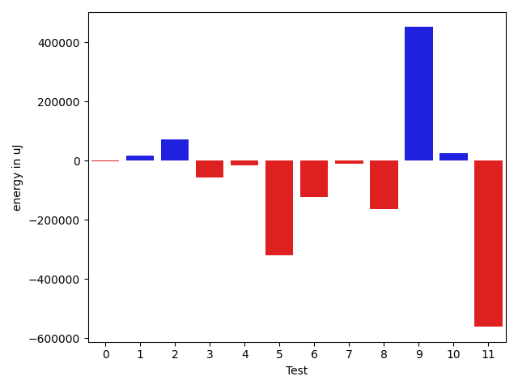
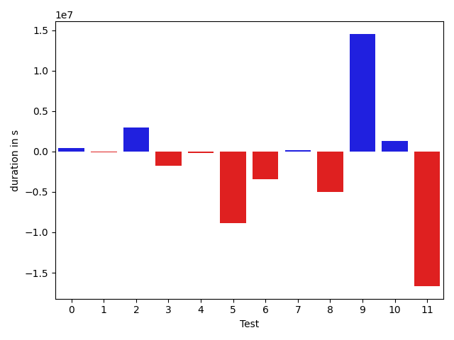

# gson d0e70b

https://github.com/google/gson.git/commit/d0e70b

## Delta Energy per test method

| ID | EnergyV1 | EnergyV2 | DeltaEnergy |
| --- | --- | --- | --- |
| 0 | 124763.57433431462 | 124274.8014688284 | -488.77286548621487 |
| 1 | 46146.5425179545 | 63566.585983896264 | 17420.043465941766 |
| 2 | 191021.92597868788 | 264481.62586248864 | 73459.69988380076 |
| 3 | 146790.4237541339 | 90743.26408485943 | -56047.159669274464 |
| 4 | 171140.5977662241 | 155303.71451741128 | -15836.88324881281 |
| 5 | 376451.6853602884 | 56115.391440889995 | -320336.29391939845 |
| 6 | 203687.50505702387 | 80778.29830097628 | -122909.20675604758 |
| 7 | 75925.52794708595 | 65599.86583689449 | -10325.662110191464 |
| 8 | 214449.7329780732 | 50090.31350529699 | -164359.41947277624 |
| 9 | 135742.35762581852 | 587299.236342475 | 451556.87871665653 |
| 10 | 139612.50547531928 | 164517.80384989284 | 24905.298374573555 |
| 11 | 645471.4629842947 | 84420.69401941389 | -561050.7689648808 |

## Delta Duration per test method

| ID | DurationV1 | DurationsV2 | DeltaDuration |
| --- | --- | --- | --- |
| 0 | 3610506.997621843 | 4050420.3828158327 | 439913.3851939896 |
| 1 | 1960609.616068841 | 1822004.2227380038 | -138605.39333083713 |
| 2 | 6034885.198177896 | 8972514.889314536 | 2937629.6911366396 |
| 3 | 4441815.746756713 | 2646301.9661957384 | -1795513.7805609745 |
| 4 | 4985207.307263556 | 4810806.580185279 | -174400.7270782767 |
| 5 | 10757093.081728688 | 1887853.8008599028 | -8869239.280868785 |
| 6 | 5723802.733274365 | 2310954.5271980707 | -3412848.206076294 |
| 7 | 2429619.975971247 | 2634072.4486661255 | 204452.47269487847 |
| 8 | 7035699.756835908 | 2013980.53245757 | -5021719.224378338 |
| 9 | 4111165.54144651 | 18650712.648573898 | 14539547.107127387 |
| 10 | 4124055.0810929416 | 5407370.786642841 | 1283315.7055498995 |
| 11 | 19520176.58969426 | 2864830.9282410764 | -16655345.661453186 |

## Misc.

| ID | Test Class | Test Method |
| --- | --- | --- |
| 0 | com.google.gson.functional.MapTest | testInterfaceTypeMapWithSerializer |
| 1 | com.google.gson.functional.MapTest | testGeneralMapField |
| 2 | com.google.gson.functional.MapTest | testInterfaceTypeMap |
| 3 | com.google.gson.functional.NamingPolicyTest | testGsonWithUpperCamelCaseSpacesPolicyDeserialiation |
| 4 | com.google.gson.functional.NamingPolicyTest | testGsonWithNonDefaultFieldNamingPolicyDeserialiation |
| 5 | com.google.gson.functional.NamingPolicyTest | testGsonWithUpperCamelCaseSpacesPolicySerialiation |
| 6 | com.google.gson.functional.NamingPolicyTest | testGsonWithNonDefaultFieldNamingPolicySerialization |
| 7 | com.google.gson.functional.MapAsArrayTypeAdapterTest | testSerializeComplexMapWithTypeAdapter |
| 8 | com.google.gson.functional.MapAsArrayTypeAdapterTest | testMapWithTypeVariableSerialization |
| 9 | com.google.gson.functional.MapAsArrayTypeAdapterTest | testMultipleEnableComplexKeyRegistrationHasNoEffect |
| 10 | com.google.gson.functional.FieldNamingTest | testUpperCamelCase |
| 11 | com.google.gson.functional.FieldNamingTest | testUpperCamelCaseWithSpaces |

| Test | IterationV1 | IterationV2 | DeltaIteration |
| --- | --- | --- | --- |
| 0 | 99 | 99 | 0 |
| 1 | 99 | 99 | 0 |
| 2 | 99 | 99 | 0 |
| 3 | 60 | 59 | -1 |
| 4 | 80 | 78 | -2 |
| 5 | 55 | 51 | -4 |
| 6 | 80 | 82 | 2 |
| 7 | 99 | 99 | 0 |
| 8 | 99 | 99 | 0 |
| 9 | 93 | 95 | 2 |
| 10 | 89 | 87 | -2 |
| 11 | 74 | 80 | 6 |

| Time Label | Time (s) |
| --- | --- |
| Selection | 33.6690239906311 |
| Injection | 14.111291646957397 |
| Total | 1373.105685710907 |

## Aggregation per test class

| Index | EnergyV1 | EnergyV2 | DeltaEnergy |
| --- | --- | --- | --- |
| 0 | 361932.042830957 | 452323.0133152133 | 90390.97048425634 |
| 1 | 898070.2119376702 | 382940.66834413697 | -515129.5435935333 |
| 2 | 426117.61855097767 | 702989.4156846665 | 276871.7971336888 |
| 3 | 785083.9684596141 | 248938.4978693067 | -536145.4705903074 |

| Index | DurationV1 | DurationsV2 | DeltaDuration |
| --- | --- | --- | --- |
| 0 | 11606001.81186858 | 14844939.494868372 | 3238937.6829997916 |
| 1 | 25907918.869023323 | 11655916.87443899 | -14252001.994584333 |
| 2 | 13576485.274253666 | 23298765.62969759 | 9722280.355443925 |
| 3 | 23644231.670787204 | 8272201.714883918 | -15372029.955903286 |
| Index | TestClassName | #Tests |
| --- | --- | --- |
| 0 | com.google.gson.functional.MapTest | 3 |
| 1 | com.google.gson.functional.NamingPolicyTest | 4 |
| 2 | com.google.gson.functional.MapAsArrayTypeAdapterTest | 3 |
| 3 | com.google.gson.functional.FieldNamingTest | 2 |
