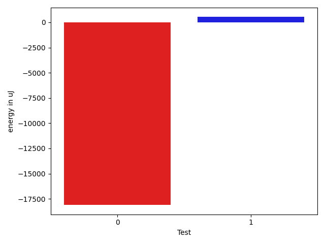
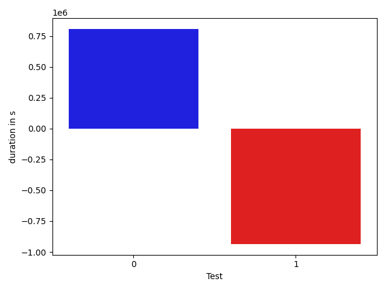

# gson fd37cf

https://github.com/google/gson.git/commit/fd37cf

## Delta Energy per test method

| ID | EnergyV1 | EnergyV2 | DeltaEnergy |
| --- | --- | --- | --- |
| 0 | 111572.17251717814 | 93465.38458927309 | -18106.787927905054 |
| 1 | 38049.9949984022 | 38575.478620159294 | 525.4836217570919 |

## Delta Duration per test method

| ID | DurationV1 | DurationsV2 | DeltaDuration |
| --- | --- | --- | --- |
| 0 | 3321233.160943115 | 4128586.6101157456 | 807353.4491726304 |
| 1 | 2094125.5099600898 | 1158398.9263497472 | -935726.5836103426 |

## Misc.

| ID | Test Class | Test Method |
| --- | --- | --- |
| 0 | com.google.gson.JsonObjectTest | testDeepCopy |
| 1 | com.google.gson.JsonArrayTest | testDeepCopy |

| Test | IterationV1 | IterationV2 | DeltaIteration |
| --- | --- | --- | --- |
| 0 | 99 | 99 | 0 |
| 1 | 65 | 53 | -12 |

| Time Label | Time (s) |
| --- | --- |
| Selection | 34.61288118362427 |
| Injection | 13.479562520980835 |
| Total | 1354.7778012752533 |

## Aggregation per test class

| Index | EnergyV1 | EnergyV2 | DeltaEnergy |
| --- | --- | --- | --- |
| 0 | 111572.17251717814 | 93465.38458927309 | -18106.787927905054 |
| 1 | 38049.9949984022 | 38575.478620159294 | 525.4836217570919 |

| Index | DurationV1 | DurationsV2 | DeltaDuration |
| --- | --- | --- | --- |
| 0 | 3321233.160943115 | 4128586.6101157456 | 807353.4491726304 |
| 1 | 2094125.5099600898 | 1158398.9263497472 | -935726.5836103426 |
| Index | TestClassName | #Tests |
| --- | --- | --- |
| 0 | com.google.gson.JsonObjectTest | 1 |
| 1 | com.google.gson.JsonArrayTest | 1 |
