# gson 9e44d6

https://github.com/google/gson.git/commit/9e44d6

## Delta Energy per test method

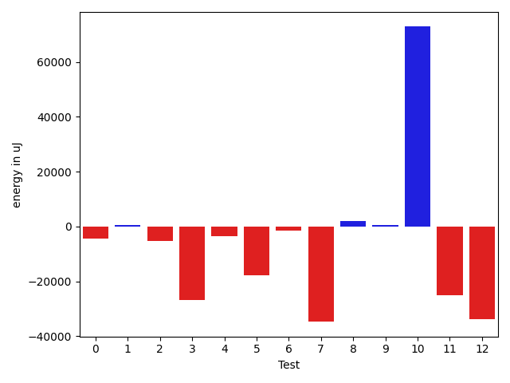

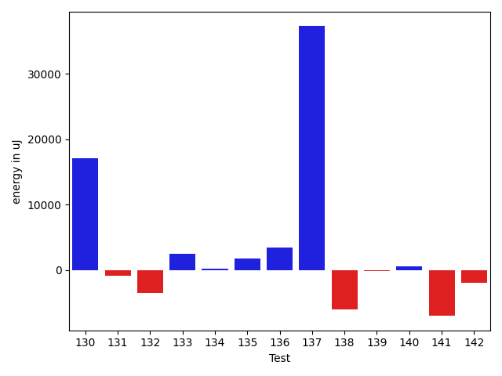

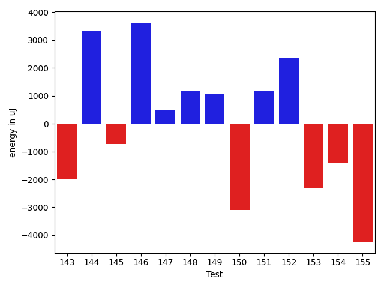

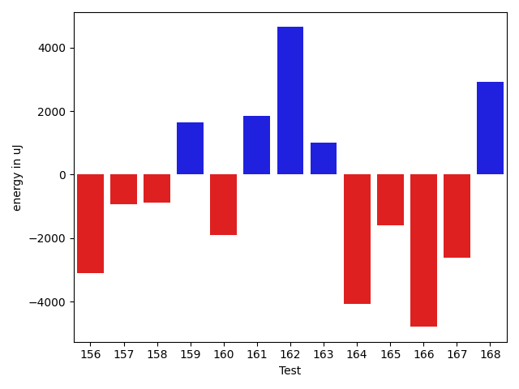

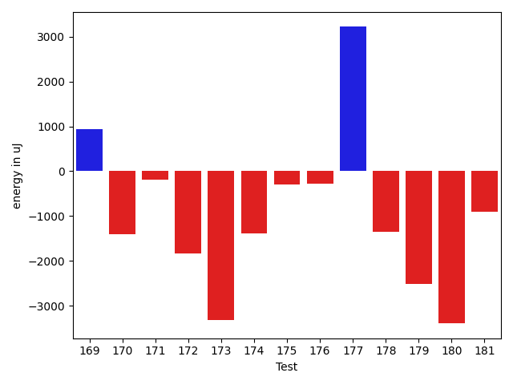

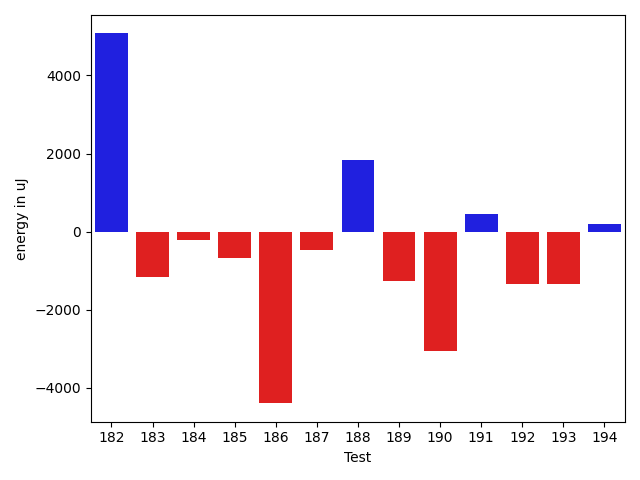

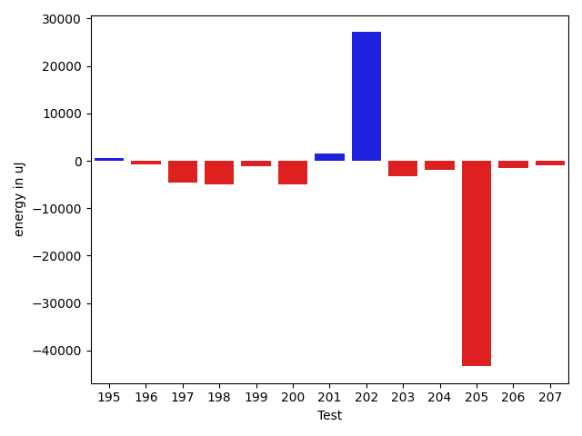

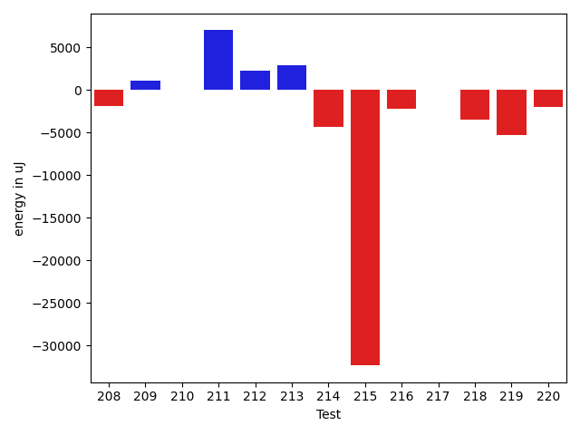

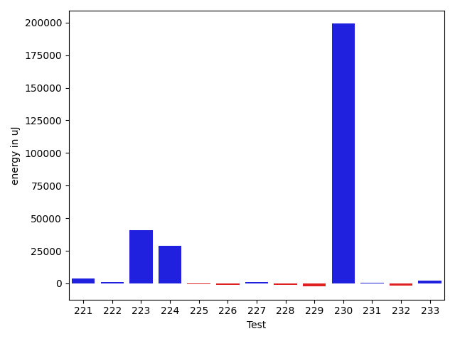

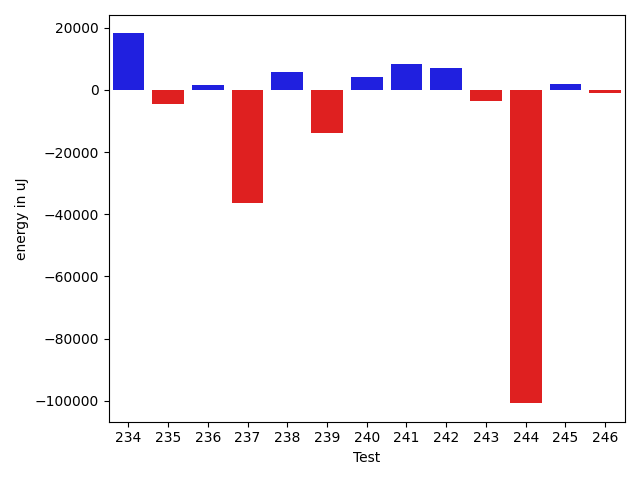

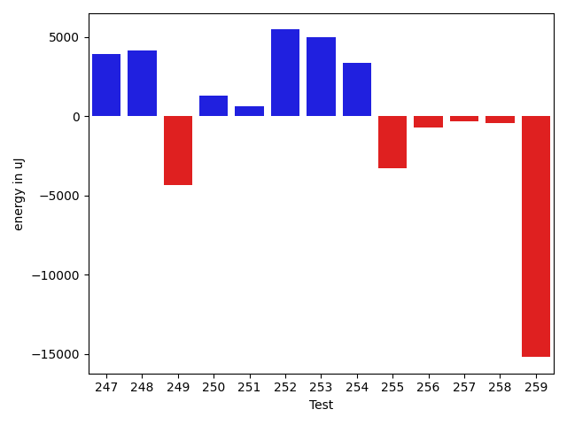

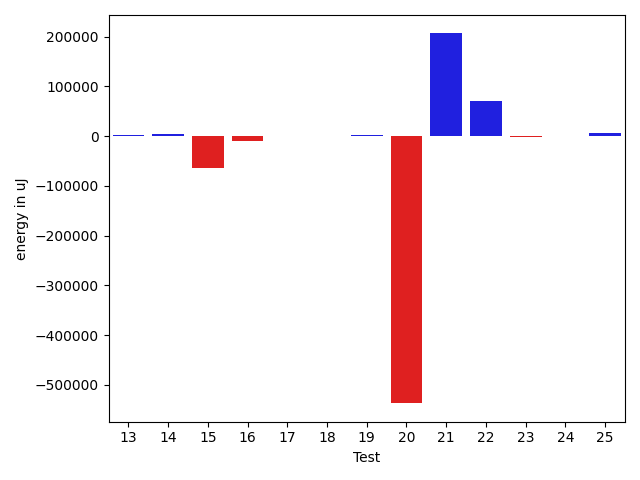

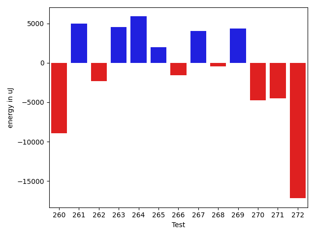

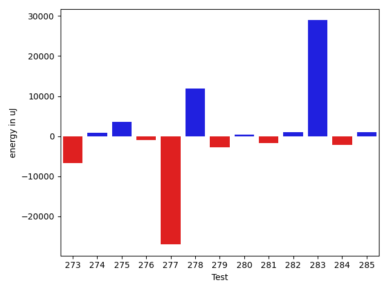

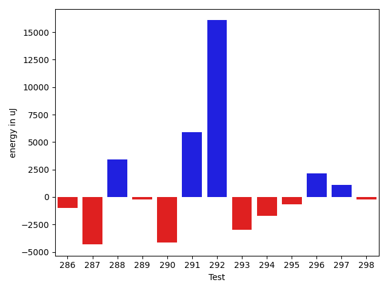

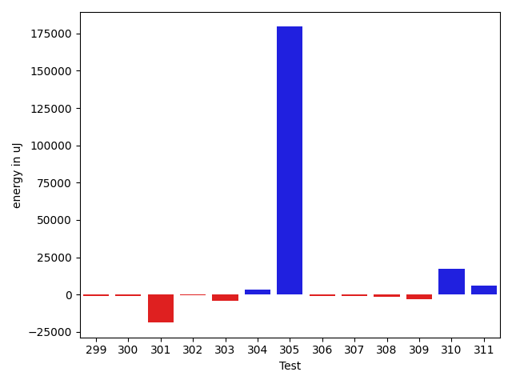

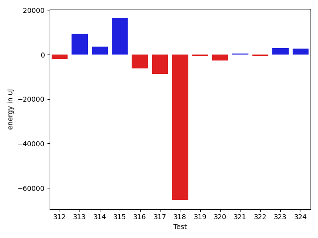

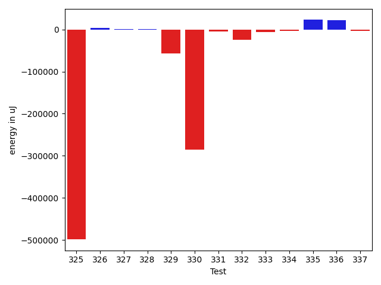

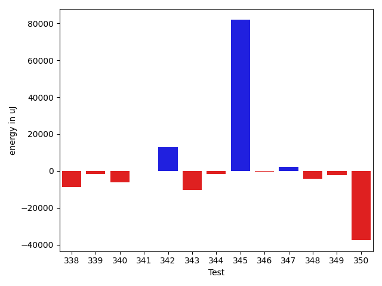

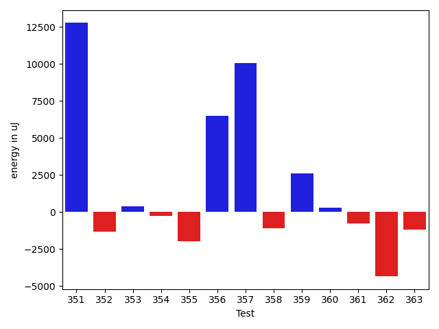

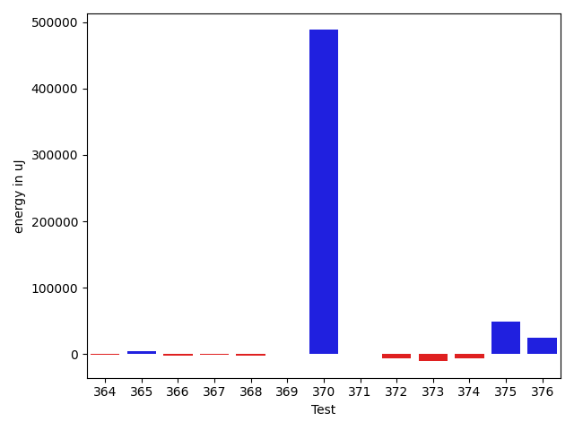

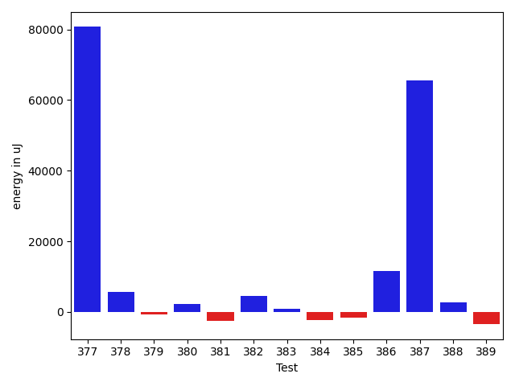

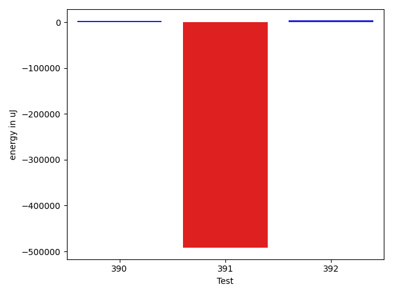

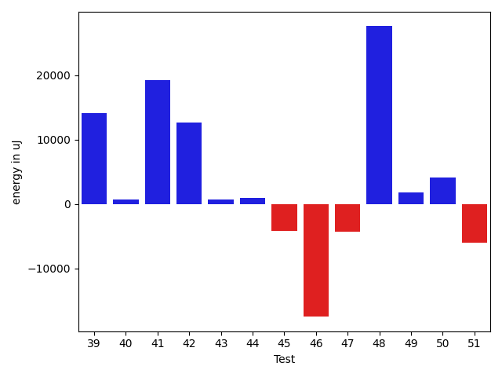

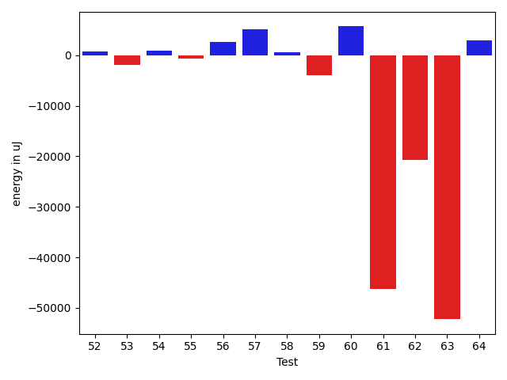

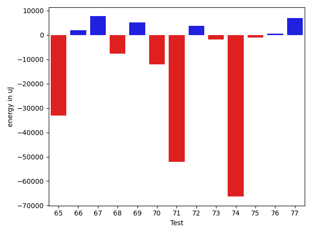

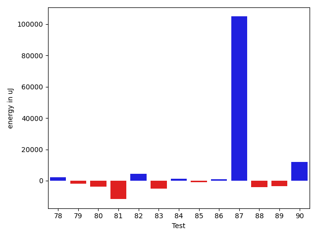

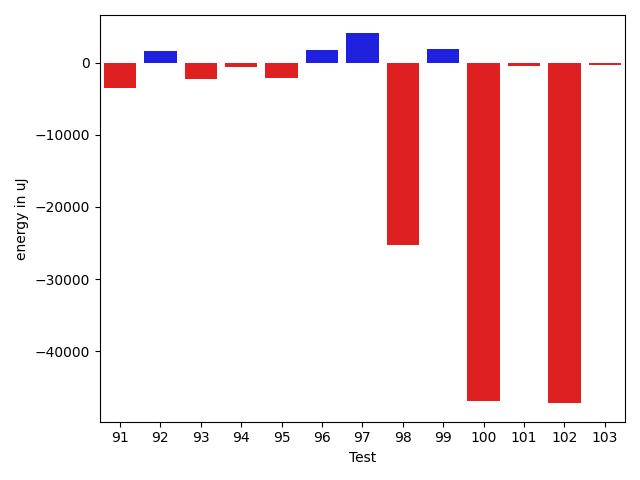

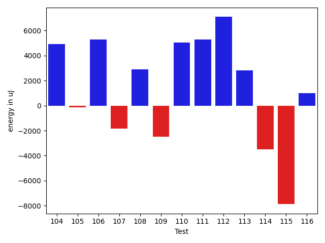

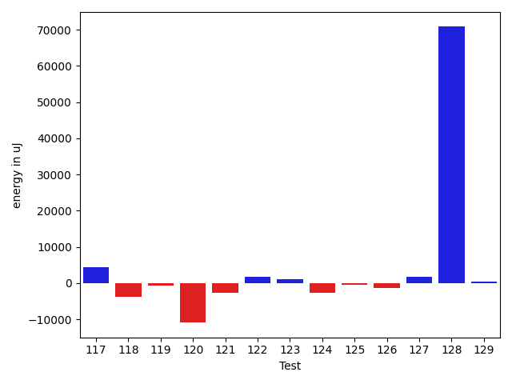

| ID | EnergyV1 | EnergyV2 | DeltaEnergy |
| --- | --- | --- | --- |
| 0 | 45786.77798634545 | 41499.690831835826 | -4287.087154509623 |
| 1 | 51145.757238852944 | 51612.71568205905 | 466.9584432061092 |
| 2 | 44332.97122407181 | 39075.38462372396 | -5257.586600347844 |
| 3 | 67997.77502787033 | 41090.255703124654 | -26907.519324745677 |
| 4 | 44010.87019466283 | 40449.08669233223 | -3561.783502330596 |
| 5 | 59659.25459605493 | 41916.502305981994 | -17742.75229007294 |
| 6 | 44042.259765125724 | 42703.93807175949 | -1338.3216933662334 |
| 7 | 78271.87746737931 | 43578.045468257056 | -34693.83199912225 |
| 8 | 42519.16601562187 | 44549.422983582794 | 2030.2569679609223 |
| 9 | 41632.070875037156 | 42096.853914961524 | 464.7830399243685 |
| 10 | 53294.15236525182 | 126139.88226080374 | 72845.72989555192 |
| 11 | 66151.33159832924 | 41260.95715849323 | -24890.374439836014 |
| 12 | 77544.64683018022 | 43888.529264388766 | -33656.11756579146 |
| 13 | 42232.41522477258 | 44607.63050071953 | 2375.2152759469536 |
| 14 | 45095.59504088246 | 49626.82563734356 | 4531.2305964611005 |
| 15 | 124353.78266511983 | 59330.54667018502 | -65023.23599493481 |
| 16 | 64525.526293928386 | 54164.04903798153 | -10361.477255946855 |
| 17 | 41400.117730161386 | 41614.05667257677 | 213.9389424153851 |
| 18 | 43310.12531226242 | 43821.75477118242 | 511.62945892000425 |
| 19 | 38879.68069070733 | 42127.10831817831 | 3247.4276274709773 |
| 20 | 1078996.976104045 | 542086.7929009038 | -536910.1832031412 |
| 21 | 82632.03451507183 | 289006.0227241374 | 206373.98820906557 |
| 22 | 41237.007538751364 | 111021.69524754802 | 69784.68770879666 |
| 23 | 42360.89737509257 | 41240.80613652273 | -1120.0912385698393 |
| 24 | 40726.834729183065 | 41930.20062002625 | 1203.3658908431826 |
| 25 | 41003.807204350785 | 46758.08865930901 | 5754.281454958225 |
| 26 | 41692.422320894344 | 51203.88070818778 | 9511.458387293438 |
| 27 | 44112.48492157459 | 46028.37883275747 | 1915.8939111828804 |
| 28 | 44167.45770058429 | 48719.75134327775 | 4552.293642693461 |
| 29 | 81865.31203840992 | 50364.744614500625 | -31500.56742390929 |
| 30 | 41783.76409675251 | 41382.94330241284 | -400.8207943396701 |
| 31 | 43610.98806762695 | 41107.743003845215 | -2503.2450637817383 |
| 32 | 43745.037654262036 | 40780.71464538574 | -2964.323008876294 |
| 33 | 38000.539973226114 | 43325.2098825773 | 5324.669909351185 |
| 34 | 40720.97058135417 | 41830.344632220476 | 1109.3740508663032 |
| 35 | 117599.64135845713 | 88555.28849875575 | -29044.35285970138 |
| 36 | 67026.55621828066 | 63067.201601406494 | -3959.354616874167 |
| 37 | 45394.68536534291 | 40051.92415107667 | -5342.76121426624 |
| 38 | 65881.34475734495 | 89387.99291599775 | 23506.648158652795 |
| 39 | 46293.181242309 | 60458.34893314298 | 14165.16769083398 |
| 40 | 41683.18013937527 | 42428.019539933885 | 744.839400558616 |
| 41 | 41787.29874629415 | 61000.94703401508 | 19213.648287720927 |
| 42 | 42084.28882079067 | 54699.930805913886 | 12615.641985123213 |
| 43 | 42682.542793681816 | 43365.457154358446 | 682.9143606766302 |
| 44 | 43588.87918429938 | 44590.64564963817 | 1001.766465338791 |
| 45 | 45223.99007967865 | 41051.75794180037 | -4172.23213787828 |
| 46 | 69432.60893594357 | 51951.80262344088 | -17480.80631250269 |
| 47 | 45852.19325644802 | 41624.03446853836 | -4228.158787909662 |
| 48 | 45618.99332423033 | 73224.96253654962 | 27605.969212319287 |
| 49 | 40563.75533493763 | 42405.86988962249 | 1842.1145546848566 |
| 50 | 69046.52428931778 | 73167.7311766786 | 4121.206887360822 |
| 51 | 45963.6956551543 | 39978.491215465445 | -5985.204439688852 |
| 52 | 41800.74050718357 | 42584.05865932625 | 783.3181521426814 |
| 53 | 44242.44179313612 | 42278.91208701582 | -1963.5297061202946 |
| 54 | 42400.6405211784 | 43288.52426296422 | 887.8837417858231 |
| 55 | 43978.04026007456 | 43334.97950426341 | -643.0607558111515 |
| 56 | 38523.15673460525 | 41179.390407280895 | 2656.2336726756475 |
| 57 | 37317.73589326779 | 42389.876749357136 | 5072.140856089347 |
| 58 | 40592.36224444202 | 41165.35307927416 | 572.9908348321405 |
| 59 | 44713.85135198765 | 40802.29189335607 | -3911.5594586315783 |
| 60 | 41780.358065395616 | 47476.03432559967 | 5695.676260204054 |
| 61 | 119662.82189104716 | 73377.64031622186 | -46285.1815748253 |
| 62 | 77182.78013688306 | 56551.83642958116 | -20630.943707301893 |
| 63 | 95272.24009771048 | 43036.22958619641 | -52236.010511514076 |
| 64 | 40537.59375794727 | 43567.624165250025 | 3030.0304073027582 |
| 65 | 74462.49065452145 | 41494.19622130768 | -32968.29443321377 |
| 66 | 41051.08469000903 | 43039.676854087054 | 1988.5921640780216 |
| 67 | 36030.47323226929 | 43726.529004096985 | 7696.055771827698 |
| 68 | 50068.250821934096 | 42360.65413843893 | -7707.596683495169 |
| 69 | 40107.1004013577 | 45395.59365090694 | 5288.493249549247 |
| 70 | 56910.874084472656 | 44894.01330853626 | -12016.860775936395 |
| 71 | 96719.58547973633 | 44566.13557039574 | -52153.44990934059 |
| 72 | 39314.51364135742 | 43025.32312011719 | 3710.8094787597656 |
| 73 | 44076.75783002703 | 42223.066503596565 | -1853.6913264304676 |
| 74 | 124117.93836150813 | 57761.75448125252 | -66356.18388025562 |
| 75 | 42546.645810004324 | 41600.50922502577 | -946.1365849785507 |
| 76 | 40654.77887466654 | 41325.382461837784 | 670.6035871712447 |
| 77 | 37815.00162686217 | 44729.99274972612 | 6914.991122863954 |
| 78 | 41976.844312481204 | 44220.66945061997 | 2243.825138138767 |
| 79 | 42770.11712098122 | 40743.98294830322 | -2026.1341726779938 |
| 80 | 46069.521221771836 | 42311.57890510559 | -3757.9423166662455 |
| 81 | 85941.1618278976 | 74167.88850325346 | -11773.273324644135 |
| 82 | 38305.63757268048 | 42607.592270014626 | 4301.954697334142 |
| 83 | 44360.857335567474 | 39179.488397568464 | -5181.36893799901 |
| 84 | 41961.9492316246 | 43267.84966278076 | 1305.9004311561584 |
| 85 | 43244.1101064682 | 42351.34896683693 | -892.7611396312714 |
| 86 | 42374.7883746624 | 43339.281123161316 | 964.4927484989166 |
| 87 | 251189.44249812217 | 356069.1726806159 | 104879.73018249375 |
| 88 | 185975.1249597833 | 181826.44596588565 | -4148.678993897658 |
| 89 | 42417.21683514863 | 38782.4690818619 | -3634.747753286734 |
| 90 | 43331.06722801179 | 55342.66182807108 | 12011.594600059296 |
| 91 | 41273.389866664074 | 37692.44331344706 | -3580.9465532170143 |
| 92 | 40398.75315149373 | 41986.09563214921 | 1587.342480655483 |
| 93 | 43479.984200453524 | 41227.70080962067 | -2252.283390832854 |
| 94 | 45123.19534689769 | 44565.05075377376 | -558.1445931239359 |
| 95 | 45066.574846803895 | 42918.079271416354 | -2148.49557538754 |
| 96 | 40871.105874593486 | 42609.82671760848 | 1738.7208430149913 |
| 97 | 40809.65418608849 | 44838.205938280065 | 4028.5517521915754 |
| 98 | 68662.18137909923 | 43339.10343696247 | -25323.077942136762 |
| 99 | 41725.01031987263 | 43542.04735832697 | 1817.037038454342 |
| 100 | 90902.66126056488 | 44014.42023802109 | -46888.24102254379 |
| 101 | 41532.36901093772 | 41110.415375548466 | -421.9536353892545 |
| 102 | 89459.19273075668 | 42259.246676888404 | -47199.946053868276 |
| 103 | 44554.93346641536 | 44183.36413973837 | -371.56932667698857 |
| 104 | 36192.874567283216 | 41113.018244641746 | 4920.14367735853 |
| 105 | 42637.10524825481 | 42508.61988505112 | -128.4853632036902 |
| 106 | 40074.521380708495 | 45344.620071854246 | 5270.098691145751 |
| 107 | 44516.11650621891 | 42679.593951404095 | -1836.5225548148155 |
| 108 | 42928.77836400671 | 45811.44698112449 | 2882.668617117786 |
| 109 | 45103.94252035022 | 42613.80900198221 | -2490.1335183680058 |
| 110 | 40587.38546874568 | 45623.77293718075 | 5036.387468435074 |
| 111 | 39269.58751680085 | 44562.26171420992 | 5292.674197409069 |
| 112 | 39662.38318164002 | 46754.86536579999 | 7092.48218415997 |
| 113 | 40903.248784818534 | 43714.42188332446 | 2811.1730985059257 |
| 114 | 45775.967834472656 | 42270.7041015625 | -3505.2637329101562 |
| 115 | 50262.676417708804 | 42384.68806666136 | -7877.9883510474465 |
| 116 | 43179.64955286681 | 44172.36879918271 | 992.7192463159008 |
| 117 | 38943.51146861106 | 43414.06367827533 | 4470.552209664267 |
| 118 | 52325.93658718002 | 48483.63866068644 | -3842.2979264935784 |
| 119 | 42746.39226462302 | 42158.39878893642 | -587.9934756865987 |
| 120 | 54250.45260137258 | 43340.91358809457 | -10909.539013278008 |
| 121 | 44299.39332318833 | 41557.83203899141 | -2741.5612841969196 |
| 122 | 43520.714562309586 | 45321.332224867765 | 1800.6176625581793 |
| 123 | 42168.96202035104 | 43335.06654235993 | 1166.1045220088854 |
| 124 | 42189.81404862185 | 39513.97100616993 | -2675.8430424519174 |
| 125 | 41852.276763279035 | 41401.01090669533 | -451.2658565837046 |
| 126 | 43000.58839064989 | 41722.075182178436 | -1278.513208471457 |
| 127 | 54634.30795986284 | 56338.296852777494 | 1703.9888929146546 |
| 128 | 48329.8333330576 | 119152.34316364075 | 70822.50983058315 |
| 129 | 42417.12604808326 | 42888.771885598195 | 471.64583751493774 |
| 130 | 57929.75588421189 | 75085.93156029722 | 17156.17567608533 |
| 131 | 43546.0844954561 | 42655.38245118875 | -890.7020442673529 |
| 132 | 42625.8167772465 | 39186.08547763094 | -3439.7312996155597 |
| 133 | 40780.519520463655 | 43228.78404507711 | 2448.264524613456 |
| 134 | 42906.39579100818 | 43114.347085979505 | 207.9512949713244 |
| 135 | 42126.280296082536 | 43886.89256431912 | 1760.6122682365822 |
| 136 | 42765.26018630373 | 46201.11397483306 | 3435.8537885293335 |
| 137 | 128653.38256894996 | 165938.4823203355 | 37285.099751385525 |
| 138 | 43459.176354266805 | 37434.58566629133 | -6024.590687975477 |
| 139 | 43000.1843649355 | 42874.42002178253 | -125.76434315297229 |
| 140 | 44379.90043404336 | 44984.677802873775 | 604.7773688304151 |
| 141 | 44278.034735995985 | 37282.67372465785 | -6995.361011338136 |
| 142 | 42151.49815272779 | 40235.88412365417 | -1915.614029073622 |
| 143 | 44549.83874879981 | 42571.522299014934 | -1978.3164497848775 |
| 144 | 41326.06393467102 | 44661.6335928994 | 3335.569658228378 |
| 145 | 45198.92871269309 | 44480.04321768171 | -718.8854950113746 |
| 146 | 41776.107234105286 | 45409.553314609526 | 3633.44608050424 |
| 147 | 41993.28486062344 | 42462.31698797623 | 469.03212735278794 |
| 148 | 42719.482168791015 | 43897.980858335046 | 1178.4986895440306 |
| 149 | 43562.47012303519 | 44638.565286742734 | 1076.0951637075414 |
| 150 | 44092.260243402736 | 40989.066056943324 | -3103.194186459412 |
| 151 | 43718.30430454369 | 44900.68524710229 | 1182.3809425585932 |
| 152 | 41825.67328323424 | 44200.62941955416 | 2374.9561363199246 |
| 153 | 45324.544754981995 | 43012.02258739434 | -2312.522167587653 |
| 154 | 43597.65462721955 | 42199.457436892306 | -1398.1971903272424 |
| 155 | 44227.62840980779 | 39978.671041386806 | -4248.957368420983 |
| 156 | 44746.88017617492 | 41660.889800550955 | -3085.9903756239655 |
| 157 | 44044.24749898618 | 43103.06389732908 | -941.1836016571033 |
| 158 | 42531.3004990326 | 41653.36754991191 | -877.9329491206881 |
| 159 | 42152.77715671326 | 43800.54628540855 | 1647.7691286952904 |
| 160 | 44276.95756563943 | 42369.76621980634 | -1907.1913458330891 |
| 161 | 43049.66654205322 | 44909.658858904266 | 1859.9923168510431 |
| 162 | 43913.81310734134 | 48552.84541876304 | 4639.032311421703 |
| 163 | 44542.61517397128 | 45558.98373205075 | 1016.36855807947 |
| 164 | 42895.05365657553 | 38819.90829867022 | -4075.1453579053123 |
| 165 | 42813.95150245384 | 41232.99293219067 | -1580.958570263174 |
| 166 | 44576.54047674686 | 39791.64548934126 | -4784.894987405598 |
| 167 | 46618.7108051683 | 44016.139909108286 | -2602.570896060017 |
| 168 | 42425.62254139036 | 45339.97954450545 | 2914.3570031150884 |
| 169 | 44721.85564964509 | 45654.64101876773 | 932.785369122641 |
| 170 | 46331.11331772804 | 44918.503925323486 | -1412.6093924045563 |
| 171 | 44396.86034810543 | 44208.769409656525 | -188.09093844890594 |
| 172 | 45242.77494362751 | 43403.720070869414 | -1839.0548727580972 |
| 173 | 46134.82491900027 | 42806.20889186859 | -3328.6160271316767 |
| 174 | 43430.9456153214 | 42049.34474225098 | -1381.6008730704198 |
| 175 | 43272.529383110545 | 42973.177220067846 | -299.3521630426985 |
| 176 | 41926.22684372999 | 41650.4396569129 | -275.7871868170914 |
| 177 | 44025.245290658684 | 47245.85306442507 | 3220.6077737663873 |
| 178 | 45122.24682199069 | 43771.41514321087 | -1350.8316787798176 |
| 179 | 45628.17423601694 | 43118.88107789757 | -2509.2931581193698 |
| 180 | 44460.30921346188 | 41064.8114702614 | -3395.4977432004816 |
| 181 | 44261.84210538864 | 43350.00812012679 | -911.8339852618519 |
| 182 | 43122.24273452246 | 48196.85343402411 | 5074.610699501653 |
| 183 | 45645.47698050695 | 44481.15488904063 | -1164.3220914663252 |
| 184 | 44277.20318636298 | 44075.46986793727 | -201.73331842571497 |
| 185 | 42927.6022383909 | 42256.18693798046 | -671.4153004104373 |
| 186 | 45166.0670637926 | 40773.69779961023 | -4392.369264182373 |
| 187 | 44315.888350486755 | 43854.97738838196 | -460.91096210479736 |
| 188 | 41533.39065551758 | 43377.52271461487 | 1844.13205909729 |
| 189 | 45495.63730478287 | 44224.743862345116 | -1270.8934424377512 |
| 190 | 45223.56504816562 | 42180.99148699641 | -3042.573561169207 |
| 191 | 41985.86864218232 | 42437.86191917211 | 451.99327698978595 |
| 192 | 45150.44810795784 | 43800.55481958389 | -1349.8932883739471 |
| 193 | 44184.20904533665 | 42833.096026407926 | -1351.1130189287214 |
| 194 | 43079.32881085729 | 43284.692598083595 | 205.36378722630616 |
| 195 | 40816.18049430847 | 41481.57102057338 | 665.3905262649059 |
| 196 | 44315.20154052973 | 43508.18798446655 | -807.0135560631752 |
| 197 | 44553.52388191968 | 39920.58709684014 | -4632.936785079539 |
| 198 | 46910.253313064575 | 41933.57635498047 | -4976.676958084106 |
| 199 | 45587.4750068672 | 44444.77740119184 | -1142.6976056753629 |
| 200 | 44772.799083188176 | 39804.07493211329 | -4968.724151074886 |
| 201 | 43471.51796865463 | 44974.03952026367 | 1502.5215516090393 |
| 202 | 91485.09075029599 | 118715.41682665359 | 27230.326076357596 |
| 203 | 47730.59044613881 | 44476.58845495549 | -3254.0019911833224 |
| 204 | 44431.336074620485 | 42518.103003025055 | -1913.2330715954304 |
| 205 | 94446.66053523915 | 51098.12124321121 | -43348.53929202794 |
| 206 | 41418.947283500864 | 39964.1287464388 | -1454.8185370620631 |
| 207 | 43027.805734962225 | 42040.304174914956 | -987.5015600472689 |
| 208 | 45613.10331756603 | 43793.9832267138 | -1819.1200908522296 |
| 209 | 42200.98912083077 | 43341.71079600573 | 1140.7216751749656 |
| 210 | 41954.34245983053 | 42031.926744742435 | 77.58428491190716 |
| 211 | 40690.80956469991 | 47710.57177266453 | 7019.762207964617 |
| 212 | 44298.8724529551 | 46590.38515191468 | 2291.512698959581 |
| 213 | 43360.32736049814 | 46315.416084403885 | 2955.0887239057483 |
| 214 | 47560.86977257687 | 43214.74026191472 | -4346.129510662155 |
| 215 | 115915.8585279557 | 83595.2699178861 | -32320.588610069608 |
| 216 | 46710.042888438344 | 44507.68973678525 | -2202.353151653093 |
| 217 | 43373.47697890915 | 43417.41399785606 | 43.93701894691185 |
| 218 | 45795.45004787695 | 42283.28283012027 | -3512.1672177566797 |
| 219 | 47224.823233410716 | 41954.490067243576 | -5270.33316616714 |
| 220 | 45087.23978038932 | 43153.49315458323 | -1933.7466258060886 |
| 221 | 39595.344144884395 | 43096.584671391145 | 3501.24052650675 |
| 222 | 45432.95154991746 | 46218.035396039486 | 785.0838461220264 |
| 223 | 47605.9172438172 | 88396.5463576798 | 40790.629113862604 |
| 224 | 42124.97802510508 | 70955.42580601573 | 28830.447780910647 |
| 225 | 42043.16673572513 | 41432.16118225041 | -611.0055534747153 |
| 226 | 43020.40274993926 | 41621.12867534627 | -1399.2740745929914 |
| 227 | 44809.51701247692 | 45572.66444641352 | 763.1474339365959 |
| 228 | 43959.12844244471 | 42955.23684381717 | -1003.8915986275388 |
| 229 | 43250.09000665182 | 40882.320014034194 | -2367.7699926176283 |
| 230 | 43239.472403257154 | 242318.49981923786 | 199079.0274159807 |
| 231 | 41537.86991918848 | 42239.126409188575 | 701.2564900000943 |
| 232 | 43658.575932719694 | 41828.68978843759 | -1829.8861442821071 |
| 233 | 41471.38275384903 | 43616.347640919535 | 2144.964887070506 |
| 234 | 43027.11518235612 | 61165.09063438881 | 18137.97545203269 |
| 235 | 56303.084152558455 | 51708.27598907372 | -4594.808163484733 |
| 236 | 42854.10717360785 | 44540.675948955395 | 1686.5687753475431 |
| 237 | 77071.90950158756 | 40609.98402041716 | -36461.9254811704 |
| 238 | 40609.65563688381 | 46397.88344053179 | 5788.227803647984 |
| 239 | 55530.80069887138 | 41708.09388774282 | -13822.706811128563 |
| 240 | 36075.98401676242 | 40309.9563874504 | 4233.972370687981 |
| 241 | 35272.31503659487 | 43490.48569454253 | 8218.17065794766 |
| 242 | 35513.158250206994 | 42423.51814982139 | 6910.359899614399 |
| 243 | 45416.463681109104 | 41770.25527899712 | -3646.208402111981 |
| 244 | 144217.95394805528 | 43440.0305534317 | -100777.92339462358 |
| 245 | 39240.11180995183 | 41196.31895893812 | 1956.2071489862938 |
| 246 | 45050.643653659194 | 43901.07698308205 | -1149.5666705771437 |
| 247 | 44478.951390788876 | 48395.51779358058 | 3916.566402791701 |
| 248 | 41825.194009539395 | 45955.833594278476 | 4130.639584739081 |
| 249 | 52555.58305398614 | 48202.05260730487 | -4353.530446681274 |
| 250 | 44507.59614298658 | 45791.23681456153 | 1283.6406715749545 |
| 251 | 40747.42247999922 | 41378.50242342463 | 631.0799434254077 |
| 252 | 41253.04198173998 | 46712.51004303341 | 5459.468061293432 |
| 253 | 42888.44836758537 | 47865.02345157036 | 4976.575083984993 |
| 254 | 40884.873207250144 | 44240.03347913771 | 3355.1602718875656 |
| 255 | 44184.43114272924 | 40884.98519335687 | -3299.44594937237 |
| 256 | 48709.237425551015 | 47991.57151519011 | -717.6659103609054 |
| 257 | 42678.81726181507 | 42344.54622380738 | -334.27103800768964 |
| 258 | 41953.7342043517 | 41515.76889817296 | -437.9653061787394 |
| 259 | 64763.88784618954 | 49564.891946053394 | -15198.995900136142 |
| 260 | 62564.789278038734 | 53614.01751266874 | -8950.771765369995 |
| 261 | 41532.63981231781 | 46502.29701266266 | 4969.657200344853 |
| 262 | 43460.43013300316 | 41139.89948744329 | -2320.5306455598693 |
| 263 | 41780.1254568299 | 46334.51281485646 | 4554.3873580265645 |
| 264 | 41573.94014590227 | 47463.5036866342 | 5889.563540731928 |
| 265 | 42191.66638612994 | 44165.2199302766 | 1973.5535441466636 |
| 266 | 42077.84228182872 | 40497.2421803766 | -1580.6001014521244 |
| 267 | 42255.15486717224 | 46327.40111503005 | 4072.246247857809 |
| 268 | 40853.300614741485 | 40403.343905836584 | -449.95670890490146 |
| 269 | 41535.284822655274 | 45912.45612167352 | 4377.171299018242 |
| 270 | 42733.73322558403 | 37993.41404724121 | -4740.319178342819 |
| 271 | 45032.80483708965 | 40533.79059448393 | -4499.014242605721 |
| 272 | 57338.638876277924 | 40144.67249456043 | -17193.966381717495 |
| 273 | 43707.19298963994 | 37013.39727783203 | -6693.795711807907 |
| 274 | 45477.28347380385 | 46331.34695177153 | 854.0634779676766 |
| 275 | 42483.435546875 | 46091.984115600586 | 3608.548568725586 |
| 276 | 42313.384515230005 | 41343.277734021394 | -970.1067812086112 |
| 277 | 84971.7067508613 | 57932.85757822964 | -27038.849172631657 |
| 278 | 44515.402893240615 | 56404.162034660854 | 11888.75914142024 |
| 279 | 44808.99747220497 | 42051.97403907776 | -2757.0234331272077 |
| 280 | 42775.28640770912 | 43186.26104736328 | 410.97463965415955 |
| 281 | 48370.77802714679 | 46644.4558856395 | -1726.3221415072912 |
| 282 | 42364.159483626485 | 43356.775926589966 | 992.616442963481 |
| 283 | 90520.87324882681 | 119452.39787923548 | 28931.52463040866 |
| 284 | 47322.34316229965 | 45099.78972926963 | -2222.5534330300216 |
| 285 | 44040.96368658781 | 44974.90220834064 | 933.9385217528252 |
| 286 | 46461.305618565115 | 45457.540506809346 | -1003.7651117557689 |
| 287 | 45451.759033203125 | 41129.82141113281 | -4321.9376220703125 |
| 288 | 42928.47993564606 | 46320.17752075195 | 3391.697585105896 |
| 289 | 43046.797718048096 | 42835.392669677734 | -211.40504837036133 |
| 290 | 47519.765920072794 | 43381.53874206543 | -4138.227178007364 |
| 291 | 40996.3994140625 | 46893.666503190994 | 5897.267089128494 |
| 292 | 130629.9849714505 | 146713.94492077106 | 16083.95994932056 |
| 293 | 44037.05808920892 | 41072.04869385391 | -2965.0093953550095 |
| 294 | 45379.06380156091 | 43671.032083750746 | -1708.0317178101614 |
| 295 | 43802.38454021138 | 43110.08388909185 | -692.3006511195272 |
| 296 | 42132.70612732321 | 44272.92143726349 | 2140.2153099402785 |
| 297 | 44388.155006736866 | 45512.068439642055 | 1123.9134329051885 |
| 298 | 44781.654390215874 | 44579.30678419769 | -202.34760601818562 |
| 299 | 45085.225352943584 | 43858.82764098031 | -1226.3977119632764 |
| 300 | 41518.1953678069 | 40360.17119795218 | -1158.024169854718 |
| 301 | 80736.24808842872 | 61935.66147126492 | -18800.586617163804 |
| 302 | 40723.20523969007 | 40142.08913389793 | -581.1161057921418 |
| 303 | 43087.634495536 | 39135.22830563937 | -3952.4061898966247 |
| 304 | 45921.50484798122 | 49469.08736977548 | 3547.582521794262 |
| 305 | 94615.12109412701 | 274093.38191766886 | 179478.26082354184 |
| 306 | 43796.63695146633 | 42639.496186931676 | -1157.1407645346553 |
| 307 | 44691.97383131779 | 43583.50444231095 | -1108.4693890068374 |
| 308 | 43147.77609683731 | 41535.47995080102 | -1612.296146036293 |
| 309 | 43746.52602537506 | 40558.64660352265 | -3187.8794218524126 |
| 310 | 46211.601810953165 | 63642.59666402796 | 17430.994853074793 |
| 311 | 41718.16333737224 | 47450.11718469486 | 5731.953847322613 |
| 312 | 43455.81940605885 | 41488.89485928793 | -1966.9245467709188 |
| 313 | 43730.13878029067 | 53148.50866030061 | 9418.369880009945 |
| 314 | 40059.47695761782 | 43638.96316245921 | 3579.486204841385 |
| 315 | 46855.01142261855 | 63290.79034736014 | 16435.778924741593 |
| 316 | 48501.34238937497 | 42246.25572645664 | -6255.086662918329 |
| 317 | 381238.0621502992 | 372617.95786371385 | -8620.104286585352 |
| 318 | 520620.3281894053 | 455191.6353932768 | -65428.69279612851 |
| 319 | 62840.01455378228 | 62272.70728315163 | -567.3072706306557 |
| 320 | 44658.74572207858 | 42085.1330557863 | -2573.6126662922834 |
| 321 | 42996.27479350567 | 43444.22352102026 | 447.9487275145948 |
| 322 | 43504.7755753994 | 42827.63211322576 | -677.1434621736407 |
| 323 | 41766.973103311844 | 44593.4998539146 | 2826.5267506027594 |
| 324 | 44655.13379959055 | 47352.752139404096 | 2697.618339813547 |
| 325 | 549397.0512062763 | 50638.947741917174 | -498758.1034643591 |
| 326 | 38425.67752379924 | 42364.69012284279 | 3939.012599043548 |
| 327 | 42575.394662088715 | 43295.384067659266 | 719.9894055705518 |
| 328 | 42159.45318984985 | 43626.65338008851 | 1467.2001902386546 |
| 329 | 412135.2682560021 | 354520.34742167837 | -57614.92083432374 |
| 330 | 567109.8321829246 | 282164.2735620868 | -284945.5586208378 |
| 331 | 46806.257115248314 | 42635.92399282975 | -4170.333122418568 |
| 332 | 69403.61062589115 | 44653.979939312725 | -24749.63068657842 |
| 333 | 44308.65766211692 | 38563.60873368064 | -5745.048928436285 |
| 334 | 43560.12684249878 | 40195.20009511709 | -3364.926747381687 |
| 335 | 59357.98115223437 | 82138.5000479809 | 22780.51889574652 |
| 336 | 86316.80630029838 | 108982.97375558213 | 22666.16745528375 |
| 337 | 42158.89735365659 | 39475.3182804212 | -2683.5790732353926 |
| 338 | 44769.26891095303 | 35965.338553110516 | -8803.930357842517 |
| 339 | 42412.97372865677 | 40761.57977644168 | -1651.3939522150904 |
| 340 | 44971.30896105098 | 38807.11790195978 | -6164.191059091201 |
| 341 | 43967.66668891907 | 43882.926177978516 | -84.74051094055176 |
| 342 | 42610.3901288809 | 55642.20266807325 | 13031.812539192353 |
| 343 | 46703.33328151703 | 36399.450684344396 | -10303.882597172633 |
| 344 | 43512.802143096924 | 41774.150076426566 | -1738.6520666703582 |
| 345 | 44728.588977955456 | 126580.4487356836 | 81851.85975772815 |
| 346 | 42696.66017189791 | 42323.906576356734 | -372.7535955411731 |
| 347 | 42679.35307870433 | 44802.1333077185 | 2122.78022901417 |
| 348 | 44297.967859672906 | 39987.636869423004 | -4310.330990249902 |
| 349 | 45735.74479197594 | 43334.999485823166 | -2400.7453061527776 |
| 350 | 80705.08310061766 | 43105.245517557036 | -37599.837583060624 |
| 351 | 133765.32731200953 | 146528.8060729007 | 12763.478760891187 |
| 352 | 58073.87821037701 | 56755.70228537787 | -1318.1759249991446 |
| 353 | 48734.739524484925 | 49117.57699318892 | 382.83746870399773 |
| 354 | 42691.33299735998 | 42442.888724125965 | -248.4442732340176 |
| 355 | 43568.31935572624 | 41581.156145095825 | -1987.1632106304169 |
| 356 | 46558.12945873424 | 53035.137052792736 | 6477.007594058494 |
| 357 | 44870.8314493098 | 54924.40167123374 | 10053.57022192394 |
| 358 | 46892.96196195536 | 45807.69354296466 | -1085.2684189907013 |
| 359 | 41413.93209006498 | 44024.9840871193 | 2611.0519970543246 |
| 360 | 42502.536700221484 | 42784.510273195214 | 281.97357297372946 |
| 361 | 43497.458728637524 | 42707.510905554795 | -789.9478230827299 |
| 362 | 45348.15104006154 | 40991.69667751801 | -4356.454362543525 |
| 363 | 44455.90024365485 | 43277.71992516518 | -1178.1803184896708 |
| 364 | 42170.679406523705 | 40469.80125260353 | -1700.8781539201736 |
| 365 | 41585.58834707737 | 46002.28141665459 | 4416.693069577217 |
| 366 | 44465.75696529087 | 42391.36541888397 | -2074.3915464068996 |
| 367 | 43761.935381412506 | 42225.971026267856 | -1535.9643551446497 |
| 368 | 43030.08498620987 | 41016.35048764013 | -2013.7344985697418 |
| 369 | 40465.84083804488 | 41241.25500477711 | 775.4141667322256 |
| 370 | 88950.1176179893 | 577187.9994583506 | 488237.8818403613 |
| 371 | 42866.333512368285 | 43374.454928117804 | 508.12141574951966 |
| 372 | 44407.35290961573 | 37947.14369165222 | -6460.209217963507 |
| 373 | 45691.785628944635 | 34841.56486565007 | -10850.220763294565 |
| 374 | 58803.080393112694 | 52474.78446182885 | -6328.295931283843 |
| 375 | 47594.04532485083 | 96849.88074940126 | 49255.83542455043 |
| 376 | 88277.94598031907 | 113390.15033438304 | 25112.20435406397 |
| 377 | 44915.400229921135 | 125603.50945248638 | 80688.10922256525 |
| 378 | 46601.16319103469 | 52314.56996710912 | 5713.406776074429 |
| 379 | 44804.86449781887 | 44015.999646679265 | -788.8648511396023 |
| 380 | 41849.440074448474 | 44012.31149190664 | 2162.871417458169 |
| 381 | 45294.598652485234 | 42807.063525851925 | -2487.535126633309 |
| 382 | 42271.93452635294 | 46902.076663184285 | 4630.142136831346 |
| 383 | 44345.57696300134 | 45179.20102554778 | 833.6240625464416 |
| 384 | 44885.90865857233 | 42488.05964636065 | -2397.849012211678 |
| 385 | 44861.20750269294 | 43281.69882163219 | -1579.5086810607463 |
| 386 | 39745.522961446666 | 51373.028953630535 | 11627.50599218387 |
| 387 | 42314.30588218469 | 107924.12354694091 | 65609.81766475622 |
| 388 | 40747.193506789685 | 43521.205173630595 | 2774.01166684091 |
| 389 | 41972.88790015876 | 38471.61232990588 | -3501.275570252881 |
| 390 | 46522.05832184512 | 49536.669827317004 | 3014.611505471883 |
| 391 | 535766.3748837076 | 43578.95187725578 | -492187.4230064518 |
| 392 | 37658.0869140625 | 41060.501194000244 | 3402.414279937744 |

## Delta Duration per test method

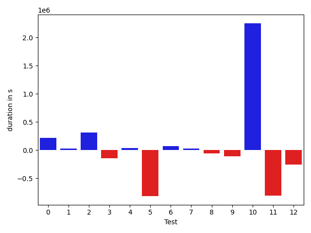

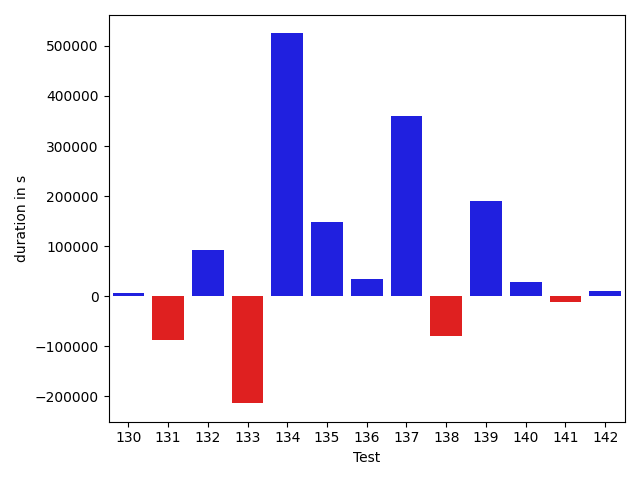

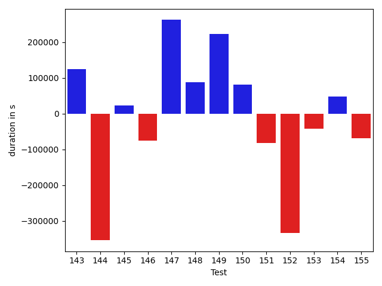

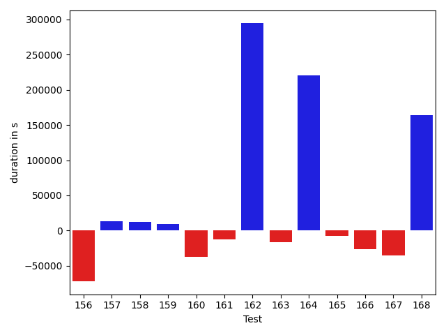

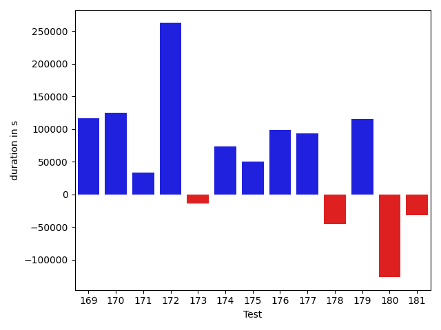

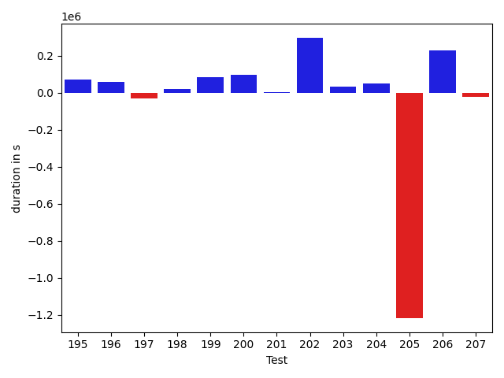

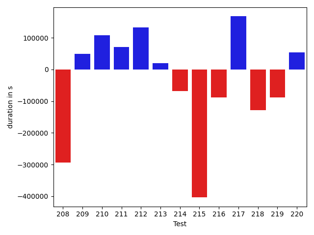

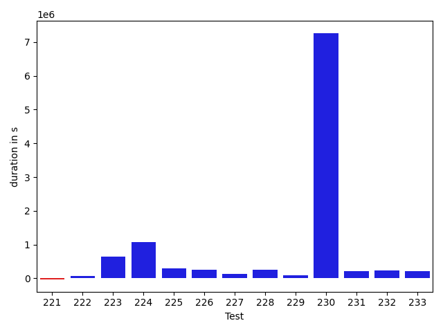

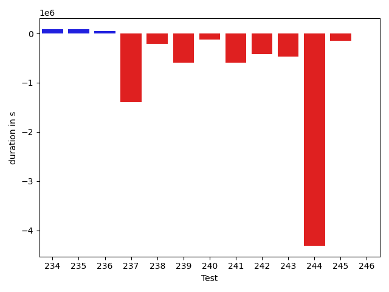

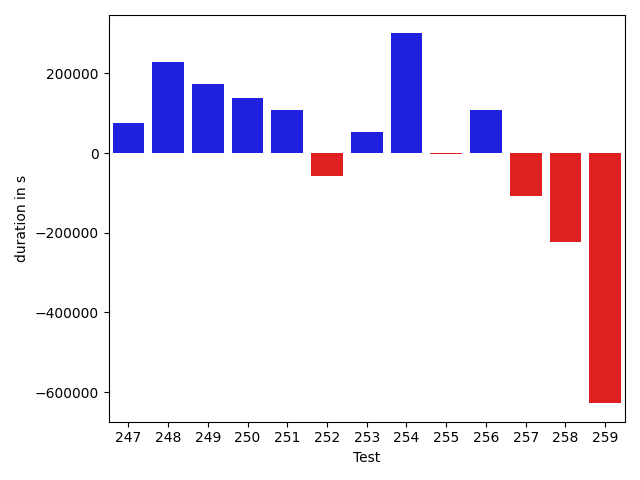

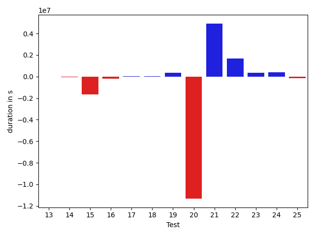

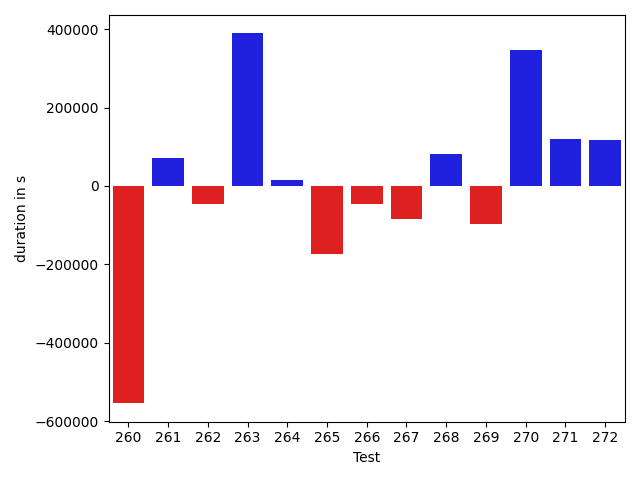

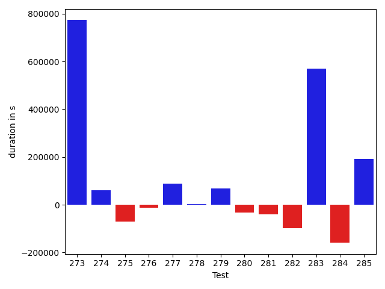

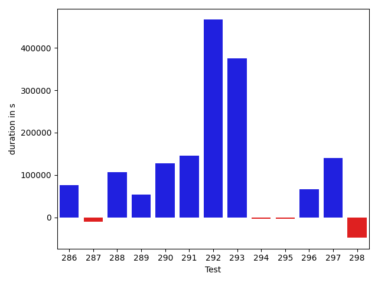

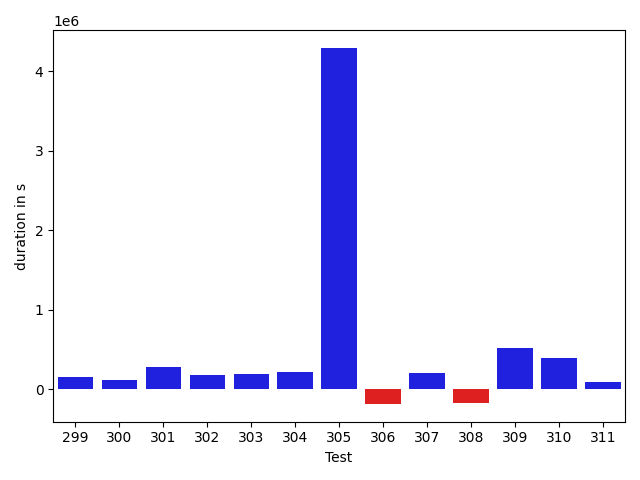

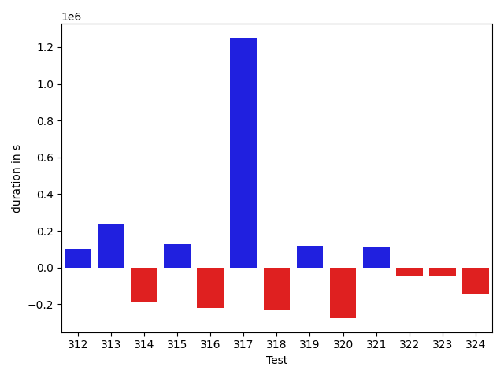

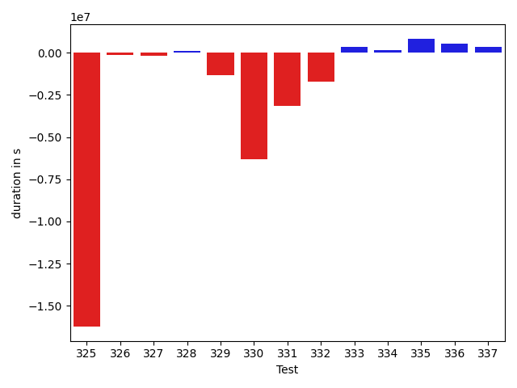

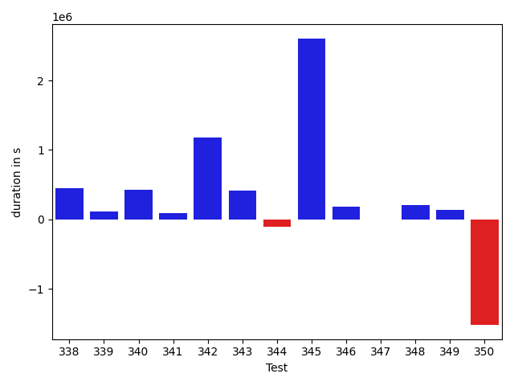

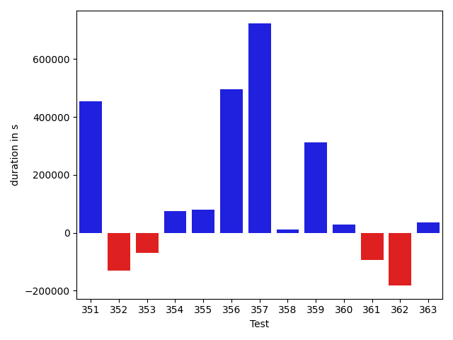

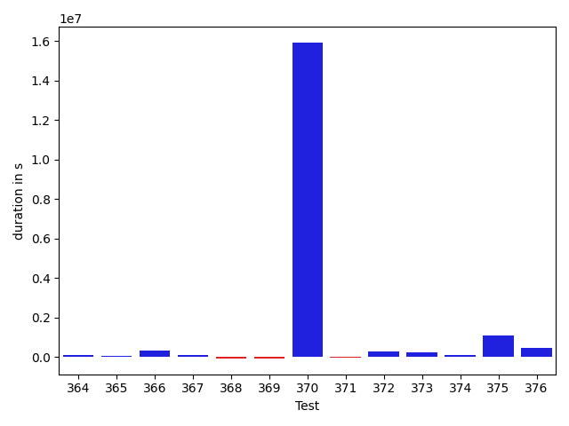

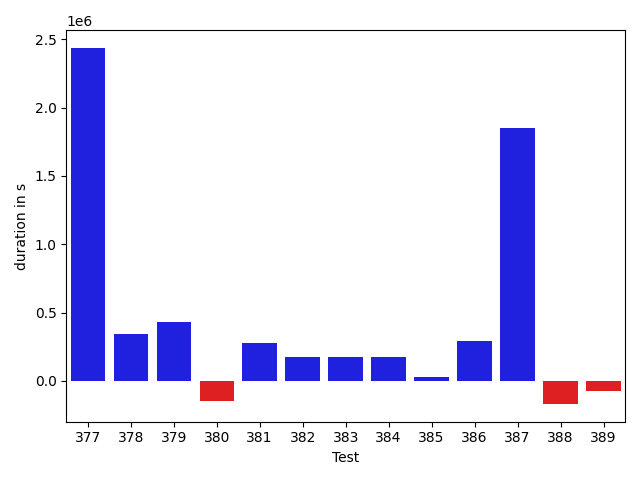

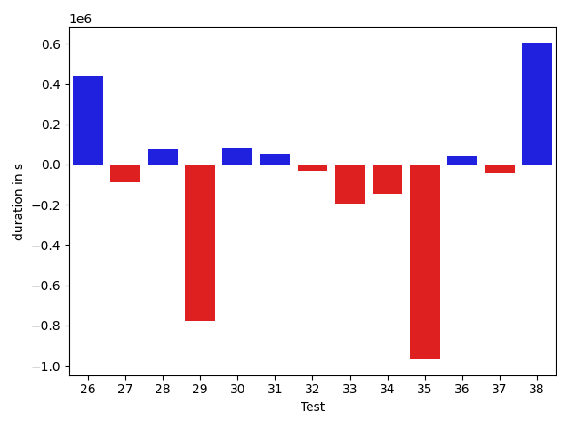

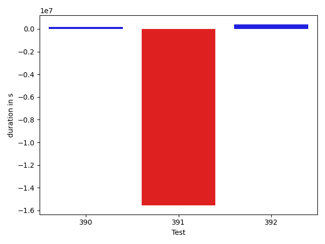

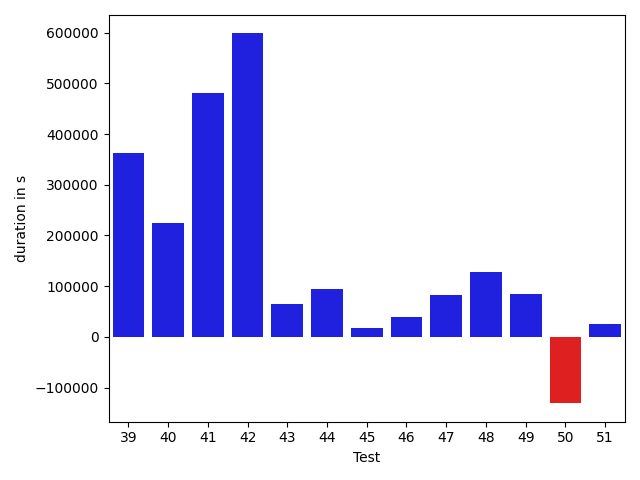

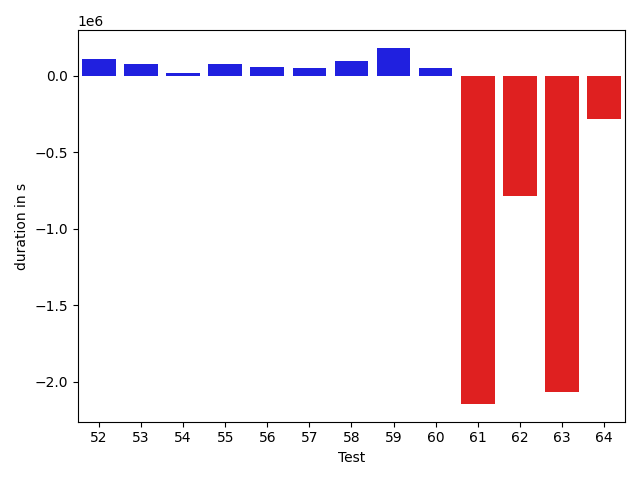

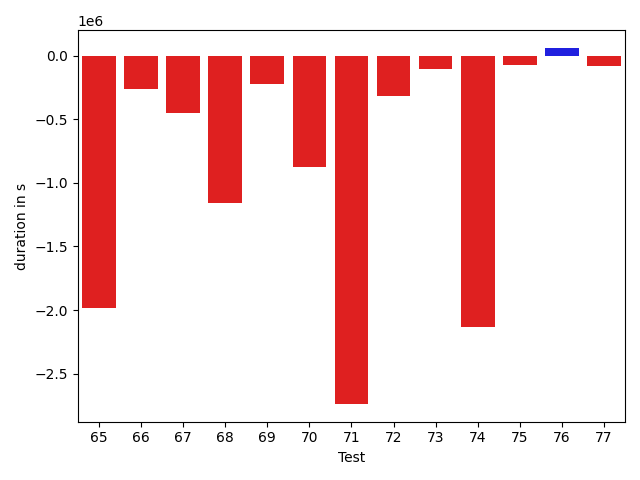

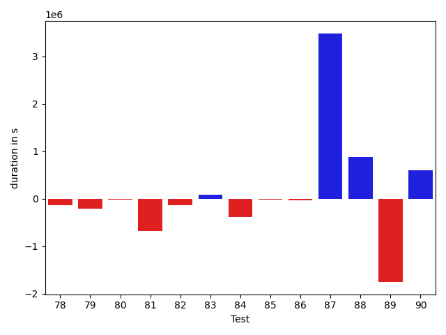

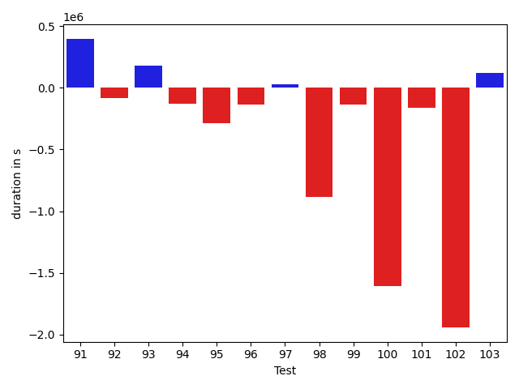

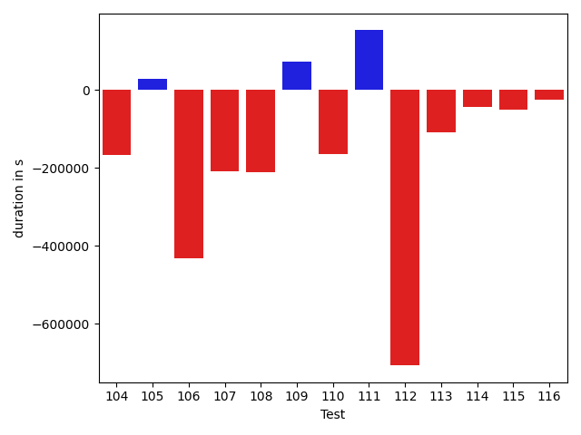

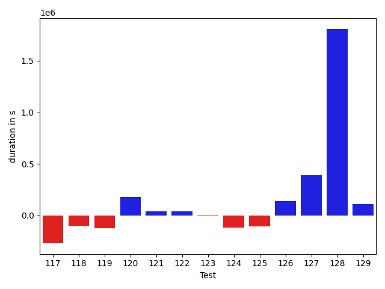

| ID | DurationV1 | DurationsV2 | DeltaDuration |
| --- | --- | --- | --- |
| 0 | 1038603.2818263958 | 1254078.2573328032 | 215474.97550640744 |
| 1 | 1333348.6788823262 | 1360343.9950358672 | 26995.316153540974 |
| 2 | 723609.1208658551 | 1034966.0729311763 | 311356.95206532115 |
| 3 | 1396320.5405075646 | 1251086.3366326785 | -145234.20387488604 |
| 4 | 613764.1806690719 | 646725.3528800831 | 32961.17221101129 |
| 5 | 1762095.125419788 | 944125.4212801899 | -817969.7041395982 |
| 6 | 785331.42913757 | 852891.5508538386 | 67560.1217162686 |
| 7 | 1575944.5855586666 | 1600444.5045056497 | 24499.91894698306 |
| 8 | 624885.5415665098 | 567173.6557680096 | -57711.88579850015 |
| 9 | 860158.1807312253 | 749115.1422000156 | -111043.03853120969 |
| 10 | 1377900.6723097453 | 3631809.9758186364 | 2253909.303508891 |
| 11 | 1643009.6618179008 | 833352.8714877478 | -809656.7903301531 |
| 12 | 1884824.2293916657 | 1630509.5557170473 | -254314.67367461836 |
| 13 | 663753.1537485383 | 671170.969822146 | 7417.816073607653 |
| 14 | 1408454.5694755241 | 1373185.5782542226 | -35268.99122130149 |
| 15 | 3053523.014120446 | 1381675.3999415303 | -1671847.6141789157 |
| 16 | 1451235.3604309135 | 1254030.9877372691 | -197204.37269364437 |
| 17 | 666435.5778030477 | 680017.7679190997 | 13582.190116051934 |
| 18 | 624261.5611013086 | 669814.8448361126 | 45553.28373480402 |
| 19 | 701069.5213032466 | 1042351.7945810648 | 341282.2732778182 |
| 20 | 24020447.00832749 | 12692713.26728862 | -11327733.741038872 |
| 21 | 2198653.7922972953 | 7120982.32237417 | 4922328.530076874 |
| 22 | 1199478.9415807985 | 2871696.884982042 | 1672217.9434012435 |
| 23 | 531887.0515819213 | 888773.3015887396 | 356886.2500068183 |
| 24 | 524868.1589412089 | 933974.4900890917 | 409106.33114788285 |
| 25 | 930462.7061856412 | 797864.7146893735 | -132597.99149626773 |
| 26 | 723223.9081881444 | 1163454.6819751216 | 440230.77378697717 |
| 27 | 540157.8253839016 | 451218.17019838095 | -88939.65518552065 |
| 28 | 626676.2147215139 | 700251.2446382549 | 73575.02991674095 |
| 29 | 2013816.2051773285 | 1233715.474908556 | -780100.7302687725 |
| 30 | 586326.2979130947 | 671280.7055123729 | 84954.40759927814 |
| 31 | 399611.447845459 | 450105.1665420532 | 50493.71869659424 |
| 32 | 393402.1693503745 | 363717.4466705322 | -29684.722679842263 |
| 33 | 726629.3434964409 | 531370.1188439559 | -195259.224652485 |
| 34 | 722691.8370748907 | 576910.4441688748 | -145781.39290601597 |
| 35 | 2943334.301122683 | 1975654.2561739327 | -967680.0449487504 |
| 36 | 1540838.5986622137 | 1584448.3166562086 | 43609.71799399494 |
| 37 | 1246955.5068687084 | 1206629.3870117802 | -40326.11985692824 |
| 38 | 1683309.208515403 | 2287938.525040854 | 604629.3165254507 |
| 39 | 1111011.3684723808 | 1472826.7217685473 | 361815.3532961665 |
| 40 | 601637.2351555892 | 826270.9362327568 | 224633.70107716764 |
| 41 | 945706.2206257762 | 1426182.8580271245 | 480476.63740134833 |
| 42 | 739992.4777803498 | 1338530.1231991497 | 598537.6454188 |
| 43 | 814495.3390124608 | 878463.5056136437 | 63968.16660118289 |
| 44 | 803283.3023436588 | 897370.0840166128 | 94086.7816729541 |
| 45 | 1019399.5833854323 | 1037472.249925701 | 18072.666540268692 |
| 46 | 1545260.0116704279 | 1583690.9931035682 | 38430.98143314035 |
| 47 | 501127.55341384374 | 583396.0860864818 | 82268.53267263807 |
| 48 | 1481492.1294465507 | 1610177.6388469108 | 128685.50940036005 |
| 49 | 977133.7765280041 | 1061955.8730757092 | 84822.09654770512 |
| 50 | 1850994.816648504 | 1720035.323447777 | -130959.49320072704 |
| 51 | 879449.2766498777 | 904223.4687064724 | 24774.192056594766 |
| 52 | 668473.6552332144 | 774064.8565922675 | 105591.20135905314 |
| 53 | 590019.4758977725 | 665919.7032000504 | 75900.22730227793 |
| 54 | 904853.6185889124 | 924632.0446214916 | 19778.426032579155 |
| 55 | 829509.7224836175 | 908617.8460785608 | 79108.12359494332 |
| 56 | 742944.3520213369 | 796311.5630835295 | 53367.21106219257 |
| 57 | 670698.1675426356 | 722696.7303473203 | 51998.56280468474 |
| 58 | 1028784.0687185724 | 1122073.038763348 | 93288.97004477563 |
| 59 | 858469.8790647248 | 1039260.6468851261 | 180790.76782040135 |
| 60 | 492632.73049213225 | 543466.5659198761 | 50833.83542774385 |
| 61 | 3844442.863660027 | 1698366.4440622334 | -2146076.4195977934 |
| 62 | 1727781.938980393 | 938984.2343949548 | -788797.7045854384 |
| 63 | 3018416.383211214 | 950185.8292282115 | -2068230.5539830024 |
| 64 | 1054858.076544411 | 770844.3103383185 | -284013.76620609255 |
| 65 | 2504592.6876686267 | 523128.87557860074 | -1981463.812090026 |
| 66 | 1088725.7105925537 | 826465.3485899232 | -262260.3620026305 |
| 67 | 809969.757314682 | 360456.85609555244 | -449512.90121912956 |
| 68 | 1669674.7301191986 | 513005.6476552003 | -1156669.0824639983 |
| 69 | 993097.1367096812 | 769976.0439472046 | -223121.09276247665 |
| 70 | 1324397.7586669922 | 448418.86786865443 | -875978.8907983378 |
| 71 | 3166970.5132522583 | 427857.78563373163 | -2739112.7276185267 |
| 72 | 706723.8081359863 | 394792.3244628906 | -311931.4836730957 |
| 73 | 831785.3432468313 | 729655.3746143286 | -102129.96863250271 |
| 74 | 3335709.599282192 | 1203812.5706435284 | -2131897.0286386637 |
| 75 | 515770.8245721981 | 440904.5501117334 | -74866.27446046472 |
| 76 | 849691.793653673 | 912320.6002758791 | 62628.80662220612 |
| 77 | 975466.1866091727 | 897832.9444725886 | -77633.24213658413 |
| 78 | 849193.090930007 | 710463.2221285898 | -138729.8688014173 |
| 79 | 636294.1291137338 | 424559.93672943115 | -211734.19238430262 |
| 80 | 484427.3467148654 | 461000.2022008896 | -23427.14451397583 |
| 81 | 1865121.6035437584 | 1181028.3413877487 | -684093.2621560097 |
| 82 | 807911.2581311777 | 675308.3313078664 | -132602.92682331137 |
| 83 | 442567.121334868 | 531640.815422073 | 89073.69408720499 |
| 84 | 874835.2543456554 | 482594.3048903942 | -392240.94945526123 |
| 85 | 468336.0712007284 | 452096.86331290007 | -16239.20788782835 |
| 86 | 468207.3240879774 | 427645.4142971039 | -40561.90979087353 |
| 87 | 6123000.763251774 | 9603389.983766736 | 3480389.2205149624 |
| 88 | 4425904.428947689 | 5303081.699496892 | 877177.2705492033 |
| 89 | 2446547.844931379 | 690928.9748311788 | -1755618.8701002002 |
| 90 | 665247.6942248605 | 1255395.9203548776 | 590148.2261300171 |
| 91 | 497721.1275590267 | 893532.6963261028 | 395811.5687670761 |
| 92 | 718963.4421827088 | 635899.8280371831 | -83063.61414552561 |
| 93 | 1219812.6378527035 | 1398598.131500619 | 178785.49364791554 |
| 94 | 1433912.4281240208 | 1301635.228435355 | -132277.1996886658 |
| 95 | 1317668.4780736254 | 1029828.0681655568 | -287840.4099080686 |
| 96 | 726002.54410576 | 590123.1871039723 | -135879.35700178775 |
| 97 | 786074.8832802309 | 814162.4429804271 | 28087.559700196143 |
| 98 | 1880937.4467474392 | 998093.6777475118 | -882843.7689999274 |
| 99 | 1455691.710286498 | 1319058.4103669226 | -136633.29991957545 |
| 100 | 2643975.152689061 | 1039137.4623331896 | -1604837.6903558716 |
| 101 | 1050907.2646456338 | 885951.3033032223 | -164955.96134241147 |
| 102 | 2945812.365110948 | 1004429.8528445769 | -1941382.5122663714 |
| 103 | 611949.1809288533 | 733647.6097242942 | 121698.42879544082 |
| 104 | 953353.359485471 | 787491.0281401576 | -165862.33134531346 |
| 105 | 671900.7184999199 | 700479.0077185398 | 28578.28921861993 |
| 106 | 1071865.9615496653 | 641180.0574792952 | -430685.90407037013 |
| 107 | 622753.8397166729 | 413491.5059274435 | -209262.3337892294 |
| 108 | 859116.3406235426 | 648099.2325732711 | -211017.1080502714 |
| 109 | 522870.67499008775 | 596147.6293153763 | 73276.95432528853 |
| 110 | 803747.3682897043 | 639294.4307103923 | -164452.937579312 |
| 111 | 721949.9694238133 | 874622.1569881169 | 152672.18756430363 |
| 112 | 1440573.2139336052 | 734238.6312107628 | -706334.5827228425 |
| 113 | 746081.9938346099 | 638276.5086844016 | -107805.48515020823 |
| 114 | 451783.33544921875 | 407705.533203125 | -44077.80224609375 |
| 115 | 902758.9767030955 | 851221.0523709655 | -51537.92433213 |
| 116 | 717824.35881482 | 693499.1598826695 | -24325.198932150495 |
| 117 | 982728.5514370283 | 714504.9483423465 | -268223.60309468186 |
| 118 | 1123770.5439237594 | 1023313.4320813052 | -100457.11184245418 |
| 119 | 745559.2729946978 | 622748.1263012344 | -122811.14669346344 |
| 120 | 1131395.6553217536 | 1310607.2802248248 | 179211.6249030712 |
| 121 | 834038.849256333 | 873733.0134925367 | 39694.16423620377 |
| 122 | 832505.0668468282 | 871514.578657863 | 39009.511811034754 |
| 123 | 706878.4118028781 | 703635.8539512563 | -3242.557851621881 |
| 124 | 789906.8323476504 | 672433.0220952469 | -117473.81025240349 |
| 125 | 750885.5822469216 | 645854.8705718833 | -105030.71167503833 |
| 126 | 814279.5256682781 | 952913.6512406025 | 138634.12557232438 |
| 127 | 1040435.868716893 | 1432747.5939451866 | 392311.72522829357 |
| 128 | 1157307.5684860016 | 2966515.036949746 | 1809207.4684637443 |
| 129 | 586761.9434085205 | 698304.1094915168 | 111542.1660829963 |
| 130 | 1671300.3732765783 | 1677525.934449229 | 6225.561172650661 |
| 131 | 655871.7487003084 | 568918.7912804242 | -86952.95741988416 |
| 132 | 669548.7126992908 | 762075.4029719706 | 92526.69027267979 |
| 133 | 1080468.94945955 | 866915.6317674515 | -213553.31769209844 |
| 134 | 579390.4632294769 | 1104020.0529559602 | 524629.5897264832 |
| 135 | 994800.1924023924 | 1142983.3457038258 | 148183.15330143343 |
| 136 | 568228.9337330281 | 602548.7288962994 | 34319.79516327125 |
| 137 | 3762137.3434455106 | 4122317.936096178 | 360180.5926506673 |
| 138 | 771757.2665203923 | 692975.4547733648 | -78781.81174702744 |
| 139 | 641779.4320306983 | 832181.766963588 | 190402.33493288967 |
| 140 | 617549.2694058255 | 645235.222598909 | 27685.953193083522 |
| 141 | 631131.2538766174 | 620200.732902115 | -10930.520974502433 |
| 142 | 601700.1118069037 | 612004.279863725 | 10304.168056821218 |
| 143 | 722831.321812006 | 847311.4945235963 | 124480.1727115903 |
| 144 | 958600.8185140418 | 604775.1016928079 | -353825.716821234 |
| 145 | 813809.2700874142 | 837632.1219609154 | 23822.851873501204 |
| 146 | 868047.7933224589 | 792554.9391233423 | -75492.85419911658 |
| 147 | 812355.1333696607 | 1074491.7795717502 | 262136.6462020895 |
| 148 | 727308.4812020219 | 814745.2685480947 | 87436.78734607273 |
| 149 | 644376.9309105335 | 867401.0833677234 | 223024.15245718986 |
| 150 | 800968.0465511128 | 881590.8118866711 | 80622.76533555833 |
| 151 | 813793.5132201859 | 731142.5269448317 | -82650.98627535417 |
| 152 | 968228.7865758224 | 635010.1378618248 | -333218.64871399757 |
| 153 | 500091.035887599 | 458935.2737862858 | -41155.762101313216 |
| 154 | 689966.6705997022 | 737475.9054358633 | 47509.23483616114 |
| 155 | 661179.9649428205 | 592970.6629521974 | -68209.30199062312 |
| 156 | 672774.7970162418 | 600400.9450719263 | -72373.85194431548 |
| 157 | 652075.6632959811 | 665548.4536467862 | 13472.790350805037 |
| 158 | 602240.1632889223 | 614916.1648630409 | 12676.001574118622 |
| 159 | 691364.5204847694 | 700177.934085176 | 8813.41360040661 |
| 160 | 630611.5415844943 | 593258.6614991594 | -37352.88008533488 |
| 161 | 465522.5768432617 | 452801.66750088264 | -12720.909342379076 |
| 162 | 1111251.634745679 | 1405793.3491448779 | 294541.71439919877 |
| 163 | 624387.2616793779 | 607916.4722541275 | -16470.789425250376 |
| 164 | 602319.0995783008 | 823004.6526886167 | 220685.5531103158 |
| 165 | 577356.3817304744 | 569925.0496847548 | -7431.33204571961 |
| 166 | 549480.0178347155 | 523326.24964406295 | -26153.768190652598 |
| 167 | 764795.9606750776 | 729724.5424867675 | -35071.41818831011 |
| 168 | 536704.1730559506 | 700434.265039994 | 163730.09198404348 |
| 169 | 1135730.4926641332 | 1252181.169291216 | 116450.67662708275 |
| 170 | 451281.12810206413 | 576323.5289497375 | 125042.40084767342 |
| 171 | 445349.4480907917 | 479163.9855532348 | 33814.53746244311 |
| 172 | 666874.9284382993 | 929324.1714263663 | 262449.242988067 |
| 173 | 414872.6240425408 | 400550.8676571846 | -14321.756385356188 |
| 174 | 461267.8070386052 | 534521.5344388146 | 73253.7274002094 |
| 175 | 617816.5037898561 | 668657.5775685823 | 50841.07377872616 |
| 176 | 717832.8419713876 | 816727.1991242538 | 98894.3571528662 |
| 177 | 573513.3508373564 | 667179.9488887765 | 93666.59805142006 |
| 178 | 803814.1090617888 | 758409.7826705473 | -45404.32639124151 |
| 179 | 920183.1771554248 | 1035396.7441585518 | 115213.56700312695 |
| 180 | 590411.9833105167 | 463730.73891295085 | -126681.24439756584 |
| 181 | 478890.57525110245 | 446685.2773675255 | -32205.297883576946 |
| 182 | 594285.8682170146 | 853631.6196141755 | 259345.75139716093 |
| 183 | 527438.4411298474 | 610212.5258352114 | 82774.08470536396 |
| 184 | 408845.4603827074 | 556635.5040535554 | 147790.043670848 |
| 185 | 655646.796155239 | 656331.2956161046 | 684.499460865627 |
| 186 | 715803.0581911705 | 672203.3988299335 | -43599.65936123696 |
| 187 | 373874.536511302 | 479683.6345939636 | 105809.09808266163 |
| 188 | 381154.9729614258 | 361236.1926059723 | -19918.78035545349 |
| 189 | 482895.31506061554 | 443049.9949523646 | -39845.32010825095 |
| 190 | 537544.9981871098 | 516259.2591960877 | -21285.73899102211 |
| 191 | 559778.9401651584 | 568885.2184633091 | 9106.278298150748 |
| 192 | 396077.2909333706 | 469484.53122472763 | 73407.24029135704 |
| 193 | 649636.8217806646 | 756922.1253276434 | 107285.30354697874 |
| 194 | 590213.8206174662 | 635466.49903256 | 45252.678415093804 |
| 195 | 381626.59509181976 | 454108.2476890981 | 72481.65259727836 |
| 196 | 448467.2148025036 | 508540.08195877075 | 60072.867156267166 |
| 197 | 440879.3732328005 | 408974.91685447097 | -31904.456378329545 |
| 198 | 442437.15750694275 | 463144.7983894348 | 20707.640882492065 |
| 199 | 505762.1166671533 | 590231.4304760199 | 84469.31380886654 |
| 200 | 431887.3891684711 | 528639.633971259 | 96752.2448027879 |
| 201 | 407096.65416550636 | 409369.11039733887 | 2272.4562318325043 |
| 202 | 2347699.2846089466 | 2644494.9936149004 | 296795.70900595374 |
| 203 | 1006779.2785514975 | 1040078.3645744481 | 33299.08602295059 |
| 204 | 458993.7661305219 | 507860.36459994316 | 48866.59846942127 |
| 205 | 2054209.2720784536 | 836670.343663464 | -1217538.9284149897 |
| 206 | 503667.0722188807 | 734250.9687985466 | 230583.8965796659 |
| 207 | 448804.93099648505 | 427773.3714119196 | -21031.55958456546 |
| 208 | 1089472.7319620904 | 796110.998048676 | -293361.7339134144 |
| 209 | 950264.3833882766 | 999922.7574510387 | 49658.37406276213 |
| 210 | 659780.5081643501 | 767646.669894785 | 107866.16173043498 |
| 211 | 661748.5751625141 | 732366.1395582506 | 70617.56439573644 |
| 212 | 869900.9076020819 | 1002349.281127294 | 132448.37352521205 |
| 213 | 827709.5268652292 | 846926.491249619 | 19216.96438438981 |
| 214 | 728056.1988850211 | 660153.7014816504 | -67902.4974033708 |
| 215 | 2482930.757379405 | 2079093.9779422851 | -403836.7794371201 |
| 216 | 1175640.5357618306 | 1086760.8019815348 | -88879.73378029582 |
| 217 | 586482.2188275658 | 754009.1057648802 | 167526.8869373144 |
| 218 | 1113593.7952561679 | 985617.8065000111 | -127975.98875615676 |
| 219 | 466867.0729112178 | 379265.0854241848 | -87601.98748703301 |
| 220 | 791691.6107338045 | 845198.7327894752 | 53507.12205567071 |
| 221 | 694095.2807326351 | 664475.9645758431 | -29619.31615679199 |
| 222 | 449414.7646069303 | 515831.8018745184 | 66417.03726758808 |
| 223 | 1287624.5339521226 | 1939463.7632298472 | 651839.2292777246 |
| 224 | 450965.1845397614 | 1526287.8262776136 | 1075322.6417378522 |
| 225 | 628467.2330896256 | 932357.2716302054 | 303890.03854057984 |
| 226 | 841031.3849611057 | 1087305.7432618113 | 246274.35830070567 |
| 227 | 441127.53346149623 | 568052.7133386731 | 126925.17987717688 |
| 228 | 709176.648100265 | 959978.4832412798 | 250801.8351410149 |
| 229 | 460027.3718941395 | 556233.8163875306 | 96206.44449339114 |
| 230 | 450217.2168890713 | 7712438.031114155 | 7262220.814225084 |
| 231 | 508945.14777853293 | 719563.836940119 | 210618.6891615861 |
| 232 | 628864.2322711565 | 871608.934763805 | 242744.7024926485 |
| 233 | 372974.160469532 | 590780.465300071 | 217806.30483053904 |
| 234 | 1088819.5681543252 | 1174769.9891741786 | 85950.42101985333 |
| 235 | 1223613.2920839111 | 1311353.9769964735 | 87740.68491256237 |
| 236 | 664788.3900001217 | 720762.8804947769 | 55974.49049465521 |
| 237 | 2249974.5365362065 | 857993.4426486744 | -1391981.0938875321 |
| 238 | 696537.7908740761 | 487224.20984458923 | -209313.58102948684 |
| 239 | 1814220.9139685351 | 1217841.744650192 | -596379.169318343 |
| 240 | 1310743.13985999 | 1187637.1213870551 | -123106.01847293484 |
| 241 | 1000481.378981486 | 409612.9320900366 | -590868.4468914494 |
| 242 | 1495156.5816936302 | 1076533.0855957994 | -418623.4960978308 |
| 243 | 1243007.2805042933 | 780003.8249311373 | -463003.455573156 |
| 244 | 4880835.681525226 | 570081.1247637394 | -4310754.556761486 |
| 245 | 866098.3046965852 | 719242.2941330671 | -146856.01056351804 |
| 246 | 1249915.672190635 | 1248721.711616363 | -1193.9605742720887 |
| 247 | 1209039.0238737005 | 1283922.1375779249 | 74883.11370422435 |
| 248 | 696228.216282864 | 924008.2495145058 | 227780.03323164186 |
| 249 | 1201729.2012894254 | 1375001.9049121249 | 173272.70362269948 |
| 250 | 1045281.9235150428 | 1183717.3204584685 | 138435.39694342576 |
| 251 | 952074.9207070193 | 1059941.9382442883 | 107867.01753726904 |
| 252 | 927897.2455844623 | 869393.8993248785 | -58503.346259583835 |
| 253 | 1094521.899431972 | 1146776.8322090656 | 52254.93277709349 |
| 254 | 740490.2468989854 | 1040407.736030594 | 299917.4891316086 |
| 255 | 529608.4249162278 | 527058.0668696612 | -2550.358046566602 |
| 256 | 1046018.5648475143 | 1153895.9898115464 | 107877.42496403214 |
| 257 | 515784.6633428857 | 407215.5650985794 | -108569.09824430628 |
| 258 | 795284.3472307709 | 572839.5578763847 | -222444.78935438616 |
| 259 | 1528323.4839154072 | 900658.3913325407 | -627665.0925828665 |
| 260 | 1891683.6108271582 | 1337495.409528306 | -554188.2012988522 |
| 261 | 1189541.741056955 | 1260178.0102407224 | 70636.2691837675 |
| 262 | 755270.4473599712 | 710468.770536775 | -44801.676823196234 |
| 263 | 630460.4636332977 | 1019367.3219952505 | 388906.8583619528 |
| 264 | 714165.284332043 | 730243.7898067841 | 16078.505474741105 |
| 265 | 894216.8006731188 | 721601.0760879536 | -172615.72458516515 |
| 266 | 883194.9583443601 | 837417.3157544327 | -45777.64258992742 |
| 267 | 522795.8652038574 | 437326.00419181585 | -85469.86101204157 |
| 268 | 1008052.3226083431 | 1090781.1671481282 | 82728.84453978506 |
| 269 | 702646.4206123919 | 604537.2116121887 | -98109.20900020318 |
| 270 | 416400.70701920986 | 762252.5941085815 | 345851.8870893717 |
| 271 | 755203.3378628361 | 875005.8342329377 | 119802.49637010158 |
| 272 | 921753.4455560043 | 1039456.2776241136 | 117702.8320681093 |
| 273 | 483310.6518357396 | 1256256.5162658691 | 772945.8644301295 |
| 274 | 685405.3634895253 | 746260.677022906 | 60855.313533380744 |
| 275 | 432111.02294921875 | 362201.6502094269 | -69909.37273979187 |
| 276 | 764642.5243901607 | 752594.4117640941 | -12048.112626066548 |
| 277 | 1536933.850388344 | 1624210.892787519 | 87277.042399175 |
| 278 | 1100763.6207853924 | 1103111.175580992 | 2347.5547955995426 |
| 279 | 421906.6249130331 | 490930.0207095146 | 69023.39579648152 |
| 280 | 390486.65728378296 | 357121.3988952637 | -33365.25838851929 |
| 281 | 641153.5426781921 | 600903.4207762517 | -40250.12190194044 |
| 282 | 551384.5629070252 | 452075.7834815979 | -99308.77942542732 |
| 283 | 1991087.090897101 | 2561447.9601300284 | 570360.8692329274 |
| 284 | 725465.9989922947 | 566236.9666349745 | -159229.0323573202 |
| 285 | 912457.2312088513 | 1105473.2906840397 | 193016.05947518838 |
| 286 | 696477.0898682156 | 772528.9908049628 | 76051.9009367472 |
| 287 | 526871.1182861328 | 516635.80810546875 | -10235.310180664062 |
| 288 | 333728.2630753517 | 440466.17138671875 | 106737.90831136703 |
| 289 | 372583.68992614746 | 425762.0707397461 | 53178.38081359863 |
| 290 | 420048.527968809 | 547701.5270996094 | 127652.99913080037 |
| 291 | 382911.1474609375 | 528859.6520307064 | 145948.5045697689 |
| 292 | 3238155.3973076493 | 3704761.5315849073 | 466606.13427725807 |
| 293 | 574607.5182234092 | 949952.3334929796 | 375344.81526957045 |
| 294 | 542959.9253195475 | 539666.7658158424 | -3293.159503705101 |
| 295 | 504900.5999620451 | 501088.69362810394 | -3811.9063339411514 |
| 296 | 444567.92188727856 | 510433.7073812485 | 65865.78549396992 |
| 297 | 844299.084214841 | 984134.1270118614 | 139835.0427970204 |
| 298 | 530087.7744400054 | 481955.99891351536 | -48131.77552649006 |
| 299 | 613073.0476750426 | 765574.3529020504 | 152501.30522700772 |
| 300 | 757322.3157318006 | 881895.4238018347 | 124573.10807003407 |
| 301 | 1669499.0920126275 | 1953111.2968264378 | 283612.2048138103 |
| 302 | 944958.9312357465 | 1123720.7192133865 | 178761.78797764005 |
| 303 | 675983.7278260493 | 869790.8034428266 | 193807.0756167773 |
| 304 | 772627.2817440424 | 995017.9685326159 | 222390.6867885735 |
| 305 | 2777437.973504188 | 7073092.348842863 | 4295654.375338675 |
| 306 | 925685.7087983912 | 744025.9194011064 | -181659.78939728474 |
| 307 | 869346.4978191524 | 1077956.0229205498 | 208609.52510139742 |
| 308 | 1073338.632058837 | 900799.8594762348 | -172538.77258260222 |
| 309 | 534608.3319587214 | 1050689.7689751494 | 516081.437016428 |
| 310 | 987725.9758244965 | 1383581.5818333672 | 395855.60600887076 |
| 311 | 521803.03761225194 | 613717.4914000668 | 91914.45378781483 |
| 312 | 1046100.5837457587 | 1149525.7945190626 | 103425.21077330387 |
| 313 | 1022058.3589246729 | 1255412.2060447698 | 233353.8471200969 |
| 314 | 1121848.6892966796 | 931360.4724431135 | -190488.21685356612 |
| 315 | 1149956.3942052752 | 1275591.0844627456 | 125634.69025747036 |
| 316 | 916209.0577177107 | 695463.1507773995 | -220745.9069403112 |
| 317 | 9405844.750446286 | 10657094.209787369 | 1251249.4593410827 |
| 318 | 12028285.884818714 | 11795483.14274264 | -232802.7420760747 |
| 319 | 1976352.530670756 | 2092006.703587758 | 115654.17291700188 |
| 320 | 939869.2873423372 | 664394.2724453295 | -275475.0148970077 |
| 321 | 508549.3436103761 | 616827.5952799246 | 108278.25166954845 |
| 322 | 673178.7237260342 | 623828.7785795555 | -49349.94514647871 |
| 323 | 508580.3148181299 | 461260.1597708296 | -47320.15504730027 |
| 324 | 908547.1451147953 | 767810.3407886743 | -140736.804326121 |
| 325 | 17255913.991413087 | 1028860.4673971004 | -16227053.524015985 |
| 326 | 752077.7486232296 | 595106.9045300484 | -156970.8440931812 |
| 327 | 832169.7639141935 | 663546.9191645589 | -168622.84474963462 |
| 328 | 698700.4860954285 | 807493.5620624423 | 108793.07596701384 |
| 329 | 10177871.824766459 | 8844041.702881495 | -1333830.1218849644 |
| 330 | 13947276.941270526 | 7613981.066306439 | -6333295.874964087 |
| 331 | 3934442.565166144 | 777792.3849988813 | -3156650.180167263 |
| 332 | 2474485.2611987884 | 735218.5960330022 | -1739266.6651657862 |
| 333 | 571678.9336589065 | 902384.2744851946 | 330705.3408262881 |
| 334 | 541786.0726509094 | 678544.5124713182 | 136758.43982040882 |
| 335 | 1327065.2777139365 | 2149446.8985517044 | 822381.6208377678 |
| 336 | 2388132.2221853994 | 2905974.2860192903 | 517842.06383389095 |
| 337 | 451483.1193720177 | 783899.1294742785 | 332416.01010226086 |
| 338 | 642392.3613771526 | 1093381.8811156105 | 450989.51973845786 |
| 339 | 492490.8067369461 | 607818.7330503892 | 115327.92631344311 |
| 340 | 679094.3994719129 | 1108020.2380343722 | 428925.83856245934 |
| 341 | 502842.2191400528 | 597949.5345315933 | 95107.31539154053 |
| 342 | 621591.9173723775 | 1795111.2534564547 | 1173519.3360840771 |
| 343 | 554911.8726164103 | 972170.5379470345 | 417258.6653306242 |
| 344 | 529065.2279469967 | 423939.1245505735 | -105126.10339642316 |
| 345 | 654728.2201074786 | 3257308.944633915 | 2602580.7245264365 |
| 346 | 638772.6104007929 | 816715.552672666 | 177942.94227187312 |
| 347 | 499131.17477021366 | 492447.264992738 | -6683.909777475637 |
| 348 | 466746.46164587274 | 675608.6422203074 | 208862.18057443463 |
| 349 | 760453.8954160342 | 899639.7038847901 | 139185.80846875592 |
| 350 | 2189915.5061746407 | 673018.3226852764 | -1516897.1834893643 |
| 351 | 3021461.4904315015 | 3475420.7910536765 | 453959.300622175 |
| 352 | 1595138.5298127495 | 1464671.2656621374 | -130467.26415061206 |
| 353 | 1379943.4433525894 | 1311082.7152700278 | -68860.72808256163 |
| 354 | 680621.1169772309 | 754996.2517609318 | 74375.13478370092 |
| 355 | 428698.0924973488 | 508422.2240333557 | 79724.13153600693 |
| 356 | 941724.2856744903 | 1437900.4580210457 | 496176.1723465554 |
| 357 | 855813.258940063 | 1577552.5055433696 | 721739.2466033066 |
| 358 | 757690.6245855557 | 770119.1751150684 | 12428.550529512693 |
| 359 | 546037.1033587437 | 859231.9815365338 | 313194.8781777901 |
| 360 | 823970.2305303782 | 851905.2039284232 | 27934.973398045055 |
| 361 | 1018003.426479148 | 924630.6971737152 | -93372.72930543276 |
| 362 | 820281.4787098299 | 637720.9364701611 | -182560.54223966878 |
| 363 | 472021.71041084826 | 508635.66184568405 | 36613.95143483579 |
| 364 | 396557.6893081665 | 517127.05699688196 | 120569.36768871546 |
| 365 | 571406.8413307667 | 614886.0225951672 | 43479.18126440048 |
| 366 | 442303.7494150065 | 775357.2862110054 | 333053.5367959989 |
| 367 | 520173.41357040405 | 624044.3838699795 | 103870.97029957548 |
| 368 | 477639.7318199873 | 409143.7225640323 | -68496.009255955 |
| 369 | 609845.4434794188 | 556277.2125591962 | -53568.23092022259 |
| 370 | 1680588.5776144462 | 17612812.108849786 | 15932223.531235341 |
| 371 | 472245.8909222823 | 435207.3410290228 | -37038.54989325948 |
| 372 | 480706.88446009904 | 788777.5927203881 | 308070.70826028904 |
| 373 | 614453.4377116561 | 855575.6651718454 | 241122.22746018926 |
| 374 | 1238846.3958138826 | 1332803.2368022145 | 93956.84098833194 |
| 375 | 1040885.0017439711 | 2148352.135008198 | 1107467.133264227 |
| 376 | 2400631.8399984674 | 2847419.181034835 | 446787.3410363677 |
| 377 | 898304.4255516147 | 3334721.8257441786 | 2436417.400192564 |
| 378 | 1004513.2149487233 | 1349413.3722238117 | 344900.15727508836 |
| 379 | 863122.4393802026 | 1295838.369071352 | 432715.9296911495 |
| 380 | 767953.1142078191 | 622265.6914422959 | -145687.4227655232 |
| 381 | 884325.2542261918 | 1161449.7888163866 | 277124.5345901948 |
| 382 | 829002.1516220006 | 1001636.2204916445 | 172634.06886964384 |
| 383 | 645386.0443864495 | 817187.9616984809 | 171801.91731203138 |
| 384 | 931946.59604377 | 1109635.0789973033 | 177688.4829535333 |
| 385 | 462886.6195901036 | 494231.02636293136 | 31344.40677282773 |
| 386 | 618738.8387323238 | 912713.0122228952 | 293974.1734905713 |
| 387 | 1115016.7649041996 | 2966330.759551662 | 1851313.9946474624 |
| 388 | 819592.2533953397 | 650524.7100906961 | -169067.5433046436 |
| 389 | 846505.930113286 | 771075.4377295122 | -75430.49238377379 |
| 390 | 860046.1336465915 | 1024544.9901194307 | 164498.85647283925 |
| 391 | 16199299.518212933 | 645843.0007974749 | -15553456.517415458 |
| 392 | 505659.9122314453 | 909551.284456253 | 403891.37222480774 |

## Misc.

| ID | Test Class | Test Method |
| --- | --- | --- |
| 0 | com.google.gson.functional.StreamingTypeAdaptersTest | testNullSafe |
| 1 | com.google.gson.functional.StreamingTypeAdaptersTest | testSerializeWithCustomTypeAdapter |
| 2 | com.google.gson.functional.StreamingTypeAdaptersTest | testSerializeRecursive |
| 3 | com.google.gson.functional.StreamingTypeAdaptersTest | testDeserialize1dArray |
| 4 | com.google.gson.functional.StreamingTypeAdaptersTest | testDeserialize2dArray |
| 5 | com.google.gson.functional.StreamingTypeAdaptersTest | testDeserializeWithCustomTypeAdapter |
| 6 | com.google.gson.functional.CustomDeserializerTest | testDefaultConstructorNotCalledOnField |
| 7 | com.google.gson.functional.CustomDeserializerTest | testJsonTypeFieldBasedDeserialization |
| 8 | com.google.gson.functional.CustomDeserializerTest | testCustomDeserializerReturnsNullForArrayElements |
| 9 | com.google.gson.functional.CustomDeserializerTest | testCustomDeserializerReturnsNullForArrayElementsForArrayField |
| 10 | com.google.gson.functional.CustomDeserializerTest | testCustomDeserializerReturnsNull |
| 11 | com.google.gson.functional.CustomDeserializerTest | testDefaultConstructorNotCalledOnObject |
| 12 | com.google.gson.functional.InstanceCreatorTest | testInstanceCreatorForParametrizedType |
| 13 | com.google.gson.functional.InstanceCreatorTest | testInstanceCreatorReturnsSubTypeForTopLevelObject |
| 14 | com.google.gson.functional.InstanceCreatorTest | testInstanceCreatorForCollectionType |
| 15 | com.google.gson.functional.InstanceCreatorTest | testInstanceCreatorReturnsBaseType |
| 16 | com.google.gson.functional.InstanceCreatorTest | testInstanceCreatorReturnsSubTypeForField |
| 17 | com.google.gson.functional.DefaultTypeAdaptersTest | testTreeSetDeserialization |
| 18 | com.google.gson.functional.DefaultTypeAdaptersTest | testBadValueForBigDecimalDeserialization |
| 19 | com.google.gson.functional.DefaultTypeAdaptersTest | testClassSerialization |
| 20 | com.google.gson.functional.DefaultTypeAdaptersTest | testNullSerialization |
| 21 | com.google.gson.functional.DefaultTypeAdaptersTest | testDateSerializationInCollection |
| 22 | com.google.gson.functional.DefaultTypeAdaptersTest | testBigIntegerFieldSerialization |
| 23 | com.google.gson.functional.DefaultTypeAdaptersTest | testSetSerialization |
| 24 | com.google.gson.functional.DefaultTypeAdaptersTest | testBigIntegerFieldDeserialization |
| 25 | com.google.gson.functional.DefaultTypeAdaptersTest | testUrlNullSerialization |
| 26 | com.google.gson.functional.DefaultTypeAdaptersTest | testTreeSetSerialization |
| 27 | com.google.gson.functional.DefaultTypeAdaptersTest | testClassDeserialization |
| 28 | com.google.gson.functional.DefaultTypeAdaptersTest | testBigDecimalFieldDeserialization |
| 29 | com.google.gson.functional.DefaultTypeAdaptersTest | testBigDecimalFieldSerialization |
| 30 | com.google.gson.functional.DefaultTypeAdaptersTest | testBitSetDeserialization |
| 31 | com.google.gson.functional.DefaultTypeAdaptersTest | testBitSetSerialization |
| 32 | com.google.gson.functional.DefaultTypeAdaptersTest | testUrlNullDeserialization |
| 33 | com.google.gson.ParameterizedTypeTest | testNotEquals |
| 34 | com.google.gson.ParameterizedTypeTest | testOurTypeFunctionality |
| 35 | com.google.gson.functional.JsonAdapterSerializerDeserializerTest | testJsonSerializerDeserializerBasedJsonAdapterOnFields |
| 36 | com.google.gson.functional.JsonAdapterSerializerDeserializerTest | testDifferentJsonAdaptersForGenericFieldsOfSameRawType |
| 37 | com.google.gson.functional.JsonAdapterSerializerDeserializerTest | testJsonSerializerDeserializerBasedJsonAdapterOnClass |
| 38 | com.google.gson.functional.ThrowableFunctionalTest | testExceptionWithoutCause |
| 39 | com.google.gson.functional.ThrowableFunctionalTest | testSerializedNameOnExceptionFields |
| 40 | com.google.gson.functional.ThrowableFunctionalTest | testErrorWithoutCause |
| 41 | com.google.gson.functional.ThrowableFunctionalTest | testExceptionWithCause |
| 42 | com.google.gson.functional.ThrowableFunctionalTest | testErrornWithCause |
| 43 | com.google.gson.functional.ParameterizedTypesTest | testParameterizedTypeGenericArraysSerialization |
| 44 | com.google.gson.functional.ParameterizedTypesTest | testVariableTypeArrayDeserialization |
| 45 | com.google.gson.functional.ParameterizedTypesTest | testParameterizedTypeWithCustomSerializer |
| 46 | com.google.gson.functional.ParameterizedTypesTest | testParameterizedTypesSerialization |
| 47 | com.google.gson.functional.ParameterizedTypesTest | testDeepParameterizedTypeSerialization |
| 48 | com.google.gson.functional.ParameterizedTypesTest | testVariableTypeFieldsAndGenericArraysSerialization |
| 49 | com.google.gson.functional.ParameterizedTypesTest | testVariableTypeFieldsAndGenericArraysDeserialization |
| 50 | com.google.gson.functional.ParameterizedTypesTest | testTypesWithMultipleParametersSerialization |
| 51 | com.google.gson.functional.ParameterizedTypesTest | testParameterizedTypesWithCustomDeserializer |
| 52 | com.google.gson.functional.ParameterizedTypesTest | testParameterizedTypeWithReaderDeserialization |
| 53 | com.google.gson.functional.ParameterizedTypesTest | testDeepParameterizedTypeDeserialization |
| 54 | com.google.gson.functional.ParameterizedTypesTest | testVariableTypeDeserialization |
| 55 | com.google.gson.functional.ParameterizedTypesTest | testParameterizedTypeDeserialization |
| 56 | com.google.gson.functional.ParameterizedTypesTest | testTypesWithMultipleParametersDeserialization |
| 57 | com.google.gson.functional.ParameterizedTypesTest | testParameterizedTypesWithWriterSerialization |
| 58 | com.google.gson.functional.ParameterizedTypesTest | testParameterizedTypeGenericArraysDeserialization |
| 59 | com.google.gson.functional.ParameterizedTypesTest | testParameterizedTypeWithVariableTypeDeserialization |
| 60 | com.google.gson.functional.InheritanceTest | testBaseSerializedAsBaseWhenSpecifiedWithExplicitType |
| 61 | com.google.gson.functional.InheritanceTest | testSubInterfacesOfCollectionSerialization |
| 62 | com.google.gson.functional.InheritanceTest | testBaseSerializedAsSubForToJsonMethod |
| 63 | com.google.gson.functional.InheritanceTest | testSubInterfacesOfCollectionDeserialization |
| 64 | com.google.gson.functional.InheritanceTest | testClassWithBaseCollectionFieldSerialization |
| 65 | com.google.gson.functional.InheritanceTest | testClassWithBaseFieldSerialization |
| 66 | com.google.gson.functional.InheritanceTest | testSubClassSerialization |
| 67 | com.google.gson.functional.InheritanceTest | testBaseSerializedAsSubWhenSpecifiedWithExplicitType |
| 68 | com.google.gson.functional.InheritanceTest | testSubClassDeserialization |
| 69 | com.google.gson.functional.InheritanceTest | testClassWithBaseArrayFieldSerialization |
| 70 | com.google.gson.functional.InheritanceTest | testBaseSerializedAsSub |
| 71 | com.google.gson.functional.InheritanceTest | testBaseSerializedAsBaseWhenSpecifiedWithExplicitTypeForToJsonMethod |
| 72 | com.google.gson.functional.InheritanceTest | testBaseSerializedAsSubWhenSpecifiedWithExplicitTypeForToJsonMethod |
| 73 | com.google.gson.functional.NamingPolicyTest | testAtSignInSerializedName |
| 74 | com.google.gson.functional.NamingPolicyTest | testGsonDuplicateNameUsingSerializedNameFieldNamingPolicySerialization |
| 75 | com.google.gson.functional.NamingPolicyTest | testGsonWithUpperCamelCaseSpacesPolicyDeserialiation |
| 76 | com.google.gson.functional.NamingPolicyTest | testGsonWithSerializedNameFieldNamingPolicySerialization |
| 77 | com.google.gson.functional.NamingPolicyTest | testComplexFieldNameStrategy |
| 78 | com.google.gson.functional.NamingPolicyTest | testDeprecatedNamingStrategy |
| 79 | com.google.gson.functional.NamingPolicyTest | testGsonWithUpperCamelCaseSpacesPolicySerialiation |
| 80 | com.google.gson.functional.NamingPolicyTest | testGsonWithLowerCaseUnderscorePolicyDeserialiation |
| 81 | com.google.gson.functional.NamingPolicyTest | testGsonWithNonDefaultFieldNamingPolicyDeserialiation |
| 82 | com.google.gson.functional.NamingPolicyTest | testGsonWithNonDefaultFieldNamingPolicySerialization |
| 83 | com.google.gson.functional.NamingPolicyTest | testGsonWithSerializedNameFieldNamingPolicyDeserialization |
| 84 | com.google.gson.functional.NamingPolicyTest | testGsonWithLowerCaseDashPolicySerialization |
| 85 | com.google.gson.functional.NamingPolicyTest | testGsonWithLowerCaseUnderscorePolicySerialization |
| 86 | com.google.gson.functional.NamingPolicyTest | testGsonWithLowerCaseDashPolicyDeserialiation |
| 87 | com.google.gson.functional.CircularReferenceTest | testCircularSerialization |
| 88 | com.google.gson.functional.CircularReferenceTest | testSelfReferenceArrayFieldSerialization |
| 89 | com.google.gson.functional.CircularReferenceTest | testDirectedAcyclicGraphSerialization |
| 90 | com.google.gson.functional.CircularReferenceTest | testDirectedAcyclicGraphDeserialization |
| 91 | com.google.gson.functional.CircularReferenceTest | testSelfReferenceIgnoredInSerialization |
| 92 | com.google.gson.functional.CollectionTest | testNullsInListDeserialization |
| 93 | com.google.gson.functional.CollectionTest | testStack |
| 94 | com.google.gson.functional.CollectionTest | testPriorityQueue |
| 95 | com.google.gson.functional.CollectionTest | testFieldIsArrayList |
| 96 | com.google.gson.functional.CollectionTest | testQueueDeserialization |
| 97 | com.google.gson.functional.CollectionTest | testQueueSerialization |
| 98 | com.google.gson.functional.CollectionTest | testUserCollectionTypeAdapter |
| 99 | com.google.gson.functional.CollectionTest | testSetDeserialization |
| 100 | com.google.gson.functional.CollectionTest | testWildcardCollectionField |
| 101 | com.google.gson.functional.CollectionTest | testVector |
| 102 | com.google.gson.functional.CollectionTest | testSetSerialization |
| 103 | com.google.gson.functional.CollectionTest | testTopLevelListOfIntegerCollectionsDeserialization |
| 104 | com.google.gson.functional.CollectionTest | testLinkedListSerialization |
| 105 | com.google.gson.functional.CollectionTest | testCollectionOfObjectSerialization |
| 106 | com.google.gson.functional.CollectionTest | testCollectionOfStringsDeserialization |
| 107 | com.google.gson.functional.CollectionTest | testRawCollectionOfIntegersSerialization |
| 108 | com.google.gson.functional.CollectionTest | testCollectionOfObjectWithNullSerialization |
| 109 | com.google.gson.functional.CollectionTest | testRawCollectionSerialization |
| 110 | com.google.gson.functional.CollectionTest | testWildcardPrimitiveCollectionDeserilaization |
| 111 | com.google.gson.functional.CollectionTest | testTopLevelCollectionOfIntegersSerialization |
| 112 | com.google.gson.functional.CollectionTest | testWildcardPrimitiveCollectionSerilaization |
| 113 | com.google.gson.functional.CollectionTest | testLinkedListDeserialization |
| 114 | com.google.gson.functional.CollectionTest | testCollectionOfStringsSerialization |
| 115 | com.google.gson.functional.CollectionTest | testCollectionOfBagOfPrimitivesSerialization |
| 116 | com.google.gson.functional.CollectionTest | testNullsInListSerialization |
| 117 | com.google.gson.functional.CollectionTest | testTopLevelCollectionOfIntegersDeserialization |
| 118 | com.google.gson.functional.LeniencyTest | testLenientFromJson |
| 119 | com.google.gson.functional.MapTest | testHashMapDeserialization |
| 120 | com.google.gson.functional.MapTest | testInterfaceTypeMapWithSerializer |
| 121 | com.google.gson.functional.MapTest | testConcurrentSkipListMap |
| 122 | com.google.gson.functional.MapTest | testComplexKeysSerialization |
| 123 | com.google.gson.functional.MapTest | testMapDeserializationWithNullKey |
| 124 | com.google.gson.functional.MapTest | testMapDeserializationWithUnquotedLongKeys |
| 125 | com.google.gson.functional.MapTest | testMapDeserializationWithUnquotedIntegerKeys |
| 126 | com.google.gson.functional.MapTest | testMapSerializationWithIntegerKeys |
| 127 | com.google.gson.functional.MapTest | testSortedMap |
| 128 | com.google.gson.functional.MapTest | testInterfaceTypeMap |
| 129 | com.google.gson.functional.MapTest | testSerializeMapOfMaps |
| 130 | com.google.gson.functional.MapTest | testParameterizedMapSubclassSerialization |
| 131 | com.google.gson.functional.MapTest | testMapDeserializationWithNullValue |
| 132 | com.google.gson.functional.MapTest | testConcurrentHashMap |
| 133 | com.google.gson.functional.MapTest | testMapDeserializationWithLongKeys |
| 134 | com.google.gson.functional.MapTest | testNumberKeyDeserialization |
| 135 | com.google.gson.functional.MapTest | testConcurrentMap |
| 136 | com.google.gson.functional.MapTest | testMapDeserializationWithWildcardValues |
| 137 | com.google.gson.functional.MapTest | testConcurrentNavigableMap |
| 138 | com.google.gson.functional.MapTest | testMapSerializationWithNullKey |
| 139 | com.google.gson.functional.MapTest | testMapDeserializationWithDuplicateKeys |
| 140 | com.google.gson.functional.MapTest | testMapSerializationEmpty |
| 141 | com.google.gson.functional.MapTest | testMapOfMapDeserialization |
| 142 | com.google.gson.functional.MapTest | testReadMapsWithEmptyStringKey |
| 143 | com.google.gson.functional.MapTest | testMapSubclassDeserialization |
| 144 | com.google.gson.functional.MapTest | testStringKeyDeserialization |
| 145 | com.google.gson.functional.MapTest | testCustomSerializerForSpecificMapType |
| 146 | com.google.gson.functional.MapTest | testGeneralMapField |
| 147 | com.google.gson.functional.MapTest | testMapSerializationWithWildcardValues |
| 148 | com.google.gson.functional.MapTest | testMapDeserialization |
| 149 | com.google.gson.functional.MapTest | testMapNamePromotionWithJsonElementReader |
| 150 | com.google.gson.functional.MapTest | testMapSerializationWithNullValues |
| 151 | com.google.gson.functional.MapTest | testMapSerializationWithNullValueButSerializeNulls |
| 152 | com.google.gson.functional.MapTest | testMapSerialization |
| 153 | com.google.gson.functional.MapTest | testMapSubclassSerialization |
| 154 | com.google.gson.functional.MapTest | testComplexKeysDeserialization |
| 155 | com.google.gson.functional.MapTest | testMapDeserializationEmpty |
| 156 | com.google.gson.functional.MapTest | testMapDeserializationWithIntegerKeys |
| 157 | com.google.gson.functional.MapTest | testMapStandardSubclassDeserialization |
| 158 | com.google.gson.functional.MapTest | testBooleanKeyDeserialization |
| 159 | com.google.gson.functional.MapTest | testDeerializeMapOfMaps |
| 160 | com.google.gson.functional.MapTest | testMapSerializationWithNullValue |
| 161 | com.google.gson.functional.MapTest | testMapSerializationWithNullValuesSerialized |
| 162 | com.google.gson.functional.ReadersWritersTest | testReadWriteTwoObjects |
| 163 | com.google.gson.functional.ReadersWritersTest | testWriterForSerialization |
| 164 | com.google.gson.functional.ReadersWritersTest | testTypeMismatchThrowsJsonSyntaxExceptionForStrings |
| 165 | com.google.gson.functional.ReadersWritersTest | testTypeMismatchThrowsJsonSyntaxExceptionForReaders |
| 166 | com.google.gson.functional.ReadersWritersTest | testReaderForDeserialization |
| 167 | com.google.gson.functional.ObjectTest | testEmptyCollectionInAnObjectDeserialization |
| 168 | com.google.gson.functional.ObjectTest | testNestedSerialization |
| 169 | com.google.gson.functional.ObjectTest | testSingletonLists |
| 170 | com.google.gson.functional.ObjectTest | testNullFieldsSerialization |
| 171 | com.google.gson.functional.ObjectTest | testStringFieldWithNumberValueDeserialization |
| 172 | com.google.gson.functional.ObjectTest | testArrayOfObjectsAsFields |
| 173 | com.google.gson.functional.ObjectTest | testClassWithTransientFieldsDeserializationTransientFieldsPassedInJsonAreIgnored |
| 174 | com.google.gson.functional.ObjectTest | testPrimitiveArrayInAnObjectDeserialization |
| 175 | com.google.gson.functional.ObjectTest | testStringFieldWithEmptyValueSerialization |
| 176 | com.google.gson.functional.ObjectTest | testInnerClassSerialization |
| 177 | com.google.gson.functional.ObjectTest | testBagOfPrimitiveWrappersSerialization |
| 178 | com.google.gson.functional.ObjectTest | testTruncatedDeserialization |
| 179 | com.google.gson.functional.ObjectTest | testArrayOfArraysSerialization |
| 180 | com.google.gson.functional.ObjectTest | testBagOfPrimitiveWrappersDeserialization |
| 181 | com.google.gson.functional.ObjectTest | testNullFieldsDeserialization |
| 182 | com.google.gson.functional.ObjectTest | testArrayOfObjectsSerialization |
| 183 | com.google.gson.functional.ObjectTest | testClassWithTransientFieldsSerialization |
| 184 | com.google.gson.functional.ObjectTest | testBagOfPrimitivesDeserialization |
| 185 | com.google.gson.functional.ObjectTest | testInnerClassDeserialization |
| 186 | com.google.gson.functional.ObjectTest | testArrayOfArraysDeserialization |
| 187 | com.google.gson.functional.ObjectTest | testPrimitiveArrayFieldSerialization |
| 188 | com.google.gson.functional.ObjectTest | testNullArraysDeserialization |
| 189 | com.google.gson.functional.ObjectTest | testEmptyCollectionInAnObjectSerialization |
| 190 | com.google.gson.functional.ObjectTest | testJsonInSingleQuotesDeserialization |
| 191 | com.google.gson.functional.ObjectTest | testNestedDeserialization |
| 192 | com.google.gson.functional.ObjectTest | testNullObjectFieldsDeserialization |
| 193 | com.google.gson.functional.ObjectTest | testPrivateNoArgConstructorDeserialization |
| 194 | com.google.gson.functional.ObjectTest | testClassWithObjectFieldSerialization |
| 195 | com.google.gson.functional.ObjectTest | testObjectFieldNamesWithoutQuotesDeserialization |
| 196 | com.google.gson.functional.ObjectTest | testJsonInMixedQuotesDeserialization |
| 197 | com.google.gson.functional.ObjectTest | testClassWithTransientFieldsDeserialization |
| 198 | com.google.gson.functional.ObjectTest | testNullPrimitiveFieldsDeserialization |
| 199 | com.google.gson.functional.ObjectTest | testArrayOfObjectsDeserialization |
| 200 | com.google.gson.functional.ObjectTest | testBagOfPrimitivesSerialization |
| 201 | com.google.gson.functional.ObjectTest | testStringFieldWithEmptyValueDeserialization |
| 202 | com.google.gson.functional.ExposeFieldsTest | testNullExposeFieldSerialization |
| 203 | com.google.gson.functional.ExposeFieldsTest | testExposedInterfaceFieldSerialization |
| 204 | com.google.gson.functional.ExposeFieldsTest | testExposedInterfaceFieldDeserialization |
| 205 | com.google.gson.functional.ExposeFieldsTest | testExposeAnnotationDeserialization |
| 206 | com.google.gson.functional.ExposeFieldsTest | testArrayWithOneNullExposeFieldObjectSerialization |
| 207 | com.google.gson.functional.ExposeFieldsTest | testExposeAnnotationSerialization |
| 208 | com.google.gson.functional.MoreSpecificTypeSerializationTest | testSubclassFields |
| 209 | com.google.gson.functional.MoreSpecificTypeSerializationTest | testParameterizedSubclassFields |
| 210 | com.google.gson.functional.MoreSpecificTypeSerializationTest | testListOfParameterizedSubclassFields |
| 211 | com.google.gson.functional.MoreSpecificTypeSerializationTest | testMapOfParameterizedSubclassFields |
| 212 | com.google.gson.functional.MoreSpecificTypeSerializationTest | testListOfSubclassFields |
| 213 | com.google.gson.functional.MoreSpecificTypeSerializationTest | testMapOfSubclassFields |
| 214 | com.google.gson.functional.EnumTest | testEnumSubclassAsParameterizedType |
| 215 | com.google.gson.functional.EnumTest | testEnumSubclass |
| 216 | com.google.gson.functional.EnumTest | testEnumSubclassWithRegisteredTypeAdapter |
| 217 | com.google.gson.functional.EnumTest | testCollectionOfEnumsDeserialization |
| 218 | com.google.gson.functional.EnumTest | testCollectionOfEnumsSerialization |
| 219 | com.google.gson.functional.EnumTest | testClassWithEnumFieldDeserialization |
| 220 | com.google.gson.functional.EnumTest | testEnumSet |
| 221 | com.google.gson.functional.EnumTest | testClassWithEnumFieldSerialization |
| 222 | com.google.gson.functional.DelegateTypeAdapterTest | testDelegateInvokedOnStrings |
| 223 | com.google.gson.functional.DelegateTypeAdapterTest | testDelegateInvoked |
| 224 | com.google.gson.functional.NullObjectAndFieldTest | testExplicitDeserializationOfNulls |
| 225 | com.google.gson.functional.NullObjectAndFieldTest | testExplicitNullSetsFieldToNullDuringDeserialization |
| 226 | com.google.gson.functional.NullObjectAndFieldTest | testExplicitSerializationOfNullArrayMembers |
| 227 | com.google.gson.functional.NullObjectAndFieldTest | testExplicitSerializationOfNullStringMembers |
| 228 | com.google.gson.functional.NullObjectAndFieldTest | testAbsentJsonElementsAreSetToNull |
| 229 | com.google.gson.functional.NullObjectAndFieldTest | testExplicitSerializationOfNullCollectionMembers |
| 230 | com.google.gson.functional.NullObjectAndFieldTest | testExplicitSerializationOfNulls |
| 231 | com.google.gson.functional.NullObjectAndFieldTest | testPrintPrintingObjectWithNulls |
| 232 | com.google.gson.functional.NullObjectAndFieldTest | testNullWrappedPrimitiveMemberSerialization |
| 233 | com.google.gson.functional.NullObjectAndFieldTest | testNullWrappedPrimitiveMemberDeserialization |
| 234 | com.google.gson.JsonParserTest | testReadWriteTwoObjects |
| 235 | com.google.gson.DefaultMapJsonSerializerTest | testEmptyMapSerialization |
| 236 | com.google.gson.DefaultMapJsonSerializerTest | testNonEmptyMapSerialization |
| 237 | com.google.gson.functional.FieldExclusionTest | testDefaultInnerClassExclusion |
| 238 | com.google.gson.functional.FieldExclusionTest | testDefaultNestedStaticClassIncluded |
| 239 | com.google.gson.functional.JsonParserTest | testExtraCommasInArrays |
| 240 | com.google.gson.functional.JsonParserTest | testExtraCommasInMaps |
| 241 | com.google.gson.functional.JsonParserTest | testBadFieldTypeForCustomDeserializerCustomTree |
| 242 | com.google.gson.functional.JsonParserTest | testChangingCustomTreeAndDeserializing |
| 243 | com.google.gson.functional.JsonParserTest | testBadFieldTypeForDeserializingCustomTree |
| 244 | com.google.gson.functional.JsonParserTest | testDeserializingCustomTree |
| 245 | com.google.gson.functional.JsonParserTest | testBadTypeForDeserializingCustomTree |
| 246 | com.google.gson.functional.JsonAdapterAnnotationOnFieldsTest | testPrimitiveFieldAnnotationTakesPrecedenceOverDefault |
| 247 | com.google.gson.functional.JsonAdapterAnnotationOnFieldsTest | testClassAnnotationAdapterFactoryTakesPrecedenceOverDefault |
| 248 | com.google.gson.functional.JsonAdapterAnnotationOnFieldsTest | testJsonAdapterWrappedInNullSafeAsRequested |
| 249 | com.google.gson.functional.JsonAdapterAnnotationOnFieldsTest | testClassAnnotationAdapterTakesPrecedenceOverDefault |
| 250 | com.google.gson.functional.JsonAdapterAnnotationOnFieldsTest | testFieldAnnotationWorksForParameterizedType |
| 251 | com.google.gson.functional.JsonAdapterAnnotationOnFieldsTest | testFieldAnnotationTakesPrecedenceOverClassAnnotation |
| 252 | com.google.gson.functional.JsonAdapterAnnotationOnFieldsTest | testJsonAdapterInvokedOnlyForAnnotatedFields |
| 253 | com.google.gson.functional.JsonAdapterAnnotationOnFieldsTest | testFieldAnnotationTakesPrecedenceOverRegisteredTypeAdapter |
| 254 | com.google.gson.functional.JsonAdapterAnnotationOnFieldsTest | testRegisteredTypeAdapterTakesPrecedenceOverClassAnnotationAdapter |
| 255 | com.google.gson.functional.JsonAdapterAnnotationOnFieldsTest | testNonPrimitiveFieldAnnotationTakesPrecedenceOverDefault |
| 256 | com.google.gson.functional.SerializedNameTest | testFirstNameIsChosenForSerialization |
| 257 | com.google.gson.functional.SerializedNameTest | testMultipleNamesInTheSameString |
| 258 | com.google.gson.functional.SerializedNameTest | testMultipleNamesDeserializedCorrectly |
| 259 | com.google.gson.functional.CustomTypeAdaptersTest | testCustomNestedSerializers |
| 260 | com.google.gson.functional.CustomTypeAdaptersTest | testCustomTypeAdapterDoesNotAppliesToSubClasses |
| 261 | com.google.gson.functional.CustomTypeAdaptersTest | testCustomAdapterInvokedForCollectionElementSerializationWithType |
| 262 | com.google.gson.functional.CustomTypeAdaptersTest | testEnsureCustomDeserializerNotInvokedForNullValues |
| 263 | com.google.gson.functional.CustomTypeAdaptersTest | testCustomAdapterInvokedForCollectionElementDeserialization |
| 264 | com.google.gson.functional.CustomTypeAdaptersTest | testCustomAdapterInvokedForMapElementDeserialization |
| 265 | com.google.gson.functional.CustomTypeAdaptersTest | testCustomAdapterInvokedForMapElementSerializationWithType |
| 266 | com.google.gson.functional.CustomTypeAdaptersTest | testCustomNestedDeserializers |
| 267 | com.google.gson.functional.CustomTypeAdaptersTest | testCustomAdapterInvokedForCollectionElementSerialization |
| 268 | com.google.gson.functional.CustomTypeAdaptersTest | testEnsureCustomSerializerNotInvokedForNullValues |
| 269 | com.google.gson.functional.CustomTypeAdaptersTest | testCustomDeserializerInvokedForPrimitives |
| 270 | com.google.gson.functional.PrimitiveTest | testDeserializeJsonObjectAsBooleanPrimitive |
| 271 | com.google.gson.functional.PrimitiveTest | testStringsAsBooleans |
| 272 | com.google.gson.functional.PrimitiveTest | testDoubleArrayDeserialization |
| 273 | com.google.gson.functional.PrimitiveTest | testBooleanDeserialization |
| 274 | com.google.gson.functional.PrimitiveTest | testDeserializePrimitiveWrapperAsObjectField |
| 275 | com.google.gson.functional.PrimitiveTest | testDeserializeJsonArrayAsBooleanWrapper |
| 276 | com.google.gson.functional.TypeVariableTest | testBasicTypeVariables |
| 277 | com.google.gson.functional.TypeVariableTest | testAdvancedTypeVariables |
| 278 | com.google.gson.functional.TypeVariableTest | testTypeVariablesViaTypeParameter |
| 279 | com.google.gson.functional.ArrayTest | testSingleNullInArraySerialization |
| 280 | com.google.gson.functional.ArrayTest | testArrayOfStringsDeserialization |
| 281 | com.google.gson.functional.ArrayTest | testTopLevelArrayOfIntsDeserialization |
| 282 | com.google.gson.functional.ArrayTest | testMultidimenstionalArraysDeserialization |
| 283 | com.google.gson.functional.ArrayTest | testArrayOfPrimitivesAsObjectsDeserialization |
| 284 | com.google.gson.functional.ArrayTest | testObjectArrayWithNonPrimitivesSerialization |
| 285 | com.google.gson.functional.ArrayTest | testArrayOfCollectionSerialization |
| 286 | com.google.gson.functional.ArrayTest | testArrayOfCollectionDeserialization |
| 287 | com.google.gson.functional.ArrayTest | testSingleStringArrayDeserialization |
| 288 | com.google.gson.functional.ArrayTest | testArrayOfNullDeserialization |
| 289 | com.google.gson.functional.ArrayTest | testNullsInArrayDeserialization |
| 290 | com.google.gson.functional.ArrayTest | testSingleNullInArrayDeserialization |
| 291 | com.google.gson.functional.ArrayTest | testEmptyArrayDeserialization |
| 292 | com.google.gson.functional.VersioningTest | testVersionedUntilSerialization |
| 293 | com.google.gson.functional.VersioningTest | testVersionedClassesSerialization |
| 294 | com.google.gson.functional.VersioningTest | testVersionedGsonMixingSinceAndUntilDeserialization |
| 295 | com.google.gson.functional.VersioningTest | testVersionedGsonWithUnversionedClassesSerialization |
| 296 | com.google.gson.functional.VersioningTest | testVersionedUntilDeserialization |
| 297 | com.google.gson.functional.VersioningTest | testVersionedGsonMixingSinceAndUntilSerialization |
| 298 | com.google.gson.functional.VersioningTest | testVersionedGsonWithUnversionedClassesDeserialization |
| 299 | com.google.gson.functional.VersioningTest | testVersionedClassesDeserialization |
| 300 | com.google.gson.functional.MapAsArrayTypeAdapterTest | testMultipleEnableComplexKeyRegistrationHasNoEffect |
| 301 | com.google.gson.functional.MapAsArrayTypeAdapterTest | testSerializeComplexMapWithTypeAdapter |
| 302 | com.google.gson.functional.MapAsArrayTypeAdapterTest | testMapWithTypeVariableSerialization |
| 303 | com.google.gson.functional.MapAsArrayTypeAdapterTest | testMapWithTypeVariableDeserialization |
| 304 | com.google.gson.functional.MapAsArrayTypeAdapterTest | testTwoTypesCollapseToOneDeserialize |
| 305 | com.google.gson.functional.RuntimeTypeAdapterFactoryFunctionalTest | testSubclassesAutomaticallySerialized |
| 306 | com.google.gson.functional.JavaUtilConcurrentAtomicTest | testAtomicLongWithStringSerializationPolicy |
| 307 | com.google.gson.reflect.TypeTokenTest | testParameterizedFactory |
| 308 | com.google.gson.reflect.TypeTokenTest | testIsAssignableFromWithBasicWildcards |
| 309 | com.google.gson.reflect.TypeTokenTest | testIsAssignableFromWithTypeParameters |
| 310 | com.google.gson.reflect.TypeTokenTest | testArrayFactory |
| 311 | com.google.gson.reflect.TypeTokenTest | testIsAssignableFromWithNestedWildcards |
| 312 | com.google.gson.functional.RawSerializationTest | testParameterizedObject |
| 313 | com.google.gson.functional.RawSerializationTest | testCollectionOfObjects |
| 314 | com.google.gson.functional.RawSerializationTest | testTwoLevelParameterizedObject |
| 315 | com.google.gson.functional.RawSerializationTest | testThreeLevelParameterizedObject |
| 316 | com.google.gson.functional.RawSerializationTest | testCollectionOfPrimitives |
| 317 | com.google.gson.JavaSerializationTest | testMapIsSerializable |
| 318 | com.google.gson.JavaSerializationTest | testNumberIsSerializable |
| 319 | com.google.gson.JavaSerializationTest | testListIsSerializable |
| 320 | com.google.gson.functional.UncategorizedTest | testTrailingWhitespace |
| 321 | com.google.gson.functional.UncategorizedTest | testObjectEqualButNotSameSerialization |
| 322 | com.google.gson.functional.UncategorizedTest | testGsonInstanceReusableForSerializationAndDeserialization |
| 323 | com.google.gson.functional.UncategorizedTest | testStaticFieldsAreNotSerialized |
| 324 | com.google.gson.functional.UncategorizedTest | testInvalidJsonDeserializationFails |
| 325 | com.google.gson.functional.SecurityTest | testNonExecutableJsonSerialization |
| 326 | com.google.gson.functional.SecurityTest | testJsonWithNonExectuableTokenWithConfiguredGsonDeserialization |
| 327 | com.google.gson.functional.SecurityTest | testNonExecutableJsonDeserialization |
| 328 | com.google.gson.functional.SecurityTest | testJsonWithNonExectuableTokenWithRegularGsonDeserialization |
| 329 | com.google.gson.functional.ConcurrencyTest | testMultiThreadSerialization |
| 330 | com.google.gson.functional.ConcurrencyTest | testMultiThreadDeserialization |
| 331 | com.google.gson.functional.ConcurrencyTest | testSingleThreadDeserialization |
| 332 | com.google.gson.functional.ConcurrencyTest | testSingleThreadSerialization |
| 333 | com.google.gson.functional.ExclusionStrategyFunctionalTest | testExclusionStrategySerializationDoesNotImpactDeserialization |
| 334 | com.google.gson.functional.ExclusionStrategyFunctionalTest | testExcludeTopLevelClassDeserializationDoesNotImpactSerialization |
| 335 | com.google.gson.functional.ExclusionStrategyFunctionalTest | testExclusionStrategyDeserialization |
| 336 | com.google.gson.functional.ExclusionStrategyFunctionalTest | testExclusionStrategySerialization |
| 337 | com.google.gson.functional.ExclusionStrategyFunctionalTest | testExcludeTopLevelClassSerializationDoesNotImpactDeserialization |
| 338 | com.google.gson.functional.ExclusionStrategyFunctionalTest | testExclusionStrategyWithMode |
| 339 | com.google.gson.functional.ExclusionStrategyFunctionalTest | testExclusionStrategySerializationDoesNotImpactSerialization |
| 340 | com.google.gson.functional.EscapingTest | testGsonAcceptsEscapedAndNonEscapedJsonDeserialization |
| 341 | com.google.gson.functional.EscapingTest | testEscapeAllHtmlCharacters |
| 342 | com.google.gson.functional.EscapingTest | testEscapingObjectFields |
| 343 | com.google.gson.functional.EscapingTest | testEscapingQuotesInStringArray |
| 344 | com.google.gson.functional.EscapingTest | testGsonDoubleDeserialization |
| 345 | com.google.gson.functional.CustomSerializerTest | testSubClassSerializerInvokedForBaseClassFieldsHoldingSubClassInstances |
| 346 | com.google.gson.functional.CustomSerializerTest | testSubClassSerializerInvokedForBaseClassFieldsHoldingArrayOfSubClassInstances |
| 347 | com.google.gson.functional.CustomSerializerTest | testBaseClassSerializerInvokedForBaseClassFields |
| 348 | com.google.gson.functional.CustomSerializerTest | testBaseClassSerializerInvokedForBaseClassFieldsHoldingSubClassInstances |
| 349 | com.google.gson.functional.InterfaceTest | testSerializingInterfaceObjectField |
| 350 | com.google.gson.functional.InterfaceTest | testSerializingObjectImplementingInterface |
| 351 | com.google.gson.functional.TypeHierarchyAdapterTest | testTypeHierarchy |
| 352 | com.google.gson.functional.JsonAdapterAnnotationOnClassesTest | testSuperclassTypeAdapterNotInvoked |
| 353 | com.google.gson.GsonTypeAdapterTest | testDeserializerForAbstractClass |
| 354 | com.google.gson.functional.JsonTreeTest | testToJsonTreeObjectType |
| 355 | com.google.gson.functional.JsonTreeTest | testJsonTreeNull |
| 356 | com.google.gson.functional.JsonTreeTest | testJsonTreeToString |
| 357 | com.google.gson.functional.JsonTreeTest | testToJsonTree |
| 358 | com.google.gson.GenericArrayTypeTest | testOurTypeFunctionality |
| 359 | com.google.gson.GenericArrayTypeTest | testNotEquals |
| 360 | com.google.gson.MixedStreamTest | testWriteHtmlSafe |
| 361 | com.google.gson.MixedStreamTest | testWriteLenient |
| 362 | com.google.gson.MixedStreamTest | testReadClosed |
| 363 | com.google.gson.MixedStreamTest | testReaderDoesNotMutateState |
| 364 | com.google.gson.MixedStreamTest | testWriteClosed |
| 365 | com.google.gson.MixedStreamTest | testWriteDoesNotMutateState |
| 366 | com.google.gson.MixedStreamTest | testWriteMixedStreamed |
| 367 | com.google.gson.MixedStreamTest | testReadMixedStreamed |
| 368 | com.google.gson.MixedStreamTest | testWriteInvalidState |
| 369 | com.google.gson.functional.FieldNamingTest | testUpperCamelCaseWithSpaces |
| 370 | com.google.gson.functional.FieldNamingTest | testIdentity |
| 371 | com.google.gson.functional.FieldNamingTest | testLowerCaseWithDashes |
| 372 | com.google.gson.functional.FieldNamingTest | testLowerCaseWithUnderscores |
| 373 | com.google.gson.functional.FieldNamingTest | testUpperCamelCase |
| 374 | com.google.gson.regression.JsonAdapterNullSafeTest | testNullSafeBugSerialize |
| 375 | com.google.gson.regression.JsonAdapterNullSafeTest | testNullSafeBugDeserialize |
| 376 | com.google.gson.functional.JavaUtilTest | testCurrency |
| 377 | com.google.gson.ObjectTypeAdapterTest | testSerialize |
| 378 | com.google.gson.functional.TreeTypeAdaptersTest | testSerializeId |
| 379 | com.google.gson.functional.TreeTypeAdaptersTest | testDeserializeId |
| 380 | com.google.gson.functional.PrettyPrintingTest | testPrettyPrintListOfPrimitiveArrays |
| 381 | com.google.gson.functional.PrettyPrintingTest | testPrettyPrintList |
| 382 | com.google.gson.functional.PrettyPrintingTest | testPrettyPrintArrayOfObjects |
| 383 | com.google.gson.functional.PrettyPrintingTest | testEmptyMapField |
| 384 | com.google.gson.internal.GsonTypesTest | testNewParameterizedTypeWithoutOwner |
| 385 | com.google.gson.internal.GsonTypesTest | testGetFirstTypeArgument |
| 386 | com.google.gson.FieldAttributesTest | testDeclaredTypeAndClass |
| 387 | com.google.gson.functional.PrintFormattingTest | testCompactFormattingLeavesNoWhiteSpace |
| 388 | com.google.gson.GsonBuilderTest | testTransientFieldExclusion |
| 389 | com.google.gson.GsonBuilderTest | testExcludeFieldsWithModifiers |
| 390 | com.google.gson.CommentsTest | testParseComments |
| 391 | com.google.gson.OverrideCoreTypeAdaptersTest | testOverrideWrapperBooleanAdapter |
| 392 | com.google.gson.OverrideCoreTypeAdaptersTest | testOverridePrimitiveBooleanAdapter |

| Test | IterationV1 | IterationV2 | DeltaIteration |
| --- | --- | --- | --- |
| 0 | 86 | 85 | -1 |
| 1 | 74 | 72 | -2 |
| 2 | 52 | 58 | 6 |
| 3 | 68 | 73 | 5 |
| 4 | 33 | 34 | 1 |
| 5 | 50 | 44 | -6 |
| 6 | 50 | 51 | 1 |
| 7 | 99 | 99 | 0 |
| 8 | 45 | 41 | -4 |
| 9 | 68 | 61 | -7 |
| 10 | 60 | 59 | -1 |
| 11 | 37 | 36 | -1 |
| 12 | 99 | 99 | 0 |
| 13 | 40 | 38 | -2 |
| 14 | 99 | 98 | -1 |
| 15 | 63 | 60 | -3 |
| 16 | 56 | 64 | 8 |
| 17 | 45 | 53 | 8 |
| 18 | 42 | 47 | 5 |
| 19 | 68 | 58 | -10 |
| 20 | 99 | 99 | 0 |
| 21 | 99 | 99 | 0 |
| 22 | 93 | 94 | 1 |
| 23 | 37 | 38 | 1 |
| 24 | 43 | 44 | 1 |
| 25 | 60 | 68 | 8 |
| 26 | 53 | 50 | -3 |
| 27 | 24 | 27 | 3 |
| 28 | 43 | 32 | -11 |
| 29 | 75 | 76 | 1 |
| 30 | 33 | 37 | 4 |
| 31 | 17 | 18 | 1 |
| 32 | 29 | 17 | -12 |
| 33 | 35 | 34 | -1 |
| 34 | 49 | 46 | -3 |
| 35 | 99 | 99 | 0 |
| 36 | 99 | 99 | 0 |
| 37 | 94 | 93 | -1 |
| 38 | 83 | 83 | 0 |
| 39 | 91 | 89 | -2 |
| 40 | 56 | 61 | 5 |
| 41 | 76 | 68 | -8 |
| 42 | 60 | 72 | 12 |
| 43 | 65 | 78 | 13 |
| 44 | 79 | 83 | 4 |
| 45 | 84 | 86 | 2 |
| 46 | 99 | 99 | 0 |
| 47 | 31 | 36 | 5 |
| 48 | 99 | 99 | 0 |
| 49 | 84 | 82 | -2 |
| 50 | 99 | 99 | 0 |
| 51 | 76 | 71 | -5 |
| 52 | 55 | 62 | 7 |
| 53 | 51 | 50 | -1 |
| 54 | 67 | 72 | 5 |
| 55 | 69 | 72 | 3 |
| 56 | 63 | 66 | 3 |
| 57 | 49 | 53 | 4 |
| 58 | 79 | 76 | -3 |
| 59 | 70 | 78 | 8 |
| 60 | 31 | 21 | -10 |
| 61 | 99 | 99 | 0 |
| 62 | 38 | 33 | -5 |
| 63 | 79 | 73 | -6 |
| 64 | 54 | 46 | -8 |
| 65 | 38 | 35 | -3 |
| 66 | 74 | 69 | -5 |
| 67 | 20 | 23 | 3 |
| 68 | 38 | 43 | 5 |
| 69 | 47 | 46 | -1 |
| 70 | 15 | 29 | 14 |
| 71 | 18 | 30 | 12 |
| 72 | 16 | 14 | -2 |
| 73 | 50 | 47 | -3 |
| 74 | 76 | 77 | 1 |
| 75 | 28 | 28 | 0 |
| 76 | 51 | 49 | -2 |
| 77 | 68 | 68 | 0 |
| 78 | 45 | 54 | 9 |
| 79 | 24 | 17 | -7 |
| 80 | 28 | 21 | -7 |
| 81 | 35 | 27 | -8 |
| 82 | 34 | 39 | 5 |
| 83 | 33 | 29 | -4 |
| 84 | 23 | 23 | 0 |
| 85 | 24 | 24 | 0 |
| 86 | 24 | 21 | -3 |
| 87 | 99 | 99 | 0 |
| 88 | 99 | 99 | 0 |
| 89 | 28 | 29 | 1 |
| 90 | 29 | 36 | 7 |
| 91 | 31 | 34 | 3 |
| 92 | 33 | 39 | 6 |
| 93 | 96 | 97 | 1 |
| 94 | 98 | 97 | -1 |
| 95 | 55 | 54 | -1 |
| 96 | 34 | 37 | 3 |
| 97 | 48 | 47 | -1 |
| 98 | 58 | 67 | 9 |
| 99 | 55 | 65 | 10 |
| 100 | 77 | 75 | -2 |
| 101 | 56 | 59 | 3 |
| 102 | 59 | 60 | 1 |
| 103 | 44 | 50 | 6 |
| 104 | 52 | 63 | 11 |
| 105 | 47 | 49 | 2 |
| 106 | 42 | 49 | 7 |
| 107 | 25 | 25 | 0 |
| 108 | 51 | 60 | 9 |
| 109 | 26 | 25 | -1 |
| 110 | 43 | 42 | -1 |
| 111 | 36 | 46 | 10 |
| 112 | 58 | 58 | 0 |
| 113 | 47 | 42 | -5 |
| 114 | 15 | 11 | -4 |
| 115 | 39 | 26 | -13 |
| 116 | 41 | 44 | 3 |
| 117 | 43 | 46 | 3 |
| 118 | 56 | 46 | -10 |
| 119 | 48 | 45 | -3 |
| 120 | 85 | 91 | 6 |
| 121 | 63 | 61 | -2 |
| 122 | 62 | 66 | 4 |
| 123 | 55 | 44 | -11 |
| 124 | 52 | 41 | -11 |
| 125 | 45 | 41 | -4 |
| 126 | 54 | 54 | 0 |
| 127 | 75 | 75 | 0 |
| 128 | 81 | 83 | 2 |
| 129 | 54 | 36 | -18 |
| 130 | 99 | 99 | 0 |
| 131 | 41 | 31 | -10 |
| 132 | 50 | 49 | -1 |
| 133 | 59 | 60 | 1 |
| 134 | 58 | 53 | -5 |
| 135 | 89 | 83 | -6 |
| 136 | 47 | 43 | -4 |
| 137 | 99 | 99 | 0 |
| 138 | 57 | 36 | -21 |
| 139 | 47 | 38 | -9 |
| 140 | 37 | 41 | 4 |
| 141 | 35 | 39 | 4 |
| 142 | 38 | 38 | 0 |
| 143 | 47 | 51 | 4 |
| 144 | 44 | 42 | -2 |
| 145 | 58 | 61 | 3 |
| 146 | 55 | 58 | 3 |
| 147 | 59 | 72 | 13 |
| 148 | 52 | 51 | -1 |
| 149 | 52 | 63 | 11 |
| 150 | 64 | 62 | -2 |
| 151 | 40 | 33 | -7 |
| 152 | 50 | 54 | 4 |
| 153 | 24 | 33 | 9 |
| 154 | 53 | 63 | 10 |
| 155 | 44 | 50 | 6 |
| 156 | 34 | 37 | 3 |
| 157 | 48 | 48 | 0 |
| 158 | 39 | 40 | 1 |
| 159 | 40 | 47 | 7 |
| 160 | 47 | 42 | -5 |
| 161 | 18 | 33 | 15 |
| 162 | 90 | 87 | -3 |
| 163 | 31 | 33 | 2 |
| 164 | 48 | 47 | -1 |
| 165 | 42 | 38 | -4 |
| 166 | 28 | 36 | 8 |
| 167 | 62 | 52 | -10 |
| 168 | 29 | 39 | 10 |
| 169 | 90 | 88 | -2 |
| 170 | 22 | 19 | -3 |
| 171 | 23 | 25 | 2 |
| 172 | 53 | 65 | 12 |
| 173 | 26 | 22 | -4 |
| 174 | 26 | 35 | 9 |
| 175 | 42 | 43 | 1 |
| 176 | 51 | 65 | 14 |
| 177 | 47 | 48 | 1 |
| 178 | 62 | 66 | 4 |
| 179 | 67 | 72 | 5 |
| 180 | 35 | 42 | 7 |
| 181 | 22 | 34 | 12 |
| 182 | 36 | 39 | 3 |
| 183 | 43 | 30 | -13 |
| 184 | 27 | 27 | 0 |
| 185 | 47 | 52 | 5 |
| 186 | 40 | 55 | 15 |
| 187 | 26 | 21 | -5 |
| 188 | 16 | 20 | 4 |
| 189 | 22 | 33 | 11 |
| 190 | 28 | 26 | -2 |
| 191 | 33 | 27 | -6 |
| 192 | 23 | 21 | -2 |
| 193 | 50 | 52 | 2 |
| 194 | 36 | 43 | 7 |
| 195 | 21 | 25 | 4 |
| 196 | 25 | 19 | -6 |
| 197 | 29 | 25 | -4 |
| 198 | 20 | 18 | -2 |
| 199 | 30 | 44 | 14 |
| 200 | 27 | 28 | 1 |
| 201 | 23 | 17 | -6 |
| 202 | 99 | 99 | 0 |
| 203 | 84 | 85 | 1 |
| 204 | 29 | 22 | -7 |
| 205 | 35 | 34 | -1 |
| 206 | 36 | 38 | 2 |
| 207 | 28 | 27 | -1 |
| 208 | 61 | 69 | 8 |
| 209 | 77 | 75 | -2 |
| 210 | 61 | 45 | -16 |
| 211 | 43 | 42 | -1 |
| 212 | 70 | 71 | 1 |
| 213 | 57 | 70 | 13 |
| 214 | 57 | 50 | -7 |
| 215 | 97 | 98 | 1 |
| 216 | 89 | 89 | 0 |
| 217 | 63 | 54 | -9 |
| 218 | 84 | 82 | -2 |
| 219 | 28 | 23 | -5 |
| 220 | 57 | 64 | 7 |
| 221 | 44 | 57 | 13 |
| 222 | 29 | 25 | -4 |
| 223 | 96 | 92 | -4 |
| 224 | 33 | 26 | -7 |
| 225 | 40 | 45 | 5 |
| 226 | 76 | 78 | 2 |
| 227 | 27 | 26 | -1 |
| 228 | 64 | 61 | -3 |
| 229 | 35 | 40 | 5 |
| 230 | 31 | 35 | 4 |
| 231 | 39 | 47 | 8 |
| 232 | 38 | 40 | 2 |
| 233 | 23 | 40 | 17 |
| 234 | 68 | 72 | 4 |
| 235 | 56 | 52 | -4 |
| 236 | 43 | 50 | 7 |
| 237 | 73 | 76 | 3 |
| 238 | 32 | 28 | -4 |
| 239 | 65 | 54 | -11 |
| 240 | 54 | 55 | 1 |
| 241 | 27 | 28 | 1 |
| 242 | 48 | 50 | 2 |
| 243 | 42 | 28 | -14 |
| 244 | 44 | 40 | -4 |
| 245 | 38 | 25 | -13 |
| 246 | 97 | 98 | 1 |
| 247 | 98 | 98 | 0 |
| 248 | 56 | 59 | 3 |
| 249 | 94 | 98 | 4 |
| 250 | 94 | 94 | 0 |
| 251 | 76 | 71 | -5 |
| 252 | 71 | 68 | -3 |
| 253 | 89 | 94 | 5 |
| 254 | 58 | 48 | -10 |
| 255 | 33 | 27 | -6 |
| 256 | 77 | 70 | -7 |
| 257 | 28 | 34 | 6 |
| 258 | 39 | 45 | 6 |
| 259 | 65 | 59 | -6 |
| 260 | 93 | 89 | -4 |
| 261 | 87 | 85 | -2 |
| 262 | 52 | 47 | -5 |
| 263 | 50 | 65 | 15 |
| 264 | 56 | 51 | -5 |
| 265 | 45 | 42 | -3 |
| 266 | 60 | 48 | -12 |
| 267 | 20 | 26 | 6 |
| 268 | 76 | 78 | 2 |
| 269 | 40 | 44 | 4 |
| 270 | 24 | 18 | -6 |
| 271 | 63 | 53 | -10 |
| 272 | 48 | 50 | 2 |
| 273 | 28 | 16 | -12 |
| 274 | 53 | 43 | -10 |
| 275 | 12 | 19 | 7 |
| 276 | 59 | 44 | -15 |
| 277 | 99 | 99 | 0 |
| 278 | 72 | 74 | 2 |
| 279 | 32 | 22 | -10 |
| 280 | 22 | 16 | -6 |
| 281 | 35 | 38 | 3 |
| 282 | 26 | 20 | -6 |
| 283 | 61 | 51 | -10 |
| 284 | 53 | 43 | -10 |
| 285 | 76 | 57 | -19 |
| 286 | 59 | 51 | -8 |
| 287 | 17 | 14 | -3 |
| 288 | 22 | 16 | -6 |
| 289 | 19 | 18 | -1 |
| 290 | 27 | 18 | -9 |
| 291 | 15 | 23 | 8 |
| 292 | 99 | 99 | 0 |
| 293 | 36 | 42 | 6 |
| 294 | 38 | 38 | 0 |
| 295 | 43 | 32 | -11 |
| 296 | 28 | 22 | -6 |
| 297 | 76 | 77 | 1 |
| 298 | 28 | 28 | 0 |
| 299 | 54 | 43 | -11 |
| 300 | 69 | 69 | 0 |
| 301 | 99 | 99 | 0 |
| 302 | 81 | 90 | 9 |
| 303 | 70 | 63 | -7 |
| 304 | 45 | 52 | 7 |
| 305 | 99 | 99 | 0 |
| 306 | 63 | 63 | 0 |
| 307 | 80 | 79 | -1 |
| 308 | 39 | 43 | 4 |
| 309 | 46 | 54 | 8 |
| 310 | 77 | 82 | 5 |
| 311 | 29 | 28 | -1 |
| 312 | 86 | 85 | -1 |
| 313 | 60 | 52 | -8 |
| 314 | 70 | 71 | 1 |
| 315 | 76 | 64 | -12 |
| 316 | 27 | 25 | -2 |
| 317 | 99 | 99 | 0 |
| 318 | 99 | 99 | 0 |
| 319 | 99 | 99 | 0 |
| 320 | 52 | 66 | 14 |
| 321 | 25 | 30 | 5 |
| 322 | 23 | 27 | 4 |
| 323 | 31 | 32 | 1 |
| 324 | 41 | 54 | 13 |
| 325 | 31 | 40 | 9 |
| 326 | 28 | 23 | -5 |
| 327 | 32 | 30 | -2 |
| 328 | 22 | 29 | 7 |
| 329 | 99 | 99 | 0 |
| 330 | 99 | 99 | 0 |
| 331 | 46 | 49 | 3 |
| 332 | 53 | 57 | 4 |
| 333 | 33 | 40 | 7 |
| 334 | 20 | 25 | 5 |
| 335 | 41 | 39 | -2 |
| 336 | 99 | 99 | 0 |
| 337 | 28 | 30 | 2 |
| 338 | 41 | 45 | 4 |
| 339 | 22 | 30 | 8 |
| 340 | 46 | 48 | 2 |
| 341 | 20 | 21 | 1 |
| 342 | 40 | 39 | -1 |
| 343 | 24 | 30 | 6 |
| 344 | 23 | 28 | 5 |
| 345 | 58 | 61 | 3 |
| 346 | 34 | 43 | 9 |
| 347 | 29 | 35 | 6 |
| 348 | 35 | 36 | 1 |
| 349 | 54 | 57 | 3 |
| 350 | 40 | 43 | 3 |
| 351 | 99 | 99 | 0 |
| 352 | 93 | 87 | -6 |
| 353 | 95 | 94 | -1 |
| 354 | 51 | 54 | 3 |
| 355 | 23 | 20 | -3 |
| 356 | 63 | 77 | 14 |
| 357 | 45 | 50 | 5 |
| 358 | 72 | 67 | -5 |
| 359 | 32 | 42 | 10 |
| 360 | 52 | 54 | 2 |
| 361 | 73 | 63 | -10 |
| 362 | 47 | 46 | -1 |
| 363 | 27 | 22 | -5 |
| 364 | 24 | 25 | 1 |
| 365 | 24 | 24 | 0 |
| 366 | 34 | 30 | -4 |
| 367 | 22 | 30 | 8 |
| 368 | 24 | 30 | 6 |
| 369 | 26 | 32 | 6 |
| 370 | 90 | 83 | -7 |
| 371 | 38 | 31 | -7 |
| 372 | 33 | 33 | 0 |
| 373 | 28 | 39 | 11 |
| 374 | 76 | 82 | 6 |
| 375 | 42 | 46 | 4 |
| 376 | 99 | 99 | 0 |
| 377 | 81 | 85 | 4 |
| 378 | 76 | 81 | 5 |
| 379 | 67 | 74 | 7 |
| 380 | 31 | 27 | -4 |
| 381 | 86 | 81 | -5 |
| 382 | 43 | 41 | -2 |
| 383 | 61 | 56 | -5 |
| 384 | 72 | 68 | -4 |
| 385 | 28 | 29 | 1 |
| 386 | 36 | 36 | 0 |
| 387 | 62 | 71 | 9 |
| 388 | 35 | 38 | 3 |
| 389 | 50 | 41 | -9 |
| 390 | 60 | 65 | 5 |
| 391 | 29 | 35 | 6 |
| 392 | 14 | 20 | 6 |

| Time Label | Time (s) |
| --- | --- |
| Selection | 35.569979190826416 |
| Injection | 21.08437466621399 |
| Total | 1626.5443301200867 |

## Aggregation per test class

| Index | EnergyV1 | EnergyV2 | DeltaEnergy |
| --- | --- | --- | --- |
| 0 | 312933.40626785834 | 255643.6358390577 | -57289.770428800635 |
| 1 | 325910.85808674514 | 340329.0998578578 | 14418.241771112662 |
| 2 | 353751.96605488344 | 251617.58111061843 | -102134.38494426501 |
| 3 | 1791524.9479997307 | 1519194.6825007522 | -272330.26549897855 |
| 4 | 78721.51055458028 | 85155.55451479778 | 6434.043960217503 |
| 5 | 230020.8829420807 | 191674.41425123892 | -38346.46869084178 |
| 6 | 237729.29370611408 | 307975.2392290036 | 70245.94552288952 |
| 7 | 781542.1521595668 | 788384.1392989303 | 6841.98713936354 |
| 8 | 809100.1669546416 | 612511.4866907359 | -196588.68026390567 |
| 9 | 716216.1096072032 | 639830.3856490832 | -76385.72395811998 |
| 10 | 564186.24138773 | 669713.1928698816 | 105526.95148215163 |
| 11 | 1222623.3645864641 | 1129561.8110305893 | -93061.55355587485 |
| 12 | 52325.93658718002 | 48483.63866068644 | -3842.2979264935784 |
| 13 | 1982726.2217215993 | 2079738.712957675 | 97012.49123607576 |
| 14 | 218741.97391708882 | 213956.37587101592 | -4785.598046072904 |
| 15 | 1550533.161491739 | 1517416.511319861 | -33116.65017187805 |
| 16 | 362540.4308247575 | 338812.6624491991 | -23727.76837555837 |
| 17 | 258118.44427638047 | 269783.99377644504 | 11665.549500064575 |
| 18 | 431263.1053744414 | 385222.96463778033 | -46040.140736661095 |
| 19 | 93038.86879373467 | 134614.5817537193 | 41575.71295998464 |
| 20 | 429114.5839813573 | 653421.6006256609 | 224307.01664430357 |
| 21 | 43027.11518235612 | 61165.09063438881 | 18137.97545203269 |
| 22 | 99157.1913261663 | 96248.95193802912 | -2908.2393881371827 |
| 23 | 117681.56513847137 | 87007.86746094895 | -30673.697677522418 |
| 24 | 391266.7874415519 | 294338.6589109241 | -96928.12853062782 |
| 25 | 438376.18543026416 | 453326.77238333045 | 14950.58695306629 |
| 26 | 133341.7888917178 | 131851.88663717045 | -1489.9022545473417 |
| 27 | 504589.0616448091 | 501924.7857135121 | -2664.2759312969865 |
| 28 | 276773.0889492704 | 248108.6054814897 | -28664.483467780665 |
| 29 | 171800.49415933192 | 155680.2973469119 | -16120.196812420036 |
| 30 | 626607.9091279993 | 650784.6940691445 | 24176.78494114522 |
| 31 | 440236.2322796513 | 452790.2338895511 | 12554.001609899802 |
| 32 | 251986.7880394429 | 231042.2374785299 | -20944.55056091302 |
| 33 | 94615.12109412701 | 274093.38191766886 | 179478.26082354184 |
| 34 | 43796.63695146633 | 42639.496186931676 | -1157.1407645346553 |
| 35 | 219516.04110185558 | 236770.34484535744 | 17254.303743501863 |
| 36 | 222601.78895596086 | 243813.41275586453 | 21211.623799903668 |
| 37 | 964698.4048934868 | 890082.3005401422 | -74616.10435334453 |
| 38 | 217581.90299388603 | 220303.24068335103 | 2721.337689464999 |
| 39 | 672557.5765820141 | 179925.67531250772 | -492631.9012695064 |
| 40 | 1095454.9681800662 | 723974.5249159076 | -371480.44326415856 |
| 41 | 362884.7119504148 | 386082.5192423342 | 23197.807291919366 |
| 42 | 221765.5012034649 | 216505.84750878252 | -5259.653694682376 |
| 43 | 174402.5700882306 | 253694.12548918184 | 79291.55540095124 |
| 44 | 126440.8278925936 | 86440.2450033802 | -40000.5828892134 |
| 45 | 133765.32731200953 | 146528.8060729007 | 12763.478760891187 |
| 46 | 58073.87821037701 | 56755.70228537787 | -1318.1759249991446 |
| 47 | 48734.739524484925 | 49117.57699318892 | 382.83746870399773 |
| 48 | 177688.61326113026 | 191983.58359324824 | 14294.970332117984 |
| 49 | 88306.89405202033 | 89832.67763008396 | 1525.7835780636233 |
| 50 | 390818.0917990897 | 381867.2073834833 | -8950.884415606386 |
| 51 | 262381.4305069628 | 734592.4179485478 | 472210.98744158493 |
| 52 | 106397.12571796353 | 149324.6652112301 | 42927.53949326658 |
| 53 | 88277.94598031907 | 113390.15033438304 | 25112.20435406397 |
| 54 | 44915.400229921135 | 125603.50945248638 | 80688.10922256525 |
| 55 | 91406.02768885356 | 96330.5696137884 | 4924.541924934834 |
| 56 | 173761.550216288 | 178900.65270649063 | 5139.10249020264 |
| 57 | 89747.11616126526 | 85769.75846799284 | -3977.3576932724245 |
| 58 | 39745.522961446666 | 51373.028953630535 | 11627.50599218387 |
| 59 | 42314.30588218469 | 107924.12354694091 | 65609.81766475622 |
| 60 | 82720.08140694845 | 81992.81750353647 | -727.2639034119784 |
| 61 | 46522.05832184512 | 49536.669827317004 | 3014.611505471883 |
| 62 | 573424.4617977701 | 84639.45307125602 | -488785.00872651406 |

| Index | DurationV1 | DurationsV2 | DeltaDuration |
| --- | --- | --- | --- |
| 0 | 6867740.928171001 | 6491325.436092798 | -376415.4920782037 |
| 1 | 6867230.071121618 | 8234787.700633898 | 1367557.6295122802 |
| 2 | 8461790.327167088 | 6310572.491472215 | -2151217.835694873 |
| 3 | 36680778.38770178 | 32731932.278793592 | -3948846.1089081876 |
| 4 | 1449321.1805713316 | 1108280.5630128307 | -341040.61755850096 |
| 5 | 5731128.406653605 | 4766731.959841922 | -964396.4468116835 |
| 6 | 5081656.510549499 | 7351749.164268432 | 2270092.6537189335 |
| 7 | 16166388.72864955 | 17230361.65239457 | 1063972.9237450212 |
| 8 | 22402284.095348157 | 9165949.133775353 | -13236334.961572804 |
| 9 | 13405316.94676684 | 9530863.471795056 | -3874453.4749717843 |
| 10 | 14158421.85891473 | 17746329.27477579 | 3587907.415861059 |
| 11 | 28261016.19677874 | 21090816.08508969 | -7170200.11168905 |
| 12 | 1123770.5439237594 | 1023313.4320813052 | -100457.11184245418 |
| 13 | 36331765.65719238 | 39504051.35246781 | 3172285.6952754334 |
| 14 | 3464794.395568548 | 3929965.7734164395 | 465171.37784789177 |
| 15 | 19510691.92441318 | 21402021.352616508 | 1891329.4282033257 |
| 16 | 6820153.604584786 | 6191128.406663222 | -629025.1979215639 |
| 17 | 5058876.633144542 | 5145322.337329663 | 86445.70418512169 |
| 18 | 8039357.470487649 | 7454575.176459865 | -584782.2940277839 |
| 19 | 1737039.2985590529 | 2455295.5651043653 | 718256.2665453125 |
| 20 | 5491796.113454686 | 15524607.122255266 | 10032811.008800581 |
| 21 | 1088819.5681543252 | 1174769.9891741786 | 85950.42101985333 |
| 22 | 1888401.6820840328 | 2032116.8574912504 | 143715.17540721758 |
| 23 | 2946512.3274102826 | 1345217.6524932636 | -1601294.674917019 |
| 24 | 12610543.281229746 | 5960952.127551027 | -6649591.153678719 |
| 25 | 9646786.774690334 | 10658949.796757873 | 1012163.0220675394 |
| 26 | 2357087.575421171 | 2133951.1127865105 | -223136.4626346603 |
| 27 | 10720351.398566904 | 9650074.468234899 | -1070276.930332005 |
| 28 | 3694184.5287125343 | 5041433.549463835 | 1347249.0207513003 |
| 29 | 3402339.995563897 | 3479916.480132605 | 77576.48456870811 |
| 30 | 8366561.545465875 | 9366143.061478883 | 999581.5160130076 |
| 31 | 7292651.2690298185 | 8437567.51073051 | 1144916.241700692 |
| 32 | 4820391.348550267 | 5823536.2118171025 | 1003144.8632668359 |
| 33 | 2777437.973504188 | 7073092.348842863 | 4295654.375338675 |
| 34 | 925685.7087983912 | 744025.9194011064 | -181659.78939728474 |
| 35 | 3986822.475273459 | 5026744.724605368 | 1039922.2493319092 |
| 36 | 5256173.083890097 | 5307352.708247092 | 51179.624356994405 |
| 37 | 23410483.165935755 | 24544584.05611777 | 1134100.8901820146 |
| 38 | 3538724.8146116724 | 3134121.1468643136 | -404603.6677473588 |
| 39 | 19538861.99004594 | 3095007.85315415 | -16443854.13689179 |
| 40 | 30534076.59240192 | 17971033.75021982 | -12563042.842182104 |
| 41 | 6415028.793695268 | 9121449.715167785 | 2706420.921472517 |
| 42 | 2887505.6365477503 | 4897190.688520028 | 2009685.051972278 |
| 43 | 2259378.4669243577 | 5242080.404519626 | 2982701.9375952682 |
| 44 | 2950369.401590675 | 1572658.0265700663 | -1377711.3750206088 |
| 45 | 3021461.4904315015 | 3475420.7910536765 | 453959.300622175 |
| 46 | 1595138.5298127495 | 1464671.2656621374 | -130467.26415061206 |
| 47 | 1379943.4433525894 | 1311082.7152700278 | -68860.72808256163 |
| 48 | 2906856.754089133 | 4278871.439358703 | 1372014.68526957 |
| 49 | 1303727.7279442996 | 1629351.1566516021 | 325623.42870730255 |
| 50 | 5542358.271574535 | 5863450.97165505 | 321092.7000805149 |
| 51 | 3857840.2341879024 | 20248649.92033024 | 16390809.686142338 |
| 52 | 2279731.3975578537 | 3481155.371810413 | 1201423.9742525592 |
| 53 | 2400631.8399984674 | 2847419.181034835 | 446787.3410363677 |
| 54 | 898304.4255516147 | 3334721.8257441786 | 2436417.400192564 |
| 55 | 1867635.654328926 | 2645251.7412951635 | 777616.0869662375 |
| 56 | 3126666.5644424614 | 3602539.6624488076 | 475873.09800634626 |
| 57 | 1394833.2156338736 | 1603866.1053602346 | 209032.88972636103 |
| 58 | 618738.8387323238 | 912713.0122228952 | 293974.1734905713 |
| 59 | 1115016.7649041996 | 2966330.759551662 | 1851313.9946474624 |
| 60 | 1666098.1835086257 | 1421600.1478202082 | -244498.0356884175 |
| 61 | 860046.1336465915 | 1024544.9901194307 | 164498.85647283925 |
| 62 | 16704959.430444378 | 1555394.2852537278 | -15149565.14519065 |
| Index | TestClassName | #Tests |
| --- | --- | --- |
| 0 | com.google.gson.functional.StreamingTypeAdaptersTest | 6 |
| 1 | com.google.gson.functional.CustomDeserializerTest | 6 |
| 2 | com.google.gson.functional.InstanceCreatorTest | 5 |
| 3 | com.google.gson.functional.DefaultTypeAdaptersTest | 16 |
| 4 | com.google.gson.ParameterizedTypeTest | 2 |
| 5 | com.google.gson.functional.JsonAdapterSerializerDeserializerTest | 3 |
| 6 | com.google.gson.functional.ThrowableFunctionalTest | 5 |
| 7 | com.google.gson.functional.ParameterizedTypesTest | 17 |
| 8 | com.google.gson.functional.InheritanceTest | 13 |
| 9 | com.google.gson.functional.NamingPolicyTest | 14 |
| 10 | com.google.gson.functional.CircularReferenceTest | 5 |
| 11 | com.google.gson.functional.CollectionTest | 26 |
| 12 | com.google.gson.functional.LeniencyTest | 1 |
| 13 | com.google.gson.functional.MapTest | 43 |
| 14 | com.google.gson.functional.ReadersWritersTest | 5 |
| 15 | com.google.gson.functional.ObjectTest | 35 |
| 16 | com.google.gson.functional.ExposeFieldsTest | 6 |
| 17 | com.google.gson.functional.MoreSpecificTypeSerializationTest | 6 |
| 18 | com.google.gson.functional.EnumTest | 8 |
| 19 | com.google.gson.functional.DelegateTypeAdapterTest | 2 |
| 20 | com.google.gson.functional.NullObjectAndFieldTest | 10 |
| 21 | com.google.gson.JsonParserTest | 1 |
| 22 | com.google.gson.DefaultMapJsonSerializerTest | 2 |
| 23 | com.google.gson.functional.FieldExclusionTest | 2 |
| 24 | com.google.gson.functional.JsonParserTest | 7 |
| 25 | com.google.gson.functional.JsonAdapterAnnotationOnFieldsTest | 10 |
| 26 | com.google.gson.functional.SerializedNameTest | 3 |
| 27 | com.google.gson.functional.CustomTypeAdaptersTest | 11 |
| 28 | com.google.gson.functional.PrimitiveTest | 6 |
| 29 | com.google.gson.functional.TypeVariableTest | 3 |
| 30 | com.google.gson.functional.ArrayTest | 13 |
| 31 | com.google.gson.functional.VersioningTest | 8 |
| 32 | com.google.gson.functional.MapAsArrayTypeAdapterTest | 5 |
| 33 | com.google.gson.functional.RuntimeTypeAdapterFactoryFunctionalTest | 1 |
| 34 | com.google.gson.functional.JavaUtilConcurrentAtomicTest | 1 |
| 35 | com.google.gson.reflect.TypeTokenTest | 5 |
| 36 | com.google.gson.functional.RawSerializationTest | 5 |
| 37 | com.google.gson.JavaSerializationTest | 3 |
| 38 | com.google.gson.functional.UncategorizedTest | 5 |
| 39 | com.google.gson.functional.SecurityTest | 4 |
| 40 | com.google.gson.functional.ConcurrencyTest | 4 |
| 41 | com.google.gson.functional.ExclusionStrategyFunctionalTest | 7 |
| 42 | com.google.gson.functional.EscapingTest | 5 |
| 43 | com.google.gson.functional.CustomSerializerTest | 4 |
| 44 | com.google.gson.functional.InterfaceTest | 2 |
| 45 | com.google.gson.functional.TypeHierarchyAdapterTest | 1 |
| 46 | com.google.gson.functional.JsonAdapterAnnotationOnClassesTest | 1 |
| 47 | com.google.gson.GsonTypeAdapterTest | 1 |
| 48 | com.google.gson.functional.JsonTreeTest | 4 |
| 49 | com.google.gson.GenericArrayTypeTest | 2 |
| 50 | com.google.gson.MixedStreamTest | 9 |
| 51 | com.google.gson.functional.FieldNamingTest | 5 |
| 52 | com.google.gson.regression.JsonAdapterNullSafeTest | 2 |
| 53 | com.google.gson.functional.JavaUtilTest | 1 |
| 54 | com.google.gson.ObjectTypeAdapterTest | 1 |
| 55 | com.google.gson.functional.TreeTypeAdaptersTest | 2 |
| 56 | com.google.gson.functional.PrettyPrintingTest | 4 |
| 57 | com.google.gson.internal.GsonTypesTest | 2 |
| 58 | com.google.gson.FieldAttributesTest | 1 |
| 59 | com.google.gson.functional.PrintFormattingTest | 1 |
| 60 | com.google.gson.GsonBuilderTest | 2 |
| 61 | com.google.gson.CommentsTest | 1 |
| 62 | com.google.gson.OverrideCoreTypeAdaptersTest | 2 |
