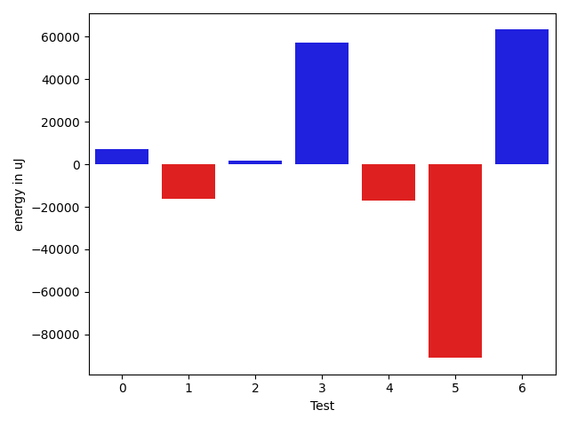
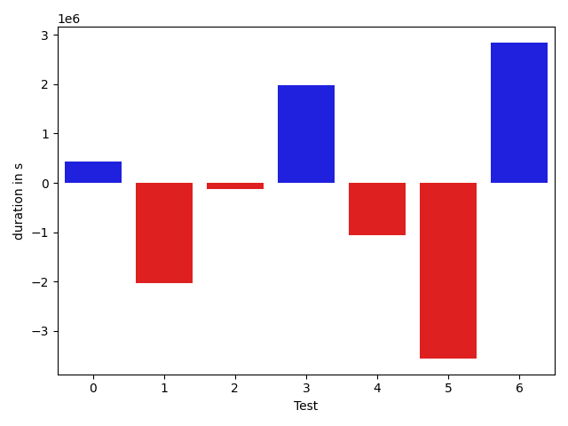

# gson 464483

https://github.com/google/gson.git/commit/464483

## Delta Energy per test method

| ID | EnergyV1 | EnergyV2 | DeltaEnergy |
| --- | --- | --- | --- |
| 0 | 33830.12867882289 | 40757.37886822224 | 6927.250189399347 |
| 1 | 106089.05357764548 | 89842.00838358633 | -16247.045194059145 |
| 2 | 36339.58799285734 | 37996.08682351459 | 1656.4988306572486 |
| 3 | 56997.19298529077 | 114265.23850800967 | 57268.0455227189 |
| 4 | 55383.23054173164 | 38132.217187754875 | -17251.013353976763 |
| 5 | 129559.2523359516 | 38544.7023164743 | -91014.5500194773 |
| 6 | 586123.4079210167 | 649369.9950735446 | 63246.58715252788 |

## Delta Duration per test method

| ID | DurationV1 | DurationsV2 | DeltaDuration |
| --- | --- | --- | --- |
| 0 | 712323.458433127 | 1138637.16572617 | 426313.7072930429 |
| 1 | 5044961.737941338 | 3019026.4359651394 | -2025935.3019761983 |
| 2 | 1024331.9501472272 | 907673.1105212348 | -116658.83962599235 |
| 3 | 1758093.4494851322 | 3747666.461281497 | 1989573.0117963648 |
| 4 | 2193245.1382116536 | 1128573.6242324784 | -1064671.5139791751 |
| 5 | 4980055.821924994 | 1419999.1385810513 | -3560056.6833439423 |
| 6 | 17410317.562641345 | 20255265.217582062 | 2844947.654940717 |

## Misc.

| ID | Test Class | Test Method |
| --- | --- | --- |
| 0 | com.google.gson.functional.StringTest | testEscapingQuotesInStringSerialization |
| 1 | com.google.gson.functional.StringTest | testSingleQuoteInStringSerialization |
| 2 | com.google.gson.functional.EscapingTest | testGsonDoubleDeserialization |
| 3 | com.google.gson.functional.EscapingTest | testGsonAcceptsEscapedAndNonEscapedJsonDeserialization |
| 4 | com.google.gson.functional.EscapingTest | testEscapingObjectFields |
| 5 | com.google.gson.functional.EscapingTest | testEscapingQuotesInStringArray |
| 6 | com.google.gson.functional.NamingPolicyTest | testComplexFieldNameStrategy |

| Test | IterationV1 | IterationV2 | DeltaIteration |
| --- | --- | --- | --- |
| 0 | 29 | 28 | -1 |
| 1 | 53 | 48 | -5 |
| 2 | 63 | 63 | 0 |
| 3 | 92 | 94 | 2 |
| 4 | 90 | 90 | 0 |
| 5 | 76 | 78 | 2 |
| 6 | 99 | 99 | 0 |

| Time Label | Time (s) |
| --- | --- |
| Selection | 34.57749819755554 |
| Injection | 13.473906755447388 |
| Total | 1362.6149241924286 |

## Aggregation per test class

| Index | EnergyV1 | EnergyV2 | DeltaEnergy |
| --- | --- | --- | --- |
| 0 | 139919.18225646837 | 130599.38725180857 | -9319.795004659798 |
| 1 | 278279.26385583135 | 228938.2448357534 | -49341.01902007795 |
| 2 | 586123.4079210167 | 649369.9950735446 | 63246.58715252788 |

| Index | DurationV1 | DurationsV2 | DeltaDuration |
| --- | --- | --- | --- |
| 0 | 5757285.196374465 | 4157663.6016913094 | -1599621.5946831554 |
| 1 | 9955726.359769007 | 7203912.334616262 | -2751814.0251527457 |
| 2 | 17410317.562641345 | 20255265.217582062 | 2844947.654940717 |
| Index | TestClassName | #Tests |
| --- | --- | --- |
| 0 | com.google.gson.functional.StringTest | 2 |
| 1 | com.google.gson.functional.EscapingTest | 4 |
| 2 | com.google.gson.functional.NamingPolicyTest | 1 |
