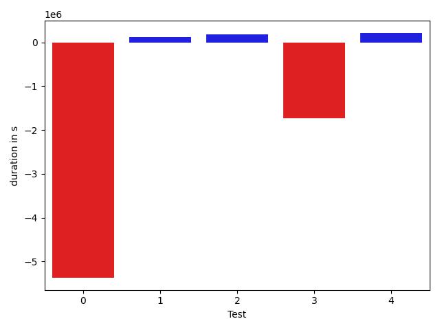

# gson 2d072b

https://github.com/google/gson.git/commit/2d072b

## Delta Energy per test method

| ID | EnergyV1 | EnergyV2 | DeltaEnergy |
| --- | --- | --- | --- |
| 0 | 401611.95284387283 | 199472.01316663204 | -202139.9396772408 |
| 1 | 51108.129009873315 | 57320.11184772455 | 6211.982837851232 |
| 2 | 150348.83486654697 | 139259.5923535605 | -11089.242512986471 |
| 3 | 193350.78758461532 | 153806.86608679485 | -39543.92149782047 |
| 4 | 83547.89664209579 | 66741.76394456996 | -16806.132697525827 |

## Delta Duration per test method

| ID | DurationV1 | DurationsV2 | DeltaDuration |
| --- | --- | --- | --- |
| 0 | 11418638.492704514 | 6046399.56094771 | -5372238.931756805 |
| 1 | 1525302.0340130255 | 1642799.9793931395 | 117497.94538011402 |
| 2 | 4411093.64837599 | 4603755.920003062 | 192662.27162707224 |
| 3 | 7081508.844373157 | 5346125.464130195 | -1735383.3802429624 |
| 4 | 2918039.97061428 | 3135206.816797315 | 217166.84618303506 |

## Misc.

| ID | Test Class | Test Method |
| --- | --- | --- |
| 0 | com.google.gson.internal.bind.JsonElementReaderTest | testSkipValue |
| 1 | com.google.gson.functional.ExclusionStrategyFunctionalTest | testExclusionStrategyWithMode |
| 2 | com.google.gson.functional.ExclusionStrategyFunctionalTest | testExclusionStrategyDeserialization |
| 3 | com.google.gson.functional.CustomDeserializerTest | testJsonTypeFieldBasedDeserialization |
| 4 | com.google.gson.functional.JsonParserTest | testBadFieldTypeForDeserializingCustomTree |

| Test | IterationV1 | IterationV2 | DeltaIteration |
| --- | --- | --- | --- |
| 0 | 81 | 80 | -1 |
| 1 | 98 | 99 | 1 |
| 2 | 99 | 99 | 0 |
| 3 | 99 | 99 | 0 |
| 4 | 99 | 99 | 0 |

| Time Label | Time (s) |
| --- | --- |
| Selection | 34.551957845687866 |
| Injection | 13.514277696609497 |
| Total | 1373.0221560001373 |

## Aggregation per test class

| Index | EnergyV1 | EnergyV2 | DeltaEnergy |
| --- | --- | --- | --- |
| 0 | 401611.95284387283 | 199472.01316663204 | -202139.9396772408 |
| 1 | 201456.96387642028 | 196579.70420128503 | -4877.259675135254 |
| 2 | 193350.78758461532 | 153806.86608679485 | -39543.92149782047 |
| 3 | 83547.89664209579 | 66741.76394456996 | -16806.132697525827 |

| Index | DurationV1 | DurationsV2 | DeltaDuration |
| --- | --- | --- | --- |
| 0 | 11418638.492704514 | 6046399.56094771 | -5372238.931756805 |
| 1 | 5936395.682389015 | 6246555.899396202 | 310160.21700718626 |
| 2 | 7081508.844373157 | 5346125.464130195 | -1735383.3802429624 |
| 3 | 2918039.97061428 | 3135206.816797315 | 217166.84618303506 |
| Index | TestClassName | #Tests |
| --- | --- | --- |
| 0 | com.google.gson.internal.bind.JsonElementReaderTest | 1 |
| 1 | com.google.gson.functional.ExclusionStrategyFunctionalTest | 2 |
| 2 | com.google.gson.functional.CustomDeserializerTest | 1 |
| 3 | com.google.gson.functional.JsonParserTest | 1 |
