# gson 9c30b0

https://github.com/google/gson.git/commit/9c30b0

## Delta Energy per test method

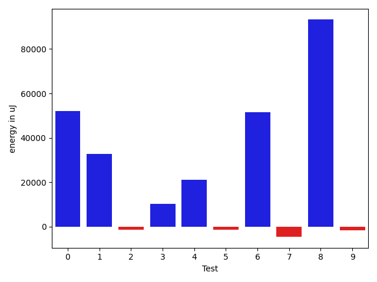

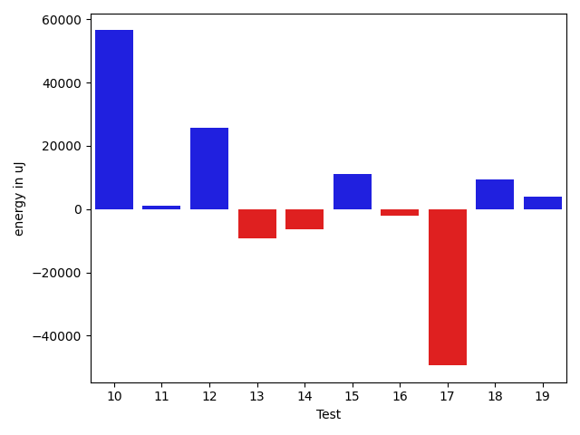

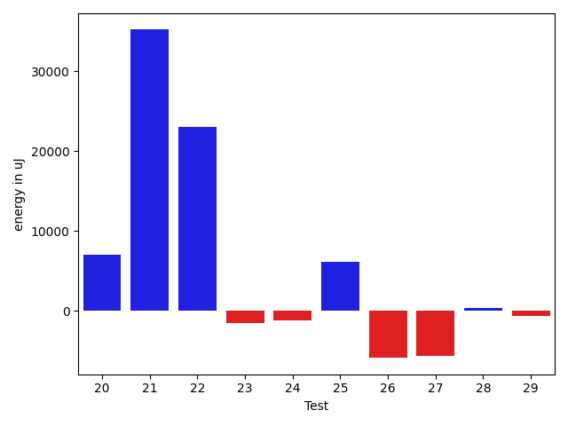

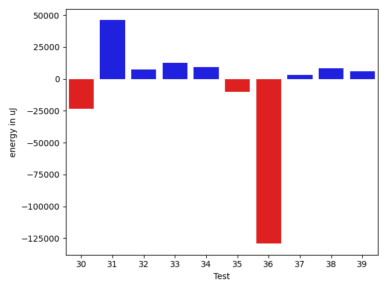

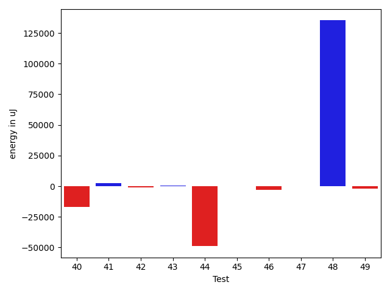

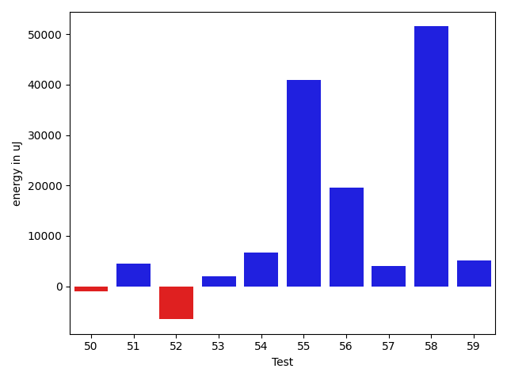

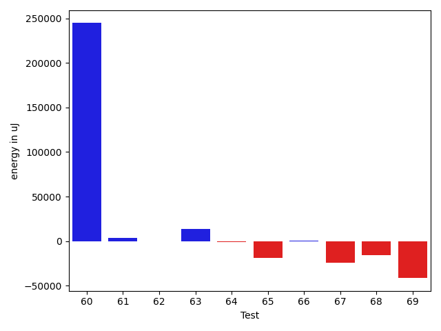

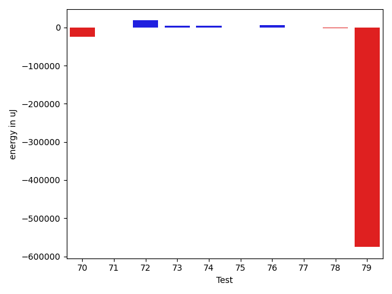

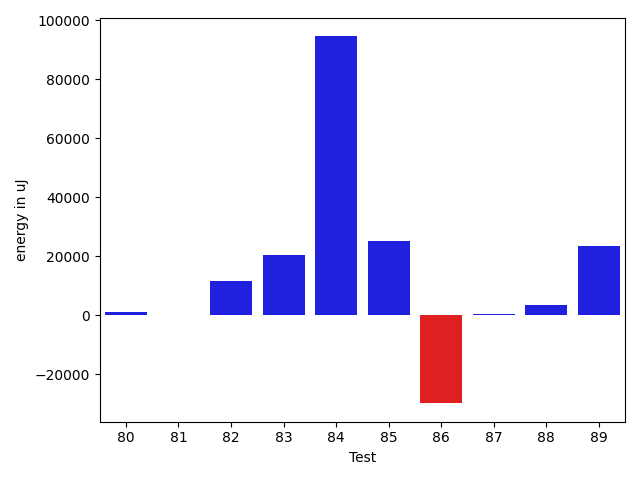

| ID | EnergyV1 | EnergyV2 | DeltaEnergy |
| --- | --- | --- | --- |
| 0 | 144332.04764812184 | 196470.23535467577 | 52138.18770655393 |
| 1 | 88682.50753414474 | 121479.80074931217 | 32797.29321516743 |
| 2 | 38962.56327658233 | 37598.19376968866 | -1364.3695068936722 |
| 3 | 44727.834061303176 | 55058.62316732315 | 10330.789106019976 |
| 4 | 41360.98245249897 | 62583.9827913583 | 21223.000338859332 |
| 5 | 56058.568636312724 | 54702.84146488473 | -1355.7271714279923 |
| 6 | 57110.0620980542 | 108661.84226195958 | 51551.78016390538 |
| 7 | 40101.75064788865 | 35528.33877010392 | -4573.4118777847325 |
| 8 | 94395.48005812042 | 187603.06533180748 | 93207.58527368706 |
| 9 | 45065.642347065324 | 43524.14235382725 | -1541.4999932380742 |
| 10 | 97763.84773034188 | 154311.57675985314 | 56547.72902951126 |
| 11 | 42298.27447896503 | 43499.387321904185 | 1201.1128429391538 |
| 12 | 40866.98836931287 | 66591.51760960107 | 25724.529240288197 |
| 13 | 74075.2429937062 | 64907.29157942339 | -9167.951414282805 |
| 14 | 63528.050908222416 | 57201.17283237669 | -6326.878075845729 |
| 15 | 48833.65493285171 | 60065.67537251982 | 11232.020439668115 |
| 16 | 40788.6245130643 | 38778.23112118261 | -2010.393391881691 |
| 17 | 99199.47679108908 | 49755.07179897155 | -49444.40499211753 |
| 18 | 132621.96062586812 | 141910.43607438856 | 9288.475448520447 |
| 19 | 40543.703148224726 | 44406.43668411863 | 3862.7335358939017 |
| 20 | 43239.47954500661 | 50216.92169368489 | 6977.442148678281 |
| 21 | 108733.36009216087 | 143943.5162894238 | 35210.15619726293 |
| 22 | 45870.248610695315 | 68926.06672376259 | 23055.818113067275 |
| 23 | 57368.424640413374 | 55878.59978134278 | -1489.8248590705916 |
| 24 | 42696.72691946808 | 41534.96405836448 | -1161.762861103598 |
| 25 | 37761.6574826336 | 43890.07493510327 | 6128.417452469672 |
| 26 | 68467.69745715974 | 62574.94806805097 | -5892.749389108765 |
| 27 | 50812.09784762827 | 45145.244675922666 | -5666.853171705603 |
| 28 | 44404.510960942134 | 44742.02633134276 | 337.5153704006225 |
| 29 | 38133.187129743994 | 37528.42722534124 | -604.759904402752 |
| 30 | 63712.20608885132 | 40122.4611693538 | -23589.74491949752 |
| 31 | 151704.67302912017 | 197761.4932726114 | 46056.82024349124 |
| 32 | 45651.4705148209 | 52985.08101450924 | 7333.610499688337 |
| 33 | 36268.946672316626 | 48934.526153422004 | 12665.579481105378 |
| 34 | 58813.76651514333 | 67973.39225251303 | 9159.6257373697 |
| 35 | 61899.529876313594 | 51741.39581232425 | -10158.134063989346 |
| 36 | 209855.35195231164 | 80669.08439174131 | -129186.26756057033 |
| 37 | 38640.35309649745 | 41912.608705151826 | 3272.2556086543773 |
| 38 | 37005.44672225247 | 45499.47577924362 | 8494.029056991152 |
| 39 | 46289.634716725566 | 52319.65621610169 | 6030.021499376126 |
| 40 | 60310.85612576344 | 43460.004621988286 | -16850.851503775157 |
| 41 | 39292.303403247366 | 41680.634880925536 | 2388.33147767817 |
| 42 | 40872.05273828924 | 39881.44654993033 | -990.6061883589064 |
| 43 | 41701.70703426495 | 42222.59893337019 | 520.8918991052342 |
| 44 | 144802.72027517657 | 95895.36280509311 | -48907.35747008346 |
| 45 | 97979.37331208949 | 97977.35049674814 | -2.0228153413481778 |
| 46 | 44510.6149148468 | 41709.7929200997 | -2800.8219947471007 |
| 47 | 43721.87275516795 | 43600.07073880364 | -121.80201636430866 |
| 48 | 1750072.0319103515 | 1885309.8772643676 | 135237.84535401617 |
| 49 | 54031.40938459325 | 52267.20324192208 | -1764.2061426711734 |
| 50 | 55360.95979112429 | 54336.14059196941 | -1024.819199154881 |
| 51 | 48183.836421369706 | 52652.86093634555 | 4469.024514975841 |
| 52 | 48253.21280768827 | 41703.69067324204 | -6549.522134446233 |
| 53 | 43472.134286768705 | 45386.68108638318 | 1914.5467996144725 |
| 54 | 103175.4843671228 | 109901.7911649498 | 6726.306797826997 |
| 55 | 158011.5824040065 | 198959.19904137182 | 40947.61663736531 |
| 56 | 43951.405499294735 | 63455.003130221055 | 19503.59763092632 |
| 57 | 100838.61791446096 | 104832.0871060848 | 3993.469191623837 |
| 58 | 62500.34628869059 | 114039.95157900252 | 51539.60529031193 |
| 59 | 44566.37937774329 | 49612.59997512965 | 5046.22059738636 |
| 60 | 66206.37749838777 | 310917.83915188303 | 244711.46165349527 |
| 61 | 47847.83674795575 | 51273.7833953364 | 3425.9466473806533 |
| 62 | 42393.308235386794 | 41741.757350847394 | -651.5508845393997 |
| 63 | 44338.58168612521 | 58093.866299046036 | 13755.284612920826 |
| 64 | 45097.63287898898 | 43871.803079698235 | -1225.8297992907465 |
| 65 | 64985.268907547 | 46080.82028579712 | -18904.448621749878 |
| 66 | 42654.72123566475 | 43510.146754164045 | 855.4255184992944 |
| 67 | 67935.93219524577 | 43691.684842910596 | -24244.247352335173 |
| 68 | 55543.175969068965 | 39951.51626823176 | -15591.659700837205 |
| 69 | 82932.9881178615 | 41417.520861668345 | -41515.46725619316 |
| 70 | 143783.8946997626 | 119573.18333796042 | -24210.711361802183 |
| 71 | 40098.132177352905 | 39954.007343292236 | -144.12483406066895 |
| 72 | 41923.80962654743 | 59959.93993692126 | 18036.130310373832 |
| 73 | 39221.28518760204 | 43110.28317499161 | 3888.9979873895645 |
| 74 | 39433.399085998535 | 43173.97293281555 | 3740.5738468170166 |
| 75 | 42526.533045977354 | 42057.489418779034 | -469.0436271983199 |
| 76 | 38083.91731389015 | 43413.95026076268 | 5330.032946872525 |
| 77 | 40803.624638706446 | 41099.07420349121 | 295.44956478476524 |
| 78 | 45986.11922454834 | 44145.63926386833 | -1840.479960680008 |
| 79 | 726204.6041970054 | 150744.26238337852 | -575460.3418136269 |
| 80 | 41651.973961272524 | 42595.993146194014 | 944.0191849214898 |
| 81 | 42224.45942321443 | 42470.43742207849 | 245.97799886405846 |
| 82 | 107833.8146616384 | 119535.09007354868 | 11701.275411910276 |
| 83 | 86888.70010525177 | 107383.90643179676 | 20495.206326544983 |
| 84 | 60008.43080182436 | 154697.77835701132 | 94689.34755518696 |
| 85 | 42270.88428781662 | 67533.5937343122 | 25262.709446495588 |
| 86 | 76136.4049486196 | 46242.53791075982 | -29893.86703785978 |
| 87 | 44180.59672871465 | 44701.202920659445 | 520.6061919447966 |
| 88 | 41909.76107740402 | 45341.5888671875 | 3431.827789783478 |
| 89 | 46022.02948784828 | 69417.12698549405 | 23395.097497645766 |

## Delta Duration per test method

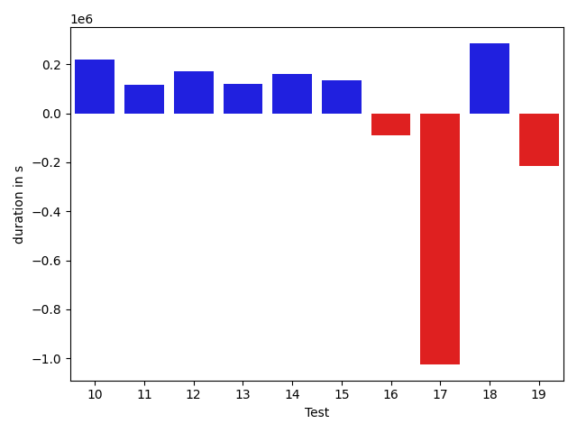

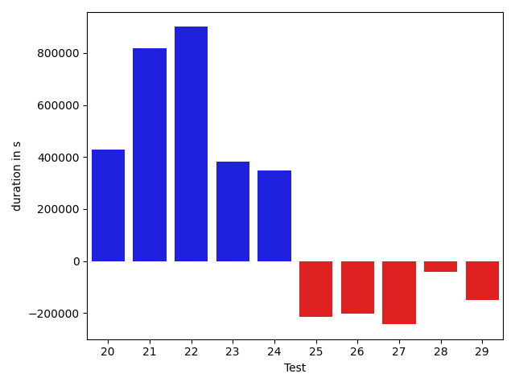

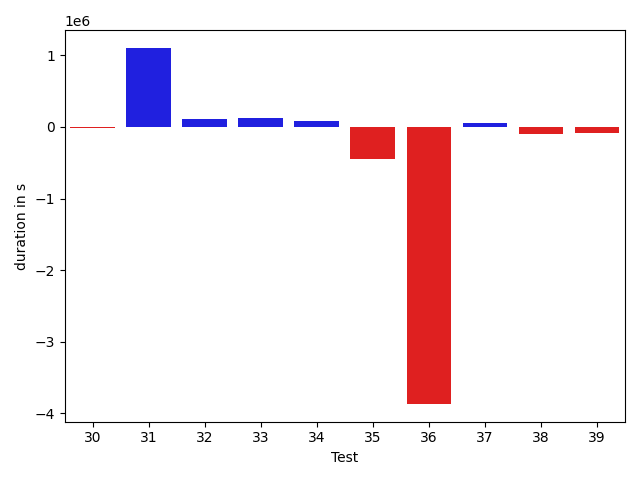

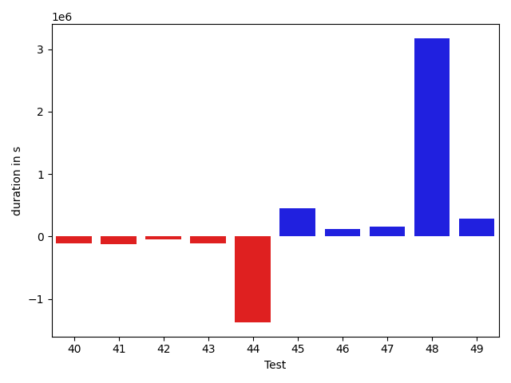

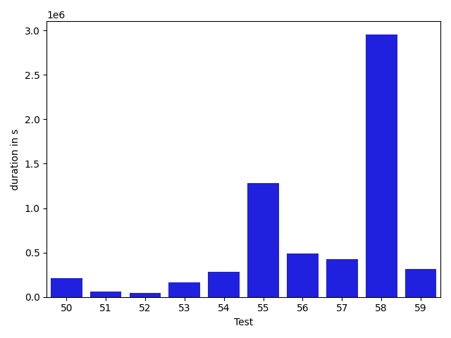

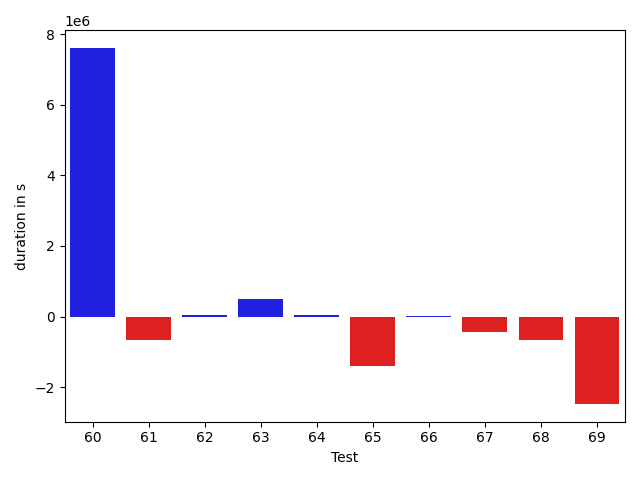

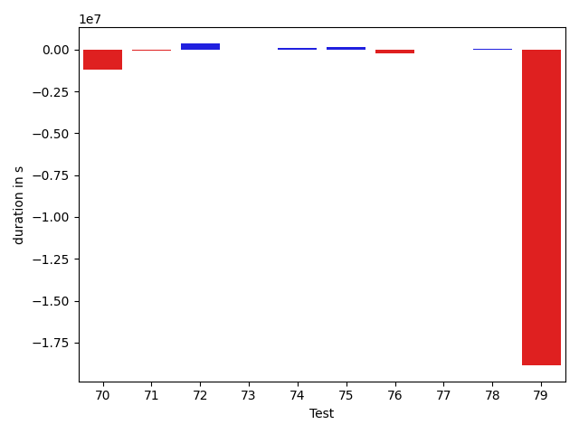

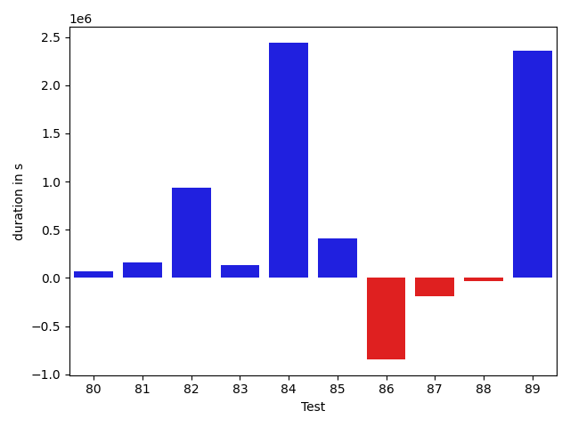

| ID | DurationV1 | DurationsV2 | DeltaDuration |
| --- | --- | --- | --- |
| 0 | 3752603.4592738086 | 4473710.403708387 | 721106.9444345785 |
| 1 | 2301669.185767698 | 3113478.903506283 | 811809.7177385851 |
| 2 | 886023.1710011344 | 947516.2384340186 | 61493.06743288413 |
| 3 | 1065144.399064573 | 1550606.830944099 | 485462.431879526 |
| 4 | 1263630.3362927034 | 1595960.3654797168 | 332330.0291870134 |
| 5 | 3270302.8970042136 | 2131925.2804414188 | -1138377.616562795 |
| 6 | 1712196.0460411943 | 3299024.3896345687 | 1586828.3435933744 |
| 7 | 1102821.213797591 | 1162108.0608710272 | 59286.84707343625 |
| 8 | 2740381.1550271623 | 4995331.259607647 | 2254950.1045804843 |
| 9 | 1328252.3547543683 | 1407371.3118106006 | 79118.95705623226 |
| 10 | 3167023.24887757 | 3387848.6826344123 | 220825.43375684228 |
| 11 | 1339308.1797655474 | 1455886.6715509589 | 116578.49178541149 |
| 12 | 1147381.4733672813 | 1319087.9337587561 | 171706.4603914749 |
| 13 | 1485255.4455283172 | 1606870.3353845156 | 121614.88985619834 |
| 14 | 1164406.9659803975 | 1325043.298980287 | 160636.3329998895 |
| 15 | 1190929.8090095194 | 1325545.569809265 | 134615.76079974556 |
| 16 | 1054936.8245432903 | 963500.1098079754 | -91436.71473531495 |
| 17 | 2711695.2788050296 | 1687241.3562275963 | -1024453.9225774333 |
| 18 | 3702436.260620849 | 3988246.151800516 | 285809.89117966685 |
| 19 | 1058147.4896294577 | 844385.6318446193 | -213761.85778483842 |
| 20 | 1106261.4533281405 | 1535786.3094935226 | 429524.8561653821 |
| 21 | 2768098.3665494723 | 3586339.3632914675 | 818240.9967419952 |
| 22 | 1385499.5267315384 | 2285540.6035683905 | 900041.0768368521 |
| 23 | 1406908.703312704 | 1789117.69294217 | 382208.98962946585 |
| 24 | 1012678.5166780134 | 1360898.8531036333 | 348220.3364256199 |
| 25 | 835303.6290595826 | 621135.0363888755 | -214168.59267070715 |
| 26 | 2310212.467869141 | 2106492.700322789 | -203719.767546352 |
| 27 | 1242850.6932282576 | 999353.9427748121 | -243496.75045344548 |
| 28 | 554043.3752271635 | 512816.33632335067 | -41227.03890381288 |
| 29 | 1573619.3915671722 | 1422415.4865156808 | -151203.90505149146 |
| 30 | 1507182.7408363826 | 1494169.5846285652 | -13013.156207817374 |
| 31 | 4686405.298815039 | 5790618.675115587 | 1104213.3763005482 |
| 32 | 1425439.289777143 | 1539494.5693835123 | 114055.27960636932 |
| 33 | 1471739.9165047654 | 1602316.7601128048 | 130576.84360803943 |
| 34 | 1830385.3670790647 | 1912953.0869192756 | 82567.71984021086 |
| 35 | 1877217.9479944813 | 1424251.2086747997 | -452966.73931968166 |
| 36 | 5861439.773077658 | 1991898.0865007597 | -3869541.6865768987 |
| 37 | 582798.7512151863 | 639732.1466017962 | 56933.39538660983 |
| 38 | 1021393.8120912928 | 920109.7938034427 | -101284.01828785008 |
| 39 | 1451725.4843961245 | 1372501.687216428 | -79223.79717969638 |
| 40 | 1507073.3096708967 | 1392653.9551066794 | -114419.35456421738 |
| 41 | 1198917.6039051996 | 1078174.9197871147 | -120742.68411808484 |
| 42 | 1455817.3708590716 | 1402950.7829256225 | -52866.587933449075 |
| 43 | 1007768.8122669053 | 894692.4084847488 | -113076.40378215653 |
| 44 | 3647310.939151131 | 2271612.1241798843 | -1375698.8149712468 |
| 45 | 1992238.9235300426 | 2445572.808793268 | 453333.88526322553 |
| 46 | 823191.6212937178 | 940543.911949717 | 117352.29065599921 |
| 47 | 968186.8120147332 | 1129751.2234256533 | 161564.4114109201 |
| 48 | 41365463.38345049 | 44540492.20974031 | 3175028.8262898177 |
| 49 | 1523435.4145005993 | 1805388.747838075 | 281953.3333374758 |
| 50 | 1375146.4174268239 | 1590466.2588417202 | 215319.8414148963 |
| 51 | 1300281.5934802517 | 1362138.6566766663 | 61857.063196414616 |
| 52 | 723000.6880851417 | 765272.2194445289 | 42271.53135938721 |
| 53 | 1010344.4945810558 | 1178345.3868303762 | 168000.8922493204 |
| 54 | 2575819.456956769 | 2860859.1694155745 | 285039.71245880565 |
| 55 | 3631665.6928012446 | 4912902.236702578 | 1281236.5439013336 |
| 56 | 777704.3594460762 | 1267635.162563806 | 489930.8031177297 |
| 57 | 2387560.8414043593 | 2816518.8624358876 | 428958.02103152825 |
| 58 | 1187188.4104782394 | 4142922.8938094242 | 2955734.483331185 |
| 59 | 1365607.188656544 | 1679106.2502582425 | 313499.0616016984 |
| 60 | 2160327.941934538 | 9765490.836087283 | 7605162.894152745 |
| 61 | 2440535.7145320764 | 1771820.3374699557 | -668715.3770621207 |
| 62 | 985276.6853342458 | 1033636.9697407908 | 48360.28440654499 |
| 63 | 692584.0933433839 | 1192843.7712816065 | 500259.67793822265 |
| 64 | 545086.9374437779 | 593161.9581473954 | 48075.02070361748 |
| 65 | 1817928.5651788712 | 418466.58491516113 | -1399461.98026371 |
| 66 | 886615.0976604101 | 888866.9021565134 | 2251.8044961033156 |
| 67 | 1358302.2086886372 | 910074.5880655372 | -448227.6206231001 |
| 68 | 1715296.5536382417 | 1044922.267836408 | -670374.2858018337 |
| 69 | 3265243.909668585 | 791544.1641420522 | -2473699.7455265326 |
| 70 | 4055999.6318939705 | 2862605.0599515433 | -1193394.5719424272 |
| 71 | 580918.2475299835 | 529534.7188720703 | -51383.52865791321 |
| 72 | 1189193.2688951723 | 1555819.2944706327 | 366626.0255754604 |
| 73 | 540752.8423887491 | 502897.06062197685 | -37855.78176677227 |
| 74 | 510372.59564208984 | 599617.4637832642 | 89244.86814117432 |
| 75 | 500806.2041514069 | 622902.6724430998 | 122096.4682916929 |
| 76 | 786578.0360284765 | 560713.5923736396 | -225864.44365483697 |
| 77 | 585532.3686042726 | 593799.5805931091 | 8267.211988836527 |
| 78 | 425088.66087150574 | 468214.4516541213 | 43125.79078261554 |
| 79 | 23003993.28408748 | 4148996.7295499393 | -18854996.55453754 |
| 80 | 797293.3934928745 | 865320.7572098777 | 68027.36371700326 |
| 81 | 500006.1505772765 | 658986.4526582207 | 158980.30208094418 |
| 82 | 2687806.81658208 | 3620648.9649155787 | 932842.1483334987 |
| 83 | 2778363.654937229 | 2913076.201155751 | 134712.5462185219 |
| 84 | 1669391.5312324376 | 4111401.2862698413 | 2442009.7550374037 |
| 85 | 1185134.4127839333 | 1593583.3020518718 | 408448.88926793844 |
| 86 | 2154872.2905803826 | 1310357.4740751407 | -844514.8165052419 |
| 87 | 911860.4687681495 | 717771.1046195067 | -194089.36414864275 |
| 88 | 401800.4525334835 | 369033.7861328125 | -32766.666400671005 |
| 89 | 484794.89448690414 | 2838778.378733972 | 2353983.484247068 |

## Misc.

| ID | Test Class | Test Method |
| --- | --- | --- |
| 0 | com.google.gson.functional.StreamingTypeAdaptersTest | testNullSafe |
| 1 | com.google.gson.functional.JsonAdapterAnnotationOnClassesTest | testJsonAdapterInvoked |
| 2 | com.google.gson.functional.JsonAdapterAnnotationOnClassesTest | testRegisteredDeserializerOverridesJsonAdapter |
| 3 | com.google.gson.functional.JsonAdapterAnnotationOnClassesTest | testRegisteredSerializerOverridesJsonAdapter |
| 4 | com.google.gson.functional.JsonAdapterAnnotationOnClassesTest | testJsonAdapterFactoryInvoked |
| 5 | com.google.gson.functional.CustomDeserializerTest | testDefaultConstructorNotCalledOnObject |
| 6 | com.google.gson.functional.CustomDeserializerTest | testJsonTypeFieldBasedDeserialization |
| 7 | com.google.gson.functional.CustomDeserializerTest | testDefaultConstructorNotCalledOnField |
| 8 | com.google.gson.functional.JsonAdapterSerializerDeserializerTest | testJsonSerializerDeserializerBasedJsonAdapterOnFields |
| 9 | com.google.gson.functional.JsonAdapterSerializerDeserializerTest | testJsonSerializerDeserializerBasedJsonAdapterOnClass |
| 10 | com.google.gson.functional.ThrowableFunctionalTest | testExceptionWithoutCause |
| 11 | com.google.gson.functional.ThrowableFunctionalTest | testErrornWithCause |
| 12 | com.google.gson.functional.ThrowableFunctionalTest | testErrorWithoutCause |
| 13 | com.google.gson.functional.ThrowableFunctionalTest | testExceptionWithCause |
| 14 | com.google.gson.functional.ReadersWritersTest | testReadWriteTwoObjects |
| 15 | com.google.gson.functional.ReadersWritersTest | testReadWriteTwoStrings |
| 16 | com.google.gson.functional.MapTest | testConcurrentSkipListMap |
| 17 | com.google.gson.functional.MapTest | testConcurrentMap |
| 18 | com.google.gson.functional.MapTest | testConcurrentNavigableMap |
| 19 | com.google.gson.functional.MapTest | testConcurrentHashMap |
| 20 | com.google.gson.functional.EnumTest | testEnumSubclassAsParameterizedType |
| 21 | com.google.gson.functional.EnumTest | testEnumSubclass |
| 22 | com.google.gson.functional.EnumTest | testEnumSubclassWithRegisteredTypeAdapter |
| 23 | com.google.gson.functional.EnumTest | testEnumCaseMapping |
| 24 | com.google.gson.functional.EnumTest | testEnumSet |
| 25 | com.google.gson.functional.DelegateTypeAdapterTest | testDelegateInvokedOnStrings |
| 26 | com.google.gson.functional.DelegateTypeAdapterTest | testDelegateInvoked |
| 27 | com.google.gson.JsonParserTest | testReadWriteTwoObjects |
| 28 | com.google.gson.JsonParserTest | testParseMixedArray |
| 29 | com.google.gson.functional.ParameterizedTypesTest | testVariableTypeArrayDeserialization |
| 30 | com.google.gson.functional.ParameterizedTypesTest | testParameterizedTypeGenericArraysDeserialization |
| 31 | com.google.gson.functional.ParameterizedTypesTest | testVariableTypeFieldsAndGenericArraysDeserialization |
| 32 | com.google.gson.functional.ParameterizedTypesTest | testParameterizedTypeWithVariableTypeDeserialization |
| 33 | com.google.gson.functional.ParameterizedTypesTest | testVariableTypeDeserialization |
| 34 | com.google.gson.functional.ObjectTest | testSingletonLists |
| 35 | com.google.gson.functional.JsonAdapterAnnotationOnFieldsTest | testPrimitiveFieldAnnotationTakesPrecedenceOverDefault |
| 36 | com.google.gson.functional.JsonAdapterAnnotationOnFieldsTest | testClassAnnotationAdapterFactoryTakesPrecedenceOverDefault |
| 37 | com.google.gson.functional.JsonAdapterAnnotationOnFieldsTest | testJsonAdapterWrappedInNullSafeAsRequested |
| 38 | com.google.gson.functional.JsonAdapterAnnotationOnFieldsTest | testClassAnnotationAdapterTakesPrecedenceOverDefault |
| 39 | com.google.gson.functional.JsonAdapterAnnotationOnFieldsTest | testFieldAnnotationWorksForParameterizedType |
| 40 | com.google.gson.functional.JsonAdapterAnnotationOnFieldsTest | testRegisteredTypeAdapterTakesPrecedenceOverClassAnnotationAdapter |
| 41 | com.google.gson.functional.JsonAdapterAnnotationOnFieldsTest | testFieldAnnotationTakesPrecedenceOverClassAnnotation |
| 42 | com.google.gson.functional.JsonAdapterAnnotationOnFieldsTest | testFieldAnnotationTakesPrecedenceOverRegisteredTypeAdapter |
| 43 | com.google.gson.functional.JsonAdapterAnnotationOnFieldsTest | testNonPrimitiveFieldAnnotationTakesPrecedenceOverDefault |
| 44 | com.google.gson.internal.bind.JsonElementReaderTest | testSkipValue |
| 45 | com.google.gson.functional.DefaultTypeAdaptersTest | testOverrideBigIntegerTypeAdapter |
| 46 | com.google.gson.functional.DefaultTypeAdaptersTest | testSqlDateSerialization |
| 47 | com.google.gson.functional.DefaultTypeAdaptersTest | testTimestampSerialization |
| 48 | com.google.gson.functional.DefaultTypeAdaptersTest | testDefaultDateDeserializationUsingBuilder |
| 49 | com.google.gson.functional.DefaultTypeAdaptersTest | testOverrideBigDecimalTypeAdapter |
| 50 | com.google.gson.functional.DefaultTypeAdaptersTest | testDateDeserializationWithPattern |
| 51 | com.google.gson.functional.DefaultTypeAdaptersTest | testDateSerializationInCollection |
| 52 | com.google.gson.functional.DefaultTypeAdaptersTest | testBitSetDeserialization |
| 53 | com.google.gson.functional.MapAsArrayTypeAdapterTest | testMultipleEnableComplexKeyRegistrationHasNoEffect |
| 54 | com.google.gson.functional.MapAsArrayTypeAdapterTest | testSerializeComplexMapWithTypeAdapter |
| 55 | com.google.gson.functional.RuntimeTypeAdapterFactoryFunctionalTest | testSubclassesAutomaticallySerialized |
| 56 | com.google.gson.functional.ExclusionStrategyFunctionalTest | testExclusionStrategyWithMode |
| 57 | com.google.gson.functional.ExclusionStrategyFunctionalTest | testExclusionStrategyDeserialization |
| 58 | com.google.gson.functional.JavaUtilConcurrentAtomicTest | testAtomicLongWithStringSerializationPolicy |
| 59 | com.google.gson.functional.JavaUtilConcurrentAtomicTest | testAtomicLongArrayWithStringSerializationPolicy |
| 60 | com.google.gson.functional.TypeVariableTest | testAdvancedTypeVariables |
| 61 | com.google.gson.functional.TypeVariableTest | testTypeVariablesViaTypeParameter |
| 62 | com.google.gson.functional.TypeVariableTest | testBasicTypeVariables |
| 63 | com.google.gson.functional.UncategorizedTest | testGsonInstanceReusableForSerializationAndDeserialization |
| 64 | com.google.gson.functional.PrimitiveTest | testQuotedStringSerializationAndDeserialization |
| 65 | com.google.gson.GsonTypeAdapterTest | testTypeAdapterDoesNotAffectNonAdaptedTypes |
| 66 | com.google.gson.functional.EscapingTest | testGsonDoubleDeserialization |
| 67 | com.google.gson.functional.EscapingTest | testGsonAcceptsEscapedAndNonEscapedJsonDeserialization |
| 68 | com.google.gson.functional.EscapingTest | testEscapingObjectFields |
| 69 | com.google.gson.functional.EscapingTest | testEscapingQuotesInStringArray |
| 70 | com.google.gson.functional.NamingPolicyTest | testComplexFieldNameStrategy |
| 71 | com.google.gson.functional.TypeAdapterPrecedenceTest | testNonstreamingHierarchicalFollowedByNonstreaming |
| 72 | com.google.gson.functional.TypeAdapterPrecedenceTest | testNonstreamingFollowedByNonstreaming |
| 73 | com.google.gson.functional.TypeAdapterPrecedenceTest | testStreamingFollowedByNonstreamingHierarchical |
| 74 | com.google.gson.functional.TypeAdapterPrecedenceTest | testSerializeNonstreamingTypeAdapterFollowedByStreamingTypeAdapter |
| 75 | com.google.gson.functional.TypeAdapterPrecedenceTest | testStreamingHierarchicalFollowedByNonstreamingHierarchical |
| 76 | com.google.gson.functional.TypeAdapterPrecedenceTest | testStreamingFollowedByStreaming |
| 77 | com.google.gson.functional.TypeAdapterPrecedenceTest | testStreamingFollowedByNonstreaming |
| 78 | com.google.gson.functional.TypeAdapterPrecedenceTest | testStreamingHierarchicalFollowedByNonstreaming |
| 79 | com.google.gson.functional.TypeHierarchyAdapterTest | testTypeHierarchy |
| 80 | com.google.gson.functional.TypeHierarchyAdapterTest | testRegisterSuperTypeFirst |
| 81 | com.google.gson.functional.JavaUtilTest | testProperties |
| 82 | com.google.gson.functional.JavaUtilTest | testCurrency |
| 83 | com.google.gson.DefaultInetAddressTypeAdapterTest | testInetAddressSerializationAndDeserialization |
| 84 | com.google.gson.functional.CollectionTest | testWildcardCollectionField |
| 85 | com.google.gson.functional.CollectionTest | testFieldIsArrayList |
| 86 | com.google.gson.functional.JsonParserTest | testBadFieldTypeForDeserializingCustomTree |
| 87 | com.google.gson.OverrideCoreTypeAdaptersTest | testOverrideStringAdapter |
| 88 | com.google.gson.functional.StringTest | testEscapingQuotesInStringSerialization |
| 89 | com.google.gson.functional.StringTest | testSingleQuoteInStringSerialization |

| Test | IterationV1 | IterationV2 | DeltaIteration |
| --- | --- | --- | --- |
| 0 | 99 | 99 | 0 |
| 1 | 99 | 99 | 0 |
| 2 | 46 | 46 | 0 |
| 3 | 48 | 55 | 7 |
| 4 | 87 | 89 | 2 |
| 5 | 48 | 40 | -8 |
| 6 | 99 | 99 | 0 |
| 7 | 59 | 57 | -2 |
| 8 | 99 | 99 | 0 |
| 9 | 99 | 98 | -1 |
| 10 | 99 | 99 | 0 |
| 11 | 95 | 95 | 0 |
| 12 | 82 | 78 | -4 |
| 13 | 98 | 95 | -3 |
| 14 | 74 | 65 | -9 |
| 15 | 73 | 76 | 3 |
| 16 | 70 | 68 | -2 |
| 17 | 97 | 96 | -1 |
| 18 | 99 | 99 | 0 |
| 19 | 60 | 65 | 5 |
| 20 | 90 | 85 | -5 |
| 21 | 99 | 99 | 0 |
| 22 | 96 | 93 | -3 |
| 23 | 84 | 81 | -3 |
| 24 | 72 | 69 | -3 |
| 25 | 33 | 39 | 6 |
| 26 | 99 | 99 | 0 |
| 27 | 74 | 81 | 7 |
| 28 | 30 | 28 | -2 |
| 29 | 93 | 96 | 3 |
| 30 | 99 | 98 | -1 |
| 31 | 99 | 99 | 0 |
| 32 | 96 | 88 | -8 |
| 33 | 93 | 96 | 3 |
| 34 | 99 | 99 | 0 |
| 35 | 97 | 99 | 2 |
| 36 | 99 | 99 | 0 |
| 37 | 36 | 28 | -8 |
| 38 | 74 | 72 | -2 |
| 39 | 99 | 99 | 0 |
| 40 | 92 | 91 | -1 |
| 41 | 90 | 84 | -6 |
| 42 | 95 | 99 | 4 |
| 43 | 59 | 73 | 14 |
| 44 | 50 | 56 | 6 |
| 45 | 99 | 99 | 0 |
| 46 | 53 | 70 | 17 |
| 47 | 76 | 70 | -6 |
| 48 | 99 | 99 | 0 |
| 49 | 99 | 99 | 0 |
| 50 | 98 | 99 | 1 |
| 51 | 94 | 94 | 0 |
| 52 | 40 | 46 | 6 |
| 53 | 85 | 80 | -5 |
| 54 | 99 | 99 | 0 |
| 55 | 99 | 99 | 0 |
| 56 | 67 | 63 | -4 |
| 57 | 99 | 99 | 0 |
| 58 | 57 | 62 | 5 |
| 59 | 97 | 99 | 2 |
| 60 | 98 | 95 | -3 |
| 61 | 95 | 94 | -1 |
| 62 | 60 | 57 | -3 |
| 63 | 48 | 55 | 7 |
| 64 | 27 | 29 | 2 |
| 65 | 20 | 19 | -1 |
| 66 | 43 | 49 | 6 |
| 67 | 62 | 70 | 8 |
| 68 | 60 | 56 | -4 |
| 69 | 35 | 41 | 6 |
| 70 | 89 | 92 | 3 |
| 71 | 20 | 18 | -2 |
| 72 | 86 | 91 | 5 |
| 73 | 23 | 23 | 0 |
| 74 | 18 | 20 | 2 |
| 75 | 27 | 33 | 6 |
| 76 | 36 | 36 | 0 |
| 77 | 26 | 19 | -7 |
| 78 | 20 | 27 | 7 |
| 79 | 99 | 99 | 0 |
| 80 | 47 | 49 | 2 |
| 81 | 32 | 37 | 5 |
| 82 | 99 | 99 | 0 |
| 83 | 99 | 99 | 0 |
| 84 | 99 | 96 | -3 |
| 85 | 80 | 85 | 5 |
| 86 | 88 | 89 | 1 |
| 87 | 37 | 31 | -6 |
| 88 | 23 | 11 | -12 |
| 89 | 23 | 29 | 6 |

| Time Label | Time (s) |
| --- | --- |
| Selection | 34.579663038253784 |
| Injection | 18.670491218566895 |
| Total | 1480.361750125885 |

## Aggregation per test class

| Index | EnergyV1 | EnergyV2 | DeltaEnergy |
| --- | --- | --- | --- |
| 0 | 144332.04764812184 | 196470.23535467577 | 52138.18770655393 |
| 1 | 213733.88732452923 | 276720.60047768225 | 62986.71315315302 |
| 2 | 153270.38138225558 | 198893.02249694825 | 45622.64111469267 |
| 3 | 139461.12240518574 | 231127.20768563473 | 91666.08528044898 |
| 4 | 255004.35357232598 | 329309.7732707818 | 74305.41969845581 |
| 5 | 112361.70584107412 | 117266.84820489651 | 4905.142363822393 |
| 6 | 313153.76507824624 | 274850.1756786613 | -38303.58939958492 |
| 7 | 297908.2398077443 | 360500.0685465785 | 62591.82873883424 |
| 8 | 106229.35493979334 | 106465.02300315425 | 235.66806336090667 |
| 9 | 95216.6088085704 | 89887.27100726543 | -5329.337801304966 |
| 10 | 335470.483434853 | 377331.9888352377 | 41861.50540038466 |
| 11 | 58813.76651514333 | 67973.39225251303 | 9159.6257373697 |
| 12 | 575867.2356656657 | 439386.90589077707 | -136480.32977488864 |
| 13 | 144802.72027517657 | 95895.36280509311 | -48907.35747008346 |
| 14 | 2142113.3112972314 | 2269556.9868634976 | 127443.67556626629 |
| 15 | 146647.6186538915 | 155288.47225133298 | 8640.853597441484 |
| 16 | 158011.5824040065 | 198959.19904137182 | 40947.61663736531 |
| 17 | 144790.0234137557 | 168287.09023630584 | 23497.066822550143 |
| 18 | 107066.72566643388 | 163652.55155413217 | 56585.82588769829 |
| 19 | 156447.52248173032 | 403933.37989806687 | 247485.85741633654 |
| 20 | 44338.58168612521 | 58093.866299046036 | 13755.284612920826 |
| 21 | 45097.63287898898 | 43871.803079698235 | -1225.8297992907465 |
| 22 | 64985.268907547 | 46080.82028579712 | -18904.448621749878 |
| 23 | 249066.817517841 | 168570.86872697473 | -80495.94879086627 |
| 24 | 143783.8946997626 | 119573.18333796042 | -24210.711361802183 |
| 25 | 328076.8203006232 | 356914.3565349219 | 28837.53623429872 |
| 26 | 767856.5781582779 | 193340.25552957255 | -574516.3226287053 |
| 27 | 150058.27408485283 | 162005.52749562718 | 11947.253410774341 |
| 28 | 86888.70010525177 | 107383.90643179676 | 20495.206326544983 |
| 29 | 102279.31508964098 | 222231.37209132354 | 119952.05700168257 |
| 30 | 76136.4049486196 | 46242.53791075982 | -29893.86703785978 |
| 31 | 44180.59672871465 | 44701.202920659445 | 520.6061919447966 |
| 32 | 87931.7905652523 | 114758.71585268155 | 26826.925287429243 |

| Index | DurationV1 | DurationsV2 | DeltaDuration |
| --- | --- | --- | --- |
| 0 | 3752603.4592738086 | 4473710.403708387 | 721106.9444345785 |
| 1 | 5516467.09212611 | 7207562.338364118 | 1691095.2462380081 |
| 2 | 6085320.156842998 | 6593057.730947015 | 507737.57410401665 |
| 3 | 4068633.5097815306 | 6402702.571418247 | 2334069.0616367166 |
| 4 | 7138968.347538716 | 7769693.623328643 | 630725.2757899268 |
| 5 | 2355336.774989917 | 2650588.868789552 | 295252.09379963484 |
| 6 | 8527215.853598628 | 7483373.249680707 | -1043842.603917921 |
| 7 | 7679446.566599868 | 10557682.822399184 | 2878236.255799316 |
| 8 | 3145516.0969287236 | 2727627.7367116646 | -417888.36021705903 |
| 9 | 1796894.0684554211 | 1512170.279098163 | -284723.78935725824 |
| 10 | 10664386.637500502 | 11849015.07575615 | 1184628.4382556472 |
| 11 | 1830385.3670790647 | 1912953.0869192756 | 82567.71984021086 |
| 12 | 15964152.865476815 | 11116964.989101393 | -4847187.876375422 |
| 13 | 3647310.939151131 | 2271612.1241798843 | -1375698.8149712468 |
| 14 | 50070944.853781804 | 54579626.03670994 | 4508681.1829281375 |
| 15 | 3586163.9515378247 | 4039204.556245951 | 453040.6047081263 |
| 16 | 3631665.6928012446 | 4912902.236702578 | 1281236.5439013336 |
| 17 | 3165265.2008504355 | 4084154.0249996935 | 918888.824149258 |
| 18 | 2552795.5991347833 | 5822029.1440676665 | 3269233.5449328832 |
| 19 | 5586140.34180086 | 12570948.14329803 | 6984807.80149717 |
| 20 | 692584.0933433839 | 1192843.7712816065 | 500259.67793822265 |
| 21 | 545086.9374437779 | 593161.9581473954 | 48075.02070361748 |
| 22 | 1817928.5651788712 | 418466.58491516113 | -1399461.98026371 |
| 23 | 7225457.769655874 | 3635407.9222005107 | -3590049.8474553633 |
| 24 | 4055999.6318939705 | 2862605.0599515433 | -1193394.5719424272 |
| 25 | 5119242.224111657 | 5433498.834811914 | 314256.6107002571 |
| 26 | 23801286.677580353 | 5014317.486759817 | -18786969.190820538 |
| 27 | 3187812.9671593565 | 4279635.417573799 | 1091822.450414443 |
| 28 | 2778363.654937229 | 2913076.201155751 | 134712.5462185219 |
| 29 | 2854525.944016371 | 5704984.588321713 | 2850458.644305342 |
| 30 | 2154872.2905803826 | 1310357.4740751407 | -844514.8165052419 |
| 31 | 911860.4687681495 | 717771.1046195067 | -194089.36414864275 |
| 32 | 886595.3470203876 | 3207812.1648667846 | 2321216.817846397 |
| Index | TestClassName | #Tests |
| --- | --- | --- |
| 0 | com.google.gson.functional.StreamingTypeAdaptersTest | 1 |
| 1 | com.google.gson.functional.JsonAdapterAnnotationOnClassesTest | 4 |
| 2 | com.google.gson.functional.CustomDeserializerTest | 3 |
| 3 | com.google.gson.functional.JsonAdapterSerializerDeserializerTest | 2 |
| 4 | com.google.gson.functional.ThrowableFunctionalTest | 4 |
| 5 | com.google.gson.functional.ReadersWritersTest | 2 |
| 6 | com.google.gson.functional.MapTest | 4 |
| 7 | com.google.gson.functional.EnumTest | 5 |
| 8 | com.google.gson.functional.DelegateTypeAdapterTest | 2 |
| 9 | com.google.gson.JsonParserTest | 2 |
| 10 | com.google.gson.functional.ParameterizedTypesTest | 5 |
| 11 | com.google.gson.functional.ObjectTest | 1 |
| 12 | com.google.gson.functional.JsonAdapterAnnotationOnFieldsTest | 9 |
| 13 | com.google.gson.internal.bind.JsonElementReaderTest | 1 |
| 14 | com.google.gson.functional.DefaultTypeAdaptersTest | 8 |
| 15 | com.google.gson.functional.MapAsArrayTypeAdapterTest | 2 |
| 16 | com.google.gson.functional.RuntimeTypeAdapterFactoryFunctionalTest | 1 |
| 17 | com.google.gson.functional.ExclusionStrategyFunctionalTest | 2 |
| 18 | com.google.gson.functional.JavaUtilConcurrentAtomicTest | 2 |
| 19 | com.google.gson.functional.TypeVariableTest | 3 |
| 20 | com.google.gson.functional.UncategorizedTest | 1 |
| 21 | com.google.gson.functional.PrimitiveTest | 1 |
| 22 | com.google.gson.GsonTypeAdapterTest | 1 |
| 23 | com.google.gson.functional.EscapingTest | 4 |
| 24 | com.google.gson.functional.NamingPolicyTest | 1 |
| 25 | com.google.gson.functional.TypeAdapterPrecedenceTest | 8 |
| 26 | com.google.gson.functional.TypeHierarchyAdapterTest | 2 |
| 27 | com.google.gson.functional.JavaUtilTest | 2 |
| 28 | com.google.gson.DefaultInetAddressTypeAdapterTest | 1 |
| 29 | com.google.gson.functional.CollectionTest | 2 |
| 30 | com.google.gson.functional.JsonParserTest | 1 |
| 31 | com.google.gson.OverrideCoreTypeAdaptersTest | 1 |
| 32 | com.google.gson.functional.StringTest | 2 |
