# gson 9e6f2b

https://github.com/google/gson.git/commit/9e6f2b

## Delta Energy per test method

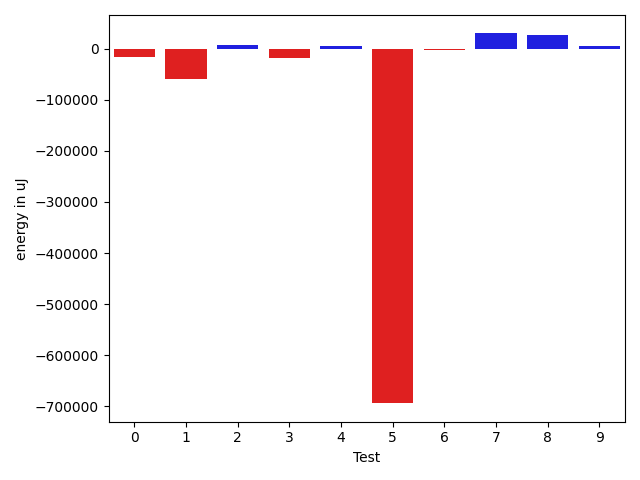

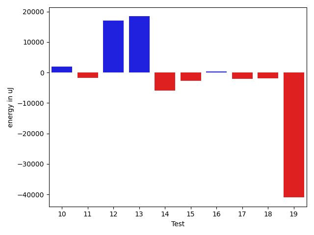

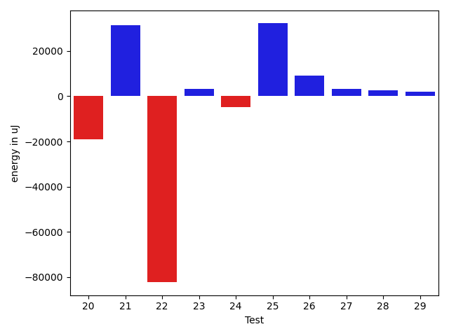

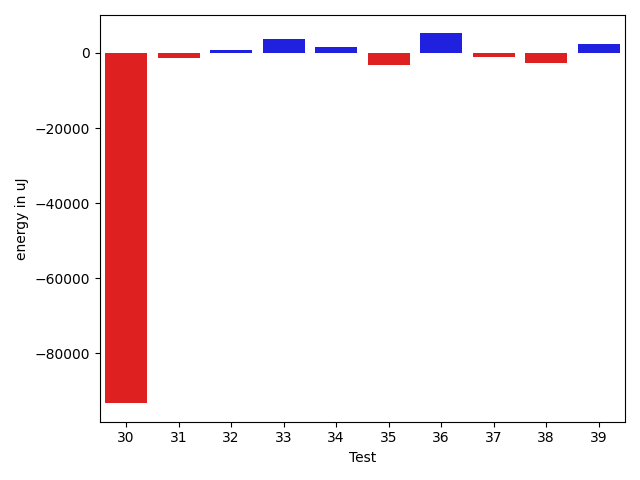

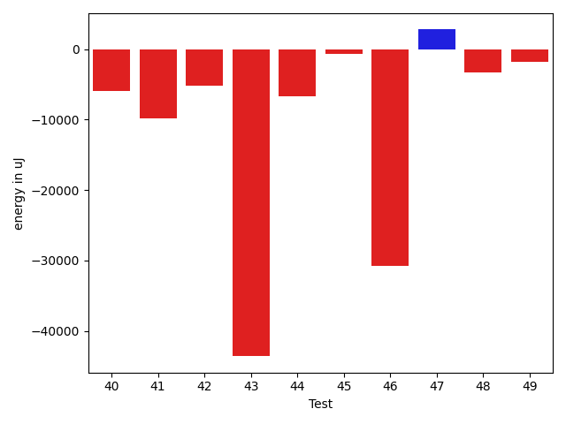

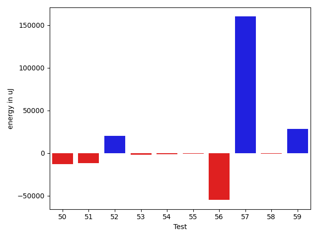

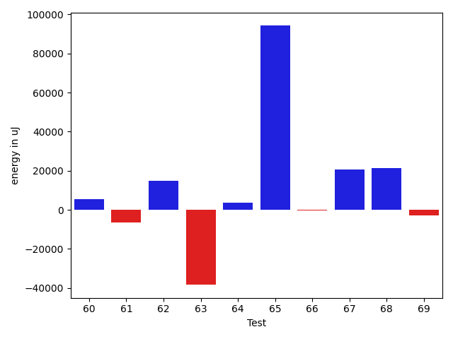

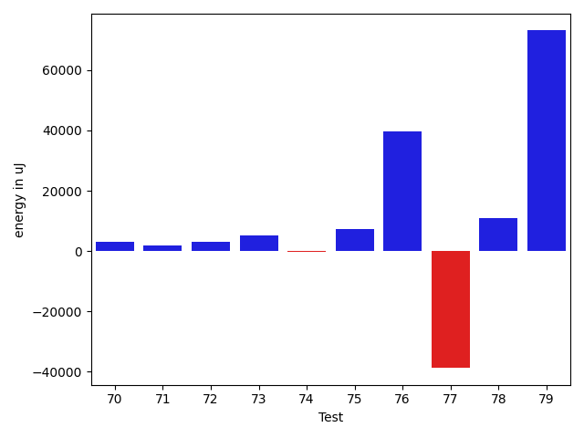

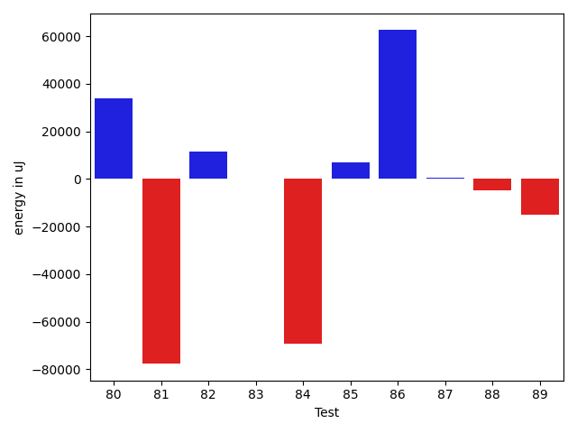

| ID | EnergyV1 | EnergyV2 | DeltaEnergy |
| --- | --- | --- | --- |
| 0 | 132271.32115493141 | 116269.17544822698 | -16002.14570670444 |
| 1 | 150214.20458873257 | 90454.19518102823 | -59760.00940770433 |
| 2 | 36955.41538385479 | 44431.76314651378 | 7476.347762658988 |
| 3 | 62813.120381415385 | 45250.81028865216 | -17562.310092763226 |
| 4 | 37288.05337238898 | 43335.274683355725 | 6047.221310966743 |
| 5 | 798323.9490259716 | 104394.53110671927 | -693929.4179192523 |
| 6 | 60193.84034195314 | 57448.771994752955 | -2745.068347200184 |
| 7 | 111235.34218838609 | 140912.4255745736 | 29677.083386187514 |
| 8 | 41664.76562691403 | 69337.08476271367 | 27672.31913579964 |
| 9 | 37286.22872480328 | 42441.22500957076 | 5154.996284767476 |
| 10 | 40178.28993245042 | 42152.18084901249 | 1973.8909165620717 |
| 11 | 44348.08392117554 | 42561.37021893949 | -1786.7137022360475 |
| 12 | 43530.318991652806 | 60580.561922286935 | 17050.24293063413 |
| 13 | 125828.62265403685 | 144243.14037161722 | 18414.51771758037 |
| 14 | 44618.49540050154 | 38698.0232213518 | -5920.472179149736 |
| 15 | 43873.07193474558 | 41208.61957433728 | -2664.4523604083006 |
| 16 | 77034.08500290608 | 77407.65761807197 | 373.57261516588915 |
| 17 | 42609.274076642585 | 40567.232059156246 | -2042.0420174863393 |
| 18 | 43920.156632774 | 42074.24819330619 | -1845.9084394678066 |
| 19 | 1691498.9755779267 | 1650520.6332363323 | -40978.3423415944 |
| 20 | 65636.37867764293 | 46577.267095501455 | -19059.11158214148 |
| 21 | 43625.411254429535 | 74963.98680802723 | 31338.575553597693 |
| 22 | 123956.32074472979 | 41715.530257351034 | -82240.79048737875 |
| 23 | 42746.596478503336 | 45840.38224753709 | 3093.785769033755 |
| 24 | 54831.341736460716 | 50073.9896620054 | -4757.352074455317 |
| 25 | 111687.60627880423 | 143835.98268914814 | 32148.376410343903 |
| 26 | 45955.16037565078 | 55002.88553327429 | 9047.725157623507 |
| 27 | 41811.458564145745 | 44981.61976606664 | 3170.1612019208915 |
| 28 | 44214.19124150276 | 46666.78566408157 | 2452.5944225788116 |
| 29 | 38420.026046394836 | 40286.51174276974 | 1866.4856963749044 |
| 30 | 188182.78136009365 | 94873.63231895358 | -93309.14904114007 |
| 31 | 42692.149435754865 | 41470.28617075941 | -1221.8632649954525 |
| 32 | 41383.98342561722 | 42257.14007616043 | 873.1566505432129 |
| 33 | 38966.83023428917 | 42697.93804110214 | 3731.107806812972 |
| 34 | 39376.57422211766 | 41094.491119265556 | 1717.916897147894 |
| 35 | 43161.58334350586 | 39968.39274263382 | -3193.19060087204 |
| 36 | 47093.08834618771 | 52279.37446553871 | 5186.286119351003 |
| 37 | 41333.971764326096 | 40233.27770937048 | -1100.6940549556166 |
| 38 | 44238.23362928629 | 41644.27928376198 | -2593.954345524311 |
| 39 | 38252.3583984375 | 40513.78845214844 | 2261.4300537109375 |
| 40 | 51205.12677602496 | 45220.788002232555 | -5984.338773792406 |
| 41 | 51335.22824427967 | 41448.16767431144 | -9887.060569968235 |
| 42 | 50145.86748758491 | 45000.73514465625 | -5145.132342928657 |
| 43 | 152557.8228349475 | 108976.01140128446 | -43581.81143366304 |
| 44 | 50433.14988727473 | 43723.73593346659 | -6709.413953808144 |
| 45 | 51401.48667482116 | 50678.3704427373 | -723.1162320838557 |
| 46 | 72345.89491772096 | 41554.94894813481 | -30790.94596958615 |
| 47 | 124583.61655511826 | 127357.30942405589 | 2773.692868937622 |
| 48 | 43611.640368076325 | 40327.83766286378 | -3283.802705212547 |
| 49 | 41821.9239181539 | 40046.81922793063 | -1775.1046902232702 |
| 50 | 52897.19010572195 | 39908.09092441561 | -12989.099181306345 |
| 51 | 53266.93856083679 | 41489.38726531614 | -11777.55129552065 |
| 52 | 42444.017670140005 | 62615.81029197323 | 20171.79262183322 |
| 53 | 43447.43474575392 | 41336.78289499881 | -2110.651850755108 |
| 54 | 41383.900161233396 | 40108.95733343832 | -1274.9428277950792 |
| 55 | 43115.01663525893 | 42271.14047102404 | -843.8761642348909 |
| 56 | 196741.2154944841 | 141676.1607823193 | -55065.0547121648 |
| 57 | 65890.15707862153 | 225991.74143857876 | 160101.58435995723 |
| 58 | 42896.10534357504 | 41923.29129278983 | -972.8140507852077 |
| 59 | 75039.0138341962 | 103580.69449496985 | 28541.68066077365 |
| 60 | 40920.57778115912 | 46308.596762918176 | 5388.018981759058 |
| 61 | 51467.946633123254 | 45059.83276887068 | -6408.113864252577 |
| 62 | 105628.59624583571 | 120648.76046266696 | 15020.164216831254 |
| 63 | 144887.46920487616 | 106453.43738128792 | -38434.031823588244 |
| 64 | 45369.34158976066 | 49090.50102538196 | 3721.1594356212954 |
| 65 | 60568.967603859215 | 154893.91137410366 | 94324.94377024444 |
| 66 | 42986.94276896778 | 42801.8421200328 | -185.10064893498202 |
| 67 | 90228.42835013429 | 110787.06876214404 | 20558.640412009758 |
| 68 | 54075.19168146746 | 75279.03660547546 | 21203.844924007994 |
| 69 | 43361.31494242705 | 40533.83915270149 | -2827.475789725562 |
| 70 | 39881.331728381956 | 42982.497539158576 | 3101.1658107766198 |
| 71 | 42447.81027894141 | 44276.705732272145 | 1828.8954533307333 |
| 72 | 43209.76277565882 | 46422.12393151165 | 3212.3611558528282 |
| 73 | 38785.491924676695 | 43938.855622670846 | 5153.363697994151 |
| 74 | 42856.143889276434 | 42661.11189348475 | -195.03199579168722 |
| 75 | 37282.879159631586 | 44563.417455010276 | 7280.53829537869 |
| 76 | 38680.80666974252 | 78258.17848194786 | 39577.37181220535 |
| 77 | 98271.00945423887 | 59522.747693781435 | -38748.26176045743 |
| 78 | 97112.32292329434 | 108036.02196610166 | 10923.699042807319 |
| 79 | 38233.29723505165 | 111343.50683829149 | 73110.20960323984 |
| 80 | 81841.03638998006 | 115684.80789941811 | 33843.771509438055 |
| 81 | 126799.6733671219 | 49118.70785649758 | -77680.96551062432 |
| 82 | 92243.8180473903 | 103554.4351364486 | 11310.617089058302 |
| 83 | 41404.03695136821 | 41587.55920410156 | 183.52225273335353 |
| 84 | 128451.29455885847 | 59120.98337404522 | -69330.31118481324 |
| 85 | 38918.40033276232 | 46030.165521791205 | 7111.7651890288835 |
| 86 | 41843.32967450514 | 104330.26360012218 | 62486.93392561704 |
| 87 | 42967.213980750515 | 43285.56969083541 | 318.35571008489205 |
| 88 | 48594.818432718515 | 43659.42594617605 | -4935.392486542463 |
| 89 | 56515.53069972992 | 41444.97952270508 | -15070.551177024841 |

## Delta Duration per test method

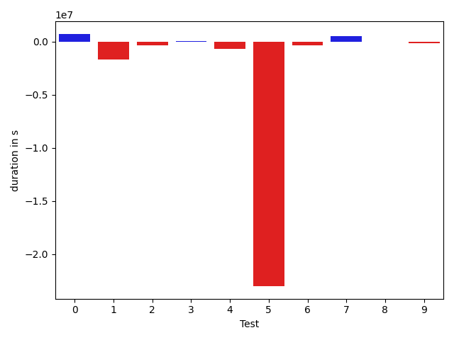

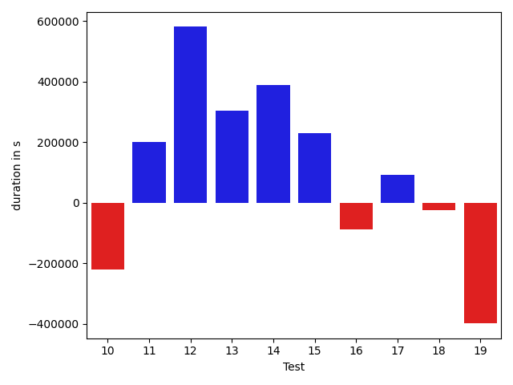

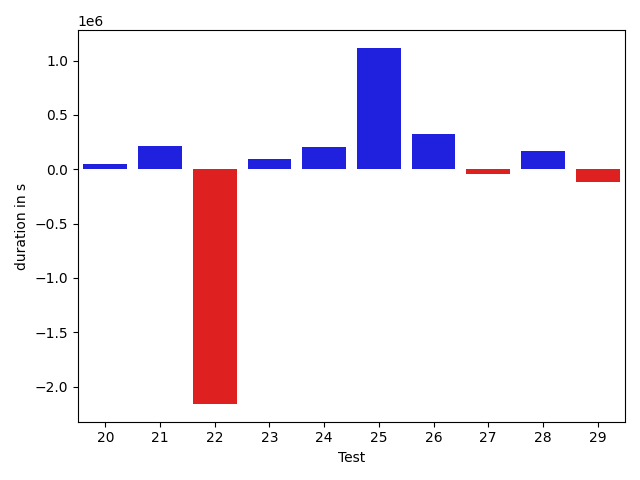

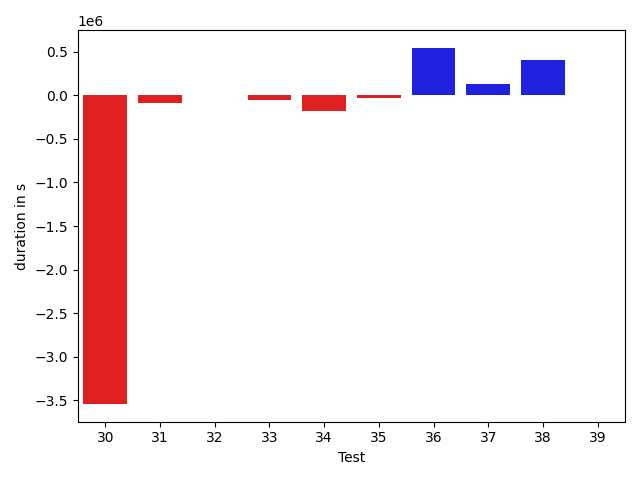

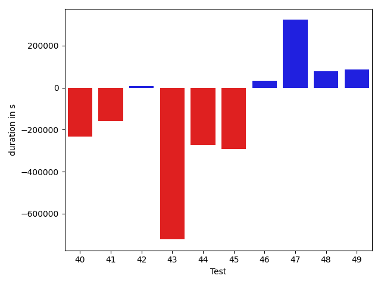

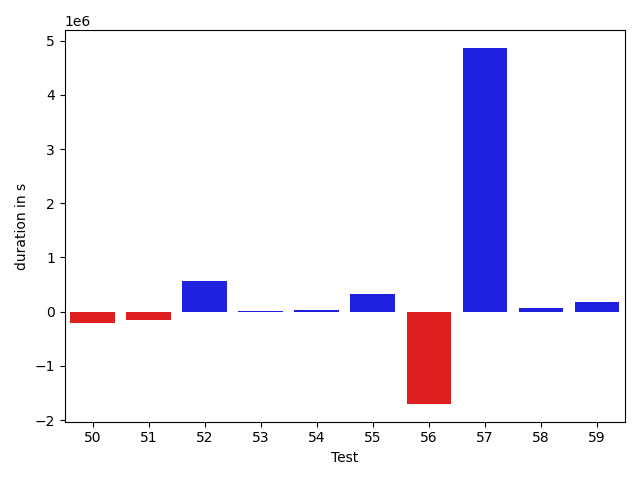

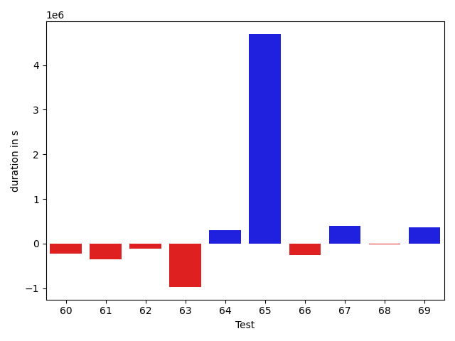

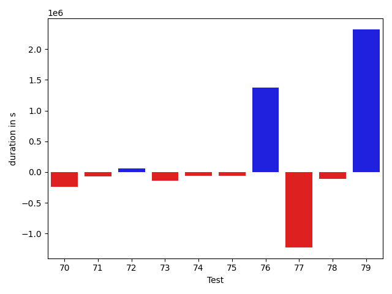

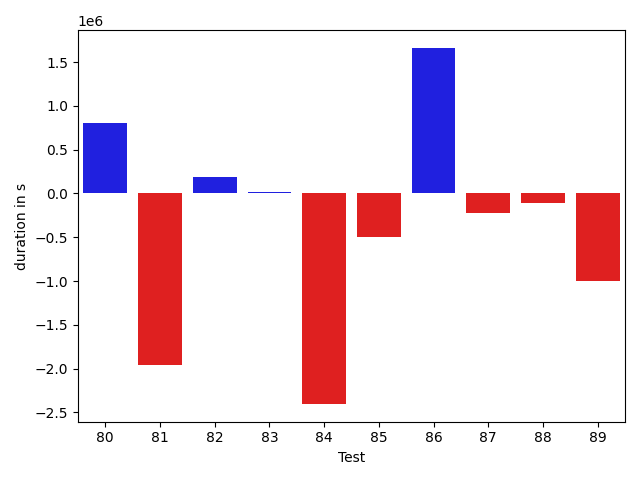

| ID | DurationV1 | DurationsV2 | DeltaDuration |
| --- | --- | --- | --- |
| 0 | 3198991.587788335 | 3920795.531900677 | 721803.9441123419 |
| 1 | 3806620.800519307 | 2130319.729887887 | -1676301.0706314202 |
| 2 | 1031930.5738353503 | 656943.9055209215 | -374986.6683144289 |
| 3 | 1352680.7486048243 | 1396980.7350438614 | 44299.98643903714 |
| 4 | 1554269.1201483957 | 852716.4519473033 | -701552.6682010924 |
| 5 | 25369538.612011675 | 2372293.608991768 | -22997245.003019907 |
| 6 | 1844888.344113199 | 1485457.9344089413 | -359430.40970425773 |
| 7 | 3109727.70416342 | 3615724.386598211 | 505996.68243479077 |
| 8 | 1368895.851482985 | 1328258.3823059918 | -40637.46917699324 |
| 9 | 1300949.861335609 | 1153136.4199986304 | -147813.4413369787 |
| 10 | 1687326.0409129092 | 1466137.048178126 | -221188.9927347831 |
| 11 | 870473.3317833574 | 1072254.8836417035 | 201781.5518583461 |
| 12 | 1196018.2974709144 | 1777205.9566403478 | 581187.6591694334 |
| 13 | 3673498.6329487907 | 3978752.514674547 | 305253.88172575645 |
| 14 | 796442.0193200288 | 1185399.8579368189 | 388957.83861679 |
| 15 | 586840.4570304871 | 816438.8818911773 | 229598.42486069014 |
| 16 | 1998434.4844300842 | 1909867.5489425897 | -88566.93548749457 |
| 17 | 879473.7029643839 | 970735.472111016 | 91261.76914663217 |
| 18 | 1004887.0267299828 | 979908.3725048623 | -24978.654225120554 |
| 19 | 39846134.06105171 | 39448071.658252716 | -398062.4027989954 |
| 20 | 1467891.7995155852 | 1520271.7200046442 | 52379.92048905906 |
| 21 | 1570662.408368656 | 1779886.9603361618 | 209224.55196750583 |
| 22 | 3439124.9596917555 | 1278848.316804099 | -2160276.6428876566 |
| 23 | 1060452.4509892748 | 1158344.5745093126 | 97892.12352003786 |
| 24 | 1512743.6578923292 | 1717974.1754040294 | 205230.51751170028 |
| 25 | 3086587.7547369516 | 4202315.5167104155 | 1115727.761973464 |
| 26 | 1276132.666780362 | 1596092.2535635754 | 319959.58678321354 |
| 27 | 927045.8825844765 | 881859.1908412075 | -45186.69174326898 |
| 28 | 486983.238512516 | 656053.0859584808 | 169069.8474459648 |
| 29 | 699286.2954077448 | 579647.0772472555 | -119639.21816048934 |
| 30 | 5584689.758319801 | 2043479.7341343188 | -3541210.024185482 |
| 31 | 575445.3923018547 | 490217.0461585001 | -85228.3461433546 |
| 32 | 496977.0577683449 | 499637.7156600952 | 2660.6578917503357 |
| 33 | 501546.6482870579 | 443326.62079061195 | -58220.027496445924 |
| 34 | 645440.6984640621 | 461473.1671618223 | -183967.53130223975 |
| 35 | 488124.45222473145 | 455954.331086874 | -32170.121137857437 |
| 36 | 872397.4207413993 | 1415841.2968458934 | 543443.8761044941 |
| 37 | 542373.2283329964 | 673910.953075612 | 131537.7247426156 |
| 38 | 398819.5436089337 | 806088.0836529732 | 407268.5400440395 |
| 39 | 506166.1682739258 | 505332.53942871094 | -833.6288452148438 |
| 40 | 1358874.2404064247 | 1127150.4325748712 | -231723.8078315535 |
| 41 | 1358240.7155799824 | 1198547.7995767838 | -159692.9160031986 |
| 42 | 1423827.3950884594 | 1432450.990135524 | 8623.595047064591 |
| 43 | 3610368.4201493436 | 2887713.1588741564 | -722655.2612751871 |
| 44 | 1345726.0933470374 | 1072060.9453406394 | -273665.148006398 |
| 45 | 1781487.2273829542 | 1490452.688186158 | -291034.53919679625 |
| 46 | 1426280.4383873984 | 1460214.59105266 | 33934.152665261645 |
| 47 | 3298031.3163091578 | 3620476.054629352 | 322444.7383201942 |
| 48 | 497736.76194680214 | 574736.1012796268 | 76999.33933282469 |
| 49 | 914008.5906697756 | 1000565.2104306289 | 86556.61976085324 |
| 50 | 1495507.9173444326 | 1285232.4949444379 | -210275.42239999468 |
| 51 | 1295803.797317221 | 1141973.4055996714 | -153830.39171754965 |
| 52 | 1138389.9630185892 | 1699152.0916660577 | 560762.1286474685 |
| 53 | 1334327.6794425654 | 1340614.1412907185 | 6286.461848153034 |
| 54 | 1053871.413097616 | 1091201.863903179 | 37330.450805563014 |
| 55 | 708248.8155370213 | 1025590.4531088681 | 317341.63757184683 |
| 56 | 4900459.069536487 | 3198025.110339 | -1702433.9591974868 |
| 57 | 1712466.2595957206 | 6576373.553817031 | 4863907.29422131 |
| 58 | 707090.9022303877 | 769638.0765908372 | 62547.17436044954 |
| 59 | 2210504.1485020407 | 2385456.8767559547 | 174952.72825391404 |
| 60 | 1547670.4485003727 | 1323970.8250238644 | -223699.6234765083 |
| 61 | 1261077.9797594165 | 913440.8896821346 | -347637.09007728193 |
| 62 | 2755896.6725908583 | 2643984.5734037245 | -111912.09918713383 |
| 63 | 3950784.7533726706 | 2978855.7480643587 | -971929.0053083119 |
| 64 | 1056872.8086964071 | 1353883.662526905 | 297010.85383049794 |
| 65 | 1541595.8281108793 | 6235519.04670675 | 4693923.218595871 |
| 66 | 1110662.213267259 | 852349.5781400439 | -258312.63512721518 |
| 67 | 2434275.2900853874 | 2823647.7114559375 | 389372.42137055006 |
| 68 | 1540407.1033361237 | 1525600.0571340616 | -14807.046202062164 |
| 69 | 618038.2919833957 | 982480.0242899857 | 364441.73230658995 |
| 70 | 1028935.1190385736 | 789343.7445259611 | -239591.37451261247 |
| 71 | 749625.0840581071 | 677693.6969131771 | -71931.38714492996 |
| 72 | 745723.3194480585 | 800601.6760623475 | 54878.35661428899 |
| 73 | 763022.0407111634 | 623266.4240686004 | -139755.61664256302 |
| 74 | 839823.576510065 | 774813.6443943005 | -65009.93211576447 |
| 75 | 1356627.5686124829 | 1297072.2350721634 | -59555.333540319465 |
| 76 | 1030318.8404492172 | 2406879.8661916647 | 1376561.0257424475 |
| 77 | 2595607.8626442943 | 1370662.0398404044 | -1224945.8228038899 |
| 78 | 2709551.90592436 | 2595512.1501313443 | -114039.75579301547 |
| 79 | 1443666.19994083 | 3764910.2664887384 | 2321244.0665479084 |
| 80 | 2336692.5821061567 | 3139834.2416519565 | 803141.6595457997 |
| 81 | 3475491.721947886 | 1513312.145697854 | -1962179.576250032 |
| 82 | 2426363.2004449335 | 2616525.9359384263 | 190162.7354934928 |
| 83 | 564668.6122008098 | 583402.0046386719 | 18733.392437862116 |
| 84 | 4103368.2465772345 | 1699872.1153693988 | -2403496.131207836 |
| 85 | 967477.1098620775 | 472757.99977353436 | -494719.11008854315 |
| 86 | 804315.3787878156 | 2465648.1774491854 | 1661332.7986613698 |
| 87 | 927667.6295361076 | 706955.6008555861 | -220712.02868052153 |
| 88 | 526471.864583537 | 419321.2725929618 | -107150.5919905752 |
| 89 | 1577391.8260917664 | 576700.5221633911 | -1000691.3039283752 |

## Misc.

| ID | Test Class | Test Method |
| --- | --- | --- |
| 0 | com.google.gson.functional.StreamingTypeAdaptersTest | testNullSafe |
| 1 | com.google.gson.functional.JsonAdapterAnnotationOnClassesTest | testJsonAdapterInvoked |
| 2 | com.google.gson.functional.JsonAdapterAnnotationOnClassesTest | testRegisteredDeserializerOverridesJsonAdapter |
| 3 | com.google.gson.functional.JsonAdapterAnnotationOnClassesTest | testJsonAdapterFactoryInvoked |
| 4 | com.google.gson.functional.JsonAdapterAnnotationOnClassesTest | testRegisteredSerializerOverridesJsonAdapter |
| 5 | com.google.gson.functional.JsonAdapterSerializerDeserializerTest | testJsonSerializerDeserializerBasedJsonAdapterOnFields |
| 6 | com.google.gson.functional.JsonAdapterSerializerDeserializerTest | testJsonSerializerDeserializerBasedJsonAdapterOnClass |
| 7 | com.google.gson.functional.ThrowableFunctionalTest | testExceptionWithoutCause |
| 8 | com.google.gson.functional.ThrowableFunctionalTest | testErrornWithCause |
| 9 | com.google.gson.functional.ThrowableFunctionalTest | testErrorWithoutCause |
| 10 | com.google.gson.functional.ThrowableFunctionalTest | testExceptionWithCause |
| 11 | com.google.gson.functional.MapTest | testConcurrentSkipListMap |
| 12 | com.google.gson.functional.MapTest | testConcurrentMap |
| 13 | com.google.gson.functional.MapTest | testConcurrentNavigableMap |
| 14 | com.google.gson.functional.MapTest | testConcurrentHashMap |
| 15 | com.google.gson.functional.DefaultTypeAdaptersTest | testBitSetDeserialization |
| 16 | com.google.gson.functional.DefaultTypeAdaptersTest | testOverrideBigIntegerTypeAdapter |
| 17 | com.google.gson.functional.DefaultTypeAdaptersTest | testSqlDateSerialization |
| 18 | com.google.gson.functional.DefaultTypeAdaptersTest | testTimestampSerialization |
| 19 | com.google.gson.functional.DefaultTypeAdaptersTest | testDefaultDateDeserializationUsingBuilder |
| 20 | com.google.gson.functional.DefaultTypeAdaptersTest | testOverrideBigDecimalTypeAdapter |
| 21 | com.google.gson.functional.DefaultTypeAdaptersTest | testDateDeserializationWithPattern |
| 22 | com.google.gson.functional.DefaultTypeAdaptersTest | testDateSerializationInCollection |
| 23 | com.google.gson.functional.EnumTest | testEnumSubclassAsParameterizedType |
| 24 | com.google.gson.functional.EnumTest | testEnumCaseMapping |
| 25 | com.google.gson.functional.EnumTest | testEnumSubclass |
| 26 | com.google.gson.functional.EnumTest | testEnumSubclassWithRegisteredTypeAdapter |
| 27 | com.google.gson.functional.EnumTest | testEnumSet |
| 28 | com.google.gson.functional.TypeAdapterPrecedenceTest | testStreamingHierarchicalFollowedByNonstreaming |
| 29 | com.google.gson.functional.TypeAdapterPrecedenceTest | testStreamingHierarchicalFollowedByNonstreamingHierarchical |
| 30 | com.google.gson.functional.TypeAdapterPrecedenceTest | testNonstreamingFollowedByNonstreaming |
| 31 | com.google.gson.functional.TypeAdapterPrecedenceTest | testStreamingFollowedByStreaming |
| 32 | com.google.gson.functional.TypeAdapterPrecedenceTest | testSerializeNonstreamingTypeAdapterFollowedByStreamingTypeAdapter |
| 33 | com.google.gson.functional.TypeAdapterPrecedenceTest | testNonstreamingHierarchicalFollowedByNonstreaming |
| 34 | com.google.gson.functional.TypeAdapterPrecedenceTest | testStreamingFollowedByNonstreamingHierarchical |
| 35 | com.google.gson.functional.TypeAdapterPrecedenceTest | testStreamingFollowedByNonstreaming |
| 36 | com.google.gson.JsonParserTest | testReadWriteTwoObjects |
| 37 | com.google.gson.JsonParserTest | testParseMixedArray |
| 38 | com.google.gson.functional.StringTest | testSingleQuoteInStringSerialization |
| 39 | com.google.gson.functional.StringTest | testEscapingQuotesInStringSerialization |
| 40 | com.google.gson.functional.ParameterizedTypesTest | testVariableTypeArrayDeserialization |
| 41 | com.google.gson.functional.ParameterizedTypesTest | testVariableTypeDeserialization |
| 42 | com.google.gson.functional.ParameterizedTypesTest | testParameterizedTypeGenericArraysDeserialization |
| 43 | com.google.gson.functional.ParameterizedTypesTest | testVariableTypeFieldsAndGenericArraysDeserialization |
| 44 | com.google.gson.functional.ParameterizedTypesTest | testParameterizedTypeWithVariableTypeDeserialization |
| 45 | com.google.gson.functional.ObjectTest | testSingletonLists |
| 46 | com.google.gson.functional.JsonAdapterAnnotationOnFieldsTest | testPrimitiveFieldAnnotationTakesPrecedenceOverDefault |
| 47 | com.google.gson.functional.JsonAdapterAnnotationOnFieldsTest | testClassAnnotationAdapterFactoryTakesPrecedenceOverDefault |
| 48 | com.google.gson.functional.JsonAdapterAnnotationOnFieldsTest | testJsonAdapterWrappedInNullSafeAsRequested |
| 49 | com.google.gson.functional.JsonAdapterAnnotationOnFieldsTest | testClassAnnotationAdapterTakesPrecedenceOverDefault |
| 50 | com.google.gson.functional.JsonAdapterAnnotationOnFieldsTest | testFieldAnnotationWorksForParameterizedType |
| 51 | com.google.gson.functional.JsonAdapterAnnotationOnFieldsTest | testRegisteredTypeAdapterTakesPrecedenceOverClassAnnotationAdapter |
| 52 | com.google.gson.functional.JsonAdapterAnnotationOnFieldsTest | testFieldAnnotationTakesPrecedenceOverClassAnnotation |
| 53 | com.google.gson.functional.JsonAdapterAnnotationOnFieldsTest | testFieldAnnotationTakesPrecedenceOverRegisteredTypeAdapter |
| 54 | com.google.gson.functional.JsonAdapterAnnotationOnFieldsTest | testNonPrimitiveFieldAnnotationTakesPrecedenceOverDefault |
| 55 | com.google.gson.functional.TypeHierarchyAdapterTest | testRegisterSuperTypeFirst |
| 56 | com.google.gson.functional.TypeHierarchyAdapterTest | testTypeHierarchy |
| 57 | com.google.gson.internal.bind.JsonElementReaderTest | testSkipValue |
| 58 | com.google.gson.functional.TypeVariableTest | testBasicTypeVariables |
| 59 | com.google.gson.functional.TypeVariableTest | testAdvancedTypeVariables |
| 60 | com.google.gson.functional.TypeVariableTest | testTypeVariablesViaTypeParameter |
| 61 | com.google.gson.functional.MapAsArrayTypeAdapterTest | testMultipleEnableComplexKeyRegistrationHasNoEffect |
| 62 | com.google.gson.functional.MapAsArrayTypeAdapterTest | testSerializeComplexMapWithTypeAdapter |
| 63 | com.google.gson.functional.RuntimeTypeAdapterFactoryFunctionalTest | testSubclassesAutomaticallySerialized |
| 64 | com.google.gson.functional.CollectionTest | testFieldIsArrayList |
| 65 | com.google.gson.functional.CollectionTest | testWildcardCollectionField |
| 66 | com.google.gson.functional.ExclusionStrategyFunctionalTest | testExclusionStrategyWithMode |
| 67 | com.google.gson.functional.ExclusionStrategyFunctionalTest | testExclusionStrategyDeserialization |
| 68 | com.google.gson.functional.CustomDeserializerTest | testJsonTypeFieldBasedDeserialization |
| 69 | com.google.gson.functional.CustomDeserializerTest | testDefaultConstructorNotCalledOnObject |
| 70 | com.google.gson.functional.CustomDeserializerTest | testDefaultConstructorNotCalledOnField |
| 71 | com.google.gson.functional.EscapingTest | testGsonDoubleDeserialization |
| 72 | com.google.gson.functional.EscapingTest | testEscapingObjectFields |
| 73 | com.google.gson.functional.EscapingTest | testEscapingQuotesInStringArray |
| 74 | com.google.gson.functional.EscapingTest | testGsonAcceptsEscapedAndNonEscapedJsonDeserialization |
| 75 | com.google.gson.functional.JavaUtilConcurrentAtomicTest | testAtomicLongArrayWithStringSerializationPolicy |
| 76 | com.google.gson.functional.JavaUtilConcurrentAtomicTest | testAtomicLongWithStringSerializationPolicy |
| 77 | com.google.gson.functional.NamingPolicyTest | testComplexFieldNameStrategy |
| 78 | com.google.gson.DefaultInetAddressTypeAdapterTest | testInetAddressSerializationAndDeserialization |
| 79 | com.google.gson.functional.ReadersWritersTest | testReadWriteTwoStrings |
| 80 | com.google.gson.functional.ReadersWritersTest | testReadWriteTwoObjects |
| 81 | com.google.gson.functional.JsonParserTest | testBadFieldTypeForDeserializingCustomTree |
| 82 | com.google.gson.functional.JavaUtilTest | testCurrency |
| 83 | com.google.gson.functional.JavaUtilTest | testProperties |
| 84 | com.google.gson.functional.DelegateTypeAdapterTest | testDelegateInvoked |
| 85 | com.google.gson.functional.DelegateTypeAdapterTest | testDelegateInvokedOnStrings |
| 86 | com.google.gson.OverrideCoreTypeAdaptersTest | testOverrideStringAdapter |
| 87 | com.google.gson.functional.UncategorizedTest | testGsonInstanceReusableForSerializationAndDeserialization |
| 88 | com.google.gson.GsonTypeAdapterTest | testTypeAdapterDoesNotAffectNonAdaptedTypes |
| 89 | com.google.gson.functional.PrimitiveTest | testQuotedStringSerializationAndDeserialization |

| Test | IterationV1 | IterationV2 | DeltaIteration |
| --- | --- | --- | --- |
| 0 | 99 | 99 | 0 |
| 1 | 99 | 99 | 0 |
| 2 | 44 | 52 | 8 |
| 3 | 87 | 94 | 7 |
| 4 | 62 | 55 | -7 |
| 5 | 99 | 99 | 0 |
| 6 | 97 | 98 | 1 |
| 7 | 99 | 98 | -1 |
| 8 | 89 | 93 | 4 |
| 9 | 81 | 77 | -4 |
| 10 | 96 | 99 | 3 |
| 11 | 68 | 72 | 4 |
| 12 | 99 | 95 | -4 |
| 13 | 99 | 99 | 0 |
| 14 | 61 | 65 | 4 |
| 15 | 48 | 38 | -10 |
| 16 | 99 | 99 | 0 |
| 17 | 65 | 60 | -5 |
| 18 | 77 | 71 | -6 |
| 19 | 99 | 99 | 0 |
| 20 | 99 | 99 | 0 |
| 21 | 99 | 99 | 0 |
| 22 | 98 | 95 | -3 |
| 23 | 85 | 88 | 3 |
| 24 | 78 | 85 | 7 |
| 25 | 99 | 99 | 0 |
| 26 | 94 | 98 | 4 |
| 27 | 77 | 70 | -7 |
| 28 | 22 | 22 | 0 |
| 29 | 32 | 31 | -1 |
| 30 | 83 | 92 | 9 |
| 31 | 30 | 37 | 7 |
| 32 | 24 | 22 | -2 |
| 33 | 24 | 28 | 4 |
| 34 | 29 | 24 | -5 |
| 35 | 17 | 23 | 6 |
| 36 | 73 | 78 | 5 |
| 37 | 22 | 31 | 9 |
| 38 | 25 | 24 | -1 |
| 39 | 15 | 14 | -1 |
| 40 | 97 | 97 | 0 |
| 41 | 96 | 93 | -3 |
| 42 | 98 | 97 | -1 |
| 43 | 99 | 99 | 0 |
| 44 | 94 | 86 | -8 |
| 45 | 99 | 99 | 0 |
| 46 | 99 | 97 | -2 |
| 47 | 99 | 99 | 0 |
| 48 | 44 | 32 | -12 |
| 49 | 68 | 71 | 3 |
| 50 | 99 | 99 | 0 |
| 51 | 90 | 90 | 0 |
| 52 | 83 | 89 | 6 |
| 53 | 96 | 98 | 2 |
| 54 | 71 | 66 | -5 |
| 55 | 51 | 40 | -11 |
| 56 | 99 | 99 | 0 |
| 57 | 44 | 49 | 5 |
| 58 | 54 | 60 | 6 |
| 59 | 99 | 97 | -2 |
| 60 | 89 | 95 | 6 |
| 61 | 78 | 74 | -4 |
| 62 | 99 | 99 | 0 |
| 63 | 99 | 99 | 0 |
| 64 | 82 | 77 | -5 |
| 65 | 98 | 97 | -1 |
| 66 | 63 | 70 | 7 |
| 67 | 99 | 99 | 0 |
| 68 | 99 | 99 | 0 |
| 69 | 42 | 49 | 7 |
| 70 | 53 | 59 | 6 |
| 71 | 36 | 39 | 3 |
| 72 | 58 | 51 | -7 |
| 73 | 34 | 34 | 0 |
| 74 | 61 | 65 | 4 |
| 75 | 99 | 97 | -2 |
| 76 | 69 | 64 | -5 |
| 77 | 87 | 91 | 4 |
| 78 | 99 | 99 | 0 |
| 79 | 68 | 74 | 6 |
| 80 | 71 | 70 | -1 |
| 81 | 80 | 79 | -1 |
| 82 | 99 | 99 | 0 |
| 83 | 35 | 15 | -20 |
| 84 | 99 | 99 | 0 |
| 85 | 40 | 33 | -7 |
| 86 | 38 | 29 | -9 |
| 87 | 55 | 48 | -7 |
| 88 | 28 | 27 | -1 |
| 89 | 23 | 19 | -4 |

| Time Label | Time (s) |
| --- | --- |
| Selection | 34.778995752334595 |
| Injection | 18.212310314178467 |
| Total | 1479.467605829239 |

## Aggregation per test class

| Index | EnergyV1 | EnergyV2 | DeltaEnergy |
| --- | --- | --- | --- |
| 0 | 132271.32115493141 | 116269.17544822698 | -16002.14570670444 |
| 1 | 287270.79372639174 | 223472.0432995499 | -63798.75042684184 |
| 2 | 858517.7893679247 | 161843.3031014722 | -696674.4862664525 |
| 3 | 230364.62647255382 | 294842.91619587055 | 64478.28972331673 |
| 4 | 258325.52096736673 | 286083.09573419543 | 27757.574766828708 |
| 5 | 2132153.6739017973 | 2015035.1748420836 | -117118.49905971368 |
| 6 | 297032.1634335648 | 339734.8598980316 | 42702.696464466746 |
| 7 | 476398.119309276 | 389315.17787572625 | -87082.94143354974 |
| 8 | 88427.0601105138 | 92512.65217490919 | 4085.592064395387 |
| 9 | 82490.59202772379 | 82158.06773591042 | -332.52429181337357 |
| 10 | 355677.19523011177 | 284369.4381559513 | -71307.75707416044 |
| 11 | 51401.48667482116 | 50678.3704427373 | -723.1162320838557 |
| 12 | 515802.5570027555 | 474745.9439731272 | -41056.61302962829 |
| 13 | 239856.23212974303 | 183947.30125334332 | -55908.93087639971 |
| 14 | 65890.15707862153 | 225991.74143857876 | 160101.58435995723 |
| 15 | 158855.69695893035 | 191812.58255067785 | 32956.8855917475 |
| 16 | 157096.54287895898 | 165708.59323153764 | 8612.050352578663 |
| 17 | 144887.46920487616 | 106453.43738128792 | -38434.031823588244 |
| 18 | 105938.30919361988 | 203984.41239948562 | 98046.10320586574 |
| 19 | 133215.37111910206 | 153588.91088217683 | 20373.539763074776 |
| 20 | 137317.83835227648 | 158795.37329733552 | 21477.534945059044 |
| 21 | 167299.20886855337 | 177298.79717993937 | 9999.588311386004 |
| 22 | 75963.6858293741 | 122821.59593695814 | 46857.910107584044 |
| 23 | 98271.00945423887 | 59522.747693781435 | -38748.26176045743 |
| 24 | 97112.32292329434 | 108036.02196610166 | 10923.699042807319 |
| 25 | 120074.33362503171 | 227028.3147377096 | 106953.98111267788 |
| 26 | 126799.6733671219 | 49118.70785649758 | -77680.96551062432 |
| 27 | 133647.85499875853 | 145141.99434055015 | 11494.139341791626 |
| 28 | 167369.69489162078 | 105151.14889583644 | -62218.54599578434 |
| 29 | 41843.32967450514 | 104330.26360012218 | 62486.93392561704 |
| 30 | 42967.213980750515 | 43285.56969083541 | 318.35571008489205 |
| 31 | 48594.818432718515 | 43659.42594617605 | -4935.392486542463 |
| 32 | 56515.53069972992 | 41444.97952270508 | -15070.551177024841 |

| Index | DurationV1 | DurationsV2 | DeltaDuration |
| --- | --- | --- | --- |
| 0 | 3198991.587788335 | 3920795.531900677 | 721803.9441123419 |
| 1 | 7745501.243107878 | 5036960.822399973 | -2708540.4207079047 |
| 2 | 27214426.956124872 | 3857751.5434007095 | -23356675.412724163 |
| 3 | 7466899.457894923 | 7563256.237080959 | 96356.7791860355 |
| 4 | 6536432.281523091 | 8013613.212893418 | 1477180.9313703272 |
| 5 | 50793448.89978264 | 48704028.93084727 | -2089419.9689353704 |
| 6 | 7862962.412983394 | 9556585.71102854 | 1693623.2980451463 |
| 7 | 9478493.541286113 | 5629788.778197959 | -3848704.7630881537 |
| 8 | 1414770.6490743957 | 2089752.2499215053 | 674981.6008471097 |
| 9 | 904985.7118828595 | 1311420.623081684 | 406434.91119882464 |
| 10 | 9097036.864571247 | 7717923.326501975 | -1379113.5380692724 |
| 11 | 1781487.2273829542 | 1490452.688186158 | -291034.53919679625 |
| 12 | 12453957.877533559 | 13214165.954796331 | 760208.0772627722 |
| 13 | 5608707.885073508 | 4223615.563447868 | -1385092.3216256397 |
| 14 | 1712466.2595957206 | 6576373.553817031 | 4863907.29422131 |
| 15 | 4465265.499232801 | 4479065.778370656 | 13800.279137855396 |
| 16 | 4016974.652350275 | 3557425.463085859 | -459549.18926441576 |
| 17 | 3950784.7533726706 | 2978855.7480643587 | -971929.0053083119 |
| 18 | 2598468.636807286 | 7589402.709233655 | 4990934.0724263685 |
| 19 | 3544937.5033526467 | 3675997.289595981 | 131059.78624333441 |
| 20 | 3187380.514358093 | 3297423.8259500084 | 110043.31159191532 |
| 21 | 3098194.020727394 | 2876375.4414384253 | -221818.57928896882 |
| 22 | 2386946.4090617 | 3703952.101263828 | 1317005.692202128 |
| 23 | 2595607.8626442943 | 1370662.0398404044 | -1224945.8228038899 |
| 24 | 2709551.90592436 | 2595512.1501313443 | -114039.75579301547 |
| 25 | 3780358.7820469867 | 6904744.508140694 | 3124385.7260937076 |
| 26 | 3475491.721947886 | 1513312.145697854 | -1962179.576250032 |
| 27 | 2991031.812645743 | 3199927.940577098 | 208896.12793135503 |
| 28 | 5070845.356439312 | 2172630.115142933 | -2898215.241296379 |
| 29 | 804315.3787878156 | 2465648.1774491854 | 1661332.7986613698 |
| 30 | 927667.6295361076 | 706955.6008555861 | -220712.02868052153 |
| 31 | 526471.864583537 | 419321.2725929618 | -107150.5919905752 |
| 32 | 1577391.8260917664 | 576700.5221633911 | -1000691.3039283752 |
| Index | TestClassName | #Tests |
| --- | --- | --- |
| 0 | com.google.gson.functional.StreamingTypeAdaptersTest | 1 |
| 1 | com.google.gson.functional.JsonAdapterAnnotationOnClassesTest | 4 |
| 2 | com.google.gson.functional.JsonAdapterSerializerDeserializerTest | 2 |
| 3 | com.google.gson.functional.ThrowableFunctionalTest | 4 |
| 4 | com.google.gson.functional.MapTest | 4 |
| 5 | com.google.gson.functional.DefaultTypeAdaptersTest | 8 |
| 6 | com.google.gson.functional.EnumTest | 5 |
| 7 | com.google.gson.functional.TypeAdapterPrecedenceTest | 8 |
| 8 | com.google.gson.JsonParserTest | 2 |
| 9 | com.google.gson.functional.StringTest | 2 |
| 10 | com.google.gson.functional.ParameterizedTypesTest | 5 |
| 11 | com.google.gson.functional.ObjectTest | 1 |
| 12 | com.google.gson.functional.JsonAdapterAnnotationOnFieldsTest | 9 |
| 13 | com.google.gson.functional.TypeHierarchyAdapterTest | 2 |
| 14 | com.google.gson.internal.bind.JsonElementReaderTest | 1 |
| 15 | com.google.gson.functional.TypeVariableTest | 3 |
| 16 | com.google.gson.functional.MapAsArrayTypeAdapterTest | 2 |
| 17 | com.google.gson.functional.RuntimeTypeAdapterFactoryFunctionalTest | 1 |
| 18 | com.google.gson.functional.CollectionTest | 2 |
| 19 | com.google.gson.functional.ExclusionStrategyFunctionalTest | 2 |
| 20 | com.google.gson.functional.CustomDeserializerTest | 3 |
| 21 | com.google.gson.functional.EscapingTest | 4 |
| 22 | com.google.gson.functional.JavaUtilConcurrentAtomicTest | 2 |
| 23 | com.google.gson.functional.NamingPolicyTest | 1 |
| 24 | com.google.gson.DefaultInetAddressTypeAdapterTest | 1 |
| 25 | com.google.gson.functional.ReadersWritersTest | 2 |
| 26 | com.google.gson.functional.JsonParserTest | 1 |
| 27 | com.google.gson.functional.JavaUtilTest | 2 |
| 28 | com.google.gson.functional.DelegateTypeAdapterTest | 2 |
| 29 | com.google.gson.OverrideCoreTypeAdaptersTest | 1 |
| 30 | com.google.gson.functional.UncategorizedTest | 1 |
| 31 | com.google.gson.GsonTypeAdapterTest | 1 |
| 32 | com.google.gson.functional.PrimitiveTest | 1 |
