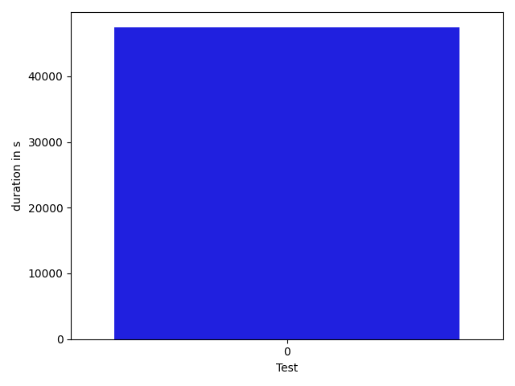

# gson 4976e4

https://github.com/google/gson.git/commit/4976e4

## Delta Energy per test method

| ID | EnergyV1 | EnergyV2 | DeltaEnergy |
| --- | --- | --- | --- |
| 0 | 80927.64545401867 | 92250.22661181958 | 11322.581157800916 |

## Delta Duration per test method

| ID | DurationV1 | DurationsV2 | DeltaDuration |
| --- | --- | --- | --- |
| 0 | 3356375.6300431127 | 3403769.7801670516 | 47394.15012393892 |

## Misc.

| ID | Test Class | Test Method |
| --- | --- | --- |
| 0 | com.google.gson.JsonObjectTest | testSize |

| Test | IterationV1 | IterationV2 | DeltaIteration |
| --- | --- | --- | --- |
| 0 | 99 | 99 | 0 |

| Time Label | Time (s) |
| --- | --- |
| Selection | 34.51154851913452 |
| Injection | 13.182100534439087 |
| Total | 1353.1544733047485 |

## Aggregation per test class

| Index | EnergyV1 | EnergyV2 | DeltaEnergy |
| --- | --- | --- | --- |
| 0 | 80927.64545401867 | 92250.22661181958 | 11322.581157800916 |

| Index | DurationV1 | DurationsV2 | DeltaDuration |
| --- | --- | --- | --- |
| 0 | 3356375.6300431127 | 3403769.7801670516 | 47394.15012393892 |
| Index | TestClassName | #Tests |
| --- | --- | --- |
| 0 | com.google.gson.JsonObjectTest | 1 |
