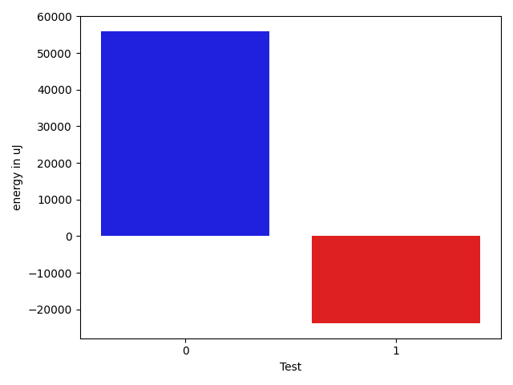
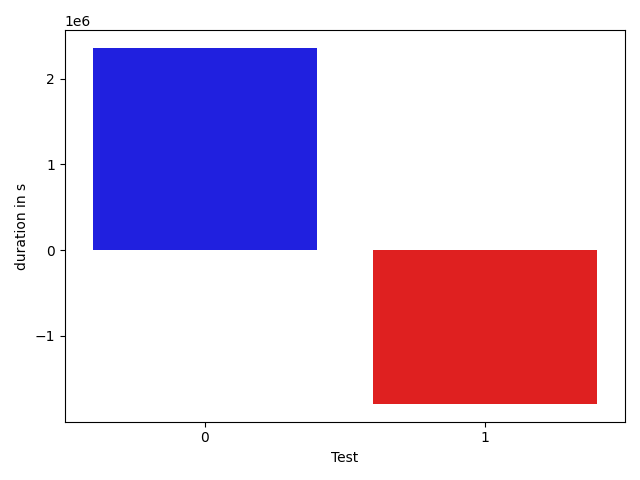

# gson 44cad0

https://github.com/google/gson.git/commit/44cad0

## Delta Energy per test method

| ID | EnergyV1 | EnergyV2 | DeltaEnergy |
| --- | --- | --- | --- |
| 0 | 58333.79445350115 | 114354.22113933094 | 56020.42668582979 |
| 1 | 678461.6437373329 | 654558.0238246087 | -23903.619912724243 |

## Delta Duration per test method

| ID | DurationV1 | DurationsV2 | DeltaDuration |
| --- | --- | --- | --- |
| 0 | 2103079.4537741784 | 4460250.045725422 | 2357170.5919512436 |
| 1 | 21484737.84442195 | 19692959.722901404 | -1791778.1215205453 |

## Misc.

| ID | Test Class | Test Method |
| --- | --- | --- |
| 0 | com.google.gson.functional.PrimitiveTest | testNumberDeserialization |
| 1 | com.google.gson.JavaSerializationTest | testNumberIsSerializable |

| Test | IterationV1 | IterationV2 | DeltaIteration |
| --- | --- | --- | --- |
| 0 | 92 | 93 | 1 |
| 1 | 99 | 99 | 0 |

| Time Label | Time (s) |
| --- | --- |
| Selection | 35.75007915496826 |
| Injection | 13.444749593734741 |
| Total | 1364.7052702903748 |

## Aggregation per test class

| Index | EnergyV1 | EnergyV2 | DeltaEnergy |
| --- | --- | --- | --- |
| 0 | 58333.79445350115 | 114354.22113933094 | 56020.42668582979 |
| 1 | 678461.6437373329 | 654558.0238246087 | -23903.619912724243 |

| Index | DurationV1 | DurationsV2 | DeltaDuration |
| --- | --- | --- | --- |
| 0 | 2103079.4537741784 | 4460250.045725422 | 2357170.5919512436 |
| 1 | 21484737.84442195 | 19692959.722901404 | -1791778.1215205453 |
| Index | TestClassName | #Tests |
| --- | --- | --- |
| 0 | com.google.gson.functional.PrimitiveTest | 1 |
| 1 | com.google.gson.JavaSerializationTest | 1 |
