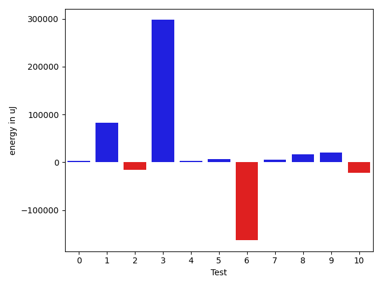
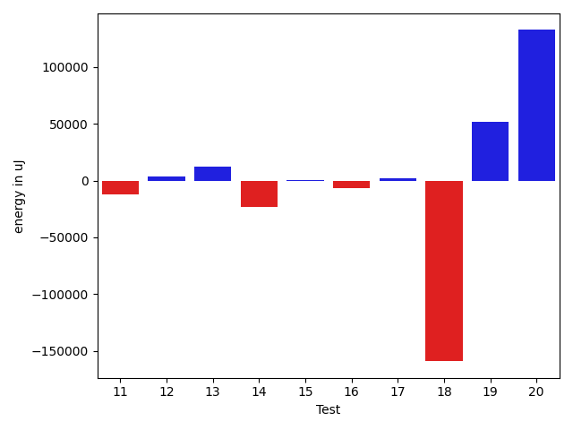
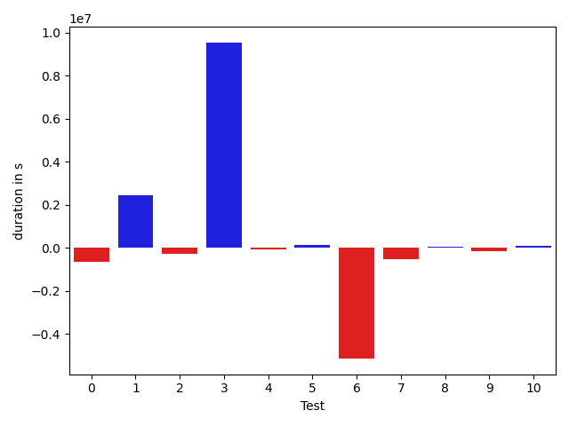
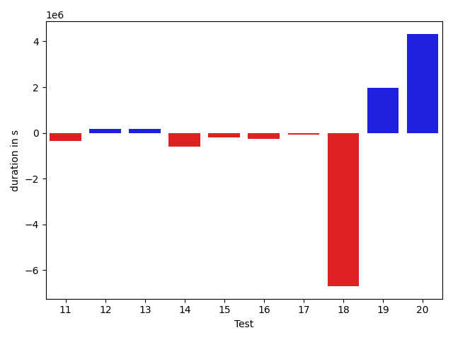

# gson 193349

https://github.com/google/gson.git/commit/193349

## Delta Energy per test method

| ID | EnergyV1 | EnergyV2 | DeltaEnergy |
| --- | --- | --- | --- |
| 0 | 70036.13231244714 | 73218.73805362004 | 3182.605741172898 |
| 1 | 35891.13440815249 | 118100.20154171511 | 82209.06713356262 |
| 2 | 61652.68073631233 | 45357.03159881643 | -16295.6491374959 |
| 3 | 36306.39213823201 | 333890.43071421917 | 297584.03857598716 |
| 4 | 34723.48581168718 | 37480.302581374126 | 2756.8167696869496 |
| 5 | 32682.760245230817 | 38874.29645354355 | 6191.536208312737 |
| 6 | 254233.75619639945 | 91162.76568045012 | -163070.99051594932 |
| 7 | 69507.82033741767 | 75150.73900012854 | 5642.918662710872 |
| 8 | 49327.09263204467 | 65517.99246059742 | 16190.899828552756 |
| 9 | 34858.71845695813 | 55524.30750290682 | 20665.58904594869 |
| 10 | 63183.6699093716 | 40948.89569587202 | -22234.77421349958 |
| 11 | 47744.03862890613 | 35700.10577025361 | -12043.932858652515 |
| 12 | 35195.855229385015 | 38862.01354174547 | 3666.158312360458 |
| 13 | 35276.251286510385 | 47252.73326197996 | 11976.481975469578 |
| 14 | 60211.4568992915 | 36796.943341630766 | -23414.513557660735 |
| 15 | 56374.37363070708 | 57177.75225369753 | 803.3786229904508 |
| 16 | 41385.18331701172 | 34489.44452176767 | -6895.738795244048 |
| 17 | 31408.683891083085 | 33808.642997176226 | 2399.9591060931416 |
| 18 | 504340.8525767431 | 345269.4248495088 | -159071.42772723432 |
| 19 | 79453.98671268257 | 131128.87029014615 | 51674.88357746358 |
| 20 | 54521.28722121959 | 187066.47556914022 | 132545.18834792063 |

## Delta Duration per test method

| ID | DurationV1 | DurationsV2 | DeltaDuration |
| --- | --- | --- | --- |
| 0 | 3076624.0786480154 | 2439092.8141113715 | -637531.2645366439 |
| 1 | 1118436.4764475622 | 3578669.4086883026 | 2460232.9322407404 |
| 2 | 2133727.4361836007 | 1849889.4361589055 | -283838.0000246952 |
| 3 | 1055311.3085911993 | 10594201.006376067 | 9538889.697784867 |
| 4 | 1415303.0061543244 | 1343455.9832851302 | -71847.02286919416 |
| 5 | 1106211.125372565 | 1227959.553332386 | 121748.42795982119 |
| 6 | 7884052.67511621 | 2752918.8268509465 | -5131133.848265264 |
| 7 | 2534024.3292947216 | 2001852.2976822364 | -532172.0316124852 |
| 8 | 1598087.6013850393 | 1638815.2947152099 | 40727.69333017059 |
| 9 | 1762847.3643724802 | 1618603.7979753977 | -144243.56639708253 |
| 10 | 1731461.2856369237 | 1817443.2238976422 | 85981.93826071848 |
| 11 | 1495160.9787743003 | 1145340.1154192034 | -349820.8633550969 |
| 12 | 1501252.1232174076 | 1681430.6150271494 | 180178.49180974183 |
| 13 | 1597071.273443179 | 1771014.8460730398 | 173943.57262986084 |
| 14 | 1867541.5042568224 | 1258492.4339230517 | -609049.0703337707 |
| 15 | 2119798.545223227 | 1935322.9435633828 | -184475.60165984393 |
| 16 | 1326102.2381568477 | 1053347.4656830505 | -272754.7724737972 |
| 17 | 1355723.8383875194 | 1272066.2058324972 | -83657.63255502214 |
| 18 | 17304995.422834355 | 10600249.179544099 | -6704746.243290257 |
| 19 | 2234371.1050577126 | 4213805.405256581 | 1979434.300198868 |
| 20 | 2073720.0616994395 | 6399808.017085932 | 4326087.955386492 |

## Misc.

| ID | Test Class | Test Method |
| --- | --- | --- |
| 0 | com.google.gson.functional.JsonAdapterAnnotationOnClassesTest | testJsonAdapterInvoked |
| 1 | com.google.gson.functional.JsonAdapterAnnotationOnClassesTest | testRegisteredDeserializerOverridesJsonAdapter |
| 2 | com.google.gson.functional.JsonAdapterAnnotationOnClassesTest | testRegisteredSerializerOverridesJsonAdapter |
| 3 | com.google.gson.functional.JsonAdapterAnnotationOnClassesTest | testIncorrectTypeAdapterFails |
| 4 | com.google.gson.functional.JsonAdapterAnnotationOnClassesTest | testJsonAdapterFactoryInvoked |
| 5 | com.google.gson.functional.JsonAdapterAnnotationOnClassesTest | testNullSafeObjectFromJson |
| 6 | com.google.gson.functional.JsonAdapterSerializerDeserializerTest | testJsonSerializerDeserializerBasedJsonAdapterOnFields |
| 7 | com.google.gson.functional.JsonAdapterSerializerDeserializerTest | testDifferentJsonAdaptersForGenericFieldsOfSameRawType |
| 8 | com.google.gson.functional.JsonAdapterSerializerDeserializerTest | testJsonSerializerDeserializerBasedJsonAdapterOnClass |
| 9 | com.google.gson.functional.JsonAdapterAnnotationOnFieldsTest | testPrimitiveFieldAnnotationTakesPrecedenceOverDefault |
| 10 | com.google.gson.functional.JsonAdapterAnnotationOnFieldsTest | testClassAnnotationAdapterFactoryTakesPrecedenceOverDefault |
| 11 | com.google.gson.functional.JsonAdapterAnnotationOnFieldsTest | testJsonAdapterWrappedInNullSafeAsRequested |
| 12 | com.google.gson.functional.JsonAdapterAnnotationOnFieldsTest | testClassAnnotationAdapterTakesPrecedenceOverDefault |
| 13 | com.google.gson.functional.JsonAdapterAnnotationOnFieldsTest | testFieldAnnotationWorksForParameterizedType |
| 14 | com.google.gson.functional.JsonAdapterAnnotationOnFieldsTest | testJsonAdapterInvokedOnlyForAnnotatedFields |
| 15 | com.google.gson.functional.JsonAdapterAnnotationOnFieldsTest | testFieldAnnotationTakesPrecedenceOverRegisteredTypeAdapter |
| 16 | com.google.gson.functional.JsonAdapterAnnotationOnFieldsTest | testNonPrimitiveFieldAnnotationTakesPrecedenceOverDefault |
| 17 | com.google.gson.functional.JsonAdapterAnnotationOnFieldsTest | testFieldAnnotationTakesPrecedenceOverClassAnnotation |
| 18 | com.google.gson.functional.RuntimeTypeAdapterFactoryFunctionalTest | testSubclassesAutomaticallySerialized |
| 19 | com.google.gson.regression.JsonAdapterNullSafeTest | testNullSafeBugDeserialize |
| 20 | com.google.gson.regression.JsonAdapterNullSafeTest | testNullSafeBugSerialize |

| Test | IterationV1 | IterationV2 | DeltaIteration |
| --- | --- | --- | --- |
| 0 | 99 | 99 | 0 |
| 1 | 68 | 73 | 5 |
| 2 | 87 | 88 | 1 |
| 3 | 52 | 63 | 11 |
| 4 | 93 | 93 | 0 |
| 5 | 72 | 77 | 5 |
| 6 | 99 | 99 | 0 |
| 7 | 99 | 99 | 0 |
| 8 | 98 | 99 | 1 |
| 9 | 99 | 99 | 0 |
| 10 | 99 | 99 | 0 |
| 11 | 68 | 62 | -6 |
| 12 | 98 | 99 | 1 |
| 13 | 99 | 99 | 0 |
| 14 | 93 | 93 | 0 |
| 15 | 96 | 98 | 2 |
| 16 | 62 | 64 | 2 |
| 17 | 90 | 95 | 5 |
| 18 | 99 | 99 | 0 |
| 19 | 48 | 65 | 17 |
| 20 | 89 | 92 | 3 |

| Time Label | Time (s) |
| --- | --- |
| Selection | 33.832167863845825 |
| Injection | 13.746963024139404 |
| Total | 1380.636601448059 |

## Aggregation per test class

| Index | EnergyV1 | EnergyV2 | DeltaEnergy |
| --- | --- | --- | --- |
| 0 | 271292.585652062 | 646921.0009432886 | 375628.4152912266 |
| 1 | 373068.6691658618 | 231831.49714117608 | -141237.17202468571 |
| 2 | 405638.2312492246 | 380560.8388870301 | -25077.392362194543 |
| 3 | 504340.8525767431 | 345269.4248495088 | -159071.42772723432 |
| 4 | 133975.27393390215 | 318195.3458592864 | 184220.07192538423 |

| Index | DurationV1 | DurationsV2 | DeltaDuration |
| --- | --- | --- | --- |
| 0 | 9905613.431397267 | 21033268.20195216 | 11127654.770554893 |
| 1 | 12016164.605795972 | 6393586.419248393 | -5622578.186547579 |
| 2 | 14756959.151468707 | 13553061.647394415 | -1203897.5040742923 |
| 3 | 17304995.422834355 | 10600249.179544099 | -6704746.243290257 |
| 4 | 4308091.166757152 | 10613613.422342513 | 6305522.25558536 |
| Index | TestClassName | #Tests |
| --- | --- | --- |
| 0 | com.google.gson.functional.JsonAdapterAnnotationOnClassesTest | 6 |
| 1 | com.google.gson.functional.JsonAdapterSerializerDeserializerTest | 3 |
| 2 | com.google.gson.functional.JsonAdapterAnnotationOnFieldsTest | 9 |
| 3 | com.google.gson.functional.RuntimeTypeAdapterFactoryFunctionalTest | 1 |
| 4 | com.google.gson.regression.JsonAdapterNullSafeTest | 2 |
