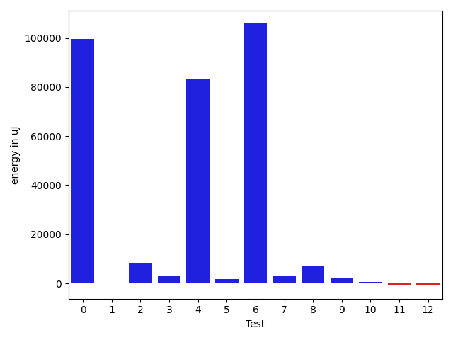
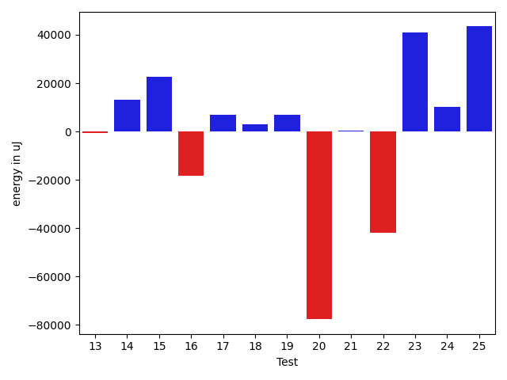
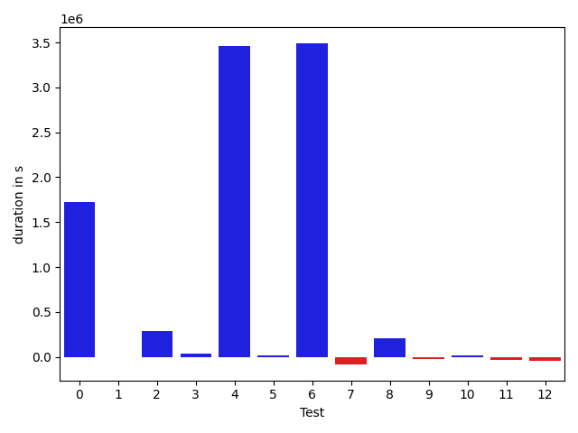
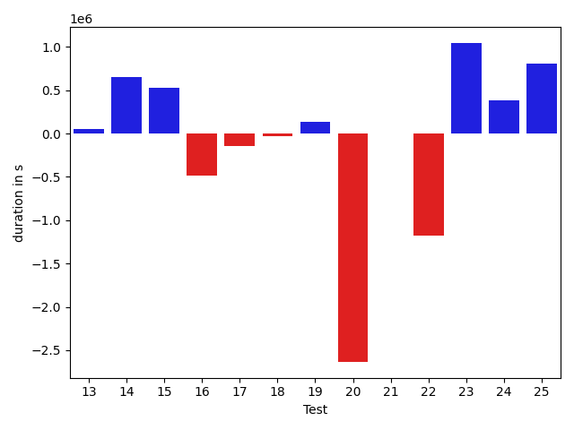
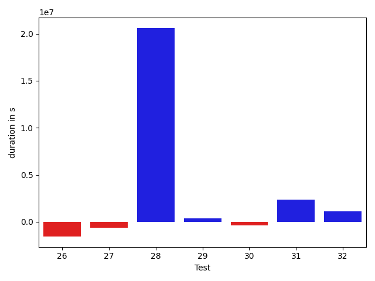

# gson c24af3

https://github.com/google/gson.git/commit/c24af3

## Delta Energy per test method

| ID | EnergyV1 | EnergyV2 | DeltaEnergy |
| --- | --- | --- | --- |
| 0 | 79300.72621757656 | 178966.8689561927 | 99666.14273861612 |
| 1 | 39802.19758385805 | 40247.75638418675 | 445.5588003287048 |
| 2 | 34449.12997725981 | 42573.177681356545 | 8124.047704096738 |
| 3 | 36025.83950804963 | 38827.71123192477 | 2801.8717238751415 |
| 4 | 39895.62960985681 | 123019.06429670568 | 83123.43468684886 |
| 5 | 38734.89839596781 | 40594.742506808194 | 1859.8441108403858 |
| 6 | 96141.41634034256 | 201945.16851734178 | 105803.75217699922 |
| 7 | 33936.43219089508 | 36911.062240600586 | 2974.6300497055054 |
| 8 | 33323.3931030035 | 40679.75015033409 | 7356.357047330588 |
| 9 | 36884.50411579758 | 38945.09208136797 | 2060.58796557039 |
| 10 | 35368.873858876526 | 36076.252977609634 | 707.379118733108 |
| 11 | 37402.85313320112 | 36547.83929148504 | -855.0138417160779 |
| 12 | 37669.710941791534 | 36752.362488627434 | -917.3484531641006 |
| 13 | 36311.71713742614 | 35651.380887269974 | -660.3362501561642 |
| 14 | 36437.98679178581 | 49725.826817885914 | 13287.840026100108 |
| 15 | 36001.62196562532 | 58640.57134068012 | 22638.9493750548 |
| 16 | 53016.83910346031 | 34535.842007011175 | -18480.997096449137 |
| 17 | 32152.963024025783 | 39095.68127015233 | 6942.7182461265475 |
| 18 | 34814.8345375061 | 37889.43954086304 | 3074.6050033569336 |
| 19 | 33893.785762786865 | 40893.40625 | 6999.620487213135 |
| 20 | 116548.03291225433 | 38853.06513214111 | -77694.96778011322 |
| 21 | 36444.35493803024 | 36814.967463850975 | 370.6125258207321 |
| 22 | 78039.91638565063 | 36268.071229696274 | -41771.84515595436 |
| 23 | 155890.26957403222 | 196854.88814316178 | 40964.618569129554 |
| 24 | 62534.101420194675 | 72732.00702896154 | 10197.905608766865 |
| 25 | 133861.54442108303 | 177299.95204678754 | 43438.40762570451 |
| 26 | 51593.568098007585 | 39728.44993386414 | -11865.118164143445 |
| 27 | 68228.28688867512 | 41464.8044374915 | -26763.482451183627 |
| 28 | 46645.71283183483 | 705331.5063411142 | 658685.7935092794 |
| 29 | 33316.11384653878 | 54424.54749752564 | 21108.43365098686 |
| 30 | 73227.87986972196 | 71270.27275536745 | -1957.6071143545123 |
| 31 | 43259.55296966492 | 113048.5341157475 | 69788.98114608259 |
| 32 | 40288.80059698224 | 38617.860487668775 | -1670.9401093134657 |

## Delta Duration per test method

| ID | DurationV1 | DurationsV2 | DeltaDuration |
| --- | --- | --- | --- |
| 0 | 2870766.133447163 | 4595272.681711523 | 1724506.54826436 |
| 1 | 816029.2056003399 | 812784.8244505256 | -3244.3811498143477 |
| 2 | 904529.7362659404 | 1190498.501236373 | 285968.76497043273 |
| 3 | 1053584.0189092057 | 1085724.7165771972 | 32140.69766799151 |
| 4 | 793207.8475912635 | 4257411.964762293 | 3464204.1171710296 |
| 5 | 683447.6678457821 | 698050.1225196235 | 14602.454673841363 |
| 6 | 2383140.766621977 | 5873537.045744185 | 3490396.2791222082 |
| 7 | 712573.0857915878 | 629413.0910797119 | -83159.99471187592 |
| 8 | 560039.1899205446 | 762981.0775244087 | 202941.88760386407 |
| 9 | 681394.6753382757 | 662669.6575236917 | -18725.017814584076 |
| 10 | 584202.529546082 | 598705.5534758568 | 14503.023929774761 |
| 11 | 802613.5766906131 | 773616.8293342678 | -28996.747356345295 |
| 12 | 577999.9700460434 | 532465.3249995708 | -45534.64504647255 |
| 13 | 559935.5145816617 | 608900.9913672805 | 48965.47678561881 |
| 14 | 664368.0072332383 | 1319261.9688705893 | 654893.961637351 |
| 15 | 810242.3283592432 | 1342401.3759019375 | 532159.0475426943 |
| 16 | 1114170.7666654587 | 631976.8526681066 | -482193.9139973521 |
| 17 | 785758.3897383763 | 639144.8230592906 | -146613.5666790856 |
| 18 | 598171.2300415039 | 570301.249215126 | -27869.98082637787 |
| 19 | 543007.4838676453 | 681981.8773193359 | 138974.39345169067 |
| 20 | 3251288.3828458786 | 617612.3020401001 | -2633676.0808057785 |
| 21 | 626374.3290046453 | 624070.2690337002 | -2304.05997094512 |
| 22 | 1789904.636001587 | 616445.9706139565 | -1173458.6653876305 |
| 23 | 4167095.9706705506 | 5211957.041011029 | 1044861.0703404783 |
| 24 | 1647048.3799501043 | 2025225.4821584956 | 378177.1022083913 |
| 25 | 3811656.906583254 | 4617974.654864588 | 806317.7482813336 |
| 26 | 2515294.0114444927 | 951728.0555062403 | -1563565.9559382524 |
| 27 | 2185756.488248542 | 1558054.4989668466 | -627701.9892816953 |
| 28 | 1146163.7513464205 | 21744595.042174242 | 20598431.290827822 |
| 29 | 1193926.132985306 | 1586022.3368512713 | 392096.20386596536 |
| 30 | 2530331.9410519693 | 2169971.973329802 | -360359.96772216726 |
| 31 | 1117132.7572927887 | 3495105.757971905 | 2377973.0006791167 |
| 32 | 599630.1294783391 | 1717663.7658960721 | 1118033.636417733 |

## Misc.

| ID | Test Class | Test Method |
| --- | --- | --- |
| 0 | com.google.gson.functional.StreamingTypeAdaptersTest | testFromJsonTree |
| 1 | com.google.gson.functional.JsonParserTest | testBadTypeForDeserializingCustomTree |
| 2 | com.google.gson.functional.JsonParserTest | testChangingCustomTreeAndDeserializing |
| 3 | com.google.gson.functional.JsonParserTest | testBadFieldTypeForDeserializingCustomTree |
| 4 | com.google.gson.functional.JsonParserTest | testDeserializingCustomTree |
| 5 | com.google.gson.functional.JsonParserTest | testBadFieldTypeForCustomDeserializerCustomTree |
| 6 | com.google.gson.internal.bind.JsonElementReaderTest | testLenientNansAndInfinities |
| 7 | com.google.gson.internal.bind.JsonElementReaderTest | testArray |
| 8 | com.google.gson.internal.bind.JsonElementReaderTest | testObject |
| 9 | com.google.gson.internal.bind.JsonElementReaderTest | testNumbersFromStrings |
| 10 | com.google.gson.internal.bind.JsonElementReaderTest | testNulls |
| 11 | com.google.gson.internal.bind.JsonElementReaderTest | testWrongType |
| 12 | com.google.gson.internal.bind.JsonElementReaderTest | testEmptyObject |
| 13 | com.google.gson.internal.bind.JsonElementReaderTest | testSkipValue |
| 14 | com.google.gson.internal.bind.JsonElementReaderTest | testNumbers |
| 15 | com.google.gson.internal.bind.JsonElementReaderTest | testNestedObjects |
| 16 | com.google.gson.internal.bind.JsonElementReaderTest | testStringsFromNumbers |
| 17 | com.google.gson.internal.bind.JsonElementReaderTest | testStrictNansAndInfinities |
| 18 | com.google.gson.internal.bind.JsonElementReaderTest | testEarlyClose |
| 19 | com.google.gson.internal.bind.JsonElementReaderTest | testEmptyArray |
| 20 | com.google.gson.internal.bind.JsonElementReaderTest | testNestedArrays |
| 21 | com.google.gson.internal.bind.JsonElementReaderTest | testStrings |
| 22 | com.google.gson.internal.bind.JsonElementReaderTest | testBooleans |
| 23 | com.google.gson.functional.RuntimeTypeAdapterFactoryFunctionalTest | testSubclassesAutomaticallySerialzed |
| 24 | com.google.gson.functional.CustomDeserializerTest | testJsonTypeFieldBasedDeserialization |
| 25 | com.google.gson.functional.TypeHierarchyAdapterTest | testTypeHierarchy |
| 26 | com.google.gson.functional.ReadersWritersTest | testReadWriteTwoStrings |
| 27 | com.google.gson.functional.ReadersWritersTest | testReadWriteTwoObjects |
| 28 | com.google.gson.functional.ExclusionStrategyFunctionalTest | testExclusionStrategyDeserialization |
| 29 | com.google.gson.functional.ExclusionStrategyFunctionalTest | testExclusionStrategyWithMode |
| 30 | com.google.gson.JsonParserTest | testReadWriteTwoObjects |
| 31 | com.google.gson.functional.MapTest | testMapNamePromotionWithJsonElementReader |
| 32 | com.google.gson.functional.PrimitiveTest | testPrimitiveClassLiteral |

| Test | IterationV1 | IterationV2 | DeltaIteration |
| --- | --- | --- | --- |
| 0 | 40 | 98 | 58 |
| 1 | 42 | 56 | 14 |
| 2 | 57 | 62 | 5 |
| 3 | 62 | 75 | 13 |
| 4 | 45 | 62 | 17 |
| 5 | 45 | 42 | -3 |
| 6 | 44 | 49 | 5 |
| 7 | 22 | 17 | -5 |
| 8 | 23 | 30 | 7 |
| 9 | 27 | 25 | -2 |
| 10 | 27 | 23 | -4 |
| 11 | 45 | 41 | -4 |
| 12 | 21 | 24 | 3 |
| 13 | 29 | 25 | -4 |
| 14 | 32 | 35 | 3 |
| 15 | 33 | 24 | -9 |
| 16 | 23 | 27 | 4 |
| 17 | 32 | 25 | -7 |
| 18 | 19 | 22 | 3 |
| 19 | 20 | 14 | -6 |
| 20 | 21 | 19 | -2 |
| 21 | 24 | 27 | 3 |
| 22 | 19 | 23 | 4 |
| 23 | 99 | 99 | 0 |
| 24 | 99 | 99 | 0 |
| 25 | 99 | 99 | 0 |
| 26 | 74 | 66 | -8 |
| 27 | 73 | 87 | 14 |
| 28 | 48 | 98 | 50 |
| 29 | 70 | 81 | 11 |
| 30 | 84 | 88 | 4 |
| 31 | 64 | 93 | 29 |
| 32 | 29 | 45 | 16 |

| Time Label | Time (s) |
| --- | --- |
| Selection | 34.47681212425232 |
| Injection | 15.5284423828125 |
| Total | 1386.952448606491 |

## Aggregation per test class

| Index | EnergyV1 | EnergyV2 | DeltaEnergy |
| --- | --- | --- | --- |
| 0 | 79300.72621757656 | 178966.8689561927 | 99666.14273861612 |
| 1 | 188907.6950749921 | 285262.45210098196 | 96354.75702598985 |
| 2 | 804389.2362424594 | 836225.7796869174 | 31836.543444458046 |
| 3 | 155890.26957403222 | 196854.88814316178 | 40964.618569129554 |
| 4 | 62534.101420194675 | 72732.00702896154 | 10197.905608766865 |
| 5 | 133861.54442108303 | 177299.95204678754 | 43438.40762570451 |
| 6 | 119821.85498668271 | 81193.25437135564 | -38628.60061532707 |
| 7 | 79961.82667837362 | 759756.0538386398 | 679794.2271602661 |
| 8 | 73227.87986972196 | 71270.27275536745 | -1957.6071143545123 |
| 9 | 43259.55296966492 | 113048.5341157475 | 69788.98114608259 |
| 10 | 40288.80059698224 | 38617.860487668775 | -1670.9401093134657 |

| Index | DurationV1 | DurationsV2 | DeltaDuration |
| --- | --- | --- | --- |
| 0 | 2870766.133447163 | 4595272.681711523 | 1724506.54826436 |
| 1 | 4250798.476212531 | 8044470.129546012 | 3793671.6533334805 |
| 2 | 17045184.862294365 | 17485486.259771116 | 440301.39747675136 |
| 3 | 4167095.9706705506 | 5211957.041011029 | 1044861.0703404783 |
| 4 | 1647048.3799501043 | 2025225.4821584956 | 378177.1022083913 |
| 5 | 3811656.906583254 | 4617974.654864588 | 806317.7482813336 |
| 6 | 4701050.499693034 | 2509782.554473087 | -2191267.945219947 |
| 7 | 2340089.8843317265 | 23330617.379025515 | 20990527.49469379 |
| 8 | 2530331.9410519693 | 2169971.973329802 | -360359.96772216726 |
| 9 | 1117132.7572927887 | 3495105.757971905 | 2377973.0006791167 |
| 10 | 599630.1294783391 | 1717663.7658960721 | 1118033.636417733 |
| Index | TestClassName | #Tests |
| --- | --- | --- |
| 0 | com.google.gson.functional.StreamingTypeAdaptersTest | 1 |
| 1 | com.google.gson.functional.JsonParserTest | 5 |
| 2 | com.google.gson.internal.bind.JsonElementReaderTest | 17 |
| 3 | com.google.gson.functional.RuntimeTypeAdapterFactoryFunctionalTest | 1 |
| 4 | com.google.gson.functional.CustomDeserializerTest | 1 |
| 5 | com.google.gson.functional.TypeHierarchyAdapterTest | 1 |
| 6 | com.google.gson.functional.ReadersWritersTest | 2 |
| 7 | com.google.gson.functional.ExclusionStrategyFunctionalTest | 2 |
| 8 | com.google.gson.JsonParserTest | 1 |
| 9 | com.google.gson.functional.MapTest | 1 |
| 10 | com.google.gson.functional.PrimitiveTest | 1 |
