# gson 2df655

https://github.com/google/gson.git/commit/2df655

## Delta Energy per test method

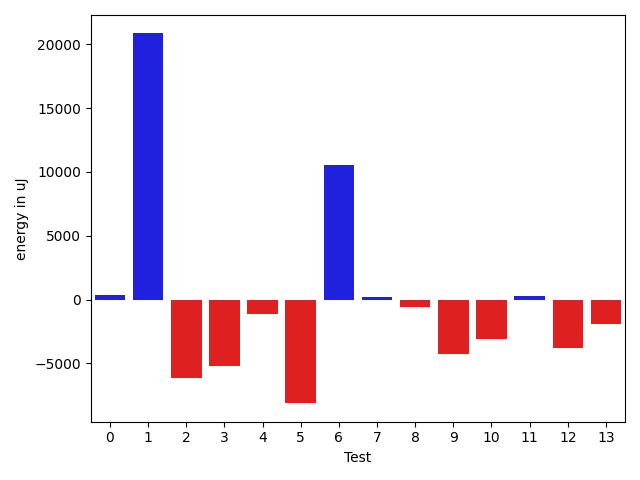

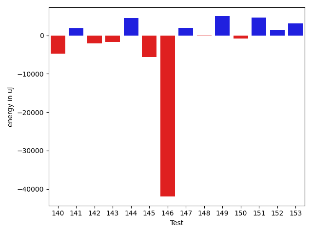

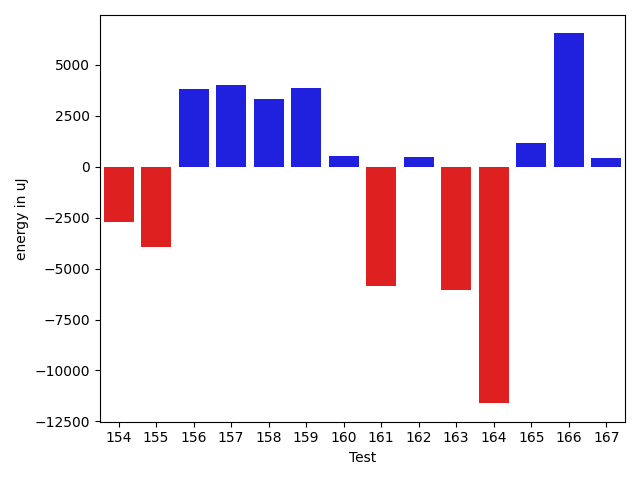

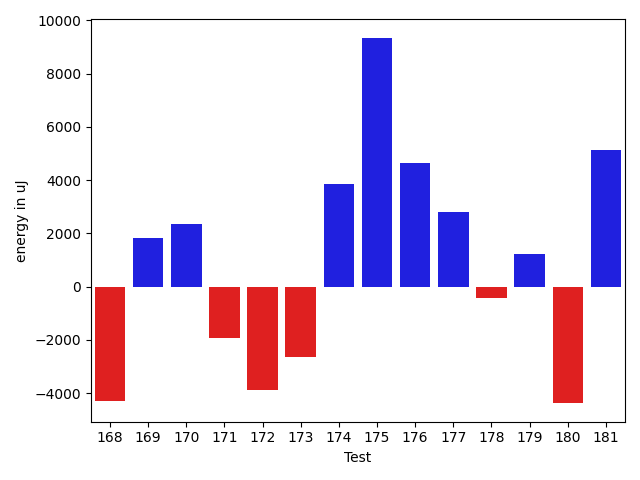

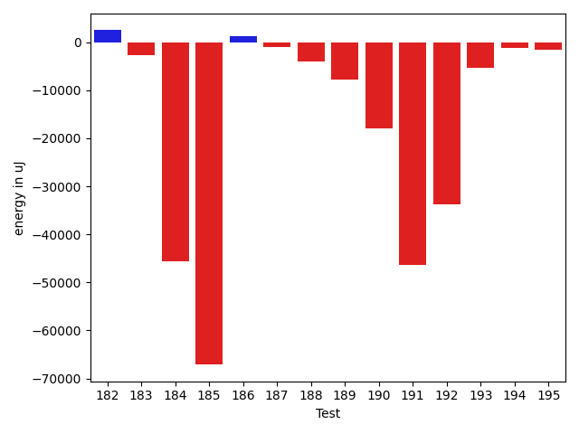

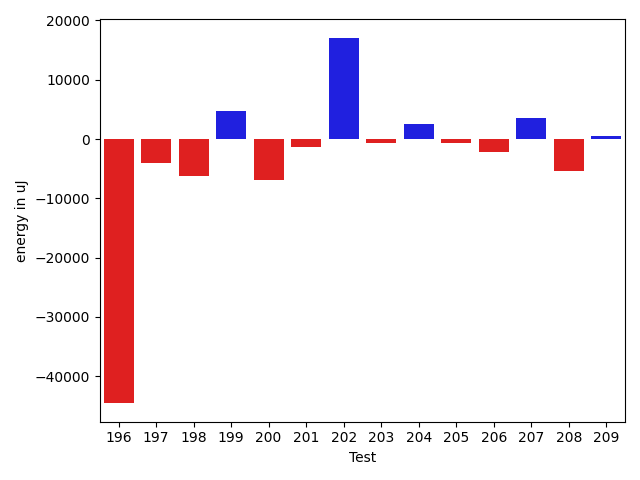

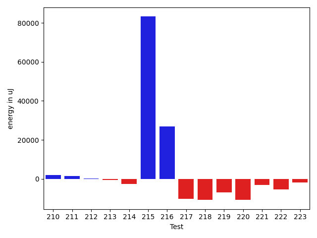

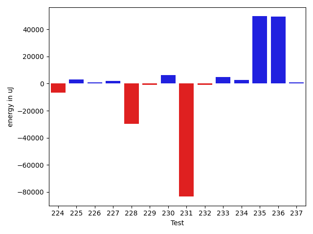

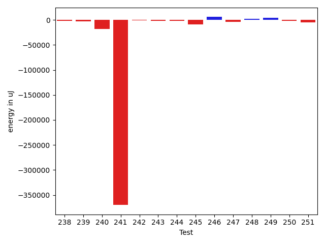

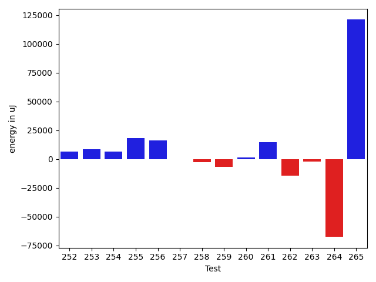

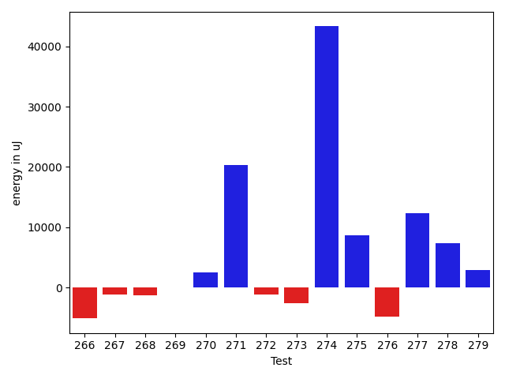

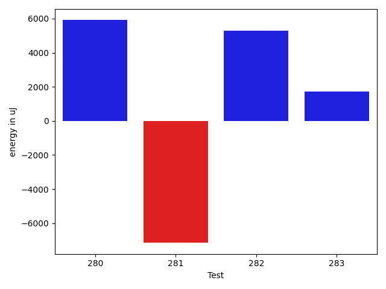

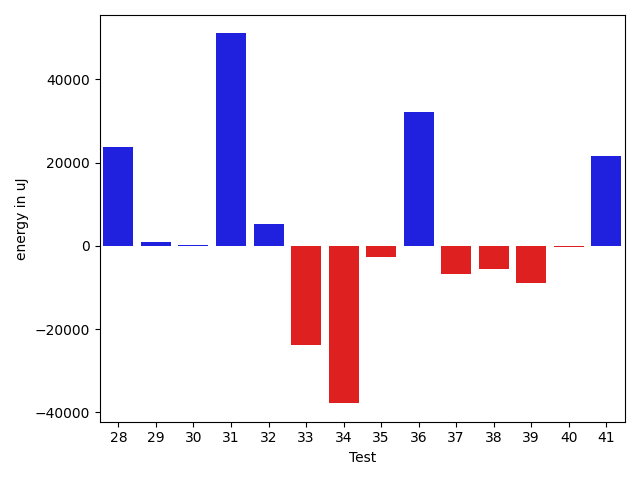

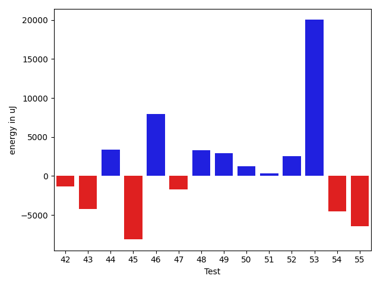

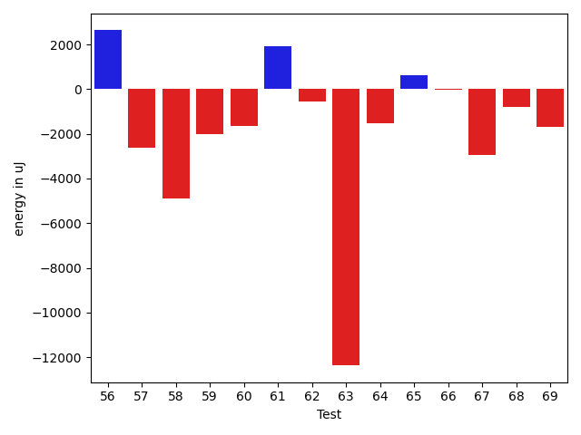

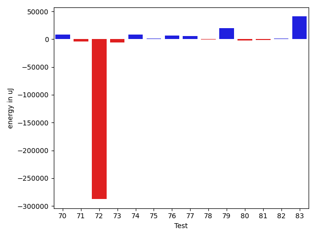

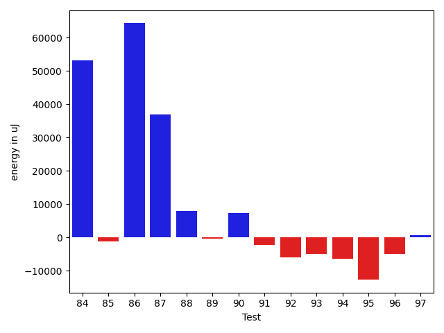

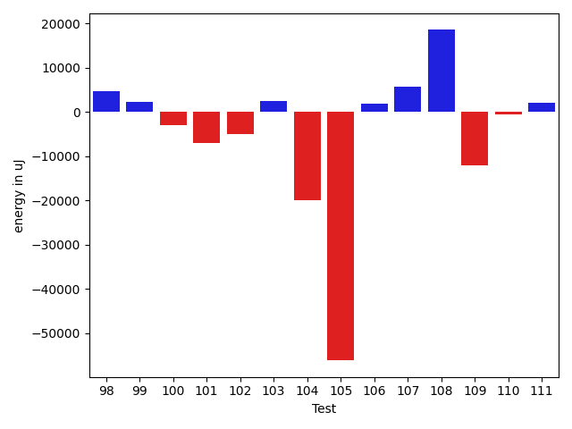

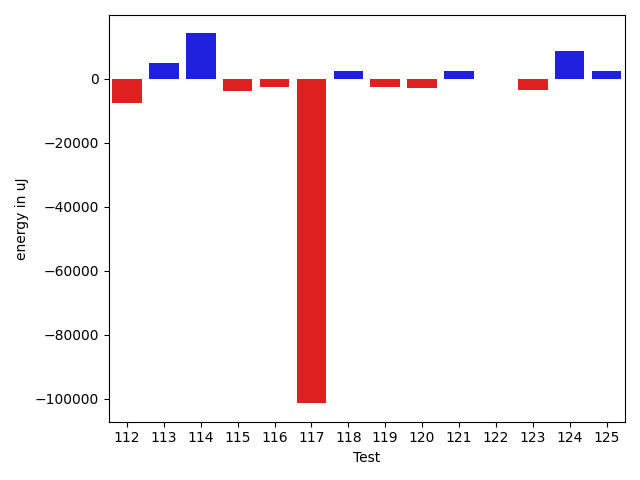

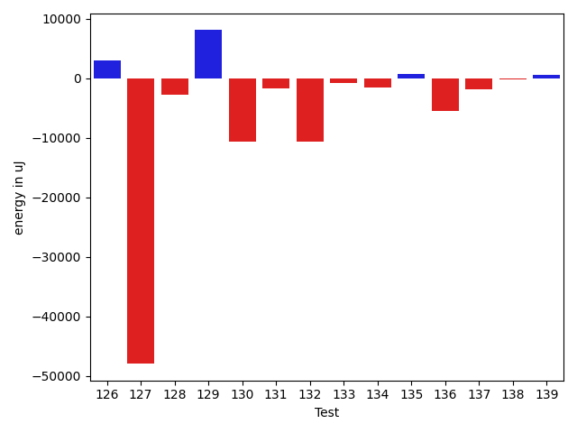

| ID | EnergyV1 | EnergyV2 | DeltaEnergy |
| --- | --- | --- | --- |
| 0 | 44231.14916335002 | 44601.751900214455 | 370.6027368644354 |
| 1 | 35535.280531136086 | 56381.380794869736 | 20846.10026373365 |
| 2 | 42744.31726525284 | 36609.12319243929 | -6135.194072813545 |
| 3 | 41996.29668488819 | 36807.67145022958 | -5188.625234658612 |
| 4 | 44216.20332147727 | 43061.24847249565 | -1154.9548489816152 |
| 5 | 43521.98909649812 | 35394.329990031314 | -8127.659106466803 |
| 6 | 91123.62963921165 | 101641.9410423423 | 10518.311403130647 |
| 7 | 40353.85170993452 | 40581.385255960864 | 227.533546026345 |
| 8 | 36417.03151349493 | 35829.02308581372 | -588.0084276812049 |
| 9 | 44041.48843722384 | 39749.18196965766 | -4292.306467566181 |
| 10 | 42330.41180032687 | 39271.77760401075 | -3058.6341963161176 |
| 11 | 40496.03205950257 | 40768.505325671205 | 272.47326616863575 |
| 12 | 42241.00330104373 | 38415.264441029576 | -3825.7388600141567 |
| 13 | 39217.81991766766 | 37304.84200469032 | -1912.9779129773378 |
| 14 | 41434.006319224834 | 34612.56539338827 | -6821.440925836563 |
| 15 | 37458.2144587934 | 38387.34382009506 | 929.1293613016605 |
| 16 | 36328.41028029226 | 42460.39315320212 | 6131.982872909866 |
| 17 | 39695.708814519196 | 39706.75886905743 | 11.050054538231052 |
| 18 | 36221.66306972504 | 37251.406188845634 | 1029.7431191205978 |
| 19 | 40748.48973940313 | 41532.16493394971 | 783.6751945465803 |
| 20 | 44108.35560400288 | 41251.06125994446 | -2857.2943440584204 |
| 21 | 41423.26150471416 | 39326.03543916582 | -2097.2260655483406 |
| 22 | 36304.40912729129 | 44234.19893747292 | 7929.7898101816245 |
| 23 | 39963.00196228974 | 42316.44344755062 | 2353.4414852608825 |
| 24 | 41496.6241608767 | 38766.73195344218 | -2729.8922074345246 |
| 25 | 783147.5610117597 | 198050.47054173134 | -585097.0904700283 |
| 26 | 35849.223974187174 | 37578.668687496174 | 1729.4447133089998 |
| 27 | 38165.51691281683 | 42602.1113628266 | 4436.594450009776 |
| 28 | 41756.4006347066 | 65523.2818986302 | 23766.8812639236 |
| 29 | 36341.27285762408 | 37220.60578263318 | 879.3329250091047 |
| 30 | 36002.14825606113 | 36309.78277836181 | 307.63452230067924 |
| 31 | 35875.80463568866 | 86871.47665104922 | 50995.67201536056 |
| 32 | 30283.259765625 | 35596.80078125 | 5313.541015625 |
| 33 | 93166.86180582788 | 69466.82404487113 | -23700.03776095675 |
| 34 | 78351.24107927959 | 40549.08175268167 | -37802.15932659792 |
| 35 | 44111.349183516715 | 41448.399329694636 | -2662.9498538220796 |
| 36 | 65946.20691638431 | 98075.39496190159 | 32129.18804551728 |
| 37 | 51885.23954924479 | 45210.05285116697 | -6675.186698077821 |
| 38 | 44491.956307966575 | 38966.02221667436 | -5525.9340912922125 |
| 39 | 43205.131796541944 | 34175.054528329754 | -9030.07726821219 |
| 40 | 44970.84340045486 | 44626.32159902983 | -344.52180142503494 |
| 41 | 42619.42198840612 | 64289.54364481529 | 21670.121656409174 |
| 42 | 41371.56099310632 | 40013.26650384112 | -1358.2944892652013 |
| 43 | 42068.967267889995 | 37827.69730398727 | -4241.269963902727 |
| 44 | 35838.163982364895 | 39223.776956571244 | 3385.6129742063495 |
| 45 | 43364.12057750776 | 35227.652463272214 | -8136.468114235548 |
| 46 | 46926.56126717666 | 54881.22556066878 | 7954.664293492126 |
| 47 | 41908.644476352 | 40163.37997845771 | -1745.2644978942844 |
| 48 | 52850.719328600324 | 56191.60225560477 | 3340.8829270044444 |
| 49 | 35108.27011696806 | 38045.80631400907 | 2937.5361970410086 |
| 50 | 39185.882697299574 | 40416.40419537266 | 1230.5214980730889 |
| 51 | 38440.04051239059 | 38737.4526666827 | 297.412154292113 |
| 52 | 37335.55043940138 | 39854.54647723563 | 2518.996037834251 |
| 53 | 47112.02469974151 | 67136.34063034113 | 20024.315930599623 |
| 54 | 41942.72911261473 | 37396.625786142315 | -4546.103326472417 |
| 55 | 44874.22361886988 | 38418.15356850005 | -6456.070050369832 |
| 56 | 37976.48825842341 | 40612.10080972076 | 2635.612551297352 |
| 57 | 35909.6828597188 | 33278.72067449987 | -2630.9621852189302 |
| 58 | 40506.40179341388 | 35611.02190038457 | -4895.379893029312 |
| 59 | 39987.909639380276 | 37969.64337363233 | -2018.266265747945 |
| 60 | 40330.880467541516 | 38694.18528676033 | -1636.6951807811856 |
| 61 | 46587.96642564761 | 48492.62406327585 | 1904.6576376282392 |
| 62 | 37771.79217826569 | 37206.98888503235 | -564.8032932333444 |
| 63 | 65486.30572128296 | 53113.73208117159 | -12372.573640111368 |
| 64 | 38690.971957594156 | 37163.250957265496 | -1527.72100032866 |
| 65 | 37763.278024377396 | 38399.3925739655 | 636.1145495881065 |
| 66 | 37237.593721956015 | 37227.94812362641 | -9.645598329603672 |
| 67 | 40322.05545282974 | 37363.01753069514 | -2959.037922134601 |
| 68 | 39296.92925262451 | 38486.47706604004 | -810.4521865844727 |
| 69 | 39315.8145339787 | 37608.44702848885 | -1707.3675054898486 |
| 70 | 39148.86099985152 | 47031.91707754135 | 7883.056077689835 |
| 71 | 40013.7810049057 | 35619.4025604371 | -4394.3784444686025 |
| 72 | 507650.5662890583 | 219970.58823105763 | -287679.9780580007 |
| 73 | 174931.53670556762 | 169330.7959713915 | -5600.740734176128 |
| 74 | 33612.499890019186 | 41869.056624665856 | 8256.55673464667 |
| 75 | 38116.84753032434 | 39687.91003079341 | 1571.0625004690737 |
| 76 | 36362.019816237036 | 42891.20576475654 | 6529.185948519502 |
| 77 | 40494.6961673277 | 45778.37119638109 | 5283.675029053396 |
| 78 | 40820.95980701545 | 39996.63190064668 | -824.3279063687733 |
| 79 | 39912.69783558691 | 59308.29914281011 | 19395.6013072232 |
| 80 | 42226.394872853874 | 40241.48704339114 | -1984.9078294627325 |
| 81 | 39979.89733972773 | 38782.76551797986 | -1197.1318217478693 |
| 82 | 39734.31552245468 | 40575.67494869232 | 841.3594262376428 |
| 83 | 40884.83996024829 | 81593.20216171767 | 40708.362201469376 |
| 84 | 36054.94673733809 | 89329.53822509396 | 53274.59148775587 |
| 85 | 41688.54849624634 | 40590.23302954156 | -1098.3154667047784 |
| 86 | 69143.5550428373 | 133458.93560237327 | 64315.38055953597 |
| 87 | 153609.97755217823 | 190453.33971355815 | 36843.36216137992 |
| 88 | 37213.816218880485 | 45264.14168628873 | 8050.325467408242 |
| 89 | 36172.4997423172 | 35865.631632385404 | -306.86810993179824 |
| 90 | 92832.99919331347 | 100237.6923810019 | 7404.693187688434 |
| 91 | 38812.060288889545 | 36660.81543929996 | -2151.244849589588 |
| 92 | 43597.39516424108 | 37662.25662189885 | -5935.1385423422325 |
| 93 | 41281.87951267138 | 36435.968984324485 | -4845.910528346896 |
| 94 | 43665.72477633079 | 37189.70344663277 | -6476.021329698022 |
| 95 | 48178.446186347224 | 35495.11904566162 | -12683.327140685607 |
| 96 | 41453.45986247089 | 36494.72467265194 | -4958.735189818952 |
| 97 | 38161.43955993652 | 38854.846855163574 | 693.4072952270508 |
| 98 | 33508.94157858053 | 38323.235955029726 | 4814.294376449194 |
| 99 | 39755.16196575289 | 42085.226230255794 | 2330.0642645029 |
| 100 | 43991.70003630739 | 41110.01012296323 | -2881.689913344162 |
| 101 | 63800.88738060332 | 56735.47230457725 | -7065.4150760260745 |
| 102 | 51341.733896970676 | 46410.700518940466 | -4931.03337803021 |
| 103 | 45115.32353160836 | 47571.64640870942 | 2456.3228771010617 |
| 104 | 73510.96585364481 | 53611.32218022116 | -19899.64367342365 |
| 105 | 136239.8257519137 | 80104.72048079662 | -56135.10527111709 |
| 106 | 38120.38186898916 | 40001.100200796536 | 1880.718331807373 |
| 107 | 35585.87805111706 | 41255.0940322876 | 5669.215981170535 |
| 108 | 38273.400613842 | 56835.9722743851 | 18562.5716605431 |
| 109 | 53665.91661207612 | 41616.546795931696 | -12049.369816144426 |
| 110 | 42573.360905604335 | 42043.45145338109 | -529.9094522232481 |
| 111 | 36195.14123672247 | 38381.44013988972 | 2186.2989031672478 |
| 112 | 44774.06589708425 | 37085.37221636297 | -7688.693680721277 |
| 113 | 36024.88034415245 | 41108.0078125 | 5083.127468347549 |
| 114 | 39118.45403450502 | 53313.71793152012 | 14195.263897015102 |
| 115 | 41323.02791976929 | 37472.60635519028 | -3850.42156457901 |
| 116 | 38114.93138027191 | 35476.376536369324 | -2638.554843902588 |
| 117 | 146562.3758018593 | 45150.885830329586 | -101411.48997152972 |
| 118 | 41814.59816758882 | 44302.42959849411 | 2487.831430905295 |
| 119 | 40601.75626071853 | 37983.52157392995 | -2618.234686788579 |
| 120 | 44922.68700300712 | 42128.58676831982 | -2794.1002346872992 |
| 121 | 33875.94806544788 | 36332.538909316405 | 2456.590843868522 |
| 122 | 43326.626385376716 | 43192.255018091324 | -134.3713672853919 |
| 123 | 42368.683557235665 | 39029.909063596744 | -3338.774493638921 |
| 124 | 39829.4090271827 | 48561.734998330656 | 8732.325971147955 |
| 125 | 42517.21891933009 | 44954.065424736924 | 2436.8465054068365 |
| 126 | 40362.029497722295 | 43347.5551366893 | 2985.525638967003 |
| 127 | 94115.89173193686 | 46170.00428952738 | -47945.88744240948 |
| 128 | 37031.183067249316 | 34217.32747486383 | -2813.8555923854874 |
| 129 | 38599.53255034945 | 46653.21674324142 | 8053.6841928919675 |
| 130 | 80665.72530076274 | 69981.62057308297 | -10684.104727679776 |
| 131 | 39766.98062224738 | 38115.61018107171 | -1651.3704411756698 |
| 132 | 52405.31452095136 | 41804.0661239624 | -10601.248396988958 |
| 133 | 40037.76330264997 | 39172.67993558441 | -865.0833670655556 |
| 134 | 41270.17978399247 | 39671.5379948616 | -1598.6417891308665 |
| 135 | 35502.5740302489 | 36190.27420704356 | 687.700176794664 |
| 136 | 41716.36059537052 | 36258.80045019636 | -5457.56014517416 |
| 137 | 40951.12103751175 | 39051.30083272768 | -1899.820204784075 |
| 138 | 41436.25099647232 | 41198.75321532809 | -237.49778114422952 |
| 139 | 37638.55558011914 | 38176.993678957224 | 538.4380988380872 |
| 140 | 40629.282371520996 | 35861.704833984375 | -4767.577537536621 |
| 141 | 37713.53294998547 | 39533.05325952728 | 1819.520309541811 |
| 142 | 40082.79849306996 | 37944.47839280823 | -2138.320100261728 |
| 143 | 41931.200722783804 | 40206.593384981155 | -1724.6073378026485 |
| 144 | 38256.97167162756 | 42713.48979036341 | 4456.518118735854 |
| 145 | 45054.82844529732 | 39417.319139533734 | -5637.509305763582 |
| 146 | 85978.44807454484 | 44017.22284349799 | -41961.22523104685 |
| 147 | 38876.71807682514 | 40801.07596279681 | 1924.3578859716654 |
| 148 | 39874.98977446366 | 39673.58880159357 | -201.4009728700912 |
| 149 | 34416.463076825254 | 39376.85316158086 | 4960.390084755607 |
| 150 | 39468.95099944732 | 38660.16599983536 | -808.7849996119621 |
| 151 | 34917.577465144765 | 39571.56680249404 | 4653.989337349274 |
| 152 | 35957.57372665405 | 37247.223580292775 | 1289.6498536387226 |
| 153 | 36584.79812142845 | 39717.41817999084 | 3132.6200585623883 |
| 154 | 39505.329332113266 | 36809.04327194393 | -2696.286060169339 |
| 155 | 41779.43116979241 | 37823.60777608502 | -3955.8233937073965 |
| 156 | 38253.58253919224 | 42060.78013397225 | 3807.1975947800092 |
| 157 | 35901.84569916036 | 39919.726438199636 | 4017.880739039276 |
| 158 | 33392.625942230225 | 36728.951154351234 | 3336.32521212101 |
| 159 | 34649.70979810705 | 38531.55157671821 | 3881.8417786111604 |
| 160 | 39514.421175398966 | 40053.24345363394 | 538.8222782349767 |
| 161 | 43499.864122445826 | 37649.616052838006 | -5850.24806960782 |
| 162 | 36284.38722468997 | 36750.772573184986 | 466.38534849501593 |
| 163 | 46164.8154296875 | 40128.883508741856 | -6035.931920945644 |
| 164 | 51506.608459472656 | 39899.58522415161 | -11607.023235321045 |
| 165 | 35581.01439133477 | 36724.80920032311 | 1143.7948089883357 |
| 166 | 34221.10309839249 | 40753.95534467697 | 6532.852246284485 |
| 167 | 36341.52020263672 | 36746.19194961712 | 404.6717469803989 |
| 168 | 41923.30035155144 | 37605.08101997094 | -4318.219331580505 |
| 169 | 35977.47567772865 | 37793.060512423515 | 1815.5848346948624 |
| 170 | 37994.29863357544 | 40349.038203924894 | 2354.739570349455 |
| 171 | 37554.02098086476 | 35607.44122777879 | -1946.5797530859709 |
| 172 | 42001.80953979492 | 38115.93230210617 | -3885.87723768875 |
| 173 | 42275.543128967285 | 39617.90234375 | -2657.640785217285 |
| 174 | 38529.510895002546 | 42370.03901771771 | 3840.5281227151645 |
| 175 | 40675.16313707533 | 50027.27291738571 | 9352.109780310377 |
| 176 | 37978.592634030414 | 42616.9259087869 | 4638.3332747564855 |
| 177 | 50921.26061480453 | 53715.15761482064 | 2793.897000016106 |
| 178 | 42650.75635778076 | 42205.563449862464 | -445.19290791829553 |
| 179 | 37988.251936616514 | 39226.758156386604 | 1238.50621977009 |
| 180 | 45220.75055369492 | 40828.76066395299 | -4391.989889741926 |
| 181 | 38193.90857526778 | 43332.21247519778 | 5138.303899930004 |
| 182 | 38923.03342705827 | 41406.22170651147 | 2483.1882794531994 |
| 183 | 38689.30333647132 | 36003.8032438755 | -2685.5000925958157 |
| 184 | 115483.42843296271 | 69833.2276150719 | -45650.200817890815 |
| 185 | 109774.29229719331 | 42652.97477740887 | -67121.31751978444 |
| 186 | 37583.61245214939 | 38845.121822390705 | 1261.5093702413142 |
| 187 | 40575.173612254344 | 39573.2295298634 | -1001.9440823909463 |
| 188 | 44110.492611547365 | 40031.977624186824 | -4078.5149873605405 |
| 189 | 46656.29388601854 | 38868.72635716101 | -7787.567528857529 |
| 190 | 59380.655856694255 | 41350.35802813496 | -18030.297828559298 |
| 191 | 87595.52303734387 | 41276.520764365894 | -46319.002272977974 |
| 192 | 170147.02415204037 | 136427.82079983116 | -33719.20335220921 |
| 193 | 41190.722679211976 | 35921.88503708044 | -5268.837642131533 |
| 194 | 41965.01719864479 | 40807.39816905877 | -1157.6190295860215 |
| 195 | 44169.58387539069 | 42555.392044070206 | -1614.1918313204806 |
| 196 | 81905.72314266935 | 37293.003830730915 | -44612.71931193843 |
| 197 | 43376.37279941933 | 39398.457527160645 | -3977.9152722586878 |
| 198 | 43164.54404801296 | 36868.17629368423 | -6296.367754328734 |
| 199 | 37581.23298831284 | 42251.911167398095 | 4670.678179085255 |
| 200 | 122623.51454783983 | 115709.10126536539 | -6914.413282474445 |
| 201 | 39078.74930019822 | 37653.05004216693 | -1425.6992580312944 |
| 202 | 40734.40489649784 | 57843.462908297886 | 17109.058011800043 |
| 203 | 42835.05317011862 | 42237.472467742045 | -597.5807023765738 |
| 204 | 42645.72100071771 | 45164.09540734638 | 2518.374406628667 |
| 205 | 40727.86909157038 | 39994.80626913207 | -733.0628224383108 |
| 206 | 39500.74052851265 | 37309.55178071547 | -2191.188747797183 |
| 207 | 43900.44875487975 | 47405.0402813748 | 3504.5915264950527 |
| 208 | 63271.16128948292 | 57897.685451359124 | -5373.475838123799 |
| 209 | 38329.37309879928 | 38892.43649225123 | 563.0633934519501 |
| 210 | 42052.442280404604 | 43930.039825379215 | 1877.597544974611 |
| 211 | 36638.473393829605 | 38045.164768756455 | 1406.6913749268497 |
| 212 | 37519.70709272227 | 37812.040436484305 | 292.33334376203857 |
| 213 | 41519.886361023535 | 41053.72976191593 | -466.15659910760587 |
| 214 | 40612.55260780311 | 37953.80597785958 | -2658.7466299435328 |
| 215 | 50411.61924790775 | 133633.70863571457 | 83222.08938780683 |
| 216 | 78795.63153489302 | 105779.4567955774 | 26983.825260684374 |
| 217 | 44163.38604820789 | 34009.28816086964 | -10154.097887338248 |
| 218 | 43340.4948877401 | 32668.02157197715 | -10672.473315762945 |
| 219 | 42943.20197172709 | 36053.165509988874 | -6890.036461738215 |
| 220 | 48260.27571353731 | 37450.95139295753 | -10809.324320579777 |
| 221 | 44463.03960237675 | 41245.88263581693 | -3217.1569665598217 |
| 222 | 41917.12283787131 | 36388.504386901855 | -5528.618450969458 |
| 223 | 43969.683068454266 | 42032.01400913298 | -1937.6690593212843 |
| 224 | 43814.85726105946 | 37105.48759532282 | -6709.369665736638 |
| 225 | 35433.44630623529 | 38629.80709138082 | 3196.360785145531 |
| 226 | 35586.350583067164 | 36549.12240538746 | 962.7718223202974 |
| 227 | 41440.55687718941 | 43251.62635299422 | 1811.069475804812 |
| 228 | 77471.72792168532 | 47656.197685438645 | -29815.530236246675 |
| 229 | 39124.77450226221 | 38054.2273072478 | -1070.5471950144129 |
| 230 | 39157.993199436896 | 45607.039270453555 | 6449.046071016659 |
| 231 | 126983.55426936306 | 43564.32607878372 | -83419.22819057934 |
| 232 | 44993.38600671291 | 43925.66707842052 | -1067.7189282923937 |
| 233 | 39178.04973579198 | 43997.80419525504 | 4819.75445946306 |
| 234 | 40572.00895039737 | 43374.271637916565 | 2802.2626875191927 |
| 235 | 294003.8336771758 | 343680.5899755965 | 49676.75629842072 |
| 236 | 445672.97479298315 | 495082.8912561562 | 49409.91646317305 |
| 237 | 39046.986654702036 | 39819.254293270154 | 772.2676385681189 |
| 238 | 41330.393347801364 | 39629.80551868089 | -1700.5878291204717 |
| 239 | 39359.2512635148 | 36181.29642868042 | -3177.9548348343815 |
| 240 | 64601.3473252525 | 46604.63706097766 | -17996.710264274843 |
| 241 | 481296.7552110634 | 111325.72761578001 | -369971.0275952834 |
| 242 | 35317.10581888362 | 34737.11085746935 | -579.9949614142679 |
| 243 | 39032.999506297776 | 36888.51748503372 | -2144.482021264055 |
| 244 | 36869.186715334654 | 35215.24318104703 | -1653.943534287624 |
| 245 | 53951.346484724585 | 44514.627780767245 | -9436.71870395734 |
| 246 | 89292.8814487122 | 95015.31717618497 | 5722.435727472766 |
| 247 | 43540.774528186885 | 39917.478674266255 | -3623.29585392063 |
| 248 | 39740.571078665555 | 41429.31029326422 | 1688.7392145986669 |
| 249 | 33598.24685121319 | 38120.23202007232 | 4521.98516885913 |
| 250 | 42492.66358421749 | 40171.48436025268 | -2321.1792239648057 |
| 251 | 40699.83934371709 | 35567.86670883 | -5131.97263488709 |
| 252 | 37521.32257336192 | 44001.66266554594 | 6480.340092184022 |
| 253 | 35755.388957738876 | 44400.49426284805 | 8645.105305109173 |
| 254 | 90860.938779727 | 97500.89386054565 | 6639.955080818647 |
| 255 | 46151.36000824312 | 64436.12245523877 | 18284.76244699565 |
| 256 | 42269.021290797325 | 58339.92196854675 | 16070.900677749421 |
| 257 | 41240.61148893833 | 40924.03497898579 | -316.57650995254517 |
| 258 | 41476.511169433594 | 38874.67807388306 | -2601.833095550537 |
| 259 | 43651.595459878445 | 36834.45211791992 | -6817.143341958523 |
| 260 | 41630.46614810821 | 42750.54839232452 | 1120.0822442163117 |
| 261 | 87072.65476152733 | 101719.41135387664 | 14646.75659234931 |
| 262 | 60020.02331791842 | 45793.03829046468 | -14226.985027453738 |
| 263 | 41826.69390487671 | 39682.58100441843 | -2144.1129004582763 |
| 264 | 111664.44661656923 | 43962.456088479026 | -67701.9905280902 |
| 265 | 41055.03935730685 | 162152.45889751942 | 121097.41954021258 |
| 266 | 42947.98185545541 | 37831.033254263195 | -5116.948601192213 |
| 267 | 39617.02358531952 | 38487.90056956513 | -1129.1230157543905 |
| 268 | 41725.75802787805 | 40449.75213518903 | -1276.0058926890197 |
| 269 | 38942.4542738439 | 38971.14035529393 | 28.68608145003236 |
| 270 | 37623.7283428019 | 40193.40636717088 | 2569.678024368979 |
| 271 | 45255.06566632821 | 65562.43088072928 | 20307.36521440107 |
| 272 | 42424.69866327683 | 41213.870544865924 | -1210.8281184109073 |
| 273 | 40663.19674005394 | 38045.98258512537 | -2617.2141549285734 |
| 274 | 46673.79596944619 | 89971.54614902695 | 43297.75017958076 |
| 275 | 41997.389210350186 | 50678.395889320884 | 8681.006678970698 |
| 276 | 39612.026750579476 | 34726.346065580845 | -4885.6806849986315 |
| 277 | 39633.735272723934 | 51988.99623601077 | 12355.260963286833 |
| 278 | 45053.9904534705 | 52442.51792459935 | 7388.527471128851 |
| 279 | 40174.32945790676 | 43030.99179457315 | 2856.6623366663916 |
| 280 | 36320.64404228539 | 42232.48966233301 | 5911.845620047621 |
| 281 | 45251.43928645601 | 38100.99639807863 | -7150.44288837738 |
| 282 | 37798.90738123751 | 43107.93879704493 | 5309.031415807418 |
| 283 | 39960.95216211566 | 41702.37259518352 | 1741.4204330678622 |

## Delta Duration per test method

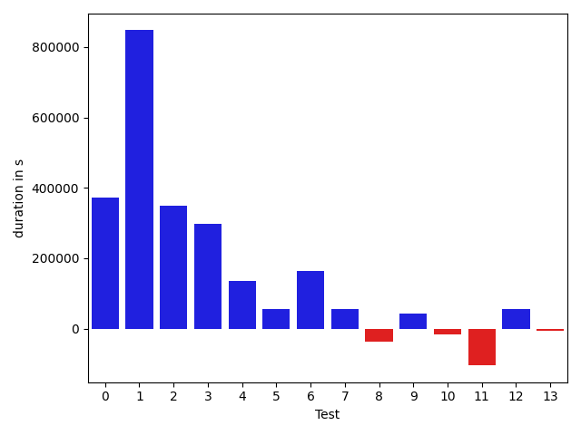

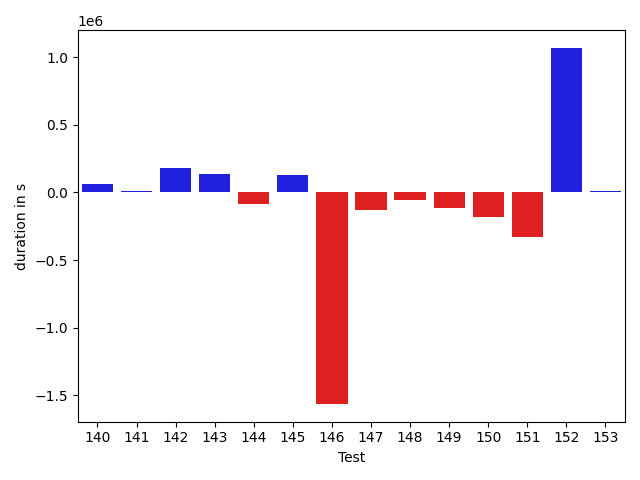

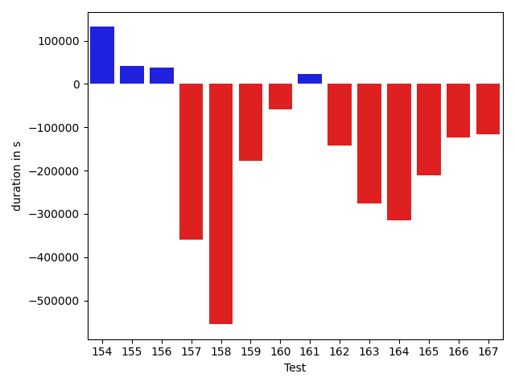

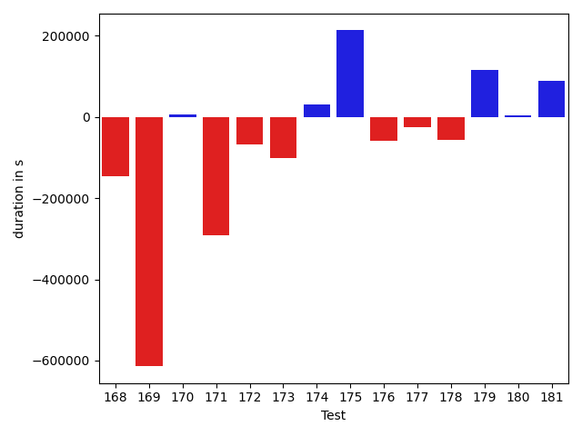

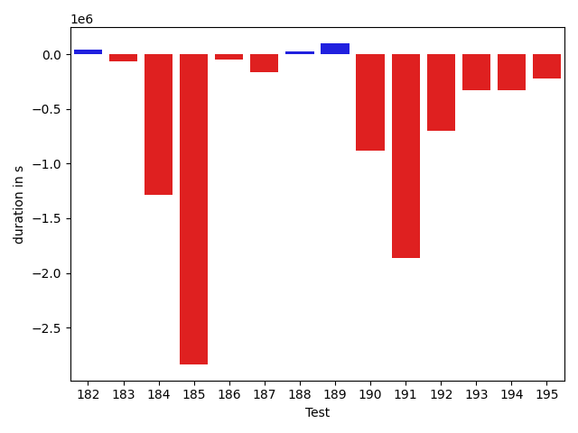

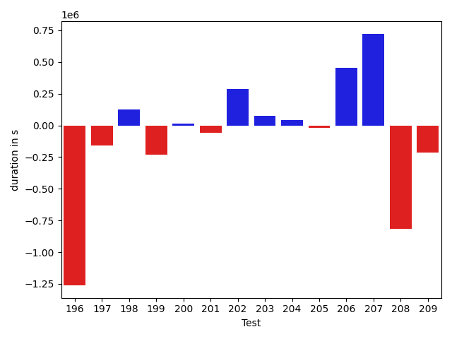

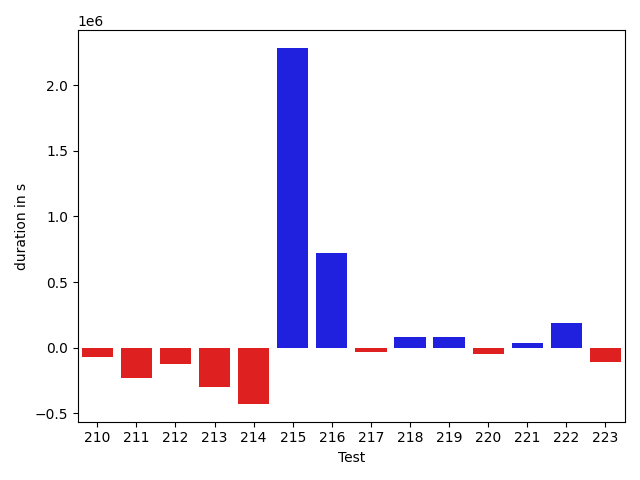

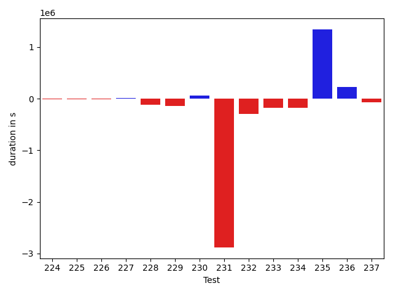

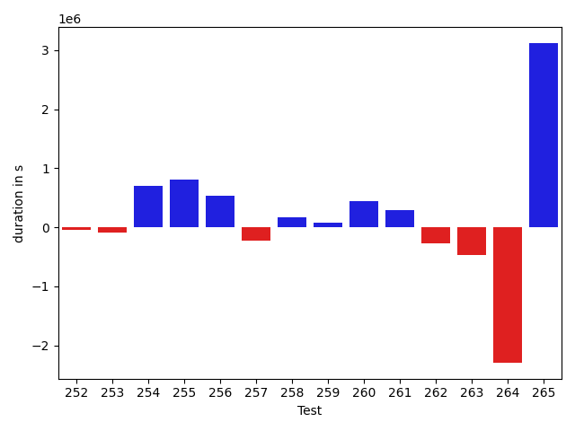

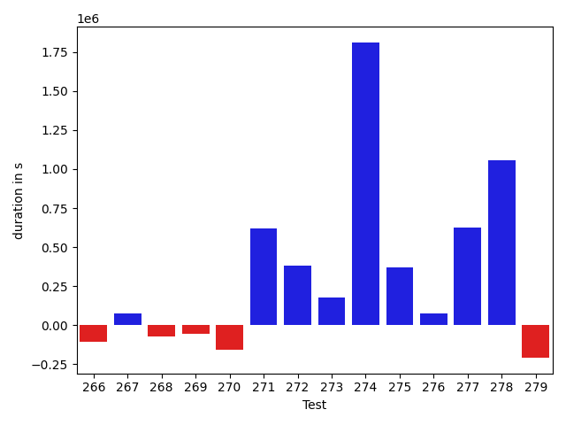

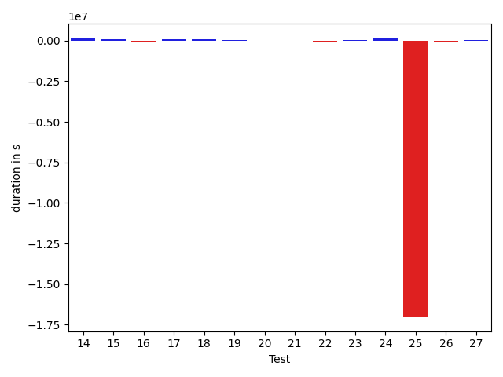

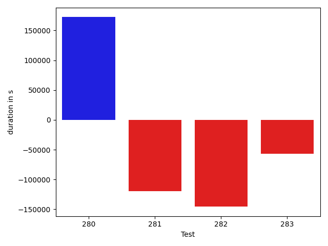

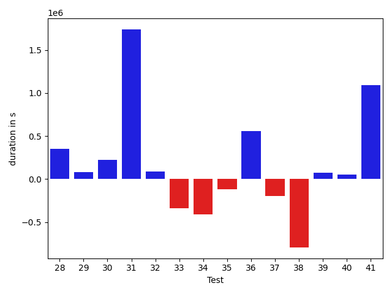

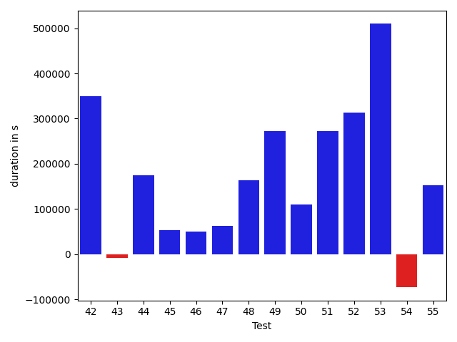

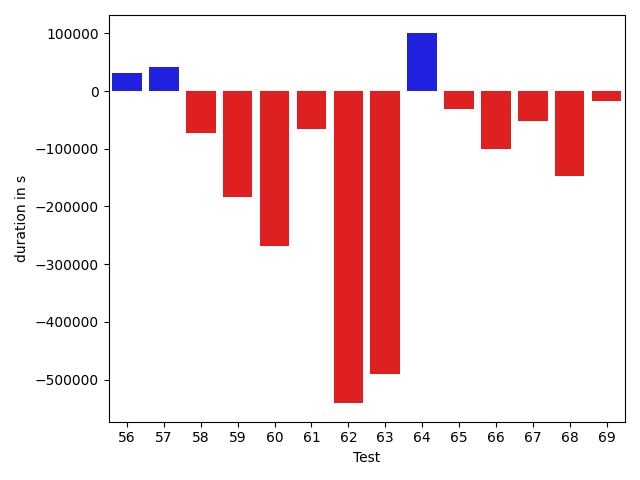

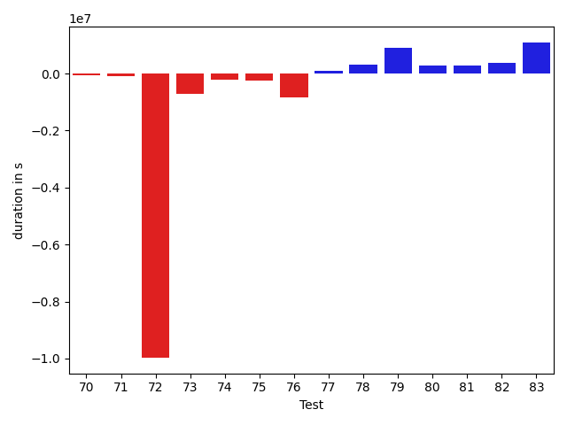

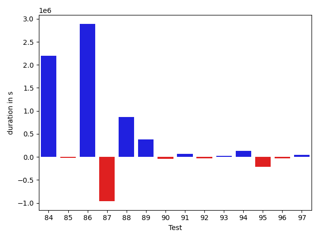

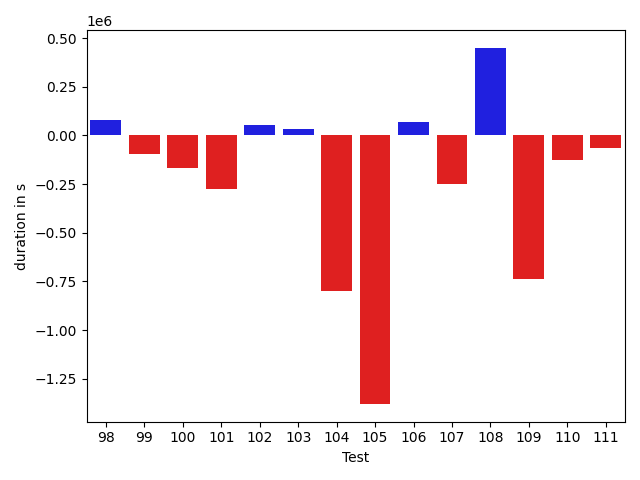

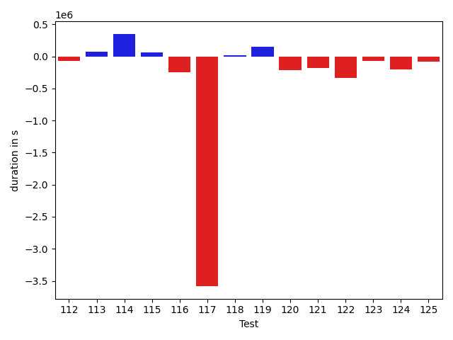

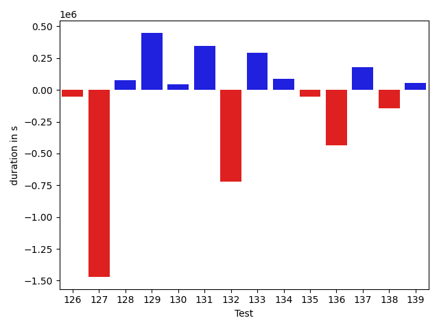

| ID | DurationV1 | DurationsV2 | DeltaDuration |
| --- | --- | --- | --- |
| 0 | 673362.7418087487 | 1046815.5436026133 | 373452.8017938646 |
| 1 | 597605.3317826048 | 1445201.7673917124 | 847596.4356091076 |
| 2 | 1138251.1750957163 | 1487532.0555521846 | 349280.8804564683 |
| 3 | 706855.4026935092 | 1004516.44855127 | 297661.0458577607 |
| 4 | 837553.2177121348 | 972254.1649968249 | 134700.9472846901 |
| 5 | 563598.1619207906 | 619741.1765696432 | 56143.01464885264 |
| 6 | 2204564.375503088 | 2368711.771330713 | 164147.39582762495 |
| 7 | 1012071.0667229885 | 1068436.0600882522 | 56364.99336526368 |
| 8 | 601742.2832224977 | 564982.7759996017 | -36759.507222895976 |
| 9 | 613726.0433126339 | 655150.6578731823 | 41424.61456054845 |
| 10 | 757389.9211941863 | 740520.8881376488 | -16869.033056537504 |
| 11 | 1030699.9522256205 | 925810.7830516861 | -104889.16917393438 |
| 12 | 641994.460351218 | 697102.6075936453 | 55108.14724242734 |
| 13 | 492870.6281835139 | 486386.06775211357 | -6484.560431400314 |
| 14 | 508182.33805936575 | 671588.6941580772 | 163406.3560987115 |
| 15 | 407070.98995015025 | 483872.051099509 | 76801.06114935875 |
| 16 | 611694.951256874 | 498851.8517769505 | -112843.09947992349 |
| 17 | 469267.11182737205 | 535044.1748917673 | 65777.06306439528 |
| 18 | 409754.8341693878 | 474821.89745640755 | 65067.06328701973 |
| 19 | 526619.3709030701 | 578717.0943420231 | 52097.72343895305 |
| 20 | 729357.0785343078 | 707988.007377178 | -21369.07115712983 |
| 21 | 814441.3872393204 | 804832.9675106907 | -9608.419728629757 |
| 22 | 560718.6905089989 | 431127.89007302746 | -129590.80043597147 |
| 23 | 596408.0558886019 | 639000.3245655261 | 42592.26867692417 |
| 24 | 685859.6605474118 | 867332.9581556974 | 181473.29760828568 |
| 25 | 22420265.19762862 | 5379317.022148082 | -17040948.175480537 |
| 26 | 864800.903767508 | 746284.2853341915 | -118516.61843331647 |
| 27 | 1131517.9809402504 | 1183358.5900455115 | 51840.60910526104 |
| 28 | 1529973.8002882346 | 1878634.3555031344 | 348660.5552148998 |
| 29 | 739475.9840438484 | 822513.1397447912 | 83037.15570094285 |
| 30 | 645789.912948485 | 872555.249585907 | 226765.33663742198 |
| 31 | 657965.3206524774 | 2397553.7452225094 | 1739588.424570032 |
| 32 | 366319.36572265625 | 454986.88494873047 | 88667.51922607422 |
| 33 | 2257431.5678041955 | 1919384.2237767475 | -338047.344027448 |
| 34 | 1669503.3449938237 | 1259790.2245782185 | -409713.12041560514 |
| 35 | 1124749.2926404313 | 1007162.2062386513 | -117587.08640178002 |
| 36 | 1868581.2537424224 | 2425409.2920625973 | 556828.0383201749 |
| 37 | 1359151.1166337566 | 1163964.4687067955 | -195186.64792696107 |
| 38 | 1656602.9023749013 | 862866.7584560075 | -793736.1439188939 |
| 39 | 1107466.6526639182 | 1178738.6703623817 | 71272.01769846352 |
| 40 | 981510.9447464731 | 1033674.997003572 | 52164.05225709884 |
| 41 | 611735.4937163459 | 1705266.5563505278 | 1093531.062634182 |
| 42 | 668214.3300376582 | 1017376.6738840262 | 349162.343846368 |
| 43 | 969948.3153266318 | 961915.0238664893 | -8033.291460142471 |
| 44 | 901301.9320369385 | 1076445.0660244382 | 175143.13398749975 |
| 45 | 609596.7029467467 | 663002.5334572345 | 53405.83051048778 |
| 46 | 1677451.571010027 | 1726758.1429563689 | 49306.57194634178 |
| 47 | 895991.3654001303 | 958661.9713825851 | 62670.60598245484 |
| 48 | 1583134.7928276886 | 1746561.608881062 | 163426.81605337327 |
| 49 | 923363.401299876 | 1196357.1246616738 | 272993.72336179775 |
| 50 | 911504.5006441193 | 1021170.9506884124 | 109666.45004429307 |
| 51 | 915797.3761745922 | 1188786.4527384038 | 272989.0765638116 |
| 52 | 715669.082911487 | 1029028.3431865324 | 313359.2602750454 |
| 53 | 1508532.32733233 | 2018187.3716713109 | 509655.0443389809 |
| 54 | 1022971.7364950769 | 949614.63384085 | -73357.10265422694 |
| 55 | 700799.6823682068 | 852928.5509818764 | 152128.86861366965 |
| 56 | 758857.3842135984 | 790329.7163917297 | 31472.33217813121 |
| 57 | 581836.9287563041 | 623302.947240755 | 41466.01848445088 |
| 58 | 641356.2308071469 | 568222.3328682334 | -73133.89793891343 |
| 59 | 716558.7256980891 | 532777.6532158988 | -183781.07248219033 |
| 60 | 743020.7880610377 | 474725.240262717 | -268295.54779832065 |
| 61 | 1027251.6155446232 | 960941.6215496147 | -66309.99399500852 |
| 62 | 1152206.1944385567 | 611201.3244801246 | -541004.869958432 |
| 63 | 1443891.6272098348 | 953774.1808522241 | -490117.44635761064 |
| 64 | 525918.5082649887 | 625757.6077198312 | 99839.09945484251 |
| 65 | 770626.9441233663 | 739742.4641241191 | -30884.479999247123 |
| 66 | 507347.7162695825 | 407685.35613153875 | -99662.36013804376 |
| 67 | 755655.9305506013 | 703003.2073473607 | -52652.72320324066 |
| 68 | 637848.1473121643 | 490841.88076782227 | -147006.26654434204 |
| 69 | 485167.3855240643 | 468527.79230132047 | -16639.59322274383 |
| 70 | 487956.57709594595 | 417630.5820903778 | -70325.99500556814 |
| 71 | 522122.153113842 | 441930.6021037884 | -80191.5510100536 |
| 72 | 15597610.358709624 | 5628377.3359198775 | -9969233.022789747 |
| 73 | 5014935.056907506 | 4313033.988974449 | -701901.0679330565 |
| 74 | 850909.4307061983 | 628903.6632201821 | -222005.76748601627 |
| 75 | 817415.4523896775 | 557101.6518321126 | -260313.80055756494 |
| 76 | 1347058.126900388 | 500582.65099382587 | -846475.4759065621 |
| 77 | 688562.1407593492 | 792659.8246879242 | 104097.68392857502 |
| 78 | 563429.9026964878 | 887128.7090208206 | 323698.8063243327 |
| 79 | 947377.6604799302 | 1837400.9555824166 | 890023.2951024864 |
| 80 | 603930.3624821362 | 887717.2661180589 | 283786.9036359227 |
| 81 | 428001.8053046388 | 695778.9585307539 | 267777.15322611504 |
| 82 | 508175.12088222615 | 890989.9185999632 | 382814.79771773703 |
| 83 | 1480576.0643746578 | 2570207.561455466 | 1089631.497080808 |
| 84 | 911035.5559579963 | 3112582.909976248 | 2201547.354018252 |
| 85 | 453309.8341140747 | 438405.77340259776 | -14904.060711476952 |
| 86 | 1506609.7385391511 | 4396581.316496406 | 2889971.577957255 |
| 87 | 6434643.740277017 | 5474180.876453269 | -960462.8638237473 |
| 88 | 923344.482063379 | 1790230.692842352 | 866886.210778973 |
| 89 | 945197.400788047 | 1327959.8252041393 | 382762.42441609234 |
| 90 | 2740549.2536582015 | 2700328.2272316385 | -40221.02642656304 |
| 91 | 637363.8399564609 | 706945.4240295347 | 69581.58407307381 |
| 92 | 570391.055214406 | 536946.376908422 | -33444.67830598401 |
| 93 | 449379.95885189064 | 472444.44355295785 | 23064.48470106721 |
| 94 | 627415.3645754134 | 760566.6650366551 | 133151.30046124174 |
| 95 | 743175.9047400936 | 533621.9967862715 | -209553.90795382217 |
| 96 | 847272.1655190379 | 814368.7242296035 | -32903.441289434326 |
| 97 | 368890.52924346924 | 416417.5434169769 | 47527.01417350769 |
| 98 | 700767.7162492187 | 780698.2267943323 | 79930.51054511359 |
| 99 | 783753.2998567392 | 687340.1578569876 | -96413.14199975168 |
| 100 | 920897.1752525477 | 753993.8474298312 | -166903.32782271656 |
| 101 | 1599726.7265886143 | 1326657.9078488264 | -273068.8187397879 |
| 102 | 1119858.054449915 | 1172086.6875184905 | 52228.633068575524 |
| 103 | 847540.1721419788 | 881689.4914410564 | 34149.319299077615 |
| 104 | 2389086.2759442246 | 1592138.6198684461 | -796947.6560757784 |
| 105 | 3625425.64175955 | 2246341.9143299963 | -1379083.7274295539 |
| 106 | 677354.8074740766 | 746172.7206380843 | 68817.91316400771 |
| 107 | 600826.444010675 | 350100.5001068115 | -250725.94390386343 |
| 108 | 778328.2428846195 | 1227983.2932816288 | 449655.05039700924 |
| 109 | 1560318.0815327985 | 825360.7788560039 | -734957.3026767946 |
| 110 | 805649.5917717735 | 681768.4534469538 | -123881.13832481974 |
| 111 | 584415.8013278246 | 520622.1459748745 | -63793.655352950096 |
| 112 | 704244.1209455347 | 631646.067357494 | -72598.05358804064 |
| 113 | 572600.3613784313 | 645388.32421875 | 72787.96284031868 |
| 114 | 920760.0470726558 | 1270153.9586052664 | 349393.91153261065 |
| 115 | 371667.469417572 | 430218.73657751083 | 58551.26715993881 |
| 116 | 597109.6200237274 | 349390.4112920761 | -247719.2087316513 |
| 117 | 4455093.779975761 | 873557.679403837 | -3581536.100571924 |
| 118 | 1006685.2949800186 | 1026158.6839180421 | 19473.388938023476 |
| 119 | 793559.7165802425 | 938796.445438832 | 145236.72885858954 |
| 120 | 1191314.5927087178 | 972943.1311096314 | -218371.4615990864 |
| 121 | 901205.4776154218 | 724002.9976277807 | -177202.4799876411 |
| 122 | 1083822.4906786587 | 753122.9869470882 | -330699.50373157056 |
| 123 | 859890.3835793268 | 792871.4469377801 | -67018.93664154666 |
| 124 | 1609266.5170471193 | 1410252.287553986 | -199014.22949313326 |
| 125 | 885464.24549478 | 808442.1369510505 | -77022.10854372953 |
| 126 | 787952.9435679372 | 733341.5023143291 | -54611.44125360809 |
| 127 | 2343805.942014023 | 873253.0644266929 | -1470552.8775873303 |
| 128 | 684786.1035177505 | 763362.0366439517 | 78575.93312620115 |
| 129 | 744280.6458200907 | 1193045.2263064524 | 448764.58048636175 |
| 130 | 2064070.6833086894 | 2105727.5188133195 | 41656.835504630115 |
| 131 | 633144.001518366 | 977405.7742298953 | 344261.7727115293 |
| 132 | 1187081.4738463685 | 467784.5942687988 | -719296.8795775697 |
| 133 | 666874.4080094944 | 958961.0967229801 | 292086.6887134857 |
| 134 | 517139.7590437457 | 603561.2875852585 | 86421.52854151279 |
| 135 | 858770.565634299 | 803748.7753198544 | -55021.79031444457 |
| 136 | 1259677.5824791712 | 821419.108880939 | -438258.47359823226 |
| 137 | 715207.8847954561 | 895410.438822173 | 180202.55402671697 |
| 138 | 1275532.2799613588 | 1133415.7053382774 | -142116.57462308137 |
| 139 | 498425.6967018964 | 555641.7375918925 | 57216.040889996104 |
| 140 | 393119.50238633156 | 457250.86682128906 | 64131.364434957504 |
| 141 | 626887.9788843651 | 640795.949004103 | 13907.970119737904 |
| 142 | 640030.722479226 | 822785.8175889326 | 182755.09510970663 |
| 143 | 421228.63099763356 | 557528.4070138931 | 136299.77601625957 |
| 144 | 933547.9444187022 | 850749.225486143 | -82798.71893255913 |
| 145 | 835377.1673698982 | 966115.7926974811 | 130738.62532758294 |
| 146 | 2173473.068618512 | 610439.9168563113 | -1563033.1517622005 |
| 147 | 568696.822581768 | 440828.0440348387 | -127868.77854692936 |
| 148 | 823176.3317973943 | 769997.285141178 | -53179.04665621626 |
| 149 | 583904.8243569657 | 470401.54140254855 | -113503.28295441717 |
| 150 | 632732.3366316083 | 449769.7278668983 | -182962.60876471002 |
| 151 | 893496.9124524646 | 567029.5372047047 | -326467.37524775986 |
| 152 | 666415.6649570465 | 1733784.224075061 | 1067368.5591180145 |
| 153 | 591405.6171298953 | 600036.1271836917 | 8630.51005379646 |
| 154 | 391268.2548921108 | 523028.33273139596 | 131760.07783928514 |
| 155 | 591090.9524118835 | 633529.3539500078 | 42438.40153812431 |
| 156 | 590347.1586096962 | 627462.3102790987 | 37115.15166940249 |
| 157 | 905091.4842165264 | 545419.4294566072 | -359672.0547599192 |
| 158 | 998218.1010398865 | 443356.20394030213 | -554861.8970995843 |
| 159 | 799465.329960013 | 622098.255053512 | -177367.074906501 |
| 160 | 836415.1587135253 | 777527.0172540711 | -58888.1414594542 |
| 161 | 566608.8461111297 | 590567.8436056012 | 23958.997494471492 |
| 162 | 709992.2570089572 | 568740.3042892959 | -141251.9527196613 |
| 163 | 704275.1459960938 | 428669.1578642428 | -275605.98813185096 |
| 164 | 793240.3098144531 | 478469.9553833008 | -314770.35443115234 |
| 165 | 922594.4167104386 | 711376.570914319 | -211217.84579611954 |
| 166 | 512409.3569123745 | 388369.043194294 | -124040.31371808052 |
| 167 | 502498.8419075012 | 386630.8168942407 | -115868.02501326054 |
| 168 | 762244.3041634997 | 615624.583298349 | -146619.72086515068 |
| 169 | 1036896.6231169701 | 422934.8480039239 | -613961.7751130462 |
| 170 | 476770.1980857849 | 483100.8136691004 | 6330.615583315492 |
| 171 | 789711.3157641292 | 497812.87840153277 | -291898.4373625964 |
| 172 | 478499.0994567871 | 410627.8796596527 | -67871.2197971344 |
| 173 | 536335.7347221375 | 435705.30908203125 | -100630.4256401062 |
| 174 | 1086168.0914108376 | 1116571.6881297457 | 30403.596718908055 |
| 175 | 1309992.4175837305 | 1522416.92929325 | 212424.51170951943 |
| 176 | 833012.8071843387 | 772933.7841507733 | -60079.023033565376 |
| 177 | 1577858.6521136502 | 1553333.6282278926 | -24525.023885757662 |
| 178 | 1220155.7009177427 | 1163367.2595333813 | -56788.44138436136 |
| 179 | 694160.0073418126 | 809785.9933593278 | 115625.98601751518 |
| 180 | 851059.4106706152 | 855392.357635433 | 4332.94696481782 |
| 181 | 1049459.3977159695 | 1138535.2878914317 | 89075.89017546223 |
| 182 | 875011.5414396243 | 919825.2447995152 | 44813.70335989096 |
| 183 | 560166.829626292 | 491947.75283408165 | -68219.07679221034 |
| 184 | 3488269.748122967 | 2203751.2731219972 | -1284518.4750009696 |
| 185 | 3592345.287899609 | 756717.8697183368 | -2835627.418181272 |
| 186 | 575339.4617543817 | 530755.9696724797 | -44583.49208190199 |
| 187 | 1195458.8426538953 | 1032154.5503091953 | -163304.29234469996 |
| 188 | 860592.0555769174 | 884908.8628480374 | 24316.807271120022 |
| 189 | 1318535.7090278333 | 1418880.1252304984 | 100344.41620266507 |
| 190 | 2064515.7975268168 | 1179903.7146604755 | -884612.0828663413 |
| 191 | 2867958.1284464616 | 1004747.8350085844 | -1863210.2934378772 |
| 192 | 3878802.8068482364 | 3177022.84017685 | -701779.9666713863 |
| 193 | 926899.340179588 | 599445.45446462 | -327453.88571496797 |
| 194 | 1131945.1835679538 | 804528.7198379617 | -327416.46372999204 |
| 195 | 1020638.3720593019 | 802238.5528711099 | -218399.81918819202 |
| 196 | 1889018.7478787573 | 628033.5738915205 | -1260985.1739872368 |
| 197 | 576459.1671957768 | 417085.4159324169 | -159373.7512633599 |
| 198 | 662154.4569446512 | 787622.9362707105 | 125468.47932605934 |
| 199 | 710781.5140472949 | 481887.2526963502 | -228894.26135094464 |
| 200 | 3573485.8773848284 | 3587187.351090926 | 13701.473706097808 |
| 201 | 670210.9380858886 | 610249.512747555 | -59961.42533833359 |
| 202 | 1396307.656847788 | 1686294.7213406367 | 289987.0644928487 |
| 203 | 635737.775913663 | 711101.7485318835 | 75363.97261822049 |
| 204 | 905719.9073297728 | 947025.102833089 | 41305.19550331612 |
| 205 | 734294.0669641495 | 712708.3654204248 | -21585.70154372463 |
| 206 | 669452.602220208 | 1124305.5030181203 | 454852.90079791227 |
| 207 | 591755.0314354482 | 1314014.6362464726 | 722259.6048110244 |
| 208 | 2313119.5207654214 | 1497675.7266707132 | -815443.7940947083 |
| 209 | 754063.8613867615 | 541366.9772599638 | -212696.88412679778 |
| 210 | 723692.5723730809 | 648521.9506292165 | -75170.62174386438 |
| 211 | 740232.956648096 | 506745.52841452643 | -233487.42823356955 |
| 212 | 654139.9525078799 | 526545.5941034087 | -127594.35840447119 |
| 213 | 1490088.5563494265 | 1188561.496001327 | -301527.06034809956 |
| 214 | 1454466.3665856868 | 1025367.3902602913 | -429098.9763253955 |
| 215 | 1536773.0422280687 | 3820919.768973465 | 2284146.7267453964 |
| 216 | 2471618.6069420446 | 3193510.6409806274 | 721892.0340385828 |
| 217 | 667542.602917431 | 631503.8622401352 | -36038.740677295835 |
| 218 | 520405.0239729675 | 604544.6263116174 | 84139.60233864991 |
| 219 | 604880.3133332685 | 688522.2153117578 | 83641.90197848924 |
| 220 | 881198.5082658594 | 834736.7251982957 | -46461.78306756378 |
| 221 | 742933.7207068912 | 779739.1652150601 | 36805.44450816896 |
| 222 | 367821.7803992629 | 551891.7434844971 | 184069.96308523417 |
| 223 | 531053.2280342579 | 425263.9194023013 | -105789.30863195658 |
| 224 | 568021.057138342 | 557638.1654065339 | -10382.891731808078 |
| 225 | 548067.2699514441 | 539614.7235744818 | -8452.546376962331 |
| 226 | 687636.5753757814 | 678078.1114361342 | -9558.46393964719 |
| 227 | 700462.2107202637 | 718212.6363294605 | 17750.425609196885 |
| 228 | 1729924.3175980742 | 1607971.1808472457 | -121953.13675082847 |
| 229 | 1056933.3334944716 | 916568.9980163926 | -140364.33547807904 |
| 230 | 740976.0471449718 | 801445.6159541088 | 60469.56880913698 |
| 231 | 3407037.717192098 | 525986.2901242599 | -2881051.427067838 |
| 232 | 661903.3115084171 | 364084.48132109456 | -297818.8301873226 |
| 233 | 570397.728717316 | 398767.4899304807 | -171630.23878683522 |
| 234 | 577690.0751409829 | 405654.6168766022 | -172035.4582643807 |
| 235 | 7947984.889922675 | 9290848.190527793 | 1342863.3006051183 |
| 236 | 11521980.09752613 | 11746027.429361017 | 224047.3318348881 |
| 237 | 983295.1697269003 | 913303.995007637 | -69991.17471926333 |
| 238 | 858168.769573891 | 693594.4819828536 | -164574.28759103734 |
| 239 | 534105.7488699927 | 602980.7443137169 | 68874.99544372421 |
| 240 | 1272940.454548317 | 1001373.0715291917 | -271567.3830191253 |
| 241 | 14943094.214590084 | 3051605.792258999 | -11891488.422331085 |
| 242 | 1004930.8966003428 | 1171189.2427317286 | 166258.34613138577 |
| 243 | 501244.33160087466 | 570055.6493079476 | 68811.31770707294 |
| 244 | 767272.2035046518 | 822673.909964628 | 55401.70645997627 |
| 245 | 1152933.056837642 | 1159745.9790453126 | 6812.922207670519 |
| 246 | 3245277.5918151005 | 2938528.787262168 | -306748.80455293274 |
| 247 | 651696.3186184372 | 759525.5683669497 | 107829.24974851252 |
| 248 | 473506.8257537894 | 447049.478478536 | -26457.347275253385 |
| 249 | 1111240.3768984126 | 948170.9415181505 | -163069.4353802621 |
| 250 | 773633.1129780213 | 614952.1890255067 | -158680.92395251454 |
| 251 | 540708.0193702258 | 575744.2265882939 | 35036.20721806807 |
| 252 | 422625.1046024794 | 377252.0751411915 | -45373.02946128789 |
| 253 | 777578.7283593714 | 691883.7537745684 | -85694.97458480299 |
| 254 | 2470595.6109759277 | 3178856.397839113 | 708260.7868631855 |
| 255 | 1341032.53936068 | 2155973.4010854294 | 814940.8617247494 |
| 256 | 1008721.1596833968 | 1541123.9037161702 | 532402.7440327734 |
| 257 | 552011.978128612 | 333253.98333323 | -218757.99479538202 |
| 258 | 377295.91485595703 | 554059.9850692749 | 176764.07021331787 |
| 259 | 388859.8583022356 | 462935.68673706055 | 74075.82843482494 |
| 260 | 1007476.5075178054 | 1449655.1980215632 | 442178.6905037578 |
| 261 | 2290160.067913278 | 2581332.5994581184 | 291172.5315448404 |
| 262 | 1584970.1081397329 | 1307638.5920366808 | -277331.51610305207 |
| 263 | 895236.4981884956 | 431863.66344977915 | -463372.8347387165 |
| 264 | 3273827.592373434 | 982186.1712673946 | -2291641.4211060395 |
| 265 | 576800.3028449259 | 3694965.679963623 | 3118165.3771186974 |
| 266 | 933120.9152644959 | 829277.1467941198 | -103843.76847037603 |
| 267 | 426047.39789295197 | 499069.50321163423 | 73022.10531868227 |
| 268 | 928515.3396517216 | 858376.9904622387 | -70138.34918948298 |
| 269 | 698242.5813227561 | 643255.8407011316 | -54986.740621624514 |
| 270 | 740732.8277350874 | 585948.7637453506 | -154784.06398973672 |
| 271 | 940356.4890222244 | 1559109.8795443587 | 618753.3905221343 |
| 272 | 717150.5481158013 | 1097239.3266066601 | 380088.77849085885 |
| 273 | 640556.7506146503 | 816877.0468047732 | 176320.29619012284 |
| 274 | 627219.3831405723 | 2437815.559506783 | 1810596.1763662104 |
| 275 | 1071019.4561424074 | 1438977.560711917 | 367958.1045695096 |
| 276 | 548256.7170900702 | 622575.0312943906 | 74318.31420432031 |
| 277 | 759497.9002092723 | 1384737.4580695305 | 625239.5578602583 |
| 278 | 692386.6522421762 | 1748681.4530440494 | 1056294.8008018732 |
| 279 | 1263456.6337411364 | 1056005.582544827 | -207451.0511963095 |
| 280 | 786215.1491198896 | 958518.2126598307 | 172303.0635399411 |
| 281 | 1074112.791267504 | 954754.4189421537 | -119358.3723253503 |
| 282 | 724173.7084613668 | 578588.0346831831 | -145585.67377818376 |
| 283 | 640757.0798051693 | 584318.6116602869 | -56438.468144882354 |

## Misc.

| ID | Test Class | Test Method |
| --- | --- | --- |
| 0 | com.google.gson.functional.PrimitiveTest | testDeserializePrimitiveWrapperAsObjectField |
| 1 | com.google.gson.functional.PrimitiveTest | testMoreSpecificSerialization |
| 2 | com.google.gson.functional.StreamingTypeAdaptersTest | testNullSafe |
| 3 | com.google.gson.functional.StreamingTypeAdaptersTest | testSerializeRecursive |
| 4 | com.google.gson.functional.StreamingTypeAdaptersTest | testSerializeWithCustomTypeAdapter |
| 5 | com.google.gson.functional.StreamingTypeAdaptersTest | testDeserializeWithCustomTypeAdapter |
| 6 | com.google.gson.functional.JsonAdapterAnnotationOnClassesTest | testJsonAdapterInvoked |
| 7 | com.google.gson.functional.JsonAdapterAnnotationOnClassesTest | testJsonAdapterFactoryInvoked |
| 8 | com.google.gson.functional.JsonAdapterAnnotationOnClassesTest | testRegisteredDeserializerOverridesJsonAdapter |
| 9 | com.google.gson.functional.JsonAdapterAnnotationOnClassesTest | testRegisteredSerializerOverridesJsonAdapter |
| 10 | com.google.gson.functional.JsonAdapterAnnotationOnClassesTest | testSuperclassTypeAdapterNotInvoked |
| 11 | com.google.gson.functional.JsonAdapterAnnotationOnClassesTest | testNullSafeObjectFromJson |
| 12 | com.google.gson.functional.JsonAdapterAnnotationOnClassesTest | testIncorrectTypeAdapterFails |
| 13 | com.google.gson.MixedStreamTest | testReaderDoesNotMutateState |
| 14 | com.google.gson.MixedStreamTest | testWriteInvalidState |
| 15 | com.google.gson.MixedStreamTest | testWriteClosed |
| 16 | com.google.gson.MixedStreamTest | testWriteMixedStreamed |
| 17 | com.google.gson.MixedStreamTest | testReadMixedStreamed |
| 18 | com.google.gson.MixedStreamTest | testWriteDoesNotMutateState |
| 19 | com.google.gson.functional.JsonParserTest | testBadTypeForDeserializingCustomTree |
| 20 | com.google.gson.functional.JsonParserTest | testDeserializingCustomTree |
| 21 | com.google.gson.functional.JsonParserTest | testChangingCustomTreeAndDeserializing |
| 22 | com.google.gson.functional.JsonParserTest | testBadFieldTypeForCustomDeserializerCustomTree |
| 23 | com.google.gson.functional.JsonParserTest | testBadFieldTypeForDeserializingCustomTree |
| 24 | com.google.gson.functional.DefaultTypeAdaptersTest | testDateSerializationWithPatternNotOverridenByTypeAdapter |
| 25 | com.google.gson.functional.DefaultTypeAdaptersTest | testNullSerialization |
| 26 | com.google.gson.functional.DefaultTypeAdaptersTest | testUrlNullSerialization |
| 27 | com.google.gson.functional.DefaultTypeAdaptersTest | testBigIntegerFieldSerialization |
| 28 | com.google.gson.functional.DefaultTypeAdaptersTest | testBigDecimalFieldSerialization |
| 29 | com.google.gson.functional.DefaultTypeAdaptersTest | testBadValueForBigDecimalDeserialization |
| 30 | com.google.gson.functional.DefaultTypeAdaptersTest | testBigIntegerFieldDeserialization |
| 31 | com.google.gson.functional.DefaultTypeAdaptersTest | testBigDecimalFieldDeserialization |
| 32 | com.google.gson.functional.DefaultTypeAdaptersTest | testUrlNullDeserialization |
| 33 | com.google.gson.functional.JsonAdapterSerializerDeserializerTest | testJsonSerializerDeserializerBasedJsonAdapterOnFields |
| 34 | com.google.gson.functional.JsonAdapterSerializerDeserializerTest | testDifferentJsonAdaptersForGenericFieldsOfSameRawType |
| 35 | com.google.gson.functional.JsonAdapterSerializerDeserializerTest | testJsonSerializerDeserializerBasedJsonAdapterOnClass |
| 36 | com.google.gson.functional.ThrowableFunctionalTest | testExceptionWithoutCause |
| 37 | com.google.gson.functional.ThrowableFunctionalTest | testSerializedNameOnExceptionFields |
| 38 | com.google.gson.functional.ThrowableFunctionalTest | testErrorWithoutCause |
| 39 | com.google.gson.functional.ThrowableFunctionalTest | testErrornWithCause |
| 40 | com.google.gson.functional.ThrowableFunctionalTest | testExceptionWithCause |
| 41 | com.google.gson.functional.InterfaceTest | testSerializingObjectImplementingInterface |
| 42 | com.google.gson.functional.InterfaceTest | testSerializingInterfaceObjectField |
| 43 | com.google.gson.functional.ParameterizedTypesTest | testParameterizedTypeGenericArraysSerialization |
| 44 | com.google.gson.functional.ParameterizedTypesTest | testVariableTypeArrayDeserialization |
| 45 | com.google.gson.functional.ParameterizedTypesTest | testDeepParameterizedTypeDeserialization |
| 46 | com.google.gson.functional.ParameterizedTypesTest | testParameterizedTypesSerialization |
| 47 | com.google.gson.functional.ParameterizedTypesTest | testVariableTypeDeserialization |
| 48 | com.google.gson.functional.ParameterizedTypesTest | testVariableTypeFieldsAndGenericArraysSerialization |
| 49 | com.google.gson.functional.ParameterizedTypesTest | testParameterizedTypeGenericArraysDeserialization |
| 50 | com.google.gson.functional.ParameterizedTypesTest | testParameterizedTypeDeserialization |
| 51 | com.google.gson.functional.ParameterizedTypesTest | testVariableTypeFieldsAndGenericArraysDeserialization |
| 52 | com.google.gson.functional.ParameterizedTypesTest | testTypesWithMultipleParametersDeserialization |
| 53 | com.google.gson.functional.ParameterizedTypesTest | testTypesWithMultipleParametersSerialization |
| 54 | com.google.gson.functional.ParameterizedTypesTest | testParameterizedTypeWithVariableTypeDeserialization |
| 55 | com.google.gson.functional.ParameterizedTypesTest | testParameterizedTypesWithWriterSerialization |
| 56 | com.google.gson.functional.ParameterizedTypesTest | testParameterizedTypeWithReaderDeserialization |
| 57 | com.google.gson.functional.ParameterizedTypesTest | testDeepParameterizedTypeSerialization |
| 58 | com.google.gson.functional.NamingPolicyTest | testAtSignInSerializedName |
| 59 | com.google.gson.functional.NamingPolicyTest | testGsonWithNonDefaultFieldNamingPolicySerialization |
| 60 | com.google.gson.functional.NamingPolicyTest | testGsonWithLowerCaseDashPolicyDeserialiation |
| 61 | com.google.gson.functional.NamingPolicyTest | testGsonDuplicateNameUsingSerializedNameFieldNamingPolicySerialization |
| 62 | com.google.gson.functional.NamingPolicyTest | testGsonWithSerializedNameFieldNamingPolicySerialization |
| 63 | com.google.gson.functional.NamingPolicyTest | testGsonWithNonDefaultFieldNamingPolicyDeserialiation |
| 64 | com.google.gson.functional.NamingPolicyTest | testGsonWithLowerCaseUnderscorePolicySerialization |
| 65 | com.google.gson.functional.NamingPolicyTest | testComplexFieldNameStrategy |
| 66 | com.google.gson.functional.NamingPolicyTest | testGsonWithLowerCaseUnderscorePolicyDeserialiation |
| 67 | com.google.gson.functional.NamingPolicyTest | testDeprecatedNamingStrategy |
| 68 | com.google.gson.functional.NamingPolicyTest | testGsonWithSerializedNameFieldNamingPolicyDeserialization |
| 69 | com.google.gson.functional.NamingPolicyTest | testGsonWithUpperCamelCaseSpacesPolicySerialiation |
| 70 | com.google.gson.functional.NamingPolicyTest | testGsonWithLowerCaseDashPolicySerialization |
| 71 | com.google.gson.functional.NamingPolicyTest | testGsonWithUpperCamelCaseSpacesPolicyDeserialiation |
| 72 | com.google.gson.functional.CircularReferenceTest | testCircularSerialization |
| 73 | com.google.gson.functional.CircularReferenceTest | testSelfReferenceArrayFieldSerialization |
| 74 | com.google.gson.functional.CircularReferenceTest | testSelfReferenceIgnoredInSerialization |
| 75 | com.google.gson.functional.CircularReferenceTest | testDirectedAcyclicGraphSerialization |
| 76 | com.google.gson.functional.CircularReferenceTest | testDirectedAcyclicGraphDeserialization |
| 77 | com.google.gson.functional.PrettyPrintingTest | testEmptyMapField |
| 78 | com.google.gson.functional.PrettyPrintingTest | testPrettyPrintArrayOfObjects |
| 79 | com.google.gson.functional.PrettyPrintingTest | testPrettyPrintList |
| 80 | com.google.gson.functional.ReadersWritersTest | testReadWriteTwoObjects |
| 81 | com.google.gson.functional.ReadersWritersTest | testReaderForDeserialization |
| 82 | com.google.gson.functional.ReadersWritersTest | testWriterForSerialization |
| 83 | com.google.gson.functional.MapTest | testInterfaceTypeMapWithSerializer |
| 84 | com.google.gson.functional.MapTest | testComplexKeysSerialization |
| 85 | com.google.gson.functional.MapTest | testMapSerializationWithNullValuesSerialized |
| 86 | com.google.gson.functional.MapTest | testInterfaceTypeMap |
| 87 | com.google.gson.functional.MapTest | testComplexKeysDeserialization |
| 88 | com.google.gson.functional.MapTest | testMapSerializationWithNullValues |
| 89 | com.google.gson.functional.MapTest | testGeneralMapField |
| 90 | com.google.gson.functional.ExposeFieldsTest | testNullExposeFieldSerialization |
| 91 | com.google.gson.functional.ExposeFieldsTest | testNoExposedFieldSerialization |
| 92 | com.google.gson.functional.ExposeFieldsTest | testExposeAnnotationSerialization |
| 93 | com.google.gson.functional.ExposeFieldsTest | testExposedInterfaceFieldDeserialization |
| 94 | com.google.gson.functional.ExposeFieldsTest | testArrayWithOneNullExposeFieldObjectSerialization |
| 95 | com.google.gson.functional.ExposeFieldsTest | testExposeAnnotationDeserialization |
| 96 | com.google.gson.functional.ExposeFieldsTest | testExposedInterfaceFieldSerialization |
| 97 | com.google.gson.functional.ExposeFieldsTest | testNoExposedFieldDeserialization |
| 98 | com.google.gson.functional.CollectionTest | testRawCollectionSerialization |
| 99 | com.google.gson.functional.CollectionTest | testFieldIsArrayList |
| 100 | com.google.gson.functional.CollectionTest | testSetDeserialization |
| 101 | com.google.gson.functional.CollectionTest | testWildcardCollectionField |
| 102 | com.google.gson.functional.CollectionTest | testSetSerialization |
| 103 | com.google.gson.functional.CollectionTest | testCollectionOfBagOfPrimitivesSerialization |
| 104 | com.google.gson.functional.InheritanceTest | testSubInterfacesOfCollectionSerialization |
| 105 | com.google.gson.functional.InheritanceTest | testBaseSerializedAsBaseWhenSpecifiedWithExplicitTypeForToJsonMethod |
| 106 | com.google.gson.functional.InheritanceTest | testClassWithBaseArrayFieldSerialization |
| 107 | com.google.gson.functional.InheritanceTest | testBaseSerializedAsSub |
| 108 | com.google.gson.functional.InheritanceTest | testSubClassDeserialization |
| 109 | com.google.gson.functional.InheritanceTest | testSubInterfacesOfCollectionDeserialization |
| 110 | com.google.gson.functional.InheritanceTest | testClassWithBaseCollectionFieldSerialization |
| 111 | com.google.gson.functional.InheritanceTest | testBaseSerializedAsSubWhenSpecifiedWithExplicitType |
| 112 | com.google.gson.functional.InheritanceTest | testClassWithBaseFieldSerialization |
| 113 | com.google.gson.functional.InheritanceTest | testBaseSerializedAsSubWhenSpecifiedWithExplicitTypeForToJsonMethod |
| 114 | com.google.gson.functional.InheritanceTest | testSubClassSerialization |
| 115 | com.google.gson.functional.InheritanceTest | testBaseSerializedAsBaseWhenSpecifiedWithExplicitType |
| 116 | com.google.gson.functional.InheritanceTest | testBaseSerializedAsSubForToJsonMethod |
| 117 | com.google.gson.functional.MoreSpecificTypeSerializationTest | testSubclassFields |
| 118 | com.google.gson.functional.MoreSpecificTypeSerializationTest | testParameterizedSubclassFields |
| 119 | com.google.gson.functional.MoreSpecificTypeSerializationTest | testListOfParameterizedSubclassFields |
| 120 | com.google.gson.functional.MoreSpecificTypeSerializationTest | testListOfSubclassFields |
| 121 | com.google.gson.functional.MoreSpecificTypeSerializationTest | testMapOfParameterizedSubclassFields |
| 122 | com.google.gson.functional.MoreSpecificTypeSerializationTest | testMapOfSubclassFields |
| 123 | com.google.gson.functional.CustomDeserializerTest | testCustomDeserializerReturnsNullForArrayElementsForArrayField |
| 124 | com.google.gson.functional.CustomDeserializerTest | testJsonTypeFieldBasedDeserialization |
| 125 | com.google.gson.functional.CustomDeserializerTest | testCustomDeserializerReturnsNull |
| 126 | com.google.gson.functional.CustomDeserializerTest | testDefaultConstructorNotCalledOnField |
| 127 | com.google.gson.functional.CustomDeserializerTest | testDefaultConstructorNotCalledOnObject |
| 128 | com.google.gson.functional.EnumTest | testEnumSubclassAsParameterizedType |
| 129 | com.google.gson.functional.EnumTest | testEnumCaseMapping |
| 130 | com.google.gson.functional.EnumTest | testEnumSubclass |
| 131 | com.google.gson.functional.EnumTest | testClassWithEnumFieldSerialization |
| 132 | com.google.gson.functional.EnumTest | testTopLevelEnumDeserialization |
| 133 | com.google.gson.functional.EnumTest | testCollectionOfEnumsDeserialization |
| 134 | com.google.gson.functional.EnumTest | testClassWithEnumFieldDeserialization |
| 135 | com.google.gson.functional.EnumTest | testEnumSet |
| 136 | com.google.gson.functional.EnumTest | testTopLevelEnumSerialization |
| 137 | com.google.gson.functional.EnumTest | testCollectionOfEnumsSerialization |
| 138 | com.google.gson.functional.ObjectTest | testSingletonLists |
| 139 | com.google.gson.functional.ObjectTest | testNullFieldsSerialization |
| 140 | com.google.gson.functional.ObjectTest | testClassWithNoFieldsDeserialization |
| 141 | com.google.gson.functional.ObjectTest | testPrivateNoArgConstructorDeserialization |
| 142 | com.google.gson.functional.ObjectTest | testArrayOfObjectsAsFields |
| 143 | com.google.gson.functional.ObjectTest | testClassWithNoFieldsSerialization |
| 144 | com.google.gson.functional.ObjectTest | testBagOfPrimitiveWrappersSerialization |
| 145 | com.google.gson.functional.ObjectTest | testArrayOfArraysSerialization |
| 146 | com.google.gson.functional.ObjectTest | testBagOfPrimitiveWrappersDeserialization |
| 147 | com.google.gson.functional.ObjectTest | testBagOfPrimitivesDeserialization |
| 148 | com.google.gson.functional.ObjectTest | testArrayOfArraysDeserialization |
| 149 | com.google.gson.functional.ObjectTest | testStringFieldWithNumberValueDeserialization |
| 150 | com.google.gson.functional.ObjectTest | testPrimitiveArrayInAnObjectDeserialization |
| 151 | com.google.gson.functional.ObjectTest | testStringFieldWithEmptyValueSerialization |
| 152 | com.google.gson.functional.ObjectTest | testEmptyCollectionInAnObjectSerialization |
| 153 | com.google.gson.functional.ObjectTest | testClassWithObjectFieldSerialization |
| 154 | com.google.gson.functional.ObjectTest | testObjectFieldNamesWithoutQuotesDeserialization |
| 155 | com.google.gson.functional.ObjectTest | testArrayOfObjectsDeserialization |
| 156 | com.google.gson.functional.ObjectTest | testNestedDeserialization |
| 157 | com.google.gson.functional.ObjectTest | testClassWithTransientFieldsSerialization |
| 158 | com.google.gson.functional.ObjectTest | testNullPrimitiveFieldsDeserialization |
| 159 | com.google.gson.functional.ObjectTest | testInnerClassDeserialization |
| 160 | com.google.gson.functional.ObjectTest | testEmptyCollectionInAnObjectDeserialization |
| 161 | com.google.gson.functional.ObjectTest | testArrayOfObjectsSerialization |
| 162 | com.google.gson.functional.ObjectTest | testNestedSerialization |
| 163 | com.google.gson.functional.ObjectTest | testPrimitiveArrayFieldSerialization |
| 164 | com.google.gson.functional.ObjectTest | testNullArraysDeserialization |
| 165 | com.google.gson.functional.ObjectTest | testInnerClassSerialization |
| 166 | com.google.gson.functional.ObjectTest | testStringFieldWithEmptyValueDeserialization |
| 167 | com.google.gson.functional.ObjectTest | testClassWithTransientFieldsDeserializationTransientFieldsPassedInJsonAreIgnored |
| 168 | com.google.gson.functional.ObjectTest | testJsonInSingleQuotesDeserialization |
| 169 | com.google.gson.functional.ObjectTest | testBagOfPrimitivesSerialization |
| 170 | com.google.gson.functional.ObjectTest | testJsonInMixedQuotesDeserialization |
| 171 | com.google.gson.functional.ObjectTest | testNullFieldsDeserialization |
| 172 | com.google.gson.functional.ObjectTest | testNullObjectFieldsDeserialization |
| 173 | com.google.gson.functional.ObjectTest | testClassWithTransientFieldsDeserialization |
| 174 | com.google.gson.functional.JsonAdapterAnnotationOnFieldsTest | testPrimitiveFieldAnnotationTakesPrecedenceOverDefault |
| 175 | com.google.gson.functional.JsonAdapterAnnotationOnFieldsTest | testClassAnnotationAdapterFactoryTakesPrecedenceOverDefault |
| 176 | com.google.gson.functional.JsonAdapterAnnotationOnFieldsTest | testJsonAdapterWrappedInNullSafeAsRequested |
| 177 | com.google.gson.functional.JsonAdapterAnnotationOnFieldsTest | testClassAnnotationAdapterTakesPrecedenceOverDefault |
| 178 | com.google.gson.functional.JsonAdapterAnnotationOnFieldsTest | testFieldAnnotationWorksForParameterizedType |
| 179 | com.google.gson.functional.JsonAdapterAnnotationOnFieldsTest | testRegisteredTypeAdapterTakesPrecedenceOverClassAnnotationAdapter |
| 180 | com.google.gson.functional.JsonAdapterAnnotationOnFieldsTest | testJsonAdapterInvokedOnlyForAnnotatedFields |
| 181 | com.google.gson.functional.JsonAdapterAnnotationOnFieldsTest | testFieldAnnotationTakesPrecedenceOverRegisteredTypeAdapter |
| 182 | com.google.gson.functional.JsonAdapterAnnotationOnFieldsTest | testFieldAnnotationTakesPrecedenceOverClassAnnotation |
| 183 | com.google.gson.functional.JsonAdapterAnnotationOnFieldsTest | testNonPrimitiveFieldAnnotationTakesPrecedenceOverDefault |
| 184 | com.google.gson.functional.SerializedNameTest | testFirstNameIsChosenForSerialization |
| 185 | com.google.gson.functional.SerializedNameTest | testMultipleNamesDeserializedCorrectly |
| 186 | com.google.gson.functional.SerializedNameTest | testMultipleNamesInTheSameString |
| 187 | com.google.gson.functional.CustomTypeAdaptersTest | testCustomNestedSerializers |
| 188 | com.google.gson.functional.CustomTypeAdaptersTest | testCustomNestedDeserializers |
| 189 | com.google.gson.functional.CustomTypeAdaptersTest | testCustomTypeAdapterDoesNotAppliesToSubClasses |
| 190 | com.google.gson.functional.CustomTypeAdaptersTest | testEnsureCustomSerializerNotInvokedForNullValues |
| 191 | com.google.gson.functional.CustomTypeAdaptersTest | testEnsureCustomDeserializerNotInvokedForNullValues |
| 192 | com.google.gson.functional.VersioningTest | testVersionedUntilSerialization |
| 193 | com.google.gson.functional.VersioningTest | testVersionedGsonWithUnversionedClassesSerialization |
| 194 | com.google.gson.functional.VersioningTest | testVersionedGsonMixingSinceAndUntilSerialization |
| 195 | com.google.gson.functional.VersioningTest | testVersionedClassesSerialization |
| 196 | com.google.gson.functional.VersioningTest | testVersionedClassesDeserialization |
| 197 | com.google.gson.functional.VersioningTest | testVersionedUntilDeserialization |
| 198 | com.google.gson.functional.VersioningTest | testVersionedGsonMixingSinceAndUntilDeserialization |
| 199 | com.google.gson.functional.VersioningTest | testVersionedGsonWithUnversionedClassesDeserialization |
| 200 | com.google.gson.functional.RuntimeTypeAdapterFactoryFunctionalTest | testSubclassesAutomaticallySerialized |
| 201 | com.google.gson.functional.JavaUtilConcurrentAtomicTest | testAtomicLongWithStringSerializationPolicy |
| 202 | com.google.gson.functional.TypeVariableTest | testAdvancedTypeVariables |
| 203 | com.google.gson.functional.TypeVariableTest | testBasicTypeVariables |
| 204 | com.google.gson.functional.TypeVariableTest | testTypeVariablesViaTypeParameter |
| 205 | com.google.gson.functional.EscapingTest | testGsonDoubleDeserialization |
| 206 | com.google.gson.functional.EscapingTest | testGsonAcceptsEscapedAndNonEscapedJsonDeserialization |
| 207 | com.google.gson.functional.EscapingTest | testEscapingObjectFields |
| 208 | com.google.gson.functional.FieldNamingTest | testIdentity |
| 209 | com.google.gson.functional.FieldNamingTest | testUpperCamelCase |
| 210 | com.google.gson.functional.FieldNamingTest | testUpperCamelCaseWithSpaces |
| 211 | com.google.gson.functional.FieldNamingTest | testLowerCaseWithDashes |
| 212 | com.google.gson.functional.FieldNamingTest | testLowerCaseWithUnderscores |
| 213 | com.google.gson.functional.RawSerializationTest | testThreeLevelParameterizedObject |
| 214 | com.google.gson.functional.RawSerializationTest | testTwoLevelParameterizedObject |
| 215 | com.google.gson.functional.RawSerializationTest | testParameterizedObject |
| 216 | com.google.gson.functional.RawSerializationTest | testCollectionOfObjects |
| 217 | com.google.gson.functional.NullObjectAndFieldTest | testAbsentJsonElementsAreSetToNull |
| 218 | com.google.gson.functional.NullObjectAndFieldTest | testExplicitNullSetsFieldToNullDuringDeserialization |
| 219 | com.google.gson.functional.NullObjectAndFieldTest | testPrintPrintingObjectWithNulls |
| 220 | com.google.gson.functional.NullObjectAndFieldTest | testExplicitSerializationOfNullArrayMembers |
| 221 | com.google.gson.functional.NullObjectAndFieldTest | testExplicitSerializationOfNulls |
| 222 | com.google.gson.functional.NullObjectAndFieldTest | testNullWrappedPrimitiveMemberDeserialization |
| 223 | com.google.gson.functional.NullObjectAndFieldTest | testExplicitDeserializationOfNulls |
| 224 | com.google.gson.functional.NullObjectAndFieldTest | testNullWrappedPrimitiveMemberSerialization |
| 225 | com.google.gson.functional.NullObjectAndFieldTest | testExplicitSerializationOfNullCollectionMembers |
| 226 | com.google.gson.functional.NullObjectAndFieldTest | testExplicitSerializationOfNullStringMembers |
| 227 | com.google.gson.functional.MapAsArrayTypeAdapterTest | testMapWithTypeVariableDeserialization |
| 228 | com.google.gson.functional.MapAsArrayTypeAdapterTest | testSerializeComplexMapWithTypeAdapter |
| 229 | com.google.gson.functional.MapAsArrayTypeAdapterTest | testMapWithTypeVariableSerialization |
| 230 | com.google.gson.functional.MapAsArrayTypeAdapterTest | testMultipleEnableComplexKeyRegistrationHasNoEffect |
| 231 | com.google.gson.functional.SecurityTest | testNonExecutableJsonSerialization |
| 232 | com.google.gson.functional.SecurityTest | testNonExecutableJsonDeserialization |
| 233 | com.google.gson.functional.SecurityTest | testJsonWithNonExectuableTokenWithConfiguredGsonDeserialization |
| 234 | com.google.gson.functional.SecurityTest | testJsonWithNonExectuableTokenWithRegularGsonDeserialization |
| 235 | com.google.gson.functional.ConcurrencyTest | testMultiThreadSerialization |
| 236 | com.google.gson.functional.ConcurrencyTest | testMultiThreadDeserialization |
| 237 | com.google.gson.functional.ConcurrencyTest | testSingleThreadSerialization |
| 238 | com.google.gson.functional.ConcurrencyTest | testSingleThreadDeserialization |
| 239 | com.google.gson.functional.ExclusionStrategyFunctionalTest | testExcludeTopLevelClassDeserializationDoesNotImpactSerialization |
| 240 | com.google.gson.functional.ExclusionStrategyFunctionalTest | testExclusionStrategyDeserialization |
| 241 | com.google.gson.functional.ExclusionStrategyFunctionalTest | testExclusionStrategySerialization |
| 242 | com.google.gson.functional.ExclusionStrategyFunctionalTest | testExclusionStrategyWithMode |
| 243 | com.google.gson.functional.ExclusionStrategyFunctionalTest | testExcludeTopLevelClassSerializationDoesNotImpactDeserialization |
| 244 | com.google.gson.functional.ExclusionStrategyFunctionalTest | testExclusionStrategySerializationDoesNotImpactSerialization |
| 245 | com.google.gson.functional.ExclusionStrategyFunctionalTest | testExclusionStrategySerializationDoesNotImpactDeserialization |
| 246 | com.google.gson.functional.CustomSerializerTest | testSubClassSerializerInvokedForBaseClassFieldsHoldingSubClassInstances |
| 247 | com.google.gson.functional.CustomSerializerTest | testBaseClassSerializerInvokedForBaseClassFieldsHoldingSubClassInstances |
| 248 | com.google.gson.functional.CustomSerializerTest | testBaseClassSerializerInvokedForBaseClassFields |
| 249 | com.google.gson.functional.CustomSerializerTest | testSubClassSerializerInvokedForBaseClassFieldsHoldingArrayOfSubClassInstances |
| 250 | com.google.gson.functional.UncategorizedTest | testInvalidJsonDeserializationFails |
| 251 | com.google.gson.functional.UncategorizedTest | testGsonInstanceReusableForSerializationAndDeserialization |
| 252 | com.google.gson.functional.UncategorizedTest | testStaticFieldsAreNotSerialized |
| 253 | com.google.gson.functional.UncategorizedTest | testObjectEqualButNotSameSerialization |
| 254 | com.google.gson.functional.TypeHierarchyAdapterTest | testTypeHierarchy |
| 255 | com.google.gson.GsonTypeAdapterTest | testDeserializerForAbstractClass |
| 256 | com.google.gson.functional.TypeAdapterPrecedenceTest | testNonstreamingFollowedByNonstreaming |
| 257 | com.google.gson.functional.TypeAdapterPrecedenceTest | testStreamingFollowedByNonstreaming |
| 258 | com.google.gson.functional.TypeAdapterPrecedenceTest | testNonstreamingHierarchicalFollowedByNonstreaming |
| 259 | com.google.gson.functional.TypeAdapterPrecedenceTest | testStreamingHierarchicalFollowedByNonstreaming |
| 260 | com.google.gson.functional.PrintFormattingTest | testCompactFormattingLeavesNoWhiteSpace |
| 261 | com.google.gson.functional.JavaUtilTest | testCurrency |
| 262 | com.google.gson.functional.DelegateTypeAdapterTest | testDelegateInvoked |
| 263 | com.google.gson.functional.DelegateTypeAdapterTest | testDelegateInvokedOnStrings |
| 264 | com.google.gson.ObjectTypeAdapterTest | testSerialize |
| 265 | com.google.gson.functional.FieldExclusionTest | testDefaultNestedStaticClassIncluded |
| 266 | com.google.gson.functional.FieldExclusionTest | testDefaultInnerClassExclusion |
| 267 | com.google.gson.functional.JsonTreeTest | testJsonTreeNull |
| 268 | com.google.gson.functional.JsonTreeTest | testJsonTreeToString |
| 269 | com.google.gson.functional.JsonTreeTest | testToJsonTreeObjectType |
| 270 | com.google.gson.functional.JsonTreeTest | testToJsonTree |
| 271 | com.google.gson.functional.InstanceCreatorTest | testInstanceCreatorReturnsBaseType |
| 272 | com.google.gson.functional.InstanceCreatorTest | testInstanceCreatorReturnsSubTypeForField |
| 273 | com.google.gson.functional.InstanceCreatorTest | testInstanceCreatorReturnsSubTypeForTopLevelObject |
| 274 | com.google.gson.regression.JsonAdapterNullSafeTest | testNullSafeBugDeserialize |
| 275 | com.google.gson.regression.JsonAdapterNullSafeTest | testNullSafeBugSerialize |
| 276 | com.google.gson.functional.ArrayTest | testSingleNullInArrayDeserialization |
| 277 | com.google.gson.functional.ArrayTest | testObjectArrayWithNonPrimitivesSerialization |
| 278 | com.google.gson.functional.ArrayTest | testSingleNullInArraySerialization |
| 279 | com.google.gson.functional.TreeTypeAdaptersTest | testSerializeId |
| 280 | com.google.gson.functional.TreeTypeAdaptersTest | testDeserializeId |
| 281 | com.google.gson.JsonParserTest | testReadWriteTwoObjects |
| 282 | com.google.gson.GsonBuilderTest | testExcludeFieldsWithModifiers |
| 283 | com.google.gson.GsonBuilderTest | testTransientFieldExclusion |

| Test | IterationV1 | IterationV2 | DeltaIteration |
| --- | --- | --- | --- |
| 0 | 45 | 47 | 2 |
| 1 | 33 | 31 | -2 |
| 2 | 82 | 73 | -9 |
| 3 | 44 | 54 | 10 |
| 4 | 57 | 65 | 8 |
| 5 | 31 | 34 | 3 |
| 6 | 99 | 99 | 0 |
| 7 | 79 | 76 | -3 |
| 8 | 38 | 50 | 12 |
| 9 | 47 | 50 | 3 |
| 10 | 52 | 50 | -2 |
| 11 | 61 | 53 | -8 |
| 12 | 44 | 48 | 4 |
| 13 | 28 | 29 | 1 |
| 14 | 24 | 27 | 3 |
| 15 | 26 | 26 | 0 |
| 16 | 39 | 40 | 1 |
| 17 | 39 | 49 | 10 |
| 18 | 22 | 24 | 2 |
| 19 | 30 | 26 | -4 |
| 20 | 38 | 32 | -6 |
| 21 | 51 | 45 | -6 |
| 22 | 29 | 36 | 7 |
| 23 | 41 | 43 | 2 |
| 24 | 48 | 47 | -1 |
| 25 | 99 | 99 | 0 |
| 26 | 48 | 53 | 5 |
| 27 | 75 | 72 | -3 |
| 28 | 71 | 65 | -6 |
| 29 | 39 | 32 | -7 |
| 30 | 32 | 32 | 0 |
| 31 | 28 | 32 | 4 |
| 32 | 12 | 15 | 3 |
| 33 | 99 | 99 | 0 |
| 34 | 98 | 99 | 1 |
| 35 | 86 | 93 | 7 |
| 36 | 92 | 76 | -16 |
| 37 | 91 | 89 | -2 |
| 38 | 64 | 65 | 1 |
| 39 | 71 | 71 | 0 |
| 40 | 81 | 75 | -6 |
| 41 | 47 | 37 | -10 |
| 42 | 50 | 58 | 8 |
| 43 | 75 | 79 | 4 |
| 44 | 73 | 67 | -6 |
| 45 | 43 | 29 | -14 |
| 46 | 99 | 98 | -1 |
| 47 | 73 | 73 | 0 |
| 48 | 99 | 99 | 0 |
| 49 | 75 | 65 | -10 |
| 50 | 71 | 75 | 4 |
| 51 | 84 | 89 | 5 |
| 52 | 70 | 60 | -10 |
| 53 | 97 | 98 | 1 |
| 54 | 74 | 78 | 4 |
| 55 | 53 | 55 | 2 |
| 56 | 59 | 61 | 2 |
| 57 | 28 | 27 | -1 |
| 58 | 50 | 41 | -9 |
| 59 | 37 | 43 | 6 |
| 60 | 27 | 26 | -1 |
| 61 | 76 | 75 | -1 |
| 62 | 51 | 55 | 4 |
| 63 | 27 | 32 | 5 |
| 64 | 25 | 28 | 3 |
| 65 | 63 | 63 | 0 |
| 66 | 25 | 28 | 3 |
| 67 | 53 | 57 | 4 |
| 68 | 19 | 18 | -1 |
| 69 | 26 | 32 | 6 |
| 70 | 36 | 23 | -13 |
| 71 | 22 | 30 | 8 |
| 72 | 99 | 99 | 0 |
| 73 | 99 | 99 | 0 |
| 74 | 31 | 26 | -5 |
| 75 | 38 | 40 | 2 |
| 76 | 35 | 32 | -3 |
| 77 | 59 | 54 | -5 |
| 78 | 52 | 40 | -12 |
| 79 | 87 | 76 | -11 |
| 80 | 57 | 49 | -8 |
| 81 | 33 | 26 | -7 |
| 82 | 30 | 24 | -6 |
| 83 | 90 | 89 | -1 |
| 84 | 60 | 69 | 9 |
| 85 | 18 | 30 | 12 |
| 86 | 86 | 88 | 2 |
| 87 | 63 | 70 | 7 |
| 88 | 48 | 53 | 5 |
| 89 | 60 | 53 | -7 |
| 90 | 99 | 99 | 0 |
| 91 | 56 | 54 | -2 |
| 92 | 30 | 32 | 2 |
| 93 | 29 | 30 | 1 |
| 94 | 41 | 43 | 2 |
| 95 | 44 | 41 | -3 |
| 96 | 78 | 80 | 2 |
| 97 | 20 | 20 | 0 |
| 98 | 31 | 26 | -5 |
| 99 | 58 | 43 | -15 |
| 100 | 63 | 69 | 6 |
| 101 | 83 | 78 | -5 |
| 102 | 69 | 62 | -7 |
| 103 | 42 | 49 | 7 |
| 104 | 99 | 99 | 0 |
| 105 | 36 | 36 | 0 |
| 106 | 54 | 44 | -10 |
| 107 | 26 | 18 | -8 |
| 108 | 44 | 35 | -9 |
| 109 | 63 | 66 | 3 |
| 110 | 58 | 50 | -8 |
| 111 | 25 | 24 | -1 |
| 112 | 51 | 32 | -19 |
| 113 | 23 | 10 | -13 |
| 114 | 65 | 64 | -1 |
| 115 | 19 | 22 | 3 |
| 116 | 21 | 21 | 0 |
| 117 | 55 | 67 | 12 |
| 118 | 79 | 74 | -5 |
| 119 | 55 | 51 | -4 |
| 120 | 76 | 84 | 8 |
| 121 | 47 | 53 | 6 |
| 122 | 58 | 66 | 8 |
| 123 | 55 | 60 | 5 |
| 124 | 99 | 99 | 0 |
| 125 | 51 | 58 | 7 |
| 126 | 56 | 54 | -2 |
| 127 | 41 | 40 | -1 |
| 128 | 50 | 60 | 10 |
| 129 | 61 | 71 | 10 |
| 130 | 99 | 97 | -2 |
| 131 | 54 | 43 | -11 |
| 132 | 28 | 19 | -9 |
| 133 | 59 | 49 | -10 |
| 134 | 27 | 21 | -6 |
| 135 | 59 | 65 | 6 |
| 136 | 43 | 48 | 5 |
| 137 | 57 | 50 | -7 |
| 138 | 93 | 90 | -3 |
| 139 | 31 | 27 | -4 |
| 140 | 22 | 14 | -8 |
| 141 | 33 | 43 | 10 |
| 142 | 66 | 51 | -15 |
| 143 | 29 | 24 | -5 |
| 144 | 47 | 37 | -10 |
| 145 | 71 | 72 | 1 |
| 146 | 34 | 32 | -2 |
| 147 | 23 | 27 | 4 |
| 148 | 55 | 49 | -6 |
| 149 | 31 | 27 | -4 |
| 150 | 36 | 34 | -2 |
| 151 | 43 | 41 | -2 |
| 152 | 20 | 34 | 14 |
| 153 | 37 | 36 | -1 |
| 154 | 26 | 27 | 1 |
| 155 | 39 | 41 | 2 |
| 156 | 41 | 46 | 5 |
| 157 | 33 | 39 | 6 |
| 158 | 19 | 26 | 7 |
| 159 | 49 | 58 | 9 |
| 160 | 52 | 61 | 9 |
| 161 | 48 | 41 | -7 |
| 162 | 44 | 38 | -6 |
| 163 | 13 | 26 | 13 |
| 164 | 17 | 19 | 2 |
| 165 | 58 | 56 | -2 |
| 166 | 23 | 22 | -1 |
| 167 | 20 | 29 | 9 |
| 168 | 36 | 35 | -1 |
| 169 | 24 | 25 | 1 |
| 170 | 19 | 27 | 8 |
| 171 | 26 | 28 | 2 |
| 172 | 17 | 29 | 12 |
| 173 | 19 | 13 | -6 |
| 174 | 94 | 91 | -3 |
| 175 | 95 | 95 | 0 |
| 176 | 56 | 48 | -8 |
| 177 | 96 | 97 | 1 |
| 178 | 92 | 90 | -2 |
| 179 | 62 | 56 | -6 |
| 180 | 63 | 59 | -4 |
| 181 | 93 | 91 | -2 |
| 182 | 84 | 79 | -5 |
| 183 | 26 | 23 | -3 |
| 184 | 71 | 80 | 9 |
| 185 | 31 | 43 | 12 |
| 186 | 24 | 31 | 7 |
| 187 | 57 | 64 | 7 |
| 188 | 47 | 53 | 6 |
| 189 | 72 | 72 | 0 |
| 190 | 80 | 72 | -8 |
| 191 | 48 | 49 | 1 |
| 192 | 99 | 99 | 0 |
| 193 | 38 | 40 | 2 |
| 194 | 73 | 74 | 1 |
| 195 | 64 | 59 | -5 |
| 196 | 37 | 24 | -13 |
| 197 | 35 | 23 | -12 |
| 198 | 40 | 46 | 6 |
| 199 | 27 | 27 | 0 |
| 200 | 99 | 99 | 0 |
| 201 | 52 | 48 | -4 |
| 202 | 95 | 98 | 3 |
| 203 | 50 | 46 | -4 |
| 204 | 77 | 73 | -4 |
| 205 | 24 | 32 | 8 |
| 206 | 48 | 36 | -12 |
| 207 | 46 | 38 | -8 |
| 208 | 80 | 78 | -2 |
| 209 | 42 | 31 | -11 |
| 210 | 44 | 41 | -3 |
| 211 | 48 | 42 | -6 |
| 212 | 36 | 43 | 7 |
| 213 | 71 | 69 | -2 |
| 214 | 70 | 72 | 2 |
| 215 | 84 | 88 | 4 |
| 216 | 64 | 60 | -4 |
| 217 | 58 | 54 | -4 |
| 218 | 40 | 43 | 3 |
| 219 | 54 | 41 | -13 |
| 220 | 76 | 76 | 0 |
| 221 | 34 | 27 | -7 |
| 222 | 26 | 20 | -6 |
| 223 | 25 | 27 | 2 |
| 224 | 34 | 43 | 9 |
| 225 | 40 | 34 | -6 |
| 226 | 31 | 31 | 0 |
| 227 | 65 | 65 | 0 |
| 228 | 99 | 99 | 0 |
| 229 | 78 | 80 | 2 |
| 230 | 59 | 59 | 0 |
| 231 | 33 | 29 | -4 |
| 232 | 23 | 30 | 7 |
| 233 | 29 | 26 | -3 |
| 234 | 26 | 23 | -3 |
| 235 | 99 | 99 | 0 |
| 236 | 99 | 99 | 0 |
| 237 | 59 | 57 | -2 |
| 238 | 41 | 40 | -1 |
| 239 | 35 | 22 | -13 |
| 240 | 43 | 46 | 3 |
| 241 | 99 | 99 | 0 |
| 242 | 40 | 40 | 0 |
| 243 | 38 | 28 | -10 |
| 244 | 27 | 35 | 8 |
| 245 | 43 | 42 | -1 |
| 246 | 65 | 64 | -1 |
| 247 | 36 | 33 | -3 |
| 248 | 28 | 34 | 6 |
| 249 | 37 | 44 | 7 |
| 250 | 34 | 35 | 1 |
| 251 | 34 | 28 | -6 |
| 252 | 31 | 26 | -5 |
| 253 | 26 | 29 | 3 |
| 254 | 99 | 99 | 0 |
| 255 | 96 | 97 | 1 |
| 256 | 80 | 79 | -1 |
| 257 | 25 | 24 | -1 |
| 258 | 18 | 19 | 1 |
| 259 | 25 | 16 | -9 |
| 260 | 69 | 68 | -1 |
| 261 | 99 | 99 | 0 |
| 262 | 94 | 90 | -4 |
| 263 | 22 | 28 | 6 |
| 264 | 75 | 89 | 14 |
| 265 | 43 | 40 | -3 |
| 266 | 78 | 80 | 2 |
| 267 | 21 | 32 | 11 |
| 268 | 59 | 64 | 5 |
| 269 | 51 | 42 | -9 |
| 270 | 50 | 48 | -2 |
| 271 | 60 | 52 | -8 |
| 272 | 57 | 47 | -10 |
| 273 | 42 | 33 | -9 |
| 274 | 31 | 34 | 3 |
| 275 | 87 | 87 | 0 |
| 276 | 27 | 28 | 1 |
| 277 | 46 | 47 | 1 |
| 278 | 29 | 28 | -1 |
| 279 | 84 | 82 | -2 |
| 280 | 67 | 65 | -2 |
| 281 | 57 | 68 | 11 |
| 282 | 50 | 43 | -7 |
| 283 | 49 | 36 | -13 |

| Time Label | Time (s) |
| --- | --- |
| Selection | 34.30272936820984 |
| Injection | 21.1262149810791 |
| Total | 1526.7486865520477 |

## Aggregation per test class

| Index | EnergyV1 | EnergyV2 | DeltaEnergy |
| --- | --- | --- | --- |
| 0 | 79766.42969448611 | 100983.13269508419 | 21216.703000598078 |
| 1 | 172478.8063681164 | 151872.37310519585 | -20606.43326292056 |
| 2 | 337003.44846073806 | 336257.07872448605 | -746.3697362520033 |
| 3 | 230355.8228602224 | 229723.30942927886 | -632.513430943538 |
| 4 | 202547.5179377012 | 208659.9040180835 | 6112.3860803823045 |
| 5 | 1078917.8122093459 | 578519.9304374207 | -500397.88177192514 |
| 6 | 215629.45206862417 | 151464.30512724744 | -64165.14694137673 |
| 7 | 250499.37797059247 | 261052.8461571025 | 10553.468186510028 |
| 8 | 83990.98298151244 | 104302.81014865641 | 20311.827167143972 |
| 9 | 620842.0692153196 | 637411.4856410662 | 16569.416425746633 |
| 10 | 582460.5411736497 | 559988.0485083169 | -22472.49266533286 |
| 11 | 790673.4702312065 | 513749.5566226649 | -276923.9136085416 |
| 12 | 121228.35380993006 | 145083.30223983788 | 23854.948429907818 |
| 13 | 121940.60773503629 | 119599.92751006332 | -2340.6802249729662 |
| 14 | 414768.1837500459 | 616555.0220509588 | 201786.83830091293 |
| 15 | 387983.40454420086 | 359031.12744663516 | -28952.277097565704 |
| 16 | 277513.74838982313 | 272236.29154047585 | -5277.456849347276 |
| 17 | 653520.2304696926 | 598305.7284096322 | -55214.50206006039 |
| 18 | 351103.99168399844 | 249090.21769848122 | -102013.77398551721 |
| 19 | 259193.2327334076 | 222063.26891288103 | -37129.96382052658 |
| 20 | 447946.7348113339 | 421116.43451663596 | -26830.300294697925 |
| 21 | 1453141.647443347 | 1403786.6742959581 | -49354.97314738878 |
| 22 | 409770.53146780236 | 431732.71515449777 | 21962.18368669541 |
| 23 | 262841.33318230545 | 151331.32421487148 | -111510.00896743397 |
| 24 | 278318.1390038584 | 201100.81230371207 | -77217.32670014631 |
| 25 | 503500.2208837023 | 411524.04486901447 | -91976.17601468781 |
| 26 | 122623.51454783983 | 115709.10126536539 | -6914.413282474445 |
| 27 | 39078.74930019822 | 37653.05004216693 | -1425.6992580312944 |
| 28 | 126215.17906733419 | 145245.03078338632 | 19029.85171605213 |
| 29 | 124129.05837496278 | 124709.39833122233 | 580.3399562595441 |
| 30 | 217811.15715523867 | 216577.36697423033 | -1233.7901810083422 |
| 31 | 211339.6897516274 | 318420.7011710675 | 107081.0114194401 |
| 32 | 423891.85828027665 | 372132.24475973606 | -51759.61352054059 |
| 33 | 197195.05250057383 | 174569.09061613423 | -22625.961884439603 |
| 34 | 251726.99896226532 | 174862.06899037585 | -76864.92997188948 |
| 35 | 820054.1884726624 | 918212.5410437039 | 98158.35257104156 |
| 36 | 750427.9923250714 | 345467.1604097554 | -404960.83191531594 |
| 37 | 206172.47390677783 | 214482.33816378776 | 8309.864257009933 |
| 38 | 156469.21445903537 | 164141.50799747667 | 7672.2935384412995 |
| 39 | 90860.938779727 | 97500.89386054565 | 6639.955080818647 |
| 40 | 46151.36000824312 | 64436.12245523877 | 18284.76244699565 |
| 41 | 168637.7394090477 | 174973.08713933552 | 6335.347730287816 |
| 42 | 41630.46614810821 | 42750.54839232452 | 1120.0822442163117 |
| 43 | 87072.65476152733 | 101719.41135387664 | 14646.75659234931 |
| 44 | 101846.71722279512 | 85475.61929488312 | -16371.097927912007 |
| 45 | 111664.44661656923 | 43962.456088479026 | -67701.9905280902 |
| 46 | 84003.02121276225 | 199983.49215178262 | 115980.47093902036 |
| 47 | 157908.96422984335 | 158102.19942721896 | 193.23519737561583 |
| 48 | 128342.96106965898 | 144822.28401072058 | 16479.322941061604 |
| 49 | 88671.18517979638 | 140649.94203834783 | 51978.75685855145 |
| 50 | 124299.75247677391 | 139157.86022619097 | 14858.10774941706 |
| 51 | 76494.97350019215 | 85263.48145690616 | 8768.507956714006 |
| 52 | 45251.43928645601 | 38100.99639807863 | -7150.44288837738 |
| 53 | 77759.85954335317 | 84810.31139222845 | 7050.45184887528 |

| Index | DurationV1 | DurationsV2 | DeltaDuration |
| --- | --- | --- | --- |
| 0 | 1270968.0735913534 | 2492017.3109943257 | 1221049.2374029723 |
| 1 | 3246257.957422151 | 4084043.8456699234 | 837785.8882477721 |
| 2 | 6862188.102532234 | 7020715.54407473 | 158527.44154249597 |
| 3 | 2898840.853446664 | 3150564.7371348254 | 251723.88368816162 |
| 4 | 3227544.583074299 | 3161666.283868445 | -65878.29920585407 |
| 5 | 29041968.12653949 | 14602536.230688557 | -14439431.895850934 |
| 6 | 5051684.20543845 | 4186336.654593617 | -865347.5508448328 |
| 7 | 6973312.870161471 | 6664654.186591353 | -308658.6835701177 |
| 8 | 1279949.8237540042 | 2722643.230234554 | 1442693.4064805498 |
| 9 | 14676757.099743756 | 16803050.43796972 | 2126293.3382259663 |
| 10 | 10416928.544013845 | 8396761.845814971 | -2020166.6981988735 |
| 11 | 23627928.425613396 | 11627999.290940449 | -11999929.134672947 |
| 12 | 2199369.7039357675 | 3517189.4892911613 | 1317819.7853553938 |
| 13 | 1540107.2886690013 | 2474486.143248776 | 934378.8545797747 |
| 14 | 12654716.816114321 | 19110148.955830477 | 6455432.139716156 |
| 15 | 6984438.071758973 | 6941639.40119206 | -42798.67056691367 |
| 16 | 5972543.1445390135 | 5602466.318889524 | -370076.82564948965 |
| 17 | 14187786.505543463 | 11517285.924553897 | -2670500.5809895657 |
| 18 | 9431681.35253882 | 5288581.924445212 | -4143099.4280936085 |
| 19 | 6486380.031703187 | 4618160.438183839 | -1868219.5935193477 |
| 20 | 9331033.10797343 | 9590425.857593622 | 259392.74962019175 |
| 21 | 26461424.391338974 | 22217620.812232126 | -4243803.579106849 |
| 22 | 10057044.856004613 | 10344109.92585483 | 287065.06985021755 |
| 23 | 7655954.497776957 | 3491225.112512814 | -4164729.3852641433 |
| 24 | 8307060.533231924 | 5520595.08805679 | -2786465.4451751346 |
| 25 | 10796699.58872156 | 7697864.74614154 | -3098834.8425800204 |
| 26 | 3573485.8773848284 | 3587187.351090926 | 13701.473706097808 |
| 27 | 670210.9380858886 | 610249.512747555 | -59961.42533833359 |
| 28 | 2937765.340091224 | 3344421.5727056093 | 406656.23261438543 |
| 29 | 1995501.7006198056 | 3151028.5046850177 | 1155526.8040652121 |
| 30 | 5185248.86368124 | 3720855.7770778285 | -1464393.0866034115 |
| 31 | 6952946.572105227 | 9228359.296215711 | 2275412.724110484 |
| 32 | 6119560.080095506 | 6291533.257580814 | 171973.17748530768 |
| 33 | 4228295.908957781 | 4044198.4311472075 | -184097.47781057376 |
| 34 | 5217028.832558814 | 1694492.8782524373 | -3522535.954306377 |
| 35 | 21311428.926749595 | 22643774.096879303 | 1332345.170129709 |
| 36 | 20176520.906551905 | 8379624.389151525 | -11796896.51740038 |
| 37 | 5481721.11308574 | 5093274.7756258035 | -388446.33745993674 |
| 38 | 2514544.9653100977 | 2259832.2445295607 | -254712.720780537 |
| 39 | 2470595.6109759277 | 3178856.397839113 | 708260.7868631855 |
| 40 | 1341032.53936068 | 2155973.4010854294 | 814940.8617247494 |
| 41 | 2326888.9109702017 | 2891373.5588557357 | 564484.647885534 |
| 42 | 1007476.5075178054 | 1449655.1980215632 | 442178.6905037578 |
| 43 | 2290160.067913278 | 2581332.5994581184 | 291172.5315448404 |
| 44 | 2480206.6063282285 | 1739502.25548646 | -740704.3508417686 |
| 45 | 3273827.592373434 | 982186.1712673946 | -2291641.4211060395 |
| 46 | 1509921.218109422 | 4524242.826757743 | 3014321.608648321 |
| 47 | 2793538.146602517 | 2586651.098120355 | -206887.04848216195 |
| 48 | 2298063.787752676 | 3473226.252955792 | 1175162.4652031162 |
| 49 | 1698238.8392829797 | 3876793.1202187 | 2178554.28093572 |
| 50 | 2000141.2695415188 | 3755993.9424079703 | 1755852.6728664516 |
| 51 | 2049671.782861026 | 2014523.7952046576 | -35147.98765636841 |
| 52 | 1074112.791267504 | 954754.4189421537 | -119358.3723253503 |
| 53 | 1364930.788266536 | 1162906.64634347 | -202024.141923066 |
| Index | TestClassName | #Tests |
| --- | --- | --- |
| 0 | com.google.gson.functional.PrimitiveTest | 2 |
| 1 | com.google.gson.functional.StreamingTypeAdaptersTest | 4 |
| 2 | com.google.gson.functional.JsonAdapterAnnotationOnClassesTest | 7 |
| 3 | com.google.gson.MixedStreamTest | 6 |
| 4 | com.google.gson.functional.JsonParserTest | 5 |
| 5 | com.google.gson.functional.DefaultTypeAdaptersTest | 9 |
| 6 | com.google.gson.functional.JsonAdapterSerializerDeserializerTest | 3 |
| 7 | com.google.gson.functional.ThrowableFunctionalTest | 5 |
| 8 | com.google.gson.functional.InterfaceTest | 2 |
| 9 | com.google.gson.functional.ParameterizedTypesTest | 15 |
| 10 | com.google.gson.functional.NamingPolicyTest | 14 |
| 11 | com.google.gson.functional.CircularReferenceTest | 5 |
| 12 | com.google.gson.functional.PrettyPrintingTest | 3 |
| 13 | com.google.gson.functional.ReadersWritersTest | 3 |
| 14 | com.google.gson.functional.MapTest | 7 |
| 15 | com.google.gson.functional.ExposeFieldsTest | 8 |
| 16 | com.google.gson.functional.CollectionTest | 6 |
| 17 | com.google.gson.functional.InheritanceTest | 13 |
| 18 | com.google.gson.functional.MoreSpecificTypeSerializationTest | 6 |
| 19 | com.google.gson.functional.CustomDeserializerTest | 5 |
| 20 | com.google.gson.functional.EnumTest | 10 |
| 21 | com.google.gson.functional.ObjectTest | 36 |
| 22 | com.google.gson.functional.JsonAdapterAnnotationOnFieldsTest | 10 |
| 23 | com.google.gson.functional.SerializedNameTest | 3 |
| 24 | com.google.gson.functional.CustomTypeAdaptersTest | 5 |
| 25 | com.google.gson.functional.VersioningTest | 8 |
| 26 | com.google.gson.functional.RuntimeTypeAdapterFactoryFunctionalTest | 1 |
| 27 | com.google.gson.functional.JavaUtilConcurrentAtomicTest | 1 |
| 28 | com.google.gson.functional.TypeVariableTest | 3 |
| 29 | com.google.gson.functional.EscapingTest | 3 |
| 30 | com.google.gson.functional.FieldNamingTest | 5 |
| 31 | com.google.gson.functional.RawSerializationTest | 4 |
| 32 | com.google.gson.functional.NullObjectAndFieldTest | 10 |
| 33 | com.google.gson.functional.MapAsArrayTypeAdapterTest | 4 |
| 34 | com.google.gson.functional.SecurityTest | 4 |
| 35 | com.google.gson.functional.ConcurrencyTest | 4 |
| 36 | com.google.gson.functional.ExclusionStrategyFunctionalTest | 7 |
| 37 | com.google.gson.functional.CustomSerializerTest | 4 |
| 38 | com.google.gson.functional.UncategorizedTest | 4 |
| 39 | com.google.gson.functional.TypeHierarchyAdapterTest | 1 |
| 40 | com.google.gson.GsonTypeAdapterTest | 1 |
| 41 | com.google.gson.functional.TypeAdapterPrecedenceTest | 4 |
| 42 | com.google.gson.functional.PrintFormattingTest | 1 |
| 43 | com.google.gson.functional.JavaUtilTest | 1 |
| 44 | com.google.gson.functional.DelegateTypeAdapterTest | 2 |
| 45 | com.google.gson.ObjectTypeAdapterTest | 1 |
| 46 | com.google.gson.functional.FieldExclusionTest | 2 |
| 47 | com.google.gson.functional.JsonTreeTest | 4 |
| 48 | com.google.gson.functional.InstanceCreatorTest | 3 |
| 49 | com.google.gson.regression.JsonAdapterNullSafeTest | 2 |
| 50 | com.google.gson.functional.ArrayTest | 3 |
| 51 | com.google.gson.functional.TreeTypeAdaptersTest | 2 |
| 52 | com.google.gson.JsonParserTest | 1 |
| 53 | com.google.gson.GsonBuilderTest | 2 |
