# gson 943c67

https://github.com/google/gson.git/commit/943c67

## Delta Energy per test method

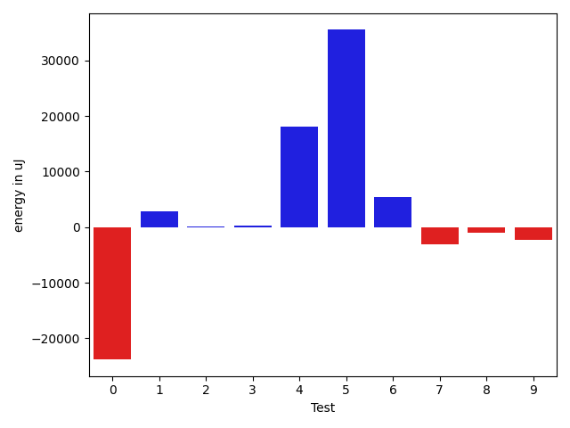

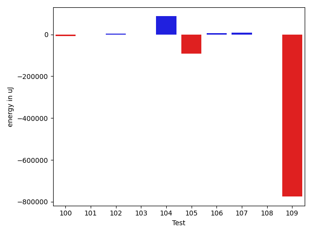

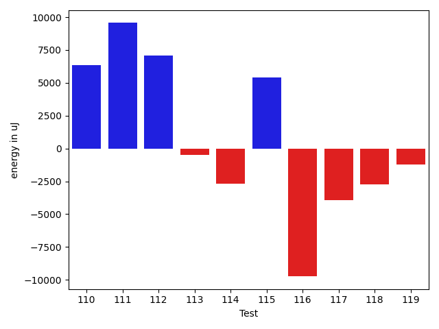

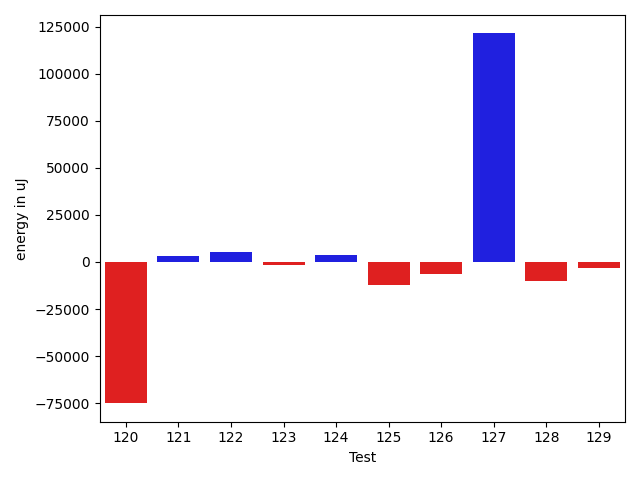

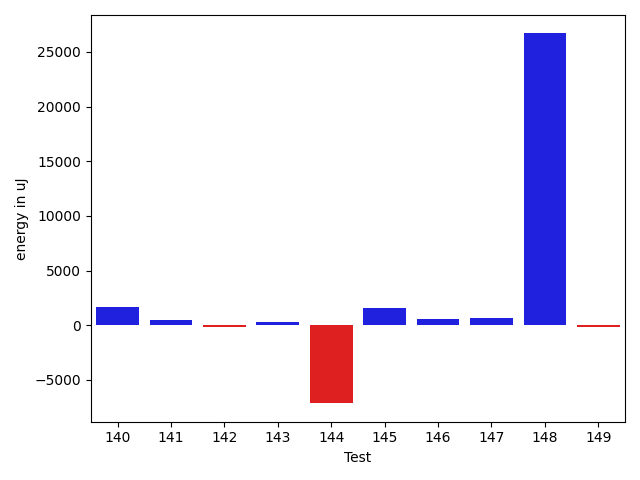

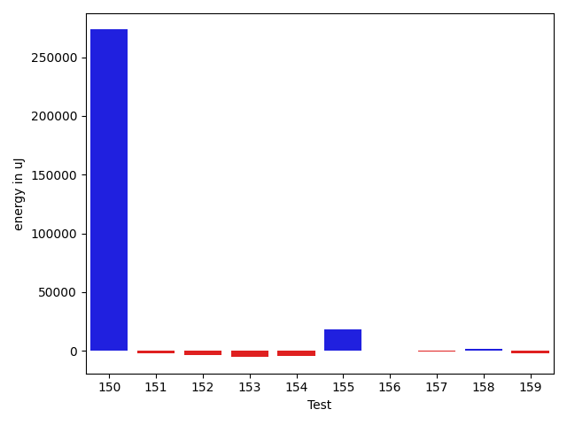

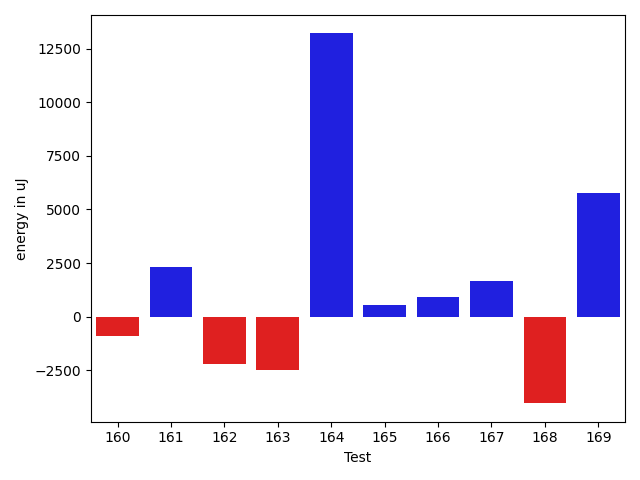

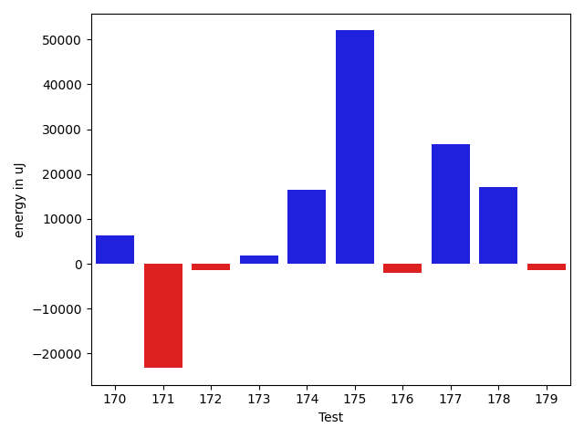

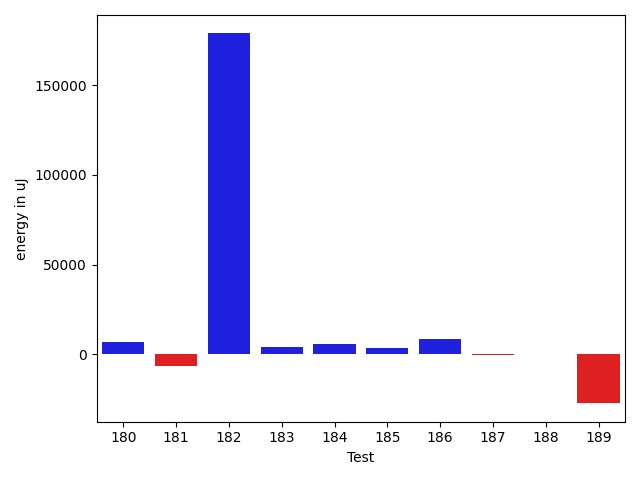

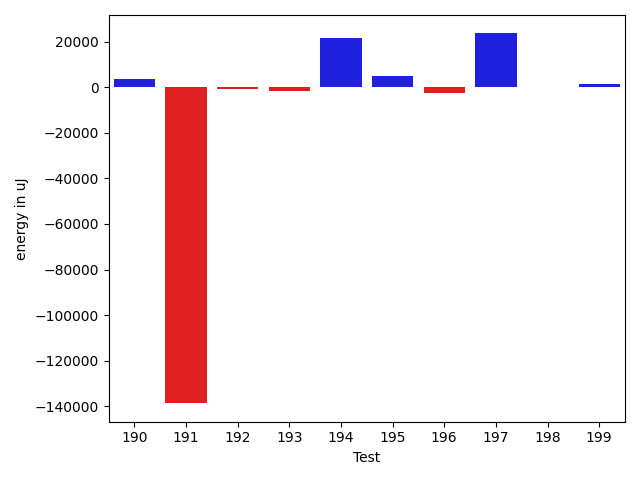

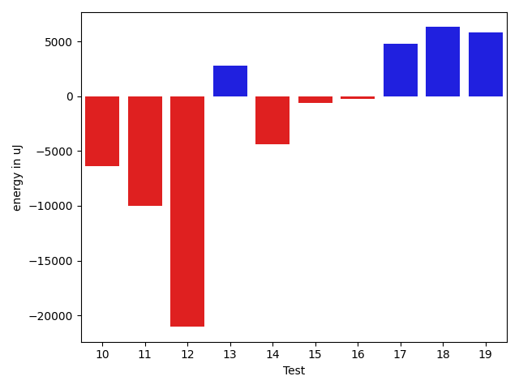

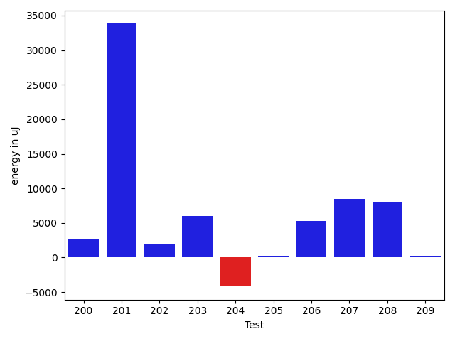

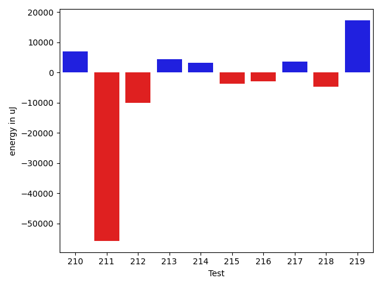

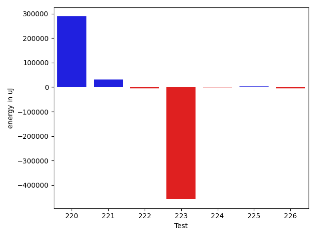

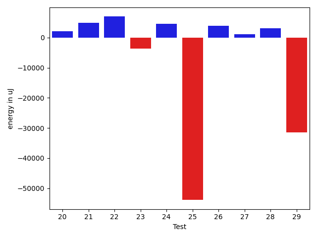

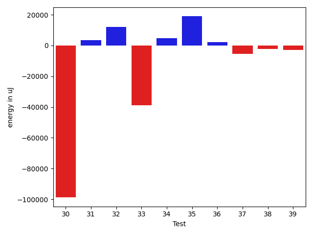

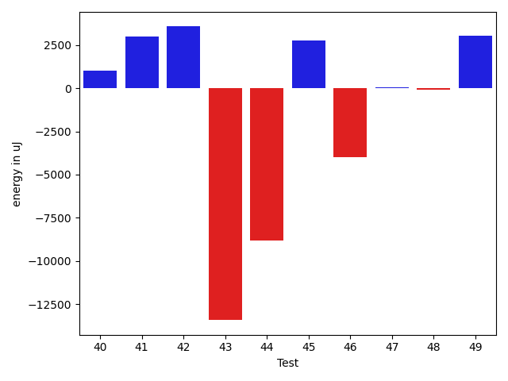

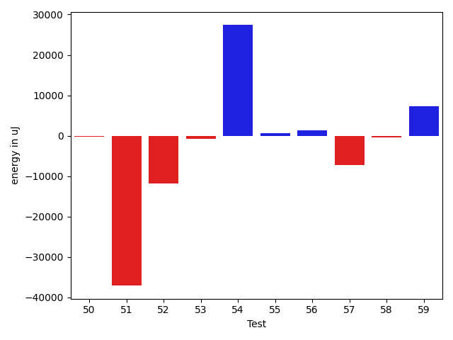

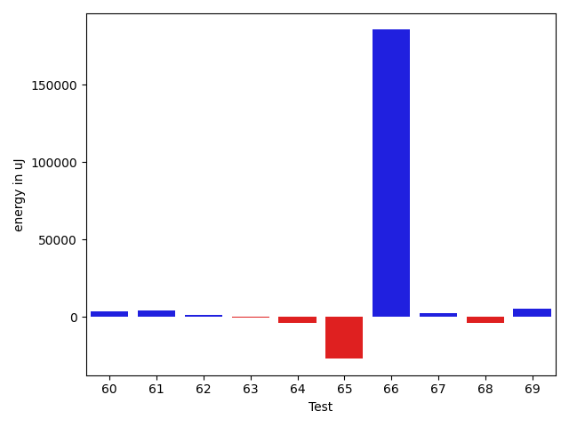

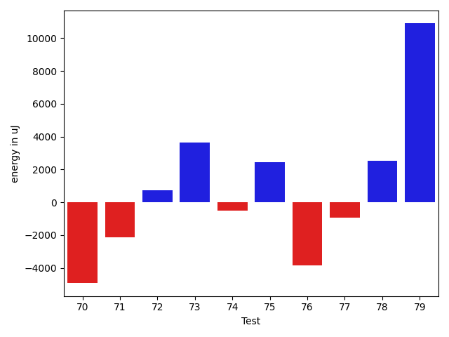

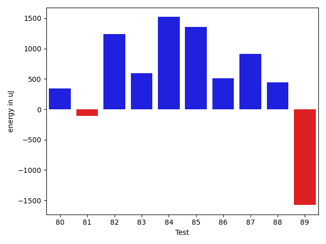

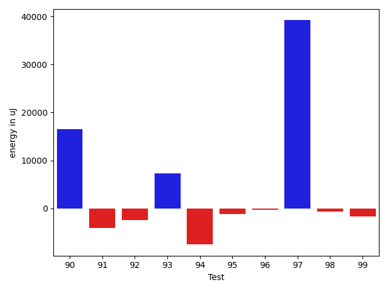

| ID | EnergyV1 | EnergyV2 | DeltaEnergy |
| --- | --- | --- | --- |
| 0 | 73168.64592154736 | 49357.18067440101 | -23811.46524714635 |
| 1 | 37549.2783460754 | 40461.10602954659 | 2911.827683471187 |
| 2 | 39530.64458693858 | 39601.58153884249 | 70.93695190391009 |
| 3 | 39864.82605444159 | 40079.6512046384 | 214.8251501968116 |
| 4 | 38642.401001875754 | 56722.16827043698 | 18079.767268561227 |
| 5 | 43511.779169151254 | 78991.83390995405 | 35480.05474080279 |
| 6 | 42317.3144293611 | 47695.77544326827 | 5378.461013907174 |
| 7 | 41821.416836999895 | 38745.180841290436 | -3076.2359957094595 |
| 8 | 40193.56317061838 | 39268.01643180847 | -925.546738809906 |
| 9 | 41924.941121648066 | 39690.08609510081 | -2234.8550265472586 |
| 10 | 40390.745008945465 | 34042.95216369629 | -6347.792845249176 |
| 11 | 53598.571749791656 | 43569.18748996618 | -10029.384259825478 |
| 12 | 105921.39553340532 | 84886.66763955956 | -21034.72789384576 |
| 13 | 43303.87532034848 | 46079.316453050706 | 2775.4411327022244 |
| 14 | 44722.35565185547 | 40352.27714538574 | -4370.078506469727 |
| 15 | 44157.937774032354 | 43581.598211649805 | -576.339562382549 |
| 16 | 40172.59099931386 | 39921.78124116361 | -250.80975815025158 |
| 17 | 40380.57106363773 | 45148.290823459625 | 4767.719759821892 |
| 18 | 33727.467587828636 | 40030.14700317383 | 6302.679415345192 |
| 19 | 35986.6975380794 | 41782.52734747463 | 5795.829809395225 |
| 20 | 41960.72266316414 | 44138.75275051594 | 2178.030087351799 |
| 21 | 35241.90283978218 | 40100.59497785568 | 4858.6921380735 |
| 22 | 36830.53785980924 | 43779.77319824539 | 6949.235338436149 |
| 23 | 44051.778524925 | 40389.57862334512 | -3662.199901579879 |
| 24 | 36111.13186708369 | 40705.87736032396 | 4594.745493240269 |
| 25 | 97404.34574634791 | 43551.2190345538 | -53853.12671179412 |
| 26 | 40417.5693359375 | 44309.621114730835 | 3892.051778793335 |
| 27 | 41601.47692871094 | 42723.81187438965 | 1122.334945678711 |
| 28 | 39083.90979385376 | 42229.904296875 | 3145.9945030212402 |
| 29 | 68923.04661134288 | 37415.57754921382 | -31507.469062129065 |
| 30 | 146581.4306381411 | 47836.300371235375 | -98745.1302669057 |
| 31 | 38042.3538941359 | 41397.45848632164 | 3355.1045921857367 |
| 32 | 43939.71258695639 | 55998.623917415156 | 12058.911330458766 |
| 33 | 78215.2326817617 | 39432.10378379711 | -38783.12889796459 |
| 34 | 33969.74295695784 | 38847.66521894613 | 4877.922261988293 |
| 35 | 186497.37399133365 | 205388.04477954708 | 18890.670788213436 |
| 36 | 38269.56789421581 | 40299.57718128217 | 2030.0092870663575 |
| 37 | 53370.30809921432 | 47997.53017523346 | -5372.777923980859 |
| 38 | 37115.054671444 | 35001.251927440404 | -2113.802744003595 |
| 39 | 40604.440682179935 | 37659.27082318514 | -2945.169858994792 |
| 40 | 36382.40990909003 | 37415.99022102356 | 1033.5803119335324 |
| 41 | 38979.17153762188 | 42005.72126579285 | 3026.5497281709686 |
| 42 | 32698.55481338501 | 36278.33667360991 | 3579.7818602249026 |
| 43 | 52446.936266299606 | 39017.07021113024 | -13429.866055169368 |
| 44 | 49345.36668708935 | 40525.49037601339 | -8819.876311075961 |
| 45 | 37686.50933246348 | 40470.44461264938 | 2783.9352801858986 |
| 46 | 37751.66274984041 | 33782.832514999034 | -3968.830234841378 |
| 47 | 38099.067257881165 | 38181.49975681305 | 82.43249893188477 |
| 48 | 41114.59951132859 | 41018.66876857657 | -95.93074275201798 |
| 49 | 36320.26330661774 | 39354.643699645996 | 3034.3803930282593 |
| 50 | 38463.24218082428 | 38178.16156196594 | -285.0806188583374 |
| 51 | 75982.62131418195 | 38873.67211458087 | -37108.94919960108 |
| 52 | 92840.67128162403 | 80980.0593992252 | -11860.611882398836 |
| 53 | 42792.554374376705 | 42059.87241162338 | -732.6819627533259 |
| 54 | 39190.5205535863 | 66649.5889978793 | 27459.068444293 |
| 55 | 42088.626553982496 | 42789.5810546875 | 700.9545007050037 |
| 56 | 37728.01539993286 | 39145.07738092927 | 1417.0619809964119 |
| 57 | 39946.361305024904 | 32681.27850354984 | -7265.082801475066 |
| 58 | 39376.4813848561 | 39029.50140561431 | -346.9799792417907 |
| 59 | 51986.84979995633 | 59268.25500995493 | 7281.4052099986 |
| 60 | 41215.90877483785 | 44557.463931206614 | 3341.5551563687623 |
| 61 | 40562.92266930587 | 44950.76078875248 | 4387.838119446606 |
| 62 | 38426.399089195475 | 39440.365343541744 | 1013.9662543462691 |
| 63 | 39618.5926481357 | 38993.145971766615 | -625.4466763690871 |
| 64 | 43069.08268737793 | 39003.610396146774 | -4065.4722912311554 |
| 65 | 65892.74305033764 | 38893.60766277184 | -26999.135387565795 |
| 66 | 39474.32231903076 | 224814.34767723083 | 185340.02535820007 |
| 67 | 40890.68969745449 | 43456.9641837462 | 2566.2744862917098 |
| 68 | 40187.38253504038 | 36469.04830932617 | -3718.3342257142067 |
| 69 | 39491.873510716716 | 44771.43582847926 | 5279.562317762546 |
| 70 | 43724.58930277079 | 38795.3305803377 | -4929.258722433093 |
| 71 | 42442.550936517066 | 40307.65360866279 | -2134.897327854276 |
| 72 | 39858.82615338236 | 40608.60587691751 | 749.7797235351463 |
| 73 | 38755.69550447121 | 42402.28419692263 | 3646.58869245142 |
| 74 | 41626.29816450928 | 41129.90998811467 | -496.38817639461195 |
| 75 | 39873.1787384498 | 42314.82845885316 | 2441.6497204033585 |
| 76 | 43376.832000960596 | 39532.36200755723 | -3844.4699934033633 |
| 77 | 42938.983409242705 | 41980.91779875755 | -958.0656104851514 |
| 78 | 36804.67949059929 | 39348.83138248902 | 2544.1518918897345 |
| 79 | 46095.07861945752 | 56987.67439753571 | 10892.59577807819 |
| 80 | 40213.947136674906 | 40556.40616986652 | 342.4590331916115 |
| 81 | 37348.30619291487 | 37239.41826567607 | -108.88792723880033 |
| 82 | 38781.61591102227 | 40019.83011289319 | 1238.21420187092 |
| 83 | 37465.05720096292 | 38059.108130531386 | 594.0509295684678 |
| 84 | 41101.8335719959 | 42622.75277823479 | 1520.9192062388902 |
| 85 | 35846.08415201789 | 37207.23671717341 | 1361.1525651555203 |
| 86 | 37158.648035784965 | 37672.78057148833 | 514.1325357033638 |
| 87 | 37933.65801323772 | 38850.49696845881 | 916.8389552210865 |
| 88 | 39667.546184088125 | 40110.531883888645 | 442.9856998005198 |
| 89 | 42322.01724243164 | 40745.86686992645 | -1576.150372505188 |
| 90 | 47080.13934832066 | 63565.38402323518 | 16485.244674914517 |
| 91 | 42109.328624367714 | 38037.510566949844 | -4071.8180574178696 |
| 92 | 44254.46539612013 | 41835.802071071914 | -2418.663325048219 |
| 93 | 45454.918990648104 | 52705.3852997478 | 7250.466309099698 |
| 94 | 43007.59948095726 | 35464.73453430596 | -7542.864946651302 |
| 95 | 42786.80133861987 | 41623.98318471015 | -1162.8181539097204 |
| 96 | 42259.22902853544 | 41992.365990355545 | -266.8630381798939 |
| 97 | 46811.164881836536 | 86038.04813821429 | 39226.883256377754 |
| 98 | 38502.52347260201 | 37788.42733970391 | -714.0961328981066 |
| 99 | 42423.129162870966 | 40782.094868908156 | -1641.03429396281 |
| 100 | 48178.88704952697 | 40393.86816518129 | -7785.018884345685 |
| 101 | 41867.43131709995 | 41910.73941082152 | 43.30809372157091 |
| 102 | 40207.594816446304 | 43675.63562011719 | 3468.040803670883 |
| 103 | 38774.0078125 | 38080.328125 | -693.6796875 |
| 104 | 37881.77127057964 | 124181.87661353778 | 86300.10534295815 |
| 105 | 136167.55117003867 | 43830.20216449705 | -92337.34900554162 |
| 106 | 35865.81330430508 | 41903.503356933594 | 6037.690052628517 |
| 107 | 35843.94863128662 | 43847.05242009461 | 8003.103788807988 |
| 108 | 41305.39222240448 | 39611.38392519951 | -1694.0082972049713 |
| 109 | 818670.4903072419 | 43351.78078511325 | -775318.7095221287 |
| 110 | 35253.63572317071 | 41616.69617024972 | 6363.060447079013 |
| 111 | 32634.92262840271 | 42192.11924743652 | 9557.196619033813 |
| 112 | 39642.571044921875 | 46725.95635986328 | 7083.385314941406 |
| 113 | 37369.74928230047 | 36891.777992248535 | -477.9712900519371 |
| 114 | 43106.009338378906 | 40415.976623535156 | -2690.03271484375 |
| 115 | 39655.77140575551 | 45051.74402194288 | 5395.97261618737 |
| 116 | 56396.60252795382 | 46659.2067784799 | -9737.395749473922 |
| 117 | 42582.61807108234 | 38653.48483590812 | -3929.1332351742167 |
| 118 | 41057.32955326098 | 38340.13705871288 | -2717.1924945481005 |
| 119 | 40875.294776678085 | 39659.40942001343 | -1215.8853566646576 |
| 120 | 115661.3967628486 | 40603.56081989735 | -75057.83594295125 |
| 121 | 68871.96705231277 | 71865.4195245325 | 2993.452472219724 |
| 122 | 39597.84314520034 | 44927.595135804324 | 5329.7519906039815 |
| 123 | 40880.98997909507 | 39018.360408235705 | -1862.629570859368 |
| 124 | 38091.04256621518 | 41905.340059240276 | 3814.297493025093 |
| 125 | 51315.22992764374 | 38858.611158105065 | -12456.618769538676 |
| 126 | 54329.98848320639 | 48184.7985976721 | -6145.189885534288 |
| 127 | 89335.02234827785 | 210718.22861927596 | 121383.20627099811 |
| 128 | 46314.336571436754 | 36072.59948694031 | -10241.737084496446 |
| 129 | 41460.99721775932 | 38103.63205119557 | -3357.3651665637517 |
| 130 | 39301.687084351695 | 55153.36829128041 | 15851.681206928712 |
| 131 | 40348.619988011196 | 41198.015542503446 | 849.3955544922501 |
| 132 | 42025.02690509132 | 37564.46622567053 | -4460.560679420792 |
| 133 | 43060.19441586315 | 36709.418702604904 | -6350.775713258248 |
| 134 | 40869.83195324722 | 41154.73080540036 | 284.8988521531355 |
| 135 | 43535.08302484741 | 43587.85118494685 | 52.76816009944014 |
| 136 | 152499.84606877097 | 153036.48027141503 | 536.6342026440543 |
| 137 | 42195.35730345942 | 47386.120489640554 | 5190.7631861811315 |
| 138 | 40399.91826339811 | 41259.272997347056 | 859.3547339489451 |
| 139 | 40653.26711148562 | 43455.927391443045 | 2802.660279957425 |
| 140 | 38130.630793856944 | 39809.04376391809 | 1678.4129700611447 |
| 141 | 39074.76746703971 | 39533.16592169722 | 458.3984546575084 |
| 142 | 37712.865137256245 | 37591.51198594901 | -121.35315130723757 |
| 143 | 39286.93561053276 | 39583.550211597234 | 296.6146010644734 |
| 144 | 49148.42126768362 | 42021.16187441349 | -7127.2593932701275 |
| 145 | 38701.89563751221 | 40304.986328125 | 1603.090690612793 |
| 146 | 139497.90793078276 | 140055.15850464575 | 557.2505738629843 |
| 147 | 38873.49676758051 | 39497.63890838623 | 624.1421408057213 |
| 148 | 41115.56094441429 | 67795.36614881604 | 26679.805204401753 |
| 149 | 43912.09990566224 | 43720.30103302002 | -191.79887264221907 |
| 150 | 165816.9385193796 | 439384.0854183134 | 273567.1468989338 |
| 151 | 38660.84274892061 | 36731.97028702908 | -1928.8724618915294 |
| 152 | 39143.009755063504 | 35675.17408017175 | -3467.8356748917504 |
| 153 | 39765.609163701534 | 34345.529752641916 | -5420.079411059618 |
| 154 | 39453.15656296651 | 35319.92827114193 | -4133.228291824584 |
| 155 | 103531.73199401464 | 121892.56926853536 | 18360.837274520716 |
| 156 | 36967.09266589623 | 36752.567469855 | -214.5251960412279 |
| 157 | 39662.34200100647 | 38772.099028316676 | -890.2429726897972 |
| 158 | 36629.827402964234 | 38349.56346196309 | 1719.736058998853 |
| 159 | 38849.21520611429 | 36306.780650505396 | -2542.4345556088956 |
| 160 | 36866.55913391709 | 35952.03573772311 | -914.5233961939812 |
| 161 | 34309.052534743634 | 36642.70405168284 | 2333.651516939208 |
| 162 | 40924.91587591171 | 38696.140590225 | -2228.7752856867155 |
| 163 | 40097.22697285004 | 37602.50816280395 | -2494.7188100460917 |
| 164 | 53022.437352823414 | 66241.75992638577 | 13219.322573562356 |
| 165 | 57128.760611962854 | 57659.14110246752 | 530.3804905046636 |
| 166 | 38048.73512516617 | 38980.99387506805 | 932.2587499018846 |
| 167 | 39788.08003058404 | 41463.05330073065 | 1674.9732701466128 |
| 168 | 43609.4414883401 | 39562.42589192651 | -4047.0155964135847 |
| 169 | 38137.07785448172 | 43919.45932000771 | 5782.381465525985 |
| 170 | 41016.993190826586 | 47340.35425437655 | 6323.3610635499645 |
| 171 | 87789.7066732289 | 64577.55206022164 | -23212.154613007253 |
| 172 | 40193.90235707367 | 38729.718828370256 | -1464.1835287034119 |
| 173 | 40336.82614992546 | 42268.99325975263 | 1932.167109827169 |
| 174 | 35219.96471989969 | 51620.887578219656 | 16400.922858319966 |
| 175 | 86864.8000142822 | 138863.18589994143 | 51998.38588565923 |
| 176 | 37049.127232147206 | 34995.62411800753 | -2053.5031141396757 |
| 177 | 48541.2968685309 | 75312.18723581814 | 26770.89036728724 |
| 178 | 38917.04898808112 | 55980.28616497222 | 17063.237176891096 |
| 179 | 39393.49355034286 | 38001.88578941572 | -1391.6077609271379 |
| 180 | 47594.73111941805 | 54312.10259925146 | 6717.371479833411 |
| 181 | 40619.10851428046 | 34171.85550315852 | -6447.2530111219385 |
| 182 | 83411.1208075285 | 262144.8761501312 | 178733.75534260273 |
| 183 | 38231.17202758789 | 42133.22367858887 | 3902.0516510009766 |
| 184 | 36356.851374070364 | 42375.86107964161 | 6019.009705571247 |
| 185 | 39385.70115786588 | 42807.13754340513 | 3421.436385539251 |
| 186 | 50432.62107809719 | 59081.67029534335 | 8649.04921724616 |
| 187 | 42682.26902734602 | 42141.58787999976 | -540.6811473462585 |
| 188 | 40401.02055955882 | 40467.01426762395 | 65.99370806512889 |
| 189 | 131115.6372849562 | 103941.14177730308 | -27174.49550765312 |
| 190 | 39602.44608025119 | 43298.93736099646 | 3696.491280745271 |
| 191 | 183421.1572113037 | 44778.731689453125 | -138642.4255218506 |
| 192 | 43648.35837026968 | 43049.04018232424 | -599.318187945435 |
| 193 | 60692.76727979198 | 59109.645053721644 | -1583.1222260703362 |
| 194 | 44337.24406945021 | 65819.25313489974 | 21482.009065449536 |
| 195 | 35322.19833779335 | 40419.39737701416 | 5097.19903922081 |
| 196 | 225389.26952386304 | 223064.93989330262 | -2324.3296305604163 |
| 197 | 40426.27592309716 | 63999.096000205725 | 23572.82007710857 |
| 198 | 40554.772689819336 | 40671.2255859375 | 116.45289611816406 |
| 199 | 41141.26176023483 | 42655.607421875 | 1514.3456616401672 |
| 200 | 43084.728515625 | 45687.243408203125 | 2602.514892578125 |
| 201 | 42704.51843261719 | 76511.029296875 | 33806.51086425781 |
| 202 | 40888.32666015625 | 42766.58242416382 | 1878.2557640075684 |
| 203 | 41357.039484500885 | 47323.30894470215 | 5966.269460201263 |
| 204 | 43364.1650390625 | 39176.885036468506 | -4187.280002593994 |
| 205 | 41551.87808227539 | 41847.953125 | 296.0750427246094 |
| 206 | 40168.984375 | 45423.208557128906 | 5254.224182128906 |
| 207 | 35026.334790763205 | 43492.87289945013 | 8466.538108686924 |
| 208 | 34772.60121286707 | 42824.65850516543 | 8052.057292298363 |
| 209 | 39147.460204690695 | 39258.4382564486 | 110.97805175790563 |
| 210 | 33904.85817582886 | 40885.131155361625 | 6980.272979532769 |
| 211 | 134847.72749419478 | 78961.8975993634 | -55885.82989483139 |
| 212 | 52449.32198213879 | 42379.42533519706 | -10069.896646941728 |
| 213 | 40938.87792901974 | 45364.39728796482 | 4425.519358945079 |
| 214 | 39910.427421450615 | 43163.923263669014 | 3253.495842218399 |
| 215 | 39074.54463132471 | 35285.3339715004 | -3789.2106598243117 |
| 216 | 41083.905700683594 | 38102.83659362793 | -2981.069107055664 |
| 217 | 36731.02627032744 | 40421.37418681782 | 3690.3479164903765 |
| 218 | 41250.39088397045 | 36511.804293112116 | -4738.586590858336 |
| 219 | 42219.65090460412 | 59614.45381981968 | 17394.802915215565 |
| 220 | 45567.83654785156 | 333585.99560546875 | 288018.1590576172 |
| 221 | 42268.794771186 | 73023.00050992452 | 30754.205738738514 |
| 222 | 38436.41198730469 | 32774.649993896484 | -5661.761993408203 |
| 223 | 591345.1124191284 | 134443.636302948 | -456901.4761161804 |
| 224 | 43398.23175471235 | 42293.06364697868 | -1105.1681077336762 |
| 225 | 37127.62498283386 | 39720.48994731903 | 2592.8649644851685 |
| 226 | 42181.217712402344 | 36206.95910644531 | -5974.258605957031 |

## Delta Duration per test method

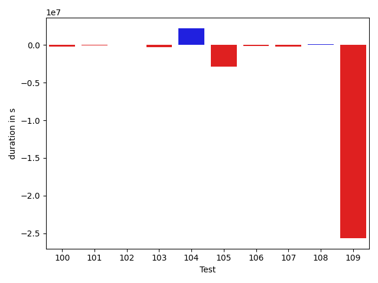

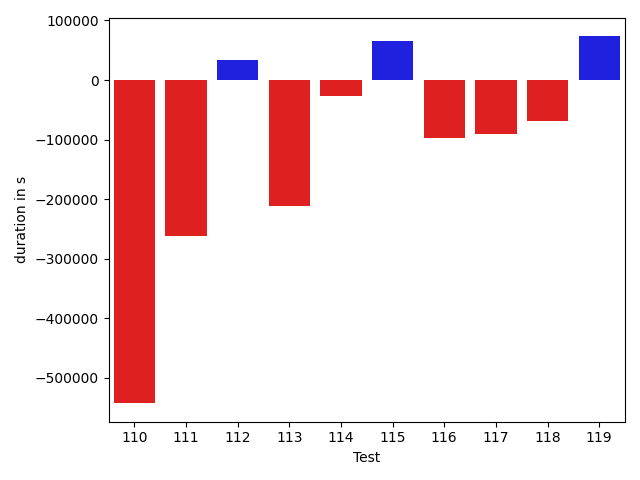

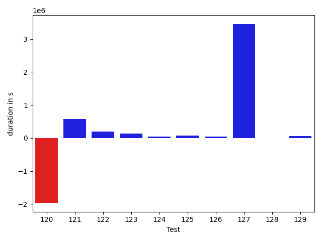

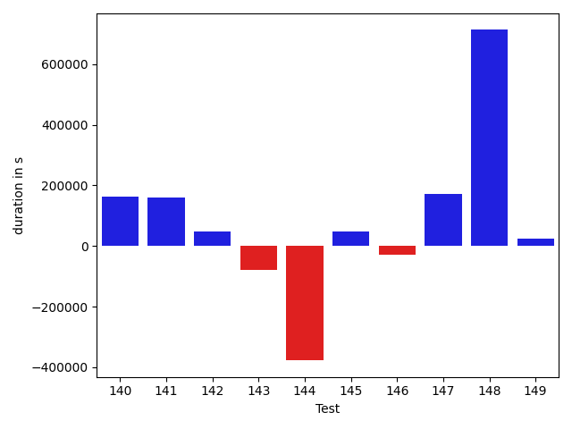

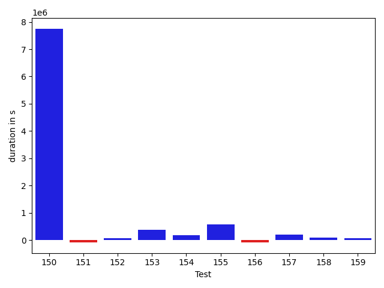

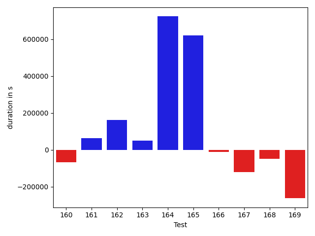

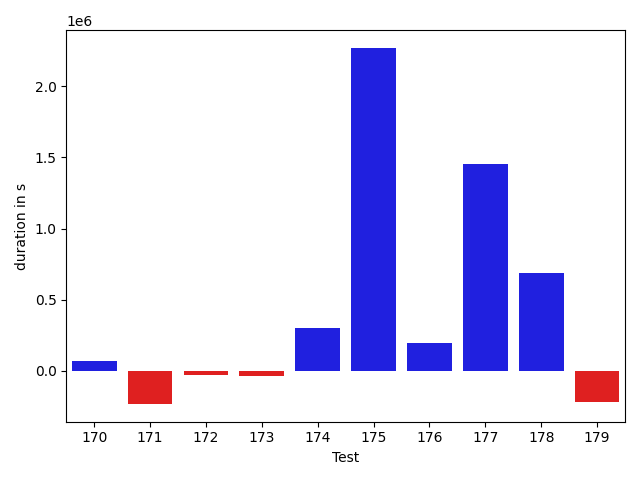

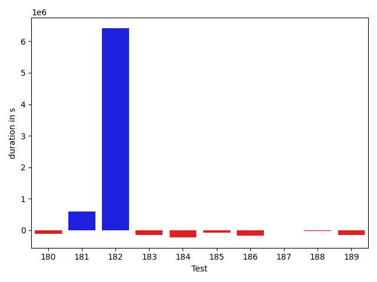

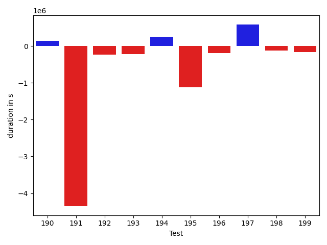

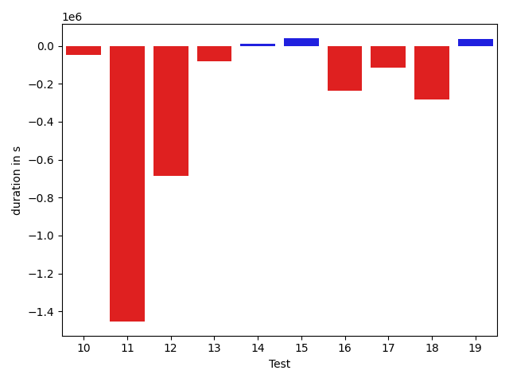

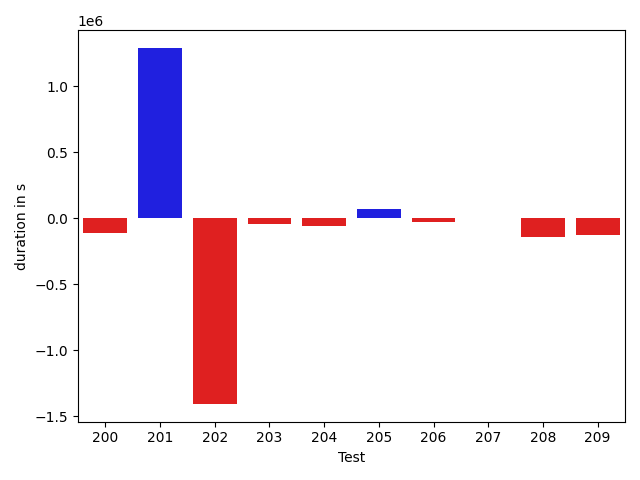

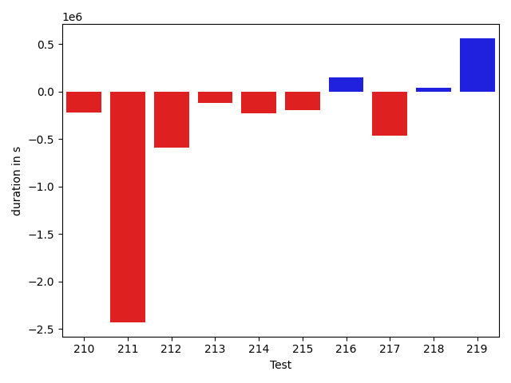

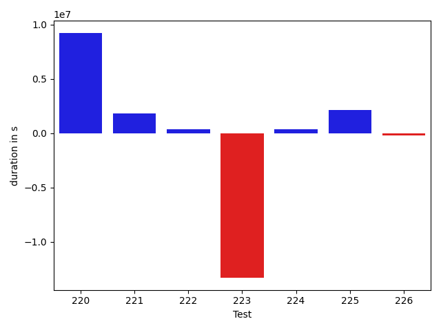

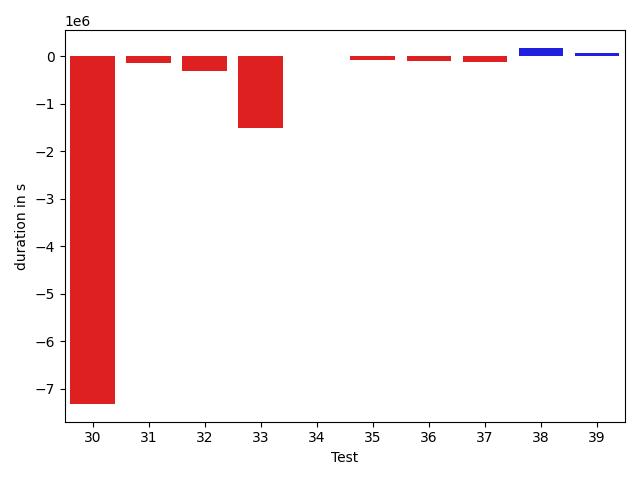

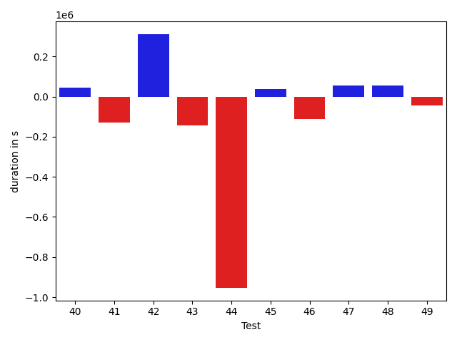

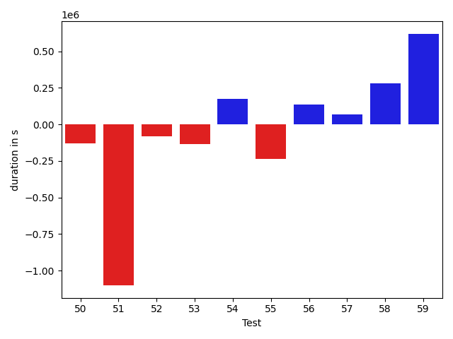

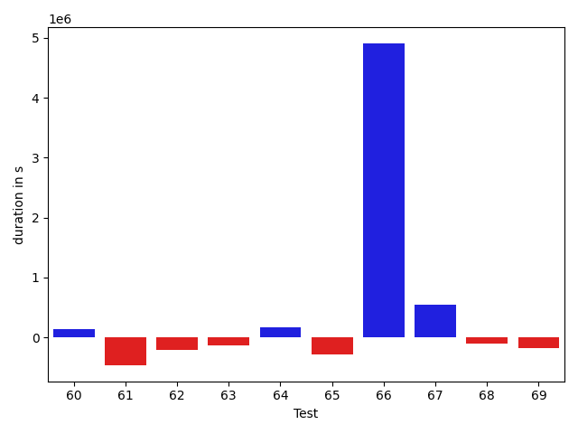

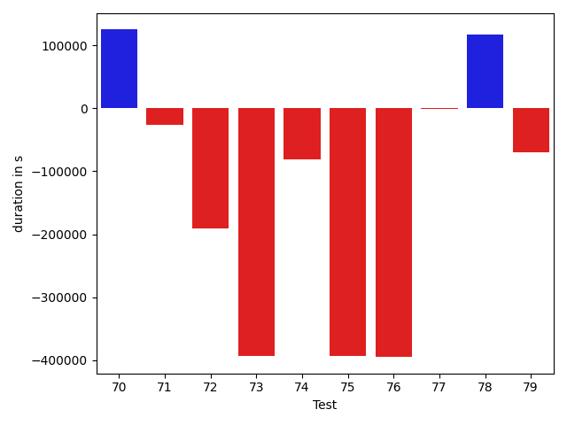

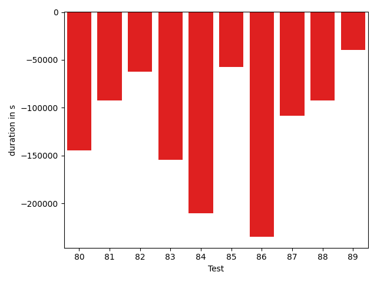

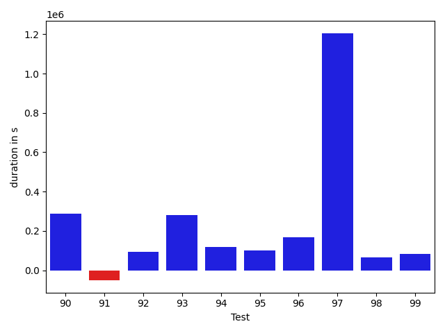

| ID | DurationV1 | DurationsV2 | DeltaDuration |
| --- | --- | --- | --- |
| 0 | 1881010.3147039858 | 1839573.2118376005 | -41437.102866385365 |
| 1 | 596731.7040828597 | 862044.6439699326 | 265312.9398870729 |
| 2 | 571342.4047021393 | 754048.1205636878 | 182705.71586154844 |
| 3 | 919180.0376880906 | 963061.0586522951 | 43881.02096420457 |
| 4 | 1021897.4726188714 | 1622062.5408918133 | 600165.068272942 |
| 5 | 1220383.375262145 | 2192364.3896414153 | 971981.0143792704 |
| 6 | 872344.6564239891 | 1372034.0722986911 | 499689.41587470204 |
| 7 | 655043.8099552798 | 784733.7655690568 | 129689.95561377704 |
| 8 | 598989.7568943752 | 529720.0005460903 | -69269.7563482849 |
| 9 | 878855.3814032773 | 624928.0589323809 | -253927.3224708964 |
| 10 | 436003.60375905037 | 387281.3875427246 | -48722.21621632576 |
| 11 | 1926104.323170467 | 473188.0171884162 | -1452916.305982051 |
| 12 | 2784503.204618049 | 2099512.532900303 | -684990.6717177457 |
| 13 | 669881.0074148364 | 589168.5329107916 | -80712.47450404486 |
| 14 | 345803.52641296387 | 358310.74169921875 | 12507.215286254883 |
| 15 | 446702.0432908237 | 486884.3472905904 | 40182.30399976671 |
| 16 | 648498.3003541239 | 412595.1728807492 | -235903.1274733747 |
| 17 | 536962.5876342058 | 421780.9924694896 | -115181.59516471624 |
| 18 | 680656.9807181358 | 395907.47636675835 | -284749.5043513775 |
| 19 | 744019.2335728309 | 778490.1225956468 | 34470.889022815856 |
| 20 | 457654.64093232155 | 331633.6564542055 | -126020.98447811604 |
| 21 | 567798.3355343193 | 391048.84432435036 | -176749.49120996892 |
| 22 | 940558.3323763763 | 992197.7427088154 | 51639.41033243912 |
| 23 | 728588.1504571089 | 559756.8899639305 | -168831.2604931784 |
| 24 | 982078.8499466069 | 866558.5586501107 | -115520.29129649617 |
| 25 | 2512504.1442073975 | 472284.3485005986 | -2040219.7957067988 |
| 26 | 453929.76904296875 | 375199.8099632263 | -78729.95907974243 |
| 27 | 366650.1135253906 | 367102.5673904419 | 452.45386505126953 |
| 28 | 578101.7699203491 | 431497.13623046875 | -146604.63368988037 |
| 29 | 1941972.698155915 | 1524040.2330645209 | -417932.465091394 |
| 30 | 8364058.794005483 | 1039167.3771286333 | -7324891.41687685 |
| 31 | 942524.6777290672 | 809200.4390390711 | -133324.23868999607 |
| 32 | 1704363.0547935911 | 1393660.794869866 | -310702.25992372516 |
| 33 | 2200353.09769894 | 701973.369159396 | -1498379.728539544 |
| 34 | 598145.5611004372 | 614390.1348220273 | 16244.573721590103 |
| 35 | 4866613.818796445 | 4792210.237510874 | -74403.58128557075 |
| 36 | 810811.6337340589 | 716381.617361859 | -94430.01637219999 |
| 37 | 1251915.1820817022 | 1129855.6735239031 | -122059.50855779904 |
| 38 | 553397.8556035981 | 732324.0232985817 | 178926.16769498365 |
| 39 | 792526.8278242007 | 856816.1894120341 | 64289.36158783338 |
| 40 | 495512.1779343821 | 540479.9747803211 | 44967.79684593901 |
| 41 | 527386.531767075 | 396362.65739417076 | -131023.87437290419 |
| 42 | 559628.5512199402 | 870948.7111219801 | 311320.1599020399 |
| 43 | 1468844.825807171 | 1325036.3463491225 | -143808.47945804847 |
| 44 | 1821833.1690851643 | 868423.1304317906 | -953410.0386533737 |
| 45 | 634482.4559893036 | 672540.0688698553 | 38057.612880551605 |
| 46 | 795817.1720624443 | 685512.8983115666 | -110304.2737508777 |
| 47 | 439368.93417167664 | 494102.0231409073 | 54733.08896923065 |
| 48 | 675141.7035447762 | 731312.9928330185 | 56171.28928824235 |
| 49 | 366079.28080558777 | 321572.1153793335 | -44507.16542625427 |
| 50 | 585129.8961737156 | 456244.99804878235 | -128884.89812493324 |
| 51 | 1623245.5151242586 | 523198.8030550778 | -1100046.7120691808 |
| 52 | 2208279.483951726 | 2125956.38653872 | -82323.09741300577 |
| 53 | 1702794.4816796503 | 1569212.706583038 | -133581.77509661228 |
| 54 | 1284017.136857414 | 1457750.3815770992 | 173733.2447196853 |
| 55 | 630644.4265613258 | 395671.5037841797 | -234972.9227771461 |
| 56 | 533973.2727241516 | 668092.0166899763 | 134118.74396582472 |
| 57 | 853072.2990091429 | 922883.2159096509 | 69810.91690050799 |
| 58 | 624476.2745619717 | 907914.1143756356 | 283437.839813664 |
| 59 | 1166685.3767973427 | 1786245.6289499952 | 619560.2521526525 |
| 60 | 391843.2240702398 | 533044.2692563497 | 141201.04518610984 |
| 61 | 1190881.8478501157 | 726937.0815482324 | -463944.7663018834 |
| 62 | 866981.2086717646 | 661838.0570011283 | -205143.15167063626 |
| 63 | 744140.578808622 | 610408.5064726328 | -133732.0723359892 |
| 64 | 425222.01525878906 | 600735.8347674012 | 175513.81950861216 |
| 65 | 1164712.2287314578 | 885239.4870291208 | -279472.74170233705 |
| 66 | 459895.22719192505 | 5368118.917034149 | 4908223.689842224 |
| 67 | 933245.9125593789 | 1481869.6205379858 | 548623.7079786069 |
| 68 | 652495.2493822426 | 554499.3196105957 | -97995.92977164686 |
| 69 | 942854.6810820547 | 764311.1647634276 | -178543.51631862717 |
| 70 | 1033312.9967709372 | 1158098.6740800673 | 124785.67730913009 |
| 71 | 542624.0587745748 | 516417.96076657745 | -26206.098007997323 |
| 72 | 823004.8122382013 | 632972.2836357998 | -190032.5286024015 |
| 73 | 1010458.0737870473 | 618008.0892720782 | -392449.98451496905 |
| 74 | 700060.2718919138 | 619065.4091462286 | -80994.86274568527 |
| 75 | 1131509.3799140716 | 738215.3706308842 | -393294.00928318745 |
| 76 | 1253884.4332482256 | 859153.9038813442 | -394730.52936688135 |
| 77 | 405697.7872426193 | 404188.1827470064 | -1509.6044956129044 |
| 78 | 861611.9390883232 | 978836.0390788103 | 117224.0999904871 |
| 79 | 1279294.775122348 | 1209484.4596604656 | -69810.31546188239 |
| 80 | 715735.5130300841 | 571001.0951830039 | -144734.41784708016 |
| 81 | 666118.024537175 | 574014.8676425898 | -92103.15689458512 |
| 82 | 1003194.7340057803 | 941130.3427828321 | -62064.39122294821 |
| 83 | 701856.2868003184 | 547218.9163621962 | -154637.3704381222 |
| 84 | 1020120.9609826743 | 809913.91565825 | -210207.04532442428 |
| 85 | 729044.8538863624 | 671623.8159246123 | -57421.03796175006 |
| 86 | 832918.6949588892 | 598386.1708164426 | -234532.52414244658 |
| 87 | 725268.8197513556 | 616812.3146251542 | -108456.50512620131 |
| 88 | 643699.1017951888 | 551627.4327138589 | -92071.66908132995 |
| 89 | 393894.83430480957 | 354544.26778411865 | -39350.56652069092 |
| 90 | 790586.1295863204 | 1076898.9869487064 | 286312.8573623861 |
| 91 | 434212.0933947563 | 383476.2159948349 | -50735.87739992142 |
| 92 | 730771.8894139151 | 825512.1527547379 | 94740.26334082277 |
| 93 | 1220506.3215515618 | 1501517.353278536 | 281011.03172697406 |
| 94 | 617468.3932225322 | 736916.4056171647 | 119448.01239463245 |
| 95 | 814631.947436635 | 913963.8886781395 | 99331.94124150451 |
| 96 | 593570.9498752293 | 759739.6852292067 | 166168.73535397742 |
| 97 | 1338759.2067576996 | 2543514.8770146496 | 1204755.67025695 |
| 98 | 484716.4920164747 | 548541.2666234929 | 63824.77460701822 |
| 99 | 640392.0891530686 | 724338.2784384184 | 83946.1892853498 |
| 100 | 932911.6951438028 | 707020.0784378177 | -225891.61670598504 |
| 101 | 773206.5776407295 | 728902.2943318785 | -44304.28330885095 |
| 102 | 338083.512655735 | 397227.96826171875 | 59144.455605983734 |
| 103 | 904140.5361328125 | 593308.9609375 | -310831.5751953125 |
| 104 | 772673.3644431696 | 2992273.760883322 | 2219600.3964401525 |
| 105 | 4024880.403941581 | 1166688.8618532587 | -2858191.5420883223 |
| 106 | 595261.3118601441 | 426735.3619995117 | -168525.94986063242 |
| 107 | 582337.5441856384 | 357387.65520837903 | -224949.8889772594 |
| 108 | 333370.81288814545 | 438594.4107210636 | 105223.59783291817 |
| 109 | 26834077.750913884 | 1188341.9724032949 | -25645735.77851059 |
| 110 | 1045712.1836688827 | 502668.322654736 | -543043.8610141467 |
| 111 | 652843.0308589935 | 391424.54557800293 | -261418.4852809906 |
| 112 | 314294.3543701172 | 347361.03424072266 | 33066.67987060547 |
| 113 | 646398.6603463888 | 435297.24960899353 | -211101.4107373953 |
| 114 | 410020.5205078125 | 382967.1869506836 | -27053.333557128906 |
| 115 | 1113688.2641194342 | 1178879.7581220034 | 65191.494002569234 |
| 116 | 1542915.561961063 | 1444898.0880639162 | -98017.47389714676 |
| 117 | 833425.7748378504 | 742394.4881763828 | -91031.28666146751 |
| 118 | 973776.2727455428 | 904176.0336175904 | -69600.23912795237 |
| 119 | 344924.6930067539 | 418344.59812927246 | 73419.90512251854 |
| 120 | 3158736.3051095307 | 1195189.2874313116 | -1963547.0176782191 |
| 121 | 1646464.393495121 | 2221288.069412607 | 574823.6759174857 |
| 122 | 718039.9476290521 | 914529.1395586719 | 196489.19192961976 |
| 123 | 821259.8643285292 | 950128.9318380395 | 128869.06750951032 |
| 124 | 610659.3635047849 | 657836.8625118149 | 47177.49900703004 |
| 125 | 1279543.5990955154 | 1353897.86310847 | 74354.26401295466 |
| 126 | 1382518.3253342505 | 1430982.9442661596 | 48464.61893190909 |
| 127 | 2613028.9609313803 | 6065316.8888887195 | 3452287.927957339 |
| 128 | 1276721.4411113034 | 1273736.646592866 | -2984.7945184374694 |
| 129 | 953909.2838133432 | 1007630.3906026711 | 53721.106789327925 |
| 130 | 1185001.3570938902 | 1622261.2624159544 | 437259.9053220642 |
| 131 | 509768.93536102213 | 552841.8581198798 | 43072.92275885772 |
| 132 | 975216.440784397 | 959552.5903217422 | -15663.850462654722 |
| 133 | 1412533.4922802744 | 1338431.2493952408 | -74102.2428850336 |
| 134 | 789663.1003291641 | 798144.013305731 | 8480.912976566935 |
| 135 | 1375958.7624082186 | 1337266.8218788314 | -38691.94052938721 |
| 136 | 3588971.633371399 | 3916931.882811312 | 327960.2494399133 |
| 137 | 682029.0756242403 | 660600.3129218584 | -21428.762702381937 |
| 138 | 769979.4338747468 | 691130.0037501461 | -78849.43012460065 |
| 139 | 855459.13405781 | 969245.9877079576 | 113786.85365014768 |
| 140 | 867929.9067093962 | 1030616.7045206018 | 162686.79781120562 |
| 141 | 587299.2121188936 | 746438.8747637698 | 159139.66264487617 |
| 142 | 533044.2221561201 | 579917.1131423393 | 46872.890986219165 |
| 143 | 609501.5967592001 | 531654.0437451128 | -77847.55301408726 |
| 144 | 898741.6009955192 | 521297.2457744777 | -377444.3552210415 |
| 145 | 383452.3424949646 | 430085.462890625 | 46633.1203956604 |
| 146 | 3640754.289494517 | 3613296.846313569 | -27457.443180947565 |
| 147 | 304407.143928051 | 476609.888130188 | 172202.744202137 |
| 148 | 535531.7317434046 | 1248651.1585413474 | 713119.4267979427 |
| 149 | 382551.3627474494 | 406765.4088745117 | 24214.04612706229 |
| 150 | 5377452.302286638 | 13127699.908904564 | 7750247.606617926 |
| 151 | 685624.7603806632 | 600782.5787871049 | -84842.18159355829 |
| 152 | 744963.2040214773 | 807532.719444867 | 62569.515423389734 |
| 153 | 430228.64877955616 | 804521.5078700483 | 374292.85909049213 |
| 154 | 1026455.5923293626 | 1197577.0459477738 | 171121.4536184112 |
| 155 | 3253621.4204792697 | 3838039.156417286 | 584417.7359380163 |
| 156 | 1010376.4806276017 | 930961.5964770974 | -79414.88415050437 |
| 157 | 429176.04054023535 | 631021.1079856602 | 201845.06744542485 |
| 158 | 624532.3333938271 | 709054.3377036355 | 84522.00430980837 |
| 159 | 1025145.7064265196 | 1097617.9395576718 | 72472.23313115223 |
| 160 | 639989.5498124734 | 572034.5920357555 | -67954.95777671784 |
| 161 | 738243.587237704 | 801222.7074057865 | 62979.12016808253 |
| 162 | 647666.4737029076 | 810766.5008126094 | 163100.02710970188 |
| 163 | 518161.6912809927 | 568291.7857737169 | 50130.094492724165 |
| 164 | 1563267.866149571 | 2286333.6378804045 | 723065.7717308335 |
| 165 | 1108639.381612407 | 1729895.276905955 | 621255.895293548 |
| 166 | 729279.0197548879 | 718591.7478471766 | -10687.271907711285 |
| 167 | 949685.9648271131 | 830463.0552103707 | -119222.9096167424 |
| 168 | 555085.9565621214 | 507018.0241547716 | -48067.932407349814 |
| 169 | 1216451.824534197 | 954042.3757764099 | -262409.44875778724 |
| 170 | 1239788.8815259202 | 1307748.5139284218 | 67959.63240250153 |
| 171 | 2488448.2525914023 | 2256168.9636708973 | -232279.28892050497 |
| 172 | 1105987.202045407 | 1073657.2454045205 | -32329.956640886376 |
| 173 | 807615.6883594489 | 772781.0531024326 | -34834.635257016285 |
| 174 | 837978.0274694378 | 1138681.3869775054 | 300703.3595080676 |
| 175 | 2318345.769831669 | 4586820.180745782 | 2268474.4109141133 |
| 176 | 1088353.338649132 | 1284869.6693565422 | 196516.33070741012 |
| 177 | 1005256.260103871 | 2457532.601121781 | 1452276.3410179098 |
| 178 | 807849.2484507989 | 1494821.3378608525 | 686972.0894100536 |
| 179 | 1031274.4482856897 | 814701.0682736903 | -216573.3800119994 |
| 180 | 1673874.4918328584 | 1566344.412978502 | -107530.07885435643 |
| 181 | 711313.1714319582 | 1309510.0358942458 | 598196.8644622876 |
| 182 | 1850098.7741867304 | 8269258.881568909 | 6419160.107382178 |
| 183 | 492356.26317214966 | 346254.82107543945 | -146101.4420967102 |
| 184 | 719824.2369863417 | 492644.96679080324 | -227179.2701955384 |
| 185 | 719907.5659519888 | 645509.285027659 | -74398.28092432977 |
| 186 | 1766164.471641386 | 1591797.517098763 | -174366.9545426229 |
| 187 | 559072.3299509273 | 556389.2471720877 | -2683.0827788396273 |
| 188 | 680699.9346570214 | 660302.1620865025 | -20397.772570518893 |
| 189 | 2960151.12234888 | 2805795.917798797 | -154355.2045500828 |
| 190 | 595235.4815786207 | 739327.7220373373 | 144092.24045871652 |
| 191 | 4711382.285614014 | 360174.6848754883 | -4351207.600738525 |
| 192 | 726740.5266500716 | 498950.6553164171 | -227789.8713336545 |
| 193 | 1779186.720310701 | 1559726.5560990463 | -219460.1642116548 |
| 194 | 1308733.4134139842 | 1566384.4300263328 | 257651.0166123486 |
| 195 | 1599342.9603530169 | 472698.1279678345 | -1126644.8323851824 |
| 196 | 5992635.961407952 | 5795604.559847996 | -197031.40155995637 |
| 197 | 598940.7845278364 | 1183708.2587810121 | 584767.4742531758 |
| 198 | 497371.2977371216 | 381061.28271484375 | -116310.01502227783 |
| 199 | 502017.4962801933 | 339638.8256225586 | -162378.67065763474 |
| 200 | 394036.18359375 | 282617.6667480469 | -111418.51684570312 |
| 201 | 424192.3135986328 | 1712555.666015625 | 1288363.3524169922 |
| 202 | 1703614.00390625 | 297765.08238983154 | -1405848.9215164185 |
| 203 | 361517.40300917625 | 319716.42108154297 | -41800.981927633286 |
| 204 | 415896.91015625 | 358581.63607406616 | -57315.27408218384 |
| 205 | 306360.6578979492 | 375959.078125 | 69598.42022705078 |
| 206 | 295675.8359375 | 266722.5520629883 | -28953.28387451172 |
| 207 | 710880.0948151306 | 713480.1880377256 | 2600.093222595053 |
| 208 | 780223.2184689338 | 640489.0546591897 | -139734.16380974418 |
| 209 | 597140.185821116 | 471798.8205550485 | -125341.36526606744 |
| 210 | 1034290.2652718055 | 811715.3807713946 | -222574.88450041087 |
| 211 | 4231841.741807632 | 1803266.04659143 | -2428575.695216202 |
| 212 | 1348978.037917139 | 757058.7751560129 | -591919.2627611262 |
| 213 | 521961.8311055396 | 407696.15492272377 | -114265.6761828158 |
| 214 | 667191.1339702159 | 439414.87560248375 | -227776.25836773217 |
| 215 | 621636.1773533039 | 424665.20110940933 | -196970.97624389455 |
| 216 | 326291.25372314453 | 480939.95777893066 | 154648.70405578613 |
| 217 | 1285340.246828278 | 825656.2884205877 | -459683.9584076904 |
| 218 | 780598.6672542756 | 821681.9553517556 | 41083.28809747996 |
| 219 | 791945.1420481 | 1354665.3165542749 | 562720.1745061749 |
| 220 | 350969.8173828125 | 9582417.050292969 | 9231447.232910156 |
| 221 | 901193.0586298514 | 2720785.27569861 | 1819592.2170687588 |
| 222 | 449906.3911437988 | 791168.952583313 | 341262.56143951416 |
| 223 | 16289407.238182068 | 2971520.087533951 | -13317887.150648117 |
| 224 | 699618.2895490186 | 1074682.462274092 | 375064.1727250734 |
| 225 | 498767.72739601135 | 2645700.9680109024 | 2146933.240614891 |
| 226 | 697652.9750976562 | 476074.0920410156 | -221578.88305664062 |

## Misc.

| ID | Test Class | Test Method |
| --- | --- | --- |
| 0 | com.google.gson.functional.JsonAdapterAnnotationOnClassesTest | testJsonAdapterInvoked |
| 1 | com.google.gson.functional.JsonAdapterAnnotationOnClassesTest | testRegisteredAdapterOverridesJsonAdapter |
| 2 | com.google.gson.functional.JsonAdapterAnnotationOnClassesTest | testRegisteredSerializerOverridesJsonAdapter |
| 3 | com.google.gson.functional.JsonAdapterAnnotationOnClassesTest | testNullSafeObjectFromJson |
| 4 | com.google.gson.functional.JsonAdapterAnnotationOnClassesTest | testJsonAdapterFactoryInvoked |
| 5 | com.google.gson.functional.JsonAdapterAnnotationOnClassesTest | testRegisteredDeserializerOverridesJsonAdapter |
| 6 | com.google.gson.functional.JsonAdapterAnnotationOnClassesTest | testSuperclassTypeAdapterNotInvoked |
| 7 | com.google.gson.functional.JsonAdapterAnnotationOnClassesTest | testIncorrectTypeAdapterFails |
| 8 | com.google.gson.functional.ExclusionStrategyFunctionalTest | testExclusionStrategySerializationDoesNotImpactSerialization |
| 9 | com.google.gson.functional.ExclusionStrategyFunctionalTest | testExclusionStrategyWithMode |
| 10 | com.google.gson.functional.ExclusionStrategyFunctionalTest | testExcludeTopLevelClassSerialization |
| 11 | com.google.gson.functional.ExclusionStrategyFunctionalTest | testExclusionStrategyDeserialization |
| 12 | com.google.gson.functional.ExclusionStrategyFunctionalTest | testExclusionStrategySerialization |
| 13 | com.google.gson.functional.ExclusionStrategyFunctionalTest | testExclusionStrategySerializationDoesNotImpactDeserialization |
| 14 | com.google.gson.functional.ExclusionStrategyFunctionalTest | testExcludeTopLevelClassDeserialization |
| 15 | com.google.gson.functional.ExclusionStrategyFunctionalTest | testExcludeTopLevelClassDeserializationDoesNotImpactSerialization |
| 16 | com.google.gson.functional.ExclusionStrategyFunctionalTest | testExcludeTopLevelClassSerializationDoesNotImpactDeserialization |
| 17 | com.google.gson.MixedStreamTest | testReaderDoesNotMutateState |
| 18 | com.google.gson.MixedStreamTest | testWriteClosed |
| 19 | com.google.gson.MixedStreamTest | testReadClosed |
| 20 | com.google.gson.MixedStreamTest | testReadInvalidState |
| 21 | com.google.gson.MixedStreamTest | testWriteInvalidState |
| 22 | com.google.gson.MixedStreamTest | testWriteLenient |
| 23 | com.google.gson.MixedStreamTest | testReadMixedStreamed |
| 24 | com.google.gson.MixedStreamTest | testWriteHtmlSafe |
| 25 | com.google.gson.MixedStreamTest | testWriteMixedStreamed |
| 26 | com.google.gson.MixedStreamTest | testReadNulls |
| 27 | com.google.gson.MixedStreamTest | testWriteNulls |
| 28 | com.google.gson.MixedStreamTest | testWriteDoesNotMutateState |
| 29 | com.google.gson.functional.InstanceCreatorTest | testInstanceCreatorForParametrizedType |
| 30 | com.google.gson.functional.InstanceCreatorTest | testInstanceCreatorReturnsBaseType |
| 31 | com.google.gson.functional.InstanceCreatorTest | testInstanceCreatorReturnsSubTypeForTopLevelObject |
| 32 | com.google.gson.functional.InstanceCreatorTest | testInstanceCreatorForCollectionType |
| 33 | com.google.gson.functional.InstanceCreatorTest | testInstanceCreatorReturnsSubTypeForField |
| 34 | com.google.gson.functional.DefaultTypeAdaptersTest | testDateSerializationWithPatternNotOverridenByTypeAdapter |
| 35 | com.google.gson.functional.DefaultTypeAdaptersTest | testDefaultDateDeserializationUsingBuilder |
| 36 | com.google.gson.functional.DefaultTypeAdaptersTest | testDateDeserializationWithPattern |
| 37 | com.google.gson.functional.DefaultTypeAdaptersTest | testDateSerializationInCollection |
| 38 | com.google.gson.functional.DefaultTypeAdaptersTest | testBitSetDeserialization |
| 39 | com.google.gson.functional.DefaultTypeAdaptersTest | testOverrideBigIntegerTypeAdapter |
| 40 | com.google.gson.functional.DefaultTypeAdaptersTest | testDefaultCalendarSerialization |
| 41 | com.google.gson.functional.DefaultTypeAdaptersTest | testClassDeserialization |
| 42 | com.google.gson.functional.DefaultTypeAdaptersTest | testBitSetSerialization |
| 43 | com.google.gson.functional.DefaultTypeAdaptersTest | testDateSerializationWithPattern |
| 44 | com.google.gson.functional.DefaultTypeAdaptersTest | testClassSerialization |
| 45 | com.google.gson.functional.DefaultTypeAdaptersTest | testTimestampSerialization |
| 46 | com.google.gson.functional.DefaultTypeAdaptersTest | testSetSerialization |
| 47 | com.google.gson.functional.DefaultTypeAdaptersTest | testDefaultGregorianCalendarDeserialization |
| 48 | com.google.gson.functional.DefaultTypeAdaptersTest | testSqlDateSerialization |
| 49 | com.google.gson.functional.DefaultTypeAdaptersTest | testDefaultGregorianCalendarSerialization |
| 50 | com.google.gson.functional.DefaultTypeAdaptersTest | testOverrideBigDecimalTypeAdapter |
| 51 | com.google.gson.functional.DefaultTypeAdaptersTest | testDefaultCalendarDeserialization |
| 52 | com.google.gson.functional.JsonAdapterSerializerDeserializerTest | testJsonSerializerDeserializerBasedJsonAdapterOnFields |
| 53 | com.google.gson.functional.JsonAdapterSerializerDeserializerTest | testDifferentJsonAdaptersForGenericFieldsOfSameRawType |
| 54 | com.google.gson.functional.JsonAdapterSerializerDeserializerTest | testJsonSerializerDeserializerBasedJsonAdapterOnClass |
| 55 | com.google.gson.functional.NullObjectAndFieldTest | testCustomTypeAdapterPassesNullSerialization |
| 56 | com.google.gson.functional.NullObjectAndFieldTest | testExplicitDeserializationOfNulls |
| 57 | com.google.gson.functional.NullObjectAndFieldTest | testCustomTypeAdapterPassesNullDesrialization |
| 58 | com.google.gson.functional.NullObjectAndFieldTest | testNullWrappedPrimitiveMemberSerialization |
| 59 | com.google.gson.functional.NullObjectAndFieldTest | testExplicitSerializationOfNullArrayMembers |
| 60 | com.google.gson.functional.NullObjectAndFieldTest | testNullWrappedPrimitiveMemberDeserialization |
| 61 | com.google.gson.functional.NullObjectAndFieldTest | testAbsentJsonElementsAreSetToNull |
| 62 | com.google.gson.functional.NullObjectAndFieldTest | testExplicitNullSetsFieldToNullDuringDeserialization |
| 63 | com.google.gson.functional.NullObjectAndFieldTest | testExplicitSerializationOfNullStringMembers |
| 64 | com.google.gson.functional.NullObjectAndFieldTest | testTopLevelNullObjectDeserialization |
| 65 | com.google.gson.functional.NullObjectAndFieldTest | testPrintPrintingObjectWithNulls |
| 66 | com.google.gson.functional.NullObjectAndFieldTest | testTopLevelNullObjectSerialization |
| 67 | com.google.gson.functional.NullObjectAndFieldTest | testCustomSerializationOfNulls |
| 68 | com.google.gson.functional.NullObjectAndFieldTest | testPrintPrintingArraysWithNulls |
| 69 | com.google.gson.functional.NullObjectAndFieldTest | testExplicitSerializationOfNullCollectionMembers |
| 70 | com.google.gson.functional.NullObjectAndFieldTest | testExplicitSerializationOfNulls |
| 71 | com.google.gson.functional.CustomTypeAdaptersTest | testCustomTypeAdapterAppliesToSubClassesSerializedAsBaseClass |
| 72 | com.google.gson.functional.CustomTypeAdaptersTest | testCustomAdapterInvokedForMapElementDeserialization |
| 73 | com.google.gson.functional.CustomTypeAdaptersTest | testCustomAdapterInvokedForMapElementSerializationWithType |
| 74 | com.google.gson.functional.CustomTypeAdaptersTest | testCustomNestedSerializers |
| 75 | com.google.gson.functional.CustomTypeAdaptersTest | testCustomSerializers |
| 76 | com.google.gson.functional.CustomTypeAdaptersTest | testCustomTypeAdapterDoesNotAppliesToSubClasses |
| 77 | com.google.gson.functional.CustomTypeAdaptersTest | testCustomAdapterInvokedForCollectionElementSerialization |
| 78 | com.google.gson.functional.CustomTypeAdaptersTest | testRegisterHierarchyAdapterForDate |
| 79 | com.google.gson.functional.CustomTypeAdaptersTest | testCustomAdapterInvokedForCollectionElementSerializationWithType |
| 80 | com.google.gson.functional.CustomTypeAdaptersTest | testCustomDeserializers |
| 81 | com.google.gson.functional.CustomTypeAdaptersTest | testCustomByteArraySerializer |
| 82 | com.google.gson.functional.CustomTypeAdaptersTest | testEnsureCustomSerializerNotInvokedForNullValues |
| 83 | com.google.gson.functional.CustomTypeAdaptersTest | testCustomSerializerInvokedForPrimitives |
| 84 | com.google.gson.functional.CustomTypeAdaptersTest | testCustomAdapterInvokedForCollectionElementDeserialization |
| 85 | com.google.gson.functional.CustomTypeAdaptersTest | testEnsureCustomDeserializerNotInvokedForNullValues |
| 86 | com.google.gson.functional.CustomTypeAdaptersTest | testCustomNestedDeserializers |
| 87 | com.google.gson.functional.CustomTypeAdaptersTest | testCustomByteArrayDeserializerAndInstanceCreator |
| 88 | com.google.gson.functional.CustomTypeAdaptersTest | testCustomDeserializerInvokedForPrimitives |
| 89 | com.google.gson.functional.CustomTypeAdaptersTest | testCustomAdapterInvokedForMapElementSerialization |
| 90 | com.google.gson.LongSerializationPolicyTest | testDefaultLongSerializationIntegration |
| 91 | com.google.gson.LongSerializationPolicyTest | testStringLongSerializationIntegration |
| 92 | com.google.gson.functional.MapTest | testSerializeMaps |
| 93 | com.google.gson.functional.MapTest | testInterfaceTypeMapWithSerializer |
| 94 | com.google.gson.functional.MapTest | testMapSubclassDeserialization |
| 95 | com.google.gson.functional.MapTest | testGeneralMapField |
| 96 | com.google.gson.functional.MapTest | testMapSerializationWithNullValueButSerializeNulls |
| 97 | com.google.gson.functional.MapTest | testInterfaceTypeMap |
| 98 | com.google.gson.functional.MapTest | testMapSerializationWithNullValuesSerialized |
| 99 | com.google.gson.functional.MapTest | testCustomSerializerForSpecificMapType |
| 100 | com.google.gson.functional.ReadersWritersTest | testReadWriteTwoObjects |
| 101 | com.google.gson.functional.ReadersWritersTest | testReadWriteTwoStrings |
| 102 | com.google.gson.functional.ReadersWritersTest | testTopLevelNullObjectDeserializationWithReaderAndSerializeNulls |
| 103 | com.google.gson.functional.ReadersWritersTest | testTopLevelNullObjectSerializationWithWriterAndSerializeNulls |
| 104 | com.google.gson.functional.FieldExclusionTest | testDefaultNestedStaticClassIncluded |
| 105 | com.google.gson.functional.FieldExclusionTest | testDefaultInnerClassExclusion |
| 106 | com.google.gson.functional.FieldExclusionTest | testInnerClassExclusion |
| 107 | com.google.gson.functional.TypeAdapterPrecedenceTest | testSerializeNonstreamingTypeAdapterFollowedByStreamingTypeAdapter |
| 108 | com.google.gson.functional.TypeAdapterPrecedenceTest | testNonstreamingHierarchicalFollowedByNonstreaming |
| 109 | com.google.gson.functional.TypeAdapterPrecedenceTest | testNonstreamingFollowedByNonstreaming |
| 110 | com.google.gson.functional.TypeAdapterPrecedenceTest | testStreamingFollowedByStreaming |
| 111 | com.google.gson.functional.TypeAdapterPrecedenceTest | testStreamingHierarchicalFollowedByNonstreaming |
| 112 | com.google.gson.functional.TypeAdapterPrecedenceTest | testStreamingFollowedByNonstreamingHierarchical |
| 113 | com.google.gson.functional.TypeAdapterPrecedenceTest | testStreamingHierarchicalFollowedByNonstreamingHierarchical |
| 114 | com.google.gson.functional.TypeAdapterPrecedenceTest | testStreamingFollowedByNonstreaming |
| 115 | com.google.gson.JsonParserTest | testReadWriteTwoObjects |
| 116 | com.google.gson.functional.ObjectTest | testSingletonLists |
| 117 | com.google.gson.functional.ObjectTest | testInnerClassDeserialization |
| 118 | com.google.gson.functional.ObjectTest | testAnonymousLocalClassesCustomSerialization |
| 119 | com.google.gson.functional.ObjectTest | testJsonObjectSerialization |
| 120 | com.google.gson.functional.CustomDeserializerTest | testCustomDeserializerReturnsNull |
| 121 | com.google.gson.functional.CustomDeserializerTest | testJsonTypeFieldBasedDeserialization |
| 122 | com.google.gson.functional.CustomDeserializerTest | testCustomDeserializerReturnsNullForArrayElements |
| 123 | com.google.gson.functional.CustomDeserializerTest | testCustomDeserializerReturnsNullForArrayElementsForArrayField |
| 124 | com.google.gson.functional.CustomDeserializerTest | testCustomDeserializerReturnsNullForTopLevelObject |
| 125 | com.google.gson.functional.JsonAdapterAnnotationOnFieldsTest | testPrimitiveFieldAnnotationTakesPrecedenceOverDefault |
| 126 | com.google.gson.functional.JsonAdapterAnnotationOnFieldsTest | testClassAnnotationAdapterFactoryTakesPrecedenceOverDefault |
| 127 | com.google.gson.functional.JsonAdapterAnnotationOnFieldsTest | testClassAnnotationAdapterTakesPrecedenceOverDefault |
| 128 | com.google.gson.functional.JsonAdapterAnnotationOnFieldsTest | testFieldAnnotationWorksForParameterizedType |
| 129 | com.google.gson.functional.JsonAdapterAnnotationOnFieldsTest | testRegisteredTypeAdapterTakesPrecedenceOverClassAnnotationAdapter |
| 130 | com.google.gson.functional.JsonAdapterAnnotationOnFieldsTest | testFieldAnnotationTakesPrecedenceOverClassAnnotation |
| 131 | com.google.gson.functional.JsonAdapterAnnotationOnFieldsTest | testNonPrimitiveFieldAnnotationTakesPrecedenceOverDefault |
| 132 | com.google.gson.functional.JsonAdapterAnnotationOnFieldsTest | testJsonAdapterInvokedOnlyForAnnotatedFields |
| 133 | com.google.gson.functional.JsonAdapterAnnotationOnFieldsTest | testFieldAnnotationTakesPrecedenceOverRegisteredTypeAdapter |
| 134 | com.google.gson.functional.JsonAdapterAnnotationOnFieldsTest | testJsonAdapterWrappedInNullSafeAsRequested |
| 135 | com.google.gson.functional.EnumTest | testEnumSubclassWithRegisteredTypeAdapter |
| 136 | com.google.gson.functional.VersioningTest | testVersionedUntilSerialization |
| 137 | com.google.gson.functional.VersioningTest | testIgnoreLaterVersionClassSerialization |
| 138 | com.google.gson.functional.VersioningTest | testVersionedClassesDeserialization |
| 139 | com.google.gson.functional.VersioningTest | testVersionedClassesSerialization |
| 140 | com.google.gson.functional.VersioningTest | testVersionedGsonMixingSinceAndUntilSerialization |
| 141 | com.google.gson.functional.VersioningTest | testVersionedGsonMixingSinceAndUntilDeserialization |
| 142 | com.google.gson.functional.VersioningTest | testVersionedGsonWithUnversionedClassesSerialization |
| 143 | com.google.gson.functional.VersioningTest | testVersionedGsonWithUnversionedClassesDeserialization |
| 144 | com.google.gson.functional.VersioningTest | testVersionedUntilDeserialization |
| 145 | com.google.gson.functional.VersioningTest | testIgnoreLaterVersionClassDeserialization |
| 146 | com.google.gson.functional.RuntimeTypeAdapterFactoryFunctionalTest | testSubclassesAutomaticallySerialized |
| 147 | com.google.gson.OverrideCoreTypeAdaptersTest | testOverridePrimitiveBooleanAdapter |
| 148 | com.google.gson.OverrideCoreTypeAdaptersTest | testOverrideWrapperBooleanAdapter |
| 149 | com.google.gson.OverrideCoreTypeAdaptersTest | testOverrideStringAdapter |
| 150 | com.google.gson.functional.NamingPolicyTest | testGsonDuplicateNameUsingSerializedNameFieldNamingPolicySerialization |
| 151 | com.google.gson.functional.NamingPolicyTest | testGsonWithUpperCamelCaseSpacesPolicyDeserialiation |
| 152 | com.google.gson.functional.NamingPolicyTest | testDeprecatedNamingStrategy |
| 153 | com.google.gson.functional.NamingPolicyTest | testGsonWithSerializedNameFieldNamingPolicyDeserialization |
| 154 | com.google.gson.functional.NamingPolicyTest | testGsonWithSerializedNameFieldNamingPolicySerialization |
| 155 | com.google.gson.functional.NamingPolicyTest | testGsonWithNonDefaultFieldNamingPolicyDeserialiation |
| 156 | com.google.gson.functional.NamingPolicyTest | testComplexFieldNameStrategy |
| 157 | com.google.gson.functional.NamingPolicyTest | testGsonWithUpperCamelCaseSpacesPolicySerialiation |
| 158 | com.google.gson.functional.NamingPolicyTest | testGsonWithLowerCaseDashPolicySerialization |
| 159 | com.google.gson.functional.NamingPolicyTest | testGsonWithNonDefaultFieldNamingPolicySerialization |
| 160 | com.google.gson.functional.NamingPolicyTest | testGsonWithLowerCaseUnderscorePolicyDeserialiation |
| 161 | com.google.gson.functional.NamingPolicyTest | testAtSignInSerializedName |
| 162 | com.google.gson.functional.NamingPolicyTest | testGsonWithLowerCaseDashPolicyDeserialiation |
| 163 | com.google.gson.functional.NamingPolicyTest | testGsonWithLowerCaseUnderscorePolicySerialization |
| 164 | com.google.gson.functional.TypeVariableTest | testAdvancedTypeVariables |
| 165 | com.google.gson.functional.TypeVariableTest | testTypeVariablesViaTypeParameter |
| 166 | com.google.gson.functional.TypeVariableTest | testBasicTypeVariables |
| 167 | com.google.gson.functional.StreamingTypeAdaptersTest | testSerializeWithCustomTypeAdapter |
| 168 | com.google.gson.functional.StreamingTypeAdaptersTest | testDeserializeWithCustomTypeAdapter |
| 169 | com.google.gson.functional.StreamingTypeAdaptersTest | testNullSafe |
| 170 | com.google.gson.functional.ParameterizedTypesTest | testParameterizedTypeWithCustomSerializer |
| 171 | com.google.gson.functional.ParameterizedTypesTest | testParameterizedTypeDeserialization |
| 172 | com.google.gson.functional.ParameterizedTypesTest | testParameterizedTypesWithCustomDeserializer |
| 173 | com.google.gson.functional.ParameterizedTypesTest | testParameterizedTypeWithReaderDeserialization |
| 174 | com.google.gson.functional.MapAsArrayTypeAdapterTest | testMapWithTypeVariableDeserialization |
| 175 | com.google.gson.functional.MapAsArrayTypeAdapterTest | testSerializeComplexMapWithTypeAdapter |
| 176 | com.google.gson.functional.MapAsArrayTypeAdapterTest | testMapWithTypeVariableSerialization |
| 177 | com.google.gson.functional.MapAsArrayTypeAdapterTest | testTwoTypesCollapseToOneDeserialize |
| 178 | com.google.gson.functional.MapAsArrayTypeAdapterTest | testMultipleEnableComplexKeyRegistrationHasNoEffect |
| 179 | com.google.gson.functional.CollectionTest | testUserCollectionTypeAdapter |
| 180 | com.google.gson.functional.UncategorizedTest | testReturningDerivedClassesDuringDeserialization |
| 181 | com.google.gson.DefaultMapJsonSerializerTest | testNonEmptyMapSerialization |
| 182 | com.google.gson.JsonObjectTest | testPropertyWithQuotes |
| 183 | com.google.gson.JsonObjectTest | testWritePropertyWithEmptyStringName |
| 184 | com.google.gson.functional.FieldNamingTest | testLowerCaseWithUnderscores |
| 185 | com.google.gson.functional.FieldNamingTest | testUpperCamelCase |
| 186 | com.google.gson.functional.FieldNamingTest | testIdentity |
| 187 | com.google.gson.functional.FieldNamingTest | testLowerCaseWithDashes |
| 188 | com.google.gson.functional.FieldNamingTest | testUpperCamelCaseWithSpaces |
| 189 | com.google.gson.functional.TypeHierarchyAdapterTest | testTypeHierarchy |
| 190 | com.google.gson.functional.TypeHierarchyAdapterTest | testRegisterSuperTypeFirst |
| 191 | com.google.gson.functional.TypeHierarchyAdapterTest | testRegisterSubTypeFirstAllowed |
| 192 | com.google.gson.regression.JsonAdapterNullSafeTest | testNullSafeBugDeserialize |
| 193 | com.google.gson.regression.JsonAdapterNullSafeTest | testNullSafeBugSerialize |
| 194 | com.google.gson.GsonTypeAdapterTest | testDeserializerForAbstractClass |
| 195 | com.google.gson.functional.PrintFormattingTest | testJsonObjectWithNullValuesSerialized |
| 196 | com.google.gson.functional.CircularReferenceTest | testSelfReferenceCustomHandlerSerialization |
| 197 | com.google.gson.functional.PrimitiveTest | testMoreSpecificSerialization |
| 198 | com.google.gson.functional.PrimitiveTest | testFloatNaNSerialization |
| 199 | com.google.gson.functional.PrimitiveTest | testLongAsStringDeserialization |
| 200 | com.google.gson.functional.PrimitiveTest | testDoubleInfinitySerialization |
| 201 | com.google.gson.functional.PrimitiveTest | testHtmlCharacterSerialization |
| 202 | com.google.gson.functional.PrimitiveTest | testNegativeInfinitySerialization |
| 203 | com.google.gson.functional.PrimitiveTest | testLongAsStringSerialization |
| 204 | com.google.gson.functional.PrimitiveTest | testDoubleNaNSerialization |
| 205 | com.google.gson.functional.PrimitiveTest | testNegativeInfinityFloatSerialization |
| 206 | com.google.gson.functional.PrimitiveTest | testFloatInfinitySerialization |
| 207 | com.google.gson.functional.CustomSerializerTest | testSerializerReturnsNull |
| 208 | com.google.gson.functional.CustomSerializerTest | testBaseClassSerializerInvokedForBaseClassFieldsHoldingSubClassInstances |
| 209 | com.google.gson.functional.CustomSerializerTest | testBaseClassSerializerInvokedForBaseClassFields |
| 210 | com.google.gson.functional.CustomSerializerTest | testSubClassSerializerInvokedForBaseClassFieldsHoldingArrayOfSubClassInstances |
| 211 | com.google.gson.functional.CustomSerializerTest | testSubClassSerializerInvokedForBaseClassFieldsHoldingSubClassInstances |
| 212 | com.google.gson.functional.SecurityTest | testNonExecutableJsonSerialization |
| 213 | com.google.gson.functional.SecurityTest | testNonExecutableJsonDeserialization |
| 214 | com.google.gson.functional.SecurityTest | testJsonWithNonExectuableTokenWithRegularGsonDeserialization |
| 215 | com.google.gson.functional.SecurityTest | testJsonWithNonExectuableTokenWithConfiguredGsonDeserialization |
| 216 | com.google.gson.functional.SecurityTest | testJsonWithNonExectuableTokenSerialization |
| 217 | com.google.gson.functional.EscapingTest | testGsonAcceptsEscapedAndNonEscapedJsonDeserialization |
| 218 | com.google.gson.GsonBuilderTest | testTransientFieldExclusion |
| 219 | com.google.gson.GsonBuilderTest | testExcludeFieldsWithModifiers |
| 220 | com.google.gson.GsonBuilderTest | testCreatingMoreThanOnce |
| 221 | com.google.gson.functional.JavaUtilConcurrentAtomicTest | testAtomicLongWithStringSerializationPolicy |
| 222 | com.google.gson.functional.JavaUtilConcurrentAtomicTest | testAtomicLongArrayWithStringSerializationPolicy |
| 223 | com.google.gson.GsonTest | testOverridesDefaultExcluder |
| 224 | com.google.gson.CommentsTest | testParseComments |
| 225 | com.google.gson.functional.ArrayTest | testNullsInArrayWithSerializeNullPropertySetSerialization |
| 226 | com.google.gson.functional.ArrayTest | testArrayElementsAreArrays |

| Test | IterationV1 | IterationV2 | DeltaIteration |
| --- | --- | --- | --- |
| 0 | 99 | 99 | 0 |
| 1 | 36 | 44 | 8 |
| 2 | 40 | 45 | 5 |
| 3 | 71 | 64 | -7 |
| 4 | 81 | 81 | 0 |
| 5 | 81 | 85 | 4 |
| 6 | 55 | 53 | -2 |
| 7 | 51 | 50 | -1 |
| 8 | 30 | 27 | -3 |
| 9 | 38 | 45 | 7 |
| 10 | 22 | 18 | -4 |
| 11 | 37 | 39 | 2 |
| 12 | 99 | 99 | 0 |
| 13 | 35 | 34 | -1 |
| 14 | 17 | 17 | 0 |
| 15 | 26 | 28 | 2 |
| 16 | 34 | 31 | -3 |
| 17 | 23 | 24 | 1 |
| 18 | 24 | 23 | -1 |
| 19 | 48 | 50 | 2 |
| 20 | 23 | 24 | 1 |
| 21 | 32 | 24 | -8 |
| 22 | 63 | 57 | -6 |
| 23 | 32 | 30 | -2 |
| 24 | 63 | 59 | -4 |
| 25 | 35 | 36 | 1 |
| 26 | 12 | 19 | 7 |
| 27 | 14 | 19 | 5 |
| 28 | 19 | 12 | -7 |
| 29 | 99 | 99 | 0 |
| 30 | 69 | 59 | -10 |
| 31 | 49 | 48 | -1 |
| 32 | 99 | 99 | 0 |
| 33 | 55 | 50 | -5 |
| 34 | 43 | 40 | -3 |
| 35 | 99 | 99 | 0 |
| 36 | 63 | 52 | -11 |
| 37 | 84 | 84 | 0 |
| 38 | 28 | 34 | 6 |
| 39 | 50 | 57 | 7 |
| 40 | 30 | 23 | -7 |
| 41 | 31 | 22 | -9 |
| 42 | 19 | 29 | 10 |
| 43 | 82 | 79 | -3 |
| 44 | 57 | 60 | 3 |
| 45 | 42 | 47 | 5 |
| 46 | 33 | 39 | 6 |
| 47 | 21 | 20 | -1 |
| 48 | 50 | 44 | -6 |
| 49 | 21 | 18 | -3 |
| 50 | 23 | 19 | -4 |
| 51 | 31 | 26 | -5 |
| 52 | 99 | 99 | 0 |
| 53 | 99 | 99 | 0 |
| 54 | 92 | 92 | 0 |
| 55 | 25 | 14 | -11 |
| 56 | 19 | 37 | 18 |
| 57 | 47 | 43 | -4 |
| 58 | 43 | 43 | 0 |
| 59 | 71 | 86 | 15 |
| 60 | 28 | 28 | 0 |
| 61 | 61 | 50 | -11 |
| 62 | 42 | 44 | 2 |
| 63 | 37 | 37 | 0 |
| 64 | 18 | 25 | 7 |
| 65 | 52 | 47 | -5 |
| 66 | 20 | 20 | 0 |
| 67 | 47 | 49 | 2 |
| 68 | 27 | 18 | -9 |
| 69 | 33 | 41 | 8 |
| 70 | 33 | 39 | 6 |
| 71 | 41 | 36 | -5 |
| 72 | 39 | 43 | 4 |
| 73 | 54 | 48 | -6 |
| 74 | 53 | 56 | 3 |
| 75 | 57 | 53 | -4 |
| 76 | 80 | 79 | -1 |
| 77 | 29 | 24 | -5 |
| 78 | 61 | 67 | 6 |
| 79 | 87 | 82 | -5 |
| 80 | 46 | 53 | 7 |
| 81 | 43 | 47 | 4 |
| 82 | 86 | 81 | -5 |
| 83 | 42 | 30 | -12 |
| 84 | 64 | 59 | -5 |
| 85 | 55 | 54 | -1 |
| 86 | 44 | 57 | 13 |
| 87 | 47 | 46 | -1 |
| 88 | 40 | 34 | -6 |
| 89 | 21 | 22 | 1 |
| 90 | 29 | 32 | 3 |
| 91 | 23 | 22 | -1 |
| 92 | 63 | 66 | 3 |
| 93 | 99 | 95 | -4 |
| 94 | 31 | 43 | 12 |
| 95 | 78 | 79 | 1 |
| 96 | 49 | 51 | 2 |
| 97 | 96 | 99 | 3 |
| 98 | 32 | 42 | 10 |
| 99 | 42 | 58 | 16 |
| 100 | 59 | 50 | -9 |
| 101 | 75 | 68 | -7 |
| 102 | 23 | 14 | -9 |
| 103 | 11 | 8 | -3 |
| 104 | 37 | 32 | -5 |
| 105 | 79 | 80 | 1 |
| 106 | 24 | 15 | -9 |
| 107 | 18 | 26 | 8 |
| 108 | 20 | 24 | 4 |
| 109 | 82 | 79 | -3 |
| 110 | 34 | 32 | -2 |
| 111 | 20 | 16 | -4 |
| 112 | 14 | 15 | 1 |
| 113 | 25 | 20 | -5 |
| 114 | 16 | 15 | -1 |
| 115 | 65 | 70 | 5 |
| 116 | 96 | 93 | -3 |
| 117 | 41 | 41 | 0 |
| 118 | 56 | 57 | 1 |
| 119 | 23 | 19 | -4 |
| 120 | 64 | 68 | 4 |
| 121 | 99 | 99 | 0 |
| 122 | 51 | 43 | -8 |
| 123 | 67 | 61 | -6 |
| 124 | 45 | 47 | 2 |
| 125 | 97 | 89 | -8 |
| 126 | 97 | 99 | 2 |
| 127 | 95 | 96 | 1 |
| 128 | 98 | 93 | -5 |
| 129 | 65 | 57 | -8 |
| 130 | 78 | 77 | -1 |
| 131 | 30 | 31 | 1 |
| 132 | 66 | 73 | 7 |
| 133 | 96 | 93 | -3 |
| 134 | 59 | 62 | 3 |
| 135 | 89 | 90 | 1 |
| 136 | 99 | 99 | 0 |
| 137 | 45 | 43 | -2 |
| 138 | 30 | 34 | 4 |
| 139 | 67 | 56 | -11 |
| 140 | 76 | 68 | -8 |
| 141 | 37 | 42 | 5 |
| 142 | 38 | 33 | -5 |
| 143 | 24 | 33 | 9 |
| 144 | 31 | 26 | -5 |
| 145 | 20 | 14 | -6 |
| 146 | 99 | 99 | 0 |
| 147 | 24 | 18 | -6 |
| 148 | 37 | 38 | 1 |
| 149 | 29 | 18 | -11 |
| 150 | 76 | 78 | 2 |
| 151 | 34 | 35 | 1 |
| 152 | 54 | 60 | 6 |
| 153 | 27 | 26 | -1 |
| 154 | 51 | 58 | 7 |
| 155 | 36 | 35 | -1 |
| 156 | 61 | 69 | 8 |
| 157 | 33 | 35 | 2 |
| 158 | 27 | 35 | 8 |
| 159 | 40 | 43 | 3 |
| 160 | 29 | 27 | -2 |
| 161 | 44 | 49 | 5 |
| 162 | 22 | 34 | 12 |
| 163 | 30 | 28 | -2 |
| 164 | 99 | 99 | 0 |
| 165 | 81 | 76 | -5 |
| 166 | 62 | 48 | -14 |
| 167 | 70 | 62 | -8 |
| 168 | 45 | 31 | -14 |
| 169 | 86 | 82 | -4 |
| 170 | 81 | 81 | 0 |
| 171 | 98 | 94 | -4 |
| 172 | 77 | 74 | -3 |
| 173 | 61 | 54 | -7 |
| 174 | 71 | 66 | -5 |
| 175 | 99 | 99 | 0 |
| 176 | 78 | 82 | 4 |
| 177 | 62 | 56 | -6 |
| 178 | 65 | 65 | 0 |
| 179 | 63 | 64 | 1 |
| 180 | 99 | 99 | 0 |
| 181 | 46 | 44 | -2 |
| 182 | 23 | 20 | -3 |
| 183 | 18 | 17 | -1 |
| 184 | 46 | 47 | 1 |
| 185 | 37 | 43 | 6 |
| 186 | 84 | 90 | 6 |
| 187 | 38 | 42 | 4 |
| 188 | 41 | 43 | 2 |
| 189 | 99 | 99 | 0 |
| 190 | 51 | 45 | -6 |
| 191 | 17 | 15 | -2 |
| 192 | 36 | 34 | -2 |
| 193 | 85 | 85 | 0 |
| 194 | 99 | 99 | 0 |
| 195 | 23 | 18 | -5 |
| 196 | 99 | 99 | 0 |
| 197 | 34 | 29 | -5 |
| 198 | 18 | 12 | -6 |
| 199 | 23 | 15 | -8 |
| 200 | 12 | 13 | 1 |
| 201 | 14 | 13 | -1 |
| 202 | 12 | 19 | 7 |
| 203 | 23 | 17 | -6 |
| 204 | 11 | 19 | 8 |
| 205 | 17 | 7 | -10 |
| 206 | 11 | 15 | 4 |
| 207 | 39 | 39 | 0 |
| 208 | 32 | 38 | 6 |
| 209 | 26 | 31 | 5 |
| 210 | 46 | 48 | 2 |
| 211 | 57 | 71 | 14 |
| 212 | 31 | 41 | 10 |
| 213 | 31 | 24 | -7 |
| 214 | 28 | 24 | -4 |
| 215 | 30 | 25 | -5 |
| 216 | 15 | 17 | 2 |
| 217 | 50 | 52 | 2 |
| 218 | 38 | 40 | 2 |
| 219 | 42 | 42 | 0 |
| 220 | 14 | 13 | -1 |
| 221 | 53 | 50 | -3 |
| 222 | 16 | 17 | 1 |
| 223 | 18 | 21 | 3 |
| 224 | 58 | 62 | 4 |
| 225 | 20 | 20 | 0 |
| 226 | 16 | 14 | -2 |

| Time Label | Time (s) |
| --- | --- |
| Selection | 32.98691749572754 |
| Injection | 20.12863254547119 |
| Total | 1501.2962110042572 |

## Aggregation per test class

| Index | EnergyV1 | EnergyV2 | DeltaEnergy |
| --- | --- | --- | --- |
| 0 | 356406.3063463909 | 391654.4779123782 | 35248.171565987286 |
| 1 | 454385.97632995906 | 411391.8828713812 | -42994.093458577874 |
| 2 | 522798.1117491601 | 508890.0984049435 | -13908.013344216626 |
| 3 | 375701.776412338 | 222080.06410798308 | -153621.71230435494 |
| 4 | 905096.893161969 | 870295.8718824352 | -34801.02127953386 |
| 5 | 174823.74620958703 | 189689.5208087279 | 14865.77459914086 |
| 6 | 683680.8407279563 | 847059.7740280421 | 163378.93330008583 |
| 7 | 759610.8366587211 | 777697.4961839478 | 18086.659525226685 |
| 8 | 89189.46797268838 | 101602.89459018502 | 12413.426617496647 |
| 9 | 345499.8317521903 | 378230.8414270177 | 32731.009674827394 |
| 10 | 169027.92099557322 | 164060.57132112 | -4967.349674453231 |
| 11 | 209915.13574492338 | 209915.58213496843 | 0.44639004505006596 |
| 12 | 1083826.7191781076 | 334652.74352374056 | -749173.975654367 |
| 13 | 39655.77140575551 | 45051.74402194288 | 5395.97261618737 |
| 14 | 180911.84492897522 | 163312.23809311434 | -17599.606835860875 |
| 15 | 303103.239505672 | 238320.27594771015 | -64782.96355796186 |
| 16 | 488360.93489488866 | 583717.8694806487 | 95356.93458576 |
| 17 | 43535.08302484741 | 43587.85118494685 | 52.76816009944014 |
| 18 | 517803.9046609956 | 523981.22123554576 | 6177.316574550176 |
| 19 | 139497.90793078276 | 140055.15850464575 | 557.2505738629843 |
| 20 | 123901.15761765704 | 151013.3060902223 | 27112.148472565255 |
| 21 | 730677.5205374502 | 1002423.6562309085 | 271746.13569345826 |
| 22 | 148199.93308995242 | 162881.89490392135 | 14681.961813968926 |
| 23 | 121534.59937340586 | 124944.93851266487 | 3410.339139259013 |
| 24 | 209337.4283710546 | 192916.61840272107 | -16420.809968333517 |
| 25 | 246592.2378229411 | 356772.170996959 | 110179.93317401787 |
| 26 | 39393.49355034286 | 38001.88578941572 | -1391.6077609271379 |
| 27 | 47594.73111941805 | 54312.10259925146 | 6717.371479833411 |
| 28 | 40619.10851428046 | 34171.85550315852 | -6447.2530111219385 |
| 29 | 121642.29283511639 | 304278.0998287201 | 182635.8069936037 |
| 30 | 209258.46319693828 | 226873.27106601378 | 17614.807869075506 |
| 31 | 354139.24057651113 | 192018.81082775266 | -162120.42974875847 |
| 32 | 104341.12565006166 | 102158.68523604589 | -2182.4404140157712 |
| 33 | 44337.24406945021 | 65819.25313489974 | 21482.009065449536 |
| 34 | 35322.19833779335 | 40419.39737701416 | 5097.19903922081 |
| 35 | 225389.26952386304 | 223064.93989330262 | -2324.3296305604163 |
| 36 | 415241.95096238854 | 486062.13980055973 | 70820.18883817119 |
| 37 | 277698.9818783446 | 245422.99841578916 | -32275.98346255545 |
| 38 | 213457.07766461745 | 204295.91645195923 | -9161.161212658219 |
| 39 | 36731.02627032744 | 40421.37418681782 | 3690.3479164903765 |
| 40 | 129037.87833642613 | 429712.25371840055 | 300674.3753819744 |
| 41 | 80705.20675849069 | 105797.650503821 | 25092.44374533031 |
| 42 | 591345.1124191284 | 134443.636302948 | -456901.4761161804 |
| 43 | 43398.23175471235 | 42293.06364697868 | -1105.1681077336762 |
| 44 | 79308.8426952362 | 75927.44905376434 | -3381.393641471863 |

| Index | DurationV1 | DurationsV2 | DeltaDuration |
| --- | --- | --- | --- |
| 0 | 7737933.775437361 | 10389921.803424492 | 2651988.027987132 |
| 1 | 8735341.147317966 | 5961588.791891265 | -2773752.3554267017 |
| 2 | 9549502.90786801 | 6383458.145618042 | -3166044.762249969 |
| 3 | 15153272.322382996 | 5468042.213261487 | -9685230.109121509 |
| 4 | 18865881.092825938 | 16727712.595645202 | -2138168.4971807357 |
| 5 | 5195091.10248879 | 5152919.474698857 | -42171.6277899323 |
| 6 | 12614436.820031462 | 18025907.411810525 | 5411470.5917790625 |
| 7 | 15439997.355359968 | 12812614.838312253 | -2627382.5170477144 |
| 8 | 1224798.2229810767 | 1460375.2029435413 | 235576.97996246465 |
| 9 | 6440817.2894271165 | 8554043.907634348 | 2113226.618207231 |
| 10 | 2948342.3215730796 | 2426459.301968915 | -521883.01960416464 |
| 11 | 5392815.080244895 | 4585697.984736092 | -807117.0955088027 |
| 12 | 30819054.857739862 | 4044042.377365876 | -26775012.480373986 |
| 13 | 1113688.2641194342 | 1178879.7581220034 | 65191.494002569234 |
| 14 | 3695042.30255121 | 3509813.2079871623 | -185229.09456404764 |
| 15 | 6955159.874067019 | 5938972.290752444 | -1016187.5833145743 |
| 16 | 12377904.936134541 | 16402795.707017433 | 4024890.7708828915 |
| 17 | 1375958.7624082186 | 1337266.8218788314 | -38691.94052938721 |
| 18 | 9776408.158162288 | 10077917.632028202 | 301509.4738659132 |
| 19 | 3640754.289494517 | 3613296.846313569 | -27457.443180947565 |
| 20 | 1222490.238418905 | 2132026.455546047 | 909536.217127142 |
| 21 | 17151637.79129923 | 26497123.48512358 | 9345485.693824347 |
| 22 | 3401186.267516866 | 4734820.662633536 | 1333634.3951166705 |
| 23 | 2721223.7459234316 | 2291523.455141552 | -429700.2907818798 |
| 24 | 5641840.024522178 | 5410355.776106273 | -231484.24841590505 |
| 25 | 6057782.644504909 | 10962725.176062463 | 4904942.531557553 |
| 26 | 1031274.4482856897 | 814701.0682736903 | -216573.3800119994 |
| 27 | 1673874.4918328584 | 1566344.412978502 | -107530.07885435643 |
| 28 | 711313.1714319582 | 1309510.0358942458 | 598196.8644622876 |
| 29 | 2342455.03735888 | 8615513.702644348 | 6273058.665285468 |
| 30 | 4445668.539187665 | 3946643.1781758154 | -499025.3610118497 |
| 31 | 8266768.889541514 | 3905298.3247116227 | -4361470.564829892 |
| 32 | 2505927.2469607727 | 2058677.2114154634 | -447250.0355453093 |
| 33 | 1308733.4134139842 | 1566384.4300263328 | 257651.0166123486 |
| 34 | 1599342.9603530169 | 472698.1279678345 | -1126644.8323851824 |
| 35 | 5992635.961407952 | 5795604.559847996 | -197031.40155995637 |
| 36 | 5499622.88664466 | 5518326.469615515 | 18703.582970855758 |
| 37 | 7354375.506184618 | 4440749.490614789 | -2913626.0155698294 |
| 38 | 3486058.434069343 | 2509774.9645695603 | -976283.4694997827 |
| 39 | 1285340.246828278 | 825656.2884205877 | -459683.9584076904 |
| 40 | 1923513.6266851882 | 11758764.322198998 | 9835250.695513811 |
| 41 | 1351099.4497736502 | 3511954.228281923 | 2160854.778508273 |
| 42 | 16289407.238182068 | 2971520.087533951 | -13317887.150648117 |
| 43 | 699618.2895490186 | 1074682.462274092 | 375064.1727250734 |
| 44 | 1196420.7024936676 | 3121775.060051918 | 1925354.3575582504 |
| Index | TestClassName | #Tests |
| --- | --- | --- |
| 0 | com.google.gson.functional.JsonAdapterAnnotationOnClassesTest | 8 |
| 1 | com.google.gson.functional.ExclusionStrategyFunctionalTest | 9 |
| 2 | com.google.gson.MixedStreamTest | 12 |
| 3 | com.google.gson.functional.InstanceCreatorTest | 5 |
| 4 | com.google.gson.functional.DefaultTypeAdaptersTest | 18 |
| 5 | com.google.gson.functional.JsonAdapterSerializerDeserializerTest | 3 |
| 6 | com.google.gson.functional.NullObjectAndFieldTest | 16 |
| 7 | com.google.gson.functional.CustomTypeAdaptersTest | 19 |
| 8 | com.google.gson.LongSerializationPolicyTest | 2 |
| 9 | com.google.gson.functional.MapTest | 8 |
| 10 | com.google.gson.functional.ReadersWritersTest | 4 |
| 11 | com.google.gson.functional.FieldExclusionTest | 3 |
| 12 | com.google.gson.functional.TypeAdapterPrecedenceTest | 8 |
| 13 | com.google.gson.JsonParserTest | 1 |
| 14 | com.google.gson.functional.ObjectTest | 4 |
| 15 | com.google.gson.functional.CustomDeserializerTest | 5 |
| 16 | com.google.gson.functional.JsonAdapterAnnotationOnFieldsTest | 10 |
| 17 | com.google.gson.functional.EnumTest | 1 |
| 18 | com.google.gson.functional.VersioningTest | 10 |
| 19 | com.google.gson.functional.RuntimeTypeAdapterFactoryFunctionalTest | 1 |
| 20 | com.google.gson.OverrideCoreTypeAdaptersTest | 3 |
| 21 | com.google.gson.functional.NamingPolicyTest | 14 |
| 22 | com.google.gson.functional.TypeVariableTest | 3 |
| 23 | com.google.gson.functional.StreamingTypeAdaptersTest | 3 |
| 24 | com.google.gson.functional.ParameterizedTypesTest | 4 |
| 25 | com.google.gson.functional.MapAsArrayTypeAdapterTest | 5 |
| 26 | com.google.gson.functional.CollectionTest | 1 |
| 27 | com.google.gson.functional.UncategorizedTest | 1 |
| 28 | com.google.gson.DefaultMapJsonSerializerTest | 1 |
| 29 | com.google.gson.JsonObjectTest | 2 |
| 30 | com.google.gson.functional.FieldNamingTest | 5 |
| 31 | com.google.gson.functional.TypeHierarchyAdapterTest | 3 |
| 32 | com.google.gson.regression.JsonAdapterNullSafeTest | 2 |
| 33 | com.google.gson.GsonTypeAdapterTest | 1 |
| 34 | com.google.gson.functional.PrintFormattingTest | 1 |
| 35 | com.google.gson.functional.CircularReferenceTest | 1 |
| 36 | com.google.gson.functional.PrimitiveTest | 10 |
| 37 | com.google.gson.functional.CustomSerializerTest | 5 |
| 38 | com.google.gson.functional.SecurityTest | 5 |
| 39 | com.google.gson.functional.EscapingTest | 1 |
| 40 | com.google.gson.GsonBuilderTest | 3 |
| 41 | com.google.gson.functional.JavaUtilConcurrentAtomicTest | 2 |
| 42 | com.google.gson.GsonTest | 1 |
| 43 | com.google.gson.CommentsTest | 1 |
| 44 | com.google.gson.functional.ArrayTest | 2 |
