# gson 3ff16c

https://github.com/google/gson.git/commit/3ff16c

## Delta Energy per test method

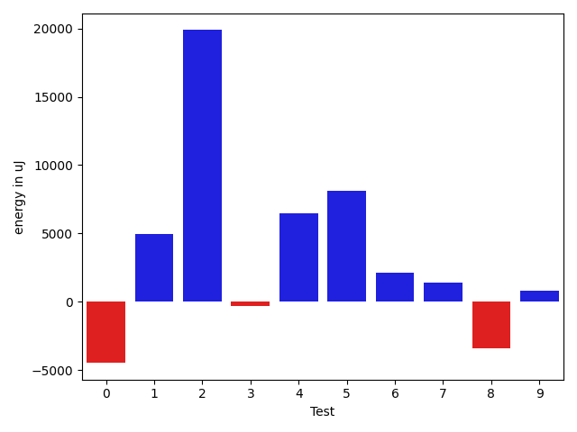

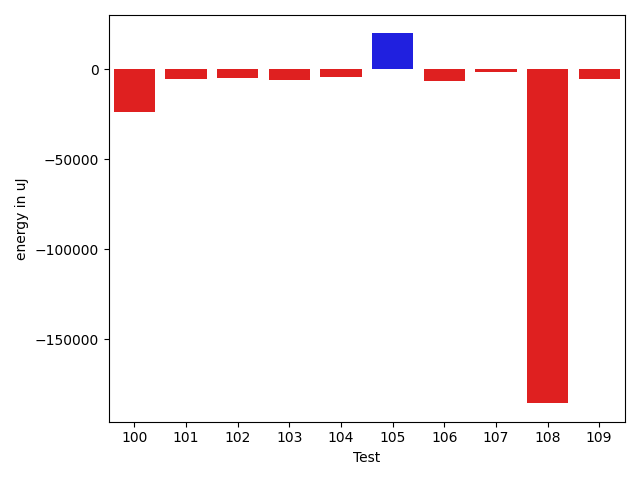

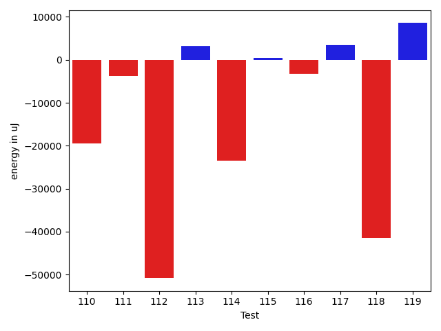

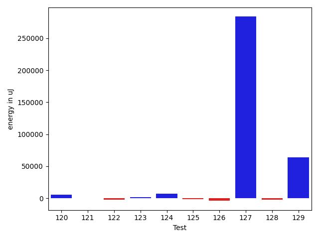

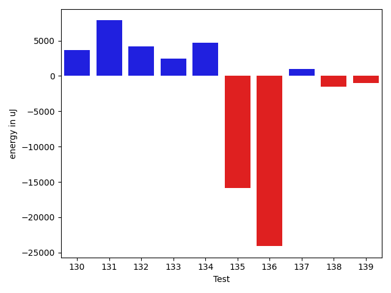

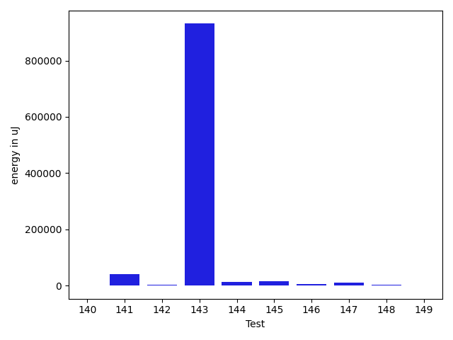

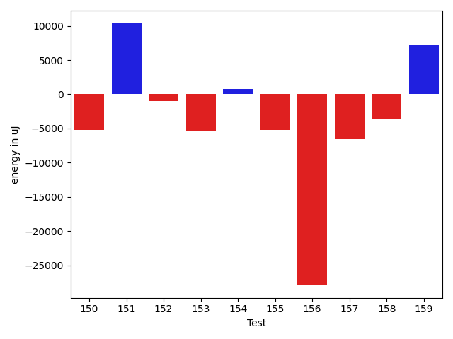

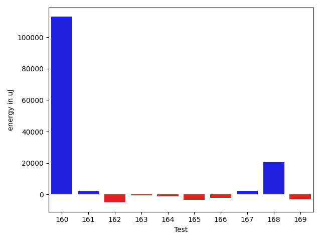

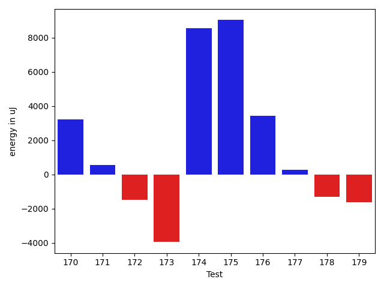

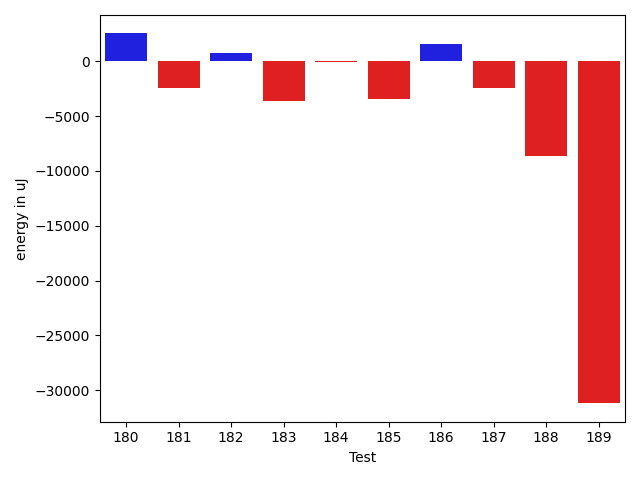

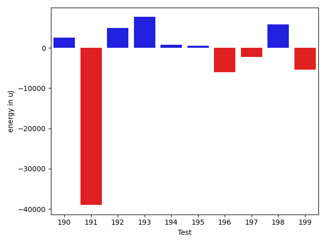

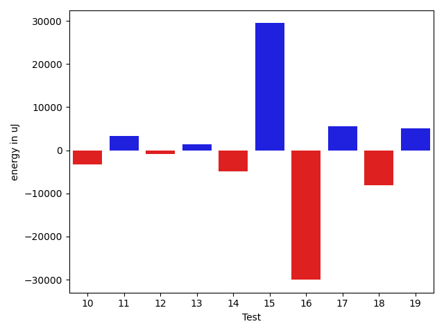

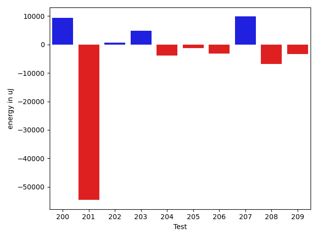

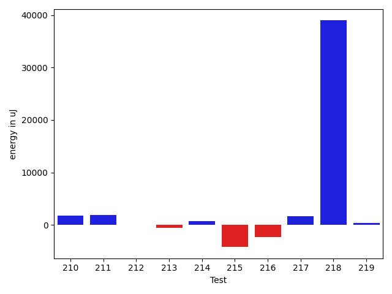

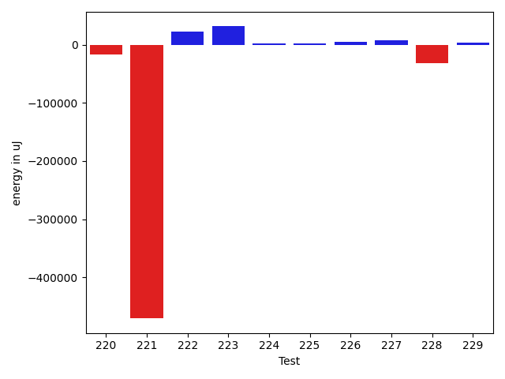

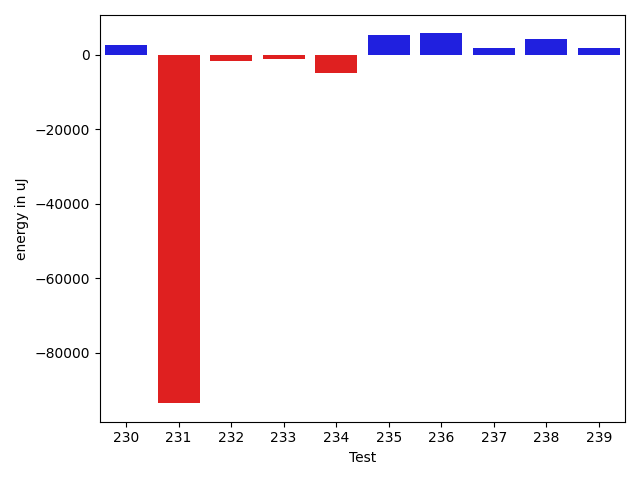

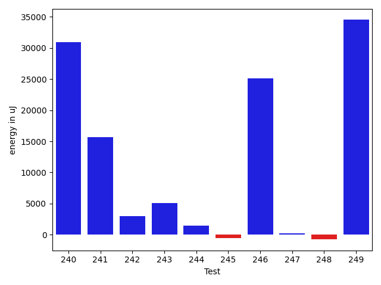

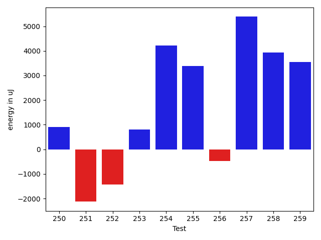

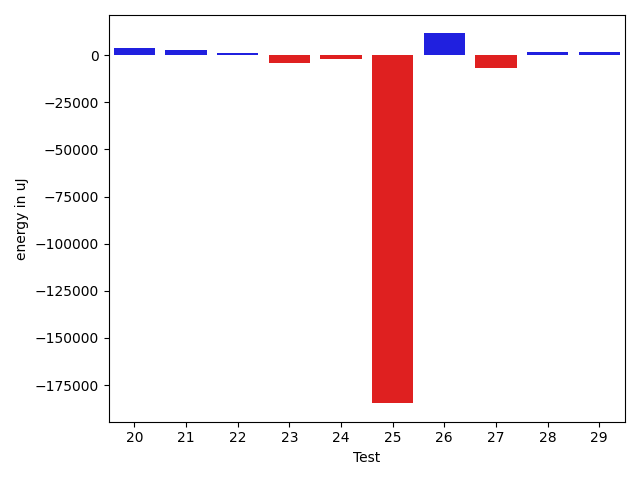

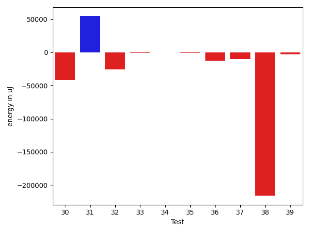

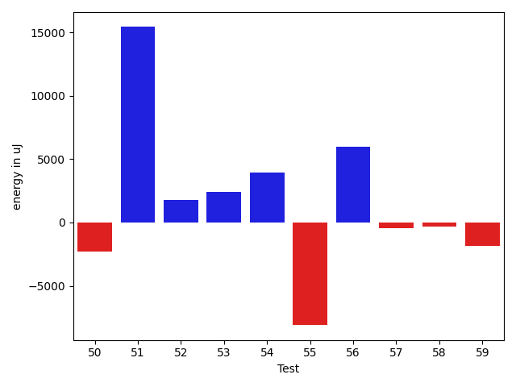

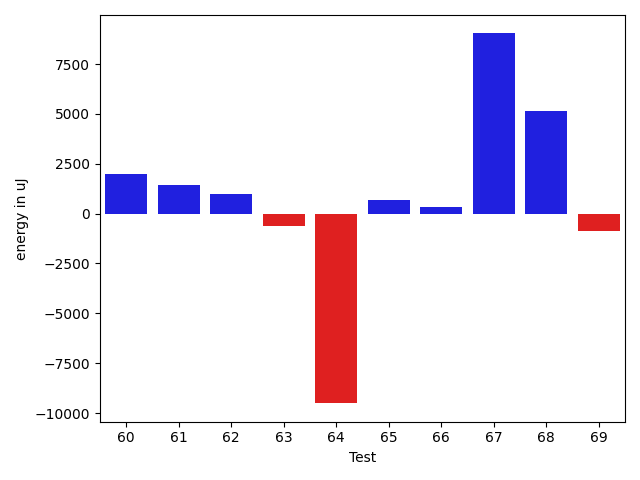

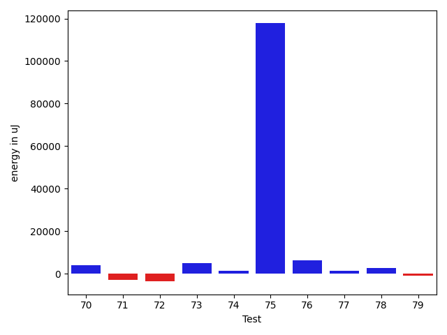

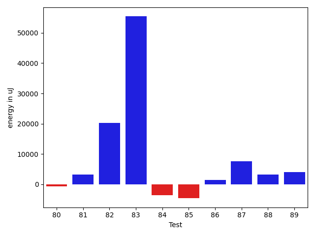

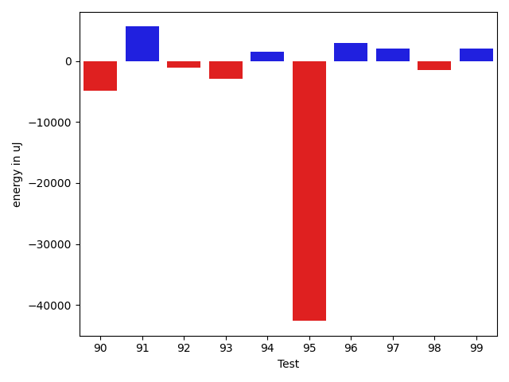

| ID | EnergyV1 | EnergyV2 | DeltaEnergy |
| --- | --- | --- | --- |
| 0 | 43496.31091415291 | 39025.51869406069 | -4470.792220092226 |
| 1 | 35195.26220703125 | 40180.56912231445 | 4985.306915283203 |
| 2 | 42017.24312020838 | 61892.85620751092 | 19875.61308730254 |
| 3 | 40934.848741873444 | 40606.38614456175 | -328.46259731169266 |
| 4 | 39694.91188704118 | 46180.38263804704 | 6485.470751005865 |
| 5 | 42534.7371704065 | 50629.20686982572 | 8094.46969941922 |
| 6 | 39526.94702320272 | 41658.33370393882 | 2131.3866807360973 |
| 7 | 37446.668040275574 | 38836.55993652344 | 1389.8918962478638 |
| 8 | 38337.449605213944 | 34902.86009864509 | -3434.589506568853 |
| 9 | 41504.35119628906 | 42316.645111083984 | 812.2939147949219 |
| 10 | 44047.529052734375 | 40677.32844543457 | -3370.2006072998047 |
| 11 | 32968.82618208621 | 36206.185409599115 | 3237.359227512905 |
| 12 | 45453.43809437443 | 44618.28237209093 | -835.1557222835036 |
| 13 | 46266.402199498385 | 47638.99115039059 | 1372.5889508922046 |
| 14 | 40468.227871095674 | 35600.15134498224 | -4868.076526113437 |
| 15 | 39425.76027008264 | 68871.10383118218 | 29445.343561099537 |
| 16 | 123483.31509345499 | 93449.12035117309 | -30034.194742281907 |
| 17 | 34926.324011638 | 40484.112823323936 | 5557.788811685939 |
| 18 | 80309.5727008257 | 72180.46032522406 | -8129.112375601631 |
| 19 | 35845.310362399956 | 40874.86086977804 | 5029.5505073780805 |
| 20 | 38243.25654257614 | 41860.69643735312 | 3617.4398947769805 |
| 21 | 38419.05833370154 | 41431.777868895224 | 3012.7195351936825 |
| 22 | 40923.831063155216 | 41977.43247182603 | 1053.6014086708165 |
| 23 | 42596.95128367655 | 38216.66077633123 | -4380.290507345322 |
| 24 | 37475.5161230433 | 35590.12402669706 | -1885.392096346237 |
| 25 | 600372.3067409652 | 415715.2688490259 | -184657.03789193934 |
| 26 | 31038.278647393112 | 42570.01739828383 | 11531.73875089072 |
| 27 | 46292.45469469174 | 39561.24929111801 | -6731.205403573731 |
| 28 | 32007.27158727462 | 33838.47189618088 | 1831.2003089062637 |
| 29 | 37257.85986328125 | 39221.59813404083 | 1963.7382707595825 |
| 30 | 88298.62730263732 | 46773.279281379655 | -41525.34802125767 |
| 31 | 249721.8934131643 | 304202.317427268 | 54480.424014103715 |
| 32 | 239793.49340699983 | 214466.85846686835 | -25326.63494013148 |
| 33 | 42810.43547793731 | 41706.79203189022 | -1103.6434460470919 |
| 34 | 41669.741836720976 | 41637.31345725377 | -32.42837946720829 |
| 35 | 41716.93087500334 | 41119.37710684538 | -597.553768157959 |
| 36 | 54511.374584046964 | 42192.28429673381 | -12319.090287313156 |
| 37 | 50757.895881488206 | 40175.642069000736 | -10582.25381248747 |
| 38 | 261060.3492935024 | 44890.28353812142 | -216170.065755381 |
| 39 | 43893.14902985579 | 40933.77623730029 | -2959.3727925554995 |
| 40 | 47155.09257990145 | 42398.979131519794 | -4756.113448381657 |
| 41 | 43025.43531918526 | 42963.1497310102 | -62.285588175058365 |
| 42 | 40583.33728425627 | 48864.84286028351 | 8281.505576027244 |
| 43 | 37360.16811496089 | 46649.70480938804 | 9289.536694427145 |
| 44 | 36247.19018052726 | 39102.186076143546 | 2854.995895616288 |
| 45 | 45085.52830805807 | 49438.57894564999 | 4353.050637591921 |
| 46 | 42430.599396511236 | 46174.59631096086 | 3743.996914449621 |
| 47 | 37003.00538472089 | 49305.21614452855 | 12302.210759807662 |
| 48 | 38083.52138566971 | 40383.25601257384 | 2299.73462690413 |
| 49 | 36771.88725029781 | 41672.07382529476 | 4900.186574996951 |
| 50 | 39440.012738744466 | 37142.89955463228 | -2297.1131841121896 |
| 51 | 48344.11611789586 | 63765.49485069701 | 15421.378732801153 |
| 52 | 36994.270175217884 | 38784.753709584475 | 1790.483534366591 |
| 53 | 33925.778824567795 | 36312.31742700189 | 2386.5386024340987 |
| 54 | 35498.171391907104 | 39464.34978429061 | 3966.178392383503 |
| 55 | 46087.79466533661 | 37992.18327173591 | -8095.611393600702 |
| 56 | 36901.98729604142 | 42872.00237899829 | 5970.0150829568665 |
| 57 | 38188.89614374506 | 37733.92633229044 | -454.9698114546263 |
| 58 | 39940.51110458374 | 39637.22332786769 | -303.2877767160535 |
| 59 | 40908.103064340976 | 39030.71156025113 | -1877.3915040898428 |
| 60 | 36368.4266341967 | 38367.35858730712 | 1998.9319531104193 |
| 61 | 35588.09295320511 | 37022.11371229653 | 1434.0207590914215 |
| 62 | 40826.30057442188 | 41798.58818752691 | 972.2876131050289 |
| 63 | 39750.1895904541 | 39132.88776574959 | -617.3018247045111 |
| 64 | 44311.58694221079 | 34801.384309887886 | -9510.202632322907 |
| 65 | 37316.424665316714 | 37998.73236447572 | 682.307699159006 |
| 66 | 38562.13027839985 | 38911.92376848654 | 349.7934900866894 |
| 67 | 50752.71231923475 | 59783.36206473522 | 9030.649745500472 |
| 68 | 36956.81026002648 | 42098.13846155146 | 5141.328201524979 |
| 69 | 40997.85738372803 | 40120.45486983657 | -877.4025138914585 |
| 70 | 35822.60144838724 | 39898.40035188384 | 4075.7989034966013 |
| 71 | 42044.6545971082 | 39243.40590632353 | -2801.2486907846687 |
| 72 | 44021.9952173233 | 40443.070499420166 | -3578.924717903137 |
| 73 | 33228.659660339355 | 38131.212017059326 | 4902.552356719971 |
| 74 | 41380.113410618156 | 42814.721584216226 | 1434.6081735980697 |
| 75 | 50095.57894720067 | 167811.16479014605 | 117715.58584294538 |
| 76 | 35218.7217015028 | 41677.83753505679 | 6459.115833553988 |
| 77 | 39277.759314823896 | 40728.42938178778 | 1450.6700669638813 |
| 78 | 39452.018943071365 | 42335.197140693665 | 2883.178197622299 |
| 79 | 39902.40077209473 | 38954.7419128418 | -947.6588592529297 |
| 80 | 39868.99521142244 | 39237.83578392095 | -631.1594275014941 |
| 81 | 36916.84206786752 | 40114.03043340682 | 3197.188365539303 |
| 82 | 39860.21496582031 | 60201.106528759 | 20340.89156293869 |
| 83 | 110542.3782054094 | 165957.45167898686 | 55415.07347357746 |
| 84 | 44203.747451526695 | 40612.78484233399 | -3590.9626091927057 |
| 85 | 45327.156148009 | 40721.712038254365 | -4605.444109754637 |
| 86 | 40883.74622761063 | 42241.77682949363 | 1358.0306018830015 |
| 87 | 36728.40753034685 | 44326.043032814865 | 7597.635502468016 |
| 88 | 37859.4053625666 | 41021.23354399047 | 3161.8281814238726 |
| 89 | 35184.81945556402 | 39291.28440665826 | 4106.46495109424 |
| 90 | 48105.93499417348 | 43231.963096243766 | -4873.971897929718 |
| 91 | 41413.03819530861 | 47019.08050626611 | 5606.042310957499 |
| 92 | 43290.97664414962 | 42240.89763064873 | -1050.0790135008865 |
| 93 | 46188.38566896826 | 43234.72891482616 | -2953.6567541420955 |
| 94 | 39775.77809202144 | 41213.78697906788 | 1438.0088870464388 |
| 95 | 93353.81080134364 | 50775.974200868324 | -42577.83660047532 |
| 96 | 38267.53124523163 | 41174.08977651596 | 2906.5585312843323 |
| 97 | 39205.17409145832 | 41273.84702014923 | 2068.6729286909103 |
| 98 | 41347.44037693869 | 39907.005952674655 | -1440.4344242640364 |
| 99 | 37913.77052894365 | 39997.61193585557 | 2083.8414069119244 |
| 100 | 66189.72763822043 | 42563.613328626205 | -23626.114309594224 |
| 101 | 41024.125615119934 | 35790.0326461792 | -5234.092968940735 |
| 102 | 38713.50148010254 | 33801.51467514038 | -4911.986804962158 |
| 103 | 64434.76530302936 | 58817.11199913416 | -5617.653303895197 |
| 104 | 40893.71466521602 | 36392.25657497654 | -4501.458090239481 |
| 105 | 55498.948823018865 | 75471.36627665012 | 19972.417453631257 |
| 106 | 45148.331451207894 | 38496.74838102492 | -6651.583070182976 |
| 107 | 42939.76495361328 | 41278.22607366741 | -1661.5388799458742 |
| 108 | 276743.667487744 | 91101.41004173276 | -185642.25744601124 |
| 109 | 47173.14698285737 | 42064.26919463252 | -5108.877788224847 |
| 110 | 58477.01103365561 | 38943.98144335518 | -19533.02959030043 |
| 111 | 39592.771250084814 | 35831.67278805938 | -3761.098462025431 |
| 112 | 113182.10952860504 | 62393.111895697075 | -50788.997632907965 |
| 113 | 35462.14932201803 | 38591.76330176368 | 3129.6139797456563 |
| 114 | 82769.51711690734 | 59254.92422677796 | -23514.59289012938 |
| 115 | 36927.69733371321 | 37327.25576664536 | 399.55843293215 |
| 116 | 41503.07242699763 | 38303.196519460085 | -3199.875907537542 |
| 117 | 38299.542845918724 | 41746.06376181076 | 3446.5209158920334 |
| 118 | 100669.84337436341 | 59207.37665835953 | -41462.46671600388 |
| 119 | 36152.116276734945 | 44686.47989966461 | 8534.363622929668 |
| 120 | 38650.919967648835 | 44291.39375629866 | 5640.473788649826 |
| 121 | 36352.95721972079 | 36570.839925499735 | 217.88270577894582 |
| 122 | 37583.9927164641 | 35737.56932883356 | -1846.423387630537 |
| 123 | 38867.84148742045 | 40904.60463381595 | 2036.7631463954967 |
| 124 | 36583.128138789354 | 43458.145919408424 | 6875.0177806190695 |
| 125 | 45601.87027172664 | 44608.070385203755 | -993.7998865228874 |
| 126 | 42323.61663769404 | 38463.864643283305 | -3859.7519944107335 |
| 127 | 48118.45812499143 | 331894.9022848364 | 283776.44415984495 |
| 128 | 39684.6791767478 | 37770.90938973427 | -1913.7697870135307 |
| 129 | 104149.1203028305 | 168325.27739386837 | 64176.157091037865 |
| 130 | 38499.37135491239 | 42177.39665715312 | 3678.025302240727 |
| 131 | 38249.35188329873 | 46113.35521790978 | 7864.00333461105 |
| 132 | 37385.79066061937 | 41589.516812422415 | 4203.726151803043 |
| 133 | 38380.16731080387 | 40873.600974784626 | 2493.433663980759 |
| 134 | 36662.568556202124 | 41378.13258865047 | 4715.564032448347 |
| 135 | 65142.50516494354 | 49278.15884854611 | -15864.34631639743 |
| 136 | 66200.90191218746 | 42106.97168758924 | -24093.930224598218 |
| 137 | 40315.43626173405 | 41303.235608170886 | 987.7993464368337 |
| 138 | 44056.432802517076 | 42524.77136795117 | -1531.6614345659036 |
| 139 | 41949.17669599749 | 40976.17440254444 | -973.0022934530498 |
| 140 | 40410.695463717486 | 40224.87091694365 | -185.82454677383794 |
| 141 | 45391.95849090383 | 85346.08731093179 | 39954.12882002796 |
| 142 | 36958.928451768275 | 38803.04716696774 | 1844.1187151994673 |
| 143 | 88796.44810345957 | 1019956.868735596 | 931160.4206321364 |
| 144 | 37311.429043158845 | 51209.0468047242 | 13897.617761565358 |
| 145 | 205466.08211534985 | 221717.2012363267 | 16251.119120976859 |
| 146 | 37921.88101632668 | 42914.80042624194 | 4992.919409915259 |
| 147 | 36070.03984597236 | 46860.46698631782 | 10790.427140345462 |
| 148 | 37007.05172081809 | 39466.858256103136 | 2459.8065352850463 |
| 149 | 37665.7138032832 | 39093.288562508475 | 1427.5747592252737 |
| 150 | 40623.60150516033 | 35441.24285889231 | -5182.358646268025 |
| 151 | 42251.80804760847 | 52571.23702350259 | 10319.428975894116 |
| 152 | 37575.71738378724 | 36632.21604866005 | -943.5013351271919 |
| 153 | 40710.74603747227 | 35397.508553977066 | -5313.237483495206 |
| 154 | 36684.59667202423 | 37440.61470356956 | 756.0180315453326 |
| 155 | 44905.92000399181 | 39713.10852385634 | -5192.811480135468 |
| 156 | 116120.33563068383 | 88273.10328928039 | -27847.232341403433 |
| 157 | 44670.622192767565 | 38109.581704760145 | -6561.04048800742 |
| 158 | 39138.15162905678 | 35589.60559053067 | -3548.5460385261104 |
| 159 | 36321.29551720619 | 43532.59705924988 | 7211.301542043686 |
| 160 | 40253.09868205123 | 153223.41970355526 | 112970.32102150403 |
| 161 | 37782.91555714607 | 39754.51701426506 | 1971.601457118988 |
| 162 | 41680.500934211246 | 36585.99327043809 | -5094.5076637731545 |
| 163 | 39125.897949263206 | 38731.12211540021 | -394.77583386299375 |
| 164 | 36899.89775433019 | 35732.38488801196 | -1167.5128663182259 |
| 165 | 37936.59231125377 | 34548.43677330017 | -3388.1555379536003 |
| 166 | 35794.31604229191 | 33671.31092543248 | -2123.005116859429 |
| 167 | 36839.110722526995 | 39017.242015173164 | 2178.1312926461687 |
| 168 | 37842.562411770225 | 58231.98115855234 | 20389.418746782118 |
| 169 | 35875.28995681554 | 32748.598465668605 | -3126.6914911469357 |
| 170 | 33364.329999988826 | 36565.836023335716 | 3201.5060233468903 |
| 171 | 36437.78958465904 | 36989.86942726001 | 552.0798426009715 |
| 172 | 39977.25445401203 | 38493.48017448187 | -1483.7742795301601 |
| 173 | 41543.00236079097 | 37589.39605917921 | -3953.606301611755 |
| 174 | 40008.99607269301 | 48566.00390544517 | 8557.007832752162 |
| 175 | 36493.514761805534 | 45514.45753479004 | 9020.942772984505 |
| 176 | 38447.127660274506 | 41859.375953793526 | 3412.24829351902 |
| 177 | 36555.551921233535 | 36816.63727737364 | 261.0853561401018 |
| 178 | 40240.197486880905 | 38932.58527117193 | -1307.6122157089776 |
| 179 | 38675.3328606251 | 37057.22214989483 | -1618.1107107302741 |
| 180 | 37578.194580296986 | 40116.44695873148 | 2538.2523784344958 |
| 181 | 39558.27278519052 | 37082.593845162235 | -2475.678940028287 |
| 182 | 39938.07641898769 | 40705.784219066874 | 767.7078000791807 |
| 183 | 48038.16567837261 | 44411.588851988316 | -3626.576826384291 |
| 184 | 38410.04662963003 | 38390.25552922487 | -19.791100405156612 |
| 185 | 40264.36202507466 | 36829.800679592416 | -3434.561345482245 |
| 186 | 39777.6570892334 | 41327.5047454834 | 1549.84765625 |
| 187 | 41481.718018423046 | 39047.024985831085 | -2434.69303259196 |
| 188 | 319014.61865628336 | 310375.5891396714 | -8639.029516611947 |
| 189 | 337670.4285204741 | 306483.16286268854 | -31187.26565778558 |
| 190 | 42234.813341597954 | 44732.63932704164 | 2497.8259854436837 |
| 191 | 83016.19318284356 | 44022.66048482078 | -38993.532698022784 |
| 192 | 37574.714315527 | 42527.70876802936 | 4952.99445250236 |
| 193 | 35310.39896063488 | 42944.49402285303 | 7634.095062218155 |
| 194 | 40006.56467873313 | 40807.62610933732 | 801.0614306041898 |
| 195 | 40627.04715291514 | 41147.06045980047 | 520.013306885332 |
| 196 | 49022.177864048084 | 42937.23926496453 | -6084.938599083551 |
| 197 | 45536.16809280954 | 43323.753062062795 | -2212.4150307467426 |
| 198 | 39474.16935280709 | 45259.92363615099 | 5785.7542833439 |
| 199 | 49754.79881605806 | 44365.934875773004 | -5388.863940285053 |
| 200 | 218515.64993646403 | 227912.5036085292 | 9396.853672065161 |
| 201 | 151931.52708297188 | 97315.15498785034 | -54616.37209512154 |
| 202 | 40607.394347758775 | 41277.45623635756 | 670.061888598786 |
| 203 | 37807.99662201691 | 42586.5249467317 | 4778.528324714789 |
| 204 | 86972.89572586349 | 83138.74437848062 | -3834.1513473828672 |
| 205 | 42867.70944287018 | 41554.68269148448 | -1313.0267513857034 |
| 206 | 41650.5977028532 | 38407.153411346735 | -3243.4442915064647 |
| 207 | 33047.172414867906 | 42839.90241675079 | 9792.730001882883 |
| 208 | 48238.69830062702 | 41432.59342820989 | -6806.104872417127 |
| 209 | 43704.07108524442 | 40312.84950511623 | -3391.2215801281855 |
| 210 | 42089.84468903832 | 43911.69055825472 | 1821.8458692163986 |
| 211 | 38153.104373101974 | 40077.76293476325 | 1924.658561661272 |
| 212 | 38887.77937507017 | 38958.10448771 | 70.32511263983179 |
| 213 | 40480.6088353025 | 39935.538893640536 | -545.0699416619609 |
| 214 | 40255.7255081192 | 40999.43357586028 | 743.708067741085 |
| 215 | 43541.47607021092 | 39346.85093873184 | -4194.625131479079 |
| 216 | 42939.326046798786 | 40656.694164556466 | -2282.63188224232 |
| 217 | 40898.724228758016 | 42618.514381777495 | 1719.7901530194795 |
| 218 | 46329.65470154921 | 85301.42806159586 | 38971.773360046645 |
| 219 | 41451.77669326542 | 41887.05341255665 | 435.2767192912288 |
| 220 | 59051.52220293647 | 42483.74700206518 | -16567.775200871285 |
| 221 | 562272.8529573885 | 91451.91572125342 | -470820.93723613507 |
| 222 | 37994.414111595164 | 61201.954923182486 | 23207.54081158732 |
| 223 | 44009.33191787677 | 75527.7205864315 | 31518.388668554733 |
| 224 | 38056.91565705644 | 40799.014991701915 | 2742.099334645478 |
| 225 | 42890.89631104663 | 45352.244884968764 | 2461.348573922136 |
| 226 | 37874.68517781983 | 43309.14272281679 | 5434.457544996956 |
| 227 | 32309.817645760253 | 40152.68535339832 | 7842.86770763807 |
| 228 | 74200.73941614488 | 43146.22653778676 | -31054.512878358117 |
| 229 | 41477.55218197989 | 44782.85764114183 | 3305.305459161944 |
| 230 | 36345.10358443408 | 39021.31538941941 | 2676.2118049853307 |
| 231 | 191279.30639735766 | 97651.73238413184 | -93627.57401322582 |
| 232 | 39623.627146426195 | 38010.22756473422 | -1613.3995816919778 |
| 233 | 39526.37817722559 | 38309.279878139496 | -1217.098299086094 |
| 234 | 43212.08882319927 | 38217.24164049142 | -4994.847182707854 |
| 235 | 34820.414981126785 | 40132.78588676453 | 5312.370905637741 |
| 236 | 36359.11463165283 | 42059.31497454643 | 5700.2003428936005 |
| 237 | 38908.905088722706 | 40766.571745187044 | 1857.6666564643383 |
| 238 | 34303.94833725691 | 38405.62940907478 | 4101.681071817875 |
| 239 | 35071.82601928711 | 36952.35351336002 | 1880.5274940729141 |
| 240 | 94428.45446204551 | 125336.74132973183 | 30908.286867686315 |
| 241 | 67505.87238395624 | 83206.07522072078 | 15700.20283676454 |
| 242 | 38916.985900205866 | 41865.02587290376 | 2948.039972697894 |
| 243 | 38178.54291957617 | 43288.84447870497 | 5110.3015591287985 |
| 244 | 37482.31620856421 | 38917.79627324579 | 1435.4800646815784 |
| 245 | 39797.995117428036 | 39263.12329048937 | -534.8718269386663 |
| 246 | 49182.13557801023 | 74320.69698794928 | 25138.56140993905 |
| 247 | 39983.07172346115 | 40237.8093241239 | 254.73760066274554 |
| 248 | 42072.30301766755 | 41324.09260961809 | -748.210408049461 |
| 249 | 42085.52417542921 | 76588.94854339832 | 34503.42436796911 |
| 250 | 41980.43598493218 | 42886.98484795893 | 906.54886302675 |
| 251 | 49755.75489224796 | 47629.35620093478 | -2126.398691313181 |
| 252 | 42378.53877713476 | 40952.186885622956 | -1426.3518915118038 |
| 253 | 39812.94189866152 | 40625.97511462274 | 813.0332159612226 |
| 254 | 38534.34462448716 | 42744.932330651776 | 4210.587706164617 |
| 255 | 40200.03339357764 | 43593.71425986085 | 3393.6808662832045 |
| 256 | 38190.86770629883 | 37706.96459387243 | -483.9031124264002 |
| 257 | 36121.55284936001 | 41508.62454534279 | 5387.071695982784 |
| 258 | 38066.27339850009 | 41992.465618399525 | 3926.192219899436 |
| 259 | 40382.218452610075 | 43930.455905849696 | 3548.2374532396207 |

## Delta Duration per test method

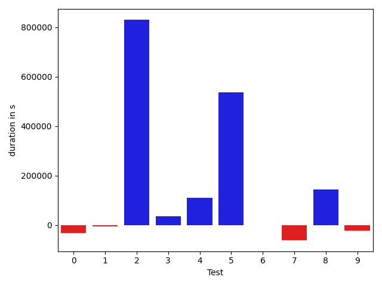

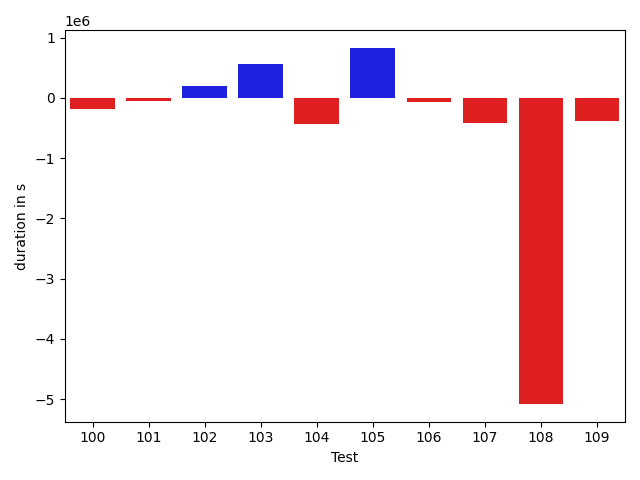

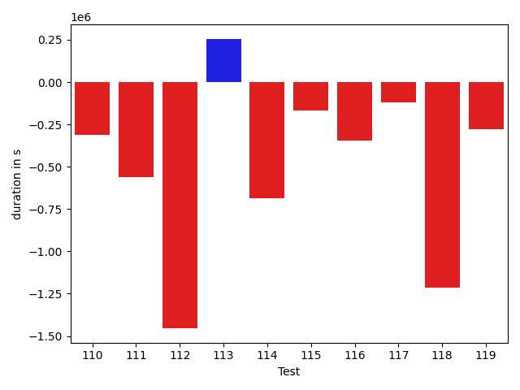

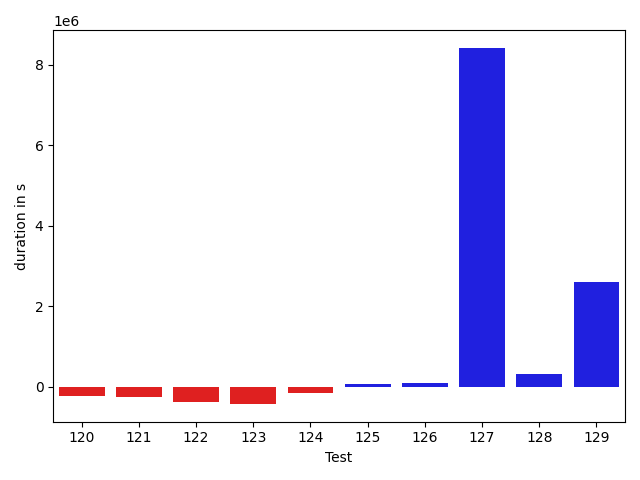

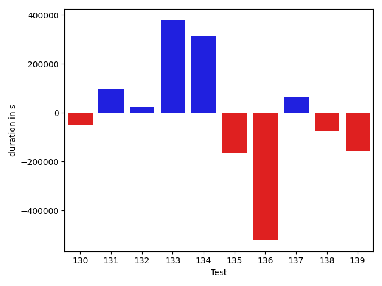

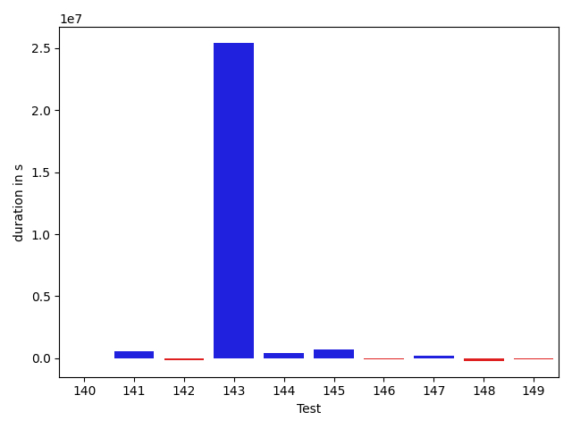

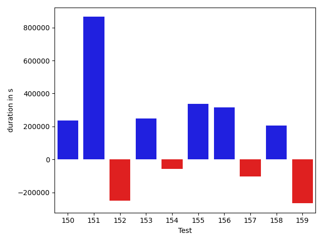

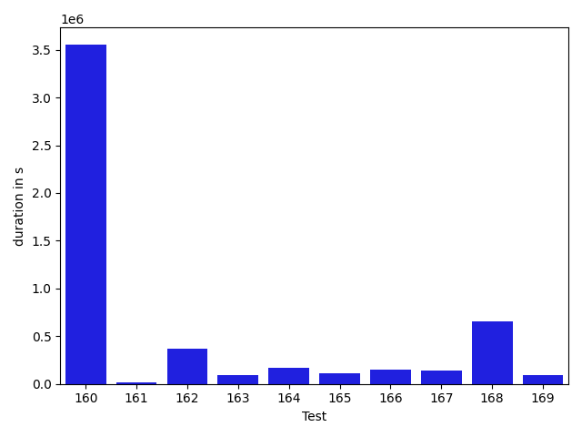

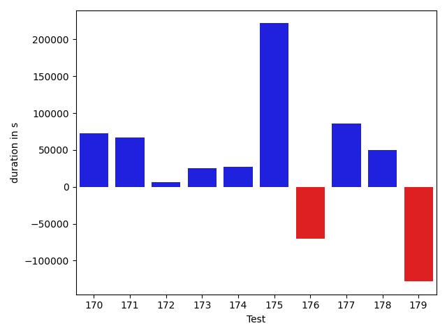

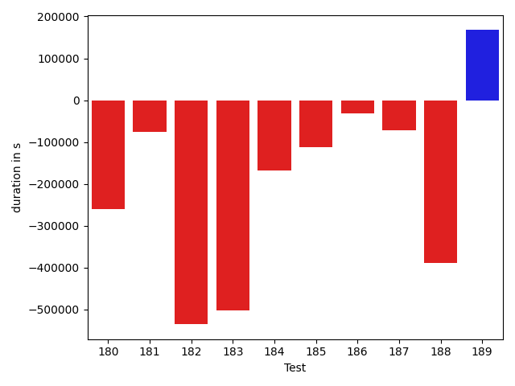

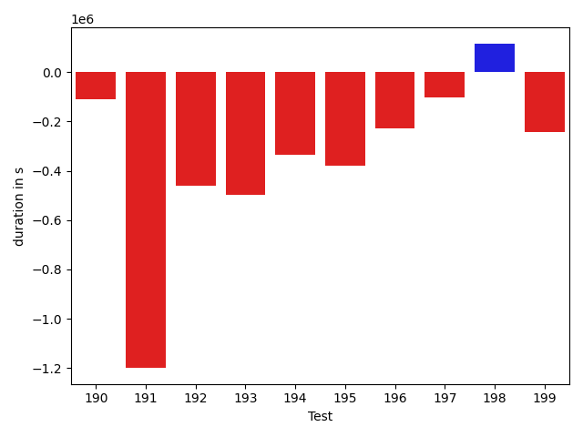

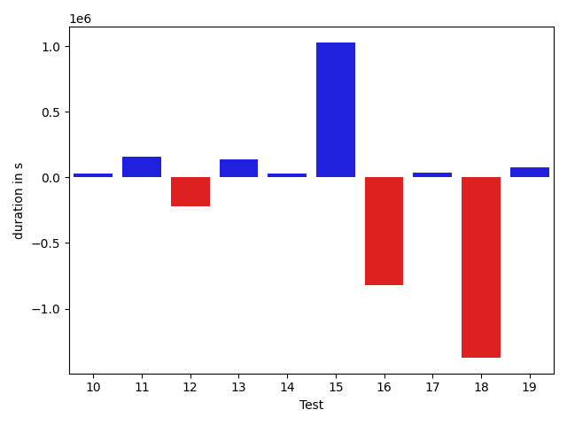

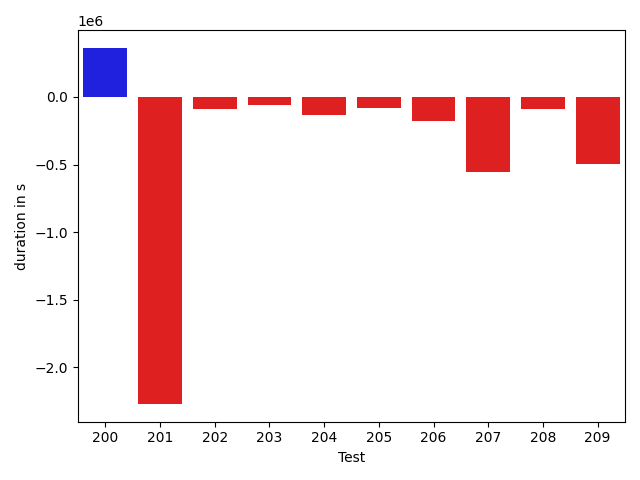

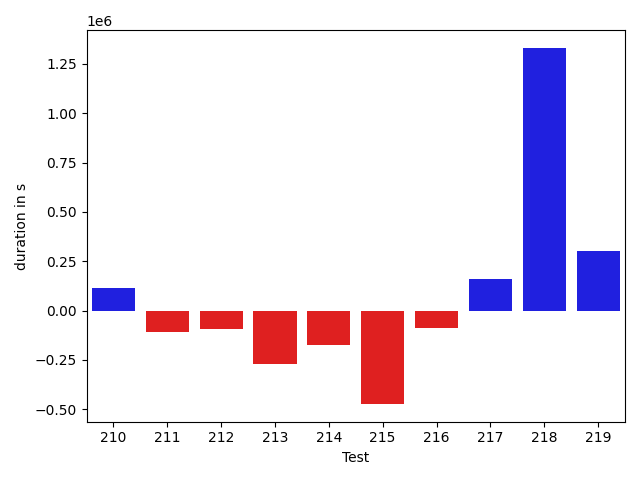

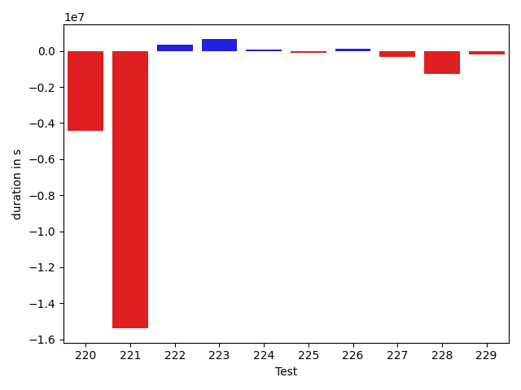

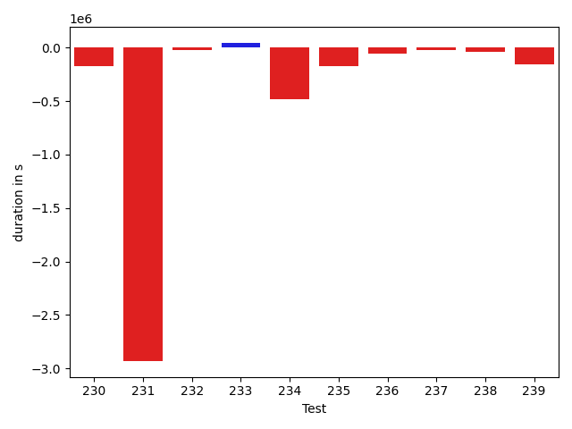

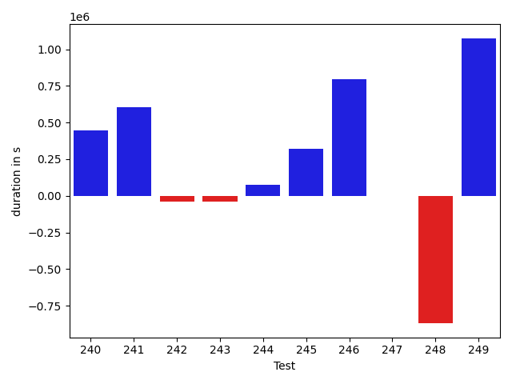

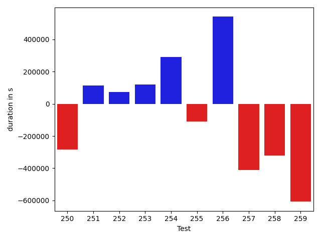

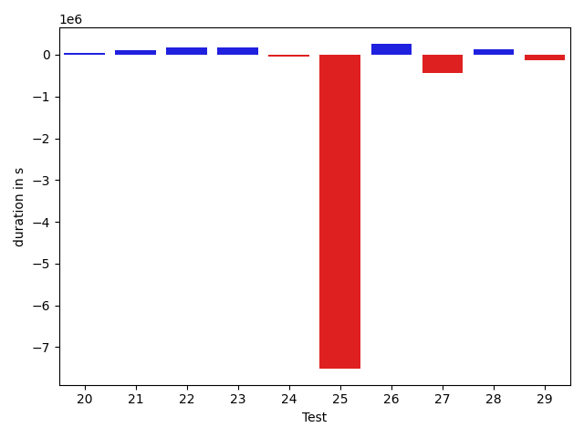

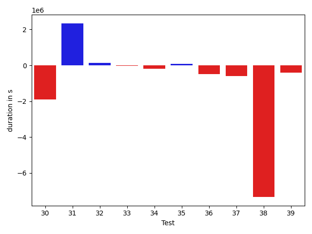

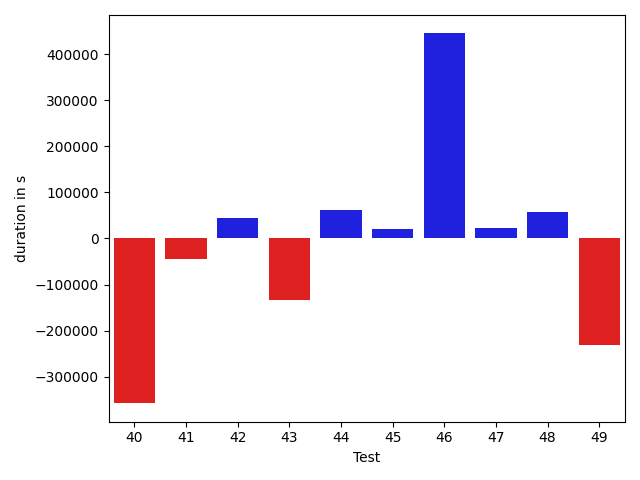

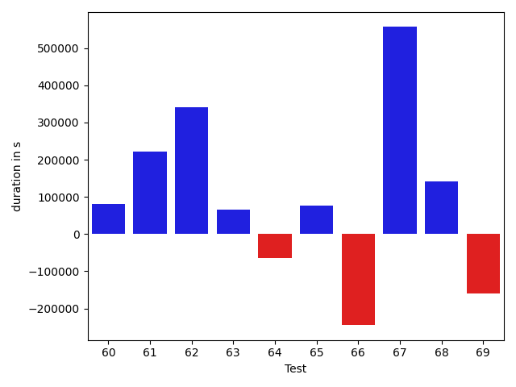

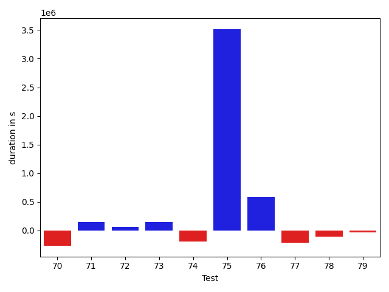

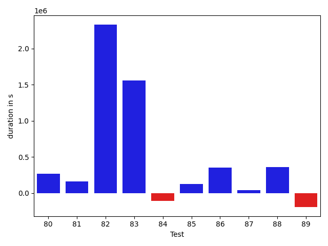

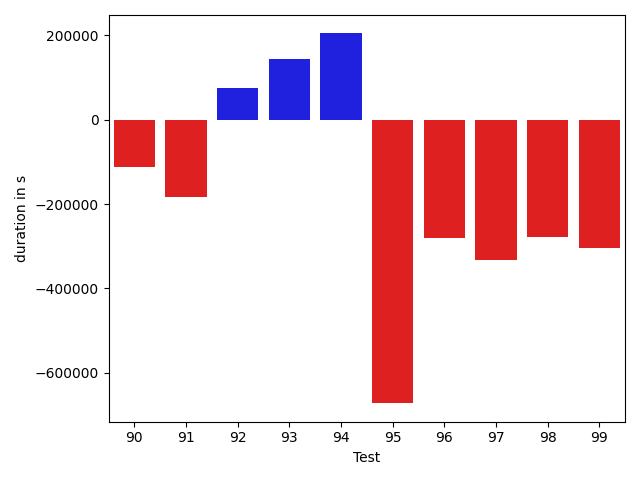

| ID | DurationV1 | DurationsV2 | DeltaDuration |
| --- | --- | --- | --- |
| 0 | 1026589.2678980937 | 995219.7109188448 | -31369.556979248882 |
| 1 | 374117.8123779297 | 368352.76849365234 | -5765.043884277344 |
| 2 | 537323.9466768596 | 1366417.9442562384 | 829093.9975793788 |
| 3 | 963247.8866361219 | 999357.1564529326 | 36109.26981681073 |
| 4 | 741644.5129941222 | 851441.1264157282 | 109796.61342160602 |
| 5 | 762669.1188488298 | 1299651.3333973028 | 536982.214548473 |
| 6 | 646185.2222606102 | 645380.4844419669 | -804.7378186433343 |
| 7 | 359607.93326330185 | 298805.5583496094 | -60802.374913692474 |
| 8 | 626904.755682203 | 770730.073010996 | 143825.317328793 |
| 9 | 432931.26171875 | 411496.689453125 | -21434.572265625 |
| 10 | 344854.68505859375 | 372225.9585723877 | 27371.273513793945 |
| 11 | 791416.2493625719 | 951935.9044069605 | 160519.6550443886 |
| 12 | 1020338.5451551776 | 801817.897496029 | -218520.64765914856 |
| 13 | 1424879.7623217348 | 1562677.2929312584 | 137797.53060952364 |
| 14 | 858483.573833049 | 885984.5733413303 | 27500.99950828124 |
| 15 | 1111488.268216816 | 2138992.594752264 | 1027504.3265354482 |
| 16 | 3653992.169637955 | 2836745.409139133 | -817246.7604988217 |
| 17 | 1261882.1798373992 | 1298429.9482385668 | 36547.76840116759 |
| 18 | 3028555.068834318 | 1655451.2754824727 | -1373103.7933518451 |
| 19 | 1019433.6457306127 | 1094104.0954071772 | 74670.44967656455 |
| 20 | 1394315.598230629 | 1427948.5647334687 | 33632.9665028397 |
| 21 | 512684.12593793264 | 621171.8922035951 | 108487.7662656625 |
| 22 | 624148.2581312202 | 788542.5590844573 | 164394.3009532371 |
| 23 | 494676.9110539742 | 658582.621163893 | 163905.71010991884 |
| 24 | 913512.0140988668 | 872267.3975124172 | -41244.61658644967 |
| 25 | 17385603.633475825 | 9872961.440752422 | -7512642.192723403 |
| 26 | 971025.3084855382 | 1233727.2962715249 | 262701.9877859866 |
| 27 | 1452803.764573236 | 1015756.259716662 | -437047.504856574 |
| 28 | 462801.78784333833 | 592677.8371233399 | 129876.04928000155 |
| 29 | 542390.3366699219 | 411426.95041537285 | -130963.38625454903 |
| 30 | 2687164.79960783 | 785477.1409156416 | -1901687.6586921886 |
| 31 | 5737016.289973477 | 8077911.393765446 | 2340895.103791969 |
| 32 | 5481381.264179929 | 5607578.340286443 | 126197.07610651385 |
| 33 | 656077.799332036 | 631099.6426017985 | -24978.156730237533 |
| 34 | 655441.5394262297 | 476549.01317538944 | -178892.52625084022 |
| 35 | 594862.2677524984 | 673383.9566033334 | 78521.68885083497 |
| 36 | 1268586.0896756435 | 787809.2919712681 | -480776.79770437535 |
| 37 | 1378868.8275557933 | 792754.7198343099 | -586114.1077214835 |
| 38 | 8640097.723827055 | 1298140.9159902914 | -7341956.807836764 |
| 39 | 1308746.292952173 | 893909.8767822548 | -414836.41616991814 |
| 40 | 899928.76568475 | 542051.029741481 | -357877.7359432691 |
| 41 | 482546.266261518 | 436872.8193284273 | -45673.44693309069 |
| 42 | 1338538.8310503368 | 1383183.2284997036 | 44644.39744936675 |
| 43 | 1070324.669056531 | 936532.7641325191 | -133791.9049240119 |
| 44 | 854979.9285184566 | 917756.2142747161 | 62776.28575625946 |
| 45 | 1560067.2971703056 | 1580674.150229533 | 20606.853059227346 |
| 46 | 845269.4949530592 | 1290449.129047928 | 445179.63409486867 |
| 47 | 868094.976782839 | 890361.4939933822 | 22266.517210543156 |
| 48 | 610057.5118048191 | 667690.9541037902 | 57633.44229897112 |
| 49 | 1036014.9225189423 | 805122.3938941492 | -230892.52862479305 |
| 50 | 1235013.990609636 | 871111.1888254737 | -363902.8017841624 |
| 51 | 1340614.0549544888 | 1580987.024017824 | 240372.96906333533 |
| 52 | 609080.509193476 | 530150.659687832 | -78929.84950564406 |
| 53 | 597642.8159818351 | 392262.6765900217 | -205380.13939181343 |
| 54 | 798448.9133447364 | 666367.56088593 | -132081.35245880648 |
| 55 | 437796.7019176483 | 386423.80037525296 | -51372.90154239535 |
| 56 | 736402.272963859 | 632468.5582294981 | -103933.71473436092 |
| 57 | 1069469.217167174 | 807793.8331331662 | -261675.3840340078 |
| 58 | 508357.0898370743 | 448238.6593509242 | -60118.430486150086 |
| 59 | 950416.3826917413 | 804696.6333703431 | -145719.7493213982 |
| 60 | 1342873.3574497607 | 1424177.8979320356 | 81304.54048227496 |
| 61 | 688932.3536535501 | 909751.43939879 | 220819.08574523986 |
| 62 | 447330.1010668874 | 788339.1781647392 | 341009.0770978518 |
| 63 | 533099.9488334656 | 597805.4684257079 | 64705.519592242315 |
| 64 | 545948.9618328363 | 481213.4698547125 | -64735.491978123784 |
| 65 | 840626.9338232573 | 916405.4137062414 | 75778.47988298407 |
| 66 | 906647.1819369139 | 662009.2708521583 | -244637.91108475556 |
| 67 | 1036056.6596344006 | 1592499.499461966 | 556442.8398275655 |
| 68 | 699545.1845983397 | 841059.4767932737 | 141514.29219493398 |
| 69 | 571059.2168712616 | 410567.8529608175 | -160491.36391044408 |
| 70 | 768118.4787705075 | 498807.81760470103 | -269310.66116580646 |
| 71 | 696154.5969906193 | 844280.5947187343 | 148125.99772811495 |
| 72 | 481054.2370028496 | 543403.0899162292 | 62348.85291337967 |
| 73 | 438573.9626235962 | 586785.6442093849 | 148211.68158578873 |
| 74 | 620523.4125151578 | 427765.9106433529 | -192757.50187180494 |
| 75 | 760361.390631303 | 4276473.9504307695 | 3516112.5597994663 |
| 76 | 466870.4000221491 | 1050457.1594980143 | 583586.7594758652 |
| 77 | 713723.458314091 | 501580.19660401344 | -212143.26171007752 |
| 78 | 539028.0227720737 | 428557.47951602936 | -110470.54325604439 |
| 79 | 459968.6673049927 | 427704.15814208984 | -32264.509162902832 |
| 80 | 676988.3480068147 | 947965.3502778974 | 270977.0022710827 |
| 81 | 537682.1611966789 | 697927.027609353 | 160244.86641267408 |
| 82 | 479032.43927001953 | 2809002.85160017 | 2329970.4123301506 |
| 83 | 2722953.1414393336 | 4279534.823197979 | 1556581.681758645 |
| 84 | 521525.18891628494 | 417184.8735940878 | -104340.31532219716 |
| 85 | 452777.70474253595 | 580026.6389186177 | 127248.93417608179 |
| 86 | 655129.5002715634 | 1007545.8685025903 | 352416.3682310269 |
| 87 | 533708.2950300372 | 574821.0305396947 | 41112.735509657534 |
| 88 | 916959.8402232225 | 1280510.0001111524 | 363550.1598879299 |
| 89 | 865784.4758648053 | 674144.3453709688 | -191640.13049383648 |
| 90 | 946630.4976183427 | 833702.6469192854 | -112927.85069905734 |
| 91 | 1027715.1472331589 | 844351.8825236581 | -183363.26470950083 |
| 92 | 974430.777864933 | 1050441.5580122909 | 76010.78014735784 |
| 93 | 914579.4126413742 | 1059081.1728792214 | 144501.76023784722 |
| 94 | 528514.1256312673 | 733056.2566835769 | 204542.13105230953 |
| 95 | 2327492.868663829 | 1654836.8102282435 | -672656.0584355853 |
| 96 | 656130.6623220444 | 375801.3389453888 | -280329.3233766556 |
| 97 | 681093.587397784 | 348018.3490612507 | -333075.2383365333 |
| 98 | 1084316.9410337163 | 806277.9277928462 | -278039.0132408701 |
| 99 | 940121.4422851909 | 634912.4104574092 | -305209.0318277817 |
| 100 | 1107280.6175430887 | 930257.569189936 | -177023.0483531527 |
| 101 | 496922.30633354187 | 443741.67628479004 | -53180.63004875183 |
| 102 | 407827.15409851074 | 611483.5941352844 | 203656.44003677368 |
| 103 | 1108252.578926037 | 1674677.6342455465 | 566425.0553195095 |
| 104 | 1008211.1523291484 | 570464.0891631624 | -437747.063165986 |
| 105 | 1100064.9886994401 | 1928441.2510898043 | 828376.2623903642 |
| 106 | 776740.4391076469 | 703361.1363517811 | -73379.30275586585 |
| 107 | 773265.8693237305 | 352686.9697713852 | -420578.8995523453 |
| 108 | 7577277.983200256 | 2499304.4218864357 | -5077973.56131382 |
| 109 | 1349778.292635114 | 966499.2513709993 | -383279.04126411467 |
| 110 | 1272028.4242026694 | 959363.8444702998 | -312664.57973236963 |
| 111 | 1400859.684370377 | 840708.9546311083 | -560150.7297392688 |
| 112 | 3230760.236070974 | 1776770.0125775365 | -1453990.2234934373 |
| 113 | 560415.88734667 | 815187.2550628334 | 254771.3677161634 |
| 114 | 2269249.8062596703 | 1580889.2611057963 | -688360.545153874 |
| 115 | 1284359.8800983508 | 1114413.7145661383 | -169946.16553221247 |
| 116 | 1460204.158821473 | 1113959.279849795 | -346244.878971678 |
| 117 | 1090768.3198745777 | 973156.3219350752 | -117611.99793950247 |
| 118 | 2937109.8730000416 | 1722015.3320275964 | -1215094.5409724452 |
| 119 | 1354987.8142770564 | 1076753.0111418308 | -278234.80313522555 |
| 120 | 1237349.8447473566 | 999432.7047840342 | -237917.13996332244 |
| 121 | 1003653.7304166621 | 738504.3079895573 | -265149.4224271048 |
| 122 | 1176369.914604095 | 798234.6509598724 | -378135.26364422264 |
| 123 | 1373056.8270663496 | 941225.6001470236 | -431831.226919326 |
| 124 | 1226555.236044628 | 1073265.1443683514 | -153290.09167627664 |
| 125 | 1206723.3854025996 | 1278756.0081994862 | 72032.6227968866 |
| 126 | 715948.111872298 | 792255.833698188 | 76307.72182589001 |
| 127 | 1087789.428214396 | 9501432.540511422 | 8413643.112297026 |
| 128 | 430837.6843944192 | 744118.1874666214 | 313280.5030722022 |
| 129 | 2258510.224205591 | 4847824.763669865 | 2589314.5394642744 |
| 130 | 771293.0260970835 | 722073.1973983899 | -49219.82869869354 |
| 131 | 638257.087516842 | 733097.5890669931 | 94840.50155015115 |
| 132 | 1106873.5747558305 | 1128624.0141087158 | 21750.439352885354 |
| 133 | 924439.0345172563 | 1304263.295869524 | 379824.2613522676 |
| 134 | 615495.0859225302 | 927652.6638257995 | 312157.5779032693 |
| 135 | 1479180.1291000708 | 1314705.6761955246 | -164474.45290454617 |
| 136 | 1364862.7823078022 | 843441.5264788731 | -521421.25582892913 |
| 137 | 1078717.5995094697 | 1146123.0435076451 | 67405.44399817544 |
| 138 | 1264877.9773100014 | 1190447.762647374 | -74430.21466262732 |
| 139 | 839302.5923934616 | 683367.8219448151 | -155934.7704486465 |
| 140 | 965838.506302814 | 919767.176887494 | -46071.32941531995 |
| 141 | 1504459.7115724576 | 2080208.6469937442 | 575748.9354212866 |
| 142 | 1074376.7126601464 | 896055.6270476866 | -178321.0856124598 |
| 143 | 3196305.930816036 | 28628837.872952417 | 25432531.94213638 |
| 144 | 1506150.4489557005 | 1896465.9765151483 | 390315.5275594478 |
| 145 | 5717218.895085245 | 6436524.785297775 | 719305.8902125293 |
| 146 | 684971.8787911601 | 567856.0683926614 | -117115.81039849867 |
| 147 | 965278.719355677 | 1153023.9060728154 | 187745.1867171384 |
| 148 | 770974.8529584011 | 538284.6274661387 | -232690.2254922624 |
| 149 | 1075900.5533447717 | 969877.5052552422 | -106023.0480895295 |
| 150 | 453097.93255218863 | 689258.8403264526 | 236160.907774264 |
| 151 | 490389.3007302685 | 1355044.5432276428 | 864655.2424973743 |
| 152 | 875706.0747963907 | 626860.6803867021 | -248845.39440968866 |
| 153 | 631650.5633792501 | 879306.0291784264 | 247655.46579917625 |
| 154 | 551456.3318090903 | 493995.39978495985 | -57460.93202413048 |
| 155 | 558311.4201377131 | 894858.1767516903 | 336546.75661397725 |
| 156 | 2383896.368513359 | 2699081.609869877 | 315185.24135651765 |
| 157 | 706551.8369537127 | 603504.9355225561 | -103046.90143115667 |
| 158 | 394158.2708119489 | 599374.5020015845 | 205216.23118963558 |
| 159 | 758404.2179105282 | 492487.1578922272 | -265917.060018301 |
| 160 | 993750.2923160736 | 4549119.741979593 | 3555369.44966352 |
| 161 | 588227.5870667696 | 603262.375426054 | 15034.788359284401 |
| 162 | 790934.8285004934 | 1155408.051782339 | 364473.2232818457 |
| 163 | 783238.6992799647 | 875288.7390801222 | 92050.03980015754 |
| 164 | 475663.2019274188 | 642917.8340722844 | 167254.63214486558 |
| 165 | 507335.31916083395 | 617140.7816700935 | 109805.46250925958 |
| 166 | 753608.9138528644 | 906310.5031682525 | 152701.58931538812 |
| 167 | 775910.5017464869 | 919482.9198853753 | 143572.41813888843 |
| 168 | 691590.6021220163 | 1346196.8487913532 | 654606.2466693369 |
| 169 | 542374.6129179299 | 634125.0379332462 | 91750.42501531634 |
| 170 | 689886.4255464309 | 762462.9716599433 | 72576.54611351248 |
| 171 | 546612.2683424 | 613344.2960205302 | 66732.0276781302 |
| 172 | 486405.10812699795 | 492415.73334389925 | 6010.625216901302 |
| 173 | 583866.9196052402 | 608774.3096853266 | 24907.39008008642 |
| 174 | 705055.1514521296 | 732056.5385948396 | 27001.38714271004 |
| 175 | 478542.37780454755 | 700158.8647003174 | 221616.48689576983 |
| 176 | 574221.2684022188 | 503858.4795957804 | -70362.78880643845 |
| 177 | 483926.04664408043 | 569995.7245693826 | 86069.67792530218 |
| 178 | 670196.2211814383 | 720396.9575614122 | 50200.73637997394 |
| 179 | 717092.5633506089 | 588805.1911842928 | -128287.37216631614 |
| 180 | 782045.265479866 | 522644.59128089686 | -259400.6741989691 |
| 181 | 618056.9569834572 | 542989.9479971431 | -75067.00898631406 |
| 182 | 1373832.141233385 | 838214.0995457321 | -535618.0416876529 |
| 183 | 1014074.1423381183 | 512421.18359033763 | -501652.95874778065 |
| 184 | 591138.3642792329 | 423219.6847163141 | -167918.67956291884 |
| 185 | 601421.4064684398 | 489516.7877397742 | -111904.61872866563 |
| 186 | 445143.5786895752 | 412947.22745132446 | -32196.351238250732 |
| 187 | 734437.0916830017 | 663124.4025295706 | -71312.6891534311 |
| 188 | 8279836.983745664 | 7891946.5361773595 | -387890.44756830484 |
| 189 | 8930267.068688083 | 9098212.31387222 | 167945.24518413655 |
| 190 | 701873.8804981746 | 594043.3848703911 | -107830.49562778347 |
| 191 | 2159108.476231009 | 960082.9536518296 | -1199025.5225791791 |
| 192 | 921575.4364425265 | 462196.5780228436 | -459378.85841968295 |
| 193 | 988775.1761830493 | 490866.3530961848 | -497908.82308686455 |
| 194 | 880719.994629552 | 545901.4819524284 | -334818.51267712365 |
| 195 | 929758.1537072475 | 552008.7086724788 | -377749.44503476867 |
| 196 | 1441988.8425989384 | 1213459.1430240185 | -228529.69957491988 |
| 197 | 1248361.82502744 | 1146801.3406278784 | -101560.48439956154 |
| 198 | 785508.5558879321 | 901414.792707968 | 115906.23682003596 |
| 199 | 1253458.5707853292 | 1011155.8831726748 | -242302.6876126544 |
| 200 | 5819664.2039641095 | 6181114.364319711 | 361450.16035560146 |
| 201 | 4953039.676904809 | 2683781.024363214 | -2269258.6525415946 |
| 202 | 800342.1700696262 | 711235.7114915566 | -89106.45857806958 |
| 203 | 935645.8879633418 | 874105.7650538665 | -61540.122909475234 |
| 204 | 2305197.9747217176 | 2172923.5538866874 | -132274.42083503027 |
| 205 | 904100.023116427 | 821825.0443955583 | -82274.9787208687 |
| 206 | 1188421.250264784 | 1006846.8831472942 | -181574.36711748992 |
| 207 | 1145332.230990033 | 590592.9429311454 | -554739.2880588875 |
| 208 | 888177.3864734902 | 796890.3462388504 | -91287.04023463978 |
| 209 | 1028896.6578755304 | 531425.5537359086 | -497471.10413962184 |
| 210 | 573490.1238261177 | 687603.4446370006 | 114113.32081088284 |
| 211 | 1103094.1213936713 | 992645.7871162575 | -110448.33427741379 |
| 212 | 901787.8165725716 | 810564.29623758 | -91223.52033499163 |
| 213 | 964089.8598142134 | 694228.4241666202 | -269861.4356475931 |
| 214 | 868973.314583706 | 693716.3151666668 | -175256.99941703922 |
| 215 | 1444738.6630830504 | 971771.9313126003 | -472966.73177045013 |
| 216 | 1029438.2645226724 | 941282.5846156271 | -88155.67990704533 |
| 217 | 393052.33014252584 | 554092.1857873537 | 161039.85564482783 |
| 218 | 836521.3301666963 | 2167329.79112495 | 1330808.4609582538 |
| 219 | 454164.9947894132 | 753834.3863014579 | 299669.3915120447 |
| 220 | 4938547.033254545 | 511609.01654458046 | -4426938.016709965 |
| 221 | 18081642.153471027 | 2696201.6383529617 | -15385440.515118064 |
| 222 | 1088586.3028406284 | 1439709.3408888315 | 351123.0380482031 |
| 223 | 1268470.9695082144 | 1936728.378708659 | 668257.4092004446 |
| 224 | 866025.498661586 | 951428.728836432 | 85403.23017484602 |
| 225 | 1625681.4725657892 | 1515060.9924522256 | -110620.4801135636 |
| 226 | 726374.2426685514 | 845592.5779564953 | 119218.33528794395 |
| 227 | 782149.1820024466 | 454260.9962427616 | -327888.185759685 |
| 228 | 2270559.490152556 | 1017957.6001152975 | -1252601.8900372586 |
| 229 | 980632.0026929207 | 792901.4544196583 | -187730.54827326245 |
| 230 | 629557.0044911451 | 453468.7271158203 | -176088.27737532486 |
| 231 | 5542944.218527829 | 2611039.509325019 | -2931904.70920281 |
| 232 | 785297.0575998969 | 765993.3524710153 | -19303.705128881615 |
| 233 | 471491.7758116722 | 516835.4128110409 | 45343.63699936867 |
| 234 | 968379.6781164408 | 485515.58462818223 | -482864.09348825854 |
| 235 | 588921.7290071249 | 419147.0824595094 | -169774.64654761553 |
| 236 | 503151.5229110718 | 445157.78427505493 | -57993.738636016846 |
| 237 | 574577.6145885736 | 550175.2715559304 | -24402.3430326432 |
| 238 | 552556.2530674338 | 514359.4689743519 | -38196.78409308195 |
| 239 | 548888.1331176758 | 394428.6031500101 | -154459.52996766567 |
| 240 | 2669841.714412853 | 3118110.08127875 | 448268.3668658971 |
| 241 | 1886148.937672464 | 2488838.9362441506 | 602689.9985716867 |
| 242 | 790261.8072516659 | 749562.0172974459 | -40699.789954219945 |
| 243 | 489110.04260014 | 450006.0918392637 | -39103.950760876294 |
| 244 | 599150.3718767598 | 676873.044757669 | 77722.67288090917 |
| 245 | 482665.2311138285 | 800789.3774338574 | 318124.1463200289 |
| 246 | 924552.9574325127 | 1719169.9725464606 | 794617.0151139479 |
| 247 | 468120.7761397362 | 466443.03329108347 | -1677.742848652706 |
| 248 | 1803537.1305081462 | 934200.8780403999 | -869336.2524677464 |
| 249 | 1268691.3637357373 | 2343246.6146957558 | 1074555.2509600185 |
| 250 | 990914.2296092141 | 708003.2572032595 | -282910.9724059546 |
| 251 | 1161589.316769329 | 1274538.5438915722 | 112949.22712224326 |
| 252 | 636107.0494849285 | 708614.6858084798 | 72507.6363235513 |
| 253 | 572329.3825680346 | 691568.8740147545 | 119239.49144671997 |
| 254 | 784772.1199094785 | 1075407.3961395419 | 290635.2762300634 |
| 255 | 758290.6277389812 | 649009.8423419122 | -109280.78539706895 |
| 256 | 396066.9838562012 | 936200.3223005831 | 540133.338444382 |
| 257 | 1293487.9248439246 | 882619.9909740064 | -410867.9338699182 |
| 258 | 1071288.1267250576 | 750685.794254231 | -320602.3324708266 |
| 259 | 1107604.8492252156 | 500520.64681013045 | -607084.2024150852 |

## Misc.

| ID | Test Class | Test Method |
| --- | --- | --- |
| 0 | com.google.gson.functional.StreamingTypeAdaptersTest | testNullSafe |
| 1 | com.google.gson.functional.StreamingTypeAdaptersTest | testDeserializeNullField |
| 2 | com.google.gson.functional.StreamingTypeAdaptersTest | testFromJsonTree |
| 3 | com.google.gson.functional.StreamingTypeAdaptersTest | testSerializeWithCustomTypeAdapter |
| 4 | com.google.gson.functional.StreamingTypeAdaptersTest | testSerialize |
| 5 | com.google.gson.functional.StreamingTypeAdaptersTest | testDeserialize |
| 6 | com.google.gson.functional.StreamingTypeAdaptersTest | testSerializeRecursive |
| 7 | com.google.gson.functional.StreamingTypeAdaptersTest | testDeserializeNullObject |
| 8 | com.google.gson.functional.StreamingTypeAdaptersTest | testDeserializeWithCustomTypeAdapter |
| 9 | com.google.gson.functional.StreamingTypeAdaptersTest | testSerializeNullField |
| 10 | com.google.gson.functional.StreamingTypeAdaptersTest | testSerializeNullObject |
| 11 | com.google.gson.functional.CustomDeserializerTest | testDefaultConstructorNotCalledOnField |
| 12 | com.google.gson.functional.CustomDeserializerTest | testCustomDeserializerReturnsNull |
| 13 | com.google.gson.functional.CustomDeserializerTest | testJsonTypeFieldBasedDeserialization |
| 14 | com.google.gson.functional.CustomDeserializerTest | testCustomDeserializerReturnsNullForArrayElementsForArrayField |
| 15 | com.google.gson.functional.CustomDeserializerTest | testDefaultConstructorNotCalledOnObject |
| 16 | com.google.gson.functional.ThrowableFunctionalTest | testExceptionWithoutCause |
| 17 | com.google.gson.functional.ThrowableFunctionalTest | testErrornWithCause |
| 18 | com.google.gson.functional.ThrowableFunctionalTest | testSerializedNameOnExceptionFields |
| 19 | com.google.gson.functional.ThrowableFunctionalTest | testErrorWithoutCause |
| 20 | com.google.gson.functional.ThrowableFunctionalTest | testExceptionWithCause |
| 21 | com.google.gson.functional.InterfaceTest | testSerializingObjectImplementingInterface |
| 22 | com.google.gson.functional.InterfaceTest | testSerializingInterfaceObjectField |
| 23 | com.google.gson.functional.DefaultTypeAdaptersTest | testBadValueForBigDecimalDeserialization |
| 24 | com.google.gson.functional.DefaultTypeAdaptersTest | testUrlNullSerialization |
| 25 | com.google.gson.functional.DefaultTypeAdaptersTest | testNullSerialization |
| 26 | com.google.gson.functional.DefaultTypeAdaptersTest | testBigIntegerFieldSerialization |
| 27 | com.google.gson.functional.DefaultTypeAdaptersTest | testBigDecimalFieldSerialization |
| 28 | com.google.gson.functional.DefaultTypeAdaptersTest | testBigIntegerFieldDeserialization |
| 29 | com.google.gson.functional.DefaultTypeAdaptersTest | testUrlNullDeserialization |
| 30 | com.google.gson.functional.DefaultTypeAdaptersTest | testBigDecimalFieldDeserialization |
| 31 | com.google.gson.functional.CircularReferenceTest | testCircularSerialization |
| 32 | com.google.gson.functional.CircularReferenceTest | testSelfReferenceArrayFieldSerialization |
| 33 | com.google.gson.functional.CircularReferenceTest | testDirectedAcyclicGraphSerialization |
| 34 | com.google.gson.functional.CircularReferenceTest | testDirectedAcyclicGraphDeserialization |
| 35 | com.google.gson.functional.CircularReferenceTest | testSelfReferenceIgnoredInSerialization |
| 36 | com.google.gson.functional.PrettyPrintingTest | testEmptyMapField |
| 37 | com.google.gson.functional.PrettyPrintingTest | testPrettyPrintArrayOfObjects |
| 38 | com.google.gson.functional.PrettyPrintingTest | testPrettyPrintList |
| 39 | com.google.gson.functional.ReadersWritersTest | testReadWriteTwoObjects |
| 40 | com.google.gson.functional.ReadersWritersTest | testWriterForSerialization |
| 41 | com.google.gson.functional.ReadersWritersTest | testReaderForDeserialization |
| 42 | com.google.gson.functional.MapTest | testInterfaceTypeMapWithSerializer |
| 43 | com.google.gson.functional.MapTest | testComplexKeysSerialization |
| 44 | com.google.gson.functional.MapTest | testGeneralMapField |
| 45 | com.google.gson.functional.MapTest | testInterfaceTypeMap |
| 46 | com.google.gson.functional.MapTest | testMapSerializationWithNullValues |
| 47 | com.google.gson.functional.MapTest | testComplexKeysDeserialization |
| 48 | com.google.gson.functional.MapTest | testMapSerializationWithNullValuesSerialized |
| 49 | com.google.gson.functional.ObjectTest | testEmptyCollectionInAnObjectDeserialization |
| 50 | com.google.gson.functional.ObjectTest | testArrayOfArraysDeserialization |
| 51 | com.google.gson.functional.ObjectTest | testSingletonLists |
| 52 | com.google.gson.functional.ObjectTest | testNullFieldsSerialization |
| 53 | com.google.gson.functional.ObjectTest | testStringFieldWithNumberValueDeserialization |
| 54 | com.google.gson.functional.ObjectTest | testPrivateNoArgConstructorDeserialization |
| 55 | com.google.gson.functional.ObjectTest | testClassWithTransientFieldsDeserializationTransientFieldsPassedInJsonAreIgnored |
| 56 | com.google.gson.functional.ObjectTest | testStringFieldWithEmptyValueSerialization |
| 57 | com.google.gson.functional.ObjectTest | testInnerClassSerialization |
| 58 | com.google.gson.functional.ObjectTest | testObjectFieldNamesWithoutQuotesDeserialization |
| 59 | com.google.gson.functional.ObjectTest | testArrayOfObjectsDeserialization |
| 60 | com.google.gson.functional.ObjectTest | testArrayOfArraysSerialization |
| 61 | com.google.gson.functional.ObjectTest | testJsonInSingleQuotesDeserialization |
| 62 | com.google.gson.functional.ObjectTest | testBagOfPrimitivesSerialization |
| 63 | com.google.gson.functional.ObjectTest | testJsonInMixedQuotesDeserialization |
| 64 | com.google.gson.functional.ObjectTest | testNullFieldsDeserialization |
| 65 | com.google.gson.functional.ObjectTest | testArrayOfObjectsSerialization |
| 66 | com.google.gson.functional.ObjectTest | testInnerClassDeserialization |
| 67 | com.google.gson.functional.ObjectTest | testArrayOfObjectsAsFields |
| 68 | com.google.gson.functional.ObjectTest | testPrimitiveArrayInAnObjectDeserialization |
| 69 | com.google.gson.functional.ObjectTest | testEmptyCollectionInAnObjectSerialization |
| 70 | com.google.gson.functional.ObjectTest | testClassWithObjectFieldSerialization |
| 71 | com.google.gson.functional.ObjectTest | testBagOfPrimitiveWrappersSerialization |
| 72 | com.google.gson.functional.ObjectTest | testClassWithTransientFieldsDeserialization |
| 73 | com.google.gson.functional.ObjectTest | testNullArraysDeserialization |
| 74 | com.google.gson.functional.ObjectTest | testNestedDeserialization |
| 75 | com.google.gson.functional.ObjectTest | testBagOfPrimitiveWrappersDeserialization |
| 76 | com.google.gson.functional.ObjectTest | testClassWithTransientFieldsSerialization |
| 77 | com.google.gson.functional.ObjectTest | testBagOfPrimitivesDeserialization |
| 78 | com.google.gson.functional.ObjectTest | testNullObjectFieldsDeserialization |
| 79 | com.google.gson.functional.ObjectTest | testPrimitiveArrayFieldSerialization |
| 80 | com.google.gson.functional.ObjectTest | testNestedSerialization |
| 81 | com.google.gson.functional.ObjectTest | testNullPrimitiveFieldsDeserialization |
| 82 | com.google.gson.functional.ObjectTest | testStringFieldWithEmptyValueDeserialization |
| 83 | com.google.gson.functional.ExposeFieldsTest | testNullExposeFieldSerialization |
| 84 | com.google.gson.functional.ExposeFieldsTest | testExposeAnnotationSerialization |
| 85 | com.google.gson.functional.ExposeFieldsTest | testExposedInterfaceFieldDeserialization |
| 86 | com.google.gson.functional.ExposeFieldsTest | testArrayWithOneNullExposeFieldObjectSerialization |
| 87 | com.google.gson.functional.ExposeFieldsTest | testExposeAnnotationDeserialization |
| 88 | com.google.gson.functional.ExposeFieldsTest | testExposedInterfaceFieldSerialization |
| 89 | com.google.gson.functional.CollectionTest | testRawCollectionSerialization |
| 90 | com.google.gson.functional.CollectionTest | testFieldIsArrayList |
| 91 | com.google.gson.functional.CollectionTest | testSetDeserialization |
| 92 | com.google.gson.functional.CollectionTest | testWildcardCollectionField |
| 93 | com.google.gson.functional.CollectionTest | testSetSerialization |
| 94 | com.google.gson.functional.CollectionTest | testCollectionOfBagOfPrimitivesSerialization |
| 95 | com.google.gson.functional.InheritanceTest | testSubInterfacesOfCollectionSerialization |
| 96 | com.google.gson.functional.InheritanceTest | testBaseSerializedAsSub |
| 97 | com.google.gson.functional.InheritanceTest | testBaseSerializedAsSubWhenSpecifiedWithExplicitTypeForToJsonMethod |
| 98 | com.google.gson.functional.InheritanceTest | testSubInterfacesOfCollectionDeserialization |
| 99 | com.google.gson.functional.InheritanceTest | testClassWithBaseCollectionFieldSerialization |
| 100 | com.google.gson.functional.InheritanceTest | testSubClassSerialization |
| 101 | com.google.gson.functional.InheritanceTest | testBaseSerializedAsBaseWhenSpecifiedWithExplicitType |
| 102 | com.google.gson.functional.InheritanceTest | testBaseSerializedAsSubWhenSpecifiedWithExplicitType |
| 103 | com.google.gson.functional.InheritanceTest | testBaseSerializedAsBaseWhenSpecifiedWithExplicitTypeForToJsonMethod |
| 104 | com.google.gson.functional.InheritanceTest | testClassWithBaseArrayFieldSerialization |
| 105 | com.google.gson.functional.InheritanceTest | testSubClassDeserialization |
| 106 | com.google.gson.functional.InheritanceTest | testClassWithBaseFieldSerialization |
| 107 | com.google.gson.functional.InheritanceTest | testBaseSerializedAsSubForToJsonMethod |
| 108 | com.google.gson.functional.RuntimeTypeAdapterFactoryFunctionalTest | testSubclassesAutomaticallySerialzed |
| 109 | com.google.gson.JsonParserTest | testReadWriteTwoObjects |
| 110 | com.google.gson.functional.ParameterizedTypesTest | testVariableTypeArrayDeserialization |
| 111 | com.google.gson.functional.ParameterizedTypesTest | testDeepParameterizedTypeDeserialization |
| 112 | com.google.gson.functional.ParameterizedTypesTest | testParameterizedTypesSerialization |
| 113 | com.google.gson.functional.ParameterizedTypesTest | testDeepParameterizedTypeSerialization |
| 114 | com.google.gson.functional.ParameterizedTypesTest | testVariableTypeFieldsAndGenericArraysSerialization |
| 115 | com.google.gson.functional.ParameterizedTypesTest | testParameterizedTypeGenericArraysDeserialization |
| 116 | com.google.gson.functional.ParameterizedTypesTest | testVariableTypeFieldsAndGenericArraysDeserialization |
| 117 | com.google.gson.functional.ParameterizedTypesTest | testTypesWithMultipleParametersDeserialization |
| 118 | com.google.gson.functional.ParameterizedTypesTest | testTypesWithMultipleParametersSerialization |
| 119 | com.google.gson.functional.ParameterizedTypesTest | testParameterizedTypeWithVariableTypeDeserialization |
| 120 | com.google.gson.functional.ParameterizedTypesTest | testParameterizedTypeDeserialization |
| 121 | com.google.gson.functional.ParameterizedTypesTest | testParameterizedTypesWithWriterSerialization |
| 122 | com.google.gson.functional.ParameterizedTypesTest | testParameterizedTypeWithReaderDeserialization |
| 123 | com.google.gson.functional.ParameterizedTypesTest | testVariableTypeDeserialization |
| 124 | com.google.gson.functional.ParameterizedTypesTest | testParameterizedTypeGenericArraysSerialization |
| 125 | com.google.gson.functional.FieldExclusionTest | testDefaultInnerClassExclusion |
| 126 | com.google.gson.functional.FieldExclusionTest | testDefaultNestedStaticClassIncluded |
| 127 | com.google.gson.functional.SerializedNameTest | testFirstNameIsChosenForSerialization |
| 128 | com.google.gson.functional.SerializedNameTest | testMultipleNamesInTheSameString |
| 129 | com.google.gson.functional.SerializedNameTest | testMultipleNamesDeserializedCorrectly |
| 130 | com.google.gson.functional.CustomTypeAdaptersTest | testCustomNestedSerializers |
| 131 | com.google.gson.functional.CustomTypeAdaptersTest | testCustomNestedDeserializers |
| 132 | com.google.gson.functional.CustomTypeAdaptersTest | testCustomTypeAdapterDoesNotAppliesToSubClasses |
| 133 | com.google.gson.functional.CustomTypeAdaptersTest | testEnsureCustomSerializerNotInvokedForNullValues |
| 134 | com.google.gson.functional.CustomTypeAdaptersTest | testEnsureCustomDeserializerNotInvokedForNullValues |
| 135 | com.google.gson.functional.JsonAdapterAnnotationOnFieldsTest | testClassAnnotationAdapterFactoryTakesPrecedenceOverDefault |
| 136 | com.google.gson.functional.JsonAdapterAnnotationOnFieldsTest | testJsonAdapterWrappedInNullSafeAsRequested |
| 137 | com.google.gson.functional.JsonAdapterAnnotationOnFieldsTest | testFieldAnnotationTakesPrecedenceOverClassAnnotation |
| 138 | com.google.gson.functional.JsonAdapterAnnotationOnFieldsTest | testFieldAnnotationTakesPrecedenceOverRegisteredTypeAdapter |
| 139 | com.google.gson.functional.JsonAdapterAnnotationOnFieldsTest | testRegisteredTypeAdapterTakesPrecedenceOverClassAnnotationAdapter |
| 140 | com.google.gson.functional.JsonAdapterAnnotationOnFieldsTest | testJsonAdapterInvokedOnlyForAnnotatedFields |
| 141 | com.google.gson.functional.JsonAdapterAnnotationOnFieldsTest | testClassAnnotationAdapterTakesPrecedenceOverDefault |
| 142 | com.google.gson.functional.TypeVariableTest | testBasicTypeVariables |
| 143 | com.google.gson.functional.TypeVariableTest | testAdvancedTypeVariables |
| 144 | com.google.gson.functional.TypeVariableTest | testTypeVariablesViaTypeParameter |
| 145 | com.google.gson.functional.VersioningTest | testVersionedUntilSerialization |
| 146 | com.google.gson.functional.VersioningTest | testVersionedClassesDeserialization |
| 147 | com.google.gson.functional.VersioningTest | testVersionedClassesSerialization |
| 148 | com.google.gson.functional.VersioningTest | testVersionedGsonMixingSinceAndUntilDeserialization |
| 149 | com.google.gson.functional.VersioningTest | testVersionedGsonMixingSinceAndUntilSerialization |
| 150 | com.google.gson.functional.VersioningTest | testVersionedGsonWithUnversionedClassesDeserialization |
| 151 | com.google.gson.functional.VersioningTest | testVersionedUntilDeserialization |
| 152 | com.google.gson.functional.VersioningTest | testVersionedGsonWithUnversionedClassesSerialization |
| 153 | com.google.gson.functional.ExclusionStrategyFunctionalTest | testExclusionStrategyWithMode |
| 154 | com.google.gson.functional.ExclusionStrategyFunctionalTest | testExcludeTopLevelClassSerializationDoesNotImpactDeserialization |
| 155 | com.google.gson.functional.ExclusionStrategyFunctionalTest | testExclusionStrategyDeserialization |
| 156 | com.google.gson.functional.ExclusionStrategyFunctionalTest | testExclusionStrategySerialization |
| 157 | com.google.gson.functional.ExclusionStrategyFunctionalTest | testExclusionStrategySerializationDoesNotImpactDeserialization |
| 158 | com.google.gson.functional.ExclusionStrategyFunctionalTest | testExclusionStrategySerializationDoesNotImpactSerialization |
| 159 | com.google.gson.functional.ExclusionStrategyFunctionalTest | testExcludeTopLevelClassDeserializationDoesNotImpactSerialization |
| 160 | com.google.gson.functional.NamingPolicyTest | testGsonDuplicateNameUsingSerializedNameFieldNamingPolicySerialization |
| 161 | com.google.gson.functional.NamingPolicyTest | testGsonWithUpperCamelCaseSpacesPolicyDeserialiation |
| 162 | com.google.gson.functional.NamingPolicyTest | testComplexFieldNameStrategy |
| 163 | com.google.gson.functional.NamingPolicyTest | testDeprecatedNamingStrategy |
| 164 | com.google.gson.functional.NamingPolicyTest | testGsonWithUpperCamelCaseSpacesPolicySerialiation |
| 165 | com.google.gson.functional.NamingPolicyTest | testGsonWithSerializedNameFieldNamingPolicyDeserialization |
| 166 | com.google.gson.functional.NamingPolicyTest | testGsonWithSerializedNameFieldNamingPolicySerialization |
| 167 | com.google.gson.functional.NamingPolicyTest | testGsonWithNonDefaultFieldNamingPolicySerialization |
| 168 | com.google.gson.functional.NamingPolicyTest | testGsonWithNonDefaultFieldNamingPolicyDeserialiation |
| 169 | com.google.gson.functional.NamingPolicyTest | testGsonWithLowerCaseDashPolicySerialization |
| 170 | com.google.gson.functional.NamingPolicyTest | testAtSignInSerializedName |
| 171 | com.google.gson.functional.NamingPolicyTest | testGsonWithLowerCaseDashPolicyDeserialiation |
| 172 | com.google.gson.functional.NamingPolicyTest | testGsonWithLowerCaseUnderscorePolicySerialization |
| 173 | com.google.gson.functional.NamingPolicyTest | testGsonWithLowerCaseUnderscorePolicyDeserialiation |
| 174 | com.google.gson.functional.ArrayTest | testObjectArrayWithNonPrimitivesSerialization |
| 175 | com.google.gson.functional.ArrayTest | testSingleNullInArrayDeserialization |
| 176 | com.google.gson.functional.ArrayTest | testSingleNullInArraySerialization |
| 177 | com.google.gson.functional.NullObjectAndFieldTest | testExplicitSerializationOfNullCollectionMembers |
| 178 | com.google.gson.functional.NullObjectAndFieldTest | testAbsentJsonElementsAreSetToNull |
| 179 | com.google.gson.functional.NullObjectAndFieldTest | testPrintPrintingObjectWithNulls |
| 180 | com.google.gson.functional.NullObjectAndFieldTest | testNullWrappedPrimitiveMemberSerialization |
| 181 | com.google.gson.functional.NullObjectAndFieldTest | testExplicitNullSetsFieldToNullDuringDeserialization |
| 182 | com.google.gson.functional.NullObjectAndFieldTest | testExplicitSerializationOfNullArrayMembers |
| 183 | com.google.gson.functional.NullObjectAndFieldTest | testExplicitSerializationOfNulls |
| 184 | com.google.gson.functional.NullObjectAndFieldTest | testExplicitDeserializationOfNulls |
| 185 | com.google.gson.functional.NullObjectAndFieldTest | testExplicitSerializationOfNullStringMembers |
| 186 | com.google.gson.functional.NullObjectAndFieldTest | testNullWrappedPrimitiveMemberDeserialization |
| 187 | com.google.gson.functional.ConcurrencyTest | testSingleThreadSerialization |
| 188 | com.google.gson.functional.ConcurrencyTest | testMultiThreadSerialization |
| 189 | com.google.gson.functional.ConcurrencyTest | testMultiThreadDeserialization |
| 190 | com.google.gson.functional.ConcurrencyTest | testSingleThreadDeserialization |
| 191 | com.google.gson.functional.FieldNamingTest | testIdentity |
| 192 | com.google.gson.functional.FieldNamingTest | testLowerCaseWithDashes |
| 193 | com.google.gson.functional.FieldNamingTest | testLowerCaseWithUnderscores |
| 194 | com.google.gson.functional.FieldNamingTest | testUpperCamelCase |
| 195 | com.google.gson.functional.FieldNamingTest | testUpperCamelCaseWithSpaces |
| 196 | com.google.gson.functional.RawSerializationTest | testThreeLevelParameterizedObject |
| 197 | com.google.gson.functional.RawSerializationTest | testParameterizedObject |
| 198 | com.google.gson.functional.RawSerializationTest | testCollectionOfObjects |
| 199 | com.google.gson.functional.RawSerializationTest | testTwoLevelParameterizedObject |
| 200 | com.google.gson.functional.InstanceCreatorTest | testInstanceCreatorReturnsBaseType |
| 201 | com.google.gson.functional.InstanceCreatorTest | testInstanceCreatorReturnsSubTypeForField |
| 202 | com.google.gson.functional.InstanceCreatorTest | testInstanceCreatorReturnsSubTypeForTopLevelObject |
| 203 | com.google.gson.functional.MapAsArrayTypeAdapterTest | testMapWithTypeVariableDeserialization |
| 204 | com.google.gson.functional.MapAsArrayTypeAdapterTest | testSerializeComplexMapWithTypeAdapter |
| 205 | com.google.gson.functional.MapAsArrayTypeAdapterTest | testMultipleEnableComplexKeyRegistrationHasNoEffect |
| 206 | com.google.gson.functional.MapAsArrayTypeAdapterTest | testMapWithTypeVariableSerialization |
| 207 | com.google.gson.functional.UncategorizedTest | testStaticFieldsAreNotSerialized |
| 208 | com.google.gson.functional.UncategorizedTest | testInvalidJsonDeserializationFails |
| 209 | com.google.gson.functional.UncategorizedTest | testObjectEqualButNotSameSerialization |
| 210 | com.google.gson.functional.UncategorizedTest | testGsonInstanceReusableForSerializationAndDeserialization |
| 211 | com.google.gson.functional.MoreSpecificTypeSerializationTest | testParameterizedSubclassFields |
| 212 | com.google.gson.functional.MoreSpecificTypeSerializationTest | testMapOfSubclassFields |
| 213 | com.google.gson.functional.MoreSpecificTypeSerializationTest | testListOfParameterizedSubclassFields |
| 214 | com.google.gson.functional.MoreSpecificTypeSerializationTest | testMapOfParameterizedSubclassFields |
| 215 | com.google.gson.functional.MoreSpecificTypeSerializationTest | testListOfSubclassFields |
| 216 | com.google.gson.functional.MoreSpecificTypeSerializationTest | testSubclassFields |
| 217 | com.google.gson.functional.SecurityTest | testJsonWithNonExectuableTokenWithConfiguredGsonDeserialization |
| 218 | com.google.gson.functional.SecurityTest | testNonExecutableJsonSerialization |
| 219 | com.google.gson.functional.SecurityTest | testNonExecutableJsonDeserialization |
| 220 | com.google.gson.functional.SecurityTest | testJsonWithNonExectuableTokenWithRegularGsonDeserialization |
| 221 | com.google.gson.functional.TypeHierarchyAdapterTest | testTypeHierarchy |
| 222 | com.google.gson.functional.TreeTypeAdaptersTest | testDeserializeId |
| 223 | com.google.gson.functional.TreeTypeAdaptersTest | testSerializeId |
| 224 | com.google.gson.functional.JsonAdapterAnnotationOnClassesTest | testSuperclassTypeAdapterNotInvoked |
| 225 | com.google.gson.GsonTypeAdapterTest | testDeserializerForAbstractClass |
| 226 | com.google.gson.functional.JsonTreeTest | testToJsonTreeObjectType |
| 227 | com.google.gson.functional.JsonTreeTest | testJsonTreeNull |
| 228 | com.google.gson.functional.JsonTreeTest | testJsonTreeToString |
| 229 | com.google.gson.functional.JsonTreeTest | testToJsonTree |
| 230 | com.google.gson.functional.CustomSerializerTest | testBaseClassSerializerInvokedForBaseClassFieldsHoldingSubClassInstances |
| 231 | com.google.gson.functional.CustomSerializerTest | testBaseClassSerializerInvokedForBaseClassFields |
| 232 | com.google.gson.functional.CustomSerializerTest | testSubClassSerializerInvokedForBaseClassFieldsHoldingArrayOfSubClassInstances |
| 233 | com.google.gson.functional.CustomSerializerTest | testSubClassSerializerInvokedForBaseClassFieldsHoldingSubClassInstances |
| 234 | com.google.gson.MixedStreamTest | testWriteMixedStreamed |
| 235 | com.google.gson.MixedStreamTest | testReaderDoesNotMutateState |
| 236 | com.google.gson.MixedStreamTest | testWriteClosed |
| 237 | com.google.gson.MixedStreamTest | testReadMixedStreamed |
| 238 | com.google.gson.MixedStreamTest | testWriteDoesNotMutateState |
| 239 | com.google.gson.MixedStreamTest | testWriteInvalidState |
| 240 | com.google.gson.functional.JavaUtilTest | testCurrency |
| 241 | com.google.gson.functional.DelegateTypeAdapterTest | testDelegateInvoked |
| 242 | com.google.gson.functional.JavaUtilConcurrentAtomicTest | testAtomicLongWithStringSerializationPolicy |
| 243 | com.google.gson.functional.JsonParserTest | testBadFieldTypeForCustomDeserializerCustomTree |
| 244 | com.google.gson.functional.JsonParserTest | testBadFieldTypeForDeserializingCustomTree |
| 245 | com.google.gson.functional.JsonParserTest | testChangingCustomTreeAndDeserializing |
| 246 | com.google.gson.functional.JsonParserTest | testDeserializingCustomTree |
| 247 | com.google.gson.functional.JsonParserTest | testBadTypeForDeserializingCustomTree |
| 248 | com.google.gson.functional.PrintFormattingTest | testCompactFormattingLeavesNoWhiteSpace |
| 249 | com.google.gson.regression.JsonAdapterNullSafeTest | testNullSafeBugSerialize |
| 250 | com.google.gson.regression.JsonAdapterNullSafeTest | testNullSafeBugDeserialize |
| 251 | com.google.gson.ObjectTypeAdapterTest | testSerialize |
| 252 | com.google.gson.GsonBuilderTest | testTransientFieldExclusion |
| 253 | com.google.gson.GsonBuilderTest | testExcludeFieldsWithModifiers |
| 254 | com.google.gson.functional.PrimitiveTest | testDeserializePrimitiveWrapperAsObjectField |
| 255 | com.google.gson.functional.EnumTest | testClassWithEnumFieldSerialization |
| 256 | com.google.gson.functional.EnumTest | testClassWithEnumFieldDeserialization |
| 257 | com.google.gson.functional.EscapingTest | testGsonAcceptsEscapedAndNonEscapedJsonDeserialization |
| 258 | com.google.gson.functional.EscapingTest | testEscapingObjectFields |
| 259 | com.google.gson.functional.EscapingTest | testGsonDoubleDeserialization |

| Test | IterationV1 | IterationV2 | DeltaIteration |
| --- | --- | --- | --- |
| 0 | 72 | 78 | 6 |
| 1 | 15 | 17 | 2 |
| 2 | 32 | 32 | 0 |
| 3 | 69 | 64 | -5 |
| 4 | 56 | 42 | -14 |
| 5 | 44 | 29 | -15 |
| 6 | 59 | 40 | -19 |
| 7 | 22 | 14 | -8 |
| 8 | 33 | 27 | -6 |
| 9 | 15 | 15 | 0 |
| 10 | 14 | 17 | 3 |
| 11 | 50 | 48 | -2 |
| 12 | 56 | 48 | -8 |
| 13 | 98 | 99 | 1 |
| 14 | 56 | 58 | 2 |
| 15 | 50 | 47 | -3 |
| 16 | 87 | 85 | -2 |
| 17 | 59 | 67 | 8 |
| 18 | 86 | 87 | 1 |
| 19 | 59 | 62 | 3 |
| 20 | 64 | 65 | 1 |
| 21 | 42 | 48 | 6 |
| 22 | 51 | 56 | 5 |
| 23 | 29 | 38 | 9 |
| 24 | 47 | 60 | 13 |
| 25 | 99 | 99 | 0 |
| 26 | 78 | 82 | 4 |
| 27 | 64 | 75 | 11 |
| 28 | 34 | 34 | 0 |
| 29 | 13 | 23 | 10 |
| 30 | 30 | 29 | -1 |
| 31 | 99 | 99 | 0 |
| 32 | 99 | 99 | 0 |
| 33 | 38 | 42 | 4 |
| 34 | 36 | 36 | 0 |
| 35 | 26 | 27 | 1 |
| 36 | 66 | 57 | -9 |
| 37 | 49 | 49 | 0 |
| 38 | 83 | 79 | -4 |
| 39 | 55 | 55 | 0 |
| 40 | 34 | 27 | -7 |
| 41 | 26 | 26 | 0 |
| 42 | 93 | 94 | 1 |
| 43 | 70 | 60 | -10 |
| 44 | 54 | 53 | -1 |
| 45 | 91 | 88 | -3 |
| 46 | 55 | 47 | -8 |
| 47 | 59 | 53 | -6 |
| 48 | 23 | 29 | 6 |
| 49 | 51 | 56 | 5 |
| 50 | 36 | 50 | 14 |
| 51 | 88 | 90 | 2 |
| 52 | 32 | 27 | -5 |
| 53 | 26 | 30 | 4 |
| 54 | 36 | 39 | 3 |
| 55 | 20 | 27 | 7 |
| 56 | 38 | 44 | 6 |
| 57 | 56 | 61 | 5 |
| 58 | 20 | 28 | 8 |
| 59 | 41 | 43 | 2 |
| 60 | 70 | 78 | 8 |
| 61 | 24 | 35 | 11 |
| 62 | 24 | 29 | 5 |
| 63 | 18 | 33 | 15 |
| 64 | 26 | 25 | -1 |
| 65 | 45 | 42 | -3 |
| 66 | 43 | 35 | -8 |
| 67 | 46 | 54 | 8 |
| 68 | 35 | 38 | 3 |
| 69 | 20 | 28 | 8 |
| 70 | 39 | 31 | -8 |
| 71 | 46 | 43 | -3 |
| 72 | 22 | 21 | -1 |
| 73 | 18 | 23 | 5 |
| 74 | 30 | 34 | 4 |
| 75 | 33 | 29 | -4 |
| 76 | 24 | 37 | 13 |
| 77 | 29 | 25 | -4 |
| 78 | 23 | 21 | -2 |
| 79 | 20 | 16 | -4 |
| 80 | 28 | 35 | 7 |
| 81 | 26 | 32 | 6 |
| 82 | 15 | 22 | 7 |
| 83 | 99 | 99 | 0 |
| 84 | 34 | 32 | -2 |
| 85 | 28 | 30 | 2 |
| 86 | 47 | 45 | -2 |
| 87 | 44 | 46 | 2 |
| 88 | 72 | 73 | 1 |
| 89 | 27 | 30 | 3 |
| 90 | 46 | 53 | 7 |
| 91 | 61 | 69 | 8 |
| 92 | 77 | 83 | 6 |
| 93 | 60 | 61 | 1 |
| 94 | 40 | 42 | 2 |
| 95 | 99 | 99 | 0 |
| 96 | 20 | 22 | 2 |
| 97 | 25 | 23 | -2 |
| 98 | 80 | 81 | 1 |
| 99 | 53 | 49 | -4 |
| 100 | 75 | 68 | -7 |
| 101 | 21 | 18 | -3 |
| 102 | 17 | 19 | 2 |
| 103 | 45 | 46 | 1 |
| 104 | 44 | 43 | -1 |
| 105 | 38 | 36 | -2 |
| 106 | 41 | 44 | 3 |
| 107 | 15 | 27 | 12 |
| 108 | 99 | 99 | 0 |
| 109 | 68 | 77 | 9 |
| 110 | 75 | 73 | -2 |
| 111 | 36 | 43 | 7 |
| 112 | 99 | 98 | -1 |
| 113 | 27 | 35 | 8 |
| 114 | 99 | 98 | -1 |
| 115 | 76 | 75 | -1 |
| 116 | 92 | 92 | 0 |
| 117 | 72 | 76 | 4 |
| 118 | 99 | 99 | 0 |
| 119 | 76 | 74 | -2 |
| 120 | 73 | 71 | -2 |
| 121 | 54 | 49 | -5 |
| 122 | 64 | 54 | -10 |
| 123 | 75 | 79 | 4 |
| 124 | 70 | 76 | 6 |
| 125 | 79 | 79 | 0 |
| 126 | 40 | 39 | -1 |
| 127 | 67 | 70 | 3 |
| 128 | 25 | 24 | -1 |
| 129 | 43 | 42 | -1 |
| 130 | 54 | 53 | -1 |
| 131 | 46 | 42 | -4 |
| 132 | 83 | 80 | -3 |
| 133 | 81 | 74 | -7 |
| 134 | 54 | 51 | -3 |
| 135 | 95 | 97 | 2 |
| 136 | 64 | 53 | -11 |
| 137 | 82 | 81 | -1 |
| 138 | 89 | 93 | 4 |
| 139 | 66 | 54 | -12 |
| 140 | 64 | 59 | -5 |
| 141 | 96 | 92 | -4 |
| 142 | 57 | 52 | -5 |
| 143 | 96 | 98 | 2 |
| 144 | 83 | 79 | -4 |
| 145 | 99 | 99 | 0 |
| 146 | 40 | 31 | -9 |
| 147 | 59 | 58 | -1 |
| 148 | 42 | 42 | 0 |
| 149 | 70 | 71 | 1 |
| 150 | 26 | 31 | 5 |
| 151 | 31 | 26 | -5 |
| 152 | 36 | 38 | 2 |
| 153 | 33 | 36 | 3 |
| 154 | 33 | 29 | -4 |
| 155 | 45 | 39 | -6 |
| 156 | 98 | 99 | 1 |
| 157 | 45 | 36 | -9 |
| 158 | 29 | 31 | 2 |
| 159 | 25 | 20 | -5 |
| 160 | 75 | 71 | -4 |
| 161 | 25 | 23 | -2 |
| 162 | 70 | 67 | -3 |
| 163 | 49 | 43 | -6 |
| 164 | 31 | 29 | -2 |
| 165 | 30 | 23 | -7 |
| 166 | 55 | 46 | -9 |
| 167 | 45 | 40 | -5 |
| 168 | 28 | 35 | 7 |
| 169 | 31 | 38 | 7 |
| 170 | 53 | 51 | -2 |
| 171 | 30 | 30 | 0 |
| 172 | 31 | 24 | -7 |
| 173 | 27 | 31 | 4 |
| 174 | 47 | 48 | 1 |
| 175 | 26 | 17 | -9 |
| 176 | 27 | 24 | -3 |
| 177 | 28 | 35 | 7 |
| 178 | 59 | 54 | -5 |
| 179 | 43 | 45 | 2 |
| 180 | 41 | 42 | 1 |
| 181 | 44 | 40 | -4 |
| 182 | 70 | 74 | 4 |
| 183 | 32 | 27 | -5 |
| 184 | 28 | 27 | -1 |
| 185 | 29 | 30 | 1 |
| 186 | 18 | 20 | 2 |
| 187 | 58 | 55 | -3 |
| 188 | 99 | 99 | 0 |
| 189 | 99 | 99 | 0 |
| 190 | 42 | 47 | 5 |
| 191 | 82 | 85 | 3 |
| 192 | 33 | 39 | 6 |
| 193 | 36 | 41 | 5 |
| 194 | 40 | 34 | -6 |
| 195 | 39 | 38 | -1 |
| 196 | 78 | 77 | -1 |
| 197 | 86 | 86 | 0 |
| 198 | 63 | 52 | -11 |
| 199 | 67 | 76 | 9 |
| 200 | 57 | 67 | 10 |
| 201 | 53 | 51 | -2 |
| 202 | 48 | 47 | -1 |
| 203 | 64 | 66 | 2 |
| 204 | 99 | 99 | 0 |
| 205 | 64 | 58 | -6 |
| 206 | 78 | 80 | 2 |
| 207 | 32 | 26 | -6 |
| 208 | 40 | 33 | -7 |
| 209 | 30 | 33 | 3 |
| 210 | 37 | 25 | -12 |
| 211 | 74 | 75 | 1 |
| 212 | 51 | 63 | 12 |
| 213 | 50 | 46 | -4 |
| 214 | 49 | 48 | -1 |
| 215 | 79 | 78 | -1 |
| 216 | 72 | 75 | 3 |
| 217 | 34 | 29 | -5 |
| 218 | 34 | 41 | 7 |
| 219 | 33 | 25 | -8 |
| 220 | 32 | 25 | -7 |
| 221 | 99 | 99 | 0 |
| 222 | 62 | 67 | 5 |
| 223 | 75 | 82 | 7 |
| 224 | 44 | 48 | 4 |
| 225 | 97 | 94 | -3 |
| 226 | 54 | 51 | -3 |
| 227 | 31 | 24 | -7 |
| 228 | 62 | 62 | 0 |
| 229 | 49 | 46 | -3 |
| 230 | 44 | 36 | -8 |
| 231 | 62 | 63 | 1 |
| 232 | 45 | 47 | 2 |
| 233 | 25 | 22 | -3 |
| 234 | 27 | 38 | 11 |
| 235 | 24 | 25 | 1 |
| 236 | 18 | 23 | 5 |
| 237 | 27 | 26 | -1 |
| 238 | 25 | 22 | -3 |
| 239 | 16 | 25 | 9 |
| 240 | 99 | 99 | 0 |
| 241 | 95 | 94 | -1 |
| 242 | 49 | 57 | 8 |
| 243 | 27 | 32 | 5 |
| 244 | 36 | 47 | 11 |
| 245 | 51 | 52 | 1 |
| 246 | 32 | 40 | 8 |
| 247 | 24 | 34 | 10 |
| 248 | 65 | 70 | 5 |
| 249 | 83 | 83 | 0 |
| 250 | 39 | 40 | 1 |
| 251 | 78 | 80 | 2 |
| 252 | 44 | 39 | -5 |
| 253 | 57 | 53 | -4 |
| 254 | 40 | 54 | 14 |
| 255 | 51 | 40 | -11 |
| 256 | 16 | 27 | 11 |
| 257 | 44 | 42 | -2 |
| 258 | 44 | 45 | 1 |
| 259 | 31 | 33 | 2 |

| Time Label | Time (s) |
| --- | --- |
| Selection | 34.57297396659851 |
| Injection | 20.99758005142212 |
| Total | 1517.4712743759155 |

## Aggregation per test class

| Index | EnergyV1 | EnergyV2 | DeltaEnergy |
| --- | --- | --- | --- |
| 0 | 444736.25895842933 | 476906.64697194647 | 32170.388013517135 |
| 1 | 204582.65461713733 | 232934.71410824504 | 28352.059491107706 |
| 2 | 312807.77871089475 | 288849.25080685224 | -23958.52790404251 |
| 3 | 79342.88939685676 | 83409.21034072126 | 4066.320943864499 |
| 4 | 915339.266242963 | 691486.6696530574 | -223852.59658990568 |
| 5 | 615712.4950098258 | 643132.6584901257 | 27420.163480299874 |
| 6 | 366329.61975903757 | 127258.20990385595 | -239071.4098551816 |
| 7 | 134073.6769289425 | 126295.90509983028 | -7777.771829112215 |
| 8 | 276793.35005470435 | 319918.38115952833 | 43125.03110482398 |
| 9 | 1351522.616631453 | 1536034.0339800143 | 184511.41734856134 |
| 10 | 315544.8409254691 | 374881.00196587417 | 59336.161040405044 |
| 11 | 253958.9330501854 | 256231.7415337109 | 2272.8084835254995 |
| 12 | 644930.6069734442 | 575739.3988414627 | -69191.20813198155 |
| 13 | 276743.667487744 | 91101.41004173276 | -185642.25744601124 |
| 14 | 47173.14698285737 | 42064.26919463252 | -5108.877788224847 |
| 15 | 771074.6700390424 | 657248.3798254499 | -113826.29021359247 |
| 16 | 87925.48690942068 | 83071.93502848706 | -4853.551880933621 |
| 17 | 191952.25760456972 | 537991.0890684391 | 346038.83146386937 |
| 18 | 189177.24976583646 | 212132.00225092043 | 22954.75248508397 |
| 19 | 343467.106792001 | 341760.2701426773 | -1706.8366493236972 |
| 20 | 163066.80559838668 | 1109968.9627072879 | 946902.1571089012 |
| 21 | 474581.89543830627 | 514697.311398553 | 40115.415960246755 |
| 22 | 358551.66768320266 | 318056.119425224 | -40495.54825797863 |
| 23 | 531352.5587211114 | 651883.5880140541 | 120531.02929294272 |
| 24 | 114949.63849477304 | 135939.83739402873 | 20990.198899255687 |
| 25 | 399035.8574755254 | 391670.41952769004 | -7365.437947835366 |
| 26 | 740401.5785367785 | 700638.4163152328 | -39763.1622215457 |
| 27 | 236534.91829065373 | 211449.54984484095 | -25085.368445812783 |
| 28 | 183787.31412572277 | 175886.85083895133 | -7900.463286771439 |
| 29 | 411054.5713671947 | 366505.11483273713 | -44549.45653445757 |
| 30 | 209299.19949360378 | 205687.10542804352 | -3612.094065560261 |
| 31 | 167079.78648977767 | 168497.03590833163 | 1417.2494185539545 |
| 32 | 244258.02020860353 | 239974.38499526237 | -4283.6352133411565 |
| 33 | 187731.6778265091 | 212290.74285799518 | 24559.06503148607 |
| 34 | 562272.8529573885 | 91451.91572125342 | -470820.93723613507 |
| 35 | 82003.74602947193 | 136729.675509614 | 54725.92948014206 |
| 36 | 38056.91565705644 | 40799.014991701915 | 2742.099334645478 |
| 37 | 42890.89631104663 | 45352.244884968764 | 2461.348573922136 |
| 38 | 185862.79442170484 | 171390.9122551437 | -14471.882166561147 |
| 39 | 306774.4153054435 | 212992.55521642498 | -93781.86008901853 |
| 40 | 222676.2978812456 | 236533.89716942422 | 13857.599288178608 |
| 41 | 94428.45446204551 | 125336.74132973183 | 30908.286867686315 |
| 42 | 67505.87238395624 | 83206.07522072078 | 15700.20283676454 |
| 43 | 38916.985900205866 | 41865.02587290376 | 2948.039972697894 |
| 44 | 204624.0615470398 | 236028.2703545133 | 31404.208807473507 |
| 45 | 42072.30301766755 | 41324.09260961809 | -748.210408049461 |
| 46 | 84065.96016036138 | 119475.93339135725 | 35409.97323099586 |
| 47 | 49755.75489224796 | 47629.35620093478 | -2126.398691313181 |
| 48 | 82191.48067579628 | 81578.1620002457 | -613.318675550574 |
| 49 | 38534.34462448716 | 42744.932330651776 | 4210.587706164617 |
| 50 | 78390.90109987647 | 81300.67885373328 | 2909.7777538568043 |
| 51 | 114570.04470047017 | 127431.546069592 | 12861.501369121834 |

| Index | DurationV1 | DurationsV2 | DeltaDuration |
| --- | --- | --- | --- |
| 0 | 6816076.403415415 | 8379078.803762784 | 1563002.4003473688 |
| 1 | 5206606.398889349 | 6341408.262927842 | 1134801.8640384935 |
| 2 | 10358178.662270913 | 8312679.293000818 | -2045499.3692700947 |
| 3 | 1136832.3840691529 | 1409714.4512880524 | 272882.0672188995 |
| 4 | 24909978.55580853 | 15442876.943871275 | -9467101.611937255 |
| 5 | 13124779.16066417 | 15466522.34643241 | 2341743.185768241 |
| 6 | 11287552.641058492 | 2878704.9277958693 | -8408847.713262621 |
| 7 | 2691221.324898441 | 1872833.725852163 | -818387.5990462778 |
| 8 | 7147332.709336348 | 7666647.934281572 | 519315.2249452239 |
| 9 | 24569456.346302137 | 30590163.1866816 | 6020706.840379462 |
| 10 | 5803053.670622978 | 8139623.234864122 | 2336569.564241144 |
| 11 | 5257654.436853881 | 5194777.862389002 | -62876.574464879 |
| 12 | 12467720.608063709 | 11034960.756716829 | -1432759.8513468802 |
| 13 | 7577277.983200256 | 2499304.4218864357 | -5077973.56131382 |
| 14 | 1349778.292635114 | 966499.2513709993 | -383279.04126411467 |
| 15 | 22877729.63720095 | 16523879.395616844 | -6353850.241584107 |
| 16 | 1922671.4972748975 | 2071011.8418976741 | 148340.3446227766 |
| 17 | 3777137.336814406 | 15093375.491647908 | 11316238.154833503 |
| 18 | 4056357.808809542 | 4815710.760269422 | 759352.95145988 |
| 19 | 8497239.298496077 | 8178061.6546554705 | -319177.6438406063 |
| 20 | 5776833.092431883 | 31421359.476515252 | 25644526.384083368 |
| 21 | 11033538.207614101 | 12336730.95642543 | 1303192.7488113288 |
| 22 | 5984429.009515603 | 6662607.811001321 | 678178.8014857182 |
| 23 | 9209405.28051192 | 14726250.144498415 | 5516844.863986496 |
| 24 | 1757818.797658896 | 1936073.8828909374 | 178255.0852320413 |
| 25 | 7296926.686648202 | 5621151.395636611 | -1675775.2910115914 |
| 26 | 18646415.024614926 | 18247326.637449544 | -399088.3871653825 |
| 27 | 5879937.237193383 | 3011056.0753957652 | -2868881.161797618 |
| 28 | 4729317.79429964 | 4272831.15953254 | -456486.6347671002 |
| 29 | 11573046.050938545 | 9576131.100174481 | -1996914.9507640637 |
| 30 | 5333365.13606627 | 4875701.246483406 | -457663.889582864 |
| 31 | 3635896.399165171 | 2606512.2875429047 | -1029384.1116222665 |
| 32 | 6312122.039969885 | 5104209.338615351 | -1207912.7013545334 |
| 33 | 6622285.688353181 | 3986865.379758342 | -2635420.3085948387 |
| 34 | 18081642.153471027 | 2696201.6383529617 | -15385440.515118064 |
| 35 | 2357057.2723488426 | 3376437.7195974905 | 1019380.4472486479 |
| 36 | 866025.498661586 | 951428.728836432 | 85403.23017484602 |
| 37 | 1625681.4725657892 | 1515060.9924522256 | -110620.4801135636 |
| 38 | 4759714.917516475 | 3110712.6287342124 | -1649002.2887822622 |
| 39 | 7429290.056430543 | 4347337.001722896 | -3081953.0547076473 |
| 40 | 3736474.9308083206 | 2808783.795043039 | -927691.1357652815 |
| 41 | 2669841.714412853 | 3118110.08127875 | 448268.3668658971 |
| 42 | 1886148.937672464 | 2488838.9362441506 | 602689.9985716867 |
| 43 | 790261.8072516659 | 749562.0172974459 | -40699.789954219945 |
| 44 | 2963599.3791629774 | 4113281.519868334 | 1149682.1407053564 |
| 45 | 1803537.1305081462 | 934200.8780403999 | -869336.2524677464 |
| 46 | 2259605.5933449515 | 3051249.8718990153 | 791644.2785540638 |
| 47 | 1161589.316769329 | 1274538.5438915722 | 112949.22712224326 |
| 48 | 1208436.432052963 | 1400183.5598232343 | 191747.12777027139 |
| 49 | 784772.1199094785 | 1075407.3961395419 | 290635.2762300634 |
| 50 | 1154357.6115951822 | 1585210.1646424953 | 430852.5530473131 |
| 51 | 3472380.900794198 | 2133826.4320383677 | -1338554.46875583 |
| Index | TestClassName | #Tests |
| --- | --- | --- |
| 0 | com.google.gson.functional.StreamingTypeAdaptersTest | 11 |
| 1 | com.google.gson.functional.CustomDeserializerTest | 5 |
| 2 | com.google.gson.functional.ThrowableFunctionalTest | 5 |
| 3 | com.google.gson.functional.InterfaceTest | 2 |
| 4 | com.google.gson.functional.DefaultTypeAdaptersTest | 8 |
| 5 | com.google.gson.functional.CircularReferenceTest | 5 |
| 6 | com.google.gson.functional.PrettyPrintingTest | 3 |
| 7 | com.google.gson.functional.ReadersWritersTest | 3 |
| 8 | com.google.gson.functional.MapTest | 7 |
| 9 | com.google.gson.functional.ObjectTest | 34 |
| 10 | com.google.gson.functional.ExposeFieldsTest | 6 |
| 11 | com.google.gson.functional.CollectionTest | 6 |
| 12 | com.google.gson.functional.InheritanceTest | 13 |
| 13 | com.google.gson.functional.RuntimeTypeAdapterFactoryFunctionalTest | 1 |
| 14 | com.google.gson.JsonParserTest | 1 |
| 15 | com.google.gson.functional.ParameterizedTypesTest | 15 |
| 16 | com.google.gson.functional.FieldExclusionTest | 2 |
| 17 | com.google.gson.functional.SerializedNameTest | 3 |
| 18 | com.google.gson.functional.CustomTypeAdaptersTest | 5 |
| 19 | com.google.gson.functional.JsonAdapterAnnotationOnFieldsTest | 7 |
| 20 | com.google.gson.functional.TypeVariableTest | 3 |
| 21 | com.google.gson.functional.VersioningTest | 8 |
| 22 | com.google.gson.functional.ExclusionStrategyFunctionalTest | 7 |
| 23 | com.google.gson.functional.NamingPolicyTest | 14 |
| 24 | com.google.gson.functional.ArrayTest | 3 |
| 25 | com.google.gson.functional.NullObjectAndFieldTest | 10 |
| 26 | com.google.gson.functional.ConcurrencyTest | 4 |
| 27 | com.google.gson.functional.FieldNamingTest | 5 |
| 28 | com.google.gson.functional.RawSerializationTest | 4 |
| 29 | com.google.gson.functional.InstanceCreatorTest | 3 |
| 30 | com.google.gson.functional.MapAsArrayTypeAdapterTest | 4 |
| 31 | com.google.gson.functional.UncategorizedTest | 4 |
| 32 | com.google.gson.functional.MoreSpecificTypeSerializationTest | 6 |
| 33 | com.google.gson.functional.SecurityTest | 4 |
| 34 | com.google.gson.functional.TypeHierarchyAdapterTest | 1 |
| 35 | com.google.gson.functional.TreeTypeAdaptersTest | 2 |
| 36 | com.google.gson.functional.JsonAdapterAnnotationOnClassesTest | 1 |
| 37 | com.google.gson.GsonTypeAdapterTest | 1 |
| 38 | com.google.gson.functional.JsonTreeTest | 4 |
| 39 | com.google.gson.functional.CustomSerializerTest | 4 |
| 40 | com.google.gson.MixedStreamTest | 6 |
| 41 | com.google.gson.functional.JavaUtilTest | 1 |
| 42 | com.google.gson.functional.DelegateTypeAdapterTest | 1 |
| 43 | com.google.gson.functional.JavaUtilConcurrentAtomicTest | 1 |
| 44 | com.google.gson.functional.JsonParserTest | 5 |
| 45 | com.google.gson.functional.PrintFormattingTest | 1 |
| 46 | com.google.gson.regression.JsonAdapterNullSafeTest | 2 |
| 47 | com.google.gson.ObjectTypeAdapterTest | 1 |
| 48 | com.google.gson.GsonBuilderTest | 2 |
| 49 | com.google.gson.functional.PrimitiveTest | 1 |
| 50 | com.google.gson.functional.EnumTest | 2 |
| 51 | com.google.gson.functional.EscapingTest | 3 |
