# gson 8537c8

https://github.com/google/gson.git/commit/8537c8

## Delta Energy per test method

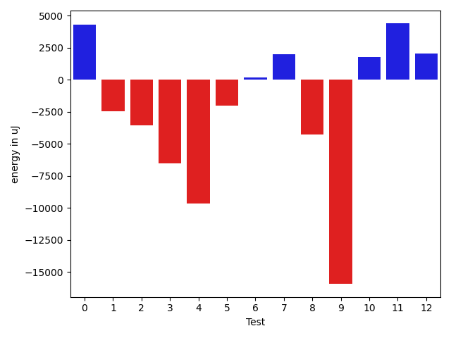

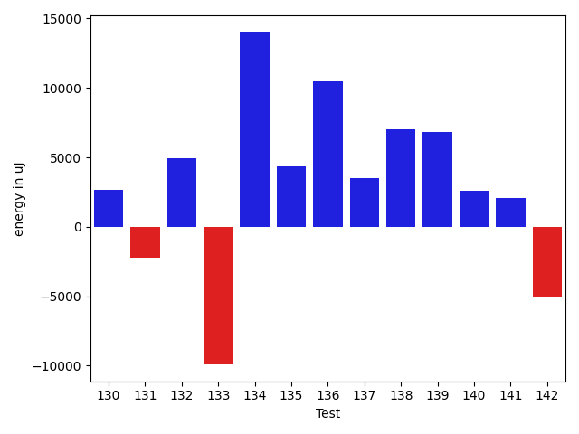

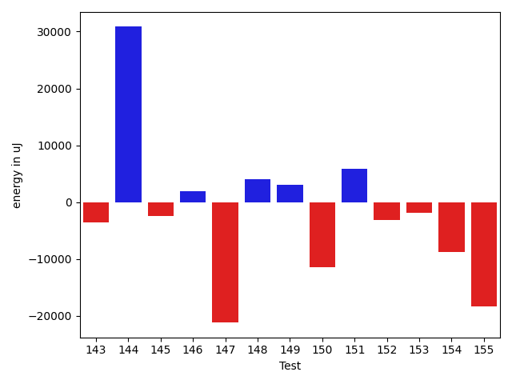

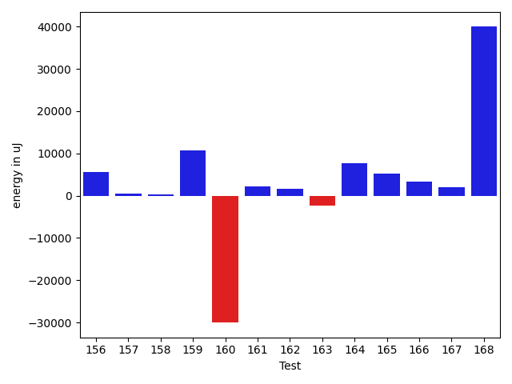

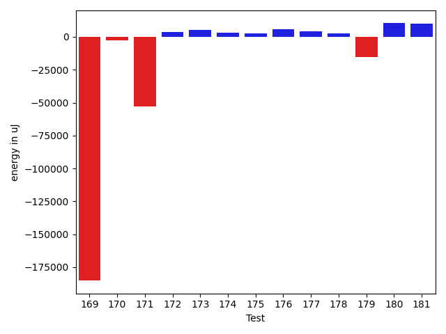

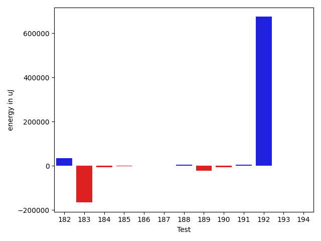

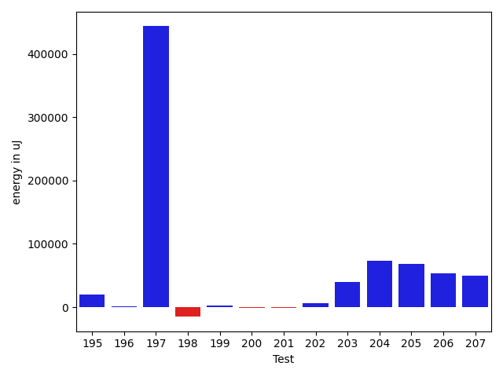

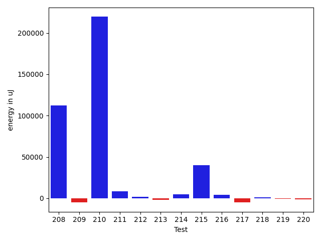

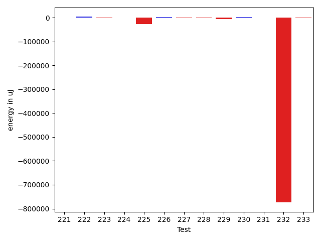

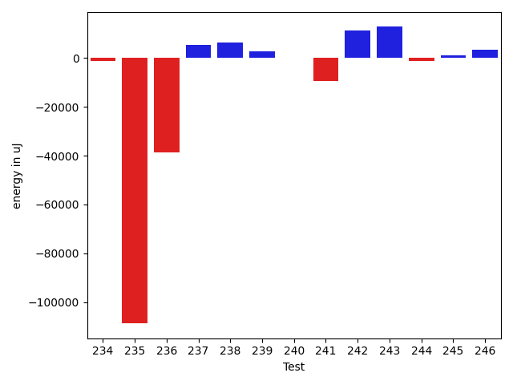

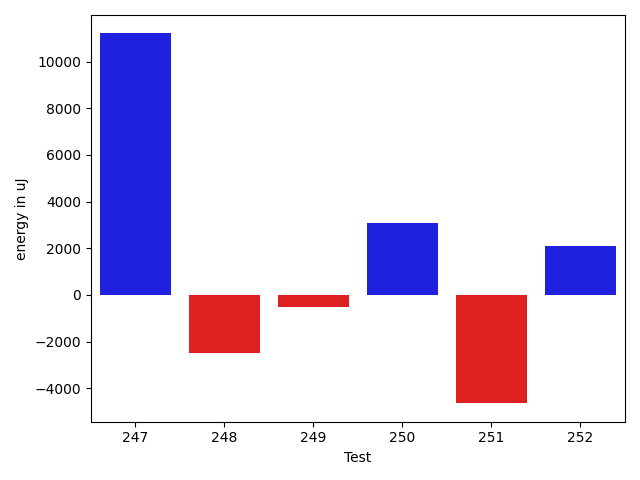

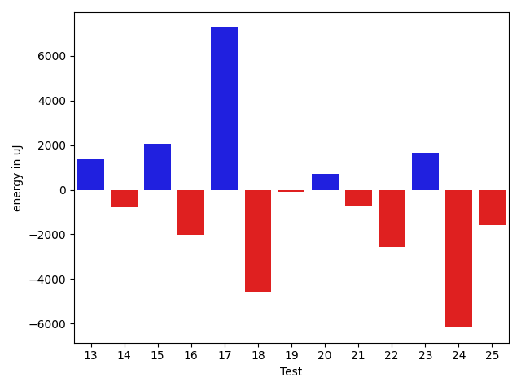

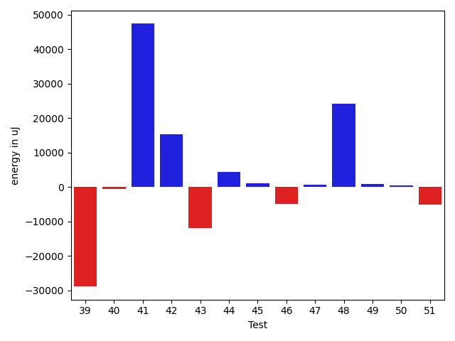

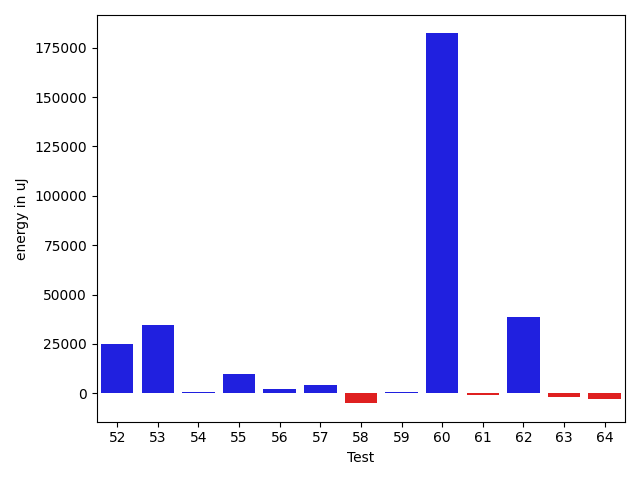

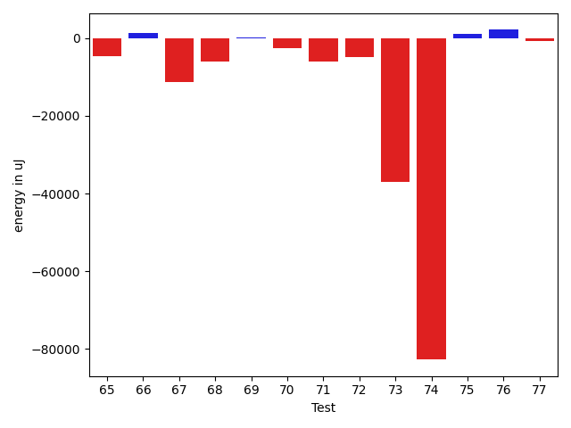

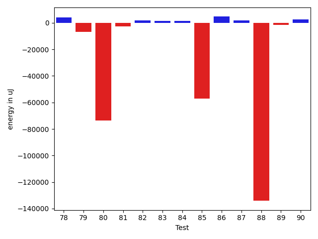

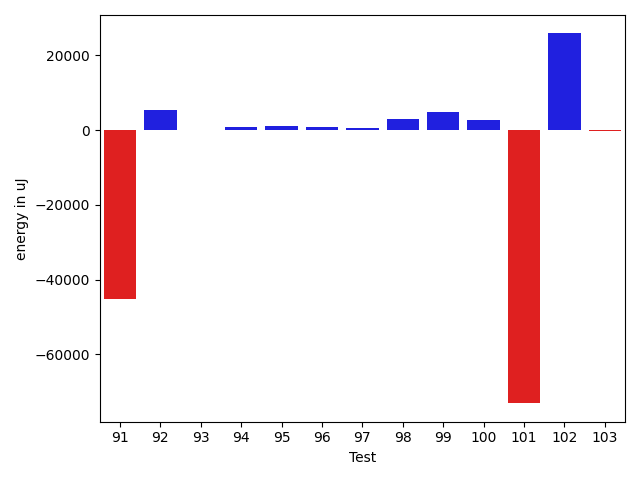

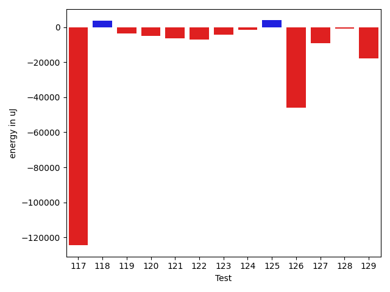

| ID | EnergyV1 | EnergyV2 | DeltaEnergy |
| --- | --- | --- | --- |
| 0 | 38691.89944690287 | 43000.60730830962 | 4308.70786140675 |
| 1 | 38025.08503842354 | 35546.4541015625 | -2478.630936861038 |
| 2 | 42033.92003385736 | 38462.68926278541 | -3571.230771071947 |
| 3 | 46678.372798947574 | 40130.61779990677 | -6547.754999040801 |
| 4 | 49036.499026282254 | 39390.03020088462 | -9646.468825397635 |
| 5 | 42460.12592772767 | 40442.71658912301 | -2017.4093386046588 |
| 6 | 38252.270410602025 | 38427.792116040575 | 175.52170543855027 |
| 7 | 37984.12547181826 | 39985.857509970665 | 2001.7320381524041 |
| 8 | 41266.271217803296 | 36962.930917762555 | -4303.340300040742 |
| 9 | 55548.13757395237 | 39609.17235637371 | -15938.965217578661 |
| 10 | 37742.8673582077 | 39532.006757617 | 1789.1393994092941 |
| 11 | 37026.688336381805 | 41403.995660257686 | 4377.307323875881 |
| 12 | 37902.774773461526 | 39929.17647202828 | 2026.401698566755 |
| 13 | 38790.67938001454 | 40163.258605748415 | 1372.5792257338762 |
| 14 | 43005.05314619094 | 42222.781978168874 | -782.2711680220673 |
| 15 | 44517.78808659315 | 46572.00482828356 | 2054.216741690412 |
| 16 | 40060.31361975521 | 38023.70243763924 | -2036.611182115972 |
| 17 | 34277.489068415016 | 41559.920001453254 | 7282.430933038238 |
| 18 | 44482.94969587753 | 39920.03335715958 | -4562.916338717951 |
| 19 | 40408.81438518484 | 40303.38662504978 | -105.42776013506227 |
| 20 | 38684.66391730794 | 39386.590586656705 | 701.9266693487662 |
| 21 | 37911.60591459274 | 37152.39041137695 | -759.2155032157898 |
| 22 | 42088.824795159744 | 39517.82602927997 | -2570.9987658797763 |
| 23 | 39149.887673641686 | 40819.73308533516 | 1669.8454116934736 |
| 24 | 45672.162464010136 | 39492.78104361921 | -6179.381420390928 |
| 25 | 41833.991134643555 | 40232.97976890206 | -1601.0113657414913 |
| 26 | 36820.87531944364 | 36067.53357310593 | -753.3417463377118 |
| 27 | 40170.9800734967 | 40751.33658218384 | 580.3565086871386 |
| 28 | 40592.85694026947 | 40279.49577689171 | -313.36116337776184 |
| 29 | 37554.076253020845 | 40642.17574865447 | 3088.0994956336217 |
| 30 | 43242.77752804756 | 37684.540896713734 | -5558.236631333828 |
| 31 | 43445.93428918347 | 56404.89867129922 | 12958.964382115752 |
| 32 | 41166.85163593292 | 37493.85171685566 | -3672.999919077265 |
| 33 | 41363.098165512085 | 37558.67407178879 | -3804.424093723297 |
| 34 | 41985.88653564453 | 37214.23028564453 | -4771.65625 |
| 35 | 41798.08672189472 | 40299.341762988886 | -1498.7449589058306 |
| 36 | 38341.19366081059 | 39139.64929462969 | 798.4556338191032 |
| 37 | 38837.995361998575 | 40048.39647187681 | 1210.4011098782357 |
| 38 | 41432.80289487113 | 39398.42642344712 | -2034.3764714240097 |
| 39 | 96747.33056111912 | 67859.9782242912 | -28887.352336827913 |
| 40 | 39470.024888516076 | 38855.7698052308 | -614.2550832852794 |
| 41 | 38247.82423306597 | 85607.28828402182 | 47359.46405095585 |
| 42 | 35288.746902571365 | 50595.73361774965 | 15306.986715178282 |
| 43 | 56916.7031449185 | 44915.9076361456 | -12000.795508772899 |
| 44 | 39806.75112812598 | 44086.379361026935 | 4279.6282329009555 |
| 45 | 41216.02915496782 | 42259.49725896411 | 1043.4681039962888 |
| 46 | 41375.52443695068 | 36508.54374504089 | -4866.98069190979 |
| 47 | 36675.569878578186 | 37296.5168838501 | 620.9470052719116 |
| 48 | 83870.84030703382 | 108062.41258128043 | 24191.572274246602 |
| 49 | 38474.021167333936 | 39350.956156659624 | 876.9349893256876 |
| 50 | 36960.46728515625 | 37459.693786621094 | 499.22650146484375 |
| 51 | 44119.19018176767 | 39012.37064036443 | -5106.819541403238 |
| 52 | 34022.31388316849 | 58803.196871102766 | 24780.882987934274 |
| 53 | 60072.31999503766 | 94419.98308435679 | 34347.66308931913 |
| 54 | 38421.97335834801 | 39112.743293760344 | 690.7699354123324 |
| 55 | 34938.35310056931 | 44797.40778440793 | 9859.054683838622 |
| 56 | 42175.87354343509 | 44357.91379595053 | 2182.0402525154423 |
| 57 | 34784.55910155767 | 38822.21830938244 | 4037.6592078247704 |
| 58 | 39052.83050918579 | 33972.2310256958 | -5080.59948348999 |
| 59 | 40572.56333511143 | 41250.60023866326 | 678.0369035518306 |
| 60 | 54825.58242674785 | 237048.24049231198 | 182222.65806556412 |
| 61 | 40679.73145044305 | 39987.55274331903 | -692.1787071240178 |
| 62 | 64263.90805692598 | 103039.48618503081 | 38775.578128104826 |
| 63 | 41225.08207938067 | 39237.98236753742 | -1987.0997118432497 |
| 64 | 38342.378618004805 | 35369.26859884112 | -2973.110019163687 |
| 65 | 41070.99282104755 | 36333.74758960307 | -4737.245231444482 |
| 66 | 38935.66298702461 | 40222.8125539422 | 1287.149566917593 |
| 67 | 44124.08756065369 | 32703.670658379793 | -11420.416902273893 |
| 68 | 42087.63119792938 | 36112.52152721584 | -5975.109670713544 |
| 69 | 40400.668994784355 | 40579.931877851486 | 179.26288306713104 |
| 70 | 43862.42073270303 | 41227.97425060815 | -2634.446482094878 |
| 71 | 40247.426703855395 | 34256.44134950638 | -5990.985354349017 |
| 72 | 41911.56297048926 | 36935.57161988295 | -4975.991350606317 |
| 73 | 272400.6591565168 | 235490.165819196 | -36910.493337320775 |
| 74 | 266611.2659341277 | 183910.55218273218 | -82700.7137513955 |
| 75 | 40634.76975211501 | 41689.85812429618 | 1055.0883721811697 |
| 76 | 40848.72290945053 | 42955.812980236486 | 2107.0900707859546 |
| 77 | 37933.1962928772 | 37155.338458538055 | -777.8578343391418 |
| 78 | 37678.75971923147 | 41740.52316545369 | 4061.7634462222195 |
| 79 | 54577.445000896594 | 47980.417697617755 | -6597.027303278839 |
| 80 | 153737.02569138072 | 80281.31957317155 | -73455.70611820917 |
| 81 | 39420.44695219139 | 36623.68175991383 | -2796.765192277562 |
| 82 | 36482.328613537655 | 38220.09938453554 | 1737.7707709978858 |
| 83 | 40455.46362904513 | 41762.011953042405 | 1306.5483239972746 |
| 84 | 36261.48918491078 | 37739.98479928635 | 1478.4956143755699 |
| 85 | 158219.52757282584 | 101302.36647813754 | -56917.1610946883 |
| 86 | 39225.67631552061 | 43907.34695337522 | 4681.670637854608 |
| 87 | 40694.66345094693 | 42622.95318868298 | 1928.2897377360496 |
| 88 | 171983.3026014237 | 37846.71277826514 | -134136.58982315857 |
| 89 | 39636.79871984152 | 38041.19609248638 | -1595.6026273551397 |
| 90 | 39949.61452014744 | 42747.99475944691 | 2798.3802392994694 |
| 91 | 165922.820511467 | 120662.56917143974 | -45260.25134002726 |
| 92 | 38433.42005361587 | 43852.62038464571 | 5419.200331029839 |
| 93 | 39008.47447360863 | 38953.79090821781 | -54.68356539082015 |
| 94 | 41736.188577497334 | 42552.59908534969 | 816.4105078523571 |
| 95 | 36695.10030710429 | 37929.52335976801 | 1234.4230526637257 |
| 96 | 38756.878956862995 | 39739.07742897828 | 982.198472115284 |
| 97 | 38081.25526338402 | 38780.052720546606 | 698.7974571625891 |
| 98 | 36468.30754274668 | 39593.04957951542 | 3124.7420367687373 |
| 99 | 36499.598655931266 | 41467.06409836729 | 4967.465442436027 |
| 100 | 37349.24548238018 | 40129.22237366184 | 2779.976891281658 |
| 101 | 118835.67510622858 | 45792.05559008958 | -73043.619516139 |
| 102 | 57686.87150606432 | 83564.62306451333 | 25877.75155844901 |
| 103 | 38658.17068114407 | 38415.17436271142 | -242.99631843264797 |
| 104 | 90337.02912310953 | 49801.04980878043 | -40535.9793143291 |
| 105 | 34048.29248182422 | 38877.01997792697 | 4828.727496102751 |
| 106 | 71430.29377771067 | 65538.28991832938 | -5892.003859381293 |
| 107 | 37669.489226441256 | 37800.462682135636 | 130.9734556943804 |
| 108 | 41676.94954012118 | 39630.66605374679 | -2046.283486374392 |
| 109 | 32313.10814900464 | 40280.14320302246 | 7967.035054017819 |
| 110 | 57480.47272350192 | 39552.5412204249 | -17927.931503077023 |
| 111 | 36313.316860986284 | 35726.74389109747 | -586.5729698888172 |
| 112 | 36158.361813372 | 44462.40108788386 | 8304.039274511859 |
| 113 | 36346.74187145446 | 36717.12681885033 | 370.38494739586895 |
| 114 | 41550.83934412419 | 115646.66059902149 | 74095.8212548973 |
| 115 | 57116.52997421064 | 56363.13009000075 | -753.3998842098954 |
| 116 | 39669.09514616515 | 42259.0360549591 | 2589.9409087939493 |
| 117 | 175316.02792303014 | 50761.028504256 | -124554.99941877414 |
| 118 | 37633.03733464112 | 41259.4672100544 | 3626.429875413276 |
| 119 | 44731.36216126087 | 41200.32571247405 | -3531.036448786821 |
| 120 | 81128.21737864355 | 76357.15289852998 | -4771.064480113564 |
| 121 | 55338.3666070378 | 48951.6804499683 | -6386.686157069504 |
| 122 | 50272.17164132491 | 43196.6066553545 | -7075.564985970406 |
| 123 | 42007.87133000024 | 37811.80312153655 | -4196.068208463694 |
| 124 | 37610.875901753105 | 36231.94048478722 | -1378.9354169658836 |
| 125 | 53478.00530319869 | 57403.07146184056 | 3925.066158641872 |
| 126 | 85333.98935771135 | 39512.11258539612 | -45821.876772315234 |
| 127 | 63531.35282063057 | 54447.8089555175 | -9083.543865113068 |
| 128 | 39857.462285326255 | 39107.17209644802 | -750.2901888782362 |
| 129 | 60706.9284188401 | 42972.52685966879 | -17734.40155917131 |
| 130 | 38673.845010500794 | 41303.91971087684 | 2630.074700376048 |
| 131 | 40837.63292867977 | 38618.816665487655 | -2218.816263192115 |
| 132 | 38738.27513746802 | 43701.68831604569 | 4963.41317857767 |
| 133 | 51371.31479998075 | 41446.717479095976 | -9924.597320884772 |
| 134 | 115507.1587323773 | 129544.96010375376 | 14037.801371376467 |
| 135 | 37089.49612941807 | 41433.59178633896 | 4344.095656920894 |
| 136 | 39220.526847183704 | 49703.61939537525 | 10483.092548191547 |
| 137 | 32809.54351114121 | 36341.27177840419 | 3531.728267262981 |
| 138 | 37721.08002170298 | 44740.77355931653 | 7019.693537613544 |
| 139 | 34542.81409856693 | 41373.79558588415 | 6830.981487317222 |
| 140 | 37276.88267207146 | 39854.656185826985 | 2577.7735137555283 |
| 141 | 37614.687892995775 | 39663.7453770244 | 2049.057484028628 |
| 142 | 42746.00301759731 | 37628.31233208461 | -5117.6906855126945 |
| 143 | 42602.561683954824 | 39065.1144165671 | -3537.4472673877244 |
| 144 | 82394.14999024369 | 113235.94479089418 | 30841.79480065049 |
| 145 | 41096.1827666085 | 38643.03349194137 | -2453.1492746671283 |
| 146 | 38860.40243165644 | 40719.8114983944 | 1859.4090667379642 |
| 147 | 62353.27622121085 | 41145.83620908942 | -21207.440012121428 |
| 148 | 39012.41680181597 | 42970.62647453237 | 3958.2096727164026 |
| 149 | 37266.04932182017 | 40332.91092911322 | 3066.8616072930527 |
| 150 | 55345.661196494984 | 43891.084434503806 | -11454.576761991179 |
| 151 | 37319.74278776375 | 43169.37879874325 | 5849.636010979499 |
| 152 | 40673.44983030718 | 37582.66670828993 | -3090.783122017252 |
| 153 | 43020.33988189697 | 41128.451764553785 | -1891.8881173431873 |
| 154 | 75619.72399526881 | 66881.8419086753 | -8737.882086593512 |
| 155 | 60475.519425129634 | 42051.254353193595 | -18424.26507193604 |
| 156 | 36432.70481688039 | 42074.833626817046 | 5642.1288099366575 |
| 157 | 39153.387024696916 | 39651.11043633148 | 497.7234116345644 |
| 158 | 37229.88962207438 | 37556.23326590605 | 326.3436438316712 |
| 159 | 35173.42832061867 | 45853.44340240423 | 10680.015081785561 |
| 160 | 69489.67250879388 | 39458.4229271918 | -30031.249581602082 |
| 161 | 38937.84045257419 | 41157.03396028059 | 2219.193507706397 |
| 162 | 36930.751973332124 | 38546.46352972421 | 1615.7115563920888 |
| 163 | 43977.8707818985 | 41623.06901836395 | -2354.801763534546 |
| 164 | 38971.74595110025 | 46662.2311693728 | 7690.485218272544 |
| 165 | 37020.83294571331 | 42271.833367071325 | 5251.000421358018 |
| 166 | 34763.82774334634 | 38077.94483757019 | 3314.117094223853 |
| 167 | 41335.3704045284 | 43368.469379487506 | 2033.0989749591026 |
| 168 | 264422.30218462064 | 304377.1504915218 | 39954.84830690117 |
| 169 | 533715.1754550525 | 348499.99567198846 | -185215.17978306406 |
| 170 | 38767.38524940855 | 36165.61996324746 | -2601.7652861610914 |
| 171 | 100552.13804521385 | 47652.361969062404 | -52899.77607615145 |
| 172 | 40530.79730942995 | 44447.2738169409 | 3916.4765075109462 |
| 173 | 38335.81364928747 | 43847.51160513563 | 5511.697955848162 |
| 174 | 38677.03568382266 | 41916.5775032657 | 3239.5418194430385 |
| 175 | 40923.361733150334 | 43696.478340514004 | 2773.1166073636705 |
| 176 | 43084.731387952124 | 48979.28357621879 | 5894.552188266665 |
| 177 | 36376.86734907594 | 40462.573874194524 | 4085.706525118585 |
| 178 | 37586.26315548636 | 40347.93518289314 | 2761.6720274067775 |
| 179 | 51499.98879756623 | 35976.495022978685 | -15523.493774587543 |
| 180 | 44693.55442752343 | 54997.87391011371 | 10304.319482590283 |
| 181 | 47383.88791811353 | 57433.74131526595 | 10049.853397152423 |
| 182 | 43839.66545011362 | 78385.41340524326 | 34545.74795512964 |
| 183 | 204740.45684757177 | 39020.420610610396 | -165720.03623696137 |
| 184 | 46913.96540148271 | 40238.84951455891 | -6675.115886923799 |
| 185 | 37668.6233837295 | 35709.60268620029 | -1959.0206975292094 |
| 186 | 40322.49452763796 | 41881.232270002365 | 1558.7377423644066 |
| 187 | 37966.13409757047 | 39213.57722624326 | 1247.443128672785 |
| 188 | 35935.72037496022 | 41200.88087582588 | 5265.1605008656625 |
| 189 | 64056.43758820585 | 41103.57667687535 | -22952.8609113305 |
| 190 | 41575.96938538179 | 35176.67233276367 | -6399.297052618116 |
| 191 | 38497.6626932621 | 43507.882962584496 | 5010.220269322395 |
| 192 | 35819.069067932665 | 710784.2721359939 | 674965.2030680613 |
| 193 | 39819.51008558273 | 39618.305589199066 | -201.204496383667 |
| 194 | 37008.30522811413 | 38905.9304857254 | 1897.6252576112747 |
| 195 | 37107.05635201931 | 57072.4705452472 | 19965.414193227887 |
| 196 | 36799.09233934531 | 37791.497870771156 | 992.405531425844 |
| 197 | 330823.0709779908 | 774631.5260298206 | 443808.45505182975 |
| 198 | 51104.349466873784 | 35930.9401021135 | -15173.409364760286 |
| 199 | 32323.21473471488 | 34970.7150724834 | 2647.5003377685207 |
| 200 | 36629.11390335517 | 35192.676658988 | -1436.4372443671746 |
| 201 | 33064.92606741906 | 32229.764464756943 | -835.1616026621159 |
| 202 | 33433.080322265625 | 39864.97762107849 | 6431.897298812866 |
| 203 | 85200.14937142844 | 124404.24374999222 | 39204.09437856378 |
| 204 | 121902.22783088798 | 195511.6512873305 | 73609.42345644251 |
| 205 | 37427.61098472384 | 105331.70569870174 | 67904.0947139779 |
| 206 | 49659.80432034386 | 103183.03562018211 | 53523.231299838255 |
| 207 | 42902.26217395614 | 92211.34581307581 | 49309.08363911967 |
| 208 | 51787.83347817224 | 164255.93692779454 | 112468.1034496223 |
| 209 | 43338.679286412225 | 38219.5784423972 | -5119.100844015025 |
| 210 | 47035.93437909339 | 266610.17218533374 | 219574.23780624033 |
| 211 | 36252.36915136874 | 44649.870107166935 | 8397.500955798198 |
| 212 | 43835.90944468981 | 45339.8806473203 | 1503.9712026304915 |
| 213 | 41244.67941951705 | 39079.56991419315 | -2165.109505323904 |
| 214 | 41000.21344490594 | 46010.69509810693 | 5010.481653200994 |
| 215 | 73852.8878495211 | 113878.62202897292 | 40025.73417945183 |
| 216 | 36932.35061980761 | 41056.94157740474 | 4124.590957597131 |
| 217 | 43440.474289570346 | 38400.41102394535 | -5040.0632656249945 |
| 218 | 37170.546656646766 | 38522.13092121482 | 1351.5842645680532 |
| 219 | 41509.65687759692 | 40591.44339774561 | -918.2134798513143 |
| 220 | 38758.726060195826 | 37582.327825546265 | -1176.3982346495613 |
| 221 | 42680.48068361321 | 43748.11352062418 | 1067.6328370109695 |
| 222 | 39922.13802170807 | 43139.11177036847 | 3216.973748660399 |
| 223 | 44359.481528714256 | 41924.0349461423 | -2435.4465825719526 |
| 224 | 41879.03129868717 | 40980.563205372455 | -898.4680933147174 |
| 225 | 71858.16227732039 | 45210.73261309854 | -26647.429664221847 |
| 226 | 39134.804450348485 | 40911.08418536186 | 1776.279735013377 |
| 227 | 41824.88112818577 | 40483.43613412622 | -1341.4449940595514 |
| 228 | 41943.973954319954 | 40559.40744598815 | -1384.5665083318017 |
| 229 | 116866.36203353218 | 111601.10224375731 | -5265.259789774864 |
| 230 | 42243.24312429594 | 43538.60193612396 | 1295.3588118280168 |
| 231 | 43352.08803610316 | 43397.0102819644 | 44.92224586124212 |
| 232 | 824430.430917076 | 50266.12798092741 | -774164.3029361486 |
| 233 | 40630.403856773584 | 39523.95817173047 | -1106.445685043116 |
| 234 | 42759.0960764559 | 41560.41540417535 | -1198.6806722805486 |
| 235 | 152051.19346939976 | 43330.259815446174 | -108720.93365395359 |
| 236 | 81357.79538080841 | 42845.847706306056 | -38511.94767450236 |
| 237 | 35094.92558527738 | 40339.28499699803 | 5244.359411720652 |
| 238 | 34691.4352977879 | 41193.85899007421 | 6502.423692286306 |
| 239 | 39395.9089816998 | 42031.27034572007 | 2635.3613640202675 |
| 240 | 43053.09258002322 | 43333.87465131283 | 280.7820712896064 |
| 241 | 51099.81098983018 | 41598.57007569261 | -9501.240914137568 |
| 242 | 40926.886277578145 | 52272.1220071599 | 11345.235729581756 |
| 243 | 43019.24581158161 | 55795.489122629166 | 12776.243311047554 |
| 244 | 39977.70669555664 | 38629.85735702515 | -1347.8493385314941 |
| 245 | 38038.85648059845 | 39196.94804928452 | 1158.091568686068 |
| 246 | 37809.438511022236 | 41082.58500365131 | 3273.146492629072 |
| 247 | 39602.06688481585 | 50802.43841448051 | 11200.371529664655 |
| 248 | 41474.97901335169 | 38990.548991741845 | -2484.430021609842 |
| 249 | 40463.336288731545 | 39952.90675766766 | -510.4295310638845 |
| 250 | 40742.61171436588 | 43821.356980774755 | 3078.745266408878 |
| 251 | 44503.98272667971 | 39862.28897654082 | -4641.693750138889 |
| 252 | 40013.83455873266 | 42110.761583797444 | 2096.9270250647824 |

## Delta Duration per test method

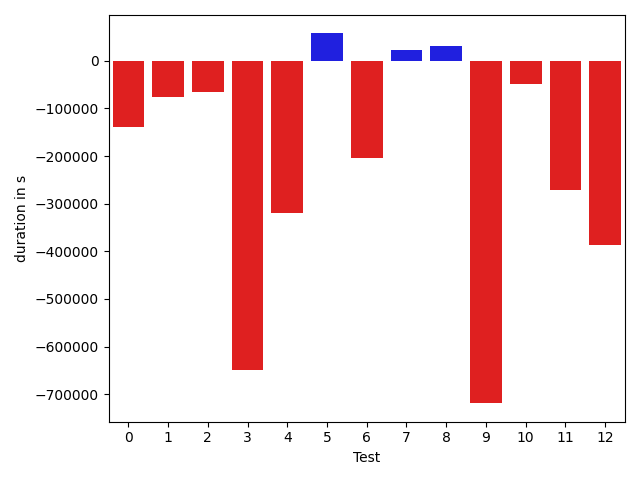

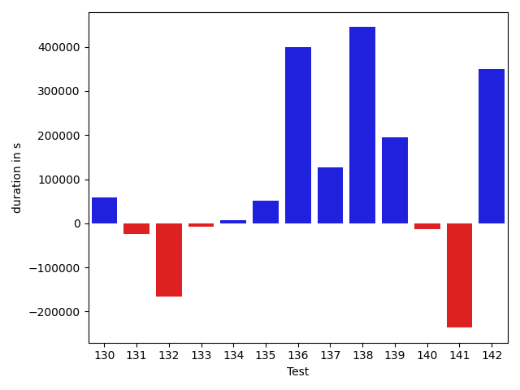

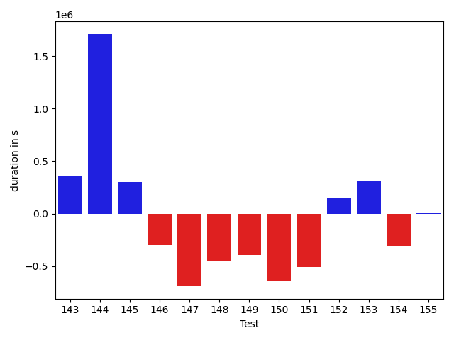

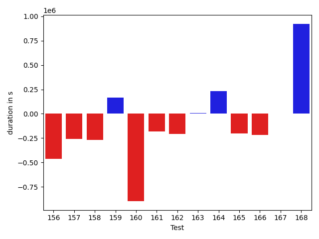

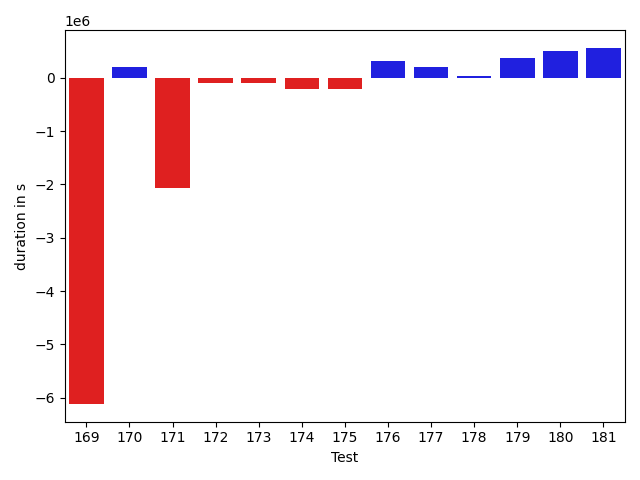

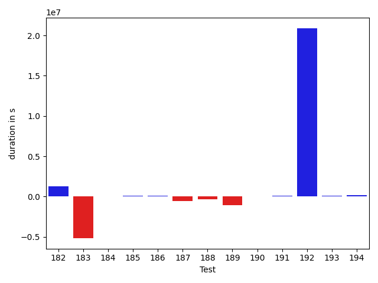

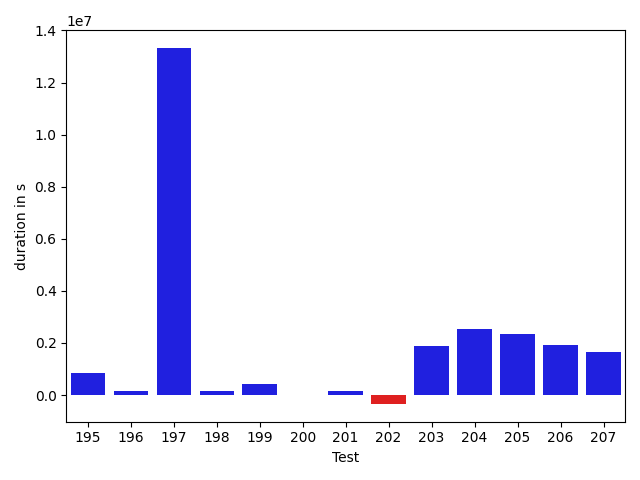

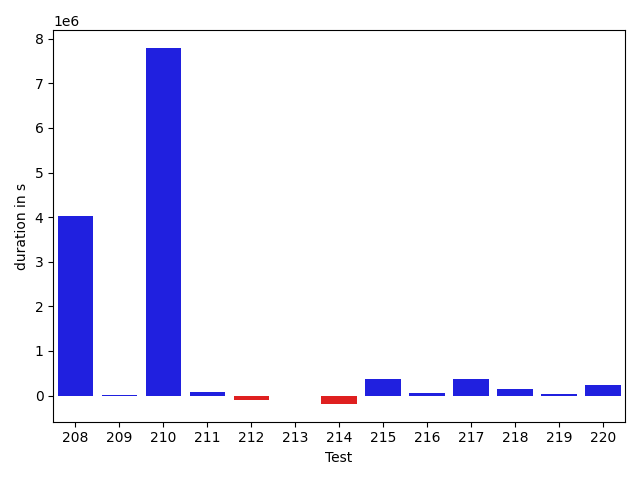

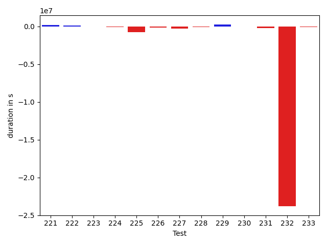

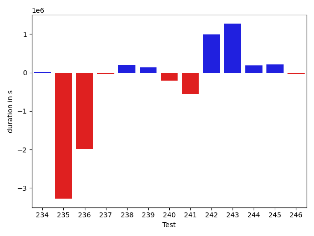

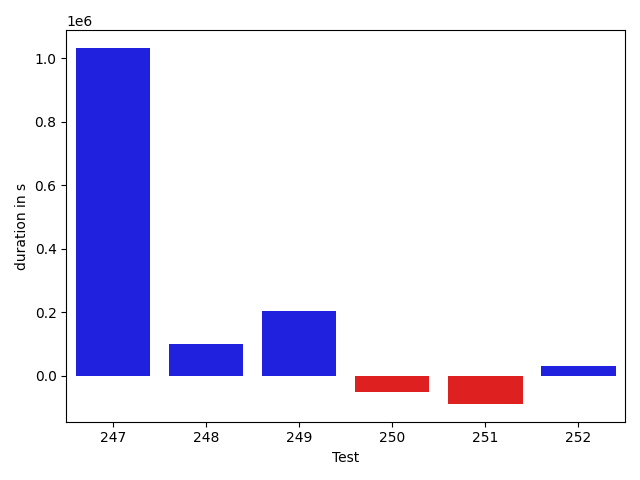

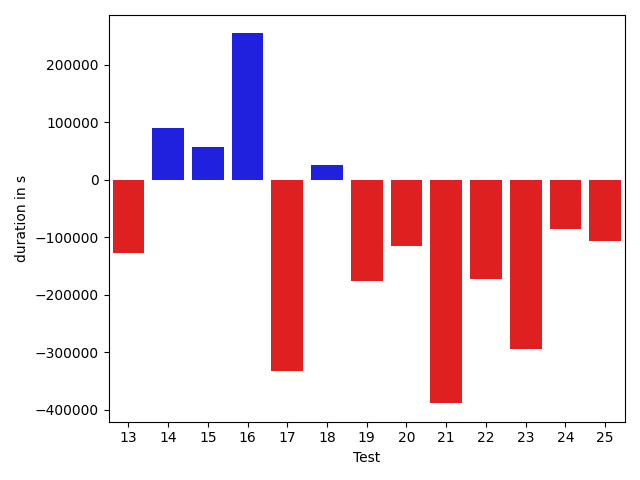

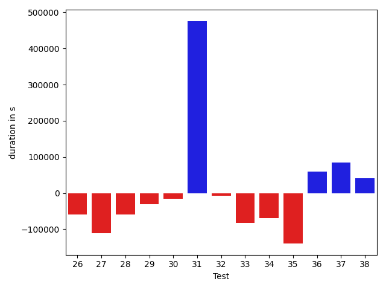

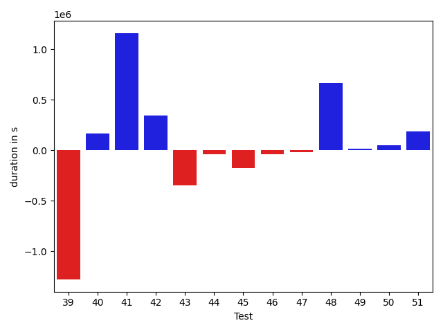

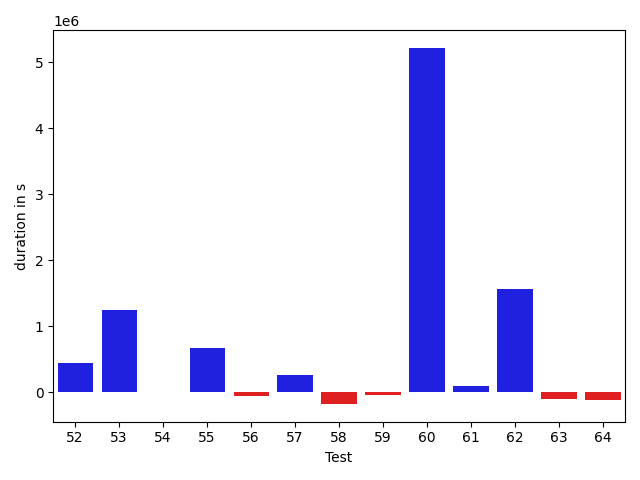

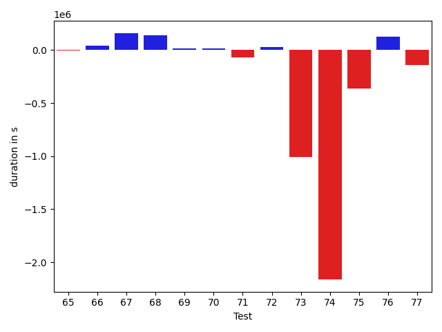

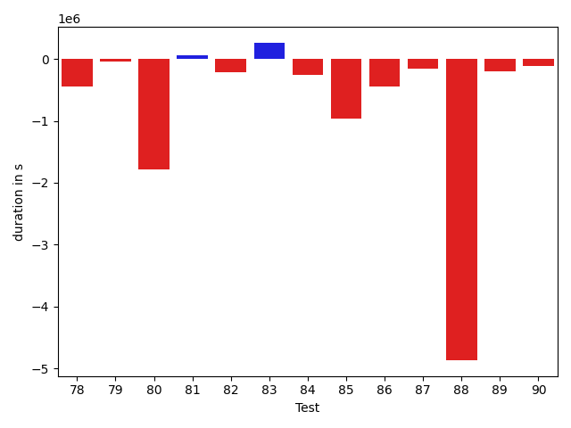

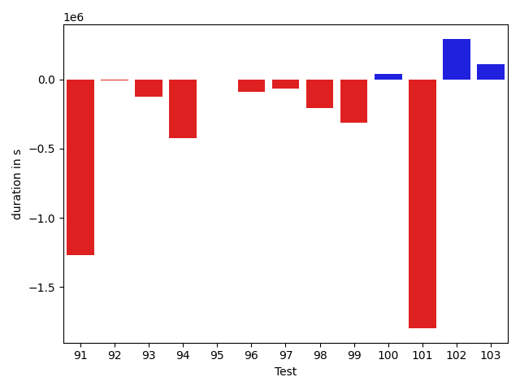

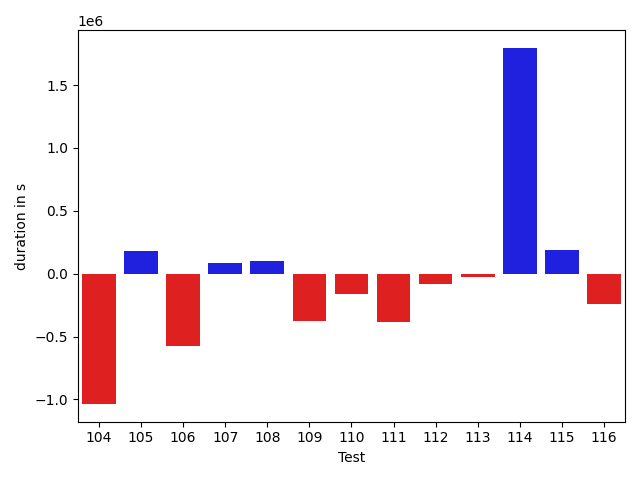

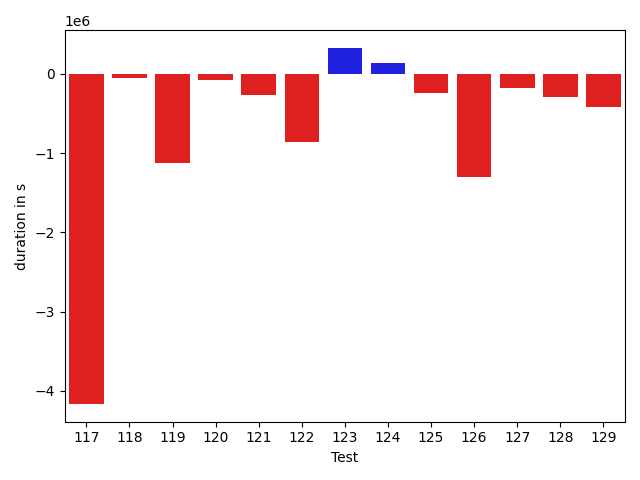

| ID | DurationV1 | DurationsV2 | DeltaDuration |
| --- | --- | --- | --- |
| 0 | 893901.6933885803 | 753908.1005730939 | -139993.59281548648 |
| 1 | 546181.3000071049 | 469285.669921875 | -76895.63008522987 |
| 2 | 780784.4214964778 | 714577.7044425196 | -66206.71705395821 |
| 3 | 1234084.425694495 | 585067.5149033315 | -649016.9107911634 |
| 4 | 1394389.8692470402 | 1074626.3611304336 | -319763.5081166066 |
| 5 | 394448.959248174 | 451872.269099921 | 57423.309851747006 |
| 6 | 780229.8231364595 | 576780.5836790218 | -203449.23945743765 |
| 7 | 668673.464481298 | 692122.6616936922 | 23449.19721239421 |
| 8 | 568585.780714316 | 600398.8707625999 | 31813.09004828392 |
| 9 | 1492919.4971927353 | 773891.2892010701 | -719028.2079916652 |
| 10 | 433818.2404432297 | 385165.9743652344 | -48652.2660779953 |
| 11 | 779596.5079668208 | 507413.6495588713 | -272182.85840794956 |
| 12 | 1212817.0358794727 | 825948.185003232 | -386868.85087624076 |
| 13 | 540639.427997157 | 413544.8702864647 | -127094.55771069229 |
| 14 | 502119.76612332254 | 592106.5291449713 | 89986.76302164875 |
| 15 | 480268.9925637692 | 536860.1578758769 | 56591.16531210765 |
| 16 | 379597.09751483053 | 633678.9378005266 | 254081.8402856961 |
| 17 | 785336.5312637426 | 452912.7167388798 | -332423.8145248628 |
| 18 | 530321.1094716031 | 556149.906169982 | 25828.79669837898 |
| 19 | 628721.1631412321 | 452275.02023248747 | -176446.14290874463 |
| 20 | 754949.6408224574 | 638990.4852213408 | -115959.1556011166 |
| 21 | 846088.230427742 | 457459.09829711914 | -388629.13213062286 |
| 22 | 676394.1530748374 | 503561.75471500447 | -172832.39835983294 |
| 23 | 921853.2602888237 | 628126.324610942 | -293726.9356778817 |
| 24 | 614708.970860492 | 529213.5779820412 | -85495.3928784508 |
| 25 | 589981.1635513306 | 482681.3627101481 | -107299.80084118247 |
| 26 | 493012.28183774836 | 433481.6624214053 | -59530.61941634305 |
| 27 | 499127.5658921972 | 388084.9249534607 | -111042.6409387365 |
| 28 | 418760.25865364075 | 359420.19100642204 | -59340.067647218704 |
| 29 | 558122.281428553 | 527817.6304188638 | -30304.6510096892 |
| 30 | 500534.1202607155 | 485615.3332019448 | -14918.787058770657 |
| 31 | 654332.6540919542 | 1130280.349567011 | 475947.69547505677 |
| 32 | 459934.97526073456 | 453229.10106265196 | -6705.874198082602 |
| 33 | 479151.3917980194 | 397289.3814172745 | -81862.01038074493 |
| 34 | 516277.18771362305 | 447151.31994628906 | -69125.86776733398 |
| 35 | 1138258.6757370261 | 998466.711289416 | -139791.9644476102 |
| 36 | 559812.6572338007 | 619152.7232531533 | 59340.066019352525 |
| 37 | 608186.9038397764 | 692915.3014510165 | 84728.39761124004 |
| 38 | 935912.5985537879 | 977560.8157026354 | 41648.21714884753 |
| 39 | 2992769.8885989813 | 1713603.6937026319 | -1279166.1948963495 |
| 40 | 913665.2112432406 | 1078505.700323791 | 164840.48908055038 |
| 41 | 1262767.9885551198 | 2423072.161733735 | 1160304.173178615 |
| 42 | 885015.5839510779 | 1231075.926795449 | 346060.3428443712 |
| 43 | 1388242.784280797 | 1042398.851400608 | -345843.93288018904 |
| 44 | 694783.0400104946 | 657827.2625747323 | -36955.77743576234 |
| 45 | 977002.7077873927 | 799668.6032325763 | -177334.10455481638 |
| 46 | 495798.28041887283 | 456496.4978656769 | -39301.78255319595 |
| 47 | 514801.6995706558 | 493719.56203460693 | -21082.13753604889 |
| 48 | 2605412.8890585033 | 3272478.5385206332 | 667065.6494621299 |
| 49 | 880977.183243645 | 893941.4553708704 | 12964.272127225413 |
| 50 | 442544.09130859375 | 492598.2887573242 | 50054.19744873047 |
| 51 | 983269.6913985233 | 1169311.256527469 | 186041.56512894575 |
| 52 | 888780.2453212439 | 1340389.1867375732 | 451608.94141632935 |
| 53 | 1238138.354204441 | 2483301.5774671417 | 1245163.2232627007 |
| 54 | 474083.4250935912 | 478342.8930554185 | 4259.467961827293 |
| 55 | 592830.9634251565 | 1264679.2804526286 | 671848.3170274721 |
| 56 | 745253.7437541395 | 685441.9094686868 | -59811.83428545273 |
| 57 | 800502.6686151797 | 1067479.070424003 | 266976.40180882334 |
| 58 | 574868.2307777405 | 401775.18885040283 | -173093.04192733765 |
| 59 | 679454.3837244418 | 644870.4364114441 | -34583.947312997654 |
| 60 | 1386643.7126307886 | 6602640.940406285 | 5215997.227775496 |
| 61 | 674896.4007708753 | 777671.2219336593 | 102774.821162784 |
| 62 | 1483332.9184768237 | 3046837.7499290993 | 1563504.8314522756 |
| 63 | 808345.5972986436 | 702455.9047507462 | -105889.69254789734 |
| 64 | 804651.6398845474 | 695746.3249824091 | -108905.31490213831 |
| 65 | 492972.62079091894 | 488362.74527186155 | -4609.875519057387 |
| 66 | 454797.95339054184 | 497612.5883804858 | 42814.63498994394 |
| 67 | 521599.39274024963 | 681063.4848076105 | 159464.09206736088 |
| 68 | 519886.8031167984 | 662662.1033414304 | 142775.30022463202 |
| 69 | 429525.9214576483 | 444147.7236521244 | 14621.802194476128 |
| 70 | 601053.9801356776 | 615765.5672213542 | 14711.587085676612 |
| 71 | 569780.9275826663 | 498728.1093633175 | -71052.81821934879 |
| 72 | 507406.27802079916 | 536070.670032999 | 28664.392012199853 |
| 73 | 6940836.094967028 | 5932680.093963206 | -1008156.0010038223 |
| 74 | 6590178.124033427 | 4428061.335438013 | -2162116.788595414 |
| 75 | 880128.2718346417 | 516056.50071379216 | -364071.77112084953 |
| 76 | 530150.8342978954 | 655642.4478013329 | 125491.61350343749 |
| 77 | 697939.9384536743 | 554410.2088065147 | -143529.72964715958 |
| 78 | 1031549.2980312058 | 586512.5979905532 | -445036.70004065253 |
| 79 | 1734194.3215317333 | 1696925.2089702915 | -37269.112561441725 |
| 80 | 4541472.9798154645 | 2758740.802889848 | -1782732.1769256163 |
| 81 | 1139704.3924191345 | 1192608.2145447817 | 52903.82212564722 |
| 82 | 1108697.3741826597 | 892980.7251312528 | -215716.6490514069 |
| 83 | 1071022.2225026346 | 1332251.2727883207 | 261229.05028568604 |
| 84 | 708546.8501608726 | 456863.48569735885 | -251683.36446351372 |
| 85 | 3733252.7373015294 | 2769481.312567495 | -963771.4247340346 |
| 86 | 1104279.4231883641 | 665774.6248209389 | -438504.7983674252 |
| 87 | 1062233.1022928494 | 909115.5112051633 | -153117.59108768613 |
| 88 | 5381559.803296634 | 515544.56787673314 | -4866015.235419901 |
| 89 | 638968.9387767245 | 434950.336186558 | -204018.6025901665 |
| 90 | 752674.8797141239 | 632906.6795991999 | -119768.200114924 |
| 91 | 4488740.438771984 | 3219607.502980575 | -1269132.9357914086 |
| 92 | 849491.1403365203 | 840630.6216668901 | -8860.518669630168 |
| 93 | 1126095.265593457 | 1001127.8834680055 | -124967.38212545158 |
| 94 | 1340665.5146533344 | 914928.6021734069 | -425736.91247992753 |
| 95 | 728294.0814708917 | 725945.3101657802 | -2348.7713051114697 |
| 96 | 755928.1747314899 | 663505.6105508149 | -92422.56418067496 |
| 97 | 829695.6780329216 | 764486.9543598478 | -65208.72367307381 |
| 98 | 1045431.3582823345 | 835314.8754248032 | -210116.4828575313 |
| 99 | 1322938.428406056 | 1010455.4037254717 | -312483.0246805843 |
| 100 | 612565.4200566052 | 651336.576812193 | 38771.156755587785 |
| 101 | 3651718.3534387755 | 1855079.8832946762 | -1796638.4701440993 |
| 102 | 1825440.282183782 | 2116981.032261219 | 291540.7500774369 |
| 103 | 1027998.3999218077 | 1138709.297320278 | 110710.8973984702 |
| 104 | 2450506.3659308585 | 1414954.569569752 | -1035551.7963611064 |
| 105 | 1130173.6627161677 | 1313981.913577469 | 183808.25086130132 |
| 106 | 2435292.06046471 | 1860405.6058600037 | -574886.4546047063 |
| 107 | 948648.7505379466 | 1031877.9433201719 | 83229.19278222532 |
| 108 | 890490.8239373472 | 990860.8038490835 | 100369.97991173633 |
| 109 | 1067313.176395047 | 693896.0103290263 | -373417.1660660207 |
| 110 | 1205096.4143884506 | 1041355.8261752019 | -163740.58821324864 |
| 111 | 1360501.4939821013 | 973597.7357611872 | -386903.75822091417 |
| 112 | 597799.9277051892 | 516613.88643891737 | -81186.04126627184 |
| 113 | 959692.4301799457 | 932580.8665375155 | -27111.56364243012 |
| 114 | 1188847.561204865 | 2984376.1859293384 | 1795528.6247244733 |
| 115 | 1654125.7611975307 | 1845130.8734187763 | 191005.11222124565 |
| 116 | 880017.1076983591 | 639233.1763017642 | -240783.93139659485 |
| 117 | 5137831.14368747 | 972874.0525682669 | -4164957.091119203 |
| 118 | 579138.5235600113 | 523143.4580485821 | -55995.06551142922 |
| 119 | 1974333.8912898076 | 847512.1220624485 | -1126821.769227359 |
| 120 | 2026655.9766308377 | 1955734.3686102259 | -70921.6080206118 |
| 121 | 1202147.674021114 | 934736.8242612018 | -267410.8497599121 |
| 122 | 1530073.3836955074 | 677094.5962689645 | -852978.787426543 |
| 123 | 614547.3343663577 | 942297.9168768318 | 327750.58251047414 |
| 124 | 1115237.2531536068 | 1254017.4885085565 | 138780.23535494972 |
| 125 | 1586787.2182357856 | 1340434.4229107103 | -246352.79532507528 |
| 126 | 2270849.131839683 | 970229.7711245165 | -1300619.3607151662 |
| 127 | 1637815.7765124764 | 1466223.8295815836 | -171591.94693089277 |
| 128 | 950924.4116204027 | 655518.241674146 | -295406.1699462567 |
| 129 | 1814303.658476293 | 1396876.435773646 | -417427.2227026471 |
| 130 | 1132096.4091327526 | 1190340.3020886402 | 58243.8929558876 |
| 131 | 1021933.3389989095 | 997989.2990191557 | -23944.039979753783 |
| 132 | 974037.9026881807 | 807325.9114187488 | -166711.9912694319 |
| 133 | 1314400.3629371454 | 1306314.7580661546 | -8085.60487099085 |
| 134 | 3263331.541529268 | 3271060.9131315434 | 7729.371602275409 |
| 135 | 824355.3980942394 | 875896.7458949494 | 51541.347800710006 |
| 136 | 440173.54139506817 | 839129.9328848124 | 398956.3914897442 |
| 137 | 592646.2185401357 | 719523.149939972 | 126876.93139983632 |
| 138 | 488685.3898990585 | 933331.6308432599 | 444646.24094420136 |
| 139 | 794445.9063092101 | 989276.704849852 | 194830.7985406419 |
| 140 | 597854.483294189 | 584849.3661054783 | -13005.11718871072 |
| 141 | 783195.2947391681 | 546603.8723360768 | -236591.42240309133 |
| 142 | 827788.2439180011 | 1177087.9182359187 | 349299.67431791767 |
| 143 | 786325.6599311542 | 1138303.6556358538 | 351977.99570469954 |
| 144 | 1872225.9058940853 | 3583908.967809595 | 1711683.0619155099 |
| 145 | 1003345.4560918314 | 1301074.3910783126 | 297728.9349864812 |
| 146 | 939351.2722426328 | 639453.9266736247 | -299897.34556900815 |
| 147 | 1729143.6772792744 | 1037914.2859070136 | -691229.3913722609 |
| 148 | 1191707.1151130341 | 735730.7032742932 | -455976.4118387409 |
| 149 | 874445.3640449919 | 477955.5470045879 | -396489.817040404 |
| 150 | 1453855.6527300207 | 808920.034479655 | -644935.6182503657 |
| 151 | 1171516.2505645952 | 663240.8762865309 | -508275.37427806435 |
| 152 | 666219.568109156 | 820953.4420787671 | 154733.87396961113 |
| 153 | 469339.62955856323 | 780425.8209605515 | 311086.19140198827 |
| 154 | 2404645.364782718 | 2091288.451153795 | -313356.913628923 |
| 155 | 1823778.0161389788 | 1828986.460354415 | 5208.444215436233 |
| 156 | 1086317.4335069472 | 622504.8928561197 | -463812.5406508276 |
| 157 | 725370.6980098011 | 470002.5814024471 | -255368.11660735402 |
| 158 | 903468.0291833953 | 633871.9680436524 | -269596.06113974296 |
| 159 | 712984.2214506489 | 879466.0028102223 | 166481.78135957348 |
| 160 | 1932425.9356447952 | 1036918.1520100182 | -895507.783634777 |
| 161 | 930522.2377010509 | 748140.7071142303 | -182381.53058682068 |
| 162 | 912816.0407708231 | 706366.0297615419 | -206450.01100928127 |
| 163 | 397396.49530649185 | 403156.9124364853 | 5760.417129993439 |
| 164 | 718424.9924539526 | 951721.9267576933 | 233296.93430374074 |
| 165 | 805907.9906546837 | 603407.7604130685 | -202500.2302416152 |
| 166 | 748676.3829888615 | 532107.7434654236 | -216568.63952343795 |
| 167 | 945237.9345147549 | 949907.2772054138 | 4669.342690658872 |
| 168 | 6528404.710736691 | 7449935.097757144 | 921530.3870204529 |
| 169 | 14759121.731016671 | 8642293.336491497 | -6116828.394525174 |
| 170 | 805556.1045066643 | 1014395.9875298173 | 208839.88302315294 |
| 171 | 3122101.8929961068 | 1053674.5877871504 | -2068427.3052089564 |
| 172 | 653453.93541741 | 559758.5891632672 | -93695.34625414282 |
| 173 | 756554.7534868199 | 666138.7821323844 | -90415.97135443555 |
| 174 | 813996.690372233 | 606579.8887456749 | -207416.80162655818 |
| 175 | 839488.1195485212 | 624610.1531645785 | -214877.96638394275 |
| 176 | 820452.7992499899 | 1128087.8333219723 | 307635.0340719824 |
| 177 | 664977.9793980385 | 873660.4058923208 | 208682.42649428232 |
| 178 | 666698.8200982967 | 700644.6409320323 | 33945.82083373552 |
| 179 | 1158158.8255601916 | 1523352.9389167863 | 365194.1133565947 |
| 180 | 914691.2986975327 | 1418275.4017177576 | 503584.10302022484 |
| 181 | 955784.5800233473 | 1516686.5833254869 | 560902.0033021396 |
| 182 | 1093199.0923255642 | 2355969.935039675 | 1262770.8427141106 |
| 183 | 5622461.7238802165 | 457978.64927889407 | -5164483.074601322 |
| 184 | 904024.7802267153 | 919881.6795643754 | 15856.899337660172 |
| 185 | 511330.6483476368 | 609192.4206609651 | 97861.77231332834 |
| 186 | 499777.4856849909 | 586107.519764185 | 86330.03407919407 |
| 187 | 1156569.1930009655 | 596950.81440515 | -559618.3785958155 |
| 188 | 787034.8018159047 | 445611.5596026182 | -341423.24221328646 |
| 189 | 1760706.375318988 | 714715.3783350587 | -1045990.9969839293 |
| 190 | 406959.21426007524 | 449180.23767089844 | 42221.023410823196 |
| 191 | 372479.08735108376 | 459918.4349350333 | 87439.34758394957 |
| 192 | 465988.18868399784 | 21359588.572633907 | 20893600.38394991 |
| 193 | 357005.15449666977 | 486819.8397011757 | 129814.68520450592 |
| 194 | 411506.34326195717 | 611766.3484430313 | 200260.00518107414 |
| 195 | 482012.54524213076 | 1342937.5292339027 | 860924.9839917719 |
| 196 | 764410.0794412942 | 922912.7540732499 | 158502.67463195568 |
| 197 | 8820749.108259648 | 22149678.634080898 | 13328929.52582125 |
| 198 | 1269179.372859703 | 1431510.1626918842 | 162330.7898321813 |
| 199 | 840716.6912351672 | 1246630.846529489 | 405914.1552943217 |
| 200 | 525249.3244555743 | 508896.79765916057 | -16352.526796413702 |
| 201 | 641817.5136852583 | 777383.4969700963 | 135565.98328483792 |
| 202 | 705044.5712890625 | 363087.03440856934 | -341957.53688049316 |
| 203 | 2399298.4928282383 | 4288475.427972168 | 1889176.9351439294 |
| 204 | 3063469.3065943765 | 5615320.674925815 | 2551851.368331439 |
| 205 | 565459.4533370447 | 2901849.446772886 | 2336389.993435841 |
| 206 | 1407484.890184776 | 3329746.6590701337 | 1922261.7688853578 |
| 207 | 1271746.2218473628 | 2919367.275191934 | 1647621.053344571 |
| 208 | 1362413.4661480172 | 5395426.43674359 | 4033012.970595573 |
| 209 | 1494873.190732378 | 1500990.2866423815 | 6117.095910003409 |
| 210 | 1184104.2641368029 | 8976167.741805568 | 7792063.477668766 |
| 211 | 608592.8677420765 | 693042.4452888113 | 84449.57754673483 |
| 212 | 559589.3302158786 | 457870.0064625852 | -101719.32375329337 |
| 213 | 448715.3870189745 | 447315.96502783056 | -1399.4219911439577 |
| 214 | 873958.0264027878 | 686024.0313492555 | -187933.9950535323 |
| 215 | 2470365.256807122 | 2851536.023487664 | 381170.7666805419 |
| 216 | 628874.1968988115 | 693251.3049347252 | 64377.10803591367 |
| 217 | 597675.2740003517 | 963362.8262451638 | 365687.55224481213 |
| 218 | 587102.316952867 | 734821.9575463235 | 147719.64059345657 |
| 219 | 492578.6973528039 | 522429.62623450987 | 29850.92888170597 |
| 220 | 458834.77722475864 | 692053.4717903137 | 233218.69456555508 |
| 221 | 472486.1472912849 | 678085.5588704925 | 205599.41157920758 |
| 222 | 1131114.139685722 | 1237899.8077295816 | 106785.66804385954 |
| 223 | 831970.2910329893 | 839465.8860488485 | 7495.595015859231 |
| 224 | 653798.2879052954 | 581204.2343988628 | -72594.05350643257 |
| 225 | 1619881.360073994 | 861911.8309484206 | -757969.5291255733 |
| 226 | 664660.3008211202 | 548571.7098617554 | -116088.59095936478 |
| 227 | 809431.9385967206 | 552390.9568207471 | -257040.98177597346 |
| 228 | 471740.22134141624 | 417168.77450291626 | -54571.44683849998 |
| 229 | 2900779.9627082497 | 3162716.1608085544 | 261936.1981003047 |
| 230 | 1170578.8008711233 | 1134483.6618517316 | -36095.13901939173 |
| 231 | 1205814.2797878794 | 998718.4245849383 | -207095.8552029411 |
| 232 | 25131273.90709804 | 1328208.7782784859 | -23803065.128819555 |
| 233 | 1058124.7800045859 | 958314.9449193574 | -99809.83508522843 |
| 234 | 520504.4091072269 | 546983.9830661259 | 26479.57395889901 |
| 235 | 4560503.796112047 | 1284728.0475719117 | -3275775.748540135 |
| 236 | 2516042.1426681243 | 524083.7553014943 | -1991958.38736663 |
| 237 | 601558.1505881846 | 555457.1680459408 | -46100.982542243786 |
| 238 | 707887.4092298911 | 907252.0489496929 | 199364.63971980172 |
| 239 | 794245.2602104198 | 929482.0443176778 | 135236.78410725808 |
| 240 | 691284.989911166 | 485259.4295589663 | -206025.5603521997 |
| 241 | 1134948.4971079505 | 581113.6645709947 | -553834.8325369558 |
| 242 | 632856.6651547006 | 1622274.7771123205 | 989418.1119576199 |
| 243 | 551851.681797862 | 1825165.8697413802 | 1273314.1879435182 |
| 244 | 532763.9582824707 | 717132.8439617157 | 184368.885679245 |
| 245 | 522827.4858748913 | 731771.9590156265 | 208944.47314073518 |
| 246 | 770226.6095773724 | 736310.0014589283 | -33916.6081184441 |
| 247 | 539209.8053652861 | 1572281.7192162932 | 1033071.9138510071 |
| 248 | 610297.9857505457 | 709413.1683132694 | 99115.18256272364 |
| 249 | 580557.4320677631 | 785489.9578668103 | 204932.5257990472 |
| 250 | 679494.2508359837 | 629917.2584424209 | -49576.9923935628 |
| 251 | 602113.5020442815 | 513952.5278929677 | -88160.97415131377 |
| 252 | 633811.5001247895 | 663691.7121328885 | 29880.212008098955 |

## Misc.

| ID | Test Class | Test Method |
| --- | --- | --- |
| 0 | com.google.gson.functional.PrimitiveTest | testDeserializePrimitiveWrapperAsObjectField |
| 1 | com.google.gson.functional.ObjectTest | testStringFieldWithEmptyValueDeserialization |
| 2 | com.google.gson.functional.ObjectTest | testEmptyCollectionInAnObjectDeserialization |
| 3 | com.google.gson.functional.ObjectTest | testArrayOfArraysDeserialization |
| 4 | com.google.gson.functional.ObjectTest | testSingletonLists |
| 5 | com.google.gson.functional.ObjectTest | testClassWithTransientFieldsDeserialization |
| 6 | com.google.gson.functional.ObjectTest | testPrivateNoArgConstructorDeserialization |
| 7 | com.google.gson.functional.ObjectTest | testPrimitiveArrayInAnObjectDeserialization |
| 8 | com.google.gson.functional.ObjectTest | testStringFieldWithEmptyValueSerialization |
| 9 | com.google.gson.functional.ObjectTest | testInnerClassSerialization |
| 10 | com.google.gson.functional.ObjectTest | testObjectFieldNamesWithoutQuotesDeserialization |
| 11 | com.google.gson.functional.ObjectTest | testArrayOfObjectsDeserialization |
| 12 | com.google.gson.functional.ObjectTest | testArrayOfArraysSerialization |
| 13 | com.google.gson.functional.ObjectTest | testBagOfPrimitivesSerialization |
| 14 | com.google.gson.functional.ObjectTest | testNestedDeserialization |
| 15 | com.google.gson.functional.ObjectTest | testBagOfPrimitiveWrappersDeserialization |
| 16 | com.google.gson.functional.ObjectTest | testJsonInMixedQuotesDeserialization |
| 17 | com.google.gson.functional.ObjectTest | testNullFieldsDeserialization |
| 18 | com.google.gson.functional.ObjectTest | testArrayOfObjectsSerialization |
| 19 | com.google.gson.functional.ObjectTest | testClassWithTransientFieldsSerialization |
| 20 | com.google.gson.functional.ObjectTest | testInnerClassDeserialization |
| 21 | com.google.gson.functional.ObjectTest | testNullObjectFieldsDeserialization |
| 22 | com.google.gson.functional.ObjectTest | testNestedSerialization |
| 23 | com.google.gson.functional.ObjectTest | testArrayOfObjectsAsFields |
| 24 | com.google.gson.functional.ObjectTest | testBagOfPrimitiveWrappersSerialization |
| 25 | com.google.gson.functional.ObjectTest | testJsonInSingleQuotesDeserialization |
| 26 | com.google.gson.functional.ObjectTest | testStringFieldWithNumberValueDeserialization |
| 27 | com.google.gson.functional.ObjectTest | testPrimitiveArrayFieldSerialization |
| 28 | com.google.gson.functional.ObjectTest | testNullArraysDeserialization |
| 29 | com.google.gson.functional.ObjectTest | testClassWithObjectFieldSerialization |
| 30 | com.google.gson.functional.ObjectTest | testBagOfPrimitivesDeserialization |
| 31 | com.google.gson.functional.ObjectTest | testClassWithTransientFieldsDeserializationTransientFieldsPassedInJsonAreIgnored |
| 32 | com.google.gson.functional.ObjectTest | testNullFieldsSerialization |
| 33 | com.google.gson.functional.ObjectTest | testEmptyCollectionInAnObjectSerialization |
| 34 | com.google.gson.functional.ObjectTest | testNullPrimitiveFieldsDeserialization |
| 35 | com.google.gson.functional.StreamingTypeAdaptersTest | testNullSafe |
| 36 | com.google.gson.functional.StreamingTypeAdaptersTest | testDeserializeWithCustomTypeAdapter |
| 37 | com.google.gson.functional.StreamingTypeAdaptersTest | testSerializeRecursive |
| 38 | com.google.gson.functional.StreamingTypeAdaptersTest | testSerializeWithCustomTypeAdapter |
| 39 | com.google.gson.functional.ThrowableFunctionalTest | testExceptionWithoutCause |
| 40 | com.google.gson.functional.ThrowableFunctionalTest | testErrornWithCause |
| 41 | com.google.gson.functional.ThrowableFunctionalTest | testSerializedNameOnExceptionFields |
| 42 | com.google.gson.functional.ThrowableFunctionalTest | testErrorWithoutCause |
| 43 | com.google.gson.functional.ThrowableFunctionalTest | testExceptionWithCause |
| 44 | com.google.gson.functional.InterfaceTest | testSerializingObjectImplementingInterface |
| 45 | com.google.gson.functional.InterfaceTest | testSerializingInterfaceObjectField |
| 46 | com.google.gson.functional.InheritanceTest | testBaseSerializedAsBaseWhenSpecifiedWithExplicitType |
| 47 | com.google.gson.functional.InheritanceTest | testBaseSerializedAsSubWhenSpecifiedWithExplicitType |
| 48 | com.google.gson.functional.InheritanceTest | testSubInterfacesOfCollectionSerialization |
| 49 | com.google.gson.functional.InheritanceTest | testClassWithBaseArrayFieldSerialization |
| 50 | com.google.gson.functional.InheritanceTest | testBaseSerializedAsSubWhenSpecifiedWithExplicitTypeForToJsonMethod |
| 51 | com.google.gson.functional.InheritanceTest | testSubInterfacesOfCollectionDeserialization |
| 52 | com.google.gson.functional.InheritanceTest | testSubClassSerialization |
| 53 | com.google.gson.functional.InheritanceTest | testBaseSerializedAsBaseWhenSpecifiedWithExplicitTypeForToJsonMethod |
| 54 | com.google.gson.functional.InheritanceTest | testBaseSerializedAsSub |
| 55 | com.google.gson.functional.InheritanceTest | testSubClassDeserialization |
| 56 | com.google.gson.functional.InheritanceTest | testClassWithBaseCollectionFieldSerialization |
| 57 | com.google.gson.functional.InheritanceTest | testClassWithBaseFieldSerialization |
| 58 | com.google.gson.functional.InheritanceTest | testBaseSerializedAsSubForToJsonMethod |
| 59 | com.google.gson.functional.NamingPolicyTest | testAtSignInSerializedName |
| 60 | com.google.gson.functional.NamingPolicyTest | testGsonDuplicateNameUsingSerializedNameFieldNamingPolicySerialization |
| 61 | com.google.gson.functional.NamingPolicyTest | testGsonWithSerializedNameFieldNamingPolicySerialization |
| 62 | com.google.gson.functional.NamingPolicyTest | testGsonWithNonDefaultFieldNamingPolicyDeserialiation |
| 63 | com.google.gson.functional.NamingPolicyTest | testComplexFieldNameStrategy |
| 64 | com.google.gson.functional.NamingPolicyTest | testDeprecatedNamingStrategy |
| 65 | com.google.gson.functional.NamingPolicyTest | testGsonWithLowerCaseUnderscorePolicyDeserialiation |
| 66 | com.google.gson.functional.NamingPolicyTest | testGsonWithUpperCamelCaseSpacesPolicyDeserialiation |
| 67 | com.google.gson.functional.NamingPolicyTest | testGsonWithLowerCaseDashPolicySerialization |
| 68 | com.google.gson.functional.NamingPolicyTest | testGsonWithLowerCaseDashPolicyDeserialiation |
| 69 | com.google.gson.functional.NamingPolicyTest | testGsonWithSerializedNameFieldNamingPolicyDeserialization |
| 70 | com.google.gson.functional.NamingPolicyTest | testGsonWithNonDefaultFieldNamingPolicySerialization |
| 71 | com.google.gson.functional.NamingPolicyTest | testGsonWithUpperCamelCaseSpacesPolicySerialiation |
| 72 | com.google.gson.functional.NamingPolicyTest | testGsonWithLowerCaseUnderscorePolicySerialization |
| 73 | com.google.gson.functional.CircularReferenceTest | testCircularSerialization |
| 74 | com.google.gson.functional.CircularReferenceTest | testSelfReferenceArrayFieldSerialization |
| 75 | com.google.gson.functional.CircularReferenceTest | testDirectedAcyclicGraphDeserialization |
| 76 | com.google.gson.functional.CircularReferenceTest | testDirectedAcyclicGraphSerialization |
| 77 | com.google.gson.functional.CircularReferenceTest | testSelfReferenceIgnoredInSerialization |
| 78 | com.google.gson.functional.MapTest | testMapSerializationWithNullValues |
| 79 | com.google.gson.functional.MapTest | testInterfaceTypeMapWithSerializer |
| 80 | com.google.gson.functional.MapTest | testInterfaceTypeMap |
| 81 | com.google.gson.functional.MapTest | testComplexKeysSerialization |
| 82 | com.google.gson.functional.MapTest | testGeneralMapField |
| 83 | com.google.gson.functional.MapTest | testComplexKeysDeserialization |
| 84 | com.google.gson.functional.MapTest | testMapSerializationWithNullValuesSerialized |
| 85 | com.google.gson.functional.ExposeFieldsTest | testNullExposeFieldSerialization |
| 86 | com.google.gson.functional.ExposeFieldsTest | testArrayWithOneNullExposeFieldObjectSerialization |
| 87 | com.google.gson.functional.ExposeFieldsTest | testExposedInterfaceFieldSerialization |
| 88 | com.google.gson.functional.ExposeFieldsTest | testExposeAnnotationDeserialization |
| 89 | com.google.gson.functional.ExposeFieldsTest | testExposedInterfaceFieldDeserialization |
| 90 | com.google.gson.functional.ExposeFieldsTest | testExposeAnnotationSerialization |
| 91 | com.google.gson.functional.RuntimeTypeAdapterFactoryFunctionalTest | testSubclassesAutomaticallySerialzed |
| 92 | com.google.gson.functional.MoreSpecificTypeSerializationTest | testSubclassFields |
| 93 | com.google.gson.functional.MoreSpecificTypeSerializationTest | testParameterizedSubclassFields |
| 94 | com.google.gson.functional.MoreSpecificTypeSerializationTest | testListOfSubclassFields |
| 95 | com.google.gson.functional.MoreSpecificTypeSerializationTest | testListOfParameterizedSubclassFields |
| 96 | com.google.gson.functional.MoreSpecificTypeSerializationTest | testMapOfParameterizedSubclassFields |
| 97 | com.google.gson.functional.MoreSpecificTypeSerializationTest | testMapOfSubclassFields |
| 98 | com.google.gson.functional.ParameterizedTypesTest | testParameterizedTypesWithWriterSerialization |
| 99 | com.google.gson.functional.ParameterizedTypesTest | testVariableTypeArrayDeserialization |
| 100 | com.google.gson.functional.ParameterizedTypesTest | testDeepParameterizedTypeDeserialization |
| 101 | com.google.gson.functional.ParameterizedTypesTest | testParameterizedTypesSerialization |
| 102 | com.google.gson.functional.ParameterizedTypesTest | testVariableTypeFieldsAndGenericArraysSerialization |
| 103 | com.google.gson.functional.ParameterizedTypesTest | testParameterizedTypeGenericArraysDeserialization |
| 104 | com.google.gson.functional.ParameterizedTypesTest | testParameterizedTypeDeserialization |
| 105 | com.google.gson.functional.ParameterizedTypesTest | testVariableTypeFieldsAndGenericArraysDeserialization |
| 106 | com.google.gson.functional.ParameterizedTypesTest | testTypesWithMultipleParametersSerialization |
| 107 | com.google.gson.functional.ParameterizedTypesTest | testParameterizedTypeWithVariableTypeDeserialization |
| 108 | com.google.gson.functional.ParameterizedTypesTest | testParameterizedTypeGenericArraysSerialization |
| 109 | com.google.gson.functional.ParameterizedTypesTest | testParameterizedTypeWithReaderDeserialization |
| 110 | com.google.gson.functional.ParameterizedTypesTest | testVariableTypeDeserialization |
| 111 | com.google.gson.functional.ParameterizedTypesTest | testTypesWithMultipleParametersDeserialization |
| 112 | com.google.gson.functional.ParameterizedTypesTest | testDeepParameterizedTypeSerialization |
| 113 | com.google.gson.functional.CustomDeserializerTest | testCustomDeserializerReturnsNullForArrayElementsForArrayField |
| 114 | com.google.gson.functional.CustomDeserializerTest | testCustomDeserializerReturnsNull |
| 115 | com.google.gson.functional.CustomDeserializerTest | testJsonTypeFieldBasedDeserialization |
| 116 | com.google.gson.functional.CustomDeserializerTest | testDefaultConstructorNotCalledOnField |
| 117 | com.google.gson.functional.CustomDeserializerTest | testDefaultConstructorNotCalledOnObject |
| 118 | com.google.gson.functional.JsonTreeTest | testJsonTreeNull |
| 119 | com.google.gson.functional.JsonTreeTest | testToJsonTreeObjectType |
| 120 | com.google.gson.functional.JsonTreeTest | testJsonTreeToString |
| 121 | com.google.gson.functional.JsonTreeTest | testToJsonTree |
| 122 | com.google.gson.functional.CustomTypeAdaptersTest | testCustomNestedSerializers |
| 123 | com.google.gson.functional.CustomTypeAdaptersTest | testCustomNestedDeserializers |
| 124 | com.google.gson.functional.CustomTypeAdaptersTest | testCustomTypeAdapterDoesNotAppliesToSubClasses |
| 125 | com.google.gson.functional.CustomTypeAdaptersTest | testEnsureCustomSerializerNotInvokedForNullValues |
| 126 | com.google.gson.functional.CustomTypeAdaptersTest | testEnsureCustomDeserializerNotInvokedForNullValues |
| 127 | com.google.gson.functional.JsonAdapterAnnotationOnFieldsTest | testClassAnnotationAdapterFactoryTakesPrecedenceOverDefault |
| 128 | com.google.gson.functional.JsonAdapterAnnotationOnFieldsTest | testJsonAdapterWrappedInNullSafeAsRequested |
| 129 | com.google.gson.functional.JsonAdapterAnnotationOnFieldsTest | testClassAnnotationAdapterTakesPrecedenceOverDefault |
| 130 | com.google.gson.functional.JsonAdapterAnnotationOnFieldsTest | testFieldAnnotationTakesPrecedenceOverClassAnnotation |
| 131 | com.google.gson.functional.JsonAdapterAnnotationOnFieldsTest | testJsonAdapterInvokedOnlyForAnnotatedFields |
| 132 | com.google.gson.functional.JsonAdapterAnnotationOnFieldsTest | testRegisteredTypeAdapterTakesPrecedenceOverClassAnnotationAdapter |
| 133 | com.google.gson.functional.JsonAdapterAnnotationOnFieldsTest | testFieldAnnotationTakesPrecedenceOverRegisteredTypeAdapter |
| 134 | com.google.gson.functional.VersioningTest | testVersionedUntilSerialization |
| 135 | com.google.gson.functional.VersioningTest | testVersionedClassesSerialization |
| 136 | com.google.gson.functional.VersioningTest | testVersionedUntilDeserialization |
| 137 | com.google.gson.functional.VersioningTest | testVersionedGsonMixingSinceAndUntilDeserialization |
| 138 | com.google.gson.functional.VersioningTest | testVersionedGsonWithUnversionedClassesSerialization |
| 139 | com.google.gson.functional.VersioningTest | testVersionedGsonMixingSinceAndUntilSerialization |
| 140 | com.google.gson.functional.VersioningTest | testVersionedGsonWithUnversionedClassesDeserialization |
| 141 | com.google.gson.functional.VersioningTest | testVersionedClassesDeserialization |
| 142 | com.google.gson.functional.MapAsArrayTypeAdapterTest | testMultipleEnableComplexKeyRegistrationHasNoEffect |
| 143 | com.google.gson.functional.MapAsArrayTypeAdapterTest | testMapWithTypeVariableDeserialization |
| 144 | com.google.gson.functional.MapAsArrayTypeAdapterTest | testSerializeComplexMapWithTypeAdapter |
| 145 | com.google.gson.functional.MapAsArrayTypeAdapterTest | testMapWithTypeVariableSerialization |
| 146 | com.google.gson.functional.CollectionTest | testFieldIsArrayList |
| 147 | com.google.gson.functional.CollectionTest | testWildcardCollectionField |
| 148 | com.google.gson.functional.CollectionTest | testSetSerialization |
| 149 | com.google.gson.functional.CollectionTest | testRawCollectionSerialization |
| 150 | com.google.gson.functional.CollectionTest | testSetDeserialization |
| 151 | com.google.gson.functional.CollectionTest | testCollectionOfBagOfPrimitivesSerialization |
| 152 | com.google.gson.functional.EnumTest | testClassWithEnumFieldSerialization |
| 153 | com.google.gson.functional.EnumTest | testClassWithEnumFieldDeserialization |
| 154 | com.google.gson.functional.TypeVariableTest | testAdvancedTypeVariables |
| 155 | com.google.gson.functional.TypeVariableTest | testTypeVariablesViaTypeParameter |
| 156 | com.google.gson.functional.TypeVariableTest | testBasicTypeVariables |
| 157 | com.google.gson.functional.NullObjectAndFieldTest | testExplicitSerializationOfNullCollectionMembers |
| 158 | com.google.gson.functional.NullObjectAndFieldTest | testPrintPrintingObjectWithNulls |
| 159 | com.google.gson.functional.NullObjectAndFieldTest | testExplicitNullSetsFieldToNullDuringDeserialization |
| 160 | com.google.gson.functional.NullObjectAndFieldTest | testExplicitSerializationOfNullArrayMembers |
| 161 | com.google.gson.functional.NullObjectAndFieldTest | testExplicitSerializationOfNulls |
| 162 | com.google.gson.functional.NullObjectAndFieldTest | testAbsentJsonElementsAreSetToNull |
| 163 | com.google.gson.functional.NullObjectAndFieldTest | testNullWrappedPrimitiveMemberDeserialization |
| 164 | com.google.gson.functional.NullObjectAndFieldTest | testExplicitDeserializationOfNulls |
| 165 | com.google.gson.functional.NullObjectAndFieldTest | testNullWrappedPrimitiveMemberSerialization |
| 166 | com.google.gson.functional.NullObjectAndFieldTest | testExplicitSerializationOfNullStringMembers |
| 167 | com.google.gson.functional.ConcurrencyTest | testSingleThreadSerialization |
| 168 | com.google.gson.functional.ConcurrencyTest | testMultiThreadSerialization |
| 169 | com.google.gson.functional.ConcurrencyTest | testMultiThreadDeserialization |
| 170 | com.google.gson.functional.ConcurrencyTest | testSingleThreadDeserialization |
| 171 | com.google.gson.functional.FieldNamingTest | testIdentity |
| 172 | com.google.gson.functional.FieldNamingTest | testLowerCaseWithUnderscores |
| 173 | com.google.gson.functional.FieldNamingTest | testUpperCamelCase |
| 174 | com.google.gson.functional.FieldNamingTest | testLowerCaseWithDashes |
| 175 | com.google.gson.functional.FieldNamingTest | testUpperCamelCaseWithSpaces |
| 176 | com.google.gson.functional.InstanceCreatorTest | testInstanceCreatorReturnsBaseType |
| 177 | com.google.gson.functional.InstanceCreatorTest | testInstanceCreatorReturnsSubTypeForField |
| 178 | com.google.gson.functional.InstanceCreatorTest | testInstanceCreatorReturnsSubTypeForTopLevelObject |
| 179 | com.google.gson.functional.RawSerializationTest | testParameterizedObject |
| 180 | com.google.gson.functional.RawSerializationTest | testTwoLevelParameterizedObject |
| 181 | com.google.gson.functional.RawSerializationTest | testThreeLevelParameterizedObject |
| 182 | com.google.gson.functional.RawSerializationTest | testCollectionOfObjects |
| 183 | com.google.gson.functional.SecurityTest | testNonExecutableJsonSerialization |
| 184 | com.google.gson.functional.SecurityTest | testNonExecutableJsonDeserialization |
| 185 | com.google.gson.functional.SecurityTest | testJsonWithNonExectuableTokenWithConfiguredGsonDeserialization |
| 186 | com.google.gson.functional.SecurityTest | testJsonWithNonExectuableTokenWithRegularGsonDeserialization |
| 187 | com.google.gson.functional.EscapingTest | testGsonAcceptsEscapedAndNonEscapedJsonDeserialization |
| 188 | com.google.gson.functional.EscapingTest | testGsonDoubleDeserialization |
| 189 | com.google.gson.functional.EscapingTest | testEscapingObjectFields |
| 190 | com.google.gson.MixedStreamTest | testWriteInvalidState |
| 191 | com.google.gson.MixedStreamTest | testWriteDoesNotMutateState |
| 192 | com.google.gson.MixedStreamTest | testWriteMixedStreamed |
| 193 | com.google.gson.MixedStreamTest | testWriteClosed |
| 194 | com.google.gson.MixedStreamTest | testReaderDoesNotMutateState |
| 195 | com.google.gson.MixedStreamTest | testReadMixedStreamed |
| 196 | com.google.gson.functional.DefaultTypeAdaptersTest | testUrlNullSerialization |
| 197 | com.google.gson.functional.DefaultTypeAdaptersTest | testNullSerialization |
| 198 | com.google.gson.functional.DefaultTypeAdaptersTest | testBigDecimalFieldSerialization |
| 199 | com.google.gson.functional.DefaultTypeAdaptersTest | testBigIntegerFieldSerialization |
| 200 | com.google.gson.functional.DefaultTypeAdaptersTest | testBigIntegerFieldDeserialization |
| 201 | com.google.gson.functional.DefaultTypeAdaptersTest | testBadValueForBigDecimalDeserialization |
| 202 | com.google.gson.functional.DefaultTypeAdaptersTest | testUrlNullDeserialization |
| 203 | com.google.gson.functional.DefaultTypeAdaptersTest | testBigDecimalFieldDeserialization |
| 204 | com.google.gson.functional.TypeHierarchyAdapterTest | testTypeHierarchy |
| 205 | com.google.gson.regression.JsonAdapterNullSafeTest | testNullSafeBugDeserialize |
| 206 | com.google.gson.regression.JsonAdapterNullSafeTest | testNullSafeBugSerialize |
| 207 | com.google.gson.functional.TreeTypeAdaptersTest | testDeserializeId |
| 208 | com.google.gson.functional.TreeTypeAdaptersTest | testSerializeId |
| 209 | com.google.gson.GsonTypeAdapterTest | testDeserializerForAbstractClass |
| 210 | com.google.gson.functional.PrintFormattingTest | testCompactFormattingLeavesNoWhiteSpace |
| 211 | com.google.gson.functional.UncategorizedTest | testObjectEqualButNotSameSerialization |
| 212 | com.google.gson.functional.UncategorizedTest | testStaticFieldsAreNotSerialized |
| 213 | com.google.gson.functional.UncategorizedTest | testGsonInstanceReusableForSerializationAndDeserialization |
| 214 | com.google.gson.functional.UncategorizedTest | testInvalidJsonDeserializationFails |
| 215 | com.google.gson.functional.ExclusionStrategyFunctionalTest | testExclusionStrategySerialization |
| 216 | com.google.gson.functional.ExclusionStrategyFunctionalTest | testExclusionStrategySerializationDoesNotImpactSerialization |
| 217 | com.google.gson.functional.ExclusionStrategyFunctionalTest | testExclusionStrategyWithMode |
| 218 | com.google.gson.functional.ExclusionStrategyFunctionalTest | testExcludeTopLevelClassDeserializationDoesNotImpactSerialization |
| 219 | com.google.gson.functional.ExclusionStrategyFunctionalTest | testExclusionStrategySerializationDoesNotImpactDeserialization |
| 220 | com.google.gson.functional.ExclusionStrategyFunctionalTest | testExcludeTopLevelClassSerializationDoesNotImpactDeserialization |
| 221 | com.google.gson.functional.ExclusionStrategyFunctionalTest | testExclusionStrategyDeserialization |
| 222 | com.google.gson.functional.PrettyPrintingTest | testPrettyPrintList |
| 223 | com.google.gson.functional.PrettyPrintingTest | testEmptyMapField |
| 224 | com.google.gson.functional.PrettyPrintingTest | testPrettyPrintArrayOfObjects |
| 225 | com.google.gson.functional.CustomSerializerTest | testBaseClassSerializerInvokedForBaseClassFields |
| 226 | com.google.gson.functional.CustomSerializerTest | testBaseClassSerializerInvokedForBaseClassFieldsHoldingSubClassInstances |
| 227 | com.google.gson.functional.CustomSerializerTest | testSubClassSerializerInvokedForBaseClassFieldsHoldingArrayOfSubClassInstances |
| 228 | com.google.gson.functional.CustomSerializerTest | testSubClassSerializerInvokedForBaseClassFieldsHoldingSubClassInstances |
| 229 | com.google.gson.functional.JavaUtilTest | testCurrency |
| 230 | com.google.gson.functional.DelegateTypeAdapterTest | testDelegateInvoked |
| 231 | com.google.gson.ObjectTypeAdapterTest | testSerialize |
| 232 | com.google.gson.JsonParserTest | testReadWriteTwoObjects |
| 233 | com.google.gson.functional.FieldExclusionTest | testDefaultInnerClassExclusion |
| 234 | com.google.gson.functional.FieldExclusionTest | testDefaultNestedStaticClassIncluded |
| 235 | com.google.gson.functional.SerializedNameTest | testFirstNameIsChosenForSerialization |
| 236 | com.google.gson.functional.SerializedNameTest | testMultipleNamesDeserializedCorrectly |
| 237 | com.google.gson.functional.SerializedNameTest | testMultipleNamesInTheSameString |
| 238 | com.google.gson.functional.JavaUtilConcurrentAtomicTest | testAtomicLongWithStringSerializationPolicy |
| 239 | com.google.gson.functional.ReadersWritersTest | testReadWriteTwoObjects |
| 240 | com.google.gson.functional.ReadersWritersTest | testReaderForDeserialization |
| 241 | com.google.gson.functional.ReadersWritersTest | testWriterForSerialization |
| 242 | com.google.gson.functional.ArrayTest | testObjectArrayWithNonPrimitivesSerialization |
| 243 | com.google.gson.functional.ArrayTest | testSingleNullInArraySerialization |
| 244 | com.google.gson.functional.ArrayTest | testSingleNullInArrayDeserialization |
| 245 | com.google.gson.functional.JsonParserTest | testBadFieldTypeForCustomDeserializerCustomTree |
| 246 | com.google.gson.functional.JsonParserTest | testBadFieldTypeForDeserializingCustomTree |
| 247 | com.google.gson.functional.JsonParserTest | testDeserializingCustomTree |
| 248 | com.google.gson.functional.JsonParserTest | testChangingCustomTreeAndDeserializing |
| 249 | com.google.gson.functional.JsonParserTest | testBadTypeForDeserializingCustomTree |
| 250 | com.google.gson.GsonBuilderTest | testExcludeFieldsWithModifiers |
| 251 | com.google.gson.GsonBuilderTest | testTransientFieldExclusion |
| 252 | com.google.gson.functional.JsonAdapterAnnotationOnClassesTest | testSuperclassTypeAdapterNotInvoked |

| Test | IterationV1 | IterationV2 | DeltaIteration |
| --- | --- | --- | --- |
| 0 | 55 | 41 | -14 |
| 1 | 22 | 13 | -9 |
| 2 | 59 | 49 | -10 |
| 3 | 55 | 49 | -6 |
| 4 | 92 | 90 | -2 |
| 5 | 29 | 26 | -3 |
| 6 | 37 | 37 | 0 |
| 7 | 33 | 23 | -10 |
| 8 | 40 | 40 | 0 |
| 9 | 56 | 60 | 4 |
| 10 | 20 | 26 | 6 |
| 11 | 40 | 36 | -4 |
| 12 | 72 | 71 | -1 |
| 13 | 26 | 26 | 0 |
| 14 | 32 | 33 | 1 |
| 15 | 26 | 29 | 3 |
| 16 | 27 | 24 | -3 |
| 17 | 28 | 34 | 6 |
| 18 | 35 | 46 | 11 |
| 19 | 34 | 35 | 1 |
| 20 | 44 | 44 | 0 |
| 21 | 22 | 16 | -6 |
| 22 | 35 | 32 | -3 |
| 23 | 52 | 51 | -1 |
| 24 | 41 | 48 | 7 |
| 25 | 20 | 26 | 6 |
| 26 | 30 | 27 | -3 |
| 27 | 28 | 19 | -9 |
| 28 | 21 | 23 | 2 |
| 29 | 38 | 35 | -3 |
| 30 | 23 | 25 | 2 |
| 31 | 29 | 27 | -2 |
| 32 | 22 | 34 | 12 |
| 33 | 21 | 21 | 0 |
| 34 | 16 | 15 | -1 |
| 35 | 90 | 75 | -15 |
| 36 | 29 | 28 | -1 |
| 37 | 47 | 47 | 0 |
| 38 | 61 | 66 | 5 |
| 39 | 86 | 89 | 3 |
| 40 | 73 | 75 | 2 |
| 41 | 94 | 95 | 1 |
| 42 | 70 | 69 | -1 |
| 43 | 87 | 81 | -6 |
| 44 | 39 | 37 | -2 |
| 45 | 56 | 65 | 9 |
| 46 | 21 | 20 | -1 |
| 47 | 20 | 18 | -2 |
| 48 | 99 | 99 | 0 |
| 49 | 52 | 42 | -10 |
| 50 | 11 | 15 | 4 |
| 51 | 71 | 76 | 5 |
| 52 | 76 | 68 | -8 |
| 53 | 46 | 40 | -6 |
| 54 | 27 | 30 | 3 |
| 55 | 52 | 36 | -16 |
| 56 | 58 | 54 | -4 |
| 57 | 51 | 32 | -19 |
| 58 | 19 | 17 | -2 |
| 59 | 41 | 50 | 9 |
| 60 | 78 | 78 | 0 |
| 61 | 59 | 53 | -6 |
| 62 | 30 | 38 | 8 |
| 63 | 62 | 55 | -7 |
| 64 | 46 | 47 | 1 |
| 65 | 33 | 27 | -6 |
| 66 | 37 | 27 | -10 |
| 67 | 20 | 26 | 6 |
| 68 | 23 | 27 | 4 |
| 69 | 24 | 23 | -1 |
| 70 | 42 | 41 | -1 |
| 71 | 29 | 23 | -6 |
| 72 | 27 | 33 | 6 |
| 73 | 99 | 99 | 0 |
| 74 | 99 | 99 | 0 |
| 75 | 26 | 31 | 5 |
| 76 | 24 | 31 | 7 |
| 77 | 19 | 22 | 3 |
| 78 | 57 | 55 | -2 |
| 79 | 93 | 93 | 0 |
| 80 | 84 | 89 | 5 |
| 81 | 69 | 68 | -1 |
| 82 | 50 | 55 | 5 |
| 83 | 54 | 52 | -2 |
| 84 | 34 | 30 | -4 |
| 85 | 99 | 99 | 0 |
| 86 | 40 | 47 | 7 |
| 87 | 76 | 66 | -10 |
| 88 | 34 | 39 | 5 |
| 89 | 32 | 26 | -6 |
| 90 | 28 | 36 | 8 |
| 91 | 99 | 99 | 0 |
| 92 | 64 | 68 | 4 |
| 93 | 79 | 81 | 2 |
| 94 | 71 | 74 | 3 |
| 95 | 56 | 56 | 0 |
| 96 | 50 | 53 | 3 |
| 97 | 69 | 66 | -3 |
| 98 | 61 | 52 | -9 |
| 99 | 80 | 64 | -16 |
| 100 | 46 | 55 | 9 |
| 101 | 99 | 98 | -1 |
| 102 | 99 | 99 | 0 |
| 103 | 73 | 80 | 7 |
| 104 | 74 | 72 | -2 |
| 105 | 90 | 82 | -8 |
| 106 | 98 | 99 | 1 |
| 107 | 70 | 70 | 0 |
| 108 | 79 | 76 | -3 |
| 109 | 60 | 56 | -4 |
| 110 | 74 | 82 | 8 |
| 111 | 60 | 62 | 2 |
| 112 | 30 | 30 | 0 |
| 113 | 60 | 54 | -6 |
| 114 | 55 | 57 | 2 |
| 115 | 99 | 99 | 0 |
| 116 | 44 | 57 | 13 |
| 117 | 35 | 42 | 7 |
| 118 | 37 | 22 | -15 |
| 119 | 59 | 45 | -14 |
| 120 | 72 | 68 | -4 |
| 121 | 42 | 43 | 1 |
| 122 | 57 | 50 | -7 |
| 123 | 45 | 50 | 5 |
| 124 | 71 | 80 | 9 |
| 125 | 84 | 74 | -10 |
| 126 | 53 | 57 | 4 |
| 127 | 96 | 96 | 0 |
| 128 | 62 | 52 | -10 |
| 129 | 93 | 93 | 0 |
| 130 | 81 | 76 | -5 |
| 131 | 64 | 71 | 7 |
| 132 | 73 | 65 | -8 |
| 133 | 87 | 94 | 7 |
| 134 | 99 | 99 | 0 |
| 135 | 52 | 61 | 9 |
| 136 | 25 | 24 | -1 |
| 137 | 34 | 44 | 10 |
| 138 | 41 | 33 | -8 |
| 139 | 65 | 79 | 14 |
| 140 | 26 | 32 | 6 |
| 141 | 29 | 33 | 4 |
| 142 | 66 | 59 | -7 |
| 143 | 64 | 68 | 4 |
| 144 | 99 | 99 | 0 |
| 145 | 82 | 85 | 3 |
| 146 | 55 | 46 | -9 |
| 147 | 83 | 84 | 1 |
| 148 | 65 | 63 | -2 |
| 149 | 38 | 34 | -4 |
| 150 | 60 | 58 | -2 |
| 151 | 45 | 45 | 0 |
| 152 | 46 | 54 | 8 |
| 153 | 19 | 26 | 7 |
| 154 | 99 | 96 | -3 |
| 155 | 80 | 77 | -3 |
| 156 | 47 | 51 | 4 |
| 157 | 30 | 28 | -2 |
| 158 | 46 | 43 | -3 |
| 159 | 41 | 35 | -6 |
| 160 | 79 | 78 | -1 |
| 161 | 27 | 34 | 7 |
| 162 | 57 | 55 | -2 |
| 163 | 24 | 23 | -1 |
| 164 | 33 | 28 | -5 |
| 165 | 41 | 46 | 5 |
| 166 | 33 | 20 | -13 |
| 167 | 59 | 62 | 3 |
| 168 | 99 | 99 | 0 |
| 169 | 99 | 99 | 0 |
| 170 | 47 | 51 | 4 |
| 171 | 74 | 79 | 5 |
| 172 | 39 | 35 | -4 |
| 173 | 37 | 32 | -5 |
| 174 | 43 | 34 | -9 |
| 175 | 43 | 37 | -6 |
| 176 | 62 | 59 | -3 |
| 177 | 42 | 58 | 16 |
| 178 | 42 | 43 | 1 |
| 179 | 83 | 81 | -2 |
| 180 | 70 | 73 | 3 |
| 181 | 79 | 75 | -4 |
| 182 | 56 | 54 | -2 |
| 183 | 31 | 29 | -2 |
| 184 | 34 | 28 | -6 |
| 185 | 36 | 28 | -8 |
| 186 | 25 | 23 | -2 |
| 187 | 53 | 42 | -11 |
| 188 | 34 | 26 | -8 |
| 189 | 42 | 25 | -17 |
| 190 | 28 | 16 | -12 |
| 191 | 22 | 25 | 3 |
| 192 | 29 | 42 | 13 |
| 193 | 23 | 23 | 0 |
| 194 | 24 | 24 | 0 |
| 195 | 25 | 27 | 2 |
| 196 | 50 | 58 | 8 |
| 197 | 99 | 99 | 0 |
| 198 | 69 | 69 | 0 |
| 199 | 75 | 79 | 4 |
| 200 | 36 | 31 | -5 |
| 201 | 37 | 38 | 1 |
| 202 | 13 | 20 | 7 |
| 203 | 36 | 35 | -1 |
| 204 | 99 | 99 | 0 |
| 205 | 34 | 46 | 12 |
| 206 | 79 | 84 | 5 |
| 207 | 74 | 73 | -1 |
| 208 | 82 | 88 | 6 |
| 209 | 97 | 95 | -2 |
| 210 | 69 | 72 | 3 |
| 211 | 26 | 34 | 8 |
| 212 | 37 | 28 | -9 |
| 213 | 36 | 39 | 3 |
| 214 | 36 | 40 | 4 |
| 215 | 99 | 98 | -1 |
| 216 | 33 | 26 | -7 |
| 217 | 41 | 41 | 0 |
| 218 | 32 | 25 | -7 |
| 219 | 43 | 37 | -6 |
| 220 | 31 | 19 | -12 |
| 221 | 40 | 38 | -2 |
| 222 | 83 | 79 | -4 |
| 223 | 65 | 64 | -1 |
| 224 | 43 | 48 | 5 |
| 225 | 54 | 64 | 10 |
| 226 | 33 | 24 | -9 |
| 227 | 41 | 40 | -1 |
| 228 | 29 | 31 | 2 |
| 229 | 99 | 99 | 0 |
| 230 | 93 | 94 | 1 |
| 231 | 79 | 75 | -4 |
| 232 | 71 | 73 | 2 |
| 233 | 74 | 74 | 0 |
| 234 | 31 | 40 | 9 |
| 235 | 74 | 74 | 0 |
| 236 | 29 | 37 | 8 |
| 237 | 29 | 32 | 3 |
| 238 | 57 | 46 | -11 |
| 239 | 59 | 47 | -12 |
| 240 | 33 | 29 | -4 |
| 241 | 32 | 30 | -2 |
| 242 | 45 | 41 | -4 |
| 243 | 24 | 24 | 0 |
| 244 | 16 | 20 | 4 |
| 245 | 25 | 28 | 3 |
| 246 | 41 | 41 | 0 |
| 247 | 40 | 39 | -1 |
| 248 | 49 | 49 | 0 |
| 249 | 30 | 27 | -3 |
| 250 | 49 | 40 | -9 |
| 251 | 35 | 36 | 1 |
| 252 | 47 | 44 | -3 |

| Time Label | Time (s) |
| --- | --- |
| Selection | 33.344305753707886 |
| Injection | 20.273037433624268 |
| Total | 1514.5182502269745 |

## Aggregation per test class

| Index | EnergyV1 | EnergyV2 | DeltaEnergy |
| --- | --- | --- | --- |
| 0 | 38691.89944690287 | 43000.60730830962 | 4308.70786140675 |
| 1 | 1401184.6979894037 | 1359287.565826123 | -41897.13216328062 |
| 2 | 160410.078639575 | 158885.8139529425 | -1524.264686632494 |
| 3 | 266670.629730191 | 287834.6775674391 | 21164.047837248072 |
| 4 | 81022.7802830938 | 86345.87661999105 | 5323.096336897244 |
| 5 | 564943.8367481226 | 651976.1879584731 | 87032.35121035052 |
| 6 | 612549.6999351011 | 794305.8020526934 | 181756.10211759235 |
| 7 | 658428.6140450872 | 541201.7275649989 | -117226.88648008835 |
| 8 | 398612.9587911937 | 324348.0383330211 | -74264.92045817262 |
| 9 | 489709.583180706 | 306468.5702503942 | -183241.01293031184 |
| 10 | 165922.820511467 | 120662.56917143974 | -45260.25134002726 |
| 11 | 232711.31763207313 | 241807.66388750612 | 9096.346255432989 |
| 12 | 762925.1826705668 | 680630.5069122069 | -82294.67575835995 |
| 13 | 349999.23425898456 | 301746.98206708767 | -48252.2521918969 |
| 14 | 218830.98348158333 | 207768.6262710267 | -11062.357210556627 |
| 15 | 268702.9135339883 | 214155.53430891497 | -54547.379225073324 |
| 16 | 333716.8114014262 | 301598.65008314047 | -32118.16131828574 |
| 17 | 371782.18990545743 | 422656.4137719242 | 50874.22386646678 |
| 18 | 208838.8974584043 | 228572.40503148726 | 19733.507573082956 |
| 19 | 270157.5487607622 | 252229.64834437647 | -17927.90041638573 |
| 20 | 83693.78971220416 | 78711.11847284372 | -4982.671239360439 |
| 21 | 172527.94823727885 | 151007.92988868593 | -21520.018348592916 |
| 22 | 411649.24732414854 | 410857.78591421666 | -791.461409931886 |
| 23 | 878240.23329361 | 732411.2355062453 | -145828.99778736476 |
| 24 | 259019.14642090426 | 221560.20323491865 | -37458.94318598561 |
| 25 | 117047.86189251443 | 129789.79263330645 | 12741.930740792028 |
| 26 | 187417.0965933168 | 226793.5236536016 | 39376.4270602848 |
| 27 | 329645.5401604219 | 156850.10508137196 | -172795.43507904996 |
| 28 | 137958.29206073654 | 121518.0347789445 | -16440.257281792045 |
| 29 | 229827.57281229272 | 925065.5340515138 | 695237.961239221 |
| 30 | 639376.997183393 | 1115016.3415700044 | 475639.34438661137 |
| 31 | 121902.22783088798 | 195511.6512873305 | 73609.42345644251 |
| 32 | 87087.4153050677 | 208514.74131888384 | 121427.32601381614 |
| 33 | 94690.09565212837 | 256467.28274087035 | 161777.18708874198 |
| 34 | 43338.679286412225 | 38219.5784423972 | -5119.100844015025 |
| 35 | 47035.93437909339 | 266610.17218533374 | 219574.23780624033 |
| 36 | 162333.17146048154 | 175080.0157667873 | 12746.844306305778 |
| 37 | 314345.12303695176 | 353779.99029545387 | 39434.86725850211 |
| 38 | 126160.6508491095 | 126043.70992188323 | -116.94092722627101 |
| 39 | 194761.8218101746 | 167164.66037857477 | -27597.161431599816 |
| 40 | 116866.36203353218 | 111601.10224375731 | -5265.259789774864 |
| 41 | 42243.24312429594 | 43538.60193612396 | 1295.3588118280168 |
| 42 | 43352.08803610316 | 43397.0102819644 | 44.92224586124212 |
| 43 | 824430.430917076 | 50266.12798092741 | -774164.3029361486 |
| 44 | 83389.49993322948 | 81084.37357590582 | -2305.1263573236647 |
| 45 | 268503.91443548555 | 126515.39251875026 | -141988.52191673528 |
| 46 | 34691.4352977879 | 41193.85899007421 | 6502.423692286306 |
| 47 | 133548.8125515532 | 126963.7150727255 | -6585.09747882768 |
| 48 | 123923.8387847164 | 146697.4684868142 | 22773.62970209781 |
| 49 | 197388.67717851978 | 210025.42721682583 | 12636.750038306054 |
| 50 | 85246.59444104558 | 83683.64595731557 | -1562.9484837300115 |
| 51 | 40013.83455873266 | 42110.761583797444 | 2096.9270250647824 |

| Index | DurationV1 | DurationsV2 | DeltaDuration |
| --- | --- | --- | --- |
| 0 | 893901.6933885803 | 753908.1005730939 | -139993.59281548648 |
| 1 | 23116761.549546152 | 19157081.36954291 | -3959680.1800032407 |
| 2 | 3242170.835364391 | 3288095.551696221 | 45924.71633182978 |
| 3 | 7442461.456629217 | 7488656.3339562155 | 46194.87732699886 |
| 4 | 1671785.7477978873 | 1457495.8658073086 | -214289.88199057872 |
| 5 | 11237261.466190284 | 14499954.705532435 | 3262693.239342151 |
| 6 | 9934348.530021422 | 16894635.57048483 | 6960287.040463407 |
| 7 | 15639233.263586666 | 12086850.586722858 | -3552382.676863808 |
| 8 | 11335187.438643705 | 8916882.308012407 | -2418305.130631298 |
| 9 | 12672968.884570226 | 5927773.032256087 | -6745195.852314139 |
| 10 | 4488740.438771984 | 3219607.502980575 | -1269132.9357914086 |
| 11 | 5630169.854818615 | 4910624.982384745 | -719544.8724338701 |
| 12 | 21571914.91834718 | 17445421.363719456 | -4126493.554627724 |
| 13 | 9820514.00396817 | 7374195.154755662 | -2446318.8492125077 |
| 14 | 5782276.06550177 | 4261126.772982458 | -1521149.2925193124 |
| 15 | 7117494.32129094 | 5184074.19568958 | -1933420.1256013596 |
| 16 | 8845511.86036616 | 7820588.777622076 | -1024923.0827440843 |
| 17 | 7784687.773800337 | 8759672.315985944 | 974984.5421856074 |
| 18 | 4489685.265835072 | 7200374.932759681 | 2710689.666924609 |
| 19 | 7360019.331974549 | 4363215.373625705 | -2996803.958348844 |
| 20 | 1135559.1976677193 | 1601379.2630393186 | 465820.0653715993 |
| 21 | 5314740.814428644 | 4542779.804364329 | -771961.010064315 |
| 22 | 8787993.024164503 | 6965159.7842147825 | -1822833.239949721 |
| 23 | 23038320.480774783 | 18056531.698983874 | -4981788.781790908 |
| 24 | 6185595.391821091 | 3510762.0009930553 | -2674833.390828036 |
| 25 | 2152129.598746325 | 2702392.8801463256 | 550263.2814000007 |
| 26 | 4121833.7966066357 | 6814284.858999706 | 2692451.06239307 |
| 27 | 7537594.638139559 | 2573160.2692684196 | -4964434.368871139 |
| 28 | 3704310.370135858 | 1757277.752342827 | -1947032.6177930313 |
| 29 | 2495950.5332959145 | 24710210.96261795 | 22214260.429322034 |
| 30 | 15966465.154053947 | 31688575.154385515 | 15722110.000331568 |
| 31 | 3063469.3065943765 | 5615320.674925815 | 2551851.368331439 |
| 32 | 1972944.3435218206 | 6231596.10584302 | 4258651.762321199 |
| 33 | 2634159.68799538 | 8314793.711935524 | 5680634.023940144 |
| 34 | 1494873.190732378 | 1500990.2866423815 | 6117.095910003409 |
| 35 | 1184104.2641368029 | 8976167.741805568 | 7792063.477668766 |
| 36 | 2490855.6113797175 | 2284252.4481284823 | -206603.16325123515 |
| 37 | 5707916.6665280005 | 7135540.769109192 | 1427624.1025811918 |
| 38 | 2616882.718624007 | 2658569.928177293 | 41687.20955328597 |
| 39 | 3565713.820833251 | 2380043.2721338393 | -1185670.5486994116 |
| 40 | 2900779.9627082497 | 3162716.1608085544 | 261936.1981003047 |
| 41 | 1170578.8008711233 | 1134483.6618517316 | -36095.13901939173 |
| 42 | 1205814.2797878794 | 998718.4245849383 | -207095.8552029411 |
| 43 | 25131273.90709804 | 1328208.7782784859 | -23803065.128819555 |
| 44 | 1578629.1891118127 | 1505298.9279854833 | -73330.26112632942 |
| 45 | 7678104.089368355 | 2364268.970919347 | -5313835.118449008 |
| 46 | 707887.4092298911 | 907252.0489496929 | 199364.63971980172 |
| 47 | 2620478.747229536 | 1995855.1384476388 | -624623.6087818972 |
| 48 | 1717472.3052350334 | 4164573.4908154164 | 2447101.185580383 |
| 49 | 3023119.3186358586 | 4535266.805870928 | 1512147.4872350693 |
| 50 | 1281607.752880265 | 1143869.7863353887 | -137737.96654487634 |
| 51 | 633811.5001247895 | 663691.7121328885 | 29880.212008098955 |
| Index | TestClassName | #Tests |
| --- | --- | --- |
| 0 | com.google.gson.functional.PrimitiveTest | 1 |
| 1 | com.google.gson.functional.ObjectTest | 34 |
| 2 | com.google.gson.functional.StreamingTypeAdaptersTest | 4 |
| 3 | com.google.gson.functional.ThrowableFunctionalTest | 5 |
| 4 | com.google.gson.functional.InterfaceTest | 2 |
| 5 | com.google.gson.functional.InheritanceTest | 13 |
| 6 | com.google.gson.functional.NamingPolicyTest | 14 |
| 7 | com.google.gson.functional.CircularReferenceTest | 5 |
| 8 | com.google.gson.functional.MapTest | 7 |
| 9 | com.google.gson.functional.ExposeFieldsTest | 6 |
| 10 | com.google.gson.functional.RuntimeTypeAdapterFactoryFunctionalTest | 1 |
| 11 | com.google.gson.functional.MoreSpecificTypeSerializationTest | 6 |
| 12 | com.google.gson.functional.ParameterizedTypesTest | 15 |
| 13 | com.google.gson.functional.CustomDeserializerTest | 5 |
| 14 | com.google.gson.functional.JsonTreeTest | 4 |
| 15 | com.google.gson.functional.CustomTypeAdaptersTest | 5 |
| 16 | com.google.gson.functional.JsonAdapterAnnotationOnFieldsTest | 7 |
| 17 | com.google.gson.functional.VersioningTest | 8 |
| 18 | com.google.gson.functional.MapAsArrayTypeAdapterTest | 4 |
| 19 | com.google.gson.functional.CollectionTest | 6 |
| 20 | com.google.gson.functional.EnumTest | 2 |
| 21 | com.google.gson.functional.TypeVariableTest | 3 |
| 22 | com.google.gson.functional.NullObjectAndFieldTest | 10 |
| 23 | com.google.gson.functional.ConcurrencyTest | 4 |
| 24 | com.google.gson.functional.FieldNamingTest | 5 |
| 25 | com.google.gson.functional.InstanceCreatorTest | 3 |
| 26 | com.google.gson.functional.RawSerializationTest | 4 |
| 27 | com.google.gson.functional.SecurityTest | 4 |
| 28 | com.google.gson.functional.EscapingTest | 3 |
| 29 | com.google.gson.MixedStreamTest | 6 |
| 30 | com.google.gson.functional.DefaultTypeAdaptersTest | 8 |
| 31 | com.google.gson.functional.TypeHierarchyAdapterTest | 1 |
| 32 | com.google.gson.regression.JsonAdapterNullSafeTest | 2 |
| 33 | com.google.gson.functional.TreeTypeAdaptersTest | 2 |
| 34 | com.google.gson.GsonTypeAdapterTest | 1 |
| 35 | com.google.gson.functional.PrintFormattingTest | 1 |
| 36 | com.google.gson.functional.UncategorizedTest | 4 |
| 37 | com.google.gson.functional.ExclusionStrategyFunctionalTest | 7 |
| 38 | com.google.gson.functional.PrettyPrintingTest | 3 |
| 39 | com.google.gson.functional.CustomSerializerTest | 4 |
| 40 | com.google.gson.functional.JavaUtilTest | 1 |
| 41 | com.google.gson.functional.DelegateTypeAdapterTest | 1 |
| 42 | com.google.gson.ObjectTypeAdapterTest | 1 |
| 43 | com.google.gson.JsonParserTest | 1 |
| 44 | com.google.gson.functional.FieldExclusionTest | 2 |
| 45 | com.google.gson.functional.SerializedNameTest | 3 |
| 46 | com.google.gson.functional.JavaUtilConcurrentAtomicTest | 1 |
| 47 | com.google.gson.functional.ReadersWritersTest | 3 |
| 48 | com.google.gson.functional.ArrayTest | 3 |
| 49 | com.google.gson.functional.JsonParserTest | 5 |
| 50 | com.google.gson.GsonBuilderTest | 2 |
| 51 | com.google.gson.functional.JsonAdapterAnnotationOnClassesTest | 1 |
