# gson a85156

https://github.com/google/gson.git/commit/a85156

## Delta Energy per test method

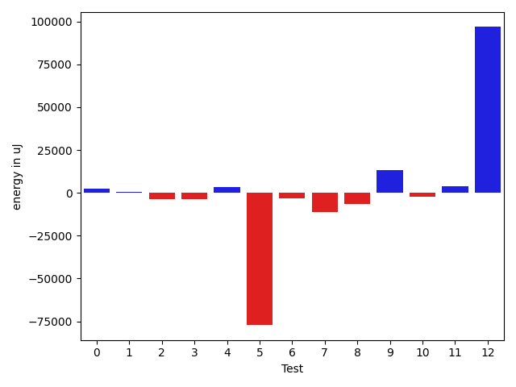

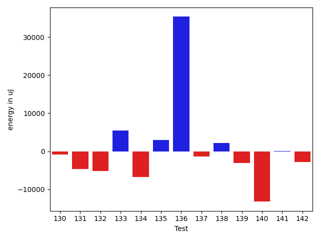

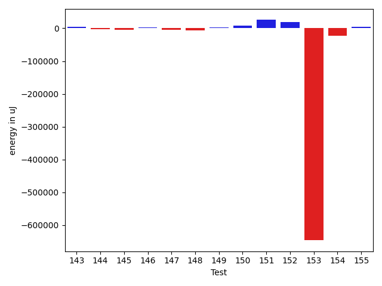

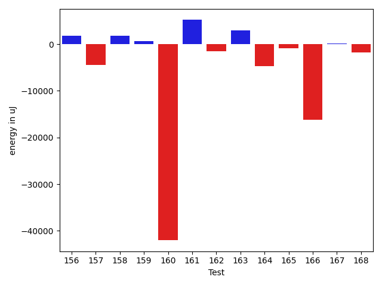

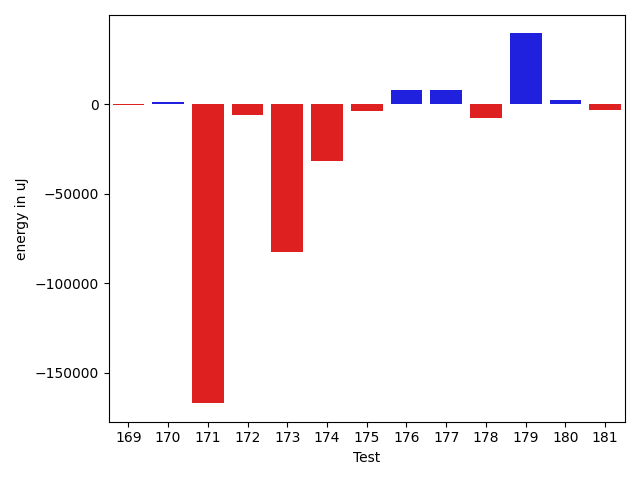

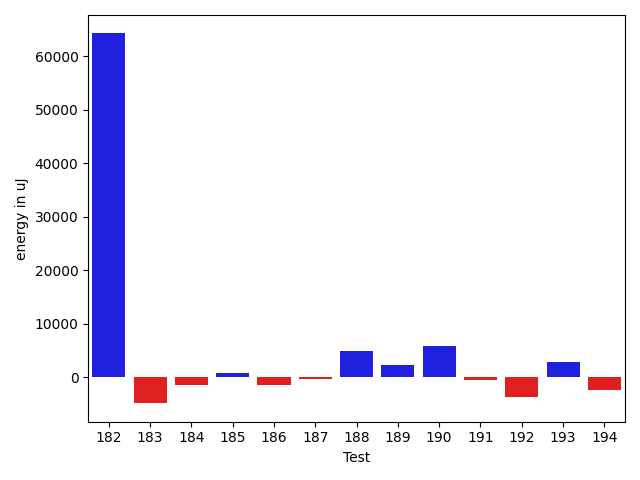

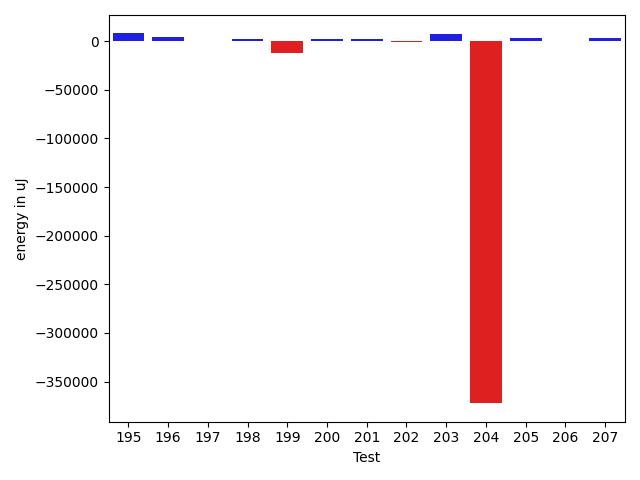

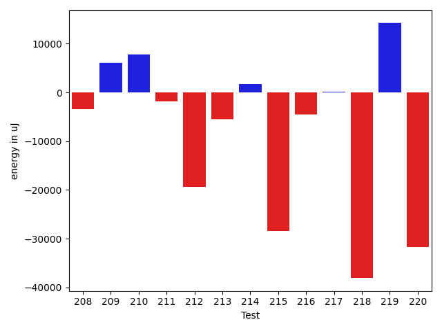

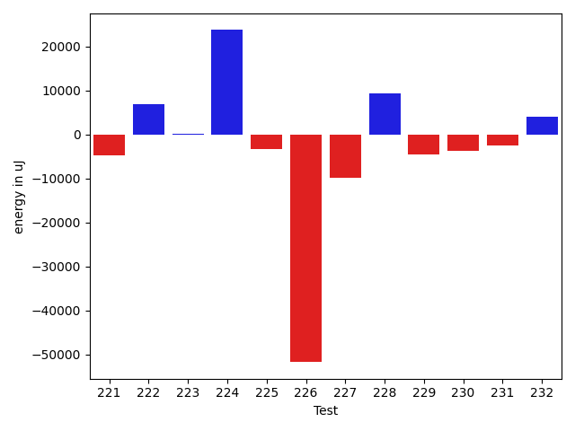

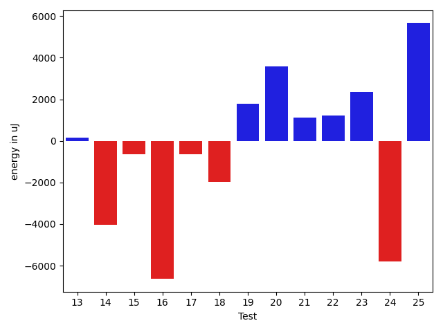

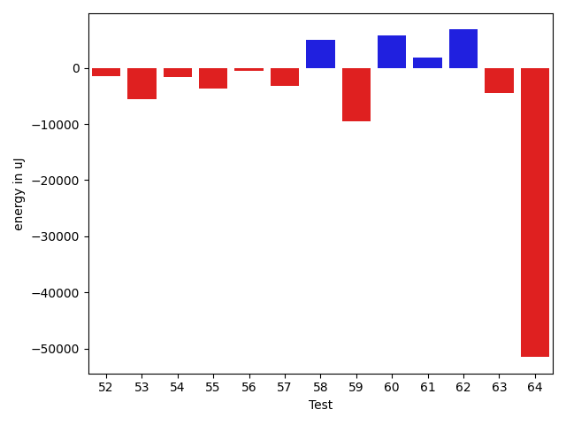

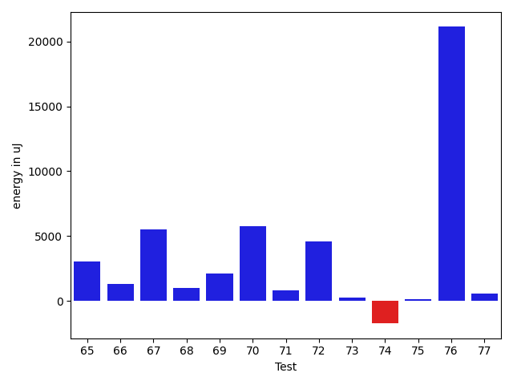

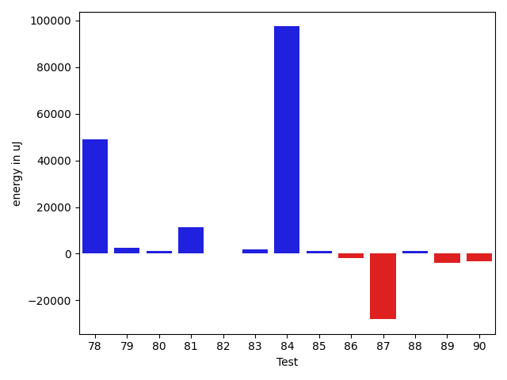

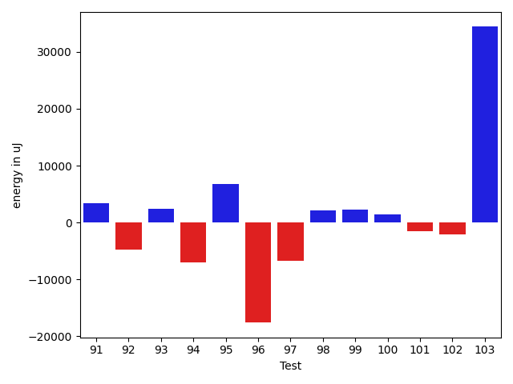

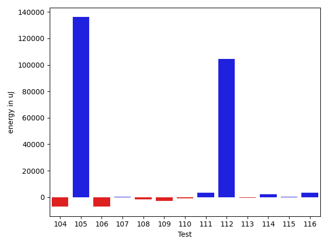

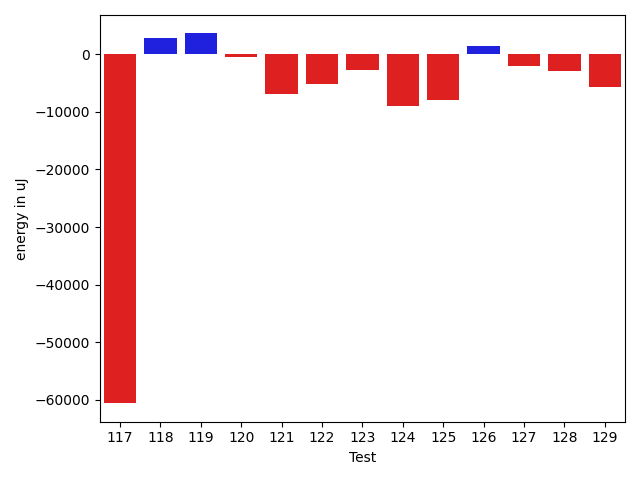

| ID | EnergyV1 | EnergyV2 | DeltaEnergy |
| --- | --- | --- | --- |
| 0 | 37325.134516748905 | 39739.89346399311 | 2414.758947244205 |
| 1 | 38193.72794405939 | 38704.16404331451 | 510.43609925511555 |
| 2 | 39277.72979190493 | 35718.87060764347 | -3558.8591842614624 |
| 3 | 45663.55028680237 | 41927.94354737441 | -3735.60673942796 |
| 4 | 34409.159038066864 | 37737.4860137701 | 3328.3269757032394 |
| 5 | 121909.79874126209 | 44755.08417790342 | -77154.71456335866 |
| 6 | 42105.78516444562 | 39091.576347047536 | -3014.208817398081 |
| 7 | 52121.57850036877 | 40949.59288424997 | -11171.9856161188 |
| 8 | 40190.233435714596 | 33831.221194621576 | -6359.01224109302 |
| 9 | 46054.21412913541 | 59222.485983045335 | 13168.271853909922 |
| 10 | 48606.828116333825 | 46354.92743751432 | -2251.900678819504 |
| 11 | 42342.192113446654 | 46263.88924296568 | 3921.6971295190233 |
| 12 | 45308.48665695587 | 142037.18660573178 | 96728.6999487759 |
| 13 | 40298.381518314985 | 40442.67914299357 | 144.29762467858382 |
| 14 | 39249.962160148236 | 35205.02479402753 | -4044.9373661207064 |
| 15 | 37147.74038786975 | 36504.829266935565 | -642.9111209341863 |
| 16 | 42692.06157588959 | 36056.235008239746 | -6635.826567649841 |
| 17 | 39443.82440321136 | 38804.659843873975 | -639.1645593373833 |
| 18 | 41285.246943476144 | 39328.543423214884 | -1956.7035202612606 |
| 19 | 39722.62465517029 | 41523.146064937 | 1800.521409766705 |
| 20 | 38580.747007369995 | 42164.07933972776 | 3583.3323323577642 |
| 21 | 40350.97785978956 | 41464.082155998156 | 1113.1042962085994 |
| 22 | 37795.641802546146 | 39019.01783579592 | 1223.3760332497768 |
| 23 | 38240.44467614591 | 40597.28694729507 | 2356.8422711491585 |
| 24 | 47888.30560511304 | 42107.52278733396 | -5780.78281777908 |
| 25 | 34534.68045291018 | 40195.57413351379 | 5660.893680603607 |
| 26 | 35034.505432128906 | 39850.345703125 | 4815.840270996094 |
| 27 | 41385.31953430176 | 40917.53063964844 | -467.7888946533203 |
| 28 | 40571.65470926171 | 87319.30996382642 | 46747.655254564714 |
| 29 | 58693.09150428942 | 57412.6574830615 | -1280.4340212279203 |
| 30 | 38996.40289945011 | 41369.9367097573 | 2373.5338103071845 |
| 31 | 40893.617527074464 | 39121.32267196597 | -1772.294855108492 |
| 32 | 37244.42823824847 | 39216.65881370555 | 1972.2305754570843 |
| 33 | 35382.701959551094 | 39875.17040121225 | 4492.468441661156 |
| 34 | 32097.09825708097 | 39750.11734564558 | 7653.019088564612 |
| 35 | 37141.452810950985 | 39916.254102091414 | 2774.8012911404294 |
| 36 | 66314.62356495901 | 59680.4397465009 | -6634.1838184581065 |
| 37 | 40134.415040437 | 38567.56614253754 | -1566.8488978994646 |
| 38 | 46739.653509387244 | 220272.464887876 | 173532.81137848875 |
| 39 | 77733.30193473418 | 99823.76777750366 | 22090.46584276948 |
| 40 | 35491.66963135374 | 40691.68069787964 | 5200.011066525898 |
| 41 | 42622.3583917603 | 32497.618871304432 | -10124.73952045587 |
| 42 | 40882.56822427573 | 36148.767556447245 | -4733.800667828487 |
| 43 | 39003.56089771125 | 39680.02976918817 | 676.4688714769218 |
| 44 | 36106.81236837059 | 38647.258308410645 | 2540.445940040052 |
| 45 | 39556.311794683774 | 40840.6977384849 | 1284.3859438011277 |
| 46 | 36112.359320014 | 41014.81511926162 | 4902.455799247618 |
| 47 | 207757.60490901076 | 162901.10429122648 | -44856.50061778427 |
| 48 | 607376.7962198762 | 1083312.7010177674 | 475935.9047978913 |
| 49 | 41395.36244765107 | 35114.74263758178 | -6280.619810069285 |
| 50 | 40951.04314165117 | 31890.533487312496 | -9060.509654338675 |
| 51 | 41665.624176721554 | 43934.96981860418 | 2269.3456418826245 |
| 52 | 38348.212211352904 | 36787.09674513139 | -1561.1154662215122 |
| 53 | 38919.32970714569 | 33385.61292716861 | -5533.716779977083 |
| 54 | 42601.90304368734 | 40992.54637145996 | -1609.3566722273827 |
| 55 | 38378.65298342705 | 34708.93380355835 | -3669.719179868698 |
| 56 | 35721.372881732255 | 35105.09053847066 | -616.2823432615987 |
| 57 | 38309.47669029236 | 35071.83819241822 | -3237.6384978741407 |
| 58 | 33192.47552871704 | 38151.16535663605 | 4958.689827919006 |
| 59 | 43609.91551613808 | 34072.845587685704 | -9537.069928452373 |
| 60 | 35920.60261482 | 41654.630811691284 | 5734.028196871281 |
| 61 | 38891.54845500062 | 40776.670018210425 | 1885.1215632098028 |
| 62 | 40773.58995879215 | 47569.86075696116 | 6796.270798169011 |
| 63 | 38927.17459931756 | 34398.847407861336 | -4528.327191456221 |
| 64 | 92893.2182985507 | 41387.060546875 | -51506.157751675695 |
| 65 | 39372.566195339474 | 42383.83167755784 | 3011.2654822183686 |
| 66 | 40386.143525637686 | 41705.76333707571 | 1319.619811438024 |
| 67 | 35779.32316052914 | 41304.90567995608 | 5525.582519426942 |
| 68 | 40348.190549021514 | 41311.594190583564 | 963.4036415620503 |
| 69 | 37967.41654819228 | 40099.60228252204 | 2132.1857343297597 |
| 70 | 38296.367893218994 | 44024.50922822952 | 5728.141335010529 |
| 71 | 41179.84012867816 | 42003.666881122044 | 823.8267524438852 |
| 72 | 40129.77289581299 | 44738.73929595947 | 4608.966400146484 |
| 73 | 41906.03043004531 | 42137.81980545394 | 231.78937540862535 |
| 74 | 39408.209716796875 | 37663.2939453125 | -1744.915771484375 |
| 75 | 35175.893296031725 | 35271.31745867338 | 95.42416264165513 |
| 76 | 39813.14178779257 | 60949.82122254557 | 21136.679434753 |
| 77 | 39692.54040170528 | 40223.43965995312 | 530.8992582478386 |
| 78 | 47663.525816685586 | 96599.89869025134 | 48936.37287356576 |
| 79 | 40159.23530778062 | 42765.23900799929 | 2606.0037002186727 |
| 80 | 37471.60193459704 | 38585.49726036114 | 1113.895325764097 |
| 81 | 36081.3926230331 | 47538.360824481155 | 11456.968201448057 |
| 82 | 40222.402450811525 | 40465.77297283771 | 243.3705220261836 |
| 83 | 38634.618214281276 | 40314.51320400381 | 1679.894989722532 |
| 84 | 113300.63975963564 | 210754.36357518454 | 97453.7238155489 |
| 85 | 37501.62420281535 | 38820.59411855228 | 1318.9699157369323 |
| 86 | 42309.458775787825 | 40409.69962797829 | -1899.7591478095346 |
| 87 | 82594.2471803585 | 54466.53587428504 | -28127.71130607347 |
| 88 | 37865.22265625 | 39006.809814453125 | 1141.587158203125 |
| 89 | 44229.249317765236 | 40383.55514907837 | -3845.6941686868668 |
| 90 | 42364.22481918335 | 39005.22705078125 | -3358.9977684020996 |
| 91 | 40479.509765625 | 43798.069595336914 | 3318.559829711914 |
| 92 | 41616.3525390625 | 36782.679443359375 | -4833.673095703125 |
| 93 | 34067.10068488121 | 36470.61262512207 | 2403.51194024086 |
| 94 | 42229.640075683594 | 35199.379653930664 | -7030.26042175293 |
| 95 | 35131.752601623535 | 41868.125228881836 | 6736.372627258301 |
| 96 | 55164.10033369064 | 37542.7998046875 | -17621.300529003143 |
| 97 | 41663.23220062256 | 34908.16960144043 | -6755.062599182129 |
| 98 | 65120.23966911808 | 67238.7188618774 | 2118.479192759318 |
| 99 | 38686.83432006836 | 40882.06872421503 | 2195.2344041466713 |
| 100 | 38526.941398620605 | 40006.36755371094 | 1479.426155090332 |
| 101 | 41285.7774515152 | 39721.825134277344 | -1563.952317237854 |
| 102 | 38926.72273583919 | 36828.0878229337 | -2098.634912905487 |
| 103 | 38068.73375478466 | 72499.47304535285 | 34430.739290568185 |
| 104 | 42239.43595526263 | 35080.48375114908 | -7158.95220411355 |
| 105 | 41483.00685134294 | 177524.66206341938 | 136041.65521207644 |
| 106 | 40883.37677905496 | 33853.84634380533 | -7029.530435249631 |
| 107 | 40807.05954456329 | 41161.845849990845 | 354.78630542755127 |
| 108 | 43415.61902124976 | 41632.679295770045 | -1782.939725479715 |
| 109 | 43106.653014183044 | 40195.853793248534 | -2910.7992209345102 |
| 110 | 43155.414593696594 | 42155.083141095936 | -1000.3314526006579 |
| 111 | 39592.4499130249 | 42842.8525390625 | 3250.4026260375977 |
| 112 | 37309.23329257965 | 141834.26578509808 | 104525.03249251842 |
| 113 | 39260.23034667969 | 38628.031242370605 | -632.199104309082 |
| 114 | 43172.65400505066 | 45383.78115272522 | 2211.1271476745605 |
| 115 | 42489.34174006428 | 42798.78389780886 | 309.4421577445828 |
| 116 | 39629.30099887734 | 42972.070224683564 | 3342.7692258062234 |
| 117 | 121997.23954087475 | 61355.07671561343 | -60642.16282526132 |
| 118 | 40969.74940616139 | 43917.56950104027 | 2947.82009487888 |
| 119 | 39533.17236459722 | 43179.71196018086 | 3646.5395955836357 |
| 120 | 42631.5481827476 | 42228.54648305611 | -403.00169969149283 |
| 121 | 44927.85844966593 | 38011.51150220732 | -6916.346947458609 |
| 122 | 44455.22927973342 | 39344.66795701599 | -5110.561322717433 |
| 123 | 42145.273588093936 | 39470.14644558876 | -2675.1271425051746 |
| 124 | 47286.64318847656 | 38375.39031267166 | -8911.252875804901 |
| 125 | 44563.81961168487 | 36683.86076470828 | -7879.958846976588 |
| 126 | 151459.7597962481 | 152871.5804670602 | 1411.8206708120997 |
| 127 | 43167.81806614097 | 41151.638073306676 | -2016.1799928342953 |
| 128 | 42861.37955361715 | 39905.01198747668 | -2956.3675661404704 |
| 129 | 43586.61640521168 | 37893.70814498348 | -5692.9082602282 |
| 130 | 39938.15568304062 | 39085.41630601883 | -852.7393770217896 |
| 131 | 40790.84977450529 | 36122.87546057897 | -4667.9743139263155 |
| 132 | 41789.185880092395 | 36635.00560558042 | -5154.180274511971 |
| 133 | 38613.178130209446 | 44123.99274858367 | 5510.814618374221 |
| 134 | 42721.42291134446 | 36005.83509800055 | -6715.587813343911 |
| 135 | 39802.64558760077 | 42759.66048082337 | 2957.0148932226 |
| 136 | 45443.81839392701 | 80815.41234903468 | 35371.59395510767 |
| 137 | 40399.1487955451 | 38994.483725361526 | -1404.6650701835752 |
| 138 | 38733.73819003 | 40927.88915402442 | 2194.1509639944197 |
| 139 | 42523.51841936995 | 39474.13171309889 | -3049.3867062710633 |
| 140 | 53619.125952523085 | 40374.397204332054 | -13244.728748191032 |
| 141 | 38020.33928608894 | 38061.851273024455 | 41.51198693551123 |
| 142 | 40729.99270125061 | 37877.396617976934 | -2852.5960832736746 |
| 143 | 37088.5160786733 | 41151.08708143979 | 4062.57100276649 |
| 144 | 45461.11128868908 | 42040.77456787367 | -3420.3367208154086 |
| 145 | 43126.40492407458 | 38354.462846526774 | -4771.942077547807 |
| 146 | 38663.924079179764 | 40920.62731426954 | 2256.703235089779 |
| 147 | 42414.85981940908 | 37685.94575011915 | -4728.914069289931 |
| 148 | 45273.37750853835 | 39380.58945629769 | -5892.788052240663 |
| 149 | 35883.471929927124 | 38162.448609529005 | 2278.976679601881 |
| 150 | 34889.010181427 | 42959.6650390625 | 8070.654857635498 |
| 151 | 99951.6306912297 | 125373.31968090752 | 25421.688989677816 |
| 152 | 49809.793554972865 | 69743.5646415874 | 19933.771086614543 |
| 153 | 704854.9219197016 | 58674.08674956238 | -646180.8351701392 |
| 154 | 65402.810413591826 | 43318.182399607096 | -22084.62801398473 |
| 155 | 33639.52988415961 | 39052.38639559824 | 5412.856511438629 |
| 156 | 39870.28476072758 | 41719.674158510476 | 1849.389397782892 |
| 157 | 50040.630916881135 | 45525.820264464695 | -4514.81065241644 |
| 158 | 35322.15493055597 | 37142.98410009929 | 1820.8291695433218 |
| 159 | 40691.60804748535 | 41319.85546875 | 628.2474212646484 |
| 160 | 83972.10405573534 | 41962.88099148384 | -42009.2230642515 |
| 161 | 39451.39153905958 | 44625.52805943508 | 5174.136520375498 |
| 162 | 41252.122704058886 | 39731.51796080184 | -1520.6047432570485 |
| 163 | 45955.59782503545 | 48840.10504840501 | 2884.5072233695537 |
| 164 | 42721.40287476134 | 37963.14015837584 | -4758.2627163854995 |
| 165 | 39593.79288713023 | 38700.45336409321 | -893.3395230370152 |
| 166 | 89594.26672231723 | 73395.3554996571 | -16198.911222660128 |
| 167 | 44432.47090546173 | 44566.38582620734 | 133.91492074561393 |
| 168 | 41120.88385056278 | 39288.605698675085 | -1832.2781518876945 |
| 169 | 39567.51447084127 | 38959.04855164818 | -608.4659191930914 |
| 170 | 42451.33325576782 | 43687.94990444183 | 1236.6166486740112 |
| 171 | 206079.78494139132 | 39141.865602049926 | -166937.9193393414 |
| 172 | 44288.86608886719 | 38072.06855773926 | -6216.79753112793 |
| 173 | 129994.53593152593 | 47706.26149449067 | -82288.27443703526 |
| 174 | 71554.17115555593 | 39727.2234164157 | -31826.947739140232 |
| 175 | 41596.612252111314 | 37524.08615256463 | -4072.5260995466815 |
| 176 | 45540.451300063505 | 53499.710501571455 | 7959.25920150795 |
| 177 | 39540.12048003594 | 47142.32139285731 | 7602.200912821369 |
| 178 | 55409.04698197001 | 47762.26991679488 | -7646.777065175127 |
| 179 | 84779.56803149093 | 124142.29257601146 | 39362.72454452053 |
| 180 | 40494.10301370051 | 42639.05074446686 | 2144.9477307663547 |
| 181 | 38614.903882190585 | 35471.235880970955 | -3143.6680012196302 |
| 182 | 38043.99667739868 | 102285.70788574219 | 64241.711208343506 |
| 183 | 40670.47934919596 | 35827.616844307064 | -4842.862504888893 |
| 184 | 43694.14511537552 | 42221.71710121445 | -1472.4280141610652 |
| 185 | 38736.18359375 | 39549.658203125 | 813.474609375 |
| 186 | 40648.96406853359 | 39176.575239916754 | -1472.3888286168367 |
| 187 | 40339.18719655358 | 40059.00967992865 | -280.1775166249354 |
| 188 | 68805.50532697729 | 73766.96121364988 | 4961.455886672586 |
| 189 | 36460.29008054733 | 38769.225386202335 | 2308.9353056550026 |
| 190 | 36287.23279947201 | 42168.47384559839 | 5881.241046126379 |
| 191 | 41883.3950248512 | 41422.81746985938 | -460.57755499181803 |
| 192 | 40484.18378535609 | 36842.61133517012 | -3641.572450185966 |
| 193 | 38551.626291192486 | 41469.83110690117 | 2918.204815708683 |
| 194 | 44829.53540660035 | 42387.58226849884 | -2441.9531381015113 |
| 195 | 35153.4439279926 | 43147.34545254707 | 7993.901524554472 |
| 196 | 36073.50325059891 | 40399.46883940697 | 4325.96558880806 |
| 197 | 42510.123481333256 | 42928.28520053625 | 418.1617192029953 |
| 198 | 37613.06043594575 | 39883.33134234058 | 2270.2709063948278 |
| 199 | 52887.651638031006 | 40737.83059954643 | -12149.821038484573 |
| 200 | 38613.01907348633 | 40880.12557220459 | 2267.1064987182617 |
| 201 | 42921.99411588907 | 44913.33077245951 | 1991.3366565704346 |
| 202 | 40867.954524710774 | 40616.21838378906 | -251.73614092171192 |
| 203 | 37261.9686869249 | 44797.91410242388 | 7535.94541549898 |
| 204 | 424084.99908595014 | 51733.24077987844 | -372351.7583060717 |
| 205 | 38230.81245838136 | 41305.295088762046 | 3074.482630380684 |
| 206 | 37159.176837195526 | 37246.8888096867 | 87.7119724911754 |
| 207 | 39061.863322820514 | 42842.06961792852 | 3780.206295108008 |
| 208 | 38734.3154296875 | 35309.67465209961 | -3424.6407775878906 |
| 209 | 36980.69009996744 | 43115.74940971554 | 6135.059309748103 |
| 210 | 35983.62614315191 | 43784.95307206576 | 7801.326928913848 |
| 211 | 43502.89080810547 | 41729.70822143555 | -1773.1825866699219 |
| 212 | 77925.28671112793 | 58521.26874550678 | -19404.017965621155 |
| 213 | 45246.635107040405 | 39770.8020401001 | -5475.833066940308 |
| 214 | 44809.73190307617 | 46465.264773368835 | 1655.5328702926636 |
| 215 | 103392.25793963927 | 74970.20223680578 | -28422.055702833488 |
| 216 | 40395.288519808455 | 35852.6919241298 | -4542.596595678653 |
| 217 | 37128.501681631955 | 37329.26086556178 | 200.75918392982567 |
| 218 | 101897.86049671125 | 63823.29239342751 | -38074.56810328374 |
| 219 | 47732.17428739184 | 61947.23113591771 | 14215.05684852587 |
| 220 | 274065.4796474119 | 242418.69897820428 | -31646.780669207626 |
| 221 | 43418.29996985197 | 38663.36857742071 | -4754.931392431259 |
| 222 | 36416.81482505798 | 43357.479756355286 | 6940.664931297302 |
| 223 | 37602.80744161319 | 37730.212428551444 | 127.40498693825066 |
| 224 | 36911.347943916844 | 60616.840369083104 | 23705.49242516626 |
| 225 | 39354.361120224 | 35926.74254870415 | -3427.6185715198517 |
| 226 | 97483.57135238111 | 45726.477246915376 | -51757.09410546574 |
| 227 | 71106.4214477539 | 61337.952545166016 | -9768.46890258789 |
| 228 | 35959.71741512627 | 45282.99352586466 | 9323.276110738385 |
| 229 | 41364.25215148926 | 36777.22964715958 | -4587.022504329681 |
| 230 | 41253.405434752975 | 37544.48410383582 | -3708.9213309171537 |
| 231 | 42430.148719421006 | 39960.76408657977 | -2469.384632841233 |
| 232 | 36829.66357421875 | 40765.704122712836 | 3936.0405484940857 |

## Delta Duration per test method

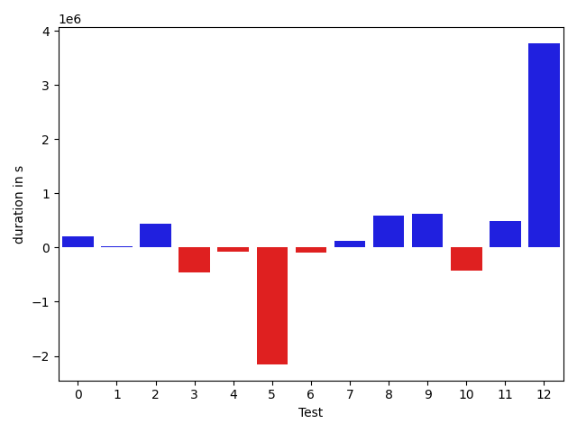

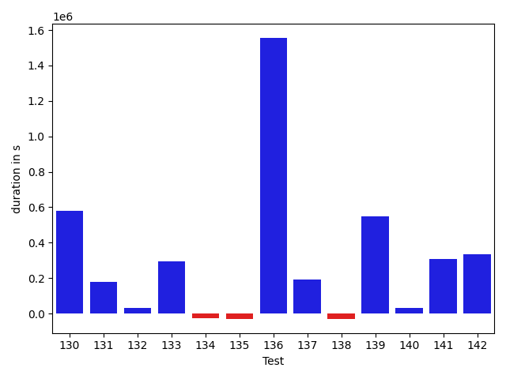

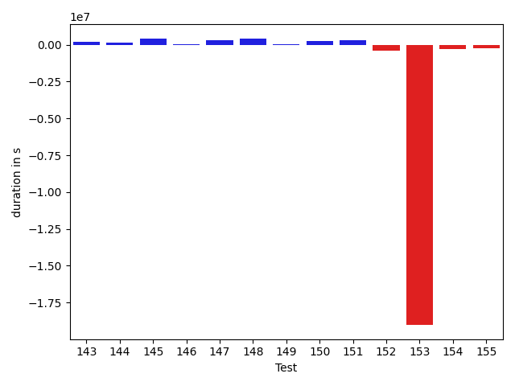

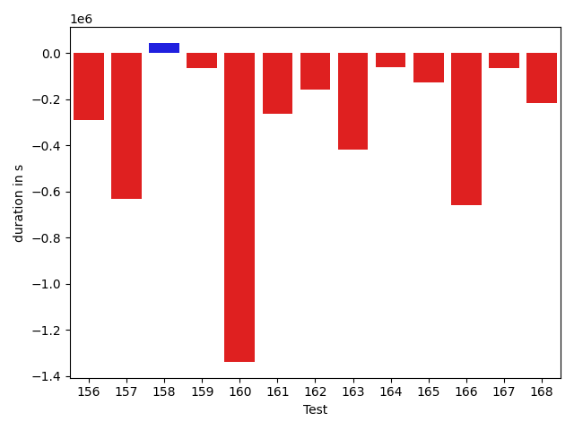

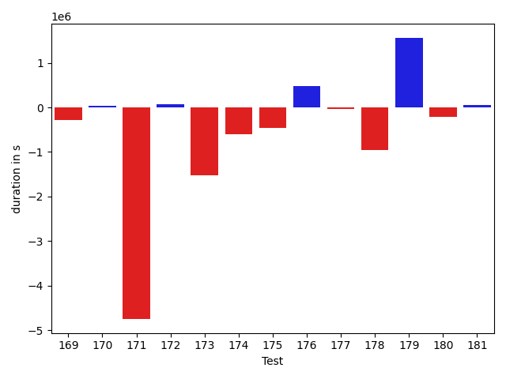

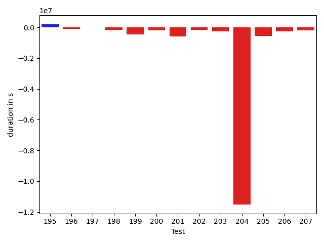

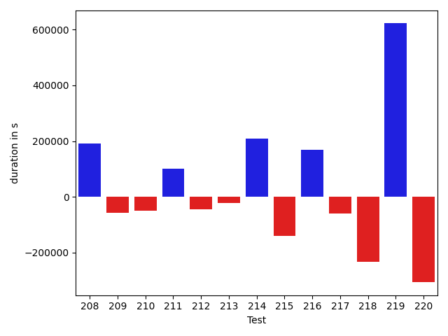

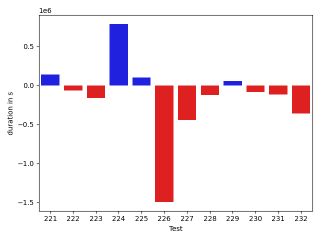

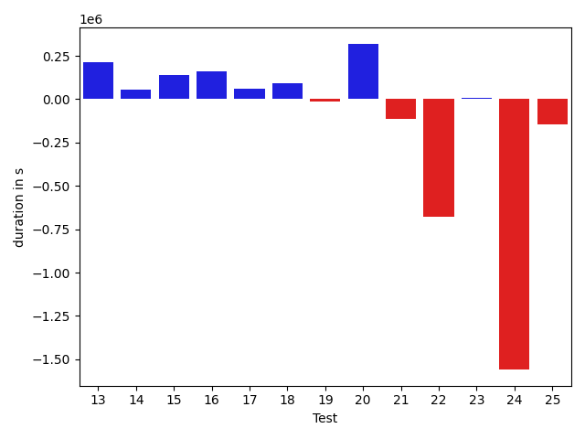

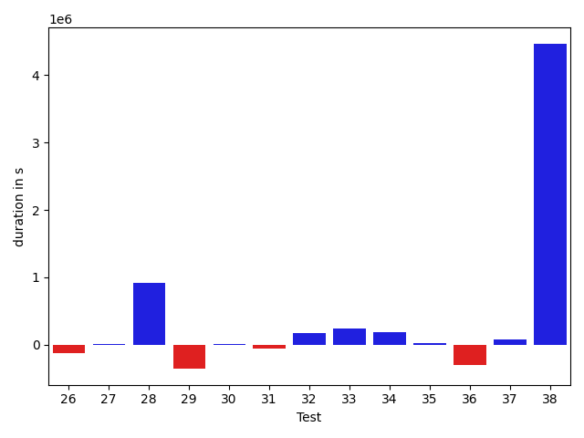

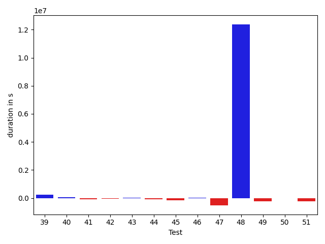

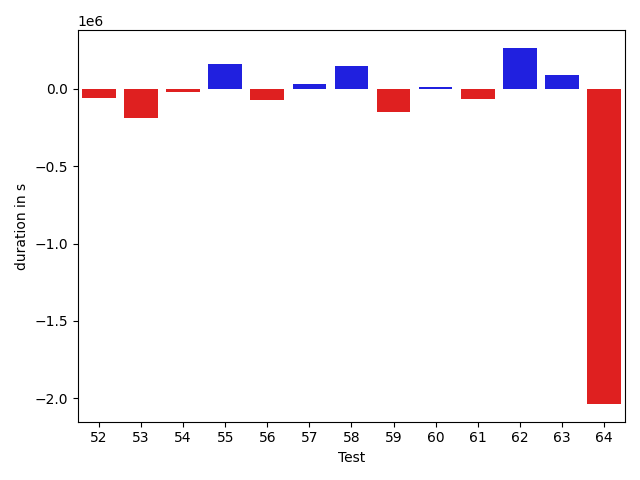

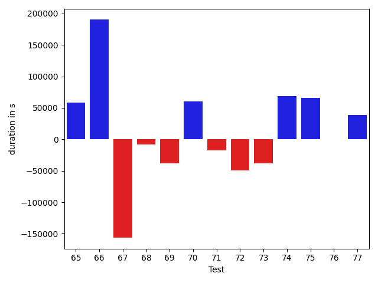

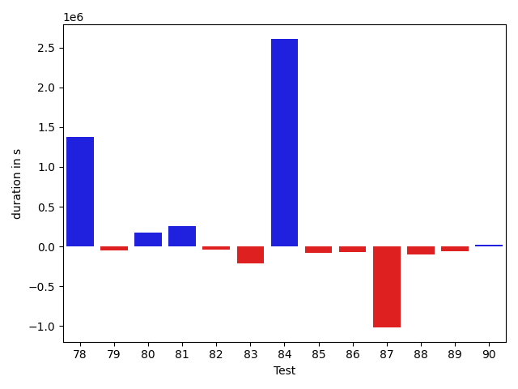

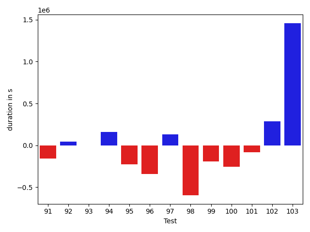

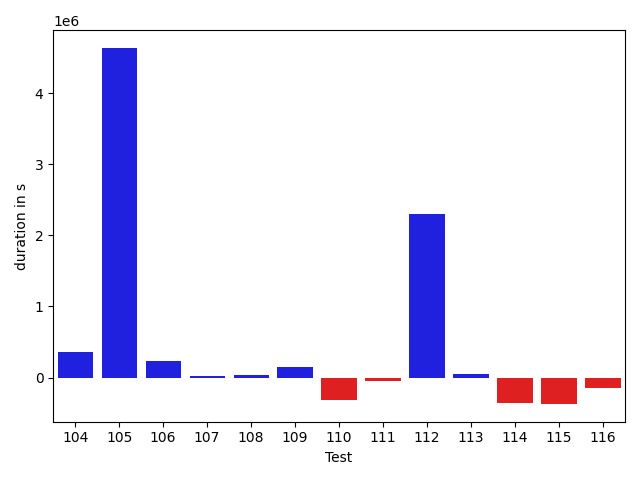

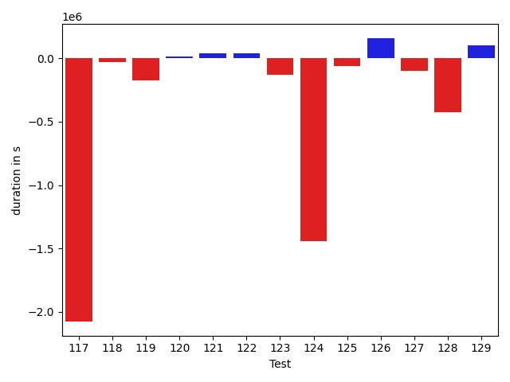

| ID | DurationV1 | DurationsV2 | DeltaDuration |
| --- | --- | --- | --- |
| 0 | 834833.1848495227 | 1047560.8519202725 | 212727.6670707498 |
| 1 | 804730.4278258692 | 820437.5784058439 | 15707.150579974754 |
| 2 | 829367.6594265115 | 1270231.5243362982 | 440863.86490978673 |
| 3 | 1233868.3349110007 | 776641.1515005988 | -457227.1834104019 |
| 4 | 520761.0683031082 | 451192.1232997179 | -69568.94500339031 |
| 5 | 3321929.82756123 | 1166544.9035652387 | -2155384.9239959912 |
| 6 | 875010.8835359702 | 784016.6834660831 | -90994.2000698871 |
| 7 | 1161720.62489483 | 1279314.6211591477 | 117593.99626431777 |
| 8 | 743892.9303219169 | 1339546.4505240517 | 595653.5202021347 |
| 9 | 1229219.9311536108 | 1858229.2253546035 | 629009.2942009927 |
| 10 | 1272994.6026375515 | 849595.1802132161 | -423399.4224243354 |
| 11 | 1050266.8833660744 | 1532488.0044407942 | 482221.1210747198 |
| 12 | 883461.3330750279 | 4651259.471783879 | 3767798.1387088513 |
| 13 | 593757.4676247232 | 804686.4383317204 | 210928.9707069972 |
| 14 | 677989.8292042161 | 731652.8464970551 | 53663.01729283901 |
| 15 | 599030.1025424567 | 735785.5077325972 | 136755.40519014047 |
| 16 | 440544.4459915161 | 599331.5741500854 | 158787.12815856934 |
| 17 | 687024.1103581074 | 746329.9184195603 | 59305.80806145293 |
| 18 | 601365.6810587805 | 690928.7313576066 | 89563.05029882607 |
| 19 | 1267443.5568870888 | 1252173.364119266 | -15270.192767822882 |
| 20 | 476647.86151123047 | 795503.6959361471 | 318855.83442491665 |
| 21 | 975616.1843670196 | 863356.1477215617 | -112260.03664545785 |
| 22 | 1407231.256023896 | 728689.3792757096 | -678541.8767481863 |
| 23 | 649005.0668567717 | 656647.9802994877 | 7642.9134427160025 |
| 24 | 2395835.4211069713 | 837472.510753497 | -1558362.9103534743 |
| 25 | 815501.6508617772 | 672636.5382507464 | -142865.1126110308 |
| 26 | 451701.2715549469 | 331566.36376953125 | -120134.90778541565 |
| 27 | 329171.18141174316 | 347933.3056640625 | 18762.124252319336 |
| 28 | 1733972.5489672422 | 2656829.4109938173 | 922856.862026575 |
| 29 | 1799835.6143438732 | 1449078.4248218746 | -350757.18952199863 |
| 30 | 884484.9033819555 | 894497.8518326262 | 10012.948450670694 |
| 31 | 952481.0008345649 | 903719.2006781455 | -48761.8001564194 |
| 32 | 712376.4053279547 | 888215.1211853428 | 175838.7158573881 |
| 33 | 1007084.754869015 | 1253376.3269143654 | 246291.57204535045 |
| 34 | 636575.116565209 | 829827.5438028851 | 193252.4272376761 |
| 35 | 722686.4733214735 | 748462.1177349979 | 25775.644413524424 |
| 36 | 2474989.3130752863 | 2173848.0985910147 | -301141.2144842716 |
| 37 | 1374758.6067949084 | 1460775.08120771 | 86016.47441280168 |
| 38 | 1078272.9878416127 | 5539177.362784299 | 4460904.374942686 |
| 39 | 2415967.945603261 | 2648054.761706805 | 232086.8161035441 |
| 40 | 778109.3379916252 | 847793.3541868862 | 69684.01619526104 |
| 41 | 684520.284424033 | 614612.4455900867 | -69907.83883394627 |
| 42 | 1128983.693410595 | 1092303.701109652 | -36679.992300943006 |
| 43 | 713422.5421283063 | 733208.9399554783 | 19786.397827171953 |
| 44 | 519280.54183827154 | 436103.32134628296 | -83177.22049198858 |
| 45 | 995569.7796926568 | 836262.3128673551 | -159307.46682530176 |
| 46 | 806421.6981115179 | 831678.6583082285 | 25256.96019671054 |
| 47 | 4935644.972444027 | 4416526.136604901 | -519118.8358391253 |
| 48 | 15008806.76870487 | 27386501.555035062 | 12377694.786330191 |
| 49 | 1246157.5059569157 | 1021704.0507879071 | -224453.45516900858 |
| 50 | 491353.1311578907 | 458910.9818216413 | -32442.149336249393 |
| 51 | 671149.9831126286 | 441715.30473584216 | -229434.6783767864 |
| 52 | 718234.0362750024 | 655437.3763788452 | -62796.659896157216 |
| 53 | 600833.1698138714 | 410470.54157951474 | -190362.62823435664 |
| 54 | 477623.6943127513 | 455318.37117385864 | -22305.32313889265 |
| 55 | 405935.07135248184 | 564154.738489151 | 158219.66713666916 |
| 56 | 773203.866451817 | 699561.1884280227 | -73642.67802379432 |
| 57 | 411727.51822280884 | 439348.9893544391 | 27621.471131630242 |
| 58 | 329364.58602523804 | 473561.72159194946 | 144197.13556671143 |
| 59 | 545745.8223230839 | 393138.1727419533 | -152607.6495811306 |
| 60 | 390418.39240033925 | 402140.07784461975 | 11721.685444280505 |
| 61 | 524664.4586321098 | 460815.2540695046 | -63849.204562605184 |
| 62 | 684915.7878497036 | 948423.2671757252 | 263507.4793260216 |
| 63 | 818557.3226145703 | 907452.5144293732 | 88895.19181480294 |
| 64 | 2464032.696510114 | 428216.9541015625 | -2035815.7424085513 |
| 65 | 949410.7595481498 | 1007835.3812576245 | 58424.62170947471 |
| 66 | 501293.89616957493 | 691323.871778205 | 190029.9756086301 |
| 67 | 634843.4259060919 | 478507.3929519057 | -156336.0329541862 |
| 68 | 482677.2803607381 | 474316.46805525105 | -8360.812305487052 |
| 69 | 727884.3733055799 | 689872.4613081696 | -38011.911997410236 |
| 70 | 362289.7497262955 | 422745.5471701622 | 60455.79744386673 |
| 71 | 568837.7729163872 | 551622.0396808115 | -17215.733235575724 |
| 72 | 495768.572719574 | 446258.0973739624 | -49510.47534561157 |
| 73 | 564462.9955068558 | 526311.7988793337 | -38151.19662752212 |
| 74 | 435155.2141723633 | 504023.89404296875 | 68868.67987060547 |
| 75 | 645386.6801456168 | 711197.508303895 | 65810.82815827825 |
| 76 | 1391271.4085214317 | 1392022.6837838509 | 751.2752624191344 |
| 77 | 489927.77955838223 | 528867.188210845 | 38939.408652462764 |
| 78 | 1387189.9223398103 | 2767367.154334197 | 1380177.2319943865 |
| 79 | 903851.6678249597 | 856381.3825237812 | -47470.28530117858 |
| 80 | 630280.5376495336 | 800240.5886622138 | 169960.05101268017 |
| 81 | 865761.9324430996 | 1123639.594489412 | 257877.66204631235 |
| 82 | 809453.1320233587 | 764962.5746285209 | -44490.557394837844 |
| 83 | 934875.5892220514 | 721639.6584853467 | -213235.93073670473 |
| 84 | 3406105.633360131 | 6015419.52237095 | 2609313.889010819 |
| 85 | 661526.5034475061 | 581126.6784174179 | -80399.82503008819 |
| 86 | 958968.9109437853 | 891184.0670857471 | -67784.84385803819 |
| 87 | 2217452.9108603336 | 1200569.1803032004 | -1016883.7305571332 |
| 88 | 536277.3076171875 | 434267.2834472656 | -102010.02416992188 |
| 89 | 504544.7699906826 | 441309.7464158535 | -63235.0235748291 |
| 90 | 501218.9021911621 | 518914.7783203125 | 17695.87612915039 |
| 91 | 449562.021484375 | 292254.03106689453 | -157307.99041748047 |
| 92 | 475810.2265625 | 520881.05419921875 | 45070.82763671875 |
| 93 | 513948.68825244904 | 513011.18589782715 | -937.5023546218872 |
| 94 | 356938.01875305176 | 513326.6212310791 | 156388.60247802734 |
| 95 | 579886.1734161377 | 351066.7065734863 | -228819.46684265137 |
| 96 | 737303.0711941719 | 392104.64306640625 | -345198.42812776566 |
| 97 | 371574.2502746582 | 503598.11895751953 | 132023.86868286133 |
| 98 | 2364961.951668579 | 1767657.9774307497 | -597303.9742378294 |
| 99 | 569166.0385131836 | 376866.40471446514 | -192299.63379871845 |
| 100 | 638730.1894989014 | 380793.9930419922 | -257936.19645690918 |
| 101 | 506886.69989299774 | 421620.7088623047 | -85265.99103069305 |
| 102 | 805969.8991646061 | 1093123.4910198492 | 287153.5918552431 |
| 103 | 1434027.6121174362 | 2893525.822650705 | 1459498.2105332687 |
| 104 | 632815.6986893881 | 989356.9275469063 | 356541.2288575182 |
| 105 | 854065.4898119925 | 5488989.891339362 | 4634924.401527369 |
| 106 | 647348.2065098252 | 883645.2192713208 | 236297.01276149566 |
| 107 | 368701.1951646805 | 383670.7802474499 | 14969.585082769394 |
| 108 | 963712.8210240367 | 998340.6909442757 | 34627.86992023897 |
| 109 | 447157.95637464523 | 591443.8191237152 | 144285.86274906993 |
| 110 | 695562.1527378559 | 384667.2923143208 | -310894.8604235351 |
| 111 | 406998.8015155792 | 359656.4765625 | -47342.32495307922 |
| 112 | 495652.8181066513 | 2799744.985625088 | 2304092.167518437 |
| 113 | 355540.4282836914 | 407782.7254829407 | 52242.29719924927 |
| 114 | 836287.0964603424 | 481327.7257938385 | -354959.3706665039 |
| 115 | 1411956.3278244282 | 1040561.3271968643 | -371395.0006275639 |
| 116 | 676007.9072266857 | 532780.722562908 | -143227.1846637777 |
| 117 | 3162867.4040720686 | 1085100.195570618 | -2077767.2085014507 |
| 118 | 465149.2070884409 | 436109.28756576695 | -29039.91952267394 |
| 119 | 801526.5844526147 | 631579.9663952747 | -169946.61805733992 |
| 120 | 508758.723438886 | 523271.4483248093 | 14512.724885923322 |
| 121 | 1125313.6922699441 | 1164244.2828401243 | 38930.59057018021 |
| 122 | 686734.7938583505 | 727586.6178126782 | 40851.82395432773 |
| 123 | 763981.596212121 | 635372.8562091808 | -128608.74000294018 |
| 124 | 1807116.8447265625 | 364293.2498920262 | -1442823.5948345363 |
| 125 | 730447.3268249496 | 672625.0648560106 | -57822.26196893898 |
| 126 | 3619946.5201806705 | 3780331.7282535923 | 160385.20807292173 |
| 127 | 759389.2178039876 | 660660.3889182282 | -98728.82888575934 |
| 128 | 966710.1281898865 | 540377.4793362252 | -426332.64885366126 |
| 129 | 1036772.0003733215 | 1141516.8987813455 | 104744.89840802399 |
| 130 | 404821.78769636154 | 986029.6891040802 | 581207.9014077187 |
| 131 | 527172.1277468272 | 703774.9200296208 | 176602.79228279355 |
| 132 | 949317.6868903087 | 979432.7787722966 | 30115.09188198787 |
| 133 | 432007.0640515536 | 724780.377208136 | 292773.3131565824 |
| 134 | 602873.0281765608 | 574664.6720290472 | -28208.35614751361 |
| 135 | 464812.85891768336 | 434097.6595516056 | -30715.19936607778 |
| 136 | 906692.7511558407 | 2462391.635340658 | 1555698.8841848173 |
| 137 | 447695.14807647467 | 638114.9111185316 | 190419.76304205693 |
| 138 | 625709.3586196046 | 595069.750800319 | -30639.607819285593 |
| 139 | 633869.4965261463 | 1181773.130045373 | 547903.6335192267 |
| 140 | 804717.3894844819 | 836332.957426467 | 31615.567941985093 |
| 141 | 390442.13297498226 | 695881.2172761323 | 305439.08430115005 |
| 142 | 639554.8443185625 | 973263.9516096393 | 333709.1072910768 |
| 143 | 480992.81733842567 | 665273.4697658056 | 184280.65242737997 |
| 144 | 500356.00744048506 | 664012.3332634259 | 163656.3258229408 |
| 145 | 797533.467248762 | 1221699.9104621287 | 424166.44321336667 |
| 146 | 490676.6105042696 | 540840.9318425059 | 50164.32133823633 |
| 147 | 633279.1263521019 | 925400.2885179145 | 292121.16216581257 |
| 148 | 500613.284867412 | 907683.1019064449 | 407069.8170390329 |
| 149 | 631330.5431924972 | 661589.2377549468 | 30258.694562449586 |
| 150 | 704717.5197067261 | 964707.8271484375 | 259990.30744171143 |
| 151 | 3371309.873092978 | 3688757.0356986313 | 317447.1626056535 |
| 152 | 1644241.2698856615 | 1270587.3960806148 | -373653.8738050468 |
| 153 | 20446770.287706 | 1427573.683853624 | -19019196.603852376 |
| 154 | 1442981.2205958117 | 1149312.0253166324 | -293669.1952791794 |
| 155 | 1010343.8253339168 | 753745.3232708287 | -256598.50206308812 |
| 156 | 1251052.5199760268 | 961949.1202985058 | -289103.3996775211 |
| 157 | 1373229.2047685934 | 739256.3765382518 | -633972.8282303417 |
| 158 | 1080806.7935995888 | 1123664.929330802 | 42858.13573121326 |
| 159 | 444238.7661739588 | 379161.333984375 | -65077.43218958378 |
| 160 | 2025600.7708593924 | 687630.5771536371 | -1337970.1937057553 |
| 161 | 692584.8953173757 | 429543.8165461058 | -263041.0787712699 |
| 162 | 603997.9421256185 | 443430.8441932396 | -160567.09793237888 |
| 163 | 993819.0443696082 | 575539.0265682973 | -418280.01780131087 |
| 164 | 1202582.9409128684 | 1138655.7881007511 | -63927.152812117245 |
| 165 | 1003047.6810711818 | 874263.9584987075 | -128783.72257247427 |
| 166 | 2524238.050344322 | 1864263.758046001 | -659974.2922983209 |
| 167 | 733469.5990116686 | 668819.0013277109 | -64650.59768395766 |
| 168 | 1247778.9439962395 | 1031336.2551612323 | -216442.68883500714 |
| 169 | 1073738.3739801692 | 790019.7700151035 | -283718.6039650657 |
| 170 | 374846.3705215454 | 415305.7114944458 | 40459.34097290039 |
| 171 | 5637743.740379038 | 888304.1131849203 | -4749439.627194118 |
| 172 | 429160.0197124481 | 497155.7607269287 | 67995.74101448059 |
| 173 | 3493799.9407364903 | 1978664.8212546748 | -1515135.1194818155 |
| 174 | 1737864.0434287381 | 1143749.9291435373 | -594114.1142852008 |
| 175 | 1074911.4794586173 | 620142.2516756516 | -454769.22778296564 |
| 176 | 880302.0964744614 | 1367247.2325997623 | 486945.1361253009 |
| 177 | 825740.4137409957 | 788691.024677179 | -37049.389063816634 |
| 178 | 1808665.4647043606 | 855083.5717406096 | -953581.892963751 |
| 179 | 2326575.63219022 | 3888806.411748053 | 1562230.779557833 |
| 180 | 760151.4690860135 | 546516.0182043468 | -213635.45088166674 |
| 181 | 536670.1001010984 | 589028.2751930952 | 52358.17509199679 |
| 182 | 366127.6813659668 | 2424991.8045654297 | 2058864.123199463 |
| 183 | 473433.24466991425 | 625124.5453378248 | 151691.3006679106 |
| 184 | 462327.17559051514 | 430492.4939015657 | -31834.681688949466 |
| 185 | 489823.646484375 | 342545.658203125 | -147277.98828125 |
| 186 | 877074.5092383267 | 768422.7670614469 | -108651.74217687978 |
| 187 | 836799.684183765 | 907422.6232998141 | 70622.93911604909 |
| 188 | 2207945.9282781696 | 1470766.1780241714 | -737179.7502539982 |
| 189 | 421093.74490213394 | 398882.40070974827 | -22211.344192385674 |
| 190 | 1020964.6578900121 | 756436.9442495902 | -264527.713640422 |
| 191 | 739708.7451083432 | 673324.1610989524 | -66384.58400939079 |
| 192 | 991463.7434967526 | 657661.5872735152 | -333802.1562232374 |
| 193 | 443574.06019095774 | 787224.1331654191 | 343650.07297446136 |
| 194 | 580076.095331679 | 795423.3079327978 | 215347.21260111884 |
| 195 | 437947.57952033234 | 640969.1705830097 | 203021.59106267738 |
| 196 | 497584.7997069359 | 405503.08156466484 | -92081.71814227104 |
| 197 | 404811.227624774 | 424752.3520906642 | 19941.12446589023 |
| 198 | 887338.2550625476 | 721723.9145485075 | -165614.3405140401 |
| 199 | 928164.3521652222 | 478574.1563511789 | -449590.1958140433 |
| 200 | 513938.8568725586 | 323866.56813812256 | -190072.28873443604 |
| 201 | 952905.8936296701 | 351152.89478990436 | -601752.9988397658 |
| 202 | 566727.4856252521 | 392963.54443359375 | -173763.94119165838 |
| 203 | 865031.2810672206 | 620974.9983832175 | -244056.28268400312 |
| 204 | 12745978.843561789 | 1230526.2338753066 | -11515452.609686483 |
| 205 | 1162123.0597865055 | 592102.3382078246 | -570020.7215786809 |
| 206 | 1184415.539920698 | 928060.3793605308 | -256355.16056016716 |
| 207 | 788736.4932508804 | 603160.729656923 | -185575.7635939574 |
| 208 | 472570.1862792969 | 664651.4659118652 | 192081.27963256836 |
| 209 | 827528.527859485 | 769740.7667593312 | -57787.76110015379 |
| 210 | 763650.4383198445 | 713452.7759429011 | -50197.66237694339 |
| 211 | 348878.34454345703 | 449444.2855758667 | 100565.94103240967 |
| 212 | 1868520.388094793 | 1823913.7591286814 | -44606.62896611169 |
| 213 | 394569.9481458068 | 373387.97888946533 | -21181.969256341457 |
| 214 | 423452.39434814453 | 631399.888540268 | 207947.4941921234 |
| 215 | 2531834.8086967324 | 2390980.836749429 | -140853.9719473035 |
| 216 | 945915.3224963244 | 1113543.0866389212 | 167627.76414259674 |
| 217 | 1016958.503285333 | 958619.4614010373 | -58339.04188429576 |
| 218 | 2213441.9825914297 | 1980319.3316698032 | -233122.65092162648 |
| 219 | 1469591.7127676834 | 2091091.3700979573 | 621499.6573302739 |
| 220 | 6300560.731783422 | 5994599.781464029 | -305960.9503193926 |
| 221 | 407318.17725637555 | 545952.6583316922 | 138634.48107531667 |
| 222 | 523729.575548172 | 460260.0229282379 | -63469.55261993408 |
| 223 | 740809.3506584348 | 580416.4097587654 | -160392.94089966943 |
| 224 | 1070725.824217225 | 1856241.3083543414 | 785515.4841371165 |
| 225 | 396716.43793964386 | 498944.57847487926 | 102228.1405352354 |
| 226 | 2036786.9416226975 | 542611.2960935133 | -1494175.6455291843 |
| 227 | 1346946.4915771484 | 903913.9765319824 | -443032.515045166 |
| 228 | 636458.8327339389 | 514291.2273748414 | -122167.60535909754 |
| 229 | 361975.37786865234 | 414731.13334965706 | 52755.755481004715 |
| 230 | 785263.5012648804 | 700379.0626287977 | -84884.43863608269 |
| 231 | 751107.7696100342 | 633492.3253801595 | -117615.44422987464 |
| 232 | 767724.8051757812 | 408455.8689438421 | -359268.9362319391 |

## Misc.

| ID | Test Class | Test Method |
| --- | --- | --- |
| 0 | com.google.gson.functional.CustomTypeAdaptersTest | testCustomAdapterInvokedForCollectionElementDeserialization |
| 1 | com.google.gson.functional.CustomTypeAdaptersTest | testCustomAdapterInvokedForMapElementDeserialization |
| 2 | com.google.gson.functional.CustomTypeAdaptersTest | testCustomAdapterInvokedForMapElementSerializationWithType |
| 3 | com.google.gson.functional.CustomTypeAdaptersTest | testCustomNestedSerializers |
| 4 | com.google.gson.functional.CustomTypeAdaptersTest | testCustomAdapterInvokedForMapElementSerialization |
| 5 | com.google.gson.functional.CustomTypeAdaptersTest | testCustomSerializers |
| 6 | com.google.gson.functional.CustomTypeAdaptersTest | testCustomNestedDeserializers |
| 7 | com.google.gson.functional.CustomTypeAdaptersTest | testCustomTypeAdapterDoesNotAppliesToSubClasses |
| 8 | com.google.gson.functional.CustomTypeAdaptersTest | testRegisterHierarchyAdapterForDate |
| 9 | com.google.gson.functional.CustomTypeAdaptersTest | testCustomAdapterInvokedForCollectionElementSerializationWithType |
| 10 | com.google.gson.functional.CustomTypeAdaptersTest | testCustomDeserializers |
| 11 | com.google.gson.functional.CustomTypeAdaptersTest | testEnsureCustomSerializerNotInvokedForNullValues |
| 12 | com.google.gson.functional.CustomTypeAdaptersTest | testEnsureCustomDeserializerNotInvokedForNullValues |
| 13 | com.google.gson.functional.CustomTypeAdaptersTest | testCustomTypeAdapterAppliesToSubClassesSerializedAsBaseClass |
| 14 | com.google.gson.functional.CustomTypeAdaptersTest | testCustomByteArrayDeserializerAndInstanceCreator |
| 15 | com.google.gson.functional.CustomTypeAdaptersTest | testCustomDeserializerInvokedForPrimitives |
| 16 | com.google.gson.functional.CustomTypeAdaptersTest | testCustomAdapterInvokedForCollectionElementSerialization |
| 17 | com.google.gson.functional.CustomTypeAdaptersTest | testCustomByteArraySerializer |
| 18 | com.google.gson.functional.CustomTypeAdaptersTest | testCustomSerializerInvokedForPrimitives |
| 19 | com.google.gson.functional.StreamingTypeAdaptersTest | testNullSafe |
| 20 | com.google.gson.functional.StreamingTypeAdaptersTest | testSerializeMap |
| 21 | com.google.gson.functional.StreamingTypeAdaptersTest | testSerializeWithCustomTypeAdapter |
| 22 | com.google.gson.functional.StreamingTypeAdaptersTest | testSerialize1dArray |
| 23 | com.google.gson.functional.StreamingTypeAdaptersTest | testDeserializeWithCustomTypeAdapter |
| 24 | com.google.gson.functional.StreamingTypeAdaptersTest | testSerialize |
| 25 | com.google.gson.functional.StreamingTypeAdaptersTest | testSerialize2dArray |
| 26 | com.google.gson.functional.StreamingTypeAdaptersTest | testSerializeNullField |
| 27 | com.google.gson.functional.StreamingTypeAdaptersTest | testSerializeNullObject |
| 28 | com.google.gson.functional.JsonAdapterAnnotationOnClassesTest | testJsonAdapterInvoked |
| 29 | com.google.gson.functional.JsonAdapterAnnotationOnClassesTest | testRegisteredDeserializerOverridesJsonAdapter |
| 30 | com.google.gson.functional.JsonAdapterAnnotationOnClassesTest | testSuperclassTypeAdapterNotInvoked |
| 31 | com.google.gson.functional.JsonAdapterAnnotationOnClassesTest | testNullSafeObjectFromJson |
| 32 | com.google.gson.functional.JsonAdapterAnnotationOnClassesTest | testIncorrectTypeAdapterFails |
| 33 | com.google.gson.functional.JsonAdapterAnnotationOnClassesTest | testJsonAdapterFactoryInvoked |
| 34 | com.google.gson.functional.JsonAdapterAnnotationOnClassesTest | testRegisteredAdapterOverridesJsonAdapter |
| 35 | com.google.gson.functional.JsonAdapterAnnotationOnClassesTest | testRegisteredSerializerOverridesJsonAdapter |
| 36 | com.google.gson.functional.InstanceCreatorTest | testInstanceCreatorForParametrizedType |
| 37 | com.google.gson.functional.InstanceCreatorTest | testInstanceCreatorForCollectionType |
| 38 | com.google.gson.functional.InstanceCreatorTest | testInstanceCreatorReturnsSubTypeForField |
| 39 | com.google.gson.functional.InstanceCreatorTest | testInstanceCreatorReturnsBaseType |
| 40 | com.google.gson.functional.InstanceCreatorTest | testInstanceCreatorReturnsSubTypeForTopLevelObject |
| 41 | com.google.gson.functional.DefaultTypeAdaptersTest | testDateSerializationWithPatternNotOverridenByTypeAdapter |
| 42 | com.google.gson.functional.DefaultTypeAdaptersTest | testDateSerializationWithPattern |
| 43 | com.google.gson.functional.DefaultTypeAdaptersTest | testOverrideBigIntegerTypeAdapter |
| 44 | com.google.gson.functional.DefaultTypeAdaptersTest | testDefaultGregorianCalendarDeserialization |
| 45 | com.google.gson.functional.DefaultTypeAdaptersTest | testClassSerialization |
| 46 | com.google.gson.functional.DefaultTypeAdaptersTest | testTimestampSerialization |
| 47 | com.google.gson.functional.DefaultTypeAdaptersTest | testDefaultDateDeserializationUsingBuilder |
| 48 | com.google.gson.functional.DefaultTypeAdaptersTest | testNullSerialization |
| 49 | com.google.gson.functional.DefaultTypeAdaptersTest | testDateSerializationInCollection |
| 50 | com.google.gson.functional.DefaultTypeAdaptersTest | testSetSerialization |
| 51 | com.google.gson.functional.DefaultTypeAdaptersTest | testBitSetDeserialization |
| 52 | com.google.gson.functional.DefaultTypeAdaptersTest | testSqlDateSerialization |
| 53 | com.google.gson.functional.DefaultTypeAdaptersTest | testOverrideBigDecimalTypeAdapter |
| 54 | com.google.gson.functional.DefaultTypeAdaptersTest | testClassDeserialization |
| 55 | com.google.gson.functional.DefaultTypeAdaptersTest | testBitSetSerialization |
| 56 | com.google.gson.functional.DefaultTypeAdaptersTest | testDateDeserializationWithPattern |
| 57 | com.google.gson.functional.DefaultTypeAdaptersTest | testDefaultCalendarDeserialization |
| 58 | com.google.gson.functional.DefaultTypeAdaptersTest | testDefaultGregorianCalendarSerialization |
| 59 | com.google.gson.functional.DefaultTypeAdaptersTest | testDefaultCalendarSerialization |
| 60 | com.google.gson.functional.NullObjectAndFieldTest | testCustomTypeAdapterPassesNullSerialization |
| 61 | com.google.gson.functional.NullObjectAndFieldTest | testExplicitSerializationOfNullCollectionMembers |
| 62 | com.google.gson.functional.NullObjectAndFieldTest | testCustomSerializationOfNulls |
| 63 | com.google.gson.functional.NullObjectAndFieldTest | testAbsentJsonElementsAreSetToNull |
| 64 | com.google.gson.functional.NullObjectAndFieldTest | testPrintPrintingArraysWithNulls |
| 65 | com.google.gson.functional.NullObjectAndFieldTest | testExplicitSerializationOfNullArrayMembers |
| 66 | com.google.gson.functional.NullObjectAndFieldTest | testExplicitSerializationOfNulls |
| 67 | com.google.gson.functional.NullObjectAndFieldTest | testExplicitDeserializationOfNulls |
| 68 | com.google.gson.functional.NullObjectAndFieldTest | testExplicitSerializationOfNullStringMembers |
| 69 | com.google.gson.functional.NullObjectAndFieldTest | testPrintPrintingObjectWithNulls |
| 70 | com.google.gson.functional.NullObjectAndFieldTest | testTopLevelNullObjectSerialization |
| 71 | com.google.gson.functional.NullObjectAndFieldTest | testNullWrappedPrimitiveMemberSerialization |
| 72 | com.google.gson.functional.NullObjectAndFieldTest | testNullWrappedPrimitiveMemberDeserialization |
| 73 | com.google.gson.functional.NullObjectAndFieldTest | testCustomTypeAdapterPassesNullDesrialization |
| 74 | com.google.gson.functional.NullObjectAndFieldTest | testTopLevelNullObjectDeserialization |
| 75 | com.google.gson.functional.NullObjectAndFieldTest | testExplicitNullSetsFieldToNullDuringDeserialization |
| 76 | com.google.gson.functional.MapTest | testInterfaceTypeMapWithSerializer |
| 77 | com.google.gson.functional.MapTest | testMapSerializationWithNullValuesSerialized |
| 78 | com.google.gson.functional.MapTest | testInterfaceTypeMap |
| 79 | com.google.gson.functional.MapTest | testSerializeMaps |
| 80 | com.google.gson.functional.MapTest | testMapSubclassDeserialization |
| 81 | com.google.gson.functional.MapTest | testCustomSerializerForSpecificMapType |
| 82 | com.google.gson.functional.MapTest | testGeneralMapField |
| 83 | com.google.gson.functional.MapTest | testMapSerializationWithNullValueButSerializeNulls |
| 84 | com.google.gson.functional.ExposeFieldsTest | testNullExposeFieldSerialization |
| 85 | com.google.gson.functional.ExposeFieldsTest | testExposeAnnotationSerialization |
| 86 | com.google.gson.functional.ExposeFieldsTest | testArrayWithOneNullExposeFieldObjectSerialization |
| 87 | com.google.gson.functional.PrimitiveTest | testMoreSpecificSerialization |
| 88 | com.google.gson.functional.PrimitiveTest | testDoubleInfinitySerialization |
| 89 | com.google.gson.functional.PrimitiveTest | testPrimitiveDoubleAutoboxedInASingleElementArraySerialization |
| 90 | com.google.gson.functional.PrimitiveTest | testNegativeInfinitySerializationNotSupportedByDefault |
| 91 | com.google.gson.functional.PrimitiveTest | testNegativeInfinityFloatSerialization |
| 92 | com.google.gson.functional.PrimitiveTest | testFloatInfinitySerialization |
| 93 | com.google.gson.functional.PrimitiveTest | testFloatNaNSerialization |
| 94 | com.google.gson.functional.PrimitiveTest | testDoubleNaNSerialization |
| 95 | com.google.gson.functional.PrimitiveTest | testDoubleNaNSerializationNotSupportedByDefault |
| 96 | com.google.gson.functional.PrimitiveTest | testHtmlCharacterSerialization |
| 97 | com.google.gson.functional.PrimitiveTest | testDoubleInfinitySerializationNotSupportedByDefault |
| 98 | com.google.gson.functional.PrimitiveTest | testPrimitiveDoubleAutoboxedSerialization |
| 99 | com.google.gson.functional.PrimitiveTest | testLongAsStringSerialization |
| 100 | com.google.gson.functional.PrimitiveTest | testNegativeInfinitySerialization |
| 101 | com.google.gson.functional.PrimitiveTest | testLongAsStringDeserialization |
| 102 | com.google.gson.functional.CustomDeserializerTest | testCustomDeserializerReturnsNullForArrayElementsForArrayField |
| 103 | com.google.gson.functional.CustomDeserializerTest | testJsonTypeFieldBasedDeserialization |
| 104 | com.google.gson.functional.CustomDeserializerTest | testCustomDeserializerReturnsNullForArrayElements |
| 105 | com.google.gson.functional.CustomDeserializerTest | testCustomDeserializerReturnsNull |
| 106 | com.google.gson.functional.CustomDeserializerTest | testCustomDeserializerReturnsNullForTopLevelObject |
| 107 | com.google.gson.functional.TypeAdapterPrecedenceTest | testSerializeNonstreamingTypeAdapterFollowedByStreamingTypeAdapter |
| 108 | com.google.gson.functional.TypeAdapterPrecedenceTest | testNonstreamingFollowedByNonstreaming |
| 109 | com.google.gson.functional.TypeAdapterPrecedenceTest | testStreamingFollowedByStreaming |
| 110 | com.google.gson.functional.TypeAdapterPrecedenceTest | testStreamingHierarchicalFollowedByNonstreamingHierarchical |
| 111 | com.google.gson.functional.TypeAdapterPrecedenceTest | testStreamingFollowedByNonstreamingHierarchical |
| 112 | com.google.gson.functional.TypeAdapterPrecedenceTest | testNonstreamingHierarchicalFollowedByNonstreaming |
| 113 | com.google.gson.functional.TypeAdapterPrecedenceTest | testStreamingFollowedByNonstreaming |
| 114 | com.google.gson.functional.TypeAdapterPrecedenceTest | testStreamingHierarchicalFollowedByNonstreaming |
| 115 | com.google.gson.JsonParserTest | testReadWriteTwoObjects |
| 116 | com.google.gson.functional.CustomSerializerTest | testSerializerReturnsNull |
| 117 | com.google.gson.functional.CustomSerializerTest | testSubClassSerializerInvokedForBaseClassFieldsHoldingSubClassInstances |
| 118 | com.google.gson.functional.CustomSerializerTest | testBaseClassSerializerInvokedForBaseClassFields |
| 119 | com.google.gson.functional.CustomSerializerTest | testSubClassSerializerInvokedForBaseClassFieldsHoldingArrayOfSubClassInstances |
| 120 | com.google.gson.functional.CustomSerializerTest | testBaseClassSerializerInvokedForBaseClassFieldsHoldingSubClassInstances |
| 121 | com.google.gson.functional.ObjectTest | testSingletonLists |
| 122 | com.google.gson.functional.ObjectTest | testAnonymousLocalClassesCustomSerialization |
| 123 | com.google.gson.functional.ObjectTest | testInnerClassDeserialization |
| 124 | com.google.gson.functional.ObjectTest | testJsonObjectSerialization |
| 125 | com.google.gson.functional.VersioningTest | testVersionedGsonMixingSinceAndUntilDeserialization |
| 126 | com.google.gson.functional.VersioningTest | testVersionedUntilSerialization |
| 127 | com.google.gson.functional.VersioningTest | testIgnoreLaterVersionClassSerialization |
| 128 | com.google.gson.functional.VersioningTest | testVersionedGsonWithUnversionedClassesSerialization |
| 129 | com.google.gson.functional.VersioningTest | testVersionedGsonMixingSinceAndUntilSerialization |
| 130 | com.google.gson.functional.VersioningTest | testIgnoreLaterVersionClassDeserialization |
| 131 | com.google.gson.functional.VersioningTest | testVersionedClassesDeserialization |
| 132 | com.google.gson.functional.VersioningTest | testVersionedClassesSerialization |
| 133 | com.google.gson.functional.VersioningTest | testVersionedUntilDeserialization |
| 134 | com.google.gson.functional.VersioningTest | testVersionedGsonWithUnversionedClassesDeserialization |
| 135 | com.google.gson.functional.NamingPolicyTest | testGsonWithLowerCaseDashPolicyDeserialiation |
| 136 | com.google.gson.functional.NamingPolicyTest | testGsonDuplicateNameUsingSerializedNameFieldNamingPolicySerialization |
| 137 | com.google.gson.functional.NamingPolicyTest | testGsonWithSerializedNameFieldNamingPolicyDeserialization |
| 138 | com.google.gson.functional.NamingPolicyTest | testGsonWithUpperCamelCaseSpacesPolicyDeserialiation |
| 139 | com.google.gson.functional.NamingPolicyTest | testGsonWithSerializedNameFieldNamingPolicySerialization |
| 140 | com.google.gson.functional.NamingPolicyTest | testGsonWithNonDefaultFieldNamingPolicyDeserialiation |
| 141 | com.google.gson.functional.NamingPolicyTest | testGsonWithLowerCaseUnderscorePolicySerialization |
| 142 | com.google.gson.functional.NamingPolicyTest | testDeprecatedNamingStrategy |
| 143 | com.google.gson.functional.NamingPolicyTest | testGsonWithUpperCamelCaseSpacesPolicySerialiation |
| 144 | com.google.gson.functional.NamingPolicyTest | testGsonWithLowerCaseUnderscorePolicyDeserialiation |
| 145 | com.google.gson.functional.NamingPolicyTest | testComplexFieldNameStrategy |
| 146 | com.google.gson.functional.NamingPolicyTest | testGsonWithLowerCaseDashPolicySerialization |
| 147 | com.google.gson.functional.NamingPolicyTest | testAtSignInSerializedName |
| 148 | com.google.gson.functional.NamingPolicyTest | testGsonWithNonDefaultFieldNamingPolicySerialization |
| 149 | com.google.gson.functional.TypeHierarchyAdapterTest | testRegisterSuperTypeFirst |
| 150 | com.google.gson.functional.TypeHierarchyAdapterTest | testRegisterSubTypeFirstAllowed |
| 151 | com.google.gson.functional.TypeHierarchyAdapterTest | testTypeHierarchy |
| 152 | com.google.gson.functional.JsonAdapterAnnotationOnFieldsTest | testClassAnnotationAdapterFactoryTakesPrecedenceOverDefault |
| 153 | com.google.gson.functional.JsonAdapterAnnotationOnFieldsTest | testClassAnnotationAdapterTakesPrecedenceOverDefault |
| 154 | com.google.gson.functional.JsonAdapterAnnotationOnFieldsTest | testFieldAnnotationTakesPrecedenceOverRegisteredTypeAdapter |
| 155 | com.google.gson.functional.JsonAdapterAnnotationOnFieldsTest | testJsonAdapterWrappedInNullSafeAsRequested |
| 156 | com.google.gson.functional.JsonAdapterAnnotationOnFieldsTest | testFieldAnnotationTakesPrecedenceOverClassAnnotation |
| 157 | com.google.gson.functional.JsonAdapterAnnotationOnFieldsTest | testRegisteredTypeAdapterTakesPrecedenceOverClassAnnotationAdapter |
| 158 | com.google.gson.functional.JsonAdapterAnnotationOnFieldsTest | testJsonAdapterInvokedOnlyForAnnotatedFields |
| 159 | com.google.gson.functional.SecurityTest | testJsonWithNonExectuableTokenSerialization |
| 160 | com.google.gson.functional.SecurityTest | testNonExecutableJsonSerialization |
| 161 | com.google.gson.functional.SecurityTest | testJsonWithNonExectuableTokenWithRegularGsonDeserialization |
| 162 | com.google.gson.functional.SecurityTest | testJsonWithNonExectuableTokenWithConfiguredGsonDeserialization |
| 163 | com.google.gson.functional.SecurityTest | testNonExecutableJsonDeserialization |
| 164 | com.google.gson.functional.EnumTest | testEnumSubclassWithRegisteredTypeAdapter |
| 165 | com.google.gson.functional.MapAsArrayTypeAdapterTest | testMultipleEnableComplexKeyRegistrationHasNoEffect |
| 166 | com.google.gson.functional.MapAsArrayTypeAdapterTest | testSerializeComplexMapWithTypeAdapter |
| 167 | com.google.gson.functional.MapAsArrayTypeAdapterTest | testTwoTypesCollapseToOneDeserialize |
| 168 | com.google.gson.functional.MapAsArrayTypeAdapterTest | testMapWithTypeVariableSerialization |
| 169 | com.google.gson.functional.MapAsArrayTypeAdapterTest | testMapWithTypeVariableDeserialization |
| 170 | com.google.gson.OverrideCoreTypeAdaptersTest | testOverridePrimitiveBooleanAdapter |
| 171 | com.google.gson.OverrideCoreTypeAdaptersTest | testOverrideWrapperBooleanAdapter |
| 172 | com.google.gson.OverrideCoreTypeAdaptersTest | testOverrideStringAdapter |
| 173 | com.google.gson.functional.TypeVariableTest | testAdvancedTypeVariables |
| 174 | com.google.gson.functional.TypeVariableTest | testTypeVariablesViaTypeParameter |
| 175 | com.google.gson.functional.TypeVariableTest | testBasicTypeVariables |
| 176 | com.google.gson.CommentsTest | testParseComments |
| 177 | com.google.gson.functional.ExclusionStrategyFunctionalTest | testExclusionStrategySerializationDoesNotImpactDeserialization |
| 178 | com.google.gson.functional.ExclusionStrategyFunctionalTest | testExclusionStrategyDeserialization |
| 179 | com.google.gson.functional.ExclusionStrategyFunctionalTest | testExclusionStrategySerialization |
| 180 | com.google.gson.functional.ExclusionStrategyFunctionalTest | testExclusionStrategyWithMode |
| 181 | com.google.gson.functional.ExclusionStrategyFunctionalTest | testExcludeTopLevelClassDeserializationDoesNotImpactSerialization |
| 182 | com.google.gson.functional.ExclusionStrategyFunctionalTest | testExcludeTopLevelClassDeserialization |
| 183 | com.google.gson.functional.ExclusionStrategyFunctionalTest | testExcludeTopLevelClassSerializationDoesNotImpactDeserialization |
| 184 | com.google.gson.functional.ExclusionStrategyFunctionalTest | testExclusionStrategySerializationDoesNotImpactSerialization |
| 185 | com.google.gson.functional.ExclusionStrategyFunctionalTest | testExcludeTopLevelClassSerialization |
| 186 | com.google.gson.functional.EscapingTest | testGsonAcceptsEscapedAndNonEscapedJsonDeserialization |
| 187 | com.google.gson.functional.CollectionTest | testUserCollectionTypeAdapter |
| 188 | com.google.gson.functional.UncategorizedTest | testReturningDerivedClassesDuringDeserialization |
| 189 | com.google.gson.MixedStreamTest | testWriteInvalidState |
| 190 | com.google.gson.MixedStreamTest | testWriteHtmlSafe |
| 191 | com.google.gson.MixedStreamTest | testWriteMixedStreamed |
| 192 | com.google.gson.MixedStreamTest | testReadClosed |
| 193 | com.google.gson.MixedStreamTest | testReadInvalidState |
| 194 | com.google.gson.MixedStreamTest | testReadMixedStreamed |
| 195 | com.google.gson.MixedStreamTest | testReaderDoesNotMutateState |
| 196 | com.google.gson.MixedStreamTest | testReadNulls |
| 197 | com.google.gson.MixedStreamTest | testWriteDoesNotMutateState |
| 198 | com.google.gson.MixedStreamTest | testWriteLenient |
| 199 | com.google.gson.MixedStreamTest | testWriteClosed |
| 200 | com.google.gson.MixedStreamTest | testWriteNulls |
| 201 | com.google.gson.JsonObjectTest | testPropertyWithQuotes |
| 202 | com.google.gson.JsonObjectTest | testWritePropertyWithEmptyStringName |
| 203 | com.google.gson.functional.FieldNamingTest | testLowerCaseWithUnderscores |
| 204 | com.google.gson.functional.FieldNamingTest | testIdentity |
| 205 | com.google.gson.functional.FieldNamingTest | testUpperCamelCaseWithSpaces |
| 206 | com.google.gson.functional.FieldNamingTest | testUpperCamelCase |
| 207 | com.google.gson.functional.FieldNamingTest | testLowerCaseWithDashes |
| 208 | com.google.gson.functional.ReadersWritersTest | testTopLevelNullObjectSerializationWithWriterAndSerializeNulls |
| 209 | com.google.gson.functional.ReadersWritersTest | testReadWriteTwoStrings |
| 210 | com.google.gson.functional.ReadersWritersTest | testReadWriteTwoObjects |
| 211 | com.google.gson.functional.ReadersWritersTest | testTopLevelNullObjectDeserializationWithReaderAndSerializeNulls |
| 212 | com.google.gson.GsonTypeAdapterTest | testDeserializerForAbstractClass |
| 213 | com.google.gson.functional.ArrayTest | testNullsInArrayWithSerializeNullPropertySetSerialization |
| 214 | com.google.gson.functional.ArrayTest | testArrayElementsAreArrays |
| 215 | com.google.gson.functional.ParameterizedTypesTest | testTypesWithMultipleParametersSerialization |
| 216 | com.google.gson.functional.ParameterizedTypesTest | testParameterizedTypesWithCustomDeserializer |
| 217 | com.google.gson.functional.ParameterizedTypesTest | testParameterizedTypeWithReaderDeserialization |
| 218 | com.google.gson.functional.ParameterizedTypesTest | testParameterizedTypeWithCustomSerializer |
| 219 | com.google.gson.functional.ParameterizedTypesTest | testParameterizedTypeDeserialization |
| 220 | com.google.gson.functional.CircularReferenceTest | testSelfReferenceCustomHandlerSerialization |
| 221 | com.google.gson.LongSerializationPolicyTest | testDefaultLongSerializationIntegration |
| 222 | com.google.gson.LongSerializationPolicyTest | testStringLongSerializationIntegration |
| 223 | com.google.gson.functional.FieldExclusionTest | testDefaultNestedStaticClassIncluded |
| 224 | com.google.gson.functional.FieldExclusionTest | testDefaultInnerClassExclusion |
| 225 | com.google.gson.functional.FieldExclusionTest | testInnerClassExclusion |
| 226 | com.google.gson.GsonBuilderTest | testExcludeFieldsWithModifiers |
| 227 | com.google.gson.GsonBuilderTest | testCreatingMoreThanOnce |
| 228 | com.google.gson.GsonBuilderTest | testTransientFieldExclusion |
| 229 | com.google.gson.functional.JavaUtilConcurrentAtomicTest | testAtomicLongArrayWithStringSerializationPolicy |
| 230 | com.google.gson.functional.JavaUtilConcurrentAtomicTest | testAtomicLongWithStringSerializationPolicy |
| 231 | com.google.gson.DefaultMapJsonSerializerTest | testNonEmptyMapSerialization |
| 232 | com.google.gson.functional.PrintFormattingTest | testJsonObjectWithNullValuesSerialized |

| Test | IterationV1 | IterationV2 | DeltaIteration |
| --- | --- | --- | --- |
| 0 | 62 | 59 | -3 |
| 1 | 51 | 52 | 1 |
| 2 | 56 | 53 | -3 |
| 3 | 64 | 50 | -14 |
| 4 | 21 | 24 | 3 |
| 5 | 66 | 56 | -10 |
| 6 | 56 | 50 | -6 |
| 7 | 82 | 83 | 1 |
| 8 | 64 | 61 | -3 |
| 9 | 83 | 87 | 4 |
| 10 | 48 | 54 | 6 |
| 11 | 82 | 77 | -5 |
| 12 | 61 | 45 | -16 |
| 13 | 40 | 50 | 10 |
| 14 | 47 | 50 | 3 |
| 15 | 39 | 46 | 7 |
| 16 | 21 | 18 | -3 |
| 17 | 35 | 57 | 22 |
| 18 | 35 | 44 | 9 |
| 19 | 88 | 86 | -2 |
| 20 | 20 | 29 | 9 |
| 21 | 60 | 64 | 4 |
| 22 | 40 | 47 | 7 |
| 23 | 28 | 31 | 3 |
| 24 | 32 | 36 | 4 |
| 25 | 38 | 36 | -2 |
| 26 | 20 | 12 | -8 |
| 27 | 17 | 14 | -3 |
| 28 | 99 | 99 | 0 |
| 29 | 86 | 89 | 3 |
| 30 | 62 | 51 | -11 |
| 31 | 61 | 60 | -1 |
| 32 | 44 | 51 | 7 |
| 33 | 86 | 79 | -7 |
| 34 | 51 | 44 | -7 |
| 35 | 50 | 47 | -3 |
| 36 | 98 | 99 | 1 |
| 37 | 96 | 98 | 2 |
| 38 | 56 | 55 | -1 |
| 39 | 55 | 63 | 8 |
| 40 | 41 | 43 | 2 |
| 41 | 47 | 43 | -4 |
| 42 | 90 | 91 | 1 |
| 43 | 61 | 48 | -13 |
| 44 | 29 | 19 | -10 |
| 45 | 57 | 54 | -3 |
| 46 | 41 | 55 | 14 |
| 47 | 99 | 99 | 0 |
| 48 | 99 | 99 | 0 |
| 49 | 79 | 87 | 8 |
| 50 | 35 | 32 | -3 |
| 51 | 32 | 31 | -1 |
| 52 | 44 | 54 | 10 |
| 53 | 23 | 25 | 2 |
| 54 | 25 | 18 | -7 |
| 55 | 23 | 20 | -3 |
| 56 | 51 | 52 | 1 |
| 57 | 20 | 28 | 8 |
| 58 | 19 | 21 | 2 |
| 59 | 23 | 28 | 5 |
| 60 | 26 | 20 | -6 |
| 61 | 36 | 38 | 2 |
| 62 | 53 | 32 | -21 |
| 63 | 73 | 50 | -23 |
| 64 | 28 | 11 | -17 |
| 65 | 78 | 76 | -2 |
| 66 | 29 | 28 | -1 |
| 67 | 26 | 27 | 1 |
| 68 | 37 | 31 | -6 |
| 69 | 56 | 45 | -11 |
| 70 | 21 | 22 | 1 |
| 71 | 44 | 34 | -10 |
| 72 | 21 | 18 | -3 |
| 73 | 43 | 34 | -9 |
| 74 | 15 | 13 | -2 |
| 75 | 47 | 34 | -13 |
| 76 | 98 | 97 | -1 |
| 77 | 35 | 24 | -11 |
| 78 | 96 | 95 | -1 |
| 79 | 69 | 53 | -16 |
| 80 | 48 | 40 | -8 |
| 81 | 47 | 58 | 11 |
| 82 | 53 | 65 | 12 |
| 83 | 49 | 51 | 2 |
| 84 | 99 | 99 | 0 |
| 85 | 32 | 32 | 0 |
| 86 | 45 | 43 | -2 |
| 87 | 30 | 32 | 2 |
| 88 | 11 | 13 | 2 |
| 89 | 25 | 23 | -2 |
| 90 | 20 | 15 | -5 |
| 91 | 10 | 16 | 6 |
| 92 | 11 | 14 | 3 |
| 93 | 23 | 17 | -6 |
| 94 | 18 | 17 | -1 |
| 95 | 21 | 17 | -4 |
| 96 | 22 | 12 | -10 |
| 97 | 18 | 17 | -1 |
| 98 | 29 | 35 | 6 |
| 99 | 16 | 25 | 9 |
| 100 | 18 | 13 | -5 |
| 101 | 21 | 15 | -6 |
| 102 | 69 | 65 | -4 |
| 103 | 99 | 99 | 0 |
| 104 | 39 | 45 | 6 |
| 105 | 54 | 64 | 10 |
| 106 | 48 | 45 | -3 |
| 107 | 20 | 23 | 3 |
| 108 | 75 | 79 | 4 |
| 109 | 21 | 28 | 7 |
| 110 | 24 | 27 | 3 |
| 111 | 20 | 10 | -10 |
| 112 | 21 | 26 | 5 |
| 113 | 15 | 19 | 4 |
| 114 | 20 | 20 | 0 |
| 115 | 68 | 70 | 2 |
| 116 | 49 | 47 | -2 |
| 117 | 71 | 74 | 3 |
| 118 | 40 | 36 | -4 |
| 119 | 52 | 54 | 2 |
| 120 | 42 | 45 | 3 |
| 121 | 92 | 96 | 4 |
| 122 | 56 | 57 | 1 |
| 123 | 43 | 49 | 6 |
| 124 | 14 | 25 | 11 |
| 125 | 51 | 44 | -7 |
| 126 | 99 | 99 | 0 |
| 127 | 43 | 47 | 4 |
| 128 | 40 | 44 | 4 |
| 129 | 71 | 75 | 4 |
| 130 | 21 | 22 | 1 |
| 131 | 37 | 36 | -1 |
| 132 | 57 | 66 | 9 |
| 133 | 29 | 31 | 2 |
| 134 | 38 | 39 | 1 |
| 135 | 28 | 29 | 1 |
| 136 | 72 | 78 | 6 |
| 137 | 24 | 30 | 6 |
| 138 | 37 | 28 | -9 |
| 139 | 53 | 57 | 4 |
| 140 | 34 | 31 | -3 |
| 141 | 25 | 34 | 9 |
| 142 | 63 | 57 | -6 |
| 143 | 30 | 31 | 1 |
| 144 | 27 | 39 | 12 |
| 145 | 58 | 68 | 10 |
| 146 | 26 | 26 | 0 |
| 147 | 43 | 43 | 0 |
| 148 | 37 | 35 | -2 |
| 149 | 39 | 46 | 7 |
| 150 | 20 | 11 | -9 |
| 151 | 99 | 99 | 0 |
| 152 | 93 | 99 | 6 |
| 153 | 91 | 92 | 1 |
| 154 | 92 | 92 | 0 |
| 155 | 56 | 56 | 0 |
| 156 | 81 | 80 | -1 |
| 157 | 69 | 58 | -11 |
| 158 | 73 | 74 | 1 |
| 159 | 23 | 10 | -13 |
| 160 | 35 | 41 | 6 |
| 161 | 28 | 30 | 2 |
| 162 | 28 | 33 | 5 |
| 163 | 27 | 30 | 3 |
| 164 | 86 | 78 | -8 |
| 165 | 66 | 65 | -1 |
| 166 | 99 | 99 | 0 |
| 167 | 59 | 60 | 1 |
| 168 | 85 | 78 | -7 |
| 169 | 67 | 64 | -3 |
| 170 | 18 | 21 | 3 |
| 171 | 33 | 39 | 6 |
| 172 | 21 | 16 | -5 |
| 173 | 99 | 99 | 0 |
| 174 | 74 | 81 | 7 |
| 175 | 48 | 51 | 3 |
| 176 | 61 | 61 | 0 |
| 177 | 41 | 50 | 9 |
| 178 | 39 | 41 | 2 |
| 179 | 99 | 99 | 0 |
| 180 | 45 | 47 | 2 |
| 181 | 27 | 24 | -3 |
| 182 | 20 | 14 | -6 |
| 183 | 25 | 36 | 11 |
| 184 | 22 | 30 | 8 |
| 185 | 10 | 10 | 0 |
| 186 | 55 | 50 | -5 |
| 187 | 75 | 64 | -11 |
| 188 | 99 | 99 | 0 |
| 189 | 21 | 25 | 4 |
| 190 | 65 | 66 | 1 |
| 191 | 44 | 34 | -10 |
| 192 | 45 | 44 | -1 |
| 193 | 34 | 25 | -9 |
| 194 | 43 | 28 | -15 |
| 195 | 36 | 23 | -13 |
| 196 | 22 | 23 | 1 |
| 197 | 28 | 27 | -1 |
| 198 | 63 | 65 | 2 |
| 199 | 19 | 26 | 7 |
| 200 | 16 | 20 | 4 |
| 201 | 24 | 26 | 2 |
| 202 | 27 | 14 | -13 |
| 203 | 33 | 35 | 2 |
| 204 | 86 | 86 | 0 |
| 205 | 40 | 37 | -3 |
| 206 | 34 | 35 | 1 |
| 207 | 29 | 39 | 10 |
| 208 | 13 | 16 | 3 |
| 209 | 60 | 70 | 10 |
| 210 | 59 | 61 | 2 |
| 211 | 17 | 19 | 2 |
| 212 | 98 | 98 | 0 |
| 213 | 24 | 18 | -6 |
| 214 | 16 | 22 | 6 |
| 215 | 99 | 99 | 0 |
| 216 | 71 | 68 | -3 |
| 217 | 69 | 63 | -6 |
| 218 | 84 | 86 | 2 |
| 219 | 74 | 79 | 5 |
| 220 | 99 | 99 | 0 |
| 221 | 27 | 25 | -2 |
| 222 | 22 | 22 | 0 |
| 223 | 40 | 45 | 5 |
| 224 | 83 | 79 | -4 |
| 225 | 21 | 25 | 4 |
| 226 | 39 | 45 | 6 |
| 227 | 15 | 16 | 1 |
| 228 | 33 | 38 | 5 |
| 229 | 17 | 23 | 6 |
| 230 | 54 | 56 | 2 |
| 231 | 45 | 43 | -2 |
| 232 | 12 | 30 | 18 |

| Time Label | Time (s) |
| --- | --- |
| Selection | 33.942955017089844 |
| Injection | 19.977964162826538 |
| Total | 1495.517776966095 |

## Aggregation per test class

| Index | EnergyV1 | EnergyV2 | DeltaEnergy |
| --- | --- | --- | --- |
| 0 | 873625.6354241554 | 872676.2930284605 | -949.3423956949264 |
| 1 | 353533.2470254758 | 367838.58560737513 | 14305.338581899356 |
| 2 | 321020.4479059072 | 383981.427491266 | 62960.979585358815 |
| 3 | 266413.6636808712 | 459035.9192522977 | 192622.25557142653 |
| 4 | 1482511.740454219 | 1874258.3681381182 | 391746.62768389913 |
| 5 | 677355.8882657852 | 658432.1133240452 | -18923.774941739975 |
| 6 | 319738.458536687 | 407442.5428424332 | 87704.08430574619 |
| 7 | 193111.7227382388 | 289984.65732171515 | 96872.93458347634 |
| 8 | 681024.4250140684 | 627280.9441154373 | -53743.48089863104 |
| 9 | 201601.27607628438 | 355786.55302666035 | 154185.27695037596 |
| 10 | 329819.3137310276 | 433834.3927993617 | 104015.07906833413 |
| 11 | 42489.34174006428 | 42798.78389780886 | 309.4421577445828 |
| 12 | 284761.01049325836 | 233652.97488457424 | -51108.03560868412 |
| 13 | 178815.00450596985 | 155201.71621748374 | -23613.288288486103 |
| 14 | 529492.1858120951 | 500478.9246562977 | -29013.261155797343 |
| 15 | 591300.5210248996 | 598818.7095342029 | 7518.188509303378 |
| 16 | 170724.11280258384 | 206495.43332949904 | 35771.320526915195 |
| 17 | 978940.1263805905 | 335176.6987094296 | -643763.4276711609 |
| 18 | 251322.8241713746 | 216479.88752887576 | -34842.936642498855 |
| 19 | 42721.40287476134 | 37963.14015837584 | -4758.2627163854995 |
| 20 | 254308.92883631325 | 234909.84894028094 | -19399.079896032315 |
| 21 | 292819.98428602633 | 120901.88406423101 | -171918.10022179532 |
| 22 | 243145.31933919317 | 124957.571063471 | -118187.74827572217 |
| 23 | 45540.451300063505 | 53499.710501571455 | 7959.25920150795 |
| 24 | 419982.54712510813 | 517041.8705454902 | 97059.32342038205 |
| 25 | 40648.96406853359 | 39176.575239916754 | -1472.3888286168367 |
| 26 | 40339.18719655358 | 40059.00967992865 | -280.1775166249354 |
| 27 | 68805.50532697729 | 73766.96121364988 | 4961.455886672586 |
| 28 | 481347.0651954073 | 491036.9284188121 | 9689.863223404798 |
| 29 | 83789.94864059985 | 85529.54915624857 | 1739.6005156487226 |
| 30 | 575798.8203912724 | 217925.4083986796 | -357873.41199259285 |
| 31 | 155201.52248091233 | 163940.08535531646 | 8738.562874404131 |
| 32 | 77925.28671112793 | 58521.26874550678 | -19404.017965621155 |
| 33 | 90056.36701011658 | 86236.06681346893 | -3820.300196647644 |
| 34 | 330546.08292518277 | 273922.6785558426 | -56623.40436934016 |
| 35 | 274065.4796474119 | 242418.69897820428 | -31646.780669207626 |
| 36 | 79835.11479490995 | 82020.848333776 | 2185.733538866043 |
| 37 | 113868.51650575403 | 134273.7953463387 | 20405.27884058468 |
| 38 | 204549.7102152613 | 152347.42331794603 | -52202.286897315265 |
| 39 | 82617.65758624223 | 74321.7137509954 | -8295.943835246828 |
| 40 | 42430.148719421006 | 39960.76408657977 | -2469.384632841233 |
| 41 | 36829.66357421875 | 40765.704122712836 | 3936.0405484940857 |

| Index | DurationV1 | DurationsV2 | DeltaDuration |
| --- | --- | --- | --- |
| 0 | 18361769.328642022 | 22135772.786458366 | 3774003.4578163438 |
| 1 | 8768153.450581446 | 6485979.285790009 | -2282174.164791437 |
| 2 | 8449496.817611288 | 9624005.997964054 | 1174509.180352766 |
| 3 | 8122098.1913066935 | 12669648.658476716 | 4547550.467170022 |
| 4 | 31463978.665758766 | 42360518.50790016 | 10896539.842141397 |
| 5 | 11250599.378484067 | 9651062.528423075 | -1599536.850060992 |
| 6 | 7412611.969582627 | 8955120.825118167 | 1542508.8555355407 |
| 7 | 5026601.047751423 | 7487730.267874116 | 2461129.220122693 |
| 8 | 11324261.220170371 | 8628242.433528576 | -2696018.786641795 |
| 9 | 4374226.906293248 | 11348641.351828143 | 6974414.445534895 |
| 10 | 4569613.269667483 | 6406634.496094129 | 1837021.226426646 |
| 11 | 1411956.3278244282 | 1040561.3271968643 | -371395.0006275639 |
| 12 | 5614309.826278695 | 3208841.620419377 | -2405468.205859318 |
| 13 | 4383146.927066978 | 2891497.0067540095 | -1491649.9203129685 |
| 14 | 10029456.887934428 | 10764193.997288583 | 734737.1093541551 |
| 15 | 8316945.293825232 | 12741835.24892695 | 4424889.955101718 |
| 16 | 4707357.935992201 | 5315054.100602016 | 607696.164609815 |
| 17 | 28249425.1218656 | 7426088.854689259 | -20823336.26717634 |
| 18 | 4760241.418845953 | 2515305.598445655 | -2244935.8204002986 |
| 19 | 1202582.9409128684 | 1138655.7881007511 | -63927.152812117245 |
| 20 | 6582272.648403581 | 5228702.743048755 | -1353569.9053548258 |
| 21 | 6441750.130613032 | 1800765.5854062948 | -4640984.545206737 |
| 22 | 6306575.463623846 | 3742557.0020738635 | -2564018.4615499824 |
| 23 | 880302.0964744614 | 1367247.2325997623 | 486945.1361253009 |
| 24 | 8049514.82793346 | 10491279.803571228 | 2441764.9756377684 |
| 25 | 877074.5092383267 | 768422.7670614469 | -108651.74217687978 |
| 26 | 836799.684183765 | 907422.6232998141 | 70622.93911604909 |
| 27 | 2207945.9282781696 | 1470766.1780241714 | -737179.7502539982 |
| 28 | 7866666.117872249 | 7064341.777706171 | -802324.340166078 |
| 29 | 1519633.3792549223 | 744116.4392234981 | -775516.9400314242 |
| 30 | 16746285.217587095 | 3974824.6794838025 | -12771460.538103292 |
| 31 | 2412627.4970020833 | 2597289.2941899644 | 184661.79718788108 |
| 32 | 1868520.388094793 | 1823913.7591286814 | -44606.62896611169 |
| 33 | 818022.3424939513 | 1004787.8674297333 | 186765.52493578196 |
| 34 | 8177742.329837503 | 8534554.086557148 | 356811.7567196451 |
| 35 | 6300560.731783422 | 5994599.781464029 | -305960.9503193926 |
| 36 | 931047.7528045475 | 1006212.6812599301 | 75164.92845538259 |
| 37 | 2208251.6128153037 | 2935602.296587986 | 727350.6837726822 |
| 38 | 4020192.265933785 | 1960816.5000003371 | -2059375.765933448 |
| 39 | 1147238.8791335328 | 1115110.1959784548 | -32128.683155077975 |
| 40 | 751107.7696100342 | 633492.3253801595 | -117615.44422987464 |
| 41 | 767724.8051757812 | 408455.8689438421 | -359268.9362319391 |
| Index | TestClassName | #Tests |
| --- | --- | --- |
| 0 | com.google.gson.functional.CustomTypeAdaptersTest | 19 |
| 1 | com.google.gson.functional.StreamingTypeAdaptersTest | 9 |
| 2 | com.google.gson.functional.JsonAdapterAnnotationOnClassesTest | 8 |
| 3 | com.google.gson.functional.InstanceCreatorTest | 5 |
| 4 | com.google.gson.functional.DefaultTypeAdaptersTest | 19 |
| 5 | com.google.gson.functional.NullObjectAndFieldTest | 16 |
| 6 | com.google.gson.functional.MapTest | 8 |
| 7 | com.google.gson.functional.ExposeFieldsTest | 3 |
| 8 | com.google.gson.functional.PrimitiveTest | 15 |
| 9 | com.google.gson.functional.CustomDeserializerTest | 5 |
| 10 | com.google.gson.functional.TypeAdapterPrecedenceTest | 8 |
| 11 | com.google.gson.JsonParserTest | 1 |
| 12 | com.google.gson.functional.CustomSerializerTest | 5 |
| 13 | com.google.gson.functional.ObjectTest | 4 |
| 14 | com.google.gson.functional.VersioningTest | 10 |
| 15 | com.google.gson.functional.NamingPolicyTest | 14 |
| 16 | com.google.gson.functional.TypeHierarchyAdapterTest | 3 |
| 17 | com.google.gson.functional.JsonAdapterAnnotationOnFieldsTest | 7 |
| 18 | com.google.gson.functional.SecurityTest | 5 |
| 19 | com.google.gson.functional.EnumTest | 1 |
| 20 | com.google.gson.functional.MapAsArrayTypeAdapterTest | 5 |
| 21 | com.google.gson.OverrideCoreTypeAdaptersTest | 3 |
| 22 | com.google.gson.functional.TypeVariableTest | 3 |
| 23 | com.google.gson.CommentsTest | 1 |
| 24 | com.google.gson.functional.ExclusionStrategyFunctionalTest | 9 |
| 25 | com.google.gson.functional.EscapingTest | 1 |
| 26 | com.google.gson.functional.CollectionTest | 1 |
| 27 | com.google.gson.functional.UncategorizedTest | 1 |
| 28 | com.google.gson.MixedStreamTest | 12 |
| 29 | com.google.gson.JsonObjectTest | 2 |
| 30 | com.google.gson.functional.FieldNamingTest | 5 |
| 31 | com.google.gson.functional.ReadersWritersTest | 4 |
| 32 | com.google.gson.GsonTypeAdapterTest | 1 |
| 33 | com.google.gson.functional.ArrayTest | 2 |
| 34 | com.google.gson.functional.ParameterizedTypesTest | 5 |
| 35 | com.google.gson.functional.CircularReferenceTest | 1 |
| 36 | com.google.gson.LongSerializationPolicyTest | 2 |
| 37 | com.google.gson.functional.FieldExclusionTest | 3 |
| 38 | com.google.gson.GsonBuilderTest | 3 |
| 39 | com.google.gson.functional.JavaUtilConcurrentAtomicTest | 2 |
| 40 | com.google.gson.DefaultMapJsonSerializerTest | 1 |
| 41 | com.google.gson.functional.PrintFormattingTest | 1 |
