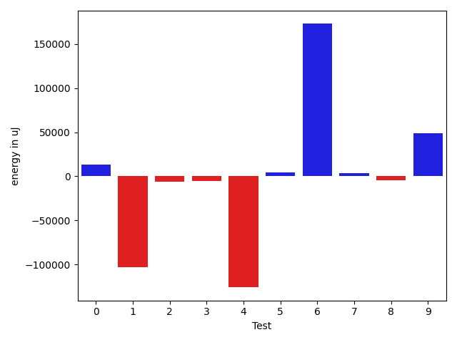
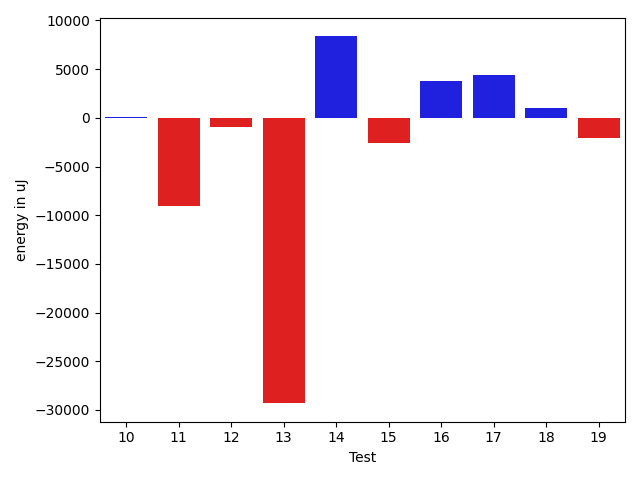
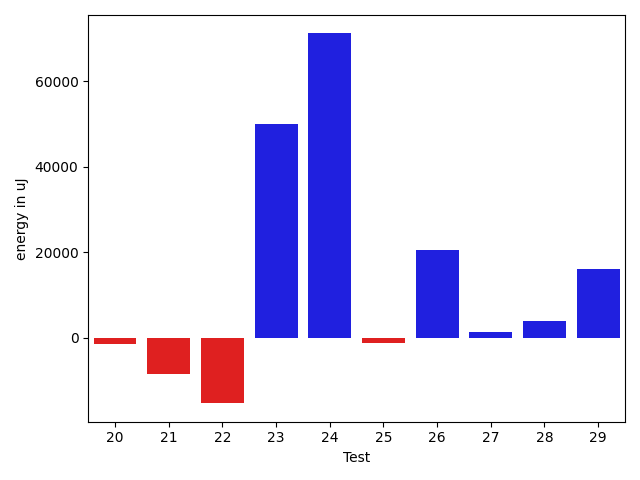
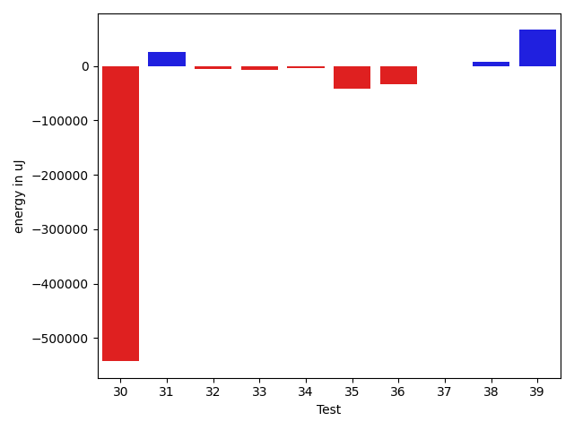
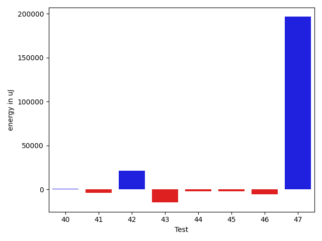
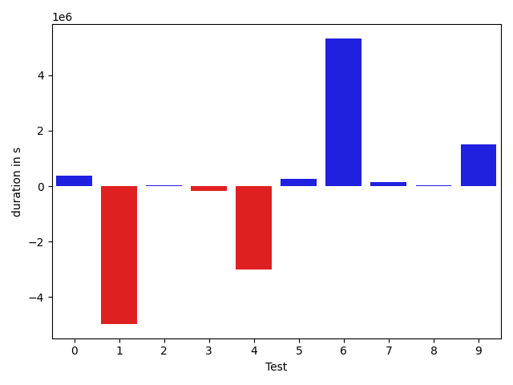
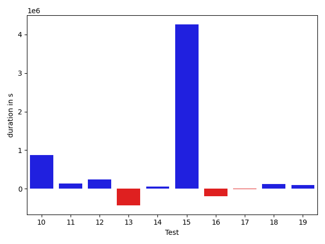
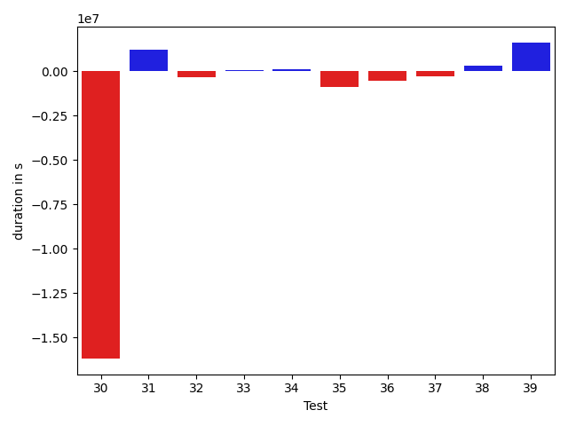
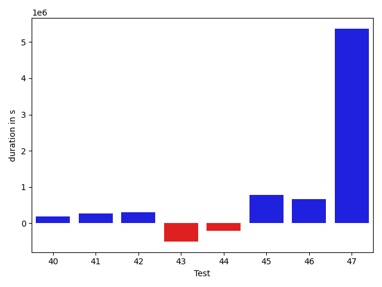

# gson 59edfc

https://github.com/google/gson.git/commit/59edfc

## Delta Energy per test method

| ID | EnergyV1 | EnergyV2 | DeltaEnergy |
| --- | --- | --- | --- |
| 0 | 65930.57467257854 | 79417.20487383565 | 13486.63020125711 |
| 1 | 436793.0224858583 | 334185.7854472384 | -102607.23703861987 |
| 2 | 40060.247493478506 | 34033.9191730179 | -6026.328320460605 |
| 3 | 53371.429221594204 | 48297.20132679403 | -5074.227894800177 |
| 4 | 162733.98422796218 | 36929.66372560362 | -125804.32050235856 |
| 5 | 35704.97391863789 | 40193.47195862606 | 4488.498039988175 |
| 6 | 39978.46858379674 | 212826.70173966046 | 172848.2331558637 |
| 7 | 35272.44855468102 | 38841.0602271019 | 3568.611672420884 |
| 8 | 40474.032562809065 | 36298.2755813321 | -4175.756981476967 |
| 9 | 45592.82689344557 | 94313.99660810595 | 48721.169714660384 |
| 10 | 43297.13196632266 | 43373.38975196495 | 76.25778564228676 |
| 11 | 45113.321881234646 | 36029.10396724939 | -9084.217913985252 |
| 12 | 40325.80380312463 | 39380.739290462385 | -945.0645126622476 |
| 13 | 75385.63854782644 | 46064.22122821083 | -29321.41731961561 |
| 14 | 43017.50769549722 | 51411.57158056672 | 8394.063885069503 |
| 15 | 44625.60248422623 | 42089.10222475231 | -2536.50025947392 |
| 16 | 38243.85860287248 | 42008.13322386339 | 3764.274620990909 |
| 17 | 38052.74315867876 | 42460.55725767659 | 4407.814098997835 |
| 18 | 40321.35079872241 | 41333.814567100024 | 1012.4637683776164 |
| 19 | 40733.21663220408 | 38691.20854606076 | -2042.0080861433162 |
| 20 | 38260.82191101587 | 36721.37019382088 | -1539.4517171949847 |
| 21 | 47676.099134598364 | 39272.93113535051 | -8403.167999247853 |
| 22 | 52121.56483034541 | 36804.84819082059 | -15316.71663952482 |
| 23 | 135274.75788330362 | 185214.19393557368 | 49939.43605227006 |
| 24 | 43171.906297410176 | 114350.71475526415 | 71178.80845785397 |
| 25 | 41532.350770530604 | 40298.851374723294 | -1233.49939580731 |
| 26 | 40543.45036783733 | 61014.286646797875 | 20470.836278960545 |
| 27 | 38639.28950080092 | 40071.90150300204 | 1432.6120022011164 |
| 28 | 37882.258760035045 | 41747.09761501507 | 3864.838854980022 |
| 29 | 42956.0999702519 | 58984.31044469567 | 16028.210474443775 |
| 30 | 1017872.0369408976 | 475206.81842903554 | -542665.218511862 |
| 31 | 45510.30396711826 | 71194.58848571777 | 25684.28451859951 |
| 32 | 55624.62307071686 | 50062.08560343087 | -5562.537467285991 |
| 33 | 45160.69895172119 | 38455.5135152936 | -6705.185436427593 |
| 34 | 44863.39473311072 | 41062.43285470855 | -3800.961878402166 |
| 35 | 87671.27433024035 | 46730.32367459421 | -40940.95065564614 |
| 36 | 84802.37629423272 | 52225.517347918794 | -32576.85894631392 |
| 37 | 39918.25581224715 | 40256.222058555184 | 337.96624630803126 |
| 38 | 45010.88301016064 | 53067.50765338798 | 8056.624643227333 |
| 39 | 38345.71389547461 | 104621.96135842863 | 66276.24746295402 |
| 40 | 40403.33832747644 | 41266.97094406388 | 863.6326165874416 |
| 41 | 51153.615782858804 | 47421.21061774836 | -3732.4051651104455 |
| 42 | 56417.5813586472 | 77740.75062099916 | 21323.169262351956 |
| 43 | 53658.58619767144 | 38959.774903249876 | -14698.81129442156 |
| 44 | 37851.29199910164 | 35579.67116737366 | -2271.6208317279816 |
| 45 | 44183.65096500516 | 42329.57421875 | -1854.0767462551594 |
| 46 | 43791.12466573715 | 38201.63394740969 | -5589.490718327463 |
| 47 | 37923.91485244243 | 234396.6299131794 | 196472.71506073698 |

## Delta Duration per test method

| ID | DurationV1 | DurationsV2 | DeltaDuration |
| --- | --- | --- | --- |
| 0 | 2089855.6254962469 | 2477223.691072129 | 387368.0655758823 |
| 1 | 15475034.9733172 | 10507697.94480481 | -4967337.02851239 |
| 2 | 1005093.650305673 | 1030491.2491463728 | 25397.598840699764 |
| 3 | 1746229.597433562 | 1583858.1424735535 | -162371.45496000838 |
| 4 | 4226888.19808366 | 1217776.747325248 | -3009111.4507584115 |
| 5 | 789633.1966122226 | 1057158.6537876371 | 267525.45717541454 |
| 6 | 786160.745952888 | 6104103.4884594 | 5317942.7425065115 |
| 7 | 721698.8131118498 | 863307.6819129454 | 141608.86880109552 |
| 8 | 791205.0364863179 | 820531.0245047726 | 29325.98801845475 |
| 9 | 1226411.3167319158 | 2738929.32634339 | 1512518.0096114744 |
| 10 | 785816.2346083894 | 1658279.3977156552 | 872463.1631072657 |
| 11 | 460483.8642269373 | 598120.4260344356 | 137636.56180749834 |
| 12 | 804339.6203954931 | 1046261.3693218743 | 241921.74892638123 |
| 13 | 1927236.1891708719 | 1494736.3389105424 | -432499.85026032943 |
| 14 | 1237056.164865288 | 1294629.2581602316 | 57573.09329494368 |
| 15 | 654292.1398854256 | 4917102.726206049 | 4262810.586320624 |
| 16 | 1329490.4762584083 | 1127192.5024180054 | -202297.9738404029 |
| 17 | 823438.4202276112 | 814277.7808085582 | -9160.639419052983 |
| 18 | 658158.163217577 | 779241.9834338035 | 121083.82021622651 |
| 19 | 879101.1717348909 | 975556.9172493126 | 96455.74551442172 |
| 20 | 1063558.344484849 | 1089830.4628360344 | 26272.11835118546 |
| 21 | 1262462.7366409805 | 944461.7849043126 | -318000.9517366679 |
| 22 | 2064080.006922653 | 792708.0305708075 | -1271371.9763518455 |
| 23 | 3928213.421880778 | 5426469.039368562 | 1498255.6174877845 |
| 24 | 943947.2884713325 | 3157926.9835197562 | 2213979.6950484235 |
| 25 | 936091.7114920376 | 1237779.9443998286 | 301688.2329077909 |
| 26 | 864631.7708904841 | 1204217.824765376 | 339586.05387489195 |
| 27 | 541712.853728627 | 719855.9783902117 | 178143.12466158473 |
| 28 | 1111491.9665244923 | 1039074.98054925 | -72416.98597524222 |
| 29 | 1448940.011338016 | 1840851.2001413463 | 391911.1888033303 |
| 30 | 27826365.24509494 | 11635999.218831174 | -16190366.026263766 |
| 31 | 588085.4909569025 | 1806692.2002499104 | 1218606.7092930079 |
| 32 | 1231678.068052888 | 899215.9760395251 | -332462.0920133628 |
| 33 | 579866.0876235962 | 660327.7085854411 | 80461.62096184492 |
| 34 | 948144.3792504198 | 1032261.6329116119 | 84117.25366119214 |
| 35 | 2668199.9234003746 | 1790780.0561102745 | -877419.8672901001 |
| 36 | 2218044.563669031 | 1655292.4090615674 | -562752.1546074636 |
| 37 | 1201929.5587176129 | 924609.2612391725 | -277320.29747844033 |
| 38 | 939092.0601526846 | 1223886.9306691485 | 284794.8705164639 |
| 39 | 1310979.418680768 | 2920750.838471223 | 1609771.4197904551 |
| 40 | 658387.3864821873 | 838135.0728401793 | 179747.686357992 |
| 41 | 912495.6885461919 | 1177335.4549470698 | 264839.76640087785 |
| 42 | 1988753.0553303808 | 2290187.7316323197 | 301434.67630193895 |
| 43 | 1823607.9316160446 | 1318796.0360874338 | -504811.8955286108 |
| 44 | 731607.6628483534 | 518759.61151885986 | -212848.05132949352 |
| 45 | 709598.7320761234 | 1489867.822265625 | 780269.0901895016 |
| 46 | 548339.6051539183 | 1207979.7772266045 | 659640.1720726863 |
| 47 | 1004344.193778511 | 6374662.936856201 | 5370318.74307769 |

## Misc.

| ID | Test Class | Test Method |
| --- | --- | --- |
| 0 | com.google.gson.functional.ReadersWritersTest | testReadWriteTwoObjects |
| 1 | com.google.gson.functional.ReadersWritersTest | testWriterForSerialization |
| 2 | com.google.gson.functional.ObjectTest | testNestedSerialization |
| 3 | com.google.gson.functional.ObjectTest | testBagOfPrimitiveWrappersSerialization |
| 4 | com.google.gson.functional.ObjectTest | testArrayOfArraysSerialization |
| 5 | com.google.gson.functional.ObjectTest | testArrayOfObjectsAsFields |
| 6 | com.google.gson.functional.ObjectTest | testBagOfPrimitivesSerialization |
| 7 | com.google.gson.functional.ObjectTest | testArrayOfObjectsSerialization |
| 8 | com.google.gson.functional.ObjectTest | testNullFieldsSerialization |
| 9 | com.google.gson.JsonParserTest | testReadWriteTwoObjects |
| 10 | com.google.gson.internal.bind.JsonTreeWriterTest | testLenientNansAndInfinities |
| 11 | com.google.gson.internal.bind.JsonTreeWriterTest | testStrictNansAndInfinities |
| 12 | com.google.gson.functional.TypeVariableTest | testBasicTypeVariables |
| 13 | com.google.gson.functional.TypeVariableTest | testAdvancedTypeVariables |
| 14 | com.google.gson.functional.TypeVariableTest | testTypeVariablesViaTypeParameter |
| 15 | com.google.gson.OverrideCoreTypeAdaptersTest | testOverridePrimitiveBooleanAdapter |
| 16 | com.google.gson.OverrideCoreTypeAdaptersTest | testOverrideWrapperBooleanAdapter |
| 17 | com.google.gson.functional.UncategorizedTest | testGsonInstanceReusableForSerializationAndDeserialization |
| 18 | com.google.gson.functional.UncategorizedTest | testStaticFieldsAreNotSerialized |
| 19 | com.google.gson.functional.EscapingTest | testGsonDoubleDeserialization |
| 20 | com.google.gson.functional.EscapingTest | testGsonAcceptsEscapedAndNonEscapedJsonDeserialization |
| 21 | com.google.gson.functional.EscapingTest | testEscapingObjectFields |
| 22 | com.google.gson.functional.VersioningTest | testVersionedGsonWithUnversionedClassesSerialization |
| 23 | com.google.gson.functional.MapAsArrayTypeAdapterTest | testSerializeComplexMapWithTypeAdapter |
| 24 | com.google.gson.functional.JsonTreeTest | testJsonTreeToString |
| 25 | com.google.gson.functional.JsonTreeTest | testToJsonTreeObjectType |
| 26 | com.google.gson.functional.JsonTreeTest | testToJsonTree |
| 27 | com.google.gson.functional.JsonTreeTest | testJsonTreeNull |
| 28 | com.google.gson.functional.PrettyPrintingTest | testPrettyPrintArrayOfObjects |
| 29 | com.google.gson.functional.PrettyPrintingTest | testPrettyPrintList |
| 30 | com.google.gson.functional.DefaultTypeAdaptersTest | testNullSerialization |
| 31 | com.google.gson.stream.JsonWriterTest | testPrettyPrintObject |
| 32 | com.google.gson.stream.JsonWriterTest | testTopLevelValueTypes |
| 33 | com.google.gson.stream.JsonWriterTest | testPrettyPrintArray |
| 34 | com.google.gson.stream.JsonWriterTest | testDoubles |
| 35 | com.google.gson.functional.ParameterizedTypesTest | testTypesWithMultipleParametersSerialization |
| 36 | com.google.gson.functional.DelegateTypeAdapterTest | testDelegateInvoked |
| 37 | com.google.gson.functional.ArrayTest | testObjectArrayWithNonPrimitivesSerialization |
| 38 | com.google.gson.functional.CollectionTest | testCollectionOfBagOfPrimitivesSerialization |
| 39 | com.google.gson.functional.CollectionTest | testWildcardCollectionField |
| 40 | com.google.gson.functional.CollectionTest | testRawCollectionSerialization |
| 41 | com.google.gson.functional.SecurityTest | testNonExecutableJsonSerialization |
| 42 | com.google.gson.functional.PrintFormattingTest | testCompactFormattingLeavesNoWhiteSpace |
| 43 | com.google.gson.functional.InheritanceTest | testSubClassSerialization |
| 44 | com.google.gson.functional.MapTest | testWriteMapsWithEmptyStringKey |
| 45 | com.google.gson.functional.PrimitiveTest | testPrimitiveBooleanAutoboxedSerialization |
| 46 | com.google.gson.functional.PrimitiveTest | testPrimitiveBooleanAutoboxedInASingleElementArraySerialization |
| 47 | com.google.gson.functional.CustomTypeAdaptersTest | testCustomSerializerInvokedForPrimitives |

| Test | IterationV1 | IterationV2 | DeltaIteration |
| --- | --- | --- | --- |
| 0 | 62 | 67 | 5 |
| 1 | 49 | 47 | -2 |
| 2 | 48 | 50 | 2 |
| 3 | 48 | 45 | -3 |
| 4 | 82 | 81 | -1 |
| 5 | 65 | 66 | 1 |
| 6 | 41 | 30 | -11 |
| 7 | 58 | 53 | -5 |
| 8 | 32 | 35 | 3 |
| 9 | 83 | 79 | -4 |
| 10 | 27 | 34 | 7 |
| 11 | 25 | 27 | 2 |
| 12 | 60 | 64 | 4 |
| 13 | 99 | 99 | 0 |
| 14 | 91 | 88 | -3 |
| 15 | 21 | 27 | 6 |
| 16 | 47 | 46 | -1 |
| 17 | 39 | 43 | 4 |
| 18 | 37 | 36 | -1 |
| 19 | 43 | 49 | 6 |
| 20 | 65 | 70 | 5 |
| 21 | 52 | 56 | 4 |
| 22 | 53 | 50 | -3 |
| 23 | 99 | 99 | 0 |
| 24 | 70 | 79 | 9 |
| 25 | 68 | 56 | -12 |
| 26 | 50 | 53 | 3 |
| 27 | 39 | 33 | -6 |
| 28 | 57 | 51 | -6 |
| 29 | 91 | 88 | -3 |
| 30 | 99 | 99 | 0 |
| 31 | 23 | 23 | 0 |
| 32 | 23 | 29 | 6 |
| 33 | 18 | 25 | 7 |
| 34 | 50 | 48 | -2 |
| 35 | 99 | 99 | 0 |
| 36 | 99 | 99 | 0 |
| 37 | 60 | 46 | -14 |
| 38 | 60 | 45 | -15 |
| 39 | 87 | 90 | 3 |
| 40 | 38 | 46 | 8 |
| 41 | 30 | 42 | 12 |
| 42 | 82 | 82 | 0 |
| 43 | 89 | 83 | -6 |
| 44 | 24 | 20 | -4 |
| 45 | 27 | 10 | -17 |
| 46 | 24 | 28 | 4 |
| 47 | 46 | 54 | 8 |

| Time Label | Time (s) |
| --- | --- |
| Selection | 34.61611580848694 |
| Injection | 16.73636293411255 |
| Total | 1420.209975719452 |

## Aggregation per test class

| Index | EnergyV1 | EnergyV2 | DeltaEnergy |
| --- | --- | --- | --- |
| 0 | 502723.59715843684 | 413602.9903210741 | -89120.60683736275 |
| 1 | 407595.5845629596 | 447420.2937321361 | 39824.709169176465 |
| 2 | 45592.82689344557 | 94313.99660810595 | 48721.169714660384 |
| 3 | 88410.4538475573 | 79402.49371921434 | -9007.960128342966 |
| 4 | 158728.9500464483 | 136856.53209923994 | -21872.417947208363 |
| 5 | 82869.46108709871 | 84097.2354486157 | 1227.7743615169893 |
| 6 | 78374.09395740117 | 83794.37182477661 | 5420.2778673754365 |
| 7 | 126670.1376778183 | 114685.50987523215 | -11984.627802586154 |
| 8 | 52121.56483034541 | 36804.84819082059 | -15316.71663952482 |
| 9 | 135274.75788330362 | 185214.19393557368 | 49939.43605227006 |
| 10 | 163886.99693657903 | 255735.75427978736 | 91848.75734320833 |
| 11 | 80838.35873028694 | 100731.40805971074 | 19893.049329423797 |
| 12 | 1017872.0369408976 | 475206.81842903554 | -542665.218511862 |
| 13 | 191159.02072266705 | 200774.62045915078 | 9615.599736483739 |
| 14 | 87671.27433024035 | 46730.32367459421 | -40940.95065564614 |
| 15 | 84802.37629423272 | 52225.517347918794 | -32576.85894631392 |
| 16 | 39918.25581224715 | 40256.222058555184 | 337.96624630803126 |
| 17 | 123759.9352331117 | 198956.4399558805 | 75196.50472276879 |
| 18 | 51153.615782858804 | 47421.21061774836 | -3732.4051651104455 |
| 19 | 56417.5813586472 | 77740.75062099916 | 21323.169262351956 |
| 20 | 53658.58619767144 | 38959.774903249876 | -14698.81129442156 |
| 21 | 37851.29199910164 | 35579.67116737366 | -2271.6208317279816 |
| 22 | 87974.77563074231 | 80531.20816615969 | -7443.567464582622 |
| 23 | 37923.91485244243 | 234396.6299131794 | 196472.71506073698 |

| Index | DurationV1 | DurationsV2 | DeltaDuration |
| --- | --- | --- | --- |
| 0 | 17564890.598813448 | 12984921.635876939 | -4579968.962936509 |
| 1 | 10066909.237986172 | 12677226.98760993 | 2610317.7496237587 |
| 2 | 1226411.3167319158 | 2738929.32634339 | 1512518.0096114744 |
| 3 | 1246300.0988353267 | 2256399.823750091 | 1010099.724914764 |
| 4 | 3968631.974431653 | 3835626.9663926484 | -133005.00803900464 |
| 5 | 1983782.6161438338 | 6044295.228624055 | 4060512.6124802213 |
| 6 | 1481596.5834451881 | 1593519.7642423618 | 111923.18079717364 |
| 7 | 3205122.2528607203 | 3009849.1649896596 | -195273.0878710607 |
| 8 | 2064080.006922653 | 792708.0305708075 | -1271371.9763518455 |
| 9 | 3928213.421880778 | 5426469.039368562 | 1498255.6174877845 |
| 10 | 3286383.624582481 | 6319780.731075173 | 3033397.106492692 |
| 11 | 2560431.977862508 | 2879926.1806905963 | 319494.2028280883 |
| 12 | 27826365.24509494 | 11635999.218831174 | -16190366.026263766 |
| 13 | 3347774.0258838064 | 4398497.517786489 | 1050723.4919026825 |
| 14 | 2668199.9234003746 | 1790780.0561102745 | -877419.8672901001 |
| 15 | 2218044.563669031 | 1655292.4090615674 | -562752.1546074636 |
| 16 | 1201929.5587176129 | 924609.2612391725 | -277320.29747844033 |
| 17 | 2908458.8653156403 | 4982772.84198055 | 2074313.97666491 |
| 18 | 912495.6885461919 | 1177335.4549470698 | 264839.76640087785 |
| 19 | 1988753.0553303808 | 2290187.7316323197 | 301434.67630193895 |
| 20 | 1823607.9316160446 | 1318796.0360874338 | -504811.8955286108 |
| 21 | 731607.6628483534 | 518759.61151885986 | -212848.05132949352 |
| 22 | 1257938.3372300416 | 2697847.5994922295 | 1439909.262262188 |
| 23 | 1004344.193778511 | 6374662.936856201 | 5370318.74307769 |
| Index | TestClassName | #Tests |
| --- | --- | --- |
| 0 | com.google.gson.functional.ReadersWritersTest | 2 |
| 1 | com.google.gson.functional.ObjectTest | 7 |
| 2 | com.google.gson.JsonParserTest | 1 |
| 3 | com.google.gson.internal.bind.JsonTreeWriterTest | 2 |
| 4 | com.google.gson.functional.TypeVariableTest | 3 |
| 5 | com.google.gson.OverrideCoreTypeAdaptersTest | 2 |
| 6 | com.google.gson.functional.UncategorizedTest | 2 |
| 7 | com.google.gson.functional.EscapingTest | 3 |
| 8 | com.google.gson.functional.VersioningTest | 1 |
| 9 | com.google.gson.functional.MapAsArrayTypeAdapterTest | 1 |
| 10 | com.google.gson.functional.JsonTreeTest | 4 |
| 11 | com.google.gson.functional.PrettyPrintingTest | 2 |
| 12 | com.google.gson.functional.DefaultTypeAdaptersTest | 1 |
| 13 | com.google.gson.stream.JsonWriterTest | 4 |
| 14 | com.google.gson.functional.ParameterizedTypesTest | 1 |
| 15 | com.google.gson.functional.DelegateTypeAdapterTest | 1 |
| 16 | com.google.gson.functional.ArrayTest | 1 |
| 17 | com.google.gson.functional.CollectionTest | 3 |
| 18 | com.google.gson.functional.SecurityTest | 1 |
| 19 | com.google.gson.functional.PrintFormattingTest | 1 |
| 20 | com.google.gson.functional.InheritanceTest | 1 |
| 21 | com.google.gson.functional.MapTest | 1 |
| 22 | com.google.gson.functional.PrimitiveTest | 2 |
| 23 | com.google.gson.functional.CustomTypeAdaptersTest | 1 |
