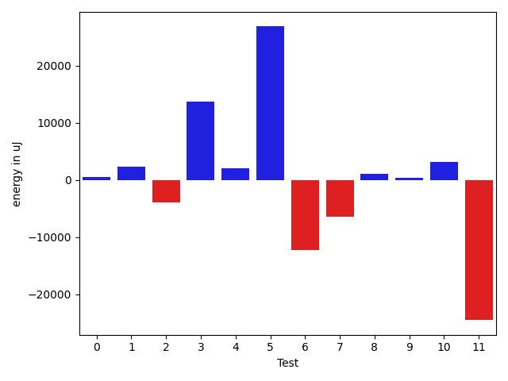
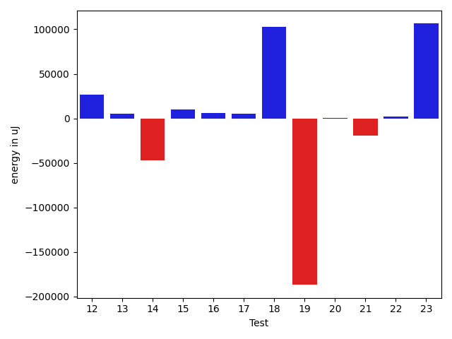
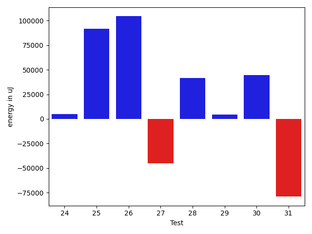
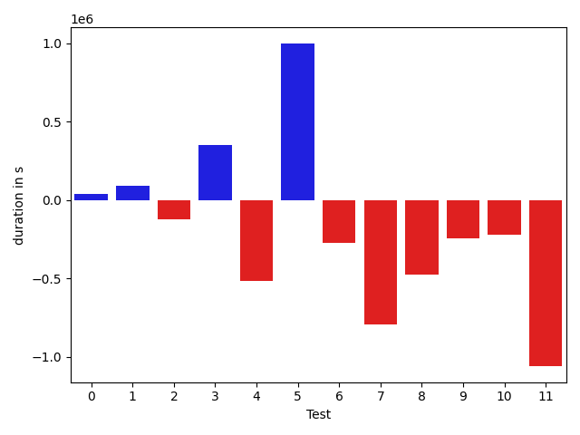
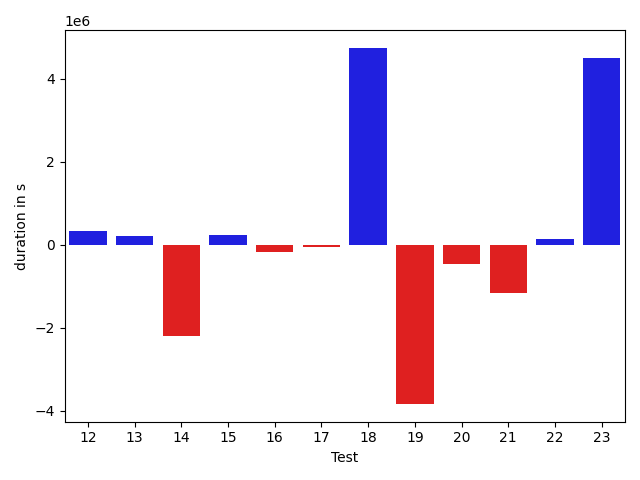
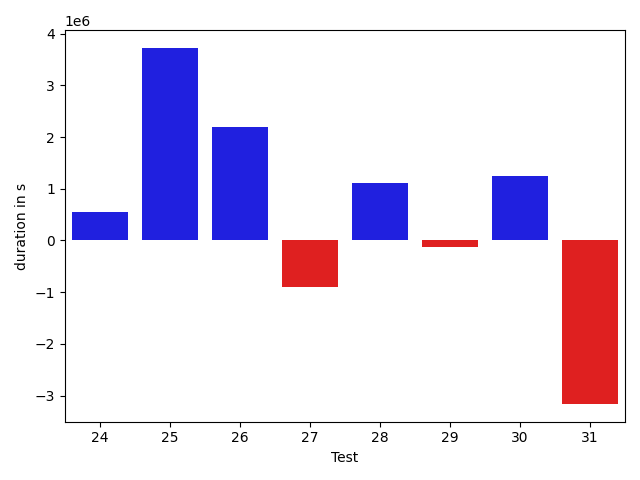

# gson ab4046

https://github.com/google/gson.git/commit/ab4046

## Delta Energy per test method

| ID | EnergyV1 | EnergyV2 | DeltaEnergy |
| --- | --- | --- | --- |
| 0 | 37641.78700839967 | 38118.01489429843 | 476.2278858987629 |
| 1 | 33872.253864340266 | 36240.62604505172 | 2368.372180711456 |
| 2 | 39776.03676796041 | 35788.105650161844 | -3987.9311177985655 |
| 3 | 146230.4198178365 | 159951.07475553962 | 13720.654937703133 |
| 4 | 52536.43716887107 | 54603.65129150855 | 2067.2141226374806 |
| 5 | 39742.264812979374 | 66568.77731906746 | 26826.51250608809 |
| 6 | 71462.09948270381 | 59208.93124694114 | -12253.16823576267 |
| 7 | 51616.31827970168 | 45113.87755878619 | -6502.440720915489 |
| 8 | 36671.703750656685 | 37760.00338116428 | 1088.299630507594 |
| 9 | 38400.401848160545 | 38717.03405143898 | 316.6322032784374 |
| 10 | 35459.58281151773 | 38570.88185518294 | 3111.299043665211 |
| 11 | 67592.77851166675 | 43048.47971308571 | -24544.29879858104 |
| 12 | 39878.57662880362 | 66469.18754024568 | 26590.61091144206 |
| 13 | 37951.341837632455 | 43098.21670569584 | 5146.874868063387 |
| 14 | 93009.47582019871 | 45875.82399499248 | -47133.65182520623 |
| 15 | 34287.56178152059 | 44466.473513004414 | 10178.911731483822 |
| 16 | 36181.43905706183 | 42618.51876553513 | 6437.079708473306 |
| 17 | 34770.37538821158 | 39969.705089482304 | 5199.329701270726 |
| 18 | 40255.99245546384 | 143148.50512200134 | 102892.5126665375 |
| 19 | 226928.8738945899 | 40184.82961179832 | -186744.04428279158 |
| 20 | 40188.69392351302 | 40654.45658850739 | 465.7626649943704 |
| 21 | 64372.22792956505 | 44837.82340938528 | -19534.40452017977 |
| 22 | 44224.06758590326 | 45947.25634391056 | 1723.1887580072944 |
| 23 | 43485.03934252028 | 149808.89784492058 | 106323.8585024003 |
| 24 | 35535.85025997821 | 40492.09448747357 | 4956.244227495365 |
| 25 | 52724.369947510335 | 144444.82492629366 | 91720.45497878332 |
| 26 | 40236.945649907575 | 144553.54106267774 | 104316.59541277017 |
| 27 | 102908.21221236643 | 57880.8838071936 | -45027.32840517283 |
| 28 | 37136.10734002286 | 78849.35457513802 | 41713.24723511515 |
| 29 | 37579.325752711025 | 42262.47653370989 | 4683.150780998862 |
| 30 | 30590.076414637002 | 75196.47683888252 | 44606.40042424551 |
| 31 | 118503.96456867068 | 39590.93512264946 | -78913.02944602122 |

## Delta Duration per test method

| ID | DurationV1 | DurationsV2 | DeltaDuration |
| --- | --- | --- | --- |
| 0 | 921583.9636278909 | 959822.6916901406 | 38238.72806224972 |
| 1 | 841548.3246492941 | 933077.3345873421 | 91529.00993804797 |
| 2 | 942254.0835246781 | 821414.4211345152 | -120839.66239016294 |
| 3 | 3757325.048646466 | 4105947.575109137 | 348622.52646267135 |
| 4 | 2130604.19968696 | 1613223.614599739 | -517380.5850872209 |
| 5 | 1089279.1138253147 | 2088092.021695352 | 998812.9078700372 |
| 6 | 2409511.611419613 | 2138344.7676864835 | -271166.84373312956 |
| 7 | 1945379.4771416285 | 1149524.846054943 | -795854.6310866855 |
| 8 | 1669327.1197388875 | 1194251.7949156761 | -475075.3248232114 |
| 9 | 1400548.2950747348 | 1152929.6501772294 | -247618.6448975054 |
| 10 | 1616524.0192102818 | 1393099.317324837 | -223424.7018854448 |
| 11 | 1896048.8309022174 | 835944.629799776 | -1060104.2011024414 |
| 12 | 1272628.5592702504 | 1612114.086612729 | 339485.5273424785 |
| 13 | 617220.4912864788 | 817764.6055294743 | 200544.1142429955 |
| 14 | 3124743.279724819 | 918307.1792241875 | -2206436.1005006316 |
| 15 | 1085489.4696809412 | 1319056.7460497147 | 233567.27636877354 |
| 16 | 902988.1406026334 | 719972.1168797789 | -183016.02372285444 |
| 17 | 827443.1193950957 | 783497.9549090504 | -43945.16448604537 |
| 18 | 782555.9715792452 | 5519655.12402913 | 4737099.152449884 |
| 19 | 7439884.583329924 | 3610159.897037518 | -3829724.686292406 |
| 20 | 1480643.720436825 | 1027528.3434379792 | -453115.3769988457 |
| 21 | 2537354.7401726753 | 1382492.269187211 | -1154862.4709854643 |
| 22 | 1246163.0740343048 | 1381168.0800862378 | 135005.00605193293 |
| 23 | 888510.8222270072 | 5375964.727088836 | 4487453.904861828 |
| 24 | 669200.8678125679 | 1228098.4039212787 | 558897.5361087108 |
| 25 | 1352800.330478579 | 5076955.010401811 | 3724154.6799232326 |
| 26 | 1355922.4845968462 | 3552441.989303638 | 2196519.504706792 |
| 27 | 4112102.3972986983 | 3205588.183035362 | -906514.2142633363 |
| 28 | 774476.9607976155 | 1888751.5109535097 | 1114274.5501558944 |
| 29 | 957166.297255001 | 827741.6200200121 | -129424.67723498889 |
| 30 | 1111167.10427419 | 2360020.5884597194 | 1248853.4841855294 |
| 31 | 3914709.3535330715 | 752039.0585915506 | -3162670.294941521 |

## Misc.

| ID | Test Class | Test Method |
| --- | --- | --- |
| 0 | com.google.gson.functional.DefaultTypeAdaptersTest | testBadValueForBigDecimalDeserialization |
| 1 | com.google.gson.functional.DefaultTypeAdaptersTest | testBigIntegerFieldDeserialization |
| 2 | com.google.gson.functional.DefaultTypeAdaptersTest | testBigDecimalFieldDeserialization |
| 3 | com.google.gson.functional.RuntimeTypeAdapterFactoryFunctionalTest | testSubclassesAutomaticallySerialzed |
| 4 | com.google.gson.functional.JsonAdapterAnnotationOnFieldsTest | testClassAnnotationAdapterFactoryTakesPrecedenceOverDefault |
| 5 | com.google.gson.functional.JsonAdapterAnnotationOnFieldsTest | testJsonAdapterWrappedInNullSafeAsRequested |
| 6 | com.google.gson.functional.JsonAdapterAnnotationOnFieldsTest | testClassAnnotationAdapterTakesPrecedenceOverDefault |
| 7 | com.google.gson.functional.JsonAdapterAnnotationOnFieldsTest | testRegisteredTypeAdapterTakesPrecedenceOverClassAnnotationAdapter |
| 8 | com.google.gson.functional.JsonAdapterAnnotationOnFieldsTest | testFieldAnnotationTakesPrecedenceOverClassAnnotation |
| 9 | com.google.gson.functional.JsonAdapterAnnotationOnFieldsTest | testJsonAdapterInvokedOnlyForAnnotatedFields |
| 10 | com.google.gson.functional.JsonAdapterAnnotationOnFieldsTest | testFieldAnnotationTakesPrecedenceOverRegisteredTypeAdapter |
| 11 | com.google.gson.functional.InheritanceTest | testSubClassDeserialization |
| 12 | com.google.gson.functional.InheritanceTest | testSubInterfacesOfCollectionDeserialization |
| 13 | com.google.gson.functional.NamingPolicyTest | testGsonWithUpperCamelCaseSpacesPolicyDeserialiation |
| 14 | com.google.gson.functional.NamingPolicyTest | testGsonWithNonDefaultFieldNamingPolicyDeserialiation |
| 15 | com.google.gson.functional.NamingPolicyTest | testComplexFieldNameStrategy |
| 16 | com.google.gson.functional.NamingPolicyTest | testGsonWithLowerCaseUnderscorePolicyDeserialiation |
| 17 | com.google.gson.functional.NamingPolicyTest | testGsonWithLowerCaseDashPolicyDeserialiation |
| 18 | com.google.gson.functional.SerializedNameTest | testMultipleNamesDeserializedCorrectly |
| 19 | com.google.gson.functional.SerializedNameTest | testMultipleNamesInTheSameString |
| 20 | com.google.gson.functional.CollectionTest | testSetDeserialization |
| 21 | com.google.gson.functional.CollectionTest | testWildcardCollectionField |
| 22 | com.google.gson.functional.MapTest | testComplexKeysDeserialization |
| 23 | com.google.gson.functional.CustomDeserializerTest | testCustomDeserializerReturnsNull |
| 24 | com.google.gson.functional.StreamingTypeAdaptersTest | testDeserialize |
| 25 | com.google.gson.functional.StreamingTypeAdaptersTest | testFromJsonTree |
| 26 | com.google.gson.functional.InstanceCreatorTest | testInstanceCreatorReturnsSubTypeForField |
| 27 | com.google.gson.regression.JsonAdapterNullSafeTest | testNullSafeBugDeserialize |
| 28 | com.google.gson.functional.ExposeFieldsTest | testExposedInterfaceFieldDeserialization |
| 29 | com.google.gson.functional.ExposeFieldsTest | testExposeAnnotationDeserialization |
| 30 | com.google.gson.functional.CustomTypeAdaptersTest | testEnsureCustomDeserializerNotInvokedForNullValues |
| 31 | com.google.gson.functional.ObjectTest | testBagOfPrimitiveWrappersDeserialization |

| Test | IterationV1 | IterationV2 | DeltaIteration |
| --- | --- | --- | --- |
| 0 | 49 | 44 | -5 |
| 1 | 38 | 40 | 2 |
| 2 | 51 | 41 | -10 |
| 3 | 99 | 99 | 0 |
| 4 | 99 | 99 | 0 |
| 5 | 70 | 71 | 1 |
| 6 | 94 | 94 | 0 |
| 7 | 72 | 73 | 1 |
| 8 | 90 | 91 | 1 |
| 9 | 84 | 85 | 1 |
| 10 | 94 | 96 | 2 |
| 11 | 62 | 52 | -10 |
| 12 | 90 | 88 | -2 |
| 13 | 52 | 37 | -15 |
| 14 | 46 | 47 | 1 |
| 15 | 82 | 75 | -7 |
| 16 | 47 | 42 | -5 |
| 17 | 41 | 36 | -5 |
| 18 | 64 | 58 | -6 |
| 19 | 39 | 46 | 7 |
| 20 | 79 | 80 | 1 |
| 21 | 95 | 89 | -6 |
| 22 | 74 | 66 | -8 |
| 23 | 55 | 74 | 19 |
| 24 | 34 | 39 | 5 |
| 25 | 50 | 50 | 0 |
| 26 | 69 | 65 | -4 |
| 27 | 49 | 48 | -1 |
| 28 | 35 | 34 | -1 |
| 29 | 56 | 47 | -9 |
| 30 | 55 | 59 | 4 |
| 31 | 44 | 43 | -1 |

| Time Label | Time (s) |
| --- | --- |
| Selection | 33.53192400932312 |
| Injection | 16.424360275268555 |
| Total | 1403.7933149337769 |

## Aggregation per test class

| Index | EnergyV1 | EnergyV2 | DeltaEnergy |
| --- | --- | --- | --- |
| 0 | 111290.07764070034 | 110146.746589512 | -1143.3310511883465 |
| 1 | 146230.4198178365 | 159951.07475553962 | 13720.654937703133 |
| 2 | 325888.8081545909 | 340543.15670408955 | 14654.348549498653 |
| 3 | 107471.35514047038 | 109517.6672533314 | 2046.312112861022 |
| 4 | 236200.19388462516 | 216028.7380687102 | -20171.45581591496 |
| 5 | 267184.86635005375 | 183333.33473379965 | -83851.5316162541 |
| 6 | 104560.92185307806 | 85492.27999789268 | -19068.641855185386 |
| 7 | 44224.06758590326 | 45947.25634391056 | 1723.1887580072944 |
| 8 | 43485.03934252028 | 149808.89784492058 | 106323.8585024003 |
| 9 | 88260.22020748854 | 184936.91941376723 | 96676.69920627869 |
| 10 | 40236.945649907575 | 144553.54106267774 | 104316.59541277017 |
| 11 | 102908.21221236643 | 57880.8838071936 | -45027.32840517283 |
| 12 | 74715.43309273389 | 121111.8311088479 | 46396.398016114006 |
| 13 | 30590.076414637002 | 75196.47683888252 | 44606.40042424551 |
| 14 | 118503.96456867068 | 39590.93512264946 | -78913.02944602122 |

| Index | DurationV1 | DurationsV2 | DeltaDuration |
| --- | --- | --- | --- |
| 0 | 2705386.3718018634 | 2714314.447411998 | 8928.07561013475 |
| 1 | 3757325.048646466 | 4105947.575109137 | 348622.52646267135 |
| 2 | 12261173.83609742 | 10729466.01245426 | -1531707.8236431591 |
| 3 | 3168677.3901724676 | 2448058.716412505 | -720618.6737599624 |
| 4 | 6557884.5006899685 | 4558598.602592206 | -1999285.8980977628 |
| 5 | 8222440.55490917 | 9129815.021066647 | 907374.4661574773 |
| 6 | 4017998.4606095003 | 2410020.61262519 | -1607977.8479843102 |
| 7 | 1246163.0740343048 | 1381168.0800862378 | 135005.00605193293 |
| 8 | 888510.8222270072 | 5375964.727088836 | 4487453.904861828 |
| 9 | 2022001.198291147 | 6305053.41432309 | 4283052.2160319425 |
| 10 | 1355922.4845968462 | 3552441.989303638 | 2196519.504706792 |
| 11 | 4112102.3972986983 | 3205588.183035362 | -906514.2142633363 |
| 12 | 1731643.2580526164 | 2716493.1309735216 | 984849.8729209052 |
| 13 | 1111167.10427419 | 2360020.5884597194 | 1248853.4841855294 |
| 14 | 3914709.3535330715 | 752039.0585915506 | -3162670.294941521 |
| Index | TestClassName | #Tests |
| --- | --- | --- |
| 0 | com.google.gson.functional.DefaultTypeAdaptersTest | 3 |
| 1 | com.google.gson.functional.RuntimeTypeAdapterFactoryFunctionalTest | 1 |
| 2 | com.google.gson.functional.JsonAdapterAnnotationOnFieldsTest | 7 |
| 3 | com.google.gson.functional.InheritanceTest | 2 |
| 4 | com.google.gson.functional.NamingPolicyTest | 5 |
| 5 | com.google.gson.functional.SerializedNameTest | 2 |
| 6 | com.google.gson.functional.CollectionTest | 2 |
| 7 | com.google.gson.functional.MapTest | 1 |
| 8 | com.google.gson.functional.CustomDeserializerTest | 1 |
| 9 | com.google.gson.functional.StreamingTypeAdaptersTest | 2 |
| 10 | com.google.gson.functional.InstanceCreatorTest | 1 |
| 11 | com.google.gson.regression.JsonAdapterNullSafeTest | 1 |
| 12 | com.google.gson.functional.ExposeFieldsTest | 2 |
| 13 | com.google.gson.functional.CustomTypeAdaptersTest | 1 |
| 14 | com.google.gson.functional.ObjectTest | 1 |
