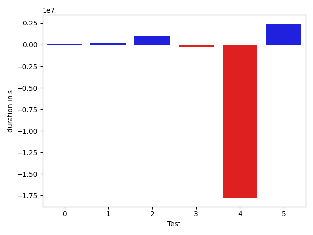

# gson 34d752

https://github.com/google/gson.git/commit/34d752

## Delta Energy per test method

| ID | EnergyV1 | EnergyV2 | DeltaEnergy |
| --- | --- | --- | --- |
| 0 | 37698.76981327839 | 33121.44742397648 | -4577.322389301909 |
| 1 | 35887.645806580724 | 35286.45038182824 | -601.1954247524845 |
| 2 | 35202.25615229572 | 68096.16808685349 | 32893.91193455777 |
| 3 | 78302.02046463644 | 81770.67193361268 | 3468.6514689762407 |
| 4 | 1008954.1321120167 | 380732.41227162385 | -628221.7198403928 |
| 5 | 247470.44968381716 | 278780.87299237924 | 31310.42330856208 |

## Delta Duration per test method

| ID | DurationV1 | DurationsV2 | DeltaDuration |
| --- | --- | --- | --- |
| 0 | 1063292.846745736 | 1189745.20285824 | 126452.35611250415 |
| 1 | 811477.1571870861 | 1017153.0633938736 | 205675.90620678756 |
| 2 | 1519008.1319980659 | 2463390.446176298 | 944382.3141782321 |
| 3 | 2906136.1438577957 | 2602471.334635185 | -303664.80922261067 |
| 4 | 29241328.49332592 | 11479918.206740659 | -17761410.28658526 |
| 5 | 6884484.635585385 | 9324784.027726367 | 2440299.3921409817 |

## Misc.

| ID | Test Class | Test Method |
| --- | --- | --- |
| 0 | com.google.gson.functional.NullObjectAndFieldTest | testCustomTypeAdapterPassesNullDesrialization |
| 1 | com.google.gson.functional.NullObjectAndFieldTest | testCustomTypeAdapterPassesNullSerialization |
| 2 | com.google.gson.functional.ParameterizedTypesTest | testParameterizedTypeWithCustomSerializer |
| 3 | com.google.gson.functional.CustomDeserializerTest | testJsonTypeFieldBasedDeserialization |
| 4 | com.google.gson.functional.TypeHierarchyAdapterTest | testTypeHierarchy |
| 5 | com.google.gson.functional.CircularReferenceTest | testSelfReferenceCustomHandlerSerialization |

| Test | IterationV1 | IterationV2 | DeltaIteration |
| --- | --- | --- | --- |
| 0 | 55 | 64 | 9 |
| 1 | 35 | 36 | 1 |
| 2 | 91 | 98 | 7 |
| 3 | 99 | 99 | 0 |
| 4 | 99 | 99 | 0 |
| 5 | 99 | 99 | 0 |

| Time Label | Time (s) |
| --- | --- |
| Selection | 33.85079789161682 |
| Injection | 13.876320600509644 |
| Total | 1345.0947182178497 |

## Aggregation per test class

| Index | EnergyV1 | EnergyV2 | DeltaEnergy |
| --- | --- | --- | --- |
| 0 | 73586.41561985912 | 68407.89780580472 | -5178.517814054401 |
| 1 | 35202.25615229572 | 68096.16808685349 | 32893.91193455777 |
| 2 | 78302.02046463644 | 81770.67193361268 | 3468.6514689762407 |
| 3 | 1008954.1321120167 | 380732.41227162385 | -628221.7198403928 |
| 4 | 247470.44968381716 | 278780.87299237924 | 31310.42330856208 |

| Index | DurationV1 | DurationsV2 | DeltaDuration |
| --- | --- | --- | --- |
| 0 | 1874770.003932822 | 2206898.2662521135 | 332128.2623192915 |
| 1 | 1519008.1319980659 | 2463390.446176298 | 944382.3141782321 |
| 2 | 2906136.1438577957 | 2602471.334635185 | -303664.80922261067 |
| 3 | 29241328.49332592 | 11479918.206740659 | -17761410.28658526 |
| 4 | 6884484.635585385 | 9324784.027726367 | 2440299.3921409817 |
| Index | TestClassName | #Tests |
| --- | --- | --- |
| 0 | com.google.gson.functional.NullObjectAndFieldTest | 2 |
| 1 | com.google.gson.functional.ParameterizedTypesTest | 1 |
| 2 | com.google.gson.functional.CustomDeserializerTest | 1 |
| 3 | com.google.gson.functional.TypeHierarchyAdapterTest | 1 |
| 4 | com.google.gson.functional.CircularReferenceTest | 1 |
