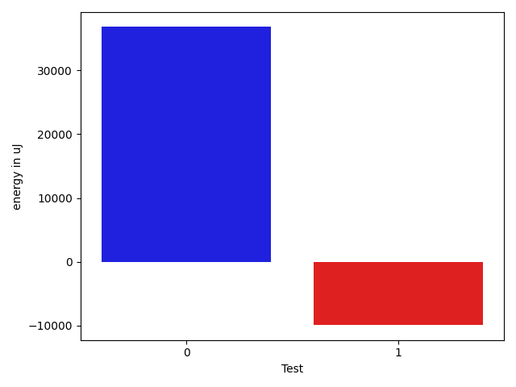
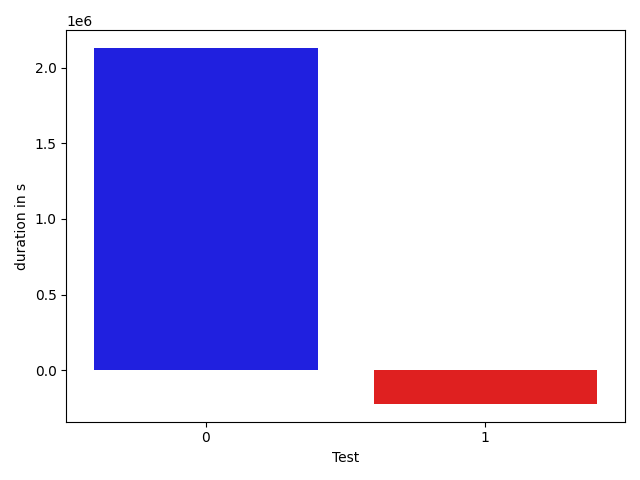

# gson 0669ff

https://github.com/google/gson.git/commit/0669ff

## Delta Energy per test method

| ID | EnergyV1 | EnergyV2 | DeltaEnergy |
| --- | --- | --- | --- |
| 0 | 124733.11938570644 | 161555.01634367253 | 36821.89695796609 |
| 1 | 45279.4216984519 | 35326.88724369375 | -9952.534454758148 |

## Delta Duration per test method

| ID | DurationV1 | DurationsV2 | DeltaDuration |
| --- | --- | --- | --- |
| 0 | 4442900.040083941 | 6574597.083730719 | 2131697.043646778 |
| 1 | 1999212.9519545985 | 1775518.8680471485 | -223694.08390745008 |

## Misc.

| ID | Test Class | Test Method |
| --- | --- | --- |
| 0 | com.google.gson.functional.JavaUtilConcurrentAtomicTest | testAtomicLongWithStringSerializationPolicy |
| 1 | com.google.gson.functional.JavaUtilConcurrentAtomicTest | testAtomicLongArrayWithStringSerializationPolicy |

| Test | IterationV1 | IterationV2 | DeltaIteration |
| --- | --- | --- | --- |
| 0 | 99 | 99 | 0 |
| 1 | 81 | 78 | -3 |

| Time Label | Time (s) |
| --- | --- |
| Selection | 35.289769411087036 |
| Injection | 12.911889553070068 |
| Total | 1318.2608885765076 |

## Aggregation per test class

| Index | EnergyV1 | EnergyV2 | DeltaEnergy |
| --- | --- | --- | --- |
| 0 | 170012.54108415835 | 196881.90358736628 | 26869.36250320793 |

| Index | DurationV1 | DurationsV2 | DeltaDuration |
| --- | --- | --- | --- |
| 0 | 6442112.99203854 | 8350115.951777868 | 1908002.9597393284 |
| Index | TestClassName | #Tests |
| --- | --- | --- |
| 0 | com.google.gson.functional.JavaUtilConcurrentAtomicTest | 2 |
