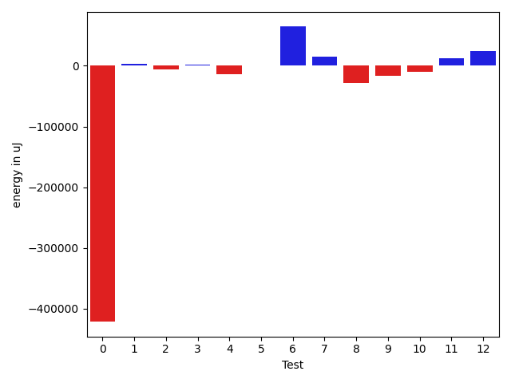
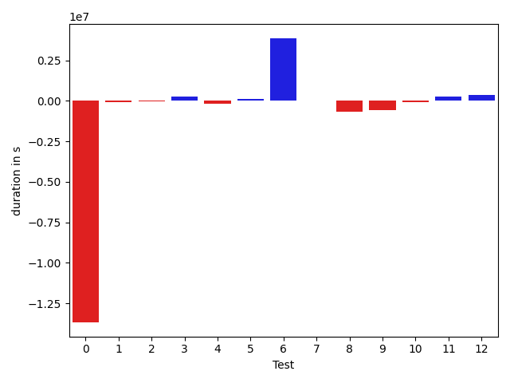

# gson c731ab

https://github.com/google/gson.git/commit/c731ab

## Delta Energy per test method

| ID | EnergyV1 | EnergyV2 | DeltaEnergy |
| --- | --- | --- | --- |
| 0 | 500273.8082812774 | 78729.89307337339 | -421543.91520790407 |
| 1 | 31134.897155642408 | 34890.249277535055 | 3755.352121892647 |
| 2 | 45185.829448459735 | 39600.77349659818 | -5585.0559518615555 |
| 3 | 32704.72105143141 | 34285.80144801985 | 1581.080396588437 |
| 4 | 46896.51892176115 | 33336.47737193036 | -13560.041549830785 |
| 5 | 32253.834548945473 | 32272.155797290925 | 18.32124834545175 |
| 6 | 772655.1399965198 | 837059.1912466954 | 64404.05125017557 |
| 7 | 33647.74209600492 | 49137.39705302678 | 15489.654957021863 |
| 8 | 61011.63967143841 | 33091.09043810032 | -27920.54923333809 |
| 9 | 57360.85329301291 | 41174.49675774184 | -16186.356535271065 |
| 10 | 49723.49688184813 | 40168.292771319175 | -9555.204110528954 |
| 11 | 35002.9679184598 | 46869.41062672093 | 11866.44270826113 |
| 12 | 34341.78749718191 | 58630.858362590065 | 24289.070865408154 |

## Delta Duration per test method

| ID | DurationV1 | DurationsV2 | DeltaDuration |
| --- | --- | --- | --- |
| 0 | 16456910.414315954 | 2784741.046842237 | -13672169.367473718 |
| 1 | 1257695.293801785 | 1155639.5645530168 | -102055.72924876818 |
| 2 | 1699231.005879844 | 1647359.7159265438 | -51871.289953300264 |
| 3 | 962662.669394033 | 1222522.0052182316 | 259859.33582419856 |
| 4 | 1632935.387407091 | 1476647.7828225102 | -156287.60458458075 |
| 5 | 1190633.1770400852 | 1310323.9257538049 | 119690.74871371966 |
| 6 | 24662993.157773543 | 28525448.884097435 | 3862455.7263238914 |
| 7 | 1705137.053641809 | 1745347.5735432678 | 40210.51990145887 |
| 8 | 1916672.6318565714 | 1232759.6339846568 | -683912.9978719146 |
| 9 | 2066651.685972195 | 1498781.886615081 | -567869.7993571139 |
| 10 | 1700244.7337134783 | 1634807.0230509057 | -65437.710662572645 |
| 11 | 1439177.1703500273 | 1727247.5368983294 | 288070.3665483021 |
| 12 | 1711449.2588555617 | 2053051.6311224175 | 341602.3722668558 |

## Misc.

| ID | Test Class | Test Method |
| --- | --- | --- |
| 0 | com.google.gson.functional.JsonAdapterAnnotationOnClassesTest | testJsonAdapterInvoked |
| 1 | com.google.gson.functional.JsonAdapterAnnotationOnClassesTest | testRegisteredDeserializerOverridesJsonAdapter |
| 2 | com.google.gson.functional.JsonAdapterAnnotationOnClassesTest | testRegisteredSerializerOverridesJsonAdapter |
| 3 | com.google.gson.functional.JsonAdapterAnnotationOnClassesTest | testIncorrectTypeAdapterFails |
| 4 | com.google.gson.functional.JsonAdapterAnnotationOnClassesTest | testJsonAdapterFactoryInvoked |
| 5 | com.google.gson.functional.JsonAdapterAnnotationOnClassesTest | testNullSafeObjectFromJson |
| 6 | com.google.gson.functional.RuntimeTypeAdapterFactoryFunctionalTest | testSubclassesAutomaticallySerialzed |
| 7 | com.google.gson.functional.JsonAdapterAnnotationOnFieldsTest | testClassAnnotationAdapterFactoryTakesPrecedenceOverDefault |
| 8 | com.google.gson.functional.JsonAdapterAnnotationOnFieldsTest | testJsonAdapterWrappedInNullSafeAsRequested |
| 9 | com.google.gson.functional.JsonAdapterAnnotationOnFieldsTest | testClassAnnotationAdapterTakesPrecedenceOverDefault |
| 10 | com.google.gson.functional.JsonAdapterAnnotationOnFieldsTest | testFieldAnnotationTakesPrecedenceOverClassAnnotation |
| 11 | com.google.gson.functional.JsonAdapterAnnotationOnFieldsTest | testJsonAdapterInvokedOnlyForAnnotatedFields |
| 12 | com.google.gson.functional.JsonAdapterAnnotationOnFieldsTest | testFieldAnnotationTakesPrecedenceOverRegisteredTypeAdapter |

| Test | IterationV1 | IterationV2 | DeltaIteration |
| --- | --- | --- | --- |
| 0 | 99 | 99 | 0 |
| 1 | 78 | 66 | -12 |
| 2 | 99 | 97 | -2 |
| 3 | 63 | 69 | 6 |
| 4 | 96 | 99 | 3 |
| 5 | 77 | 81 | 4 |
| 6 | 99 | 99 | 0 |
| 7 | 99 | 99 | 0 |
| 8 | 89 | 85 | -4 |
| 9 | 98 | 95 | -3 |
| 10 | 93 | 96 | 3 |
| 11 | 96 | 92 | -4 |
| 12 | 94 | 99 | 5 |

| Time Label | Time (s) |
| --- | --- |
| Selection | 32.99711036682129 |
| Injection | 14.192024230957031 |
| Total | 1333.6253027915955 |

## Aggregation per test class

| Index | EnergyV1 | EnergyV2 | DeltaEnergy |
| --- | --- | --- | --- |
| 0 | 688449.6094075176 | 253115.35046474778 | -435334.25894276984 |
| 1 | 772655.1399965198 | 837059.1912466954 | 64404.05125017557 |
| 2 | 271088.48735794605 | 269071.5460094991 | -2016.9413484469405 |

| Index | DurationV1 | DurationsV2 | DeltaDuration |
| --- | --- | --- | --- |
| 0 | 23200067.947838794 | 9597234.041116346 | -13602833.906722449 |
| 1 | 24662993.157773543 | 28525448.884097435 | 3862455.7263238914 |
| 2 | 10539332.534389645 | 9891995.285214659 | -647337.249174986 |
| Index | TestClassName | #Tests |
| --- | --- | --- |
| 0 | com.google.gson.functional.JsonAdapterAnnotationOnClassesTest | 6 |
| 1 | com.google.gson.functional.RuntimeTypeAdapterFactoryFunctionalTest | 1 |
| 2 | com.google.gson.functional.JsonAdapterAnnotationOnFieldsTest | 6 |
