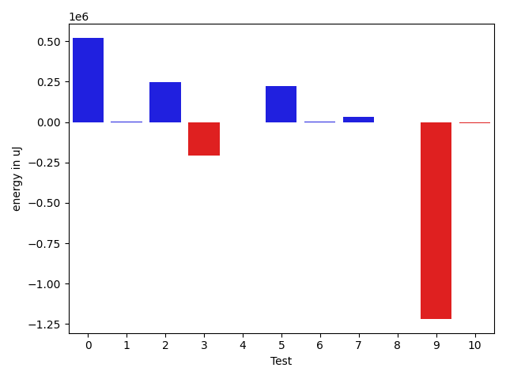
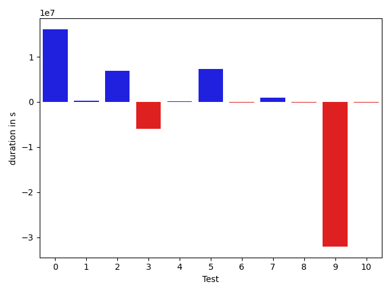

# gson 2ab776

https://github.com/google/gson.git/commit/2ab776

## Delta Energy per test method

| ID | EnergyV1 | EnergyV2 | DeltaEnergy |
| --- | --- | --- | --- |
| 0 | 129889.22042816057 | 651303.7781119313 | 521414.5576837707 |
| 1 | 33237.6492881442 | 34567.30399488872 | 1329.6547067445208 |
| 2 | 51328.76103813188 | 299535.5383381534 | 248206.7773000215 |
| 3 | 241978.0273437481 | 32596.639054918138 | -209381.38828882997 |
| 4 | 35145.84061684566 | 32979.48360855149 | -2166.357008294166 |
| 5 | 443097.2026987484 | 666415.9525580335 | 223318.74985928513 |
| 6 | 40308.241632615565 | 41876.61637127025 | 1568.374738654682 |
| 7 | 62922.85626287698 | 97112.51259423755 | 34189.656331360566 |
| 8 | 35710.61662937665 | 35309.79896729355 | -400.8176620831 |
| 9 | 1253101.4631202775 | 34163.47207052261 | -1218937.991049755 |
| 10 | 41124.04231389485 | 34806.23691481513 | -6317.805399079727 |

## Delta Duration per test method

| ID | DurationV1 | DurationsV2 | DeltaDuration |
| --- | --- | --- | --- |
| 0 | 3930622.4717636053 | 20039712.27996731 | 16109089.808203707 |
| 1 | 1041910.8960075411 | 1336004.5935957753 | 294093.6975882342 |
| 2 | 2051480.2071598046 | 8941313.36761704 | 6889833.160457237 |
| 3 | 7321634.614109491 | 1403906.1066416302 | -5917728.50746786 |
| 4 | 1006522.3006943853 | 1155979.7079199394 | 149457.4072255541 |
| 5 | 14291636.151342059 | 21531055.158131696 | 7239419.006789638 |
| 6 | 1700245.9168754714 | 1536956.9694339787 | -163288.9474414927 |
| 7 | 2519860.2764140023 | 3436897.918177266 | 917037.6417632638 |
| 8 | 1498580.7508638506 | 1402973.4490981782 | -95607.3017656724 |
| 9 | 33532069.662300043 | 1446662.4830746758 | -32085407.179225367 |
| 10 | 1499970.7142887518 | 1396820.3450302226 | -103150.36925852927 |

## Misc.

| ID | Test Class | Test Method |
| --- | --- | --- |
| 0 | com.google.gson.functional.JsonAdapterAnnotationOnClassesTest | testJsonAdapterInvoked |
| 1 | com.google.gson.functional.JsonAdapterAnnotationOnClassesTest | testRegisteredDeserializerOverridesJsonAdapter |
| 2 | com.google.gson.functional.JsonAdapterAnnotationOnClassesTest | testRegisteredSerializerOverridesJsonAdapter |
| 3 | com.google.gson.functional.JsonAdapterAnnotationOnClassesTest | testJsonAdapterFactoryInvoked |
| 4 | com.google.gson.functional.JsonAdapterAnnotationOnClassesTest | testIncorrectTypeAdapterFails |
| 5 | com.google.gson.functional.RuntimeTypeAdapterFactoryFunctionalTest | testSubclassesAutomaticallySerialzed |
| 6 | com.google.gson.functional.JsonAdapterAnnotationOnFieldsTest | testClassAnnotationAdapterFactoryTakesPrecedenceOverDefault |
| 7 | com.google.gson.functional.JsonAdapterAnnotationOnFieldsTest | testClassAnnotationAdapterTakesPrecedenceOverDefault |
| 8 | com.google.gson.functional.JsonAdapterAnnotationOnFieldsTest | testFieldAnnotationTakesPrecedenceOverClassAnnotation |
| 9 | com.google.gson.functional.JsonAdapterAnnotationOnFieldsTest | testJsonAdapterInvokedOnlyForAnnotatedFields |
| 10 | com.google.gson.functional.JsonAdapterAnnotationOnFieldsTest | testFieldAnnotationTakesPrecedenceOverRegisteredTypeAdapter |

| Test | IterationV1 | IterationV2 | DeltaIteration |
| --- | --- | --- | --- |
| 0 | 99 | 99 | 0 |
| 1 | 70 | 64 | -6 |
| 2 | 95 | 98 | 3 |
| 3 | 92 | 97 | 5 |
| 4 | 61 | 56 | -5 |
| 5 | 99 | 99 | 0 |
| 6 | 99 | 99 | 0 |
| 7 | 98 | 98 | 0 |
| 8 | 98 | 97 | -1 |
| 9 | 98 | 95 | -3 |
| 10 | 96 | 94 | -2 |

| Time Label | Time (s) |
| --- | --- |
| Selection | 32.002686500549316 |
| Injection | 13.072388887405396 |
| Total | 1222.573786020279 |

## Aggregation per test class

| Index | EnergyV1 | EnergyV2 | DeltaEnergy |
| --- | --- | --- | --- |
| 0 | 491579.4987150304 | 1050982.743108443 | 559403.2443934126 |
| 1 | 443097.2026987484 | 666415.9525580335 | 223318.74985928513 |
| 2 | 1433167.2199590416 | 243268.63691813906 | -1189898.5830409024 |

| Index | DurationV1 | DurationsV2 | DeltaDuration |
| --- | --- | --- | --- |
| 0 | 15352170.489734827 | 32876916.0557417 | 17524745.566006877 |
| 1 | 14291636.151342059 | 21531055.158131696 | 7239419.006789638 |
| 2 | 40750727.320742115 | 9220311.164814321 | -31530416.155927792 |
| Index | TestClassName | #Tests |
| --- | --- | --- |
| 0 | com.google.gson.functional.JsonAdapterAnnotationOnClassesTest | 5 |
| 1 | com.google.gson.functional.RuntimeTypeAdapterFactoryFunctionalTest | 1 |
| 2 | com.google.gson.functional.JsonAdapterAnnotationOnFieldsTest | 5 |
