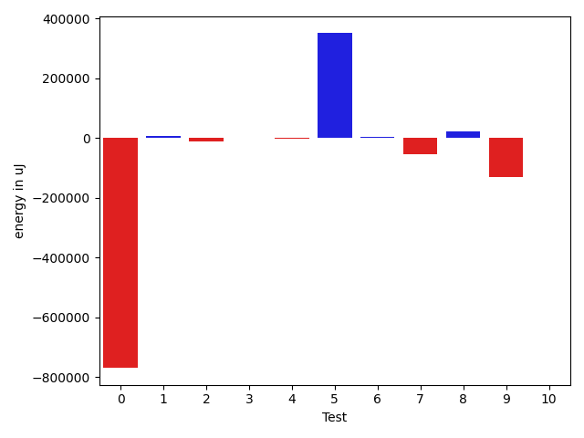
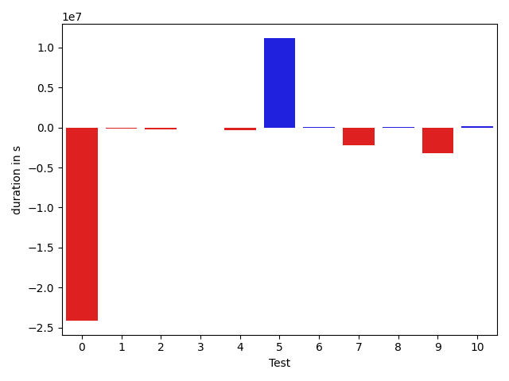

# gson 23e291

https://github.com/google/gson.git/commit/23e291

## Delta Energy per test method

| ID | EnergyV1 | EnergyV2 | DeltaEnergy |
| --- | --- | --- | --- |
| 0 | 875015.0612408273 | 105251.58992573147 | -769763.4713150959 |
| 1 | 35472.43752984564 | 41565.69179917135 | 6093.2542693257055 |
| 2 | 46362.46054160473 | 36586.5125165037 | -9775.948025101025 |
| 3 | 33201.545458475855 | 34027.37930705485 | 825.8338485789936 |
| 4 | 34440.664675672364 | 33886.10788809758 | -554.5567875747874 |
| 5 | 563609.8464429938 | 914835.0220505286 | 351225.1756075347 |
| 6 | 32920.24010960564 | 38159.26979075295 | 5239.029681147309 |
| 7 | 174356.48113993264 | 119642.00262431048 | -54714.47851562216 |
| 8 | 34324.40177991548 | 55646.180328236806 | 21321.778548321323 |
| 9 | 168189.23295563477 | 37849.62650849085 | -130339.60644714392 |
| 10 | 33348.09415193138 | 33697.18888309705 | 349.09473116567096 |

## Delta Duration per test method

| ID | DurationV1 | DurationsV2 | DeltaDuration |
| --- | --- | --- | --- |
| 0 | 27010677.219781574 | 2863122.47616253 | -24147554.743619043 |
| 1 | 1466672.2196840788 | 1379650.5514870037 | -87021.66819707514 |
| 2 | 1686821.7700807496 | 1468134.901400535 | -218686.86868021474 |
| 3 | 1016160.2942063212 | 1022920.9547880271 | 6760.660581705859 |
| 4 | 1738432.064515281 | 1373553.3154300149 | -364878.74908526614 |
| 5 | 18331309.67815325 | 29516249.10670442 | 11184939.428551171 |
| 6 | 1578371.07547961 | 1669578.2109936727 | 91207.13551406283 |
| 7 | 5705274.84550056 | 3486540.554872109 | -2218734.2906284505 |
| 8 | 1342014.1312688347 | 1410849.9624840925 | 68835.83121525776 |
| 9 | 4985433.684790306 | 1737380.6143008803 | -3248053.070489425 |
| 10 | 1307229.176703523 | 1436393.121994041 | 129163.945290518 |

## Misc.

| ID | Test Class | Test Method |
| --- | --- | --- |
| 0 | com.google.gson.functional.JsonAdapterAnnotationOnClassesTest | testJsonAdapterInvoked |
| 1 | com.google.gson.functional.JsonAdapterAnnotationOnClassesTest | testRegisteredDeserializerOverridesJsonAdapter |
| 2 | com.google.gson.functional.JsonAdapterAnnotationOnClassesTest | testRegisteredSerializerOverridesJsonAdapter |
| 3 | com.google.gson.functional.JsonAdapterAnnotationOnClassesTest | testIncorrectTypeAdapterFails |
| 4 | com.google.gson.functional.JsonAdapterAnnotationOnClassesTest | testJsonAdapterFactoryInvoked |
| 5 | com.google.gson.functional.RuntimeTypeAdapterFactoryFunctionalTest | testSubclassesAutomaticallySerialzed |
| 6 | com.google.gson.functional.JsonAdapterAnnotationOnFieldsTest | testClassAnnotationAdapterFactoryTakesPrecedenceOverDefault |
| 7 | com.google.gson.functional.JsonAdapterAnnotationOnFieldsTest | testClassAnnotationAdapterTakesPrecedenceOverDefault |
| 8 | com.google.gson.functional.JsonAdapterAnnotationOnFieldsTest | testFieldAnnotationTakesPrecedenceOverClassAnnotation |
| 9 | com.google.gson.functional.JsonAdapterAnnotationOnFieldsTest | testJsonAdapterInvokedOnlyForAnnotatedFields |
| 10 | com.google.gson.functional.JsonAdapterAnnotationOnFieldsTest | testFieldAnnotationTakesPrecedenceOverRegisteredTypeAdapter |

| Test | IterationV1 | IterationV2 | DeltaIteration |
| --- | --- | --- | --- |
| 0 | 99 | 99 | 0 |
| 1 | 73 | 69 | -4 |
| 2 | 98 | 99 | 1 |
| 3 | 71 | 54 | -17 |
| 4 | 98 | 98 | 0 |
| 5 | 99 | 99 | 0 |
| 6 | 99 | 99 | 0 |
| 7 | 99 | 96 | -3 |
| 8 | 97 | 94 | -3 |
| 9 | 96 | 98 | 2 |
| 10 | 95 | 96 | 1 |

| Time Label | Time (s) |
| --- | --- |
| Selection | 31.562657833099365 |
| Injection | 12.917816638946533 |
| Total | 1218.8168487548828 |

## Aggregation per test class

| Index | EnergyV1 | EnergyV2 | DeltaEnergy |
| --- | --- | --- | --- |
| 0 | 1024492.1694464257 | 251317.281436559 | -773174.8880098667 |
| 1 | 563609.8464429938 | 914835.0220505286 | 351225.1756075347 |
| 2 | 443138.45013702 | 284994.26813488815 | -158144.18200213183 |

| Index | DurationV1 | DurationsV2 | DeltaDuration |
| --- | --- | --- | --- |
| 0 | 32918763.568268005 | 8107382.199268112 | -24811381.36899989 |
| 1 | 18331309.67815325 | 29516249.10670442 | 11184939.428551171 |
| 2 | 14918322.913742833 | 9740742.464644797 | -5177580.449098036 |
| Index | TestClassName | #Tests |
| --- | --- | --- |
| 0 | com.google.gson.functional.JsonAdapterAnnotationOnClassesTest | 5 |
| 1 | com.google.gson.functional.RuntimeTypeAdapterFactoryFunctionalTest | 1 |
| 2 | com.google.gson.functional.JsonAdapterAnnotationOnFieldsTest | 5 |
