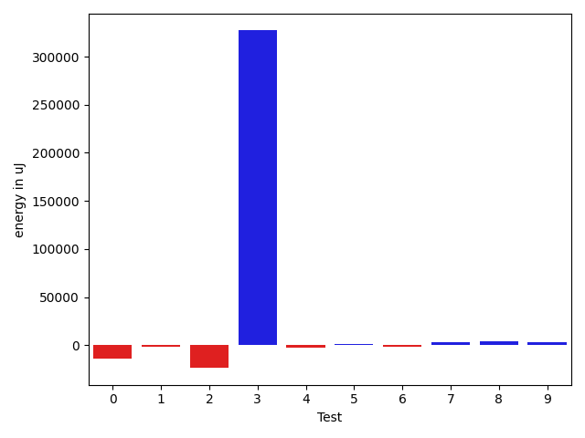
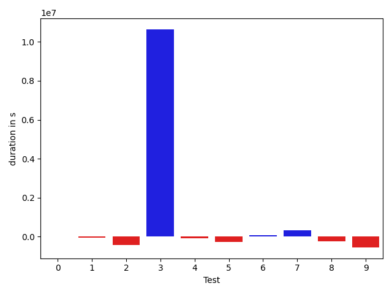

# gson 1f803b

https://github.com/google/gson.git/commit/1f803b

## Delta Energy per test method

| ID | EnergyV1 | EnergyV2 | DeltaEnergy |
| --- | --- | --- | --- |
| 0 | 60870.13698811071 | 46828.786498469344 | -14041.350489641365 |
| 1 | 36745.54892694201 | 34683.39081104001 | -2062.158115901999 |
| 2 | 164055.9455886157 | 140393.38514429244 | -23662.56044432326 |
| 3 | 250653.19655630563 | 577699.2863625567 | 327046.0898062511 |
| 4 | 39252.190079386106 | 36949.77730014603 | -2302.412779240076 |
| 5 | 44457.30616777345 | 46034.032379949684 | 1576.7262121762324 |
| 6 | 37693.181145770555 | 36435.12211131902 | -1258.0590344515367 |
| 7 | 35974.86898908913 | 38944.96681397238 | 2970.097824883247 |
| 8 | 35627.41469718765 | 39582.62093041236 | 3955.206233224715 |
| 9 | 38462.822751246924 | 41309.13563504917 | 2846.312883802246 |

## Delta Duration per test method

| ID | DurationV1 | DurationsV2 | DeltaDuration |
| --- | --- | --- | --- |
| 0 | 1514398.8824977025 | 1511213.41998161 | -3185.4625160924625 |
| 1 | 930932.0441469912 | 878656.0192724877 | -52276.02487450349 |
| 2 | 5261192.069748003 | 4835428.3726312425 | -425763.69711676054 |
| 3 | 7409835.242972048 | 18053847.22306518 | 10644011.98009313 |
| 4 | 1040294.3810490216 | 937120.3523259764 | -103174.02872304525 |
| 5 | 1820603.9831067906 | 1544097.7323652273 | -276506.2507415633 |
| 6 | 918225.8642924035 | 975895.8283950845 | 57669.96410268103 |
| 7 | 895079.0393661112 | 1207768.2670835557 | 312689.22771744453 |
| 8 | 1164790.0560746775 | 917449.8064252497 | -247340.24964942783 |
| 9 | 1502346.1609120283 | 943363.366470645 | -558982.7944413833 |

## Misc.

| ID | Test Class | Test Method |
| --- | --- | --- |
| 0 | com.google.gson.functional.DefaultTypeAdaptersTest | testDateSerializationWithPattern |
| 1 | com.google.gson.functional.DefaultTypeAdaptersTest | testSqlDateSerialization |
| 2 | com.google.gson.functional.DefaultTypeAdaptersTest | testDefaultDateDeserializationUsingBuilder |
| 3 | com.google.gson.functional.DefaultTypeAdaptersTest | testNullSerialization |
| 4 | com.google.gson.functional.DefaultTypeAdaptersTest | testDateDeserializationWithPattern |
| 5 | com.google.gson.functional.DefaultTypeAdaptersTest | testDateSerializationInCollection |
| 6 | com.google.gson.functional.DefaultTypeAdaptersTest | testDateSerializationWithPatternNotOverridenByTypeAdapter |
| 7 | com.google.gson.functional.DefaultTypeAdaptersTest | testTimestampSerialization |
| 8 | com.google.gson.DefaultDateTypeAdapterTest | testDatePattern |
| 9 | com.google.gson.DefaultDateTypeAdapterTest | testDateSerialization |

| Test | IterationV1 | IterationV2 | DeltaIteration |
| --- | --- | --- | --- |
| 0 | 90 | 88 | -2 |
| 1 | 73 | 52 | -21 |
| 2 | 99 | 99 | 0 |
| 3 | 99 | 99 | 0 |
| 4 | 70 | 57 | -13 |
| 5 | 99 | 99 | 0 |
| 6 | 68 | 56 | -12 |
| 7 | 72 | 61 | -11 |
| 8 | 63 | 56 | -7 |
| 9 | 69 | 60 | -9 |

| Time Label | Time (s) |
| --- | --- |
| Selection | 31.44726586341858 |
| Injection | 13.500822305679321 |
| Total | 1245.4228522777557 |

## Aggregation per test class

| Index | EnergyV1 | EnergyV2 | DeltaEnergy |
| --- | --- | --- | --- |
| 0 | 669702.3744419933 | 957968.7474217456 | 288266.37297975225 |
| 1 | 74090.23744843458 | 80891.75656546153 | 6801.519117026954 |

| Index | DurationV1 | DurationsV2 | DeltaDuration |
| --- | --- | --- | --- |
| 0 | 19790561.50717907 | 29944027.21512036 | 10153465.70794129 |
| 1 | 2667136.2169867055 | 1860813.1728958946 | -806323.0440908109 |
| Index | TestClassName | #Tests |
| --- | --- | --- |
| 0 | com.google.gson.functional.DefaultTypeAdaptersTest | 8 |
| 1 | com.google.gson.DefaultDateTypeAdapterTest | 2 |
