# gson 7a1c94

https://github.com/google/gson.git/commit/7a1c94

## Delta Energy per test method

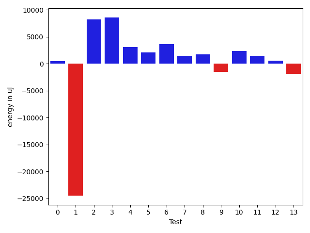

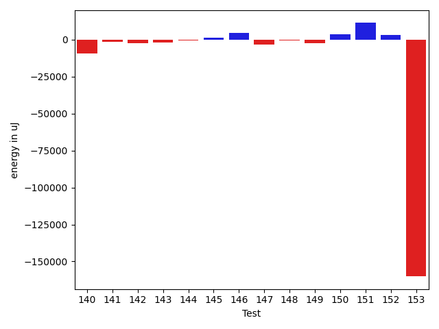

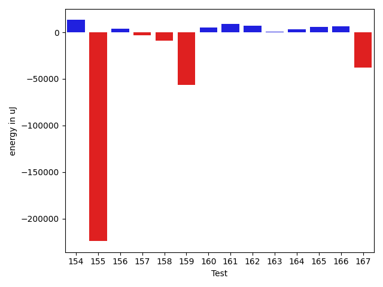

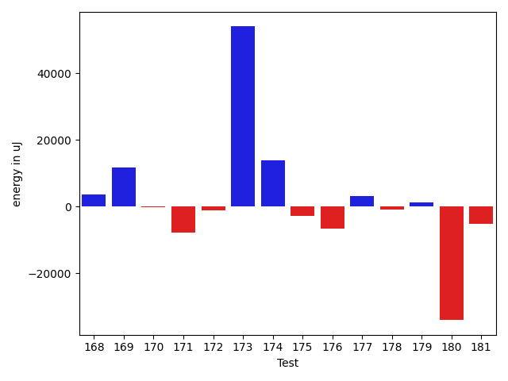

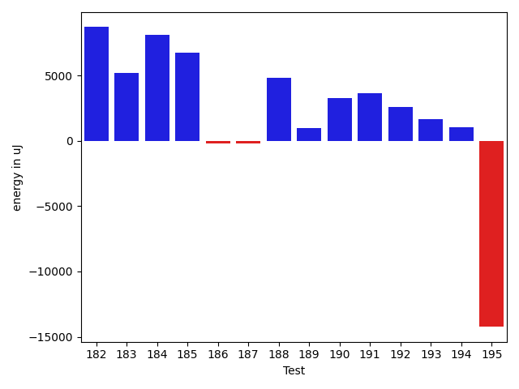

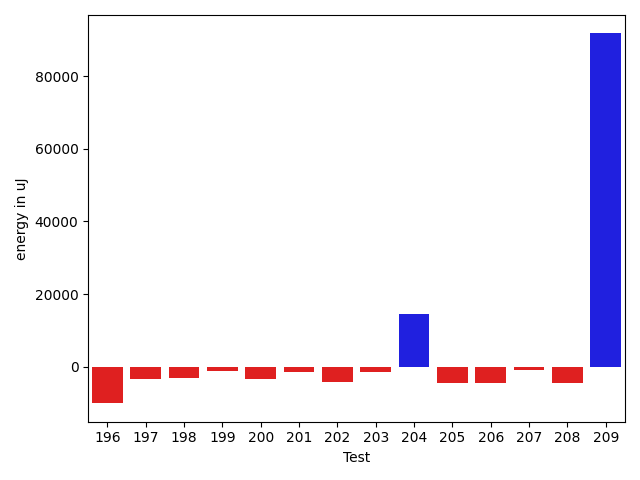

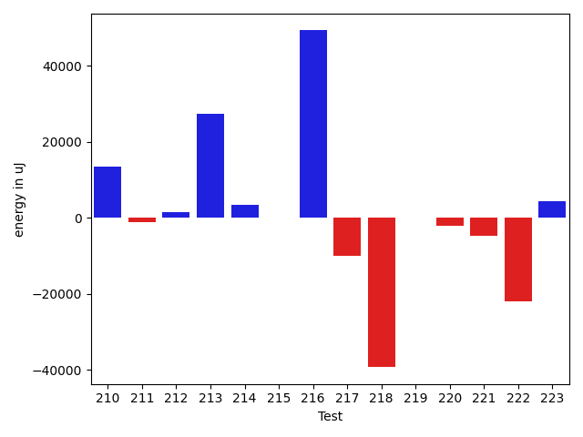

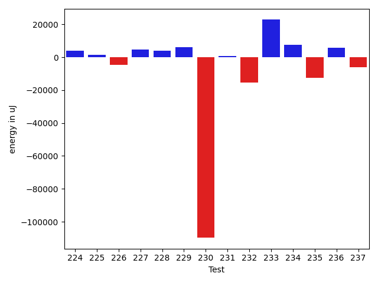

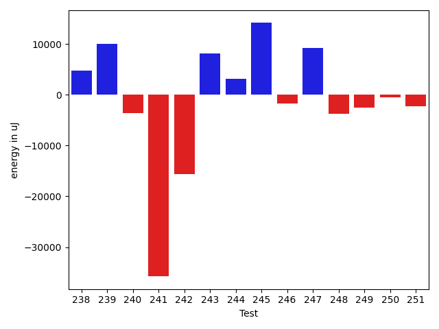

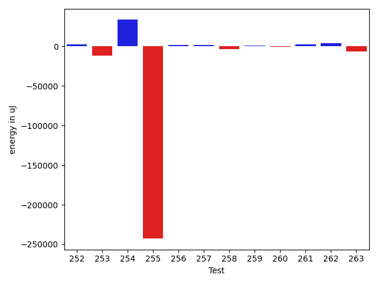

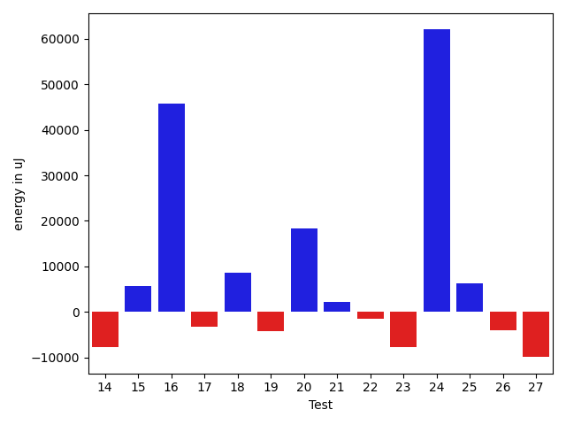

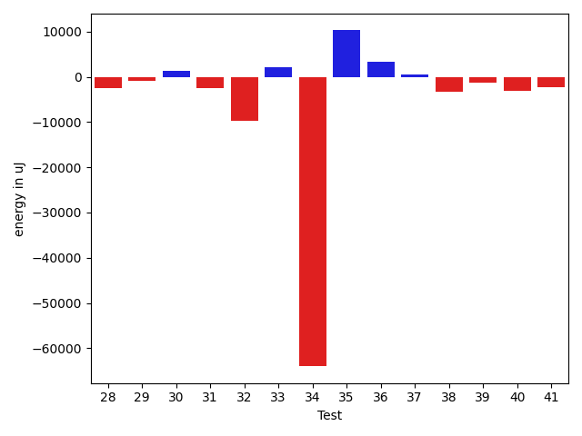

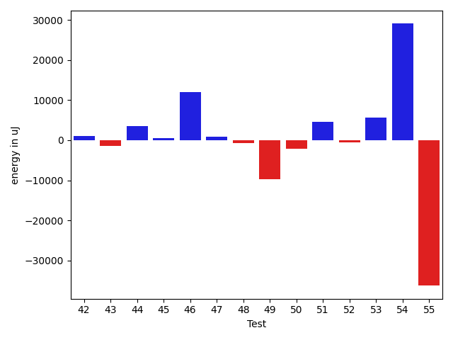

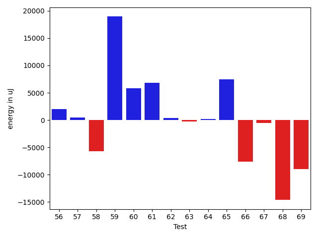

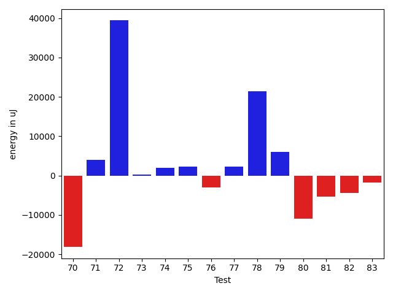

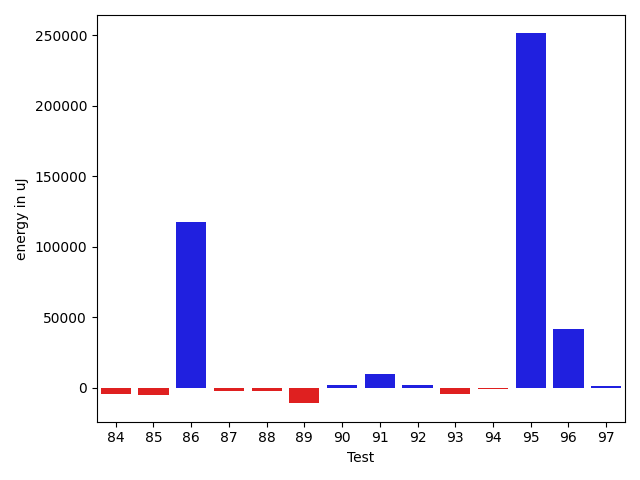

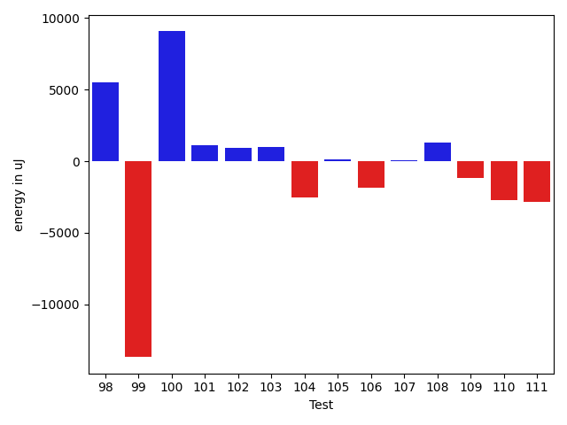

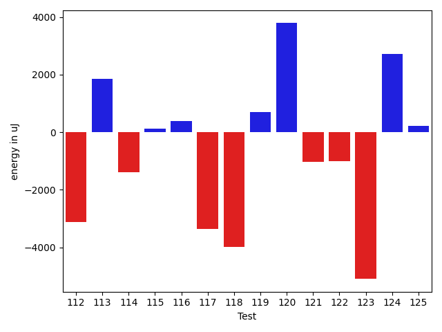

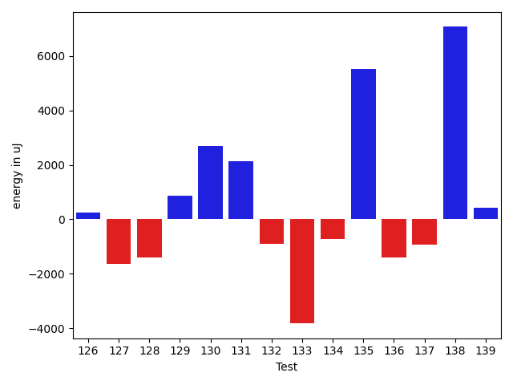

| ID | EnergyV1 | EnergyV2 | DeltaEnergy |
| --- | --- | --- | --- |
| 0 | 38029.29148838778 | 38495.35091838608 | 466.0594299982986 |
| 1 | 59919.99507904053 | 35424.43518770067 | -24495.559891339857 |
| 2 | 36533.61160511474 | 44788.712327055066 | 8255.100721940325 |
| 3 | 34681.11772890389 | 43307.41232243816 | 8626.294593534272 |
| 4 | 38124.75737650307 | 41264.24271295534 | 3139.4853364522714 |
| 5 | 39363.6012963966 | 41510.216875867794 | 2146.615579471196 |
| 6 | 41763.18765759468 | 45402.92040967941 | 3639.732752084732 |
| 7 | 38961.58704845607 | 40406.33742904663 | 1444.750380590558 |
| 8 | 39438.36408367008 | 41193.19136810303 | 1754.8272844329476 |
| 9 | 42059.46058185649 | 40530.39918565786 | -1529.061396198631 |
| 10 | 41374.51438588869 | 43800.44751625508 | 2425.933130366393 |
| 11 | 40082.60905838013 | 41585.50573825836 | 1502.8966798782349 |
| 12 | 40623.10334101101 | 41162.339015524834 | 539.235674513824 |
| 13 | 38350.7477977516 | 36534.71214184788 | -1816.0356559037245 |
| 14 | 42734.184651851654 | 35002.88075590134 | -7731.303895950317 |
| 15 | 37511.58473811433 | 43146.70362975681 | 5635.11889164248 |
| 16 | 39047.69022297207 | 84857.89496388461 | 45810.20474091254 |
| 17 | 43885.71136495461 | 40582.08738598466 | -3303.6239789699466 |
| 18 | 41001.864866134674 | 49708.9377335328 | 8707.072867398128 |
| 19 | 172761.11696366878 | 168529.76677937154 | -4231.350184297247 |
| 20 | 511101.94459694077 | 529516.8197690302 | 18414.875172089436 |
| 21 | 41009.601726842266 | 43244.60247097984 | 2235.000744137571 |
| 22 | 36701.38921903074 | 35239.02256918559 | -1462.3666498451494 |
| 23 | 42007.35372616206 | 34229.32981910296 | -7778.023907059098 |
| 24 | 47905.5878165262 | 109919.72455686695 | 62014.13674034075 |
| 25 | 39398.15242564493 | 45755.355194955744 | 6357.2027693108175 |
| 26 | 40771.38884184556 | 36659.008322886824 | -4112.3805189587365 |
| 27 | 42172.162687242846 | 32266.5362862511 | -9905.626400991747 |
| 28 | 39521.94480605936 | 37001.77866192583 | -2520.1661441335236 |
| 29 | 40230.43401525383 | 39272.346315253744 | -958.0877000000837 |
| 30 | 40616.85740427737 | 41845.347883299284 | 1228.4904790219152 |
| 31 | 37834.80627441406 | 35407.2312374115 | -2427.5750370025635 |
| 32 | 72452.19265609486 | 62810.36913078209 | -9641.823525312771 |
| 33 | 38474.755216144455 | 40500.10351788158 | 2025.3483017371254 |
| 34 | 102376.23307408176 | 38391.49460021477 | -63984.738473866986 |
| 35 | 35009.80092640709 | 45251.67052834417 | 10241.869601937076 |
| 36 | 36526.34330783094 | 39930.66343978557 | 3404.320131954628 |
| 37 | 39472.10521264905 | 40024.03150836186 | 551.9262957128158 |
| 38 | 41447.14141427673 | 38111.415642971406 | -3335.725771305326 |
| 39 | 40298.20208999149 | 39002.13096669382 | -1296.0711232976755 |
| 40 | 39818.45559055799 | 36664.494385289916 | -3153.961205268075 |
| 41 | 40963.65642995003 | 38665.833794413025 | -2297.822635537006 |
| 42 | 39814.6425720737 | 40810.94647661493 | 996.3039045412297 |
| 43 | 38603.139180857936 | 37257.677681575195 | -1345.461499282741 |
| 44 | 59822.52516832399 | 63355.8043479557 | 3533.2791796317106 |
| 45 | 41561.08766776501 | 42041.05614940329 | 479.9684816382796 |
| 46 | 45459.12089701303 | 57403.909957844735 | 11944.789060831703 |
| 47 | 39052.46338837143 | 39967.70775096216 | 915.2443625907326 |
| 48 | 40149.80678911696 | 39402.45569628633 | -747.351092830635 |
| 49 | 53609.1251251643 | 43940.57448571697 | -9668.550639447327 |
| 50 | 41147.95722359451 | 39057.912870963715 | -2090.0443526307936 |
| 51 | 69878.58914989856 | 74406.77609960613 | 4528.186949707568 |
| 52 | 40328.459267980834 | 39708.673551046166 | -619.785716934668 |
| 53 | 38973.45171965475 | 44678.644570492004 | 5705.192850837251 |
| 54 | 218926.03531293786 | 247982.5390820171 | 29056.503769079223 |
| 55 | 186603.61430885363 | 150342.58648502047 | -36261.02782383317 |
| 56 | 41740.16087719798 | 43731.68306760071 | 1991.5221904027276 |
| 57 | 34939.198899924755 | 35436.536717034876 | 497.33781711012125 |
| 58 | 44478.22689825995 | 38779.69335520826 | -5698.533543051686 |
| 59 | 40287.31489297012 | 59231.329456578715 | 18944.014563608594 |
| 60 | 40642.684665980654 | 46473.96979184284 | 5831.285125862189 |
| 61 | 52153.62080391927 | 58996.827512065924 | 6843.206708146652 |
| 62 | 38289.50235628613 | 38653.11081125976 | 363.60845497362607 |
| 63 | 38995.94011548606 | 38762.1838684082 | -233.75624707785755 |
| 64 | 38751.78214619181 | 38927.06283942424 | 175.28069323243108 |
| 65 | 57260.51991236293 | 64714.685664907316 | 7454.165752544388 |
| 66 | 45463.51745743813 | 37875.76630953932 | -7587.751147898809 |
| 67 | 36962.99862578985 | 36404.67531224229 | -558.3233135475602 |
| 68 | 59653.718175453934 | 45022.05048730399 | -14631.667688149944 |
| 69 | 74991.590532301 | 65969.23041238094 | -9022.36011992005 |
| 70 | 55764.26167416184 | 37606.4349540255 | -18157.82672013634 |
| 71 | 34560.44028335856 | 38513.76632279158 | 3953.3260394330136 |
| 72 | 108051.11103244167 | 147432.1635999708 | 39381.05256752914 |
| 73 | 41892.42741012573 | 42148.543548583984 | 256.11613845825195 |
| 74 | 40311.2775015861 | 42235.35608559202 | 1924.0785840059252 |
| 75 | 40851.78364479542 | 43106.36502289772 | 2254.5813781023026 |
| 76 | 36066.99542155117 | 33096.69429614302 | -2970.3011254081503 |
| 77 | 39091.61804706525 | 41366.08648895734 | 2274.468441892095 |
| 78 | 43700.27711190132 | 65107.14291800407 | 21406.865806102753 |
| 79 | 38806.267948177876 | 44836.94964985369 | 6030.681701675814 |
| 80 | 91058.98254338474 | 80088.64162435518 | -10970.340919029564 |
| 81 | 41423.51426638663 | 36068.09843444824 | -5355.415831938386 |
| 82 | 40837.288516802764 | 36343.306195269324 | -4493.98232153344 |
| 83 | 40084.153235673904 | 38365.37907242775 | -1718.7741632461548 |
| 84 | 38491.915002253416 | 33845.65452786951 | -4646.260474383904 |
| 85 | 41184.4780042535 | 35841.157538806336 | -5343.320465447163 |
| 86 | 44898.12816468455 | 162100.05964442005 | 117201.9314797355 |
| 87 | 43360.29446411133 | 40859.18614196777 | -2501.1083221435547 |
| 88 | 42853.34131862422 | 40528.02171327942 | -2325.3196053447973 |
| 89 | 46496.002791461855 | 35342.94667117338 | -11153.056120288478 |
| 90 | 40470.93420410156 | 42061.553227603436 | 1590.619023501873 |
| 91 | 70468.01425098522 | 79794.56690411612 | 9326.5526531309 |
| 92 | 36297.76416015625 | 38197.47528848611 | 1899.7111283298582 |
| 93 | 43831.828110779345 | 39135.60084800537 | -4696.227262773973 |
| 94 | 38123.63511256798 | 37205.86250535022 | -917.7726072177611 |
| 95 | 99353.72090997317 | 350775.78141259134 | 251422.06050261817 |
| 96 | 38506.26291416974 | 80070.53485236058 | 41564.27193819084 |
| 97 | 40032.92268214187 | 41402.136208059535 | 1369.2135259176648 |
| 98 | 38628.180897844344 | 44141.67885850903 | 5513.497960664688 |
| 99 | 57304.29360662031 | 43604.62802154345 | -13699.665585076858 |
| 100 | 36909.349796825685 | 45988.77250250811 | 9079.422705682424 |
| 101 | 38310.292586300406 | 39412.98779153381 | 1102.6952052334018 |
| 102 | 42355.594510834446 | 43276.52900541553 | 920.9344945810808 |
| 103 | 40464.8808028698 | 41426.73095738888 | 961.8501545190811 |
| 104 | 39216.87216508212 | 36676.852318673074 | -2540.0198464090427 |
| 105 | 40343.86070321388 | 40483.664434976454 | 139.80373176257126 |
| 106 | 39596.47287559509 | 37730.45708233118 | -1866.0157932639122 |
| 107 | 38977.21755769804 | 39017.817501976984 | 40.59994427894708 |
| 108 | 38448.35504541102 | 39720.22502886413 | 1271.8699834531071 |
| 109 | 41828.6453314551 | 40654.510870236394 | -1174.1344612187095 |
| 110 | 44438.233560316556 | 41694.75898307649 | -2743.474577240064 |
| 111 | 44529.671637654305 | 41655.72462372482 | -2873.9470139294863 |
| 112 | 39862.82949313088 | 36753.522699205154 | -3109.3067939257235 |
| 113 | 37035.625215530396 | 38884.45683288574 | 1848.8316173553467 |
| 114 | 40888.82924486307 | 39494.008717524885 | -1394.8205273381827 |
| 115 | 40205.338312149805 | 40336.820850444354 | 131.48253829454916 |
| 116 | 39539.05072789267 | 39940.629427060485 | 401.57869916781783 |
| 117 | 38721.978797670454 | 35354.601501464844 | -3367.37729620561 |
| 118 | 40038.025059334934 | 36065.80690465367 | -3972.2181546812644 |
| 119 | 40914.062773097234 | 41614.19872895538 | 700.1359558581462 |
| 120 | 38457.1532608172 | 42246.15049823024 | 3788.997237413045 |
| 121 | 42583.68318557739 | 41562.21819802839 | -1021.4649875489995 |
| 122 | 39966.012211203575 | 38953.55985403061 | -1012.452357172966 |
| 123 | 41947.62393951416 | 36855.07961130142 | -5092.544328212738 |
| 124 | 35692.41036891937 | 38412.26206994057 | 2719.8517010211945 |
| 125 | 38411.03281927109 | 38639.45822143555 | 228.42540216445923 |
| 126 | 37726.82617946675 | 37969.31889972431 | 242.49272025756363 |
| 127 | 44320.53688088991 | 42683.216396167874 | -1637.3204847220331 |
| 128 | 39093.166166180046 | 37686.94901613376 | -1406.2171500462864 |
| 129 | 40082.09101271872 | 40958.36975929185 | 876.2787465731235 |
| 130 | 39750.65655066073 | 42449.05512845982 | 2698.3985777990893 |
| 131 | 37626.92148280144 | 39750.80589675903 | 2123.884413957596 |
| 132 | 39377.566329956055 | 38465.97532248497 | -911.5910074710846 |
| 133 | 41606.38383978352 | 37776.9041527518 | -3829.4796870317223 |
| 134 | 38426.957840964744 | 37700.96030267497 | -725.9975382897755 |
| 135 | 37445.46064539254 | 42984.61048716307 | 5539.14984177053 |
| 136 | 37768.82703781128 | 36367.59573841095 | -1401.2312994003296 |
| 137 | 39535.170616778545 | 38597.92074584961 | -937.2498709289357 |
| 138 | 36309.41827879594 | 43385.4553645446 | 7076.037085748656 |
| 139 | 38374.575653387146 | 38799.15942860767 | 424.58377522052615 |
| 140 | 50794.63351170976 | 41647.9523034879 | -9146.68120822186 |
| 141 | 41254.24701405005 | 39809.02577516223 | -1445.2212388878252 |
| 142 | 41507.54144187516 | 39056.42008527731 | -2451.121356597854 |
| 143 | 42060.10974489064 | 40265.2901210033 | -1794.8196238873352 |
| 144 | 120666.6741093841 | 120271.77917766006 | -394.8949317240331 |
| 145 | 38600.68492757598 | 39859.57771326628 | 1258.8927856902956 |
| 146 | 38151.36259841919 | 42909.16965755448 | 4757.807059135288 |
| 147 | 42565.03712909577 | 39178.181500193925 | -3386.855628901845 |
| 148 | 37989.62161822448 | 37671.30797006481 | -318.3136481596739 |
| 149 | 38762.77397918701 | 36553.190485715866 | -2209.5834934711456 |
| 150 | 36135.44525947748 | 39775.31197363138 | 3639.8667141539045 |
| 151 | 41971.183488529125 | 53311.48396629805 | 11340.300477768928 |
| 152 | 38468.56702635484 | 41687.27615651861 | 3218.70913016377 |
| 153 | 199291.86901364953 | 39204.36900879588 | -160087.50000485365 |
| 154 | 68626.94902267602 | 81888.66922250102 | 13261.720199824995 |
| 155 | 265454.18113924505 | 41238.382570498085 | -224215.79856874695 |
| 156 | 37483.77053569353 | 41307.09527331285 | 3823.3247376193176 |
| 157 | 36976.88160121896 | 33655.32418737284 | -3321.5574138461234 |
| 158 | 52331.21376401045 | 43398.061647287344 | -8933.152116723104 |
| 159 | 96817.86712555078 | 40518.637656109 | -56299.22946944178 |
| 160 | 37719.81489308039 | 43174.01246874314 | 5454.197575662751 |
| 161 | 38531.23820555571 | 47504.69321399933 | 8973.45500844362 |
| 162 | 36754.05856996707 | 43676.02890355364 | 6921.970333586571 |
| 163 | 43685.98402180167 | 44181.995057471824 | 496.01103567015525 |
| 164 | 37258.12106857182 | 40504.96785251758 | 3246.846783945759 |
| 165 | 39262.762806947765 | 44823.958546633556 | 5561.195739685791 |
| 166 | 46054.30307156265 | 52653.020554812654 | 6598.717483250002 |
| 167 | 79551.92150387637 | 42031.243142169675 | -37520.67836170669 |
| 168 | 40050.968591945304 | 43755.30395920832 | 3704.3353672630183 |
| 169 | 41211.46970660572 | 52918.74540336506 | 11707.275696759338 |
| 170 | 42169.019544830706 | 42041.48080377136 | -127.53874105934665 |
| 171 | 49201.604961424266 | 41331.64836809422 | -7869.956593330047 |
| 172 | 38197.701447979736 | 37139.27027518423 | -1058.4311727955064 |
| 173 | 50178.92633075685 | 104149.88823949301 | 53970.961908736164 |
| 174 | 44041.59865276002 | 57815.514844632475 | 13773.916191872457 |
| 175 | 39956.965481221676 | 37050.20677423477 | -2906.758706986904 |
| 176 | 40402.331846328205 | 33665.866747300446 | -6736.465099027759 |
| 177 | 41702.465282678604 | 44798.62309026718 | 3096.1578075885773 |
| 178 | 39088.722410204966 | 38155.470719924175 | -933.2516902807911 |
| 179 | 42423.395296617324 | 43703.72293927178 | 1280.3276426544544 |
| 180 | 87408.1273621986 | 53349.54603789621 | -34058.581324302395 |
| 181 | 46187.80936966565 | 41003.64970397433 | -5184.159665691317 |
| 182 | 40540.40003642417 | 49238.05022059707 | 8697.650184172897 |
| 183 | 35118.624079704285 | 40332.4179315567 | 5213.793851852417 |
| 184 | 36455.34050253034 | 44586.01525245793 | 8130.674749927595 |
| 185 | 35370.46864737522 | 42118.509430385195 | 6748.040783009972 |
| 186 | 36494.63025474548 | 36295.12415909767 | -199.5060956478119 |
| 187 | 37601.02416494485 | 37417.22273543542 | -183.80142950943264 |
| 188 | 38819.52169163603 | 43664.7253971129 | 4845.203705476873 |
| 189 | 37744.3136929851 | 38729.78645840287 | 985.4727654177696 |
| 190 | 37068.03054642677 | 40336.12371078273 | 3268.0931643559597 |
| 191 | 39958.16097742319 | 43613.051802149974 | 3654.8908247267827 |
| 192 | 35019.97148376271 | 37597.610468555395 | 2577.638984792684 |
| 193 | 37713.957257200556 | 39369.46671820919 | 1655.5094610086308 |
| 194 | 43447.42198796943 | 44484.435708943754 | 1037.0137209743261 |
| 195 | 56451.072078292724 | 42217.979865582776 | -14233.092212709947 |
| 196 | 45964.866113032265 | 35867.963660312045 | -10096.90245272022 |
| 197 | 42418.739024311304 | 38924.14812541008 | -3494.590898901224 |
| 198 | 39996.13093234661 | 36734.06959915833 | -3262.061333188285 |
| 199 | 38800.87960911309 | 37525.276067483974 | -1275.6035416291197 |
| 200 | 40557.11700156331 | 37008.005402982235 | -3549.1115985810757 |
| 201 | 40922.91039263974 | 39309.53683907911 | -1613.3735535606247 |
| 202 | 41785.06926387875 | 37452.400668665316 | -4332.668595213436 |
| 203 | 41026.76953395805 | 39637.87016531825 | -1388.8993686398026 |
| 204 | 42450.01708911832 | 57017.12079095019 | 14567.103701831868 |
| 205 | 42657.233953908086 | 38044.46221476304 | -4612.771739145042 |
| 206 | 42880.8453439709 | 38467.31276882146 | -4413.532575149438 |
| 207 | 40519.84330664994 | 39621.8787337392 | -897.9645729107433 |
| 208 | 42373.35527267493 | 37866.9714780416 | -4506.38379463333 |
| 209 | 95477.25276124728 | 187298.0988681576 | 91820.84610691032 |
| 210 | 102506.33555722269 | 115970.92279370928 | 13464.587236486594 |
| 211 | 38396.89064917633 | 37316.23678501636 | -1080.653864159969 |
| 212 | 51686.26920640345 | 53195.9973242644 | 1509.7281178609483 |
| 213 | 70313.66566328255 | 97784.07657975034 | 27470.410916467794 |
| 214 | 35546.302481872764 | 38949.235530239865 | 3402.9330483671 |
| 215 | 53116.788736590024 | 53277.54229177426 | 160.75355518423748 |
| 216 | 257218.82963302324 | 306540.9608344289 | 49322.13120140566 |
| 217 | 395636.672310306 | 385787.558354834 | -9849.113955472014 |
| 218 | 94850.92585992924 | 55632.52697370398 | -39218.39888622526 |
| 219 | 47227.567784613755 | 47263.36103246379 | 35.793247850037005 |
| 220 | 42836.76458818874 | 40778.878800862716 | -2057.8857873260204 |
| 221 | 50281.814177845044 | 45489.899865565 | -4791.914312280045 |
| 222 | 63102.2635621354 | 41217.43371709465 | -21884.829845040746 |
| 223 | 36866.68807121925 | 41353.57196855545 | 4486.8838973362 |
| 224 | 36283.23588878289 | 40232.594937589485 | 3949.3590488065965 |
| 225 | 35930.74761198078 | 37276.950291112764 | 1346.2026791319804 |
| 226 | 41110.688720703125 | 36558.92779862881 | -4551.760922074318 |
| 227 | 37313.3706500285 | 42103.28872596619 | 4789.91807593769 |
| 228 | 35989.061973622534 | 40064.573873077214 | 4075.511899454679 |
| 229 | 35539.6545791626 | 41518.2280412931 | 5978.573462130502 |
| 230 | 208490.70542958457 | 98751.7848099175 | -109738.92061966707 |
| 231 | 41061.11738898787 | 41987.05006284159 | 925.9326738537202 |
| 232 | 60879.61570007566 | 45609.816219729844 | -15269.799480345813 |
| 233 | 33525.53331715214 | 56337.341632947784 | 22811.808315795643 |
| 234 | 47123.53138244235 | 54542.984438982545 | 7419.453056540195 |
| 235 | 72957.90098772425 | 60594.05766908618 | -12363.843318638072 |
| 236 | 37882.79952303037 | 43537.87552894739 | 5655.076005917021 |
| 237 | 38993.36197343597 | 33070.61359687627 | -5922.748376559699 |
| 238 | 42123.17918181307 | 46912.04406799938 | 4788.864886186304 |
| 239 | 68832.02720020877 | 78818.07730817306 | 9986.050107964285 |
| 240 | 52969.614281522314 | 49413.59059818881 | -3556.0236833335002 |
| 241 | 73436.68797791004 | 37690.48447294059 | -35746.20350496945 |
| 242 | 75788.4472269928 | 60168.769191070096 | -15619.678035922698 |
| 243 | 35352.28828078412 | 43417.04811771562 | 8064.759836931495 |
| 244 | 34388.48312044144 | 37496.08056694269 | 3107.597446501255 |
| 245 | 79621.59887553699 | 93746.11711175811 | 14124.51823622112 |
| 246 | 42047.0592597723 | 40290.42191709438 | -1756.6373426779173 |
| 247 | 34341.45741252233 | 43478.543891205154 | 9137.086478682824 |
| 248 | 42186.0598706007 | 38424.31428211648 | -3761.74558848422 |
| 249 | 41110.005097448826 | 38611.88207902387 | -2498.123018424958 |
| 250 | 40869.15341848135 | 40322.438732084 | -546.7146863973467 |
| 251 | 41740.3772380501 | 39485.28235676885 | -2255.0948812812567 |
| 252 | 82929.26022508685 | 85223.8174483885 | 2294.557223301643 |
| 253 | 69295.61994340726 | 57771.50683472176 | -11524.113108685502 |
| 254 | 39682.59509652261 | 73004.19502761489 | 33321.59993109228 |
| 255 | 281066.15201499534 | 38352.59192836509 | -242713.56008663026 |
| 256 | 38191.33910548878 | 39580.36102207005 | 1389.0219165812669 |
| 257 | 40203.176028432455 | 41816.67731786985 | 1613.501289437394 |
| 258 | 43365.69573844796 | 39779.3267309106 | -3586.3690075373597 |
| 259 | 40487.49192164489 | 41109.34782078955 | 621.8558991446625 |
| 260 | 41270.283636589535 | 40502.032919315156 | -768.250717274379 |
| 261 | 38779.428409824555 | 40945.306922692806 | 2165.8785128682503 |
| 262 | 38744.435193061596 | 42237.55049774403 | 3493.115304682433 |
| 263 | 42480.40630680842 | 36005.794100761006 | -6474.612206047415 |

## Delta Duration per test method

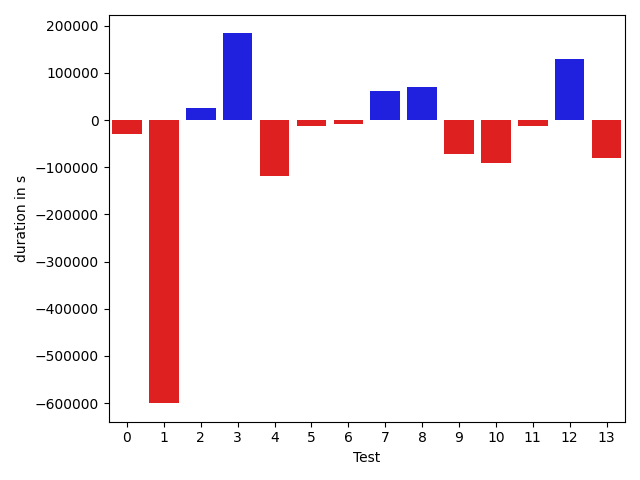

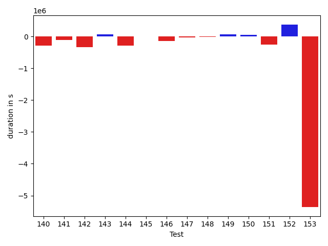

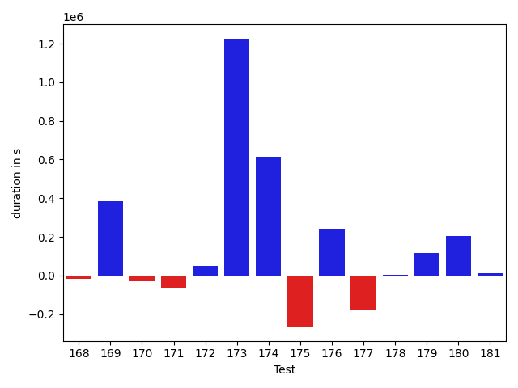

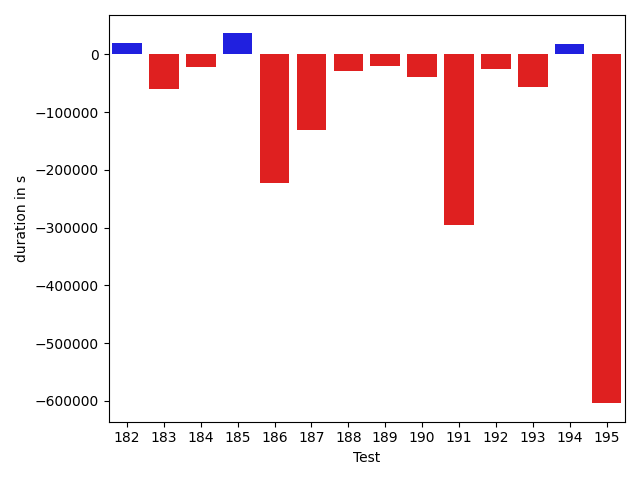

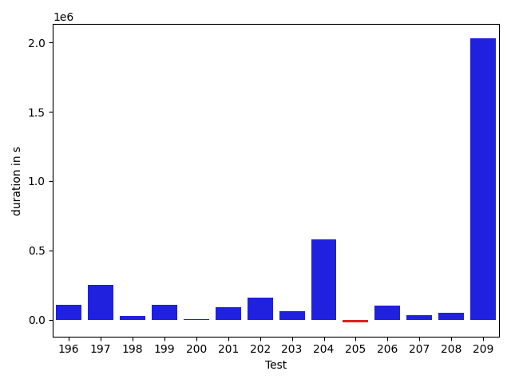

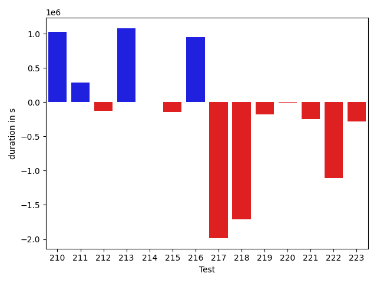

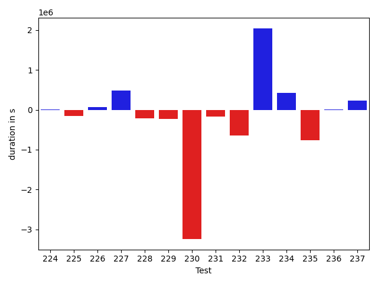

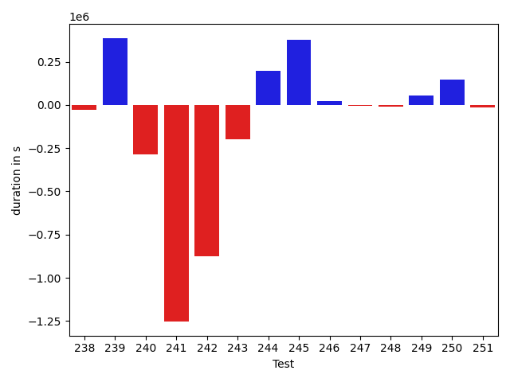

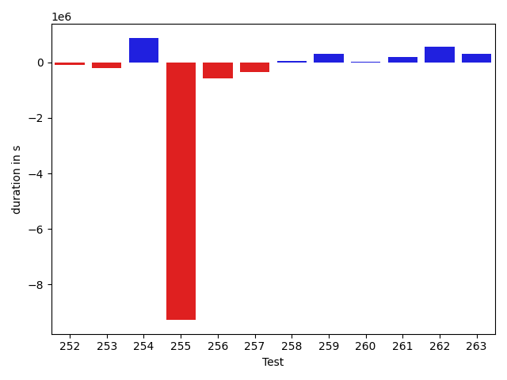

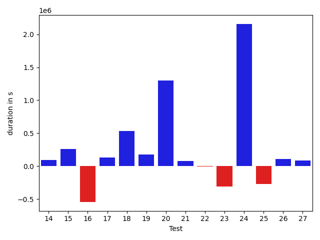

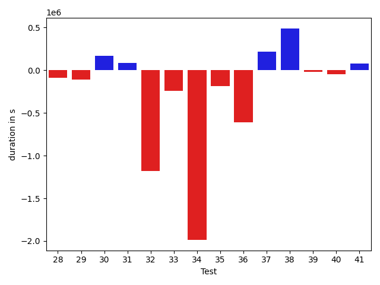

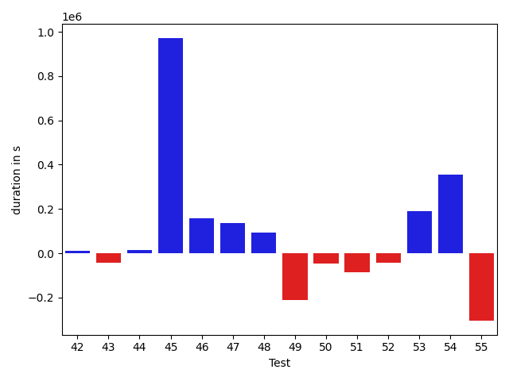

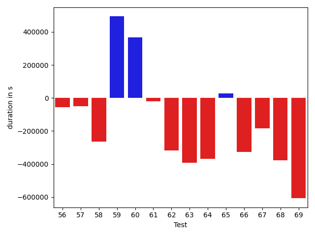

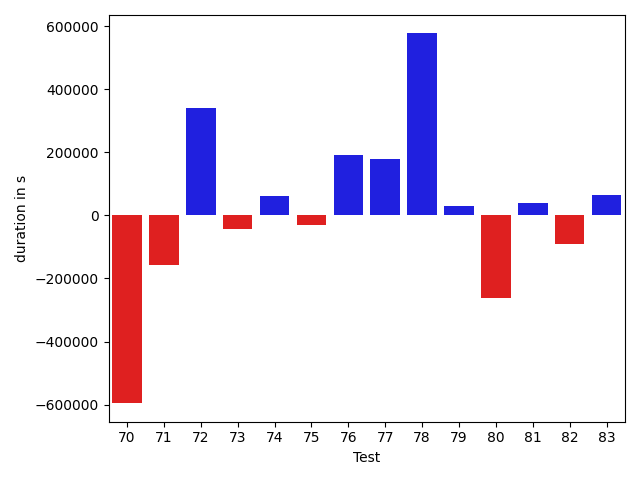

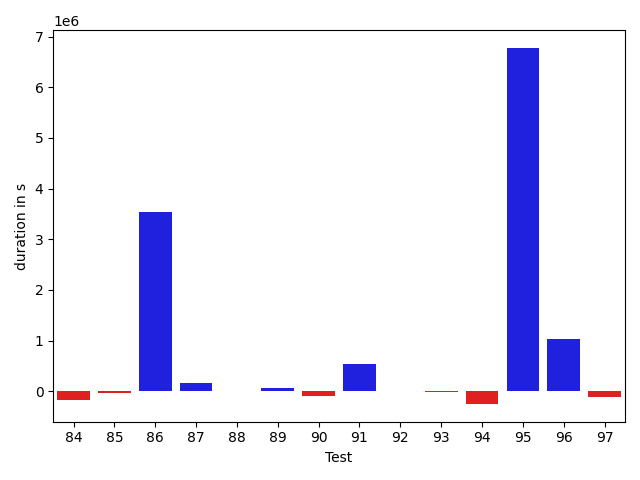

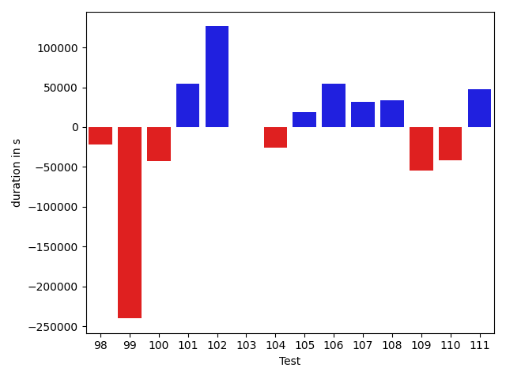

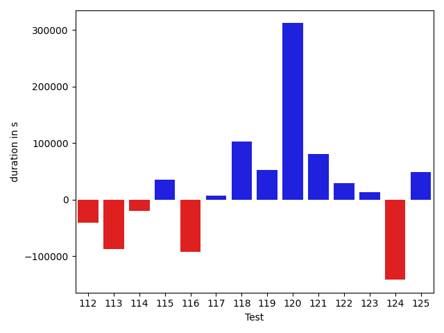

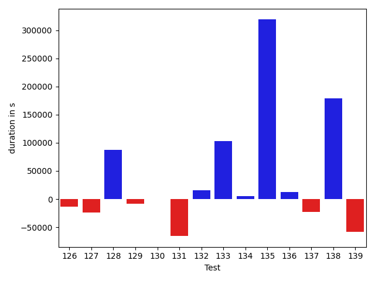

| ID | DurationV1 | DurationsV2 | DeltaDuration |
| --- | --- | --- | --- |
| 0 | 701427.5491427328 | 673053.1204545355 | -28374.42868819728 |
| 1 | 1207555.4518117905 | 607369.5796154216 | -600185.8721963689 |
| 2 | 1012475.0225065091 | 1037360.4824319804 | 24885.45992547134 |
| 3 | 826823.0114568362 | 1010550.4822328393 | 183727.4707760031 |
| 4 | 669861.3789593277 | 552033.4932184296 | -117827.88574089808 |
| 5 | 697968.1870534108 | 684623.8292150773 | -13344.357838333468 |
| 6 | 408111.3056473732 | 399374.758859396 | -8736.546787977219 |
| 7 | 402668.90760335326 | 464291.97120285034 | 61623.06359949708 |
| 8 | 375680.7336186804 | 446139.5676841736 | 70458.8340654932 |
| 9 | 598367.5408809566 | 527231.81916626 | -71135.72171469661 |
| 10 | 530801.3886418613 | 440384.2768820673 | -90417.11175979394 |
| 11 | 380988.12701034546 | 369416.64884757996 | -11571.478162765503 |
| 12 | 439238.73358370824 | 569801.5573804546 | 130562.82379674638 |
| 13 | 767543.4784878355 | 687047.5367176977 | -80495.94177013775 |
| 14 | 510280.712694563 | 606031.2254495621 | 95750.5127549991 |
| 15 | 631320.7095871788 | 892158.2431993593 | 260837.5336121805 |
| 16 | 2937763.699149385 | 2394189.833777673 | -543573.865371712 |
| 17 | 651747.1747394118 | 782406.7238598333 | 130659.54912042152 |
| 18 | 1113969.654242486 | 1646478.4402190465 | 532508.7859765606 |
| 19 | 4775414.894121437 | 4954997.723441151 | 179582.82931971364 |
| 20 | 14051827.416083407 | 15351374.286216347 | 1299546.87013294 |
| 21 | 1092735.462951277 | 1168540.1544137984 | 75804.69146252144 |
| 22 | 648144.1500035226 | 639340.882281065 | -8803.267722457647 |
| 23 | 1271755.606577578 | 959530.632501282 | -312224.97407629597 |
| 24 | 1036192.554223928 | 3193568.462534764 | 2157375.9083108357 |
| 25 | 1570001.010798904 | 1297096.4055469963 | -272904.60525190784 |
| 26 | 643754.8301875612 | 751775.4214040956 | 108020.59121653438 |
| 27 | 872528.290734186 | 957412.2894666267 | 84883.99873244076 |
| 28 | 568744.3193268618 | 478092.08286143787 | -90652.23646542389 |
| 29 | 756220.2159246462 | 648610.1684540017 | -107610.04747064458 |
| 30 | 738493.2868749793 | 902685.1713278682 | 164191.88445288897 |
| 31 | 429313.53759765625 | 516141.6371488571 | 86828.09955120087 |
| 32 | 2707426.193505764 | 1529263.986813847 | -1178162.206691917 |
| 33 | 1098566.3528394855 | 853234.1745197359 | -245332.17831974966 |
| 34 | 3126023.691850975 | 1140285.734443435 | -1985737.9574075402 |
| 35 | 974149.4043270726 | 784835.190834924 | -189314.21349214856 |
| 36 | 1419887.0519562638 | 806390.9040135287 | -613496.1479427351 |
| 37 | 646626.0325566554 | 864440.4230795458 | 217814.3905228905 |
| 38 | 691007.7174668261 | 1178450.881316714 | 487443.1638498879 |
| 39 | 958733.772904348 | 940655.9104294628 | -18077.862474885187 |
| 40 | 718458.2996618494 | 669679.1682255168 | -48779.131436332595 |
| 41 | 965233.6289243414 | 1041693.3476269252 | 76459.7187025838 |
| 42 | 799746.3152357502 | 811353.1049909883 | 11606.789755238104 |
| 43 | 650190.478945609 | 608285.7529211056 | -41904.726024503354 |
| 44 | 1847647.0513347131 | 1863244.3520721612 | 15597.300737448037 |
| 45 | 905364.8623292856 | 1876963.6696479602 | 971598.8073186746 |
| 46 | 1719873.4014279423 | 1876546.4087270387 | 156673.00729909632 |
| 47 | 956563.189834245 | 1094052.8558100997 | 137489.66597585473 |
| 48 | 921730.7247194948 | 1015858.5039063012 | 94127.77918680641 |
| 49 | 1295123.2281559522 | 1082639.0142169944 | -212484.21393895778 |
| 50 | 840438.9213169005 | 795349.407301893 | -45089.51401500753 |
| 51 | 1800583.6405163961 | 1715029.4006957794 | -85554.23982061679 |
| 52 | 1004280.3957140557 | 962790.4008511105 | -41489.994862945285 |
| 53 | 524790.2286762856 | 716586.342814595 | 191796.11413830938 |
| 54 | 6018275.79516034 | 6371928.565847743 | 353652.77068740316 |
| 55 | 4608995.562331581 | 4305121.217922536 | -303874.34440904483 |
| 56 | 648587.8158776164 | 593178.676664765 | -55409.13921285141 |
| 57 | 616064.3766881227 | 566792.7624972388 | -49271.614190883934 |
| 58 | 846343.4262366191 | 581216.7533501443 | -265126.6728864749 |
| 59 | 1241189.8188825313 | 1734672.9783936518 | 493483.1595111205 |
| 60 | 693040.9744138743 | 1059297.3992216345 | 366256.42480776017 |
| 61 | 1499778.329644351 | 1478948.904805043 | -20829.42483930802 |
| 62 | 935014.6724819363 | 616821.6738246107 | -318192.99865732563 |
| 63 | 898348.5946148804 | 506181.48248291016 | -392167.11213197024 |
| 64 | 793665.5297250008 | 424661.6677341657 | -369003.86199083517 |
| 65 | 1616643.592995082 | 1644721.0789887076 | 28077.485993625596 |
| 66 | 1386549.6177020895 | 1059806.5857747393 | -326743.0319273502 |
| 67 | 949303.3036058733 | 764486.7470339014 | -184816.55657197186 |
| 68 | 1962573.306823843 | 1585135.8896960977 | -377437.4171277452 |
| 69 | 2362447.672008299 | 1755036.8487632072 | -607410.8232450916 |
| 70 | 1540567.6762549968 | 944755.9549235048 | -595811.721331492 |
| 71 | 674115.3193286271 | 517250.6175347455 | -156864.7017938816 |
| 72 | 2634312.077914755 | 2976321.6239638953 | 342009.5460491404 |
| 73 | 415256.6868247986 | 371099.8737487793 | -44156.81307601929 |
| 74 | 647056.7767127615 | 709061.3832656131 | 62004.60655285162 |
| 75 | 539647.5237731934 | 507848.4149007201 | -31799.10887247324 |
| 76 | 497186.00886909664 | 690053.981158765 | 192867.9722896684 |
| 77 | 855960.0771447232 | 1034042.1207848709 | 178082.04364014778 |
| 78 | 713738.9558082636 | 1290768.3270946012 | 577029.3712863376 |
| 79 | 798176.0793570221 | 829000.8665745364 | 30824.787217514357 |
| 80 | 2165336.7202016516 | 1901945.2456030766 | -263391.4745985749 |
| 81 | 403527.43564645946 | 442792.99325561523 | 39265.557609155774 |
| 82 | 765999.6310158896 | 673862.5242823997 | -92137.1067334899 |
| 83 | 483102.95822155476 | 547286.8034123182 | 64183.84519076347 |
| 84 | 861232.3925232152 | 695084.896262509 | -166147.4962607061 |
| 85 | 756868.8808284791 | 719854.5920282631 | -37014.28880021593 |
| 86 | 828504.1492079776 | 4369528.5736834705 | 3541024.424475493 |
| 87 | 404733.51724624634 | 567513.166015625 | 162779.64876937866 |
| 88 | 867341.3842793843 | 882657.3088643933 | 15315.924585008994 |
| 89 | 921346.5830653624 | 984014.9780731611 | 62668.39500779868 |
| 90 | 469943.5213623047 | 377251.7927853167 | -92691.72857698798 |
| 91 | 1987865.2646270816 | 2530597.35213416 | 542732.0875070787 |
| 92 | 437311.2571105957 | 451575.88580235 | 14264.628691754304 |
| 93 | 615117.0110065469 | 610141.7530840624 | -4975.257922484539 |
| 94 | 767147.9693035049 | 519252.7506366737 | -247895.2186668312 |
| 95 | 3321101.624216298 | 10095796.906856127 | 6774695.282639829 |
| 96 | 1168326.0141166714 | 2201937.9418292237 | 1033611.9277125522 |
| 97 | 1064394.3179783886 | 960406.9481145514 | -103987.36986383726 |
| 98 | 746629.5177426416 | 724909.974175774 | -21719.543566867593 |
| 99 | 1462020.1779708806 | 1222133.8299941025 | -239886.34797677817 |
| 100 | 990309.935434513 | 947686.8633480306 | -42623.072086482425 |
| 101 | 778993.3572362441 | 833509.3655695722 | 54516.00833332806 |
| 102 | 587594.8201104434 | 713858.1576737964 | 126263.33756335301 |
| 103 | 453772.9309363365 | 453602.1315256357 | -170.79941070079803 |
| 104 | 622442.3419914985 | 597124.623232741 | -25317.71875875746 |
| 105 | 625476.5007241669 | 643946.0467414204 | 18469.54601725354 |
| 106 | 424103.940032959 | 478731.9647446275 | 54628.02471166849 |
| 107 | 827904.8985897644 | 859674.886939684 | 31769.988349919673 |
| 108 | 564445.0049501751 | 597724.6829032175 | 33279.67795304244 |
| 109 | 906830.856233873 | 852541.3749794035 | -54289.4812544696 |
| 110 | 462502.9987954623 | 420608.5344324306 | -41894.46436303173 |
| 111 | 435210.89352703094 | 482688.83453496546 | 47477.94100793451 |
| 112 | 688980.8380827969 | 648378.6100178879 | -40602.228064908995 |
| 113 | 440282.5845756531 | 353039.2743244171 | -87243.31025123596 |
| 114 | 731663.0184404795 | 711076.4043744286 | -20586.61406605097 |
| 115 | 1141927.2692049034 | 1176789.3517067917 | 34862.082501888275 |
| 116 | 521751.0018509291 | 429714.7210840583 | -92036.28076687083 |
| 117 | 484838.11899404414 | 491960.1050872803 | 7121.9860932361335 |
| 118 | 457069.02114899084 | 560234.6508959064 | 103165.62974691554 |
| 119 | 637830.59260053 | 690503.6974028961 | 52673.10480236611 |
| 120 | 454747.0701172385 | 766737.2085956009 | 311990.1384783624 |
| 121 | 448191.2640514374 | 529341.8342723278 | 81150.57022089045 |
| 122 | 424521.80660790205 | 454092.85435819626 | 29571.04775029421 |
| 123 | 361786.75022125244 | 375439.7593355179 | 13653.009114265442 |
| 124 | 505495.447398901 | 363635.60414910316 | -141859.84324979782 |
| 125 | 443207.59598243237 | 492323.5647201538 | 49115.96873772144 |
| 126 | 589524.8257723949 | 575674.6705700005 | -13850.155202394351 |
| 127 | 570083.0972139277 | 545771.3101111948 | -24311.787102732807 |
| 128 | 444666.40979557973 | 532482.0490126172 | 87815.63921703747 |
| 129 | 590506.9349052493 | 582209.1759849289 | -8297.758920320426 |
| 130 | 463618.0480263233 | 463543.1787291495 | -74.86929717380553 |
| 131 | 503984.31257617474 | 438237.5714073181 | -65746.74116885662 |
| 132 | 419951.0808353424 | 435229.12600564957 | 15278.04517030716 |
| 133 | 473422.50981258193 | 576582.3626577855 | 103159.8528452036 |
| 134 | 589376.6533393814 | 595056.389121247 | 5679.735781865544 |
| 135 | 436757.19444128126 | 755561.9059407115 | 318804.71149943024 |
| 136 | 365945.5033597946 | 378363.68968486786 | 12418.186325073242 |
| 137 | 468025.08117227256 | 445446.4576292038 | -22578.623543068767 |
| 138 | 859247.7256012819 | 1037908.4411160673 | 178660.7155147855 |
| 139 | 447589.1654755651 | 389657.3351976238 | -57931.830277941306 |
| 140 | 1054162.0960190368 | 765416.3951874165 | -288745.7008316204 |
| 141 | 743397.8633210405 | 629160.2343473244 | -114237.62897371617 |
| 142 | 836932.7684765579 | 505003.0353189801 | -331929.7331575778 |
| 143 | 561556.7508897854 | 624604.121983973 | 63047.371094187605 |
| 144 | 3482122.0257557184 | 3194205.0193410926 | -287917.0064146258 |
| 145 | 768867.3922662756 | 769398.2405948354 | 530.8483285597758 |
| 146 | 619186.5189774036 | 471287.5291087851 | -147898.98986861855 |
| 147 | 881061.224078256 | 854158.7650153287 | -26902.459062927403 |
| 148 | 487984.4174492917 | 473481.8335657167 | -14502.58388357499 |
| 149 | 445380.61418378353 | 506683.72098886967 | 61303.106805086136 |
| 150 | 444536.34627413936 | 494055.56094796956 | 49519.214673830196 |
| 151 | 1520043.5041541173 | 1272124.193305679 | -247919.3108484384 |
| 152 | 649596.4807652049 | 1022762.8384756558 | 373166.3577104509 |
| 153 | 6255221.046338577 | 895244.8881786598 | -5359976.158159917 |
| 154 | 2075867.9601953437 | 2152054.366457291 | 76186.40626194724 |
| 155 | 8601830.882983277 | 750406.719113947 | -7851424.16386933 |
| 156 | 1056491.6998013246 | 821319.5713348227 | -235172.12846650195 |
| 157 | 1120012.5443954242 | 761007.0134340713 | -359005.53096135287 |
| 158 | 1438505.5479562012 | 747507.9703930601 | -690997.5775631411 |
| 159 | 2669497.9466029624 | 543055.3185838804 | -2126442.628019082 |
| 160 | 796815.9683673843 | 396723.5588591546 | -400092.4095082297 |
| 161 | 856026.5771880493 | 1125758.9436900157 | 269732.3665019664 |
| 162 | 661899.0150467902 | 712134.6314246856 | 50235.61637789535 |
| 163 | 1043503.8438342653 | 1163291.3561825138 | 119787.5123482485 |
| 164 | 1121867.8265759607 | 1033189.1704119227 | -88678.656164038 |
| 165 | 900092.1859700605 | 779748.9625529111 | -120343.22341714939 |
| 166 | 1321898.808189497 | 1242792.6382929317 | -79106.16989656538 |
| 167 | 2226323.8889689557 | 1267658.4757619272 | -958665.4132070285 |
| 168 | 841323.9088433312 | 824570.4865198743 | -16753.42232345685 |
| 169 | 969337.6918263631 | 1353605.4727432826 | 384267.78091691947 |
| 170 | 1194270.8882999811 | 1164798.6713507262 | -29472.216949254973 |
| 171 | 999292.0866553262 | 933943.8975551184 | -65348.18910020776 |
| 172 | 702698.5793296476 | 751630.0579333293 | 48931.478603681666 |
| 173 | 1414609.4227996306 | 2640411.4860082967 | 1225802.0632086662 |
| 174 | 904631.65625858 | 1519234.7261571651 | 614603.0698985851 |
| 175 | 748239.208219558 | 483945.80691826344 | -264293.40130129457 |
| 176 | 696040.9159524406 | 939399.8145420311 | 243358.89858959056 |
| 177 | 577222.5919988155 | 396013.928170681 | -181208.66382813454 |
| 178 | 842496.1653433569 | 846474.98987292 | 3978.824529563077 |
| 179 | 750585.0513269407 | 867781.8871170729 | 117196.83579013229 |
| 180 | 1699231.77649429 | 1903979.8206886272 | 204748.0441943372 |
| 181 | 971314.8981365156 | 983530.6250968686 | 12215.726960352971 |
| 182 | 969027.4210951345 | 987834.9087063838 | 18807.487611249322 |
| 183 | 513352.13513946533 | 453285.9670853615 | -60066.16805410385 |
| 184 | 482244.44385299087 | 460703.94219739176 | -21540.501655599102 |
| 185 | 655197.7980806151 | 691298.8130727068 | 36101.01499209169 |
| 186 | 715892.9794445038 | 492471.11911952496 | -223421.86032497883 |
| 187 | 855972.3392662847 | 724679.8231003669 | -131292.51616591786 |
| 188 | 730526.6454247818 | 701577.6141259866 | -28949.03129879525 |
| 189 | 432354.1139739258 | 411690.6195245683 | -20663.494449357502 |
| 190 | 479992.6199605465 | 440512.850798314 | -39479.76916223252 |
| 191 | 783059.2129842043 | 488445.9011282694 | -294613.3118559349 |
| 192 | 617278.8086239683 | 592070.5691578898 | -25208.239466078463 |
| 193 | 585193.7407105989 | 529240.6283312549 | -55953.11237934395 |
| 194 | 428324.86780221574 | 445862.2322496362 | 17537.364447420463 |
| 195 | 1077054.1455902678 | 473039.3091807687 | -604014.8364094992 |
| 196 | 726041.9313455364 | 830454.9034502946 | 104412.97210475826 |
| 197 | 387040.53712110594 | 637836.1083185673 | 250795.57119746134 |
| 198 | 802183.5089706137 | 830181.653676938 | 27998.144706324325 |
| 199 | 761987.7882308317 | 866649.7106262877 | 104661.922395456 |
| 200 | 613984.2474198937 | 618512.962166667 | 4528.714746773243 |
| 201 | 594799.5376112099 | 683067.7164610997 | 88268.17884988978 |
| 202 | 618350.8343612899 | 774709.8096002091 | 156358.97523891926 |
| 203 | 470627.21687490295 | 529441.4070041478 | 58814.19012924482 |
| 204 | 1035843.623435043 | 1617712.7428067806 | 581869.1193717376 |
| 205 | 545895.4969024668 | 526381.6588239882 | -19513.838078478584 |
| 206 | 531685.1002827894 | 635085.0584352617 | 103399.95815247227 |
| 207 | 580008.4909579922 | 614689.9767405894 | 34681.485782597214 |
| 208 | 532381.6853411999 | 580341.9544745139 | 47960.269133314025 |
| 209 | 2918494.8025167296 | 4949998.637842905 | 2031503.8353261752 |
| 210 | 2824529.184953904 | 3846599.174226091 | 1022069.989272187 |
| 211 | 767325.720276168 | 1056295.7901567058 | 288970.0698805378 |
| 212 | 1632859.6377798072 | 1508378.0224020267 | -124481.61537778052 |
| 213 | 2223773.112281842 | 3301865.897709368 | 1078092.7854275256 |
| 214 | 1275476.8934323161 | 1273320.8835085176 | -2156.0099237984978 |
| 215 | 1522839.845678837 | 1374106.3174275728 | -148733.52825126424 |
| 216 | 6857377.6044291705 | 7806812.892902877 | 949435.2884737067 |
| 217 | 11345587.817040384 | 9359517.429809874 | -1986070.38723051 |
| 218 | 2958535.2953167073 | 1250082.0904128114 | -1708453.204903896 |
| 219 | 1042517.1440636439 | 862393.297466395 | -180123.84659724892 |
| 220 | 713064.9747598362 | 703513.9109256894 | -9551.06383414683 |
| 221 | 1218914.246209825 | 971970.9999260895 | -246943.24628373538 |
| 222 | 1667094.8238878474 | 555730.3394660584 | -1111364.484421789 |
| 223 | 675152.4613642199 | 396996.79979014397 | -278155.66157407593 |
| 224 | 536527.7386729717 | 547653.8950814041 | 11126.156408432405 |
| 225 | 748426.5809324534 | 594784.6237271391 | -153641.9572053143 |
| 226 | 449504.1907348633 | 513667.27486252785 | 64163.084127664566 |
| 227 | 788349.4261024315 | 1271133.3046720992 | 482783.8785696677 |
| 228 | 758024.4168635258 | 548713.82908525 | -209310.58777827572 |
| 229 | 770174.1781749725 | 544954.3960432876 | -225219.78213168494 |
| 230 | 5836817.060830325 | 2593842.262289942 | -3242974.798540383 |
| 231 | 1126815.2030590966 | 959882.1694618042 | -166933.03359729238 |
| 232 | 1633494.4282877764 | 989240.3015253845 | -644254.1267623919 |
| 233 | 1321051.0902875531 | 3363534.8278767206 | 2042483.7375891674 |
| 234 | 1075157.9914209167 | 1502369.0786125488 | 427211.087191632 |
| 235 | 2067903.4291238033 | 1306657.525899118 | -761245.9032246852 |
| 236 | 669303.6593319695 | 681531.1546462534 | 12227.495314283995 |
| 237 | 667821.2433915985 | 899940.6399887048 | 232119.39659710636 |
| 238 | 738414.7448784701 | 708486.1601534929 | -29928.584724977147 |
| 239 | 2016725.3259530566 | 2403484.9173432877 | 386759.59139023116 |
| 240 | 1468848.4889546095 | 1181413.2436142177 | -287435.24534039176 |
| 241 | 1784166.1523807645 | 531174.458135877 | -1252991.6942448874 |
| 242 | 2154830.2705766857 | 1278681.8413498362 | -876148.4292268495 |
| 243 | 944627.0724549361 | 744517.2526893904 | -200109.81976554566 |
| 244 | 531607.9150543213 | 730483.8936892748 | 198875.9786349535 |
| 245 | 2386702.0267487653 | 2762476.8166883686 | 375774.7899396033 |
| 246 | 427258.04856449366 | 450567.1480477983 | 23309.099483304657 |
| 247 | 760173.0633259154 | 756147.5092285234 | -4025.5540973920142 |
| 248 | 656715.0989272594 | 648580.9775719997 | -8134.121355259791 |
| 249 | 456537.5171238482 | 512777.78876948357 | 56240.27164563537 |
| 250 | 597728.5088781342 | 745601.8627821099 | 147873.3539039757 |
| 251 | 457553.8458116986 | 444717.09452974796 | -12836.751281950623 |
| 252 | 2302550.979585544 | 2220983.530970336 | -81567.44861520827 |
| 253 | 2036133.0238783162 | 1817111.8833623864 | -219021.1405159298 |
| 254 | 1033895.4746283994 | 1908609.357534557 | 874713.8829061578 |
| 255 | 10156442.182326544 | 887958.7491363923 | -9268483.433190152 |
| 256 | 1044546.0442724683 | 456674.6526236683 | -587871.3916488 |
| 257 | 930023.1220339967 | 578887.091733031 | -351136.03030096577 |
| 258 | 801913.2326758339 | 849105.28431193 | 47192.05163609609 |
| 259 | 470527.7072798047 | 781667.3984237211 | 311139.6911439164 |
| 260 | 451278.98392081074 | 467684.9995422093 | 16406.015621398576 |
| 261 | 496813.0835063249 | 696639.3379306123 | 199826.25442428736 |
| 262 | 505856.215746777 | 1068083.5148650724 | 562227.2991182954 |
| 263 | 750834.5947639372 | 1055488.3161529 | 304653.7213889628 |

## Misc.

| ID | Test Class | Test Method |
| --- | --- | --- |
| 0 | com.google.gson.functional.PrimitiveTest | testDeserializePrimitiveWrapperAsObjectField |
| 1 | com.google.gson.functional.PrimitiveTest | testMoreSpecificSerialization |
| 2 | com.google.gson.functional.StreamingTypeAdaptersTest | testNullSafe |
| 3 | com.google.gson.functional.StreamingTypeAdaptersTest | testSerializeWithCustomTypeAdapter |
| 4 | com.google.gson.functional.StreamingTypeAdaptersTest | testDeserializeWithCustomTypeAdapter |
| 5 | com.google.gson.functional.StreamingTypeAdaptersTest | testSerializeRecursive |
| 6 | com.google.gson.MixedStreamTest | testReaderDoesNotMutateState |
| 7 | com.google.gson.MixedStreamTest | testWriteInvalidState |
| 8 | com.google.gson.MixedStreamTest | testWriteClosed |
| 9 | com.google.gson.MixedStreamTest | testWriteMixedStreamed |
| 10 | com.google.gson.MixedStreamTest | testReadMixedStreamed |
| 11 | com.google.gson.MixedStreamTest | testWriteDoesNotMutateState |
| 12 | com.google.gson.functional.JsonParserTest | testBadTypeForDeserializingCustomTree |
| 13 | com.google.gson.functional.JsonParserTest | testBadFieldTypeForDeserializingCustomTree |
| 14 | com.google.gson.functional.JsonParserTest | testBadFieldTypeForCustomDeserializerCustomTree |
| 15 | com.google.gson.functional.JsonParserTest | testChangingCustomTreeAndDeserializing |
| 16 | com.google.gson.functional.JsonParserTest | testDeserializingCustomTree |
| 17 | com.google.gson.functional.DefaultTypeAdaptersTest | testDateSerializationWithPatternNotOverridenByTypeAdapter |
| 18 | com.google.gson.functional.DefaultTypeAdaptersTest | testDateSerializationWithPattern |
| 19 | com.google.gson.functional.DefaultTypeAdaptersTest | testDefaultDateDeserializationUsingBuilder |
| 20 | com.google.gson.functional.DefaultTypeAdaptersTest | testNullSerialization |
| 21 | com.google.gson.functional.DefaultTypeAdaptersTest | testDateSerializationInCollection |
| 22 | com.google.gson.functional.DefaultTypeAdaptersTest | testBadValueForBigDecimalDeserialization |
| 23 | com.google.gson.functional.DefaultTypeAdaptersTest | testBigIntegerFieldSerialization |
| 24 | com.google.gson.functional.DefaultTypeAdaptersTest | testBigDecimalFieldDeserialization |
| 25 | com.google.gson.functional.DefaultTypeAdaptersTest | testBigDecimalFieldSerialization |
| 26 | com.google.gson.functional.DefaultTypeAdaptersTest | testSqlDateSerialization |
| 27 | com.google.gson.functional.DefaultTypeAdaptersTest | testUrlNullSerialization |
| 28 | com.google.gson.functional.DefaultTypeAdaptersTest | testBigIntegerFieldDeserialization |
| 29 | com.google.gson.functional.DefaultTypeAdaptersTest | testTimestampSerialization |
| 30 | com.google.gson.functional.DefaultTypeAdaptersTest | testDateDeserializationWithPattern |
| 31 | com.google.gson.functional.DefaultTypeAdaptersTest | testUrlNullDeserialization |
| 32 | com.google.gson.functional.ThrowableFunctionalTest | testExceptionWithoutCause |
| 33 | com.google.gson.functional.ThrowableFunctionalTest | testErrornWithCause |
| 34 | com.google.gson.functional.ThrowableFunctionalTest | testSerializedNameOnExceptionFields |
| 35 | com.google.gson.functional.ThrowableFunctionalTest | testErrorWithoutCause |
| 36 | com.google.gson.functional.ThrowableFunctionalTest | testExceptionWithCause |
| 37 | com.google.gson.functional.InterfaceTest | testSerializingObjectImplementingInterface |
| 38 | com.google.gson.functional.InterfaceTest | testSerializingInterfaceObjectField |
| 39 | com.google.gson.functional.ParameterizedTypesTest | testParameterizedTypeGenericArraysSerialization |
| 40 | com.google.gson.functional.ParameterizedTypesTest | testParameterizedTypesWithWriterSerialization |
| 41 | com.google.gson.functional.ParameterizedTypesTest | testVariableTypeArrayDeserialization |
| 42 | com.google.gson.functional.ParameterizedTypesTest | testParameterizedTypeWithReaderDeserialization |
| 43 | com.google.gson.functional.ParameterizedTypesTest | testDeepParameterizedTypeDeserialization |
| 44 | com.google.gson.functional.ParameterizedTypesTest | testParameterizedTypesSerialization |
| 45 | com.google.gson.functional.ParameterizedTypesTest | testVariableTypeDeserialization |
| 46 | com.google.gson.functional.ParameterizedTypesTest | testVariableTypeFieldsAndGenericArraysSerialization |
| 47 | com.google.gson.functional.ParameterizedTypesTest | testParameterizedTypeGenericArraysDeserialization |
| 48 | com.google.gson.functional.ParameterizedTypesTest | testParameterizedTypeDeserialization |
| 49 | com.google.gson.functional.ParameterizedTypesTest | testVariableTypeFieldsAndGenericArraysDeserialization |
| 50 | com.google.gson.functional.ParameterizedTypesTest | testTypesWithMultipleParametersDeserialization |
| 51 | com.google.gson.functional.ParameterizedTypesTest | testTypesWithMultipleParametersSerialization |
| 52 | com.google.gson.functional.ParameterizedTypesTest | testParameterizedTypeWithVariableTypeDeserialization |
| 53 | com.google.gson.functional.ParameterizedTypesTest | testDeepParameterizedTypeSerialization |
| 54 | com.google.gson.functional.CircularReferenceTest | testCircularSerialization |
| 55 | com.google.gson.functional.CircularReferenceTest | testSelfReferenceArrayFieldSerialization |
| 56 | com.google.gson.functional.CircularReferenceTest | testDirectedAcyclicGraphSerialization |
| 57 | com.google.gson.functional.CircularReferenceTest | testSelfReferenceIgnoredInSerialization |
| 58 | com.google.gson.functional.CircularReferenceTest | testDirectedAcyclicGraphDeserialization |
| 59 | com.google.gson.functional.PrettyPrintingTest | testEmptyMapField |
| 60 | com.google.gson.functional.PrettyPrintingTest | testPrettyPrintArrayOfObjects |
| 61 | com.google.gson.functional.PrettyPrintingTest | testPrettyPrintList |
| 62 | com.google.gson.functional.ReadersWritersTest | testReadWriteTwoObjects |
| 63 | com.google.gson.functional.ReadersWritersTest | testReaderForDeserialization |
| 64 | com.google.gson.functional.ReadersWritersTest | testWriterForSerialization |
| 65 | com.google.gson.functional.MapTest | testInterfaceTypeMapWithSerializer |
| 66 | com.google.gson.functional.MapTest | testComplexKeysSerialization |
| 67 | com.google.gson.functional.MapTest | testGeneralMapField |
| 68 | com.google.gson.functional.MapTest | testInterfaceTypeMap |
| 69 | com.google.gson.functional.MapTest | testComplexKeysDeserialization |
| 70 | com.google.gson.functional.MapTest | testMapSerializationWithNullValues |
| 71 | com.google.gson.functional.MapTest | testMapSerializationWithNullValuesSerialized |
| 72 | com.google.gson.functional.ExposeFieldsTest | testNullExposeFieldSerialization |
| 73 | com.google.gson.functional.ExposeFieldsTest | testNoExposedFieldDeserialization |
| 74 | com.google.gson.functional.ExposeFieldsTest | testNoExposedFieldSerialization |
| 75 | com.google.gson.functional.ExposeFieldsTest | testExposeAnnotationSerialization |
| 76 | com.google.gson.functional.ExposeFieldsTest | testExposedInterfaceFieldDeserialization |
| 77 | com.google.gson.functional.ExposeFieldsTest | testExposedInterfaceFieldSerialization |
| 78 | com.google.gson.functional.ExposeFieldsTest | testExposeAnnotationDeserialization |
| 79 | com.google.gson.functional.ExposeFieldsTest | testArrayWithOneNullExposeFieldObjectSerialization |
| 80 | com.google.gson.functional.InheritanceTest | testSubInterfacesOfCollectionSerialization |
| 81 | com.google.gson.functional.InheritanceTest | testBaseSerializedAsSubForToJsonMethod |
| 82 | com.google.gson.functional.InheritanceTest | testClassWithBaseArrayFieldSerialization |
| 83 | com.google.gson.functional.InheritanceTest | testBaseSerializedAsSub |
| 84 | com.google.gson.functional.InheritanceTest | testClassWithBaseCollectionFieldSerialization |
| 85 | com.google.gson.functional.InheritanceTest | testClassWithBaseFieldSerialization |
| 86 | com.google.gson.functional.InheritanceTest | testSubClassDeserialization |
| 87 | com.google.gson.functional.InheritanceTest | testBaseSerializedAsSubWhenSpecifiedWithExplicitTypeForToJsonMethod |
| 88 | com.google.gson.functional.InheritanceTest | testSubInterfacesOfCollectionDeserialization |
| 89 | com.google.gson.functional.InheritanceTest | testSubClassSerialization |
| 90 | com.google.gson.functional.InheritanceTest | testBaseSerializedAsBaseWhenSpecifiedWithExplicitType |
| 91 | com.google.gson.functional.InheritanceTest | testBaseSerializedAsBaseWhenSpecifiedWithExplicitTypeForToJsonMethod |
| 92 | com.google.gson.functional.InheritanceTest | testBaseSerializedAsSubWhenSpecifiedWithExplicitType |
| 93 | com.google.gson.GsonBuilderTest | testExcludeFieldsWithModifiers |
| 94 | com.google.gson.GsonBuilderTest | testTransientFieldExclusion |
| 95 | com.google.gson.functional.RuntimeTypeAdapterFactoryFunctionalTest | testSubclassesAutomaticallySerialzed |
| 96 | com.google.gson.functional.MoreSpecificTypeSerializationTest | testSubclassFields |
| 97 | com.google.gson.functional.MoreSpecificTypeSerializationTest | testParameterizedSubclassFields |
| 98 | com.google.gson.functional.MoreSpecificTypeSerializationTest | testListOfParameterizedSubclassFields |
| 99 | com.google.gson.functional.MoreSpecificTypeSerializationTest | testListOfSubclassFields |
| 100 | com.google.gson.functional.MoreSpecificTypeSerializationTest | testMapOfSubclassFields |
| 101 | com.google.gson.functional.MoreSpecificTypeSerializationTest | testMapOfParameterizedSubclassFields |
| 102 | com.google.gson.functional.ObjectTest | testArrayOfArraysDeserialization |
| 103 | com.google.gson.functional.ObjectTest | testClassWithTransientFieldsDeserialization |
| 104 | com.google.gson.functional.ObjectTest | testPrivateNoArgConstructorDeserialization |
| 105 | com.google.gson.functional.ObjectTest | testArrayOfObjectsAsFields |
| 106 | com.google.gson.functional.ObjectTest | testNullArraysDeserialization |
| 107 | com.google.gson.functional.ObjectTest | testInnerClassSerialization |
| 108 | com.google.gson.functional.ObjectTest | testArrayOfObjectsDeserialization |
| 109 | com.google.gson.functional.ObjectTest | testArrayOfArraysSerialization |
| 110 | com.google.gson.functional.ObjectTest | testNestedDeserialization |
| 111 | com.google.gson.functional.ObjectTest | testJsonInMixedQuotesDeserialization |
| 112 | com.google.gson.functional.ObjectTest | testInnerClassDeserialization |
| 113 | com.google.gson.functional.ObjectTest | testStringFieldWithEmptyValueDeserialization |
| 114 | com.google.gson.functional.ObjectTest | testEmptyCollectionInAnObjectDeserialization |
| 115 | com.google.gson.functional.ObjectTest | testSingletonLists |
| 116 | com.google.gson.functional.ObjectTest | testNullFieldsSerialization |
| 117 | com.google.gson.functional.ObjectTest | testStringFieldWithNumberValueDeserialization |
| 118 | com.google.gson.functional.ObjectTest | testPrimitiveArrayInAnObjectDeserialization |
| 119 | com.google.gson.functional.ObjectTest | testStringFieldWithEmptyValueSerialization |
| 120 | com.google.gson.functional.ObjectTest | testNullFieldsDeserialization |
| 121 | com.google.gson.functional.ObjectTest | testBagOfPrimitivesDeserialization |
| 122 | com.google.gson.functional.ObjectTest | testNullObjectFieldsDeserialization |
| 123 | com.google.gson.functional.ObjectTest | testClassWithNoFieldsDeserialization |
| 124 | com.google.gson.functional.ObjectTest | testClassWithTransientFieldsDeserializationTransientFieldsPassedInJsonAreIgnored |
| 125 | com.google.gson.functional.ObjectTest | testPrimitiveArrayFieldSerialization |
| 126 | com.google.gson.functional.ObjectTest | testBagOfPrimitiveWrappersSerialization |
| 127 | com.google.gson.functional.ObjectTest | testJsonInSingleQuotesDeserialization |
| 128 | com.google.gson.functional.ObjectTest | testBagOfPrimitiveWrappersDeserialization |
| 129 | com.google.gson.functional.ObjectTest | testArrayOfObjectsSerialization |
| 130 | com.google.gson.functional.ObjectTest | testClassWithTransientFieldsSerialization |
| 131 | com.google.gson.functional.ObjectTest | testNullPrimitiveFieldsDeserialization |
| 132 | com.google.gson.functional.ObjectTest | testObjectFieldNamesWithoutQuotesDeserialization |
| 133 | com.google.gson.functional.ObjectTest | testNestedSerialization |
| 134 | com.google.gson.functional.ObjectTest | testClassWithObjectFieldSerialization |
| 135 | com.google.gson.functional.ObjectTest | testBagOfPrimitivesSerialization |
| 136 | com.google.gson.functional.ObjectTest | testClassWithNoFieldsSerialization |
| 137 | com.google.gson.functional.ObjectTest | testEmptyCollectionInAnObjectSerialization |
| 138 | com.google.gson.JsonParserTest | testReadWriteTwoObjects |
| 139 | com.google.gson.functional.JsonTreeTest | testJsonTreeNull |
| 140 | com.google.gson.functional.JsonTreeTest | testJsonTreeToString |
| 141 | com.google.gson.functional.JsonTreeTest | testToJsonTreeObjectType |
| 142 | com.google.gson.functional.JsonTreeTest | testToJsonTree |
| 143 | com.google.gson.functional.VersioningTest | testVersionedGsonMixingSinceAndUntilDeserialization |
| 144 | com.google.gson.functional.VersioningTest | testVersionedUntilSerialization |
| 145 | com.google.gson.functional.VersioningTest | testVersionedClassesSerialization |
| 146 | com.google.gson.functional.VersioningTest | testVersionedGsonWithUnversionedClassesDeserialization |
| 147 | com.google.gson.functional.VersioningTest | testVersionedGsonMixingSinceAndUntilSerialization |
| 148 | com.google.gson.functional.VersioningTest | testVersionedGsonWithUnversionedClassesSerialization |
| 149 | com.google.gson.functional.VersioningTest | testVersionedUntilDeserialization |
| 150 | com.google.gson.functional.VersioningTest | testVersionedClassesDeserialization |
| 151 | com.google.gson.functional.FieldExclusionTest | testDefaultInnerClassExclusion |
| 152 | com.google.gson.functional.FieldExclusionTest | testDefaultNestedStaticClassIncluded |
| 153 | com.google.gson.functional.CustomDeserializerTest | testCustomDeserializerReturnsNull |
| 154 | com.google.gson.functional.CustomDeserializerTest | testJsonTypeFieldBasedDeserialization |
| 155 | com.google.gson.functional.CustomDeserializerTest | testDefaultConstructorNotCalledOnObject |
| 156 | com.google.gson.functional.CustomDeserializerTest | testDefaultConstructorNotCalledOnField |
| 157 | com.google.gson.functional.CustomDeserializerTest | testCustomDeserializerReturnsNullForArrayElementsForArrayField |
| 158 | com.google.gson.functional.SerializedNameTest | testFirstNameIsChosenForSerialization |
| 159 | com.google.gson.functional.SerializedNameTest | testMultipleNamesDeserializedCorrectly |
| 160 | com.google.gson.functional.SerializedNameTest | testMultipleNamesInTheSameString |
| 161 | com.google.gson.functional.CustomTypeAdaptersTest | testCustomNestedSerializers |
| 162 | com.google.gson.functional.CustomTypeAdaptersTest | testCustomNestedDeserializers |
| 163 | com.google.gson.functional.CustomTypeAdaptersTest | testCustomTypeAdapterDoesNotAppliesToSubClasses |
| 164 | com.google.gson.functional.CustomTypeAdaptersTest | testEnsureCustomSerializerNotInvokedForNullValues |
| 165 | com.google.gson.functional.CustomTypeAdaptersTest | testEnsureCustomDeserializerNotInvokedForNullValues |
| 166 | com.google.gson.functional.JsonAdapterAnnotationOnFieldsTest | testClassAnnotationAdapterFactoryTakesPrecedenceOverDefault |
| 167 | com.google.gson.functional.JsonAdapterAnnotationOnFieldsTest | testClassAnnotationAdapterTakesPrecedenceOverDefault |
| 168 | com.google.gson.functional.JsonAdapterAnnotationOnFieldsTest | testRegisteredTypeAdapterTakesPrecedenceOverClassAnnotationAdapter |
| 169 | com.google.gson.functional.JsonAdapterAnnotationOnFieldsTest | testJsonAdapterInvokedOnlyForAnnotatedFields |
| 170 | com.google.gson.functional.JsonAdapterAnnotationOnFieldsTest | testFieldAnnotationTakesPrecedenceOverRegisteredTypeAdapter |
| 171 | com.google.gson.functional.JsonAdapterAnnotationOnFieldsTest | testFieldAnnotationTakesPrecedenceOverClassAnnotation |
| 172 | com.google.gson.functional.TypeVariableTest | testBasicTypeVariables |
| 173 | com.google.gson.functional.TypeVariableTest | testAdvancedTypeVariables |
| 174 | com.google.gson.functional.TypeVariableTest | testTypeVariablesViaTypeParameter |
| 175 | com.google.gson.functional.ArrayTest | testSingleNullInArraySerialization |
| 176 | com.google.gson.functional.ArrayTest | testObjectArrayWithNonPrimitivesSerialization |
| 177 | com.google.gson.functional.ArrayTest | testSingleNullInArrayDeserialization |
| 178 | com.google.gson.functional.MapAsArrayTypeAdapterTest | testMultipleEnableComplexKeyRegistrationHasNoEffect |
| 179 | com.google.gson.functional.MapAsArrayTypeAdapterTest | testMapWithTypeVariableDeserialization |
| 180 | com.google.gson.functional.MapAsArrayTypeAdapterTest | testSerializeComplexMapWithTypeAdapter |
| 181 | com.google.gson.functional.MapAsArrayTypeAdapterTest | testMapWithTypeVariableSerialization |
| 182 | com.google.gson.functional.NamingPolicyTest | testGsonDuplicateNameUsingSerializedNameFieldNamingPolicySerialization |
| 183 | com.google.gson.functional.NamingPolicyTest | testGsonWithSerializedNameFieldNamingPolicyDeserialization |
| 184 | com.google.gson.functional.NamingPolicyTest | testGsonWithUpperCamelCaseSpacesPolicyDeserialiation |
| 185 | com.google.gson.functional.NamingPolicyTest | testGsonWithSerializedNameFieldNamingPolicySerialization |
| 186 | com.google.gson.functional.NamingPolicyTest | testGsonWithLowerCaseUnderscorePolicySerialization |
| 187 | com.google.gson.functional.NamingPolicyTest | testComplexFieldNameStrategy |
| 188 | com.google.gson.functional.NamingPolicyTest | testDeprecatedNamingStrategy |
| 189 | com.google.gson.functional.NamingPolicyTest | testGsonWithUpperCamelCaseSpacesPolicySerialiation |
| 190 | com.google.gson.functional.NamingPolicyTest | testGsonWithLowerCaseUnderscorePolicyDeserialiation |
| 191 | com.google.gson.functional.NamingPolicyTest | testGsonWithLowerCaseDashPolicyDeserialiation |
| 192 | com.google.gson.functional.NamingPolicyTest | testAtSignInSerializedName |
| 193 | com.google.gson.functional.NamingPolicyTest | testGsonWithNonDefaultFieldNamingPolicySerialization |
| 194 | com.google.gson.functional.NamingPolicyTest | testGsonWithLowerCaseDashPolicySerialization |
| 195 | com.google.gson.functional.NamingPolicyTest | testGsonWithNonDefaultFieldNamingPolicyDeserialiation |
| 196 | com.google.gson.functional.EnumTest | testClassWithEnumFieldSerialization |
| 197 | com.google.gson.functional.EnumTest | testClassWithEnumFieldDeserialization |
| 198 | com.google.gson.DefaultDateTypeAdapterTest | testDatePattern |
| 199 | com.google.gson.DefaultDateTypeAdapterTest | testDateSerialization |
| 200 | com.google.gson.functional.UncategorizedTest | testGsonInstanceReusableForSerializationAndDeserialization |
| 201 | com.google.gson.functional.UncategorizedTest | testStaticFieldsAreNotSerialized |
| 202 | com.google.gson.functional.UncategorizedTest | testInvalidJsonDeserializationFails |
| 203 | com.google.gson.functional.UncategorizedTest | testObjectEqualButNotSameSerialization |
| 204 | com.google.gson.functional.FieldNamingTest | testIdentity |
| 205 | com.google.gson.functional.FieldNamingTest | testUpperCamelCase |
| 206 | com.google.gson.functional.FieldNamingTest | testLowerCaseWithUnderscores |
| 207 | com.google.gson.functional.FieldNamingTest | testUpperCamelCaseWithSpaces |
| 208 | com.google.gson.functional.FieldNamingTest | testLowerCaseWithDashes |
| 209 | com.google.gson.functional.InstanceCreatorTest | testInstanceCreatorReturnsBaseType |
| 210 | com.google.gson.functional.InstanceCreatorTest | testInstanceCreatorReturnsSubTypeForField |
| 211 | com.google.gson.functional.InstanceCreatorTest | testInstanceCreatorReturnsSubTypeForTopLevelObject |
| 212 | com.google.gson.functional.RawSerializationTest | testParameterizedObject |
| 213 | com.google.gson.functional.RawSerializationTest | testCollectionOfObjects |
| 214 | com.google.gson.functional.RawSerializationTest | testTwoLevelParameterizedObject |
| 215 | com.google.gson.functional.RawSerializationTest | testThreeLevelParameterizedObject |
| 216 | com.google.gson.functional.ConcurrencyTest | testMultiThreadSerialization |
| 217 | com.google.gson.functional.ConcurrencyTest | testMultiThreadDeserialization |
| 218 | com.google.gson.functional.ConcurrencyTest | testSingleThreadSerialization |
| 219 | com.google.gson.functional.ConcurrencyTest | testSingleThreadDeserialization |
| 220 | com.google.gson.functional.NullObjectAndFieldTest | testPrintPrintingObjectWithNulls |
| 221 | com.google.gson.functional.NullObjectAndFieldTest | testExplicitSerializationOfNullArrayMembers |
| 222 | com.google.gson.functional.NullObjectAndFieldTest | testExplicitSerializationOfNulls |
| 223 | com.google.gson.functional.NullObjectAndFieldTest | testExplicitDeserializationOfNulls |
| 224 | com.google.gson.functional.NullObjectAndFieldTest | testExplicitSerializationOfNullCollectionMembers |
| 225 | com.google.gson.functional.NullObjectAndFieldTest | testExplicitNullSetsFieldToNullDuringDeserialization |
| 226 | com.google.gson.functional.NullObjectAndFieldTest | testNullWrappedPrimitiveMemberDeserialization |
| 227 | com.google.gson.functional.NullObjectAndFieldTest | testAbsentJsonElementsAreSetToNull |
| 228 | com.google.gson.functional.NullObjectAndFieldTest | testNullWrappedPrimitiveMemberSerialization |
| 229 | com.google.gson.functional.NullObjectAndFieldTest | testExplicitSerializationOfNullStringMembers |
| 230 | com.google.gson.functional.TypeHierarchyAdapterTest | testTypeHierarchy |
| 231 | com.google.gson.functional.TreeTypeAdaptersTest | testDeserializeId |
| 232 | com.google.gson.functional.TreeTypeAdaptersTest | testSerializeId |
| 233 | com.google.gson.functional.CollectionTest | testSetDeserialization |
| 234 | com.google.gson.functional.CollectionTest | testWildcardCollectionField |
| 235 | com.google.gson.functional.CollectionTest | testSetSerialization |
| 236 | com.google.gson.functional.CollectionTest | testFieldIsArrayList |
| 237 | com.google.gson.functional.CollectionTest | testRawCollectionSerialization |
| 238 | com.google.gson.functional.CollectionTest | testCollectionOfBagOfPrimitivesSerialization |
| 239 | com.google.gson.GsonTypeAdapterTest | testDeserializerForAbstractClass |
| 240 | com.google.gson.functional.PrintFormattingTest | testCompactFormattingLeavesNoWhiteSpace |
| 241 | com.google.gson.functional.CustomSerializerTest | testBaseClassSerializerInvokedForBaseClassFieldsHoldingSubClassInstances |
| 242 | com.google.gson.functional.CustomSerializerTest | testBaseClassSerializerInvokedForBaseClassFields |
| 243 | com.google.gson.functional.CustomSerializerTest | testSubClassSerializerInvokedForBaseClassFieldsHoldingArrayOfSubClassInstances |
| 244 | com.google.gson.functional.CustomSerializerTest | testSubClassSerializerInvokedForBaseClassFieldsHoldingSubClassInstances |
| 245 | com.google.gson.functional.ExclusionStrategyFunctionalTest | testExclusionStrategySerialization |
| 246 | com.google.gson.functional.ExclusionStrategyFunctionalTest | testExclusionStrategySerializationDoesNotImpactSerialization |
| 247 | com.google.gson.functional.ExclusionStrategyFunctionalTest | testExclusionStrategyWithMode |
| 248 | com.google.gson.functional.ExclusionStrategyFunctionalTest | testExclusionStrategySerializationDoesNotImpactDeserialization |
| 249 | com.google.gson.functional.ExclusionStrategyFunctionalTest | testExcludeTopLevelClassSerializationDoesNotImpactDeserialization |
| 250 | com.google.gson.functional.ExclusionStrategyFunctionalTest | testExclusionStrategyDeserialization |
| 251 | com.google.gson.functional.ExclusionStrategyFunctionalTest | testExcludeTopLevelClassDeserializationDoesNotImpactSerialization |
| 252 | com.google.gson.functional.JavaUtilTest | testCurrency |
| 253 | com.google.gson.functional.DelegateTypeAdapterTest | testDelegateInvoked |
| 254 | com.google.gson.ObjectTypeAdapterTest | testSerialize |
| 255 | com.google.gson.functional.EscapingTest | testGsonAcceptsEscapedAndNonEscapedJsonDeserialization |
| 256 | com.google.gson.functional.EscapingTest | testEscapingObjectFields |
| 257 | com.google.gson.functional.EscapingTest | testGsonDoubleDeserialization |
| 258 | com.google.gson.functional.JavaUtilConcurrentAtomicTest | testAtomicLongWithStringSerializationPolicy |
| 259 | com.google.gson.functional.SecurityTest | testNonExecutableJsonDeserialization |
| 260 | com.google.gson.functional.SecurityTest | testJsonWithNonExectuableTokenWithConfiguredGsonDeserialization |
| 261 | com.google.gson.functional.SecurityTest | testJsonWithNonExectuableTokenWithRegularGsonDeserialization |
| 262 | com.google.gson.functional.SecurityTest | testNonExecutableJsonSerialization |
| 263 | com.google.gson.functional.JsonAdapterAnnotationOnClassesTest | testSuperclassTypeAdapterNotInvoked |

| Test | IterationV1 | IterationV2 | DeltaIteration |
| --- | --- | --- | --- |
| 0 | 51 | 46 | -5 |
| 1 | 20 | 32 | 12 |
| 2 | 77 | 81 | 4 |
| 3 | 64 | 56 | -8 |
| 4 | 38 | 34 | -4 |
| 5 | 45 | 48 | 3 |
| 6 | 23 | 24 | 1 |
| 7 | 27 | 20 | -7 |
| 8 | 29 | 19 | -10 |
| 9 | 38 | 38 | 0 |
| 10 | 42 | 27 | -15 |
| 11 | 19 | 21 | 2 |
| 12 | 35 | 30 | -5 |
| 13 | 41 | 35 | -6 |
| 14 | 29 | 23 | -6 |
| 15 | 40 | 39 | -1 |
| 16 | 32 | 40 | 8 |
| 17 | 47 | 58 | 11 |
| 18 | 65 | 71 | 6 |
| 19 | 99 | 99 | 0 |
| 20 | 99 | 99 | 0 |
| 21 | 79 | 89 | 10 |
| 22 | 28 | 31 | 3 |
| 23 | 72 | 66 | -6 |
| 24 | 38 | 36 | -2 |
| 25 | 69 | 66 | -3 |
| 26 | 43 | 55 | 12 |
| 27 | 52 | 58 | 6 |
| 28 | 32 | 38 | 6 |
| 29 | 41 | 47 | 6 |
| 30 | 56 | 58 | 2 |
| 31 | 15 | 21 | 6 |
| 32 | 86 | 85 | -1 |
| 33 | 66 | 60 | -6 |
| 34 | 90 | 93 | 3 |
| 35 | 67 | 62 | -5 |
| 36 | 72 | 78 | 6 |
| 37 | 40 | 43 | 3 |
| 38 | 53 | 58 | 5 |
| 39 | 64 | 75 | 11 |
| 40 | 46 | 59 | 13 |
| 41 | 76 | 74 | -2 |
| 42 | 63 | 63 | 0 |
| 43 | 44 | 48 | 4 |
| 44 | 98 | 99 | 1 |
| 45 | 74 | 78 | 4 |
| 46 | 99 | 99 | 0 |
| 47 | 75 | 77 | 2 |
| 48 | 71 | 68 | -3 |
| 49 | 88 | 85 | -3 |
| 50 | 66 | 71 | 5 |
| 51 | 99 | 99 | 0 |
| 52 | 80 | 77 | -3 |
| 53 | 36 | 37 | 1 |
| 54 | 99 | 99 | 0 |
| 55 | 99 | 99 | 0 |
| 56 | 26 | 31 | 5 |
| 57 | 25 | 28 | 3 |
| 58 | 34 | 29 | -5 |
| 59 | 57 | 59 | 2 |
| 60 | 44 | 43 | -1 |
| 61 | 74 | 84 | 10 |
| 62 | 52 | 46 | -6 |
| 63 | 41 | 19 | -22 |
| 64 | 35 | 31 | -4 |
| 65 | 89 | 90 | 1 |
| 66 | 68 | 72 | 4 |
| 67 | 56 | 56 | 0 |
| 68 | 92 | 90 | -2 |
| 69 | 60 | 62 | 2 |
| 70 | 58 | 56 | -2 |
| 71 | 32 | 28 | -4 |
| 72 | 99 | 99 | 0 |
| 73 | 18 | 16 | -2 |
| 74 | 53 | 47 | -6 |
| 75 | 23 | 25 | 2 |
| 76 | 27 | 31 | 4 |
| 77 | 80 | 76 | -4 |
| 78 | 34 | 34 | 0 |
| 79 | 35 | 43 | 8 |
| 80 | 99 | 99 | 0 |
| 81 | 26 | 18 | -8 |
| 82 | 44 | 41 | -3 |
| 83 | 23 | 24 | 1 |
| 84 | 55 | 51 | -4 |
| 85 | 49 | 41 | -8 |
| 86 | 44 | 42 | -2 |
| 87 | 20 | 18 | -2 |
| 88 | 75 | 77 | 2 |
| 89 | 72 | 68 | -4 |
| 90 | 15 | 26 | 11 |
| 91 | 43 | 39 | -4 |
| 92 | 16 | 31 | 15 |
| 93 | 40 | 43 | 3 |
| 94 | 36 | 38 | 2 |
| 95 | 99 | 99 | 0 |
| 96 | 68 | 64 | -4 |
| 97 | 79 | 82 | 3 |
| 98 | 51 | 54 | 3 |
| 99 | 75 | 80 | 5 |
| 100 | 61 | 64 | 3 |
| 101 | 55 | 40 | -15 |
| 102 | 49 | 52 | 3 |
| 103 | 23 | 23 | 0 |
| 104 | 47 | 44 | -3 |
| 105 | 51 | 48 | -3 |
| 106 | 19 | 25 | 6 |
| 107 | 56 | 53 | -3 |
| 108 | 36 | 41 | 5 |
| 109 | 73 | 73 | 0 |
| 110 | 34 | 35 | 1 |
| 111 | 23 | 29 | 6 |
| 112 | 46 | 45 | -1 |
| 113 | 20 | 20 | 0 |
| 114 | 54 | 61 | 7 |
| 115 | 90 | 87 | -3 |
| 116 | 29 | 27 | -2 |
| 117 | 30 | 19 | -11 |
| 118 | 29 | 34 | 5 |
| 119 | 41 | 40 | -1 |
| 120 | 37 | 33 | -4 |
| 121 | 20 | 31 | 11 |
| 122 | 25 | 26 | 1 |
| 123 | 18 | 24 | 6 |
| 124 | 23 | 23 | 0 |
| 125 | 24 | 18 | -6 |
| 126 | 42 | 39 | -3 |
| 127 | 30 | 26 | -4 |
| 128 | 33 | 41 | 8 |
| 129 | 45 | 41 | -4 |
| 130 | 28 | 31 | 3 |
| 131 | 24 | 20 | -4 |
| 132 | 20 | 23 | 3 |
| 133 | 36 | 41 | 5 |
| 134 | 38 | 41 | 3 |
| 135 | 28 | 25 | -3 |
| 136 | 21 | 21 | 0 |
| 137 | 31 | 21 | -10 |
| 138 | 65 | 76 | 11 |
| 139 | 35 | 29 | -6 |
| 140 | 64 | 68 | 4 |
| 141 | 49 | 48 | -1 |
| 142 | 47 | 50 | 3 |
| 143 | 43 | 40 | -3 |
| 144 | 99 | 99 | 0 |
| 145 | 54 | 59 | 5 |
| 146 | 22 | 29 | 7 |
| 147 | 78 | 75 | -3 |
| 148 | 35 | 35 | 0 |
| 149 | 24 | 25 | 1 |
| 150 | 33 | 28 | -5 |
| 151 | 73 | 74 | 1 |
| 152 | 32 | 29 | -3 |
| 153 | 57 | 55 | -2 |
| 154 | 99 | 99 | 0 |
| 155 | 35 | 37 | 2 |
| 156 | 54 | 53 | -1 |
| 157 | 60 | 65 | 5 |
| 158 | 75 | 79 | 4 |
| 159 | 46 | 45 | -1 |
| 160 | 32 | 31 | -1 |
| 161 | 60 | 55 | -5 |
| 162 | 45 | 53 | 8 |
| 163 | 81 | 75 | -6 |
| 164 | 76 | 79 | 3 |
| 165 | 47 | 49 | 2 |
| 166 | 94 | 96 | 2 |
| 167 | 92 | 91 | -1 |
| 168 | 61 | 60 | -1 |
| 169 | 65 | 70 | 5 |
| 170 | 87 | 86 | -1 |
| 171 | 74 | 78 | 4 |
| 172 | 48 | 43 | -5 |
| 173 | 96 | 98 | 2 |
| 174 | 84 | 81 | -3 |
| 175 | 27 | 24 | -3 |
| 176 | 42 | 45 | 3 |
| 177 | 24 | 22 | -2 |
| 178 | 56 | 58 | 2 |
| 179 | 63 | 62 | -1 |
| 180 | 99 | 99 | 0 |
| 181 | 75 | 80 | 5 |
| 182 | 72 | 79 | 7 |
| 183 | 20 | 23 | 3 |
| 184 | 27 | 30 | 3 |
| 185 | 51 | 49 | -2 |
| 186 | 19 | 24 | 5 |
| 187 | 61 | 65 | 4 |
| 188 | 50 | 61 | 11 |
| 189 | 30 | 25 | -5 |
| 190 | 22 | 33 | 11 |
| 191 | 25 | 38 | 13 |
| 192 | 42 | 39 | -3 |
| 193 | 36 | 40 | 4 |
| 194 | 30 | 28 | -2 |
| 195 | 33 | 34 | 1 |
| 196 | 52 | 51 | -1 |
| 197 | 32 | 23 | -9 |
| 198 | 51 | 46 | -5 |
| 199 | 56 | 67 | 11 |
| 200 | 25 | 25 | 0 |
| 201 | 37 | 29 | -8 |
| 202 | 46 | 39 | -7 |
| 203 | 33 | 26 | -7 |
| 204 | 86 | 85 | -1 |
| 205 | 30 | 33 | 3 |
| 206 | 36 | 42 | 6 |
| 207 | 41 | 35 | -6 |
| 208 | 30 | 37 | 7 |
| 209 | 62 | 64 | 2 |
| 210 | 56 | 60 | 4 |
| 211 | 46 | 49 | 3 |
| 212 | 81 | 89 | 8 |
| 213 | 54 | 59 | 5 |
| 214 | 70 | 72 | 2 |
| 215 | 76 | 80 | 4 |
| 216 | 99 | 99 | 0 |
| 217 | 99 | 99 | 0 |
| 218 | 55 | 59 | 4 |
| 219 | 38 | 48 | 10 |
| 220 | 53 | 46 | -7 |
| 221 | 72 | 75 | 3 |
| 222 | 27 | 35 | 8 |
| 223 | 31 | 23 | -8 |
| 224 | 30 | 32 | 2 |
| 225 | 42 | 46 | 4 |
| 226 | 15 | 23 | 8 |
| 227 | 56 | 53 | -3 |
| 228 | 33 | 42 | 9 |
| 229 | 20 | 30 | 10 |
| 230 | 99 | 99 | 0 |
| 231 | 76 | 68 | -8 |
| 232 | 82 | 85 | 3 |
| 233 | 74 | 63 | -11 |
| 234 | 85 | 74 | -11 |
| 235 | 68 | 61 | -7 |
| 236 | 47 | 56 | 9 |
| 237 | 35 | 33 | -2 |
| 238 | 37 | 36 | -1 |
| 239 | 98 | 98 | 0 |
| 240 | 61 | 70 | 9 |
| 241 | 24 | 40 | 16 |
| 242 | 59 | 58 | -1 |
| 243 | 39 | 46 | 7 |
| 244 | 22 | 24 | 2 |
| 245 | 99 | 99 | 0 |
| 246 | 25 | 32 | 7 |
| 247 | 42 | 46 | 4 |
| 248 | 25 | 30 | 5 |
| 249 | 26 | 28 | 2 |
| 250 | 28 | 34 | 6 |
| 251 | 29 | 25 | -4 |
| 252 | 99 | 99 | 0 |
| 253 | 96 | 94 | -2 |
| 254 | 76 | 81 | 5 |
| 255 | 56 | 46 | -10 |
| 256 | 40 | 28 | -12 |
| 257 | 41 | 30 | -11 |
| 258 | 55 | 58 | 3 |
| 259 | 35 | 31 | -4 |
| 260 | 31 | 32 | 1 |
| 261 | 35 | 29 | -6 |
| 262 | 34 | 39 | 5 |
| 263 | 52 | 49 | -3 |

| Time Label | Time (s) |
| --- | --- |
| Selection | 34.1685528755188 |
| Injection | 20.484835863113403 |
| Total | 1398.220535516739 |

## Aggregation per test class

| Index | EnergyV1 | EnergyV2 | DeltaEnergy |
| --- | --- | --- | --- |
| 0 | 97949.28656742831 | 73919.78610608674 | -24029.500461341566 |
| 1 | 148703.0880069183 | 170870.58423831637 | 22167.49623139808 |
| 2 | 243679.72281584615 | 252918.80164700036 | 9239.078831154213 |
| 3 | 198267.31075170066 | 240704.53050691547 | 42437.21975521481 |
| 4 | 1216920.316734998 | 1279177.8949860386 | 62257.57825104054 |
| 5 | 284839.32518055907 | 226884.30121700818 | -57955.02396355089 |
| 6 | 80919.24662692577 | 78135.44715133327 | -2783.799475592503 |
| 7 | 669480.6822603147 | 676364.5987848641 | 6883.916524549364 |
| 8 | 526687.2362971741 | 516273.0387068814 | -10414.197590292722 |
| 9 | 133083.62036287005 | 164702.1267604875 | 31618.506397617457 |
| 10 | 116037.224617964 | 116342.3575190922 | 305.1329011281923 |
| 11 | 364657.04666086624 | 326106.60946319095 | -38550.43719767529 |
| 12 | 388771.75811764447 | 459329.30161000264 | 70557.54349235818 |
| 13 | 617924.81092288 | 699436.0469842226 | 81511.23606134264 |
| 14 | 81955.46322334732 | 76341.46335335559 | -5613.999869991734 |
| 15 | 99353.72090997317 | 350775.78141259134 | 251422.06050261817 |
| 16 | 249691.30248390237 | 294620.7382345145 | 44929.435750612116 |
| 17 | 1437224.0241825066 | 1420841.7267676971 | -16382.297414809465 |
| 18 | 36309.41827879594 | 43385.4553645446 | 7076.037085748656 |
| 19 | 171930.9976210221 | 159312.5575925351 | -12618.440028487006 |
| 20 | 394931.7093662546 | 396483.8085990901 | 1552.0992328354623 |
| 21 | 80439.75051488396 | 94998.76012281666 | 14559.009607932705 |
| 22 | 607833.6513124831 | 237293.84026248066 | -370539.81105000246 |
| 23 | 186868.8957826416 | 127090.71177213948 | -59778.184010502126 |
| 24 | 195492.16467284405 | 220691.64357417595 | 25199.478901331895 |
| 25 | 298239.287380245 | 274731.4422314213 | -23507.84514882369 |
| 26 | 132418.22643149662 | 199104.67335930973 | 66686.44692781311 |
| 27 | 122061.76261022848 | 115514.6966118024 | -6547.065998426086 |
| 28 | 215108.05443868655 | 176212.3894010665 | -38895.665037620056 |
| 29 | 547802.9374014209 | 580000.5198592696 | 32197.582457848708 |
| 30 | 88383.60513734358 | 74792.11178572213 | -13591.493351621451 |
| 31 | 78797.0105414597 | 74259.3456666423 | -4537.664874817405 |
| 32 | 164291.86619203986 | 153407.8130760449 | -10884.05311599496 |
| 33 | 210881.2949663222 | 211017.7459863155 | 136.45101999331382 |
| 34 | 236380.47896764628 | 340585.25844688324 | 104204.77947923695 |
| 35 | 210663.02608814876 | 243206.85172602886 | 32543.8256378801 |
| 36 | 794933.9955878721 | 795224.4071954307 | 290.4116075586062 |
| 37 | 415254.2898236689 | 406594.3480197454 | -8659.941803923517 |
| 38 | 208490.70542958457 | 98751.7848099175 | -109738.92061966707 |
| 39 | 101940.73308906352 | 87596.86628257143 | -14343.866806492093 |
| 40 | 272606.30636559817 | 294994.91693483957 | 22388.6105692414 |
| 41 | 68832.02720020877 | 78818.07730817306 | 9986.050107964285 |
| 42 | 52969.614281522314 | 49413.59059818881 | -3556.0236833335002 |
| 43 | 218965.9066061284 | 178772.382348669 | -40193.524257459416 |
| 44 | 321915.7111724126 | 334359.00037005084 | 12443.289197638223 |
| 45 | 82929.26022508685 | 85223.8174483885 | 2294.557223301643 |
| 46 | 69295.61994340726 | 57771.50683472176 | -11524.113108685502 |
| 47 | 39682.59509652261 | 73004.19502761489 | 33321.59993109228 |
| 48 | 359460.6671489166 | 119749.63026830499 | -239711.0368806116 |
| 49 | 43365.69573844796 | 39779.3267309106 | -3586.3690075373597 |
| 50 | 159281.63916112058 | 164794.23816054154 | 5512.598999420967 |
| 51 | 42480.40630680842 | 36005.794100761006 | -6474.612206047415 |

| Index | DurationV1 | DurationsV2 | DeltaDuration |
| --- | --- | --- | --- |
| 0 | 1908983.0009545232 | 1280422.700069957 | -628560.3008845663 |
| 1 | 3207127.5999760837 | 3284568.2870983263 | 77440.68712224253 |
| 2 | 2696618.0034025703 | 2646839.042642327 | -49778.96076024324 |
| 3 | 5286147.333502671 | 5149228.396524747 | -136918.93697792385 |
| 4 | 30220842.404387847 | 34248050.481677175 | 4027208.077289328 |
| 5 | 9326052.69447956 | 5114009.99062547 | -4212042.7038540905 |
| 6 | 1337633.7500234814 | 2042891.3043962598 | 705257.5543727784 |
| 7 | 15908758.13969717 | 17070727.64023793 | 1161969.5005407613 |
| 8 | 12738266.97629428 | 12418237.976282427 | -320029.000011852 |
| 9 | 3434009.1229407564 | 4272919.282420329 | 838910.1594795724 |
| 10 | 2627028.7968218173 | 1547664.8240416865 | -1079363.9727801308 |
| 11 | 10492200.48871881 | 8271193.722714904 | -2221006.766003906 |
| 12 | 7101334.186404614 | 8408196.591491783 | 1306862.4050871693 |
| 13 | 11353113.695336202 | 15143966.11220266 | 3790852.416866457 |
| 14 | 1382264.9803100517 | 1129394.5037207361 | -252870.47658931557 |
| 15 | 3321101.624216298 | 10095796.906856127 | 6774695.282639829 |
| 16 | 6210673.320479339 | 6890584.923031254 | 679911.6025519148 |
| 17 | 19568439.216419507 | 20467926.76488716 | 899487.5484676547 |
| 18 | 859247.7256012819 | 1037908.4411160673 | 178660.7155147855 |
| 19 | 3082081.8932922008 | 2289237.0000513447 | -792844.893240856 |
| 20 | 7690695.289874653 | 7387874.79154657 | -302820.4983280832 |
| 21 | 2169639.984919322 | 2294887.0317813344 | 125247.04686201224 |
| 22 | 19109424.133713946 | 5380032.558518792 | -13729391.575195154 |
| 23 | 4904819.462926548 | 1687286.8478360951 | -3217532.615090453 |
| 24 | 4583389.448615126 | 4814123.064262049 | 230733.61564692296 |
| 25 | 7552447.2727834545 | 6787369.64222386 | -765077.6305595944 |
| 26 | 3021939.6583878584 | 4911276.2700987905 | 1889336.611710932 |
| 27 | 2021502.7161708141 | 1819359.5496309756 | -202143.16653983854 |
| 28 | 4263627.891301103 | 4601767.322775489 | 338139.4314743858 |
| 29 | 9325471.271949504 | 7892714.297778424 | -1432756.9741710797 |
| 30 | 1113082.4684666423 | 1468291.011768862 | 355208.5433022196 |
| 31 | 1564171.2972014453 | 1696831.3643032257 | 132660.06710178033 |
| 32 | 2297761.836267296 | 2605731.8952321233 | 307970.0589648271 |
| 33 | 3225814.3969194912 | 3974211.3912811335 | 748396.9943616423 |
| 34 | 6510349.707746801 | 9852893.6022257 | 3342543.8944788994 |
| 35 | 6654949.489172802 | 7457671.121047485 | 802721.6318746824 |
| 36 | 22204017.860849906 | 19278805.710591953 | -2925212.1502579525 |
| 37 | 8325233.037702946 | 6649119.373579689 | -1676113.6641232567 |
| 38 | 5836817.060830325 | 2593842.262289942 | -3242974.798540383 |
| 39 | 2760309.631346873 | 1949122.4709871886 | -811187.1603596844 |
| 40 | 6539652.158434311 | 8462519.387176838 | 1922867.2287425268 |
| 41 | 2016725.3259530566 | 2403484.9173432877 | 386759.59139023116 |
| 42 | 1468848.4889546095 | 1181413.2436142177 | -287435.24534039176 |
| 43 | 5415231.410466707 | 3284857.4458643785 | -2130373.964602329 |
| 44 | 5742668.109380115 | 6320869.197618031 | 578201.0882379161 |
| 45 | 2302550.979585544 | 2220983.530970336 | -81567.44861520827 |
| 46 | 2036133.0238783162 | 1817111.8833623864 | -219021.1405159298 |
| 47 | 1033895.4746283994 | 1908609.357534557 | 874713.8829061578 |
| 48 | 12131011.348633008 | 1923520.4934930915 | -10207490.855139917 |
| 49 | 801913.2326758339 | 849105.28431193 | 47192.05163609609 |
| 50 | 1924475.9904537173 | 3014075.250761615 | 1089599.2603078978 |
| 51 | 750834.5947639372 | 1055488.3161529 | 304653.7213889628 |
| Index | TestClassName | #Tests |
| --- | --- | --- |
| 0 | com.google.gson.functional.PrimitiveTest | 2 |
| 1 | com.google.gson.functional.StreamingTypeAdaptersTest | 4 |
| 2 | com.google.gson.MixedStreamTest | 6 |
| 3 | com.google.gson.functional.JsonParserTest | 5 |
| 4 | com.google.gson.functional.DefaultTypeAdaptersTest | 15 |
| 5 | com.google.gson.functional.ThrowableFunctionalTest | 5 |
| 6 | com.google.gson.functional.InterfaceTest | 2 |
| 7 | com.google.gson.functional.ParameterizedTypesTest | 15 |
| 8 | com.google.gson.functional.CircularReferenceTest | 5 |
| 9 | com.google.gson.functional.PrettyPrintingTest | 3 |
| 10 | com.google.gson.functional.ReadersWritersTest | 3 |
| 11 | com.google.gson.functional.MapTest | 7 |
| 12 | com.google.gson.functional.ExposeFieldsTest | 8 |
| 13 | com.google.gson.functional.InheritanceTest | 13 |
| 14 | com.google.gson.GsonBuilderTest | 2 |
| 15 | com.google.gson.functional.RuntimeTypeAdapterFactoryFunctionalTest | 1 |
| 16 | com.google.gson.functional.MoreSpecificTypeSerializationTest | 6 |
| 17 | com.google.gson.functional.ObjectTest | 36 |
| 18 | com.google.gson.JsonParserTest | 1 |
| 19 | com.google.gson.functional.JsonTreeTest | 4 |
| 20 | com.google.gson.functional.VersioningTest | 8 |
| 21 | com.google.gson.functional.FieldExclusionTest | 2 |
| 22 | com.google.gson.functional.CustomDeserializerTest | 5 |
| 23 | com.google.gson.functional.SerializedNameTest | 3 |
| 24 | com.google.gson.functional.CustomTypeAdaptersTest | 5 |
| 25 | com.google.gson.functional.JsonAdapterAnnotationOnFieldsTest | 6 |
| 26 | com.google.gson.functional.TypeVariableTest | 3 |
| 27 | com.google.gson.functional.ArrayTest | 3 |
| 28 | com.google.gson.functional.MapAsArrayTypeAdapterTest | 4 |
| 29 | com.google.gson.functional.NamingPolicyTest | 14 |
| 30 | com.google.gson.functional.EnumTest | 2 |
| 31 | com.google.gson.DefaultDateTypeAdapterTest | 2 |
| 32 | com.google.gson.functional.UncategorizedTest | 4 |
| 33 | com.google.gson.functional.FieldNamingTest | 5 |
| 34 | com.google.gson.functional.InstanceCreatorTest | 3 |
| 35 | com.google.gson.functional.RawSerializationTest | 4 |
| 36 | com.google.gson.functional.ConcurrencyTest | 4 |
| 37 | com.google.gson.functional.NullObjectAndFieldTest | 10 |
| 38 | com.google.gson.functional.TypeHierarchyAdapterTest | 1 |
| 39 | com.google.gson.functional.TreeTypeAdaptersTest | 2 |
| 40 | com.google.gson.functional.CollectionTest | 6 |
| 41 | com.google.gson.GsonTypeAdapterTest | 1 |
| 42 | com.google.gson.functional.PrintFormattingTest | 1 |
| 43 | com.google.gson.functional.CustomSerializerTest | 4 |
| 44 | com.google.gson.functional.ExclusionStrategyFunctionalTest | 7 |
| 45 | com.google.gson.functional.JavaUtilTest | 1 |
| 46 | com.google.gson.functional.DelegateTypeAdapterTest | 1 |
| 47 | com.google.gson.ObjectTypeAdapterTest | 1 |
| 48 | com.google.gson.functional.EscapingTest | 3 |
| 49 | com.google.gson.functional.JavaUtilConcurrentAtomicTest | 1 |
| 50 | com.google.gson.functional.SecurityTest | 4 |
| 51 | com.google.gson.functional.JsonAdapterAnnotationOnClassesTest | 1 |
