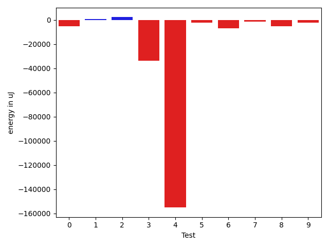
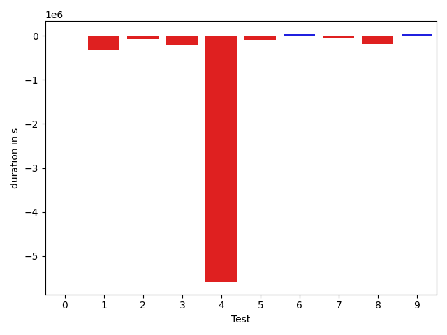

# gson bcd52a

https://github.com/google/gson.git/commit/bcd52a

## Delta Energy per test method

| ID | EnergyV1 | EnergyV2 | DeltaEnergy |
| --- | --- | --- | --- |
| 0 | 39115.10674225334 | 33934.89390612291 | -5180.212836130428 |
| 1 | 36731.33847289397 | 37325.61452862897 | 594.2760557349975 |
| 2 | 36246.928062784464 | 38546.27337713139 | 2299.3453143469233 |
| 3 | 173254.29119965536 | 139394.34938788848 | -33859.94181176688 |
| 4 | 479001.8127548662 | 323954.4954957303 | -155047.3172591359 |
| 5 | 38082.95616085084 | 35941.9805592763 | -2140.975601574537 |
| 6 | 39669.19241443093 | 32864.877313006975 | -6804.315101423956 |
| 7 | 38129.26305890817 | 36602.040628639705 | -1527.2224302684626 |
| 8 | 42367.76334808186 | 37266.26340424133 | -5101.499943840536 |
| 9 | 40407.00220299963 | 38233.61774623258 | -2173.384456767053 |

## Delta Duration per test method

| ID | DurationV1 | DurationsV2 | DeltaDuration |
| --- | --- | --- | --- |
| 0 | 937390.6354334429 | 937597.1663932813 | 206.53095983841922 |
| 1 | 1479500.71051419 | 1152703.9787248927 | -326796.7317892972 |
| 2 | 959426.6988847984 | 883950.4124648519 | -75476.28641994658 |
| 3 | 5120021.112118882 | 4908503.768785436 | -211517.34333344642 |
| 4 | 15225601.463931624 | 9633415.740302267 | -5592185.723629357 |
| 5 | 1042455.4102677638 | 958674.8731942305 | -83780.53707353328 |
| 6 | 1573034.407013886 | 1627477.5075828722 | 54443.100568986265 |
| 7 | 937756.8998071521 | 881239.904532303 | -56516.99527484912 |
| 8 | 1158424.1041090132 | 979594.7465903427 | -178829.3575186705 |
| 9 | 872041.8748972857 | 902538.1979405299 | 30496.323043244192 |

## Misc.

| ID | Test Class | Test Method |
| --- | --- | --- |
| 0 | com.google.gson.functional.DefaultTypeAdaptersTest | testDateSerializationWithPatternNotOverridenByTypeAdapter |
| 1 | com.google.gson.functional.DefaultTypeAdaptersTest | testDateSerializationWithPattern |
| 2 | com.google.gson.functional.DefaultTypeAdaptersTest | testSqlDateSerialization |
| 3 | com.google.gson.functional.DefaultTypeAdaptersTest | testDefaultDateDeserializationUsingBuilder |
| 4 | com.google.gson.functional.DefaultTypeAdaptersTest | testNullSerialization |
| 5 | com.google.gson.functional.DefaultTypeAdaptersTest | testDateDeserializationWithPattern |
| 6 | com.google.gson.functional.DefaultTypeAdaptersTest | testDateSerializationInCollection |
| 7 | com.google.gson.functional.DefaultTypeAdaptersTest | testTimestampSerialization |
| 8 | com.google.gson.DefaultDateTypeAdapterTest | testDateSerialization |
| 9 | com.google.gson.DefaultDateTypeAdapterTest | testDatePattern |

| Test | IterationV1 | IterationV2 | DeltaIteration |
| --- | --- | --- | --- |
| 0 | 70 | 59 | -11 |
| 1 | 83 | 77 | -6 |
| 2 | 56 | 57 | 1 |
| 3 | 99 | 99 | 0 |
| 4 | 99 | 99 | 0 |
| 5 | 71 | 58 | -13 |
| 6 | 99 | 99 | 0 |
| 7 | 60 | 55 | -5 |
| 8 | 71 | 67 | -4 |
| 9 | 63 | 54 | -9 |

| Time Label | Time (s) |
| --- | --- |
| Selection | 31.259600162506104 |
| Injection | 13.588076114654541 |
| Total | 1243.727526664734 |

## Aggregation per test class

| Index | EnergyV1 | EnergyV2 | DeltaEnergy |
| --- | --- | --- | --- |
| 0 | 880230.8888666432 | 678564.5251964252 | -201666.36367021804 |
| 1 | 82774.7655510815 | 75499.8811504739 | -7274.884400607596 |

| Index | DurationV1 | DurationsV2 | DeltaDuration |
| --- | --- | --- | --- |
| 0 | 27275187.337971736 | 20983563.351980135 | -6291623.985991601 |
| 1 | 2030465.9790062988 | 1882132.9445308726 | -148333.0344754262 |
| Index | TestClassName | #Tests |
| --- | --- | --- |
| 0 | com.google.gson.functional.DefaultTypeAdaptersTest | 8 |
| 1 | com.google.gson.DefaultDateTypeAdapterTest | 2 |
