# gson 47cc34

https://github.com/google/gson.git/commit/47cc34

## Delta Energy per test method

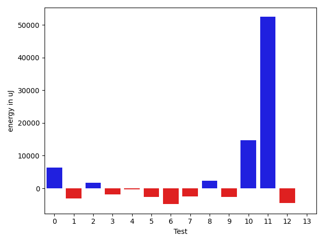

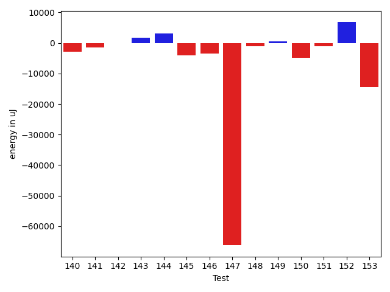

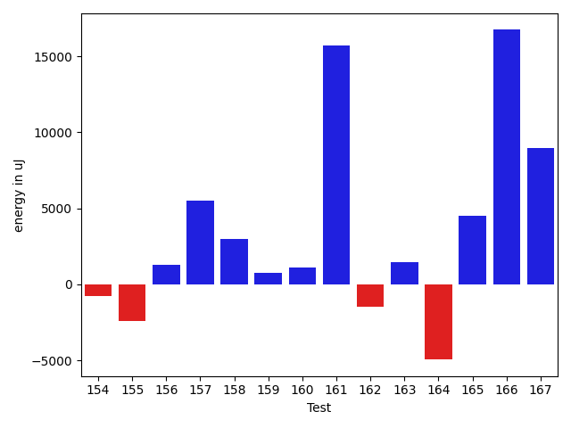

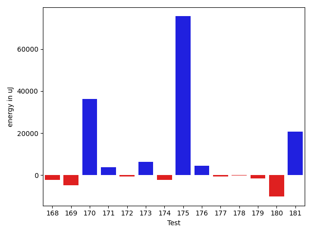

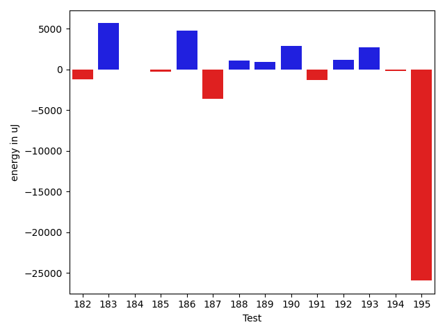

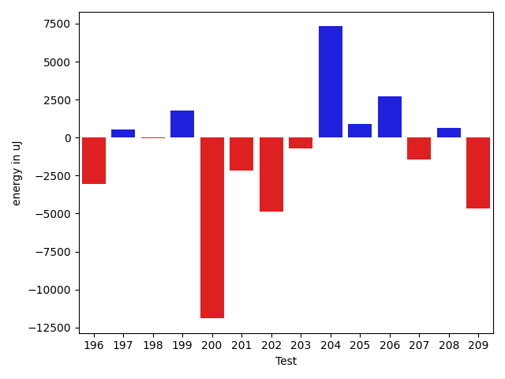

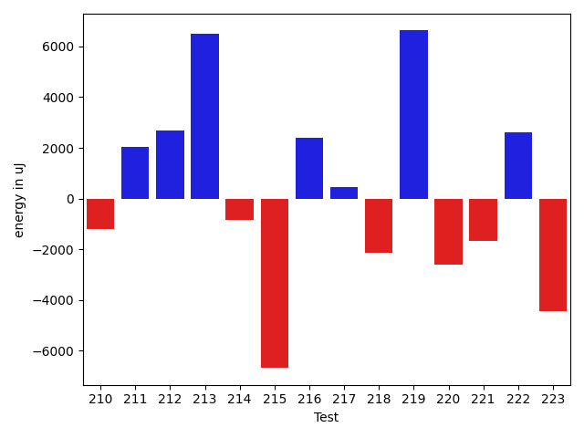

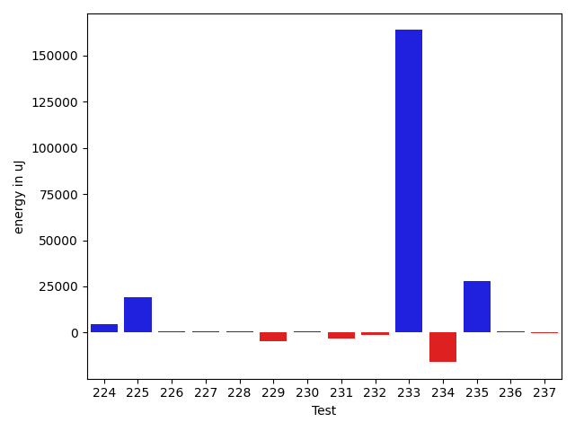

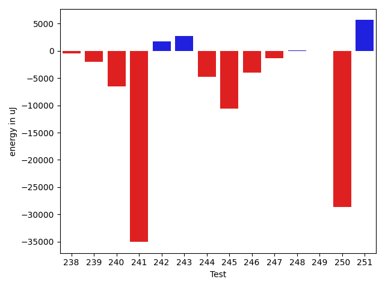

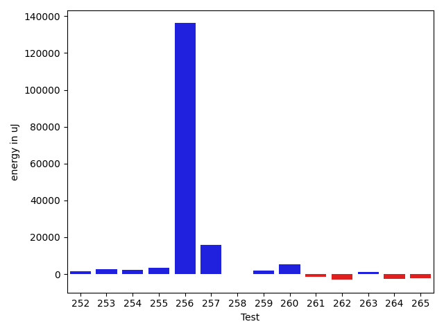

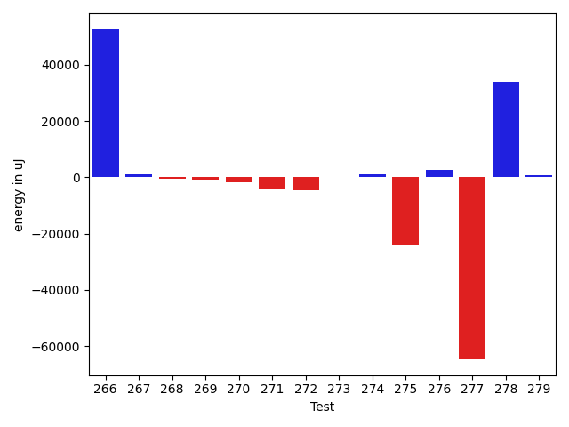

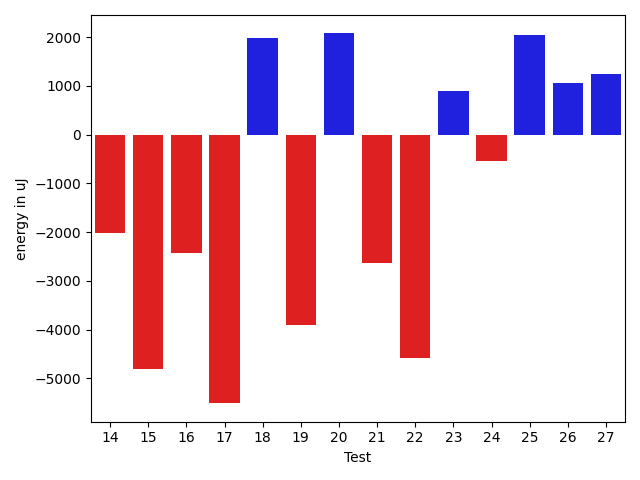

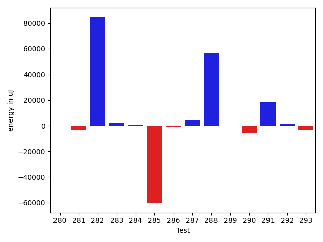

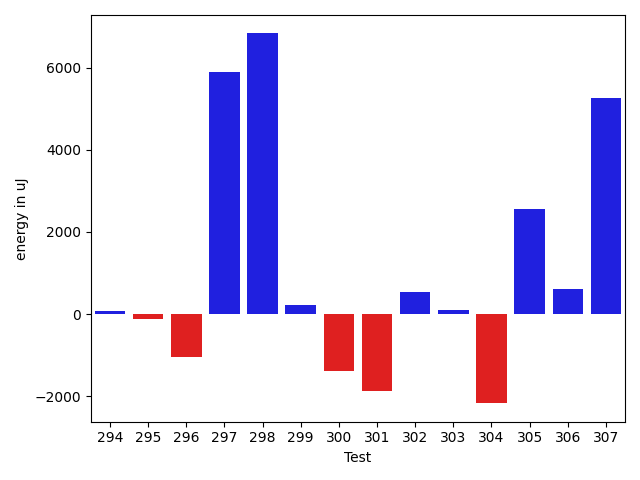

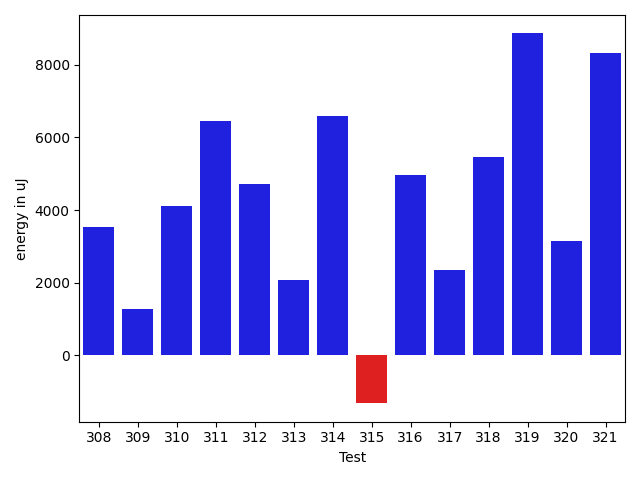

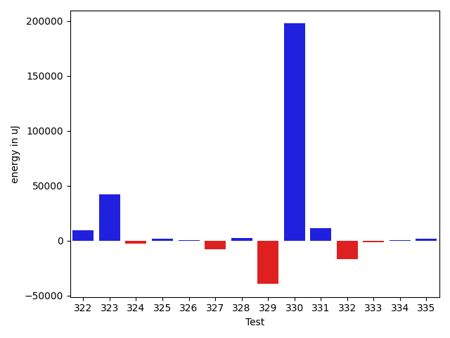

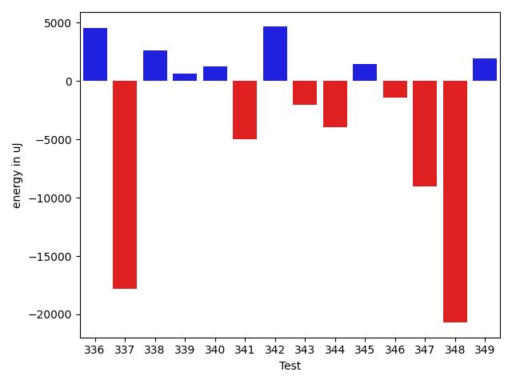

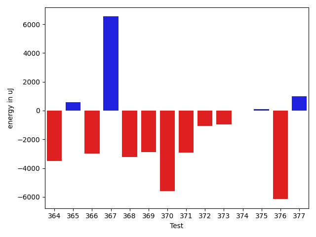

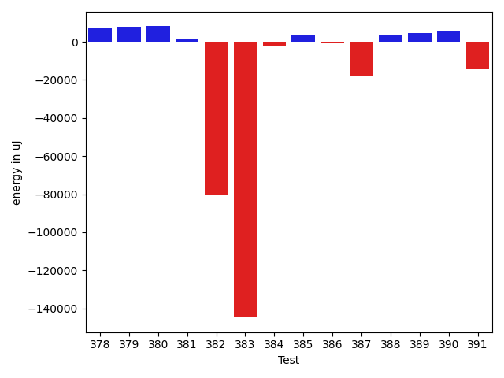

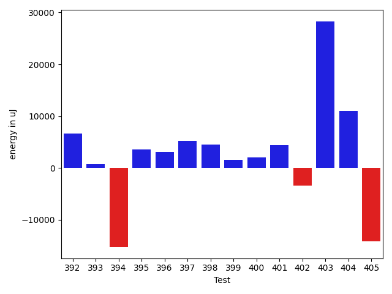

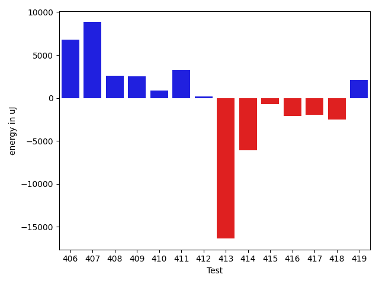

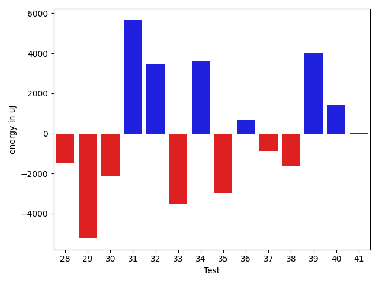

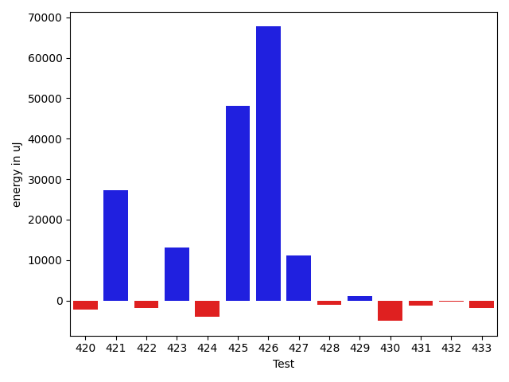

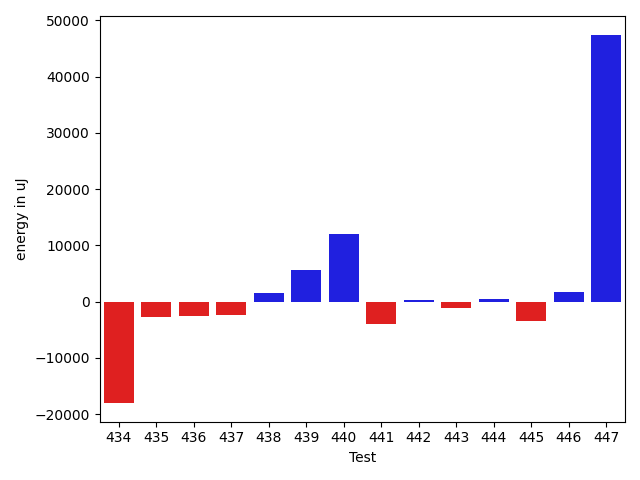

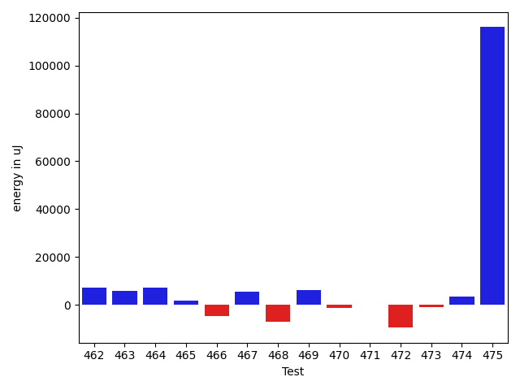

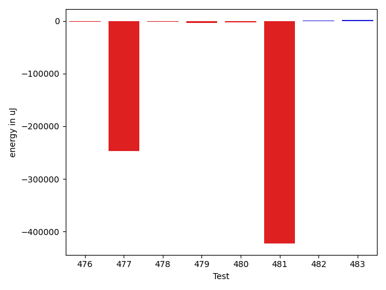

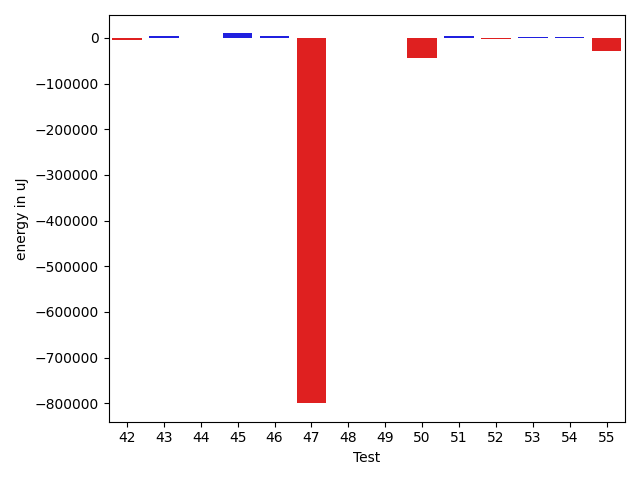

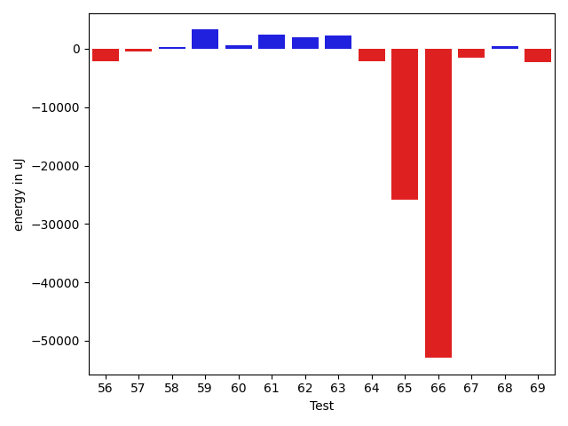

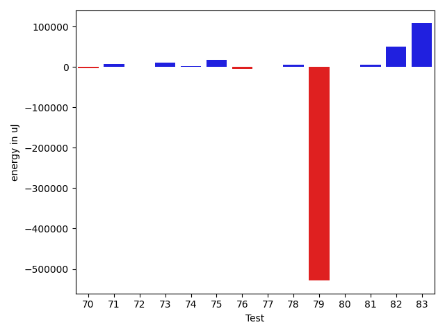

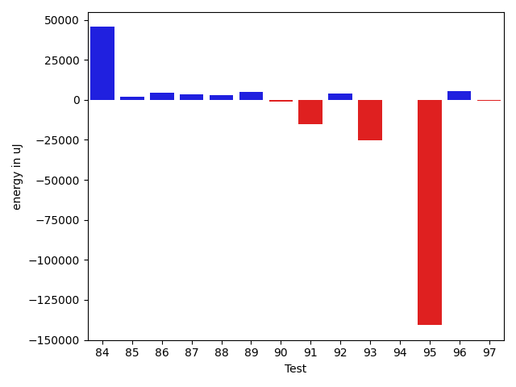

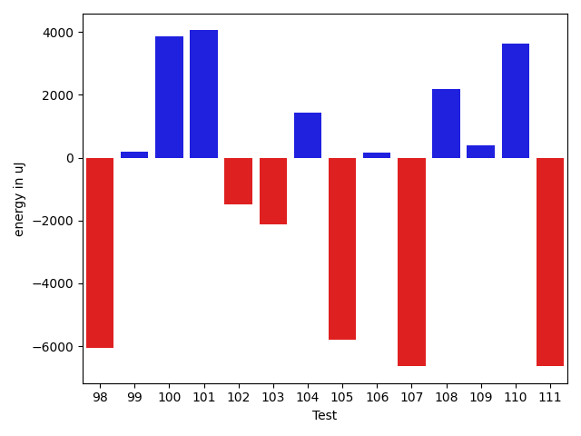

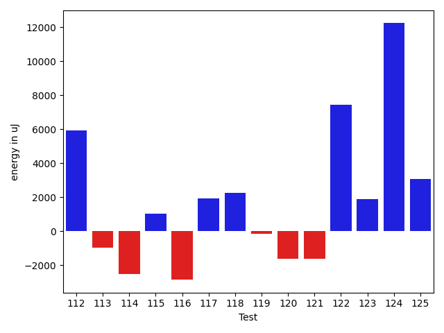

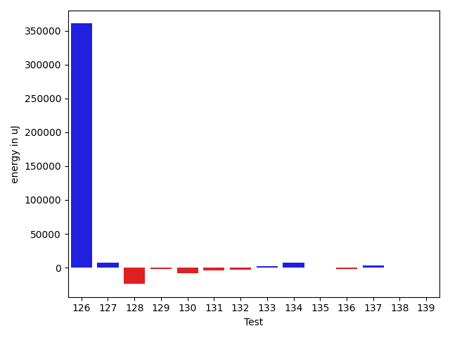

| ID | EnergyV1 | EnergyV2 | DeltaEnergy |
| --- | --- | --- | --- |
| 0 | 31545.753036499023 | 37910.08372402191 | 6364.330687522888 |
| 1 | 38569.594452570345 | 35417.18980197779 | -3152.404650592558 |
| 2 | 38143.208322237435 | 39790.40910945132 | 1647.2007872138856 |
| 3 | 39032.616166113025 | 37149.76194799069 | -1882.854218122331 |
| 4 | 39495.36545407772 | 39222.327407836914 | -273.0380462408066 |
| 5 | 38448.53192963091 | 35799.394396215605 | -2649.1375334153054 |
| 6 | 41702.09442518738 | 36863.44689934669 | -4838.647525840694 |
| 7 | 36818.96035785368 | 34299.055172163324 | -2519.9051856903534 |
| 8 | 36299.88357434546 | 38594.257699066395 | 2294.3741247209327 |
| 9 | 36299.90020751953 | 33660.98083496094 | -2638.9193725585938 |
| 10 | 37339.04260801122 | 52108.05691858659 | 14769.014310575367 |
| 11 | 36060.875196918 | 88529.0667719841 | 52468.1915750661 |
| 12 | 39934.86620028387 | 35466.62091930257 | -4468.245280981297 |
| 13 | 34708.99307556776 | 34753.71682477463 | 44.72374920686707 |
| 14 | 37013.48867366952 | 35007.099696475736 | -2006.388977193783 |
| 15 | 42472.75117683411 | 37663.82177734375 | -4808.929399490356 |
| 16 | 40654.909570875956 | 38219.63866366082 | -2435.270907215134 |
| 17 | 40091.28641675665 | 34582.79036270665 | -5508.496054050003 |
| 18 | 36336.2967117317 | 38310.87604207173 | 1974.5793303400278 |
| 19 | 35906.05635194108 | 31998.33874256909 | -3907.71760937199 |
| 20 | 38601.11254572868 | 40676.8924789587 | 2075.77993323002 |
| 21 | 39492.7783203125 | 36864.31121826172 | -2628.4671020507812 |
| 22 | 40451.27460245788 | 35869.60935330391 | -4581.665249153972 |
| 23 | 39581.09538362038 | 40475.385656751234 | 894.2902731308568 |
| 24 | 37691.356266542396 | 37144.34579919123 | -547.0104673511669 |
| 25 | 36797.65727589745 | 38838.59165940274 | 2040.934383505286 |
| 26 | 37166.24700615817 | 38223.94955807272 | 1057.7025519145536 |
| 27 | 39102.14917862415 | 40351.29489135742 | 1249.1457127332687 |
| 28 | 39030.18001174927 | 37531.079374313354 | -1499.100637435913 |
| 29 | 39194.3172454834 | 33945.9735429585 | -5248.3437025249 |
| 30 | 38834.00597434299 | 36730.94401552295 | -2103.061958820035 |
| 31 | 37337.692691314965 | 43010.56744484301 | 5672.874753528042 |
| 32 | 36898.2086879015 | 40326.46923160553 | 3428.260543704033 |
| 33 | 41573.14030456543 | 38070.349174290895 | -3502.791130274534 |
| 34 | 35530.08016465604 | 39151.85903930664 | 3621.7788746505976 |
| 35 | 38369.30845018383 | 35388.31494140625 | -2980.993508777581 |
| 36 | 35642.4332382679 | 36346.31881095469 | 703.8855726867914 |
| 37 | 37615.24836704135 | 36705.4167178832 | -909.83164915815 |
| 38 | 38365.58540533483 | 36748.561244249344 | -1617.0241610854864 |
| 39 | 39199.95865158317 | 43225.54492425217 | 4025.586272669003 |
| 40 | 39665.462640822865 | 41071.52724957466 | 1406.0646087517962 |
| 41 | 40018.77272505724 | 40063.42093955604 | 44.64821449879673 |
| 42 | 46164.99543238712 | 42195.76616563978 | -3969.2292667473375 |
| 43 | 39842.53843164741 | 43101.055066630244 | 3258.516634982836 |
| 44 | 41450.27524032403 | 40768.29345334122 | -681.9817869828112 |
| 45 | 32536.080045700073 | 42234.330210886896 | 9698.250165186822 |
| 46 | 41278.43443002041 | 44463.06379321437 | 3184.6293631939625 |
| 47 | 867588.5231705061 | 67774.81712040017 | -799813.706050106 |
| 48 | 37347.450701961745 | 37608.456955831934 | 261.00625387018954 |
| 49 | 37480.89587307259 | 37534.678365814325 | 53.7824927417314 |
| 50 | 80032.94108797578 | 35729.14763210081 | -44303.79345587497 |
| 51 | 36558.079998597175 | 39729.171606229924 | 3171.0916076327485 |
| 52 | 39149.95193520478 | 35711.06427693367 | -3438.887658271109 |
| 53 | 35334.16374019603 | 36746.38957781617 | 1412.2258376201353 |
| 54 | 40711.57802919626 | 41834.37127707318 | 1122.7932478769217 |
| 55 | 71856.70177591064 | 42677.944992070756 | -29178.756783839883 |
| 56 | 39586.45002733287 | 37424.16833680265 | -2162.281690530217 |
| 57 | 39775.36151564003 | 39239.854613359974 | -535.5069022800526 |
| 58 | 37918.00099519354 | 38175.83477798471 | 257.8337827911673 |
| 59 | 35600.292270485756 | 38859.100650892346 | 3258.80838040659 |
| 60 | 38314.24405955216 | 38876.59982254566 | 562.3557629934949 |
| 61 | 38797.36359214783 | 41173.41516224481 | 2376.0515700969845 |
| 62 | 39049.32483089343 | 40969.84232933392 | 1920.5174984404948 |
| 63 | 37203.616707923924 | 39427.048255220376 | 2223.4315472964518 |
| 64 | 37151.96019554138 | 35001.00830590725 | -2150.9518896341324 |
| 65 | 68725.53449014963 | 42885.91609956054 | -25839.618390589087 |
| 66 | 114388.82958760002 | 61463.22909498551 | -52925.60049261451 |
| 67 | 39507.57012939453 | 38024.93034493923 | -1482.6397844552994 |
| 68 | 37203.48376464844 | 37579.32421875 | 375.8404541015625 |
| 69 | 39356.3750371933 | 37047.50781033933 | -2308.8672268539667 |
| 70 | 38785.52261888981 | 35911.38540458679 | -2874.1372143030167 |
| 71 | 32173.598516225815 | 40127.23798274994 | 7953.639466524124 |
| 72 | 35413.62890480459 | 35234.02931880951 | -179.5995859950781 |
| 73 | 31463.795479297638 | 41773.2673034668 | 10309.471824169159 |
| 74 | 40798.033601523144 | 42150.194679603985 | 1352.1610780808405 |
| 75 | 43649.46408640146 | 60825.903720621354 | 17176.439634219896 |
| 76 | 46778.53926303133 | 42174.57992379367 | -4603.9593392376555 |
| 77 | 36404.06377106864 | 37648.34377431051 | 1244.2800032418672 |
| 78 | 32167.136306762695 | 37575.14510560036 | 5408.008798837662 |
| 79 | 570562.8721075458 | 41743.21583095449 | -528819.6562765914 |
| 80 | 38887.29553222656 | 38617.9958114624 | -269.29972076416016 |
| 81 | 38085.71563720703 | 43792.89535140991 | 5707.179714202881 |
| 82 | 39628.861339403054 | 89180.35451541087 | 49551.49317600782 |
| 83 | 38330.68357982215 | 146427.40872224577 | 108096.72514242362 |
| 84 | 39731.02942075029 | 85210.43942733557 | 45479.41000658528 |
| 85 | 38361.948261181875 | 40050.32702310993 | 1688.3787619280556 |
| 86 | 43900.118637449435 | 48088.88574964232 | 4188.767112192887 |
| 87 | 35910.247958260756 | 39206.21907358057 | 3295.971115319815 |
| 88 | 34446.11764884127 | 37410.0079015142 | 2963.890252672929 |
| 89 | 36935.41678352773 | 41697.24722803119 | 4761.830444503459 |
| 90 | 38408.59768502157 | 37077.07879432612 | -1331.51889069545 |
| 91 | 52476.07028858989 | 37157.45621355038 | -15318.614075039513 |
| 92 | 34498.49321639538 | 38554.3199630389 | 4055.826746643521 |
| 93 | 200361.27373778418 | 174893.79396130922 | -25467.479776474967 |
| 94 | 37578.58083152771 | 37564.28126525879 | -14.299566268920898 |
| 95 | 271889.9037159607 | 131152.14437235316 | -140737.75934360753 |
| 96 | 33391.89597795089 | 38696.653548100265 | 5304.757570149377 |
| 97 | 40804.18311644747 | 40059.688511467226 | -744.4946049802456 |
| 98 | 40115.29405183219 | 34066.634471702186 | -6048.659580130006 |
| 99 | 40902.877685546875 | 41092.47633886337 | 189.5986533164978 |
| 100 | 36159.748929181485 | 40032.66916398218 | 3872.9202348006947 |
| 101 | 36989.21151820258 | 41036.09369607157 | 4046.882177868989 |
| 102 | 41810.47336647392 | 40319.49871344054 | -1490.9746530333796 |
| 103 | 37692.86877441406 | 35564.500900268555 | -2128.367874145508 |
| 104 | 36249.733938188845 | 37681.665218089045 | 1431.9312799002 |
| 105 | 38563.049615303054 | 32757.732366383076 | -5805.317248919979 |
| 106 | 37962.4052208662 | 38111.04143178661 | 148.63621092040557 |
| 107 | 44859.87646174431 | 38221.48739516735 | -6638.389066576958 |
| 108 | 34012.31897554174 | 36190.57438206673 | 2178.255406524986 |
| 109 | 36890.208153009415 | 37274.73873901367 | 384.5305860042572 |
| 110 | 34733.34619140625 | 38350.744384765625 | 3617.398193359375 |
| 111 | 38718.7395106554 | 32088.210173051804 | -6630.529337603599 |
| 112 | 33504.244189874706 | 39458.93122252408 | 5954.687032649374 |
| 113 | 35804.51257610321 | 34841.7323141098 | -962.7802619934082 |
| 114 | 38583.42310619354 | 36057.309589385986 | -2526.113516807556 |
| 115 | 38287.597396850586 | 39324.2470703125 | 1036.649673461914 |
| 116 | 36456.22937011719 | 33605.02351951599 | -2851.2058506011963 |
| 117 | 36353.85273690522 | 38287.874531939626 | 1934.0217950344086 |
| 118 | 37554.93329272445 | 39809.79894615189 | 2254.8656534274414 |
| 119 | 37357.944196105 | 37211.4743397627 | -146.46985634230077 |
| 120 | 39553.65964609105 | 37938.96368498089 | -1614.695961110163 |
| 121 | 36048.528335342126 | 34442.902263027616 | -1605.6260723145097 |
| 122 | 39566.64669807255 | 47019.51618915796 | 7452.86949108541 |
| 123 | 40662.83733921643 | 42548.08083830723 | 1885.2434990908005 |
| 124 | 45346.14589091111 | 57588.28012071771 | 12242.134229806601 |
| 125 | 38626.816467285156 | 41688.17059516907 | 3061.354127883911 |
| 126 | 38319.32069027424 | 398854.84672734357 | 360535.5260370693 |
| 127 | 33123.27104949951 | 40780.894958496094 | 7657.623908996582 |
| 128 | 84639.04540166457 | 60597.03980990534 | -24042.005591759225 |
| 129 | 42515.46373875276 | 40965.3918152626 | -1550.0719234901626 |
| 130 | 48418.36998044695 | 40344.24176882185 | -8074.128211625102 |
| 131 | 39374.889692555815 | 34962.73087684808 | -4412.158815707735 |
| 132 | 41255.48331605183 | 38671.49655590071 | -2583.9867601511214 |
| 133 | 37763.39043902606 | 39486.17301854119 | 1722.7825795151293 |
| 134 | 37150.40377854556 | 44240.45352314552 | 7090.0497445999645 |
| 135 | 37998.03527492285 | 38235.57063885266 | 237.53536392981187 |
| 136 | 40470.68173559487 | 38162.991022105605 | -2307.690713489268 |
| 137 | 37295.35758634913 | 40177.24107428234 | 2881.8834879332135 |
| 138 | 38533.68243964141 | 38336.309574362545 | -197.37286527886317 |
| 139 | 37548.99172576522 | 37560.75259544065 | 11.760869675432332 |
| 140 | 40297.40881597407 | 37396.71191971742 | -2900.6968962566534 |
| 141 | 41381.661154903275 | 39833.79490624571 | -1547.8662486575631 |
| 142 | 37520.364765258244 | 37416.14894621465 | -104.21581904359482 |
| 143 | 40137.975495152175 | 41832.68030287651 | 1694.704807724338 |
| 144 | 38867.11631569095 | 42074.96229110792 | 3207.845975416967 |
| 145 | 39800.7596013546 | 35674.82258558273 | -4125.937015771866 |
| 146 | 38887.06888514757 | 35365.4360332489 | -3521.63285189867 |
| 147 | 112456.33529186249 | 46181.176612615585 | -66275.1586792469 |
| 148 | 39920.1196975708 | 38762.50064972043 | -1157.6190478503704 |
| 149 | 37758.28028688276 | 38243.66352862757 | 485.38324174481386 |
| 150 | 39445.13395994748 | 34645.707616925865 | -4799.426343021616 |
| 151 | 39876.59052293863 | 38855.381517118025 | -1021.2090058206086 |
| 152 | 36122.518135526996 | 43026.21848881218 | 6903.700353285181 |
| 153 | 76195.9277460515 | 61822.04968557545 | -14373.878060476047 |
| 154 | 38641.719465981696 | 37872.60862853921 | -769.1108374424875 |
| 155 | 67920.26325976703 | 65495.373967974825 | -2424.8892917922058 |
| 156 | 37206.44320430327 | 38470.70924370746 | 1264.2660394041886 |
| 157 | 37280.28008464906 | 42784.117089956526 | 5503.837005307469 |
| 158 | 69188.92483097158 | 72149.90285582628 | 2960.978024854703 |
| 159 | 37228.246428298684 | 37997.147212884855 | 768.9007845861706 |
| 160 | 38782.51566252671 | 39895.6015137583 | 1113.08585123159 |
| 161 | 39226.833463054325 | 54959.74577537294 | 15732.912312318615 |
| 162 | 37176.43632217986 | 35700.4131761513 | -1476.023146028565 |
| 163 | 40135.802689829135 | 41605.86614757967 | 1470.0634577505334 |
| 164 | 41135.40921472317 | 36182.53899662805 | -4952.870218095122 |
| 165 | 36879.70992072219 | 41393.29446793541 | 4513.5845472132205 |
| 166 | 190595.13431590667 | 207331.1667031878 | 16736.032387281128 |
| 167 | 151321.30439167927 | 160275.4923670179 | 8954.187975338631 |
| 168 | 38933.97259140015 | 36650.930258750916 | -2283.042332649231 |
| 169 | 42167.79793472588 | 37466.33066838491 | -4701.467266340973 |
| 170 | 181974.31477077812 | 218205.64840222083 | 36231.333631442714 |
| 171 | 39359.34919257718 | 43266.17415825825 | 3906.824965681066 |
| 172 | 37015.95508530709 | 36429.15057508684 | -586.8045102202523 |
| 173 | 33990.06378173828 | 40340.09161376953 | 6350.02783203125 |
| 174 | 39279.43222488773 | 37168.073004980404 | -2111.3592199073246 |
| 175 | 39531.62580504404 | 115065.0046449126 | 75533.37883986856 |
| 176 | 34220.236503601074 | 38628.63208055496 | 4408.395576953888 |
| 177 | 36668.46532047148 | 36161.487333862824 | -506.97798660865374 |
| 178 | 39864.791595458984 | 39611.00094002485 | -253.79065543413162 |
| 179 | 37212.51546087861 | 35621.21082693711 | -1591.3046339415014 |
| 180 | 46000.79170274478 | 35842.54930414541 | -10158.242398599366 |
| 181 | 36482.17762872864 | 57280.65130017031 | 20798.473671441672 |
| 182 | 40583.18172959477 | 39323.063357148916 | -1260.1183724458533 |
| 183 | 38473.925571495034 | 44117.900563997086 | 5643.9749925020515 |
| 184 | 37314.69358446184 | 37309.59458776299 | -5.098996698849078 |
| 185 | 37663.06479339928 | 37398.357222562176 | -264.70757083710487 |
| 186 | 33331.13222694397 | 38074.33508300781 | 4743.202856063843 |
| 187 | 39920.76558058077 | 36297.771879926644 | -3622.9937006541295 |
| 188 | 36051.90814260829 | 37090.16184601743 | 1038.2537034091365 |
| 189 | 36429.88743515302 | 37361.0529337121 | 931.1654985590794 |
| 190 | 32820.612899923406 | 35657.1356608974 | 2836.522760973996 |
| 191 | 128719.40497923477 | 127381.50604147979 | -1337.8989377549733 |
| 192 | 37419.79086934316 | 38620.62565917402 | 1200.8347898308566 |
| 193 | 35077.6034848014 | 37804.973880818805 | 2727.3703960174025 |
| 194 | 38974.92554207487 | 38774.92507257225 | -200.00046950261458 |
| 195 | 73116.79071823428 | 47180.2063581676 | -25936.584360066678 |
| 196 | 42614.54517418519 | 39584.25018885732 | -3030.2949853278697 |
| 197 | 39438.676538819505 | 39981.01931885226 | 542.3427800327554 |
| 198 | 38179.31046763148 | 38121.211601576666 | -58.098866054817336 |
| 199 | 37948.04696651074 | 39703.0677680314 | 1755.020801520659 |
| 200 | 131255.25059995777 | 119350.08240535685 | -11905.16819460092 |
| 201 | 40064.08649576066 | 37898.13308033954 | -2165.9534154211215 |
| 202 | 38194.69073545933 | 33301.074771270156 | -4893.615964189172 |
| 203 | 39358.16813681514 | 38657.084116036756 | -701.084020778384 |
| 204 | 34081.75533528256 | 41399.97167007392 | 7318.216334791359 |
| 205 | 38046.000903205975 | 38919.51548021828 | 873.5145770123054 |
| 206 | 36219.893033407294 | 38937.47615218951 | 2717.5831187822187 |
| 207 | 35742.915354856625 | 34286.32936518118 | -1456.5859896754482 |
| 208 | 35026.240234375 | 35680.99642944336 | 654.7561950683594 |
| 209 | 40142.64791716005 | 35500.58746759604 | -4642.060449564015 |
| 210 | 36698.31982164645 | 35487.62387226154 | -1210.6959493849135 |
| 211 | 34052.188189903274 | 36096.95102296211 | 2044.762833058834 |
| 212 | 34802.832789628126 | 37490.70622346723 | 2687.8734338391005 |
| 213 | 34252.96942997014 | 40764.857652166815 | 6511.888222196678 |
| 214 | 36699.88480961279 | 35872.43007083544 | -827.4547387773491 |
| 215 | 63956.165285522846 | 57279.0196568334 | -6677.145628689446 |
| 216 | 32814.54068815091 | 35200.99380203671 | 2386.4531138858 |
| 217 | 34023.54389526021 | 34490.86514799681 | 467.32125273659767 |
| 218 | 37884.07712121887 | 35763.91662573861 | -2120.1604954802606 |
| 219 | 31704.743320810947 | 38328.49889577255 | 6623.755574961604 |
| 220 | 40187.717284094135 | 37592.80756165722 | -2594.909722436918 |
| 221 | 38586.3740234375 | 36916.8916015625 | -1669.482421875 |
| 222 | 34267.793572235074 | 36880.15676752673 | 2612.363195291655 |
| 223 | 42367.60357249483 | 37926.63200778184 | -4440.971564712992 |
| 224 | 33839.68099975586 | 38562.144859313965 | 4722.4638595581055 |
| 225 | 36869.58699404319 | 56024.96428729303 | 19155.37729324984 |
| 226 | 38460.983924589746 | 39120.35518893331 | 659.3712643435647 |
| 227 | 37103.14851096723 | 37672.15156450702 | 569.0030535397891 |
| 228 | 38772.91983681735 | 39524.137553572655 | 751.2177167553018 |
| 229 | 39013.09498171401 | 34247.20180325892 | -4765.893178455095 |
| 230 | 40006.17606045306 | 40858.25682014227 | 852.0807596892118 |
| 231 | 42826.4306640625 | 39518.620388031006 | -3307.810276031494 |
| 232 | 39485.47930908203 | 38166.40283203125 | -1319.0764770507812 |
| 233 | 150998.13799319085 | 314840.95121796546 | 163842.8132247746 |
| 234 | 52059.76932681571 | 36076.50997077398 | -15983.25935604173 |
| 235 | 118486.09753830085 | 146432.01441441017 | 27945.916876109317 |
| 236 | 35327.308112752165 | 35784.26973406156 | 456.96162130939774 |
| 237 | 35740.009350105756 | 35459.714963166334 | -280.2943869394221 |
| 238 | 35187.83130470663 | 34687.88618373871 | -499.9451209679246 |
| 239 | 37561.568175197346 | 35515.05745430058 | -2046.5107208967675 |
| 240 | 39530.55551147461 | 33037.09922885895 | -6493.456282615662 |
| 241 | 110292.09740864788 | 75236.0815900374 | -35056.01581861048 |
| 242 | 39347.30698255109 | 41101.74958572135 | 1754.4426031702606 |
| 243 | 41113.84716780249 | 43855.86345021197 | 2742.0162824094805 |
| 244 | 38926.2633993774 | 34122.882277518685 | -4803.381121858714 |
| 245 | 51841.879631361764 | 41296.34389743928 | -10545.535733922487 |
| 246 | 46514.373742380616 | 42555.150213159155 | -3959.223529221461 |
| 247 | 39973.509421685536 | 38669.22981562468 | -1304.2796060608525 |
| 248 | 38406.94863128662 | 38542.58334541321 | 135.6347141265869 |
| 249 | 38756.0281457901 | 38751.35564804077 | -4.672497749328613 |
| 250 | 80628.83378276159 | 51996.10863424088 | -28632.72514852071 |
| 251 | 36230.20739912987 | 41876.28453063965 | 5646.077131509781 |
| 252 | 37744.54911804199 | 39375.44444274902 | 1630.8953247070312 |
| 253 | 38157.953125 | 40671.5703125 | 2513.6171875 |
| 254 | 40640.032384569175 | 43008.703425497646 | 2368.6710409284715 |
| 255 | 37982.36616714593 | 41343.21030262334 | 3360.8441354774113 |
| 256 | 38167.90022778511 | 174337.11743164062 | 136169.2172038555 |
| 257 | 128200.3735421228 | 144046.2308947725 | 15845.857352649706 |
| 258 | 40261.063247890794 | 40371.4768298626 | 110.4135819718067 |
| 259 | 39144.08083793372 | 40996.79876511409 | 1852.7179271803689 |
| 260 | 33861.7682334313 | 39014.82728496301 | 5153.059051531709 |
| 261 | 37889.734438987805 | 36518.65956993641 | -1371.0748690513938 |
| 262 | 40752.008077413186 | 37685.34938734803 | -3066.6586900651528 |
| 263 | 39427.54342554022 | 40554.7929181746 | 1127.2494926343788 |
| 264 | 38246.994925022125 | 35572.86463731527 | -2674.130287706852 |
| 265 | 38652.508959906496 | 36371.359845981264 | -2281.149113925232 |
| 266 | 41293.59750223393 | 93695.79283547481 | 52402.19533324088 |
| 267 | 81831.40040548674 | 82817.87675589291 | 986.4763504061702 |
| 268 | 37229.48403897883 | 36538.749009091094 | -690.7350298877354 |
| 269 | 39102.060820836814 | 38353.2110186075 | -748.8498022293134 |
| 270 | 37006.80766558647 | 35205.458897821605 | -1801.3487677648664 |
| 271 | 39339.96136378173 | 35004.79656177448 | -4335.1648020072535 |
| 272 | 41905.64026538715 | 37233.89535320189 | -4671.744912185255 |
| 273 | 57298.63916015625 | 57322.69095849991 | 24.051798343658447 |
| 274 | 41742.08752573606 | 42668.67342262599 | 926.5858968899265 |
| 275 | 64496.73958318394 | 40573.95376940703 | -23922.785813776907 |
| 276 | 37708.93522712216 | 40212.87409257889 | 2503.93886545673 |
| 277 | 109667.58904854159 | 45210.3291626606 | -64457.25988588099 |
| 278 | 39615.982494380994 | 73623.5266097943 | 34007.5441154133 |
| 279 | 40549.331724075615 | 41348.239108748734 | 798.9073846731189 |
| 280 | 42430.28728084266 | 42555.09122778475 | 124.80394694209099 |
| 281 | 42452.38084972026 | 39066.19785022065 | -3386.182999499615 |
| 282 | 66837.18187750067 | 151728.1885913545 | 84891.00671385383 |
| 283 | 38465.91744462645 | 40932.90087932721 | 2466.9834347007563 |
| 284 | 39007.93140258675 | 39664.45816675156 | 656.5267641648097 |
| 285 | 104943.26663136482 | 44452.556316792965 | -60490.71031457186 |
| 286 | 40250.60849388028 | 39719.678994365175 | -530.9294995151067 |
| 287 | 37243.19865962613 | 41358.71599086712 | 4115.51733124099 |
| 288 | 126864.82254384879 | 183409.21925780305 | 56544.396713954266 |
| 289 | 38540.794987447174 | 38596.638466849705 | 55.84347940253065 |
| 290 | 43574.02476032232 | 37637.95330674015 | -5936.071453582168 |
| 291 | 39356.95205688033 | 57956.88092186689 | 18599.928864986563 |
| 292 | 37200.05187330622 | 38598.70098620227 | 1398.6491128960479 |
| 293 | 40630.04126164317 | 37458.6432800293 | -3171.3979816138744 |
| 294 | 40510.52940603212 | 40590.664226107205 | 80.13482007508719 |
| 295 | 36964.40856933594 | 36850.95727920532 | -113.45129013061523 |
| 296 | 39645.982497829944 | 38600.93110764027 | -1045.0513901896775 |
| 297 | 45699.828422174134 | 51590.443343437975 | 5890.614921263841 |
| 298 | 35110.046386104135 | 41943.59913222291 | 6833.552746118774 |
| 299 | 35409.932441711426 | 35620.14080810547 | 210.20836639404297 |
| 300 | 42814.53327565773 | 41421.96663463439 | -1392.5666410233462 |
| 301 | 39572.15692024678 | 37701.55093571544 | -1870.605984531343 |
| 302 | 40069.11757522349 | 40604.21102819799 | 535.0934529744991 |
| 303 | 41402.01238141055 | 41509.311058637395 | 107.29867722684867 |
| 304 | 47152.70908369652 | 44981.0447597349 | -2171.664323961624 |
| 305 | 40224.801851934215 | 42793.32109037696 | 2568.519238442743 |
| 306 | 38980.565413344404 | 39588.45572374116 | 607.8903103967532 |
| 307 | 35524.8881907818 | 40787.72618723761 | 5262.837996455812 |
| 308 | 38880.261985734585 | 42405.75800941429 | 3525.496023679705 |
| 309 | 42734.367671583816 | 44007.138948047854 | 1272.7712764640382 |
| 310 | 37927.62237735935 | 42049.48010706855 | 4121.857729709198 |
| 311 | 35760.44945929955 | 42215.9798538561 | 6455.530394556554 |
| 312 | 37545.62127324486 | 42266.831236285616 | 4721.209963040754 |
| 313 | 39239.97727130927 | 41316.06259300293 | 2076.0853216936594 |
| 314 | 32837.7696383343 | 39429.975474263134 | 6592.205835928835 |
| 315 | 38168.55202951096 | 36853.88256645203 | -1314.6694630589336 |
| 316 | 36332.92989675359 | 41309.56826333015 | 4976.638366576561 |
| 317 | 35563.53228330561 | 37916.77670630673 | 2353.244423001117 |
| 318 | 35628.04868872167 | 41073.723047378524 | 5445.6743586568555 |
| 319 | 34422.38763682358 | 43278.499297312694 | 8856.111660489114 |
| 320 | 37487.5136725692 | 40644.6526620162 | 3157.1389894469976 |
| 321 | 32856.62130737305 | 41171.32399225235 | 8314.702684879303 |
| 322 | 42121.70132791895 | 51448.62169314615 | 9326.920365227204 |
| 323 | 44000.74190190009 | 86070.19450902514 | 42069.45260712505 |
| 324 | 39759.41480842788 | 37165.12838468028 | -2594.286423747595 |
| 325 | 36440.06665455706 | 38112.89720930581 | 1672.8305547487544 |
| 326 | 33512.40030816975 | 34201.15797738866 | 688.7576692189105 |
| 327 | 46008.35930802672 | 38197.78901260605 | -7810.5702954206645 |
| 328 | 37797.36623103462 | 40231.28453874738 | 2433.91830771276 |
| 329 | 83389.96832521033 | 43864.630473080855 | -39525.33785212947 |
| 330 | 45522.27298671853 | 243071.35932696267 | 197549.08634024413 |
| 331 | 39164.63510453701 | 50457.03161036968 | 11292.396505832672 |
| 332 | 55674.55032004928 | 38993.51452014968 | -16681.035799899604 |
| 333 | 37411.3589553833 | 35728.369300842285 | -1682.9896545410156 |
| 334 | 41226.35325217247 | 41355.358543395996 | 129.005291223526 |
| 335 | 38634.93092632294 | 40164.62219238281 | 1529.6912660598755 |
| 336 | 40908.0697555542 | 45414.61845779419 | 4506.54870223999 |
| 337 | 57338.13538960103 | 39518.73205387227 | -17819.403335728763 |
| 338 | 32772.915100097656 | 35395.6915435791 | 2622.7764434814453 |
| 339 | 37847.376861241246 | 38482.71694849315 | 635.3400872519051 |
| 340 | 38496.63214111328 | 39732.01171875 | 1235.3795776367188 |
| 341 | 39498.86328125 | 34532.64262390137 | -4966.220657348633 |
| 342 | 37673.073150634766 | 42314.515100479126 | 4641.44194984436 |
| 343 | 37276.17121887207 | 35224.292236328125 | -2051.8789825439453 |
| 344 | 40918.25901031494 | 36953.204921245575 | -3965.0540890693665 |
| 345 | 38907.121337890625 | 40384.00762939453 | 1476.8862915039062 |
| 346 | 38321.31068611145 | 36862.72103738785 | -1458.5896487236023 |
| 347 | 44852.0555267334 | 35799.69384765625 | -9052.361679077148 |
| 348 | 57959.70267200406 | 37254.99276075815 | -20704.70991124591 |
| 349 | 36506.264503479004 | 38429.03991699219 | 1922.7754135131836 |
| 350 | 54755.113500893116 | 46931.77072751522 | -7823.342773377895 |
| 351 | 36393.189392089844 | 36787.78125 | 394.59185791015625 |
| 352 | 38450.480224609375 | 35813.70590209961 | -2636.7743225097656 |
| 353 | 35888.5654296875 | 38931.44384765625 | 3042.87841796875 |
| 354 | 35640.1875 | 36739.04296875 | 1098.85546875 |
| 355 | 37491.215911865234 | 39568.56823730469 | 2077.352325439453 |
| 356 | 38162.855712890625 | 34326.46875 | -3836.386962890625 |
| 357 | 36829.852775886655 | 38379.44408869743 | 1549.5913128107786 |
| 358 | 39520.491943359375 | 35721.515625 | -3798.976318359375 |
| 359 | 39936.78974914551 | 40509.484375 | 572.6946258544922 |
| 360 | 41002.95956993103 | 38827.377811431885 | -2175.5817584991455 |
| 361 | 43726.57009918561 | 43089.487367489826 | -637.0827316957802 |
| 362 | 46285.84401369095 | 38173.72441673279 | -8112.11959695816 |
| 363 | 41065.58427917794 | 36843.49079999165 | -4222.0934791862965 |
| 364 | 41083.50518798828 | 37585.125 | -3498.3801879882812 |
| 365 | 39923.50192633562 | 40500.19349861145 | 576.6915722758276 |
| 366 | 39893.33140961045 | 36910.1976556529 | -2983.1337539575543 |
| 367 | 32711.898239135742 | 39246.14569091797 | 6534.247451782227 |
| 368 | 37654.70741581917 | 34447.325592041016 | -3207.3818237781525 |
| 369 | 38750.82981109619 | 35883.97161436081 | -2866.858196735382 |
| 370 | 38713.611328125 | 33126.24365234375 | -5587.36767578125 |
| 371 | 42342.72900390625 | 39426.55859375 | -2916.17041015625 |
| 372 | 38077.042724609375 | 37024.373764038086 | -1052.668960571289 |
| 373 | 39937.50912475586 | 38965.492248535156 | -972.0168762207031 |
| 374 | 39479.75537109375 | 39479.263122558594 | -0.49224853515625 |
| 375 | 39641.9912109375 | 39727.833557128906 | 85.84234619140625 |
| 376 | 43448.49187174337 | 37300.84791581676 | -6147.643955926607 |
| 377 | 35745.39982127615 | 36738.70423955795 | 993.3044182817976 |
| 378 | 33286.974466082895 | 40520.0381218749 | 7233.063655792008 |
| 379 | 32945.267390295376 | 40979.753074206834 | 8034.485683911458 |
| 380 | 47484.24477337663 | 55590.78001426223 | 8106.535240885598 |
| 381 | 34659.580864171076 | 35906.51153631881 | 1246.9306721477333 |
| 382 | 114826.21240446309 | 34128.098277696816 | -80698.11412676628 |
| 383 | 185817.77935741816 | 41073.77109905998 | -144744.00825835817 |
| 384 | 43382.26652452267 | 40808.683589762164 | -2573.582934760503 |
| 385 | 35213.20814828442 | 38854.32109001982 | 3641.112941735395 |
| 386 | 34263.26591257334 | 33997.52468031704 | -265.7412322563032 |
| 387 | 56179.58140614 | 38153.99033760665 | -18025.59106853335 |
| 388 | 37652.28987974925 | 41427.179285761784 | 3774.8894060125313 |
| 389 | 38460.94674038913 | 43103.94984852376 | 4643.003108134624 |
| 390 | 36268.71704739619 | 41853.01774102574 | 5584.30069362955 |
| 391 | 50831.5338837928 | 36482.805559252476 | -14348.728324540323 |
| 392 | 32666.002501090054 | 39293.813480057586 | 6627.810978967533 |
| 393 | 38574.207503782265 | 39266.23621876823 | 692.028714985965 |
| 394 | 50891.52216632683 | 35624.737186136364 | -15266.784980190467 |
| 395 | 35371.02121074498 | 38961.067559719086 | 3590.0463489741087 |
| 396 | 37755.85464062804 | 40809.809090701754 | 3053.9544500737175 |
| 397 | 33491.851923803246 | 38722.60045952486 | 5230.748535721614 |
| 398 | 35521.086665555835 | 40050.793474634746 | 4529.706809078911 |
| 399 | 34425.4527063109 | 35961.73790398124 | 1536.2851976703387 |
| 400 | 33288.7590637207 | 35285.99686431885 | 1997.2378005981445 |
| 401 | 35208.96243967861 | 39596.89614284199 | 4387.933703163384 |
| 402 | 49673.56359649742 | 46321.85961538002 | -3351.7039811174036 |
| 403 | 40130.60935621213 | 68442.45846321317 | 28311.849107001042 |
| 404 | 40191.952141736954 | 51261.28547043992 | 11069.333328702967 |
| 405 | 51231.59713478084 | 37098.51183066664 | -14133.085304114196 |
| 406 | 35420.67163744941 | 42200.029932472855 | 6779.358295023441 |
| 407 | 37300.70887073675 | 46138.07950171159 | 8837.370630974838 |
| 408 | 37322.333591363014 | 39881.07676782357 | 2558.743176460557 |
| 409 | 37892.56391411079 | 40400.4715151572 | 2507.9076010464123 |
| 410 | 37943.42955446988 | 38787.65835757204 | 844.2288031021599 |
| 411 | 37265.352684497935 | 40562.9503268227 | 3297.597642324763 |
| 412 | 38311.23597954321 | 38519.53764638454 | 208.30166684132564 |
| 413 | 93580.98113554828 | 77182.67345777027 | -16398.307677778008 |
| 414 | 43059.2619689641 | 36956.57635931818 | -6102.685609645923 |
| 415 | 44881.828398722 | 44156.12704083932 | -725.7013578826809 |
| 416 | 41637.11555307317 | 39509.636279942904 | -2127.479273130266 |
| 417 | 39282.45879496161 | 37349.54377595933 | -1932.9150190022774 |
| 418 | 41155.5712792858 | 38642.766479565624 | -2512.8047997201793 |
| 419 | 40164.0412346909 | 42256.31298354369 | 2092.2717488527924 |
| 420 | 40222.53159688683 | 38048.36147062834 | -2174.17012625849 |
| 421 | 37966.0636690259 | 65166.92598479986 | 27200.862315773964 |
| 422 | 38536.99396747351 | 36662.0858669281 | -1874.9081005454063 |
| 423 | 111867.5542316371 | 124916.91660046692 | 13049.362368829825 |
| 424 | 38441.95390359298 | 34472.02176910198 | -3969.9321344909986 |
| 425 | 377734.34696201456 | 425875.6834587899 | 48141.33649677533 |
| 426 | 347617.83692164527 | 415300.2900674646 | 67682.45314581931 |
| 427 | 46105.499269240376 | 57177.59370747374 | 11072.094438233362 |
| 428 | 38170.51243015006 | 37161.68352562189 | -1008.8289045281708 |
| 429 | 37729.45352765727 | 38826.83647282603 | 1097.3829451687561 |
| 430 | 38173.22604942322 | 33121.69974914938 | -5051.526300273836 |
| 431 | 37034.316213522645 | 35752.89085897384 | -1281.4253545488027 |
| 432 | 38705.19744873117 | 38482.524374663066 | -222.6730740681014 |
| 433 | 38446.75792638399 | 36601.42942094803 | -1845.3285054359585 |
| 434 | 86219.83181779638 | 68145.47275687169 | -18074.35906092469 |
| 435 | 39959.62108421326 | 37183.74225139618 | -2775.8788328170776 |
| 436 | 38132.038656468474 | 35647.84524349084 | -2484.1934129776346 |
| 437 | 41868.961369626224 | 39519.62425987504 | -2349.3371097511845 |
| 438 | 35875.39049440622 | 37427.91951298714 | 1552.5290185809135 |
| 439 | 39225.57571882504 | 44780.443274181576 | 5554.867555356534 |
| 440 | 38449.840580733115 | 50453.426386165054 | 12003.58580543194 |
| 441 | 38870.06105041504 | 34903.311792850494 | -3966.7492575645447 |
| 442 | 39956.58932834864 | 40251.069858344854 | 294.48052999621723 |
| 443 | 40452.260903932154 | 39354.11342000961 | -1098.1474839225411 |
| 444 | 37856.34730902314 | 38342.87442159653 | 486.52711257338524 |
| 445 | 40375.50070964545 | 36950.8139353646 | -3424.6867742808536 |
| 446 | 40179.43483734131 | 41868.440185546875 | 1689.0053482055664 |
| 447 | 249727.44503197962 | 297205.24305670423 | 47477.798024724616 |
| 448 | 367361.58390143595 | 394093.7485879452 | 26732.164686509233 |
| 449 | 41371.9007601348 | 42687.34196476953 | 1315.441204634728 |
| 450 | 42039.55827899324 | 39162.60996321008 | -2876.9483157831564 |
| 451 | 40106.62354919865 | 41202.585411158434 | 1095.9618619597823 |
| 452 | 42425.33476781845 | 40386.901928241365 | -2038.4328395770863 |
| 453 | 38889.79750679433 | 38456.43920684513 | -433.3582999492064 |
| 454 | 40591.154703466666 | 53610.33475362399 | 13019.180050157323 |
| 455 | 36989.57746613026 | 37515.06416684389 | 525.4867007136345 |
| 456 | 36385.509087933286 | 40240.488479161984 | 3854.9793912286987 |
| 457 | 36840.99316589137 | 39239.33070573648 | 2398.33753984511 |
| 458 | 43640.012283482996 | 36073.34382077496 | -7566.668462708039 |
| 459 | 38276.70544459671 | 42867.75825500488 | 4591.052810408175 |
| 460 | 42898.284964137725 | 38231.142189234 | -4667.142774903725 |
| 461 | 46081.04859262257 | 53337.57139746391 | 7256.522804841341 |
| 462 | 36279.31776554801 | 43610.87043404579 | 7331.552668497781 |
| 463 | 35693.33121341663 | 41497.058352217195 | 5803.727138800561 |
| 464 | 35958.62481407076 | 43049.93521118164 | 7091.310397110879 |
| 465 | 40252.441749572754 | 41997.73492050171 | 1745.293170928955 |
| 466 | 41479.98462295532 | 36928.920555114746 | -4551.064067840576 |
| 467 | 35455.10575866699 | 40900.04768675566 | 5444.941928088665 |
| 468 | 43310.78815174103 | 36340.15437078476 | -6970.633780956268 |
| 469 | 37459.08447265625 | 43629.03885555267 | 6169.954382896423 |
| 470 | 37963.07363629618 | 36767.52174949821 | -1195.55188679797 |
| 471 | 39142.53880006907 | 39330.20499743929 | 187.66619737021392 |
| 472 | 74338.91754512998 | 64852.36286989731 | -9486.55467523267 |
| 473 | 38861.339220047 | 38074.841796875 | -786.4974231719971 |
| 474 | 37391.75174660276 | 40909.299439999595 | 3517.5476933968384 |
| 475 | 36960.21107538292 | 152947.23555469365 | 115987.02447931073 |
| 476 | 37713.18906545639 | 36264.85727310181 | -1448.3317923545837 |
| 477 | 383302.17947769165 | 136640.97892904282 | -246661.20054864883 |
| 478 | 38333.75442314148 | 37162.44456499815 | -1171.3098581433296 |
| 479 | 40376.29803389206 | 36026.04055462208 | -4350.257479269982 |
| 480 | 40628.66796875 | 37544.138671875 | -3084.529296875 |
| 481 | 466651.67964553833 | 43717.30529785156 | -422934.37434768677 |
| 482 | 38955.990904500846 | 40189.91837242592 | 1233.9274679250739 |
| 483 | 38352.70610332489 | 39644.98427963257 | 1292.2781763076782 |

## Delta Duration per test method

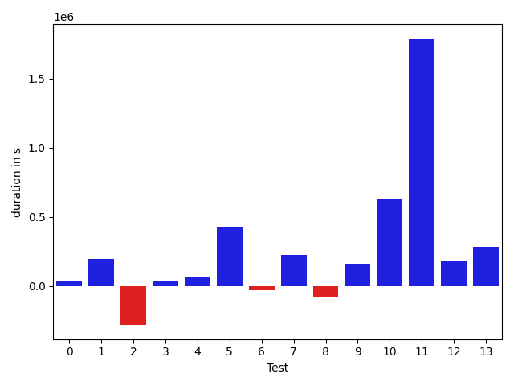

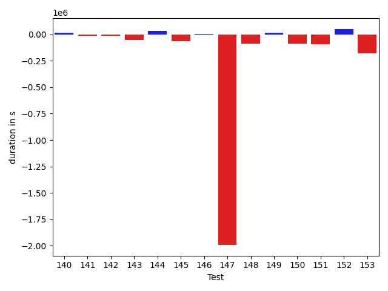

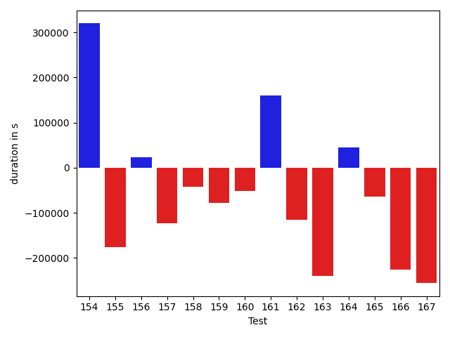

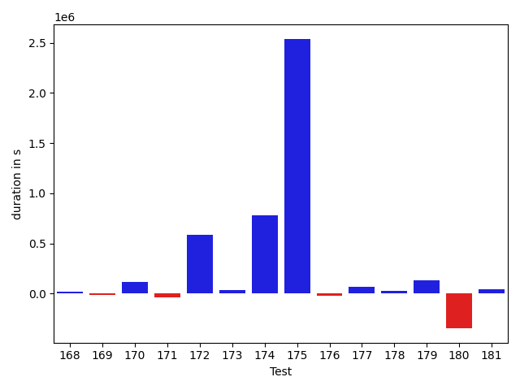

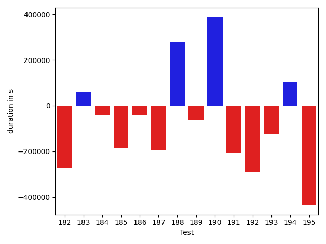

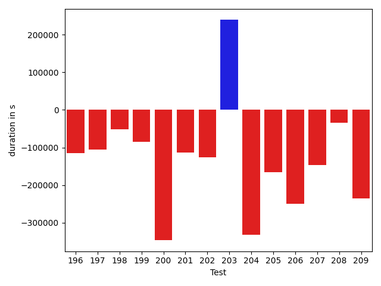

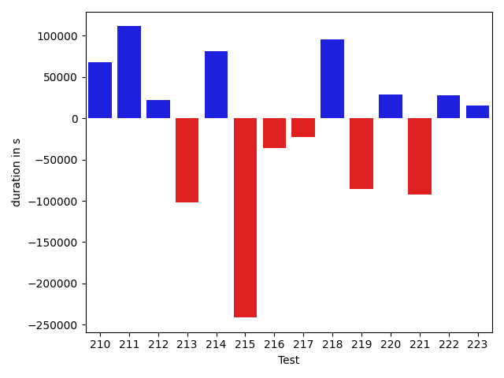

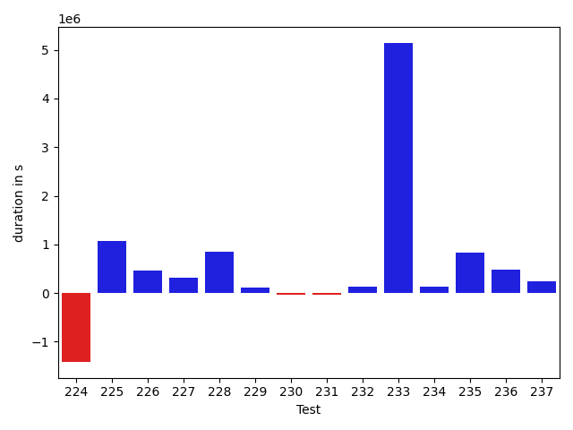

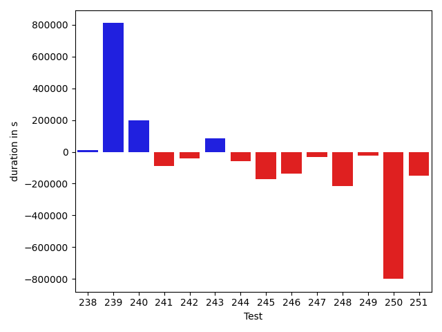

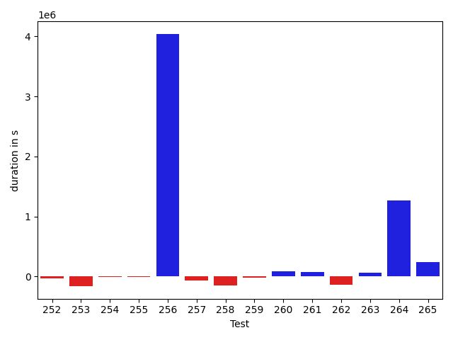

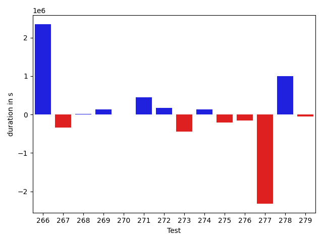

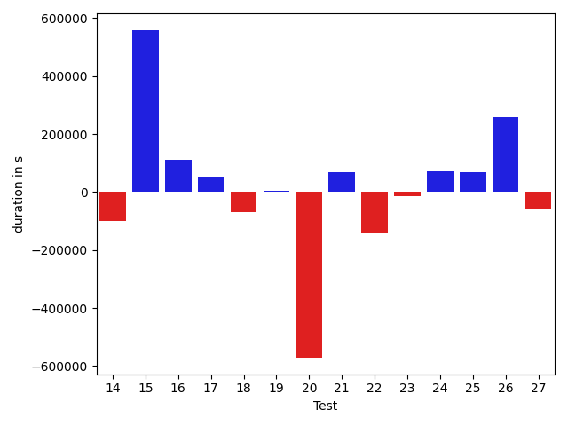

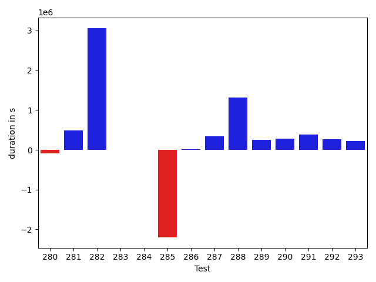

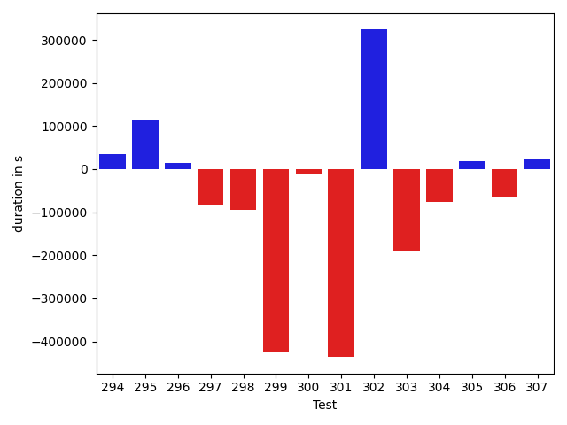

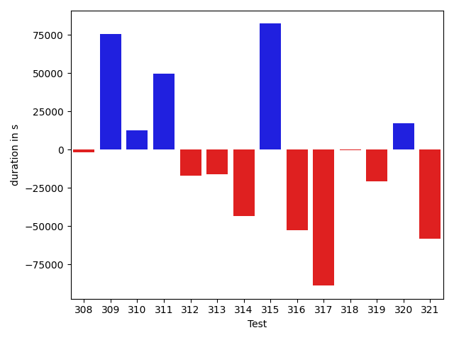

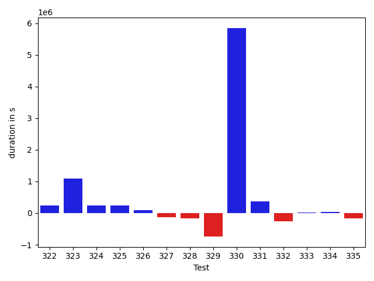

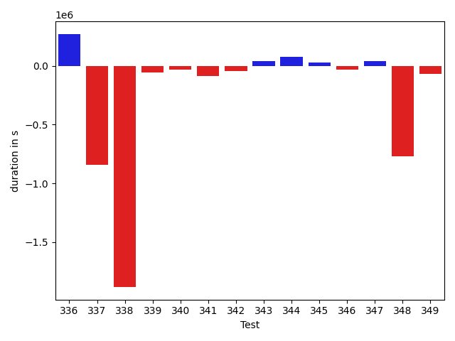


| ID | DurationV1 | DurationsV2 | DeltaDuration |
| --- | --- | --- | --- |
| 0 | 445835.8543777466 | 477677.7258872986 | 31841.871509552002 |
| 1 | 582006.5354457243 | 779591.6776552454 | 197585.14220952115 |
| 2 | 878319.3889539419 | 598455.0632515368 | -279864.32570240507 |
| 3 | 1189845.643032236 | 1230208.5042643412 | 40362.86123210518 |
| 4 | 442096.01422929764 | 501845.90350341797 | 59749.88927412033 |
| 5 | 632400.7100548202 | 1059646.3490884034 | 427245.6390335832 |
| 6 | 989580.5973379512 | 956724.7411304852 | -32855.856207465986 |
| 7 | 434443.3887436129 | 660607.6075439091 | 226164.2188002962 |
| 8 | 623467.5058763897 | 548849.6524400736 | -74617.85343631613 |
| 9 | 408945.3828125 | 568019.0144042969 | 159073.63159179688 |
| 10 | 624299.5516908476 | 1249762.672454183 | 625463.1207633354 |
| 11 | 498323.40707228106 | 2286287.9435329437 | 1787964.5364606627 |
| 12 | 689211.9363851766 | 875420.0802729176 | 186208.14388774103 |
| 13 | 621020.7236446899 | 903900.7843045495 | 282880.06065985956 |
| 14 | 1005404.2291011957 | 905327.5730591128 | -100076.65604208293 |
| 15 | 393173.20133304596 | 951952.9811859131 | 558779.7798528671 |
| 16 | 516690.32781329093 | 627807.464450821 | 111117.13663753011 |
| 17 | 517892.37807388115 | 570847.1291842336 | 52954.75111035246 |
| 18 | 529496.5992077813 | 461602.19618299603 | -67894.40302478522 |
| 19 | 470044.0453679655 | 475445.09569601156 | 5401.050328046083 |
| 20 | 1023284.3728761673 | 451559.96158720553 | -571724.4112889618 |
| 21 | 348130.5927734375 | 415736.64056396484 | 67606.04779052734 |
| 22 | 470898.9530003369 | 329648.1813876629 | -141250.771612674 |
| 23 | 702200.670592442 | 688878.0102142963 | -13322.660378145752 |
| 24 | 708604.2732568949 | 780408.5040180127 | 71804.23076111777 |
| 25 | 508550.05541553395 | 578220.6875655798 | 69670.63215004583 |
| 26 | 760527.8106778294 | 1018074.2965338965 | 257546.48585606704 |
| 27 | 400251.5198444724 | 341485.80493927 | -58765.71490520239 |
| 28 | 371991.61330986023 | 450982.7642278671 | 78991.1509180069 |
| 29 | 447673.2902984619 | 452229.81504130363 | 4556.524742841721 |
| 30 | 532031.8322579651 | 589643.0943884891 | 57611.26213052403 |
| 31 | 548362.4825521465 | 1280574.4489940917 | 732211.9664419452 |
| 32 | 403383.5495542288 | 421804.01401495934 | 18420.464460730553 |
| 33 | 419390.8105697632 | 368868.3617359102 | -50522.44883385301 |
| 34 | 426098.2941095382 | 856297.7153091431 | 430199.42119960487 |
| 35 | 405286.9268527683 | 381862.61669921875 | -23424.310153549537 |
| 36 | 394734.660476923 | 935892.7810731605 | 541158.1205962375 |
| 37 | 475510.1790291071 | 394638.59981505945 | -80871.57921404764 |
| 38 | 535054.3580235988 | 443242.67692518234 | -91811.68109841645 |
| 39 | 1128583.547883598 | 914497.474658232 | -214086.07322536595 |
| 40 | 506072.3273766134 | 448871.18226885796 | -57201.14510775544 |
| 41 | 818601.8642530545 | 805895.9943913552 | -12705.869861699292 |
| 42 | 1371178.521524969 | 494485.15267630364 | -876693.3688486654 |
| 43 | 585271.806198431 | 457290.01086214185 | -127981.7953362891 |
| 44 | 685328.8409530893 | 661646.1269669603 | -23682.713986129034 |
| 45 | 479989.3892650604 | 403378.0247896109 | -76611.36447544955 |
| 46 | 697761.6863154476 | 688444.4256977706 | -9317.260617677006 |
| 47 | 25730198.68775416 | 1978020.935894631 | -23752177.75185953 |
| 48 | 912831.9503765596 | 547470.2472403753 | -365361.70313618437 |
| 49 | 1062661.8850203273 | 557671.5226548733 | -504990.36236545397 |
| 50 | 2331743.6605935264 | 678864.3418048769 | -1652879.3187886495 |
| 51 | 1420104.3999034008 | 915592.9982557222 | -504511.4016476786 |
| 52 | 774217.8910475366 | 569114.7396892407 | -205103.15135829593 |
| 53 | 1037716.6451705102 | 504772.4139939069 | -532944.2311766032 |
| 54 | 614926.0823429676 | 613137.7708937159 | -1788.3114492517198 |
| 55 | 1454882.7139678777 | 1392524.915819035 | -62357.79814884276 |
| 56 | 784637.0931786048 | 712844.2555136175 | -71792.83766498731 |
| 57 | 773344.8476419407 | 697960.687424127 | -75384.16021781368 |
| 58 | 575400.7348157613 | 538929.2903813054 | -36471.444434455945 |
| 59 | 642694.0290239365 | 584421.8877870226 | -58272.141236913856 |
| 60 | 519053.21074840846 | 498484.5074883001 | -20568.703260108363 |
| 61 | 444777.5253095627 | 410437.7483152803 | -34339.77699428238 |
| 62 | 870783.7226337381 | 503717.4699666331 | -367066.25266710494 |
| 63 | 488148.12184581213 | 543752.8140180624 | 55604.6921722503 |
| 64 | 517695.2848133147 | 597104.9876586199 | 79409.7028453052 |
| 65 | 1771235.1529943107 | 601482.4970337823 | -1169752.6559605284 |
| 66 | 2800425.7634445364 | 2021219.6128351963 | -779206.15060934 |
| 67 | 399129.09143066406 | 389004.13399136066 | -10124.957439303398 |
| 68 | 342832.9041748047 | 380414.765625 | 37581.86145019531 |
| 69 | 417156.94316387177 | 458204.6882963134 | 41047.74513244163 |
| 70 | 369660.32782781124 | 415143.5891933441 | 45483.261365532875 |
| 71 | 674907.2115299702 | 343479.0755801201 | -331428.1359498501 |
| 72 | 520472.8198720515 | 448488.9362463951 | -71983.88362565637 |
| 73 | 668758.3717050552 | 431483.6146850586 | -237274.75701999664 |
| 74 | 812958.1034718695 | 749993.7878644211 | -62964.31560744834 |
| 75 | 1152785.9790467834 | 1278702.9502782894 | 125916.97123150597 |
| 76 | 835624.8717154595 | 390872.34601162374 | -444752.52570383577 |
| 77 | 741044.8294904009 | 704790.8979507734 | -36253.93153962749 |
| 78 | 552260.381439209 | 479528.6933507323 | -72731.68808847666 |
| 79 | 16765940.884168163 | 557908.3762884131 | -16208032.507879749 |
| 80 | 481673.26403808594 | 491130.764919281 | 9457.500881195068 |
| 81 | 564989.4102783203 | 348607.32863616943 | -216382.08164215088 |
| 82 | 1255045.0987824306 | 1920985.420995865 | 665940.3222134344 |
| 83 | 848160.0460866535 | 4319871.968807757 | 3471711.9227211033 |
| 84 | 719940.6002404615 | 2588354.161570212 | 1868413.5613297503 |
| 85 | 652518.2625333183 | 784798.1871589487 | 132279.9246256305 |
| 86 | 1346950.6709833103 | 1544680.1842158088 | 197729.51323249843 |
| 87 | 649798.2221184478 | 607553.3821039121 | -42244.8400145357 |
| 88 | 838830.8949866614 | 773946.5997745371 | -64884.29521212424 |
| 89 | 1288139.6903271056 | 1163797.994739301 | -124341.69558780454 |
| 90 | 911158.7910107439 | 673239.2958623478 | -237919.49514839612 |
| 91 | 1208648.3342030537 | 710536.5185647525 | -498111.8156383012 |
| 92 | 607855.6718177646 | 475862.2663172418 | -131993.40550052281 |
| 93 | 5417450.437351982 | 4660189.206917873 | -757261.2304341095 |
| 94 | 521317.00449180603 | 375167.3196554184 | -146149.68483638763 |
| 95 | 7447273.676023145 | 3731115.7693655575 | -3716157.9066575877 |
| 96 | 674062.5277717116 | 665795.5509251051 | -8266.97684660647 |
| 97 | 756174.4037792407 | 741032.1446389201 | -15142.259140320588 |
| 98 | 1008901.2356310859 | 1165638.3830490876 | 156737.14741800167 |
| 99 | 362063.29431152344 | 393341.50438479986 | 31278.210073276423 |
| 100 | 965434.4678053807 | 641895.2391241251 | -323539.2286812556 |
| 101 | 1140132.366420887 | 1005512.6344504012 | -134619.73197048577 |
| 102 | 1192893.0003958603 | 1041896.5358349124 | -150996.46456094785 |
| 103 | 398831.52017211914 | 359746.4668197632 | -39085.05335235596 |
| 104 | 746083.9973536634 | 738259.3965459035 | -7824.600807759911 |
| 105 | 403228.0647408236 | 385092.9389859438 | -18135.125754879788 |
| 106 | 705370.8628686666 | 423029.0991346303 | -282341.76373403636 |
| 107 | 929220.1277046949 | 428102.084926486 | -501118.04277820885 |
| 108 | 498424.8244600801 | 488902.52454161644 | -9522.299918463686 |
| 109 | 531661.1592867374 | 388548.1661529541 | -143112.99313378334 |
| 110 | 356353.02294921875 | 326662.40155029297 | -29690.62139892578 |
| 111 | 472088.1104506254 | 676858.7420038842 | 204770.63155325875 |
| 112 | 859589.9162392518 | 638383.7540267981 | -221206.16221245378 |
| 113 | 471257.18841934204 | 402889.9197282791 | -68367.26869106293 |
| 114 | 353480.556391716 | 381967.8127608299 | 28487.256369113922 |
| 115 | 353358.6767272949 | 316784.173828125 | -36574.50289916992 |
| 116 | 482862.2229003906 | 349037.6266670227 | -133824.59623336792 |
| 117 | 645770.6655586734 | 508441.45911567286 | -137329.20644300058 |
| 118 | 850864.6671791391 | 896452.0592113509 | 45587.39203221176 |
| 119 | 446940.92596165836 | 566923.3891299088 | 119982.4631682504 |
| 120 | 829377.6736757144 | 843102.398596128 | 13724.724920413573 |
| 121 | 642071.1124847466 | 1087098.2398831502 | 445027.1273984036 |
| 122 | 891068.0603492856 | 995903.143045783 | 104835.08269649744 |
| 123 | 659053.1489192094 | 1291508.4677689914 | 632455.318849782 |
| 124 | 978076.9537627157 | 1501899.0601505358 | 523822.1063878201 |
| 125 | 480522.42247772217 | 384706.86710357666 | -95815.55537414551 |
| 126 | 629295.9277434349 | 11072422.232557718 | 10443126.304814283 |
| 127 | 453969.64390563965 | 456866.40783691406 | 2896.763931274414 |
| 128 | 2386404.1323355488 | 1596222.667097956 | -790181.4652375928 |
| 129 | 756929.0055973334 | 866078.3364442496 | 109149.33084691619 |
| 130 | 1398105.2335306134 | 1048279.1988842748 | -349826.03464633855 |
| 131 | 719987.2480288825 | 813789.2881893297 | 93802.04016044713 |
| 132 | 868002.9432477352 | 941621.5570930695 | 73618.61384533439 |
| 133 | 383599.126834929 | 375018.01494920254 | -8581.111885726452 |
| 134 | 441443.6669592187 | 418934.5001228261 | -22509.1668363926 |
| 135 | 547881.2773069143 | 455960.53637837106 | -91920.74092854327 |
| 136 | 512437.7125052857 | 503074.89745527663 | -9362.815050009056 |
| 137 | 481225.76484868623 | 452786.8446120468 | -28438.920236639446 |
| 138 | 583659.7674020734 | 557211.5819434822 | -26448.185458591208 |
| 139 | 673229.3135548418 | 751382.3179452204 | 78153.0043903786 |
| 140 | 581268.718044343 | 599883.886972641 | 18615.168928297935 |
| 141 | 576794.0074599686 | 563768.6979745621 | -13025.309485406498 |
| 142 | 879108.3221788236 | 867621.1552271068 | -11487.166951716878 |
| 143 | 573288.0034347819 | 522524.7121191076 | -50763.291315674316 |
| 144 | 540662.4590265813 | 576971.8041009912 | 36309.34507440997 |
| 145 | 390848.01218128204 | 328043.76321172714 | -62804.2489695549 |
| 146 | 334849.9057260752 | 341420.37846660614 | 6570.472740530968 |
| 147 | 2698850.5420765877 | 706088.2479066849 | -1992762.2941699028 |
| 148 | 483464.64013671875 | 397801.5377910137 | -85663.10234570503 |
| 149 | 913905.5413098172 | 931367.150419715 | 17461.60910989775 |
| 150 | 835717.8263546654 | 751141.7998986576 | -84576.02645600785 |
| 151 | 1032190.9456721164 | 937945.416539668 | -94245.52913244837 |
| 152 | 819918.7897251514 | 870895.7594287092 | 50976.969703557785 |
| 153 | 1849815.047958172 | 1673433.3346555447 | -176381.7133026272 |
| 154 | 962694.310870502 | 1282526.9086991167 | 319832.59782861464 |
| 155 | 2025964.541950887 | 1850003.1564703537 | -175961.38548053335 |
| 156 | 992814.8900359911 | 1016115.0315360557 | 23300.141500064638 |
| 157 | 950460.1972034443 | 827376.3882625747 | -123083.80894086964 |
| 158 | 1788047.126390085 | 1745632.6549877683 | -42414.47140231682 |
| 159 | 905430.9400815808 | 826685.8351986303 | -78745.10488295043 |
| 160 | 503535.87140147015 | 452085.6557042226 | -51450.215697247535 |
| 161 | 1228667.6588447741 | 1389163.9059821311 | 160496.24713735702 |
| 162 | 990637.0504242615 | 875881.8306728728 | -114755.21975138865 |
| 163 | 1206047.956141273 | 965409.684124636 | -240638.27201663703 |
| 164 | 779123.7028561233 | 824111.7281034907 | 44988.02524736733 |
| 165 | 622600.1754545411 | 558289.8521169351 | -64310.32333760604 |
| 166 | 5490748.362617986 | 5264102.159309965 | -226646.20330802165 |
| 167 | 4477542.170537658 | 4221566.239106612 | -255975.93143104576 |
| 168 | 398055.97326618433 | 416163.7434973717 | 18107.770231187344 |
| 169 | 459587.76107662916 | 443878.7318543494 | -15709.029222279787 |
| 170 | 4968430.590713469 | 5082279.225489111 | 113848.63477564137 |
| 171 | 490999.8261486972 | 455120.9529065888 | -35878.873242108384 |
| 172 | 743652.9456240309 | 1327233.9674816644 | 583581.0218576335 |
| 173 | 323209.14489746094 | 357881.0552368164 | 34671.91033935547 |
| 174 | 593993.6657400817 | 1373114.9592612686 | 779121.2935211869 |
| 175 | 858346.488491923 | 3396206.576652359 | 2537860.088160436 |
| 176 | 480405.7023925781 | 461592.5140886307 | -18813.18830394745 |
| 177 | 409365.62333832984 | 475181.4125983059 | 65815.78925997607 |
| 178 | 397035.5057373047 | 421702.67753610015 | 24667.17179879546 |
| 179 | 390185.92147900164 | 519105.18064552266 | 128919.25916652102 |
| 180 | 1771117.190826979 | 1425683.4271169207 | -345433.7637100583 |
| 181 | 1224871.683074053 | 1268737.4928997986 | 43865.809825745644 |
| 182 | 1044751.6943528468 | 772640.2709241712 | -272111.4234286756 |
| 183 | 1025936.7854182002 | 1086820.7041789233 | 60883.918760723085 |
| 184 | 611277.2439375635 | 567980.0564254167 | -43297.187512146775 |
| 185 | 783993.1309574913 | 598965.3401231313 | -185027.79083436006 |
| 186 | 334778.78168678284 | 291673.1728515625 | -43105.60883522034 |
| 187 | 733367.3304149173 | 538858.3500237435 | -194508.98039117386 |
| 188 | 846680.5110818202 | 1124747.129641361 | 278066.61855954083 |
| 189 | 863650.7484451941 | 798651.4905494581 | -64999.257895736024 |
| 190 | 860954.5639542559 | 1249568.9658169623 | 388614.4018627064 |
| 191 | 3513491.692917392 | 3305304.8031016085 | -208186.8898157836 |
| 192 | 1275232.2869592747 | 984251.8824983167 | -290980.404460958 |
| 193 | 702103.6622554824 | 578157.3136421735 | -123946.34861330886 |
| 194 | 703441.3982522157 | 807831.0599285653 | 104389.66167634958 |
| 195 | 1972542.4858821752 | 1537693.5677622939 | -434848.9181198813 |
| 196 | 788418.0562862577 | 673662.3017736077 | -114755.75451264996 |
| 197 | 675048.3113466611 | 570123.8726677733 | -104924.43867888779 |
| 198 | 774472.2345076308 | 723106.1037230802 | -51366.130784550565 |
| 199 | 1038331.7312611045 | 953523.8810745744 | -84807.85018653003 |
| 200 | 4144222.3268739125 | 3797386.8534613447 | -346835.47341256775 |
| 201 | 768183.8925263712 | 655309.4601697098 | -112874.43235666142 |
| 202 | 594896.872143507 | 468643.17685334384 | -126253.69529016316 |
| 203 | 807828.9386667862 | 1047164.67502919 | 239335.73636240384 |
| 204 | 922326.4176740918 | 589659.6943863868 | -332666.723287705 |
| 205 | 657659.3223966965 | 491566.1055548119 | -166093.21684188466 |
| 206 | 898422.3427150868 | 649143.2265970202 | -249279.1161180666 |
| 207 | 711063.470302568 | 563911.6370288746 | -147151.83327369345 |
| 208 | 478410.0871582031 | 444877.00314331055 | -33533.08401489258 |
| 209 | 947561.9976875539 | 712643.6213240327 | -234918.3763635212 |
| 210 | 624480.8086667473 | 692633.929769427 | 68153.12110267975 |
| 211 | 544998.8027459728 | 656225.3422050838 | 111226.53945911105 |
| 212 | 618810.8507346634 | 640412.4815307969 | 21601.630796133424 |
| 213 | 788596.4511555464 | 686984.6429814831 | -101611.80817406322 |
| 214 | 571335.7077673143 | 652289.5547950238 | 80953.84702770947 |
| 215 | 1638100.273197665 | 1396769.5380631513 | -241330.73513451382 |
| 216 | 619214.0264728732 | 583510.981318768 | -35703.04515410517 |
| 217 | 760898.8657158255 | 738517.9700407363 | -22380.89567508921 |
| 218 | 588281.3840603239 | 683818.6948702799 | 95537.31080995593 |
| 219 | 760858.5947403816 | 674834.7378523645 | -86023.85688801704 |
| 220 | 645209.5752386408 | 674320.8103383088 | 29111.235099668032 |
| 221 | 456825.9951171875 | 364851.4130859375 | -91974.58203125 |
| 222 | 566658.2884143374 | 594413.8848908577 | 27755.596476520295 |
| 223 | 629351.4561750607 | 644617.5993935626 | 15266.143218501937 |
| 224 | 1802261.1903076172 | 388599.35369873047 | -1413661.8366088867 |
| 225 | 641209.3556667678 | 1704747.9487083189 | 1063538.593041551 |
| 226 | 619303.9255093123 | 1088028.0398108156 | 468724.1143015033 |
| 227 | 840670.2673415788 | 1159189.3496645978 | 318519.0823230189 |
| 228 | 491097.9273103682 | 1340498.2228595018 | 849400.2955491336 |
| 229 | 569973.4181573966 | 679241.825706972 | 109268.40754957544 |
| 230 | 500957.4516737461 | 466780.9134761393 | -34176.5381976068 |
| 231 | 326239.5876464844 | 285995.35174798965 | -40244.23589849472 |
| 232 | 347407.533203125 | 474387.41272735596 | 126979.87952423096 |
| 233 | 4677956.039760252 | 9819902.666791217 | 5141946.627030965 |
| 234 | 1121947.815701687 | 1245036.5328261575 | 123088.71712447051 |
| 235 | 3776651.717205814 | 4613084.052123966 | 836432.3349181516 |
| 236 | 1030655.9742063881 | 1511550.4890526254 | 480894.51484623726 |
| 237 | 741191.9137023318 | 990293.0259708525 | 249101.11226852064 |
| 238 | 786404.713330444 | 796328.2261762619 | 9923.512845817953 |
| 239 | 459925.33101690863 | 1269409.4674555636 | 809484.136438655 |
| 240 | 383664.8755187988 | 580272.2938594818 | 196607.41834068298 |
| 241 | 2623485.3034161627 | 2534575.2879035985 | -88910.01551256422 |
| 242 | 638949.7663536059 | 597219.20823664 | -41730.55811696593 |
| 243 | 890105.0559751175 | 977045.7260690997 | 86940.67009398225 |
| 244 | 705647.2483238315 | 646636.166188193 | -59011.082135638455 |
| 245 | 870135.0964780347 | 698559.1128846084 | -171575.9835934263 |
| 246 | 923216.5925867925 | 787627.5902367926 | -135589.00234999997 |
| 247 | 621520.700938031 | 587318.6270201271 | -34202.07391790382 |
| 248 | 558261.7250137329 | 342683.9601135254 | -215577.76490020752 |
| 249 | 332580.21532297134 | 307548.45488739014 | -25031.760435581207 |
| 250 | 1682086.8853249112 | 882647.1903349285 | -799439.6949899828 |
| 251 | 526724.5438308716 | 377608.8821525574 | -149115.6616783142 |
| 252 | 356757.4331228733 | 318399.6445236206 | -38357.7885992527 |
| 253 | 518384.451171875 | 356197.109375 | -162187.341796875 |
| 254 | 594942.1379231855 | 587594.8605866854 | -7347.277336500119 |
| 255 | 569378.2881683877 | 562419.334540307 | -6958.953628080664 |
| 256 | 370435.7536418438 | 4411993.0419921875 | 4041557.2883503437 |
| 257 | 3079616.40173268 | 3009820.329184923 | -69796.07254775707 |
| 258 | 953798.6507242036 | 807034.2160391079 | -146764.43468509568 |
| 259 | 940088.4825605865 | 912877.1038632321 | -27211.378697354463 |
| 260 | 742266.0236646095 | 831197.8988805634 | 88931.87521595391 |
| 261 | 714076.4324513017 | 783700.7928587619 | 69624.36040746013 |
| 262 | 903215.1632765797 | 767145.7422644319 | -136069.4210121478 |
| 263 | 901598.134396675 | 966204.7326066389 | 64606.59820996388 |
| 264 | 454069.8632903099 | 1717133.2630417943 | 1263063.3997514844 |
| 265 | 606341.1652135241 | 843195.5250895321 | 236854.359876008 |
| 266 | 835772.145096232 | 3185772.310365337 | 2350000.1652691048 |
| 267 | 2387025.2096572705 | 2042547.973491612 | -344477.23616565857 |
| 268 | 658039.4930262265 | 670856.0984935665 | 12816.605467339978 |
| 269 | 612860.6058607759 | 751445.586524089 | 138584.98066331306 |
| 270 | 566316.1861845236 | 566464.3906182498 | 148.20443372614682 |
| 271 | 756258.4486194367 | 1204247.3304845588 | 447988.8818651221 |
| 272 | 776750.8556813779 | 954132.6196208 | 177381.7639394221 |
| 273 | 1689620.0430908203 | 1248261.140534401 | -441358.9025564194 |
| 274 | 1082816.7117728523 | 1219785.8776330717 | 136969.1658602194 |
| 275 | 1402091.2469419653 | 1193647.4365232156 | -208443.8104187497 |
| 276 | 606258.4602105878 | 444770.2950129509 | -161488.16519763693 |
| 277 | 3648758.7512713047 | 1330907.4360687272 | -2317851.3152025775 |
| 278 | 954448.9432040728 | 1953729.4103313717 | 999280.4671272989 |
| 279 | 600113.9700762247 | 552882.7350880578 | -47231.234988166834 |
| 280 | 527519.717260804 | 436294.1434763223 | -91225.57378448173 |
| 281 | 486456.76760922093 | 969966.5350717686 | 483509.76746254764 |
| 282 | 1196825.36416067 | 4255821.65413451 | 3058996.28997384 |
| 283 | 456773.4805625934 | 463626.75046993047 | 6853.2699073370895 |
| 284 | 676343.3682155702 | 674864.9027238326 | -1478.4654917375883 |
| 285 | 2779557.794565916 | 579482.8167509437 | -2200074.9778149724 |
| 286 | 599651.9676349454 | 620221.3222732628 | 20569.354638317367 |
| 287 | 530156.8948223246 | 875946.4035338501 | 345789.5087115255 |
| 288 | 3408515.8168888367 | 4723643.160792092 | 1315127.3439032552 |
| 289 | 648316.8411286126 | 897894.7764788629 | 249577.93535025022 |
| 290 | 471034.88102078834 | 748741.9358016066 | 277707.0547808183 |
| 291 | 717754.9401213087 | 1106304.0129627534 | 388549.07284144475 |
| 292 | 850189.4763235385 | 1123481.2771616573 | 273291.8008381189 |
| 293 | 401946.9672033787 | 629039.270324707 | 227092.30312132835 |
| 294 | 495446.2770285866 | 530330.5970047822 | 34884.31997619558 |
| 295 | 372704.0554199219 | 486707.42533421516 | 114003.36991429329 |
| 296 | 395311.4873571489 | 409435.253724277 | 14123.766367128119 |
| 297 | 1281590.608583829 | 1199306.7130052652 | -82283.89557856368 |
| 298 | 512037.06819388503 | 416704.8182527461 | -95332.24994113896 |
| 299 | 787552.6431274414 | 361887.16036987305 | -425665.48275756836 |
| 300 | 971777.007919486 | 961582.8013624601 | -10194.2065570259 |
| 301 | 887439.6193026379 | 451013.0891723335 | -436426.5301303044 |
| 302 | 476075.6778117144 | 799766.8099566253 | 323691.1321449109 |
| 303 | 981813.8805629658 | 789876.5189486039 | -191937.36161436187 |
| 304 | 807509.6857293951 | 731087.7303084906 | -76421.95542090456 |
| 305 | 612734.8448553423 | 631674.7110186251 | 18939.86616328277 |
| 306 | 995613.9091217087 | 930799.5159763983 | -64814.39314531046 |
| 307 | 788109.3063757718 | 810863.4266217237 | 22754.120245951926 |
| 308 | 997315.5624573189 | 995783.3513637164 | -1532.2110936024692 |
| 309 | 625539.3806051919 | 701034.7492546428 | 75495.36864945083 |
| 310 | 908154.0204268062 | 920893.3362871222 | 12739.315860316041 |
| 311 | 665204.1033893307 | 715059.6741297261 | 49855.57074039546 |
| 312 | 674869.3367181576 | 657710.7576383683 | -17158.579079789342 |
| 313 | 624543.269582303 | 608670.7911605743 | -15872.478421728709 |
| 314 | 695356.2197795045 | 652021.1529581825 | -43335.06682132196 |
| 315 | 425567.12478508055 | 507975.57343673706 | 82408.44865165651 |
| 316 | 572694.8822040043 | 520200.131157648 | -52494.75104635634 |
| 317 | 608818.2066653876 | 519932.0927861172 | -88886.11387927039 |
| 318 | 619729.0740081681 | 619373.5825883143 | -355.491419853759 |
| 319 | 514678.4732739506 | 493873.91008928337 | -20804.563184667262 |
| 320 | 604504.9085446615 | 621724.8491723449 | 17219.94062768342 |
| 321 | 379560.01289749146 | 321500.4712290764 | -58059.54166841507 |
| 322 | 1124465.9318495071 | 1364528.709853124 | 240062.77800361696 |
| 323 | 1286542.2446898173 | 2373170.8556809016 | 1086628.6109910842 |
| 324 | 691632.4525331149 | 931053.4065835066 | 239420.95405039168 |
| 325 | 875939.9542448865 | 1113867.6038942053 | 237927.64964931877 |
| 326 | 1064922.988220857 | 1158848.7782648536 | 93925.79004399665 |
| 327 | 1068676.4969441667 | 931858.6798156635 | -136817.81712850323 |
| 328 | 912592.2244546956 | 747412.8533700891 | -165179.3710846065 |
| 329 | 2049527.254706795 | 1310466.7531256052 | -739060.5015811899 |
| 330 | 1127283.7391899913 | 6976072.235217421 | 5848788.4960274305 |
| 331 | 709168.7247917652 | 1076905.6829131246 | 367736.95812135935 |
| 332 | 1011436.6239292515 | 745082.1078881274 | -266354.516041124 |
| 333 | 368165.6600189209 | 392884.4767227173 | 24718.816703796387 |
| 334 | 367709.32368445396 | 398185.27506256104 | 30475.95137810707 |
| 335 | 460342.9965362549 | 299822.45568847656 | -160520.54084777832 |
| 336 | 333385.8805770874 | 604389.2644233704 | 271003.38384628296 |
| 337 | 1789174.976361293 | 948673.9998346271 | -840500.976526666 |
| 338 | 2221426.501724243 | 339083.6858634949 | -1882342.8158607483 |
| 339 | 658020.2907578559 | 603561.4287716281 | -54458.8619862278 |
| 340 | 372847.07232666016 | 340065.81640625 | -32781.255920410156 |
| 341 | 387639.33984375 | 303533.60876083374 | -84105.73108291626 |
| 342 | 361692.4069824219 | 317683.38210105896 | -44009.024881362915 |
| 343 | 356134.0877685547 | 397499.67333984375 | 41365.58557128906 |
| 344 | 374924.43423461914 | 450196.10075998306 | 75271.66652536392 |
| 345 | 278030.54708862305 | 309311.87603759766 | 31281.32894897461 |
| 346 | 372158.1757196188 | 340855.21904563904 | -31302.95667397976 |
| 347 | 329917.6679992676 | 373328.2169189453 | 43410.548919677734 |
| 348 | 1499778.604762002 | 729016.78192777 | -770761.8228342319 |
| 349 | 334934.13970184326 | 265994.3217163086 | -68939.81798553467 |
| 350 | 1376176.0728812814 | 973522.6902792752 | -402653.3826020062 |
| 351 | 344129.4196777344 | 290440.76806640625 | -53688.651611328125 |
| 352 | 399643.17431640625 | 411835.82528686523 | 12192.650970458984 |
| 353 | 261868.5888671875 | 438924.0266113281 | 177055.43774414062 |
| 354 | 391688.50927734375 | 289050.03125 | -102638.47802734375 |
| 355 | 384002.2790527344 | 269590.6348876953 | -114411.64416503906 |
| 356 | 371287.7647705078 | 346002.40625 | -25285.358520507812 |
| 357 | 428120.3335225433 | 644064.1039352417 | 215943.7704126984 |
| 358 | 327384.2331542969 | 548215.546875 | 220831.31372070312 |
| 359 | 296019.3140716553 | 328871.046875 | 32851.73280334473 |
| 360 | 505356.43158102036 | 332152.7467880249 | -173203.68479299545 |
| 361 | 862154.5064797831 | 674145.7181590148 | -188008.78832076828 |
| 362 | 629895.8916271329 | 722104.4740505219 | 92208.58242338896 |
| 363 | 653958.6498486516 | 680202.1594549359 | 26243.509606284322 |
| 364 | 315590.1184692383 | 512640.15625 | 197050.03778076172 |
| 365 | 430009.9439024554 | 452392.4010090828 | 22382.457106627407 |
| 366 | 678823.5317924749 | 1304040.4521967014 | 625216.9204042265 |
| 367 | 391814.2961883545 | 481948.875579834 | 90134.57939147949 |
| 368 | 461288.41250669956 | 565059.3933496475 | 103770.98084294796 |
| 369 | 439085.9842758179 | 581434.0778331757 | 142348.0935573578 |
| 370 | 414248.1276855469 | 665116.369140625 | 250868.24145507812 |
| 371 | 397121.89318847656 | 352959.5949707031 | -44162.29821777344 |
| 372 | 325451.7333984375 | 761262.9038963318 | 435811.1704978943 |
| 373 | 604402.6608505249 | 385027.1497192383 | -219375.51113128662 |
| 374 | 357579.5603027344 | 355593.3676147461 | -1986.1926879882812 |
| 375 | 330186.7331542969 | 350389.7080078125 | 20202.974853515625 |
| 376 | 1446898.1892968733 | 863358.9968738243 | -583539.192423049 |
| 377 | 677572.1200673656 | 567303.2915528785 | -110268.82851448713 |
| 378 | 1440058.3852736652 | 665870.2725543751 | -774188.1127192901 |
| 379 | 892761.4197778661 | 513521.56735589006 | -379239.85242197604 |
| 380 | 1318407.4561532293 | 1516692.7894965564 | 198285.33334332705 |
| 381 | 1062945.1654349396 | 784164.383496562 | -278780.78193837753 |
| 382 | 3793879.920096964 | 952167.4478419537 | -2841712.47225501 |
| 383 | 5762406.22048691 | 694624.9401357804 | -5067781.280351129 |
| 384 | 1009170.137691644 | 544646.9092884236 | -464523.2284032204 |
| 385 | 761697.06614552 | 501396.9964124951 | -260300.06973302487 |
| 386 | 1240455.5859158505 | 633509.4849902157 | -606946.1009256347 |
| 387 | 2000119.6513015225 | 562532.2172193839 | -1437587.4340821386 |
| 388 | 770521.6631377075 | 645670.2917629016 | -124851.37137480592 |
| 389 | 531347.9090801447 | 558962.8377774969 | 27614.92869735218 |
| 390 | 774237.9194624447 | 737640.1417478052 | -36597.77771463955 |
| 391 | 1605647.4123412997 | 570623.7803133114 | -1035023.6320279883 |
| 392 | 893438.8295628557 | 543428.5738210423 | -350010.25574181334 |
| 393 | 609279.0016078018 | 549951.2337256483 | -59327.76788215351 |
| 394 | 1339381.1422681333 | 431864.77184083493 | -907516.3704272984 |
| 395 | 752152.1582246721 | 435659.4891912937 | -316492.66903337836 |
| 396 | 565161.181147814 | 589696.7010314409 | 24535.51988362684 |
| 397 | 797151.4694997056 | 544599.8865139246 | -252551.58298578102 |
| 398 | 795282.2662148029 | 443316.25041527033 | -351966.0157995325 |
| 399 | 1248410.927517593 | 425163.7863660117 | -823247.1411515812 |
| 400 | 408900.80111694336 | 289117.0446548462 | -119783.75646209717 |
| 401 | 1196961.7846693397 | 712698.7367804546 | -484263.047888885 |
| 402 | 1322760.980988203 | 973948.2962635789 | -348812.68472462415 |
| 403 | 1569310.7002442193 | 2362463.208273259 | 793152.5080290397 |
| 404 | 1132439.3445219267 | 1106356.3672736944 | -26082.977248232346 |
| 405 | 1527945.3326373992 | 723540.214207179 | -804405.1184302202 |
| 406 | 1280459.8518381864 | 459328.5258963369 | -821131.3259418495 |
| 407 | 967091.5627792187 | 1247094.1555521444 | 280002.59277292574 |
| 408 | 500371.4819696275 | 560325.8272185527 | 59954.34524892521 |
| 409 | 503435.77933019644 | 580854.8162316745 | 77419.03690147807 |
| 410 | 481607.03753939737 | 529247.4080108975 | 47640.37047150009 |
| 411 | 502870.6564161782 | 506002.81802493334 | 3132.161608755123 |
| 412 | 801752.4070023551 | 756115.8796982643 | -45636.52730409079 |
| 413 | 2175227.572608147 | 1817783.9988556346 | -357443.5737525122 |
| 414 | 1000091.6799754665 | 955811.6022480794 | -44280.07772738708 |
| 415 | 903849.9092377953 | 875474.2409035468 | -28375.668334248476 |
| 416 | 736640.2759267122 | 719953.4255345109 | -16686.850392201333 |
| 417 | 1083333.146549943 | 1098657.0308369943 | 15323.88428705139 |
| 418 | 694615.6959349709 | 766341.2985199958 | 71725.6025850249 |
| 419 | 941490.3334144384 | 946396.874028847 | 4906.540614408557 |
| 420 | 1110783.5125681858 | 1090070.3469083693 | -20713.16565981647 |
| 421 | 725924.5670282096 | 1594204.9163094163 | 868280.3492812067 |
| 422 | 431419.88888275623 | 449706.1855945587 | 18286.296711802483 |
| 423 | 2929465.8591379556 | 3581821.6506492645 | 652355.7915113089 |
| 424 | 561621.0415205436 | 591436.5914302232 | 29815.54990967957 |
| 425 | 10381342.917978607 | 11478719.100909693 | 1097376.182931086 |
| 426 | 10681436.292981595 | 10987489.352866912 | 306053.05988531746 |
| 427 | 1578527.7635486275 | 1723907.6425820224 | 145379.87903339486 |
| 428 | 519443.2310565008 | 559365.1503570974 | 39921.91930059658 |
| 429 | 926096.7157882052 | 1125207.3652161479 | 199110.6494279427 |
| 430 | 524536.9483175278 | 437192.4408325404 | -87344.50748498738 |
| 431 | 877199.4069764512 | 3499216.3497086912 | 2622016.94273224 |
| 432 | 659815.7192265973 | 687291.5004507157 | 27475.781224118313 |
| 433 | 465443.771762453 | 846430.7095344067 | 380986.93777195364 |
| 434 | 2401699.662199637 | 1908048.0289683465 | -493651.6332312904 |
| 435 | 428975.07790899277 | 391228.8925461769 | -37746.18536281586 |
| 436 | 572648.1679961784 | 712845.6357169603 | 140197.46772078192 |
| 437 | 450997.21652795747 | 404273.1022607618 | -46724.11426719569 |
| 438 | 484683.7957254201 | 811678.7633947134 | 326994.9676692933 |
| 439 | 748735.7083376317 | 655055.0607799547 | -93680.647557677 |
| 440 | 591544.6477247402 | 798815.1669820385 | 207270.51925729832 |
| 441 | 466940.5555038452 | 751924.3618382812 | 284983.80633443594 |
| 442 | 527136.7169050574 | 788723.386873413 | 261586.66996835556 |
| 443 | 419314.21330275387 | 586416.6431238651 | 167102.42982111126 |
| 444 | 389949.5061118454 | 525902.34090662 | 135952.83479477465 |
| 445 | 421262.0943278512 | 628748.0713374354 | 207485.9770095842 |
| 446 | 409607.434463501 | 292334.4064941406 | -117273.02796936035 |
| 447 | 6276366.436810446 | 7464172.248523256 | 1187805.8117128098 |
| 448 | 9537176.201219097 | 9629695.684578262 | 92519.48335916549 |
| 449 | 1117877.457531913 | 688251.5121483286 | -429625.94538358436 |
| 450 | 841001.2455424361 | 538866.7466094726 | -302134.4989329636 |
| 451 | 656472.4625534969 | 1173764.3156957538 | 517291.85314225685 |
| 452 | 414577.4689807892 | 475565.1371685462 | 60987.66818775702 |
| 453 | 626403.7929840237 | 823212.1805463741 | 196808.38756235037 |
| 454 | 508170.3131323511 | 1383285.2073859219 | 875114.8942535708 |
| 455 | 417306.4118679464 | 541462.838719964 | 124156.42685201764 |
| 456 | 733030.6654144941 | 791929.7710171468 | 58899.10560265265 |
| 457 | 714056.6175605382 | 604798.6415056977 | -109257.97605484049 |
| 458 | 945133.2629456279 | 488460.471669462 | -456672.7912761659 |
| 459 | 403195.17159558646 | 364799.9898033142 | -38395.181792272255 |
| 460 | 769385.5261446682 | 803486.0802550977 | 34100.55411042948 |
| 461 | 826656.5625807955 | 1058160.6209390317 | 231504.05835823622 |
| 462 | 430347.41655434656 | 388847.1745660305 | -41500.24198831606 |
| 463 | 1191412.278831869 | 1002131.3252757515 | -189280.95355611737 |
| 464 | 488404.59139843285 | 421105.6975097656 | -67298.89388866723 |
| 465 | 581406.6465034485 | 354813.60360336304 | -226593.04290008545 |
| 466 | 368000.4314994812 | 369896.89109802246 | 1896.4595985412598 |
| 467 | 379510.30477905273 | 338754.67140072584 | -40755.63337832689 |
| 468 | 422215.440823555 | 411755.1946616769 | -10460.246161878109 |
| 469 | 348012.09983062744 | 402039.3850326538 | 54027.28520202637 |
| 470 | 784676.8873342612 | 944509.8791656843 | 159832.99183142313 |
| 471 | 1070161.548411393 | 1119842.0317470948 | 49680.48333570175 |
| 472 | 2324240.7829252924 | 1395775.6617499178 | -928465.1211753746 |
| 473 | 396643.5153160095 | 472741.130859375 | 76097.61554336548 |
| 474 | 1031414.311076023 | 749422.2562624429 | -281992.0548135801 |
| 475 | 987150.2193755285 | 4654189.358210932 | 3667039.138835404 |
| 476 | 357221.4842352867 | 953975.4608001709 | 596753.9765648842 |
| 477 | 11140053.465881348 | 3763493.7082390785 | -7376559.757642269 |
| 478 | 386969.90018463135 | 398435.19026237726 | 11465.290077745914 |
| 479 | 710658.9171902579 | 905976.2534150127 | 195317.3362247548 |
| 480 | 387622.1103515625 | 332298.142578125 | -55323.9677734375 |
| 481 | 14014823.340316772 | 588547.1933364868 | -13426276.146980286 |
| 482 | 600511.307935346 | 645550.3984626615 | 45039.09052731551 |
| 483 | 343667.3864688873 | 330654.6113090515 | -13012.775159835815 |

## Misc.

| ID | Test Class | Test Method |
| --- | --- | --- |
| 0 | com.google.gson.functional.ObjectTest | testStringFieldWithEmptyValueDeserialization |
| 1 | com.google.gson.functional.ObjectTest | testEmptyCollectionInAnObjectDeserialization |
| 2 | com.google.gson.functional.ObjectTest | testArrayOfArraysDeserialization |
| 3 | com.google.gson.functional.ObjectTest | testSingletonLists |
| 4 | com.google.gson.functional.ObjectTest | testClassWithTransientFieldsDeserialization |
| 5 | com.google.gson.functional.ObjectTest | testArrayOfObjectsAsFields |
| 6 | com.google.gson.functional.ObjectTest | testAnonymousLocalClassesCustomSerialization |
| 7 | com.google.gson.functional.ObjectTest | testPrimitiveArrayInAnObjectDeserialization |
| 8 | com.google.gson.functional.ObjectTest | testStringFieldWithEmptyValueSerialization |
| 9 | com.google.gson.functional.ObjectTest | testNullArraysDeserialization |
| 10 | com.google.gson.functional.ObjectTest | testBagOfPrimitiveWrappersSerialization |
| 11 | com.google.gson.functional.ObjectTest | testBagOfPrimitiveWrappersDeserialization |
| 12 | com.google.gson.functional.ObjectTest | testArrayOfObjectsSerialization |
| 13 | com.google.gson.functional.ObjectTest | testClassWithTransientFieldsSerialization |
| 14 | com.google.gson.functional.ObjectTest | testInnerClassDeserialization |
| 15 | com.google.gson.functional.ObjectTest | testJsonObjectSerialization |
| 16 | com.google.gson.functional.ObjectTest | testNestedSerialization |
| 17 | com.google.gson.functional.ObjectTest | testPrivateNoArgConstructorDeserialization |
| 18 | com.google.gson.functional.ObjectTest | testNestedDeserialization |
| 19 | com.google.gson.functional.ObjectTest | testNullFieldsDeserialization |
| 20 | com.google.gson.functional.ObjectTest | testBagOfPrimitivesDeserialization |
| 21 | com.google.gson.functional.ObjectTest | testClassWithNoFieldsDeserialization |
| 22 | com.google.gson.functional.ObjectTest | testClassWithNoFieldsSerialization |
| 23 | com.google.gson.functional.ObjectTest | testTruncatedDeserialization |
| 24 | com.google.gson.functional.ObjectTest | testInnerClassSerialization |
| 25 | com.google.gson.functional.ObjectTest | testClassWithObjectFieldSerialization |
| 26 | com.google.gson.functional.ObjectTest | testArrayOfArraysSerialization |
| 27 | com.google.gson.functional.ObjectTest | testNullObjectFieldsDeserialization |
| 28 | com.google.gson.functional.ObjectTest | testClassWithTransientFieldsDeserializationTransientFieldsPassedInJsonAreIgnored |
| 29 | com.google.gson.functional.ObjectTest | testPrimitiveArrayFieldSerialization |
| 30 | com.google.gson.functional.ObjectTest | testArrayOfObjectsDeserialization |
| 31 | com.google.gson.functional.ObjectTest | testJsonInSingleQuotesDeserialization |
| 32 | com.google.gson.functional.ObjectTest | testStringFieldWithNumberValueDeserialization |
| 33 | com.google.gson.functional.ObjectTest | testObjectFieldNamesWithoutQuotesDeserialization |
| 34 | com.google.gson.functional.ObjectTest | testBagOfPrimitivesSerialization |
| 35 | com.google.gson.functional.ObjectTest | testJsonInMixedQuotesDeserialization |
| 36 | com.google.gson.functional.ObjectTest | testNullPrimitiveFieldsDeserialization |
| 37 | com.google.gson.functional.ObjectTest | testNullFieldsSerialization |
| 38 | com.google.gson.functional.ObjectTest | testEmptyCollectionInAnObjectSerialization |
| 39 | com.google.gson.functional.StreamingTypeAdaptersTest | testNullSafe |
| 40 | com.google.gson.functional.StreamingTypeAdaptersTest | testDeserialize2dArray |
| 41 | com.google.gson.functional.StreamingTypeAdaptersTest | testSerializeWithCustomTypeAdapter |
| 42 | com.google.gson.functional.StreamingTypeAdaptersTest | testSerialize1dArray |
| 43 | com.google.gson.functional.StreamingTypeAdaptersTest | testDeserializeWithCustomTypeAdapter |
| 44 | com.google.gson.functional.StreamingTypeAdaptersTest | testDeserialize1dArray |
| 45 | com.google.gson.functional.StreamingTypeAdaptersTest | testSerialize2dArray |
| 46 | com.google.gson.functional.StreamingTypeAdaptersTest | testSerializeRecursive |
| 47 | com.google.gson.functional.JsonAdapterAnnotationOnClassesTest | testJsonAdapterInvoked |
| 48 | com.google.gson.functional.JsonAdapterAnnotationOnClassesTest | testRegisteredDeserializerOverridesJsonAdapter |
| 49 | com.google.gson.functional.JsonAdapterAnnotationOnClassesTest | testRegisteredSerializerOverridesJsonAdapter |
| 50 | com.google.gson.functional.JsonAdapterAnnotationOnClassesTest | testSuperclassTypeAdapterNotInvoked |
| 51 | com.google.gson.functional.JsonAdapterAnnotationOnClassesTest | testJsonAdapterFactoryInvoked |
| 52 | com.google.gson.functional.JsonAdapterAnnotationOnClassesTest | testIncorrectTypeAdapterFails |
| 53 | com.google.gson.functional.JsonAdapterAnnotationOnClassesTest | testRegisteredAdapterOverridesJsonAdapter |
| 54 | com.google.gson.functional.CustomDeserializerTest | testDefaultConstructorNotCalledOnField |
| 55 | com.google.gson.functional.CustomDeserializerTest | testJsonTypeFieldBasedDeserialization |
| 56 | com.google.gson.functional.CustomDeserializerTest | testCustomDeserializerReturnsNullForArrayElementsForArrayField |
| 57 | com.google.gson.functional.CustomDeserializerTest | testCustomDeserializerReturnsNull |
| 58 | com.google.gson.functional.CustomDeserializerTest | testCustomDeserializerReturnsNullForArrayElements |
| 59 | com.google.gson.functional.CustomDeserializerTest | testCustomDeserializerReturnsNullForTopLevelObject |
| 60 | com.google.gson.functional.CustomDeserializerTest | testDefaultConstructorNotCalledOnObject |
| 61 | com.google.gson.functional.ExclusionStrategyFunctionalTest | testExclusionStrategySerializationDoesNotImpactSerialization |
| 62 | com.google.gson.functional.ExclusionStrategyFunctionalTest | testExclusionStrategyWithMode |
| 63 | com.google.gson.functional.ExclusionStrategyFunctionalTest | testExclusionStrategySerializationDoesNotImpactDeserialization |
| 64 | com.google.gson.functional.ExclusionStrategyFunctionalTest | testExcludeTopLevelClassDeserializationDoesNotImpactSerialization |
| 65 | com.google.gson.functional.ExclusionStrategyFunctionalTest | testExclusionStrategyDeserialization |
| 66 | com.google.gson.functional.ExclusionStrategyFunctionalTest | testExclusionStrategySerialization |
| 67 | com.google.gson.functional.ExclusionStrategyFunctionalTest | testExcludeTopLevelClassSerialization |
| 68 | com.google.gson.functional.ExclusionStrategyFunctionalTest | testExcludeTopLevelClassDeserialization |
| 69 | com.google.gson.functional.ExclusionStrategyFunctionalTest | testExcludeTopLevelClassSerializationDoesNotImpactDeserialization |
| 70 | com.google.gson.MixedStreamTest | testReaderDoesNotMutateState |
| 71 | com.google.gson.MixedStreamTest | testReadInvalidState |
| 72 | com.google.gson.MixedStreamTest | testWriteClosed |
| 73 | com.google.gson.MixedStreamTest | testWriteInvalidState |
| 74 | com.google.gson.MixedStreamTest | testWriteHtmlSafe |
| 75 | com.google.gson.MixedStreamTest | testWriteLenient |
| 76 | com.google.gson.MixedStreamTest | testReadMixedStreamed |
| 77 | com.google.gson.MixedStreamTest | testReadClosed |
| 78 | com.google.gson.MixedStreamTest | testReadNulls |
| 79 | com.google.gson.MixedStreamTest | testWriteMixedStreamed |
| 80 | com.google.gson.MixedStreamTest | testWriteDoesNotMutateState |
| 81 | com.google.gson.MixedStreamTest | testWriteNulls |
| 82 | com.google.gson.functional.InstanceCreatorTest | testInstanceCreatorForParametrizedType |
| 83 | com.google.gson.functional.InstanceCreatorTest | testInstanceCreatorReturnsBaseType |
| 84 | com.google.gson.functional.InstanceCreatorTest | testInstanceCreatorReturnsSubTypeForField |
| 85 | com.google.gson.functional.InstanceCreatorTest | testInstanceCreatorReturnsSubTypeForTopLevelObject |
| 86 | com.google.gson.functional.InstanceCreatorTest | testInstanceCreatorForCollectionType |
| 87 | com.google.gson.functional.DefaultTypeAdaptersTest | testTreeSetDeserialization |
| 88 | com.google.gson.functional.DefaultTypeAdaptersTest | testDateSerializationWithPatternNotOverridenByTypeAdapter |
| 89 | com.google.gson.functional.DefaultTypeAdaptersTest | testDateSerializationWithPattern |
| 90 | com.google.gson.functional.DefaultTypeAdaptersTest | testOverrideBigIntegerTypeAdapter |
| 91 | com.google.gson.functional.DefaultTypeAdaptersTest | testClassSerialization |
| 92 | com.google.gson.functional.DefaultTypeAdaptersTest | testBigIntegerFieldDeserialization |
| 93 | com.google.gson.functional.DefaultTypeAdaptersTest | testDefaultDateDeserializationUsingBuilder |
| 94 | com.google.gson.functional.DefaultTypeAdaptersTest | testOverrideBigDecimalTypeAdapter |
| 95 | com.google.gson.functional.DefaultTypeAdaptersTest | testNullSerialization |
| 96 | com.google.gson.functional.DefaultTypeAdaptersTest | testTreeSetSerialization |
| 97 | com.google.gson.functional.DefaultTypeAdaptersTest | testDateDeserializationWithPattern |
| 98 | com.google.gson.functional.DefaultTypeAdaptersTest | testBigIntegerFieldSerialization |
| 99 | com.google.gson.functional.DefaultTypeAdaptersTest | testDefaultGregorianCalendarDeserialization |
| 100 | com.google.gson.functional.DefaultTypeAdaptersTest | testTimestampSerialization |
| 101 | com.google.gson.functional.DefaultTypeAdaptersTest | testDateSerializationInCollection |
| 102 | com.google.gson.functional.DefaultTypeAdaptersTest | testBigDecimalFieldSerialization |
| 103 | com.google.gson.functional.DefaultTypeAdaptersTest | testPropertiesSerialization |
| 104 | com.google.gson.functional.DefaultTypeAdaptersTest | testUrlNullSerialization |
| 105 | com.google.gson.functional.DefaultTypeAdaptersTest | testDefaultCalendarDeserialization |
| 106 | com.google.gson.functional.DefaultTypeAdaptersTest | testSetSerialization |
| 107 | com.google.gson.functional.DefaultTypeAdaptersTest | testBigDecimalFieldDeserialization |
| 108 | com.google.gson.functional.DefaultTypeAdaptersTest | testBitSetDeserialization |
| 109 | com.google.gson.functional.DefaultTypeAdaptersTest | testClassDeserialization |
| 110 | com.google.gson.functional.DefaultTypeAdaptersTest | testBitSetSerialization |
| 111 | com.google.gson.functional.DefaultTypeAdaptersTest | testBadValueForBigDecimalDeserialization |
| 112 | com.google.gson.functional.DefaultTypeAdaptersTest | testSqlDateSerialization |
| 113 | com.google.gson.functional.DefaultTypeAdaptersTest | testDefaultCalendarSerialization |
| 114 | com.google.gson.functional.DefaultTypeAdaptersTest | testDefaultGregorianCalendarSerialization |
| 115 | com.google.gson.functional.DefaultTypeAdaptersTest | testPropertiesDeserialization |
| 116 | com.google.gson.functional.DefaultTypeAdaptersTest | testUrlNullDeserialization |
| 117 | com.google.gson.functional.JsonParserTest | testBadTypeForDeserializingCustomTree |
| 118 | com.google.gson.functional.JsonParserTest | testExtraCommasInArrays |
| 119 | com.google.gson.functional.JsonParserTest | testBadFieldTypeForCustomDeserializerCustomTree |
| 120 | com.google.gson.functional.JsonParserTest | testExtraCommasInMaps |
| 121 | com.google.gson.functional.JsonParserTest | testBadFieldTypeForDeserializingCustomTree |
| 122 | com.google.gson.functional.JsonParserTest | testParseInvalidJson |
| 123 | com.google.gson.functional.JsonParserTest | testChangingCustomTreeAndDeserializing |
| 124 | com.google.gson.functional.JsonParserTest | testDeserializingCustomTree |
| 125 | com.google.gson.OverrideCoreTypeAdaptersTest | testOverrideStringAdapter |
| 126 | com.google.gson.OverrideCoreTypeAdaptersTest | testOverrideWrapperBooleanAdapter |
| 127 | com.google.gson.OverrideCoreTypeAdaptersTest | testOverridePrimitiveBooleanAdapter |
| 128 | com.google.gson.functional.ThrowableFunctionalTest | testExceptionWithoutCause |
| 129 | com.google.gson.functional.ThrowableFunctionalTest | testErrornWithCause |
| 130 | com.google.gson.functional.ThrowableFunctionalTest | testSerializedNameOnExceptionFields |
| 131 | com.google.gson.functional.ThrowableFunctionalTest | testErrorWithoutCause |
| 132 | com.google.gson.functional.ThrowableFunctionalTest | testExceptionWithCause |
| 133 | com.google.gson.functional.NullObjectAndFieldTest | testCustomTypeAdapterPassesNullSerialization |
| 134 | com.google.gson.functional.NullObjectAndFieldTest | testExplicitDeserializationOfNulls |
| 135 | com.google.gson.functional.NullObjectAndFieldTest | testExplicitSerializationOfNullStringMembers |
| 136 | com.google.gson.functional.NullObjectAndFieldTest | testCustomTypeAdapterPassesNullDesrialization |
| 137 | com.google.gson.functional.NullObjectAndFieldTest | testExplicitSerializationOfNullCollectionMembers |
| 138 | com.google.gson.functional.NullObjectAndFieldTest | testCustomSerializationOfNulls |
| 139 | com.google.gson.functional.NullObjectAndFieldTest | testAbsentJsonElementsAreSetToNull |
| 140 | com.google.gson.functional.NullObjectAndFieldTest | testPrintPrintingObjectWithNulls |
| 141 | com.google.gson.functional.NullObjectAndFieldTest | testExplicitNullSetsFieldToNullDuringDeserialization |
| 142 | com.google.gson.functional.NullObjectAndFieldTest | testExplicitSerializationOfNullArrayMembers |
| 143 | com.google.gson.functional.NullObjectAndFieldTest | testExplicitSerializationOfNulls |
| 144 | com.google.gson.functional.NullObjectAndFieldTest | testNullWrappedPrimitiveMemberSerialization |
| 145 | com.google.gson.functional.NullObjectAndFieldTest | testPrintPrintingArraysWithNulls |
| 146 | com.google.gson.functional.NullObjectAndFieldTest | testNullWrappedPrimitiveMemberDeserialization |
| 147 | com.google.gson.functional.NullObjectAndFieldTest | testTopLevelNullObjectSerialization |
| 148 | com.google.gson.functional.NullObjectAndFieldTest | testTopLevelNullObjectDeserialization |
| 149 | com.google.gson.functional.ParameterizedTypesTest | testParameterizedTypeGenericArraysSerialization |
| 150 | com.google.gson.functional.ParameterizedTypesTest | testParameterizedTypesWithWriterSerialization |
| 151 | com.google.gson.functional.ParameterizedTypesTest | testVariableTypeArrayDeserialization |
| 152 | com.google.gson.functional.ParameterizedTypesTest | testParameterizedTypeWithReaderDeserialization |
| 153 | com.google.gson.functional.ParameterizedTypesTest | testParameterizedTypesSerialization |
| 154 | com.google.gson.functional.ParameterizedTypesTest | testVariableTypeDeserialization |
| 155 | com.google.gson.functional.ParameterizedTypesTest | testVariableTypeFieldsAndGenericArraysSerialization |
| 156 | com.google.gson.functional.ParameterizedTypesTest | testParameterizedTypeGenericArraysDeserialization |
| 157 | com.google.gson.functional.ParameterizedTypesTest | testParameterizedTypeDeserialization |
| 158 | com.google.gson.functional.ParameterizedTypesTest | testTypesWithMultipleParametersSerialization |
| 159 | com.google.gson.functional.ParameterizedTypesTest | testParameterizedTypesWithCustomDeserializer |
| 160 | com.google.gson.functional.ParameterizedTypesTest | testDeepParameterizedTypeSerialization |
| 161 | com.google.gson.functional.ParameterizedTypesTest | testVariableTypeFieldsAndGenericArraysDeserialization |
| 162 | com.google.gson.functional.ParameterizedTypesTest | testParameterizedTypeWithVariableTypeDeserialization |
| 163 | com.google.gson.functional.ParameterizedTypesTest | testParameterizedTypeWithCustomSerializer |
| 164 | com.google.gson.functional.ParameterizedTypesTest | testTypesWithMultipleParametersDeserialization |
| 165 | com.google.gson.functional.ParameterizedTypesTest | testDeepParameterizedTypeDeserialization |
| 166 | com.google.gson.functional.CircularReferenceTest | testCircularSerialization |
| 167 | com.google.gson.functional.CircularReferenceTest | testSelfReferenceArrayFieldSerialization |
| 168 | com.google.gson.functional.CircularReferenceTest | testSelfReferenceIgnoredInSerialization |
| 169 | com.google.gson.functional.CircularReferenceTest | testDirectedAcyclicGraphDeserialization |
| 170 | com.google.gson.functional.CircularReferenceTest | testSelfReferenceCustomHandlerSerialization |
| 171 | com.google.gson.functional.CircularReferenceTest | testDirectedAcyclicGraphSerialization |
| 172 | com.google.gson.functional.PrettyPrintingTest | testEmptyMapField |
| 173 | com.google.gson.functional.PrettyPrintingTest | testPrettyPrintArrayOfPrimitives |
| 174 | com.google.gson.functional.PrettyPrintingTest | testPrettyPrintArrayOfObjects |
| 175 | com.google.gson.functional.PrettyPrintingTest | testPrettyPrintList |
| 176 | com.google.gson.functional.PrettyPrintingTest | testMultipleArrays |
| 177 | com.google.gson.functional.PrettyPrintingTest | testPrettyPrintListOfPrimitiveArrays |
| 178 | com.google.gson.functional.PrettyPrintingTest | testPrettyPrintArrayOfPrimitiveArrays |
| 179 | com.google.gson.functional.PrettyPrintingTest | testMap |
| 180 | com.google.gson.functional.MapTest | testMapSerializationWithNullValues |
| 181 | com.google.gson.functional.MapTest | testInterfaceTypeMapWithSerializer |
| 182 | com.google.gson.functional.MapTest | testConcurrentSkipListMap |
| 183 | com.google.gson.functional.MapTest | testComplexKeysSerialization |
| 184 | com.google.gson.functional.MapTest | testMapDeserializationWithDuplicateKeys |
| 185 | com.google.gson.functional.MapTest | testMapOfMapDeserialization |
| 186 | com.google.gson.functional.MapTest | testMapWithQuotes |
| 187 | com.google.gson.functional.MapTest | testStringKeyDeserialization |
| 188 | com.google.gson.functional.MapTest | testCustomSerializerForSpecificMapType |
| 189 | com.google.gson.functional.MapTest | testGeneralMapField |
| 190 | com.google.gson.functional.MapTest | testSortedMap |
| 191 | com.google.gson.functional.MapTest | testInterfaceTypeMap |
| 192 | com.google.gson.functional.MapTest | testMapSerializationWithWildcardValues |
| 193 | com.google.gson.functional.MapTest | testDeerializeMapOfMaps |
| 194 | com.google.gson.functional.MapTest | testMapDeserialization |
| 195 | com.google.gson.functional.MapTest | testParameterizedMapSubclassSerialization |
| 196 | com.google.gson.functional.MapTest | testMapSerialization |
| 197 | com.google.gson.functional.MapTest | testBooleanKeyDeserialization |
| 198 | com.google.gson.functional.MapTest | testMapNamePromotionWithJsonElementReader |
| 199 | com.google.gson.functional.MapTest | testConcurrentMap |
| 200 | com.google.gson.functional.MapTest | testConcurrentNavigableMap |
| 201 | com.google.gson.functional.MapTest | testMapStandardSubclassDeserialization |
| 202 | com.google.gson.functional.MapTest | testMapSerializationWithNullValuesSerialized |
| 203 | com.google.gson.functional.MapTest | testMapSubclassDeserialization |
| 204 | com.google.gson.functional.MapTest | testSerializeMapOfMaps |
| 205 | com.google.gson.functional.MapTest | testMapSubclassSerialization |
| 206 | com.google.gson.functional.MapTest | testNumberKeyDeserialization |
| 207 | com.google.gson.functional.MapTest | testMapDeserializationWithWildcardValues |
| 208 | com.google.gson.functional.MapTest | testWriteMapsWithEmptyStringKey |
| 209 | com.google.gson.functional.MapTest | testSerializeMaps |
| 210 | com.google.gson.functional.MapTest | testHashMapDeserialization |
| 211 | com.google.gson.functional.MapTest | testMapDeserializationWithIntegerKeys |
| 212 | com.google.gson.functional.MapTest | testMapDeserializationWithNullKey |
| 213 | com.google.gson.functional.MapTest | testReadMapsWithEmptyStringKey |
| 214 | com.google.gson.functional.MapTest | testMapSerializationWithIntegerKeys |
| 215 | com.google.gson.functional.MapTest | testComplexKeysDeserialization |
| 216 | com.google.gson.functional.MapTest | testMapSerializationEmpty |
| 217 | com.google.gson.functional.MapTest | testMapSerializationWithNullValueButSerializeNulls |
| 218 | com.google.gson.functional.MapTest | testMapDeserializationWithNullValue |
| 219 | com.google.gson.functional.MapTest | testConcurrentHashMap |
| 220 | com.google.gson.functional.MapTest | testMapSerializationWithNullKey |
| 221 | com.google.gson.functional.MapTest | testRawMapSerialization |
| 222 | com.google.gson.functional.MapTest | testMapDeserializationEmpty |
| 223 | com.google.gson.functional.MapTest | testMapSerializationWithNullValue |
| 224 | com.google.gson.functional.MapTest | testMapOfMapSerialization |
| 225 | com.google.gson.functional.ReadersWritersTest | testReadWriteTwoObjects |
| 226 | com.google.gson.functional.ReadersWritersTest | testTypeMismatchThrowsJsonSyntaxExceptionForStrings |
| 227 | com.google.gson.functional.ReadersWritersTest | testReadWriteTwoStrings |
| 228 | com.google.gson.functional.ReadersWritersTest | testWriterForSerialization |
| 229 | com.google.gson.functional.ReadersWritersTest | testTypeMismatchThrowsJsonSyntaxExceptionForReaders |
| 230 | com.google.gson.functional.ReadersWritersTest | testReaderForDeserialization |
| 231 | com.google.gson.functional.ReadersWritersTest | testTopLevelNullObjectSerializationWithWriterAndSerializeNulls |
| 232 | com.google.gson.functional.ReadersWritersTest | testTopLevelNullObjectDeserializationWithReaderAndSerializeNulls |
| 233 | com.google.gson.functional.ExposeFieldsTest | testNullExposeFieldSerialization |
| 234 | com.google.gson.functional.ExposeFieldsTest | testArrayWithOneNullExposeFieldObjectSerialization |
| 235 | com.google.gson.functional.ExposeFieldsTest | testExposeAnnotationDeserialization |
| 236 | com.google.gson.functional.ExposeFieldsTest | testExposedInterfaceFieldSerialization |
| 237 | com.google.gson.functional.ExposeFieldsTest | testNoExposedFieldSerialization |
| 238 | com.google.gson.functional.ExposeFieldsTest | testExposeAnnotationSerialization |
| 239 | com.google.gson.functional.ExposeFieldsTest | testExposedInterfaceFieldDeserialization |
| 240 | com.google.gson.functional.ExposeFieldsTest | testNoExposedFieldDeserialization |
| 241 | com.google.gson.functional.InheritanceTest | testSubInterfacesOfCollectionSerialization |
| 242 | com.google.gson.functional.InheritanceTest | testClassWithBaseArrayFieldSerialization |
| 243 | com.google.gson.functional.InheritanceTest | testSubInterfacesOfCollectionDeserialization |
| 244 | com.google.gson.functional.InheritanceTest | testClassWithBaseCollectionFieldSerialization |
| 245 | com.google.gson.functional.InheritanceTest | testSubClassDeserialization |
| 246 | com.google.gson.functional.InheritanceTest | testSubClassSerialization |
| 247 | com.google.gson.functional.InheritanceTest | testClassWithBaseFieldSerialization |
| 248 | com.google.gson.functional.InheritanceTest | testBaseSerializedAsSub |
| 249 | com.google.gson.functional.InheritanceTest | testBaseSerializedAsSubWhenSpecifiedWithExplicitType |
| 250 | com.google.gson.functional.InheritanceTest | testBaseSerializedAsBaseWhenSpecifiedWithExplicitTypeForToJsonMethod |
| 251 | com.google.gson.functional.InheritanceTest | testBaseSerializedAsSubWhenSpecifiedWithExplicitTypeForToJsonMethod |
| 252 | com.google.gson.functional.InheritanceTest | testBaseSerializedAsBaseWhenSpecifiedWithExplicitType |
| 253 | com.google.gson.functional.InheritanceTest | testBaseSerializedAsSubForToJsonMethod |
| 254 | com.google.gson.GsonBuilderTest | testExcludeFieldsWithModifiers |
| 255 | com.google.gson.GsonBuilderTest | testTransientFieldExclusion |
| 256 | com.google.gson.GsonBuilderTest | testCreatingMoreThanOnce |
| 257 | com.google.gson.functional.RuntimeTypeAdapterFactoryFunctionalTest | testSubclassesAutomaticallySerialzed |
| 258 | com.google.gson.functional.MoreSpecificTypeSerializationTest | testSubclassFields |
| 259 | com.google.gson.functional.MoreSpecificTypeSerializationTest | testListOfSubclassFields |
| 260 | com.google.gson.functional.MoreSpecificTypeSerializationTest | testListOfParameterizedSubclassFields |
| 261 | com.google.gson.functional.MoreSpecificTypeSerializationTest | testMapOfParameterizedSubclassFields |
| 262 | com.google.gson.functional.MoreSpecificTypeSerializationTest | testMapOfSubclassFields |
| 263 | com.google.gson.functional.MoreSpecificTypeSerializationTest | testParameterizedSubclassFields |
| 264 | com.google.gson.functional.StringTest | testStringValueAsSingleElementArraySerialization |
| 265 | com.google.gson.functional.EnumTest | testEnumSubclassAsParameterizedType |
| 266 | com.google.gson.functional.EnumTest | testEnumCaseMapping |
| 267 | com.google.gson.functional.EnumTest | testEnumSubclass |
| 268 | com.google.gson.functional.EnumTest | testClassWithEnumFieldSerialization |
| 269 | com.google.gson.functional.EnumTest | testCollectionOfEnumsDeserialization |
| 270 | com.google.gson.functional.EnumTest | testClassWithEnumFieldDeserialization |
| 271 | com.google.gson.functional.EnumTest | testEnumSet |
| 272 | com.google.gson.functional.EnumTest | testCollectionOfEnumsSerialization |
| 273 | com.google.gson.functional.EnumTest | testTopLevelEnumDeserialization |
| 274 | com.google.gson.functional.EnumTest | testEnumSubclassWithRegisteredTypeAdapter |
| 275 | com.google.gson.functional.EnumTest | testTopLevelEnumSerialization |
| 276 | com.google.gson.functional.DelegateTypeAdapterTest | testDelegateInvokedOnStrings |
| 277 | com.google.gson.functional.DelegateTypeAdapterTest | testDelegateInvoked |
| 278 | com.google.gson.JsonParserTest | testReadWriteTwoObjects |
| 279 | com.google.gson.functional.CustomSerializerTest | testSerializerReturnsNull |
| 280 | com.google.gson.functional.CustomSerializerTest | testBaseClassSerializerInvokedForBaseClassFields |
| 281 | com.google.gson.functional.CustomSerializerTest | testSubClassSerializerInvokedForBaseClassFieldsHoldingArrayOfSubClassInstances |
| 282 | com.google.gson.functional.CustomSerializerTest | testSubClassSerializerInvokedForBaseClassFieldsHoldingSubClassInstances |
| 283 | com.google.gson.functional.CustomSerializerTest | testBaseClassSerializerInvokedForBaseClassFieldsHoldingSubClassInstances |
| 284 | com.google.gson.DefaultMapJsonSerializerTest | testEmptyMapSerialization |
| 285 | com.google.gson.DefaultMapJsonSerializerTest | testEmptyMapNoTypeSerialization |
| 286 | com.google.gson.DefaultMapJsonSerializerTest | testNonEmptyMapSerialization |
| 287 | com.google.gson.functional.VersioningTest | testVersionedGsonMixingSinceAndUntilDeserialization |
| 288 | com.google.gson.functional.VersioningTest | testVersionedUntilSerialization |
| 289 | com.google.gson.functional.VersioningTest | testIgnoreLaterVersionClassSerialization |
| 290 | com.google.gson.functional.VersioningTest | testVersionedGsonWithUnversionedClassesSerialization |
| 291 | com.google.gson.functional.VersioningTest | testVersionedClassesSerialization |
| 292 | com.google.gson.functional.VersioningTest | testVersionedGsonMixingSinceAndUntilSerialization |
| 293 | com.google.gson.functional.VersioningTest | testVersionedGsonWithUnversionedClassesDeserialization |
| 294 | com.google.gson.functional.VersioningTest | testVersionedClassesDeserialization |
| 295 | com.google.gson.functional.VersioningTest | testIgnoreLaterVersionClassDeserialization |
| 296 | com.google.gson.functional.VersioningTest | testVersionedUntilDeserialization |
| 297 | com.google.gson.functional.FieldExclusionTest | testDefaultInnerClassExclusion |
| 298 | com.google.gson.functional.FieldExclusionTest | testDefaultNestedStaticClassIncluded |
| 299 | com.google.gson.functional.FieldExclusionTest | testInnerClassExclusion |
| 300 | com.google.gson.functional.SerializedNameTest | testFirstNameIsChosenForSerialization |
| 301 | com.google.gson.functional.SerializedNameTest | testMultipleNamesInTheSameString |
| 302 | com.google.gson.functional.SerializedNameTest | testMultipleNamesDeserializedCorrectly |
| 303 | com.google.gson.functional.CustomTypeAdaptersTest | testCustomNestedSerializers |
| 304 | com.google.gson.functional.CustomTypeAdaptersTest | testCustomSerializers |
| 305 | com.google.gson.functional.CustomTypeAdaptersTest | testCustomNestedDeserializers |
| 306 | com.google.gson.functional.CustomTypeAdaptersTest | testCustomTypeAdapterDoesNotAppliesToSubClasses |
| 307 | com.google.gson.functional.CustomTypeAdaptersTest | testRegisterHierarchyAdapterForDate |
| 308 | com.google.gson.functional.CustomTypeAdaptersTest | testCustomAdapterInvokedForCollectionElementSerializationWithType |
| 309 | com.google.gson.functional.CustomTypeAdaptersTest | testCustomDeserializers |
| 310 | com.google.gson.functional.CustomTypeAdaptersTest | testEnsureCustomSerializerNotInvokedForNullValues |
| 311 | com.google.gson.functional.CustomTypeAdaptersTest | testEnsureCustomDeserializerNotInvokedForNullValues |
| 312 | com.google.gson.functional.CustomTypeAdaptersTest | testCustomAdapterInvokedForCollectionElementDeserialization |
| 313 | com.google.gson.functional.CustomTypeAdaptersTest | testCustomAdapterInvokedForMapElementDeserialization |
| 314 | com.google.gson.functional.CustomTypeAdaptersTest | testCustomAdapterInvokedForMapElementSerializationWithType |
| 315 | com.google.gson.functional.CustomTypeAdaptersTest | testCustomAdapterInvokedForCollectionElementSerialization |
| 316 | com.google.gson.functional.CustomTypeAdaptersTest | testCustomByteArraySerializer |
| 317 | com.google.gson.functional.CustomTypeAdaptersTest | testCustomSerializerInvokedForPrimitives |
| 318 | com.google.gson.functional.CustomTypeAdaptersTest | testCustomByteArrayDeserializerAndInstanceCreator |
| 319 | com.google.gson.functional.CustomTypeAdaptersTest | testCustomDeserializerInvokedForPrimitives |
| 320 | com.google.gson.functional.CustomTypeAdaptersTest | testCustomTypeAdapterAppliesToSubClassesSerializedAsBaseClass |
| 321 | com.google.gson.functional.CustomTypeAdaptersTest | testCustomAdapterInvokedForMapElementSerialization |
| 322 | com.google.gson.functional.JsonAdapterAnnotationOnFieldsTest | testClassAnnotationAdapterFactoryTakesPrecedenceOverDefault |
| 323 | com.google.gson.functional.JsonAdapterAnnotationOnFieldsTest | testClassAnnotationAdapterTakesPrecedenceOverDefault |
| 324 | com.google.gson.functional.JsonAdapterAnnotationOnFieldsTest | testRegisteredTypeAdapterTakesPrecedenceOverClassAnnotationAdapter |
| 325 | com.google.gson.functional.JsonAdapterAnnotationOnFieldsTest | testJsonAdapterInvokedOnlyForAnnotatedFields |
| 326 | com.google.gson.functional.JsonAdapterAnnotationOnFieldsTest | testFieldAnnotationTakesPrecedenceOverRegisteredTypeAdapter |
| 327 | com.google.gson.functional.JsonAdapterAnnotationOnFieldsTest | testFieldAnnotationTakesPrecedenceOverClassAnnotation |
| 328 | com.google.gson.functional.TypeVariableTest | testBasicTypeVariables |
| 329 | com.google.gson.functional.TypeVariableTest | testAdvancedTypeVariables |
| 330 | com.google.gson.functional.TypeVariableTest | testTypeVariablesViaTypeParameter |
| 331 | com.google.gson.functional.ArrayTest | testSingleNullInArraySerialization |
| 332 | com.google.gson.functional.ArrayTest | testObjectArrayWithNonPrimitivesSerialization |
| 333 | com.google.gson.functional.ArrayTest | testArrayElementsAreArrays |
| 334 | com.google.gson.functional.ArrayTest | testSingleNullInArrayDeserialization |
| 335 | com.google.gson.functional.ArrayTest | testTopLevelArrayOfIntsSerialization |
| 336 | com.google.gson.functional.ArrayTest | testTopLevelArrayOfIntsDeserialization |
| 337 | com.google.gson.functional.ArrayTest | testArrayOfCollectionSerialization |
| 338 | com.google.gson.functional.ArrayTest | testMultidimenstionalArraysDeserialization |
| 339 | com.google.gson.functional.ArrayTest | testArrayOfCollectionDeserialization |
| 340 | com.google.gson.functional.ArrayTest | testMultiDimenstionalObjectArraysSerialization |
| 341 | com.google.gson.functional.ArrayTest | testEmptyArraySerialization |
| 342 | com.google.gson.functional.ArrayTest | testNullsInArrayWithSerializeNullPropertySetSerialization |
| 343 | com.google.gson.functional.ArrayTest | testMixingTypesInObjectArraySerialization |
| 344 | com.google.gson.functional.ArrayTest | testInvalidArrayDeserialization |
| 345 | com.google.gson.functional.ArrayTest | testArrayOfNullSerialization |
| 346 | com.google.gson.functional.ArrayTest | testMultidimenstionalArraysSerialization |
| 347 | com.google.gson.functional.ArrayTest | testEmptyArrayDeserialization |
| 348 | com.google.gson.functional.ArrayTest | testArrayOfPrimitivesAsObjectsDeserialization |
| 349 | com.google.gson.functional.ArrayTest | testArrayOfNullDeserialization |
| 350 | com.google.gson.functional.ArrayTest | testArrayOfPrimitivesAsObjectsSerialization |
| 351 | com.google.gson.functional.ArrayTest | testSingleStringArrayDeserialization |
| 352 | com.google.gson.functional.ArrayTest | testNullsInArrayDeserialization |
| 353 | com.google.gson.functional.ArrayTest | testSingleStringArraySerialization |
| 354 | com.google.gson.functional.ArrayTest | testNullsInArraySerialization |
| 355 | com.google.gson.functional.ArrayTest | testArrayOfStringsDeserialization |
| 356 | com.google.gson.functional.ArrayTest | testArrayOfStringsSerialization |
| 357 | com.google.gson.functional.PrimitiveTest | testPrimitiveIntegerAutoboxedInASingleElementArraySerialization |
| 358 | com.google.gson.functional.PrimitiveTest | testNegativeInfinitySerialization |
| 359 | com.google.gson.functional.PrimitiveTest | testNegativeInfinityFloatSerialization |
| 360 | com.google.gson.functional.PrimitiveTest | testBigDecimalInASingleElementArraySerialization |
| 361 | com.google.gson.functional.PrimitiveTest | testDeserializePrimitiveWrapperAsObjectField |
| 362 | com.google.gson.functional.PrimitiveTest | testMoreSpecificSerialization |
| 363 | com.google.gson.functional.PrimitiveTest | testDoubleArrayDeserialization |
| 364 | com.google.gson.functional.PrimitiveTest | testDoubleInfinitySerialization |
| 365 | com.google.gson.functional.PrimitiveTest | testBigIntegerInASingleElementArraySerialization |
| 366 | com.google.gson.functional.PrimitiveTest | testStringsAsBooleans |
| 367 | com.google.gson.functional.PrimitiveTest | testPrimitiveBooleanAutoboxedInASingleElementArraySerialization |
| 368 | com.google.gson.functional.PrimitiveTest | testPrimitiveDoubleAutoboxedInASingleElementArraySerialization |
| 369 | com.google.gson.functional.PrimitiveTest | testLongAsStringDeserialization |
| 370 | com.google.gson.functional.PrimitiveTest | testLongAsStringSerialization |
| 371 | com.google.gson.functional.PrimitiveTest | testFloatInfinitySerialization |
| 372 | com.google.gson.functional.PrimitiveTest | testPrimitiveLongAutoboxedInASingleElementArraySerialization |
| 373 | com.google.gson.functional.PrimitiveTest | testFloatNaNSerialization |
| 374 | com.google.gson.functional.PrimitiveTest | testHtmlCharacterSerialization |
| 375 | com.google.gson.functional.PrimitiveTest | testDoubleNaNSerialization |
| 376 | com.google.gson.functional.CollectionTest | testWildcardPrimitiveCollectionSerilaization |
| 377 | com.google.gson.functional.CollectionTest | testWildcardPrimitiveCollectionDeserilaization |
| 378 | com.google.gson.functional.CollectionTest | testQueueSerialization |
| 379 | com.google.gson.functional.CollectionTest | testLinkedListDeserialization |
| 380 | com.google.gson.functional.CollectionTest | testUserCollectionTypeAdapter |
| 381 | com.google.gson.functional.CollectionTest | testSetDeserialization |
| 382 | com.google.gson.functional.CollectionTest | testWildcardCollectionField |
| 383 | com.google.gson.functional.CollectionTest | testSetSerialization |
| 384 | com.google.gson.functional.CollectionTest | testTopLevelCollectionOfIntegersSerialization |
| 385 | com.google.gson.functional.CollectionTest | testCollectionOfObjectWithNullSerialization |
| 386 | com.google.gson.functional.CollectionTest | testLinkedListSerialization |
| 387 | com.google.gson.functional.CollectionTest | testRawCollectionOfBagOfPrimitivesNotAllowed |
| 388 | com.google.gson.functional.CollectionTest | testFieldIsArrayList |
| 389 | com.google.gson.functional.CollectionTest | testNullsInListSerialization |
| 390 | com.google.gson.functional.CollectionTest | testQueueDeserialization |
| 391 | com.google.gson.functional.CollectionTest | testTopLevelCollectionOfIntegersDeserialization |
| 392 | com.google.gson.functional.CollectionTest | testTopLevelListOfIntegerCollectionsDeserialization |
| 393 | com.google.gson.functional.CollectionTest | testCollectionOfStringsDeserialization |
| 394 | com.google.gson.functional.CollectionTest | testCollectionOfBagOfPrimitivesSerialization |
| 395 | com.google.gson.functional.CollectionTest | testRawCollectionOfIntegersSerialization |
| 396 | com.google.gson.functional.CollectionTest | testNullsInListDeserialization |
| 397 | com.google.gson.functional.CollectionTest | testCollectionOfObjectSerialization |
| 398 | com.google.gson.functional.CollectionTest | testRawCollectionSerialization |
| 399 | com.google.gson.functional.CollectionTest | testRawCollectionDeserializationNotAlllowed |
| 400 | com.google.gson.functional.CollectionTest | testCollectionOfStringsSerialization |
| 401 | com.google.gson.functional.UncategorizedTest | testGsonInstanceReusableForSerializationAndDeserialization |
| 402 | com.google.gson.functional.UncategorizedTest | testInvalidJsonDeserializationFails |
| 403 | com.google.gson.functional.UncategorizedTest | testReturningDerivedClassesDuringDeserialization |
| 404 | com.google.gson.functional.UncategorizedTest | testTrailingWhitespace |
| 405 | com.google.gson.functional.UncategorizedTest | testStaticFieldsAreNotSerialized |
| 406 | com.google.gson.functional.UncategorizedTest | testObjectEqualButNotSameSerialization |
| 407 | com.google.gson.functional.FieldNamingTest | testIdentity |
| 408 | com.google.gson.functional.FieldNamingTest | testLowerCaseWithUnderscores |
| 409 | com.google.gson.functional.FieldNamingTest | testUpperCamelCaseWithSpaces |
| 410 | com.google.gson.functional.FieldNamingTest | testUpperCamelCase |
| 411 | com.google.gson.functional.FieldNamingTest | testLowerCaseWithDashes |
| 412 | com.google.gson.functional.MapAsArrayTypeAdapterTest | testMapWithTypeVariableDeserialization |
| 413 | com.google.gson.functional.MapAsArrayTypeAdapterTest | testSerializeComplexMapWithTypeAdapter |
| 414 | com.google.gson.functional.MapAsArrayTypeAdapterTest | testMapWithTypeVariableSerialization |
| 415 | com.google.gson.functional.MapAsArrayTypeAdapterTest | testTwoTypesCollapseToOneDeserialize |
| 416 | com.google.gson.functional.MapAsArrayTypeAdapterTest | testMultipleEnableComplexKeyRegistrationHasNoEffect |
| 417 | com.google.gson.functional.RawSerializationTest | testParameterizedObject |
| 418 | com.google.gson.functional.RawSerializationTest | testCollectionOfObjects |
| 419 | com.google.gson.functional.RawSerializationTest | testTwoLevelParameterizedObject |
| 420 | com.google.gson.functional.RawSerializationTest | testThreeLevelParameterizedObject |
| 421 | com.google.gson.functional.RawSerializationTest | testCollectionOfPrimitives |
| 422 | com.google.gson.functional.TypeHierarchyAdapterTest | testRegisterSubTypeFirstAllowed |
| 423 | com.google.gson.functional.TypeHierarchyAdapterTest | testTypeHierarchy |
| 424 | com.google.gson.functional.TypeHierarchyAdapterTest | testRegisterSuperTypeFirst |
| 425 | com.google.gson.JavaSerializationTest | testMapIsSerializable |
| 426 | com.google.gson.JavaSerializationTest | testNumberIsSerializable |
| 427 | com.google.gson.JavaSerializationTest | testListIsSerializable |
| 428 | com.google.gson.functional.NamingPolicyTest | testGsonWithUpperCamelCaseSpacesPolicyDeserialiation |
| 429 | com.google.gson.functional.NamingPolicyTest | testGsonWithSerializedNameFieldNamingPolicySerialization |
| 430 | com.google.gson.functional.NamingPolicyTest | testGsonWithLowerCaseUnderscorePolicySerialization |
| 431 | com.google.gson.functional.NamingPolicyTest | testComplexFieldNameStrategy |
| 432 | com.google.gson.functional.NamingPolicyTest | testDeprecatedNamingStrategy |
| 433 | com.google.gson.functional.NamingPolicyTest | testGsonWithLowerCaseDashPolicyDeserialiation |
| 434 | com.google.gson.functional.NamingPolicyTest | testGsonDuplicateNameUsingSerializedNameFieldNamingPolicySerialization |
| 435 | com.google.gson.functional.NamingPolicyTest | testGsonWithSerializedNameFieldNamingPolicyDeserialization |
| 436 | com.google.gson.functional.NamingPolicyTest | testAtSignInSerializedName |
| 437 | com.google.gson.functional.NamingPolicyTest | testGsonWithLowerCaseUnderscorePolicyDeserialiation |
| 438 | com.google.gson.functional.NamingPolicyTest | testGsonWithLowerCaseDashPolicySerialization |
| 439 | com.google.gson.functional.NamingPolicyTest | testGsonWithNonDefaultFieldNamingPolicySerialization |
| 440 | com.google.gson.functional.NamingPolicyTest | testGsonWithNonDefaultFieldNamingPolicyDeserialiation |
| 441 | com.google.gson.functional.NamingPolicyTest | testGsonWithUpperCamelCaseSpacesPolicySerialiation |
| 442 | com.google.gson.functional.SecurityTest | testNonExecutableJsonSerialization |
| 443 | com.google.gson.functional.SecurityTest | testJsonWithNonExectuableTokenWithRegularGsonDeserialization |
| 444 | com.google.gson.functional.SecurityTest | testJsonWithNonExectuableTokenWithConfiguredGsonDeserialization |
| 445 | com.google.gson.functional.SecurityTest | testNonExecutableJsonDeserialization |
| 446 | com.google.gson.functional.SecurityTest | testJsonWithNonExectuableTokenSerialization |
| 447 | com.google.gson.functional.ConcurrencyTest | testMultiThreadSerialization |
| 448 | com.google.gson.functional.ConcurrencyTest | testMultiThreadDeserialization |
| 449 | com.google.gson.functional.ConcurrencyTest | testSingleThreadSerialization |
| 450 | com.google.gson.functional.ConcurrencyTest | testSingleThreadDeserialization |
| 451 | com.google.gson.functional.EscapingTest | testGsonAcceptsEscapedAndNonEscapedJsonDeserialization |
| 452 | com.google.gson.functional.EscapingTest | testEscapeAllHtmlCharacters |
| 453 | com.google.gson.functional.EscapingTest | testGsonDoubleDeserialization |
| 454 | com.google.gson.functional.EscapingTest | testEscapingObjectFields |
| 455 | com.google.gson.functional.EscapingTest | testEscapingQuotesInStringArray |
| 456 | com.google.gson.functional.JsonTreeTest | testJsonTreeToString |
| 457 | com.google.gson.functional.JsonTreeTest | testToJsonTreeObjectType |
| 458 | com.google.gson.functional.JsonTreeTest | testToJsonTree |
| 459 | com.google.gson.functional.JsonTreeTest | testJsonTreeNull |
| 460 | com.google.gson.functional.InterfaceTest | testSerializingInterfaceObjectField |
| 461 | com.google.gson.functional.InterfaceTest | testSerializingObjectImplementingInterface |
| 462 | com.google.gson.functional.TypeAdapterPrecedenceTest | testStreamingHierarchicalFollowedByNonstreamingHierarchical |
| 463 | com.google.gson.functional.TypeAdapterPrecedenceTest | testNonstreamingFollowedByNonstreaming |
| 464 | com.google.gson.functional.TypeAdapterPrecedenceTest | testStreamingFollowedByNonstreamingHierarchical |
| 465 | com.google.gson.functional.TypeAdapterPrecedenceTest | testStreamingFollowedByNonstreaming |
| 466 | com.google.gson.functional.TypeAdapterPrecedenceTest | testStreamingHierarchicalFollowedByNonstreaming |
| 467 | com.google.gson.functional.TypeAdapterPrecedenceTest | testSerializeNonstreamingTypeAdapterFollowedByStreamingTypeAdapter |
| 468 | com.google.gson.functional.TypeAdapterPrecedenceTest | testStreamingFollowedByStreaming |
| 469 | com.google.gson.functional.TypeAdapterPrecedenceTest | testNonstreamingHierarchicalFollowedByNonstreaming |
| 470 | com.google.gson.functional.TreeTypeAdaptersTest | testDeserializeId |
| 471 | com.google.gson.functional.TreeTypeAdaptersTest | testSerializeId |
| 472 | com.google.gson.GsonTypeAdapterTest | testDeserializerForAbstractClass |
| 473 | com.google.gson.functional.PrintFormattingTest | testJsonObjectWithNullValuesSerialized |
| 474 | com.google.gson.functional.PrintFormattingTest | testCompactFormattingLeavesNoWhiteSpace |
| 475 | com.google.gson.ObjectTypeAdapterTest | testSerialize |
| 476 | com.google.gson.ObjectTypeAdapterTest | testSerializeNullValue |
| 477 | com.google.gson.LongSerializationPolicyTest | testDefaultLongSerializationIntegration |
| 478 | com.google.gson.LongSerializationPolicyTest | testStringLongSerializationIntegration |
| 479 | com.google.gson.CommentsTest | testParseComments |
| 480 | com.google.gson.JsonObjectTest | testWritePropertyWithEmptyStringName |
| 481 | com.google.gson.JsonObjectTest | testPropertyWithQuotes |
| 482 | com.google.gson.functional.JavaUtilConcurrentAtomicTest | testAtomicLongWithStringSerializationPolicy |
| 483 | com.google.gson.functional.JavaUtilConcurrentAtomicTest | testAtomicLongArrayWithStringSerializationPolicy |

| Test | IterationV1 | IterationV2 | DeltaIteration |
| --- | --- | --- | --- |
| 0 | 17 | 21 | 4 |
| 1 | 51 | 60 | 9 |
| 2 | 53 | 49 | -4 |
| 3 | 87 | 86 | -1 |
| 4 | 23 | 20 | -3 |
| 5 | 52 | 45 | -7 |
| 6 | 44 | 53 | 9 |
| 7 | 32 | 35 | 3 |
| 8 | 42 | 44 | 2 |
| 9 | 14 | 13 | -1 |
| 10 | 41 | 43 | 2 |
| 11 | 36 | 22 | -14 |
| 12 | 48 | 32 | -16 |
| 13 | 32 | 31 | -1 |
| 14 | 35 | 44 | 9 |
| 15 | 20 | 18 | -2 |
| 16 | 37 | 35 | -2 |
| 17 | 45 | 41 | -4 |
| 18 | 29 | 30 | 1 |
| 19 | 31 | 30 | -1 |
| 20 | 23 | 31 | 8 |
| 21 | 11 | 15 | 4 |
| 22 | 27 | 22 | -5 |
| 23 | 50 | 54 | 4 |
| 24 | 45 | 58 | 13 |
| 25 | 32 | 48 | 16 |
| 26 | 72 | 68 | -4 |
| 27 | 25 | 19 | -6 |
| 28 | 20 | 20 | 0 |
| 29 | 17 | 26 | 9 |
| 30 | 35 | 32 | -3 |
| 31 | 30 | 32 | 2 |
| 32 | 24 | 23 | -1 |
| 33 | 19 | 26 | 7 |
| 34 | 27 | 20 | -7 |
| 35 | 32 | 12 | -20 |
| 36 | 23 | 28 | 5 |
| 37 | 26 | 29 | 3 |
| 38 | 27 | 22 | -5 |
| 39 | 81 | 80 | -1 |
| 40 | 30 | 23 | -7 |
| 41 | 65 | 57 | -8 |
| 42 | 37 | 37 | 0 |
| 43 | 39 | 28 | -11 |
| 44 | 47 | 51 | 4 |
| 45 | 23 | 29 | 6 |
| 46 | 50 | 50 | 0 |
| 47 | 99 | 99 | 0 |
| 48 | 43 | 42 | -1 |
| 49 | 40 | 45 | 5 |
| 50 | 48 | 48 | 0 |
| 51 | 73 | 82 | 9 |
| 52 | 44 | 45 | 1 |
| 53 | 34 | 43 | 9 |
| 54 | 53 | 52 | -1 |
| 55 | 99 | 98 | -1 |
| 56 | 63 | 65 | 2 |
| 57 | 53 | 49 | -4 |
| 58 | 43 | 43 | 0 |
| 59 | 41 | 39 | -2 |
| 60 | 37 | 33 | -4 |
| 61 | 21 | 29 | 8 |
| 62 | 29 | 45 | 16 |
| 63 | 36 | 38 | 2 |
| 64 | 25 | 24 | -1 |
| 65 | 36 | 37 | 1 |
| 66 | 99 | 99 | 0 |
| 67 | 15 | 23 | 8 |
| 68 | 14 | 9 | -5 |
| 69 | 21 | 31 | 10 |
| 70 | 23 | 19 | -4 |
| 71 | 22 | 22 | 0 |
| 72 | 26 | 22 | -4 |
| 73 | 21 | 16 | -5 |
| 74 | 56 | 56 | 0 |
| 75 | 62 | 59 | -3 |
| 76 | 34 | 27 | -7 |
| 77 | 43 | 45 | 2 |
| 78 | 17 | 24 | 7 |
| 79 | 33 | 32 | -1 |
| 80 | 14 | 19 | 5 |
| 81 | 15 | 18 | 3 |
| 82 | 97 | 98 | 1 |
| 83 | 55 | 63 | 8 |
| 84 | 54 | 54 | 0 |
| 85 | 49 | 41 | -8 |
| 86 | 99 | 98 | -1 |
| 87 | 48 | 40 | -8 |
| 88 | 51 | 47 | -4 |
| 89 | 94 | 95 | 1 |
| 90 | 46 | 50 | 4 |
| 91 | 50 | 43 | -7 |
| 92 | 26 | 30 | 4 |
| 93 | 99 | 99 | 0 |
| 94 | 19 | 21 | 2 |
| 95 | 99 | 99 | 0 |
| 96 | 32 | 33 | 1 |
| 97 | 52 | 50 | -2 |
| 98 | 68 | 64 | -4 |
| 99 | 14 | 30 | 16 |
| 100 | 48 | 60 | 12 |
| 101 | 88 | 90 | 2 |
| 102 | 59 | 47 | -12 |
| 103 | 17 | 18 | 1 |
| 104 | 48 | 59 | 11 |
| 105 | 32 | 25 | -7 |
| 106 | 24 | 34 | 10 |
| 107 | 27 | 26 | -1 |
| 108 | 33 | 22 | -11 |
| 109 | 23 | 17 | -6 |
| 110 | 13 | 15 | 2 |
| 111 | 24 | 28 | 4 |
| 112 | 48 | 47 | -1 |
| 113 | 21 | 21 | 0 |
| 114 | 21 | 22 | 1 |
| 115 | 17 | 12 | -5 |
| 116 | 14 | 20 | 6 |
| 117 | 27 | 30 | 3 |
| 118 | 58 | 53 | -5 |
| 119 | 27 | 30 | 3 |
| 120 | 45 | 45 | 0 |
| 121 | 35 | 33 | -2 |
| 122 | 27 | 25 | -2 |
| 123 | 38 | 36 | -2 |
| 124 | 31 | 36 | 5 |
| 125 | 17 | 20 | 3 |
| 126 | 23 | 42 | 19 |
| 127 | 19 | 16 | -3 |
| 128 | 84 | 85 | 1 |
| 129 | 72 | 63 | -9 |
| 130 | 91 | 94 | 3 |
| 131 | 56 | 54 | -2 |
| 132 | 72 | 75 | 3 |
| 133 | 27 | 29 | 2 |
| 134 | 28 | 31 | 3 |
| 135 | 24 | 33 | 9 |
| 136 | 41 | 43 | 2 |
| 137 | 34 | 37 | 3 |
| 138 | 46 | 53 | 7 |
| 139 | 56 | 60 | 4 |
| 140 | 46 | 47 | 1 |
| 141 | 43 | 39 | -4 |
| 142 | 72 | 75 | 3 |
| 143 | 30 | 32 | 2 |
| 144 | 39 | 40 | 1 |
| 145 | 23 | 22 | -1 |
| 146 | 25 | 21 | -4 |
| 147 | 23 | 23 | 0 |
| 148 | 18 | 26 | 8 |
| 149 | 68 | 69 | 1 |
| 150 | 46 | 48 | 2 |
| 151 | 71 | 71 | 0 |
| 152 | 66 | 58 | -8 |
| 153 | 98 | 99 | 1 |
| 154 | 73 | 74 | 1 |
| 155 | 99 | 99 | 0 |
| 156 | 74 | 71 | -3 |
| 157 | 70 | 72 | 2 |
| 158 | 99 | 99 | 0 |
| 159 | 62 | 71 | 9 |
| 160 | 30 | 28 | -2 |
| 161 | 84 | 83 | -1 |
| 162 | 66 | 76 | 10 |
| 163 | 82 | 80 | -2 |
| 164 | 70 | 66 | -4 |
| 165 | 40 | 41 | 1 |
| 166 | 99 | 99 | 0 |
| 167 | 99 | 99 | 0 |
| 168 | 26 | 21 | -5 |
| 169 | 27 | 33 | 6 |
| 170 | 99 | 99 | 0 |
| 171 | 33 | 35 | 2 |
| 172 | 55 | 57 | 2 |
| 173 | 15 | 16 | 1 |
| 174 | 41 | 40 | -1 |
| 175 | 77 | 77 | 0 |
| 176 | 18 | 22 | 4 |
| 177 | 40 | 39 | -1 |
| 178 | 16 | 27 | 11 |
| 179 | 27 | 31 | 4 |
| 180 | 55 | 57 | 2 |
| 181 | 94 | 91 | -3 |
| 182 | 51 | 46 | -5 |
| 183 | 66 | 63 | -3 |
| 184 | 35 | 37 | 2 |
| 185 | 53 | 46 | -7 |
| 186 | 19 | 15 | -4 |
| 187 | 37 | 36 | -1 |
| 188 | 52 | 50 | -2 |
| 189 | 49 | 55 | 6 |
| 190 | 71 | 66 | -5 |
| 191 | 87 | 94 | 7 |
| 192 | 65 | 68 | 3 |
| 193 | 43 | 43 | 0 |
| 194 | 47 | 39 | -8 |
| 195 | 99 | 99 | 0 |
| 196 | 30 | 26 | -4 |
| 197 | 39 | 39 | 0 |
| 198 | 55 | 57 | 2 |
| 199 | 79 | 69 | -10 |
| 200 | 98 | 96 | -2 |
| 201 | 47 | 45 | -2 |
| 202 | 24 | 27 | 3 |
| 203 | 44 | 45 | 1 |
| 204 | 38 | 32 | -6 |
| 205 | 43 | 42 | -1 |
| 206 | 45 | 46 | 1 |
| 207 | 53 | 40 | -13 |
| 208 | 13 | 16 | 3 |
| 209 | 53 | 61 | 8 |
| 210 | 44 | 37 | -7 |
| 211 | 37 | 36 | -1 |
| 212 | 47 | 40 | -7 |
| 213 | 41 | 40 | -1 |
| 214 | 36 | 38 | 2 |
| 215 | 52 | 52 | 0 |
| 216 | 34 | 35 | 1 |
| 217 | 47 | 34 | -13 |
| 218 | 45 | 36 | -9 |
| 219 | 45 | 49 | 4 |
| 220 | 51 | 37 | -14 |
| 221 | 13 | 11 | -2 |
| 222 | 39 | 37 | -2 |
| 223 | 40 | 39 | -1 |
| 224 | 16 | 18 | 2 |
| 225 | 62 | 53 | -9 |
| 226 | 56 | 48 | -8 |
| 227 | 63 | 65 | 2 |
| 228 | 39 | 25 | -14 |
| 229 | 43 | 46 | 3 |
| 230 | 27 | 27 | 0 |
| 231 | 13 | 21 | 8 |
| 232 | 15 | 17 | 2 |
| 233 | 99 | 99 | 0 |
| 234 | 45 | 39 | -6 |
| 235 | 44 | 39 | -5 |
| 236 | 77 | 71 | -6 |
| 237 | 46 | 55 | 9 |
| 238 | 29 | 22 | -7 |
| 239 | 33 | 32 | -1 |
| 240 | 18 | 21 | 3 |
| 241 | 99 | 99 | 0 |
| 242 | 37 | 40 | 3 |
| 243 | 70 | 70 | 0 |
| 244 | 53 | 49 | -4 |
| 245 | 44 | 50 | 6 |
| 246 | 59 | 77 | 18 |
| 247 | 41 | 42 | 1 |
| 248 | 19 | 19 | 0 |
| 249 | 22 | 19 | -3 |
| 250 | 38 | 43 | 5 |
| 251 | 23 | 19 | -4 |
| 252 | 24 | 18 | -6 |
| 253 | 10 | 8 | -2 |
| 254 | 39 | 43 | 4 |
| 255 | 41 | 35 | -6 |
| 256 | 27 | 13 | -14 |
| 257 | 99 | 99 | 0 |
| 258 | 63 | 67 | 4 |
| 259 | 72 | 81 | 9 |
| 260 | 61 | 58 | -3 |
| 261 | 51 | 53 | 2 |
| 262 | 57 | 66 | 9 |
| 263 | 80 | 73 | -7 |
| 264 | 21 | 24 | 3 |
| 265 | 38 | 52 | 14 |
| 266 | 54 | 66 | 12 |
| 267 | 98 | 98 | 0 |
| 268 | 43 | 60 | 17 |
| 269 | 43 | 52 | 9 |
| 270 | 29 | 28 | -1 |
| 271 | 51 | 65 | 14 |
| 272 | 44 | 53 | 9 |
| 273 | 15 | 22 | 7 |
| 274 | 83 | 80 | -3 |
| 275 | 44 | 63 | 19 |
| 276 | 28 | 21 | -7 |
| 277 | 94 | 94 | 0 |
| 278 | 67 | 64 | -3 |
| 279 | 38 | 28 | -10 |
| 280 | 29 | 27 | -2 |
| 281 | 49 | 43 | -6 |
| 282 | 51 | 57 | 6 |
| 283 | 35 | 29 | -6 |
| 284 | 46 | 50 | 4 |
| 285 | 22 | 26 | 4 |
| 286 | 49 | 43 | -6 |
| 287 | 41 | 40 | -1 |
| 288 | 99 | 99 | 0 |
| 289 | 40 | 46 | 6 |
| 290 | 39 | 30 | -9 |
| 291 | 59 | 56 | -3 |
| 292 | 72 | 70 | -2 |
| 293 | 26 | 18 | -8 |
| 294 | 36 | 38 | 2 |
| 295 | 14 | 23 | 9 |
| 296 | 30 | 26 | -4 |
| 297 | 80 | 73 | -7 |
| 298 | 36 | 37 | 1 |
| 299 | 18 | 16 | -2 |
| 300 | 76 | 71 | -5 |
| 301 | 29 | 25 | -4 |
| 302 | 40 | 40 | 0 |
| 303 | 47 | 55 | 8 |
| 304 | 49 | 67 | 18 |
| 305 | 46 | 45 | -1 |
| 306 | 83 | 76 | -7 |
| 307 | 69 | 74 | 5 |
| 308 | 87 | 83 | -4 |
| 309 | 41 | 45 | 4 |
| 310 | 75 | 82 | 7 |
| 311 | 48 | 56 | 8 |
| 312 | 59 | 48 | -11 |
| 313 | 55 | 47 | -8 |
| 314 | 50 | 40 | -10 |
| 315 | 30 | 20 | -10 |
| 316 | 48 | 37 | -11 |
| 317 | 37 | 33 | -4 |
| 318 | 45 | 45 | 0 |
| 319 | 31 | 34 | 3 |
| 320 | 38 | 42 | 4 |
| 321 | 19 | 22 | 3 |
| 322 | 98 | 93 | -5 |
| 323 | 93 | 93 | 0 |
| 324 | 53 | 57 | 4 |
| 325 | 73 | 61 | -12 |
| 326 | 85 | 90 | 5 |
| 327 | 76 | 70 | -6 |
| 328 | 41 | 40 | -1 |
| 329 | 96 | 95 | -1 |
| 330 | 80 | 78 | -2 |
| 331 | 23 | 24 | 1 |
| 332 | 31 | 33 | 2 |
| 333 | 17 | 18 | 1 |
| 334 | 23 | 19 | -4 |
| 335 | 20 | 13 | -7 |
| 336 | 18 | 18 | 0 |
| 337 | 69 | 75 | 6 |
| 338 | 17 | 19 | 2 |
| 339 | 50 | 45 | -5 |
| 340 | 15 | 10 | -5 |
| 341 | 10 | 18 | 8 |
| 342 | 16 | 20 | 4 |
| 343 | 17 | 12 | -5 |
| 344 | 18 | 22 | 4 |
| 345 | 16 | 16 | 0 |
| 346 | 25 | 22 | -3 |
| 347 | 17 | 15 | -2 |
| 348 | 50 | 39 | -11 |
| 349 | 18 | 15 | -3 |
| 350 | 27 | 26 | -1 |
| 351 | 15 | 12 | -3 |
| 352 | 13 | 16 | 3 |
| 353 | 11 | 13 | 2 |
| 354 | 12 | 9 | -3 |
| 355 | 16 | 13 | -3 |
| 356 | 15 | 6 | -9 |
| 357 | 26 | 23 | -3 |
| 358 | 12 | 10 | -2 |
| 359 | 16 | 7 | -9 |
| 360 | 21 | 19 | -2 |
| 361 | 46 | 43 | -3 |
| 362 | 25 | 20 | -5 |
| 363 | 33 | 32 | -1 |
| 364 | 15 | 8 | -7 |
| 365 | 34 | 22 | -12 |
| 366 | 57 | 59 | 2 |
| 367 | 17 | 18 | 1 |
| 368 | 24 | 21 | -3 |
| 369 | 19 | 23 | 4 |
| 370 | 13 | 12 | -1 |
| 371 | 14 | 13 | -1 |
| 372 | 14 | 19 | 5 |
| 373 | 18 | 15 | -3 |
| 374 | 13 | 15 | 2 |
| 375 | 13 | 15 | 2 |
| 376 | 64 | 68 | 4 |
| 377 | 40 | 42 | 2 |
| 378 | 56 | 58 | 2 |
| 379 | 44 | 49 | 5 |
| 380 | 65 | 60 | -5 |
| 381 | 65 | 60 | -5 |
| 382 | 67 | 74 | 7 |
| 383 | 51 | 68 | 17 |
| 384 | 47 | 50 | 3 |
| 385 | 39 | 51 | 12 |
| 386 | 50 | 53 | 3 |
| 387 | 37 | 40 | 3 |
| 388 | 56 | 44 | -12 |
| 389 | 40 | 46 | 6 |
| 390 | 42 | 45 | 3 |
| 391 | 50 | 52 | 2 |
| 392 | 39 | 47 | 8 |
| 393 | 46 | 36 | -10 |
| 394 | 40 | 36 | -4 |
| 395 | 28 | 24 | -4 |
| 396 | 36 | 41 | 5 |
| 397 | 49 | 48 | -1 |
| 398 | 27 | 37 | 10 |
| 399 | 30 | 33 | 3 |
| 400 | 16 | 18 | 2 |
| 401 | 27 | 38 | 11 |
| 402 | 50 | 46 | -4 |
| 403 | 99 | 99 | 0 |
| 404 | 46 | 61 | 15 |
| 405 | 34 | 37 | 3 |
| 406 | 29 | 29 | 0 |
| 407 | 83 | 82 | -1 |
| 408 | 42 | 38 | -4 |
| 409 | 37 | 35 | -2 |
| 410 | 31 | 33 | 2 |
| 411 | 42 | 28 | -14 |
| 412 | 69 | 70 | 1 |
| 413 | 99 | 99 | 0 |
| 414 | 79 | 84 | 5 |
| 415 | 57 | 58 | 1 |
| 416 | 58 | 61 | 3 |
| 417 | 84 | 80 | -4 |
| 418 | 40 | 50 | 10 |
| 419 | 68 | 66 | -2 |
| 420 | 73 | 65 | -8 |
| 421 | 27 | 26 | -1 |
| 422 | 24 | 20 | -4 |
| 423 | 99 | 99 | 0 |
| 424 | 36 | 38 | 2 |
| 425 | 99 | 99 | 0 |
| 426 | 99 | 99 | 0 |
| 427 | 99 | 99 | 0 |
| 428 | 33 | 26 | -7 |
| 429 | 50 | 54 | 4 |
| 430 | 20 | 28 | 8 |
| 431 | 61 | 64 | 3 |
| 432 | 56 | 45 | -11 |
| 433 | 30 | 23 | -7 |
| 434 | 69 | 72 | 3 |
| 435 | 22 | 22 | 0 |
| 436 | 42 | 45 | 3 |
| 437 | 30 | 34 | 4 |
| 438 | 29 | 26 | -3 |
| 439 | 37 | 38 | 1 |
| 440 | 39 | 36 | -3 |
| 441 | 19 | 25 | 6 |
| 442 | 24 | 35 | 11 |
| 443 | 27 | 23 | -4 |
| 444 | 28 | 22 | -6 |
| 445 | 31 | 30 | -1 |
| 446 | 19 | 14 | -5 |
| 447 | 99 | 99 | 0 |
| 448 | 99 | 99 | 0 |
| 449 | 58 | 54 | -4 |
| 450 | 54 | 43 | -11 |
| 451 | 55 | 49 | -6 |
| 452 | 21 | 31 | 10 |
| 453 | 27 | 31 | 4 |
| 454 | 44 | 39 | -5 |
| 455 | 26 | 25 | -1 |
| 456 | 58 | 63 | 5 |
| 457 | 50 | 50 | 0 |
| 458 | 43 | 38 | -5 |
| 459 | 31 | 21 | -10 |
| 460 | 64 | 52 | -12 |
| 461 | 45 | 34 | -11 |
| 462 | 33 | 24 | -9 |
| 463 | 81 | 77 | -4 |
| 464 | 27 | 16 | -11 |
| 465 | 20 | 20 | 0 |
| 466 | 19 | 18 | -1 |
| 467 | 18 | 25 | 7 |
| 468 | 23 | 24 | 1 |
| 469 | 18 | 21 | 3 |
| 470 | 66 | 64 | -2 |
| 471 | 82 | 85 | 3 |
| 472 | 96 | 97 | 1 |
| 473 | 19 | 11 | -8 |
| 474 | 58 | 60 | 2 |
| 475 | 75 | 80 | 5 |
| 476 | 23 | 18 | -5 |
| 477 | 19 | 21 | 2 |
| 478 | 21 | 25 | 4 |
| 479 | 61 | 54 | -7 |
| 480 | 11 | 10 | -1 |
| 481 | 19 | 17 | -2 |
| 482 | 53 | 51 | -2 |
| 483 | 21 | 19 | -2 |

| Time Label | Time (s) |
| --- | --- |
| Selection | 32.1985080242157 |
| Injection | 20.669374704360962 |
| Total | 1436.9343256950378 |

## Aggregation per test class

| Index | EnergyV1 | EnergyV2 | DeltaEnergy |
| --- | --- | --- | --- |
| 0 | 1484148.3450288074 | 1517747.1678651415 | 33598.82283633412 |
| 1 | 320156.5175975423 | 337123.0018030954 | 16966.484205553075 |
| 2 | 1133492.006507514 | 290833.725535127 | -842658.2809723871 |
| 3 | 303762.62867331126 | 277087.87447072926 | -26674.754202582 |
| 4 | 451384.0583354925 | 373572.22162128094 | -77811.83671421156 |
| 5 | 985169.6658249845 | 497574.1942073697 | -487595.47161761485 |
| 6 | 199952.6412386068 | 408957.41543774446 | 209004.77419913767 |
| 7 | 1534996.939991813 | 1359544.2019230304 | -175452.7380687825 |
| 8 | 312444.5481353679 | 334846.8909140456 | 22402.342778677703 |
| 9 | 110069.4082070589 | 481323.9122810087 | 371254.5040739498 |
| 10 | 256203.25212947192 | 215540.90082673857 | -40662.351302733354 |
| 11 | 696029.3530027594 | 630737.7256940603 | -65291.62730869907 |
| 12 | 750201.035198354 | 761100.339913374 | 10899.30471502 |
| 13 | 644351.8731970673 | 703195.7425578206 | 58843.869360753335 |
| 14 | 297783.08577738726 | 379024.6510201291 | 81241.56524274184 |
| 15 | 1920831.3195864912 | 1911490.1063344972 | -9341.213251993991 |
| 16 | 312537.8202817291 | 325132.0904377694 | 12594.270156040322 |
| 17 | 504891.27731254394 | 671833.5031672758 | 166942.22585473186 |
| 18 | 637933.7979558168 | 568050.6477432961 | -69883.15021252073 |
| 19 | 116790.29877950021 | 258689.0311597616 | 141898.73238026138 |
| 20 | 128200.3735421228 | 144046.2308947725 | 15845.857352649706 |
| 21 | 231336.19826119702 | 235141.90475539875 | 3805.7064942017314 |
| 22 | 38246.994925022125 | 35572.86463731527 | -2674.130287706852 |
| 23 | 519898.92729127436 | 535786.4584283784 | 15887.531137104088 |
| 24 | 147376.52427566375 | 85423.2032552395 | -61953.32102042425 |
| 25 | 39615.982494380994 | 73623.5266097943 | 34007.5441154133 |
| 26 | 230735.09917676565 | 315630.6176574358 | 84895.51848067017 |
| 27 | 184201.80652783185 | 123836.69347790969 | -60365.11304992216 |
| 28 | 480530.80661627214 | 551059.3048233113 | 70528.49820703914 |
| 29 | 116219.8072499897 | 129154.18328376635 | 12934.376033776658 |
| 30 | 122455.80777112802 | 119727.72859854781 | -2728.079172580212 |
| 31 | 718670.6321130911 | 785599.5115767152 | 66928.8794636241 |
| 32 | 241842.68430900044 | 285195.78878615214 | 43353.104477151704 |
| 33 | 166709.6075429635 | 327167.2743387909 | 160457.66679582742 |
| 34 | 1068169.3868653984 | 1012096.558647098 | -56072.82821830036 |
| 35 | 756578.5051837902 | 723867.2484742822 | -32711.256709508016 |
| 36 | 1192451.5188736375 | 980896.7686489066 | -211554.75022473093 |
| 37 | 251857.35630635536 | 284921.0414550146 | 33063.68514865925 |
| 38 | 187724.38861517835 | 205770.2364690871 | 18045.847853908752 |
| 39 | 261470.42303585078 | 236324.5507842552 | -25145.872251595574 |
| 40 | 198790.66657485106 | 221463.91069449688 | 22673.244119645824 |
| 41 | 188846.50210270358 | 196051.024236497 | 7204.52213379342 |
| 42 | 771457.6831529002 | 898353.5672337282 | 126895.88408082805 |
| 43 | 586860.784368352 | 568008.8498800002 | -18851.934488351806 |
| 44 | 198820.1330882907 | 196767.31182086247 | -2052.821267428226 |
| 45 | 700500.4879725436 | 773148.943572629 | 72648.45560008544 |
| 46 | 199002.48799340834 | 211171.32546671282 | 12168.837473304477 |
| 47 | 155143.21998190437 | 158420.9212606783 | 3277.7012787739222 |
| 48 | 88979.33355676029 | 91568.71358669791 | 2589.380029937616 |
| 49 | 305888.67854862777 | 327953.7603861542 | 22065.081837526406 |
| 50 | 77105.61243636525 | 76097.7267469375 | -1007.885689427756 |
| 51 | 74338.91754512998 | 64852.36286989731 | -9486.55467523267 |
| 52 | 76253.09096664976 | 78984.1412368746 | 2731.050270224834 |
| 53 | 74673.40014083931 | 189212.09282779545 | 114538.69268695614 |
| 54 | 421635.93390083313 | 173803.42349404097 | -247832.51040679216 |
| 55 | 40376.29803389206 | 36026.04055462208 | -4350.257479269982 |
| 56 | 507280.34761428833 | 81261.44396972656 | -426018.90364456177 |
| 57 | 77308.69700782574 | 79834.90265205849 | 2526.205644232745 |

| Index | DurationV1 | DurationsV2 | DeltaDuration |
| --- | --- | --- | --- |
| 0 | 22374463.666025847 | 27870029.134526964 | 5495565.468501117 |
| 1 | 6272787.983770262 | 4874508.392311232 | -1398279.5914590303 |
| 2 | 33269475.11986602 | 5751507.199533627 | -27517967.920332395 |
| 3 | 5364938.711719496 | 5038303.315307123 | -326635.3964123735 |
| 4 | 8052184.509810615 | 5905338.717740248 | -2146845.7920703674 |
| 5 | 24141076.45458318 | 6640130.361004621 | -17500946.09357856 |
| 6 | 4822614.678626174 | 11158689.92274859 | 6336075.244122416 |
| 7 | 32551944.269111026 | 25130785.453380823 | -7421158.815730203 |
| 8 | 5943223.207891142 | 7691328.216901521 | 1748105.0090103792 |
| 9 | 1563787.9941267967 | 11913995.507498208 | 10350207.513371412 |
| 10 | 6129428.562740114 | 5265991.047708879 | -863437.5150312344 |
| 11 | 10682611.239677113 | 8418492.877176866 | -2264118.3625002466 |
| 12 | 18407572.572674856 | 17778066.092801083 | -629506.4798737727 |
| 13 | 16285364.684360623 | 15883111.052163998 | -402253.6321966257 |
| 14 | 4196194.997700711 | 8332018.343500668 | 4135823.3457999574 |
| 15 | 44090919.46247323 | 39351087.575105965 | -4739831.887367263 |
| 16 | 4336859.466508779 | 7198869.064701691 | 2862009.5981929125 |
| 17 | 12978398.380442625 | 20825876.754256126 | 7847478.373813501 |
| 18 | 11247855.01785881 | 9414066.95992608 | -1833788.0579327308 |
| 19 | 1534756.179733417 | 5562007.23711918 | 4027251.057385763 |
| 20 | 3079616.40173268 | 3009820.329184923 | -69796.07254775707 |
| 21 | 5155042.8870739555 | 5068160.486512736 | -86882.40056121908 |
| 22 | 454069.8632903099 | 1717133.2630417943 | 1263063.3997514844 |
| 23 | 11373892.111145005 | 13880356.289378434 | 2506464.17823343 |
| 24 | 4255017.2114818925 | 1775677.731081678 | -2479339.4804002144 |
| 25 | 954448.9432040728 | 1953729.4103313717 | 999280.4671272989 |
| 26 | 3267689.299669513 | 6678591.818240589 | 3410902.5185710764 |
| 27 | 4055553.1304164315 | 1874569.041748039 | -2180984.0886683925 |
| 28 | 8291377.637314445 | 11531524.113118803 | 3240146.475804358 |
| 29 | 2581180.3199051553 | 1977898.6916278843 | -603281.628277271 |
| 30 | 2335292.3050338384 | 2212362.700491419 | -122929.60454241931 |
| 31 | 13102316.201982541 | 12750056.326125696 | -352259.8758568447 |
| 32 | 6112180.068482349 | 7873328.034092255 | 1761147.9656099062 |
| 33 | 4089403.218351482 | 9033951.841713116 | 4944548.623361634 |
| 34 | 16115683.26365168 | 12255439.756813928 | -3860243.5068377517 |
| 35 | 8848492.35600014 | 10697620.245705638 | 1849127.8897054978 |
| 36 | 32497283.99882427 | 15565484.086380165 | -16931799.912444104 |
| 37 | 8029877.994899275 | 6338335.348694502 | -1691542.6462047724 |
| 38 | 2955376.5180346183 | 3423525.0250382023 | 468148.50700358395 |
| 39 | 5617561.844750475 | 5125139.147240036 | -492422.697510439 |
| 40 | 4556147.255495748 | 5495670.466603623 | 939523.2111078752 |
| 41 | 3922506.7895412557 | 4622964.427674047 | 700457.638132791 |
| 42 | 22641306.97450883 | 24190116.096358627 | 1548809.1218497977 |
| 43 | 10118760.625052137 | 13588572.528586831 | 3469811.9035346936 |
| 44 | 2167269.965111009 | 2822124.848735474 | 654854.8836244652 |
| 45 | 17772421.341103893 | 18320986.19185932 | 548564.850755427 |
| 46 | 2622930.4495186075 | 4397289.6795165595 | 1774359.229997952 |
| 47 | 2795415.7175162467 | 2249988.8739956208 | -545426.843520626 |
| 48 | 1596042.0887254637 | 1861646.7011941294 | 265604.6124686657 |
| 49 | 4209309.210220814 | 3689343.94314799 | -519965.26707282383 |
| 50 | 1854838.4357456542 | 2064351.9109127792 | 209513.475167125 |
| 51 | 2324240.7829252924 | 1395775.6617499178 | -928465.1211753746 |
| 52 | 1428057.8263920327 | 1222163.387121818 | -205894.43927021464 |
| 53 | 1344371.703610815 | 5608164.819011103 | 4263793.115400288 |
| 54 | 11527023.366065979 | 4161928.898501456 | -7365094.467564523 |
| 55 | 710658.9171902579 | 905976.2534150127 | 195317.3362247548 |
| 56 | 14402445.450668335 | 920845.3359146118 | -13481600.114753723 |
| 57 | 944178.6944042334 | 976205.009771713 | 32026.315367479692 |
| Index | TestClassName | #Tests |
| --- | --- | --- |
| 0 | com.google.gson.functional.ObjectTest | 39 |
| 1 | com.google.gson.functional.StreamingTypeAdaptersTest | 8 |
| 2 | com.google.gson.functional.JsonAdapterAnnotationOnClassesTest | 7 |
| 3 | com.google.gson.functional.CustomDeserializerTest | 7 |
| 4 | com.google.gson.functional.ExclusionStrategyFunctionalTest | 9 |
| 5 | com.google.gson.MixedStreamTest | 12 |
| 6 | com.google.gson.functional.InstanceCreatorTest | 5 |
| 7 | com.google.gson.functional.DefaultTypeAdaptersTest | 30 |
| 8 | com.google.gson.functional.JsonParserTest | 8 |
| 9 | com.google.gson.OverrideCoreTypeAdaptersTest | 3 |
| 10 | com.google.gson.functional.ThrowableFunctionalTest | 5 |
| 11 | com.google.gson.functional.NullObjectAndFieldTest | 16 |
| 12 | com.google.gson.functional.ParameterizedTypesTest | 17 |
| 13 | com.google.gson.functional.CircularReferenceTest | 6 |
| 14 | com.google.gson.functional.PrettyPrintingTest | 8 |
| 15 | com.google.gson.functional.MapTest | 45 |
| 16 | com.google.gson.functional.ReadersWritersTest | 8 |
| 17 | com.google.gson.functional.ExposeFieldsTest | 8 |
| 18 | com.google.gson.functional.InheritanceTest | 13 |
| 19 | com.google.gson.GsonBuilderTest | 3 |
| 20 | com.google.gson.functional.RuntimeTypeAdapterFactoryFunctionalTest | 1 |
| 21 | com.google.gson.functional.MoreSpecificTypeSerializationTest | 6 |
| 22 | com.google.gson.functional.StringTest | 1 |
| 23 | com.google.gson.functional.EnumTest | 11 |
| 24 | com.google.gson.functional.DelegateTypeAdapterTest | 2 |
| 25 | com.google.gson.JsonParserTest | 1 |
| 26 | com.google.gson.functional.CustomSerializerTest | 5 |
| 27 | com.google.gson.DefaultMapJsonSerializerTest | 3 |
| 28 | com.google.gson.functional.VersioningTest | 10 |
| 29 | com.google.gson.functional.FieldExclusionTest | 3 |
| 30 | com.google.gson.functional.SerializedNameTest | 3 |
| 31 | com.google.gson.functional.CustomTypeAdaptersTest | 19 |
| 32 | com.google.gson.functional.JsonAdapterAnnotationOnFieldsTest | 6 |
| 33 | com.google.gson.functional.TypeVariableTest | 3 |
| 34 | com.google.gson.functional.ArrayTest | 26 |
| 35 | com.google.gson.functional.PrimitiveTest | 19 |
| 36 | com.google.gson.functional.CollectionTest | 25 |
| 37 | com.google.gson.functional.UncategorizedTest | 6 |
| 38 | com.google.gson.functional.FieldNamingTest | 5 |
| 39 | com.google.gson.functional.MapAsArrayTypeAdapterTest | 5 |
| 40 | com.google.gson.functional.RawSerializationTest | 5 |
| 41 | com.google.gson.functional.TypeHierarchyAdapterTest | 3 |
| 42 | com.google.gson.JavaSerializationTest | 3 |
| 43 | com.google.gson.functional.NamingPolicyTest | 14 |
| 44 | com.google.gson.functional.SecurityTest | 5 |
| 45 | com.google.gson.functional.ConcurrencyTest | 4 |
| 46 | com.google.gson.functional.EscapingTest | 5 |
| 47 | com.google.gson.functional.JsonTreeTest | 4 |
| 48 | com.google.gson.functional.InterfaceTest | 2 |
| 49 | com.google.gson.functional.TypeAdapterPrecedenceTest | 8 |
| 50 | com.google.gson.functional.TreeTypeAdaptersTest | 2 |
| 51 | com.google.gson.GsonTypeAdapterTest | 1 |
| 52 | com.google.gson.functional.PrintFormattingTest | 2 |
| 53 | com.google.gson.ObjectTypeAdapterTest | 2 |
| 54 | com.google.gson.LongSerializationPolicyTest | 2 |
| 55 | com.google.gson.CommentsTest | 1 |
| 56 | com.google.gson.JsonObjectTest | 2 |
| 57 | com.google.gson.functional.JavaUtilConcurrentAtomicTest | 2 |
