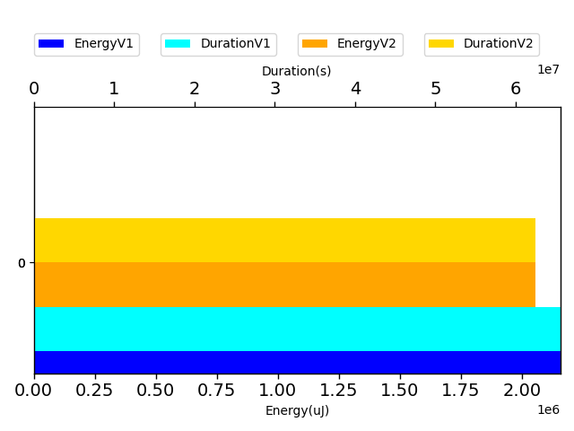
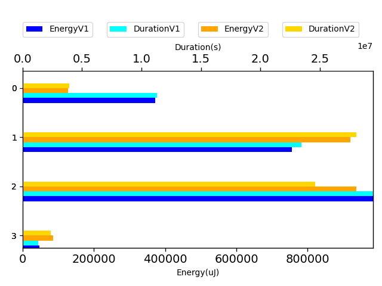

# gson 63ee47

https://github.com/google/gson.git/commit/63ee47

| Index | EnergyV1 | EnergyV2 | DeltaEnergy |
| --- | --- | --- | --- |
| 0 | 2158551.4769689683 | 1730875.1371434336 | -427676.3398255347 |

| Index | DurationV1 | DurationsV2 | DeltaDuration |
| --- | --- | --- | --- |
| 0 | 65583760.33463599 | 48135102.1628662 | -17448658.17176979 |

| Index | TestClassName | #Tests |
| --- | --- | --- |
| 0 | com.google.gson.functional.NamingPolicyTest | 4 |

| Time Label | Time (s) |
| --- | --- |
| Selection | 35.79667282104492 |
| Injection | 13.747212886810303 |
| Total | 1479.919359445572 |
## com.google.gson.functional.NamingPolicyTest

| Test | IterationV1 | IterationV2 | DeltaIteration |
| --- | --- | --- | --- |
| com.google.gson.functional.NamingPolicyTest-testGsonWithNonDefaultFieldNamingPolicySerialization | 56 | 54 | -2 |
| com.google.gson.functional.NamingPolicyTest-testGsonWithNonDefaultFieldNamingPolicyDeserialiation | 65 | 60 | -5 |
| com.google.gson.functional.NamingPolicyTest-testGsonWithUpperCamelCaseSpacesPolicySerialiation | 65 | 73 | 8 |
| com.google.gson.functional.NamingPolicyTest-testGsonWithUpperCamelCaseSpacesPolicyDeserialiation | 80 | 77 | -3 |

| Test | EnergyV1 | EnergyV2 | DeltaEnergy |
| --- | --- | --- | --- |
| com.google.gson.functional.NamingPolicyTest-testGsonWithNonDefaultFieldNamingPolicySerialization | 372235.6910781481 | 106483.97250722222 | -265751.7185709259 |
| com.google.gson.functional.NamingPolicyTest-testGsonWithNonDefaultFieldNamingPolicyDeserialiation | 755345.5682781294 | 768959.4401865394 | 13613.871908409987 |
| com.google.gson.functional.NamingPolicyTest-testGsonWithUpperCamelCaseSpacesPolicySerialiation | 983457.0562689378 | 783422.1971741647 | -200034.85909477307 |
| com.google.gson.functional.NamingPolicyTest-testGsonWithUpperCamelCaseSpacesPolicyDeserialiation | 47513.161343752945 | 72009.52727550735 | 24496.365931754408 |

| Test | DurationV1 | DurationsV2 | DeltaDuration |
| --- | --- | --- | --- |
| com.google.gson.functional.NamingPolicyTest-testGsonWithNonDefaultFieldNamingPolicySerialization | 11326231.834773147 | 3190734.7767716907 | -8135497.058001457 |
| com.google.gson.functional.NamingPolicyTest-testGsonWithNonDefaultFieldNamingPolicyDeserialiation | 23457318.228177484 | 22926697.63887556 | -530620.5893019252 |
| com.google.gson.functional.NamingPolicyTest-testGsonWithUpperCamelCaseSpacesPolicySerialiation | 29475836.130414948 | 20102665.977549076 | -9373170.152865872 |
| com.google.gson.functional.NamingPolicyTest-testGsonWithUpperCamelCaseSpacesPolicyDeserialiation | 1324374.1412704033 | 1915003.7696698657 | 590629.6283994624 |

