# gson 55acc2

https://github.com/google/gson.git/commit/55acc2

| Index | EnergyV1 | EnergyV2 | DeltaEnergy |
| --- | --- | --- | --- |
| 0 | 127606.07290322152 | 162966.75717619387 | 35360.68427297236 |
| 1 | 302259.4868532393 | 289542.71157447784 | -12716.775278761459 |
| 2 | 215500.5873027484 | 1210930.764598943 | 995430.1772961947 |
| 3 | 181372.17081142953 | 136958.1968660261 | -44413.97394540344 |
| 4 | 981132.9043639823 | 703664.7004319347 | -277468.2039320476 |
| 5 | 272210.62228706956 | 278579.4952947616 | 6368.873007692047 |
| 6 | 48306.72564387497 | 47414.11627676748 | -892.609367107485 |
| 7 | 244585.79883355473 | 174313.4291754077 | -70272.36965814701 |
| 8 | 268985.94547444995 | 174825.51882628666 | -94160.4266481633 |
| 9 | 263874.1886571683 | 476521.9118067492 | 212647.72314958088 |

| Index | DurationV1 | DurationsV2 | DeltaDuration |
| --- | --- | --- | --- |
| 0 | 3221724.6570950495 | 4203858.690337727 | 982134.0332426773 |
| 1 | 9017871.026423812 | 7177843.340259625 | -1840027.6861641873 |
| 2 | 5985069.202448525 | 33080358.06592111 | 27095288.863472585 |
| 3 | 4289936.119674342 | 3760424.729822079 | -529511.3898522626 |
| 4 | 29803014.29341398 | 19151832.28092666 | -10651182.012487322 |
| 5 | 7561437.37822487 | 7232197.532252206 | -329239.84597266465 |
| 6 | 2041972.927214275 | 1342985.1606126418 | -698987.7666016333 |
| 7 | 6522402.861449419 | 6091432.589675899 | -430970.2717735199 |
| 8 | 7020601.480399353 | 4489468.848581359 | -2531132.6318179946 |
| 9 | 5362467.099937854 | 12642003.9878659 | 7279536.887928046 |

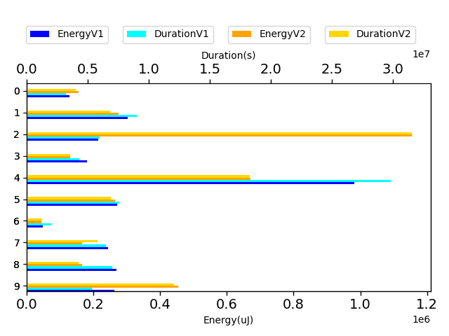

| Index | TestClassName | #Tests |
| --- | --- | --- |
| 0 | com.google.gson.functional.MapTest | 1 |
| 1 | com.google.gson.functional.InheritanceTest | 6 |
| 2 | com.google.gson.functional.MapAsArrayTypeAdapterTest | 3 |
| 3 | com.google.gson.functional.ExclusionStrategyFunctionalTest | 1 |
| 4 | com.google.gson.functional.CustomSerializerTest | 4 |
| 5 | com.google.gson.functional.JsonTreeTest | 4 |
| 6 | com.google.gson.DefaultMapJsonSerializerTest | 1 |
| 7 | com.google.gson.functional.MoreSpecificTypeSerializationTest | 2 |
| 8 | com.google.gson.functional.TypeHierarchyAdapterTest | 1 |
| 9 | com.google.gson.internal.bind.JsonTreeWriterTest | 4 |

| Time Label | Time (s) |
| --- | --- |
| Selection | 36.53723382949829 |
| Injection | 15.411620855331421 |
| Total | 1527.6261415481567 |
## com.google.gson.functional.MapTest

| Test | IterationV1 | IterationV2 | DeltaIteration |
| --- | --- | --- | --- |
| com.google.gson.functional.MapTest-testInterfaceTypeMapWithSerializer | 99 | 99 | 0 |

| Test | EnergyV1 | EnergyV2 | DeltaEnergy |
| --- | --- | --- | --- |
| com.google.gson.functional.MapTest-testInterfaceTypeMapWithSerializer | 127606.07290322152 | 162966.75717619387 | 35360.68427297236 |

| Test | DurationV1 | DurationsV2 | DeltaDuration |
| --- | --- | --- | --- |
| com.google.gson.functional.MapTest-testInterfaceTypeMapWithSerializer | 3221724.6570950495 | 4203858.690337727 | 982134.0332426773 |

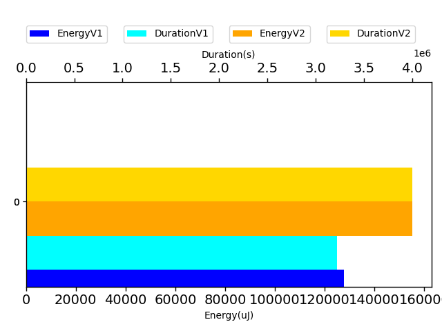

## com.google.gson.functional.InheritanceTest

| Test | IterationV1 | IterationV2 | DeltaIteration |
| --- | --- | --- | --- |
| com.google.gson.functional.InheritanceTest-testClassWithBaseArrayFieldSerialization | 86 | 92 | 6 |
| com.google.gson.functional.InheritanceTest-testBaseSerializedAsSub | 46 | 44 | -2 |
| com.google.gson.functional.InheritanceTest-testClassWithBaseCollectionFieldSerialization | 94 | 96 | 2 |
| com.google.gson.functional.InheritanceTest-testClassWithBaseFieldSerialization | 84 | 82 | -2 |
| com.google.gson.functional.InheritanceTest-testBaseSerializedAsSubWhenSpecifiedWithExplicitType | 43 | 40 | -3 |
| com.google.gson.functional.InheritanceTest-testBaseSerializedAsBaseWhenSpecifiedWithExplicitType | 31 | 50 | 19 |

| Test | EnergyV1 | EnergyV2 | DeltaEnergy |
| --- | --- | --- | --- |
| com.google.gson.functional.InheritanceTest-testClassWithBaseArrayFieldSerialization | 47180.282163644704 | 46126.015604465865 | -1054.266559178839 |
| com.google.gson.functional.InheritanceTest-testBaseSerializedAsSub | 35967.031826150414 | 42210.67025407487 | 6243.638427924452 |
| com.google.gson.functional.InheritanceTest-testClassWithBaseCollectionFieldSerialization | 45248.71428732449 | 47173.92807539961 | 1925.2137880751252 |
| com.google.gson.functional.InheritanceTest-testClassWithBaseFieldSerialization | 98468.02874972584 | 81084.5599563813 | -17383.46879334454 |
| com.google.gson.functional.InheritanceTest-testBaseSerializedAsSubWhenSpecifiedWithExplicitType | 36007.471383047385 | 34527.565176238735 | -1479.9062068086496 |
| com.google.gson.functional.InheritanceTest-testBaseSerializedAsBaseWhenSpecifiedWithExplicitType | 39387.95844334643 | 38419.97250791743 | -967.985935429002 |

| Test | DurationV1 | DurationsV2 | DeltaDuration |
| --- | --- | --- | --- |
| com.google.gson.functional.InheritanceTest-testClassWithBaseArrayFieldSerialization | 1622566.6419841922 | 1403526.151621101 | -219040.49036309123 |
| com.google.gson.functional.InheritanceTest-testBaseSerializedAsSub | 801121.1316563522 | 730836.3436572297 | -70284.78799912252 |
| com.google.gson.functional.InheritanceTest-testClassWithBaseCollectionFieldSerialization | 1859355.2106633957 | 1233905.882870283 | -625449.3277931127 |
| com.google.gson.functional.InheritanceTest-testClassWithBaseFieldSerialization | 3111051.397190949 | 2187212.0274632634 | -923839.3697276856 |
| com.google.gson.functional.InheritanceTest-testBaseSerializedAsSubWhenSpecifiedWithExplicitType | 806695.3073668794 | 851558.863879852 | 44863.55651297257 |
| com.google.gson.functional.InheritanceTest-testBaseSerializedAsBaseWhenSpecifiedWithExplicitType | 817081.3375620423 | 770804.0707678958 | -46277.266794146504 |

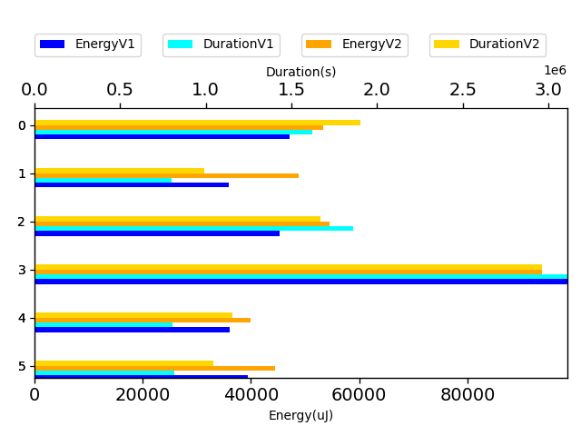

## com.google.gson.functional.MapAsArrayTypeAdapterTest

| Test | IterationV1 | IterationV2 | DeltaIteration |
| --- | --- | --- | --- |
| com.google.gson.functional.MapAsArrayTypeAdapterTest-testMultipleEnableComplexKeyRegistrationHasNoEffect | 96 | 95 | -1 |
| com.google.gson.functional.MapAsArrayTypeAdapterTest-testSerializeComplexMapWithTypeAdapter | 99 | 99 | 0 |
| com.google.gson.functional.MapAsArrayTypeAdapterTest-testMapWithTypeVariableSerialization | 99 | 99 | 0 |

| Test | EnergyV1 | EnergyV2 | DeltaEnergy |
| --- | --- | --- | --- |
| com.google.gson.functional.MapAsArrayTypeAdapterTest-testMultipleEnableComplexKeyRegistrationHasNoEffect | 46589.56367178823 | 149682.44687697833 | 103092.8832051901 |
| com.google.gson.functional.MapAsArrayTypeAdapterTest-testSerializeComplexMapWithTypeAdapter | 119993.62579160086 | 1011731.6848772616 | 891738.0590856607 |
| com.google.gson.functional.MapAsArrayTypeAdapterTest-testMapWithTypeVariableSerialization | 48917.397839359306 | 49516.6328447031 | 599.2350053437913 |

| Test | DurationV1 | DurationsV2 | DeltaDuration |
| --- | --- | --- | --- |
| com.google.gson.functional.MapAsArrayTypeAdapterTest-testMultipleEnableComplexKeyRegistrationHasNoEffect | 1307131.5619079997 | 4500807.991319442 | 3193676.4294114425 |
| com.google.gson.functional.MapAsArrayTypeAdapterTest-testSerializeComplexMapWithTypeAdapter | 3267359.962758605 | 26760006.48695311 | 23492646.524194505 |
| com.google.gson.functional.MapAsArrayTypeAdapterTest-testMapWithTypeVariableSerialization | 1410577.67778192 | 1819543.5876485584 | 408965.9098666385 |

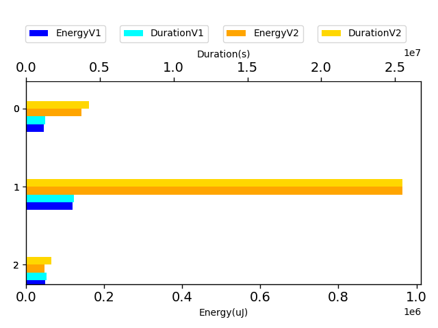

## com.google.gson.functional.ExclusionStrategyFunctionalTest

| Test | IterationV1 | IterationV2 | DeltaIteration |
| --- | --- | --- | --- |
| com.google.gson.functional.ExclusionStrategyFunctionalTest-testExclusionStrategyWithMode | 99 | 99 | 0 |

| Test | EnergyV1 | EnergyV2 | DeltaEnergy |
| --- | --- | --- | --- |
| com.google.gson.functional.ExclusionStrategyFunctionalTest-testExclusionStrategyWithMode | 181372.17081142953 | 136958.1968660261 | -44413.97394540344 |

| Test | DurationV1 | DurationsV2 | DeltaDuration |
| --- | --- | --- | --- |
| com.google.gson.functional.ExclusionStrategyFunctionalTest-testExclusionStrategyWithMode | 4289936.119674342 | 3760424.729822079 | -529511.3898522626 |

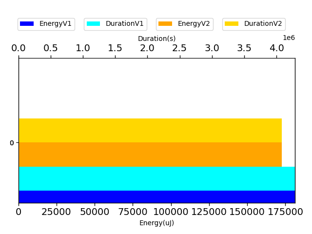

## com.google.gson.functional.CustomSerializerTest

| Test | IterationV1 | IterationV2 | DeltaIteration |
| --- | --- | --- | --- |
| com.google.gson.functional.CustomSerializerTest-testSubClassSerializerInvokedForBaseClassFieldsHoldingSubClassInstances | 79 | 73 | -6 |
| com.google.gson.functional.CustomSerializerTest-testBaseClassSerializerInvokedForBaseClassFieldsHoldingSubClassInstances | 65 | 62 | -3 |
| com.google.gson.functional.CustomSerializerTest-testSubClassSerializerInvokedForBaseClassFieldsHoldingArrayOfSubClassInstances | 73 | 68 | -5 |
| com.google.gson.functional.CustomSerializerTest-testBaseClassSerializerInvokedForBaseClassFields | 46 | 37 | -9 |

| Test | EnergyV1 | EnergyV2 | DeltaEnergy |
| --- | --- | --- | --- |
| com.google.gson.functional.CustomSerializerTest-testSubClassSerializerInvokedForBaseClassFieldsHoldingSubClassInstances | 862884.0474969692 | 555395.559997013 | -307488.4874999563 |
| com.google.gson.functional.CustomSerializerTest-testBaseClassSerializerInvokedForBaseClassFieldsHoldingSubClassInstances | 38718.09703714562 | 39634.75108924389 | 916.6540520982671 |
| com.google.gson.functional.CustomSerializerTest-testSubClassSerializerInvokedForBaseClassFieldsHoldingArrayOfSubClassInstances | 37499.14218572851 | 68037.97437551309 | 30538.83218978458 |
| com.google.gson.functional.CustomSerializerTest-testBaseClassSerializerInvokedForBaseClassFields | 42031.61764413885 | 40596.414970164726 | -1435.2026739741268 |

| Test | DurationV1 | DurationsV2 | DeltaDuration |
| --- | --- | --- | --- |
| com.google.gson.functional.CustomSerializerTest-testSubClassSerializerInvokedForBaseClassFieldsHoldingSubClassInstances | 26471102.952080764 | 15908305.61618412 | -10562797.335896645 |
| com.google.gson.functional.CustomSerializerTest-testBaseClassSerializerInvokedForBaseClassFieldsHoldingSubClassInstances | 1126729.5290091955 | 927326.9123462134 | -199402.61666298215 |
| com.google.gson.functional.CustomSerializerTest-testSubClassSerializerInvokedForBaseClassFieldsHoldingArrayOfSubClassInstances | 1360400.2027684974 | 1470525.3400777224 | 110125.13730922504 |
| com.google.gson.functional.CustomSerializerTest-testBaseClassSerializerInvokedForBaseClassFields | 844781.6095555243 | 845674.4123186041 | 892.8027630797587 |

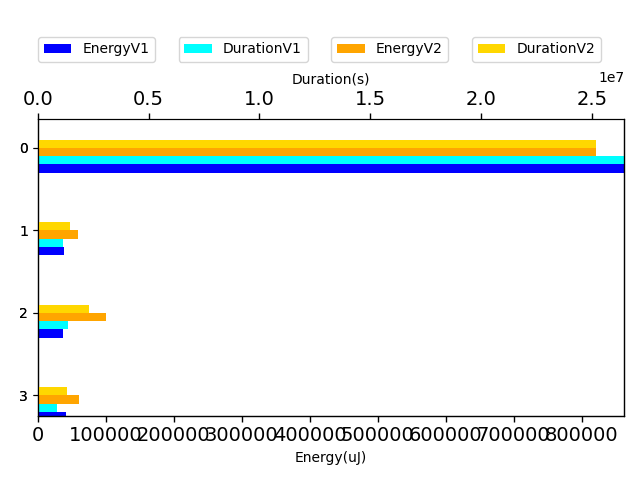

## com.google.gson.functional.JsonTreeTest

| Test | IterationV1 | IterationV2 | DeltaIteration |
| --- | --- | --- | --- |
| com.google.gson.functional.JsonTreeTest-testJsonTreeToString | 99 | 99 | 0 |
| com.google.gson.functional.JsonTreeTest-testToJsonTreeObjectType | 83 | 85 | 2 |
| com.google.gson.functional.JsonTreeTest-testToJsonTree | 99 | 99 | 0 |
| com.google.gson.functional.JsonTreeTest-testJsonTreeNull | 62 | 65 | 3 |

| Test | EnergyV1 | EnergyV2 | DeltaEnergy |
| --- | --- | --- | --- |
| com.google.gson.functional.JsonTreeTest-testJsonTreeToString | 105451.2753858869 | 122351.6111233727 | 16900.335737485802 |
| com.google.gson.functional.JsonTreeTest-testToJsonTreeObjectType | 40779.615230333395 | 42383.672794485705 | 1604.05756415231 |
| com.google.gson.functional.JsonTreeTest-testToJsonTree | 82733.44658064962 | 73642.15694162305 | -9091.289639026567 |
| com.google.gson.functional.JsonTreeTest-testJsonTreeNull | 43246.28509019962 | 40202.05443528013 | -3044.230654919491 |

| Test | DurationV1 | DurationsV2 | DeltaDuration |
| --- | --- | --- | --- |
| com.google.gson.functional.JsonTreeTest-testJsonTreeToString | 3129919.0212688204 | 3151101.6322936164 | 21182.61102479603 |
| com.google.gson.functional.JsonTreeTest-testToJsonTreeObjectType | 1190808.8611806296 | 1239790.61780334 | 48981.7566227105 |
| com.google.gson.functional.JsonTreeTest-testToJsonTree | 2284009.968175282 | 1899587.2727649987 | -384422.69541028305 |
| com.google.gson.functional.JsonTreeTest-testJsonTreeNull | 956699.5276001388 | 941718.0093902503 | -14981.518209888483 |

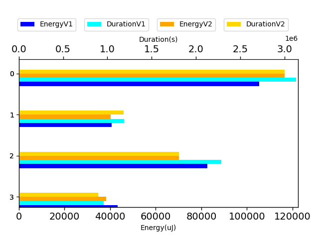

## com.google.gson.DefaultMapJsonSerializerTest

| Test | IterationV1 | IterationV2 | DeltaIteration |
| --- | --- | --- | --- |
| com.google.gson.DefaultMapJsonSerializerTest-testNonEmptyMapSerialization | 76 | 81 | 5 |

| Test | EnergyV1 | EnergyV2 | DeltaEnergy |
| --- | --- | --- | --- |
| com.google.gson.DefaultMapJsonSerializerTest-testNonEmptyMapSerialization | 48306.72564387497 | 47414.11627676748 | -892.609367107485 |

| Test | DurationV1 | DurationsV2 | DeltaDuration |
| --- | --- | --- | --- |
| com.google.gson.DefaultMapJsonSerializerTest-testNonEmptyMapSerialization | 2041972.927214275 | 1342985.1606126418 | -698987.7666016333 |

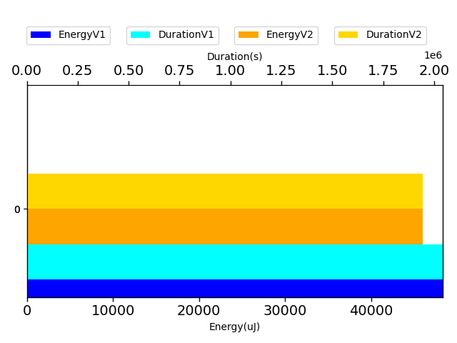

## com.google.gson.functional.MoreSpecificTypeSerializationTest

| Test | IterationV1 | IterationV2 | DeltaIteration |
| --- | --- | --- | --- |
| com.google.gson.functional.MoreSpecificTypeSerializationTest-testMapOfParameterizedSubclassFields | 99 | 99 | 0 |
| com.google.gson.functional.MoreSpecificTypeSerializationTest-testMapOfSubclassFields | 99 | 99 | 0 |

| Test | EnergyV1 | EnergyV2 | DeltaEnergy |
| --- | --- | --- | --- |
| com.google.gson.functional.MoreSpecificTypeSerializationTest-testMapOfParameterizedSubclassFields | 73265.83369600412 | 38592.15127637014 | -34673.68241963398 |
| com.google.gson.functional.MoreSpecificTypeSerializationTest-testMapOfSubclassFields | 171319.9651375506 | 135721.27789903758 | -35598.68723851303 |

| Test | DurationV1 | DurationsV2 | DeltaDuration |
| --- | --- | --- | --- |
| com.google.gson.functional.MoreSpecificTypeSerializationTest-testMapOfParameterizedSubclassFields | 1680066.296325889 | 1736818.2774304065 | 56751.98110451759 |
| com.google.gson.functional.MoreSpecificTypeSerializationTest-testMapOfSubclassFields | 4842336.56512353 | 4354614.312245492 | -487722.2528780382 |

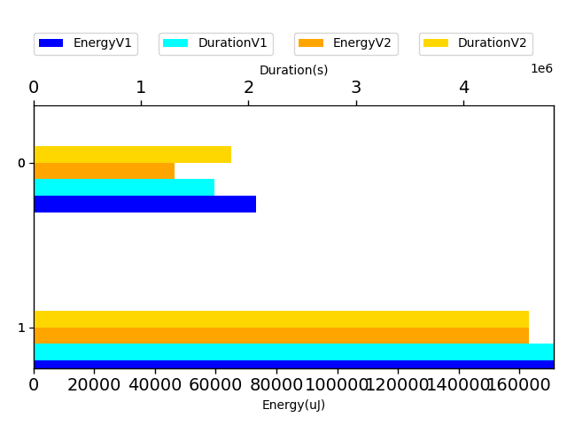

## com.google.gson.functional.TypeHierarchyAdapterTest

| Test | IterationV1 | IterationV2 | DeltaIteration |
| --- | --- | --- | --- |
| com.google.gson.functional.TypeHierarchyAdapterTest-testTypeHierarchy | 99 | 99 | 0 |

| Test | EnergyV1 | EnergyV2 | DeltaEnergy |
| --- | --- | --- | --- |
| com.google.gson.functional.TypeHierarchyAdapterTest-testTypeHierarchy | 268985.94547444995 | 174825.51882628666 | -94160.4266481633 |

| Test | DurationV1 | DurationsV2 | DeltaDuration |
| --- | --- | --- | --- |
| com.google.gson.functional.TypeHierarchyAdapterTest-testTypeHierarchy | 7020601.480399353 | 4489468.848581359 | -2531132.6318179946 |

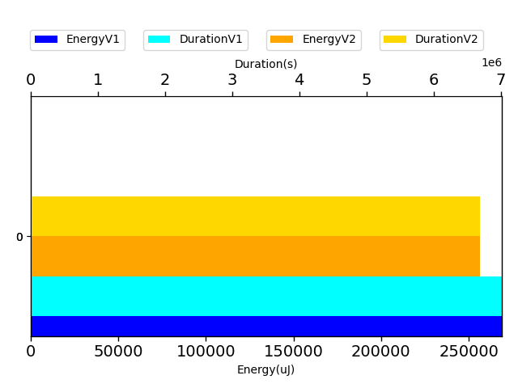

## com.google.gson.internal.bind.JsonTreeWriterTest

| Test | IterationV1 | IterationV2 | DeltaIteration |
| --- | --- | --- | --- |
| com.google.gson.internal.bind.JsonTreeWriterTest-testSerializeNullsTrue | 28 | 23 | -5 |
| com.google.gson.internal.bind.JsonTreeWriterTest-testNestedObject | 27 | 25 | -2 |
| com.google.gson.internal.bind.JsonTreeWriterTest-testObject | 23 | 29 | 6 |
| com.google.gson.internal.bind.JsonTreeWriterTest-testSerializeNullsFalse | 31 | 24 | -7 |

| Test | EnergyV1 | EnergyV2 | DeltaEnergy |
| --- | --- | --- | --- |
| com.google.gson.internal.bind.JsonTreeWriterTest-testSerializeNullsTrue | 44551.99365577102 | 40533.43682050705 | -4018.5568352639675 |
| com.google.gson.internal.bind.JsonTreeWriterTest-testNestedObject | 38380.26934938133 | 42972.28469401598 | 4592.015344634652 |
| com.google.gson.internal.bind.JsonTreeWriterTest-testObject | 137838.31852698326 | 220469.4702672828 | 82631.15174029954 |
| com.google.gson.internal.bind.JsonTreeWriterTest-testSerializeNullsFalse | 43103.60712503269 | 172546.72002494335 | 129443.11289991066 |

| Test | DurationV1 | DurationsV2 | DeltaDuration |
| --- | --- | --- | --- |
| com.google.gson.internal.bind.JsonTreeWriterTest-testSerializeNullsTrue | 493005.6230784431 | 519000.6514379978 | 25995.028359554708 |
| com.google.gson.internal.bind.JsonTreeWriterTest-testNestedObject | 558139.885032475 | 642236.8595988154 | 84096.97456634045 |
| com.google.gson.internal.bind.JsonTreeWriterTest-testObject | 3595751.929226637 | 6393543.958679592 | 2797792.0294529554 |
| com.google.gson.internal.bind.JsonTreeWriterTest-testSerializeNullsFalse | 715569.6626002993 | 5087222.518149495 | 4371652.855549196 |

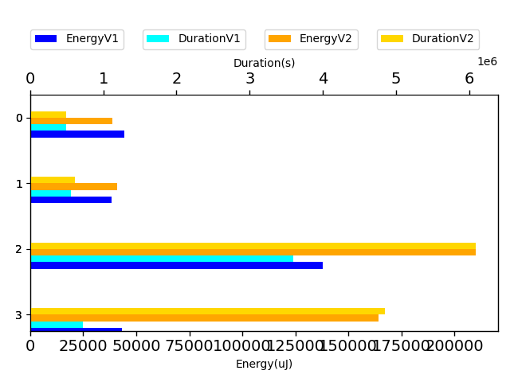

