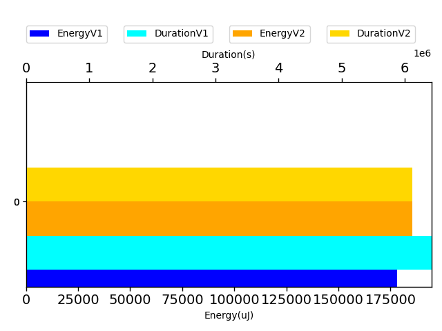
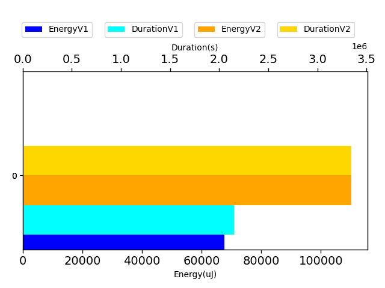
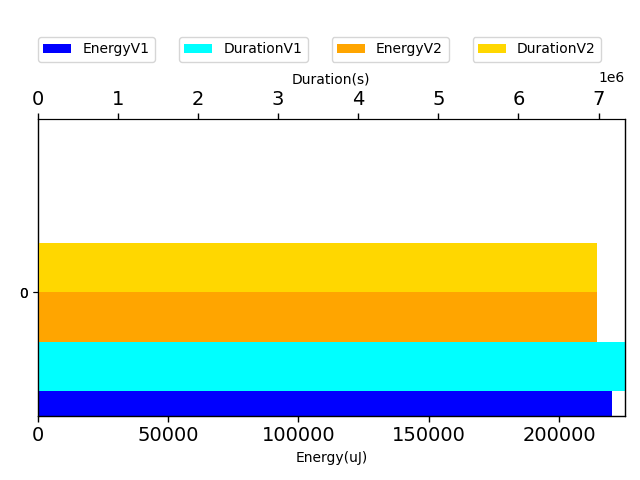
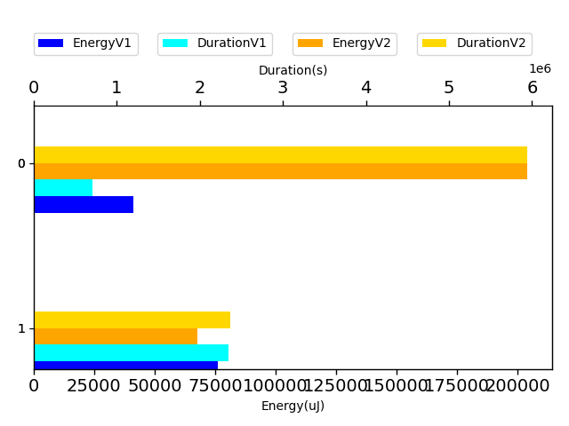
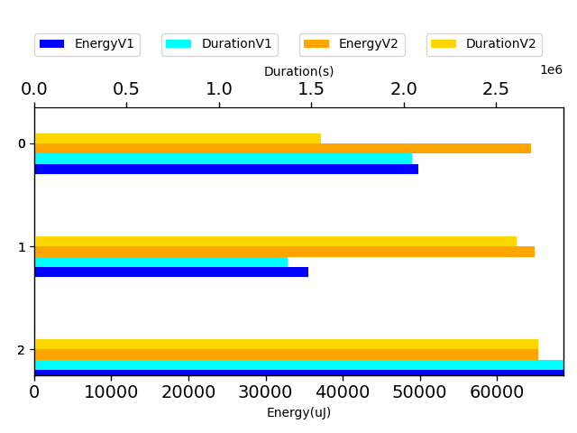
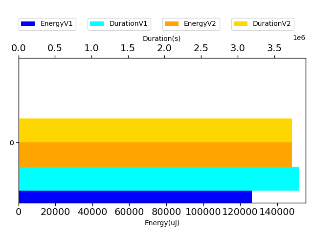
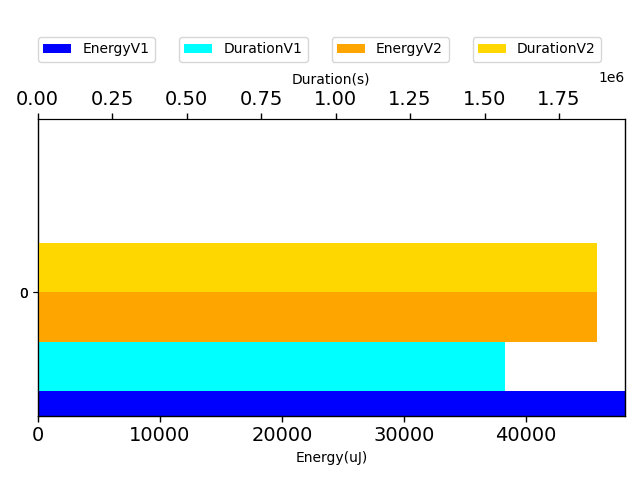
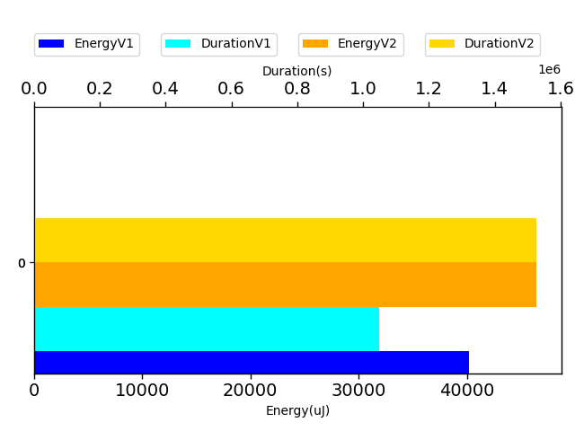

# gson 3ee3c1

https://github.com/google/gson.git/commit/3ee3c1

| Index | EnergyV1 | EnergyV2 | DeltaEnergy |
| --- | --- | --- | --- |
| 0 | 178222.26935014012 | 194757.19835396812 | 16534.929003828 |
| 1 | 67651.47498581944 | 115633.63356021294 | 47982.1585743935 |
| 2 | 220175.73920435796 | 225227.80792934418 | 5052.068724986224 |
| 3 | 117535.72669960224 | 285282.07017687394 | 167746.3434772717 |
| 4 | 153964.41113021853 | 113909.12289921875 | -40055.28823099978 |
| 5 | 126333.38047315108 | 155385.17486885673 | 29051.794395705656 |
| 6 | 48112.00905700865 | 41090.8674031113 | -7021.14165389735 |
| 7 | 40160.30577137759 | 48735.245744330474 | 8574.939972952881 |

| Index | DurationV1 | DurationsV2 | DeltaDuration |
| --- | --- | --- | --- |
| 0 | 6423868.323156256 | 6364444.507161744 | -59423.81599451229 |
| 1 | 2150883.7518621697 | 3510700.644762365 | 1359816.8929001954 |
| 2 | 7330017.927789634 | 6815130.3013559375 | -514887.6264336966 |
| 3 | 3059305.24041505 | 8732857.105137752 | 5673551.864722703 |
| 4 | 6279811.480561908 | 3120483.958824302 | -3159327.5217376063 |
| 5 | 3845521.329018645 | 3931215.462595208 | 85694.1335765631 |
| 6 | 1570348.6580159809 | 1971644.100752403 | 401295.4427364222 |
| 7 | 1047664.4472032728 | 1602766.4685717195 | 555102.0213684466 |

| Index | TestClassName | #Tests |
| --- | --- | --- |
| 0 | com.google.gson.functional.ReadersWritersTest | 1 |
| 1 | com.google.gson.JsonParserTest | 1 |
| 2 | com.google.gson.internal.bind.JsonElementReaderTest | 1 |
| 3 | com.google.gson.functional.JsonArrayTest | 2 |
| 4 | com.google.gson.JsonObjectTest | 3 |
| 5 | com.google.gson.functional.JsonTreeTest | 1 |
| 6 | com.google.gson.JsonPrimitiveTest | 1 |
| 7 | com.google.gson.functional.DefaultTypeAdaptersTest | 1 |

| Time Label | Time (s) |
| --- | --- |
| Selection | 36.01683735847473 |
| Injection | 14.457077503204346 |
| Total | 1508.1157228946686 |
## com.google.gson.functional.ReadersWritersTest

| Test | IterationV1 | IterationV2 | DeltaIteration |
| --- | --- | --- | --- |
| com.google.gson.functional.ReadersWritersTest-testReadWriteTwoObjects | 99 | 99 | 0 |

| Test | EnergyV1 | EnergyV2 | DeltaEnergy |
| --- | --- | --- | --- |
| com.google.gson.functional.ReadersWritersTest-testReadWriteTwoObjects | 178222.26935014012 | 194757.19835396812 | 16534.929003828 |

| Test | DurationV1 | DurationsV2 | DeltaDuration |
| --- | --- | --- | --- |
| com.google.gson.functional.ReadersWritersTest-testReadWriteTwoObjects | 6423868.323156256 | 6364444.507161744 | -59423.81599451229 |

## com.google.gson.JsonParserTest

| Test | IterationV1 | IterationV2 | DeltaIteration |
| --- | --- | --- | --- |
| com.google.gson.JsonParserTest-testReadWriteTwoObjects | 98 | 96 | -2 |

| Test | EnergyV1 | EnergyV2 | DeltaEnergy |
| --- | --- | --- | --- |
| com.google.gson.JsonParserTest-testReadWriteTwoObjects | 67651.47498581944 | 115633.63356021294 | 47982.1585743935 |

| Test | DurationV1 | DurationsV2 | DeltaDuration |
| --- | --- | --- | --- |
| com.google.gson.JsonParserTest-testReadWriteTwoObjects | 2150883.7518621697 | 3510700.644762365 | 1359816.8929001954 |

## com.google.gson.internal.bind.JsonElementReaderTest

| Test | IterationV1 | IterationV2 | DeltaIteration |
| --- | --- | --- | --- |
| com.google.gson.internal.bind.JsonElementReaderTest-testBooleans | 54 | 47 | -7 |

| Test | EnergyV1 | EnergyV2 | DeltaEnergy |
| --- | --- | --- | --- |
| com.google.gson.internal.bind.JsonElementReaderTest-testBooleans | 220175.73920435796 | 225227.80792934418 | 5052.068724986224 |

| Test | DurationV1 | DurationsV2 | DeltaDuration |
| --- | --- | --- | --- |
| com.google.gson.internal.bind.JsonElementReaderTest-testBooleans | 7330017.927789634 | 6815130.3013559375 | -514887.6264336966 |

## com.google.gson.functional.JsonArrayTest

| Test | IterationV1 | IterationV2 | DeltaIteration |
| --- | --- | --- | --- |
| com.google.gson.functional.JsonArrayTest-testBooleanPrimitiveAddition | 36 | 47 | 11 |
| com.google.gson.functional.JsonArrayTest-testSameAddition | 70 | 72 | 2 |

| Test | EnergyV1 | EnergyV2 | DeltaEnergy |
| --- | --- | --- | --- |
| com.google.gson.functional.JsonArrayTest-testBooleanPrimitiveAddition | 41312.455628607786 | 214156.9797016232 | 172844.52407301543 |
| com.google.gson.functional.JsonArrayTest-testSameAddition | 76223.27107099445 | 71125.09047525073 | -5098.180595743717 |

| Test | DurationV1 | DurationsV2 | DeltaDuration |
| --- | --- | --- | --- |
| com.google.gson.functional.JsonArrayTest-testBooleanPrimitiveAddition | 709757.9210986904 | 6241468.3931101635 | 5531710.472011473 |
| com.google.gson.functional.JsonArrayTest-testSameAddition | 2349547.3193163597 | 2491388.7120275893 | 141841.39271122962 |

## com.google.gson.JsonObjectTest

| Test | IterationV1 | IterationV2 | DeltaIteration |
| --- | --- | --- | --- |
| com.google.gson.JsonObjectTest-testReadPropertyWithEmptyStringName | 48 | 53 | 5 |
| com.google.gson.JsonObjectTest-testWritePropertyWithEmptyStringName | 49 | 53 | 4 |
| com.google.gson.JsonObjectTest-testAddingBooleanProperties | 49 | 50 | 1 |

| Test | EnergyV1 | EnergyV2 | DeltaEnergy |
| --- | --- | --- | --- |
| com.google.gson.JsonObjectTest-testReadPropertyWithEmptyStringName | 49805.15726194061 | 37684.196710134274 | -12120.960551806333 |
| com.google.gson.JsonObjectTest-testWritePropertyWithEmptyStringName | 35545.031810476445 | 37975.43231847286 | 2430.4005079964118 |
| com.google.gson.JsonObjectTest-testAddingBooleanProperties | 68614.2220578015 | 38249.49387061162 | -30364.728187189874 |

| Test | DurationV1 | DurationsV2 | DeltaDuration |
| --- | --- | --- | --- |
| com.google.gson.JsonObjectTest-testReadPropertyWithEmptyStringName | 2043567.9621831737 | 702796.7412090164 | -1340771.2209741573 |
| com.google.gson.JsonObjectTest-testWritePropertyWithEmptyStringName | 1372759.7219671947 | 1181930.427135222 | -190829.2948319728 |
| com.google.gson.JsonObjectTest-testAddingBooleanProperties | 2863483.7964115404 | 1235756.7904800638 | -1627727.0059314766 |

## com.google.gson.functional.JsonTreeTest

| Test | IterationV1 | IterationV2 | DeltaIteration |
| --- | --- | --- | --- |
| com.google.gson.functional.JsonTreeTest-testJsonTreeToString | 99 | 99 | 0 |

| Test | EnergyV1 | EnergyV2 | DeltaEnergy |
| --- | --- | --- | --- |
| com.google.gson.functional.JsonTreeTest-testJsonTreeToString | 126333.38047315108 | 155385.17486885673 | 29051.794395705656 |

| Test | DurationV1 | DurationsV2 | DeltaDuration |
| --- | --- | --- | --- |
| com.google.gson.functional.JsonTreeTest-testJsonTreeToString | 3845521.329018645 | 3931215.462595208 | 85694.1335765631 |

## com.google.gson.JsonPrimitiveTest

| Test | IterationV1 | IterationV2 | DeltaIteration |
| --- | --- | --- | --- |
| com.google.gson.JsonPrimitiveTest-testBoolean | 39 | 38 | -1 |

| Test | EnergyV1 | EnergyV2 | DeltaEnergy |
| --- | --- | --- | --- |
| com.google.gson.JsonPrimitiveTest-testBoolean | 48112.00905700865 | 41090.8674031113 | -7021.14165389735 |

| Test | DurationV1 | DurationsV2 | DeltaDuration |
| --- | --- | --- | --- |
| com.google.gson.JsonPrimitiveTest-testBoolean | 1570348.6580159809 | 1971644.100752403 | 401295.4427364222 |

## com.google.gson.functional.DefaultTypeAdaptersTest

| Test | IterationV1 | IterationV2 | DeltaIteration |
| --- | --- | --- | --- |
| com.google.gson.functional.DefaultTypeAdaptersTest-testJsonPrimitiveSerialization | 56 | 53 | -3 |

| Test | EnergyV1 | EnergyV2 | DeltaEnergy |
| --- | --- | --- | --- |
| com.google.gson.functional.DefaultTypeAdaptersTest-testJsonPrimitiveSerialization | 40160.30577137759 | 48735.245744330474 | 8574.939972952881 |

| Test | DurationV1 | DurationsV2 | DeltaDuration |
| --- | --- | --- | --- |
| com.google.gson.functional.DefaultTypeAdaptersTest-testJsonPrimitiveSerialization | 1047664.4472032728 | 1602766.4685717195 | 555102.0213684466 |

