# gson 8bf294

https://github.com/google/gson.git/commit/8bf294

## Delta Energy per test method

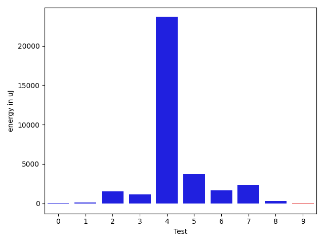

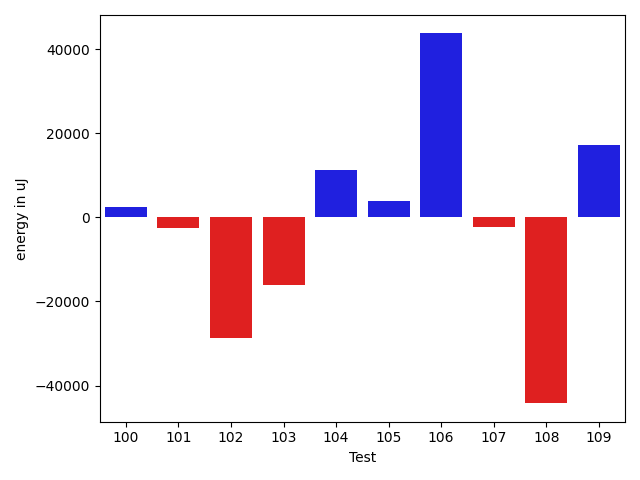

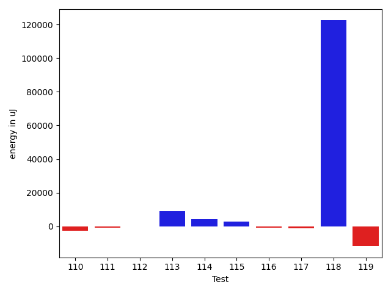

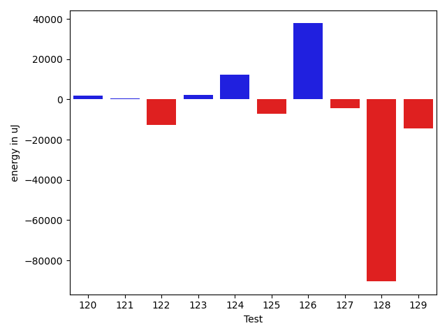

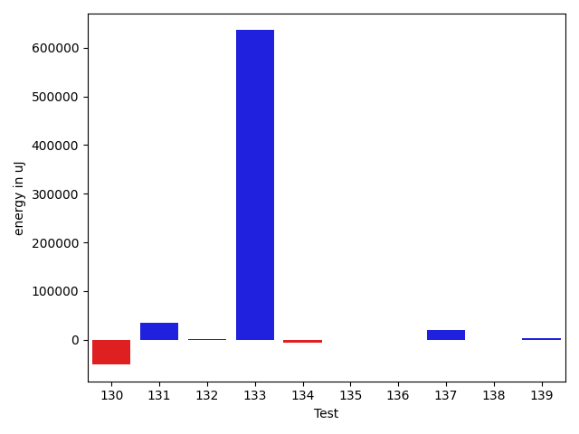

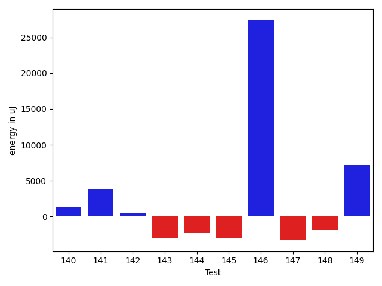

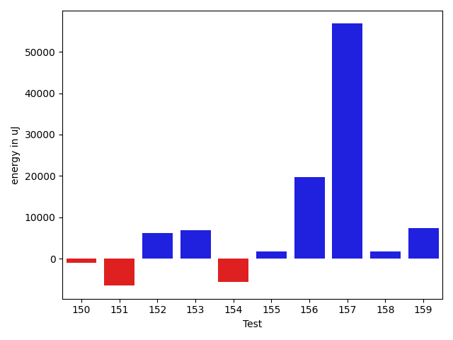

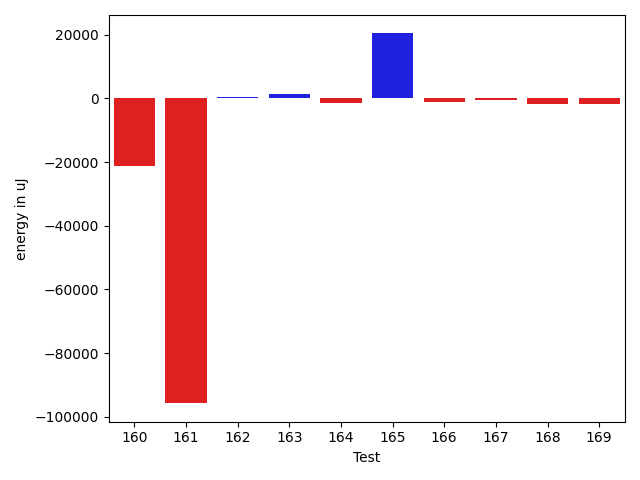

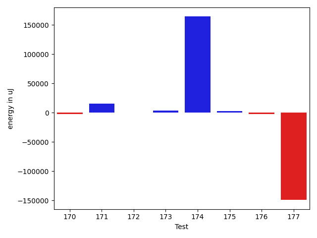

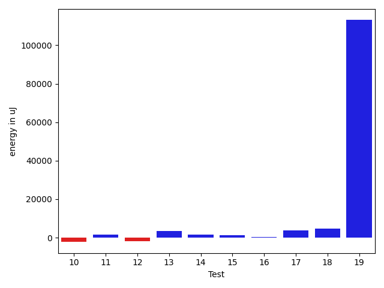

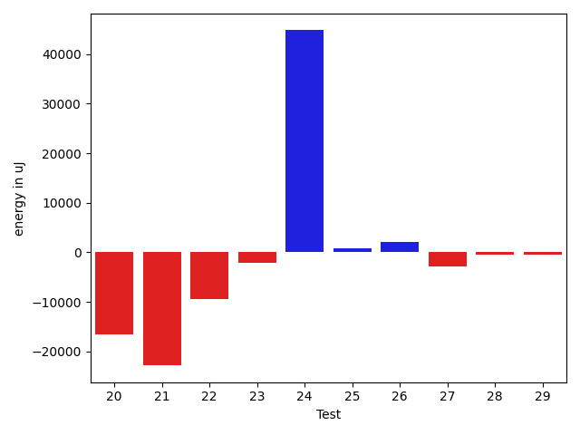

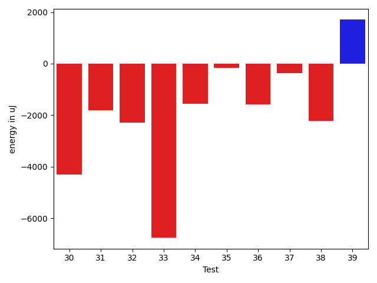

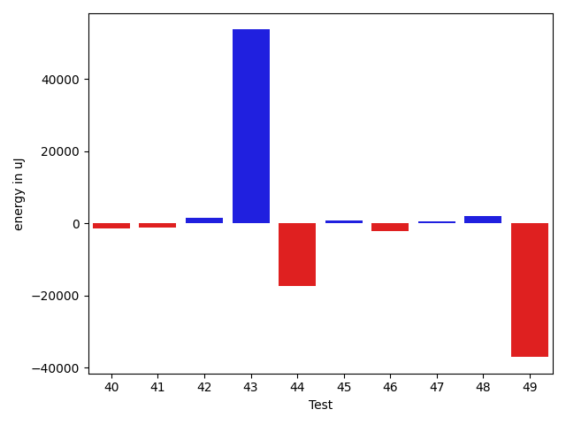

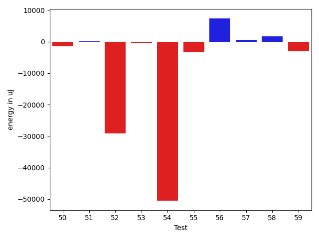

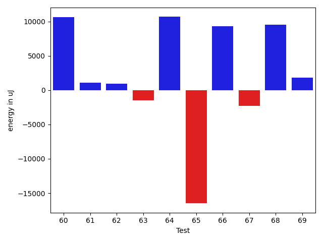

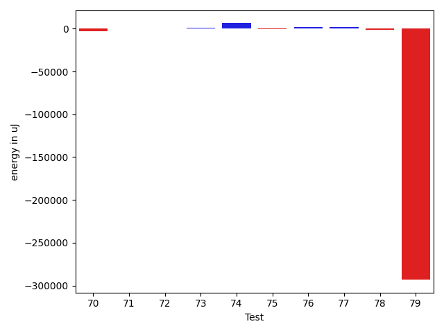

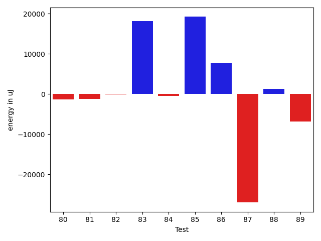

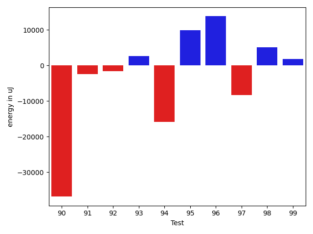

| ID | EnergyV1 | EnergyV2 | DeltaEnergy |
| --- | --- | --- | --- |
| 0 | 44283.66951873498 | 44313.22820084024 | 29.558682105256594 |
| 1 | 44494.362931305346 | 44589.60414175736 | 95.24121045201173 |
| 2 | 43634.1407057127 | 45137.81354554822 | 1503.672839835519 |
| 3 | 42477.620801232595 | 43637.47849061609 | 1159.857689383498 |
| 4 | 41377.296741690836 | 65048.054289853346 | 23670.75754816251 |
| 5 | 40777.48483809634 | 44448.98876597978 | 3671.5039278834447 |
| 6 | 43328.76924657078 | 44941.84949120882 | 1613.0802446380403 |
| 7 | 41913.32176149381 | 44250.70671452651 | 2337.384953032699 |
| 8 | 42516.804593454464 | 42781.37165319272 | 264.5670597382559 |
| 9 | 41246.36265128812 | 41138.06372819882 | -108.29892308929993 |
| 10 | 45359.648541755974 | 43123.784188803285 | -2235.864352952689 |
| 11 | 43516.25461719162 | 45096.484503533386 | 1580.2298863417673 |
| 12 | 42469.11696555477 | 40634.51363273234 | -1834.6033328224294 |
| 13 | 42279.213408954165 | 45753.09074620192 | 3473.8773372477517 |
| 14 | 41985.073949914615 | 43648.03462095965 | 1662.9606710450316 |
| 15 | 41811.91250697444 | 42968.90414900781 | 1156.9916420333684 |
| 16 | 43138.31211547571 | 43476.73252299777 | 338.4204075220623 |
| 17 | 41373.39863780964 | 45194.34408860619 | 3820.9454507965493 |
| 18 | 44552.41574529365 | 49254.68020445448 | 4702.264459160833 |
| 19 | 94795.00459816406 | 207864.95003897467 | 113069.94544081061 |
| 20 | 108698.26975842775 | 92104.63162461475 | -16593.638133813 |
| 21 | 77681.94233179117 | 54825.08980409075 | -22856.852527700423 |
| 22 | 89171.3568931099 | 79650.08305261089 | -9521.273840499009 |
| 23 | 45043.66424560547 | 42924.538009643555 | -2119.126235961914 |
| 24 | 44686.687408447266 | 89515.26428222656 | 44828.5768737793 |
| 25 | 41829.613561468606 | 42600.3981079855 | 770.7845465168939 |
| 26 | 42035.73370361328 | 44124.01220703125 | 2088.2785034179688 |
| 27 | 44697.92453765869 | 41782.32214355469 | -2915.602394104004 |
| 28 | 41919.1671769619 | 41368.15006304285 | -551.0171139190497 |
| 29 | 43996.71584969759 | 43478.498962402344 | -518.2168872952461 |
| 30 | 44950.848717292276 | 40650.176089178145 | -4300.672628114131 |
| 31 | 42883.95458984375 | 41083.39404296875 | -1800.560546875 |
| 32 | 42757.42654132843 | 40460.840383410454 | -2296.5861579179764 |
| 33 | 46143.677365116775 | 39388.33694458008 | -6755.340420536697 |
| 34 | 44794.6640625 | 43244.605686187744 | -1550.0583763122559 |
| 35 | 42905.2041015625 | 42736.9296875 | -168.2744140625 |
| 36 | 43045.9072933197 | 41463.70076751709 | -1582.2065258026123 |
| 37 | 42681.67822265625 | 42317.93765258789 | -363.7405700683594 |
| 38 | 42250.46813964844 | 40028.12109375 | -2222.3470458984375 |
| 39 | 41739.57231140137 | 43444.0068359375 | 1704.4345245361328 |
| 40 | 43081.482421875 | 41750.392578125 | -1331.08984375 |
| 41 | 45438.68603515625 | 44281.83459472656 | -1156.8514404296875 |
| 42 | 41639.06787109375 | 43175.203125 | 1536.13525390625 |
| 43 | 42259.4921875 | 95914.9174194336 | 53655.425231933594 |
| 44 | 60047.600158691406 | 42781.260498046875 | -17266.33966064453 |
| 45 | 43424.37335205078 | 44337.37403869629 | 913.0006866455078 |
| 46 | 44523.0625 | 42382.7734375 | -2140.2890625 |
| 47 | 44940.52716845274 | 45610.66467285156 | 670.1375043988228 |
| 48 | 41342.6217956543 | 43284.965980529785 | 1942.3441848754883 |
| 49 | 88633.97594275139 | 51600.78182601929 | -37033.194116732106 |
| 50 | 46641.05069684982 | 45160.00680426508 | -1481.0438925847411 |
| 51 | 43407.08267197619 | 43452.32523419708 | 45.24256222089025 |
| 52 | 71504.05257892609 | 42315.298723220825 | -29188.75385570526 |
| 53 | 44075.58509159088 | 43697.04109477997 | -378.5439968109131 |
| 54 | 95207.74231605977 | 44661.488899990916 | -50546.25341606885 |
| 55 | 45966.57668149471 | 42549.873037815094 | -3416.703643679619 |
| 56 | 39299.20654296875 | 46740.76025390625 | 7441.5537109375 |
| 57 | 43380.5625 | 43998.019273757935 | 617.4567737579346 |
| 58 | 41343.82626706362 | 43022.84442305565 | 1679.018155992031 |
| 59 | 44557.22953414917 | 41574.919189453125 | -2982.310344696045 |
| 60 | 47083.575866181935 | 57687.98375421272 | 10604.407888030786 |
| 61 | 49377.95159347357 | 50473.2482819132 | 1095.29668843963 |
| 62 | 57595.85901577922 | 58539.29275208949 | 943.4337363102677 |
| 63 | 42396.89852155214 | 40943.51108667457 | -1453.3874348775716 |
| 64 | 43493.626536318436 | 54161.23232123971 | 10667.605784921274 |
| 65 | 109906.03799060234 | 93426.36225826657 | -16479.675732335774 |
| 66 | 44053.82526116279 | 53397.47278198626 | 9343.64752082347 |
| 67 | 41046.301907777786 | 38756.72769653797 | -2289.5742112398148 |
| 68 | 62444.95118711043 | 71969.4203641183 | 9524.469177007864 |
| 69 | 41545.799451828 | 43364.23084521294 | 1818.4313933849335 |
| 70 | 42483.0801820755 | 39594.8466796875 | -2888.2335023880005 |
| 71 | 42174.50341796875 | 42415.6806640625 | 241.17724609375 |
| 72 | 38688.8671875 | 39043.451919555664 | 354.58473205566406 |
| 73 | 42577.73447224498 | 43785.15188694 | 1207.4174146950245 |
| 74 | 37737.236389160156 | 44182.16369628906 | 6444.927307128906 |
| 75 | 45935.59812780304 | 45185.90347800881 | -749.6946497942263 |
| 76 | 42646.26291823387 | 44399.59168624878 | 1753.3287680149078 |
| 77 | 42528.74856185913 | 44736.34342157841 | 2207.5948597192764 |
| 78 | 42589.217529296875 | 41286.84022521973 | -1302.3773040771484 |
| 79 | 339693.77124677226 | 46398.80298042297 | -293294.9682663493 |
| 80 | 44355.275939941406 | 43065.433490753174 | -1289.8424491882324 |
| 81 | 44256.28173828125 | 43050.73046875 | -1205.55126953125 |
| 82 | 40432.15934897191 | 40334.37733394381 | -97.7820150280968 |
| 83 | 71864.76791689626 | 90046.51780766418 | 18181.74989076791 |
| 84 | 40829.82072423728 | 40376.59102299509 | -453.22970124219137 |
| 85 | 45442.95829257451 | 64689.02049650004 | 19246.062203925525 |
| 86 | 46347.68534915986 | 54185.78970102371 | 7838.104351863847 |
| 87 | 79904.90917168868 | 52925.82112938667 | -26979.088042302006 |
| 88 | 40174.0050633342 | 41514.4365226651 | 1340.4314593308954 |
| 89 | 47777.91669613976 | 40985.60991341146 | -6792.306782728294 |
| 90 | 79864.69567233493 | 43010.50747481559 | -36854.18819751934 |
| 91 | 43630.665222074924 | 41283.02392133821 | -2347.6413007367155 |
| 92 | 43877.279853878004 | 42225.52467683176 | -1651.755177046245 |
| 93 | 40207.11889159484 | 42845.88345405065 | 2638.7645624558136 |
| 94 | 137052.4572695378 | 121212.55489889883 | -15839.902370638956 |
| 95 | 42370.46589072775 | 52349.29671084437 | 9978.830820116622 |
| 96 | 47076.06404088142 | 60911.28737472178 | 13835.22333384036 |
| 97 | 61869.62458179335 | 53515.608078292265 | -8354.016503501087 |
| 98 | 41688.32142803073 | 46871.70296668634 | 5183.381538655609 |
| 99 | 42932.51334564225 | 44837.67386411922 | 1905.1605184769724 |
| 100 | 39845.2255012691 | 42381.9616394043 | 2536.736138135195 |
| 101 | 42907.63486102843 | 40312.36521806987 | -2595.269642958563 |
| 102 | 72129.52185970402 | 43507.80219257075 | -28621.71966713327 |
| 103 | 134832.44675727762 | 118651.49081782791 | -16180.955939449705 |
| 104 | 41950.72137581192 | 53221.487254399806 | 11270.765878587888 |
| 105 | 42920.19987088803 | 46851.097523631404 | 3930.897652743377 |
| 106 | 64583.883699273625 | 108321.28755265106 | 43737.40385337744 |
| 107 | 43698.36005298332 | 41364.549020841376 | -2333.8110321419445 |
| 108 | 237451.06904999382 | 193255.70301766964 | -44195.36603232418 |
| 109 | 69885.59358044529 | 87185.43716963247 | 17299.843589187178 |
| 110 | 45040.674880772225 | 42335.52678539878 | -2705.1480953734426 |
| 111 | 44350.90831711516 | 43416.484216218814 | -934.4241008963436 |
| 112 | 47027.90896987915 | 46933.964335501194 | -93.94463437795639 |
| 113 | 51787.54712725068 | 60805.89287447009 | 9018.345747219413 |
| 114 | 43804.17062007764 | 48202.17005607672 | 4397.9994359990815 |
| 115 | 43239.24951769039 | 46096.265441417694 | 2857.0159237273037 |
| 116 | 41551.48265171051 | 40797.76006871462 | -753.7225829958916 |
| 117 | 43769.17195415497 | 42508.26291656494 | -1260.9090375900269 |
| 118 | 152559.09532056795 | 275030.3751266985 | 122471.27980613057 |
| 119 | 58349.80914485053 | 46514.49808766946 | -11835.311057181068 |
| 120 | 42505.551724846846 | 44546.73613466397 | 2041.1844098171205 |
| 121 | 43612.82272275505 | 44058.470495022775 | 445.64777226772276 |
| 122 | 71482.975703355 | 58705.83707852874 | -12777.138624826257 |
| 123 | 48422.87738920329 | 50813.08549644104 | 2390.2081072377478 |
| 124 | 42568.41237930491 | 54688.20539941189 | 12119.793020106983 |
| 125 | 70963.38543165528 | 63831.46852514471 | -7131.916906510567 |
| 126 | 62154.32837191742 | 99948.48092244213 | 37794.15255052471 |
| 127 | 51146.759705880904 | 46813.74505657748 | -4333.014649303426 |
| 128 | 164637.9636610316 | 74159.23036711154 | -90478.73329392006 |
| 129 | 61067.603382802976 | 46795.81785985973 | -14271.785522943246 |
| 130 | 96510.38512887292 | 45437.57411631201 | -51072.81101256091 |
| 131 | 92797.1503980262 | 127768.2776948531 | 34971.12729682689 |
| 132 | 42965.69273999087 | 44055.367957612325 | 1089.6752176214577 |
| 133 | 46331.455965523484 | 681928.9549103209 | 635597.4989447974 |
| 134 | 44552.38835695511 | 38573.89788643952 | -5978.490470515593 |
| 135 | 44870.62658157945 | 44152.26595546398 | -718.3606261154637 |
| 136 | 41991.08257865906 | 42295.66914963722 | 304.5865709781647 |
| 137 | 69893.28278918902 | 89306.8272493522 | 19413.544460163175 |
| 138 | 43973.220764160156 | 43296.896240234375 | -676.3245239257812 |
| 139 | 42089.40057373047 | 44914.77269744873 | 2825.3721237182617 |
| 140 | 66844.14739275175 | 68186.30448879268 | 1342.15709604093 |
| 141 | 41652.6845703125 | 45503.02099609375 | 3850.33642578125 |
| 142 | 44060.91538885236 | 44551.08025443554 | 490.1648655831814 |
| 143 | 44383.13842236996 | 41339.08152008057 | -3044.0569022893906 |
| 144 | 40806.45379638672 | 38531.212406516075 | -2275.2413898706436 |
| 145 | 39499.82580566406 | 36481.169921875 | -3018.6558837890625 |
| 146 | 46983.61618971825 | 74396.6411075592 | 27413.024917840958 |
| 147 | 44845.24930253625 | 41541.0455083251 | -3304.203794211149 |
| 148 | 43062.32403222844 | 41193.05793482158 | -1869.2660974068567 |
| 149 | 42186.879638671875 | 49390.59691619873 | 7203.7172775268555 |
| 150 | 45438.7548828125 | 44488.83908081055 | -949.9158020019531 |
| 151 | 273751.6420832841 | 267202.1984640893 | -6549.44361919479 |
| 152 | 46490.44280118416 | 52740.80200130039 | 6250.359200116232 |
| 153 | 37286.25981040524 | 44170.53626253949 | 6884.276452134254 |
| 154 | 48133.42589237989 | 42398.566989083454 | -5734.858903296437 |
| 155 | 45012.67236819154 | 46677.95321556625 | 1665.2808473747136 |
| 156 | 47908.72751200613 | 67610.78161917413 | 19702.054107167998 |
| 157 | 44121.49014878273 | 100928.9587283656 | 56807.46857958287 |
| 158 | 42078.381103515625 | 43758.034255981445 | 1679.6531524658203 |
| 159 | 37759.991397857666 | 45183.648518554866 | 7423.6571206972 |
| 160 | 63528.686252558735 | 42366.76443541795 | -21161.921817140785 |
| 161 | 141523.20778985182 | 45829.02651436324 | -95694.18127548858 |
| 162 | 42111.673828125 | 42426.21975708008 | 314.5459289550781 |
| 163 | 43347.95815750624 | 44566.89102554064 | 1218.932868034397 |
| 164 | 45605.91576026101 | 44142.70290866215 | -1463.2128515988588 |
| 165 | 41524.38718509674 | 61863.6265461538 | 20339.239361057058 |
| 166 | 44428.04782676697 | 43120.20713806152 | -1307.8406887054443 |
| 167 | 44297.28823852539 | 43912.420837402344 | -384.8674011230469 |
| 168 | 46208.39027404785 | 44506.43011084199 | -1701.960163205862 |
| 169 | 45271.6875 | 43399.16192626953 | -1872.5255737304688 |
| 170 | 46257.48405456543 | 43787.39178466797 | -2470.092269897461 |
| 171 | 45961.4816699028 | 61319.11479177751 | 15357.633121874707 |
| 172 | 44755.1962890625 | 44462.32373046875 | -292.87255859375 |
| 173 | 42839.856132507324 | 45871.07096481323 | 3031.214832305908 |
| 174 | 44703.4013671875 | 208810.45545101166 | 164107.05408382416 |
| 175 | 42864.55975341797 | 45554.02381134033 | 2689.4640579223633 |
| 176 | 44948.17834472656 | 42317.46221923828 | -2630.7161254882812 |
| 177 | 190397.8091659546 | 41063.00834226608 | -149334.8008236885 |

## Delta Duration per test method

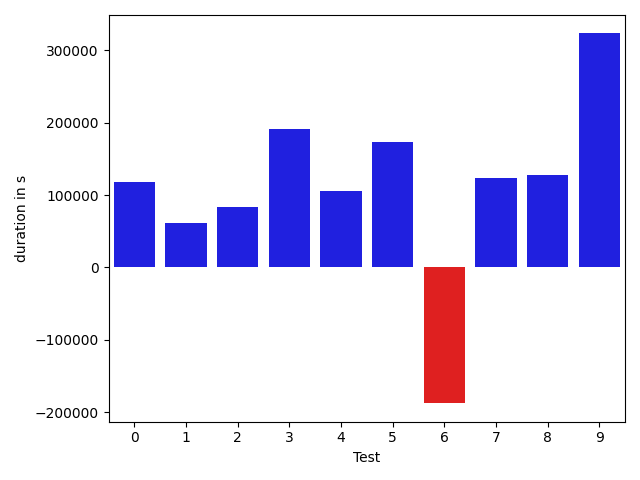

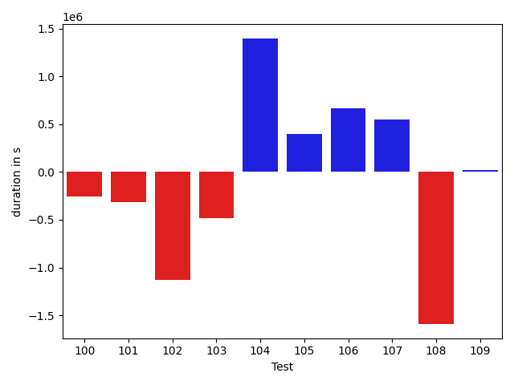

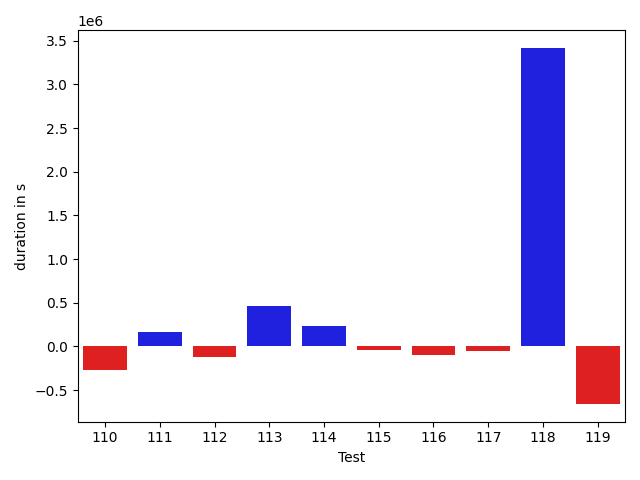

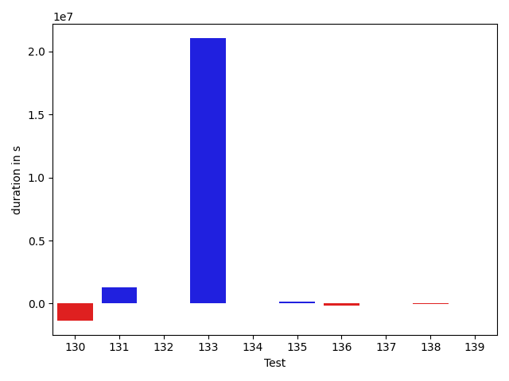

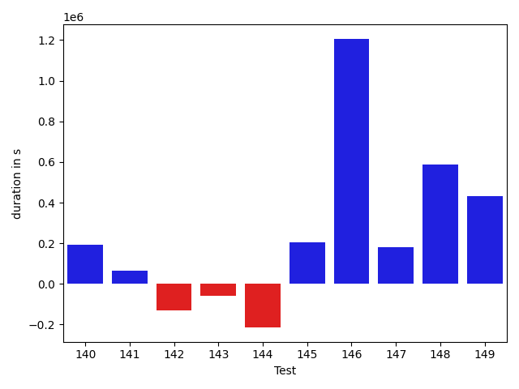

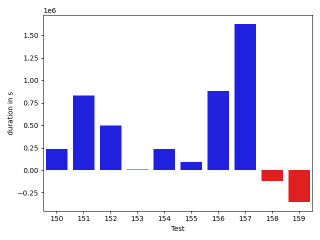

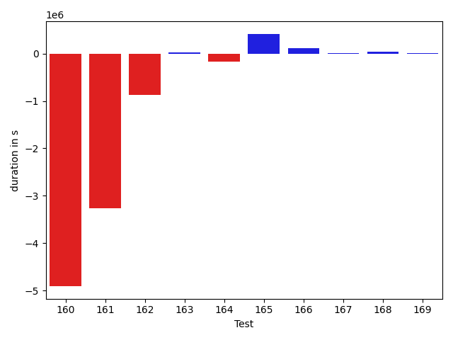

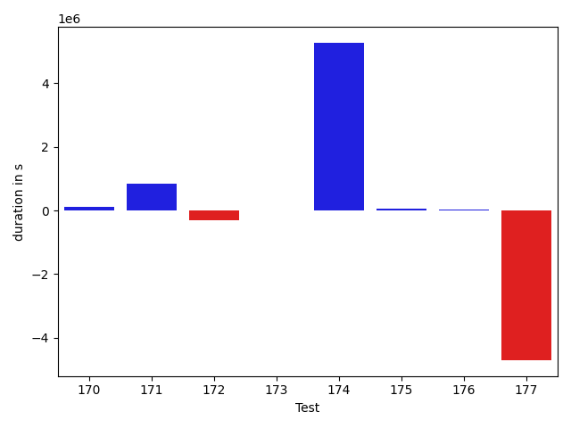

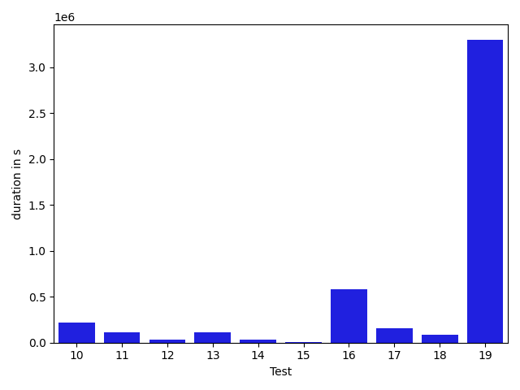

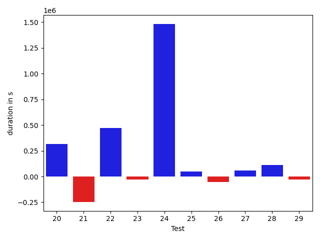

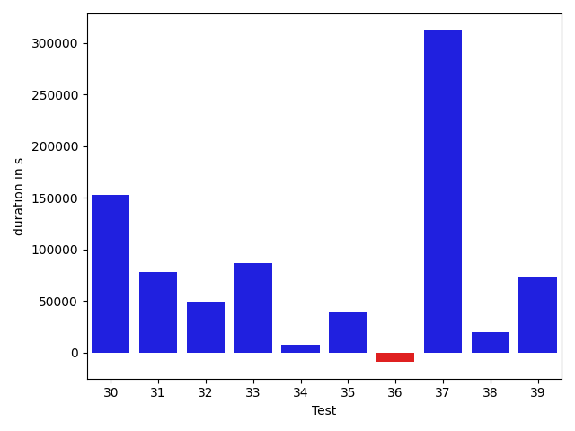

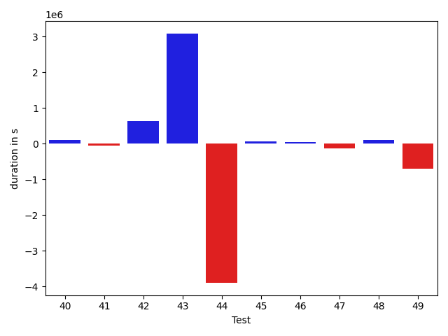

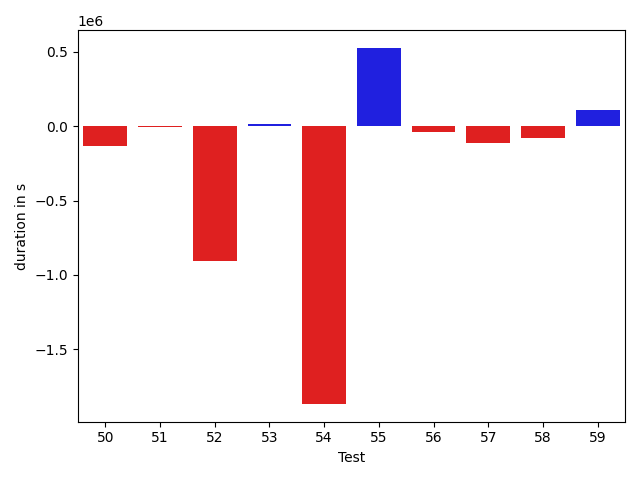

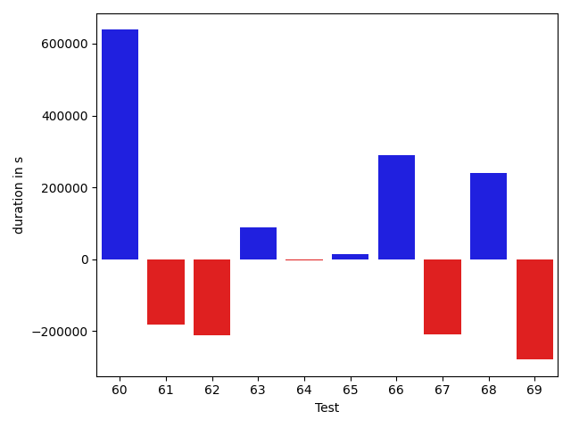

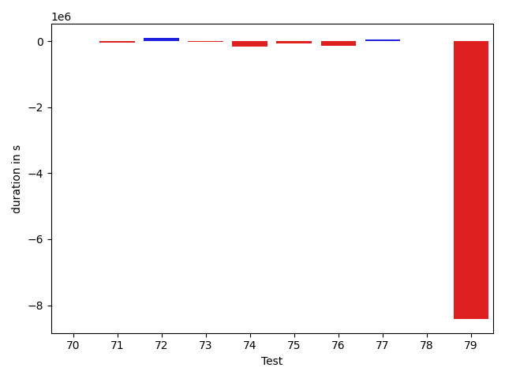

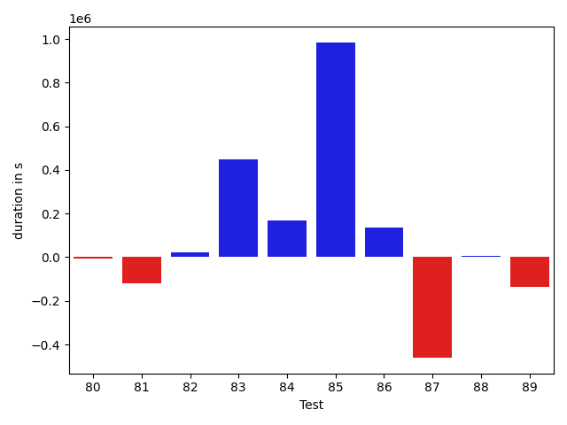

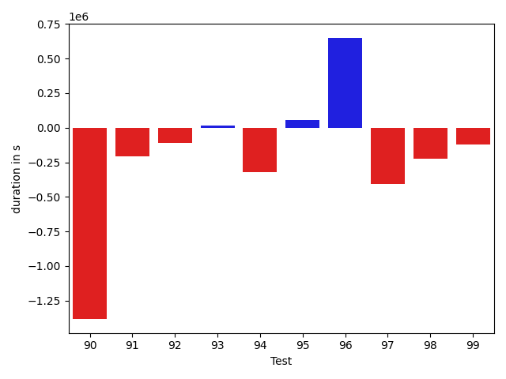

| ID | DurationV1 | DurationsV2 | DeltaDuration |
| --- | --- | --- | --- |
| 0 | 703568.6364095842 | 821179.4334646801 | 117610.7970550959 |
| 1 | 605126.6130619727 | 666971.5150264336 | 61844.901964460965 |
| 2 | 786415.8154181123 | 869196.7645726046 | 82780.94915449223 |
| 3 | 1008373.8536908308 | 1199855.2804874089 | 191481.4267965781 |
| 4 | 1274899.691496641 | 1380982.2631319703 | 106082.5716353294 |
| 5 | 602228.7666433807 | 775325.2032896581 | 173096.43664627732 |
| 6 | 843480.419063312 | 655645.4424508826 | -187834.97661242937 |
| 7 | 700306.4673897277 | 823368.4002370075 | 123061.93284727982 |
| 8 | 639050.6983321006 | 766124.8378301209 | 127074.13949802029 |
| 9 | 786709.4643964388 | 1110065.099470099 | 323355.6350736602 |
| 10 | 411799.0762663223 | 627010.5572835207 | 215211.4810171984 |
| 11 | 722501.9120603801 | 832333.5632089546 | 109831.65114857454 |
| 12 | 586671.9719314077 | 615637.451435246 | 28965.479503838345 |
| 13 | 1189476.3203546733 | 1301270.5357947936 | 111794.21544012032 |
| 14 | 610082.6709258606 | 647201.7126511701 | 37119.04172530945 |
| 15 | 622848.7971437639 | 633470.5172293345 | 10621.720085570589 |
| 16 | 674040.7670839534 | 1257281.93609319 | 583241.1690092366 |
| 17 | 950260.742799279 | 1105606.254438351 | 155345.51163907186 |
| 18 | 1239154.114494958 | 1321295.280150951 | 82141.16565599293 |
| 19 | 2145351.901782944 | 5447444.907380756 | 3302093.005597812 |
| 20 | 2452645.925056788 | 2767809.049118172 | 315163.1240613838 |
| 21 | 1751915.5126799555 | 1504487.1205604188 | -247428.39211953664 |
| 22 | 1968760.4377441457 | 2438344.26492421 | 469583.8271800643 |
| 23 | 306680.48623657227 | 277200.2869720459 | -29480.199264526367 |
| 24 | 329585.8442687988 | 1811918.401977539 | 1482332.5577087402 |
| 25 | 758353.7249121937 | 808753.4584255392 | 50399.733513345476 |
| 26 | 384580.4228210449 | 331080.0751953125 | -53500.34762573242 |
| 27 | 416437.59408569336 | 475117.0542297363 | 58679.46014404297 |
| 28 | 522470.11026501656 | 633580.8455017956 | 111110.73523677909 |
| 29 | 425225.2868370414 | 397044.3890991211 | -28180.897737920284 |
| 30 | 811641.0700765122 | 964395.9541214756 | 152754.8840449634 |
| 31 | 333384.4558105469 | 411474.1337890625 | 78089.67797851562 |
| 32 | 559822.5085875988 | 608796.6223816872 | 48974.113794088364 |
| 33 | 396522.13712654635 | 483188.9591064453 | 86666.82197989896 |
| 34 | 345134.921875 | 352170.4782066345 | 7035.5563316345215 |
| 35 | 410445.716796875 | 450185.078125 | 39739.361328125 |
| 36 | 417330.34696006775 | 408021.13583374023 | -9309.211126327515 |
| 37 | 342295.44189453125 | 654548.6304779053 | 312253.188583374 |
| 38 | 349336.8212890625 | 369250.7182006836 | 19913.896911621094 |
| 39 | 383143.4309234619 | 455744.4052734375 | 72600.97434997559 |
| 40 | 370340.27294921875 | 467610.20751953125 | 97269.9345703125 |
| 41 | 381435.6044921875 | 327903.6981201172 | -53531.90637207031 |
| 42 | 274123.5451660156 | 908343.9375 | 634220.3923339844 |
| 43 | 378766.91064453125 | 3460138.0935058594 | 3081371.182861328 |
| 44 | 4381717.459136963 | 483237.49642944336 | -3898479.9627075195 |
| 45 | 482989.28216552734 | 549127.9580230713 | 66138.67585754395 |
| 46 | 304943.40625 | 346720.0078125 | 41776.6015625 |
| 47 | 547102.958443135 | 408079.2698364258 | -139023.68860670924 |
| 48 | 394725.1698913574 | 496051.70343494415 | 101326.53354358673 |
| 49 | 1957390.2851227783 | 1249198.6876211166 | -708191.5975016616 |
| 50 | 535837.1617226601 | 405323.5633069128 | -130513.59841574728 |
| 51 | 567315.9114483728 | 564330.976254642 | -2984.935193730751 |
| 52 | 1347798.385073185 | 439623.52648735046 | -908174.8585858345 |
| 53 | 369737.8570070267 | 387417.83521938324 | 17679.978212356567 |
| 54 | 2313157.7206998765 | 446451.36686712503 | -1866706.3538327515 |
| 55 | 457353.71477246284 | 982684.3803472519 | 525330.665574789 |
| 56 | 457368.1925048828 | 416796.08599853516 | -40572.106506347656 |
| 57 | 470128.0 | 355246.87629699707 | -114881.12370300293 |
| 58 | 585502.9345178008 | 503682.37826383114 | -81820.55625396967 |
| 59 | 465492.4105358124 | 575555.6209716797 | 110063.21043586731 |
| 60 | 759467.2834925123 | 1397855.7559250456 | 638388.4724325333 |
| 61 | 1051945.6772362709 | 869008.6073223359 | -182937.06991393492 |
| 62 | 1957077.582307451 | 1744440.9577426757 | -212636.62456477527 |
| 63 | 751790.0628558192 | 840833.6100227819 | 89043.54716696264 |
| 64 | 1241642.4920099657 | 1238904.7073762312 | -2737.7846337344963 |
| 65 | 2690944.3345863847 | 2704070.329123463 | 13125.99453707831 |
| 66 | 1035383.9297478525 | 1325366.583658168 | 289982.6539103156 |
| 67 | 697943.1828184128 | 488398.99550521374 | -209544.18731319904 |
| 68 | 1843328.86439163 | 2082111.8678690852 | 238783.00347745512 |
| 69 | 769404.4950866699 | 489976.4622104168 | -279428.0328762531 |
| 70 | 439742.6656103134 | 452062.33056640625 | 12319.664956092834 |
| 71 | 388001.7119140625 | 345473.0634765625 | -42528.6484375 |
| 72 | 351058.791015625 | 448907.2728729248 | 97848.4818572998 |
| 73 | 483125.39185246825 | 462156.0490472317 | -20969.342805236578 |
| 74 | 521468.4609375 | 350049.4292602539 | -171419.0316772461 |
| 75 | 669205.5882509095 | 597165.9648103826 | -72039.62344052689 |
| 76 | 579595.026417017 | 431517.86353302 | -148077.16288399696 |
| 77 | 437843.7734642029 | 480979.6720869243 | 43135.898622721434 |
| 78 | 480810.2805175781 | 485686.66047668457 | 4876.379959106445 |
| 79 | 9002351.75258313 | 587515.7294206619 | -8414836.023162467 |
| 80 | 405579.5624847412 | 397657.7726249695 | -7921.7898597717285 |
| 81 | 455430.1223144531 | 337520.609375 | -117909.51293945312 |
| 82 | 753659.7458436242 | 777758.6976142643 | 24098.951770640095 |
| 83 | 2184327.059121628 | 2631623.148805936 | 447296.08968430804 |
| 84 | 863617.2574634242 | 1030196.6152416457 | 166579.35777822149 |
| 85 | 929470.8469551636 | 1913695.2913957653 | 984224.4444406016 |
| 86 | 1164496.2397616105 | 1299502.0585264512 | 135005.81876484072 |
| 87 | 1934913.0926007149 | 1474358.0650865347 | -460555.02751418017 |
| 88 | 937809.9330371763 | 943987.5734824415 | 6177.6404452652205 |
| 89 | 1292575.4709352655 | 1157988.314441255 | -134587.15649401047 |
| 90 | 2036023.7318852942 | 652800.0588654631 | -1383223.673019831 |
| 91 | 899197.5036629036 | 690301.0770530236 | -208896.42660987994 |
| 92 | 766225.6339359516 | 658924.4981260863 | -107301.13580986531 |
| 93 | 824234.2334209344 | 840074.8118894085 | 15840.578468474094 |
| 94 | 3422343.196397692 | 3102929.4408108313 | -319413.7555868607 |
| 95 | 1047154.2084188762 | 1101008.8118233387 | 53854.60340446257 |
| 96 | 918147.2575402178 | 1567895.841809615 | 649748.5842693972 |
| 97 | 1374042.2039604383 | 969056.3455749233 | -404985.85838551493 |
| 98 | 738672.9711607546 | 512535.83541227225 | -226137.1357484823 |
| 99 | 706378.4950860827 | 583115.8792093256 | -123262.61587675707 |
| 100 | 766424.5561955562 | 506532.71577072144 | -259891.84042483475 |
| 101 | 1089462.3834474164 | 775850.8842241513 | -313611.4992232651 |
| 102 | 1922862.8424931215 | 793970.0444113186 | -1128892.798081803 |
| 103 | 3215998.2768588127 | 2730015.9581408696 | -485982.31871794304 |
| 104 | 575275.6375036053 | 1971374.3760377225 | 1396098.7385341171 |
| 105 | 844460.3375812465 | 1238040.6414824873 | 393580.3039012408 |
| 106 | 1997478.919096725 | 2660153.5962413796 | 662674.6771446546 |
| 107 | 1107083.7902314044 | 1654777.780654793 | 547693.9904233885 |
| 108 | 5796675.600096458 | 4206291.930443355 | -1590383.6696531028 |
| 109 | 2119916.69458811 | 2138003.2687385185 | 18086.574150408618 |
| 110 | 1314584.1297372184 | 1042746.5305373685 | -271837.5991998499 |
| 111 | 471648.76689970307 | 636737.1854925733 | 165088.41859287024 |
| 112 | 766579.6711997986 | 651042.82896626 | -115536.84223353863 |
| 113 | 694884.3114232398 | 1159190.346655251 | 464306.0352320112 |
| 114 | 633703.6766313841 | 872772.494610142 | 239068.8179787579 |
| 115 | 501384.37396044657 | 460371.7264275551 | -41012.64753289148 |
| 116 | 556725.3513336182 | 456599.5246708393 | -100125.82666277885 |
| 117 | 413983.8371515274 | 358781.9111404419 | -55201.92601108551 |
| 118 | 4671756.669328422 | 8088599.2033383325 | 3416842.53400991 |
| 119 | 1460838.211739717 | 803175.0205004297 | -657663.1912392874 |
| 120 | 962037.7820064392 | 972849.31714758 | 10811.535141140805 |
| 121 | 520323.4645068529 | 692937.5507239442 | 172614.0862170913 |
| 122 | 2029158.3648478026 | 1808176.0837709391 | -220982.2810768634 |
| 123 | 1352081.6580746085 | 1321658.0761093362 | -30423.581965272315 |
| 124 | 1129669.5989215365 | 1440395.3908261408 | 310725.7919046043 |
| 125 | 1447963.7291283982 | 1974541.0094756777 | 526577.2803472795 |
| 126 | 1585231.3220929657 | 3263031.651997676 | 1677800.3299047104 |
| 127 | 1830689.8422684046 | 1443869.060465445 | -386820.7818029595 |
| 128 | 5483218.814186826 | 1771320.868501523 | -3711897.9456853033 |
| 129 | 1593775.1496899023 | 1179926.279081297 | -413848.8706086052 |
| 130 | 2684295.723923602 | 1330607.23523741 | -1353688.488686192 |
| 131 | 2543131.9620653475 | 3811573.5409395993 | 1268441.5788742518 |
| 132 | 818712.8312487531 | 839973.9241748583 | 21261.092926105135 |
| 133 | 1298235.1713357524 | 22364657.15617339 | 21066421.984837636 |
| 134 | 885566.3873009256 | 889601.893939202 | 4035.5066382763907 |
| 135 | 404979.7657049373 | 529464.9916817024 | 124485.22597676516 |
| 136 | 555679.8423485756 | 404501.3368471861 | -151178.5055013895 |
| 137 | 1787943.3301284574 | 1805701.2895365881 | 17757.95940813073 |
| 138 | 311623.4059906006 | 298889.4851074219 | -12733.920883178711 |
| 139 | 375625.4722290039 | 386416.3628540039 | 10790.890625 |
| 140 | 1523956.943871075 | 1716249.3461701276 | 192292.40229905257 |
| 141 | 370289.81103515625 | 434149.0126953125 | 63859.20166015625 |
| 142 | 514699.09963575006 | 385759.87484622 | -128939.22478953004 |
| 143 | 388859.4343700409 | 332238.4953136444 | -56620.939056396484 |
| 144 | 676044.3934326172 | 462291.9754078388 | -213752.41802477837 |
| 145 | 353880.4270019531 | 560521.6049804688 | 206641.17797851562 |
| 146 | 448625.161652565 | 1654715.4834461212 | 1206090.3217935562 |
| 147 | 434404.3973264843 | 613480.1924241185 | 179075.7950976342 |
| 148 | 501796.8388312459 | 1091221.4264123607 | 589424.5875811148 |
| 149 | 355497.29736328125 | 787872.1587486267 | 432374.86138534546 |
| 150 | 415254.94921875 | 648960.3160705566 | 233705.36685180664 |
| 151 | 6734983.013898604 | 7568489.025414853 | 833506.0115162497 |
| 152 | 680293.1233240404 | 1176047.4400322312 | 495754.3167081907 |
| 153 | 813037.7623608685 | 821401.1862179532 | 8363.423857084708 |
| 154 | 1031738.0110601017 | 1268535.822603141 | 236797.81154303928 |
| 155 | 1043234.1466726651 | 1134817.6198182378 | 91583.4731455727 |
| 156 | 1044175.7667286845 | 1927102.5414972166 | 882926.774768532 |
| 157 | 1385693.1439416409 | 3012666.3356128484 | 1626973.1916712075 |
| 158 | 603477.7301635742 | 483844.04653930664 | -119633.68362426758 |
| 159 | 906485.5347442627 | 553372.668133772 | -353112.8666104907 |
| 160 | 5698744.686421087 | 790263.481862314 | -4908481.204558773 |
| 161 | 3691834.3502955986 | 427436.1615195902 | -3264398.1887760083 |
| 162 | 1204503.400390625 | 327772.2857055664 | -876731.1146850586 |
| 163 | 775311.3614363669 | 803960.037712745 | 28648.6762763781 |
| 164 | 746494.5896210838 | 570365.6471460429 | -176128.9424750409 |
| 165 | 542953.7642850876 | 957656.998086948 | 414703.23380186036 |
| 166 | 368797.63406181335 | 491066.79431152344 | 122269.16024971008 |
| 167 | 303792.0248413086 | 314645.79864501953 | 10853.773803710938 |
| 168 | 476327.3775482178 | 522145.3095229268 | 45817.931974709034 |
| 169 | 344445.5078125 | 349298.6685180664 | 4853.160705566406 |
| 170 | 372880.50497436523 | 494103.61877441406 | 121223.11380004883 |
| 171 | 593822.5025978088 | 1438187.607117747 | 844365.1045199381 |
| 172 | 840216.3828125 | 527767.8525390625 | -312448.5302734375 |
| 173 | 472574.77223587036 | 466897.9086036682 | -5676.863632202148 |
| 174 | 347350.5458984375 | 5621153.038131714 | 5273802.492233276 |
| 175 | 388545.8571472168 | 445059.3238372803 | 56513.46669006348 |
| 176 | 383296.14807128906 | 407668.2274169922 | 24372.079345703125 |
| 177 | 5478307.476825714 | 769509.7030897737 | -4708797.77373594 |

## Misc.

| ID | Test Class | Test Method |
| --- | --- | --- |
| 0 | com.google.gson.functional.CustomTypeAdaptersTest | testCustomAdapterInvokedForCollectionElementDeserialization |
| 1 | com.google.gson.functional.CustomTypeAdaptersTest | testCustomTypeAdapterAppliesToSubClassesSerializedAsBaseClass |
| 2 | com.google.gson.functional.CustomTypeAdaptersTest | testCustomSerializers |
| 3 | com.google.gson.functional.CustomTypeAdaptersTest | testCustomTypeAdapterDoesNotAppliesToSubClasses |
| 4 | com.google.gson.functional.CustomTypeAdaptersTest | testRegisterHierarchyAdapterForDate |
| 5 | com.google.gson.functional.CustomTypeAdaptersTest | testCustomDeserializers |
| 6 | com.google.gson.functional.CustomTypeAdaptersTest | testCustomByteArraySerializer |
| 7 | com.google.gson.functional.CustomTypeAdaptersTest | testCustomAdapterInvokedForMapElementDeserialization |
| 8 | com.google.gson.functional.CustomTypeAdaptersTest | testCustomAdapterInvokedForMapElementSerializationWithType |
| 9 | com.google.gson.functional.CustomTypeAdaptersTest | testCustomNestedSerializers |
| 10 | com.google.gson.functional.CustomTypeAdaptersTest | testCustomAdapterInvokedForMapElementSerialization |
| 11 | com.google.gson.functional.CustomTypeAdaptersTest | testCustomNestedDeserializers |
| 12 | com.google.gson.functional.CustomTypeAdaptersTest | testCustomAdapterInvokedForCollectionElementSerialization |
| 13 | com.google.gson.functional.CustomTypeAdaptersTest | testCustomAdapterInvokedForCollectionElementSerializationWithType |
| 14 | com.google.gson.functional.CustomTypeAdaptersTest | testCustomDeserializerInvokedForPrimitives |
| 15 | com.google.gson.functional.CustomTypeAdaptersTest | testCustomSerializerInvokedForPrimitives |
| 16 | com.google.gson.functional.CustomTypeAdaptersTest | testCustomByteArrayDeserializerAndInstanceCreator |
| 17 | com.google.gson.functional.CustomTypeAdaptersTest | testEnsureCustomSerializerNotInvokedForNullValues |
| 18 | com.google.gson.functional.StreamingTypeAdaptersTest | testFromJsonTree |
| 19 | com.google.gson.functional.JsonAdapterSerializerDeserializerTest | testJsonSerializerDeserializerBasedJsonAdapterOnFields |
| 20 | com.google.gson.functional.JsonAdapterSerializerDeserializerTest | testDifferentJsonAdaptersForGenericFieldsOfSameRawType |
| 21 | com.google.gson.functional.JsonAdapterSerializerDeserializerTest | testJsonSerializerDeserializerBasedJsonAdapterOnClass |
| 22 | com.google.gson.JsonPrimitiveTest | testParsingStringAsNumber |
| 23 | com.google.gson.JsonPrimitiveTest | testDoubleEqualsBigDecimal |
| 24 | com.google.gson.JsonPrimitiveTest | testByteEqualsBigInteger |
| 25 | com.google.gson.JsonPrimitiveTest | testEquals |
| 26 | com.google.gson.JsonPrimitiveTest | testByteEqualsShort |
| 27 | com.google.gson.JsonPrimitiveTest | testShortEqualsBigInteger |
| 28 | com.google.gson.JsonPrimitiveTest | testValidJsonOnToString |
| 29 | com.google.gson.JsonPrimitiveTest | testEqualsDoesNotEquateStringAndNonStringTypes |
| 30 | com.google.gson.JsonPrimitiveTest | testEqualsIntegerAndBigInteger |
| 31 | com.google.gson.JsonPrimitiveTest | testLongEqualsBigInteger |
| 32 | com.google.gson.JsonPrimitiveTest | testExponential |
| 33 | com.google.gson.JsonPrimitiveTest | testNulls |
| 34 | com.google.gson.JsonPrimitiveTest | testIntegerEqualsBigInteger |
| 35 | com.google.gson.JsonPrimitiveTest | testShortEqualsLong |
| 36 | com.google.gson.JsonPrimitiveTest | testEqualsAcrossTypes |
| 37 | com.google.gson.JsonPrimitiveTest | testStringsAndChar |
| 38 | com.google.gson.JsonPrimitiveTest | testByteEqualsLong |
| 39 | com.google.gson.JsonPrimitiveTest | testIntegerEqualsLong |
| 40 | com.google.gson.JsonPrimitiveTest | testByteEqualsInteger |
| 41 | com.google.gson.JsonPrimitiveTest | testFloatEqualsDouble |
| 42 | com.google.gson.JsonPrimitiveTest | testParsingStringAsBoolean |
| 43 | com.google.gson.JsonPrimitiveTest | testBoolean |
| 44 | com.google.gson.JsonPrimitiveTest | testFloatEqualsBigDecimal |
| 45 | com.google.gson.JsonPrimitiveTest | testDeepCopy |
| 46 | com.google.gson.JsonPrimitiveTest | testShortEqualsInteger |
| 47 | com.google.gson.internal.bind.JsonElementReaderTest | testLenientNansAndInfinities |
| 48 | com.google.gson.internal.bind.JsonElementReaderTest | testObject |
| 49 | com.google.gson.internal.bind.JsonElementReaderTest | testNumbersFromStrings |
| 50 | com.google.gson.internal.bind.JsonElementReaderTest | testEarlyClose |
| 51 | com.google.gson.internal.bind.JsonElementReaderTest | testWrongType |
| 52 | com.google.gson.internal.bind.JsonElementReaderTest | testNestedObjects |
| 53 | com.google.gson.internal.bind.JsonElementReaderTest | testSkipValue |
| 54 | com.google.gson.internal.bind.JsonElementReaderTest | testNumbers |
| 55 | com.google.gson.internal.bind.JsonElementReaderTest | testArray |
| 56 | com.google.gson.internal.bind.JsonElementReaderTest | testStrings |
| 57 | com.google.gson.internal.bind.JsonElementReaderTest | testStringsFromNumbers |
| 58 | com.google.gson.internal.bind.JsonElementReaderTest | testStrictNansAndInfinities |
| 59 | com.google.gson.internal.bind.JsonElementReaderTest | testBooleans |
| 60 | com.google.gson.functional.ReadersWritersTest | testReadWriteTwoObjects |
| 61 | com.google.gson.functional.ReadersWritersTest | testReadWriteTwoStrings |
| 62 | com.google.gson.functional.MapTest | testInterfaceTypeMapWithSerializer |
| 63 | com.google.gson.functional.MapTest | testCustomSerializerForSpecificMapType |
| 64 | com.google.gson.functional.MapTest | testGeneralMapField |
| 65 | com.google.gson.functional.MapTest | testInterfaceTypeMap |
| 66 | com.google.gson.functional.MapTest | testMapNamePromotionWithJsonElementReader |
| 67 | com.google.gson.JsonParserTest | testParseUnquotedStringArrayFails |
| 68 | com.google.gson.JsonParserTest | testReadWriteTwoObjects |
| 69 | com.google.gson.JsonParserTest | testParseString |
| 70 | com.google.gson.JsonParserTest | testParseMixedArray |
| 71 | com.google.gson.JsonParserTest | testParseEmptyString |
| 72 | com.google.gson.JsonParserTest | testParseUnquotedSingleWordStringFails |
| 73 | com.google.gson.JsonParserTest | testParseUnquotedMultiWordStringFails |
| 74 | com.google.gson.JsonParserTest | testParseReader |
| 75 | com.google.gson.JsonArrayTest | testSet |
| 76 | com.google.gson.JsonArrayTest | testDeepCopy |
| 77 | com.google.gson.JsonArrayTest | testRemove |
| 78 | com.google.gson.JsonStreamParserTest | testCallingNextBeyondAvailableInput |
| 79 | com.google.gson.JsonStreamParserTest | testIterator |
| 80 | com.google.gson.JsonStreamParserTest | testNoSideEffectForHasNext |
| 81 | com.google.gson.JsonStreamParserTest | testParseTwoStrings |
| 82 | com.google.gson.functional.JsonTreeTest | testJsonTreeNull |
| 83 | com.google.gson.functional.JsonTreeTest | testJsonTreeToString |
| 84 | com.google.gson.functional.JsonTreeTest | testToJsonTreeObjectType |
| 85 | com.google.gson.functional.JsonTreeTest | testToJsonTree |
| 86 | com.google.gson.functional.CustomDeserializerTest | testCustomDeserializerReturnsNull |
| 87 | com.google.gson.functional.CustomDeserializerTest | testJsonTypeFieldBasedDeserialization |
| 88 | com.google.gson.functional.CustomDeserializerTest | testDefaultConstructorNotCalledOnField |
| 89 | com.google.gson.functional.CustomDeserializerTest | testCustomDeserializerReturnsNullForArrayElementsForArrayField |
| 90 | com.google.gson.functional.CustomDeserializerTest | testDefaultConstructorNotCalledOnObject |
| 91 | com.google.gson.functional.CustomDeserializerTest | testCustomDeserializerReturnsNullForArrayElements |
| 92 | com.google.gson.functional.CustomDeserializerTest | testCustomDeserializerReturnsNullForTopLevelObject |
| 93 | com.google.gson.functional.TypeHierarchyAdapterTest | testRegisterSuperTypeFirst |
| 94 | com.google.gson.functional.TypeHierarchyAdapterTest | testTypeHierarchy |
| 95 | com.google.gson.functional.InheritanceTest | testClassWithBaseArrayFieldSerialization |
| 96 | com.google.gson.functional.InheritanceTest | testClassWithBaseCollectionFieldSerialization |
| 97 | com.google.gson.functional.InheritanceTest | testClassWithBaseFieldSerialization |
| 98 | com.google.gson.functional.InheritanceTest | testBaseSerializedAsSubWhenSpecifiedWithExplicitType |
| 99 | com.google.gson.functional.InheritanceTest | testBaseSerializedAsSub |
| 100 | com.google.gson.functional.InheritanceTest | testBaseSerializedAsBaseWhenSpecifiedWithExplicitType |
| 101 | com.google.gson.functional.NullObjectAndFieldTest | testCustomTypeAdapterPassesNullDesrialization |
| 102 | com.google.gson.functional.NullObjectAndFieldTest | testCustomSerializationOfNulls |
| 103 | com.google.gson.functional.EnumTest | testEnumSubclassWithRegisteredTypeAdapter |
| 104 | com.google.gson.functional.PrimitiveTest | testPrimitiveClassLiteral |
| 105 | com.google.gson.functional.MapAsArrayTypeAdapterTest | testMultipleEnableComplexKeyRegistrationHasNoEffect |
| 106 | com.google.gson.functional.MapAsArrayTypeAdapterTest | testSerializeComplexMapWithTypeAdapter |
| 107 | com.google.gson.functional.MapAsArrayTypeAdapterTest | testMapWithTypeVariableSerialization |
| 108 | com.google.gson.functional.RuntimeTypeAdapterFactoryFunctionalTest | testSubclassesAutomaticallySerialized |
| 109 | com.google.gson.functional.ParameterizedTypesTest | testParameterizedTypeWithCustomSerializer |
| 110 | com.google.gson.functional.ParameterizedTypesTest | testParameterizedTypesWithCustomDeserializer |
| 111 | com.google.gson.functional.DefaultTypeAdaptersTest | testJsonObjectDeserialization |
| 112 | com.google.gson.functional.DefaultTypeAdaptersTest | testJsonObjectSerialization |
| 113 | com.google.gson.functional.DefaultTypeAdaptersTest | testJsonPrimitiveDeserialization |
| 114 | com.google.gson.functional.DefaultTypeAdaptersTest | testJsonPrimitiveSerialization |
| 115 | com.google.gson.functional.DefaultTypeAdaptersTest | testJsonArrayDeserialization |
| 116 | com.google.gson.functional.DefaultTypeAdaptersTest | testJsonElementTypeMismatch |
| 117 | com.google.gson.functional.DefaultTypeAdaptersTest | testJsonArraySerialization |
| 118 | com.google.gson.functional.CustomSerializerTest | testSubClassSerializerInvokedForBaseClassFieldsHoldingSubClassInstances |
| 119 | com.google.gson.functional.CustomSerializerTest | testBaseClassSerializerInvokedForBaseClassFieldsHoldingSubClassInstances |
| 120 | com.google.gson.functional.CustomSerializerTest | testSubClassSerializerInvokedForBaseClassFieldsHoldingArrayOfSubClassInstances |
| 121 | com.google.gson.functional.CustomSerializerTest | testBaseClassSerializerInvokedForBaseClassFields |
| 122 | com.google.gson.functional.JsonAdapterAnnotationOnClassesTest | testRegisteredSerializerOverridesJsonAdapter |
| 123 | com.google.gson.functional.JsonAdapterAnnotationOnClassesTest | testRegisteredDeserializerOverridesJsonAdapter |
| 124 | com.google.gson.functional.CollectionTest | testUserCollectionTypeAdapter |
| 125 | com.google.gson.functional.UncategorizedTest | testReturningDerivedClassesDuringDeserialization |
| 126 | com.google.gson.DefaultMapJsonSerializerTest | testNonEmptyMapSerialization |
| 127 | com.google.gson.functional.MoreSpecificTypeSerializationTest | testMapOfParameterizedSubclassFields |
| 128 | com.google.gson.functional.MoreSpecificTypeSerializationTest | testMapOfSubclassFields |
| 129 | com.google.gson.functional.TreeTypeAdaptersTest | testDeserializeId |
| 130 | com.google.gson.functional.TreeTypeAdaptersTest | testSerializeId |
| 131 | com.google.gson.functional.ExclusionStrategyFunctionalTest | testExclusionStrategyDeserialization |
| 132 | com.google.gson.functional.ExclusionStrategyFunctionalTest | testExclusionStrategyWithMode |
| 133 | com.google.gson.functional.TypeAdapterPrecedenceTest | testNonstreamingFollowedByNonstreaming |
| 134 | com.google.gson.functional.TypeAdapterPrecedenceTest | testStreamingFollowedByNonstreaming |
| 135 | com.google.gson.functional.TypeAdapterPrecedenceTest | testNonstreamingHierarchicalFollowedByNonstreaming |
| 136 | com.google.gson.functional.TypeAdapterPrecedenceTest | testStreamingHierarchicalFollowedByNonstreaming |
| 137 | com.google.gson.functional.JsonArrayTest | testMixedPrimitiveAddition |
| 138 | com.google.gson.functional.JsonArrayTest | testBooleanPrimitiveAddition |
| 139 | com.google.gson.functional.JsonArrayTest | testStringPrimitiveAddition |
| 140 | com.google.gson.functional.JsonArrayTest | testSameAddition |
| 141 | com.google.gson.functional.JsonArrayTest | testIntegerPrimitiveAddition |
| 142 | com.google.gson.functional.JsonArrayTest | testDoublePrimitiveAddition |
| 143 | com.google.gson.functional.JsonArrayTest | testCharPrimitiveAddition |
| 144 | com.google.gson.internal.bind.JsonTreeWriterTest | testNestedObject |
| 145 | com.google.gson.internal.bind.JsonTreeWriterTest | testWriteAfterClose |
| 146 | com.google.gson.internal.bind.JsonTreeWriterTest | testObject |
| 147 | com.google.gson.internal.bind.JsonTreeWriterTest | testArray |
| 148 | com.google.gson.internal.bind.JsonTreeWriterTest | testLenientNansAndInfinities |
| 149 | com.google.gson.internal.bind.JsonTreeWriterTest | testPrematureClose |
| 150 | com.google.gson.internal.bind.JsonTreeWriterTest | testSerializeNullsTrue |
| 151 | com.google.gson.functional.CircularReferenceTest | testSelfReferenceCustomHandlerSerialization |
| 152 | com.google.gson.functional.JsonParserTest | testBadTypeForDeserializingCustomTree |
| 153 | com.google.gson.functional.JsonParserTest | testBadFieldTypeForCustomDeserializerCustomTree |
| 154 | com.google.gson.functional.JsonParserTest | testChangingCustomTreeAndDeserializing |
| 155 | com.google.gson.functional.JsonParserTest | testBadFieldTypeForDeserializingCustomTree |
| 156 | com.google.gson.functional.JsonParserTest | testDeserializingCustomTree |
| 157 | com.google.gson.functional.PrintFormattingTest | testJsonObjectWithNullValues |
| 158 | com.google.gson.functional.PrintFormattingTest | testJsonObjectWithNullValuesSerialized |
| 159 | com.google.gson.GsonTypeAdapterTest | testTypeAdapterProperlyConvertsTypes |
| 160 | com.google.gson.GsonTypeAdapterTest | testTypeAdapterThrowsException |
| 161 | com.google.gson.internal.bind.JsonTreeReaderTest | testSkipValue_filledJsonObject |
| 162 | com.google.gson.JsonObjectTest | testAddingBooleanProperties |
| 163 | com.google.gson.JsonObjectTest | testKeySet |
| 164 | com.google.gson.JsonObjectTest | testEqualsNonEmptyObject |
| 165 | com.google.gson.JsonObjectTest | testPropertyWithQuotes |
| 166 | com.google.gson.JsonObjectTest | testDeepCopy |
| 167 | com.google.gson.JsonObjectTest | testAddingStringProperties |
| 168 | com.google.gson.JsonObjectTest | testAddingCharacterProperties |
| 169 | com.google.gson.JsonObjectTest | testAddingNullPropertyValue |
| 170 | com.google.gson.JsonObjectTest | testAddingAndRemovingObjectProperties |
| 171 | com.google.gson.JsonObjectTest | testReadPropertyWithEmptyStringName |
| 172 | com.google.gson.JsonObjectTest | testAddingNullOrEmptyPropertyName |
| 173 | com.google.gson.JsonObjectTest | testWritePropertyWithEmptyStringName |
| 174 | com.google.gson.JsonObjectTest | testSize |
| 175 | com.google.gson.LongSerializationPolicyTest | testDefaultLongSerialization |
| 176 | com.google.gson.LongSerializationPolicyTest | testStringLongSerialization |
| 177 | com.google.gson.MixedStreamTest | testWriteNulls |

| Test | IterationV1 | IterationV2 | DeltaIteration |
| --- | --- | --- | --- |
| 0 | 71 | 73 | 2 |
| 1 | 48 | 47 | -1 |
| 2 | 62 | 65 | 3 |
| 3 | 85 | 94 | 9 |
| 4 | 99 | 99 | 0 |
| 5 | 52 | 50 | -2 |
| 6 | 51 | 59 | 8 |
| 7 | 64 | 64 | 0 |
| 8 | 66 | 47 | -19 |
| 9 | 71 | 77 | 6 |
| 10 | 29 | 28 | -1 |
| 11 | 62 | 67 | 5 |
| 12 | 40 | 38 | -2 |
| 13 | 92 | 98 | 6 |
| 14 | 44 | 56 | 12 |
| 15 | 44 | 44 | 0 |
| 16 | 60 | 57 | -3 |
| 17 | 84 | 88 | 4 |
| 18 | 96 | 99 | 3 |
| 19 | 99 | 99 | 0 |
| 20 | 99 | 99 | 0 |
| 21 | 98 | 98 | 0 |
| 22 | 98 | 98 | 0 |
| 23 | 15 | 17 | 2 |
| 24 | 15 | 14 | -1 |
| 25 | 40 | 34 | -6 |
| 26 | 15 | 12 | -3 |
| 27 | 17 | 17 | 0 |
| 28 | 27 | 40 | 13 |
| 29 | 25 | 15 | -10 |
| 30 | 50 | 49 | -1 |
| 31 | 13 | 13 | 0 |
| 32 | 23 | 24 | 1 |
| 33 | 29 | 16 | -13 |
| 34 | 8 | 18 | 10 |
| 35 | 13 | 8 | -5 |
| 36 | 20 | 19 | -1 |
| 37 | 15 | 17 | 2 |
| 38 | 14 | 15 | 1 |
| 39 | 17 | 11 | -6 |
| 40 | 12 | 14 | 2 |
| 41 | 12 | 15 | 3 |
| 42 | 13 | 7 | -6 |
| 43 | 12 | 14 | 2 |
| 44 | 17 | 16 | -1 |
| 45 | 16 | 17 | 1 |
| 46 | 6 | 8 | 2 |
| 47 | 25 | 16 | -9 |
| 48 | 15 | 20 | 5 |
| 49 | 29 | 20 | -9 |
| 50 | 23 | 29 | 6 |
| 51 | 38 | 30 | -8 |
| 52 | 22 | 20 | -2 |
| 53 | 21 | 21 | 0 |
| 54 | 28 | 27 | -1 |
| 55 | 24 | 22 | -2 |
| 56 | 16 | 14 | -2 |
| 57 | 6 | 20 | 14 |
| 58 | 25 | 24 | -1 |
| 59 | 20 | 15 | -5 |
| 60 | 70 | 70 | 0 |
| 61 | 44 | 56 | 12 |
| 62 | 99 | 99 | 0 |
| 63 | 67 | 68 | 1 |
| 64 | 89 | 92 | 3 |
| 65 | 99 | 99 | 0 |
| 66 | 77 | 79 | 2 |
| 67 | 22 | 24 | 2 |
| 68 | 81 | 80 | -1 |
| 69 | 19 | 24 | 5 |
| 70 | 20 | 15 | -5 |
| 71 | 12 | 11 | -1 |
| 72 | 10 | 17 | 7 |
| 73 | 27 | 23 | -4 |
| 74 | 15 | 15 | 0 |
| 75 | 36 | 41 | 5 |
| 76 | 22 | 19 | -3 |
| 77 | 19 | 25 | 6 |
| 78 | 12 | 17 | 5 |
| 79 | 31 | 21 | -10 |
| 80 | 17 | 19 | 2 |
| 81 | 13 | 9 | -4 |
| 82 | 40 | 38 | -2 |
| 83 | 90 | 89 | -1 |
| 84 | 61 | 71 | 10 |
| 85 | 56 | 60 | 4 |
| 86 | 58 | 65 | 7 |
| 87 | 99 | 99 | 0 |
| 88 | 68 | 61 | -7 |
| 89 | 81 | 67 | -14 |
| 90 | 58 | 46 | -12 |
| 91 | 58 | 56 | -2 |
| 92 | 48 | 50 | 2 |
| 93 | 55 | 44 | -11 |
| 94 | 99 | 99 | 0 |
| 95 | 62 | 66 | 4 |
| 96 | 81 | 75 | -6 |
| 97 | 71 | 66 | -5 |
| 98 | 27 | 30 | 3 |
| 99 | 35 | 33 | -2 |
| 100 | 31 | 19 | -12 |
| 101 | 68 | 54 | -14 |
| 102 | 58 | 60 | 2 |
| 103 | 99 | 99 | 0 |
| 104 | 36 | 29 | -7 |
| 105 | 80 | 80 | 0 |
| 106 | 99 | 99 | 0 |
| 107 | 93 | 93 | 0 |
| 108 | 99 | 99 | 0 |
| 109 | 99 | 99 | 0 |
| 110 | 87 | 88 | 1 |
| 111 | 31 | 30 | -1 |
| 112 | 18 | 25 | 7 |
| 113 | 43 | 41 | -2 |
| 114 | 33 | 30 | -3 |
| 115 | 29 | 22 | -7 |
| 116 | 21 | 25 | 4 |
| 117 | 21 | 18 | -3 |
| 118 | 74 | 80 | 6 |
| 119 | 50 | 56 | 6 |
| 120 | 54 | 54 | 0 |
| 121 | 37 | 34 | -3 |
| 122 | 99 | 99 | 0 |
| 123 | 50 | 54 | 4 |
| 124 | 88 | 75 | -13 |
| 125 | 99 | 99 | 0 |
| 126 | 70 | 70 | 0 |
| 127 | 98 | 99 | 1 |
| 128 | 97 | 97 | 0 |
| 129 | 97 | 88 | -9 |
| 130 | 99 | 99 | 0 |
| 131 | 99 | 99 | 0 |
| 132 | 66 | 59 | -7 |
| 133 | 87 | 88 | 1 |
| 134 | 62 | 45 | -17 |
| 135 | 29 | 32 | 3 |
| 136 | 22 | 24 | 2 |
| 137 | 55 | 58 | 3 |
| 138 | 17 | 13 | -4 |
| 139 | 17 | 18 | 1 |
| 140 | 55 | 54 | -1 |
| 141 | 12 | 13 | 1 |
| 142 | 26 | 24 | -2 |
| 143 | 24 | 20 | -4 |
| 144 | 14 | 24 | 10 |
| 145 | 14 | 13 | -1 |
| 146 | 23 | 20 | -3 |
| 147 | 27 | 26 | -1 |
| 148 | 29 | 30 | 1 |
| 149 | 13 | 19 | 6 |
| 150 | 12 | 16 | 4 |
| 151 | 99 | 99 | 0 |
| 152 | 45 | 42 | -3 |
| 153 | 41 | 41 | 0 |
| 154 | 59 | 58 | -1 |
| 155 | 64 | 60 | -4 |
| 156 | 55 | 47 | -8 |
| 157 | 24 | 29 | 5 |
| 158 | 15 | 17 | 2 |
| 159 | 19 | 30 | 11 |
| 160 | 37 | 27 | -10 |
| 161 | 32 | 34 | 2 |
| 162 | 10 | 16 | 6 |
| 163 | 47 | 44 | -3 |
| 164 | 31 | 31 | 0 |
| 165 | 21 | 30 | 9 |
| 166 | 20 | 17 | -3 |
| 167 | 16 | 15 | -1 |
| 168 | 17 | 26 | 9 |
| 169 | 9 | 14 | 5 |
| 170 | 17 | 15 | -2 |
| 171 | 22 | 34 | 12 |
| 172 | 11 | 13 | 2 |
| 173 | 19 | 19 | 0 |
| 174 | 11 | 21 | 10 |
| 175 | 16 | 18 | 2 |
| 176 | 14 | 15 | 1 |
| 177 | 19 | 24 | 5 |

| Time Label | Time (s) |
| --- | --- |
| Selection | 36.22338390350342 |
| Injection | 20.234743118286133 |
| Total | 1635.1242105960846 |

## Aggregation per test class

| Index | EnergyV1 | EnergyV2 | DeltaEnergy |
| --- | --- | --- | --- |
| 0 | 767982.7645332109 | 810183.0474745642 | 42200.282941353275 |
| 1 | 44552.41574529365 | 49254.68020445448 | 4702.264459160833 |
| 2 | 281175.21668838296 | 354794.67146768013 | 73619.45477929717 |
| 3 | 1147948.0292475994 | 1194885.0717036435 | 46937.04245604412 |
| 4 | 690300.0397879374 | 577668.9894138426 | -112631.05037409486 |
| 5 | 96461.52745965551 | 108161.23203612592 | 11699.704576470409 |
| 6 | 297446.2473254149 | 300467.87120025663 | 3021.6238748417236 |
| 7 | 348698.4741956656 | 363111.67375240393 | 14413.199556738313 |
| 8 | 131110.60960789604 | 134321.838585836 | 3211.228977939958 |
| 9 | 470894.5464542918 | 173801.80716514587 | -297092.7392891459 |
| 10 | 198569.70628267995 | 235446.50666110314 | 36876.800378423184 |
| 11 | 381577.1570286104 | 316130.71333947254 | -65446.44368913787 |
| 12 | 177259.57616113263 | 164058.43835294948 | -13201.13780818315 |
| 13 | 275782.2147883446 | 300867.5306340683 | 25085.31584572373 |
| 14 | 115037.15672073246 | 83820.16741064063 | -31216.989310091827 |
| 15 | 134832.44675727762 | 118651.49081782791 | -16180.955939449705 |
| 16 | 41950.72137581192 | 53221.487254399806 | 11270.765878587888 |
| 17 | 151202.443623145 | 196536.93409712383 | 45334.49047397883 |
| 18 | 237451.06904999382 | 193255.70301766964 | -44195.36603232418 |
| 19 | 114926.26846121752 | 129520.96395503124 | 14594.69549381372 |
| 20 | 315530.4391578785 | 328760.7999089641 | 13230.360751085565 |
| 21 | 297027.2789130204 | 410150.07984405477 | 113122.80093103438 |
| 22 | 119905.85309255829 | 109518.92257496978 | -10386.93051758851 |
| 23 | 42568.41237930491 | 54688.20539941189 | 12119.793020106983 |
| 24 | 70963.38543165528 | 63831.46852514471 | -7131.916906510567 |
| 25 | 62154.32837191742 | 99948.48092244213 | 37794.15255052471 |
| 26 | 215784.7233669125 | 120972.97542368901 | -94811.7479432235 |
| 27 | 157577.9885116759 | 92233.39197617174 | -65344.59653550417 |
| 28 | 135762.84313801708 | 171823.6456524654 | 36060.802514448325 |
| 29 | 177745.5534827171 | 806950.7879018616 | 629205.2344191445 |
| 30 | 352896.7899013662 | 377097.9834464378 | 24201.193545071583 |
| 31 | 302823.1036480181 | 326022.56287610624 | 23199.459228088148 |
| 32 | 273751.6420832841 | 267202.1984640893 | -6549.44361919479 |
| 33 | 224831.52838416694 | 253598.64008766372 | 28767.111703496776 |
| 34 | 86199.87125229836 | 144686.99298434705 | 58487.12173204869 |
| 35 | 101288.6776504164 | 87550.41295397282 | -13738.264696443584 |
| 36 | 141523.20778985182 | 45829.02651436324 | -95694.18127548858 |
| 37 | 577312.7682835548 | 772188.0169727511 | 194875.2486891963 |
| 38 | 87812.73809814453 | 87871.48603057861 | 58.74793243408203 |
| 39 | 190397.8091659546 | 41063.00834226608 | -149334.8008236885 |

| Index | DurationV1 | DurationsV2 | DeltaDuration |
| --- | --- | --- | --- |
| 0 | 13717842.684467744 | 16088526.768095426 | 2370684.083627682 |
| 1 | 1239154.114494958 | 1321295.280150951 | 82141.16565599293 |
| 2 | 6349913.339519687 | 9719741.077059347 | 3369827.73753966 |
| 3 | 16035467.239315152 | 18873896.290751893 | 2838429.051436741 |
| 4 | 10468910.70173935 | 7230442.270906195 | -3238468.4308331553 |
| 5 | 1811412.9607287832 | 2266864.3632473815 | 455451.40251859836 |
| 6 | 7676838.401507474 | 7853616.18792332 | 176777.7864158461 |
| 7 | 5494073.563626682 | 5119135.470808094 | -374938.092818588 |
| 8 | 1686644.3881321293 | 1509663.500430327 | -176980.88770180242 |
| 9 | 10344171.717899902 | 1808380.771897316 | -8535790.946002586 |
| 10 | 4731074.90938384 | 6353273.75305761 | 1622198.8436737703 |
| 11 | 9031241.605818916 | 6877861.645581257 | -2153379.9602376595 |
| 12 | 4246577.4298186265 | 3943004.25270024 | -303573.1771183866 |
| 13 | 5550819.692361926 | 5240145.429600196 | -310674.26276172977 |
| 14 | 3012325.2259405376 | 1569820.9286354699 | -1442504.2973050678 |
| 15 | 3215998.2768588127 | 2730015.9581408696 | -485982.31871794304 |
| 16 | 575275.6375036053 | 1971374.3760377225 | 1396098.7385341171 |
| 17 | 3949023.046909376 | 5552972.01837866 | 1603948.971469284 |
| 18 | 5796675.600096458 | 4206291.930443355 | -1590383.6696531028 |
| 19 | 3434500.824325328 | 3180749.799275887 | -253751.02504944103 |
| 20 | 4038909.9885997176 | 4595496.017963063 | 556586.0293633454 |
| 21 | 7614956.127581431 | 10557561.091710284 | 2942604.9641288538 |
| 22 | 3381240.022922411 | 3129834.1598802754 | -251405.86304213572 |
| 23 | 1129669.5989215365 | 1440395.3908261408 | 310725.7919046043 |
| 24 | 1447963.7291283982 | 1974541.0094756777 | 526577.2803472795 |
| 25 | 1585231.3220929657 | 3263031.651997676 | 1677800.3299047104 |
| 26 | 7313908.656455231 | 3215189.9289669683 | -4098718.7274882626 |
| 27 | 4278070.873613505 | 2510533.5143187074 | -1767537.3592947973 |
| 28 | 3361844.7933141007 | 4651547.4651144575 | 1289702.6718003568 |
| 29 | 3144461.166690191 | 24188225.37864148 | 21043764.21195129 |
| 30 | 5272997.497260084 | 5359403.866523318 | 86406.36926323362 |
| 31 | 3185503.464826897 | 5819063.157490091 | 2633559.6926631946 |
| 32 | 6734983.013898604 | 7568489.025414853 | 833506.0115162497 |
| 33 | 4612478.81014636 | 6327904.610168779 | 1715425.8000224195 |
| 34 | 1989170.874105215 | 3496510.382152155 | 1507339.50804694 |
| 35 | 6605230.22116535 | 1343636.149996086 | -5261594.071169264 |
| 36 | 3691834.3502955986 | 427436.1615195902 | -3264398.1887760083 |
| 37 | 7389470.368515985 | 12885021.564815443 | 5495551.196299458 |
| 38 | 771842.0052185059 | 852727.5512542725 | 80885.5460357666 |
| 39 | 5478307.476825714 | 769509.7030897737 | -4708797.77373594 |
| Index | TestClassName | #Tests |
| --- | --- | --- |
| 0 | com.google.gson.functional.CustomTypeAdaptersTest | 18 |
| 1 | com.google.gson.functional.StreamingTypeAdaptersTest | 1 |
| 2 | com.google.gson.functional.JsonAdapterSerializerDeserializerTest | 3 |
| 3 | com.google.gson.JsonPrimitiveTest | 25 |
| 4 | com.google.gson.internal.bind.JsonElementReaderTest | 13 |
| 5 | com.google.gson.functional.ReadersWritersTest | 2 |
| 6 | com.google.gson.functional.MapTest | 5 |
| 7 | com.google.gson.JsonParserTest | 8 |
| 8 | com.google.gson.JsonArrayTest | 3 |
| 9 | com.google.gson.JsonStreamParserTest | 4 |
| 10 | com.google.gson.functional.JsonTreeTest | 4 |
| 11 | com.google.gson.functional.CustomDeserializerTest | 7 |
| 12 | com.google.gson.functional.TypeHierarchyAdapterTest | 2 |
| 13 | com.google.gson.functional.InheritanceTest | 6 |
| 14 | com.google.gson.functional.NullObjectAndFieldTest | 2 |
| 15 | com.google.gson.functional.EnumTest | 1 |
| 16 | com.google.gson.functional.PrimitiveTest | 1 |
| 17 | com.google.gson.functional.MapAsArrayTypeAdapterTest | 3 |
| 18 | com.google.gson.functional.RuntimeTypeAdapterFactoryFunctionalTest | 1 |
| 19 | com.google.gson.functional.ParameterizedTypesTest | 2 |
| 20 | com.google.gson.functional.DefaultTypeAdaptersTest | 7 |
| 21 | com.google.gson.functional.CustomSerializerTest | 4 |
| 22 | com.google.gson.functional.JsonAdapterAnnotationOnClassesTest | 2 |
| 23 | com.google.gson.functional.CollectionTest | 1 |
| 24 | com.google.gson.functional.UncategorizedTest | 1 |
| 25 | com.google.gson.DefaultMapJsonSerializerTest | 1 |
| 26 | com.google.gson.functional.MoreSpecificTypeSerializationTest | 2 |
| 27 | com.google.gson.functional.TreeTypeAdaptersTest | 2 |
| 28 | com.google.gson.functional.ExclusionStrategyFunctionalTest | 2 |
| 29 | com.google.gson.functional.TypeAdapterPrecedenceTest | 4 |
| 30 | com.google.gson.functional.JsonArrayTest | 7 |
| 31 | com.google.gson.internal.bind.JsonTreeWriterTest | 7 |
| 32 | com.google.gson.functional.CircularReferenceTest | 1 |
| 33 | com.google.gson.functional.JsonParserTest | 5 |
| 34 | com.google.gson.functional.PrintFormattingTest | 2 |
| 35 | com.google.gson.GsonTypeAdapterTest | 2 |
| 36 | com.google.gson.internal.bind.JsonTreeReaderTest | 1 |
| 37 | com.google.gson.JsonObjectTest | 13 |
| 38 | com.google.gson.LongSerializationPolicyTest | 2 |
| 39 | com.google.gson.MixedStreamTest | 1 |
