# gson bac26b

https://github.com/google/gson.git/commit/bac26b

| Index | EnergyV1 | EnergyV2 | DeltaEnergy |
| --- | --- | --- | --- |
| 0 | 436616.07777696376 | 430264.2375427487 | -6351.84023421508 |
| 1 | 358975.9222613604 | 376969.3046761273 | 17993.382414766937 |
| 2 | 128628.31456813042 | 164528.66380025673 | 35900.34923212632 |
| 3 | 343976.70991887245 | 404554.38421462313 | 60577.67429575068 |
| 4 | 1685795.6025834272 | 1736020.289687472 | 50224.687104044715 |
| 5 | 160874.6759339137 | 158370.99606831372 | -2503.6798655999883 |
| 6 | 90821.87779765521 | 92435.44178299984 | 1613.5639853446337 |
| 7 | 936424.5890979902 | 680443.9198303224 | -255980.6692676678 |
| 8 | 512981.5762714421 | 521094.84077456844 | 8113.264503126324 |
| 9 | 450404.6993030282 | 426837.44376466144 | -23567.255538366735 |
| 10 | 679051.24268481 | 660416.2939122249 | -18634.94877258502 |
| 11 | 362978.0504176343 | 348217.050953274 | -14760.999464360299 |
| 12 | 1526766.0551389393 | 1331708.3851676949 | -195057.6699712444 |
| 13 | 262705.9031708415 | 257579.09771453618 | -5126.80545630533 |
| 14 | 146372.08991647066 | 127711.33664842293 | -18660.75326804773 |
| 15 | 86467.05735414106 | 88351.58577224237 | 1884.5284181013121 |
| 16 | 842581.8951786768 | 801983.5104396484 | -40598.384739028406 |
| 17 | 265028.2050215008 | 440779.4650267786 | 175751.26000527776 |
| 18 | 3488409.496581028 | 1974280.9198710648 | -1514128.5767099634 |
| 19 | 327466.5949510466 | 320220.9952009819 | -7245.599750064663 |
| 20 | 893872.9073219988 | 517672.72471404076 | -376200.1826079581 |
| 21 | 107755.0132630615 | 84115.1861691018 | -23639.8270939597 |
| 22 | 351798.75085018657 | 338343.7232784501 | -13455.027571736486 |
| 23 | 222540.29577863487 | 246323.92161807275 | 23783.625839437882 |
| 24 | 128609.68186984051 | 125808.56140684927 | -2801.120462991239 |
| 25 | 652006.0788685654 | 708039.3569473292 | 56033.27807876386 |
| 26 | 999483.0581167612 | 1575145.2439377152 | 575662.185820954 |
| 27 | 744063.0941328695 | 1017237.6389980293 | 273174.5448651598 |
| 28 | 463143.494716791 | 476385.1789578561 | 13241.684241065057 |
| 29 | 49774.99725157358 | 53068.6292596689 | 3293.632008095323 |
| 30 | 566500.2945749757 | 472308.27329998533 | -94192.0212749904 |
| 31 | 166364.55991027542 | 152335.06754952978 | -14029.492360745644 |
| 32 | 949117.6991809708 | 2027005.9885186194 | 1077888.2893376485 |
| 33 | 315335.56957537844 | 311156.4760764322 | -4179.093498946226 |
| 34 | 157968.22638086867 | 187510.23667533236 | 29542.01029446369 |
| 35 | 107348.44069518038 | 366432.7723438805 | 259084.3316487001 |
| 36 | 549441.8355910818 | 574930.3658272449 | 25488.530236163177 |
| 37 | 103497.08344396949 | 82367.17552834423 | -21129.907915625256 |
| 38 | 1641733.180967498 | 1541891.1323818709 | -99842.04858562723 |
| 39 | 251645.59253664536 | 329768.54224378424 | 78122.94970713888 |
| 40 | 363419.97369664436 | 416860.112469556 | 53440.138772911625 |
| 41 | 251325.17489713454 | 220558.93222620554 | -30766.242670929 |
| 42 | 276271.0555924753 | 235191.12906496043 | -41079.92652751485 |
| 43 | 262054.46539339575 | 217061.1317942754 | -44993.33359912035 |
| 44 | 195456.65376297515 | 131851.96915580484 | -63604.68460717032 |
| 45 | 703186.4456084411 | 87775.57970131404 | -615410.865907127 |
| 46 | 428688.08431293693 | 434861.4341722233 | 6173.349859286391 |
| 47 | 297584.3307148262 | 335390.8860568235 | 37806.5553419973 |
| 48 | 165897.16893911565 | 170332.30329831317 | 4435.1343591975165 |
| 49 | 82895.53217618824 | 72670.40176077104 | -10225.130415417196 |
| 50 | 210309.04025965784 | 224977.07883731212 | 14668.038577654283 |
| 51 | 179107.9918506993 | 171282.81834555283 | -7825.173505146464 |
| 52 | 363407.449652195 | 370945.2211664538 | 7537.771514258813 |
| 53 | 41391.77233171463 | 41999.510764583945 | 607.7384328693151 |
| 54 | 282051.2451001115 | 317900.5928464368 | 35849.34774632525 |
| 55 | 570008.4819951057 | 427581.65761613846 | -142426.82437896729 |
| 56 | 44284.308727772586 | 45730.5082856183 | 1446.1995578457136 |
| 57 | 131155.44677962904 | 158437.9521886195 | 27282.50540899046 |
| 58 | 45898.30106748501 | 43960.48180812353 | -1937.8192593614804 |
| 59 | 132564.93391089924 | 125735.17313342541 | -6829.760777473828 |
| 60 | 386311.7849832573 | 87476.12520831023 | -298835.6597749471 |
| 61 | 148360.3667351576 | 132068.31893516053 | -16292.04779999706 |
| 62 | 173334.08097562325 | 125655.42065188286 | -47678.66032374039 |
| 63 | 88839.06762972474 | 91797.06754547358 | 2957.9999157488346 |
| 64 | 223752.8309672124 | 214477.98876464908 | -9274.842202563304 |
| 65 | 43645.521214395885 | 43903.96872709705 | 258.4475127011683 |
| 66 | 54449.95601903755 | 42271.48678333126 | -12178.469235706289 |
| 67 | 112728.48693563556 | 186356.5501332942 | 73628.06319765863 |
| 68 | 337896.972191453 | 87399.56535486877 | -250497.4068365842 |

| Index | DurationV1 | DurationsV2 | DeltaDuration |
| --- | --- | --- | --- |
| 0 | 6480120.062668491 | 7887425.468910906 | 1407305.4062424153 |
| 1 | 7282008.296972486 | 7307707.688603112 | 25699.391630625352 |
| 2 | 2537401.6126507297 | 3614312.1158676525 | 1076910.5032169227 |
| 3 | 7562579.649939096 | 8821902.277464252 | 1259322.6275251564 |
| 4 | 18116121.009372286 | 16808102.63814298 | -1308018.3712293059 |
| 5 | 4332103.04180018 | 4714255.287394245 | 382152.2455940647 |
| 6 | 1391834.1513713447 | 1897970.0862751468 | 506135.9349038021 |
| 7 | 27594297.41645672 | 17938413.825774983 | -9655883.59068174 |
| 8 | 8546275.448659785 | 7731963.46401282 | -814311.9846469648 |
| 9 | 7012162.628181026 | 7137273.93263663 | 125111.30445560347 |
| 10 | 16131524.353605296 | 15504327.942036761 | -627196.4115685355 |
| 11 | 6495389.312205682 | 5965605.926928853 | -529783.3852768289 |
| 12 | 30383037.084323354 | 25175266.45662986 | -5207770.627693493 |
| 13 | 5149127.340769947 | 4902582.356724793 | -246544.98404515348 |
| 14 | 2132897.74979762 | 1793973.9894412234 | -338923.76035639644 |
| 15 | 1157645.1570249158 | 1425096.2872263289 | 267451.13020141306 |
| 16 | 17024629.73814154 | 16398841.897243667 | -625787.840897873 |
| 17 | 4880758.790618227 | 10784636.044182327 | 5903877.2535641 |
| 18 | 69806561.21409278 | 30743705.10377326 | -39062856.11031952 |
| 19 | 6453401.508442614 | 6168524.809880046 | -284876.69856256805 |
| 20 | 23680946.01808301 | 4964888.516120911 | -18716057.5019621 |
| 21 | 1874460.4957303489 | 2011994.7083180328 | 137534.21258768393 |
| 22 | 4510886.059709458 | 3926201.9485384827 | -584684.111170975 |
| 23 | 4546134.977243194 | 6257888.884670796 | 1711753.9074276015 |
| 24 | 1763553.6437377017 | 1606376.8769417643 | -157176.76679593744 |
| 25 | 7934673.434791936 | 8370420.019827172 | 435746.58503523655 |
| 26 | 17410667.68481631 | 30911195.07523663 | 13500527.390420321 |
| 27 | 7182545.033501154 | 17661085.90265282 | 10478540.869151665 |
| 28 | 10732609.051394857 | 10586082.497337671 | -146526.55405718647 |
| 29 | 1072070.59036321 | 1386346.5344395102 | 314275.94407630013 |
| 30 | 13210179.39698148 | 10460574.206181522 | -2749605.190799957 |
| 31 | 3975275.643151432 | 3274238.939477795 | -701036.703673637 |
| 32 | 21633653.54132836 | 48194965.12764567 | 26561311.586317312 |
| 33 | 6406865.497917596 | 6058342.190375387 | -348523.3075422095 |
| 34 | 4072401.77729109 | 4164966.0357903615 | 92564.25849927124 |
| 35 | 2895329.725765923 | 11501457.97258659 | 8606128.246820668 |
| 36 | 10074951.353533164 | 11777264.690826878 | 1702313.3372937143 |
| 37 | 1579941.3989156783 | 1293932.6728991012 | -286008.7260165771 |
| 38 | 19371908.51458071 | 14899039.123872742 | -4472869.39070797 |
| 39 | 5733228.5423127515 | 7672424.317817249 | 1939195.7755044978 |
| 40 | 8539165.219173329 | 9965162.627734581 | 1425997.408561252 |
| 41 | 6855046.989889512 | 3688354.82988727 | -3166692.160002242 |
| 42 | 5849284.785509282 | 5097331.670649517 | -751953.1148597645 |
| 43 | 5277476.618818808 | 3435956.5117371785 | -1841520.1070816298 |
| 44 | 3059353.4712035297 | 2148752.4054200035 | -910601.0657835263 |
| 45 | 17865391.451612126 | 1726504.9423020468 | -16138886.50931008 |
| 46 | 6702070.330290538 | 5882510.328865822 | -819560.0014247159 |
| 47 | 4132723.156951865 | 5094529.661882162 | 961806.5049302969 |
| 48 | 4051121.918770817 | 3233694.118180706 | -817427.800590111 |
| 49 | 2170348.1875587027 | 1995600.638344909 | -174747.5492137936 |
| 50 | 2878182.2936469503 | 3501061.8794291127 | 622879.5857821624 |
| 51 | 3195254.5831341143 | 2953184.6647164356 | -242069.91841767868 |
| 52 | 4908476.523467461 | 3862154.9924490745 | -1046321.5310183861 |
| 53 | 903102.9951610565 | 397211.4110714048 | -505891.5840896517 |
| 54 | 4920042.639465512 | 7586993.521564939 | 2666950.8820994273 |
| 55 | 10290817.517407894 | 5402498.734458923 | -4888318.782948971 |
| 56 | 1004149.1512563548 | 1041937.2431012453 | 37788.0918448905 |
| 57 | 2605990.0081676776 | 3824915.576760227 | 1218925.5685925493 |
| 58 | 1325405.3134628106 | 1380714.1020824646 | 55308.78861965402 |
| 59 | 1448735.4822573964 | 1370315.6129001454 | -78419.8693572511 |
| 60 | 11549101.664630827 | 1675787.2153449107 | -9873314.449285915 |
| 61 | 2088025.7743322486 | 1644240.308776224 | -443785.4655560246 |
| 62 | 4602220.693481158 | 2156374.5607449897 | -2445846.132736169 |
| 63 | 1249072.4490715265 | 834353.803689301 | -414718.6453822255 |
| 64 | 3517337.0010950747 | 2545070.8807775457 | -972266.120317529 |
| 65 | 828901.6931480495 | 754956.0459293246 | -73945.64721872495 |
| 66 | 1441734.9272377593 | 610402.9481560253 | -831331.9790817341 |
| 67 | 2707780.089695029 | 4450017.780605381 | 1742237.6909103524 |
| 68 | 9316940.723341227 | 848391.5612359792 | -8468549.162105247 |

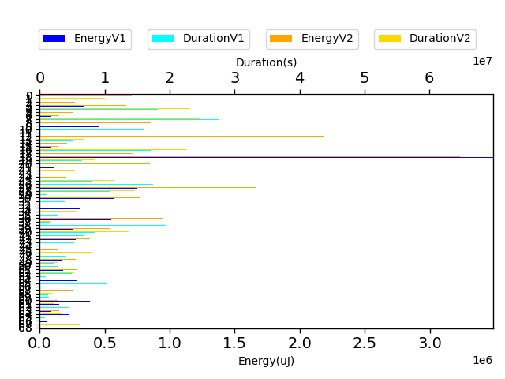

| Index | TestClassName | #Tests |
| --- | --- | --- |
| 0 | com.google.gson.functional.StreamingTypeAdaptersTest | 10 |
| 1 | com.google.gson.functional.JsonAdapterAnnotationOnClassesTest | 8 |
| 2 | com.google.gson.functional.CustomDeserializerTest | 3 |
| 3 | com.google.gson.functional.ExclusionStrategyFunctionalTest | 6 |
| 4 | com.google.gson.stream.JsonWriterTest | 39 |
| 5 | com.google.gson.functional.JsonAdapterSerializerDeserializerTest | 3 |
| 6 | com.google.gson.functional.InterfaceTest | 2 |
| 7 | com.google.gson.functional.ParameterizedTypesTest | 12 |
| 8 | com.google.gson.functional.InheritanceTest | 11 |
| 9 | com.google.gson.functional.NamingPolicyTest | 10 |
| 10 | com.google.gson.functional.CircularReferenceTest | 5 |
| 11 | com.google.gson.functional.PrettyPrintingTest | 8 |
| 12 | com.google.gson.functional.MapTest | 27 |
| 13 | com.google.gson.functional.ExposeFieldsTest | 5 |
| 14 | com.google.gson.functional.FieldExclusionTest | 3 |
| 15 | com.google.gson.GsonBuilderTest | 2 |
| 16 | com.google.gson.functional.CollectionTest | 18 |
| 17 | com.google.gson.functional.MoreSpecificTypeSerializationTest | 6 |
| 18 | com.google.gson.functional.DefaultTypeAdaptersTest | 39 |
| 19 | com.google.gson.functional.JavaUtilConcurrentAtomicTest | 7 |
| 20 | com.google.gson.internal.bind.JsonTreeWriterTest | 12 |
| 21 | com.google.gson.functional.DelegateTypeAdapterTest | 2 |
| 22 | com.google.gson.functional.TypeAdapterPrecedenceTest | 8 |
| 23 | com.google.gson.functional.JsonTreeTest | 4 |
| 24 | com.google.gson.DefaultMapJsonSerializerTest | 3 |
| 25 | com.google.gson.functional.ArrayTest | 15 |
| 26 | com.google.gson.functional.ObjectTest | 20 |
| 27 | com.google.gson.internal.bind.JsonElementReaderTest | 17 |
| 28 | com.google.gson.functional.JsonAdapterAnnotationOnFieldsTest | 9 |
| 29 | com.google.gson.functional.SerializedNameTest | 1 |
| 30 | com.google.gson.functional.EnumTest | 9 |
| 31 | com.google.gson.functional.TypeHierarchyAdapterTest | 2 |
| 32 | com.google.gson.DefaultDateTypeAdapterTest | 6 |
| 33 | com.google.gson.functional.VersioningTest | 5 |
| 34 | com.google.gson.functional.MapAsArrayTypeAdapterTest | 3 |
| 35 | com.google.gson.functional.RuntimeTypeAdapterFactoryFunctionalTest | 1 |
| 36 | com.google.gson.functional.CustomTypeAdaptersTest | 12 |
| 37 | com.google.gson.LongSerializationPolicyTest | 2 |
| 38 | com.google.gson.functional.PrimitiveTest | 36 |
| 39 | com.google.gson.functional.ThrowableFunctionalTest | 5 |
| 40 | com.google.gson.functional.ConcurrencyTest | 2 |
| 41 | com.google.gson.functional.FieldNamingTest | 5 |
| 42 | com.google.gson.functional.RawSerializationTest | 5 |
| 43 | com.google.gson.functional.JsonParserTest | 5 |
| 44 | com.google.gson.ObjectTypeAdapterTest | 3 |
| 45 | com.google.gson.functional.SecurityTest | 2 |
| 46 | com.google.gson.functional.NullObjectAndFieldTest | 10 |
| 47 | com.google.gson.MixedStreamTest | 7 |
| 48 | com.google.gson.functional.TypeVariableTest | 3 |
| 49 | com.google.gson.DefaultInetAddressTypeAdapterTest | 1 |
| 50 | com.google.gson.functional.ReadersWritersTest | 5 |
| 51 | com.google.gson.GsonTypeAdapterTest | 4 |
| 52 | com.google.gson.functional.JsonArrayTest | 8 |
| 53 | com.google.gson.functional.PrimitiveCharacterTest | 1 |
| 54 | com.google.gson.functional.CustomSerializerTest | 5 |
| 55 | com.google.gson.functional.StringTest | 9 |
| 56 | com.google.gson.regression.JsonAdapterNullSafeTest | 1 |
| 57 | com.google.gson.functional.JavaUtilTest | 2 |
| 58 | com.google.gson.functional.TreeTypeAdaptersTest | 1 |
| 59 | com.google.gson.OverrideCoreTypeAdaptersTest | 3 |
| 60 | com.google.gson.JsonParserTest | 2 |
| 61 | com.google.gson.functional.PrintFormattingTest | 3 |
| 62 | com.google.gson.functional.UncategorizedTest | 3 |
| 63 | com.google.gson.internal.bind.JsonTreeReaderTest | 2 |
| 64 | com.google.gson.functional.EscapingTest | 5 |
| 65 | com.google.gson.functional.InternationalizationTest | 1 |
| 66 | com.google.gson.functional.GsonVersionDiagnosticsTest | 1 |
| 67 | com.google.gson.JsonPrimitiveTest | 2 |
| 68 | com.google.gson.JsonObjectTest | 2 |

| Time Label | Time (s) |
| --- | --- |
| Selection | 37.06872749328613 |
| Injection | 22.471374034881592 |
| Total | 1821.1801595687866 |
## com.google.gson.functional.StreamingTypeAdaptersTest

| Test | IterationV1 | IterationV2 | DeltaIteration |
| --- | --- | --- | --- |
| com.google.gson.functional.StreamingTypeAdaptersTest-testNullSafe | 83 | 87 | 4 |
| com.google.gson.functional.StreamingTypeAdaptersTest-testFromJsonTree | 46 | 51 | 5 |
| com.google.gson.functional.StreamingTypeAdaptersTest-testSerializeNullObject | 12 | 18 | 6 |
| com.google.gson.functional.StreamingTypeAdaptersTest-testSerializeWithCustomTypeAdapter | 63 | 68 | 5 |
| com.google.gson.functional.StreamingTypeAdaptersTest-testSerialize1dArray | 35 | 40 | 5 |
| com.google.gson.functional.StreamingTypeAdaptersTest-testSerializeRecursive | 57 | 53 | -4 |
| com.google.gson.functional.StreamingTypeAdaptersTest-testSerialize2dArray | 35 | 32 | -3 |
| com.google.gson.functional.StreamingTypeAdaptersTest-testSerializeMap | 20 | 17 | -3 |
| com.google.gson.functional.StreamingTypeAdaptersTest-testSerialize | 51 | 59 | 8 |
| com.google.gson.functional.StreamingTypeAdaptersTest-testSerializeNullField | 17 | 18 | 1 |

| Test | EnergyV1 | EnergyV2 | DeltaEnergy |
| --- | --- | --- | --- |
| com.google.gson.functional.StreamingTypeAdaptersTest-testNullSafe | 42957.969651966894 | 42952.11058709873 | -5.859064868163841 |
| com.google.gson.functional.StreamingTypeAdaptersTest-testFromJsonTree | 47544.90988158248 | 45667.42581931552 | -1877.484062266958 |
| com.google.gson.functional.StreamingTypeAdaptersTest-testSerializeNullObject | 41050.565185546875 | 43836.15409088135 | 2785.5889053344727 |
| com.google.gson.functional.StreamingTypeAdaptersTest-testSerializeWithCustomTypeAdapter | 44037.945312598225 | 41768.46280196896 | -2269.482510629263 |
| com.google.gson.functional.StreamingTypeAdaptersTest-testSerialize1dArray | 43780.28790033411 | 41272.97037942818 | -2507.3175209059264 |
| com.google.gson.functional.StreamingTypeAdaptersTest-testSerializeRecursive | 41617.92029296176 | 42552.75095608947 | 934.8306631277082 |
| com.google.gson.functional.StreamingTypeAdaptersTest-testSerialize2dArray | 44547.606054023665 | 42562.04229599191 | -1985.5637580317562 |
| com.google.gson.functional.StreamingTypeAdaptersTest-testSerializeMap | 42908.665546417236 | 42223.789794921875 | -684.8757514953613 |
| com.google.gson.functional.StreamingTypeAdaptersTest-testSerialize | 45209.04262255302 | 44569.04063608347 | -640.0019864695496 |
| com.google.gson.functional.StreamingTypeAdaptersTest-testSerializeNullField | 42961.16532897949 | 42859.49018096924 | -101.6751480102539 |

| Test | DurationV1 | DurationsV2 | DeltaDuration |
| --- | --- | --- | --- |
| com.google.gson.functional.StreamingTypeAdaptersTest-testNullSafe | 1021758.8866938354 | 1395724.5845478573 | 373965.6978540219 |
| com.google.gson.functional.StreamingTypeAdaptersTest-testFromJsonTree | 796412.4336920535 | 1016774.7989895674 | 220362.3652975139 |
| com.google.gson.functional.StreamingTypeAdaptersTest-testSerializeNullObject | 341741.5400390625 | 392332.55922698975 | 50591.019187927246 |
| com.google.gson.functional.StreamingTypeAdaptersTest-testSerializeWithCustomTypeAdapter | 820345.7144278609 | 989164.7966222528 | 168819.08219439187 |
| com.google.gson.functional.StreamingTypeAdaptersTest-testSerialize1dArray | 652073.9984987847 | 770375.1414524999 | 118301.14295371517 |
| com.google.gson.functional.StreamingTypeAdaptersTest-testSerializeRecursive | 757729.7292930484 | 813458.0622835355 | 55728.332990487106 |
| com.google.gson.functional.StreamingTypeAdaptersTest-testSerialize2dArray | 535442.8129898246 | 574605.65569284 | 39162.84270301543 |
| com.google.gson.functional.StreamingTypeAdaptersTest-testSerializeMap | 424162.7115917206 | 665179.0992736816 | 241016.38768196106 |
| com.google.gson.functional.StreamingTypeAdaptersTest-testSerialize | 757024.0881949859 | 912869.796563259 | 155845.7083682731 |
| com.google.gson.functional.StreamingTypeAdaptersTest-testSerializeNullField | 373428.14724731445 | 356940.97425842285 | -16487.1729888916 |

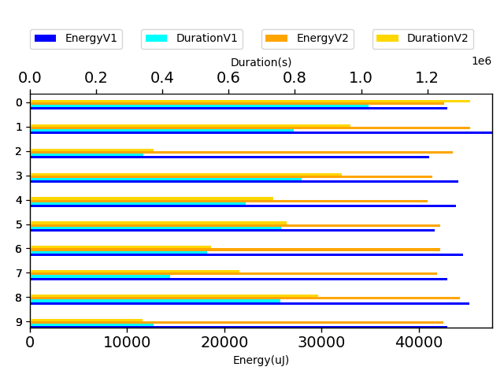

## com.google.gson.functional.JsonAdapterAnnotationOnClassesTest

| Test | IterationV1 | IterationV2 | DeltaIteration |
| --- | --- | --- | --- |
| com.google.gson.functional.JsonAdapterAnnotationOnClassesTest-testJsonAdapterInvoked | 99 | 99 | 0 |
| com.google.gson.functional.JsonAdapterAnnotationOnClassesTest-testRegisteredAdapterOverridesJsonAdapter | 35 | 38 | 3 |
| com.google.gson.functional.JsonAdapterAnnotationOnClassesTest-testRegisteredDeserializerOverridesJsonAdapter | 46 | 41 | -5 |
| com.google.gson.functional.JsonAdapterAnnotationOnClassesTest-testSuperclassTypeAdapterNotInvoked | 44 | 47 | 3 |
| com.google.gson.functional.JsonAdapterAnnotationOnClassesTest-testIncorrectTypeAdapterFails | 52 | 60 | 8 |
| com.google.gson.functional.JsonAdapterAnnotationOnClassesTest-testJsonAdapterFactoryInvoked | 80 | 79 | -1 |
| com.google.gson.functional.JsonAdapterAnnotationOnClassesTest-testIncorrectJsonAdapterType | 61 | 58 | -3 |
| com.google.gson.functional.JsonAdapterAnnotationOnClassesTest-testRegisteredSerializerOverridesJsonAdapter | 52 | 41 | -11 |

| Test | EnergyV1 | EnergyV2 | DeltaEnergy |
| --- | --- | --- | --- |
| com.google.gson.functional.JsonAdapterAnnotationOnClassesTest-testJsonAdapterInvoked | 63753.25241347986 | 72233.60879004303 | 8480.35637656317 |
| com.google.gson.functional.JsonAdapterAnnotationOnClassesTest-testRegisteredAdapterOverridesJsonAdapter | 40029.48745110704 | 43772.87916705157 | 3743.3917159445336 |
| com.google.gson.functional.JsonAdapterAnnotationOnClassesTest-testRegisteredDeserializerOverridesJsonAdapter | 41876.93179263667 | 43986.742908558466 | 2109.811115921795 |
| com.google.gson.functional.JsonAdapterAnnotationOnClassesTest-testSuperclassTypeAdapterNotInvoked | 39278.13222957019 | 43244.10226194635 | 3965.970032376157 |
| com.google.gson.functional.JsonAdapterAnnotationOnClassesTest-testIncorrectTypeAdapterFails | 43225.85577964538 | 42665.28004438816 | -560.5757352572255 |
| com.google.gson.functional.JsonAdapterAnnotationOnClassesTest-testJsonAdapterFactoryInvoked | 42412.35772891722 | 44011.09666824668 | 1598.7389393294652 |
| com.google.gson.functional.JsonAdapterAnnotationOnClassesTest-testIncorrectJsonAdapterType | 42961.12676488062 | 44218.713903973665 | 1257.5871390930479 |
| com.google.gson.functional.JsonAdapterAnnotationOnClassesTest-testRegisteredSerializerOverridesJsonAdapter | 45438.77810112342 | 42836.88093191948 | -2601.8971692039413 |

| Test | DurationV1 | DurationsV2 | DeltaDuration |
| --- | --- | --- | --- |
| com.google.gson.functional.JsonAdapterAnnotationOnClassesTest-testJsonAdapterInvoked | 2268641.1823366354 | 2173792.2129060705 | -94848.9694305649 |
| com.google.gson.functional.JsonAdapterAnnotationOnClassesTest-testRegisteredAdapterOverridesJsonAdapter | 570574.1395809081 | 569333.8753893921 | -1240.2641915159766 |
| com.google.gson.functional.JsonAdapterAnnotationOnClassesTest-testRegisteredDeserializerOverridesJsonAdapter | 675157.8242820972 | 615419.7670984417 | -59738.057183655445 |
| com.google.gson.functional.JsonAdapterAnnotationOnClassesTest-testSuperclassTypeAdapterNotInvoked | 634063.6763937525 | 648918.6252324316 | 14854.94883867912 |
| com.google.gson.functional.JsonAdapterAnnotationOnClassesTest-testIncorrectTypeAdapterFails | 670242.4047812183 | 657958.116894382 | -12284.287886836217 |
| com.google.gson.functional.JsonAdapterAnnotationOnClassesTest-testJsonAdapterFactoryInvoked | 926664.5193487168 | 1183267.9213743543 | 256603.40202563745 |
| com.google.gson.functional.JsonAdapterAnnotationOnClassesTest-testIncorrectJsonAdapterType | 761991.3892458039 | 805865.6247741255 | 43874.23552832159 |
| com.google.gson.functional.JsonAdapterAnnotationOnClassesTest-testRegisteredSerializerOverridesJsonAdapter | 774673.161003354 | 653151.5449339135 | -121521.6160694405 |

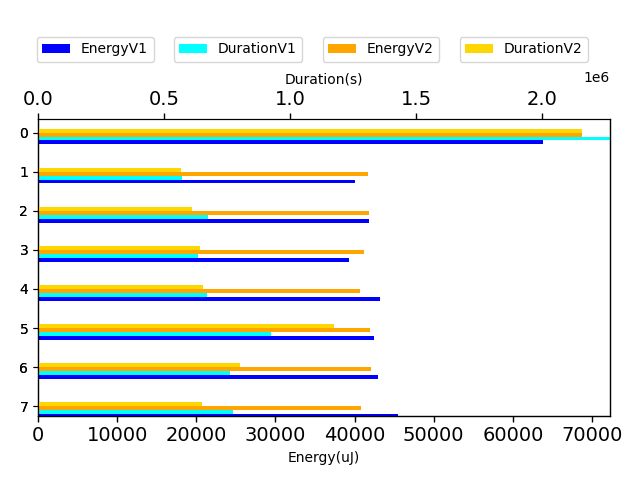

## com.google.gson.functional.CustomDeserializerTest

| Test | IterationV1 | IterationV2 | DeltaIteration |
| --- | --- | --- | --- |
| com.google.gson.functional.CustomDeserializerTest-testDefaultConstructorNotCalledOnField | 53 | 58 | 5 |
| com.google.gson.functional.CustomDeserializerTest-testDefaultConstructorNotCalledOnObject | 39 | 42 | 3 |
| com.google.gson.functional.CustomDeserializerTest-testJsonTypeFieldBasedDeserialization | 99 | 99 | 0 |

| Test | EnergyV1 | EnergyV2 | DeltaEnergy |
| --- | --- | --- | --- |
| com.google.gson.functional.CustomDeserializerTest-testDefaultConstructorNotCalledOnField | 43802.27688887934 | 60996.304908919046 | 17194.028020039703 |
| com.google.gson.functional.CustomDeserializerTest-testDefaultConstructorNotCalledOnObject | 41640.17017065243 | 41970.485074212316 | 330.31490355988353 |
| com.google.gson.functional.CustomDeserializerTest-testJsonTypeFieldBasedDeserialization | 43185.86750859863 | 61561.87381712536 | 18376.006308526725 |

| Test | DurationV1 | DurationsV2 | DeltaDuration |
| --- | --- | --- | --- |
| com.google.gson.functional.CustomDeserializerTest-testDefaultConstructorNotCalledOnField | 639040.559971887 | 1188203.1201840849 | 549162.5602121978 |
| com.google.gson.functional.CustomDeserializerTest-testDefaultConstructorNotCalledOnObject | 557106.0305368461 | 1018875.4414179702 | 461769.4108811241 |
| com.google.gson.functional.CustomDeserializerTest-testJsonTypeFieldBasedDeserialization | 1341255.0221419968 | 1407233.5542655974 | 65978.5321236006 |

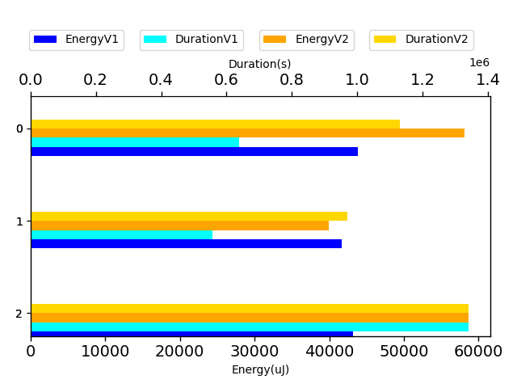

## com.google.gson.functional.ExclusionStrategyFunctionalTest

| Test | IterationV1 | IterationV2 | DeltaIteration |
| --- | --- | --- | --- |
| com.google.gson.functional.ExclusionStrategyFunctionalTest-testExclusionStrategySerializationDoesNotImpactSerialization | 34 | 36 | 2 |
| com.google.gson.functional.ExclusionStrategyFunctionalTest-testExcludeTopLevelClassSerialization | 16 | 11 | -5 |
| com.google.gson.functional.ExclusionStrategyFunctionalTest-testExclusionStrategySerialization | 95 | 95 | 0 |
| com.google.gson.functional.ExclusionStrategyFunctionalTest-testExclusionStrategyDeserialization | 48 | 43 | -5 |
| com.google.gson.functional.ExclusionStrategyFunctionalTest-testExclusionStrategyWithMode | 37 | 48 | 11 |
| com.google.gson.functional.ExclusionStrategyFunctionalTest-testExcludeTopLevelClassDeserializationDoesNotImpactSerialization | 35 | 29 | -6 |

| Test | EnergyV1 | EnergyV2 | DeltaEnergy |
| --- | --- | --- | --- |
| com.google.gson.functional.ExclusionStrategyFunctionalTest-testExclusionStrategySerializationDoesNotImpactSerialization | 39718.32515962515 | 44357.15546054316 | 4638.830300918009 |
| com.google.gson.functional.ExclusionStrategyFunctionalTest-testExcludeTopLevelClassSerialization | 44177.68032836914 | 42643.2890625 | -1534.3912658691406 |
| com.google.gson.functional.ExclusionStrategyFunctionalTest-testExclusionStrategySerialization | 79345.65899399357 | 95910.30836474095 | 16564.649370747386 |
| com.google.gson.functional.ExclusionStrategyFunctionalTest-testExclusionStrategyDeserialization | 93335.73296955336 | 137635.9120531481 | 44300.17908359473 |
| com.google.gson.functional.ExclusionStrategyFunctionalTest-testExclusionStrategyWithMode | 43326.73036076025 | 43437.41044218921 | 110.68008142895997 |
| com.google.gson.functional.ExclusionStrategyFunctionalTest-testExcludeTopLevelClassDeserializationDoesNotImpactSerialization | 44072.582106571004 | 40570.30883150175 | -3502.273275069252 |

| Test | DurationV1 | DurationsV2 | DeltaDuration |
| --- | --- | --- | --- |
| com.google.gson.functional.ExclusionStrategyFunctionalTest-testExclusionStrategySerializationDoesNotImpactSerialization | 614613.3043637881 | 974527.5008377956 | 359914.19647400745 |
| com.google.gson.functional.ExclusionStrategyFunctionalTest-testExcludeTopLevelClassSerialization | 339150.173248291 | 495750.73046875 | 156600.55722045898 |
| com.google.gson.functional.ExclusionStrategyFunctionalTest-testExclusionStrategySerialization | 2682387.744647865 | 2547886.649127129 | -134501.09552073618 |
| com.google.gson.functional.ExclusionStrategyFunctionalTest-testExclusionStrategyDeserialization | 2763137.383942367 | 3320839.5506113134 | 557702.1666689464 |
| com.google.gson.functional.ExclusionStrategyFunctionalTest-testExclusionStrategyWithMode | 671360.5401619835 | 757487.0278004375 | 86126.48763845407 |
| com.google.gson.functional.ExclusionStrategyFunctionalTest-testExcludeTopLevelClassDeserializationDoesNotImpactSerialization | 491930.50357480027 | 725410.8186188266 | 233480.3150440263 |

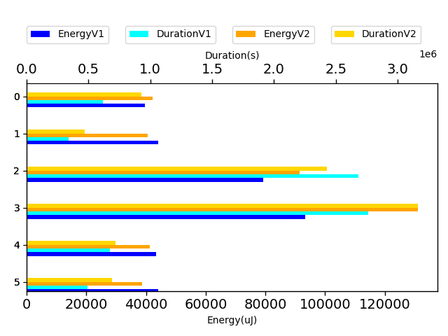

## com.google.gson.stream.JsonWriterTest

| Test | IterationV1 | IterationV2 | DeltaIteration |
| --- | --- | --- | --- |
| com.google.gson.stream.JsonWriterTest-testMultipleTopLevelValues | 7 | 6 | -1 |
| com.google.gson.stream.JsonWriterTest-testDeepNestingArrays | 9 | 15 | 6 |
| com.google.gson.stream.JsonWriterTest-testJsonValue | 12 | 15 | 3 |
| com.google.gson.stream.JsonWriterTest-testUnicodeLineBreaksEscaped | 14 | 15 | 1 |
| com.google.gson.stream.JsonWriterTest-testBadNestingArray | 7 | 11 | 4 |
| com.google.gson.stream.JsonWriterTest-testStrictWriterDoesNotPermitMultipleTopLevelValues | 12 | 4 | -8 |
| com.google.gson.stream.JsonWriterTest-testPrettyPrintObject | 14 | 16 | 2 |
| com.google.gson.stream.JsonWriterTest-testNumbers | 39 | 54 | 15 |
| com.google.gson.stream.JsonWriterTest-testStrings | 14 | 15 | 1 |
| com.google.gson.stream.JsonWriterTest-testNonFiniteDoubles | 24 | 24 | 0 |
| com.google.gson.stream.JsonWriterTest-testNullStringValue | 16 | 12 | -4 |
| com.google.gson.stream.JsonWriterTest-testEmptyObject | 14 | 10 | -4 |
| com.google.gson.stream.JsonWriterTest-testDoubles | 43 | 52 | 9 |
| com.google.gson.stream.JsonWriterTest-testDeepNestingObjects | 12 | 13 | 1 |
| com.google.gson.stream.JsonWriterTest-testTwoNames | 11 | 8 | -3 |
| com.google.gson.stream.JsonWriterTest-testWriterCloseIsIdempotent | 11 | 12 | 1 |
| com.google.gson.stream.JsonWriterTest-testNullName | 15 | 16 | 1 |
| com.google.gson.stream.JsonWriterTest-testNonFiniteBoxedDoubles | 17 | 18 | 1 |
| com.google.gson.stream.JsonWriterTest-testNameWithoutValue | 14 | 13 | -1 |
| com.google.gson.stream.JsonWriterTest-testValueWithoutName | 17 | 17 | 0 |
| com.google.gson.stream.JsonWriterTest-testNonFiniteDoublesWhenLenient | 11 | 15 | 4 |
| com.google.gson.stream.JsonWriterTest-testBadNestingObject | 14 | 14 | 0 |
| com.google.gson.stream.JsonWriterTest-testClosedWriterThrowsOnFlush | 8 | 13 | 5 |
| com.google.gson.stream.JsonWriterTest-testPrettyPrintArray | 18 | 15 | -3 |
| com.google.gson.stream.JsonWriterTest-testNonFiniteBoxedDoublesWhenLenient | 8 | 14 | 6 |
| com.google.gson.stream.JsonWriterTest-testClosedWriterThrowsOnName | 11 | 12 | 1 |
| com.google.gson.stream.JsonWriterTest-testClosedWriterThrowsOnStructure | 12 | 15 | 3 |
| com.google.gson.stream.JsonWriterTest-testLenientWriterPermitsMultipleTopLevelValues | 10 | 14 | 4 |
| com.google.gson.stream.JsonWriterTest-testInvalidTopLevelTypes | 15 | 12 | -3 |
| com.google.gson.stream.JsonWriterTest-testArraysInObjects | 14 | 15 | 1 |
| com.google.gson.stream.JsonWriterTest-testRepeatedName | 16 | 9 | -7 |
| com.google.gson.stream.JsonWriterTest-testClosedWriterThrowsOnValue | 9 | 9 | 0 |
| com.google.gson.stream.JsonWriterTest-testTopLevelValueTypes | 15 | 20 | 5 |
| com.google.gson.stream.JsonWriterTest-testLongs | 8 | 13 | 5 |
| com.google.gson.stream.JsonWriterTest-testBooleans | 14 | 7 | -7 |
| com.google.gson.stream.JsonWriterTest-testObjectsInArrays | 7 | 11 | 4 |
| com.google.gson.stream.JsonWriterTest-testNulls | 7 | 12 | 5 |
| com.google.gson.stream.JsonWriterTest-testEmptyArray | 12 | 19 | 7 |
| com.google.gson.stream.JsonWriterTest-testBoxedBooleans | 13 | 11 | -2 |

| Test | EnergyV1 | EnergyV2 | DeltaEnergy |
| --- | --- | --- | --- |
| com.google.gson.stream.JsonWriterTest-testMultipleTopLevelValues | 40553.328125 | 44246.78125 | 3693.453125 |
| com.google.gson.stream.JsonWriterTest-testDeepNestingArrays | 43170.48046875 | 43609.214782714844 | 438.73431396484375 |
| com.google.gson.stream.JsonWriterTest-testJsonValue | 40260.97265625 | 45895.519470214844 | 5634.546813964844 |
| com.google.gson.stream.JsonWriterTest-testUnicodeLineBreaksEscaped | 43658.05194091797 | 40598.21124267578 | -3059.8406982421875 |
| com.google.gson.stream.JsonWriterTest-testBadNestingArray | 40404.953125 | 44905.029296875 | 4500.076171875 |
| com.google.gson.stream.JsonWriterTest-testStrictWriterDoesNotPermitMultipleTopLevelValues | 39381.221923828125 | 41862.375 | 2481.153076171875 |
| com.google.gson.stream.JsonWriterTest-testPrettyPrintObject | 42226.511657714844 | 44194.51187133789 | 1968.0002136230469 |
| com.google.gson.stream.JsonWriterTest-testNumbers | 55878.02334100163 | 48678.66645156783 | -7199.356889433802 |
| com.google.gson.stream.JsonWriterTest-testStrings | 42384.0419921875 | 43944.832580566406 | 1560.7905883789062 |
| com.google.gson.stream.JsonWriterTest-testNonFiniteDoubles | 39034.8043538332 | 43312.14367669821 | 4277.339322865009 |
| com.google.gson.stream.JsonWriterTest-testNullStringValue | 42969.68426513672 | 39407.4921875 | -3562.1920776367188 |
| com.google.gson.stream.JsonWriterTest-testEmptyObject | 48866.098388671875 | 45425.013671875 | -3441.084716796875 |
| com.google.gson.stream.JsonWriterTest-testDoubles | 43310.476792889225 | 51363.28417422662 | 8052.807381337392 |
| com.google.gson.stream.JsonWriterTest-testDeepNestingObjects | 39365.53173828125 | 42632.4453125 | 3266.91357421875 |
| com.google.gson.stream.JsonWriterTest-testTwoNames | 42406.5224609375 | 43512.8125 | 1106.2900390625 |
| com.google.gson.stream.JsonWriterTest-testWriterCloseIsIdempotent | 41236.5205078125 | 39046.96923828125 | -2189.55126953125 |
| com.google.gson.stream.JsonWriterTest-testNullName | 47059.21514892578 | 42069.37841796875 | -4989.836730957031 |
| com.google.gson.stream.JsonWriterTest-testNonFiniteBoxedDoubles | 41012.18522644043 | 43638.465980529785 | 2626.2807540893555 |
| com.google.gson.stream.JsonWriterTest-testNameWithoutValue | 41259.055908203125 | 42975.69921875 | 1716.643310546875 |
| com.google.gson.stream.JsonWriterTest-testValueWithoutName | 43013.854904174805 | 43246.32223510742 | 232.4673309326172 |
| com.google.gson.stream.JsonWriterTest-testNonFiniteDoublesWhenLenient | 40943.4638671875 | 44217.228454589844 | 3273.7645874023438 |
| com.google.gson.stream.JsonWriterTest-testBadNestingObject | 41099.79052734375 | 42280.96350097656 | 1181.1729736328125 |
| com.google.gson.stream.JsonWriterTest-testClosedWriterThrowsOnFlush | 45564.5703125 | 43242.17736816406 | -2322.3929443359375 |
| com.google.gson.stream.JsonWriterTest-testPrettyPrintArray | 63344.4528503418 | 41682.73962402344 | -21661.71322631836 |
| com.google.gson.stream.JsonWriterTest-testNonFiniteBoxedDoublesWhenLenient | 44165.2109375 | 58274.161865234375 | 14108.950927734375 |
| com.google.gson.stream.JsonWriterTest-testClosedWriterThrowsOnName | 41207.3173828125 | 40204.08544921875 | -1003.23193359375 |
| com.google.gson.stream.JsonWriterTest-testClosedWriterThrowsOnStructure | 42474.2802734375 | 43043.664459228516 | 569.3841857910156 |
| com.google.gson.stream.JsonWriterTest-testLenientWriterPermitsMultipleTopLevelValues | 42747.31640625 | 52278.02526855469 | 9530.708862304688 |
| com.google.gson.stream.JsonWriterTest-testInvalidTopLevelTypes | 41797.21600341797 | 41848.76806640625 | 51.55206298828125 |
| com.google.gson.stream.JsonWriterTest-testArraysInObjects | 42209.57458496094 | 41875.997985839844 | -333.57659912109375 |
| com.google.gson.stream.JsonWriterTest-testRepeatedName | 44296.11730957031 | 43280.97265625 | -1015.1446533203125 |
| com.google.gson.stream.JsonWriterTest-testClosedWriterThrowsOnValue | 43419.72265625 | 44310.78125 | 891.05859375 |
| com.google.gson.stream.JsonWriterTest-testTopLevelValueTypes | 43487.343017578125 | 43201.03359222412 | -286.3094253540039 |
| com.google.gson.stream.JsonWriterTest-testLongs | 40748.1640625 | 42005.011962890625 | 1256.847900390625 |
| com.google.gson.stream.JsonWriterTest-testBooleans | 42748.59484863281 | 44818.765625 | 2070.1707763671875 |
| com.google.gson.stream.JsonWriterTest-testObjectsInArrays | 40128.734375 | 42656.2587890625 | 2527.5244140625 |
| com.google.gson.stream.JsonWriterTest-testNulls | 44601.328125 | 40883.93896484375 | -3717.38916015625 |
| com.google.gson.stream.JsonWriterTest-testEmptyArray | 39360.107421875 | 42577.89097213745 | 3217.783550262451 |
| com.google.gson.stream.JsonWriterTest-testBoxedBooleans | 44000.7626953125 | 68772.6552734375 | 24771.892578125 |

| Test | DurationV1 | DurationsV2 | DeltaDuration |
| --- | --- | --- | --- |
| com.google.gson.stream.JsonWriterTest-testMultipleTopLevelValues | 297294.5625 | 355443.625 | 58149.0625 |
| com.google.gson.stream.JsonWriterTest-testDeepNestingArrays | 401242.76171875 | 375596.2883300781 | -25646.473388671875 |
| com.google.gson.stream.JsonWriterTest-testJsonValue | 339873.1120605469 | 289558.8256225586 | -50314.28643798828 |
| com.google.gson.stream.JsonWriterTest-testUnicodeLineBreaksEscaped | 424897.4789428711 | 375764.5441894531 | -49132.93475341797 |
| com.google.gson.stream.JsonWriterTest-testBadNestingArray | 470296.109375 | 286411.06640625 | -183885.04296875 |
| com.google.gson.stream.JsonWriterTest-testStrictWriterDoesNotPermitMultipleTopLevelValues | 374488.6042480469 | 280502.625 | -93985.97924804688 |
| com.google.gson.stream.JsonWriterTest-testPrettyPrintObject | 449284.25396728516 | 336157.34579467773 | -113126.90817260742 |
| com.google.gson.stream.JsonWriterTest-testNumbers | 977602.0575427735 | 780237.0050911115 | -197365.05245166202 |
| com.google.gson.stream.JsonWriterTest-testStrings | 473201.02502441406 | 308791.50982666016 | -164409.5151977539 |
| com.google.gson.stream.JsonWriterTest-testNonFiniteDoubles | 995073.6962224245 | 688769.3813751936 | -306304.3148472309 |
| com.google.gson.stream.JsonWriterTest-testNullStringValue | 350330.7731323242 | 406677.9914550781 | 56347.218322753906 |
| com.google.gson.stream.JsonWriterTest-testEmptyObject | 1083289.931274414 | 313120.189453125 | -770169.7418212891 |
| com.google.gson.stream.JsonWriterTest-testDoubles | 699156.9548639853 | 763476.6659794988 | 64319.71111551346 |
| com.google.gson.stream.JsonWriterTest-testDeepNestingObjects | 316127.6474609375 | 293352.10546875 | -22775.5419921875 |
| com.google.gson.stream.JsonWriterTest-testTwoNames | 308365.9423828125 | 318329.25 | 9963.3076171875 |
| com.google.gson.stream.JsonWriterTest-testWriterCloseIsIdempotent | 304884.41015625 | 285855.5478515625 | -19028.8623046875 |
| com.google.gson.stream.JsonWriterTest-testNullName | 339713.6958618164 | 330298.2977294922 | -9415.398132324219 |
| com.google.gson.stream.JsonWriterTest-testNonFiniteBoxedDoubles | 582375.06690979 | 379726.87380981445 | -202648.1930999756 |
| com.google.gson.stream.JsonWriterTest-testNameWithoutValue | 356224.79235839844 | 328681.51318359375 | -27543.279174804688 |
| com.google.gson.stream.JsonWriterTest-testValueWithoutName | 278191.1220855713 | 292109.0191497803 | 13917.897064208984 |
| com.google.gson.stream.JsonWriterTest-testNonFiniteDoublesWhenLenient | 448401.39453125 | 320385.6011352539 | -128015.7933959961 |
| com.google.gson.stream.JsonWriterTest-testBadNestingObject | 500601.67529296875 | 327061.6306152344 | -173540.04467773438 |
| com.google.gson.stream.JsonWriterTest-testClosedWriterThrowsOnFlush | 318891.265625 | 312761.39196777344 | -6129.8736572265625 |
| com.google.gson.stream.JsonWriterTest-testPrettyPrintArray | 933377.3846359253 | 407381.4637451172 | -525995.9208908081 |
| com.google.gson.stream.JsonWriterTest-testNonFiniteBoxedDoublesWhenLenient | 288922.5625 | 792311.0472412109 | 503388.48474121094 |
| com.google.gson.stream.JsonWriterTest-testClosedWriterThrowsOnName | 335046.8486328125 | 314929.52978515625 | -20117.31884765625 |
| com.google.gson.stream.JsonWriterTest-testClosedWriterThrowsOnStructure | 337765.1572265625 | 442464.1372680664 | 104698.9800415039 |
| com.google.gson.stream.JsonWriterTest-testLenientWriterPermitsMultipleTopLevelValues | 272518.986328125 | 1549756.8045654297 | 1277237.8182373047 |
| com.google.gson.stream.JsonWriterTest-testInvalidTopLevelTypes | 429875.6866455078 | 333841.0517578125 | -96034.63488769531 |
| com.google.gson.stream.JsonWriterTest-testArraysInObjects | 317591.84533691406 | 286935.5163574219 | -30656.328979492188 |
| com.google.gson.stream.JsonWriterTest-testRepeatedName | 299683.8433227539 | 333055.37890625 | 33371.535583496094 |
| com.google.gson.stream.JsonWriterTest-testClosedWriterThrowsOnValue | 291605.08203125 | 267060.98828125 | -24544.09375 |
| com.google.gson.stream.JsonWriterTest-testTopLevelValueTypes | 1326557.7788085938 | 325859.6799850464 | -1000698.0988235474 |
| com.google.gson.stream.JsonWriterTest-testLongs | 280099.9765625 | 292787.7546386719 | 12687.778076171875 |
| com.google.gson.stream.JsonWriterTest-testBooleans | 538471.7762451172 | 360288.765625 | -178183.0106201172 |
| com.google.gson.stream.JsonWriterTest-testObjectsInArrays | 293092.75 | 299521.8759765625 | 6429.1259765625 |
| com.google.gson.stream.JsonWriterTest-testNulls | 278160.90625 | 278914.82470703125 | 753.91845703125 |
| com.google.gson.stream.JsonWriterTest-testEmptyArray | 497618.66943359375 | 394195.029750824 | -103423.63968276978 |
| com.google.gson.stream.JsonWriterTest-testBoxedBooleans | 305923.421875 | 1379730.4951171875 | 1073807.0732421875 |

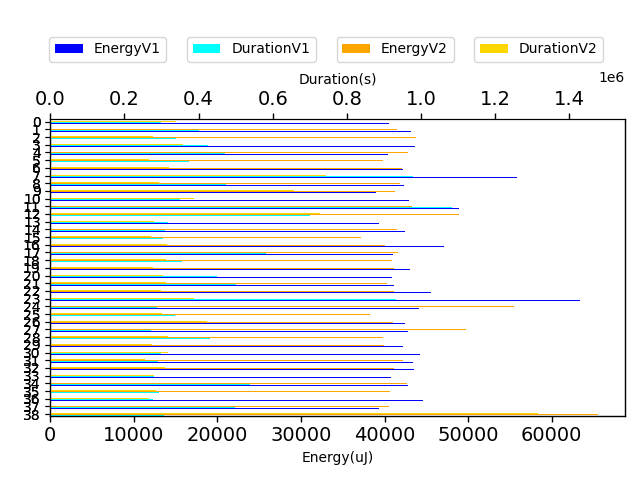

## com.google.gson.functional.JsonAdapterSerializerDeserializerTest

| Test | IterationV1 | IterationV2 | DeltaIteration |
| --- | --- | --- | --- |
| com.google.gson.functional.JsonAdapterSerializerDeserializerTest-testJsonSerializerDeserializerBasedJsonAdapterOnFields | 99 | 99 | 0 |
| com.google.gson.functional.JsonAdapterSerializerDeserializerTest-testDifferentJsonAdaptersForGenericFieldsOfSameRawType | 99 | 99 | 0 |
| com.google.gson.functional.JsonAdapterSerializerDeserializerTest-testJsonSerializerDeserializerBasedJsonAdapterOnClass | 92 | 95 | 3 |

| Test | EnergyV1 | EnergyV2 | DeltaEnergy |
| --- | --- | --- | --- |
| com.google.gson.functional.JsonAdapterSerializerDeserializerTest-testJsonSerializerDeserializerBasedJsonAdapterOnFields | 58141.7532241511 | 63746.444168505936 | 5604.690944354836 |
| com.google.gson.functional.JsonAdapterSerializerDeserializerTest-testDifferentJsonAdaptersForGenericFieldsOfSameRawType | 60200.818290747564 | 51750.18337378391 | -8450.634916963652 |
| com.google.gson.functional.JsonAdapterSerializerDeserializerTest-testJsonSerializerDeserializerBasedJsonAdapterOnClass | 42532.10441901504 | 42874.36852602387 | 342.26410700882843 |

| Test | DurationV1 | DurationsV2 | DeltaDuration |
| --- | --- | --- | --- |
| com.google.gson.functional.JsonAdapterSerializerDeserializerTest-testJsonSerializerDeserializerBasedJsonAdapterOnFields | 1829193.5943691088 | 1934664.1449066591 | 105470.55053755036 |
| com.google.gson.functional.JsonAdapterSerializerDeserializerTest-testDifferentJsonAdaptersForGenericFieldsOfSameRawType | 1464378.6842225678 | 1542410.0050678821 | 78031.3208453143 |
| com.google.gson.functional.JsonAdapterSerializerDeserializerTest-testJsonSerializerDeserializerBasedJsonAdapterOnClass | 1038530.7632085041 | 1237181.137419704 | 198650.37421120005 |

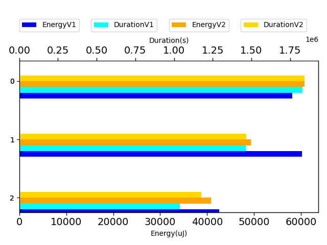

## com.google.gson.functional.InterfaceTest

| Test | IterationV1 | IterationV2 | DeltaIteration |
| --- | --- | --- | --- |
| com.google.gson.functional.InterfaceTest-testSerializingObjectImplementingInterface | 45 | 45 | 0 |
| com.google.gson.functional.InterfaceTest-testSerializingInterfaceObjectField | 53 | 61 | 8 |

| Test | EnergyV1 | EnergyV2 | DeltaEnergy |
| --- | --- | --- | --- |
| com.google.gson.functional.InterfaceTest-testSerializingObjectImplementingInterface | 44130.65535192951 | 52128.13739182765 | 7997.482039898139 |
| com.google.gson.functional.InterfaceTest-testSerializingInterfaceObjectField | 46691.22244572569 | 40307.30439117219 | -6383.918054553498 |

| Test | DurationV1 | DurationsV2 | DeltaDuration |
| --- | --- | --- | --- |
| com.google.gson.functional.InterfaceTest-testSerializingObjectImplementingInterface | 569221.922698251 | 1111247.8209019375 | 542025.8982036866 |
| com.google.gson.functional.InterfaceTest-testSerializingInterfaceObjectField | 822612.2286730937 | 786722.2653732093 | -35889.96329988446 |

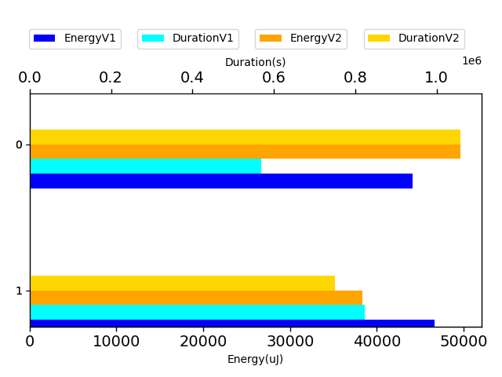

## com.google.gson.functional.ParameterizedTypesTest

| Test | IterationV1 | IterationV2 | DeltaIteration |
| --- | --- | --- | --- |
| com.google.gson.functional.ParameterizedTypesTest-testParameterizedTypeGenericArraysSerialization | 74 | 79 | 5 |
| com.google.gson.functional.ParameterizedTypesTest-testParameterizedTypeWithCustomSerializer | 78 | 87 | 9 |
| com.google.gson.functional.ParameterizedTypesTest-testParameterizedTypesSerialization | 96 | 95 | -1 |
| com.google.gson.functional.ParameterizedTypesTest-testDeepParameterizedTypeSerialization | 31 | 34 | 3 |
| com.google.gson.functional.ParameterizedTypesTest-testVariableTypeFieldsAndGenericArraysSerialization | 99 | 97 | -2 |
| com.google.gson.functional.ParameterizedTypesTest-testVariableTypeFieldsAndGenericArraysDeserialization | 91 | 86 | -5 |
| com.google.gson.functional.ParameterizedTypesTest-testTypesWithMultipleParametersSerialization | 99 | 96 | -3 |
| com.google.gson.functional.ParameterizedTypesTest-testParameterizedTypeWithVariableTypeDeserialization | 81 | 79 | -2 |
| com.google.gson.functional.ParameterizedTypesTest-testVariableTypeArrayDeserialization | 72 | 80 | 8 |
| com.google.gson.functional.ParameterizedTypesTest-testParameterizedTypesWithWriterSerialization | 43 | 43 | 0 |
| com.google.gson.functional.ParameterizedTypesTest-testVariableTypeDeserialization | 78 | 83 | 5 |
| com.google.gson.functional.ParameterizedTypesTest-testParameterizedTypeGenericArraysDeserialization | 79 | 88 | 9 |

| Test | EnergyV1 | EnergyV2 | DeltaEnergy |
| --- | --- | --- | --- |
| com.google.gson.functional.ParameterizedTypesTest-testParameterizedTypeGenericArraysSerialization | 83016.0826327865 | 44125.54812505156 | -38890.53450773495 |
| com.google.gson.functional.ParameterizedTypesTest-testParameterizedTypeWithCustomSerializer | 81536.84813882085 | 44291.3985504435 | -37245.44958837735 |
| com.google.gson.functional.ParameterizedTypesTest-testParameterizedTypesSerialization | 197673.58350801168 | 88982.75501381804 | -108690.82849419364 |
| com.google.gson.functional.ParameterizedTypesTest-testDeepParameterizedTypeSerialization | 41656.74238106562 | 41257.282249938056 | -399.4601311275619 |
| com.google.gson.functional.ParameterizedTypesTest-testVariableTypeFieldsAndGenericArraysSerialization | 69550.87659310653 | 71018.11635715251 | 1467.2397640459822 |
| com.google.gson.functional.ParameterizedTypesTest-testVariableTypeFieldsAndGenericArraysDeserialization | 73028.13412577356 | 45097.18920132004 | -27930.94492445352 |
| com.google.gson.functional.ParameterizedTypesTest-testTypesWithMultipleParametersSerialization | 111197.74455335877 | 109248.77847937206 | -1948.9660739867104 |
| com.google.gson.functional.ParameterizedTypesTest-testParameterizedTypeWithVariableTypeDeserialization | 62020.785689260585 | 44800.87685767817 | -17219.908831582412 |
| com.google.gson.functional.ParameterizedTypesTest-testVariableTypeArrayDeserialization | 60570.237039524385 | 59883.024794186436 | -687.2122453379488 |
| com.google.gson.functional.ParameterizedTypesTest-testParameterizedTypesWithWriterSerialization | 52350.585067907974 | 43161.10750845909 | -9189.477559448882 |
| com.google.gson.functional.ParameterizedTypesTest-testVariableTypeDeserialization | 52811.415127855755 | 44720.38158994008 | -8091.033537915675 |
| com.google.gson.functional.ParameterizedTypesTest-testParameterizedTypeGenericArraysDeserialization | 51011.55424051808 | 43857.46110296273 | -7154.0931375553555 |

| Test | DurationV1 | DurationsV2 | DeltaDuration |
| --- | --- | --- | --- |
| com.google.gson.functional.ParameterizedTypesTest-testParameterizedTypeGenericArraysSerialization | 1678727.855464952 | 1086507.780527113 | -592220.0749378391 |
| com.google.gson.functional.ParameterizedTypesTest-testParameterizedTypeWithCustomSerializer | 2621643.0397066926 | 1138669.1233165544 | -1482973.9163901382 |
| com.google.gson.functional.ParameterizedTypesTest-testParameterizedTypesSerialization | 6840554.644326707 | 3812780.5878374693 | -3027774.056489238 |
| com.google.gson.functional.ParameterizedTypesTest-testDeepParameterizedTypeSerialization | 820555.9034214807 | 544150.0614466344 | -276405.8419748463 |
| com.google.gson.functional.ParameterizedTypesTest-testVariableTypeFieldsAndGenericArraysSerialization | 2901947.8875412513 | 2283706.390745925 | -618241.4967953265 |
| com.google.gson.functional.ParameterizedTypesTest-testVariableTypeFieldsAndGenericArraysDeserialization | 2195841.836627078 | 1325492.2637274489 | -870349.5728996289 |
| com.google.gson.functional.ParameterizedTypesTest-testTypesWithMultipleParametersSerialization | 3516762.4417079305 | 2597694.2845453587 | -919068.1571625718 |
| com.google.gson.functional.ParameterizedTypesTest-testParameterizedTypeWithVariableTypeDeserialization | 1308565.2606284705 | 1052346.0903599395 | -256219.17026853096 |
| com.google.gson.functional.ParameterizedTypesTest-testVariableTypeArrayDeserialization | 1405815.4597026762 | 1136497.593702071 | -269317.86600060505 |
| com.google.gson.functional.ParameterizedTypesTest-testParameterizedTypesWithWriterSerialization | 1389593.1834684522 | 783679.5247119665 | -605913.6587564857 |
| com.google.gson.functional.ParameterizedTypesTest-testVariableTypeDeserialization | 1364439.9126217177 | 1071686.8498043658 | -292753.0628173519 |
| com.google.gson.functional.ParameterizedTypesTest-testParameterizedTypeGenericArraysDeserialization | 1549849.9912393135 | 1105203.2750501384 | -444646.71618917515 |

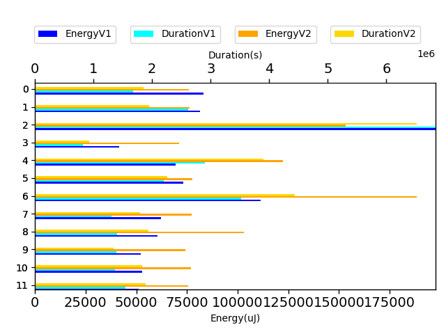

## com.google.gson.functional.InheritanceTest

| Test | IterationV1 | IterationV2 | DeltaIteration |
| --- | --- | --- | --- |
| com.google.gson.functional.InheritanceTest-testBaseSerializedAsBaseWhenSpecifiedWithExplicitType | 29 | 17 | -12 |
| com.google.gson.functional.InheritanceTest-testSubInterfacesOfCollectionSerialization | 99 | 99 | 0 |
| com.google.gson.functional.InheritanceTest-testClassWithBaseArrayFieldSerialization | 49 | 42 | -7 |
| com.google.gson.functional.InheritanceTest-testSubClassSerialization | 78 | 64 | -14 |
| com.google.gson.functional.InheritanceTest-testBaseSerializedAsSubForToJsonMethod | 19 | 27 | 8 |
| com.google.gson.functional.InheritanceTest-testClassWithBaseFieldSerialization | 42 | 45 | 3 |
| com.google.gson.functional.InheritanceTest-testBaseSerializedAsSubWhenSpecifiedWithExplicitType | 28 | 24 | -4 |
| com.google.gson.functional.InheritanceTest-testBaseSerializedAsBaseWhenSpecifiedWithExplicitTypeForToJsonMethod | 48 | 52 | 4 |
| com.google.gson.functional.InheritanceTest-testBaseSerializedAsSubWhenSpecifiedWithExplicitTypeForToJsonMethod | 21 | 19 | -2 |
| com.google.gson.functional.InheritanceTest-testClassWithBaseCollectionFieldSerialization | 52 | 47 | -5 |
| com.google.gson.functional.InheritanceTest-testBaseSerializedAsSub | 32 | 23 | -9 |

| Test | EnergyV1 | EnergyV2 | DeltaEnergy |
| --- | --- | --- | --- |
| com.google.gson.functional.InheritanceTest-testBaseSerializedAsBaseWhenSpecifiedWithExplicitType | 43400.21300477162 | 43514.422943115234 | 114.20993834361434 |
| com.google.gson.functional.InheritanceTest-testSubInterfacesOfCollectionSerialization | 57154.15507289802 | 72662.79523970984 | 15508.64016681182 |
| com.google.gson.functional.InheritanceTest-testClassWithBaseArrayFieldSerialization | 46123.94253385186 | 40208.715823712875 | -5915.226710138988 |
| com.google.gson.functional.InheritanceTest-testSubClassSerialization | 42694.830323366004 | 41126.33752096974 | -1568.4928023962639 |
| com.google.gson.functional.InheritanceTest-testBaseSerializedAsSubForToJsonMethod | 43166.34037780762 | 43804.875666707754 | 638.535288900137 |
| com.google.gson.functional.InheritanceTest-testClassWithBaseFieldSerialization | 46592.64194972374 | 43680.338230290654 | -2912.3037194330827 |
| com.google.gson.functional.InheritanceTest-testBaseSerializedAsSubWhenSpecifiedWithExplicitType | 40050.355895742774 | 42987.866411328316 | 2937.5105155855417 |
| com.google.gson.functional.InheritanceTest-testBaseSerializedAsBaseWhenSpecifiedWithExplicitTypeForToJsonMethod | 63143.81289417227 | 64666.632819702856 | 1522.819925530588 |
| com.google.gson.functional.InheritanceTest-testBaseSerializedAsSubWhenSpecifiedWithExplicitTypeForToJsonMethod | 43558.14428138733 | 41987.99458694458 | -1570.149694442749 |
| com.google.gson.functional.InheritanceTest-testClassWithBaseCollectionFieldSerialization | 44640.77262219334 | 43970.155184859475 | -670.6174373338654 |
| com.google.gson.functional.InheritanceTest-testBaseSerializedAsSub | 42456.36731552752 | 42484.7063472271 | 28.33903169957921 |

| Test | DurationV1 | DurationsV2 | DeltaDuration |
| --- | --- | --- | --- |
| com.google.gson.functional.InheritanceTest-testBaseSerializedAsBaseWhenSpecifiedWithExplicitType | 489291.00907988846 | 397503.781539917 | -91787.22753997147 |
| com.google.gson.functional.InheritanceTest-testSubInterfacesOfCollectionSerialization | 1872764.019256102 | 2003588.5589771154 | 130824.53972101351 |
| com.google.gson.functional.InheritanceTest-testClassWithBaseArrayFieldSerialization | 698212.5312019931 | 550910.3294432258 | -147302.20175876736 |
| com.google.gson.functional.InheritanceTest-testSubClassSerialization | 848594.9136065994 | 803515.9730264108 | -45078.940580188646 |
| com.google.gson.functional.InheritanceTest-testBaseSerializedAsSubForToJsonMethod | 490459.7759361267 | 399360.4542886764 | -91099.32164745033 |
| com.google.gson.functional.InheritanceTest-testClassWithBaseFieldSerialization | 626998.9413686186 | 599724.8213748401 | -27274.119993778528 |
| com.google.gson.functional.InheritanceTest-testBaseSerializedAsSubWhenSpecifiedWithExplicitType | 677280.7386888042 | 400191.49365353584 | -277089.24503526837 |
| com.google.gson.functional.InheritanceTest-testBaseSerializedAsBaseWhenSpecifiedWithExplicitTypeForToJsonMethod | 1352169.5844985319 | 1087254.9322706903 | -264914.65222784155 |
| com.google.gson.functional.InheritanceTest-testBaseSerializedAsSubWhenSpecifiedWithExplicitTypeForToJsonMethod | 383550.4350795746 | 411754.3931617737 | 28203.958082199097 |
| com.google.gson.functional.InheritanceTest-testClassWithBaseCollectionFieldSerialization | 711269.9481584535 | 702261.945939301 | -9008.002219152404 |
| com.google.gson.functional.InheritanceTest-testBaseSerializedAsSub | 395683.5517850914 | 375896.7803373337 | -19786.771447757725 |

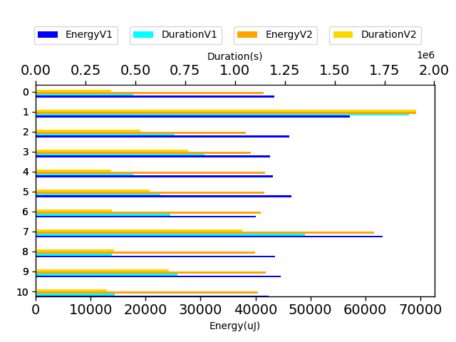

## com.google.gson.functional.NamingPolicyTest

| Test | IterationV1 | IterationV2 | DeltaIteration |
| --- | --- | --- | --- |
| com.google.gson.functional.NamingPolicyTest-testAtSignInSerializedName | 49 | 45 | -4 |
| com.google.gson.functional.NamingPolicyTest-testGsonDuplicateNameUsingSerializedNameFieldNamingPolicySerialization | 69 | 65 | -4 |
| com.google.gson.functional.NamingPolicyTest-testGsonWithLowerCaseDotPolicySerialization | 26 | 22 | -4 |
| com.google.gson.functional.NamingPolicyTest-testComplexFieldNameStrategy | 74 | 67 | -7 |
| com.google.gson.functional.NamingPolicyTest-testDeprecatedNamingStrategy | 58 | 55 | -3 |
| com.google.gson.functional.NamingPolicyTest-testGsonWithUpperCamelCaseSpacesPolicySerialiation | 29 | 26 | -3 |
| com.google.gson.functional.NamingPolicyTest-testGsonWithNonDefaultFieldNamingPolicySerialization | 41 | 37 | -4 |
| com.google.gson.functional.NamingPolicyTest-testGsonWithSerializedNameFieldNamingPolicySerialization | 59 | 68 | 9 |
| com.google.gson.functional.NamingPolicyTest-testGsonWithLowerCaseUnderscorePolicySerialization | 22 | 22 | 0 |
| com.google.gson.functional.NamingPolicyTest-testGsonWithLowerCaseDashPolicySerialization | 15 | 19 | 4 |

| Test | EnergyV1 | EnergyV2 | DeltaEnergy |
| --- | --- | --- | --- |
| com.google.gson.functional.NamingPolicyTest-testAtSignInSerializedName | 41127.3854592511 | 41076.9611489813 | -50.42431026979466 |
| com.google.gson.functional.NamingPolicyTest-testGsonDuplicateNameUsingSerializedNameFieldNamingPolicySerialization | 55812.30932826113 | 49657.953432631155 | -6154.355895629975 |
| com.google.gson.functional.NamingPolicyTest-testGsonWithLowerCaseDotPolicySerialization | 43307.87182819843 | 44006.80444574356 | 698.9326175451279 |
| com.google.gson.functional.NamingPolicyTest-testComplexFieldNameStrategy | 41890.949812142266 | 44154.91258352963 | 2263.9627713873633 |
| com.google.gson.functional.NamingPolicyTest-testDeprecatedNamingStrategy | 45494.95156085363 | 39587.794091839656 | -5907.157469013975 |
| com.google.gson.functional.NamingPolicyTest-testGsonWithUpperCamelCaseSpacesPolicySerialiation | 46953.63243431412 | 43367.16142681241 | -3586.4710075017065 |
| com.google.gson.functional.NamingPolicyTest-testGsonWithNonDefaultFieldNamingPolicySerialization | 45163.77382845989 | 41062.3206585867 | -4101.453169873188 |
| com.google.gson.functional.NamingPolicyTest-testGsonWithSerializedNameFieldNamingPolicySerialization | 44197.27262711676 | 39548.125892289434 | -4649.146734827329 |
| com.google.gson.functional.NamingPolicyTest-testGsonWithLowerCaseUnderscorePolicySerialization | 41914.33031749725 | 42919.96033334732 | 1005.6300158500671 |
| com.google.gson.functional.NamingPolicyTest-testGsonWithLowerCaseDashPolicySerialization | 44542.222106933594 | 41455.44975090027 | -3086.772356033325 |

| Test | DurationV1 | DurationsV2 | DeltaDuration |
| --- | --- | --- | --- |
| com.google.gson.functional.NamingPolicyTest-testAtSignInSerializedName | 613129.5271932778 | 706639.5493117794 | 93510.0221185016 |
| com.google.gson.functional.NamingPolicyTest-testGsonDuplicateNameUsingSerializedNameFieldNamingPolicySerialization | 1188457.2479231886 | 1004410.3756336977 | -184046.8722894909 |
| com.google.gson.functional.NamingPolicyTest-testGsonWithLowerCaseDotPolicySerialization | 434673.2449822426 | 499578.3950037956 | 64905.15002155304 |
| com.google.gson.functional.NamingPolicyTest-testComplexFieldNameStrategy | 779106.2126177186 | 842800.2936100079 | 63694.08099228924 |
| com.google.gson.functional.NamingPolicyTest-testDeprecatedNamingStrategy | 828754.3074760931 | 1141077.2884848032 | 312322.9810087101 |
| com.google.gson.functional.NamingPolicyTest-testGsonWithUpperCamelCaseSpacesPolicySerialiation | 574761.2717951257 | 478169.2541358471 | -96592.01765927859 |
| com.google.gson.functional.NamingPolicyTest-testGsonWithNonDefaultFieldNamingPolicySerialization | 769029.2274687964 | 577948.4354090901 | -191080.7920597063 |
| com.google.gson.functional.NamingPolicyTest-testGsonWithSerializedNameFieldNamingPolicySerialization | 691697.304284067 | 800772.0212601059 | 109074.71697603888 |
| com.google.gson.functional.NamingPolicyTest-testGsonWithLowerCaseUnderscorePolicySerialization | 479828.5141158104 | 611697.4739222527 | 131868.95980644226 |
| com.google.gson.functional.NamingPolicyTest-testGsonWithLowerCaseDashPolicySerialization | 652725.770324707 | 474180.84586524963 | -178544.9244594574 |

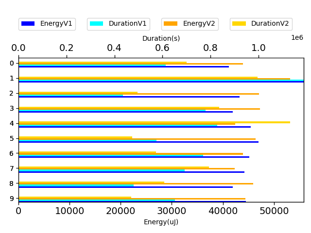

## com.google.gson.functional.CircularReferenceTest

| Test | IterationV1 | IterationV2 | DeltaIteration |
| --- | --- | --- | --- |
| com.google.gson.functional.CircularReferenceTest-testCircularSerialization | 99 | 99 | 0 |
| com.google.gson.functional.CircularReferenceTest-testSelfReferenceArrayFieldSerialization | 99 | 99 | 0 |
| com.google.gson.functional.CircularReferenceTest-testSelfReferenceCustomHandlerSerialization | 99 | 99 | 0 |
| com.google.gson.functional.CircularReferenceTest-testSelfReferenceIgnoredInSerialization | 32 | 32 | 0 |
| com.google.gson.functional.CircularReferenceTest-testDirectedAcyclicGraphSerialization | 33 | 38 | 5 |

| Test | EnergyV1 | EnergyV2 | DeltaEnergy |
| --- | --- | --- | --- |
| com.google.gson.functional.CircularReferenceTest-testCircularSerialization | 221228.90319868794 | 201445.21879105613 | -19783.68440763181 |
| com.google.gson.functional.CircularReferenceTest-testSelfReferenceArrayFieldSerialization | 175621.4046750426 | 170283.4257973204 | -5337.978877722198 |
| com.google.gson.functional.CircularReferenceTest-testSelfReferenceCustomHandlerSerialization | 196425.10968619672 | 205814.07686419733 | 9388.967178000603 |
| com.google.gson.functional.CircularReferenceTest-testSelfReferenceIgnoredInSerialization | 43527.2291349126 | 43419.071244372055 | -108.15789054054767 |
| com.google.gson.functional.CircularReferenceTest-testDirectedAcyclicGraphSerialization | 42248.595989970025 | 39454.50121527915 | -2794.0947746908714 |

| Test | DurationV1 | DurationsV2 | DeltaDuration |
| --- | --- | --- | --- |
| com.google.gson.functional.CircularReferenceTest-testCircularSerialization | 5597177.1162411235 | 5035592.989371808 | -561584.1268693153 |
| com.google.gson.functional.CircularReferenceTest-testSelfReferenceArrayFieldSerialization | 4495827.522839257 | 4411401.494175738 | -84426.02866351884 |
| com.google.gson.functional.CircularReferenceTest-testSelfReferenceCustomHandlerSerialization | 4933582.230257769 | 5101527.388288935 | 167945.1580311656 |
| com.google.gson.functional.CircularReferenceTest-testSelfReferenceIgnoredInSerialization | 554907.7615490411 | 454235.08151637856 | -100672.68003266258 |
| com.google.gson.functional.CircularReferenceTest-testDirectedAcyclicGraphSerialization | 550029.7227181094 | 501570.9886839032 | -48458.734034206194 |

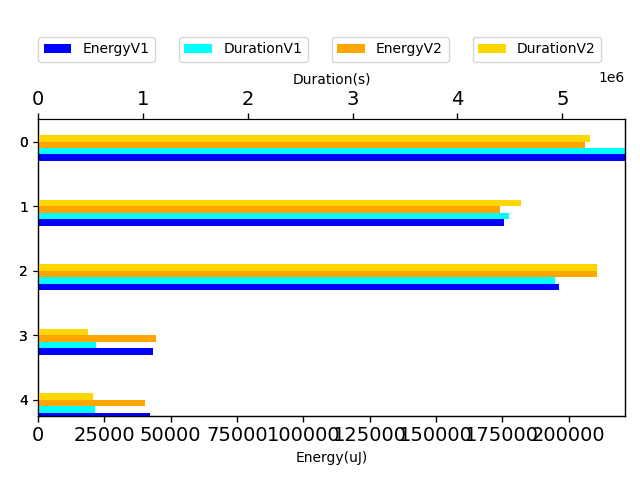

## com.google.gson.functional.PrettyPrintingTest

| Test | IterationV1 | IterationV2 | DeltaIteration |
| --- | --- | --- | --- |
| com.google.gson.functional.PrettyPrintingTest-testEmptyMapField | 71 | 67 | -4 |
| com.google.gson.functional.PrettyPrintingTest-testMap | 28 | 18 | -10 |
| com.google.gson.functional.PrettyPrintingTest-testPrettyPrintArrayOfObjects | 47 | 41 | -6 |
| com.google.gson.functional.PrettyPrintingTest-testPrettyPrintList | 81 | 77 | -4 |
| com.google.gson.functional.PrettyPrintingTest-testPrettyPrintArrayOfPrimitiveArrays | 26 | 16 | -10 |
| com.google.gson.functional.PrettyPrintingTest-testMultipleArrays | 22 | 22 | 0 |
| com.google.gson.functional.PrettyPrintingTest-testPrettyPrintListOfPrimitiveArrays | 33 | 36 | 3 |
| com.google.gson.functional.PrettyPrintingTest-testPrettyPrintArrayOfPrimitives | 12 | 14 | 2 |

| Test | EnergyV1 | EnergyV2 | DeltaEnergy |
| --- | --- | --- | --- |
| com.google.gson.functional.PrettyPrintingTest-testEmptyMapField | 45383.52524739665 | 48799.77881274936 | 3416.2535653527157 |
| com.google.gson.functional.PrettyPrintingTest-testMap | 42235.41658568755 | 40820.245906829834 | -1415.170678857714 |
| com.google.gson.functional.PrettyPrintingTest-testPrettyPrintArrayOfObjects | 68384.4302592937 | 43069.23884304593 | -25315.19141624777 |
| com.google.gson.functional.PrettyPrintingTest-testPrettyPrintList | 44898.86361462676 | 49889.58440218027 | 4990.72078755351 |
| com.google.gson.functional.PrettyPrintingTest-testPrettyPrintArrayOfPrimitiveArrays | 40422.77545404434 | 43737.75067138672 | 3314.9752173423767 |
| com.google.gson.functional.PrettyPrintingTest-testMultipleArrays | 43542.414179325104 | 43894.581199645996 | 352.16702032089233 |
| com.google.gson.functional.PrettyPrintingTest-testPrettyPrintListOfPrimitiveArrays | 41383.94001866644 | 39863.23348315855 | -1520.7065355078958 |
| com.google.gson.functional.PrettyPrintingTest-testPrettyPrintArrayOfPrimitives | 36726.68505859375 | 38142.637634277344 | 1415.9525756835938 |

| Test | DurationV1 | DurationsV2 | DeltaDuration |
| --- | --- | --- | --- |
| com.google.gson.functional.PrettyPrintingTest-testEmptyMapField | 990465.0291327721 | 910983.4413672825 | -79481.58776548959 |
| com.google.gson.functional.PrettyPrintingTest-testMap | 483339.9112784453 | 661334.910446167 | 177994.99916772172 |
| com.google.gson.functional.PrettyPrintingTest-testPrettyPrintArrayOfObjects | 1577171.1289139204 | 733362.8051486595 | -843808.3237652609 |
| com.google.gson.functional.PrettyPrintingTest-testPrettyPrintList | 1125309.5571351165 | 1360013.300289567 | 234703.74315445055 |
| com.google.gson.functional.PrettyPrintingTest-testPrettyPrintArrayOfPrimitiveArrays | 490417.79633560777 | 569234.955291748 | 78817.15895614028 |
| com.google.gson.functional.PrettyPrintingTest-testMultipleArrays | 436661.4151492119 | 486704.23565483093 | 50042.82050561905 |
| com.google.gson.functional.PrettyPrintingTest-testPrettyPrintListOfPrimitiveArrays | 911945.1153738885 | 676277.0519239577 | -235668.06344993087 |
| com.google.gson.functional.PrettyPrintingTest-testPrettyPrintArrayOfPrimitives | 480079.35888671875 | 567695.2268066406 | 87615.86791992188 |

## com.google.gson.functional.MapTest

| Test | IterationV1 | IterationV2 | DeltaIteration |
| --- | --- | --- | --- |
| com.google.gson.functional.MapTest-testInterfaceTypeMapWithSerializer | 97 | 97 | 0 |
| com.google.gson.functional.MapTest-testConcurrentSkipListMap | 63 | 54 | -9 |
| com.google.gson.functional.MapTest-testComplexKeysSerialization | 83 | 87 | 4 |
| com.google.gson.functional.MapTest-testGeneralMapField | 73 | 78 | 5 |
| com.google.gson.functional.MapTest-testMapSerializationWithNullValueButSerializeNulls | 47 | 46 | -1 |
| com.google.gson.functional.MapTest-testInterfaceTypeMap | 97 | 99 | 2 |
| com.google.gson.functional.MapTest-testParameterizedMapSubclassSerialization | 83 | 83 | 0 |
| com.google.gson.functional.MapTest-testConcurrentHashMap | 56 | 53 | -3 |
| com.google.gson.functional.MapTest-testMapOfMapSerialization | 22 | 17 | -5 |
| com.google.gson.functional.MapTest-testMapSubclassSerialization | 16 | 30 | 14 |
| com.google.gson.functional.MapTest-testConcurrentMap | 90 | 84 | -6 |
| com.google.gson.functional.MapTest-testConcurrentNavigableMap | 99 | 99 | 0 |
| com.google.gson.functional.MapTest-testMapSerializationWithNullValues | 42 | 35 | -7 |
| com.google.gson.functional.MapTest-testMapSerializationEmpty | 51 | 48 | -3 |
| com.google.gson.functional.MapTest-testMapSerializationWithNullValuesSerialized | 79 | 77 | -2 |
| com.google.gson.functional.MapTest-testCustomSerializerForSpecificMapType | 57 | 51 | -6 |
| com.google.gson.functional.MapTest-testMapSerialization | 32 | 24 | -8 |
| com.google.gson.functional.MapTest-testMapSerializationWithNullValue | 47 | 39 | -8 |
| com.google.gson.functional.MapTest-testWriteMapsWithEmptyStringKey | 15 | 22 | 7 |
| com.google.gson.functional.MapTest-testSerializeMaps | 55 | 63 | 8 |
| com.google.gson.functional.MapTest-testMapSerializationWithIntegerKeys | 44 | 36 | -8 |
| com.google.gson.functional.MapTest-testMapNamePromotionWithJsonElementReader | 67 | 71 | 4 |
| com.google.gson.functional.MapTest-testMapSerializationWithNullKey | 52 | 52 | 0 |
| com.google.gson.functional.MapTest-testMapWithQuotes | 17 | 16 | -1 |
| com.google.gson.functional.MapTest-testMapSerializationWithWildcardValues | 64 | 70 | 6 |
| com.google.gson.functional.MapTest-testSerializeMapOfMaps | 40 | 43 | 3 |
| com.google.gson.functional.MapTest-testRawMapSerialization | 18 | 17 | -1 |

| Test | EnergyV1 | EnergyV2 | DeltaEnergy |
| --- | --- | --- | --- |
| com.google.gson.functional.MapTest-testInterfaceTypeMapWithSerializer | 61947.782214058956 | 58058.62542437912 | -3889.156789679837 |
| com.google.gson.functional.MapTest-testConcurrentSkipListMap | 42155.65482286002 | 41157.35792861105 | -998.2968942489751 |
| com.google.gson.functional.MapTest-testComplexKeysSerialization | 60742.555334548815 | 46050.46168733295 | -14692.093647215865 |
| com.google.gson.functional.MapTest-testGeneralMapField | 41156.06744093925 | 45091.98898715986 | 3935.921546220605 |
| com.google.gson.functional.MapTest-testMapSerializationWithNullValueButSerializeNulls | 43765.15962025082 | 41451.41842962285 | -2313.741190627974 |
| com.google.gson.functional.MapTest-testInterfaceTypeMap | 163829.45809648378 | 88555.01077321425 | -75274.44732326953 |
| com.google.gson.functional.MapTest-testParameterizedMapSubclassSerialization | 43948.314574032585 | 41296.35950439596 | -2651.9550696366277 |
| com.google.gson.functional.MapTest-testConcurrentHashMap | 43460.14416911959 | 43394.87031932305 | -65.27384979654016 |
| com.google.gson.functional.MapTest-testMapOfMapSerialization | 40458.37712717056 | 44397.18885803223 | 3938.811730861664 |
| com.google.gson.functional.MapTest-testMapSubclassSerialization | 42987.19714355469 | 41974.51276763901 | -1012.6843759156764 |
| com.google.gson.functional.MapTest-testConcurrentMap | 40867.620947960655 | 42498.27924404687 | 1630.6582960862142 |
| com.google.gson.functional.MapTest-testConcurrentNavigableMap | 145980.23666738067 | 133724.85809998482 | -12255.378567395848 |
| com.google.gson.functional.MapTest-testMapSerializationWithNullValues | 43235.05285450927 | 41003.68215844844 | -2231.370696060825 |
| com.google.gson.functional.MapTest-testMapSerializationEmpty | 41944.95408606101 | 42398.15896728647 | 453.2048812254652 |
| com.google.gson.functional.MapTest-testMapSerializationWithNullValuesSerialized | 123703.63145868745 | 68708.13810225866 | -54995.49335642879 |
| com.google.gson.functional.MapTest-testCustomSerializerForSpecificMapType | 41607.300829610525 | 41366.922614466144 | -240.3782151443811 |
| com.google.gson.functional.MapTest-testMapSerialization | 42084.64220476709 | 40288.11988091469 | -1796.522323852405 |
| com.google.gson.functional.MapTest-testMapSerializationWithNullValue | 42969.856349365444 | 41797.05975021356 | -1172.7965991518868 |
| com.google.gson.functional.MapTest-testWriteMapsWithEmptyStringKey | 43657.892150878906 | 43258.15785264969 | -399.73429822921753 |
| com.google.gson.functional.MapTest-testSerializeMaps | 65856.91489758022 | 45201.481101316385 | -20655.43379626384 |
| com.google.gson.functional.MapTest-testMapSerializationWithIntegerKeys | 43473.71223119655 | 42070.21864202045 | -1403.4935891760979 |
| com.google.gson.functional.MapTest-testMapNamePromotionWithJsonElementReader | 59414.98965042457 | 43472.427632036284 | -15942.562018388286 |
| com.google.gson.functional.MapTest-testMapSerializationWithNullKey | 42326.62886619709 | 41654.60453698939 | -672.0243292076993 |
| com.google.gson.functional.MapTest-testMapWithQuotes | 39469.28169250488 | 43716.54818725586 | 4247.266494750977 |
| com.google.gson.functional.MapTest-testMapSerializationWithWildcardValues | 42918.95664706055 | 45430.96720217977 | 2512.0105551192173 |
| com.google.gson.functional.MapTest-testSerializeMapOfMaps | 39164.079105741854 | 41799.75042094618 | 2635.671315204323 |
| com.google.gson.functional.MapTest-testRawMapSerialization | 43639.59395599365 | 41891.2160949707 | -1748.3778610229492 |

| Test | DurationV1 | DurationsV2 | DeltaDuration |
| --- | --- | --- | --- |
| com.google.gson.functional.MapTest-testInterfaceTypeMapWithSerializer | 1720091.1290377816 | 1425549.3466090437 | -294541.78242873796 |
| com.google.gson.functional.MapTest-testConcurrentSkipListMap | 828167.1145437756 | 761317.5613245153 | -66849.5532192603 |
| com.google.gson.functional.MapTest-testComplexKeysSerialization | 1253877.128382791 | 1090789.7284394654 | -163087.39994332567 |
| com.google.gson.functional.MapTest-testGeneralMapField | 1078370.1408631848 | 1127396.6337066228 | 49026.49284343794 |
| com.google.gson.functional.MapTest-testMapSerializationWithNullValueButSerializeNulls | 630190.8336615928 | 626086.2171716681 | -4104.616489924723 |
| com.google.gson.functional.MapTest-testInterfaceTypeMap | 4197170.321842233 | 2276932.5690654945 | -1920237.7527767383 |
| com.google.gson.functional.MapTest-testParameterizedMapSubclassSerialization | 1084206.771497708 | 1018408.2506338372 | -65798.52086387086 |
| com.google.gson.functional.MapTest-testConcurrentHashMap | 813336.276039383 | 680045.1380677347 | -133291.13797164836 |
| com.google.gson.functional.MapTest-testMapOfMapSerialization | 387863.00399684906 | 496835.5643005371 | 108972.56030368805 |
| com.google.gson.functional.MapTest-testMapSubclassSerialization | 500837.19105529785 | 523829.4502549432 | 22992.25919964537 |
| com.google.gson.functional.MapTest-testConcurrentMap | 1178041.0873338496 | 1082392.5940559572 | -95648.49327789247 |
| com.google.gson.functional.MapTest-testConcurrentNavigableMap | 3795668.457554443 | 3720152.91805794 | -75515.53949650284 |
| com.google.gson.functional.MapTest-testMapSerializationWithNullValues | 515224.61706115305 | 445461.0564595437 | -69763.56060160935 |
| com.google.gson.functional.MapTest-testMapSerializationEmpty | 629083.4621330872 | 619264.3248320853 | -9819.13730100193 |
| com.google.gson.functional.MapTest-testMapSerializationWithNullValuesSerialized | 2778237.888115863 | 1606681.3404772026 | -1171556.5476386603 |
| com.google.gson.functional.MapTest-testCustomSerializerForSpecificMapType | 793899.6982971742 | 701630.483008827 | -92269.21528834722 |
| com.google.gson.functional.MapTest-testMapSerialization | 468479.39492122876 | 489254.0780109167 | 20774.683089687955 |
| com.google.gson.functional.MapTest-testMapSerializationWithNullValue | 624928.7950781067 | 627625.0355561364 | 2696.2404780297074 |
| com.google.gson.functional.MapTest-testWriteMapsWithEmptyStringKey | 336486.44134521484 | 352325.52023792267 | 15839.078892707825 |
| com.google.gson.functional.MapTest-testSerializeMaps | 1424017.2112866277 | 875745.3698230629 | -548271.8414635648 |
| com.google.gson.functional.MapTest-testMapSerializationWithIntegerKeys | 560898.5187411094 | 592627.9346373056 | 31729.41589619615 |
| com.google.gson.functional.MapTest-testMapNamePromotionWithJsonElementReader | 1328509.9158074828 | 979350.3361198866 | -349159.5796875962 |
| com.google.gson.functional.MapTest-testMapSerializationWithNullKey | 629499.9055260067 | 735728.1623171994 | 106228.25679119269 |
| com.google.gson.functional.MapTest-testMapWithQuotes | 515890.7503967285 | 410362.9900817871 | -105527.7603149414 |
| com.google.gson.functional.MapTest-testMapSerializationWithWildcardValues | 1266092.1865340518 | 873035.843671849 | -393056.3428622028 |
| com.google.gson.functional.MapTest-testSerializeMapOfMaps | 687530.2553342344 | 662703.5822486557 | -24826.673085578717 |
| com.google.gson.functional.MapTest-testRawMapSerialization | 356438.58793640137 | 373734.4274597168 | 17295.83952331543 |

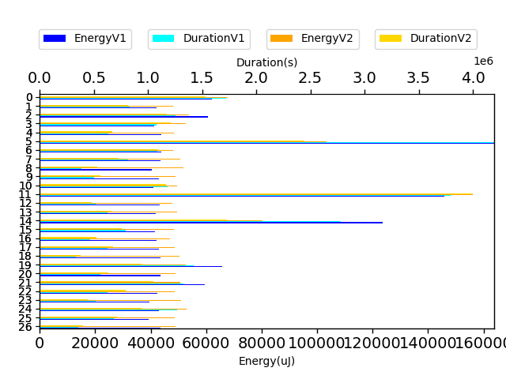

## com.google.gson.functional.ExposeFieldsTest

| Test | IterationV1 | IterationV2 | DeltaIteration |
| --- | --- | --- | --- |
| com.google.gson.functional.ExposeFieldsTest-testNullExposeFieldSerialization | 99 | 99 | 0 |
| com.google.gson.functional.ExposeFieldsTest-testNoExposedFieldSerialization | 36 | 52 | 16 |
| com.google.gson.functional.ExposeFieldsTest-testArrayWithOneNullExposeFieldObjectSerialization | 45 | 41 | -4 |
| com.google.gson.functional.ExposeFieldsTest-testExposedInterfaceFieldSerialization | 92 | 91 | -1 |
| com.google.gson.functional.ExposeFieldsTest-testExposeAnnotationSerialization | 44 | 33 | -11 |

| Test | EnergyV1 | EnergyV2 | DeltaEnergy |
| --- | --- | --- | --- |
| com.google.gson.functional.ExposeFieldsTest-testNullExposeFieldSerialization | 85071.26731868429 | 89549.28835005124 | 4478.021031366952 |
| com.google.gson.functional.ExposeFieldsTest-testNoExposedFieldSerialization | 44063.55419885984 | 42918.75711466665 | -1144.7970841931892 |
| com.google.gson.functional.ExposeFieldsTest-testArrayWithOneNullExposeFieldObjectSerialization | 43632.72267109664 | 41995.73334648635 | -1636.9893246102947 |
| com.google.gson.functional.ExposeFieldsTest-testExposedInterfaceFieldSerialization | 42300.84937008734 | 41613.98984734137 | -686.8595227459664 |
| com.google.gson.functional.ExposeFieldsTest-testExposeAnnotationSerialization | 47637.5096121134 | 41501.32905599056 | -6136.180556122839 |

| Test | DurationV1 | DurationsV2 | DeltaDuration |
| --- | --- | --- | --- |
| com.google.gson.functional.ExposeFieldsTest-testNullExposeFieldSerialization | 2366327.5965772914 | 2251243.59201135 | -115084.00456594117 |
| com.google.gson.functional.ExposeFieldsTest-testNoExposedFieldSerialization | 772103.2513302164 | 635026.4116237032 | -137076.83970651322 |
| com.google.gson.functional.ExposeFieldsTest-testArrayWithOneNullExposeFieldObjectSerialization | 573521.3229701808 | 535851.6573735214 | -37669.66559665941 |
| com.google.gson.functional.ExposeFieldsTest-testExposedInterfaceFieldSerialization | 986401.440625167 | 1019174.134097479 | 32772.693472312065 |
| com.google.gson.functional.ExposeFieldsTest-testExposeAnnotationSerialization | 450773.7292670902 | 461286.5616187393 | 10512.832351649064 |

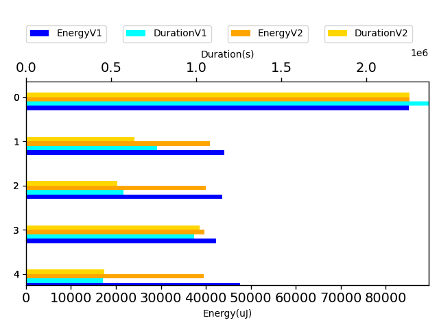

## com.google.gson.functional.FieldExclusionTest

| Test | IterationV1 | IterationV2 | DeltaIteration |
| --- | --- | --- | --- |
| com.google.gson.functional.FieldExclusionTest-testDefaultNestedStaticClassIncluded | 26 | 36 | 10 |
| com.google.gson.functional.FieldExclusionTest-testDefaultInnerClassExclusion | 76 | 67 | -9 |
| com.google.gson.functional.FieldExclusionTest-testInnerClassExclusion | 26 | 22 | -4 |

| Test | EnergyV1 | EnergyV2 | DeltaEnergy |
| --- | --- | --- | --- |
| com.google.gson.functional.FieldExclusionTest-testDefaultNestedStaticClassIncluded | 45523.353208974004 | 42007.93122949399 | -3515.4219794800156 |
| com.google.gson.functional.FieldExclusionTest-testDefaultInnerClassExclusion | 55827.214496630455 | 43581.60356574902 | -12245.610930881434 |
| com.google.gson.functional.FieldExclusionTest-testInnerClassExclusion | 45021.52221086621 | 42121.80185317993 | -2899.720357686281 |

| Test | DurationV1 | DurationsV2 | DeltaDuration |
| --- | --- | --- | --- |
| com.google.gson.functional.FieldExclusionTest-testDefaultNestedStaticClassIncluded | 688748.7099865228 | 518220.01435504714 | -170528.69563147565 |
| com.google.gson.functional.FieldExclusionTest-testDefaultInnerClassExclusion | 1002273.7750901802 | 912693.8784784912 | -89579.89661168901 |
| com.google.gson.functional.FieldExclusionTest-testInnerClassExclusion | 441875.26472091675 | 363060.0966076851 | -78815.16811323166 |

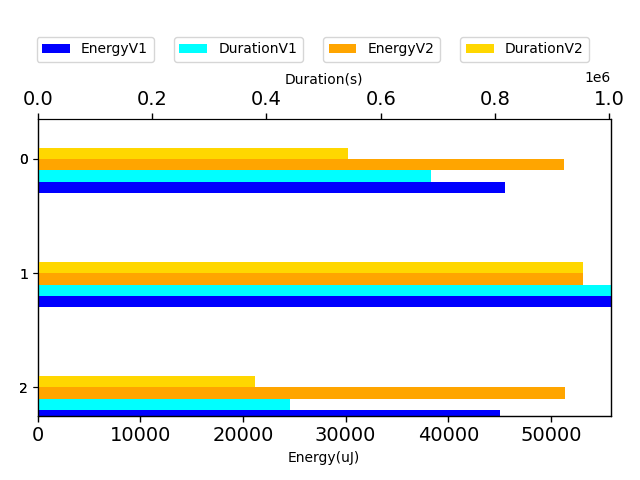

## com.google.gson.GsonBuilderTest

| Test | IterationV1 | IterationV2 | DeltaIteration |
| --- | --- | --- | --- |
| com.google.gson.GsonBuilderTest-testExcludeFieldsWithModifiers | 49 | 47 | -2 |
| com.google.gson.GsonBuilderTest-testTransientFieldExclusion | 44 | 41 | -3 |

| Test | EnergyV1 | EnergyV2 | DeltaEnergy |
| --- | --- | --- | --- |
| com.google.gson.GsonBuilderTest-testExcludeFieldsWithModifiers | 43819.26436930463 | 44934.173375482285 | 1114.9090061776587 |
| com.google.gson.GsonBuilderTest-testTransientFieldExclusion | 42647.79298483644 | 43417.412396760075 | 769.6194119236388 |

| Test | DurationV1 | DurationsV2 | DeltaDuration |
| --- | --- | --- | --- |
| com.google.gson.GsonBuilderTest-testExcludeFieldsWithModifiers | 656681.4795458552 | 860770.4610364889 | 204088.98149063368 |
| com.google.gson.GsonBuilderTest-testTransientFieldExclusion | 500963.67747906066 | 564325.82618984 | 63362.14871077932 |

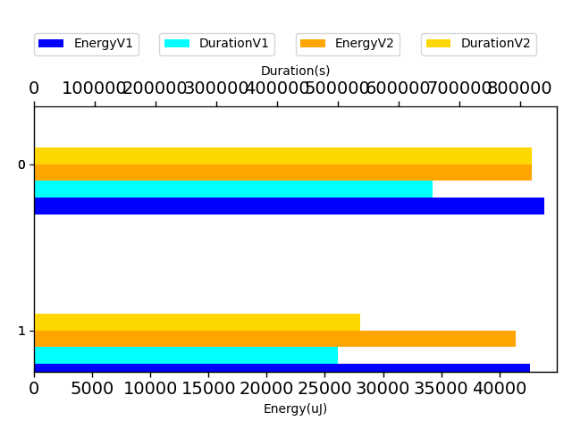

## com.google.gson.functional.CollectionTest

| Test | IterationV1 | IterationV2 | DeltaIteration |
| --- | --- | --- | --- |
| com.google.gson.functional.CollectionTest-testStack | 98 | 99 | 1 |
| com.google.gson.functional.CollectionTest-testPriorityQueue | 98 | 97 | -1 |
| com.google.gson.functional.CollectionTest-testNullsInListSerialization | 41 | 37 | -4 |
| com.google.gson.functional.CollectionTest-testWildcardPrimitiveCollectionSerilaization | 71 | 70 | -1 |
| com.google.gson.functional.CollectionTest-testUserCollectionTypeAdapter | 58 | 57 | -1 |
| com.google.gson.functional.CollectionTest-testWildcardCollectionField | 88 | 85 | -3 |
| com.google.gson.functional.CollectionTest-testSetSerialization | 65 | 64 | -1 |
| com.google.gson.functional.CollectionTest-testTopLevelCollectionOfIntegersSerialization | 44 | 32 | -12 |
| com.google.gson.functional.CollectionTest-testCollectionOfObjectSerialization | 56 | 52 | -4 |
| com.google.gson.functional.CollectionTest-testRawCollectionSerialization | 46 | 41 | -5 |
| com.google.gson.functional.CollectionTest-testCollectionOfBagOfPrimitivesSerialization | 46 | 45 | -1 |
| com.google.gson.functional.CollectionTest-testRawCollectionOfIntegersSerialization | 32 | 31 | -1 |
| com.google.gson.functional.CollectionTest-testVector | 60 | 50 | -10 |
| com.google.gson.functional.CollectionTest-testLinkedListSerialization | 59 | 50 | -9 |
| com.google.gson.functional.CollectionTest-testCollectionOfObjectWithNullSerialization | 49 | 50 | 1 |
| com.google.gson.functional.CollectionTest-testCollectionOfStringsSerialization | 20 | 16 | -4 |
| com.google.gson.functional.CollectionTest-testFieldIsArrayList | 66 | 71 | 5 |
| com.google.gson.functional.CollectionTest-testQueueSerialization | 57 | 54 | -3 |

| Test | EnergyV1 | EnergyV2 | DeltaEnergy |
| --- | --- | --- | --- |
| com.google.gson.functional.CollectionTest-testStack | 62016.985090604256 | 54289.61281584448 | -7727.3722747597785 |
| com.google.gson.functional.CollectionTest-testPriorityQueue | 60567.557664443404 | 53265.58949236374 | -7301.968172079665 |
| com.google.gson.functional.CollectionTest-testNullsInListSerialization | 58761.32264986963 | 41081.29761707768 | -17680.02503279195 |
| com.google.gson.functional.CollectionTest-testWildcardPrimitiveCollectionSerilaization | 42430.35606260592 | 45877.243545309 | 3446.8874827030813 |
| com.google.gson.functional.CollectionTest-testUserCollectionTypeAdapter | 42556.23043354558 | 41399.24816960475 | -1156.9822639408303 |
| com.google.gson.functional.CollectionTest-testWildcardCollectionField | 40977.173044148956 | 46331.35985533755 | 5354.186811188592 |
| com.google.gson.functional.CollectionTest-testSetSerialization | 44739.633164391824 | 46022.6078681285 | 1282.974703736676 |
| com.google.gson.functional.CollectionTest-testTopLevelCollectionOfIntegersSerialization | 42185.07330685985 | 44230.98230365291 | 2045.9089967930631 |
| com.google.gson.functional.CollectionTest-testCollectionOfObjectSerialization | 43554.65276371332 | 44696.35457997967 | 1141.7018162663517 |
| com.google.gson.functional.CollectionTest-testRawCollectionSerialization | 42626.17346083493 | 39888.4804099493 | -2737.6930508856312 |
| com.google.gson.functional.CollectionTest-testCollectionOfBagOfPrimitivesSerialization | 43303.27505437876 | 46223.66133072383 | 2920.386276345067 |
| com.google.gson.functional.CollectionTest-testRawCollectionOfIntegersSerialization | 42865.54343410535 | 44810.660476864316 | 1945.1170427589677 |
| com.google.gson.functional.CollectionTest-testVector | 42576.37649799393 | 42058.32089410239 | -518.0556038915383 |
| com.google.gson.functional.CollectionTest-testLinkedListSerialization | 42045.69062848351 | 44346.74174879332 | 2301.0511203098067 |
| com.google.gson.functional.CollectionTest-testCollectionOfObjectWithNullSerialization | 41889.328730847075 | 39864.79381152223 | -2024.5349193248476 |
| com.google.gson.functional.CollectionTest-testCollectionOfStringsSerialization | 43766.87552642822 | 40242.22512817383 | -3524.6503982543945 |
| com.google.gson.functional.CollectionTest-testFieldIsArrayList | 62983.46439685732 | 44556.16716305742 | -18427.2972337999 |
| com.google.gson.functional.CollectionTest-testQueueSerialization | 42736.18326856491 | 42798.16322916351 | 61.979960598597245 |

| Test | DurationV1 | DurationsV2 | DeltaDuration |
| --- | --- | --- | --- |
| com.google.gson.functional.CollectionTest-testStack | 1543879.0055149016 | 1390246.472113062 | -153632.53340183967 |
| com.google.gson.functional.CollectionTest-testPriorityQueue | 1320074.3654325062 | 1468221.840307393 | 148147.47487488692 |
| com.google.gson.functional.CollectionTest-testNullsInListSerialization | 1241502.0465470266 | 572377.0919031485 | -669124.9546438782 |
| com.google.gson.functional.CollectionTest-testWildcardPrimitiveCollectionSerilaization | 1153674.3129745992 | 1497785.2950048486 | 344110.98203024943 |
| com.google.gson.functional.CollectionTest-testUserCollectionTypeAdapter | 946097.1918943225 | 939812.1092328958 | -6285.082661426743 |
| com.google.gson.functional.CollectionTest-testWildcardCollectionField | 1236903.3941232292 | 1182423.1445244774 | -54480.249598751776 |
| com.google.gson.functional.CollectionTest-testSetSerialization | 1138776.7488763956 | 958673.9471660522 | -180102.80171034345 |
| com.google.gson.functional.CollectionTest-testTopLevelCollectionOfIntegersSerialization | 622325.4898080017 | 645669.7614764846 | 23344.27166848292 |
| com.google.gson.functional.CollectionTest-testCollectionOfObjectSerialization | 963208.9284896739 | 831801.8049343 | -131407.12355537387 |
| com.google.gson.functional.CollectionTest-testRawCollectionSerialization | 643097.8510801466 | 527781.6510483606 | -115316.200031786 |
| com.google.gson.functional.CollectionTest-testCollectionOfBagOfPrimitivesSerialization | 738926.166156893 | 839170.7756010613 | 100244.60944416828 |
| com.google.gson.functional.CollectionTest-testRawCollectionOfIntegersSerialization | 582189.4155965676 | 485990.2767870892 | -96199.13880947838 |
| com.google.gson.functional.CollectionTest-testVector | 762817.5750626881 | 1051067.162224526 | 288249.58716183796 |
| com.google.gson.functional.CollectionTest-testLinkedListSerialization | 828549.9216579167 | 887176.1409352707 | 58626.21927735396 |
| com.google.gson.functional.CollectionTest-testCollectionOfObjectWithNullSerialization | 889839.5055895222 | 703183.6932374146 | -186655.8123521076 |
| com.google.gson.functional.CollectionTest-testCollectionOfStringsSerialization | 376479.47593688965 | 602851.1560668945 | 226371.68013000488 |
| com.google.gson.functional.CollectionTest-testFieldIsArrayList | 1146959.6229821953 | 1056354.7711985135 | -90604.8517836819 |
| com.google.gson.functional.CollectionTest-testQueueSerialization | 889328.7204180668 | 758254.8034818765 | -131073.91693619033 |

## com.google.gson.functional.MoreSpecificTypeSerializationTest

| Test | IterationV1 | IterationV2 | DeltaIteration |
| --- | --- | --- | --- |
| com.google.gson.functional.MoreSpecificTypeSerializationTest-testSubclassFields | 73 | 69 | -4 |
| com.google.gson.functional.MoreSpecificTypeSerializationTest-testParameterizedSubclassFields | 80 | 86 | 6 |
| com.google.gson.functional.MoreSpecificTypeSerializationTest-testListOfParameterizedSubclassFields | 55 | 59 | 4 |
| com.google.gson.functional.MoreSpecificTypeSerializationTest-testMapOfParameterizedSubclassFields | 60 | 47 | -13 |
| com.google.gson.functional.MoreSpecificTypeSerializationTest-testListOfSubclassFields | 76 | 70 | -6 |
| com.google.gson.functional.MoreSpecificTypeSerializationTest-testMapOfSubclassFields | 60 | 59 | -1 |

| Test | EnergyV1 | EnergyV2 | DeltaEnergy |
| --- | --- | --- | --- |
| com.google.gson.functional.MoreSpecificTypeSerializationTest-testSubclassFields | 44770.96559864957 | 131800.45337068956 | 87029.48777203998 |
| com.google.gson.functional.MoreSpecificTypeSerializationTest-testParameterizedSubclassFields | 43549.04079869762 | 51198.85743318922 | 7649.816634491603 |
| com.google.gson.functional.MoreSpecificTypeSerializationTest-testListOfParameterizedSubclassFields | 42964.267884572866 | 38494.71086096416 | -4469.557023608708 |
| com.google.gson.functional.MoreSpecificTypeSerializationTest-testMapOfParameterizedSubclassFields | 44364.03722219682 | 43058.16530440777 | -1305.8719177890525 |
| com.google.gson.functional.MoreSpecificTypeSerializationTest-testListOfSubclassFields | 42963.002265291165 | 59546.73973740621 | 16583.737472115048 |
| com.google.gson.functional.MoreSpecificTypeSerializationTest-testMapOfSubclassFields | 46416.8912520928 | 116680.53832012163 | 70263.64706802883 |

| Test | DurationV1 | DurationsV2 | DeltaDuration |
| --- | --- | --- | --- |
| com.google.gson.functional.MoreSpecificTypeSerializationTest-testSubclassFields | 771504.5626458749 | 3474115.1213971903 | 2702610.5587513153 |
| com.google.gson.functional.MoreSpecificTypeSerializationTest-testParameterizedSubclassFields | 878838.8848021172 | 1082808.0847782944 | 203969.1999761772 |
| com.google.gson.functional.MoreSpecificTypeSerializationTest-testListOfParameterizedSubclassFields | 698938.3395164972 | 1069100.1729751998 | 370161.83345870255 |
| com.google.gson.functional.MoreSpecificTypeSerializationTest-testMapOfParameterizedSubclassFields | 713513.2504693273 | 792336.277688031 | 78823.02721870365 |
| com.google.gson.functional.MoreSpecificTypeSerializationTest-testListOfSubclassFields | 1050206.3890728406 | 1589251.0479490259 | 539044.6588761853 |
| com.google.gson.functional.MoreSpecificTypeSerializationTest-testMapOfSubclassFields | 767757.3641115701 | 2777025.339394585 | 2009267.975283015 |

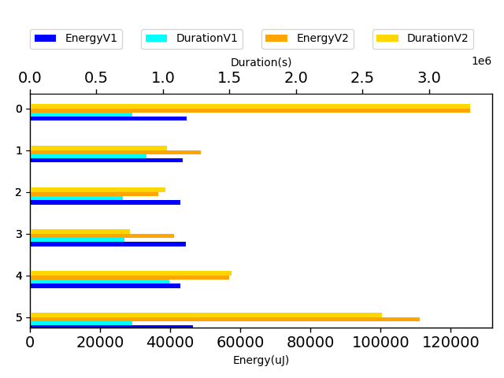

## com.google.gson.functional.DefaultTypeAdaptersTest

| Test | IterationV1 | IterationV2 | DeltaIteration |
| --- | --- | --- | --- |
| com.google.gson.functional.DefaultTypeAdaptersTest-testDateSerializationWithPattern | 66 | 62 | -4 |
| com.google.gson.functional.DefaultTypeAdaptersTest-testDefaultJavaSqlDateSerialization | 45 | 30 | -15 |
| com.google.gson.functional.DefaultTypeAdaptersTest-testUrlSerialization | 99 | 99 | 0 |
| com.google.gson.functional.DefaultTypeAdaptersTest-testOverrideBigIntegerTypeAdapter | 54 | 59 | 5 |
| com.google.gson.functional.DefaultTypeAdaptersTest-testClassSerialization | 62 | 51 | -11 |
| com.google.gson.functional.DefaultTypeAdaptersTest-testTimestampSerialization | 50 | 55 | 5 |
| com.google.gson.functional.DefaultTypeAdaptersTest-testDefaultDateDeserializationUsingBuilder | 99 | 98 | -1 |
| com.google.gson.functional.DefaultTypeAdaptersTest-testJsonNullSerialization | 12 | 16 | 4 |
| com.google.gson.functional.DefaultTypeAdaptersTest-testUrlNullSerialization | 65 | 53 | -12 |
| com.google.gson.functional.DefaultTypeAdaptersTest-testNullSerialization | 99 | 99 | 0 |
| com.google.gson.functional.DefaultTypeAdaptersTest-testTreeSetSerialization | 39 | 38 | -1 |
| com.google.gson.functional.DefaultTypeAdaptersTest-testDateDeserializationWithPattern | 64 | 57 | -7 |
| com.google.gson.functional.DefaultTypeAdaptersTest-testDateSerializationInCollection | 94 | 89 | -5 |
| com.google.gson.functional.DefaultTypeAdaptersTest-testBigIntegerFieldSerialization | 63 | 65 | 2 |
| com.google.gson.functional.DefaultTypeAdaptersTest-testSetSerialization | 37 | 27 | -10 |
| com.google.gson.functional.DefaultTypeAdaptersTest-testDefaultDateSerialization | 77 | 61 | -16 |
| com.google.gson.functional.DefaultTypeAdaptersTest-testBigDecimalFieldSerialization | 72 | 69 | -3 |
| com.google.gson.functional.DefaultTypeAdaptersTest-testDefaultJavaSqlTimestampSerialization | 77 | 60 | -17 |
| com.google.gson.functional.DefaultTypeAdaptersTest-testLocaleSerializationWithLanguageCountryVariant | 24 | 13 | -11 |
| com.google.gson.functional.DefaultTypeAdaptersTest-testUuidSerialization | 30 | 25 | -5 |
| com.google.gson.functional.DefaultTypeAdaptersTest-testDefaultCalendarSerialization | 23 | 14 | -9 |
| com.google.gson.functional.DefaultTypeAdaptersTest-testNullJsonElementSerialization | 16 | 12 | -4 |
| com.google.gson.functional.DefaultTypeAdaptersTest-testOverrideBigDecimalTypeAdapter | 27 | 24 | -3 |
| com.google.gson.functional.DefaultTypeAdaptersTest-testJsonPrimitiveSerialization | 26 | 28 | 2 |
| com.google.gson.functional.DefaultTypeAdaptersTest-testBitSetSerialization | 16 | 15 | -1 |
| com.google.gson.functional.DefaultTypeAdaptersTest-testLocaleSerializationWithLanguageCountry | 19 | 12 | -7 |
| com.google.gson.functional.DefaultTypeAdaptersTest-testPropertiesSerialization | 23 | 21 | -2 |
| com.google.gson.functional.DefaultTypeAdaptersTest-testDateSerializationWithPatternNotOverridenByTypeAdapter | 55 | 52 | -3 |
| com.google.gson.functional.DefaultTypeAdaptersTest-testJsonArraySerialization | 14 | 22 | 8 |
| com.google.gson.functional.DefaultTypeAdaptersTest-testDefaultJavaSqlTimeSerialization | 44 | 32 | -12 |
| com.google.gson.functional.DefaultTypeAdaptersTest-testDefaultGregorianCalendarSerialization | 15 | 16 | 1 |
| com.google.gson.functional.DefaultTypeAdaptersTest-testDefaultDateSerializationUsingBuilder | 51 | 52 | 1 |
| com.google.gson.functional.DefaultTypeAdaptersTest-testBitSetDeserialization | 35 | 27 | -8 |
| com.google.gson.functional.DefaultTypeAdaptersTest-testSqlDateSerialization | 48 | 44 | -4 |
| com.google.gson.functional.DefaultTypeAdaptersTest-testLocaleSerializationWithLanguage | 18 | 14 | -4 |
| com.google.gson.functional.DefaultTypeAdaptersTest-testJsonObjectSerialization | 21 | 21 | 0 |
| com.google.gson.functional.DefaultTypeAdaptersTest-testUriSerialization | 15 | 12 | -3 |
| com.google.gson.functional.DefaultTypeAdaptersTest-testStringBuilderSerialization | 9 | 13 | 4 |
| com.google.gson.functional.DefaultTypeAdaptersTest-testStringBufferSerialization | 13 | 15 | 2 |

| Test | EnergyV1 | EnergyV2 | DeltaEnergy |
| --- | --- | --- | --- |
| com.google.gson.functional.DefaultTypeAdaptersTest-testDateSerializationWithPattern | 40188.0655095854 | 41548.759153903455 | 1360.693644318053 |
| com.google.gson.functional.DefaultTypeAdaptersTest-testDefaultJavaSqlDateSerialization | 42146.18316932523 | 41907.51745691337 | -238.66571241186466 |
| com.google.gson.functional.DefaultTypeAdaptersTest-testUrlSerialization | 244899.85742515197 | 251037.32780533805 | 6137.470380186074 |
| com.google.gson.functional.DefaultTypeAdaptersTest-testOverrideBigIntegerTypeAdapter | 41538.601694296216 | 41715.11313335528 | 176.51143905906065 |
| com.google.gson.functional.DefaultTypeAdaptersTest-testClassSerialization | 39810.237477480776 | 43176.027641555105 | 3365.7901640743294 |
| com.google.gson.functional.DefaultTypeAdaptersTest-testTimestampSerialization | 42247.99622672406 | 45014.489233454355 | 2766.493006730292 |
| com.google.gson.functional.DefaultTypeAdaptersTest-testDefaultDateDeserializationUsingBuilder | 307192.98925025284 | 59529.55656480034 | -247663.4326854525 |
| com.google.gson.functional.DefaultTypeAdaptersTest-testJsonNullSerialization | 41494.610107421875 | 43190.02111816406 | 1695.4110107421875 |
| com.google.gson.functional.DefaultTypeAdaptersTest-testUrlNullSerialization | 41815.15374872034 | 44740.78477151078 | 2925.6310227904396 |
| com.google.gson.functional.DefaultTypeAdaptersTest-testNullSerialization | 1357046.7412040862 | 127587.37726861576 | -1229459.3639354706 |
| com.google.gson.functional.DefaultTypeAdaptersTest-testTreeSetSerialization | 41073.82441874597 | 42860.17129783056 | 1786.3468790845873 |
| com.google.gson.functional.DefaultTypeAdaptersTest-testDateDeserializationWithPattern | 43205.33040544234 | 42628.3836096983 | -576.9467957440429 |
| com.google.gson.functional.DefaultTypeAdaptersTest-testDateSerializationInCollection | 51936.44409285419 | 44069.84195844323 | -7866.602134410961 |
| com.google.gson.functional.DefaultTypeAdaptersTest-testBigIntegerFieldSerialization | 39935.676281537715 | 43553.98332324482 | 3618.3070417071067 |
| com.google.gson.functional.DefaultTypeAdaptersTest-testSetSerialization | 45389.1899762657 | 41471.37104070932 | -3917.818935556381 |
| com.google.gson.functional.DefaultTypeAdaptersTest-testDefaultDateSerialization | 41847.06152192667 | 41708.501568723834 | -138.55995320283546 |
| com.google.gson.functional.DefaultTypeAdaptersTest-testBigDecimalFieldSerialization | 60981.173448007365 | 43817.66821288406 | -17163.505235123303 |
| com.google.gson.functional.DefaultTypeAdaptersTest-testDefaultJavaSqlTimestampSerialization | 42245.20655854104 | 43225.80774245155 | 980.6011839105122 |
| com.google.gson.functional.DefaultTypeAdaptersTest-testLocaleSerializationWithLanguageCountryVariant | 42469.70384943485 | 43114.31005859375 | 644.6062091588974 |
| com.google.gson.functional.DefaultTypeAdaptersTest-testUuidSerialization | 42498.43046773225 | 41539.801570892334 | -958.6288968399167 |
| com.google.gson.functional.DefaultTypeAdaptersTest-testDefaultCalendarSerialization | 43458.43580889702 | 40963.3134765625 | -2495.1223323345184 |
| com.google.gson.functional.DefaultTypeAdaptersTest-testNullJsonElementSerialization | 44263.913330078125 | 43957.31884765625 | -306.594482421875 |
| com.google.gson.functional.DefaultTypeAdaptersTest-testOverrideBigDecimalTypeAdapter | 41693.9332587868 | 40867.41090762615 | -826.5223511606455 |
| com.google.gson.functional.DefaultTypeAdaptersTest-testJsonPrimitiveSerialization | 41819.84489098191 | 42014.256068989635 | 194.4111780077219 |
| com.google.gson.functional.DefaultTypeAdaptersTest-testBitSetSerialization | 44359.708099365234 | 43222.987548828125 | -1136.7205505371094 |
| com.google.gson.functional.DefaultTypeAdaptersTest-testLocaleSerializationWithLanguageCountry | 42915.10231781006 | 42641.999755859375 | -273.1025619506836 |
| com.google.gson.functional.DefaultTypeAdaptersTest-testPropertiesSerialization | 42165.72739315033 | 44742.8855805397 | 2577.158187389374 |
| com.google.gson.functional.DefaultTypeAdaptersTest-testDateSerializationWithPatternNotOverridenByTypeAdapter | 42011.56588986148 | 42382.70262092251 | 371.1367310610294 |
| com.google.gson.functional.DefaultTypeAdaptersTest-testJsonArraySerialization | 45102.703857421875 | 43022.92963409424 | -2079.7742233276367 |
| com.google.gson.functional.DefaultTypeAdaptersTest-testDefaultJavaSqlTimeSerialization | 41635.27499491723 | 41345.469132788014 | -289.8058621292148 |
| com.google.gson.functional.DefaultTypeAdaptersTest-testDefaultGregorianCalendarSerialization | 43655.48602294922 | 41635.08631896973 | -2020.3997039794922 |
| com.google.gson.functional.DefaultTypeAdaptersTest-testDefaultDateSerializationUsingBuilder | 41297.21719609809 | 42026.36969049523 | 729.1524943971381 |
| com.google.gson.functional.DefaultTypeAdaptersTest-testBitSetDeserialization | 42515.29138174176 | 44644.37516339123 | 2129.083781649475 |
| com.google.gson.functional.DefaultTypeAdaptersTest-testSqlDateSerialization | 44258.380026542785 | 43726.06136520189 | -532.318661340898 |
| com.google.gson.functional.DefaultTypeAdaptersTest-testLocaleSerializationWithLanguage | 42880.34606933594 | 42930.08679199219 | 49.74072265625 |
| com.google.gson.functional.DefaultTypeAdaptersTest-testJsonObjectSerialization | 68422.4673833847 | 42879.91304397583 | -25542.554339408875 |
| com.google.gson.functional.DefaultTypeAdaptersTest-testUriSerialization | 42775.716064453125 | 42247.57861328125 | -528.137451171875 |
| com.google.gson.functional.DefaultTypeAdaptersTest-testStringBuilderSerialization | 42536.6875 | 40010.98474121094 | -2525.7027587890625 |
| com.google.gson.functional.DefaultTypeAdaptersTest-testStringBufferSerialization | 40679.21826171875 | 41582.376037597656 | 903.1577758789062 |

| Test | DurationV1 | DurationsV2 | DeltaDuration |
| --- | --- | --- | --- |
| com.google.gson.functional.DefaultTypeAdaptersTest-testDateSerializationWithPattern | 837043.9034626777 | 807485.8268034691 | -29558.07665920863 |
| com.google.gson.functional.DefaultTypeAdaptersTest-testDefaultJavaSqlDateSerialization | 525518.0839555545 | 624158.3649179107 | 98640.28096235613 |
| com.google.gson.functional.DefaultTypeAdaptersTest-testUrlSerialization | 6618763.487418113 | 5743779.388464065 | -874984.098954048 |
| com.google.gson.functional.DefaultTypeAdaptersTest-testOverrideBigIntegerTypeAdapter | 757574.5335130278 | 749348.8432723836 | -8225.690240644268 |
| com.google.gson.functional.DefaultTypeAdaptersTest-testClassSerialization | 807543.3948629235 | 691502.7053121512 | -116040.68955077231 |
| com.google.gson.functional.DefaultTypeAdaptersTest-testTimestampSerialization | 713818.6910291717 | 700192.2207379197 | -13626.470291252015 |
| com.google.gson.functional.DefaultTypeAdaptersTest-testDefaultDateDeserializationUsingBuilder | 7591525.3111066045 | 1617097.4583479317 | -5974427.852758673 |
| com.google.gson.functional.DefaultTypeAdaptersTest-testJsonNullSerialization | 376671.8547363281 | 341162.7279205322 | -35509.1268157959 |
| com.google.gson.functional.DefaultTypeAdaptersTest-testUrlNullSerialization | 851739.6202184747 | 807614.0135992067 | -44125.60661926796 |
| com.google.gson.functional.DefaultTypeAdaptersTest-testNullSerialization | 32002534.50695689 | 2925837.1627939306 | -29076697.34416296 |
| com.google.gson.functional.DefaultTypeAdaptersTest-testTreeSetSerialization | 653701.4799801989 | 561427.8533344226 | -92273.62664577633 |
| com.google.gson.functional.DefaultTypeAdaptersTest-testDateDeserializationWithPattern | 815330.60109001 | 718407.3198029688 | -96923.28128704126 |
| com.google.gson.functional.DefaultTypeAdaptersTest-testDateSerializationInCollection | 1207333.5076998346 | 1154343.9594578084 | -52989.54824202624 |
| com.google.gson.functional.DefaultTypeAdaptersTest-testBigIntegerFieldSerialization | 1013988.1250731518 | 796393.8158630703 | -217594.30921008147 |
| com.google.gson.functional.DefaultTypeAdaptersTest-testSetSerialization | 598247.7078248481 | 616662.1788302138 | 18414.471005365718 |
| com.google.gson.functional.DefaultTypeAdaptersTest-testDefaultDateSerialization | 1200030.1264288854 | 764270.9933944291 | -435759.1330344563 |
| com.google.gson.functional.DefaultTypeAdaptersTest-testBigDecimalFieldSerialization | 1473009.9354749857 | 827465.1527748238 | -645544.7827001619 |
| com.google.gson.functional.DefaultTypeAdaptersTest-testDefaultJavaSqlTimestampSerialization | 854814.5608323442 | 854627.022706813 | -187.53812553128228 |
| com.google.gson.functional.DefaultTypeAdaptersTest-testLocaleSerializationWithLanguageCountryVariant | 359973.7777611017 | 343196.2692871094 | -16777.508473992348 |
| com.google.gson.functional.DefaultTypeAdaptersTest-testUuidSerialization | 454277.5121179167 | 420735.0176565349 | -33542.49446138181 |
| com.google.gson.functional.DefaultTypeAdaptersTest-testDefaultCalendarSerialization | 436156.0917711258 | 435132.6442260742 | -1023.4475450515747 |
| com.google.gson.functional.DefaultTypeAdaptersTest-testNullJsonElementSerialization | 273587.4469604492 | 272560.30810546875 | -1027.1388549804688 |
| com.google.gson.functional.DefaultTypeAdaptersTest-testOverrideBigDecimalTypeAdapter | 479041.9683582932 | 457771.7189171314 | -21270.24944116175 |
| com.google.gson.functional.DefaultTypeAdaptersTest-testJsonPrimitiveSerialization | 395438.8535062969 | 477545.37165429816 | 82106.51814800128 |
| com.google.gson.functional.DefaultTypeAdaptersTest-testBitSetSerialization | 428569.4522705078 | 380310.84063720703 | -48258.61163330078 |
| com.google.gson.functional.DefaultTypeAdaptersTest-testLocaleSerializationWithLanguageCountry | 390060.77503967285 | 343396.42529296875 | -46664.3497467041 |
| com.google.gson.functional.DefaultTypeAdaptersTest-testPropertiesSerialization | 389795.1203815937 | 478113.9846391678 | 88318.86425757408 |
| com.google.gson.functional.DefaultTypeAdaptersTest-testDateSerializationWithPatternNotOverridenByTypeAdapter | 714575.7020392802 | 769660.6473611672 | 55084.94532188703 |
| com.google.gson.functional.DefaultTypeAdaptersTest-testJsonArraySerialization | 336383.04431152344 | 313739.38753795624 | -22643.6567735672 |
| com.google.gson.functional.DefaultTypeAdaptersTest-testDefaultJavaSqlTimeSerialization | 537043.7873375544 | 537145.9704392529 | 102.18310169852339 |
| com.google.gson.functional.DefaultTypeAdaptersTest-testDefaultGregorianCalendarSerialization | 398436.21673583984 | 364985.2263031006 | -33450.99043273926 |
| com.google.gson.functional.DefaultTypeAdaptersTest-testDefaultDateSerializationUsingBuilder | 648584.4463553916 | 691061.5068676511 | 42477.060512259486 |
| com.google.gson.functional.DefaultTypeAdaptersTest-testBitSetDeserialization | 507637.4881396027 | 568500.583288163 | 60863.09514856024 |
| com.google.gson.functional.DefaultTypeAdaptersTest-testSqlDateSerialization | 734136.7671959659 | 651710.6338201575 | -82426.13337580836 |
| com.google.gson.functional.DefaultTypeAdaptersTest-testLocaleSerializationWithLanguage | 384776.7919692993 | 350916.0411376953 | -33860.750831604004 |
| com.google.gson.functional.DefaultTypeAdaptersTest-testJsonObjectSerialization | 2013683.8874673843 | 466274.7739443779 | -1547409.1135230064 |
| com.google.gson.functional.DefaultTypeAdaptersTest-testUriSerialization | 359831.7335205078 | 441263.42431640625 | 81431.69079589844 |
| com.google.gson.functional.DefaultTypeAdaptersTest-testStringBuilderSerialization | 331685.609375 | 307040.8718261719 | -24644.737548828125 |
| com.google.gson.functional.DefaultTypeAdaptersTest-testStringBufferSerialization | 333695.3098144531 | 370866.44818115234 | 37171.13836669922 |

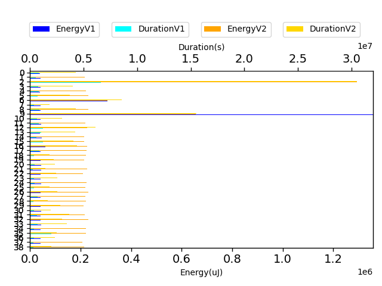

## com.google.gson.functional.JavaUtilConcurrentAtomicTest

| Test | IterationV1 | IterationV2 | DeltaIteration |
| --- | --- | --- | --- |
| com.google.gson.functional.JavaUtilConcurrentAtomicTest-testAtomicLong | 16 | 20 | 4 |
| com.google.gson.functional.JavaUtilConcurrentAtomicTest-testAtomicLongArray | 92 | 83 | -9 |
| com.google.gson.functional.JavaUtilConcurrentAtomicTest-testAtomicIntegerArray | 92 | 91 | -1 |
| com.google.gson.functional.JavaUtilConcurrentAtomicTest-testAtomicInteger | 20 | 22 | 2 |
| com.google.gson.functional.JavaUtilConcurrentAtomicTest-testAtomicLongWithStringSerializationPolicy | 54 | 53 | -1 |
| com.google.gson.functional.JavaUtilConcurrentAtomicTest-testAtomicLongArrayWithStringSerializationPolicy | 15 | 30 | 15 |
| com.google.gson.functional.JavaUtilConcurrentAtomicTest-testAtomicBoolean | 17 | 25 | 8 |

| Test | EnergyV1 | EnergyV2 | DeltaEnergy |
| --- | --- | --- | --- |
| com.google.gson.functional.JavaUtilConcurrentAtomicTest-testAtomicLong | 41957.85525512695 | 38724.6013507843 | -3233.2539043426514 |
| com.google.gson.functional.JavaUtilConcurrentAtomicTest-testAtomicLongArray | 52876.81433716482 | 61587.80313214562 | 8710.988794980804 |
| com.google.gson.functional.JavaUtilConcurrentAtomicTest-testAtomicIntegerArray | 43388.45760014768 | 41222.78716142396 | -2165.6704387237187 |
| com.google.gson.functional.JavaUtilConcurrentAtomicTest-testAtomicInteger | 42431.30739021301 | 42397.930114507675 | -33.377275705337524 |
| com.google.gson.functional.JavaUtilConcurrentAtomicTest-testAtomicLongWithStringSerializationPolicy | 43367.429869126514 | 41639.6847699559 | -1727.7450991706137 |
| com.google.gson.functional.JavaUtilConcurrentAtomicTest-testAtomicLongArrayWithStringSerializationPolicy | 43625.11505126953 | 42697.703460851684 | -927.411590417847 |
| com.google.gson.functional.JavaUtilConcurrentAtomicTest-testAtomicBoolean | 59819.61544799805 | 51950.48521131277 | -7869.130236685276 |

| Test | DurationV1 | DurationsV2 | DeltaDuration |
| --- | --- | --- | --- |
| com.google.gson.functional.JavaUtilConcurrentAtomicTest-testAtomicLong | 328169.0552520752 | 523164.39740371704 | 194995.34215164185 |
| com.google.gson.functional.JavaUtilConcurrentAtomicTest-testAtomicLongArray | 1223173.753016896 | 1297391.9215139924 | 74218.16849709628 |
| com.google.gson.functional.JavaUtilConcurrentAtomicTest-testAtomicIntegerArray | 1206323.8397361888 | 1279869.7104788965 | 73545.87074270775 |
| com.google.gson.functional.JavaUtilConcurrentAtomicTest-testAtomicInteger | 548135.7177257538 | 335747.8616127968 | -212387.856112957 |
| com.google.gson.functional.JavaUtilConcurrentAtomicTest-testAtomicLongWithStringSerializationPolicy | 1419752.8738823545 | 1141135.2775476524 | -278617.5963347021 |
| com.google.gson.functional.JavaUtilConcurrentAtomicTest-testAtomicLongArrayWithStringSerializationPolicy | 588014.5153808594 | 418030.6171335783 | -169983.8982472811 |
| com.google.gson.functional.JavaUtilConcurrentAtomicTest-testAtomicBoolean | 1139831.7534484863 | 1173185.0241894126 | 33353.270740926266 |

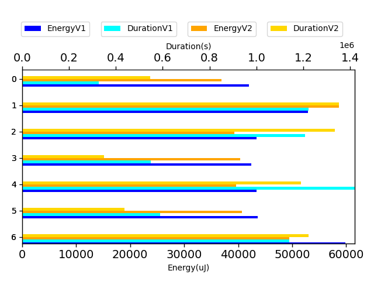

## com.google.gson.internal.bind.JsonTreeWriterTest

| Test | IterationV1 | IterationV2 | DeltaIteration |
| --- | --- | --- | --- |
| com.google.gson.internal.bind.JsonTreeWriterTest-testNestedArray | 9 | 14 | 5 |
| com.google.gson.internal.bind.JsonTreeWriterTest-testStrictBoxedNansAndInfinities | 11 | 12 | 1 |
| com.google.gson.internal.bind.JsonTreeWriterTest-testLenientNansAndInfinities | 29 | 24 | -5 |
| com.google.gson.internal.bind.JsonTreeWriterTest-testNestedObject | 23 | 22 | -1 |
| com.google.gson.internal.bind.JsonTreeWriterTest-testPrematureClose | 18 | 12 | -6 |
| com.google.gson.internal.bind.JsonTreeWriterTest-testStrictNansAndInfinities | 13 | 15 | 2 |
| com.google.gson.internal.bind.JsonTreeWriterTest-testObject | 18 | 20 | 2 |
| com.google.gson.internal.bind.JsonTreeWriterTest-testWriteAfterClose | 16 | 9 | -7 |
| com.google.gson.internal.bind.JsonTreeWriterTest-testSerializeNullsFalse | 13 | 15 | 2 |
| com.google.gson.internal.bind.JsonTreeWriterTest-testArray | 24 | 21 | -3 |
| com.google.gson.internal.bind.JsonTreeWriterTest-testEmptyWriter | 5 | 10 | 5 |
| com.google.gson.internal.bind.JsonTreeWriterTest-testSerializeNullsTrue | 12 | 13 | 1 |

| Test | EnergyV1 | EnergyV2 | DeltaEnergy |
| --- | --- | --- | --- |
| com.google.gson.internal.bind.JsonTreeWriterTest-testNestedArray | 42941.07421875 | 43009.70556640625 | 68.63134765625 |
| com.google.gson.internal.bind.JsonTreeWriterTest-testStrictBoxedNansAndInfinities | 46831.37451171875 | 40823.24755859375 | -6008.126953125 |
| com.google.gson.internal.bind.JsonTreeWriterTest-testLenientNansAndInfinities | 39426.40674657561 | 41128.25484967232 | 1701.8481030967087 |
| com.google.gson.internal.bind.JsonTreeWriterTest-testNestedObject | 93657.17348361015 | 51504.44475030899 | -42152.72873330116 |
| com.google.gson.internal.bind.JsonTreeWriterTest-testPrematureClose | 43996.069480895996 | 41539.15087890625 | -2456.918601989746 |
| com.google.gson.internal.bind.JsonTreeWriterTest-testStrictNansAndInfinities | 40210.42578125 | 41813.71157836914 | 1603.2857971191406 |
| com.google.gson.internal.bind.JsonTreeWriterTest-testObject | 49671.872901916504 | 45253.99685668945 | -4417.876045227051 |
| com.google.gson.internal.bind.JsonTreeWriterTest-testWriteAfterClose | 40754.911560058594 | 43224.2890625 | 2469.3775024414062 |
| com.google.gson.internal.bind.JsonTreeWriterTest-testSerializeNullsFalse | 45492.50927734375 | 42207.82666015625 | -3284.6826171875 |
| com.google.gson.internal.bind.JsonTreeWriterTest-testArray | 349090.7143598795 | 43907.084257125854 | -305183.63010275364 |
| com.google.gson.internal.bind.JsonTreeWriterTest-testEmptyWriter | 60626.375 | 41023.396484375 | -19602.978515625 |
| com.google.gson.internal.bind.JsonTreeWriterTest-testSerializeNullsTrue | 41174.0 | 42237.6162109375 | 1063.6162109375 |

| Test | DurationV1 | DurationsV2 | DeltaDuration |
| --- | --- | --- | --- |
| com.google.gson.internal.bind.JsonTreeWriterTest-testNestedArray | 422241.5 | 290910.42919921875 | -131331.07080078125 |
| com.google.gson.internal.bind.JsonTreeWriterTest-testStrictBoxedNansAndInfinities | 436842.64208984375 | 325628.6496582031 | -111213.99243164062 |
| com.google.gson.internal.bind.JsonTreeWriterTest-testLenientNansAndInfinities | 1175180.6963167526 | 499395.1819515228 | -675785.5143652298 |
| com.google.gson.internal.bind.JsonTreeWriterTest-testNestedObject | 1852363.9989207983 | 734054.1003398895 | -1118309.8985809088 |
| com.google.gson.internal.bind.JsonTreeWriterTest-testPrematureClose | 405118.997795105 | 349504.98583984375 | -55614.01195526123 |
| com.google.gson.internal.bind.JsonTreeWriterTest-testStrictNansAndInfinities | 472787.8896484375 | 357437.6551208496 | -115350.23452758789 |
| com.google.gson.internal.bind.JsonTreeWriterTest-testObject | 1032198.3093490601 | 526311.514415741 | -505886.7949333191 |
| com.google.gson.internal.bind.JsonTreeWriterTest-testWriteAfterClose | 552966.3267211914 | 380709.75390625 | -172256.5728149414 |
| com.google.gson.internal.bind.JsonTreeWriterTest-testSerializeNullsFalse | 460175.3918457031 | 315151.2996826172 | -145024.09216308594 |
| com.google.gson.internal.bind.JsonTreeWriterTest-testArray | 10064377.115982056 | 414896.31856536865 | -9649480.797416687 |
| com.google.gson.internal.bind.JsonTreeWriterTest-testEmptyWriter | 6511607.5 | 447261.2265625 | -6064346.2734375 |
| com.google.gson.internal.bind.JsonTreeWriterTest-testSerializeNullsTrue | 295085.6494140625 | 323627.40087890625 | 28541.75146484375 |

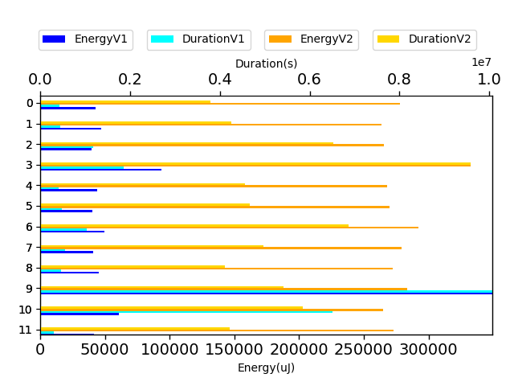

## com.google.gson.functional.DelegateTypeAdapterTest

| Test | IterationV1 | IterationV2 | DeltaIteration |
| --- | --- | --- | --- |
| com.google.gson.functional.DelegateTypeAdapterTest-testDelegateInvokedOnStrings | 24 | 23 | -1 |
| com.google.gson.functional.DelegateTypeAdapterTest-testDelegateInvoked | 97 | 98 | 1 |

| Test | EnergyV1 | EnergyV2 | DeltaEnergy |
| --- | --- | --- | --- |
| com.google.gson.functional.DelegateTypeAdapterTest-testDelegateInvokedOnStrings | 41008.627590596676 | 39530.684858083725 | -1477.942732512951 |
| com.google.gson.functional.DelegateTypeAdapterTest-testDelegateInvoked | 66746.38567246482 | 44584.501311018066 | -22161.884361446755 |

| Test | DurationV1 | DurationsV2 | DeltaDuration |
| --- | --- | --- | --- |
| com.google.gson.functional.DelegateTypeAdapterTest-testDelegateInvokedOnStrings | 374368.27226907015 | 536419.3925647736 | 162051.1202957034 |
| com.google.gson.functional.DelegateTypeAdapterTest-testDelegateInvoked | 1500092.2234612787 | 1475575.3157532592 | -24516.907708019484 |

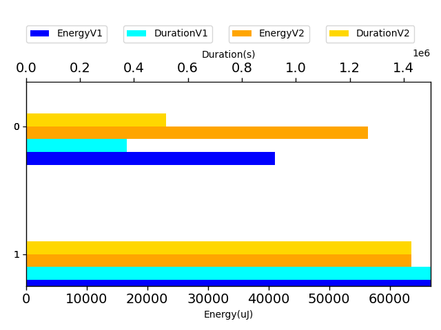

## com.google.gson.functional.TypeAdapterPrecedenceTest

| Test | IterationV1 | IterationV2 | DeltaIteration |
| --- | --- | --- | --- |
| com.google.gson.functional.TypeAdapterPrecedenceTest-testStreamingHierarchicalFollowedByNonstreaming | 20 | 32 | 12 |
| com.google.gson.functional.TypeAdapterPrecedenceTest-testNonstreamingFollowedByNonstreaming | 86 | 82 | -4 |
| com.google.gson.functional.TypeAdapterPrecedenceTest-testStreamingHierarchicalFollowedByNonstreamingHierarchical | 22 | 19 | -3 |
| com.google.gson.functional.TypeAdapterPrecedenceTest-testStreamingFollowedByStreaming | 26 | 30 | 4 |
| com.google.gson.functional.TypeAdapterPrecedenceTest-testSerializeNonstreamingTypeAdapterFollowedByStreamingTypeAdapter | 28 | 15 | -13 |
| com.google.gson.functional.TypeAdapterPrecedenceTest-testStreamingFollowedByNonstreamingHierarchical | 16 | 19 | 3 |
| com.google.gson.functional.TypeAdapterPrecedenceTest-testStreamingFollowedByNonstreaming | 23 | 24 | 1 |
| com.google.gson.functional.TypeAdapterPrecedenceTest-testNonstreamingHierarchicalFollowedByNonstreaming | 14 | 22 | 8 |

| Test | EnergyV1 | EnergyV2 | DeltaEnergy |
| --- | --- | --- | --- |
| com.google.gson.functional.TypeAdapterPrecedenceTest-testStreamingHierarchicalFollowedByNonstreaming | 43466.25593662262 | 41490.65887180902 | -1975.597064813599 |
| com.google.gson.functional.TypeAdapterPrecedenceTest-testNonstreamingFollowedByNonstreaming | 46242.362126589665 | 40310.4387865022 | -5931.9233400874655 |
| com.google.gson.functional.TypeAdapterPrecedenceTest-testStreamingHierarchicalFollowedByNonstreamingHierarchical | 43229.47352170944 | 42901.303508758545 | -328.1700129508972 |
| com.google.gson.functional.TypeAdapterPrecedenceTest-testStreamingFollowedByStreaming | 42716.13818457723 | 44151.81093443651 | 1435.6727498592809 |
| com.google.gson.functional.TypeAdapterPrecedenceTest-testSerializeNonstreamingTypeAdapterFollowedByStreamingTypeAdapter | 45576.15650577843 | 40724.21405029297 | -4851.942455485463 |
| com.google.gson.functional.TypeAdapterPrecedenceTest-testStreamingFollowedByNonstreamingHierarchical | 42812.81787109375 | 42446.8097114563 | -366.0081596374512 |
| com.google.gson.functional.TypeAdapterPrecedenceTest-testStreamingFollowedByNonstreaming | 43771.774975299835 | 43294.49076402187 | -477.28421127796173 |
| com.google.gson.functional.TypeAdapterPrecedenceTest-testNonstreamingHierarchicalFollowedByNonstreaming | 43983.771728515625 | 43023.99665117264 | -959.7750773429871 |

| Test | DurationV1 | DurationsV2 | DeltaDuration |
| --- | --- | --- | --- |
| com.google.gson.functional.TypeAdapterPrecedenceTest-testStreamingHierarchicalFollowedByNonstreaming | 523290.5064020157 | 383730.2665633813 | -139560.23983863438 |
| com.google.gson.functional.TypeAdapterPrecedenceTest-testNonstreamingFollowedByNonstreaming | 1184850.7012675684 | 1062537.4225684816 | -122313.27869908675 |
| com.google.gson.functional.TypeAdapterPrecedenceTest-testStreamingHierarchicalFollowedByNonstreamingHierarchical | 493942.9462018013 | 462406.52966308594 | -31536.416538715363 |
| com.google.gson.functional.TypeAdapterPrecedenceTest-testStreamingFollowedByStreaming | 690404.3063451648 | 483359.1302215392 | -207045.1761236256 |
| com.google.gson.functional.TypeAdapterPrecedenceTest-testSerializeNonstreamingTypeAdapterFollowedByStreamingTypeAdapter | 429537.27437222004 | 366582.5902709961 | -62954.684101223946 |
| com.google.gson.functional.TypeAdapterPrecedenceTest-testStreamingFollowedByNonstreamingHierarchical | 341605.39739990234 | 364468.9090232849 | 22863.51162338257 |
| com.google.gson.functional.TypeAdapterPrecedenceTest-testStreamingFollowedByNonstreaming | 381427.2083604336 | 435949.50938498974 | 54522.30102455616 |
| com.google.gson.functional.TypeAdapterPrecedenceTest-testNonstreamingHierarchicalFollowedByNonstreaming | 465827.71936035156 | 367167.59084272385 | -98660.12851762772 |

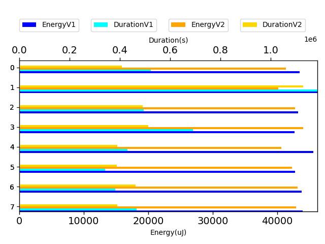

## com.google.gson.functional.JsonTreeTest

| Test | IterationV1 | IterationV2 | DeltaIteration |
| --- | --- | --- | --- |
| com.google.gson.functional.JsonTreeTest-testJsonTreeNull | 27 | 30 | 3 |
| com.google.gson.functional.JsonTreeTest-testJsonTreeToString | 72 | 64 | -8 |
| com.google.gson.functional.JsonTreeTest-testToJsonTreeObjectType | 53 | 55 | 2 |
| com.google.gson.functional.JsonTreeTest-testToJsonTree | 57 | 43 | -14 |

| Test | EnergyV1 | EnergyV2 | DeltaEnergy |
| --- | --- | --- | --- |
| com.google.gson.functional.JsonTreeTest-testJsonTreeNull | 43153.0538071841 | 43501.83676974289 | 348.78296255879104 |
| com.google.gson.functional.JsonTreeTest-testJsonTreeToString | 76324.1199040109 | 82972.09087098745 | 6647.970966976543 |
| com.google.gson.functional.JsonTreeTest-testToJsonTreeObjectType | 59687.05219504085 | 39290.99639965661 | -20396.055795384244 |
| com.google.gson.functional.JsonTreeTest-testToJsonTree | 43376.069872399 | 80558.9975776858 | 37182.927705286806 |

| Test | DurationV1 | DurationsV2 | DeltaDuration |
| --- | --- | --- | --- |
| com.google.gson.functional.JsonTreeTest-testJsonTreeNull | 799013.2195257246 | 688704.2017611712 | -110309.01776455343 |
| com.google.gson.functional.JsonTreeTest-testJsonTreeToString | 1581759.414988317 | 2498178.5128601165 | 916419.0978717995 |
| com.google.gson.functional.JsonTreeTest-testToJsonTreeObjectType | 1424696.8524828518 | 1163702.4637782974 | -260994.3887045544 |
| com.google.gson.functional.JsonTreeTest-testToJsonTree | 740665.4902463008 | 1907303.7062712107 | 1166638.2160249099 |

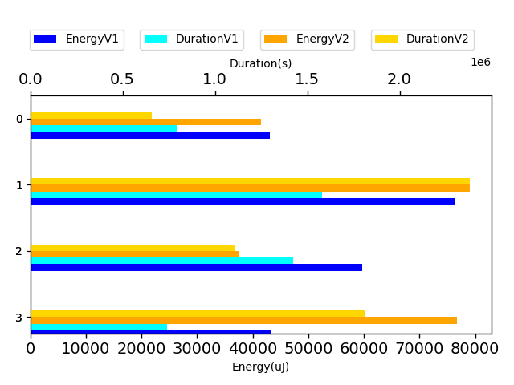

## com.google.gson.DefaultMapJsonSerializerTest

| Test | IterationV1 | IterationV2 | DeltaIteration |
| --- | --- | --- | --- |
| com.google.gson.DefaultMapJsonSerializerTest-testEmptyMapSerialization | 44 | 48 | 4 |
| com.google.gson.DefaultMapJsonSerializerTest-testNonEmptyMapSerialization | 57 | 42 | -15 |
| com.google.gson.DefaultMapJsonSerializerTest-testEmptyMapNoTypeSerialization | 28 | 26 | -2 |

| Test | EnergyV1 | EnergyV2 | DeltaEnergy |
| --- | --- | --- | --- |
| com.google.gson.DefaultMapJsonSerializerTest-testEmptyMapSerialization | 43130.42469323833 | 43146.72176500386 | 16.297071765526198 |
| com.google.gson.DefaultMapJsonSerializerTest-testNonEmptyMapSerialization | 42771.28444085449 | 41615.32075185198 | -1155.963689002514 |
| com.google.gson.DefaultMapJsonSerializerTest-testEmptyMapNoTypeSerialization | 42707.972735747695 | 41046.51888999343 | -1661.4538457542658 |

| Test | DurationV1 | DurationsV2 | DeltaDuration |
| --- | --- | --- | --- |
| com.google.gson.DefaultMapJsonSerializerTest-testEmptyMapSerialization | 623604.151709714 | 611525.7020080023 | -12078.449701711652 |
| com.google.gson.DefaultMapJsonSerializerTest-testNonEmptyMapSerialization | 547204.1751183689 | 598864.1952022915 | 51660.02008392254 |
| com.google.gson.DefaultMapJsonSerializerTest-testEmptyMapNoTypeSerialization | 592745.3169096187 | 395986.97973147035 | -196758.33717814833 |

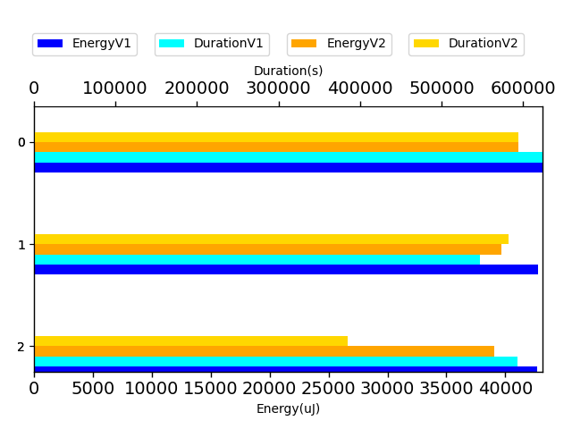

## com.google.gson.functional.ArrayTest

| Test | IterationV1 | IterationV2 | DeltaIteration |
| --- | --- | --- | --- |
| com.google.gson.functional.ArrayTest-testEmptyArraySerialization | 12 | 18 | 6 |
| com.google.gson.functional.ArrayTest-testArrayOfCollectionSerialization | 75 | 78 | 3 |
| com.google.gson.functional.ArrayTest-testObjectArrayWithNonPrimitivesSerialization | 46 | 50 | 4 |
| com.google.gson.functional.ArrayTest-testNullsInArrayWithSerializeNullPropertySetSerialization | 25 | 20 | -5 |
| com.google.gson.functional.ArrayTest-testTopLevelArrayOfIntsSerialization | 19 | 15 | -4 |
| com.google.gson.functional.ArrayTest-testNullsInArraySerialization | 13 | 16 | 3 |
| com.google.gson.functional.ArrayTest-testMixingTypesInObjectArraySerialization | 16 | 14 | -2 |
| com.google.gson.functional.ArrayTest-testSingleStringArraySerialization | 10 | 15 | 5 |
| com.google.gson.functional.ArrayTest-testSingleNullInArraySerialization | 24 | 20 | -4 |
| com.google.gson.functional.ArrayTest-testMultidimenstionalArraysSerialization | 28 | 26 | -2 |
| com.google.gson.functional.ArrayTest-testArrayOfPrimitivesAsObjectsSerialization | 28 | 33 | 5 |
| com.google.gson.functional.ArrayTest-testArrayElementsAreArrays | 24 | 15 | -9 |
| com.google.gson.functional.ArrayTest-testMultiDimenstionalObjectArraysSerialization | 14 | 17 | 3 |
| com.google.gson.functional.ArrayTest-testArrayOfStringsSerialization | 12 | 14 | 2 |
| com.google.gson.functional.ArrayTest-testArrayOfNullSerialization | 9 | 18 | 9 |

| Test | EnergyV1 | EnergyV2 | DeltaEnergy |
| --- | --- | --- | --- |
| com.google.gson.functional.ArrayTest-testEmptyArraySerialization | 41565.648193359375 | 41895.99102020264 | 330.3428268432617 |
| com.google.gson.functional.ArrayTest-testArrayOfCollectionSerialization | 41239.084595750566 | 79044.47486849784 | 37805.390272747274 |
| com.google.gson.functional.ArrayTest-testObjectArrayWithNonPrimitivesSerialization | 45449.69079172029 | 54106.2852847726 | 8656.594493052311 |
| com.google.gson.functional.ArrayTest-testNullsInArrayWithSerializeNullPropertySetSerialization | 43124.71109253168 | 43222.00898075104 | 97.29788821935654 |
| com.google.gson.functional.ArrayTest-testTopLevelArrayOfIntsSerialization | 41460.97983169556 | 42449.921813964844 | 988.9419822692871 |
| com.google.gson.functional.ArrayTest-testNullsInArraySerialization | 41983.70166015625 | 41944.40264892578 | -39.29901123046875 |
| com.google.gson.functional.ArrayTest-testMixingTypesInObjectArraySerialization | 43148.011138916016 | 43157.4462890625 | 9.435150146484375 |
| com.google.gson.functional.ArrayTest-testSingleStringArraySerialization | 42495.646484375 | 43050.37176513672 | 554.7252807617188 |
| com.google.gson.functional.ArrayTest-testSingleNullInArraySerialization | 41585.16875755787 | 40517.04940414429 | -1068.1193534135818 |
| com.google.gson.functional.ArrayTest-testMultidimenstionalArraysSerialization | 44120.94872971624 | 44398.50733064115 | 277.5586009249091 |
| com.google.gson.functional.ArrayTest-testArrayOfPrimitivesAsObjectsSerialization | 59746.3831962049 | 56769.25318545592 | -2977.1300107489806 |
| com.google.gson.functional.ArrayTest-testArrayElementsAreArrays | 43845.919093847275 | 45492.15319824219 | 1646.2341043949127 |
| com.google.gson.functional.ArrayTest-testMultiDimenstionalObjectArraysSerialization | 39665.144775390625 | 43118.19479370117 | 3453.050018310547 |
| com.google.gson.functional.ArrayTest-testArrayOfStringsSerialization | 42614.78662109375 | 42465.31237792969 | -149.4742431640625 |
| com.google.gson.functional.ArrayTest-testArrayOfNullSerialization | 39960.25390625 | 46407.98398590088 | 6447.730079650879 |

| Test | DurationV1 | DurationsV2 | DeltaDuration |
| --- | --- | --- | --- |
| com.google.gson.functional.ArrayTest-testEmptyArraySerialization | 301187.9816894531 | 396562.03271484375 | 95374.05102539062 |
| com.google.gson.functional.ArrayTest-testArrayOfCollectionSerialization | 1008995.5108045279 | 1700687.9005966797 | 691692.3897921517 |
| com.google.gson.functional.ArrayTest-testObjectArrayWithNonPrimitivesSerialization | 938884.5627977371 | 823567.1499015478 | -115317.41289618926 |
| com.google.gson.functional.ArrayTest-testNullsInArrayWithSerializeNullPropertySetSerialization | 499458.8278500438 | 436715.44655132294 | -62743.38129872084 |
| com.google.gson.functional.ArrayTest-testTopLevelArrayOfIntsSerialization | 336133.1572303772 | 336556.3642578125 | 423.20702743530273 |
| com.google.gson.functional.ArrayTest-testNullsInArraySerialization | 319797.7258300781 | 384490.5924987793 | 64692.86666870117 |
| com.google.gson.functional.ArrayTest-testMixingTypesInObjectArraySerialization | 374407.8091125488 | 360231.6485595703 | -14176.160552978516 |
| com.google.gson.functional.ArrayTest-testSingleStringArraySerialization | 503331.197265625 | 341802.8532104492 | -161528.34405517578 |
| com.google.gson.functional.ArrayTest-testSingleNullInArraySerialization | 484847.3604427576 | 495417.65229320526 | 10570.291850447655 |
| com.google.gson.functional.ArrayTest-testMultidimenstionalArraysSerialization | 421454.5449802801 | 484538.25568310916 | 63083.71070282906 |
| com.google.gson.functional.ArrayTest-testArrayOfPrimitivesAsObjectsSerialization | 1139609.715885058 | 1164518.2131823497 | 24908.497297291644 |
| com.google.gson.functional.ArrayTest-testArrayElementsAreArrays | 331539.3938087225 | 359719.4833984375 | 28180.089589715004 |
| com.google.gson.functional.ArrayTest-testMultiDimenstionalObjectArraysSerialization | 467683.7530517578 | 352500.34831237793 | -115183.40473937988 |
| com.google.gson.functional.ArrayTest-testArrayOfStringsSerialization | 315736.97998046875 | 370698.28259277344 | 54961.30261230469 |
| com.google.gson.functional.ArrayTest-testArrayOfNullSerialization | 491604.9140625 | 362413.7960739136 | -129191.11798858643 |

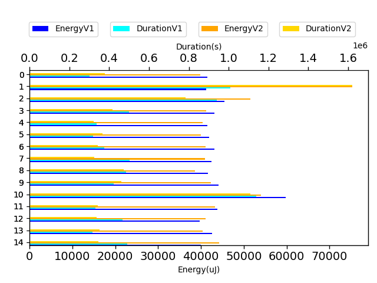

## com.google.gson.functional.ObjectTest

| Test | IterationV1 | IterationV2 | DeltaIteration |
| --- | --- | --- | --- |
| com.google.gson.functional.ObjectTest-testSingletonLists | 98 | 95 | -3 |
| com.google.gson.functional.ObjectTest-testNullFieldsSerialization | 28 | 35 | 7 |
| com.google.gson.functional.ObjectTest-testArrayOfObjectsAsFields | 64 | 64 | 0 |
| com.google.gson.functional.ObjectTest-testAnonymousLocalClassesCustomSerialization | 50 | 49 | -1 |
| com.google.gson.functional.ObjectTest-testDateAsMapObjectField | 93 | 91 | -2 |
| com.google.gson.functional.ObjectTest-testInnerClassSerialization | 63 | 52 | -11 |
| com.google.gson.functional.ObjectTest-testBagOfPrimitiveWrappersSerialization | 55 | 49 | -6 |
| com.google.gson.functional.ObjectTest-testArrayOfArraysSerialization | 72 | 79 | 7 |
| com.google.gson.functional.ObjectTest-testAnonymousLocalClassesSerialization | 40 | 41 | 1 |
| com.google.gson.functional.ObjectTest-testJsonObjectSerialization | 13 | 24 | 11 |
| com.google.gson.functional.ObjectTest-testNestedSerialization | 46 | 36 | -10 |
| com.google.gson.functional.ObjectTest-testStringFieldWithEmptyValueSerialization | 56 | 40 | -16 |
| com.google.gson.functional.ObjectTest-testEmptyCollectionInAnObjectSerialization | 75 | 60 | -15 |
| com.google.gson.functional.ObjectTest-testBagOfPrimitivesSerialization | 32 | 37 | 5 |
| com.google.gson.functional.ObjectTest-testArrayOfObjectsSerialization | 47 | 49 | 2 |
| com.google.gson.functional.ObjectTest-testClassWithTransientFieldsSerialization | 32 | 43 | 11 |
| com.google.gson.functional.ObjectTest-testClassWithNoFieldsSerialization | 28 | 30 | 2 |
| com.google.gson.functional.ObjectTest-testClassWithObjectFieldSerialization | 39 | 44 | 5 |
| com.google.gson.functional.ObjectTest-testNullSerialization | 5 | 15 | 10 |
| com.google.gson.functional.ObjectTest-testPrimitiveArrayFieldSerialization | 25 | 41 | 16 |

| Test | EnergyV1 | EnergyV2 | DeltaEnergy |
| --- | --- | --- | --- |
| com.google.gson.functional.ObjectTest-testSingletonLists | 44110.53783243077 | 43349.124444518755 | -761.4133879120127 |
| com.google.gson.functional.ObjectTest-testNullFieldsSerialization | 44871.19503182173 | 44839.89041322976 | -31.304618591966573 |
| com.google.gson.functional.ObjectTest-testArrayOfObjectsAsFields | 44320.12387840683 | 42272.84299944162 | -2047.2808789652045 |
| com.google.gson.functional.ObjectTest-testAnonymousLocalClassesCustomSerialization | 43275.87125812209 | 42049.040563438044 | -1226.8306946840457 |
| com.google.gson.functional.ObjectTest-testDateAsMapObjectField | 138300.36852581069 | 757166.5177713555 | 618866.1492455448 |
| com.google.gson.functional.ObjectTest-testInnerClassSerialization | 41907.47847333898 | 40665.494711265914 | -1241.9837620730686 |
| com.google.gson.functional.ObjectTest-testBagOfPrimitiveWrappersSerialization | 44468.39155820303 | 41449.67069015898 | -3018.7208680440526 |
| com.google.gson.functional.ObjectTest-testArrayOfArraysSerialization | 43152.35189198093 | 43707.37971341975 | 555.0278214388236 |
| com.google.gson.functional.ObjectTest-testAnonymousLocalClassesSerialization | 41914.81140938277 | 41568.12811654765 | -346.6832928351214 |
| com.google.gson.functional.ObjectTest-testJsonObjectSerialization | 41466.071044921875 | 45669.33143246174 | 4203.260387539864 |
| com.google.gson.functional.ObjectTest-testNestedSerialization | 45103.422907040884 | 42489.69467714813 | -2613.728229892753 |
| com.google.gson.functional.ObjectTest-testStringFieldWithEmptyValueSerialization | 43354.49878585202 | 41912.5672515936 | -1441.931534258416 |
| com.google.gson.functional.ObjectTest-testEmptyCollectionInAnObjectSerialization | 44602.83275356013 | 47016.47607377775 | 2413.6433202176195 |
| com.google.gson.functional.ObjectTest-testBagOfPrimitivesSerialization | 70279.42622026056 | 43193.94668410426 | -27085.4795361563 |
| com.google.gson.functional.ObjectTest-testArrayOfObjectsSerialization | 45695.352410003536 | 43228.98271251636 | -2466.369697487178 |
| com.google.gson.functional.ObjectTest-testClassWithTransientFieldsSerialization | 45015.93276820984 | 44181.79284061988 | -834.1399275899603 |
| com.google.gson.functional.ObjectTest-testClassWithNoFieldsSerialization | 42349.653085798025 | 41140.588170297444 | -1209.0649155005813 |
| com.google.gson.functional.ObjectTest-testClassWithObjectFieldSerialization | 44754.93055499489 | 42233.48248613149 | -2521.4480688633994 |
| com.google.gson.functional.ObjectTest-testNullSerialization | 44395.5 | 42893.77819824219 | -1501.7218017578125 |
| com.google.gson.functional.ObjectTest-testPrimitiveArrayFieldSerialization | 46144.30772662163 | 44116.51398744641 | -2027.7937391752203 |

| Test | DurationV1 | DurationsV2 | DeltaDuration |
| --- | --- | --- | --- |
| com.google.gson.functional.ObjectTest-testSingletonLists | 1286569.0983087264 | 1224835.7386782828 | -61733.35963044362 |
| com.google.gson.functional.ObjectTest-testNullFieldsSerialization | 523962.48509706184 | 568269.7711955162 | 44307.28609845438 |
| com.google.gson.functional.ObjectTest-testArrayOfObjectsAsFields | 746264.0195999132 | 831526.8006809998 | 85262.7810810866 |
| com.google.gson.functional.ObjectTest-testAnonymousLocalClassesCustomSerialization | 726350.2472808945 | 676638.5862057002 | -49711.661075194366 |
| com.google.gson.functional.ObjectTest-testDateAsMapObjectField | 3282907.2970833154 | 18228619.31440075 | 14945712.017317437 |
| com.google.gson.functional.ObjectTest-testInnerClassSerialization | 801966.9683011908 | 847075.6728041125 | 45108.704502921784 |
| com.google.gson.functional.ObjectTest-testBagOfPrimitiveWrappersSerialization | 649630.2154470624 | 637579.022211666 | -12051.193235396408 |
| com.google.gson.functional.ObjectTest-testArrayOfArraysSerialization | 978399.7040725704 | 1004156.1256071718 | 25756.421534601366 |
| com.google.gson.functional.ObjectTest-testAnonymousLocalClassesSerialization | 582650.895127998 | 661430.6122105949 | 78779.71708259697 |
| com.google.gson.functional.ObjectTest-testJsonObjectSerialization | 413369.70849609375 | 382643.2913082838 | -30726.417187809944 |
| com.google.gson.functional.ObjectTest-testNestedSerialization | 614429.6796834993 | 620789.6868008306 | 6360.007117331377 |
| com.google.gson.functional.ObjectTest-testStringFieldWithEmptyValueSerialization | 726936.3565780182 | 688636.7309133715 | -38299.62566464662 |
| com.google.gson.functional.ObjectTest-testEmptyCollectionInAnObjectSerialization | 904221.8038089782 | 908074.4496930498 | 3852.645884071593 |
| com.google.gson.functional.ObjectTest-testBagOfPrimitivesSerialization | 1405485.3562335018 | 574688.4953065785 | -830796.8609269233 |
| com.google.gson.functional.ObjectTest-testArrayOfObjectsSerialization | 799012.4419488965 | 587008.0633739878 | -212004.3785749087 |
| com.google.gson.functional.ObjectTest-testClassWithTransientFieldsSerialization | 680476.9446214088 | 573720.7427128215 | -106756.20190858736 |
| com.google.gson.functional.ObjectTest-testClassWithNoFieldsSerialization | 527294.1332468614 | 393354.15656864084 | -133939.97667822056 |
| com.google.gson.functional.ObjectTest-testClassWithObjectFieldSerialization | 966655.4727463943 | 624508.7431429769 | -342146.72960341745 |
| com.google.gson.functional.ObjectTest-testNullSerialization | 376303.5 | 302083.2497558594 | -74220.25024414062 |
| com.google.gson.functional.ObjectTest-testPrimitiveArrayFieldSerialization | 417781.35713392496 | 575555.8216654381 | 157774.46453151316 |

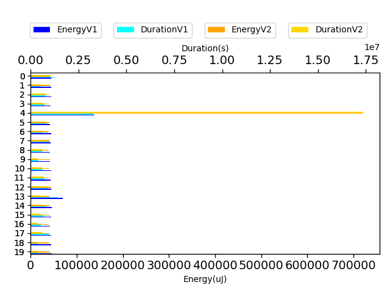

## com.google.gson.internal.bind.JsonElementReaderTest

| Test | IterationV1 | IterationV2 | DeltaIteration |
| --- | --- | --- | --- |
| com.google.gson.internal.bind.JsonElementReaderTest-testNestedArrays | 13 | 11 | -2 |
| com.google.gson.internal.bind.JsonElementReaderTest-testNumbersFromStrings | 25 | 18 | -7 |
| com.google.gson.internal.bind.JsonElementReaderTest-testEarlyClose | 15 | 18 | 3 |
| com.google.gson.internal.bind.JsonElementReaderTest-testWrongType | 40 | 47 | 7 |
| com.google.gson.internal.bind.JsonElementReaderTest-testNulls | 13 | 20 | 7 |
| com.google.gson.internal.bind.JsonElementReaderTest-testNumbers | 25 | 19 | -6 |
| com.google.gson.internal.bind.JsonElementReaderTest-testSkipValue | 18 | 18 | 0 |
| com.google.gson.internal.bind.JsonElementReaderTest-testStringsFromNumbers | 20 | 20 | 0 |
| com.google.gson.internal.bind.JsonElementReaderTest-testLenientNansAndInfinities | 33 | 34 | 1 |
| com.google.gson.internal.bind.JsonElementReaderTest-testArray | 23 | 23 | 0 |
| com.google.gson.internal.bind.JsonElementReaderTest-testNestedObjects | 19 | 23 | 4 |
| com.google.gson.internal.bind.JsonElementReaderTest-testBooleans | 16 | 17 | 1 |
| com.google.gson.internal.bind.JsonElementReaderTest-testStrictNansAndInfinities | 26 | 20 | -6 |
| com.google.gson.internal.bind.JsonElementReaderTest-testObject | 23 | 18 | -5 |
| com.google.gson.internal.bind.JsonElementReaderTest-testEmptyArray | 16 | 19 | 3 |
| com.google.gson.internal.bind.JsonElementReaderTest-testStrings | 16 | 18 | 2 |
| com.google.gson.internal.bind.JsonElementReaderTest-testEmptyObject | 8 | 17 | 9 |

| Test | EnergyV1 | EnergyV2 | DeltaEnergy |
| --- | --- | --- | --- |
| com.google.gson.internal.bind.JsonElementReaderTest-testNestedArrays | 43859.53039550781 | 42257.4892578125 | -1602.0411376953125 |
| com.google.gson.internal.bind.JsonElementReaderTest-testNumbersFromStrings | 44494.364269673824 | 43343.95217132568 | -1150.4120983481407 |
| com.google.gson.internal.bind.JsonElementReaderTest-testEarlyClose | 43501.43865966797 | 42443.79708862305 | -1057.6415710449219 |
| com.google.gson.internal.bind.JsonElementReaderTest-testWrongType | 44485.9936066841 | 43024.51999508744 | -1461.4736115966589 |
| com.google.gson.internal.bind.JsonElementReaderTest-testNulls | 44793.99365234375 | 41213.504415512085 | -3580.489236831665 |
| com.google.gson.internal.bind.JsonElementReaderTest-testNumbers | 41708.785644352436 | 40262.80279922485 | -1445.9828451275826 |
| com.google.gson.internal.bind.JsonElementReaderTest-testSkipValue | 44714.50498199463 | 42521.37929534912 | -2193.125686645508 |
| com.google.gson.internal.bind.JsonElementReaderTest-testStringsFromNumbers | 43980.447649002075 | 42497.0188369751 | -1483.4288120269775 |
| com.google.gson.internal.bind.JsonElementReaderTest-testLenientNansAndInfinities | 44427.81796938344 | 334940.752040509 | 290512.9340711256 |
| com.google.gson.internal.bind.JsonElementReaderTest-testArray | 42900.41018795967 | 44273.11112809181 | 1372.700940132141 |
| com.google.gson.internal.bind.JsonElementReaderTest-testNestedObjects | 44770.40839767456 | 42526.73588347435 | -2243.6725142002106 |
| com.google.gson.internal.bind.JsonElementReaderTest-testBooleans | 44593.996490478516 | 42422.238708496094 | -2171.757781982422 |
| com.google.gson.internal.bind.JsonElementReaderTest-testStrictNansAndInfinities | 43857.43139985204 | 40866.02902793884 | -2991.4023719131947 |
| com.google.gson.internal.bind.JsonElementReaderTest-testObject | 43003.35544133186 | 49425.03408050537 | 6421.678639173508 |
| com.google.gson.internal.bind.JsonElementReaderTest-testEmptyArray | 42006.01251220703 | 41887.81427001953 | -118.1982421875 |
| com.google.gson.internal.bind.JsonElementReaderTest-testStrings | 43792.51693725586 | 43454.881088256836 | -337.63584899902344 |
| com.google.gson.internal.bind.JsonElementReaderTest-testEmptyObject | 43172.0859375 | 39876.57891082764 | -3295.5070266723633 |

| Test | DurationV1 | DurationsV2 | DeltaDuration |
| --- | --- | --- | --- |
| com.google.gson.internal.bind.JsonElementReaderTest-testNestedArrays | 316003.22900390625 | 305514.958984375 | -10488.27001953125 |
| com.google.gson.internal.bind.JsonElementReaderTest-testNumbersFromStrings | 361808.3111703098 | 659704.703704834 | 297896.3925345242 |
| com.google.gson.internal.bind.JsonElementReaderTest-testEarlyClose | 346412.1727294922 | 357724.7228050232 | 11312.550075531006 |
| com.google.gson.internal.bind.JsonElementReaderTest-testWrongType | 582444.8815884998 | 631469.4866449847 | 49024.60505648493 |
| com.google.gson.internal.bind.JsonElementReaderTest-testNulls | 345983.1669921875 | 555224.7724533081 | 209241.6054611206 |
| com.google.gson.internal.bind.JsonElementReaderTest-testNumbers | 399898.01137685776 | 467265.5242729187 | 67367.51289606094 |
| com.google.gson.internal.bind.JsonElementReaderTest-testSkipValue | 584399.0515213013 | 341524.51457214355 | -242874.53694915771 |
| com.google.gson.internal.bind.JsonElementReaderTest-testStringsFromNumbers | 363695.6536216736 | 397567.12866973877 | 33871.475048065186 |
| com.google.gson.internal.bind.JsonElementReaderTest-testLenientNansAndInfinities | 831029.4116618582 | 9732978.449520187 | 8901949.03785833 |
| com.google.gson.internal.bind.JsonElementReaderTest-testArray | 450592.25814151764 | 676041.6747832298 | 225449.4166417122 |
| com.google.gson.internal.bind.JsonElementReaderTest-testNestedObjects | 370824.8105545044 | 391990.51178765297 | 21165.701233148575 |
| com.google.gson.internal.bind.JsonElementReaderTest-testBooleans | 399805.8899230957 | 370358.00929260254 | -29447.880630493164 |
| com.google.gson.internal.bind.JsonElementReaderTest-testStrictNansAndInfinities | 476059.4238643646 | 418511.55550193787 | -57547.86836242676 |
| com.google.gson.internal.bind.JsonElementReaderTest-testObject | 370937.4279470444 | 922721.8941116333 | 551784.4661645889 |
| com.google.gson.internal.bind.JsonElementReaderTest-testEmptyArray | 334894.2951965332 | 693378.3055763245 | 358484.01037979126 |
| com.google.gson.internal.bind.JsonElementReaderTest-testStrings | 325552.8819580078 | 330621.2032470703 | 5068.3212890625 |
| com.google.gson.internal.bind.JsonElementReaderTest-testEmptyObject | 322204.15625 | 408488.4867248535 | 86284.33047485352 |

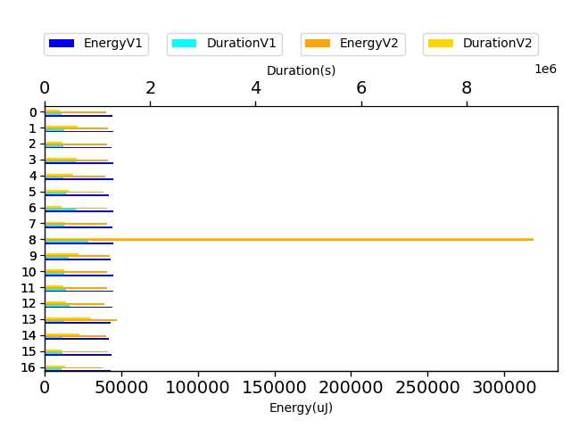

## com.google.gson.functional.JsonAdapterAnnotationOnFieldsTest

| Test | IterationV1 | IterationV2 | DeltaIteration |
| --- | --- | --- | --- |
| com.google.gson.functional.JsonAdapterAnnotationOnFieldsTest-testPrimitiveFieldAnnotationTakesPrecedenceOverDefault | 96 | 97 | 1 |
| com.google.gson.functional.JsonAdapterAnnotationOnFieldsTest-testClassAnnotationAdapterFactoryTakesPrecedenceOverDefault | 92 | 92 | 0 |
| com.google.gson.functional.JsonAdapterAnnotationOnFieldsTest-testClassAnnotationAdapterTakesPrecedenceOverDefault | 95 | 94 | -1 |
| com.google.gson.functional.JsonAdapterAnnotationOnFieldsTest-testFieldAnnotationWorksForParameterizedType | 99 | 99 | 0 |
| com.google.gson.functional.JsonAdapterAnnotationOnFieldsTest-testRegisteredTypeAdapterTakesPrecedenceOverClassAnnotationAdapter | 51 | 65 | 14 |
| com.google.gson.functional.JsonAdapterAnnotationOnFieldsTest-testNonPrimitiveFieldAnnotationTakesPrecedenceOverDefault | 32 | 35 | 3 |
| com.google.gson.functional.JsonAdapterAnnotationOnFieldsTest-testFieldAnnotationTakesPrecedenceOverRegisteredTypeAdapter | 96 | 95 | -1 |
| com.google.gson.functional.JsonAdapterAnnotationOnFieldsTest-testJsonAdapterWrappedInNullSafeAsRequested | 58 | 63 | 5 |
| com.google.gson.functional.JsonAdapterAnnotationOnFieldsTest-testFieldAnnotationTakesPrecedenceOverClassAnnotation | 77 | 75 | -2 |

| Test | EnergyV1 | EnergyV2 | DeltaEnergy |
| --- | --- | --- | --- |
| com.google.gson.functional.JsonAdapterAnnotationOnFieldsTest-testPrimitiveFieldAnnotationTakesPrecedenceOverDefault | 43658.005222929816 | 54778.688744606574 | 11120.683521676758 |
| com.google.gson.functional.JsonAdapterAnnotationOnFieldsTest-testClassAnnotationAdapterFactoryTakesPrecedenceOverDefault | 46432.31387487271 | 44064.60452744117 | -2367.7093474315334 |
| com.google.gson.functional.JsonAdapterAnnotationOnFieldsTest-testClassAnnotationAdapterTakesPrecedenceOverDefault | 43389.92605150581 | 66789.40822542347 | 23399.482173917655 |
| com.google.gson.functional.JsonAdapterAnnotationOnFieldsTest-testFieldAnnotationWorksForParameterizedType | 90171.03117374211 | 92852.67657303458 | 2681.6453992924653 |
| com.google.gson.functional.JsonAdapterAnnotationOnFieldsTest-testRegisteredTypeAdapterTakesPrecedenceOverClassAnnotationAdapter | 42754.917925377755 | 43247.63647255211 | 492.7185471743578 |
| com.google.gson.functional.JsonAdapterAnnotationOnFieldsTest-testNonPrimitiveFieldAnnotationTakesPrecedenceOverDefault | 42049.30138449627 | 43389.855575013644 | 1340.554190517374 |
| com.google.gson.functional.JsonAdapterAnnotationOnFieldsTest-testFieldAnnotationTakesPrecedenceOverRegisteredTypeAdapter | 68334.97887745018 | 45093.54688637319 | -23241.431991076992 |
| com.google.gson.functional.JsonAdapterAnnotationOnFieldsTest-testJsonAdapterWrappedInNullSafeAsRequested | 43825.211115105616 | 41969.92972534264 | -1855.2813897629749 |
| com.google.gson.functional.JsonAdapterAnnotationOnFieldsTest-testFieldAnnotationTakesPrecedenceOverClassAnnotation | 42527.809091310795 | 44198.832228068655 | 1671.02313675786 |

| Test | DurationV1 | DurationsV2 | DeltaDuration |
| --- | --- | --- | --- |
| com.google.gson.functional.JsonAdapterAnnotationOnFieldsTest-testPrimitiveFieldAnnotationTakesPrecedenceOverDefault | 1382426.7391443262 | 1281343.3115452058 | -101083.42759912042 |
| com.google.gson.functional.JsonAdapterAnnotationOnFieldsTest-testClassAnnotationAdapterFactoryTakesPrecedenceOverDefault | 1145207.784047835 | 1172595.8979230777 | 27388.11387524265 |
| com.google.gson.functional.JsonAdapterAnnotationOnFieldsTest-testClassAnnotationAdapterTakesPrecedenceOverDefault | 1196954.7933685528 | 1586311.7770951586 | 389356.9837266058 |
| com.google.gson.functional.JsonAdapterAnnotationOnFieldsTest-testFieldAnnotationWorksForParameterizedType | 2428043.7445687004 | 2060252.5867855186 | -367791.1577831819 |
| com.google.gson.functional.JsonAdapterAnnotationOnFieldsTest-testRegisteredTypeAdapterTakesPrecedenceOverClassAnnotationAdapter | 967340.2663449511 | 830494.2929923984 | -136845.97335255274 |
| com.google.gson.functional.JsonAdapterAnnotationOnFieldsTest-testNonPrimitiveFieldAnnotationTakesPrecedenceOverDefault | 493633.46600482054 | 624514.982551072 | 130881.51654625149 |
| com.google.gson.functional.JsonAdapterAnnotationOnFieldsTest-testFieldAnnotationTakesPrecedenceOverRegisteredTypeAdapter | 1256095.1134322232 | 1196793.164577097 | -59301.94885512628 |
| com.google.gson.functional.JsonAdapterAnnotationOnFieldsTest-testJsonAdapterWrappedInNullSafeAsRequested | 806009.3462600791 | 840518.415335011 | 34509.069074931904 |
| com.google.gson.functional.JsonAdapterAnnotationOnFieldsTest-testFieldAnnotationTakesPrecedenceOverClassAnnotation | 1056897.7982233688 | 993258.0685331316 | -63639.7296902372 |

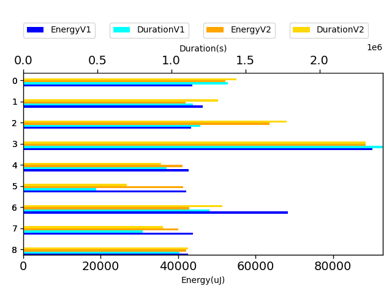

## com.google.gson.functional.SerializedNameTest

| Test | IterationV1 | IterationV2 | DeltaIteration |
| --- | --- | --- | --- |
| com.google.gson.functional.SerializedNameTest-testFirstNameIsChosenForSerialization | 82 | 80 | -2 |

| Test | EnergyV1 | EnergyV2 | DeltaEnergy |
| --- | --- | --- | --- |
| com.google.gson.functional.SerializedNameTest-testFirstNameIsChosenForSerialization | 49774.99725157358 | 53068.6292596689 | 3293.632008095323 |

| Test | DurationV1 | DurationsV2 | DeltaDuration |
| --- | --- | --- | --- |
| com.google.gson.functional.SerializedNameTest-testFirstNameIsChosenForSerialization | 1072070.59036321 | 1386346.5344395102 | 314275.94407630013 |

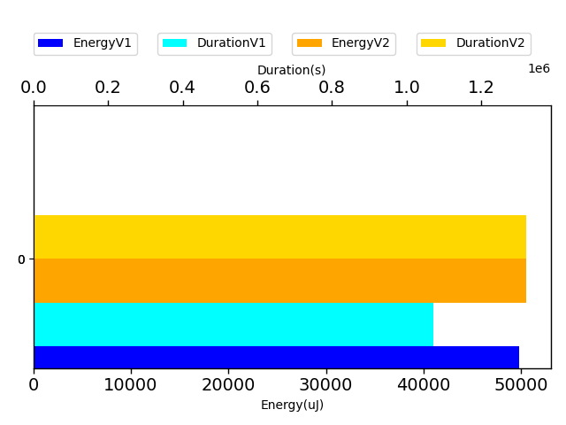

## com.google.gson.functional.EnumTest

| Test | IterationV1 | IterationV2 | DeltaIteration |
| --- | --- | --- | --- |
| com.google.gson.functional.EnumTest-testEnumCaseMapping | 64 | 57 | -7 |
| com.google.gson.functional.EnumTest-testEnumSubclass | 99 | 99 | 0 |
| com.google.gson.functional.EnumTest-testEnumSubclassWithRegisteredTypeAdapter | 82 | 83 | 1 |
| com.google.gson.functional.EnumTest-testEnumClassWithFields | 48 | 38 | -10 |
| com.google.gson.functional.EnumTest-testCollectionOfEnumsSerialization | 58 | 53 | -5 |
| com.google.gson.functional.EnumTest-testEnumSubclassAsParameterizedType | 80 | 74 | -6 |
| com.google.gson.functional.EnumTest-testEnumSet | 66 | 68 | 2 |
| com.google.gson.functional.EnumTest-testClassWithEnumFieldSerialization | 62 | 52 | -10 |
| com.google.gson.functional.EnumTest-testTopLevelEnumSerialization | 50 | 43 | -7 |

| Test | EnergyV1 | EnergyV2 | DeltaEnergy |
| --- | --- | --- | --- |
| com.google.gson.functional.EnumTest-testEnumCaseMapping | 43970.9903519869 | 49406.33067771165 | 5435.3403257247555 |
| com.google.gson.functional.EnumTest-testEnumSubclass | 177967.87218563084 | 119476.33117473744 | -58491.5410108934 |
| com.google.gson.functional.EnumTest-testEnumSubclassWithRegisteredTypeAdapter | 57348.25975167535 | 43698.479358614066 | -13649.780393061286 |
| com.google.gson.functional.EnumTest-testEnumClassWithFields | 44935.25451614785 | 41800.76627309401 | -3134.488243053842 |
| com.google.gson.functional.EnumTest-testCollectionOfEnumsSerialization | 63425.70759458758 | 44267.18000630743 | -19158.527588280143 |
| com.google.gson.functional.EnumTest-testEnumSubclassAsParameterizedType | 42255.3103439939 | 44198.15866312369 | 1942.8483191297928 |
| com.google.gson.functional.EnumTest-testEnumSet | 45151.9884271888 | 43512.04642893877 | -1639.941998250033 |
| com.google.gson.functional.EnumTest-testClassWithEnumFieldSerialization | 44507.78339310064 | 43993.52534424233 | -514.2580488583117 |
| com.google.gson.functional.EnumTest-testTopLevelEnumSerialization | 46937.128010663866 | 41955.45537321594 | -4981.672637447926 |

| Test | DurationV1 | DurationsV2 | DeltaDuration |
| --- | --- | --- | --- |
| com.google.gson.functional.EnumTest-testEnumCaseMapping | 1266221.5858423673 | 1189067.6094004733 | -77153.97644189396 |
| com.google.gson.functional.EnumTest-testEnumSubclass | 3555513.12615552 | 2729711.721038272 | -825801.4051172477 |
| com.google.gson.functional.EnumTest-testEnumSubclassWithRegisteredTypeAdapter | 1666551.5979960863 | 1168796.8578998595 | -497754.7400962268 |
| com.google.gson.functional.EnumTest-testEnumClassWithFields | 678628.8095874161 | 756958.5673260272 | 78329.75773861108 |
| com.google.gson.functional.EnumTest-testCollectionOfEnumsSerialization | 1579067.3212543167 | 803548.2224587011 | -775519.0987956156 |
| com.google.gson.functional.EnumTest-testEnumSubclassAsParameterizedType | 1170726.8320600735 | 994523.0232029938 | -176203.8088570797 |
| com.google.gson.functional.EnumTest-testEnumSet | 1126685.9813922688 | 859876.6857187483 | -266809.29567352054 |
| com.google.gson.functional.EnumTest-testClassWithEnumFieldSerialization | 1031823.7080568925 | 1072925.6168103153 | 41101.90875342279 |
| com.google.gson.functional.EnumTest-testTopLevelEnumSerialization | 1134960.4346365393 | 885165.9023261322 | -249794.53231040714 |

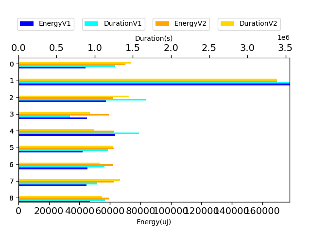

## com.google.gson.functional.TypeHierarchyAdapterTest

| Test | IterationV1 | IterationV2 | DeltaIteration |
| --- | --- | --- | --- |
| com.google.gson.functional.TypeHierarchyAdapterTest-testRegisterSuperTypeFirst | 49 | 39 | -10 |
| com.google.gson.functional.TypeHierarchyAdapterTest-testTypeHierarchy | 99 | 99 | 0 |

| Test | EnergyV1 | EnergyV2 | DeltaEnergy |
| --- | --- | --- | --- |
| com.google.gson.functional.TypeHierarchyAdapterTest-testRegisterSuperTypeFirst | 41999.13822112853 | 43482.20837008691 | 1483.0701489583807 |
| com.google.gson.functional.TypeHierarchyAdapterTest-testTypeHierarchy | 124365.4216891469 | 108852.85917944286 | -15512.562509704032 |

| Test | DurationV1 | DurationsV2 | DeltaDuration |
| --- | --- | --- | --- |
| com.google.gson.functional.TypeHierarchyAdapterTest-testRegisterSuperTypeFirst | 952594.9598883335 | 687366.6243450416 | -265228.3355432919 |
| com.google.gson.functional.TypeHierarchyAdapterTest-testTypeHierarchy | 3022680.6832630984 | 2586872.315132753 | -435808.36813034536 |

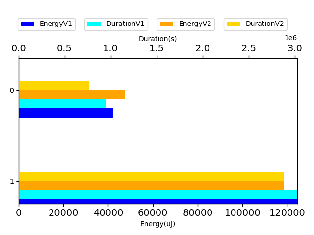

## com.google.gson.DefaultDateTypeAdapterTest

| Test | IterationV1 | IterationV2 | DeltaIteration |
| --- | --- | --- | --- |
| com.google.gson.DefaultDateTypeAdapterTest-testFormattingInEnUs | 99 | 99 | 0 |
| com.google.gson.DefaultDateTypeAdapterTest-testFormatUsesDefaultTimezone | 99 | 99 | 0 |
| com.google.gson.DefaultDateTypeAdapterTest-testDateSerialization | 56 | 49 | -7 |
| com.google.gson.DefaultDateTypeAdapterTest-testFormattingInFr | 99 | 99 | 0 |
| com.google.gson.DefaultDateTypeAdapterTest-testNullValue | 46 | 45 | -1 |
| com.google.gson.DefaultDateTypeAdapterTest-testDatePattern | 42 | 29 | -13 |

| Test | EnergyV1 | EnergyV2 | DeltaEnergy |
| --- | --- | --- | --- |
| com.google.gson.DefaultDateTypeAdapterTest-testFormattingInEnUs | 175876.48298034334 | 1009312.7008548189 | 833436.2178744755 |
| com.google.gson.DefaultDateTypeAdapterTest-testFormatUsesDefaultTimezone | 108155.0701059401 | 199211.64518602437 | 91056.57508008427 |
| com.google.gson.DefaultDateTypeAdapterTest-testDateSerialization | 43857.99903391738 | 41503.133675382174 | -2354.8653585352076 |
| com.google.gson.DefaultDateTypeAdapterTest-testFormattingInFr | 531210.6875217876 | 693936.0407512314 | 162725.35322944378 |
| com.google.gson.DefaultDateTypeAdapterTest-testNullValue | 44650.71690408053 | 40110.424175540946 | -4540.292728539585 |
| com.google.gson.DefaultDateTypeAdapterTest-testDatePattern | 45366.74263490186 | 42932.04387562163 | -2434.698759280225 |

| Test | DurationV1 | DurationsV2 | DeltaDuration |
| --- | --- | --- | --- |
| com.google.gson.DefaultDateTypeAdapterTest-testFormattingInEnUs | 4653019.864933029 | 23321055.796675682 | 18668035.931742653 |
| com.google.gson.DefaultDateTypeAdapterTest-testFormatUsesDefaultTimezone | 2868710.3771241168 | 5151745.688784726 | 2283035.311660609 |
| com.google.gson.DefaultDateTypeAdapterTest-testDateSerialization | 732699.8635868498 | 716708.8084480788 | -15991.055138770957 |
| com.google.gson.DefaultDateTypeAdapterTest-testFormattingInFr | 12168458.86912568 | 17400970.754407033 | 5232511.885281354 |
| com.google.gson.DefaultDateTypeAdapterTest-testNullValue | 632943.5467128154 | 946421.2833013957 | 313477.7365885803 |
| com.google.gson.DefaultDateTypeAdapterTest-testDatePattern | 577821.0198458694 | 658062.7960287463 | 80241.7761828769 |

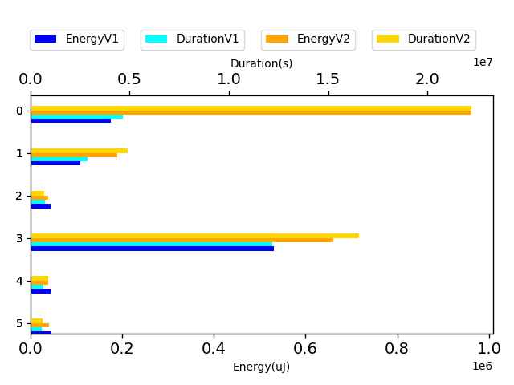

## com.google.gson.functional.VersioningTest

| Test | IterationV1 | IterationV2 | DeltaIteration |
| --- | --- | --- | --- |
| com.google.gson.functional.VersioningTest-testVersionedUntilSerialization | 97 | 98 | 1 |
| com.google.gson.functional.VersioningTest-testIgnoreLaterVersionClassSerialization | 44 | 34 | -10 |
| com.google.gson.functional.VersioningTest-testVersionedGsonWithUnversionedClassesSerialization | 21 | 33 | 12 |
| com.google.gson.functional.VersioningTest-testVersionedClassesSerialization | 63 | 63 | 0 |
| com.google.gson.functional.VersioningTest-testVersionedGsonMixingSinceAndUntilSerialization | 74 | 77 | 3 |

| Test | EnergyV1 | EnergyV2 | DeltaEnergy |
| --- | --- | --- | --- |
| com.google.gson.functional.VersioningTest-testVersionedUntilSerialization | 147781.3129763658 | 141172.87851361142 | -6608.434462754376 |
| com.google.gson.functional.VersioningTest-testIgnoreLaterVersionClassSerialization | 42910.24110632531 | 44104.10825531953 | 1193.8671489942208 |
| com.google.gson.functional.VersioningTest-testVersionedGsonWithUnversionedClassesSerialization | 42096.07921075821 | 40934.02625475172 | -1162.0529560064897 |
| com.google.gson.functional.VersioningTest-testVersionedClassesSerialization | 38651.27974884512 | 41012.2933127627 | 2361.0135639175787 |
| com.google.gson.functional.VersioningTest-testVersionedGsonMixingSinceAndUntilSerialization | 43896.656533083995 | 43933.169739986835 | 36.513206902840466 |

| Test | DurationV1 | DurationsV2 | DeltaDuration |
| --- | --- | --- | --- |
| com.google.gson.functional.VersioningTest-testVersionedUntilSerialization | 3508696.4497754495 | 3068824.095355125 | -439872.3544203243 |
| com.google.gson.functional.VersioningTest-testIgnoreLaterVersionClassSerialization | 756972.232789735 | 597137.7497252354 | -159834.48306449957 |
| com.google.gson.functional.VersioningTest-testVersionedGsonWithUnversionedClassesSerialization | 551382.2173366547 | 616000.8593223538 | 64618.641985699185 |
| com.google.gson.functional.VersioningTest-testVersionedClassesSerialization | 803131.3722164682 | 831982.5681614706 | 28851.19594500237 |
| com.google.gson.functional.VersioningTest-testVersionedGsonMixingSinceAndUntilSerialization | 786683.2257992883 | 944396.9178112007 | 157713.69201191247 |

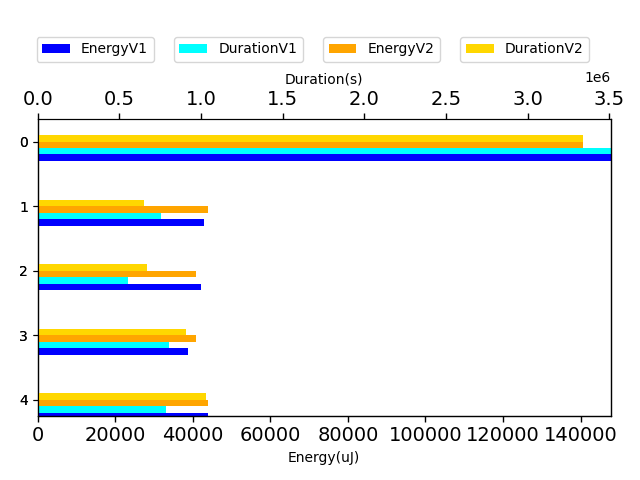

## com.google.gson.functional.MapAsArrayTypeAdapterTest

| Test | IterationV1 | IterationV2 | DeltaIteration |
| --- | --- | --- | --- |
| com.google.gson.functional.MapAsArrayTypeAdapterTest-testMultipleEnableComplexKeyRegistrationHasNoEffect | 63 | 58 | -5 |
| com.google.gson.functional.MapAsArrayTypeAdapterTest-testSerializeComplexMapWithTypeAdapter | 99 | 99 | 0 |
| com.google.gson.functional.MapAsArrayTypeAdapterTest-testMapWithTypeVariableSerialization | 85 | 83 | -2 |

| Test | EnergyV1 | EnergyV2 | DeltaEnergy |
| --- | --- | --- | --- |
| com.google.gson.functional.MapAsArrayTypeAdapterTest-testMultipleEnableComplexKeyRegistrationHasNoEffect | 43505.6648430329 | 43164.70412557929 | -340.96071745361405 |
| com.google.gson.functional.MapAsArrayTypeAdapterTest-testSerializeComplexMapWithTypeAdapter | 69377.10638601109 | 102194.76527417243 | 32817.65888816134 |
| com.google.gson.functional.MapAsArrayTypeAdapterTest-testMapWithTypeVariableSerialization | 45085.455151824695 | 42150.76727558064 | -2934.6878762440538 |

| Test | DurationV1 | DurationsV2 | DeltaDuration |
| --- | --- | --- | --- |
| com.google.gson.functional.MapAsArrayTypeAdapterTest-testMultipleEnableComplexKeyRegistrationHasNoEffect | 933592.1577809064 | 726447.9366312607 | -207144.22114964575 |
| com.google.gson.functional.MapAsArrayTypeAdapterTest-testSerializeComplexMapWithTypeAdapter | 2037650.0997236895 | 2434575.559930015 | 396925.4602063254 |
| com.google.gson.functional.MapAsArrayTypeAdapterTest-testMapWithTypeVariableSerialization | 1101159.5197864943 | 1003942.5392290857 | -97216.98055740865 |

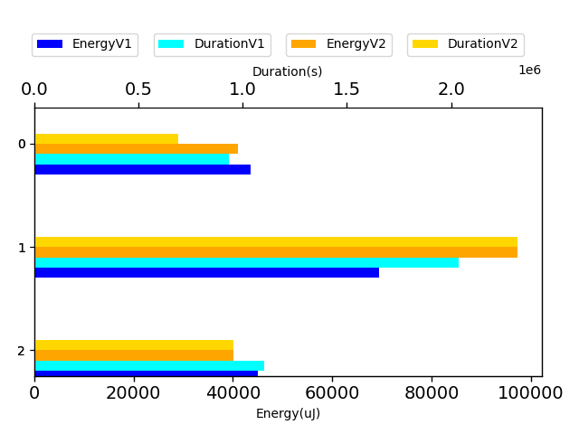

## com.google.gson.functional.RuntimeTypeAdapterFactoryFunctionalTest

| Test | IterationV1 | IterationV2 | DeltaIteration |
| --- | --- | --- | --- |
| com.google.gson.functional.RuntimeTypeAdapterFactoryFunctionalTest-testSubclassesAutomaticallySerialized | 99 | 99 | 0 |

| Test | EnergyV1 | EnergyV2 | DeltaEnergy |
| --- | --- | --- | --- |
| com.google.gson.functional.RuntimeTypeAdapterFactoryFunctionalTest-testSubclassesAutomaticallySerialized | 107348.44069518038 | 366432.7723438805 | 259084.3316487001 |

| Test | DurationV1 | DurationsV2 | DeltaDuration |
| --- | --- | --- | --- |
| com.google.gson.functional.RuntimeTypeAdapterFactoryFunctionalTest-testSubclassesAutomaticallySerialized | 2895329.725765923 | 11501457.97258659 | 8606128.246820668 |

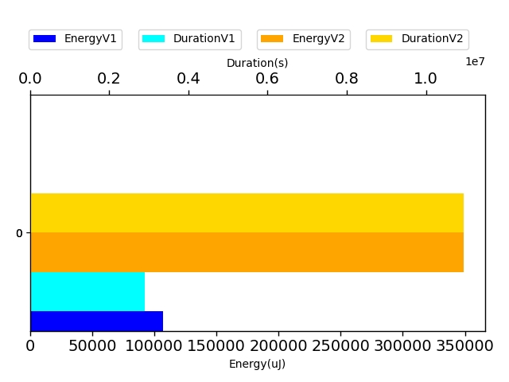

## com.google.gson.functional.CustomTypeAdaptersTest

| Test | IterationV1 | IterationV2 | DeltaIteration |
| --- | --- | --- | --- |
| com.google.gson.functional.CustomTypeAdaptersTest-testCustomAdapterInvokedForMapElementSerialization | 22 | 23 | 1 |
| com.google.gson.functional.CustomTypeAdaptersTest-testCustomAdapterInvokedForCollectionElementSerialization | 24 | 19 | -5 |
| com.google.gson.functional.CustomTypeAdaptersTest-testRegisterHierarchyAdapterForDate | 64 | 60 | -4 |
| com.google.gson.functional.CustomTypeAdaptersTest-testEnsureCustomSerializerNotInvokedForNullValues | 81 | 86 | 5 |
| com.google.gson.functional.CustomTypeAdaptersTest-testCustomAdapterInvokedForMapElementSerializationWithType | 51 | 51 | 0 |
| com.google.gson.functional.CustomTypeAdaptersTest-testCustomSerializers | 55 | 60 | 5 |
| com.google.gson.functional.CustomTypeAdaptersTest-testCustomAdapterInvokedForCollectionElementSerializationWithType | 87 | 86 | -1 |
| com.google.gson.functional.CustomTypeAdaptersTest-testCustomByteArraySerializer | 41 | 46 | 5 |
| com.google.gson.functional.CustomTypeAdaptersTest-testCustomTypeAdapterAppliesToSubClassesSerializedAsBaseClass | 41 | 41 | 0 |
| com.google.gson.functional.CustomTypeAdaptersTest-testCustomNestedSerializers | 55 | 53 | -2 |
| com.google.gson.functional.CustomTypeAdaptersTest-testCustomTypeAdapterDoesNotAppliesToSubClasses | 82 | 82 | 0 |
| com.google.gson.functional.CustomTypeAdaptersTest-testCustomSerializerInvokedForPrimitives | 40 | 31 | -9 |

| Test | EnergyV1 | EnergyV2 | DeltaEnergy |
| --- | --- | --- | --- |
| com.google.gson.functional.CustomTypeAdaptersTest-testCustomAdapterInvokedForMapElementSerialization | 40098.77246308327 | 41284.46940100193 | 1185.696937918663 |
| com.google.gson.functional.CustomTypeAdaptersTest-testCustomAdapterInvokedForCollectionElementSerialization | 40497.521255373955 | 44084.689193725586 | 3587.167938351631 |
| com.google.gson.functional.CustomTypeAdaptersTest-testRegisterHierarchyAdapterForDate | 41446.263753197614 | 49507.73976062184 | 8061.476007424222 |
| com.google.gson.functional.CustomTypeAdaptersTest-testEnsureCustomSerializerNotInvokedForNullValues | 50693.902498386145 | 46865.79393596052 | -3828.108562425623 |
| com.google.gson.functional.CustomTypeAdaptersTest-testCustomAdapterInvokedForMapElementSerializationWithType | 67098.15906234598 | 47613.488819142585 | -19484.670243203393 |
| com.google.gson.functional.CustomTypeAdaptersTest-testCustomSerializers | 54500.29449473216 | 64344.87604827029 | 9844.581553538133 |
| com.google.gson.functional.CustomTypeAdaptersTest-testCustomAdapterInvokedForCollectionElementSerializationWithType | 39491.0969039666 | 46643.77893463714 | 7152.682030670541 |
| com.google.gson.functional.CustomTypeAdaptersTest-testCustomByteArraySerializer | 42938.44249035265 | 44531.43943766434 | 1592.996947311687 |
| com.google.gson.functional.CustomTypeAdaptersTest-testCustomTypeAdapterAppliesToSubClassesSerializedAsBaseClass | 44134.707955963604 | 46651.982856747345 | 2517.274900783741 |
| com.google.gson.functional.CustomTypeAdaptersTest-testCustomNestedSerializers | 46716.39477578264 | 51525.04647969846 | 4808.651703915821 |
| com.google.gson.functional.CustomTypeAdaptersTest-testCustomTypeAdapterDoesNotAppliesToSubClasses | 42685.40337209102 | 49481.803307163376 | 6796.399935072353 |
| com.google.gson.functional.CustomTypeAdaptersTest-testCustomSerializerInvokedForPrimitives | 39140.87656580606 | 42395.25765261147 | 3254.3810868054134 |

| Test | DurationV1 | DurationsV2 | DeltaDuration |
| --- | --- | --- | --- |
| com.google.gson.functional.CustomTypeAdaptersTest-testCustomAdapterInvokedForMapElementSerialization | 415079.680375576 | 617764.6441788673 | 202684.96380329132 |
| com.google.gson.functional.CustomTypeAdaptersTest-testCustomAdapterInvokedForCollectionElementSerialization | 452104.7416076064 | 593665.3382263184 | 141560.59661871195 |
| com.google.gson.functional.CustomTypeAdaptersTest-testRegisterHierarchyAdapterForDate | 1103590.925337255 | 1242765.9429022614 | 139175.0175650064 |
| com.google.gson.functional.CustomTypeAdaptersTest-testEnsureCustomSerializerNotInvokedForNullValues | 1085107.3191009474 | 1234681.8871401446 | 149574.56803919724 |
| com.google.gson.functional.CustomTypeAdaptersTest-testCustomAdapterInvokedForMapElementSerializationWithType | 1050722.147070012 | 937270.043207773 | -113452.10386223905 |
| com.google.gson.functional.CustomTypeAdaptersTest-testCustomSerializers | 1087885.2785469918 | 1503808.291703729 | 415923.0131567372 |
| com.google.gson.functional.CustomTypeAdaptersTest-testCustomAdapterInvokedForCollectionElementSerializationWithType | 1114751.9117058213 | 1389532.9553037873 | 274781.04359796597 |
| com.google.gson.functional.CustomTypeAdaptersTest-testCustomByteArraySerializer | 581582.9663561608 | 803837.9189462065 | 222254.95259004564 |
| com.google.gson.functional.CustomTypeAdaptersTest-testCustomTypeAdapterAppliesToSubClassesSerializedAsBaseClass | 701926.622964915 | 629025.2127255547 | -72901.4102393603 |
| com.google.gson.functional.CustomTypeAdaptersTest-testCustomNestedSerializers | 953342.8407054178 | 877154.6241091284 | -76188.21659628942 |
| com.google.gson.functional.CustomTypeAdaptersTest-testCustomTypeAdapterDoesNotAppliesToSubClasses | 971311.4326827037 | 1380751.1741527535 | 409439.74147004983 |
| com.google.gson.functional.CustomTypeAdaptersTest-testCustomSerializerInvokedForPrimitives | 557545.4870797554 | 567006.6582303522 | 9461.171150596812 |

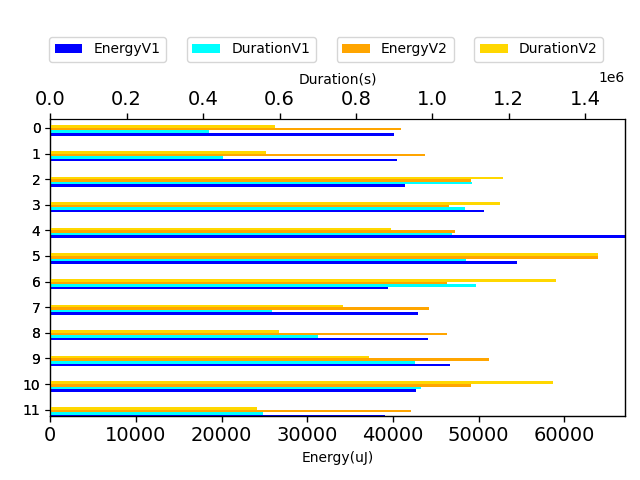

## com.google.gson.LongSerializationPolicyTest

| Test | IterationV1 | IterationV2 | DeltaIteration |
| --- | --- | --- | --- |
| com.google.gson.LongSerializationPolicyTest-testStringLongSerializationIntegration | 25 | 19 | -6 |
| com.google.gson.LongSerializationPolicyTest-testDefaultLongSerializationIntegration | 19 | 32 | 13 |

| Test | EnergyV1 | EnergyV2 | DeltaEnergy |
| --- | --- | --- | --- |
| com.google.gson.LongSerializationPolicyTest-testStringLongSerializationIntegration | 41520.5846837461 | 40412.98880767822 | -1107.5958760678768 |
| com.google.gson.LongSerializationPolicyTest-testDefaultLongSerializationIntegration | 61976.49876022339 | 41954.18672066601 | -20022.31203955738 |

| Test | DurationV1 | DurationsV2 | DeltaDuration |
| --- | --- | --- | --- |
| com.google.gson.LongSerializationPolicyTest-testStringLongSerializationIntegration | 584011.2977460921 | 518562.35609817505 | -65448.94164791703 |
| com.google.gson.LongSerializationPolicyTest-testDefaultLongSerializationIntegration | 995930.1011695862 | 775370.3168009261 | -220559.78436866007 |

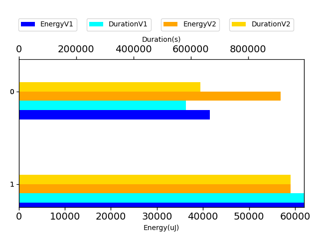

## com.google.gson.functional.PrimitiveTest

| Test | IterationV1 | IterationV2 | DeltaIteration |
| --- | --- | --- | --- |
| com.google.gson.functional.PrimitiveTest-testPrimitiveIntegerAutoboxedInASingleElementArraySerialization | 34 | 12 | -22 |
| com.google.gson.functional.PrimitiveTest-testPrimitiveIntegerAutoboxedSerialization | 13 | 14 | 1 |
| com.google.gson.functional.PrimitiveTest-testReallyLongValuesSerialization | 19 | 11 | -8 |
| com.google.gson.functional.PrimitiveTest-testHtmlCharacterSerialization | 18 | 14 | -4 |
| com.google.gson.functional.PrimitiveTest-testQuotedStringSerializationAndDeserialization | 24 | 14 | -10 |
| com.google.gson.functional.PrimitiveTest-testBigIntegerInASingleElementArraySerialization | 35 | 20 | -15 |
| com.google.gson.functional.PrimitiveTest-testBigIntegerSerialization | 54 | 31 | -23 |
| com.google.gson.functional.PrimitiveTest-testPrimitiveBooleanAutoboxedInASingleElementArraySerialization | 18 | 11 | -7 |
| com.google.gson.functional.PrimitiveTest-testLongAsStringSerialization | 28 | 14 | -14 |
| com.google.gson.functional.PrimitiveTest-testPrimitiveLongAutoboxedInASingleElementArraySerialization | 16 | 12 | -4 |
| com.google.gson.functional.PrimitiveTest-testNegativeInfinityFloatSerializationNotSupportedByDefault | 10 | 15 | 5 |
| com.google.gson.functional.PrimitiveTest-testPrimitiveLongAutoboxedSerialization | 22 | 12 | -10 |
| com.google.gson.functional.PrimitiveTest-testDoubleNaNSerializationNotSupportedByDefault | 10 | 12 | 2 |
| com.google.gson.functional.PrimitiveTest-testBigDecimalPreservePrecisionSerialization | 14 | 17 | 3 |
| com.google.gson.functional.PrimitiveTest-testNegativeInfinityFloatSerialization | 8 | 15 | 7 |
| com.google.gson.functional.PrimitiveTest-testDoubleNaNSerialization | 15 | 18 | 3 |
| com.google.gson.functional.PrimitiveTest-testDoubleInfinitySerialization | 6 | 10 | 4 |
| com.google.gson.functional.PrimitiveTest-testPrimitiveClassLiteral | 26 | 28 | 2 |
| com.google.gson.functional.PrimitiveTest-testPrimitiveBooleanAutoboxedSerialization | 14 | 12 | -2 |
| com.google.gson.functional.PrimitiveTest-testSmallValueForBigDecimalSerialization | 11 | 12 | 1 |
| com.google.gson.functional.PrimitiveTest-testBigDecimalSerialization | 42 | 33 | -9 |
| com.google.gson.functional.PrimitiveTest-testShortSerialization | 11 | 14 | 3 |
| com.google.gson.functional.PrimitiveTest-testBigDecimalInASingleElementArraySerialization | 28 | 24 | -4 |
| com.google.gson.functional.PrimitiveTest-testPrimitiveDoubleAutoboxedSerialization | 27 | 15 | -12 |
| com.google.gson.functional.PrimitiveTest-testNegativeInfinitySerialization | 16 | 8 | -8 |
| com.google.gson.functional.PrimitiveTest-testFloatInfinitySerialization | 13 | 9 | -4 |
| com.google.gson.functional.PrimitiveTest-testByteSerialization | 16 | 7 | -9 |
| com.google.gson.functional.PrimitiveTest-testFloatNaNSerializationNotSupportedByDefault | 20 | 24 | 4 |
| com.google.gson.functional.PrimitiveTest-testMoreSpecificSerialization | 22 | 27 | 5 |
| com.google.gson.functional.PrimitiveTest-testPrimitiveDoubleAutoboxedInASingleElementArraySerialization | 20 | 13 | -7 |
| com.google.gson.functional.PrimitiveTest-testFloatInfinitySerializationNotSupportedByDefault | 12 | 9 | -3 |
| com.google.gson.functional.PrimitiveTest-testFloatNaNSerialization | 15 | 13 | -2 |
| com.google.gson.functional.PrimitiveTest-testDoubleInfinitySerializationNotSupportedByDefault | 16 | 8 | -8 |
| com.google.gson.functional.PrimitiveTest-testNumberSerialization | 16 | 16 | 0 |
| com.google.gson.functional.PrimitiveTest-testSmallValueForBigIntegerSerialization | 12 | 14 | 2 |
| com.google.gson.functional.PrimitiveTest-testNegativeInfinitySerializationNotSupportedByDefault | 15 | 18 | 3 |

| Test | EnergyV1 | EnergyV2 | DeltaEnergy |
| --- | --- | --- | --- |
| com.google.gson.functional.PrimitiveTest-testPrimitiveIntegerAutoboxedInASingleElementArraySerialization | 38035.07724489865 | 40443.052734375 | 2407.9754894763464 |
| com.google.gson.functional.PrimitiveTest-testPrimitiveIntegerAutoboxedSerialization | 43812.04895019531 | 43128.27966308594 | -683.769287109375 |
| com.google.gson.functional.PrimitiveTest-testReallyLongValuesSerialization | 41878.462100982666 | 44275.1142578125 | 2396.652156829834 |
| com.google.gson.functional.PrimitiveTest-testHtmlCharacterSerialization | 40248.74422454834 | 42323.7490234375 | 2075.00479888916 |
| com.google.gson.functional.PrimitiveTest-testQuotedStringSerializationAndDeserialization | 41472.31243157387 | 43314.630126953125 | 1842.3176953792572 |
| com.google.gson.functional.PrimitiveTest-testBigIntegerInASingleElementArraySerialization | 43427.31513371033 | 41434.53268432617 | -1992.7824493841617 |
| com.google.gson.functional.PrimitiveTest-testBigIntegerSerialization | 42967.038972437644 | 41914.77556690015 | -1052.2634055374947 |
| com.google.gson.functional.PrimitiveTest-testPrimitiveBooleanAutoboxedInASingleElementArraySerialization | 43824.16899871826 | 43598.14453125 | -226.02446746826172 |
| com.google.gson.functional.PrimitiveTest-testLongAsStringSerialization | 43771.49212063104 | 42797.522705078125 | -973.9694155529141 |
| com.google.gson.functional.PrimitiveTest-testPrimitiveLongAutoboxedInASingleElementArraySerialization | 43206.341400146484 | 43158.89013671875 | -47.451263427734375 |
| com.google.gson.functional.PrimitiveTest-testNegativeInfinityFloatSerializationNotSupportedByDefault | 42227.056640625 | 41159.793395996094 | -1067.2632446289062 |
| com.google.gson.functional.PrimitiveTest-testPrimitiveLongAutoboxedSerialization | 45668.3801279068 | 42754.52978515625 | -2913.8503427505493 |
| com.google.gson.functional.PrimitiveTest-testDoubleNaNSerializationNotSupportedByDefault | 41605.47265625 | 40164.09521484375 | -1441.37744140625 |
| com.google.gson.functional.PrimitiveTest-testBigDecimalPreservePrecisionSerialization | 43012.61511230469 | 41695.01951599121 | -1317.5955963134766 |
| com.google.gson.functional.PrimitiveTest-testNegativeInfinityFloatSerialization | 43131.890625 | 41939.74572753906 | -1192.1448974609375 |
| com.google.gson.functional.PrimitiveTest-testDoubleNaNSerialization | 43467.098693847656 | 42440.35939788818 | -1026.7392959594727 |
| com.google.gson.functional.PrimitiveTest-testDoubleInfinitySerialization | 42112.40625 | 43439.158203125 | 1326.751953125 |
| com.google.gson.functional.PrimitiveTest-testPrimitiveClassLiteral | 45106.83432531357 | 40932.246235616505 | -4174.588089697063 |
| com.google.gson.functional.PrimitiveTest-testPrimitiveBooleanAutoboxedSerialization | 44279.44677734375 | 44787.841796875 | 508.39501953125 |
| com.google.gson.functional.PrimitiveTest-testSmallValueForBigDecimalSerialization | 43361.93359375 | 39641.57470703125 | -3720.35888671875 |
| com.google.gson.functional.PrimitiveTest-testBigDecimalSerialization | 71260.66313683246 | 65366.99688662356 | -5893.666250208902 |
| com.google.gson.functional.PrimitiveTest-testShortSerialization | 43254.2431640625 | 45694.0146484375 | 2439.771484375 |
| com.google.gson.functional.PrimitiveTest-testBigDecimalInASingleElementArraySerialization | 41654.97000870854 | 40694.50387620926 | -960.4661324992776 |
| com.google.gson.functional.PrimitiveTest-testPrimitiveDoubleAutoboxedSerialization | 92791.30385252833 | 45489.8125 | -47301.491352528334 |
| com.google.gson.functional.PrimitiveTest-testNegativeInfinitySerialization | 42662.762298583984 | 41701.421875 | -961.3404235839844 |
| com.google.gson.functional.PrimitiveTest-testFloatInfinitySerialization | 42102.2841796875 | 44375.2890625 | 2273.0048828125 |
| com.google.gson.functional.PrimitiveTest-testByteSerialization | 44751.27313232422 | 43237.53125 | -1513.7418823242188 |
| com.google.gson.functional.PrimitiveTest-testFloatNaNSerializationNotSupportedByDefault | 42540.3821182251 | 40997.876742720604 | -1542.5053755044937 |
| com.google.gson.functional.PrimitiveTest-testMoreSpecificSerialization | 60803.28543996811 | 43827.5292583406 | -16975.756181627512 |
| com.google.gson.functional.PrimitiveTest-testPrimitiveDoubleAutoboxedInASingleElementArraySerialization | 41668.96404838562 | 40731.99462890625 | -936.9694194793701 |
| com.google.gson.functional.PrimitiveTest-testFloatInfinitySerializationNotSupportedByDefault | 43951.62060546875 | 38340.109375 | -5611.51123046875 |
| com.google.gson.functional.PrimitiveTest-testFloatNaNSerialization | 41721.61901855469 | 40767.88671875 | -953.7322998046875 |
| com.google.gson.functional.PrimitiveTest-testDoubleInfinitySerializationNotSupportedByDefault | 41949.898010253906 | 42110.9140625 | 161.01605224609375 |
| com.google.gson.functional.PrimitiveTest-testNumberSerialization | 42977.945861816406 | 40076.336975097656 | -2901.60888671875 |
| com.google.gson.functional.PrimitiveTest-testSmallValueForBigIntegerSerialization | 44617.142578125 | 41704.12976074219 | -2913.0128173828125 |
| com.google.gson.functional.PrimitiveTest-testNegativeInfinitySerializationNotSupportedByDefault | 46408.68713378906 | 41431.7293510437 | -4976.957782745361 |

| Test | DurationV1 | DurationsV2 | DeltaDuration |
| --- | --- | --- | --- |
| com.google.gson.functional.PrimitiveTest-testPrimitiveIntegerAutoboxedInASingleElementArraySerialization | 839453.4535969762 | 429623.61572265625 | -409829.83787432 |
| com.google.gson.functional.PrimitiveTest-testPrimitiveIntegerAutoboxedSerialization | 422788.0733642578 | 401327.18359375 | -21460.889770507812 |
| com.google.gson.functional.PrimitiveTest-testReallyLongValuesSerialization | 499512.9855556488 | 336727.5986328125 | -162785.3869228363 |
| com.google.gson.functional.PrimitiveTest-testHtmlCharacterSerialization | 338424.728553772 | 315804.18127441406 | -22620.54727935791 |
| com.google.gson.functional.PrimitiveTest-testQuotedStringSerializationAndDeserialization | 437230.2861927748 | 356690.1608886719 | -80540.1253041029 |
| com.google.gson.functional.PrimitiveTest-testBigIntegerInASingleElementArraySerialization | 539892.106726763 | 462103.02739715576 | -77789.0793296072 |
| com.google.gson.functional.PrimitiveTest-testBigIntegerSerialization | 779731.5774337446 | 677017.1481228229 | -102714.4293109217 |
| com.google.gson.functional.PrimitiveTest-testPrimitiveBooleanAutoboxedInASingleElementArraySerialization | 606556.520904541 | 370630.552734375 | -235925.96817016602 |
| com.google.gson.functional.PrimitiveTest-testLongAsStringSerialization | 369401.2154105529 | 409456.19470214844 | 40054.97929159552 |
| com.google.gson.functional.PrimitiveTest-testPrimitiveLongAutoboxedInASingleElementArraySerialization | 330636.42544555664 | 429574.248046875 | 98937.82260131836 |
| com.google.gson.functional.PrimitiveTest-testNegativeInfinityFloatSerializationNotSupportedByDefault | 332110.015625 | 343522.07305908203 | 11412.057434082031 |
| com.google.gson.functional.PrimitiveTest-testPrimitiveLongAutoboxedSerialization | 367949.409201622 | 334605.1240234375 | -33344.28517818451 |
| com.google.gson.functional.PrimitiveTest-testDoubleNaNSerializationNotSupportedByDefault | 467808.55078125 | 378813.92041015625 | -88994.63037109375 |
| com.google.gson.functional.PrimitiveTest-testBigDecimalPreservePrecisionSerialization | 320729.69470214844 | 315723.5780029297 | -5006.11669921875 |
| com.google.gson.functional.PrimitiveTest-testNegativeInfinityFloatSerialization | 343314.1015625 | 317382.15856933594 | -25931.942993164062 |
| com.google.gson.functional.PrimitiveTest-testDoubleNaNSerialization | 329205.8239746094 | 339050.8519821167 | 9845.028007507324 |
| com.google.gson.functional.PrimitiveTest-testDoubleInfinitySerialization | 326084.625 | 301332.6640625 | -24751.9609375 |
| com.google.gson.functional.PrimitiveTest-testPrimitiveClassLiteral | 807469.2605172992 | 550635.3596515507 | -256833.90086574852 |
| com.google.gson.functional.PrimitiveTest-testPrimitiveBooleanAutoboxedSerialization | 334300.5607910156 | 316077.0634765625 | -18223.497314453125 |
| com.google.gson.functional.PrimitiveTest-testSmallValueForBigDecimalSerialization | 340780.1240234375 | 360303.783203125 | 19523.6591796875 |
| com.google.gson.functional.PrimitiveTest-testBigDecimalSerialization | 1659275.2499153789 | 1570193.0312691878 | -89082.21864619106 |
| com.google.gson.functional.PrimitiveTest-testShortSerialization | 417622.1337890625 | 329275.5178222656 | -88346.61596679688 |
| com.google.gson.functional.PrimitiveTest-testBigDecimalInASingleElementArraySerialization | 585197.1217637956 | 408493.9477006197 | -176703.17406317592 |
| com.google.gson.functional.PrimitiveTest-testPrimitiveDoubleAutoboxedSerialization | 2121606.3125591576 | 491363.52239990234 | -1630242.7901592553 |
| com.google.gson.functional.PrimitiveTest-testNegativeInfinitySerialization | 315546.0940551758 | 391500.140625 | 75954.04656982422 |
| com.google.gson.functional.PrimitiveTest-testFloatInfinitySerialization | 359629.1911621094 | 363454.578125 | 3825.386962890625 |
| com.google.gson.functional.PrimitiveTest-testByteSerialization | 383448.536529541 | 337217.515625 | -46231.020904541016 |
| com.google.gson.functional.PrimitiveTest-testFloatNaNSerializationNotSupportedByDefault | 343127.49268722534 | 361930.1754838228 | 18802.68279659748 |
| com.google.gson.functional.PrimitiveTest-testMoreSpecificSerialization | 1202981.3482336998 | 435348.9319740236 | -767632.4162596762 |
| com.google.gson.functional.PrimitiveTest-testPrimitiveDoubleAutoboxedInASingleElementArraySerialization | 483996.99546813965 | 395845.06677246094 | -88151.92869567871 |
| com.google.gson.functional.PrimitiveTest-testFloatInfinitySerializationNotSupportedByDefault | 372475.89501953125 | 341332.921875 | -31142.97314453125 |
| com.google.gson.functional.PrimitiveTest-testFloatNaNSerialization | 327979.8400878906 | 356404.9377441406 | 28425.09765625 |
| com.google.gson.functional.PrimitiveTest-testDoubleInfinitySerializationNotSupportedByDefault | 338250.98428344727 | 355761.6875 | 17510.703216552734 |
| com.google.gson.functional.PrimitiveTest-testNumberSerialization | 562610.1343383789 | 376461.0104675293 | -186149.1238708496 |
| com.google.gson.functional.PrimitiveTest-testSmallValueForBigIntegerSerialization | 365542.87548828125 | 296159.279296875 | -69383.59619140625 |
| com.google.gson.functional.PrimitiveTest-testNegativeInfinitySerializationNotSupportedByDefault | 399238.7698364258 | 341896.371635437 | -57342.39820098877 |

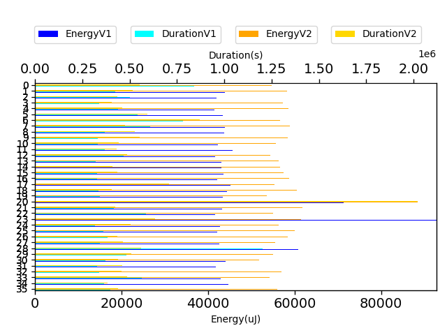

## com.google.gson.functional.ThrowableFunctionalTest

| Test | IterationV1 | IterationV2 | DeltaIteration |
| --- | --- | --- | --- |
| com.google.gson.functional.ThrowableFunctionalTest-testErrornWithCause | 69 | 74 | 5 |
| com.google.gson.functional.ThrowableFunctionalTest-testSerializedNameOnExceptionFields | 90 | 93 | 3 |
| com.google.gson.functional.ThrowableFunctionalTest-testErrorWithoutCause | 65 | 68 | 3 |
| com.google.gson.functional.ThrowableFunctionalTest-testExceptionWithCause | 76 | 82 | 6 |
| com.google.gson.functional.ThrowableFunctionalTest-testExceptionWithoutCause | 87 | 80 | -7 |

| Test | EnergyV1 | EnergyV2 | DeltaEnergy |
| --- | --- | --- | --- |
| com.google.gson.functional.ThrowableFunctionalTest-testErrornWithCause | 54805.25827404843 | 42762.386426688885 | -12042.871847359544 |
| com.google.gson.functional.ThrowableFunctionalTest-testSerializedNameOnExceptionFields | 54350.7776324692 | 108049.34363032214 | 53698.56599785294 |
| com.google.gson.functional.ThrowableFunctionalTest-testErrorWithoutCause | 42228.081195019164 | 45366.24705632278 | 3138.1658613036197 |
| com.google.gson.functional.ThrowableFunctionalTest-testExceptionWithCause | 55244.2733717119 | 66427.77504585017 | 11183.501674138271 |
| com.google.gson.functional.ThrowableFunctionalTest-testExceptionWithoutCause | 45017.20206339665 | 67162.79008460027 | 22145.58802120362 |

| Test | DurationV1 | DurationsV2 | DeltaDuration |
| --- | --- | --- | --- |
| com.google.gson.functional.ThrowableFunctionalTest-testErrornWithCause | 878702.5497063539 | 1054682.9193644456 | 175980.3696580917 |
| com.google.gson.functional.ThrowableFunctionalTest-testSerializedNameOnExceptionFields | 1417736.9585891662 | 2113252.046672114 | 695515.088082948 |
| com.google.gson.functional.ThrowableFunctionalTest-testErrorWithoutCause | 1057170.7708913987 | 1242753.3361146818 | 185582.56522328313 |
| com.google.gson.functional.ThrowableFunctionalTest-testExceptionWithCause | 901043.5144199776 | 1462983.0287110503 | 561939.5142910727 |
| com.google.gson.functional.ThrowableFunctionalTest-testExceptionWithoutCause | 1478574.7487058558 | 1798752.986954956 | 320178.2382491003 |

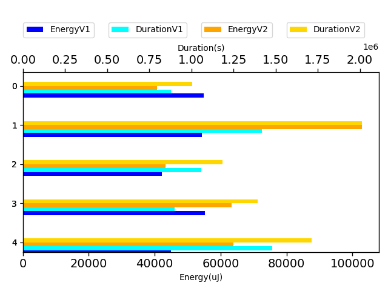

## com.google.gson.functional.ConcurrencyTest

| Test | IterationV1 | IterationV2 | DeltaIteration |
| --- | --- | --- | --- |
| com.google.gson.functional.ConcurrencyTest-testSingleThreadSerialization | 58 | 53 | -5 |
| com.google.gson.functional.ConcurrencyTest-testMultiThreadSerialization | 99 | 99 | 0 |

| Test | EnergyV1 | EnergyV2 | DeltaEnergy |
| --- | --- | --- | --- |
| com.google.gson.functional.ConcurrencyTest-testSingleThreadSerialization | 44210.21022183138 | 46155.22512574012 | 1945.014903908741 |
| com.google.gson.functional.ConcurrencyTest-testMultiThreadSerialization | 319209.76347481296 | 370704.8873438159 | 51495.12386900291 |

| Test | DurationV1 | DurationsV2 | DeltaDuration |
| --- | --- | --- | --- |
| com.google.gson.functional.ConcurrencyTest-testSingleThreadSerialization | 747143.715372544 | 1048096.1546376429 | 300952.4392650989 |
| com.google.gson.functional.ConcurrencyTest-testMultiThreadSerialization | 7792021.503800785 | 8917066.473096939 | 1125044.9692961536 |

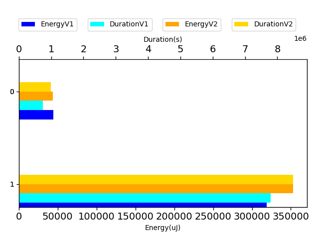

## com.google.gson.functional.FieldNamingTest

| Test | IterationV1 | IterationV2 | DeltaIteration |
| --- | --- | --- | --- |
| com.google.gson.functional.FieldNamingTest-testIdentity | 90 | 89 | -1 |
| com.google.gson.functional.FieldNamingTest-testLowerCaseWithUnderscores | 51 | 35 | -16 |
| com.google.gson.functional.FieldNamingTest-testLowerCaseWithDashes | 42 | 41 | -1 |
| com.google.gson.functional.FieldNamingTest-testUpperCamelCase | 42 | 43 | 1 |
| com.google.gson.functional.FieldNamingTest-testUpperCamelCaseWithSpaces | 39 | 42 | 3 |

| Test | EnergyV1 | EnergyV2 | DeltaEnergy |
| --- | --- | --- | --- |
| com.google.gson.functional.FieldNamingTest-testIdentity | 60783.807113792034 | 43300.93019560297 | -17482.876918189068 |
| com.google.gson.functional.FieldNamingTest-testLowerCaseWithUnderscores | 46371.86322350158 | 42335.72263754631 | -4036.140585955276 |
| com.google.gson.functional.FieldNamingTest-testLowerCaseWithDashes | 41785.73458875045 | 46132.442331870036 | 4346.707743119587 |
| com.google.gson.functional.FieldNamingTest-testUpperCamelCase | 63053.19579313472 | 44850.03989737228 | -18203.155895762444 |
| com.google.gson.functional.FieldNamingTest-testUpperCamelCaseWithSpaces | 39330.57417795577 | 43939.79716381395 | 4609.222985858178 |

| Test | DurationV1 | DurationsV2 | DeltaDuration |
| --- | --- | --- | --- |
| com.google.gson.functional.FieldNamingTest-testIdentity | 2043989.4961573456 | 959211.3991517954 | -1084778.0970055503 |
| com.google.gson.functional.FieldNamingTest-testLowerCaseWithUnderscores | 1298489.049117699 | 566320.0452025031 | -732169.0039151959 |
| com.google.gson.functional.FieldNamingTest-testLowerCaseWithDashes | 1068351.6873209188 | 703187.2075510833 | -365164.4797698355 |
| com.google.gson.functional.FieldNamingTest-testUpperCamelCase | 1202012.9755091046 | 664217.173066027 | -537795.8024430776 |
| com.google.gson.functional.FieldNamingTest-testUpperCamelCaseWithSpaces | 1242203.7817844446 | 795419.0049158607 | -446784.77686858387 |

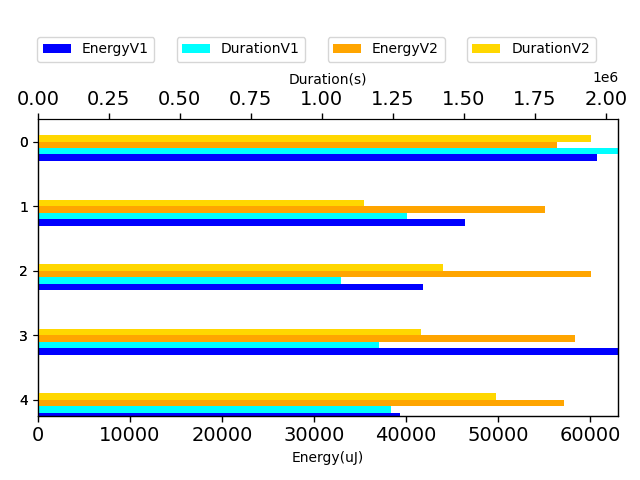

## com.google.gson.functional.RawSerializationTest

| Test | IterationV1 | IterationV2 | DeltaIteration |
| --- | --- | --- | --- |
| com.google.gson.functional.RawSerializationTest-testThreeLevelParameterizedObject | 73 | 75 | 2 |
| com.google.gson.functional.RawSerializationTest-testParameterizedObject | 86 | 84 | -2 |
| com.google.gson.functional.RawSerializationTest-testCollectionOfObjects | 56 | 62 | 6 |
| com.google.gson.functional.RawSerializationTest-testTwoLevelParameterizedObject | 73 | 71 | -2 |
| com.google.gson.functional.RawSerializationTest-testCollectionOfPrimitives | 28 | 29 | 1 |

| Test | EnergyV1 | EnergyV2 | DeltaEnergy |
| --- | --- | --- | --- |
| com.google.gson.functional.RawSerializationTest-testThreeLevelParameterizedObject | 43601.67631651589 | 43943.078267427336 | 341.40195091144415 |
| com.google.gson.functional.RawSerializationTest-testParameterizedObject | 68910.96861684031 | 40422.990314664756 | -28487.978302175557 |
| com.google.gson.functional.RawSerializationTest-testCollectionOfObjects | 49101.582256930116 | 45894.535046948826 | -3207.0472099812905 |
| com.google.gson.functional.RawSerializationTest-testTwoLevelParameterizedObject | 44965.986224250286 | 47970.93311509175 | 3004.9468908414638 |
| com.google.gson.functional.RawSerializationTest-testCollectionOfPrimitives | 69690.84217793867 | 56959.59232082777 | -12731.249857110903 |

| Test | DurationV1 | DurationsV2 | DeltaDuration |
| --- | --- | --- | --- |
| com.google.gson.functional.RawSerializationTest-testThreeLevelParameterizedObject | 1221226.6116699425 | 929940.1666250129 | -291286.4450449296 |
| com.google.gson.functional.RawSerializationTest-testParameterizedObject | 1484351.3873888508 | 1088519.2791854856 | -395832.10820336523 |
| com.google.gson.functional.RawSerializationTest-testCollectionOfObjects | 818387.8948155626 | 845201.5753588432 | 26813.680543280556 |
| com.google.gson.functional.RawSerializationTest-testTwoLevelParameterizedObject | 913350.1153368569 | 1161451.1573255272 | 248101.04198867024 |
| com.google.gson.functional.RawSerializationTest-testCollectionOfPrimitives | 1411968.7762980685 | 1072219.4921546485 | -339749.28414341994 |

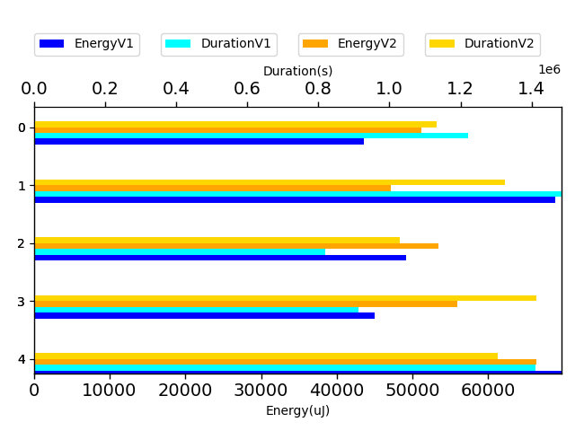

## com.google.gson.functional.JsonParserTest

| Test | IterationV1 | IterationV2 | DeltaIteration |
| --- | --- | --- | --- |
| com.google.gson.functional.JsonParserTest-testChangingCustomTreeAndDeserializing | 41 | 39 | -2 |
| com.google.gson.functional.JsonParserTest-testBadTypeForDeserializingCustomTree | 36 | 40 | 4 |
| com.google.gson.functional.JsonParserTest-testBadFieldTypeForCustomDeserializerCustomTree | 40 | 24 | -16 |
| com.google.gson.functional.JsonParserTest-testBadFieldTypeForDeserializingCustomTree | 40 | 39 | -1 |
| com.google.gson.functional.JsonParserTest-testDeserializingCustomTree | 36 | 34 | -2 |

| Test | EnergyV1 | EnergyV2 | DeltaEnergy |
| --- | --- | --- | --- |
| com.google.gson.functional.JsonParserTest-testChangingCustomTreeAndDeserializing | 45437.49631729648 | 42525.79928130849 | -2911.697035987985 |
| com.google.gson.functional.JsonParserTest-testBadTypeForDeserializingCustomTree | 47735.04596885224 | 44128.19706427572 | -3606.8489045765164 |
| com.google.gson.functional.JsonParserTest-testBadFieldTypeForCustomDeserializerCustomTree | 43509.86665632751 | 41711.54016292095 | -1798.3264934065592 |
| com.google.gson.functional.JsonParserTest-testBadFieldTypeForDeserializingCustomTree | 55833.67477996333 | 46290.25568633384 | -9543.41909362949 |
| com.google.gson.functional.JsonParserTest-testDeserializingCustomTree | 69538.38167095618 | 42405.33959943638 | -27133.042071519798 |

| Test | DurationV1 | DurationsV2 | DeltaDuration |
| --- | --- | --- | --- |
| com.google.gson.functional.JsonParserTest-testChangingCustomTreeAndDeserializing | 1191756.5707156213 | 830770.9618494038 | -360985.60886621755 |
| com.google.gson.functional.JsonParserTest-testBadTypeForDeserializingCustomTree | 874209.6284679325 | 664825.1264147917 | -209384.50205314078 |
| com.google.gson.functional.JsonParserTest-testBadFieldTypeForCustomDeserializerCustomTree | 660408.6436936965 | 486579.4330149889 | -173829.21067870758 |
| com.google.gson.functional.JsonParserTest-testBadFieldTypeForDeserializingCustomTree | 1010361.2516031832 | 812147.351262704 | -198213.90034047922 |
| com.google.gson.functional.JsonParserTest-testDeserializingCustomTree | 1540740.5243383746 | 641633.6391952899 | -899106.8851430847 |

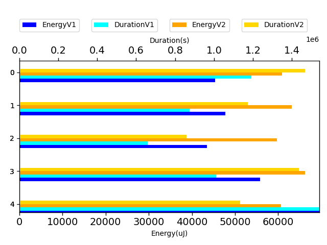

## com.google.gson.ObjectTypeAdapterTest

| Test | IterationV1 | IterationV2 | DeltaIteration |
| --- | --- | --- | --- |
| com.google.gson.ObjectTypeAdapterTest-testSerializeObject | 8 | 11 | 3 |
| com.google.gson.ObjectTypeAdapterTest-testSerialize | 78 | 77 | -1 |
| com.google.gson.ObjectTypeAdapterTest-testSerializeNullValue | 19 | 39 | 20 |

| Test | EnergyV1 | EnergyV2 | DeltaEnergy |
| --- | --- | --- | --- |
| com.google.gson.ObjectTypeAdapterTest-testSerializeObject | 94752.28125 | 42822.2998046875 | -51929.9814453125 |
| com.google.gson.ObjectTypeAdapterTest-testSerialize | 55085.88227097077 | 44297.48756202748 | -10788.394708943284 |
| com.google.gson.ObjectTypeAdapterTest-testSerializeNullValue | 45618.490242004395 | 44732.181789089846 | -886.308452914549 |

| Test | DurationV1 | DurationsV2 | DeltaDuration |
| --- | --- | --- | --- |
| com.google.gson.ObjectTypeAdapterTest-testSerializeObject | 1631964.5234375 | 366111.974609375 | -1265852.548828125 |
| com.google.gson.ObjectTypeAdapterTest-testSerialize | 1079643.273304665 | 1338093.9652864784 | 258450.6919818134 |
| com.google.gson.ObjectTypeAdapterTest-testSerializeNullValue | 347745.67446136475 | 444546.4655241502 | 96800.79106278543 |

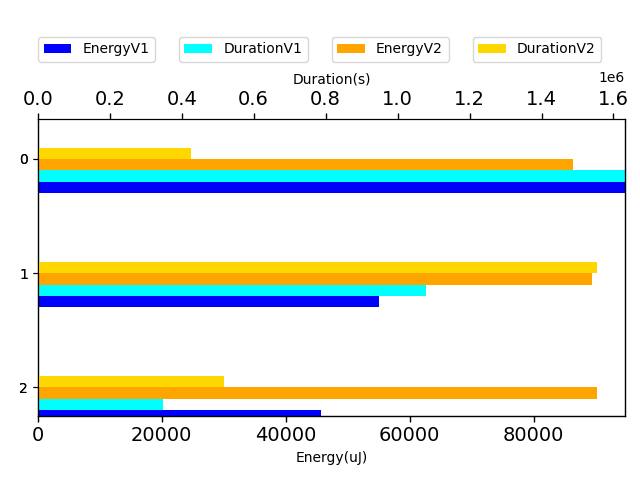

## com.google.gson.functional.SecurityTest

| Test | IterationV1 | IterationV2 | DeltaIteration |
| --- | --- | --- | --- |
| com.google.gson.functional.SecurityTest-testNonExecutableJsonSerialization | 44 | 35 | -9 |
| com.google.gson.functional.SecurityTest-testJsonWithNonExectuableTokenSerialization | 15 | 14 | -1 |

| Test | EnergyV1 | EnergyV2 | DeltaEnergy |
| --- | --- | --- | --- |
| com.google.gson.functional.SecurityTest-testNonExecutableJsonSerialization | 658069.543997113 | 46794.3391007281 | -611275.2048963849 |
| com.google.gson.functional.SecurityTest-testJsonWithNonExectuableTokenSerialization | 45116.901611328125 | 40981.24060058594 | -4135.6610107421875 |

| Test | DurationV1 | DurationsV2 | DeltaDuration |
| --- | --- | --- | --- |
| com.google.gson.functional.SecurityTest-testNonExecutableJsonSerialization | 17417175.454114567 | 1219254.5021165 | -16197920.951998068 |
| com.google.gson.functional.SecurityTest-testJsonWithNonExectuableTokenSerialization | 448215.9974975586 | 507250.4401855469 | 59034.44268798828 |

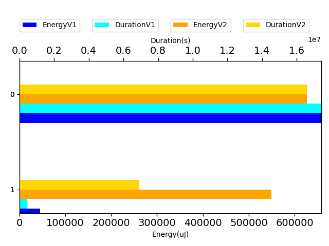

## com.google.gson.functional.NullObjectAndFieldTest

| Test | IterationV1 | IterationV2 | DeltaIteration |
| --- | --- | --- | --- |
| com.google.gson.functional.NullObjectAndFieldTest-testPrintPrintingObjectWithNulls | 54 | 43 | -11 |
| com.google.gson.functional.NullObjectAndFieldTest-testNullWrappedPrimitiveMemberSerialization | 47 | 33 | -14 |
| com.google.gson.functional.NullObjectAndFieldTest-testExplicitSerializationOfNulls | 31 | 32 | 1 |
| com.google.gson.functional.NullObjectAndFieldTest-testCustomSerializationOfNulls | 47 | 53 | 6 |
| com.google.gson.functional.NullObjectAndFieldTest-testExplicitSerializationOfNullArrayMembers | 77 | 76 | -1 |
| com.google.gson.functional.NullObjectAndFieldTest-testExplicitSerializationOfNullCollectionMembers | 34 | 32 | -2 |
| com.google.gson.functional.NullObjectAndFieldTest-testCustomTypeAdapterPassesNullSerialization | 33 | 41 | 8 |
| com.google.gson.functional.NullObjectAndFieldTest-testTopLevelNullObjectSerialization | 21 | 17 | -4 |
| com.google.gson.functional.NullObjectAndFieldTest-testExplicitSerializationOfNullStringMembers | 26 | 26 | 0 |
| com.google.gson.functional.NullObjectAndFieldTest-testPrintPrintingArraysWithNulls | 18 | 24 | 6 |

| Test | EnergyV1 | EnergyV2 | DeltaEnergy |
| --- | --- | --- | --- |
| com.google.gson.functional.NullObjectAndFieldTest-testPrintPrintingObjectWithNulls | 40722.40927388909 | 42177.37377168408 | 1454.9644977949865 |
| com.google.gson.functional.NullObjectAndFieldTest-testNullWrappedPrimitiveMemberSerialization | 48623.89309929087 | 42609.36229777767 | -6014.530801513203 |
| com.google.gson.functional.NullObjectAndFieldTest-testExplicitSerializationOfNulls | 44438.08160548238 | 43330.40433079377 | -1107.6772746886127 |
| com.google.gson.functional.NullObjectAndFieldTest-testCustomSerializationOfNulls | 41889.46062414229 | 42686.95816591846 | 797.4975417761743 |
| com.google.gson.functional.NullObjectAndFieldTest-testExplicitSerializationOfNullArrayMembers | 43290.758253494 | 43677.31647406099 | 386.55822056698526 |
| com.google.gson.functional.NullObjectAndFieldTest-testExplicitSerializationOfNullCollectionMembers | 40445.50977423717 | 45536.571552174166 | 5091.061777936993 |
| com.google.gson.functional.NullObjectAndFieldTest-testCustomTypeAdapterPassesNullSerialization | 41989.51658588811 | 41523.87901419222 | -465.63757169588644 |
| com.google.gson.functional.NullObjectAndFieldTest-testTopLevelNullObjectSerialization | 44878.25087738037 | 46013.96949005127 | 1135.7186126708984 |
| com.google.gson.functional.NullObjectAndFieldTest-testExplicitSerializationOfNullStringMembers | 40683.94685676694 | 42382.64313055575 | 1698.6962737888098 |
| com.google.gson.functional.NullObjectAndFieldTest-testPrintPrintingArraysWithNulls | 41726.25736236572 | 44922.95594501495 | 3196.698582649231 |

| Test | DurationV1 | DurationsV2 | DeltaDuration |
| --- | --- | --- | --- |
| com.google.gson.functional.NullObjectAndFieldTest-testPrintPrintingObjectWithNulls | 729369.364592025 | 672402.6275059347 | -56966.737086090376 |
| com.google.gson.functional.NullObjectAndFieldTest-testNullWrappedPrimitiveMemberSerialization | 771825.5063203257 | 581431.3442829321 | -190394.16203739354 |
| com.google.gson.functional.NullObjectAndFieldTest-testExplicitSerializationOfNulls | 768840.1980765574 | 529839.4296242273 | -239000.76845233003 |
| com.google.gson.functional.NullObjectAndFieldTest-testCustomSerializationOfNulls | 614439.6688156646 | 735379.6616565704 | 120939.99284090579 |
| com.google.gson.functional.NullObjectAndFieldTest-testExplicitSerializationOfNullArrayMembers | 923238.9034224066 | 922693.4001525779 | -545.5032698287396 |
| com.google.gson.functional.NullObjectAndFieldTest-testExplicitSerializationOfNullCollectionMembers | 631911.4495612378 | 518504.83345467923 | -113406.61610655859 |
| com.google.gson.functional.NullObjectAndFieldTest-testCustomTypeAdapterPassesNullSerialization | 589179.9858694775 | 597777.7042623097 | 8597.718392832205 |
| com.google.gson.functional.NullObjectAndFieldTest-testTopLevelNullObjectSerialization | 503005.70202064514 | 466651.0409927368 | -36354.661027908325 |
| com.google.gson.functional.NullObjectAndFieldTest-testExplicitSerializationOfNullStringMembers | 586149.2864297032 | 474366.0130703002 | -111783.27335940301 |
| com.google.gson.functional.NullObjectAndFieldTest-testPrintPrintingArraysWithNulls | 584110.2651824951 | 383464.273863554 | -200645.99131894112 |

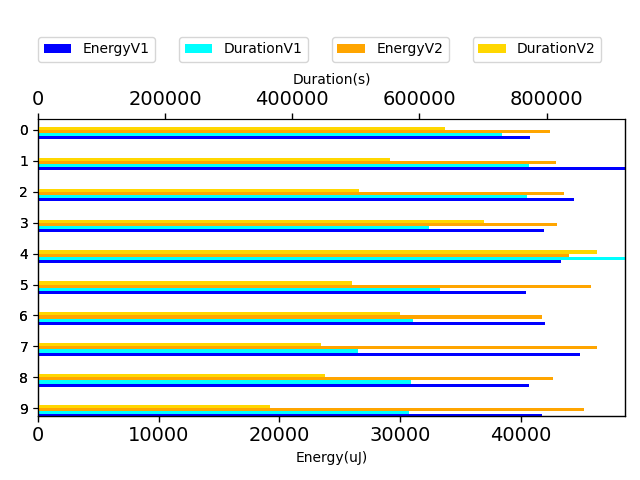

## com.google.gson.MixedStreamTest

| Test | IterationV1 | IterationV2 | DeltaIteration |
| --- | --- | --- | --- |
| com.google.gson.MixedStreamTest-testWriteInvalidState | 13 | 27 | 14 |
| com.google.gson.MixedStreamTest-testWriteDoesNotMutateState | 21 | 21 | 0 |
| com.google.gson.MixedStreamTest-testWriteHtmlSafe | 51 | 60 | 9 |
| com.google.gson.MixedStreamTest-testWriteLenient | 58 | 71 | 13 |
| com.google.gson.MixedStreamTest-testWriteMixedStreamed | 37 | 48 | 11 |
| com.google.gson.MixedStreamTest-testWriteClosed | 40 | 20 | -20 |
| com.google.gson.MixedStreamTest-testWriteNulls | 17 | 12 | -5 |

| Test | EnergyV1 | EnergyV2 | DeltaEnergy |
| --- | --- | --- | --- |
| com.google.gson.MixedStreamTest-testWriteInvalidState | 43038.55261230469 | 47736.182982996106 | 4697.630370691419 |
| com.google.gson.MixedStreamTest-testWriteDoesNotMutateState | 42674.64775276184 | 42360.489614486694 | -314.1581382751465 |
| com.google.gson.MixedStreamTest-testWriteHtmlSafe | 40086.75643337958 | 45773.41410792076 | 5686.65767454118 |
| com.google.gson.MixedStreamTest-testWriteLenient | 46537.48752749254 | 71979.18087713273 | 25441.69334964019 |
| com.google.gson.MixedStreamTest-testWriteMixedStreamed | 41016.992098589086 | 44028.06882409491 | 3011.0767255058236 |
| com.google.gson.MixedStreamTest-testWriteClosed | 41464.788287490825 | 41250.75668144226 | -214.03160604856384 |
| com.google.gson.MixedStreamTest-testWriteNulls | 42765.10600280762 | 42262.79296875 | -502.3130340576172 |

| Test | DurationV1 | DurationsV2 | DeltaDuration |
| --- | --- | --- | --- |
| com.google.gson.MixedStreamTest-testWriteInvalidState | 382961.02185058594 | 871113.3069192469 | 488152.285068661 |
| com.google.gson.MixedStreamTest-testWriteDoesNotMutateState | 603908.4261817932 | 585492.6369953156 | -18415.78918647766 |
| com.google.gson.MixedStreamTest-testWriteHtmlSafe | 788166.0660184966 | 871575.9414333557 | 83409.87541485904 |
| com.google.gson.MixedStreamTest-testWriteLenient | 806677.4894105308 | 1372774.3036208202 | 566096.8142102894 |
| com.google.gson.MixedStreamTest-testWriteMixedStreamed | 785169.3332184564 | 592380.0270821252 | -192789.30613633117 |
| com.google.gson.MixedStreamTest-testWriteClosed | 387112.1622062064 | 468813.1289367676 | 81700.96673056117 |
| com.google.gson.MixedStreamTest-testWriteNulls | 378728.6580657959 | 332380.31689453125 | -46348.34117126465 |

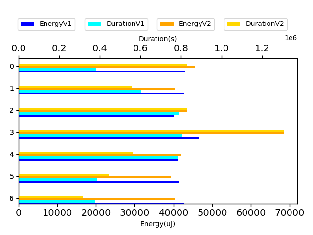

## com.google.gson.functional.TypeVariableTest

| Test | IterationV1 | IterationV2 | DeltaIteration |
| --- | --- | --- | --- |
| com.google.gson.functional.TypeVariableTest-testTypeVariablesViaTypeParameter | 94 | 96 | 2 |
| com.google.gson.functional.TypeVariableTest-testBasicTypeVariables | 57 | 53 | -4 |
| com.google.gson.functional.TypeVariableTest-testAdvancedTypeVariables | 74 | 74 | 0 |

| Test | EnergyV1 | EnergyV2 | DeltaEnergy |
| --- | --- | --- | --- |
| com.google.gson.functional.TypeVariableTest-testTypeVariablesViaTypeParameter | 82027.17847951796 | 84885.48515092011 | 2858.306671402155 |
| com.google.gson.functional.TypeVariableTest-testBasicTypeVariables | 44060.810243853746 | 41679.506119927326 | -2381.3041239264203 |
| com.google.gson.functional.TypeVariableTest-testAdvancedTypeVariables | 39809.18021574397 | 43767.31202746574 | 3958.1318117217743 |

| Test | DurationV1 | DurationsV2 | DeltaDuration |
| --- | --- | --- | --- |
| com.google.gson.functional.TypeVariableTest-testTypeVariablesViaTypeParameter | 2198449.4724773117 | 1689063.275894431 | -509386.1965828808 |
| com.google.gson.functional.TypeVariableTest-testBasicTypeVariables | 844489.532266261 | 746170.5644985624 | -98318.96776769869 |
| com.google.gson.functional.TypeVariableTest-testAdvancedTypeVariables | 1008182.9140272446 | 798460.2777877128 | -209722.6362395318 |

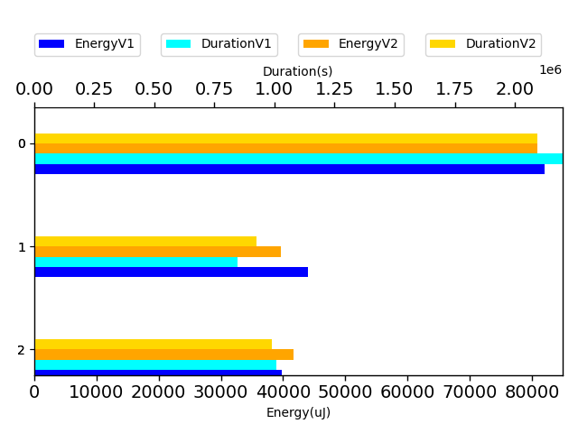

## com.google.gson.DefaultInetAddressTypeAdapterTest

| Test | IterationV1 | IterationV2 | DeltaIteration |
| --- | --- | --- | --- |
| com.google.gson.DefaultInetAddressTypeAdapterTest-testInetAddressSerializationAndDeserialization | 99 | 99 | 0 |

| Test | EnergyV1 | EnergyV2 | DeltaEnergy |
| --- | --- | --- | --- |
| com.google.gson.DefaultInetAddressTypeAdapterTest-testInetAddressSerializationAndDeserialization | 82895.53217618824 | 72670.40176077104 | -10225.130415417196 |

| Test | DurationV1 | DurationsV2 | DeltaDuration |
| --- | --- | --- | --- |
| com.google.gson.DefaultInetAddressTypeAdapterTest-testInetAddressSerializationAndDeserialization | 2170348.1875587027 | 1995600.638344909 | -174747.5492137936 |

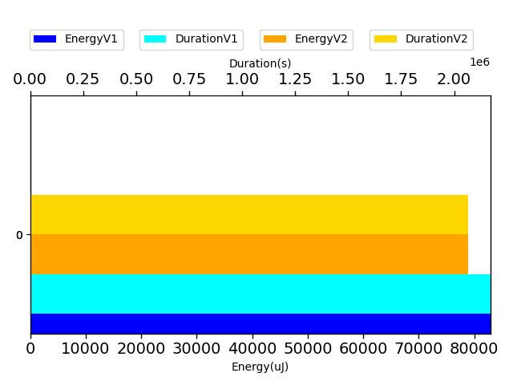

## com.google.gson.functional.ReadersWritersTest

| Test | IterationV1 | IterationV2 | DeltaIteration |
| --- | --- | --- | --- |
| com.google.gson.functional.ReadersWritersTest-testReadWriteTwoStrings | 74 | 72 | -2 |
| com.google.gson.functional.ReadersWritersTest-testWriterForSerialization | 34 | 37 | 3 |
| com.google.gson.functional.ReadersWritersTest-testReadWriteTwoObjects | 58 | 46 | -12 |
| com.google.gson.functional.ReadersWritersTest-testTopLevelNullObjectSerializationWithWriterAndSerializeNulls | 16 | 14 | -2 |
| com.google.gson.functional.ReadersWritersTest-testTopLevelNullObjectSerializationWithWriter | 13 | 13 | 0 |

| Test | EnergyV1 | EnergyV2 | DeltaEnergy |
| --- | --- | --- | --- |
| com.google.gson.functional.ReadersWritersTest-testReadWriteTwoStrings | 41404.804477061596 | 44055.962968179796 | 2651.1584911182 |
| com.google.gson.functional.ReadersWritersTest-testWriterForSerialization | 44204.85218404431 | 48537.42478011949 | 4332.572596075173 |
| com.google.gson.functional.ReadersWritersTest-testReadWriteTwoObjects | 43365.0228807785 | 50543.93657241129 | 7178.913691632784 |
| com.google.gson.functional.ReadersWritersTest-testTopLevelNullObjectSerializationWithWriterAndSerializeNulls | 43102.04089355469 | 43835.77624511719 | 733.7353515625 |
| com.google.gson.functional.ReadersWritersTest-testTopLevelNullObjectSerializationWithWriter | 38232.31982421875 | 38003.978271484375 | -228.341552734375 |

| Test | DurationV1 | DurationsV2 | DeltaDuration |
| --- | --- | --- | --- |
| com.google.gson.functional.ReadersWritersTest-testReadWriteTwoStrings | 958583.0299751183 | 839901.97481692 | -118681.05515819835 |
| com.google.gson.functional.ReadersWritersTest-testWriterForSerialization | 519552.24780368817 | 788691.1411980577 | 269138.8933943695 |
| com.google.gson.functional.ReadersWritersTest-testReadWriteTwoObjects | 719849.3800954386 | 940011.3245713615 | 220161.94447592297 |
| com.google.gson.functional.ReadersWritersTest-testTopLevelNullObjectSerializationWithWriterAndSerializeNulls | 337839.3750305176 | 391236.85021972656 | 53397.475189208984 |
| com.google.gson.functional.ReadersWritersTest-testTopLevelNullObjectSerializationWithWriter | 342358.2607421875 | 541220.5886230469 | 198862.32788085938 |

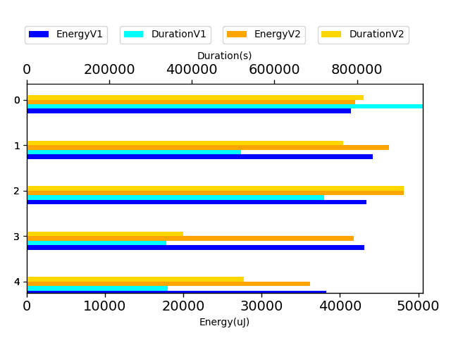

## com.google.gson.GsonTypeAdapterTest

| Test | IterationV1 | IterationV2 | DeltaIteration |
| --- | --- | --- | --- |
| com.google.gson.GsonTypeAdapterTest-testDeserializerForAbstractClass | 99 | 99 | 0 |
| com.google.gson.GsonTypeAdapterTest-testTypeAdapterProperlyConvertsTypes | 22 | 23 | 1 |
| com.google.gson.GsonTypeAdapterTest-testTypeAdapterThrowsException | 33 | 35 | 2 |
| com.google.gson.GsonTypeAdapterTest-testTypeAdapterDoesNotAffectNonAdaptedTypes | 14 | 16 | 2 |

| Test | EnergyV1 | EnergyV2 | DeltaEnergy |
| --- | --- | --- | --- |
| com.google.gson.GsonTypeAdapterTest-testDeserializerForAbstractClass | 53542.223851075876 | 40770.3101616709 | -12771.913689404973 |
| com.google.gson.GsonTypeAdapterTest-testTypeAdapterProperlyConvertsTypes | 41316.002397060394 | 40411.82391154766 | -904.1784855127335 |
| com.google.gson.GsonTypeAdapterTest-testTypeAdapterThrowsException | 43633.06125685992 | 47474.83081774443 | 3841.7695608845097 |
| com.google.gson.GsonTypeAdapterTest-testTypeAdapterDoesNotAffectNonAdaptedTypes | 40616.704345703125 | 42625.853454589844 | 2009.1491088867188 |

| Test | DurationV1 | DurationsV2 | DeltaDuration |
| --- | --- | --- | --- |
| com.google.gson.GsonTypeAdapterTest-testDeserializerForAbstractClass | 1713503.2523990213 | 1332251.424547232 | -381251.8278517893 |
| com.google.gson.GsonTypeAdapterTest-testTypeAdapterProperlyConvertsTypes | 456101.00060272217 | 483201.6134712696 | 27100.61286854744 |
| com.google.gson.GsonTypeAdapterTest-testTypeAdapterThrowsException | 683113.1672905739 | 745990.5462230805 | 62877.378932506545 |
| com.google.gson.GsonTypeAdapterTest-testTypeAdapterDoesNotAffectNonAdaptedTypes | 342537.1628417969 | 391741.0804748535 | 49203.91763305664 |

## com.google.gson.functional.JsonArrayTest

| Test | IterationV1 | IterationV2 | DeltaIteration |
| --- | --- | --- | --- |
| com.google.gson.functional.JsonArrayTest-testMixedPrimitiveAddition | 35 | 29 | -6 |
| com.google.gson.functional.JsonArrayTest-testStringPrimitiveAddition | 21 | 20 | -1 |
| com.google.gson.functional.JsonArrayTest-testIntegerPrimitiveAddition | 16 | 20 | 4 |
| com.google.gson.functional.JsonArrayTest-testDoublePrimitiveAddition | 22 | 36 | 14 |
| com.google.gson.functional.JsonArrayTest-testSameAddition | 22 | 22 | 0 |
| com.google.gson.functional.JsonArrayTest-testNullPrimitiveAddition | 9 | 13 | 4 |
| com.google.gson.functional.JsonArrayTest-testBooleanPrimitiveAddition | 12 | 17 | 5 |
| com.google.gson.functional.JsonArrayTest-testCharPrimitiveAddition | 10 | 13 | 3 |

| Test | EnergyV1 | EnergyV2 | DeltaEnergy |
| --- | --- | --- | --- |
| com.google.gson.functional.JsonArrayTest-testMixedPrimitiveAddition | 41328.27046585086 | 62180.4573001191 | 20852.186834268243 |
| com.google.gson.functional.JsonArrayTest-testStringPrimitiveAddition | 45147.89859199524 | 44992.65839958191 | -155.24019241333008 |
| com.google.gson.functional.JsonArrayTest-testIntegerPrimitiveAddition | 43564.236236572266 | 44406.06804084778 | 841.8318042755127 |
| com.google.gson.functional.JsonArrayTest-testDoublePrimitiveAddition | 64749.30010890961 | 45320.366525083344 | -19428.933583826263 |
| com.google.gson.functional.JsonArrayTest-testSameAddition | 43708.846787929535 | 41087.82417535782 | -2621.0226125717163 |
| com.google.gson.functional.JsonArrayTest-testNullPrimitiveAddition | 42426.29296875 | 45739.92077636719 | 3313.6278076171875 |
| com.google.gson.functional.JsonArrayTest-testBooleanPrimitiveAddition | 40026.4560546875 | 41399.83317565918 | 1373.3771209716797 |
| com.google.gson.functional.JsonArrayTest-testCharPrimitiveAddition | 42456.1484375 | 45818.0927734375 | 3361.9443359375 |

| Test | DurationV1 | DurationsV2 | DeltaDuration |
| --- | --- | --- | --- |
| com.google.gson.functional.JsonArrayTest-testMixedPrimitiveAddition | 920752.7827247774 | 1081405.3251422793 | 160652.5424175019 |
| com.google.gson.functional.JsonArrayTest-testStringPrimitiveAddition | 380225.5193424225 | 364330.0811843872 | -15895.438158035278 |
| com.google.gson.functional.JsonArrayTest-testIntegerPrimitiveAddition | 361744.9517211914 | 347943.8313436508 | -13801.120377540588 |
| com.google.gson.functional.JsonArrayTest-testDoublePrimitiveAddition | 1548952.5934901237 | 426066.28664340044 | -1122886.3068467234 |
| com.google.gson.functional.JsonArrayTest-testSameAddition | 469567.94962644577 | 456293.43781614304 | -13274.511810302734 |
| com.google.gson.functional.JsonArrayTest-testNullPrimitiveAddition | 361062.01953125 | 462584.81213378906 | 101522.79260253906 |
| com.google.gson.functional.JsonArrayTest-testBooleanPrimitiveAddition | 417252.78125 | 428684.79557800293 | 11432.01432800293 |
| com.google.gson.functional.JsonArrayTest-testCharPrimitiveAddition | 448917.92578125 | 294846.4226074219 | -154071.50317382812 |

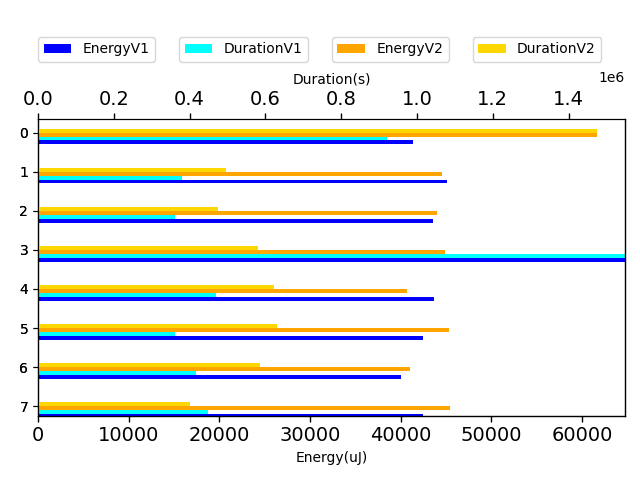

## com.google.gson.functional.PrimitiveCharacterTest

| Test | IterationV1 | IterationV2 | DeltaIteration |
| --- | --- | --- | --- |
| com.google.gson.functional.PrimitiveCharacterTest-testPrimitiveCharacterAutoboxedSerialization | 21 | 26 | 5 |

| Test | EnergyV1 | EnergyV2 | DeltaEnergy |
| --- | --- | --- | --- |
| com.google.gson.functional.PrimitiveCharacterTest-testPrimitiveCharacterAutoboxedSerialization | 41391.77233171463 | 41999.510764583945 | 607.7384328693151 |

| Test | DurationV1 | DurationsV2 | DeltaDuration |
| --- | --- | --- | --- |
| com.google.gson.functional.PrimitiveCharacterTest-testPrimitiveCharacterAutoboxedSerialization | 903102.9951610565 | 397211.4110714048 | -505891.5840896517 |

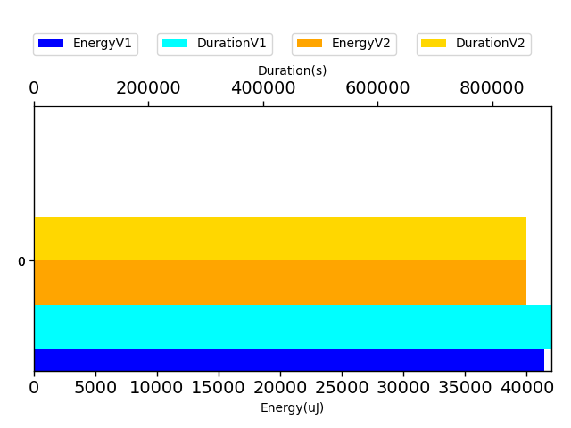

## com.google.gson.functional.CustomSerializerTest

| Test | IterationV1 | IterationV2 | DeltaIteration |
| --- | --- | --- | --- |
| com.google.gson.functional.CustomSerializerTest-testBaseClassSerializerInvokedForBaseClassFields | 58 | 56 | -2 |
| com.google.gson.functional.CustomSerializerTest-testBaseClassSerializerInvokedForBaseClassFieldsHoldingSubClassInstances | 36 | 34 | -2 |
| com.google.gson.functional.CustomSerializerTest-testSubClassSerializerInvokedForBaseClassFieldsHoldingArrayOfSubClassInstances | 41 | 42 | 1 |
| com.google.gson.functional.CustomSerializerTest-testSerializerReturnsNull | 42 | 47 | 5 |
| com.google.gson.functional.CustomSerializerTest-testSubClassSerializerInvokedForBaseClassFieldsHoldingSubClassInstances | 36 | 31 | -5 |

| Test | EnergyV1 | EnergyV2 | DeltaEnergy |
| --- | --- | --- | --- |
| com.google.gson.functional.CustomSerializerTest-testBaseClassSerializerInvokedForBaseClassFields | 109018.1565123582 | 129031.20007266414 | 20013.043560305945 |
| com.google.gson.functional.CustomSerializerTest-testBaseClassSerializerInvokedForBaseClassFieldsHoldingSubClassInstances | 41422.17943070689 | 39143.52825887367 | -2278.6511718332185 |
| com.google.gson.functional.CustomSerializerTest-testSubClassSerializerInvokedForBaseClassFieldsHoldingArrayOfSubClassInstances | 44041.20715509441 | 43844.39918672818 | -196.80796836622903 |
| com.google.gson.functional.CustomSerializerTest-testSerializerReturnsNull | 43702.87132560952 | 39514.34869322916 | -4188.522632380358 |
| com.google.gson.functional.CustomSerializerTest-testSubClassSerializerInvokedForBaseClassFieldsHoldingSubClassInstances | 43866.830676342535 | 66367.11663494166 | 22500.285958599125 |

| Test | DurationV1 | DurationsV2 | DeltaDuration |
| --- | --- | --- | --- |
| com.google.gson.functional.CustomSerializerTest-testBaseClassSerializerInvokedForBaseClassFields | 2449381.8056946215 | 3509027.4128972245 | 1059645.607202603 |
| com.google.gson.functional.CustomSerializerTest-testBaseClassSerializerInvokedForBaseClassFieldsHoldingSubClassInstances | 458394.08282570256 | 1050656.8389998367 | 592262.7561741341 |
| com.google.gson.functional.CustomSerializerTest-testSubClassSerializerInvokedForBaseClassFieldsHoldingArrayOfSubClassInstances | 773627.2913152745 | 903912.1875638972 | 130284.89624862268 |
| com.google.gson.functional.CustomSerializerTest-testSerializerReturnsNull | 594537.0849640099 | 782804.0057598285 | 188266.92079581856 |
| com.google.gson.functional.CustomSerializerTest-testSubClassSerializerInvokedForBaseClassFieldsHoldingSubClassInstances | 644102.374665903 | 1340593.076344152 | 696490.7016782489 |

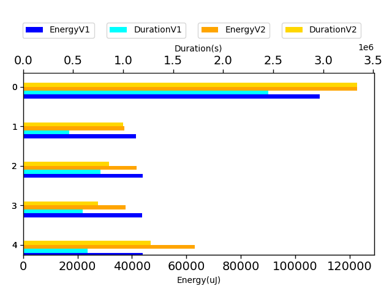

## com.google.gson.functional.StringTest

| Test | IterationV1 | IterationV2 | DeltaIteration |
| --- | --- | --- | --- |
| com.google.gson.functional.StringTest-testStringValueSerialization | 16 | 14 | -2 |
| com.google.gson.functional.StringTest-testEscapedBackslashInStringSerialization | 12 | 9 | -3 |
| com.google.gson.functional.StringTest-testEscapedCtrlNInStringSerialization | 9 | 14 | 5 |
| com.google.gson.functional.StringTest-testEscapedCtrlRInStringSerialization | 15 | 11 | -4 |
| com.google.gson.functional.StringTest-testJavascriptKeywordsInStringSerialization | 12 | 19 | 7 |
| com.google.gson.functional.StringTest-testAssignmentCharSerialization | 13 | 12 | -1 |
| com.google.gson.functional.StringTest-testEscapingQuotesInStringSerialization | 14 | 13 | -1 |
| com.google.gson.functional.StringTest-testStringValueAsSingleElementArraySerialization | 15 | 22 | 7 |
| com.google.gson.functional.StringTest-testSingleQuoteInStringSerialization | 22 | 21 | -1 |

| Test | EnergyV1 | EnergyV2 | DeltaEnergy |
| --- | --- | --- | --- |
| com.google.gson.functional.StringTest-testStringValueSerialization | 45829.14372253418 | 83555.849609375 | 37726.70588684082 |
| com.google.gson.functional.StringTest-testEscapedBackslashInStringSerialization | 46004.4248046875 | 42461.80859375 | -3542.6162109375 |
| com.google.gson.functional.StringTest-testEscapedCtrlNInStringSerialization | 40068.15234375 | 40819.18780517578 | 751.0354614257812 |
| com.google.gson.functional.StringTest-testEscapedCtrlRInStringSerialization | 224694.9854736328 | 44514.8330078125 | -180180.1524658203 |
| com.google.gson.functional.StringTest-testJavascriptKeywordsInStringSerialization | 43849.2802734375 | 45373.31523895264 | 1524.0349655151367 |
| com.google.gson.functional.StringTest-testAssignmentCharSerialization | 42483.893310546875 | 42191.97509765625 | -291.918212890625 |
| com.google.gson.functional.StringTest-testEscapingQuotesInStringSerialization | 43732.41357421875 | 42804.851318359375 | -927.562255859375 |
| com.google.gson.functional.StringTest-testStringValueAsSingleElementArraySerialization | 38282.79803466797 | 41841.11629629135 | 3558.3182616233826 |
| com.google.gson.functional.StringTest-testSingleQuoteInStringSerialization | 45063.39045763016 | 44018.720648765564 | -1044.6698088645935 |

| Test | DurationV1 | DurationsV2 | DeltaDuration |
| --- | --- | --- | --- |
| com.google.gson.functional.StringTest-testStringValueSerialization | 715775.501953125 | 2241979.5819091797 | 1526204.0799560547 |
| com.google.gson.functional.StringTest-testEscapedBackslashInStringSerialization | 308974.5146484375 | 343552.375 | 34577.8603515625 |
| com.google.gson.functional.StringTest-testEscapedCtrlNInStringSerialization | 314978.21484375 | 322319.0744628906 | 7340.859619140625 |
| com.google.gson.functional.StringTest-testEscapedCtrlRInStringSerialization | 6984148.053833008 | 339985.2490234375 | -6644162.80480957 |
| com.google.gson.functional.StringTest-testJavascriptKeywordsInStringSerialization | 350273.02490234375 | 368368.79513168335 | 18095.7702293396 |
| com.google.gson.functional.StringTest-testAssignmentCharSerialization | 307284.3034667969 | 330330.17919921875 | 23045.875732421875 |
| com.google.gson.functional.StringTest-testEscapingQuotesInStringSerialization | 365332.5500488281 | 445978.826171875 | 80646.27612304688 |
| com.google.gson.functional.StringTest-testStringValueAsSingleElementArraySerialization | 345734.19915771484 | 453380.73994255066 | 107646.54078483582 |
| com.google.gson.functional.StringTest-testSingleQuoteInStringSerialization | 598317.1545538902 | 556603.9136180878 | -41713.24093580246 |

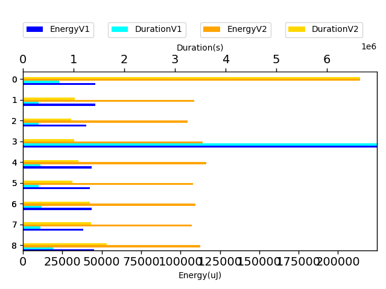

## com.google.gson.regression.JsonAdapterNullSafeTest

| Test | IterationV1 | IterationV2 | DeltaIteration |
| --- | --- | --- | --- |
| com.google.gson.regression.JsonAdapterNullSafeTest-testNullSafeBugSerialize | 88 | 88 | 0 |

| Test | EnergyV1 | EnergyV2 | DeltaEnergy |
| --- | --- | --- | --- |
| com.google.gson.regression.JsonAdapterNullSafeTest-testNullSafeBugSerialize | 44284.308727772586 | 45730.5082856183 | 1446.1995578457136 |

| Test | DurationV1 | DurationsV2 | DeltaDuration |
| --- | --- | --- | --- |
| com.google.gson.regression.JsonAdapterNullSafeTest-testNullSafeBugSerialize | 1004149.1512563548 | 1041937.2431012453 | 37788.0918448905 |

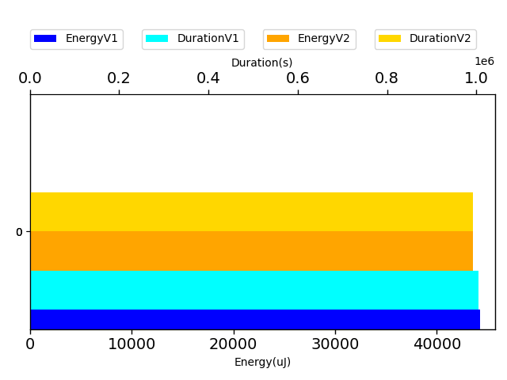

## com.google.gson.functional.JavaUtilTest

| Test | IterationV1 | IterationV2 | DeltaIteration |
| --- | --- | --- | --- |
| com.google.gson.functional.JavaUtilTest-testCurrency | 99 | 99 | 0 |
| com.google.gson.functional.JavaUtilTest-testProperties | 32 | 26 | -6 |

| Test | EnergyV1 | EnergyV2 | DeltaEnergy |
| --- | --- | --- | --- |
| com.google.gson.functional.JavaUtilTest-testCurrency | 88440.4650569561 | 115999.93031255258 | 27559.46525559647 |
| com.google.gson.functional.JavaUtilTest-testProperties | 42714.981722672936 | 42438.02187606692 | -276.95984660601243 |

| Test | DurationV1 | DurationsV2 | DeltaDuration |
| --- | --- | --- | --- |
| com.google.gson.functional.JavaUtilTest-testCurrency | 2164429.2695189174 | 3369156.8791290466 | 1204727.6096101291 |
| com.google.gson.functional.JavaUtilTest-testProperties | 441560.73864876013 | 455758.6976311803 | 14197.958982420154 |

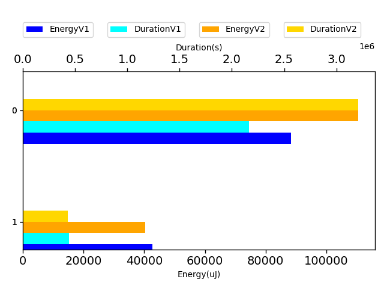

## com.google.gson.functional.TreeTypeAdaptersTest

| Test | IterationV1 | IterationV2 | DeltaIteration |
| --- | --- | --- | --- |
| com.google.gson.functional.TreeTypeAdaptersTest-testSerializeId | 86 | 88 | 2 |

| Test | EnergyV1 | EnergyV2 | DeltaEnergy |
| --- | --- | --- | --- |
| com.google.gson.functional.TreeTypeAdaptersTest-testSerializeId | 45898.30106748501 | 43960.48180812353 | -1937.8192593614804 |

| Test | DurationV1 | DurationsV2 | DeltaDuration |
| --- | --- | --- | --- |
| com.google.gson.functional.TreeTypeAdaptersTest-testSerializeId | 1325405.3134628106 | 1380714.1020824646 | 55308.78861965402 |

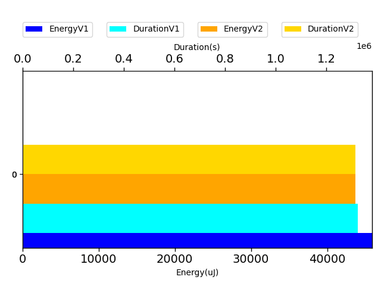

## com.google.gson.OverrideCoreTypeAdaptersTest

| Test | IterationV1 | IterationV2 | DeltaIteration |
| --- | --- | --- | --- |
| com.google.gson.OverrideCoreTypeAdaptersTest-testOverrideStringAdapter | 23 | 23 | 0 |
| com.google.gson.OverrideCoreTypeAdaptersTest-testOverrideWrapperBooleanAdapter | 44 | 28 | -16 |
| com.google.gson.OverrideCoreTypeAdaptersTest-testOverridePrimitiveBooleanAdapter | 10 | 25 | 15 |

| Test | EnergyV1 | EnergyV2 | DeltaEnergy |
| --- | --- | --- | --- |
| com.google.gson.OverrideCoreTypeAdaptersTest-testOverrideStringAdapter | 41459.39136958122 | 42875.740520238876 | 1416.3491506576538 |
| com.google.gson.OverrideCoreTypeAdaptersTest-testOverrideWrapperBooleanAdapter | 45331.84332256802 | 41605.36830341071 | -3726.475019157311 |
| com.google.gson.OverrideCoreTypeAdaptersTest-testOverridePrimitiveBooleanAdapter | 45773.69921875 | 41254.06430977583 | -4519.634908974171 |

| Test | DurationV1 | DurationsV2 | DeltaDuration |
| --- | --- | --- | --- |
| com.google.gson.OverrideCoreTypeAdaptersTest-testOverrideStringAdapter | 403049.19912838936 | 434644.724868536 | 31595.525740146637 |
| com.google.gson.OverrideCoreTypeAdaptersTest-testOverrideWrapperBooleanAdapter | 643751.7889883821 | 568628.1201616004 | -75123.66882678168 |
| com.google.gson.OverrideCoreTypeAdaptersTest-testOverridePrimitiveBooleanAdapter | 401934.494140625 | 367042.76787000895 | -34891.726270616055 |

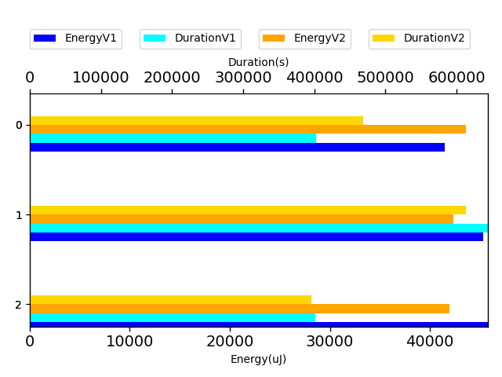

## com.google.gson.JsonParserTest

| Test | IterationV1 | IterationV2 | DeltaIteration |
| --- | --- | --- | --- |
| com.google.gson.JsonParserTest-testReadWriteTwoObjects | 69 | 67 | -2 |
| com.google.gson.JsonParserTest-testParseMixedArray | 27 | 19 | -8 |

| Test | EnergyV1 | EnergyV2 | DeltaEnergy |
| --- | --- | --- | --- |
| com.google.gson.JsonParserTest-testReadWriteTwoObjects | 344948.31177566433 | 45901.55472414885 | -299046.7570515155 |
| com.google.gson.JsonParserTest-testParseMixedArray | 41363.473207592964 | 41574.57048416138 | 211.09727656841278 |

| Test | DurationV1 | DurationsV2 | DeltaDuration |
| --- | --- | --- | --- |
| com.google.gson.JsonParserTest-testReadWriteTwoObjects | 11196524.641778972 | 1044596.1674780895 | -10151928.474300882 |
| com.google.gson.JsonParserTest-testParseMixedArray | 352577.02285185456 | 631191.0478668213 | 278614.0250149667 |

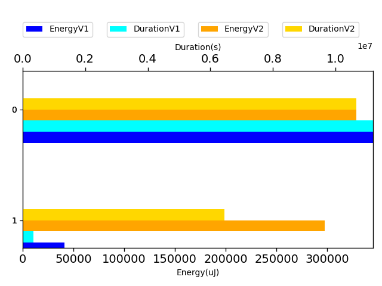

## com.google.gson.functional.PrintFormattingTest

| Test | IterationV1 | IterationV2 | DeltaIteration |
| --- | --- | --- | --- |
| com.google.gson.functional.PrintFormattingTest-testJsonObjectWithNullValues | 30 | 24 | -6 |
| com.google.gson.functional.PrintFormattingTest-testCompactFormattingLeavesNoWhiteSpace | 65 | 64 | -1 |
| com.google.gson.functional.PrintFormattingTest-testJsonObjectWithNullValuesSerialized | 20 | 22 | 2 |

| Test | EnergyV1 | EnergyV2 | DeltaEnergy |
| --- | --- | --- | --- |
| com.google.gson.functional.PrintFormattingTest-testJsonObjectWithNullValues | 48804.701741753146 | 43286.743467092514 | -5517.958274660632 |
| com.google.gson.functional.PrintFormattingTest-testCompactFormattingLeavesNoWhiteSpace | 57052.5523339501 | 44467.53363895881 | -12585.01869499129 |
| com.google.gson.functional.PrintFormattingTest-testJsonObjectWithNullValuesSerialized | 42503.112659454346 | 44314.04182910919 | 1810.9291696548462 |

| Test | DurationV1 | DurationsV2 | DeltaDuration |
| --- | --- | --- | --- |
| com.google.gson.functional.PrintFormattingTest-testJsonObjectWithNullValues | 577615.4562991299 | 376375.27358818054 | -201240.18271094933 |
| com.google.gson.functional.PrintFormattingTest-testCompactFormattingLeavesNoWhiteSpace | 1132873.114494224 | 861928.0425775889 | -270945.07191663515 |
| com.google.gson.functional.PrintFormattingTest-testJsonObjectWithNullValuesSerialized | 377537.20353889465 | 405936.99261045456 | 28399.789071559906 |

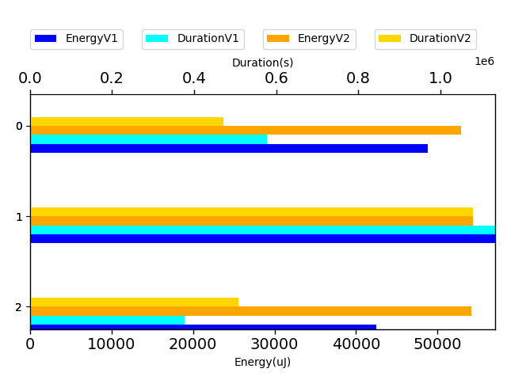

## com.google.gson.functional.UncategorizedTest

| Test | IterationV1 | IterationV2 | DeltaIteration |
| --- | --- | --- | --- |
| com.google.gson.functional.UncategorizedTest-testStaticFieldsAreNotSerialized | 38 | 29 | -9 |
| com.google.gson.functional.UncategorizedTest-testObjectEqualButNotSameSerialization | 29 | 32 | 3 |
| com.google.gson.functional.UncategorizedTest-testGsonInstanceReusableForSerializationAndDeserialization | 39 | 39 | 0 |

| Test | EnergyV1 | EnergyV2 | DeltaEnergy |
| --- | --- | --- | --- |
| com.google.gson.functional.UncategorizedTest-testStaticFieldsAreNotSerialized | 72641.711196704 | 41847.70562263206 | -30794.00557407194 |
| com.google.gson.functional.UncategorizedTest-testObjectEqualButNotSameSerialization | 49994.446859039366 | 42282.40935593471 | -7712.037503104657 |
| com.google.gson.functional.UncategorizedTest-testGsonInstanceReusableForSerializationAndDeserialization | 50697.922919879886 | 41525.3056733161 | -9172.617246563786 |

| Test | DurationV1 | DurationsV2 | DeltaDuration |
| --- | --- | --- | --- |
| com.google.gson.functional.UncategorizedTest-testStaticFieldsAreNotSerialized | 1639147.4025691592 | 863328.3387389518 | -775819.0638302073 |
| com.google.gson.functional.UncategorizedTest-testObjectEqualButNotSameSerialization | 1449391.587124385 | 688372.5841055042 | -761019.0030188807 |
| com.google.gson.functional.UncategorizedTest-testGsonInstanceReusableForSerializationAndDeserialization | 1513681.703787615 | 604673.6379005335 | -909008.0658870816 |

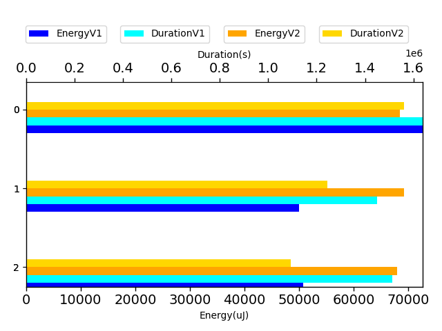

## com.google.gson.internal.bind.JsonTreeReaderTest

| Test | IterationV1 | IterationV2 | DeltaIteration |
| --- | --- | --- | --- |
| com.google.gson.internal.bind.JsonTreeReaderTest-testSkipValue_filledJsonObject | 26 | 24 | -2 |
| com.google.gson.internal.bind.JsonTreeReaderTest-testSkipValue_emptyJsonObject | 16 | 13 | -3 |

| Test | EnergyV1 | EnergyV2 | DeltaEnergy |
| --- | --- | --- | --- |
| com.google.gson.internal.bind.JsonTreeReaderTest-testSkipValue_filledJsonObject | 45235.7759732306 | 47052.709147036076 | 1816.9331738054752 |
| com.google.gson.internal.bind.JsonTreeReaderTest-testSkipValue_emptyJsonObject | 43603.29165649414 | 44744.3583984375 | 1141.0667419433594 |

| Test | DurationV1 | DurationsV2 | DeltaDuration |
| --- | --- | --- | --- |
| com.google.gson.internal.bind.JsonTreeReaderTest-testSkipValue_filledJsonObject | 646962.2724357843 | 495305.48777133226 | -151656.78466445208 |
| com.google.gson.internal.bind.JsonTreeReaderTest-testSkipValue_emptyJsonObject | 602110.1766357422 | 339048.31591796875 | -263061.86071777344 |

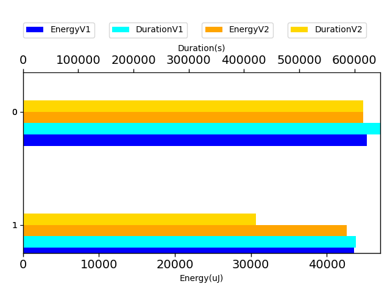

## com.google.gson.functional.EscapingTest

| Test | IterationV1 | IterationV2 | DeltaIteration |
| --- | --- | --- | --- |
| com.google.gson.functional.EscapingTest-testEscapingQuotesInStringArray | 31 | 33 | 2 |
| com.google.gson.functional.EscapingTest-testGsonDoubleDeserialization | 34 | 37 | 3 |
| com.google.gson.functional.EscapingTest-testEscapingObjectFields | 40 | 47 | 7 |
| com.google.gson.functional.EscapingTest-testGsonAcceptsEscapedAndNonEscapedJsonDeserialization | 49 | 42 | -7 |
| com.google.gson.functional.EscapingTest-testEscapeAllHtmlCharacters | 26 | 25 | -1 |

| Test | EnergyV1 | EnergyV2 | DeltaEnergy |
| --- | --- | --- | --- |
| com.google.gson.functional.EscapingTest-testEscapingQuotesInStringArray | 49211.47187860496 | 42516.92836328619 | -6694.543515318772 |
| com.google.gson.functional.EscapingTest-testGsonDoubleDeserialization | 45035.76260431425 | 42151.841644161206 | -2883.9209601530456 |
| com.google.gson.functional.EscapingTest-testEscapingObjectFields | 44356.68539221504 | 42301.56409502625 | -2055.121297188787 |
| com.google.gson.functional.EscapingTest-testGsonAcceptsEscapedAndNonEscapedJsonDeserialization | 45248.237741177734 | 43086.75659774091 | -2161.481143436824 |
| com.google.gson.functional.EscapingTest-testEscapeAllHtmlCharacters | 39900.67335090041 | 44420.89806443453 | 4520.224713534117 |

| Test | DurationV1 | DurationsV2 | DeltaDuration |
| --- | --- | --- | --- |
| com.google.gson.functional.EscapingTest-testEscapingQuotesInStringArray | 789281.2290348206 | 403639.5551569939 | -385641.67387782666 |
| com.google.gson.functional.EscapingTest-testGsonDoubleDeserialization | 515127.0503870897 | 470674.9221456691 | -44452.12824142061 |
| com.google.gson.functional.EscapingTest-testEscapingObjectFields | 580933.4830858286 | 524412.1536618954 | -56521.32942393317 |
| com.google.gson.functional.EscapingTest-testGsonAcceptsEscapedAndNonEscapedJsonDeserialization | 949216.1162252289 | 666877.6092222598 | -282338.50700296904 |
| com.google.gson.functional.EscapingTest-testEscapeAllHtmlCharacters | 682779.122362107 | 479466.64059072733 | -203312.4817713797 |

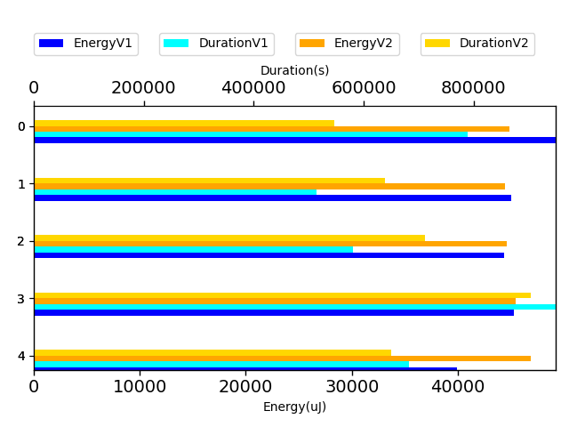

## com.google.gson.functional.InternationalizationTest

| Test | IterationV1 | IterationV2 | DeltaIteration |
| --- | --- | --- | --- |
| com.google.gson.functional.InternationalizationTest-testStringsWithUnicodeChineseCharactersSerialization | 50 | 44 | -6 |

| Test | EnergyV1 | EnergyV2 | DeltaEnergy |
| --- | --- | --- | --- |
| com.google.gson.functional.InternationalizationTest-testStringsWithUnicodeChineseCharactersSerialization | 43645.521214395885 | 43903.96872709705 | 258.4475127011683 |

| Test | DurationV1 | DurationsV2 | DeltaDuration |
| --- | --- | --- | --- |
| com.google.gson.functional.InternationalizationTest-testStringsWithUnicodeChineseCharactersSerialization | 828901.6931480495 | 754956.0459293246 | -73945.64721872495 |

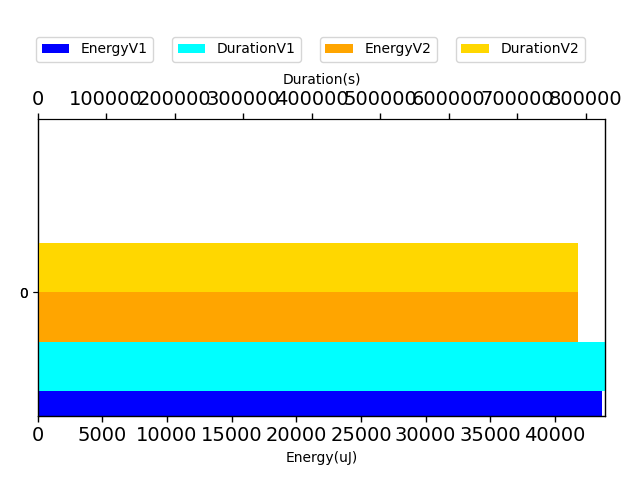

## com.google.gson.functional.GsonVersionDiagnosticsTest

| Test | IterationV1 | IterationV2 | DeltaIteration |
| --- | --- | --- | --- |
| com.google.gson.functional.GsonVersionDiagnosticsTest-testAssertionErrorInSerializationPrintsVersion | 43 | 29 | -14 |

| Test | EnergyV1 | EnergyV2 | DeltaEnergy |
| --- | --- | --- | --- |
| com.google.gson.functional.GsonVersionDiagnosticsTest-testAssertionErrorInSerializationPrintsVersion | 54449.95601903755 | 42271.48678333126 | -12178.469235706289 |

| Test | DurationV1 | DurationsV2 | DeltaDuration |
| --- | --- | --- | --- |
| com.google.gson.functional.GsonVersionDiagnosticsTest-testAssertionErrorInSerializationPrintsVersion | 1441734.9272377593 | 610402.9481560253 | -831331.9790817341 |

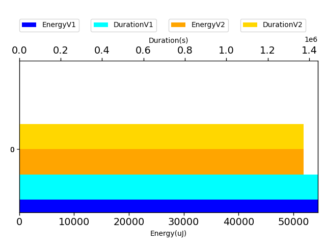

## com.google.gson.JsonPrimitiveTest

| Test | IterationV1 | IterationV2 | DeltaIteration |
| --- | --- | --- | --- |
| com.google.gson.JsonPrimitiveTest-testValidJsonOnToString | 37 | 42 | 5 |
| com.google.gson.JsonPrimitiveTest-testEqualsIntegerAndBigInteger | 40 | 33 | -7 |

| Test | EnergyV1 | EnergyV2 | DeltaEnergy |
| --- | --- | --- | --- |
| com.google.gson.JsonPrimitiveTest-testValidJsonOnToString | 69441.73339359823 | 144216.61113463342 | 74774.87774103519 |
| com.google.gson.JsonPrimitiveTest-testEqualsIntegerAndBigInteger | 43286.75354203733 | 42139.93899866077 | -1146.8145433765603 |

| Test | DurationV1 | DurationsV2 | DeltaDuration |
| --- | --- | --- | --- |
| com.google.gson.JsonPrimitiveTest-testValidJsonOnToString | 1964574.4086250404 | 3678791.3656977518 | 1714216.9570727113 |
| com.google.gson.JsonPrimitiveTest-testEqualsIntegerAndBigInteger | 743205.6810699883 | 771226.4149076291 | 28020.733837640844 |

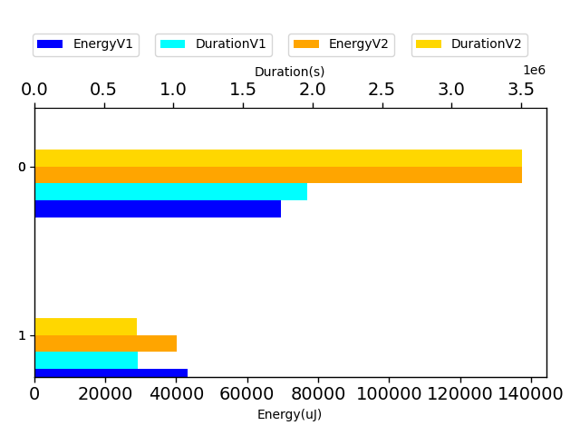

## com.google.gson.JsonObjectTest

| Test | IterationV1 | IterationV2 | DeltaIteration |
| --- | --- | --- | --- |
| com.google.gson.JsonObjectTest-testPropertyWithQuotes | 24 | 28 | 4 |
| com.google.gson.JsonObjectTest-testWritePropertyWithEmptyStringName | 9 | 19 | 10 |

| Test | EnergyV1 | EnergyV2 | DeltaEnergy |
| --- | --- | --- | --- |
| com.google.gson.JsonObjectTest-testPropertyWithQuotes | 290615.792503953 | 45011.796750590205 | -245603.99575336277 |
| com.google.gson.JsonObjectTest-testWritePropertyWithEmptyStringName | 47281.1796875 | 42387.768604278564 | -4893.411083221436 |

| Test | DurationV1 | DurationsV2 | DeltaDuration |
| --- | --- | --- | --- |
| com.google.gson.JsonObjectTest-testPropertyWithQuotes | 8807042.285841227 | 491069.917677477 | -8315972.36816375 |
| com.google.gson.JsonObjectTest-testWritePropertyWithEmptyStringName | 509898.4375 | 357321.6435585022 | -152576.7939414978 |

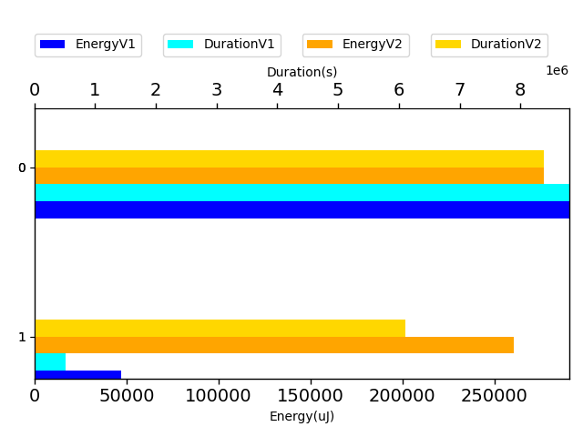

