# gson 5bbc76

https://github.com/google/gson.git/commit/5bbc76

| Index | EnergyV1 | EnergyV2 | DeltaEnergy |
| --- | --- | --- | --- |
| 0 | 344069.23827131896 | 359753.85705827316 | 15684.618786954205 |
| 1 | 106863.67543864115 | 69976.77934660118 | -36886.89609203997 |
| 2 | 320375.5108861835 | 329149.28139496 | 8773.770508776535 |
| 3 | 238020.26459267974 | 102402.20793718554 | -135618.0566554942 |
| 4 | 263010.7213925463 | 267707.4619798153 | 4696.740587269014 |
| 5 | 3754530.2757768678 | 3299884.9997177217 | -454645.27605914604 |
| 6 | 687307.5803232854 | 661090.7096272684 | -26216.870696017053 |
| 7 | 191477.6617869925 | 190674.16220655869 | -803.499580433825 |
| 8 | 214612.8633580571 | 330889.31994164933 | 116276.45658359223 |
| 9 | 440110.3145825468 | 418878.95224526443 | -21231.362337282393 |
| 10 | 1227201.0520188995 | 1466211.4221041012 | 239010.3700852017 |
| 11 | 706151.2676152209 | 607879.3967516342 | -98271.87086358666 |
| 12 | 816383.2380829538 | 792284.2985674809 | -24098.939515472972 |
| 13 | 162094.76397181157 | 137846.08767553733 | -24248.676296274236 |
| 14 | 269537.57687703596 | 257089.91484782423 | -12447.66202921173 |
| 15 | 808432.2574002224 | 781022.0577927773 | -27410.199607445044 |
| 16 | 543731.0252254675 | 505493.31764144666 | -38237.707584020856 |
| 17 | 257506.8700409888 | 478970.3552941143 | 221463.48525312552 |
| 18 | 297023.9442842528 | 310139.0508872417 | 13115.106602988904 |
| 19 | 424217.0855863137 | 489121.1842170344 | 64904.09863072069 |
| 20 | 93440.2337701152 | 88827.33402739892 | -4612.899742716283 |
| 21 | 840889.4610031561 | 1093409.3841990256 | 252519.92319586943 |
| 22 | 418544.892633325 | 403159.78202645015 | -15385.110606874863 |
| 23 | 134881.22596335513 | 126879.81799201867 | -8001.407971336463 |
| 24 | 447076.92822054494 | 411233.288931684 | -35843.639288860955 |
| 25 | 57231.961629641046 | 47762.201541297734 | -9469.760088343312 |
| 26 | 271723.2992919396 | 157962.52660018267 | -113760.77269175692 |
| 27 | 188569.57200321252 | 254549.4268200121 | 65979.85481679958 |
| 28 | 273966.67053977115 | 298418.79550924705 | 24452.124969475903 |
| 29 | 175191.150417905 | 148885.50294337102 | -26305.647474533995 |
| 30 | 377534.62890696526 | 388387.3732597828 | 10852.744352817535 |
| 31 | 1550608.2637030804 | 1524918.7426314037 | -25689.52107167663 |
| 32 | 354002.477309665 | 435320.8089254819 | 81318.33161581692 |
| 33 | 216785.19311283372 | 210555.2246009381 | -6229.968511895626 |
| 34 | 296940.7597782634 | 229081.2455674089 | -67859.51421085448 |
| 35 | 96221.38844672771 | 96160.40476356262 | -60.98368316509004 |
| 36 | 168258.05409158324 | 156022.5022042997 | -12235.551887283538 |
| 37 | 559659.2083886508 | 772233.4495656008 | 212574.24117695005 |
| 38 | 265734.7611439252 | 246909.74190847628 | -18825.01923544891 |
| 39 | 367804.7954390765 | 437787.8693144963 | 69983.0738754198 |
| 40 | 223355.43300439464 | 258763.13127122552 | 35407.69826683088 |
| 41 | 230195.20820310587 | 209234.7161339332 | -20960.492069172673 |
| 42 | 265860.88340918196 | 279240.7217798029 | 13379.838370620913 |
| 43 | 87953.87653614148 | 86281.75899737058 | -1672.1175387709081 |
| 44 | 129208.78791339952 | 127914.33479251384 | -1294.4531208856788 |
| 45 | 169122.45738781567 | 127351.9860486419 | -41770.47133917376 |
| 46 | 75636.49615623275 | 90264.05421951992 | 14627.558063287172 |
| 47 | 44186.21867574379 | 51695.2697108984 | 7509.051035154611 |
| 48 | 90977.0242775637 | 88980.88225292099 | -1996.1420246427151 |
| 49 | 42419.01668071118 | 41720.542316224615 | -698.4743644865666 |
| 50 | 87845.7099395655 | 42604.48190178389 | -45241.228037781606 |
| 51 | 43880.8705609264 | 42774.512145929206 | -1106.358414997194 |
| 52 | 41924.084664843904 | 54683.722883469294 | 12759.63821862539 |
| 53 | 131121.5383106156 | 134464.63232516687 | 3343.0940145512577 |
| 54 | 133134.8362899655 | 135644.46825158742 | 2509.631961621926 |
| 55 | 286589.5454963199 | 214631.141809747 | -71958.40368657288 |
| 56 | 268008.3095055907 | 47154.0456063952 | -220854.2638991955 |
| 57 | 43738.91877490352 | 40853.57042491725 | -2885.3483499862705 |
| 58 | 229335.8847769946 | 122102.4863524884 | -107233.39842450619 |

| Index | DurationV1 | DurationsV2 | DeltaDuration |
| --- | --- | --- | --- |
| 0 | 5344990.080451116 | 7231096.046345651 | 1886105.9658945352 |
| 1 | 3270500.4081087387 | 1548363.0765200597 | -1722137.331588679 |
| 2 | 6712139.869348227 | 7207231.712619761 | 495091.84327153396 |
| 3 | 7283353.347877644 | 2099445.9175590547 | -5183907.430318589 |
| 4 | 10384654.003689438 | 5253932.866768753 | -5130721.136920685 |
| 5 | 77428663.94398057 | 64483552.02475869 | -12945111.919221886 |
| 6 | 13312084.151549324 | 8682140.0392245 | -4629944.112324825 |
| 7 | 5905105.505392031 | 4964012.64601646 | -941092.8593755709 |
| 8 | 4784715.995215263 | 9454367.487664035 | 4669651.492448771 |
| 9 | 6907382.257535145 | 6117877.758162936 | -789504.4993722085 |
| 10 | 22680381.565366447 | 31741480.733810175 | 9061099.168443728 |
| 11 | 16526147.254877174 | 15262131.095635237 | -1264016.159241937 |
| 12 | 17873606.655066565 | 19541028.055305887 | 1667421.4002393223 |
| 13 | 4223551.412355434 | 2723027.6245379164 | -1500523.7878175178 |
| 14 | 6290820.094598031 | 5518082.023241127 | -772738.0713569038 |
| 15 | 19847707.849597774 | 14340190.034023458 | -5507517.815574316 |
| 16 | 8238923.802511158 | 7924098.574943021 | -314825.22756813746 |
| 17 | 5100292.798581777 | 14620119.401067624 | 9519826.602485847 |
| 18 | 4587854.23618498 | 7513960.799465211 | 2926106.5632802313 |
| 19 | 9354583.72778727 | 10861877.71891948 | 1507293.991132211 |
| 20 | 2157820.5163032413 | 1954440.5157945403 | -203380.00050870096 |
| 21 | 15003204.111280581 | 24048397.774214026 | 9045193.662933445 |
| 22 | 7532459.010181095 | 6344572.256543815 | -1187886.7536372803 |
| 23 | 2231858.3629166298 | 2105073.246110577 | -126785.11680605263 |
| 24 | 9670751.003679827 | 10095740.650951805 | 424989.64727197774 |
| 25 | 1401747.7203716058 | 1123532.456241317 | -278215.26413028874 |
| 26 | 6089651.047100851 | 3202243.5081036687 | -2887407.5389971826 |
| 27 | 5427296.730025054 | 7678435.072301068 | 2251138.3422760144 |
| 28 | 6335854.951674879 | 6065555.84175181 | -270299.10992306843 |
| 29 | 4146484.3904198194 | 3425361.713459813 | -721122.6769600064 |
| 30 | 3898162.364616871 | 3811751.3352606297 | -86411.02935624123 |
| 31 | 17033313.261851557 | 18827419.008859903 | 1794105.747008346 |
| 32 | 8395279.192465752 | 10102670.488861268 | 1707391.296395516 |
| 33 | 3942183.4860131843 | 3323926.0910709323 | -618257.394942252 |
| 34 | 7649999.709462585 | 4338955.991018917 | -3311043.7184436675 |
| 35 | 1358992.364470296 | 1772794.0526035682 | 413801.6881332721 |
| 36 | 3849442.530062994 | 3699620.9531552987 | -149821.57690769527 |
| 37 | 10586454.063262764 | 17935268.85826179 | 7348814.794999026 |
| 38 | 4915680.889329936 | 3579773.655454687 | -1335907.2338752495 |
| 39 | 6527150.071068256 | 10135789.037962528 | 3608638.966894272 |
| 40 | 4796323.019630148 | 6615757.731932325 | 1819434.7123021772 |
| 41 | 5497209.8298303615 | 3048388.442786984 | -2448821.3870433774 |
| 42 | 3485376.2404480553 | 4414414.45840136 | 929038.2179533043 |
| 43 | 1432431.0640483268 | 1592812.2037664144 | 160381.13971808762 |
| 44 | 2011527.130695148 | 1468257.2786424058 | -543269.8520527421 |
| 45 | 4059839.7836642875 | 2855109.6198108383 | -1204730.1638534493 |
| 46 | 2257420.151064476 | 2121437.7815760775 | -135982.36948839854 |
| 47 | 530089.7846187465 | 873607.9903574586 | 343518.2057387121 |
| 48 | 1877158.5920305578 | 1528974.8345631296 | -348183.7574674282 |
| 49 | 810465.9606862161 | 820614.8198831533 | 10148.859196937177 |
| 50 | 2378379.2134866156 | 1142785.1597323795 | -1235594.053754236 |
| 51 | 1189276.0670008902 | 1400869.6772173285 | 211593.6102164383 |
| 52 | 1212595.8510164253 | 1151903.5704228424 | -60692.280593582895 |
| 53 | 1937539.7131678474 | 2303253.637740422 | 365713.9245725747 |
| 54 | 1918584.8809439025 | 1832284.1390236942 | -86300.74192020833 |
| 55 | 8047935.135196172 | 4631019.483208622 | -3416915.65198755 |
| 56 | 8506776.139747724 | 1291378.65134802 | -7215397.488399704 |
| 57 | 611582.3667517232 | 577553.0294815956 | -34029.33727012761 |
| 58 | 5787894.924488947 | 1856096.2692427114 | -3931798.6552462354 |

| Index | TestClassName | #Tests |
| --- | --- | --- |
| 0 | com.google.gson.functional.TypeAdapterPrecedenceTest | 8 |
| 1 | com.google.gson.functional.StreamingTypeAdaptersTest | 1 |
| 2 | com.google.gson.functional.JsonAdapterAnnotationOnClassesTest | 7 |
| 3 | com.google.gson.functional.CustomDeserializerTest | 2 |
| 4 | com.google.gson.functional.ExclusionStrategyFunctionalTest | 5 |
| 5 | com.google.gson.functional.DefaultTypeAdaptersTest | 39 |
| 6 | com.google.gson.functional.ArrayTest | 15 |
| 7 | com.google.gson.functional.JsonAdapterSerializerDeserializerTest | 3 |
| 8 | com.google.gson.functional.ThrowableFunctionalTest | 5 |
| 9 | com.google.gson.functional.NullObjectAndFieldTest | 10 |
| 10 | com.google.gson.functional.MapTest | 26 |
| 11 | com.google.gson.functional.ParameterizedTypesTest | 12 |
| 12 | com.google.gson.functional.CircularReferenceTest | 5 |
| 13 | com.google.gson.functional.ReadersWritersTest | 3 |
| 14 | com.google.gson.functional.ExposeFieldsTest | 5 |
| 15 | com.google.gson.functional.CollectionTest | 18 |
| 16 | com.google.gson.functional.InheritanceTest | 11 |
| 17 | com.google.gson.functional.MoreSpecificTypeSerializationTest | 6 |
| 18 | com.google.gson.functional.JavaUtilConcurrentAtomicTest | 7 |
| 19 | com.google.gson.functional.EnumTest | 9 |
| 20 | com.google.gson.functional.DelegateTypeAdapterTest | 2 |
| 21 | com.google.gson.functional.ObjectTest | 18 |
| 22 | com.google.gson.functional.NamingPolicyTest | 9 |
| 23 | com.google.gson.DefaultMapJsonSerializerTest | 3 |
| 24 | com.google.gson.functional.JsonAdapterAnnotationOnFieldsTest | 9 |
| 25 | com.google.gson.functional.SerializedNameTest | 1 |
| 26 | com.google.gson.functional.TypeHierarchyAdapterTest | 2 |
| 27 | com.google.gson.functional.TypeVariableTest | 3 |
| 28 | com.google.gson.functional.VersioningTest | 5 |
| 29 | com.google.gson.functional.RuntimeTypeAdapterFactoryFunctionalTest | 1 |
| 30 | com.google.gson.functional.StringTest | 9 |
| 31 | com.google.gson.functional.PrimitiveTest | 35 |
| 32 | com.google.gson.functional.ConcurrencyTest | 2 |
| 33 | com.google.gson.functional.FieldNamingTest | 5 |
| 34 | com.google.gson.functional.RawSerializationTest | 5 |
| 35 | com.google.gson.functional.SecurityTest | 2 |
| 36 | com.google.gson.functional.MapAsArrayTypeAdapterTest | 3 |
| 37 | com.google.gson.functional.CustomTypeAdaptersTest | 12 |
| 38 | com.google.gson.functional.CustomSerializerTest | 5 |
| 39 | com.google.gson.functional.PrettyPrintingTest | 8 |
| 40 | com.google.gson.functional.JsonTreeTest | 4 |
| 41 | com.google.gson.GsonTypeAdapterTest | 4 |
| 42 | com.google.gson.MixedStreamTest | 6 |
| 43 | com.google.gson.functional.InterfaceTest | 2 |
| 44 | com.google.gson.OverrideCoreTypeAdaptersTest | 3 |
| 45 | com.google.gson.functional.JavaUtilTest | 2 |
| 46 | com.google.gson.DefaultInetAddressTypeAdapterTest | 1 |
| 47 | com.google.gson.functional.PrimitiveCharacterTest | 1 |
| 48 | com.google.gson.GsonBuilderTest | 2 |
| 49 | com.google.gson.functional.InternationalizationTest | 1 |
| 50 | com.google.gson.regression.JsonAdapterNullSafeTest | 1 |
| 51 | com.google.gson.functional.TreeTypeAdaptersTest | 1 |
| 52 | com.google.gson.JsonParserTest | 1 |
| 53 | com.google.gson.functional.FieldExclusionTest | 3 |
| 54 | com.google.gson.functional.UncategorizedTest | 3 |
| 55 | com.google.gson.functional.EscapingTest | 5 |
| 56 | com.google.gson.functional.PrintFormattingTest | 1 |
| 57 | com.google.gson.functional.GsonVersionDiagnosticsTest | 1 |
| 58 | com.google.gson.LongSerializationPolicyTest | 2 |

| Time Label | Time (s) |
| --- | --- |
| Selection | 35.8489191532135 |
| Injection | 22.09725046157837 |
| Total | 1706.85844373703 |
## com.google.gson.functional.TypeAdapterPrecedenceTest

| Test | IterationV1 | IterationV2 | DeltaIteration |
| --- | --- | --- | --- |
| com.google.gson.functional.TypeAdapterPrecedenceTest-testStreamingFollowedByNonstreaming | 21 | 18 | -3 |
| com.google.gson.functional.TypeAdapterPrecedenceTest-testSerializeNonstreamingTypeAdapterFollowedByStreamingTypeAdapter | 23 | 26 | 3 |
| com.google.gson.functional.TypeAdapterPrecedenceTest-testNonstreamingFollowedByNonstreaming | 78 | 80 | 2 |
| com.google.gson.functional.TypeAdapterPrecedenceTest-testStreamingHierarchicalFollowedByNonstreamingHierarchical | 16 | 9 | -7 |
| com.google.gson.functional.TypeAdapterPrecedenceTest-testStreamingFollowedByStreaming | 25 | 25 | 0 |
| com.google.gson.functional.TypeAdapterPrecedenceTest-testStreamingHierarchicalFollowedByNonstreaming | 14 | 27 | 13 |
| com.google.gson.functional.TypeAdapterPrecedenceTest-testStreamingFollowedByNonstreamingHierarchical | 26 | 19 | -7 |
| com.google.gson.functional.TypeAdapterPrecedenceTest-testNonstreamingHierarchicalFollowedByNonstreaming | 17 | 15 | -2 |

| Test | EnergyV1 | EnergyV2 | DeltaEnergy |
| --- | --- | --- | --- |
| com.google.gson.functional.TypeAdapterPrecedenceTest-testStreamingFollowedByNonstreaming | 45610.510847091675 | 42159.73378753662 | -3450.7770595550537 |
| com.google.gson.functional.TypeAdapterPrecedenceTest-testSerializeNonstreamingTypeAdapterFollowedByStreamingTypeAdapter | 38910.38869190216 | 43604.34587928653 | 4693.957187384367 |
| com.google.gson.functional.TypeAdapterPrecedenceTest-testNonstreamingFollowedByNonstreaming | 48426.917493783556 | 43980.890535922226 | -4446.02695786133 |
| com.google.gson.functional.TypeAdapterPrecedenceTest-testStreamingHierarchicalFollowedByNonstreamingHierarchical | 42449.334411621094 | 42881.06640625 | 431.73199462890625 |
| com.google.gson.functional.TypeAdapterPrecedenceTest-testStreamingFollowedByStreaming | 44050.48958384991 | 40895.029352873564 | -3155.460230976343 |
| com.google.gson.functional.TypeAdapterPrecedenceTest-testStreamingHierarchicalFollowedByNonstreaming | 40532.10205078125 | 41866.677075102925 | 1334.5750243216753 |
| com.google.gson.functional.TypeAdapterPrecedenceTest-testStreamingFollowedByNonstreamingHierarchical | 41895.73942446709 | 59432.42050933838 | 17536.681084871292 |
| com.google.gson.functional.TypeAdapterPrecedenceTest-testNonstreamingHierarchicalFollowedByNonstreaming | 42193.755767822266 | 44933.69351196289 | 2739.937744140625 |

| Test | DurationV1 | DurationsV2 | DeltaDuration |
| --- | --- | --- | --- |
| com.google.gson.functional.TypeAdapterPrecedenceTest-testStreamingFollowedByNonstreaming | 402400.08243989944 | 431019.88037872314 | 28619.7979388237 |
| com.google.gson.functional.TypeAdapterPrecedenceTest-testSerializeNonstreamingTypeAdapterFollowedByStreamingTypeAdapter | 543207.6289545298 | 420699.5063739717 | -122508.12258055806 |
| com.google.gson.functional.TypeAdapterPrecedenceTest-testNonstreamingFollowedByNonstreaming | 1193116.927910164 | 1095892.3675951958 | -97224.56031496823 |
| com.google.gson.functional.TypeAdapterPrecedenceTest-testStreamingHierarchicalFollowedByNonstreamingHierarchical | 415176.97552490234 | 3068436.31640625 | 2653259.3408813477 |
| com.google.gson.functional.TypeAdapterPrecedenceTest-testStreamingFollowedByStreaming | 701103.6060596704 | 516347.6190456748 | -184755.98701399565 |
| com.google.gson.functional.TypeAdapterPrecedenceTest-testStreamingHierarchicalFollowedByNonstreaming | 404286.4787597656 | 378692.5277608931 | -25593.95099887252 |
| com.google.gson.functional.TypeAdapterPrecedenceTest-testStreamingFollowedByNonstreamingHierarchical | 1278374.2200661004 | 849191.2060432434 | -429183.01402285695 |
| com.google.gson.functional.TypeAdapterPrecedenceTest-testNonstreamingHierarchicalFollowedByNonstreaming | 407324.160736084 | 470816.6227416992 | 63492.462005615234 |

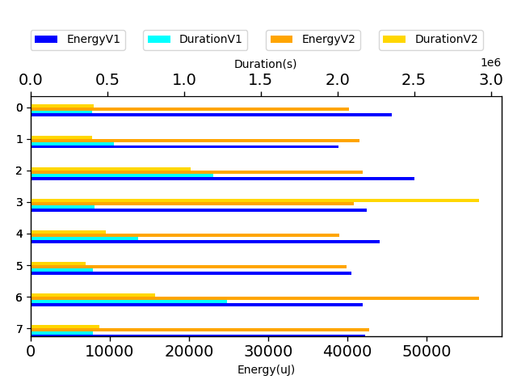

## com.google.gson.functional.StreamingTypeAdaptersTest

| Test | IterationV1 | IterationV2 | DeltaIteration |
| --- | --- | --- | --- |
| com.google.gson.functional.StreamingTypeAdaptersTest-testNullSafe | 99 | 99 | 0 |

| Test | EnergyV1 | EnergyV2 | DeltaEnergy |
| --- | --- | --- | --- |
| com.google.gson.functional.StreamingTypeAdaptersTest-testNullSafe | 106863.67543864115 | 69976.77934660118 | -36886.89609203997 |

| Test | DurationV1 | DurationsV2 | DeltaDuration |
| --- | --- | --- | --- |
| com.google.gson.functional.StreamingTypeAdaptersTest-testNullSafe | 3270500.4081087387 | 1548363.0765200597 | -1722137.331588679 |

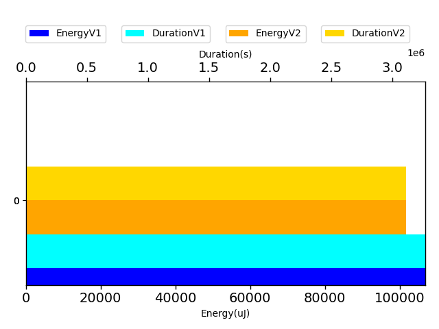

## com.google.gson.functional.JsonAdapterAnnotationOnClassesTest

| Test | IterationV1 | IterationV2 | DeltaIteration |
| --- | --- | --- | --- |
| com.google.gson.functional.JsonAdapterAnnotationOnClassesTest-testJsonAdapterInvoked | 99 | 99 | 0 |
| com.google.gson.functional.JsonAdapterAnnotationOnClassesTest-testRegisteredSerializerOverridesJsonAdapter | 56 | 49 | -7 |
| com.google.gson.functional.JsonAdapterAnnotationOnClassesTest-testSuperclassTypeAdapterNotInvoked | 54 | 49 | -5 |
| com.google.gson.functional.JsonAdapterAnnotationOnClassesTest-testJsonAdapterFactoryInvoked | 87 | 75 | -12 |
| com.google.gson.functional.JsonAdapterAnnotationOnClassesTest-testRegisteredAdapterOverridesJsonAdapter | 39 | 42 | 3 |
| com.google.gson.functional.JsonAdapterAnnotationOnClassesTest-testIncorrectTypeAdapterFails | 49 | 58 | 9 |
| com.google.gson.functional.JsonAdapterAnnotationOnClassesTest-testRegisteredDeserializerOverridesJsonAdapter | 91 | 94 | 3 |

| Test | EnergyV1 | EnergyV2 | DeltaEnergy |
| --- | --- | --- | --- |
| com.google.gson.functional.JsonAdapterAnnotationOnClassesTest-testJsonAdapterInvoked | 56271.76460777785 | 43720.338897461654 | -12551.425710316194 |
| com.google.gson.functional.JsonAdapterAnnotationOnClassesTest-testRegisteredSerializerOverridesJsonAdapter | 44334.221914360794 | 45180.19918729596 | 845.977272935168 |
| com.google.gson.functional.JsonAdapterAnnotationOnClassesTest-testSuperclassTypeAdapterNotInvoked | 44487.60156615544 | 44133.600948705345 | -354.0006174500959 |
| com.google.gson.functional.JsonAdapterAnnotationOnClassesTest-testJsonAdapterFactoryInvoked | 42447.31120754995 | 44131.967780993524 | 1684.6565734435717 |
| com.google.gson.functional.JsonAdapterAnnotationOnClassesTest-testRegisteredAdapterOverridesJsonAdapter | 41980.747913064966 | 41586.99470570116 | -393.7532073638067 |
| com.google.gson.functional.JsonAdapterAnnotationOnClassesTest-testIncorrectTypeAdapterFails | 42592.21909699403 | 43188.552376513515 | 596.3332795194874 |
| com.google.gson.functional.JsonAdapterAnnotationOnClassesTest-testRegisteredDeserializerOverridesJsonAdapter | 48261.64458028046 | 67207.62749828887 | 18945.982918008413 |

| Test | DurationV1 | DurationsV2 | DeltaDuration |
| --- | --- | --- | --- |
| com.google.gson.functional.JsonAdapterAnnotationOnClassesTest-testJsonAdapterInvoked | 1580716.3128968445 | 1610559.6158301053 | 29843.3029332608 |
| com.google.gson.functional.JsonAdapterAnnotationOnClassesTest-testRegisteredSerializerOverridesJsonAdapter | 797136.8960198037 | 848465.5783559766 | 51328.682336172904 |
| com.google.gson.functional.JsonAdapterAnnotationOnClassesTest-testSuperclassTypeAdapterNotInvoked | 644118.9715877257 | 747147.0551997031 | 103028.0836119774 |
| com.google.gson.functional.JsonAdapterAnnotationOnClassesTest-testJsonAdapterFactoryInvoked | 1076329.889209131 | 981857.4312331912 | -94472.45797593985 |
| com.google.gson.functional.JsonAdapterAnnotationOnClassesTest-testRegisteredAdapterOverridesJsonAdapter | 721592.675968751 | 556445.1763581239 | -165147.49961062707 |
| com.google.gson.functional.JsonAdapterAnnotationOnClassesTest-testIncorrectTypeAdapterFails | 685457.4505860398 | 808903.3900212409 | 123445.93943520111 |
| com.google.gson.functional.JsonAdapterAnnotationOnClassesTest-testRegisteredDeserializerOverridesJsonAdapter | 1206787.6730799312 | 1653853.4656214188 | 447065.7925414876 |

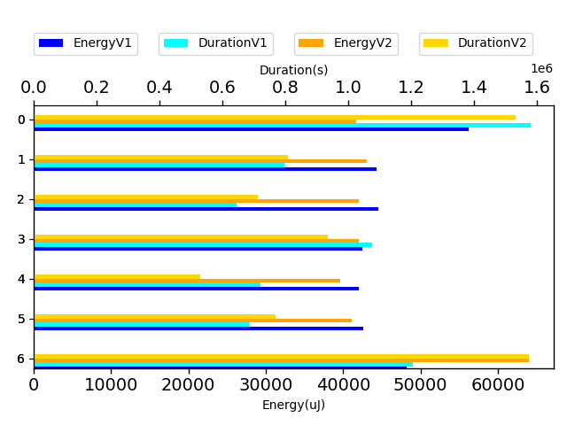

## com.google.gson.functional.CustomDeserializerTest

| Test | IterationV1 | IterationV2 | DeltaIteration |
| --- | --- | --- | --- |
| com.google.gson.functional.CustomDeserializerTest-testDefaultConstructorNotCalledOnField | 53 | 58 | 5 |
| com.google.gson.functional.CustomDeserializerTest-testDefaultConstructorNotCalledOnObject | 40 | 48 | 8 |

| Test | EnergyV1 | EnergyV2 | DeltaEnergy |
| --- | --- | --- | --- |
| com.google.gson.functional.CustomDeserializerTest-testDefaultConstructorNotCalledOnField | 43157.490948525396 | 47634.04326157418 | 4476.552313048785 |
| com.google.gson.functional.CustomDeserializerTest-testDefaultConstructorNotCalledOnObject | 194862.77364415434 | 54768.16467561136 | -140094.60896854298 |

| Test | DurationV1 | DurationsV2 | DeltaDuration |
| --- | --- | --- | --- |
| com.google.gson.functional.CustomDeserializerTest-testDefaultConstructorNotCalledOnField | 889333.8994442988 | 1180797.8716370158 | 291463.972192717 |
| com.google.gson.functional.CustomDeserializerTest-testDefaultConstructorNotCalledOnObject | 6394019.448433345 | 918648.045922039 | -5475371.402511306 |

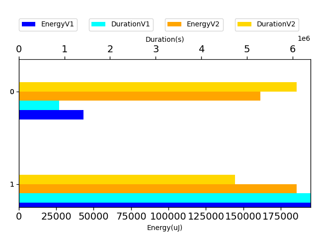

## com.google.gson.functional.ExclusionStrategyFunctionalTest

| Test | IterationV1 | IterationV2 | DeltaIteration |
| --- | --- | --- | --- |
| com.google.gson.functional.ExclusionStrategyFunctionalTest-testExclusionStrategySerializationDoesNotImpactSerialization | 40 | 39 | -1 |
| com.google.gson.functional.ExclusionStrategyFunctionalTest-testExclusionStrategyWithMode | 56 | 46 | -10 |
| com.google.gson.functional.ExclusionStrategyFunctionalTest-testExcludeTopLevelClassDeserializationDoesNotImpactSerialization | 30 | 35 | 5 |
| com.google.gson.functional.ExclusionStrategyFunctionalTest-testExclusionStrategySerialization | 99 | 99 | 0 |
| com.google.gson.functional.ExclusionStrategyFunctionalTest-testExcludeTopLevelClassSerialization | 17 | 19 | 2 |

| Test | EnergyV1 | EnergyV2 | DeltaEnergy |
| --- | --- | --- | --- |
| com.google.gson.functional.ExclusionStrategyFunctionalTest-testExclusionStrategySerializationDoesNotImpactSerialization | 41151.30320810512 | 44130.51541824034 | 2979.2122101352215 |
| com.google.gson.functional.ExclusionStrategyFunctionalTest-testExclusionStrategyWithMode | 42360.743009798185 | 49145.3913003436 | 6784.648290545418 |
| com.google.gson.functional.ExclusionStrategyFunctionalTest-testExcludeTopLevelClassDeserializationDoesNotImpactSerialization | 41416.45684864558 | 44406.33139906346 | 2989.8745504178805 |
| com.google.gson.functional.ExclusionStrategyFunctionalTest-testExclusionStrategySerialization | 95784.2812990199 | 87419.52850770624 | -8364.752791313658 |
| com.google.gson.functional.ExclusionStrategyFunctionalTest-testExcludeTopLevelClassSerialization | 42297.93702697754 | 42605.69535446167 | 307.75832748413086 |

| Test | DurationV1 | DurationsV2 | DeltaDuration |
| --- | --- | --- | --- |
| com.google.gson.functional.ExclusionStrategyFunctionalTest-testExclusionStrategySerializationDoesNotImpactSerialization | 595090.1085996889 | 631008.9313378723 | 35918.82273818343 |
| com.google.gson.functional.ExclusionStrategyFunctionalTest-testExclusionStrategyWithMode | 826520.0569483205 | 1217480.9074529302 | 390960.85050460976 |
| com.google.gson.functional.ExclusionStrategyFunctionalTest-testExcludeTopLevelClassDeserializationDoesNotImpactSerialization | 483668.0960627636 | 570628.3434799728 | 86960.2474172092 |
| com.google.gson.functional.ExclusionStrategyFunctionalTest-testExclusionStrategySerialization | 2117701.452054862 | 2370315.479143287 | 252614.02708842512 |
| com.google.gson.functional.ExclusionStrategyFunctionalTest-testExcludeTopLevelClassSerialization | 6361674.290023804 | 464499.20535469055 | -5897175.084669113 |

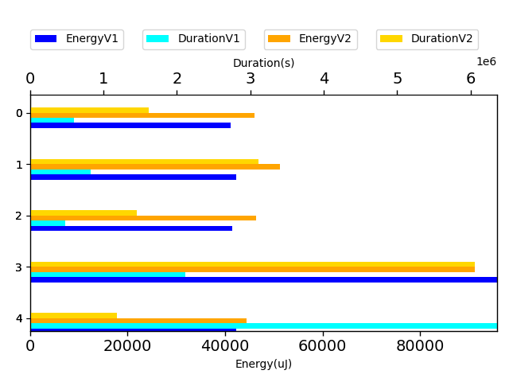

## com.google.gson.functional.DefaultTypeAdaptersTest

| Test | IterationV1 | IterationV2 | DeltaIteration |
| --- | --- | --- | --- |
| com.google.gson.functional.DefaultTypeAdaptersTest-testDateSerializationWithPatternNotOverridenByTypeAdapter | 67 | 52 | -15 |
| com.google.gson.functional.DefaultTypeAdaptersTest-testLocaleSerializationWithLanguage | 22 | 19 | -3 |
| com.google.gson.functional.DefaultTypeAdaptersTest-testBitSetDeserialization | 36 | 35 | -1 |
| com.google.gson.functional.DefaultTypeAdaptersTest-testDefaultJavaSqlTimestampSerialization | 66 | 64 | -2 |
| com.google.gson.functional.DefaultTypeAdaptersTest-testUrlSerialization | 99 | 99 | 0 |
| com.google.gson.functional.DefaultTypeAdaptersTest-testOverrideBigIntegerTypeAdapter | 66 | 62 | -4 |
| com.google.gson.functional.DefaultTypeAdaptersTest-testJsonObjectSerialization | 23 | 29 | 6 |
| com.google.gson.functional.DefaultTypeAdaptersTest-testClassSerialization | 43 | 57 | 14 |
| com.google.gson.functional.DefaultTypeAdaptersTest-testUriSerialization | 11 | 18 | 7 |
| com.google.gson.functional.DefaultTypeAdaptersTest-testDefaultDateDeserializationUsingBuilder | 99 | 99 | 0 |
| com.google.gson.functional.DefaultTypeAdaptersTest-testDefaultCalendarSerialization | 21 | 32 | 11 |
| com.google.gson.functional.DefaultTypeAdaptersTest-testJsonNullSerialization | 17 | 10 | -7 |
| com.google.gson.functional.DefaultTypeAdaptersTest-testUrlNullSerialization | 58 | 62 | 4 |
| com.google.gson.functional.DefaultTypeAdaptersTest-testNullSerialization | 99 | 99 | 0 |
| com.google.gson.functional.DefaultTypeAdaptersTest-testDefaultJavaSqlTimeSerialization | 41 | 44 | 3 |
| com.google.gson.functional.DefaultTypeAdaptersTest-testDateSerializationInCollection | 96 | 93 | -3 |
| com.google.gson.functional.DefaultTypeAdaptersTest-testBigIntegerFieldSerialization | 80 | 78 | -2 |
| com.google.gson.functional.DefaultTypeAdaptersTest-testSetSerialization | 29 | 32 | 3 |
| com.google.gson.functional.DefaultTypeAdaptersTest-testDefaultDateSerialization | 83 | 77 | -6 |
| com.google.gson.functional.DefaultTypeAdaptersTest-testStringBufferSerialization | 12 | 12 | 0 |
| com.google.gson.functional.DefaultTypeAdaptersTest-testBigDecimalFieldSerialization | 84 | 82 | -2 |
| com.google.gson.functional.DefaultTypeAdaptersTest-testPropertiesSerialization | 23 | 25 | 2 |
| com.google.gson.functional.DefaultTypeAdaptersTest-testDefaultDateSerializationUsingBuilder | 53 | 60 | 7 |
| com.google.gson.functional.DefaultTypeAdaptersTest-testDateSerializationWithPattern | 70 | 61 | -9 |
| com.google.gson.functional.DefaultTypeAdaptersTest-testDefaultJavaSqlDateSerialization | 36 | 38 | 2 |
| com.google.gson.functional.DefaultTypeAdaptersTest-testLocaleSerializationWithLanguageCountryVariant | 19 | 22 | 3 |
| com.google.gson.functional.DefaultTypeAdaptersTest-testUuidSerialization | 19 | 26 | 7 |
| com.google.gson.functional.DefaultTypeAdaptersTest-testTimestampSerialization | 53 | 53 | 0 |
| com.google.gson.functional.DefaultTypeAdaptersTest-testLocaleSerializationWithLanguageCountry | 17 | 9 | -8 |
| com.google.gson.functional.DefaultTypeAdaptersTest-testNullJsonElementSerialization | 14 | 16 | 2 |
| com.google.gson.functional.DefaultTypeAdaptersTest-testOverrideBigDecimalTypeAdapter | 31 | 21 | -10 |
| com.google.gson.functional.DefaultTypeAdaptersTest-testTreeSetSerialization | 49 | 40 | -9 |
| com.google.gson.functional.DefaultTypeAdaptersTest-testJsonPrimitiveSerialization | 24 | 27 | 3 |
| com.google.gson.functional.DefaultTypeAdaptersTest-testBitSetSerialization | 24 | 13 | -11 |
| com.google.gson.functional.DefaultTypeAdaptersTest-testDateDeserializationWithPattern | 59 | 63 | 4 |
| com.google.gson.functional.DefaultTypeAdaptersTest-testStringBuilderSerialization | 13 | 11 | -2 |
| com.google.gson.functional.DefaultTypeAdaptersTest-testSqlDateSerialization | 53 | 59 | 6 |
| com.google.gson.functional.DefaultTypeAdaptersTest-testJsonArraySerialization | 11 | 25 | 14 |
| com.google.gson.functional.DefaultTypeAdaptersTest-testDefaultGregorianCalendarSerialization | 19 | 25 | 6 |

| Test | EnergyV1 | EnergyV2 | DeltaEnergy |
| --- | --- | --- | --- |
| com.google.gson.functional.DefaultTypeAdaptersTest-testDateSerializationWithPatternNotOverridenByTypeAdapter | 43389.48915221641 | 40901.809110559465 | -2487.680041656946 |
| com.google.gson.functional.DefaultTypeAdaptersTest-testLocaleSerializationWithLanguage | 43256.38002204895 | 42485.76887512207 | -770.6111469268799 |
| com.google.gson.functional.DefaultTypeAdaptersTest-testBitSetDeserialization | 41880.466648167974 | 42040.466900695115 | 160.00025252714113 |
| com.google.gson.functional.DefaultTypeAdaptersTest-testDefaultJavaSqlTimestampSerialization | 43886.286198354326 | 42939.66244243286 | -946.6237559214642 |
| com.google.gson.functional.DefaultTypeAdaptersTest-testUrlSerialization | 271855.986184556 | 282088.6264231387 | 10232.640238582739 |
| com.google.gson.functional.DefaultTypeAdaptersTest-testOverrideBigIntegerTypeAdapter | 41859.07415859859 | 42970.46024280961 | 1111.3860842110225 |
| com.google.gson.functional.DefaultTypeAdaptersTest-testJsonObjectSerialization | 93146.26455402374 | 46850.6000999175 | -46295.66445410624 |
| com.google.gson.functional.DefaultTypeAdaptersTest-testClassSerialization | 42920.03493706063 | 42086.57689243916 | -833.4580446214677 |
| com.google.gson.functional.DefaultTypeAdaptersTest-testUriSerialization | 44860.46240234375 | 42211.21258544922 | -2649.2498168945312 |
| com.google.gson.functional.DefaultTypeAdaptersTest-testDefaultDateDeserializationUsingBuilder | 330003.7331635376 | 312948.0752339907 | -17055.6579295469 |
| com.google.gson.functional.DefaultTypeAdaptersTest-testDefaultCalendarSerialization | 40040.26837348938 | 42357.64181854366 | 2317.3734450542834 |
| com.google.gson.functional.DefaultTypeAdaptersTest-testJsonNullSerialization | 44727.39213562012 | 44956.677734375 | 229.2855987548828 |
| com.google.gson.functional.DefaultTypeAdaptersTest-testUrlNullSerialization | 43930.01178395631 | 41768.08605345193 | -2161.9257305043793 |
| com.google.gson.functional.DefaultTypeAdaptersTest-testNullSerialization | 1550934.3395046238 | 1119117.382209965 | -431816.95729465876 |
| com.google.gson.functional.DefaultTypeAdaptersTest-testDefaultJavaSqlTimeSerialization | 42248.54599439948 | 41686.65745883535 | -561.8885355641323 |
| com.google.gson.functional.DefaultTypeAdaptersTest-testDateSerializationInCollection | 41441.28041233102 | 40568.25961175695 | -873.0208005740715 |
| com.google.gson.functional.DefaultTypeAdaptersTest-testBigIntegerFieldSerialization | 42303.28972991355 | 41233.11777613045 | -1070.1719537831013 |
| com.google.gson.functional.DefaultTypeAdaptersTest-testSetSerialization | 41289.29563174397 | 42298.17595226737 | 1008.8803205233999 |
| com.google.gson.functional.DefaultTypeAdaptersTest-testDefaultDateSerialization | 52292.32449231392 | 65415.064954532805 | 13122.740462218884 |
| com.google.gson.functional.DefaultTypeAdaptersTest-testStringBufferSerialization | 40212.8330078125 | 41929.498046875 | 1716.6650390625 |
| com.google.gson.functional.DefaultTypeAdaptersTest-testBigDecimalFieldSerialization | 57903.36719323634 | 75073.48504033349 | 17170.117847097143 |
| com.google.gson.functional.DefaultTypeAdaptersTest-testPropertiesSerialization | 41170.57866668701 | 43974.958822488785 | 2804.380155801773 |
| com.google.gson.functional.DefaultTypeAdaptersTest-testDefaultDateSerializationUsingBuilder | 43086.62765289431 | 41702.66732670986 | -1383.9603261844532 |
| com.google.gson.functional.DefaultTypeAdaptersTest-testDateSerializationWithPattern | 42392.73557917824 | 41322.483736483846 | -1070.2518426943934 |
| com.google.gson.functional.DefaultTypeAdaptersTest-testDefaultJavaSqlDateSerialization | 42978.721370699204 | 43004.693611740586 | 25.972241041381494 |
| com.google.gson.functional.DefaultTypeAdaptersTest-testLocaleSerializationWithLanguageCountryVariant | 42750.09752655029 | 41742.00436449051 | -1008.0931620597839 |
| com.google.gson.functional.DefaultTypeAdaptersTest-testUuidSerialization | 43899.69178390503 | 41439.400901407 | -2460.290882498026 |
| com.google.gson.functional.DefaultTypeAdaptersTest-testTimestampSerialization | 42165.63410394453 | 42760.27355122476 | 594.6394472802276 |
| com.google.gson.functional.DefaultTypeAdaptersTest-testLocaleSerializationWithLanguageCountry | 42197.7038269043 | 43210.06640625 | 1012.3625793457031 |
| com.google.gson.functional.DefaultTypeAdaptersTest-testNullJsonElementSerialization | 39278.259033203125 | 42901.090087890625 | 3622.8310546875 |
| com.google.gson.functional.DefaultTypeAdaptersTest-testOverrideBigDecimalTypeAdapter | 41789.13305436354 | 42550.839282512665 | 761.7062281491235 |
| com.google.gson.functional.DefaultTypeAdaptersTest-testTreeSetSerialization | 43974.55747808481 | 42810.821185446686 | -1163.7362926381247 |
| com.google.gson.functional.DefaultTypeAdaptersTest-testJsonPrimitiveSerialization | 42750.06157410145 | 41999.78309389949 | -750.2784802019596 |
| com.google.gson.functional.DefaultTypeAdaptersTest-testBitSetSerialization | 40718.79151248932 | 43026.689208984375 | 2307.897696495056 |
| com.google.gson.functional.DefaultTypeAdaptersTest-testDateDeserializationWithPattern | 42391.72736238295 | 41188.9398305721 | -1202.7875318108563 |
| com.google.gson.functional.DefaultTypeAdaptersTest-testStringBuilderSerialization | 42555.824951171875 | 42403.40576171875 | -152.419189453125 |
| com.google.gson.functional.DefaultTypeAdaptersTest-testSqlDateSerialization | 40258.64519918229 | 42459.33901805103 | 2200.693818868742 |
| com.google.gson.functional.DefaultTypeAdaptersTest-testJsonArraySerialization | 44763.833984375 | 44206.63781964779 | -557.196164727211 |
| com.google.gson.functional.DefaultTypeAdaptersTest-testDefaultGregorianCalendarSerialization | 41026.52543640137 | 43253.6002445817 | 2227.074808180332 |

| Test | DurationV1 | DurationsV2 | DeltaDuration |
| --- | --- | --- | --- |
| com.google.gson.functional.DefaultTypeAdaptersTest-testDateSerializationWithPatternNotOverridenByTypeAdapter | 738292.7161573223 | 784524.8518955478 | 46232.13573822554 |
| com.google.gson.functional.DefaultTypeAdaptersTest-testLocaleSerializationWithLanguage | 395471.1743314266 | 359818.58617019653 | -35652.58816123009 |
| com.google.gson.functional.DefaultTypeAdaptersTest-testBitSetDeserialization | 541114.3637973571 | 505557.094153852 | -35557.269643505046 |
| com.google.gson.functional.DefaultTypeAdaptersTest-testDefaultJavaSqlTimestampSerialization | 1205752.267079509 | 923289.8634763026 | -282462.4036032065 |
| com.google.gson.functional.DefaultTypeAdaptersTest-testUrlSerialization | 6850239.713452883 | 6714681.711012844 | -135558.00244003907 |
| com.google.gson.functional.DefaultTypeAdaptersTest-testOverrideBigIntegerTypeAdapter | 834513.7269129544 | 772986.2677317341 | -61527.45918122027 |
| com.google.gson.functional.DefaultTypeAdaptersTest-testJsonObjectSerialization | 2621169.559657693 | 605187.191966515 | -2015982.3676911779 |
| com.google.gson.functional.DefaultTypeAdaptersTest-testClassSerialization | 854058.0959524014 | 775416.0897785685 | -78642.00617383292 |
| com.google.gson.functional.DefaultTypeAdaptersTest-testUriSerialization | 384945.81787109375 | 507567.2544326782 | 122621.43656158447 |
| com.google.gson.functional.DefaultTypeAdaptersTest-testDefaultDateDeserializationUsingBuilder | 8129298.020498747 | 7693863.338440694 | -435434.6820580531 |
| com.google.gson.functional.DefaultTypeAdaptersTest-testDefaultCalendarSerialization | 445178.3821992874 | 468180.1284490756 | 23001.746249788208 |
| com.google.gson.functional.DefaultTypeAdaptersTest-testJsonNullSerialization | 413907.02366638184 | 432432.19921875 | 18525.175552368164 |
| com.google.gson.functional.DefaultTypeAdaptersTest-testUrlNullSerialization | 882676.6427581243 | 990933.1050046261 | 108256.46224650182 |
| com.google.gson.functional.DefaultTypeAdaptersTest-testNullSerialization | 36325864.453870684 | 25852569.55654116 | -10473294.897329524 |
| com.google.gson.functional.DefaultTypeAdaptersTest-testDefaultJavaSqlTimeSerialization | 536593.4056383113 | 539115.0018448741 | 2521.5962065628264 |
| com.google.gson.functional.DefaultTypeAdaptersTest-testDateSerializationInCollection | 1194566.6085560867 | 1221861.6068569748 | 27294.99830088811 |
| com.google.gson.functional.DefaultTypeAdaptersTest-testBigIntegerFieldSerialization | 960520.536853441 | 1157140.8063813495 | 196620.26952790841 |
| com.google.gson.functional.DefaultTypeAdaptersTest-testSetSerialization | 761151.3817796279 | 591714.2527349084 | -169437.1290447195 |
| com.google.gson.functional.DefaultTypeAdaptersTest-testDefaultDateSerialization | 1414935.6966696866 | 1577730.6509590764 | 162794.95428938977 |
| com.google.gson.functional.DefaultTypeAdaptersTest-testStringBufferSerialization | 345073.7946777344 | 315606.23193359375 | -29467.562744140625 |
| com.google.gson.functional.DefaultTypeAdaptersTest-testBigDecimalFieldSerialization | 1378100.5205643834 | 1796088.6772118257 | 417988.1566474424 |
| com.google.gson.functional.DefaultTypeAdaptersTest-testPropertiesSerialization | 382643.1693395376 | 395961.2760550976 | 13318.10671555996 |
| com.google.gson.functional.DefaultTypeAdaptersTest-testDefaultDateSerializationUsingBuilder | 840302.9773159305 | 652114.8195062494 | -188188.15780968114 |
| com.google.gson.functional.DefaultTypeAdaptersTest-testDateSerializationWithPattern | 1019516.3082201681 | 1096658.3264613873 | 77142.01824121922 |
| com.google.gson.functional.DefaultTypeAdaptersTest-testDefaultJavaSqlDateSerialization | 655035.4974367898 | 548105.0284824634 | -106930.46895432635 |
| com.google.gson.functional.DefaultTypeAdaptersTest-testLocaleSerializationWithLanguageCountryVariant | 372998.1572227478 | 376116.77625751495 | 3118.619034767151 |
| com.google.gson.functional.DefaultTypeAdaptersTest-testUuidSerialization | 529128.6209411621 | 420694.99701043963 | -108433.62393072248 |
| com.google.gson.functional.DefaultTypeAdaptersTest-testTimestampSerialization | 750794.7753432721 | 701134.8510309088 | -49659.92431236338 |
| com.google.gson.functional.DefaultTypeAdaptersTest-testLocaleSerializationWithLanguageCountry | 337131.83853149414 | 328369.93359375 | -8761.90493774414 |
| com.google.gson.functional.DefaultTypeAdaptersTest-testNullJsonElementSerialization | 322046.22314453125 | 292434.43798828125 | -29611.78515625 |
| com.google.gson.functional.DefaultTypeAdaptersTest-testOverrideBigDecimalTypeAdapter | 467771.25766133796 | 440541.22411870956 | -27230.0335426284 |
| com.google.gson.functional.DefaultTypeAdaptersTest-testTreeSetSerialization | 723441.2096717069 | 664851.5451287683 | -58589.66454293858 |
| com.google.gson.functional.DefaultTypeAdaptersTest-testJsonPrimitiveSerialization | 563754.3361202478 | 530104.9330032915 | -33649.40311695635 |
| com.google.gson.functional.DefaultTypeAdaptersTest-testBitSetSerialization | 409276.52574419975 | 435510.6408691406 | 26234.115124940872 |
| com.google.gson.functional.DefaultTypeAdaptersTest-testDateDeserializationWithPattern | 818191.1121390844 | 954994.9904050243 | 136803.8782659399 |
| com.google.gson.functional.DefaultTypeAdaptersTest-testStringBuilderSerialization | 333551.6083984375 | 329397.44140625 | -4154.1669921875 |
| com.google.gson.functional.DefaultTypeAdaptersTest-testSqlDateSerialization | 823316.2964511217 | 767356.943715018 | -55959.3527361037 |
| com.google.gson.functional.DefaultTypeAdaptersTest-testJsonArraySerialization | 442079.7724609375 | 573229.9884110689 | 131150.21595013142 |
| com.google.gson.functional.DefaultTypeAdaptersTest-testDefaultGregorianCalendarSerialization | 424260.3548927307 | 389709.40512016416 | -34550.94977256656 |

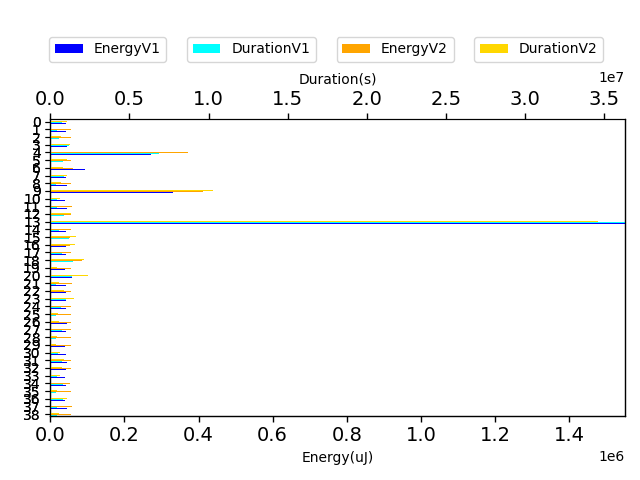

## com.google.gson.functional.ArrayTest

| Test | IterationV1 | IterationV2 | DeltaIteration |
| --- | --- | --- | --- |
| com.google.gson.functional.ArrayTest-testSingleStringArraySerialization | 11 | 15 | 4 |
| com.google.gson.functional.ArrayTest-testObjectArrayWithNonPrimitivesSerialization | 52 | 52 | 0 |
| com.google.gson.functional.ArrayTest-testMultidimenstionalArraysSerialization | 21 | 29 | 8 |
| com.google.gson.functional.ArrayTest-testArrayOfCollectionSerialization | 80 | 78 | -2 |
| com.google.gson.functional.ArrayTest-testArrayOfPrimitivesAsObjectsSerialization | 35 | 34 | -1 |
| com.google.gson.functional.ArrayTest-testArrayElementsAreArrays | 14 | 19 | 5 |
| com.google.gson.functional.ArrayTest-testNullsInArraySerialization | 15 | 14 | -1 |
| com.google.gson.functional.ArrayTest-testArrayOfStringsSerialization | 17 | 23 | 6 |
| com.google.gson.functional.ArrayTest-testEmptyArraySerialization | 10 | 9 | -1 |
| com.google.gson.functional.ArrayTest-testSingleNullInArraySerialization | 30 | 24 | -6 |
| com.google.gson.functional.ArrayTest-testMultiDimenstionalObjectArraysSerialization | 23 | 14 | -9 |
| com.google.gson.functional.ArrayTest-testMixingTypesInObjectArraySerialization | 18 | 13 | -5 |
| com.google.gson.functional.ArrayTest-testNullsInArrayWithSerializeNullPropertySetSerialization | 28 | 16 | -12 |
| com.google.gson.functional.ArrayTest-testTopLevelArrayOfIntsSerialization | 24 | 10 | -14 |
| com.google.gson.functional.ArrayTest-testArrayOfNullSerialization | 15 | 12 | -3 |

| Test | EnergyV1 | EnergyV2 | DeltaEnergy |
| --- | --- | --- | --- |
| com.google.gson.functional.ArrayTest-testSingleStringArraySerialization | 43673.75146484375 | 42538.036560058594 | -1135.7149047851562 |
| com.google.gson.functional.ArrayTest-testObjectArrayWithNonPrimitivesSerialization | 41988.46708247771 | 43348.41334141737 | 1359.9462589396571 |
| com.google.gson.functional.ArrayTest-testMultidimenstionalArraysSerialization | 40213.861760139465 | 43229.24033301324 | 3015.378572873771 |
| com.google.gson.functional.ArrayTest-testArrayOfCollectionSerialization | 64695.98884390791 | 42705.76836636795 | -21990.22047753996 |
| com.google.gson.functional.ArrayTest-testArrayOfPrimitivesAsObjectsSerialization | 57362.06007820557 | 66102.8378584577 | 8740.77778025213 |
| com.google.gson.functional.ArrayTest-testArrayElementsAreArrays | 40865.08801269531 | 41484.730922698975 | 619.6429100036621 |
| com.google.gson.functional.ArrayTest-testNullsInArraySerialization | 39307.17840576172 | 41565.60363769531 | 2258.4252319335938 |
| com.google.gson.functional.ArrayTest-testArrayOfStringsSerialization | 39406.2606048584 | 43509.08949136734 | 4102.828886508942 |
| com.google.gson.functional.ArrayTest-testEmptyArraySerialization | 37384.30078125 | 39875.46875 | 2491.16796875 |
| com.google.gson.functional.ArrayTest-testSingleNullInArraySerialization | 41299.7033976987 | 43316.217143535614 | 2016.5137458369136 |
| com.google.gson.functional.ArrayTest-testMultiDimenstionalObjectArraysSerialization | 40805.3198094368 | 41511.76379394531 | 706.4439845085144 |
| com.google.gson.functional.ArrayTest-testMixingTypesInObjectArraySerialization | 38029.85454559326 | 42390.15576171875 | 4360.301216125488 |
| com.google.gson.functional.ArrayTest-testNullsInArrayWithSerializeNullPropertySetSerialization | 57184.52406296134 | 41206.08435058594 | -15978.439712375402 |
| com.google.gson.functional.ArrayTest-testTopLevelArrayOfIntsSerialization | 65569.33292365074 | 43952.72265625 | -21616.61026740074 |
| com.google.gson.functional.ArrayTest-testArrayOfNullSerialization | 39521.88854980469 | 44354.57666015625 | 4832.6881103515625 |

| Test | DurationV1 | DurationsV2 | DeltaDuration |
| --- | --- | --- | --- |
| com.google.gson.functional.ArrayTest-testSingleStringArraySerialization | 310294.89111328125 | 323859.8001098633 | 13564.908996582031 |
| com.google.gson.functional.ArrayTest-testObjectArrayWithNonPrimitivesSerialization | 1324952.478617991 | 945487.0746729744 | -379465.4039450167 |
| com.google.gson.functional.ArrayTest-testMultidimenstionalArraysSerialization | 574126.1523199081 | 504025.22821155563 | -70100.92410835251 |
| com.google.gson.functional.ArrayTest-testArrayOfCollectionSerialization | 1669309.6265740418 | 1027205.290557568 | -642104.3360164738 |
| com.google.gson.functional.ArrayTest-testArrayOfPrimitivesAsObjectsSerialization | 1550559.5614663358 | 1463029.1345048924 | -87530.42696144339 |
| com.google.gson.functional.ArrayTest-testArrayElementsAreArrays | 416978.9210205078 | 477855.41665649414 | 60876.49563598633 |
| com.google.gson.functional.ArrayTest-testNullsInArraySerialization | 513118.1037597656 | 301140.80895996094 | -211977.2947998047 |
| com.google.gson.functional.ArrayTest-testArrayOfStringsSerialization | 461164.65870666504 | 386614.94934773445 | -74549.70935893059 |
| com.google.gson.functional.ArrayTest-testEmptyArraySerialization | 436719.9375 | 431039.3984375 | -5680.5390625 |
| com.google.gson.functional.ArrayTest-testSingleNullInArraySerialization | 773130.7364866007 | 541512.1230076551 | -231618.61347894557 |
| com.google.gson.functional.ArrayTest-testMultiDimenstionalObjectArraysSerialization | 444999.55281305313 | 454892.1452636719 | 9892.592450618744 |
| com.google.gson.functional.ArrayTest-testMixingTypesInObjectArraySerialization | 557976.3948364258 | 398251.2653808594 | -159725.1294555664 |
| com.google.gson.functional.ArrayTest-testNullsInArrayWithSerializeNullPropertySetSerialization | 1432608.3406707942 | 709287.463684082 | -723320.8769867122 |
| com.google.gson.functional.ArrayTest-testTopLevelArrayOfIntsSerialization | 2369710.796823621 | 356488.595703125 | -2013222.2011204958 |
| com.google.gson.functional.ArrayTest-testArrayOfNullSerialization | 476433.99884033203 | 361451.3447265625 | -114982.65411376953 |

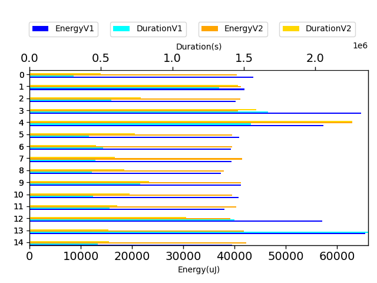

## com.google.gson.functional.JsonAdapterSerializerDeserializerTest

| Test | IterationV1 | IterationV2 | DeltaIteration |
| --- | --- | --- | --- |
| com.google.gson.functional.JsonAdapterSerializerDeserializerTest-testJsonSerializerDeserializerBasedJsonAdapterOnFields | 99 | 99 | 0 |
| com.google.gson.functional.JsonAdapterSerializerDeserializerTest-testDifferentJsonAdaptersForGenericFieldsOfSameRawType | 99 | 99 | 0 |
| com.google.gson.functional.JsonAdapterSerializerDeserializerTest-testJsonSerializerDeserializerBasedJsonAdapterOnClass | 92 | 92 | 0 |

| Test | EnergyV1 | EnergyV2 | DeltaEnergy |
| --- | --- | --- | --- |
| com.google.gson.functional.JsonAdapterSerializerDeserializerTest-testJsonSerializerDeserializerBasedJsonAdapterOnFields | 85988.59218147935 | 102594.78959191777 | 16606.197410438413 |
| com.google.gson.functional.JsonAdapterSerializerDeserializerTest-testDifferentJsonAdaptersForGenericFieldsOfSameRawType | 48730.15751824371 | 45040.85341217442 | -3689.304106069285 |
| com.google.gson.functional.JsonAdapterSerializerDeserializerTest-testJsonSerializerDeserializerBasedJsonAdapterOnClass | 56758.91208726943 | 43038.519202466516 | -13720.392884802917 |

| Test | DurationV1 | DurationsV2 | DeltaDuration |
| --- | --- | --- | --- |
| com.google.gson.functional.JsonAdapterSerializerDeserializerTest-testJsonSerializerDeserializerBasedJsonAdapterOnFields | 3102587.4155632257 | 2486086.1362785157 | -616501.2792847101 |
| com.google.gson.functional.JsonAdapterSerializerDeserializerTest-testDifferentJsonAdaptersForGenericFieldsOfSameRawType | 1481681.5676897285 | 1385425.7508162626 | -96255.8168734659 |
| com.google.gson.functional.JsonAdapterSerializerDeserializerTest-testJsonSerializerDeserializerBasedJsonAdapterOnClass | 1320836.522139077 | 1092500.7589216814 | -228335.76321739564 |

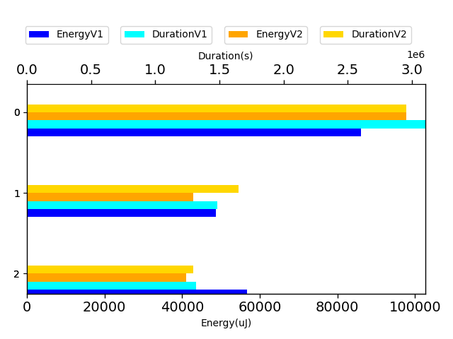

## com.google.gson.functional.ThrowableFunctionalTest

| Test | IterationV1 | IterationV2 | DeltaIteration |
| --- | --- | --- | --- |
| com.google.gson.functional.ThrowableFunctionalTest-testExceptionWithoutCause | 90 | 91 | 1 |
| com.google.gson.functional.ThrowableFunctionalTest-testSerializedNameOnExceptionFields | 96 | 96 | 0 |
| com.google.gson.functional.ThrowableFunctionalTest-testErrorWithoutCause | 67 | 69 | 2 |
| com.google.gson.functional.ThrowableFunctionalTest-testExceptionWithCause | 86 | 82 | -4 |
| com.google.gson.functional.ThrowableFunctionalTest-testErrornWithCause | 76 | 76 | 0 |

| Test | EnergyV1 | EnergyV2 | DeltaEnergy |
| --- | --- | --- | --- |
| com.google.gson.functional.ThrowableFunctionalTest-testExceptionWithoutCause | 44554.05056727945 | 98003.78979139958 | 53449.73922412013 |
| com.google.gson.functional.ThrowableFunctionalTest-testSerializedNameOnExceptionFields | 41550.966445343394 | 79425.31989014547 | 37874.35344480208 |
| com.google.gson.functional.ThrowableFunctionalTest-testErrorWithoutCause | 44325.48804933387 | 44252.459652119505 | -73.02839721436612 |
| com.google.gson.functional.ThrowableFunctionalTest-testExceptionWithCause | 43630.60940597941 | 61559.74098868115 | 17929.13158270174 |
| com.google.gson.functional.ThrowableFunctionalTest-testErrornWithCause | 40551.74889012099 | 47648.009619303644 | 7096.260729182657 |

| Test | DurationV1 | DurationsV2 | DeltaDuration |
| --- | --- | --- | --- |
| com.google.gson.functional.ThrowableFunctionalTest-testExceptionWithoutCause | 1024967.4052477923 | 3375091.2116708537 | 2350123.8064230615 |
| com.google.gson.functional.ThrowableFunctionalTest-testSerializedNameOnExceptionFields | 1166803.378702487 | 2036834.6876652017 | 870031.3089627146 |
| com.google.gson.functional.ThrowableFunctionalTest-testErrorWithoutCause | 772551.32025337 | 1218401.7126993774 | 445850.39244600746 |
| com.google.gson.functional.ThrowableFunctionalTest-testExceptionWithCause | 997844.6023022926 | 1531722.5543806658 | 533877.9520783732 |
| com.google.gson.functional.ThrowableFunctionalTest-testErrornWithCause | 822549.2887093206 | 1292317.3212479367 | 469768.0325386161 |

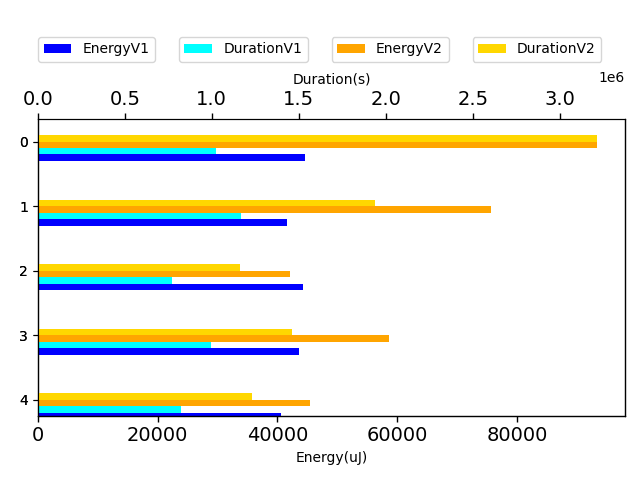

## com.google.gson.functional.NullObjectAndFieldTest

| Test | IterationV1 | IterationV2 | DeltaIteration |
| --- | --- | --- | --- |
| com.google.gson.functional.NullObjectAndFieldTest-testCustomTypeAdapterPassesNullSerialization | 39 | 43 | 4 |
| com.google.gson.functional.NullObjectAndFieldTest-testExplicitSerializationOfNullStringMembers | 34 | 28 | -6 |
| com.google.gson.functional.NullObjectAndFieldTest-testCustomSerializationOfNulls | 66 | 51 | -15 |
| com.google.gson.functional.NullObjectAndFieldTest-testExplicitSerializationOfNullArrayMembers | 83 | 80 | -3 |
| com.google.gson.functional.NullObjectAndFieldTest-testExplicitSerializationOfNullCollectionMembers | 41 | 37 | -4 |
| com.google.gson.functional.NullObjectAndFieldTest-testExplicitSerializationOfNulls | 37 | 39 | 2 |
| com.google.gson.functional.NullObjectAndFieldTest-testPrintPrintingObjectWithNulls | 48 | 54 | 6 |
| com.google.gson.functional.NullObjectAndFieldTest-testNullWrappedPrimitiveMemberSerialization | 38 | 53 | 15 |
| com.google.gson.functional.NullObjectAndFieldTest-testPrintPrintingArraysWithNulls | 25 | 22 | -3 |
| com.google.gson.functional.NullObjectAndFieldTest-testTopLevelNullObjectSerialization | 12 | 14 | 2 |

| Test | EnergyV1 | EnergyV2 | DeltaEnergy |
| --- | --- | --- | --- |
| com.google.gson.functional.NullObjectAndFieldTest-testCustomTypeAdapterPassesNullSerialization | 41421.94620193754 | 44162.69277859462 | 2740.746576657075 |
| com.google.gson.functional.NullObjectAndFieldTest-testExplicitSerializationOfNullStringMembers | 43051.32591740583 | 40547.84255410731 | -2503.4833632985246 |
| com.google.gson.functional.NullObjectAndFieldTest-testCustomSerializationOfNulls | 55284.624435428115 | 43868.070842631736 | -11416.55359279638 |
| com.google.gson.functional.NullObjectAndFieldTest-testExplicitSerializationOfNullArrayMembers | 41845.02693643872 | 38913.04387707193 | -2931.983059366794 |
| com.google.gson.functional.NullObjectAndFieldTest-testExplicitSerializationOfNullCollectionMembers | 43762.83667209071 | 41071.33326637055 | -2691.5034057201556 |
| com.google.gson.functional.NullObjectAndFieldTest-testExplicitSerializationOfNulls | 42781.721633504974 | 42971.72834505655 | 190.0067115515776 |
| com.google.gson.functional.NullObjectAndFieldTest-testPrintPrintingObjectWithNulls | 42716.21342469615 | 40436.04157588065 | -2280.171848815502 |
| com.google.gson.functional.NullObjectAndFieldTest-testNullWrappedPrimitiveMemberSerialization | 40666.856185974575 | 40312.16651958916 | -354.68966638541315 |
| com.google.gson.functional.NullObjectAndFieldTest-testPrintPrintingArraysWithNulls | 43854.235343039036 | 43947.630142211914 | 93.39479917287827 |
| com.google.gson.functional.NullObjectAndFieldTest-testTopLevelNullObjectSerialization | 44725.52783203125 | 42648.40234375 | -2077.12548828125 |

| Test | DurationV1 | DurationsV2 | DeltaDuration |
| --- | --- | --- | --- |
| com.google.gson.functional.NullObjectAndFieldTest-testCustomTypeAdapterPassesNullSerialization | 806497.7892961754 | 580165.52329714 | -226332.26599903533 |
| com.google.gson.functional.NullObjectAndFieldTest-testExplicitSerializationOfNullStringMembers | 460160.5660511585 | 730879.8899549246 | 270719.3239037661 |
| com.google.gson.functional.NullObjectAndFieldTest-testCustomSerializationOfNulls | 845196.9257936551 | 590340.9444015315 | -254855.98139212362 |
| com.google.gson.functional.NullObjectAndFieldTest-testExplicitSerializationOfNullArrayMembers | 913556.8434790773 | 1034399.5043386524 | 120842.66085957503 |
| com.google.gson.functional.NullObjectAndFieldTest-testExplicitSerializationOfNullCollectionMembers | 709011.0023056092 | 561966.8151517841 | -147044.18715382507 |
| com.google.gson.functional.NullObjectAndFieldTest-testExplicitSerializationOfNulls | 596321.6250786302 | 486153.3477954759 | -110168.27728315425 |
| com.google.gson.functional.NullObjectAndFieldTest-testPrintPrintingObjectWithNulls | 880029.7633714026 | 779412.8916789552 | -100616.87169244746 |
| com.google.gson.functional.NullObjectAndFieldTest-testNullWrappedPrimitiveMemberSerialization | 655307.9221134884 | 569291.9934652683 | -86015.92864822014 |
| com.google.gson.functional.NullObjectAndFieldTest-testPrintPrintingArraysWithNulls | 490750.2082295418 | 397269.7116045952 | -93480.4966249466 |
| com.google.gson.functional.NullObjectAndFieldTest-testTopLevelNullObjectSerialization | 550549.6118164062 | 387997.1364746094 | -162552.47534179688 |

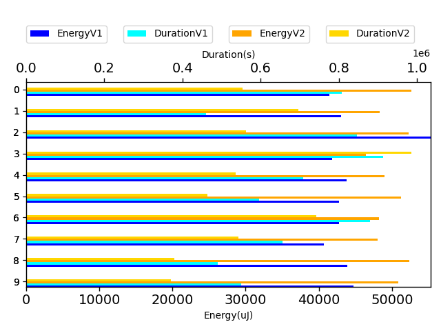

## com.google.gson.functional.MapTest

| Test | IterationV1 | IterationV2 | DeltaIteration |
| --- | --- | --- | --- |
| com.google.gson.functional.MapTest-testWriteMapsWithEmptyStringKey | 10 | 17 | 7 |
| com.google.gson.functional.MapTest-testInterfaceTypeMapWithSerializer | 99 | 97 | -2 |
| com.google.gson.functional.MapTest-testComplexKeysSerialization | 73 | 71 | -2 |
| com.google.gson.functional.MapTest-testMapSerializationWithIntegerKeys | 52 | 65 | 13 |
| com.google.gson.functional.MapTest-testCustomSerializerForSpecificMapType | 59 | 61 | 2 |
| com.google.gson.functional.MapTest-testGeneralMapField | 59 | 58 | -1 |
| com.google.gson.functional.MapTest-testInterfaceTypeMap | 96 | 97 | 1 |
| com.google.gson.functional.MapTest-testMapSerializationWithWildcardValues | 63 | 66 | 3 |
| com.google.gson.functional.MapTest-testSerializeMapOfMaps | 51 | 49 | -2 |
| com.google.gson.functional.MapTest-testParameterizedMapSubclassSerialization | 99 | 99 | 0 |
| com.google.gson.functional.MapTest-testMapSerialization | 52 | 54 | 2 |
| com.google.gson.functional.MapTest-testConcurrentHashMap | 52 | 62 | 10 |
| com.google.gson.functional.MapTest-testMapOfMapSerialization | 15 | 24 | 9 |
| com.google.gson.functional.MapTest-testMapSubclassSerialization | 32 | 32 | 0 |
| com.google.gson.functional.MapTest-testConcurrentMap | 90 | 92 | 2 |
| com.google.gson.functional.MapTest-testConcurrentNavigableMap | 99 | 99 | 0 |
| com.google.gson.functional.MapTest-testMapSerializationWithNullKey | 41 | 56 | 15 |
| com.google.gson.functional.MapTest-testSerializeMaps | 51 | 61 | 10 |
| com.google.gson.functional.MapTest-testMapSerializationWithNullValues | 73 | 63 | -10 |
| com.google.gson.functional.MapTest-testConcurrentSkipListMap | 59 | 62 | 3 |
| com.google.gson.functional.MapTest-testMapSerializationEmpty | 48 | 55 | 7 |
| com.google.gson.functional.MapTest-testMapSerializationWithNullValuesSerialized | 38 | 34 | -4 |
| com.google.gson.functional.MapTest-testMapSerializationWithNullValueButSerializeNulls | 48 | 41 | -7 |
| com.google.gson.functional.MapTest-testMapSerializationWithNullValue | 39 | 48 | 9 |
| com.google.gson.functional.MapTest-testMapWithQuotes | 21 | 25 | 4 |
| com.google.gson.functional.MapTest-testRawMapSerialization | 29 | 21 | -8 |

| Test | EnergyV1 | EnergyV2 | DeltaEnergy |
| --- | --- | --- | --- |
| com.google.gson.functional.MapTest-testWriteMapsWithEmptyStringKey | 40112.8994140625 | 41835.17222595215 | 1722.2728118896484 |
| com.google.gson.functional.MapTest-testInterfaceTypeMapWithSerializer | 65351.94150487455 | 98848.9138610209 | 33496.972356146354 |
| com.google.gson.functional.MapTest-testComplexKeysSerialization | 40923.038033622135 | 44205.11778821751 | 3282.0797545953756 |
| com.google.gson.functional.MapTest-testMapSerializationWithIntegerKeys | 42167.481931229544 | 40000.29693848089 | -2167.1849927486546 |
| com.google.gson.functional.MapTest-testCustomSerializerForSpecificMapType | 40148.26107934469 | 64243.03316168713 | 24094.772082342446 |
| com.google.gson.functional.MapTest-testGeneralMapField | 41707.95456490219 | 45670.25509947129 | 3962.300534569098 |
| com.google.gson.functional.MapTest-testInterfaceTypeMap | 54048.251164515415 | 157180.31137090042 | 103132.06020638501 |
| com.google.gson.functional.MapTest-testMapSerializationWithWildcardValues | 43721.542865509204 | 45995.727481614274 | 2274.1846161050707 |
| com.google.gson.functional.MapTest-testSerializeMapOfMaps | 43620.832639155065 | 43582.44597993499 | -38.38665922007203 |
| com.google.gson.functional.MapTest-testParameterizedMapSubclassSerialization | 64561.65413656932 | 51641.74721211194 | -12919.906924457377 |
| com.google.gson.functional.MapTest-testMapSerialization | 43158.61960142978 | 42009.73540644718 | -1148.884194982602 |
| com.google.gson.functional.MapTest-testConcurrentHashMap | 43603.920883170635 | 42917.58606154729 | -686.3348216233426 |
| com.google.gson.functional.MapTest-testMapOfMapSerialization | 42027.361572265625 | 44359.96489226818 | 2332.603320002556 |
| com.google.gson.functional.MapTest-testMapSubclassSerialization | 37910.831280742306 | 42362.2661989769 | 4451.43491823459 |
| com.google.gson.functional.MapTest-testConcurrentMap | 42347.851833635614 | 41856.08647439658 | -491.7653592390343 |
| com.google.gson.functional.MapTest-testConcurrentNavigableMap | 122135.81516268088 | 169440.65381269867 | 47304.83865001779 |
| com.google.gson.functional.MapTest-testMapSerializationWithNullKey | 41685.572699439195 | 43038.3159426866 | 1352.7432432474016 |
| com.google.gson.functional.MapTest-testSerializeMaps | 42139.54453087113 | 44046.079547372996 | 1906.535016501868 |
| com.google.gson.functional.MapTest-testMapSerializationWithNullValues | 43078.66508677116 | 69426.31133204383 | 26347.64624527267 |
| com.google.gson.functional.MapTest-testConcurrentSkipListMap | 43396.13243317512 | 40991.110054245895 | -2405.0223789292213 |
| com.google.gson.functional.MapTest-testMapSerializationEmpty | 41817.93583865366 | 39721.9102120079 | -2096.0256266457654 |
| com.google.gson.functional.MapTest-testMapSerializationWithNullValuesSerialized | 40254.31961721366 | 43370.45373820746 | 3116.1341209938037 |
| com.google.gson.functional.MapTest-testMapSerializationWithNullValueButSerializeNulls | 41779.0629523018 | 40037.25272195885 | -1741.8102303429478 |
| com.google.gson.functional.MapTest-testMapSerializationWithNullValue | 43230.49174011742 | 42384.93329528875 | -845.5584448286681 |
| com.google.gson.functional.MapTest-testMapWithQuotes | 40488.79132080078 | 43375.092174232006 | 2886.300853431225 |
| com.google.gson.functional.MapTest-testRawMapSerialization | 41782.27813184634 | 43670.64912033081 | 1888.370988484472 |

| Test | DurationV1 | DurationsV2 | DeltaDuration |
| --- | --- | --- | --- |
| com.google.gson.functional.MapTest-testWriteMapsWithEmptyStringKey | 486891.5634765625 | 482237.33514404297 | -4654.228332519531 |
| com.google.gson.functional.MapTest-testInterfaceTypeMapWithSerializer | 1347611.811055853 | 2376473.3132533766 | 1028861.5021975236 |
| com.google.gson.functional.MapTest-testComplexKeysSerialization | 839036.2072497424 | 1105830.6386160771 | 266794.4313663348 |
| com.google.gson.functional.MapTest-testMapSerializationWithIntegerKeys | 710500.537721695 | 1011631.0413139065 | 301130.5035922115 |
| com.google.gson.functional.MapTest-testCustomSerializerForSpecificMapType | 841633.6193302611 | 1509773.2977693994 | 668139.6784391382 |
| com.google.gson.functional.MapTest-testGeneralMapField | 781825.939026004 | 1007897.9345496148 | 226071.99552361073 |
| com.google.gson.functional.MapTest-testInterfaceTypeMap | 1613261.9681094177 | 3991968.3995589144 | 2378706.4314494967 |
| com.google.gson.functional.MapTest-testMapSerializationWithWildcardValues | 805378.5980277142 | 1256577.4060446885 | 451198.80801697436 |
| com.google.gson.functional.MapTest-testSerializeMapOfMaps | 650331.8038680181 | 746726.3344262156 | 96394.53055819753 |
| com.google.gson.functional.MapTest-testParameterizedMapSubclassSerialization | 1449196.2637305441 | 1690826.7336888849 | 241630.46995834075 |
| com.google.gson.functional.MapTest-testMapSerialization | 814972.9930828192 | 901586.8883489838 | 86613.89526616468 |
| com.google.gson.functional.MapTest-testConcurrentHashMap | 809892.2294629486 | 765403.4881800016 | -44488.74128294701 |
| com.google.gson.functional.MapTest-testMapOfMapSerialization | 369233.2109680176 | 457970.37633633614 | 88737.16536831856 |
| com.google.gson.functional.MapTest-testMapSubclassSerialization | 488627.4492122617 | 497860.1630061674 | 9232.713793905685 |
| com.google.gson.functional.MapTest-testConcurrentMap | 1012799.6539015367 | 1318203.644550237 | 305403.9906487004 |
| com.google.gson.functional.MapTest-testConcurrentNavigableMap | 3435436.1887711734 | 4234243.601546183 | 798807.4127750099 |
| com.google.gson.functional.MapTest-testMapSerializationWithNullKey | 588850.5655151824 | 887616.7870635347 | 298766.2215483523 |
| com.google.gson.functional.MapTest-testSerializeMaps | 640801.6303771919 | 1113483.0958102797 | 472681.4654330878 |
| com.google.gson.functional.MapTest-testMapSerializationWithNullValues | 1011297.0069025434 | 1637335.4257081551 | 626038.4188056118 |
| com.google.gson.functional.MapTest-testConcurrentSkipListMap | 806748.3287495838 | 825805.2298151318 | 19056.90106554795 |
| com.google.gson.functional.MapTest-testMapSerializationEmpty | 658830.195807348 | 713808.3586086942 | 54978.16280134616 |
| com.google.gson.functional.MapTest-testMapSerializationWithNullValuesSerialized | 477386.9655098461 | 651175.2703344773 | 173788.3048246312 |
| com.google.gson.functional.MapTest-testMapSerializationWithNullValueButSerializeNulls | 597024.1191884507 | 816515.810347977 | 219491.69115952624 |
| com.google.gson.functional.MapTest-testMapSerializationWithNullValue | 562981.3378202957 | 748169.0166401111 | 185187.6788198154 |
| com.google.gson.functional.MapTest-testMapWithQuotes | 479161.85635852814 | 512420.35607659817 | 33258.49971807003 |
| com.google.gson.functional.MapTest-testRawMapSerialization | 400669.52214290947 | 479940.7870721817 | 79271.26492927223 |

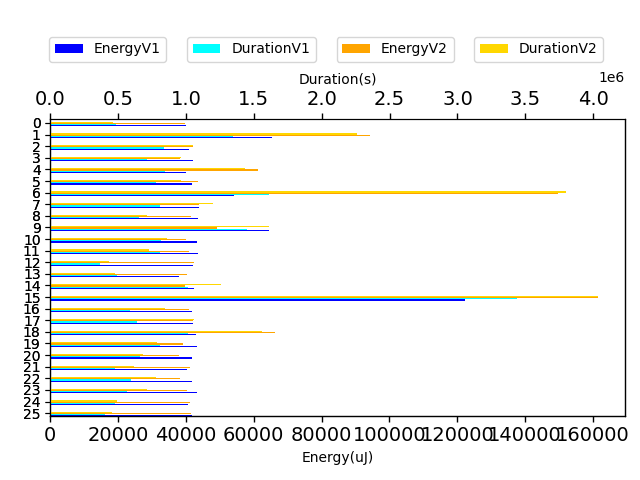

## com.google.gson.functional.ParameterizedTypesTest

| Test | IterationV1 | IterationV2 | DeltaIteration |
| --- | --- | --- | --- |
| com.google.gson.functional.ParameterizedTypesTest-testParameterizedTypeGenericArraysSerialization | 79 | 82 | 3 |
| com.google.gson.functional.ParameterizedTypesTest-testVariableTypeArrayDeserialization | 80 | 89 | 9 |
| com.google.gson.functional.ParameterizedTypesTest-testParameterizedTypeWithCustomSerializer | 92 | 85 | -7 |
| com.google.gson.functional.ParameterizedTypesTest-testParameterizedTypesSerialization | 98 | 99 | 1 |
| com.google.gson.functional.ParameterizedTypesTest-testVariableTypeDeserialization | 82 | 82 | 0 |
| com.google.gson.functional.ParameterizedTypesTest-testVariableTypeFieldsAndGenericArraysSerialization | 99 | 99 | 0 |
| com.google.gson.functional.ParameterizedTypesTest-testParameterizedTypeGenericArraysDeserialization | 82 | 83 | 1 |
| com.google.gson.functional.ParameterizedTypesTest-testVariableTypeFieldsAndGenericArraysDeserialization | 93 | 93 | 0 |
| com.google.gson.functional.ParameterizedTypesTest-testTypesWithMultipleParametersSerialization | 99 | 99 | 0 |
| com.google.gson.functional.ParameterizedTypesTest-testParameterizedTypeWithVariableTypeDeserialization | 83 | 93 | 10 |
| com.google.gson.functional.ParameterizedTypesTest-testParameterizedTypesWithWriterSerialization | 52 | 59 | 7 |
| com.google.gson.functional.ParameterizedTypesTest-testDeepParameterizedTypeSerialization | 38 | 41 | 3 |

| Test | EnergyV1 | EnergyV2 | DeltaEnergy |
| --- | --- | --- | --- |
| com.google.gson.functional.ParameterizedTypesTest-testParameterizedTypeGenericArraysSerialization | 42941.48059322688 | 43575.1974641559 | 633.7168709290199 |
| com.google.gson.functional.ParameterizedTypesTest-testVariableTypeArrayDeserialization | 58233.802328153084 | 42257.1987386806 | -15976.603589472485 |
| com.google.gson.functional.ParameterizedTypesTest-testParameterizedTypeWithCustomSerializer | 44866.9215922353 | 45093.08206666485 | 226.16047442954732 |
| com.google.gson.functional.ParameterizedTypesTest-testParameterizedTypesSerialization | 69854.37311056536 | 63510.25846631526 | -6344.114644250098 |
| com.google.gson.functional.ParameterizedTypesTest-testVariableTypeDeserialization | 55330.545716082706 | 46566.4687166386 | -8764.076999444107 |
| com.google.gson.functional.ParameterizedTypesTest-testVariableTypeFieldsAndGenericArraysSerialization | 96009.69946537442 | 63044.92519317973 | -32964.774272194685 |
| com.google.gson.functional.ParameterizedTypesTest-testParameterizedTypeGenericArraysDeserialization | 44483.20578757224 | 46237.308821779974 | 1754.1030342077356 |
| com.google.gson.functional.ParameterizedTypesTest-testVariableTypeFieldsAndGenericArraysDeserialization | 56081.134033197406 | 47126.52076704435 | -8954.613266153057 |
| com.google.gson.functional.ParameterizedTypesTest-testTypesWithMultipleParametersSerialization | 95457.343006994 | 81215.42101031388 | -14241.921996680117 |
| com.google.gson.functional.ParameterizedTypesTest-testParameterizedTypeWithVariableTypeDeserialization | 56866.88017224228 | 43162.74189059173 | -13704.13828165055 |
| com.google.gson.functional.ParameterizedTypesTest-testParameterizedTypesWithWriterSerialization | 44186.42180345868 | 42535.770624392 | -1650.6511790666846 |
| com.google.gson.functional.ParameterizedTypesTest-testDeepParameterizedTypeSerialization | 41839.46000611845 | 43554.50299187728 | 1715.0429857588315 |

| Test | DurationV1 | DurationsV2 | DeltaDuration |
| --- | --- | --- | --- |
| com.google.gson.functional.ParameterizedTypesTest-testParameterizedTypeGenericArraysSerialization | 1350582.6501792625 | 1135648.7278078885 | -214933.92237137398 |
| com.google.gson.functional.ParameterizedTypesTest-testVariableTypeArrayDeserialization | 1293415.1056126745 | 1159025.4867847068 | -134389.61882796767 |
| com.google.gson.functional.ParameterizedTypesTest-testParameterizedTypeWithCustomSerializer | 1137217.2333795142 | 1093579.7525269124 | -43637.48085260182 |
| com.google.gson.functional.ParameterizedTypesTest-testParameterizedTypesSerialization | 1868705.1371487987 | 1726052.6230247833 | -142652.51412401535 |
| com.google.gson.functional.ParameterizedTypesTest-testVariableTypeDeserialization | 1263983.9092618255 | 1179593.399268712 | -84390.50999311358 |
| com.google.gson.functional.ParameterizedTypesTest-testVariableTypeFieldsAndGenericArraysSerialization | 2131307.640673699 | 1899874.473397468 | -231433.16727623087 |
| com.google.gson.functional.ParameterizedTypesTest-testParameterizedTypeGenericArraysDeserialization | 1298751.5715721278 | 1268138.9970627804 | -30612.574509347323 |
| com.google.gson.functional.ParameterizedTypesTest-testVariableTypeFieldsAndGenericArraysDeserialization | 1504901.9853600692 | 1352283.098011483 | -152618.88734858623 |
| com.google.gson.functional.ParameterizedTypesTest-testTypesWithMultipleParametersSerialization | 2101163.9135216186 | 2027331.1489401383 | -73832.7645814803 |
| com.google.gson.functional.ParameterizedTypesTest-testParameterizedTypeWithVariableTypeDeserialization | 1318497.0752124179 | 1080889.3193793907 | -237607.7558330272 |
| com.google.gson.functional.ParameterizedTypesTest-testParameterizedTypesWithWriterSerialization | 789365.8689513761 | 770086.2299467311 | -19279.639004644938 |
| com.google.gson.functional.ParameterizedTypesTest-testDeepParameterizedTypeSerialization | 468255.16400378925 | 569627.8394842425 | 101372.67548045324 |

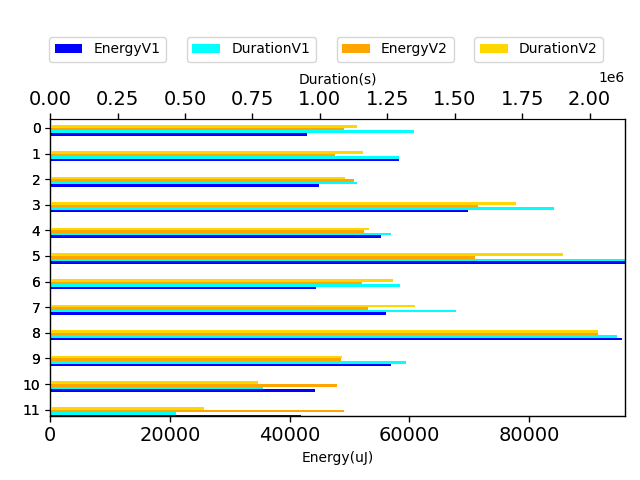

## com.google.gson.functional.CircularReferenceTest

| Test | IterationV1 | IterationV2 | DeltaIteration |
| --- | --- | --- | --- |
| com.google.gson.functional.CircularReferenceTest-testCircularSerialization | 99 | 99 | 0 |
| com.google.gson.functional.CircularReferenceTest-testSelfReferenceArrayFieldSerialization | 99 | 99 | 0 |
| com.google.gson.functional.CircularReferenceTest-testSelfReferenceIgnoredInSerialization | 26 | 33 | 7 |
| com.google.gson.functional.CircularReferenceTest-testSelfReferenceCustomHandlerSerialization | 99 | 99 | 0 |
| com.google.gson.functional.CircularReferenceTest-testDirectedAcyclicGraphSerialization | 34 | 37 | 3 |

| Test | EnergyV1 | EnergyV2 | DeltaEnergy |
| --- | --- | --- | --- |
| com.google.gson.functional.CircularReferenceTest-testCircularSerialization | 284575.9406529622 | 281737.19910540525 | -2838.7415475569433 |
| com.google.gson.functional.CircularReferenceTest-testSelfReferenceArrayFieldSerialization | 211351.11096981028 | 187713.28336256623 | -23637.82760724405 |
| com.google.gson.functional.CircularReferenceTest-testSelfReferenceIgnoredInSerialization | 43121.544311240315 | 42388.62340195058 | -732.9209092897363 |
| com.google.gson.functional.CircularReferenceTest-testSelfReferenceCustomHandlerSerialization | 235147.43865767267 | 238352.0691216724 | 3204.630463999725 |
| com.google.gson.functional.CircularReferenceTest-testDirectedAcyclicGraphSerialization | 42187.20349126833 | 42093.12357588639 | -94.07991538193892 |

| Test | DurationV1 | DurationsV2 | DeltaDuration |
| --- | --- | --- | --- |
| com.google.gson.functional.CircularReferenceTest-testCircularSerialization | 6621131.043871386 | 6844541.212383608 | 223410.16851222236 |
| com.google.gson.functional.CircularReferenceTest-testSelfReferenceArrayFieldSerialization | 4742605.576875437 | 4646523.610381605 | -96081.96649383195 |
| com.google.gson.functional.CircularReferenceTest-testSelfReferenceIgnoredInSerialization | 568408.5114641637 | 1011846.4743124559 | 443437.9628482922 |
| com.google.gson.functional.CircularReferenceTest-testSelfReferenceCustomHandlerSerialization | 5394842.80929051 | 6438718.857485036 | 1043876.0481945267 |
| com.google.gson.functional.CircularReferenceTest-testDirectedAcyclicGraphSerialization | 546618.7135650666 | 599397.9007431841 | 52779.18717811757 |

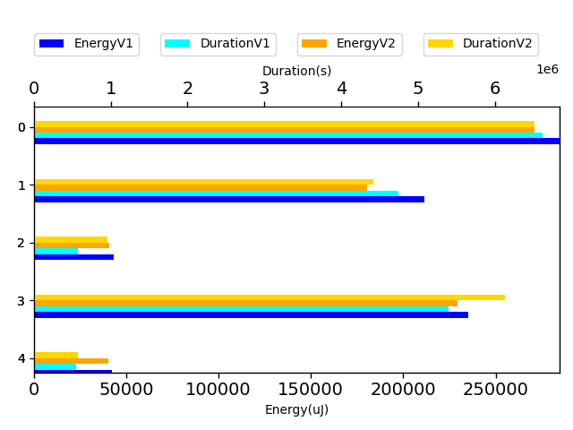

## com.google.gson.functional.ReadersWritersTest

| Test | IterationV1 | IterationV2 | DeltaIteration |
| --- | --- | --- | --- |
| com.google.gson.functional.ReadersWritersTest-testReadWriteTwoObjects | 61 | 64 | 3 |
| com.google.gson.functional.ReadersWritersTest-testReadWriteTwoStrings | 64 | 70 | 6 |
| com.google.gson.functional.ReadersWritersTest-testWriterForSerialization | 31 | 44 | 13 |

| Test | EnergyV1 | EnergyV2 | DeltaEnergy |
| --- | --- | --- | --- |
| com.google.gson.functional.ReadersWritersTest-testReadWriteTwoObjects | 45602.997705956936 | 42956.66389604 | -2646.333809916934 |
| com.google.gson.functional.ReadersWritersTest-testReadWriteTwoStrings | 65405.9741566921 | 45797.77067220947 | -19608.203484482627 |
| com.google.gson.functional.ReadersWritersTest-testWriterForSerialization | 51085.79210916255 | 49091.653107287864 | -1994.1390018746824 |

| Test | DurationV1 | DurationsV2 | DeltaDuration |
| --- | --- | --- | --- |
| com.google.gson.functional.ReadersWritersTest-testReadWriteTwoObjects | 1068324.837612924 | 762028.3368238566 | -306296.50078906736 |
| com.google.gson.functional.ReadersWritersTest-testReadWriteTwoStrings | 1584903.3485055505 | 1277158.5314985104 | -307744.81700704014 |
| com.google.gson.functional.ReadersWritersTest-testWriterForSerialization | 1570323.22623696 | 683840.7562155497 | -886482.4700214103 |

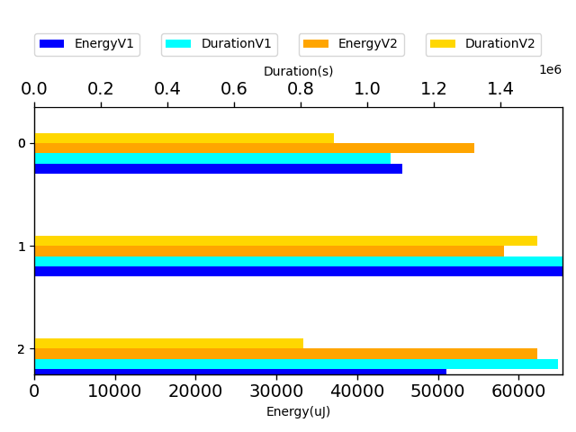

## com.google.gson.functional.ExposeFieldsTest

| Test | IterationV1 | IterationV2 | DeltaIteration |
| --- | --- | --- | --- |
| com.google.gson.functional.ExposeFieldsTest-testNullExposeFieldSerialization | 98 | 99 | 1 |
| com.google.gson.functional.ExposeFieldsTest-testNoExposedFieldSerialization | 55 | 57 | 2 |
| com.google.gson.functional.ExposeFieldsTest-testExposedInterfaceFieldSerialization | 94 | 88 | -6 |
| com.google.gson.functional.ExposeFieldsTest-testArrayWithOneNullExposeFieldObjectSerialization | 43 | 42 | -1 |
| com.google.gson.functional.ExposeFieldsTest-testExposeAnnotationSerialization | 28 | 26 | -2 |

| Test | EnergyV1 | EnergyV2 | DeltaEnergy |
| --- | --- | --- | --- |
| com.google.gson.functional.ExposeFieldsTest-testNullExposeFieldSerialization | 93518.10272573309 | 93931.94930400167 | 413.84657826858165 |
| com.google.gson.functional.ExposeFieldsTest-testNoExposedFieldSerialization | 42502.821814154304 | 38614.020532009316 | -3888.8012821449884 |
| com.google.gson.functional.ExposeFieldsTest-testExposedInterfaceFieldSerialization | 46347.81275721628 | 42452.7581075961 | -3895.0546496201787 |
| com.google.gson.functional.ExposeFieldsTest-testArrayWithOneNullExposeFieldObjectSerialization | 46135.33639999469 | 39553.59241476192 | -6581.743985232766 |
| com.google.gson.functional.ExposeFieldsTest-testExposeAnnotationSerialization | 41033.5031799376 | 42537.59448945522 | 1504.091309517622 |

| Test | DurationV1 | DurationsV2 | DeltaDuration |
| --- | --- | --- | --- |
| com.google.gson.functional.ExposeFieldsTest-testNullExposeFieldSerialization | 2760565.5226656985 | 2661683.5144370515 | -98882.00822864706 |
| com.google.gson.functional.ExposeFieldsTest-testNoExposedFieldSerialization | 891144.2223350316 | 696488.0337642392 | -194656.18857079244 |
| com.google.gson.functional.ExposeFieldsTest-testExposedInterfaceFieldSerialization | 1218274.898272529 | 1063541.6977837083 | -154733.20048882067 |
| com.google.gson.functional.ExposeFieldsTest-testArrayWithOneNullExposeFieldObjectSerialization | 765821.1572436121 | 616732.3065143782 | -149088.85072923393 |
| com.google.gson.functional.ExposeFieldsTest-testExposeAnnotationSerialization | 655014.2940811589 | 479636.4707417488 | -175377.82333941013 |

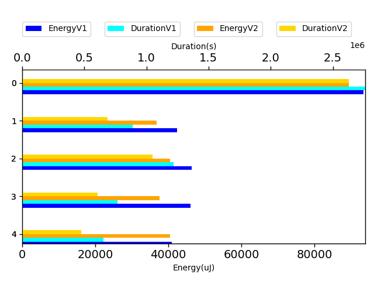

## com.google.gson.functional.CollectionTest

| Test | IterationV1 | IterationV2 | DeltaIteration |
| --- | --- | --- | --- |
| com.google.gson.functional.CollectionTest-testRawCollectionSerialization | 43 | 41 | -2 |
| com.google.gson.functional.CollectionTest-testStack | 98 | 99 | 1 |
| com.google.gson.functional.CollectionTest-testPriorityQueue | 96 | 99 | 3 |
| com.google.gson.functional.CollectionTest-testNullsInListSerialization | 39 | 45 | 6 |
| com.google.gson.functional.CollectionTest-testWildcardPrimitiveCollectionSerilaization | 69 | 70 | 1 |
| com.google.gson.functional.CollectionTest-testQueueSerialization | 65 | 62 | -3 |
| com.google.gson.functional.CollectionTest-testUserCollectionTypeAdapter | 75 | 76 | 1 |
| com.google.gson.functional.CollectionTest-testWildcardCollectionField | 87 | 90 | 3 |
| com.google.gson.functional.CollectionTest-testLinkedListSerialization | 65 | 61 | -4 |
| com.google.gson.functional.CollectionTest-testCollectionOfObjectSerialization | 55 | 50 | -5 |
| com.google.gson.functional.CollectionTest-testRawCollectionOfIntegersSerialization | 30 | 29 | -1 |
| com.google.gson.functional.CollectionTest-testSetSerialization | 68 | 71 | 3 |
| com.google.gson.functional.CollectionTest-testTopLevelCollectionOfIntegersSerialization | 60 | 49 | -11 |
| com.google.gson.functional.CollectionTest-testFieldIsArrayList | 79 | 78 | -1 |
| com.google.gson.functional.CollectionTest-testCollectionOfBagOfPrimitivesSerialization | 50 | 40 | -10 |
| com.google.gson.functional.CollectionTest-testVector | 60 | 60 | 0 |
| com.google.gson.functional.CollectionTest-testCollectionOfObjectWithNullSerialization | 63 | 47 | -16 |
| com.google.gson.functional.CollectionTest-testCollectionOfStringsSerialization | 19 | 24 | 5 |

| Test | EnergyV1 | EnergyV2 | DeltaEnergy |
| --- | --- | --- | --- |
| com.google.gson.functional.CollectionTest-testRawCollectionSerialization | 43189.59113367146 | 42548.09980272782 | -641.4913309436452 |
| com.google.gson.functional.CollectionTest-testStack | 39847.9962711803 | 43719.18093931215 | 3871.1846681318493 |
| com.google.gson.functional.CollectionTest-testPriorityQueue | 55872.59618259315 | 44854.05605708151 | -11018.540125511645 |
| com.google.gson.functional.CollectionTest-testNullsInListSerialization | 41125.918828084585 | 41552.40997678722 | 426.4911487026329 |
| com.google.gson.functional.CollectionTest-testWildcardPrimitiveCollectionSerilaization | 47046.608062597894 | 42331.66819395971 | -4714.939868638183 |
| com.google.gson.functional.CollectionTest-testQueueSerialization | 59594.95043507746 | 44788.87925465566 | -14806.0711804218 |
| com.google.gson.functional.CollectionTest-testUserCollectionTypeAdapter | 39027.578692584095 | 42214.546699725965 | 3186.9680071418697 |
| com.google.gson.functional.CollectionTest-testWildcardCollectionField | 53236.25189378584 | 44049.705309387224 | -9186.546584398617 |
| com.google.gson.functional.CollectionTest-testLinkedListSerialization | 40431.165618007595 | 44899.72999210683 | 4468.564374099238 |
| com.google.gson.functional.CollectionTest-testCollectionOfObjectSerialization | 42040.4090417027 | 44561.40015353754 | 2520.9911118348464 |
| com.google.gson.functional.CollectionTest-testRawCollectionOfIntegersSerialization | 46421.049162365496 | 43146.65057237446 | -3274.398589991033 |
| com.google.gson.functional.CollectionTest-testSetSerialization | 52115.400766700885 | 43563.89870424541 | -8551.502062455475 |
| com.google.gson.functional.CollectionTest-testTopLevelCollectionOfIntegersSerialization | 41615.50359085421 | 41830.86233714975 | 215.3587462955402 |
| com.google.gson.functional.CollectionTest-testFieldIsArrayList | 39994.29904260844 | 44421.58131153524 | 4427.2822689268 |
| com.google.gson.functional.CollectionTest-testCollectionOfBagOfPrimitivesSerialization | 42075.98795223443 | 41934.71541153245 | -141.27254070197523 |
| com.google.gson.functional.CollectionTest-testVector | 42290.203580153306 | 42261.74419682147 | -28.459383331835852 |
| com.google.gson.functional.CollectionTest-testCollectionOfObjectWithNullSerialization | 42603.54886950069 | 44328.01900408638 | 1724.4701345856884 |
| com.google.gson.functional.CollectionTest-testCollectionOfStringsSerialization | 39903.198276519775 | 44014.90987575054 | 4111.711599230766 |

| Test | DurationV1 | DurationsV2 | DeltaDuration |
| --- | --- | --- | --- |
| com.google.gson.functional.CollectionTest-testRawCollectionSerialization | 777626.579145461 | 483844.92650732625 | -293781.6526381347 |
| com.google.gson.functional.CollectionTest-testStack | 1368805.316521227 | 1330575.2404169918 | -38230.07610423514 |
| com.google.gson.functional.CollectionTest-testPriorityQueue | 1658439.4581391867 | 1415005.8381333859 | -243433.62000580085 |
| com.google.gson.functional.CollectionTest-testNullsInListSerialization | 1053170.7259193445 | 628691.7417634319 | -424478.98415591253 |
| com.google.gson.functional.CollectionTest-testWildcardPrimitiveCollectionSerilaization | 1209280.7874106085 | 919641.1818098028 | -289639.6056008057 |
| com.google.gson.functional.CollectionTest-testQueueSerialization | 1439849.3988761979 | 895283.669318165 | -544565.7295580328 |
| com.google.gson.functional.CollectionTest-testUserCollectionTypeAdapter | 1343950.0439108596 | 888207.7743622686 | -455742.269548591 |
| com.google.gson.functional.CollectionTest-testWildcardCollectionField | 1317100.4269112132 | 1142913.4783102828 | -174186.9486009304 |
| com.google.gson.functional.CollectionTest-testLinkedListSerialization | 1180546.332224618 | 813089.471671449 | -367456.8605531689 |
| com.google.gson.functional.CollectionTest-testCollectionOfObjectSerialization | 1198970.4922623453 | 727797.1580260352 | -471173.3342363101 |
| com.google.gson.functional.CollectionTest-testRawCollectionOfIntegersSerialization | 545755.0549793877 | 407404.2577853687 | -138350.79719401896 |
| com.google.gson.functional.CollectionTest-testSetSerialization | 1169642.2761626304 | 750631.5254645728 | -419010.7506980576 |
| com.google.gson.functional.CollectionTest-testTopLevelCollectionOfIntegersSerialization | 979443.911998491 | 619824.5893949368 | -359619.32260355423 |
| com.google.gson.functional.CollectionTest-testFieldIsArrayList | 998578.0996439101 | 712787.7257226959 | -285790.37392121414 |
| com.google.gson.functional.CollectionTest-testCollectionOfBagOfPrimitivesSerialization | 760301.9479015071 | 651392.4579256293 | -108909.4899758778 |
| com.google.gson.functional.CollectionTest-testVector | 1260454.1763620672 | 777502.9266691618 | -482951.24969290546 |
| com.google.gson.functional.CollectionTest-testCollectionOfObjectWithNullSerialization | 889180.6008803629 | 721375.0248928685 | -167805.57598749443 |
| com.google.gson.functional.CollectionTest-testCollectionOfStringsSerialization | 696612.2203483582 | 454221.04584908485 | -242391.1744992733 |

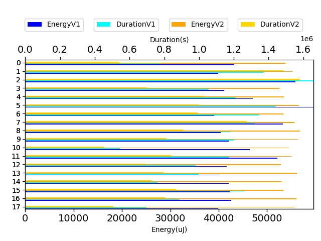

## com.google.gson.functional.InheritanceTest

| Test | IterationV1 | IterationV2 | DeltaIteration |
| --- | --- | --- | --- |
| com.google.gson.functional.InheritanceTest-testSubInterfacesOfCollectionSerialization | 99 | 99 | 0 |
| com.google.gson.functional.InheritanceTest-testClassWithBaseCollectionFieldSerialization | 56 | 62 | 6 |
| com.google.gson.functional.InheritanceTest-testClassWithBaseFieldSerialization | 41 | 40 | -1 |
| com.google.gson.functional.InheritanceTest-testSubClassSerialization | 69 | 74 | 5 |
| com.google.gson.functional.InheritanceTest-testBaseSerializedAsSubWhenSpecifiedWithExplicitType | 25 | 21 | -4 |
| com.google.gson.functional.InheritanceTest-testClassWithBaseArrayFieldSerialization | 51 | 49 | -2 |
| com.google.gson.functional.InheritanceTest-testBaseSerializedAsSub | 19 | 33 | 14 |
| com.google.gson.functional.InheritanceTest-testBaseSerializedAsSubWhenSpecifiedWithExplicitTypeForToJsonMethod | 26 | 20 | -6 |
| com.google.gson.functional.InheritanceTest-testBaseSerializedAsBaseWhenSpecifiedWithExplicitType | 25 | 28 | 3 |
| com.google.gson.functional.InheritanceTest-testBaseSerializedAsBaseWhenSpecifiedWithExplicitTypeForToJsonMethod | 41 | 49 | 8 |
| com.google.gson.functional.InheritanceTest-testBaseSerializedAsSubForToJsonMethod | 22 | 28 | 6 |

| Test | EnergyV1 | EnergyV2 | DeltaEnergy |
| --- | --- | --- | --- |
| com.google.gson.functional.InheritanceTest-testSubInterfacesOfCollectionSerialization | 67435.47432570293 | 81006.50973787662 | 13571.03541217369 |
| com.google.gson.functional.InheritanceTest-testClassWithBaseCollectionFieldSerialization | 42295.617383542034 | 44077.030395567475 | 1781.4130120254413 |
| com.google.gson.functional.InheritanceTest-testClassWithBaseFieldSerialization | 42517.22361104573 | 41663.26415771418 | -853.959453331554 |
| com.google.gson.functional.InheritanceTest-testSubClassSerialization | 42743.247146264854 | 42209.52400191542 | -533.7231443494311 |
| com.google.gson.functional.InheritanceTest-testBaseSerializedAsSubWhenSpecifiedWithExplicitType | 43760.16172134876 | 39723.4755897522 | -4036.6861315965652 |
| com.google.gson.functional.InheritanceTest-testClassWithBaseArrayFieldSerialization | 42534.75791515126 | 43344.61021971963 | 809.8523045683687 |
| com.google.gson.functional.InheritanceTest-testBaseSerializedAsSub | 46505.1455116272 | 39247.520848979475 | -7257.624662647722 |
| com.google.gson.functional.InheritanceTest-testBaseSerializedAsSubWhenSpecifiedWithExplicitTypeForToJsonMethod | 43722.14835888147 | 41817.6264667511 | -1904.521892130375 |
| com.google.gson.functional.InheritanceTest-testBaseSerializedAsBaseWhenSpecifiedWithExplicitType | 44570.12277251482 | 43301.57541627437 | -1268.5473562404513 |
| com.google.gson.functional.InheritanceTest-testBaseSerializedAsBaseWhenSpecifiedWithExplicitTypeForToJsonMethod | 84617.1336462509 | 46634.01724938907 | -37983.116396861835 |
| com.google.gson.functional.InheritanceTest-testBaseSerializedAsSubForToJsonMethod | 43029.99283313751 | 42468.1635575071 | -561.8292756304145 |

| Test | DurationV1 | DurationsV2 | DeltaDuration |
| --- | --- | --- | --- |
| com.google.gson.functional.InheritanceTest-testSubInterfacesOfCollectionSerialization | 1886882.1101722037 | 1898411.6934892766 | 11529.58331707283 |
| com.google.gson.functional.InheritanceTest-testClassWithBaseCollectionFieldSerialization | 679981.1696819728 | 787991.5844136425 | 108010.4147316697 |
| com.google.gson.functional.InheritanceTest-testClassWithBaseFieldSerialization | 598810.1451613364 | 849230.3438323097 | 250420.1986709733 |
| com.google.gson.functional.InheritanceTest-testSubClassSerialization | 832314.2635035632 | 980162.2519880692 | 147847.9884845059 |
| com.google.gson.functional.InheritanceTest-testBaseSerializedAsSubWhenSpecifiedWithExplicitType | 422865.4057908058 | 518704.958899498 | 95839.55310869217 |
| com.google.gson.functional.InheritanceTest-testClassWithBaseArrayFieldSerialization | 565754.5859592329 | 601034.5105506784 | 35279.92459144548 |
| com.google.gson.functional.InheritanceTest-testBaseSerializedAsSub | 431894.9419937134 | 396159.7096148615 | -35735.232378851855 |
| com.google.gson.functional.InheritanceTest-testBaseSerializedAsSubWhenSpecifiedWithExplicitTypeForToJsonMethod | 374693.286247313 | 402548.94238853455 | 27855.656141221523 |
| com.google.gson.functional.InheritanceTest-testBaseSerializedAsBaseWhenSpecifiedWithExplicitType | 376115.7232475281 | 389261.0948331468 | 13145.371585618705 |
| com.google.gson.functional.InheritanceTest-testBaseSerializedAsBaseWhenSpecifiedWithExplicitTypeForToJsonMethod | 1641581.4644179447 | 712538.430678888 | -929043.0337390567 |
| com.google.gson.functional.InheritanceTest-testBaseSerializedAsSubForToJsonMethod | 428030.7063355446 | 388055.0542541146 | -39975.65208142996 |

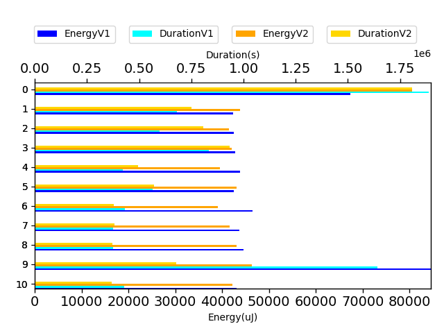

## com.google.gson.functional.MoreSpecificTypeSerializationTest

| Test | IterationV1 | IterationV2 | DeltaIteration |
| --- | --- | --- | --- |
| com.google.gson.functional.MoreSpecificTypeSerializationTest-testSubclassFields | 59 | 75 | 16 |
| com.google.gson.functional.MoreSpecificTypeSerializationTest-testParameterizedSubclassFields | 82 | 79 | -3 |
| com.google.gson.functional.MoreSpecificTypeSerializationTest-testListOfParameterizedSubclassFields | 58 | 56 | -2 |
| com.google.gson.functional.MoreSpecificTypeSerializationTest-testListOfSubclassFields | 77 | 84 | 7 |
| com.google.gson.functional.MoreSpecificTypeSerializationTest-testMapOfSubclassFields | 67 | 67 | 0 |
| com.google.gson.functional.MoreSpecificTypeSerializationTest-testMapOfParameterizedSubclassFields | 58 | 51 | -7 |

| Test | EnergyV1 | EnergyV2 | DeltaEnergy |
| --- | --- | --- | --- |
| com.google.gson.functional.MoreSpecificTypeSerializationTest-testSubclassFields | 46053.5606457602 | 175236.97373897122 | 129183.41309321103 |
| com.google.gson.functional.MoreSpecificTypeSerializationTest-testParameterizedSubclassFields | 41940.53566937779 | 40613.82702443723 | -1326.7086449405542 |
| com.google.gson.functional.MoreSpecificTypeSerializationTest-testListOfParameterizedSubclassFields | 41747.297239281885 | 41875.153243473316 | 127.85600419143157 |
| com.google.gson.functional.MoreSpecificTypeSerializationTest-testListOfSubclassFields | 41898.27371827263 | 73210.28101724395 | 31312.007298971323 |
| com.google.gson.functional.MoreSpecificTypeSerializationTest-testMapOfSubclassFields | 43787.64696799283 | 110144.23942331271 | 66356.59245531989 |
| com.google.gson.functional.MoreSpecificTypeSerializationTest-testMapOfParameterizedSubclassFields | 42079.555800303504 | 37889.88084667587 | -4189.674953627633 |

| Test | DurationV1 | DurationsV2 | DeltaDuration |
| --- | --- | --- | --- |
| com.google.gson.functional.MoreSpecificTypeSerializationTest-testSubclassFields | 1014347.718796725 | 6056776.543070737 | 5042428.824274012 |
| com.google.gson.functional.MoreSpecificTypeSerializationTest-testParameterizedSubclassFields | 957949.224068809 | 1207344.4409143552 | 249395.21684554627 |
| com.google.gson.functional.MoreSpecificTypeSerializationTest-testListOfParameterizedSubclassFields | 790757.7405715174 | 736571.7272941784 | -54186.013277338934 |
| com.google.gson.functional.MoreSpecificTypeSerializationTest-testListOfSubclassFields | 891209.1042459854 | 2300087.4594141864 | 1408878.355168201 |
| com.google.gson.functional.MoreSpecificTypeSerializationTest-testMapOfSubclassFields | 800540.7884395275 | 3338583.906876486 | 2538043.118436958 |
| com.google.gson.functional.MoreSpecificTypeSerializationTest-testMapOfParameterizedSubclassFields | 645488.2224592126 | 980755.3234976805 | 335267.10103846784 |

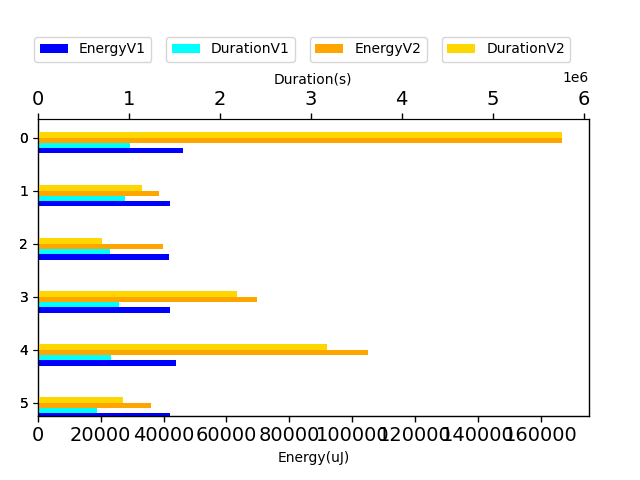

## com.google.gson.functional.JavaUtilConcurrentAtomicTest

| Test | IterationV1 | IterationV2 | DeltaIteration |
| --- | --- | --- | --- |
| com.google.gson.functional.JavaUtilConcurrentAtomicTest-testAtomicLong | 15 | 17 | 2 |
| com.google.gson.functional.JavaUtilConcurrentAtomicTest-testAtomicLongArray | 92 | 94 | 2 |
| com.google.gson.functional.JavaUtilConcurrentAtomicTest-testAtomicLongWithStringSerializationPolicy | 60 | 57 | -3 |
| com.google.gson.functional.JavaUtilConcurrentAtomicTest-testAtomicInteger | 28 | 15 | -13 |
| com.google.gson.functional.JavaUtilConcurrentAtomicTest-testAtomicIntegerArray | 90 | 92 | 2 |
| com.google.gson.functional.JavaUtilConcurrentAtomicTest-testAtomicBoolean | 24 | 16 | -8 |
| com.google.gson.functional.JavaUtilConcurrentAtomicTest-testAtomicLongArrayWithStringSerializationPolicy | 15 | 24 | 9 |

| Test | EnergyV1 | EnergyV2 | DeltaEnergy |
| --- | --- | --- | --- |
| com.google.gson.functional.JavaUtilConcurrentAtomicTest-testAtomicLong | 44633.61834716797 | 41396.83543395996 | -3236.782913208008 |
| com.google.gson.functional.JavaUtilConcurrentAtomicTest-testAtomicLongArray | 41670.392047291876 | 39035.19222085363 | -2635.199826438249 |
| com.google.gson.functional.JavaUtilConcurrentAtomicTest-testAtomicLongWithStringSerializationPolicy | 41273.2087779503 | 53804.6504324548 | 12531.441654504502 |
| com.google.gson.functional.JavaUtilConcurrentAtomicTest-testAtomicInteger | 41749.319460488856 | 45573.71075439453 | 3824.3912939056754 |
| com.google.gson.functional.JavaUtilConcurrentAtomicTest-testAtomicIntegerArray | 39985.37412168883 | 43794.716999869204 | 3809.342878180374 |
| com.google.gson.functional.JavaUtilConcurrentAtomicTest-testAtomicBoolean | 44386.84683728218 | 41624.54611206055 | -2762.300725221634 |
| com.google.gson.functional.JavaUtilConcurrentAtomicTest-testAtomicLongArrayWithStringSerializationPolicy | 43325.18469238281 | 44909.39893364906 | 1584.2142412662506 |

| Test | DurationV1 | DurationsV2 | DeltaDuration |
| --- | --- | --- | --- |
| com.google.gson.functional.JavaUtilConcurrentAtomicTest-testAtomicLong | 446774.6231994629 | 373689.18449401855 | -73085.43870544434 |
| com.google.gson.functional.JavaUtilConcurrentAtomicTest-testAtomicLongArray | 1123408.6022537337 | 1062324.2024063868 | -61084.399847346824 |
| com.google.gson.functional.JavaUtilConcurrentAtomicTest-testAtomicLongWithStringSerializationPolicy | 652378.2677187419 | 3424738.2386227665 | 2772359.9709040243 |
| com.google.gson.functional.JavaUtilConcurrentAtomicTest-testAtomicInteger | 465379.00378941745 | 475919.3134765625 | 10540.309687145054 |
| com.google.gson.functional.JavaUtilConcurrentAtomicTest-testAtomicIntegerArray | 1118644.1541794783 | 1128910.7324012015 | 10266.578221723204 |
| com.google.gson.functional.JavaUtilConcurrentAtomicTest-testAtomicBoolean | 380939.09889912605 | 672654.0130615234 | 291714.9141623974 |
| com.google.gson.functional.JavaUtilConcurrentAtomicTest-testAtomicLongArrayWithStringSerializationPolicy | 400330.48614501953 | 375725.11500275135 | -24605.37114226818 |

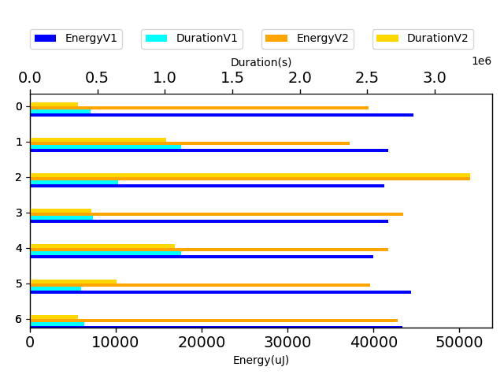

## com.google.gson.functional.EnumTest

| Test | IterationV1 | IterationV2 | DeltaIteration |
| --- | --- | --- | --- |
| com.google.gson.functional.EnumTest-testEnumSubclassAsParameterizedType | 76 | 80 | 4 |
| com.google.gson.functional.EnumTest-testEnumCaseMapping | 63 | 72 | 9 |
| com.google.gson.functional.EnumTest-testEnumSubclass | 99 | 99 | 0 |
| com.google.gson.functional.EnumTest-testEnumSubclassWithRegisteredTypeAdapter | 85 | 90 | 5 |
| com.google.gson.functional.EnumTest-testClassWithEnumFieldSerialization | 61 | 63 | 2 |
| com.google.gson.functional.EnumTest-testEnumClassWithFields | 46 | 50 | 4 |
| com.google.gson.functional.EnumTest-testEnumSet | 68 | 72 | 4 |
| com.google.gson.functional.EnumTest-testTopLevelEnumSerialization | 46 | 51 | 5 |
| com.google.gson.functional.EnumTest-testCollectionOfEnumsSerialization | 53 | 62 | 9 |

| Test | EnergyV1 | EnergyV2 | DeltaEnergy |
| --- | --- | --- | --- |
| com.google.gson.functional.EnumTest-testEnumSubclassAsParameterizedType | 40755.45488539437 | 66133.72199788791 | 25378.267112493544 |
| com.google.gson.functional.EnumTest-testEnumCaseMapping | 41308.8563423097 | 70495.181472468 | 29186.3251301583 |
| com.google.gson.functional.EnumTest-testEnumSubclass | 86109.67076290169 | 88927.99090464613 | 2818.320141744436 |
| com.google.gson.functional.EnumTest-testEnumSubclassWithRegisteredTypeAdapter | 41722.448079386864 | 45245.44372574099 | 3522.995646354124 |
| com.google.gson.functional.EnumTest-testClassWithEnumFieldSerialization | 43442.34864700949 | 42109.81319257709 | -1332.5354544324 |
| com.google.gson.functional.EnumTest-testEnumClassWithFields | 42181.49296804752 | 42179.03536811702 | -2.4575999304943252 |
| com.google.gson.functional.EnumTest-testEnumSet | 42703.49751188523 | 47822.67601710914 | 5119.1785052239065 |
| com.google.gson.functional.EnumTest-testTopLevelEnumSerialization | 44122.180280536144 | 43011.673489762485 | -1110.5067907736593 |
| com.google.gson.functional.EnumTest-testCollectionOfEnumsSerialization | 41871.13610884268 | 43195.648048725634 | 1324.5119398829556 |

| Test | DurationV1 | DurationsV2 | DeltaDuration |
| --- | --- | --- | --- |
| com.google.gson.functional.EnumTest-testEnumSubclassAsParameterizedType | 920040.3714653637 | 1621711.858586633 | 701671.4871212695 |
| com.google.gson.functional.EnumTest-testEnumCaseMapping | 1044154.170330053 | 1535565.9191493772 | 491411.7488193242 |
| com.google.gson.functional.EnumTest-testEnumSubclass | 2509732.782401994 | 2633475.8882013503 | 123743.10579935648 |
| com.google.gson.functional.EnumTest-testEnumSubclassWithRegisteredTypeAdapter | 1073430.702168061 | 1065025.9024607362 | -8404.79970732471 |
| com.google.gson.functional.EnumTest-testClassWithEnumFieldSerialization | 664699.200242256 | 736990.3743113125 | 72291.1740690564 |
| com.google.gson.functional.EnumTest-testEnumClassWithFields | 631285.8651985181 | 668446.9173940513 | 37161.05219553318 |
| com.google.gson.functional.EnumTest-testEnumSet | 764706.6770645881 | 1071491.6187021022 | 306784.94163751416 |
| com.google.gson.functional.EnumTest-testTopLevelEnumSerialization | 817276.6874177807 | 666844.2437154241 | -150432.44370235666 |
| com.google.gson.functional.EnumTest-testCollectionOfEnumsSerialization | 929257.2714986549 | 862324.9963984928 | -66932.27510016202 |

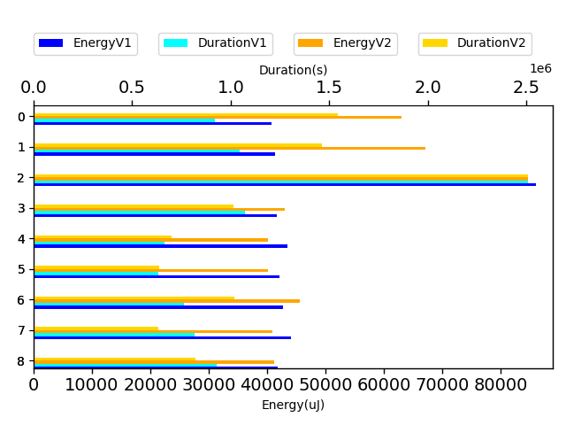

## com.google.gson.functional.DelegateTypeAdapterTest

| Test | IterationV1 | IterationV2 | DeltaIteration |
| --- | --- | --- | --- |
| com.google.gson.functional.DelegateTypeAdapterTest-testDelegateInvokedOnStrings | 22 | 31 | 9 |
| com.google.gson.functional.DelegateTypeAdapterTest-testDelegateInvoked | 97 | 98 | 1 |

| Test | EnergyV1 | EnergyV2 | DeltaEnergy |
| --- | --- | --- | --- |
| com.google.gson.functional.DelegateTypeAdapterTest-testDelegateInvokedOnStrings | 43745.679592847824 | 43138.17131175473 | -607.5082810930908 |
| com.google.gson.functional.DelegateTypeAdapterTest-testDelegateInvoked | 49694.554177267375 | 45689.16271564418 | -4005.3914616231923 |

| Test | DurationV1 | DurationsV2 | DeltaDuration |
| --- | --- | --- | --- |
| com.google.gson.functional.DelegateTypeAdapterTest-testDelegateInvokedOnStrings | 514623.0153827667 | 419284.3497972945 | -95338.66558547225 |
| com.google.gson.functional.DelegateTypeAdapterTest-testDelegateInvoked | 1643197.5009204745 | 1535156.1659972458 | -108041.33492322871 |

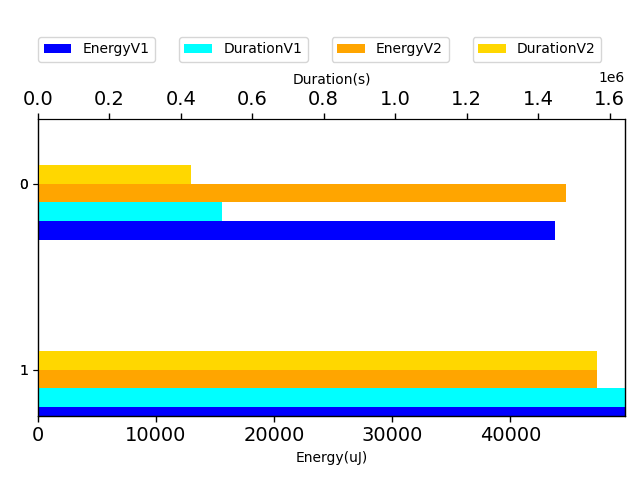

## com.google.gson.functional.ObjectTest

| Test | IterationV1 | IterationV2 | DeltaIteration |
| --- | --- | --- | --- |
| com.google.gson.functional.ObjectTest-testNestedSerialization | 47 | 50 | 3 |
| com.google.gson.functional.ObjectTest-testSingletonLists | 98 | 95 | -3 |
| com.google.gson.functional.ObjectTest-testNullFieldsSerialization | 35 | 41 | 6 |
| com.google.gson.functional.ObjectTest-testArrayOfObjectsAsFields | 56 | 62 | 6 |
| com.google.gson.functional.ObjectTest-testDateAsMapObjectField | 90 | 97 | 7 |
| com.google.gson.functional.ObjectTest-testArrayOfArraysSerialization | 80 | 76 | -4 |
| com.google.gson.functional.ObjectTest-testArrayOfObjectsSerialization | 48 | 52 | 4 |
| com.google.gson.functional.ObjectTest-testClassWithNoFieldsSerialization | 21 | 30 | 9 |
| com.google.gson.functional.ObjectTest-testEmptyCollectionInAnObjectSerialization | 70 | 65 | -5 |
| com.google.gson.functional.ObjectTest-testClassWithObjectFieldSerialization | 47 | 44 | -3 |
| com.google.gson.functional.ObjectTest-testAnonymousLocalClassesCustomSerialization | 58 | 59 | 1 |
| com.google.gson.functional.ObjectTest-testPrimitiveArrayFieldSerialization | 25 | 39 | 14 |
| com.google.gson.functional.ObjectTest-testStringFieldWithEmptyValueSerialization | 41 | 53 | 12 |
| com.google.gson.functional.ObjectTest-testInnerClassSerialization | 61 | 69 | 8 |
| com.google.gson.functional.ObjectTest-testClassWithTransientFieldsSerialization | 34 | 44 | 10 |
| com.google.gson.functional.ObjectTest-testBagOfPrimitiveWrappersSerialization | 55 | 54 | -1 |
| com.google.gson.functional.ObjectTest-testAnonymousLocalClassesSerialization | 48 | 48 | 0 |
| com.google.gson.functional.ObjectTest-testBagOfPrimitivesSerialization | 41 | 33 | -8 |

| Test | EnergyV1 | EnergyV2 | DeltaEnergy |
| --- | --- | --- | --- |
| com.google.gson.functional.ObjectTest-testNestedSerialization | 42190.705221966266 | 42224.091458032795 | 33.38623606652982 |
| com.google.gson.functional.ObjectTest-testSingletonLists | 40754.937373141394 | 46749.54654242868 | 5994.609169287287 |
| com.google.gson.functional.ObjectTest-testNullFieldsSerialization | 43010.497932623985 | 43948.33061794401 | 937.8326853200269 |
| com.google.gson.functional.ObjectTest-testArrayOfObjectsAsFields | 64668.350542350054 | 50430.35881841015 | -14237.9917239399 |
| com.google.gson.functional.ObjectTest-testDateAsMapObjectField | 97184.33219876446 | 346539.07618297375 | 249354.7439842093 |
| com.google.gson.functional.ObjectTest-testArrayOfArraysSerialization | 44002.76734304588 | 42987.940596257075 | -1014.8267467888072 |
| com.google.gson.functional.ObjectTest-testArrayOfObjectsSerialization | 42375.69051707932 | 41069.70723208593 | -1305.9832849933882 |
| com.google.gson.functional.ObjectTest-testClassWithNoFieldsSerialization | 42470.51717567444 | 42273.525772523135 | -196.99140315130353 |
| com.google.gson.functional.ObjectTest-testEmptyCollectionInAnObjectSerialization | 42268.15397562941 | 41881.062558575155 | -387.0914170542528 |
| com.google.gson.functional.ObjectTest-testClassWithObjectFieldSerialization | 42882.92126803026 | 42582.50883140066 | -300.41243662960187 |
| com.google.gson.functional.ObjectTest-testAnonymousLocalClassesCustomSerialization | 41656.61211956876 | 41394.20589067209 | -262.406228896667 |
| com.google.gson.functional.ObjectTest-testPrimitiveArrayFieldSerialization | 43281.095177948475 | 41118.162614513756 | -2162.9325634347188 |
| com.google.gson.functional.ObjectTest-testStringFieldWithEmptyValueSerialization | 41091.87363603611 | 41646.074675048236 | 554.2010390121286 |
| com.google.gson.functional.ObjectTest-testInnerClassSerialization | 40457.021283907816 | 40680.510584503514 | 223.4893005956983 |
| com.google.gson.functional.ObjectTest-testClassWithTransientFieldsSerialization | 43070.22785425617 | 40218.047719101996 | -2852.1801351541726 |
| com.google.gson.functional.ObjectTest-testBagOfPrimitiveWrappersSerialization | 43007.475940041986 | 48296.93231919282 | 5289.4563791508335 |
| com.google.gson.functional.ObjectTest-testAnonymousLocalClassesSerialization | 40484.636247746545 | 41540.831242677195 | 1056.1949949306509 |
| com.google.gson.functional.ObjectTest-testBagOfPrimitivesSerialization | 46031.64519534491 | 57828.47054268466 | 11796.825347339756 |

| Test | DurationV1 | DurationsV2 | DeltaDuration |
| --- | --- | --- | --- |
| com.google.gson.functional.ObjectTest-testNestedSerialization | 691742.507457328 | 672923.1945360369 | -18819.3129212911 |
| com.google.gson.functional.ObjectTest-testSingletonLists | 1113714.1114489085 | 1330955.9545053204 | 217241.84305641195 |
| com.google.gson.functional.ObjectTest-testNullFieldsSerialization | 534694.3927539514 | 499357.03871854907 | -35337.3540354023 |
| com.google.gson.functional.ObjectTest-testArrayOfObjectsAsFields | 1151322.07994232 | 1017865.9072515239 | -133456.17269079608 |
| com.google.gson.functional.ObjectTest-testDateAsMapObjectField | 2323319.6892132116 | 8761594.089785177 | 6438274.400571966 |
| com.google.gson.functional.ObjectTest-testArrayOfArraysSerialization | 1065009.5173165535 | 1063648.4996263336 | -1361.0176902199164 |
| com.google.gson.functional.ObjectTest-testArrayOfObjectsSerialization | 978402.8454640028 | 1160315.9802200748 | 181913.13475607196 |
| com.google.gson.functional.ObjectTest-testClassWithNoFieldsSerialization | 413156.37096881866 | 701935.116056256 | 288778.74508743733 |
| com.google.gson.functional.ObjectTest-testEmptyCollectionInAnObjectSerialization | 787864.4453340601 | 900079.9009456428 | 112215.45561158273 |
| com.google.gson.functional.ObjectTest-testClassWithObjectFieldSerialization | 645900.993549525 | 647275.1326082475 | 1374.139058722416 |
| com.google.gson.functional.ObjectTest-testAnonymousLocalClassesCustomSerialization | 649979.7771053076 | 1362199.402767056 | 712219.6256617483 |
| com.google.gson.functional.ObjectTest-testPrimitiveArrayFieldSerialization | 697894.3311014175 | 802065.3765258561 | 104171.04542443855 |
| com.google.gson.functional.ObjectTest-testStringFieldWithEmptyValueSerialization | 652097.3476536564 | 866594.6179741477 | 214497.27032049128 |
| com.google.gson.functional.ObjectTest-testInnerClassSerialization | 799885.8695265949 | 795496.5082488519 | -4389.36127774301 |
| com.google.gson.functional.ObjectTest-testClassWithTransientFieldsSerialization | 601308.846231483 | 638302.9110452203 | 36994.06481373729 |
| com.google.gson.functional.ObjectTest-testBagOfPrimitiveWrappersSerialization | 627450.5760806897 | 862200.3942682677 | 234749.818187578 |
| com.google.gson.functional.ObjectTest-testAnonymousLocalClassesSerialization | 568603.968259403 | 612793.8246695873 | 44189.85641018429 |
| com.google.gson.functional.ObjectTest-testBagOfPrimitivesSerialization | 700856.4418733474 | 1352793.924461879 | 651937.4825885317 |

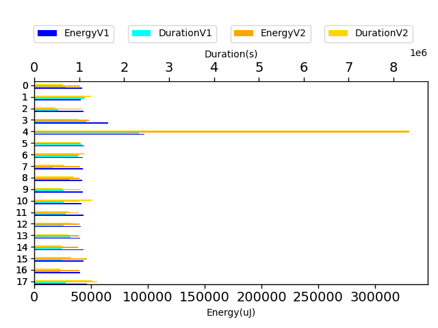

## com.google.gson.functional.NamingPolicyTest

| Test | IterationV1 | IterationV2 | DeltaIteration |
| --- | --- | --- | --- |
| com.google.gson.functional.NamingPolicyTest-testGsonWithNonDefaultFieldNamingPolicySerialization | 48 | 45 | -3 |
| com.google.gson.functional.NamingPolicyTest-testGsonWithSerializedNameFieldNamingPolicySerialization | 63 | 53 | -10 |
| com.google.gson.functional.NamingPolicyTest-testComplexFieldNameStrategy | 69 | 66 | -3 |
| com.google.gson.functional.NamingPolicyTest-testGsonWithLowerCaseDotPolicySerialization | 31 | 25 | -6 |
| com.google.gson.functional.NamingPolicyTest-testGsonWithUpperCamelCaseSpacesPolicySerialiation | 33 | 27 | -6 |
| com.google.gson.functional.NamingPolicyTest-testAtSignInSerializedName | 46 | 48 | 2 |
| com.google.gson.functional.NamingPolicyTest-testDeprecatedNamingStrategy | 80 | 79 | -1 |
| com.google.gson.functional.NamingPolicyTest-testGsonWithLowerCaseUnderscorePolicySerialization | 26 | 29 | 3 |
| com.google.gson.functional.NamingPolicyTest-testGsonWithLowerCaseDashPolicySerialization | 30 | 33 | 3 |

| Test | EnergyV1 | EnergyV2 | DeltaEnergy |
| --- | --- | --- | --- |
| com.google.gson.functional.NamingPolicyTest-testGsonWithNonDefaultFieldNamingPolicySerialization | 43463.50484034917 | 44675.554312658656 | 1212.049472309489 |
| com.google.gson.functional.NamingPolicyTest-testGsonWithSerializedNameFieldNamingPolicySerialization | 75640.16030190336 | 61781.200594411726 | -13858.959707491638 |
| com.google.gson.functional.NamingPolicyTest-testComplexFieldNameStrategy | 41459.21718513918 | 40717.76940809198 | -741.4477770472004 |
| com.google.gson.functional.NamingPolicyTest-testGsonWithLowerCaseDotPolicySerialization | 41365.63936640695 | 43623.74989926815 | 2258.110532861203 |
| com.google.gson.functional.NamingPolicyTest-testGsonWithUpperCamelCaseSpacesPolicySerialiation | 42992.65659609297 | 43466.26926308125 | 473.61266698827967 |
| com.google.gson.functional.NamingPolicyTest-testAtSignInSerializedName | 44045.529246143575 | 42421.02660059652 | -1624.502645547058 |
| com.google.gson.functional.NamingPolicyTest-testDeprecatedNamingStrategy | 42395.880701172704 | 40879.11124441627 | -1516.7694567564322 |
| com.google.gson.functional.NamingPolicyTest-testGsonWithLowerCaseUnderscorePolicySerialization | 43700.25229173899 | 41089.6962351203 | -2610.5560566186905 |
| com.google.gson.functional.NamingPolicyTest-testGsonWithLowerCaseDashPolicySerialization | 43482.05210437812 | 44505.404468805296 | 1023.3523644271772 |

| Test | DurationV1 | DurationsV2 | DeltaDuration |
| --- | --- | --- | --- |
| com.google.gson.functional.NamingPolicyTest-testGsonWithNonDefaultFieldNamingPolicySerialization | 921040.0918237681 | 629181.0355145687 | -291859.0563091994 |
| com.google.gson.functional.NamingPolicyTest-testGsonWithSerializedNameFieldNamingPolicySerialization | 1736526.5553509314 | 1321641.4738060518 | -414885.0815448796 |
| com.google.gson.functional.NamingPolicyTest-testComplexFieldNameStrategy | 1241291.5176152154 | 909649.0022568721 | -331642.51535834325 |
| com.google.gson.functional.NamingPolicyTest-testGsonWithLowerCaseDotPolicySerialization | 473267.3324669264 | 496422.2117689252 | 23154.879301998764 |
| com.google.gson.functional.NamingPolicyTest-testGsonWithUpperCamelCaseSpacesPolicySerialiation | 459075.03269804176 | 458333.8095659092 | -741.2231321325526 |
| com.google.gson.functional.NamingPolicyTest-testAtSignInSerializedName | 721450.1123687819 | 628658.2005475482 | -92791.91182123369 |
| com.google.gson.functional.NamingPolicyTest-testDeprecatedNamingStrategy | 953015.4770334099 | 986336.3316872423 | 33320.854653832386 |
| com.google.gson.functional.NamingPolicyTest-testGsonWithLowerCaseUnderscorePolicySerialization | 534890.0678574443 | 449153.3907474987 | -85736.67710994557 |
| com.google.gson.functional.NamingPolicyTest-testGsonWithLowerCaseDashPolicySerialization | 491902.8229665756 | 465196.80064919963 | -26706.022317375988 |

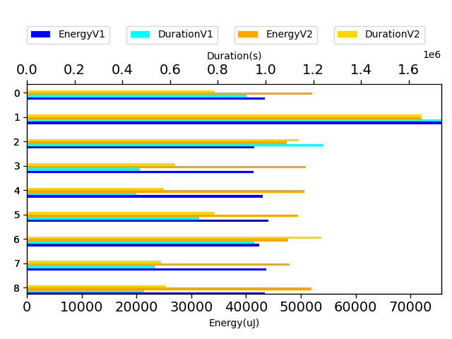

## com.google.gson.DefaultMapJsonSerializerTest

| Test | IterationV1 | IterationV2 | DeltaIteration |
| --- | --- | --- | --- |
| com.google.gson.DefaultMapJsonSerializerTest-testEmptyMapSerialization | 52 | 46 | -6 |
| com.google.gson.DefaultMapJsonSerializerTest-testEmptyMapNoTypeSerialization | 34 | 27 | -7 |
| com.google.gson.DefaultMapJsonSerializerTest-testNonEmptyMapSerialization | 42 | 54 | 12 |

| Test | EnergyV1 | EnergyV2 | DeltaEnergy |
| --- | --- | --- | --- |
| com.google.gson.DefaultMapJsonSerializerTest-testEmptyMapSerialization | 43587.19697125199 | 44127.58130106304 | 540.3843298110442 |
| com.google.gson.DefaultMapJsonSerializerTest-testEmptyMapNoTypeSerialization | 45184.27503195498 | 41136.04673097283 | -4048.228300982155 |
| com.google.gson.DefaultMapJsonSerializerTest-testNonEmptyMapSerialization | 46109.753960148155 | 41616.1899599828 | -4493.564000165352 |

| Test | DurationV1 | DurationsV2 | DeltaDuration |
| --- | --- | --- | --- |
| com.google.gson.DefaultMapJsonSerializerTest-testEmptyMapSerialization | 833772.8916140797 | 684466.0640310438 | -149306.82758303592 |
| com.google.gson.DefaultMapJsonSerializerTest-testEmptyMapNoTypeSerialization | 700190.3877527281 | 635539.8971166983 | -64650.49063602975 |
| com.google.gson.DefaultMapJsonSerializerTest-testNonEmptyMapSerialization | 697895.0835498222 | 785067.2849628353 | 87172.20141301304 |

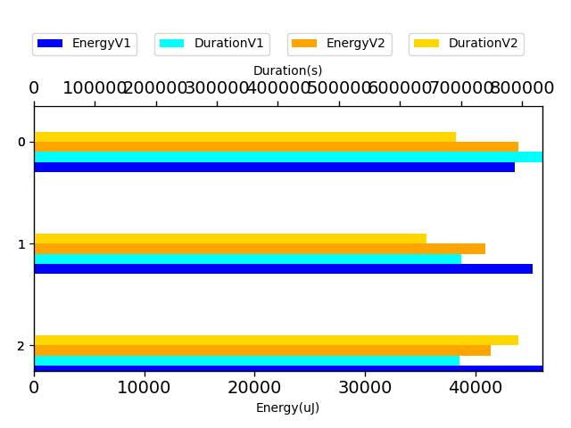

## com.google.gson.functional.JsonAdapterAnnotationOnFieldsTest

| Test | IterationV1 | IterationV2 | DeltaIteration |
| --- | --- | --- | --- |
| com.google.gson.functional.JsonAdapterAnnotationOnFieldsTest-testPrimitiveFieldAnnotationTakesPrecedenceOverDefault | 94 | 98 | 4 |
| com.google.gson.functional.JsonAdapterAnnotationOnFieldsTest-testClassAnnotationAdapterTakesPrecedenceOverDefault | 91 | 92 | 1 |
| com.google.gson.functional.JsonAdapterAnnotationOnFieldsTest-testFieldAnnotationWorksForParameterizedType | 97 | 95 | -2 |
| com.google.gson.functional.JsonAdapterAnnotationOnFieldsTest-testFieldAnnotationTakesPrecedenceOverClassAnnotation | 84 | 86 | 2 |
| com.google.gson.functional.JsonAdapterAnnotationOnFieldsTest-testNonPrimitiveFieldAnnotationTakesPrecedenceOverDefault | 33 | 36 | 3 |
| com.google.gson.functional.JsonAdapterAnnotationOnFieldsTest-testFieldAnnotationTakesPrecedenceOverRegisteredTypeAdapter | 95 | 92 | -3 |
| com.google.gson.functional.JsonAdapterAnnotationOnFieldsTest-testClassAnnotationAdapterFactoryTakesPrecedenceOverDefault | 98 | 94 | -4 |
| com.google.gson.functional.JsonAdapterAnnotationOnFieldsTest-testJsonAdapterWrappedInNullSafeAsRequested | 64 | 65 | 1 |
| com.google.gson.functional.JsonAdapterAnnotationOnFieldsTest-testRegisteredTypeAdapterTakesPrecedenceOverClassAnnotationAdapter | 58 | 62 | 4 |

| Test | EnergyV1 | EnergyV2 | DeltaEnergy |
| --- | --- | --- | --- |
| com.google.gson.functional.JsonAdapterAnnotationOnFieldsTest-testPrimitiveFieldAnnotationTakesPrecedenceOverDefault | 50106.91919276017 | 42983.62894083564 | -7123.290251924533 |
| com.google.gson.functional.JsonAdapterAnnotationOnFieldsTest-testClassAnnotationAdapterTakesPrecedenceOverDefault | 69112.56844155901 | 66649.3296546947 | -2463.2387868643127 |
| com.google.gson.functional.JsonAdapterAnnotationOnFieldsTest-testFieldAnnotationWorksForParameterizedType | 44166.19583464886 | 47017.864070892036 | 2851.6682362431748 |
| com.google.gson.functional.JsonAdapterAnnotationOnFieldsTest-testFieldAnnotationTakesPrecedenceOverClassAnnotation | 43895.385018021174 | 43908.28032092254 | 12.89530290136463 |
| com.google.gson.functional.JsonAdapterAnnotationOnFieldsTest-testNonPrimitiveFieldAnnotationTakesPrecedenceOverDefault | 40465.411879363586 | 44934.53754570088 | 4469.1256663372915 |
| com.google.gson.functional.JsonAdapterAnnotationOnFieldsTest-testFieldAnnotationTakesPrecedenceOverRegisteredTypeAdapter | 42674.41887549378 | 41624.00671027564 | -1050.412165218142 |
| com.google.gson.functional.JsonAdapterAnnotationOnFieldsTest-testClassAnnotationAdapterFactoryTakesPrecedenceOverDefault | 62167.17982444264 | 42099.972751969224 | -20067.207072473415 |
| com.google.gson.functional.JsonAdapterAnnotationOnFieldsTest-testJsonAdapterWrappedInNullSafeAsRequested | 54395.16749237757 | 40708.19623494927 | -13686.971257428304 |
| com.google.gson.functional.JsonAdapterAnnotationOnFieldsTest-testRegisteredTypeAdapterTakesPrecedenceOverClassAnnotationAdapter | 40093.681661878174 | 41307.47270144403 | 1213.7910395658546 |

| Test | DurationV1 | DurationsV2 | DeltaDuration |
| --- | --- | --- | --- |
| com.google.gson.functional.JsonAdapterAnnotationOnFieldsTest-testPrimitiveFieldAnnotationTakesPrecedenceOverDefault | 1432497.9881061236 | 1334300.0264534187 | -98197.96165270498 |
| com.google.gson.functional.JsonAdapterAnnotationOnFieldsTest-testClassAnnotationAdapterTakesPrecedenceOverDefault | 1187294.08528945 | 1739532.5702848325 | 552238.4849953826 |
| com.google.gson.functional.JsonAdapterAnnotationOnFieldsTest-testFieldAnnotationWorksForParameterizedType | 1258297.846054424 | 1357098.0382270499 | 98800.1921726258 |
| com.google.gson.functional.JsonAdapterAnnotationOnFieldsTest-testFieldAnnotationTakesPrecedenceOverClassAnnotation | 1024270.1243306717 | 1026649.9378998736 | 2379.813569201855 |
| com.google.gson.functional.JsonAdapterAnnotationOnFieldsTest-testNonPrimitiveFieldAnnotationTakesPrecedenceOverDefault | 534355.727135822 | 477150.1573114316 | -57205.569824390346 |
| com.google.gson.functional.JsonAdapterAnnotationOnFieldsTest-testFieldAnnotationTakesPrecedenceOverRegisteredTypeAdapter | 1145109.649886696 | 1310347.9879103554 | 165238.33802365954 |
| com.google.gson.functional.JsonAdapterAnnotationOnFieldsTest-testClassAnnotationAdapterFactoryTakesPrecedenceOverDefault | 1317043.0043195332 | 1320838.9813939086 | 3795.977074375376 |
| com.google.gson.functional.JsonAdapterAnnotationOnFieldsTest-testJsonAdapterWrappedInNullSafeAsRequested | 1004080.42398938 | 810564.1286166027 | -193516.29537277727 |
| com.google.gson.functional.JsonAdapterAnnotationOnFieldsTest-testRegisteredTypeAdapterTakesPrecedenceOverClassAnnotationAdapter | 767802.1545677256 | 719258.8228543322 | -48543.33171339345 |

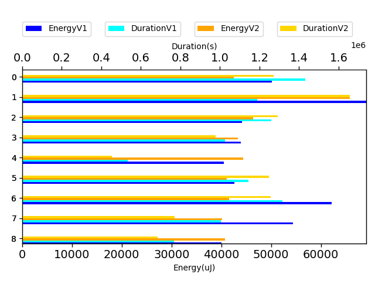

## com.google.gson.functional.SerializedNameTest

| Test | IterationV1 | IterationV2 | DeltaIteration |
| --- | --- | --- | --- |
| com.google.gson.functional.SerializedNameTest-testFirstNameIsChosenForSerialization | 84 | 79 | -5 |

| Test | EnergyV1 | EnergyV2 | DeltaEnergy |
| --- | --- | --- | --- |
| com.google.gson.functional.SerializedNameTest-testFirstNameIsChosenForSerialization | 57231.961629641046 | 47762.201541297734 | -9469.760088343312 |

| Test | DurationV1 | DurationsV2 | DeltaDuration |
| --- | --- | --- | --- |
| com.google.gson.functional.SerializedNameTest-testFirstNameIsChosenForSerialization | 1401747.7203716058 | 1123532.456241317 | -278215.26413028874 |

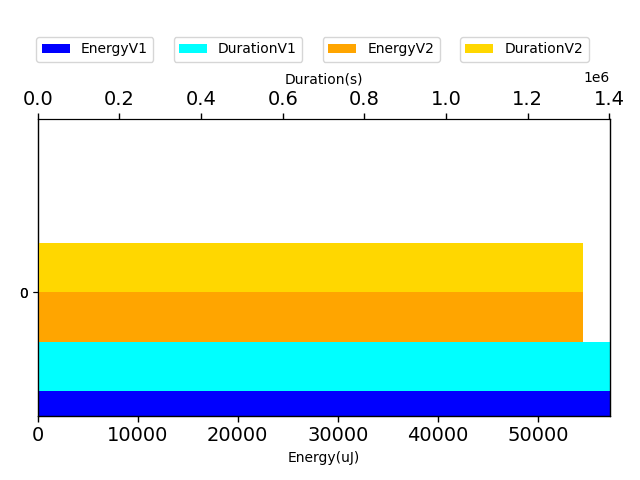

## com.google.gson.functional.TypeHierarchyAdapterTest

| Test | IterationV1 | IterationV2 | DeltaIteration |
| --- | --- | --- | --- |
| com.google.gson.functional.TypeHierarchyAdapterTest-testRegisterSuperTypeFirst | 46 | 45 | -1 |
| com.google.gson.functional.TypeHierarchyAdapterTest-testTypeHierarchy | 99 | 99 | 0 |

| Test | EnergyV1 | EnergyV2 | DeltaEnergy |
| --- | --- | --- | --- |
| com.google.gson.functional.TypeHierarchyAdapterTest-testRegisterSuperTypeFirst | 40529.85498568952 | 43089.78149462317 | 2559.9265089336477 |
| com.google.gson.functional.TypeHierarchyAdapterTest-testTypeHierarchy | 231193.44430625008 | 114872.7451055595 | -116320.69920069058 |

| Test | DurationV1 | DurationsV2 | DeltaDuration |
| --- | --- | --- | --- |
| com.google.gson.functional.TypeHierarchyAdapterTest-testRegisterSuperTypeFirst | 767276.4470047196 | 655443.7508928481 | -111832.69611187151 |
| com.google.gson.functional.TypeHierarchyAdapterTest-testTypeHierarchy | 5322374.600096132 | 2546799.7572108204 | -2775574.842885311 |

## com.google.gson.functional.TypeVariableTest

| Test | IterationV1 | IterationV2 | DeltaIteration |
| --- | --- | --- | --- |
| com.google.gson.functional.TypeVariableTest-testBasicTypeVariables | 44 | 47 | 3 |
| com.google.gson.functional.TypeVariableTest-testAdvancedTypeVariables | 98 | 99 | 1 |
| com.google.gson.functional.TypeVariableTest-testTypeVariablesViaTypeParameter | 88 | 88 | 0 |

| Test | EnergyV1 | EnergyV2 | DeltaEnergy |
| --- | --- | --- | --- |
| com.google.gson.functional.TypeVariableTest-testBasicTypeVariables | 42873.07888299535 | 40191.72353280723 | -2681.355350188125 |
| com.google.gson.functional.TypeVariableTest-testAdvancedTypeVariables | 94784.59004165235 | 142162.38103788928 | 47377.79099623693 |
| com.google.gson.functional.TypeVariableTest-testTypeVariablesViaTypeParameter | 50911.90307856481 | 72195.32224931559 | 21283.419170750785 |

| Test | DurationV1 | DurationsV2 | DeltaDuration |
| --- | --- | --- | --- |
| com.google.gson.functional.TypeVariableTest-testBasicTypeVariables | 818424.8510883837 | 1147725.3950679698 | 329300.5439795861 |
| com.google.gson.functional.TypeVariableTest-testAdvancedTypeVariables | 2882702.7349897986 | 4411712.893827125 | 1529010.1588373268 |
| com.google.gson.functional.TypeVariableTest-testTypeVariablesViaTypeParameter | 1726169.1439468716 | 2118996.7834059736 | 392827.63945910195 |

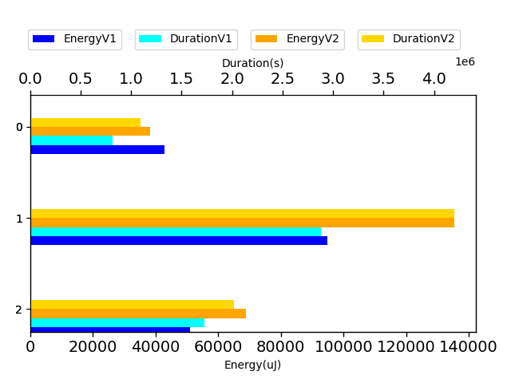

## com.google.gson.functional.VersioningTest

| Test | IterationV1 | IterationV2 | DeltaIteration |
| --- | --- | --- | --- |
| com.google.gson.functional.VersioningTest-testVersionedUntilSerialization | 99 | 99 | 0 |
| com.google.gson.functional.VersioningTest-testIgnoreLaterVersionClassSerialization | 37 | 47 | 10 |
| com.google.gson.functional.VersioningTest-testVersionedGsonWithUnversionedClassesSerialization | 49 | 45 | -4 |
| com.google.gson.functional.VersioningTest-testVersionedClassesSerialization | 64 | 72 | 8 |
| com.google.gson.functional.VersioningTest-testVersionedGsonMixingSinceAndUntilSerialization | 73 | 76 | 3 |

| Test | EnergyV1 | EnergyV2 | DeltaEnergy |
| --- | --- | --- | --- |
| com.google.gson.functional.VersioningTest-testVersionedUntilSerialization | 104019.06193565311 | 129213.45139384345 | 25194.389458190344 |
| com.google.gson.functional.VersioningTest-testIgnoreLaterVersionClassSerialization | 42414.402728694775 | 43104.13934349035 | 689.7366147955763 |
| com.google.gson.functional.VersioningTest-testVersionedGsonWithUnversionedClassesSerialization | 40473.23059646074 | 44686.02899029595 | 4212.798393835212 |
| com.google.gson.functional.VersioningTest-testVersionedClassesSerialization | 43138.70983702103 | 40209.86024757706 | -2928.8495894439693 |
| com.google.gson.functional.VersioningTest-testVersionedGsonMixingSinceAndUntilSerialization | 43921.26544194149 | 41205.3155340402 | -2715.9499079012894 |

| Test | DurationV1 | DurationsV2 | DeltaDuration |
| --- | --- | --- | --- |
| com.google.gson.functional.VersioningTest-testVersionedUntilSerialization | 3074702.6666882513 | 3198220.3202791503 | 123517.65359089896 |
| com.google.gson.functional.VersioningTest-testIgnoreLaterVersionClassSerialization | 794338.3703129865 | 661748.0090763948 | -132590.3612365917 |
| com.google.gson.functional.VersioningTest-testVersionedGsonWithUnversionedClassesSerialization | 498319.3672743074 | 524822.1226446204 | 26502.755370312952 |
| com.google.gson.functional.VersioningTest-testVersionedClassesSerialization | 1129624.7236582378 | 795285.4478275597 | -334339.2758306782 |
| com.google.gson.functional.VersioningTest-testVersionedGsonMixingSinceAndUntilSerialization | 838869.8237410961 | 885479.9419240844 | 46610.11818298837 |

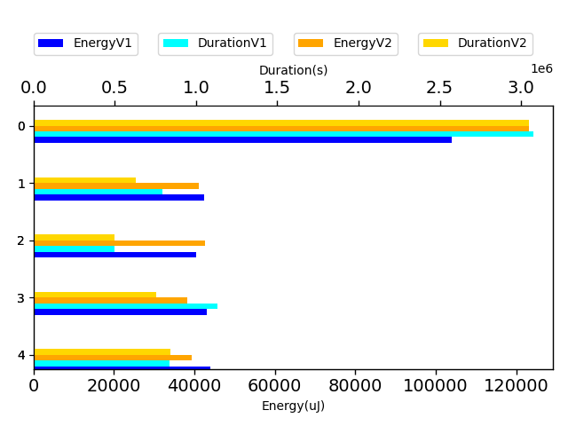

## com.google.gson.functional.RuntimeTypeAdapterFactoryFunctionalTest

| Test | IterationV1 | IterationV2 | DeltaIteration |
| --- | --- | --- | --- |
| com.google.gson.functional.RuntimeTypeAdapterFactoryFunctionalTest-testSubclassesAutomaticallySerialized | 99 | 99 | 0 |

| Test | EnergyV1 | EnergyV2 | DeltaEnergy |
| --- | --- | --- | --- |
| com.google.gson.functional.RuntimeTypeAdapterFactoryFunctionalTest-testSubclassesAutomaticallySerialized | 175191.150417905 | 148885.50294337102 | -26305.647474533995 |

| Test | DurationV1 | DurationsV2 | DeltaDuration |
| --- | --- | --- | --- |
| com.google.gson.functional.RuntimeTypeAdapterFactoryFunctionalTest-testSubclassesAutomaticallySerialized | 4146484.3904198194 | 3425361.713459813 | -721122.6769600064 |

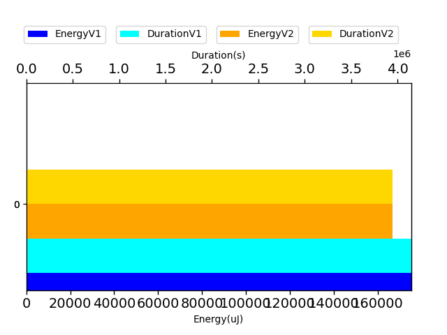

## com.google.gson.functional.StringTest

| Test | IterationV1 | IterationV2 | DeltaIteration |
| --- | --- | --- | --- |
| com.google.gson.functional.StringTest-testEscapedCtrlRInStringSerialization | 18 | 11 | -7 |
| com.google.gson.functional.StringTest-testEscapedCtrlNInStringSerialization | 16 | 12 | -4 |
| com.google.gson.functional.StringTest-testSingleQuoteInStringSerialization | 22 | 17 | -5 |
| com.google.gson.functional.StringTest-testJavascriptKeywordsInStringSerialization | 11 | 16 | 5 |
| com.google.gson.functional.StringTest-testAssignmentCharSerialization | 10 | 7 | -3 |
| com.google.gson.functional.StringTest-testStringValueAsSingleElementArraySerialization | 25 | 23 | -2 |
| com.google.gson.functional.StringTest-testEscapingQuotesInStringSerialization | 14 | 11 | -3 |
| com.google.gson.functional.StringTest-testStringValueSerialization | 18 | 20 | 2 |
| com.google.gson.functional.StringTest-testEscapedBackslashInStringSerialization | 10 | 17 | 7 |

| Test | EnergyV1 | EnergyV2 | DeltaEnergy |
| --- | --- | --- | --- |
| com.google.gson.functional.StringTest-testEscapedCtrlRInStringSerialization | 43051.93286514282 | 45569.390625 | 2517.4577598571777 |
| com.google.gson.functional.StringTest-testEscapedCtrlNInStringSerialization | 41718.70413208008 | 46400.68212890625 | 4681.977996826172 |
| com.google.gson.functional.StringTest-testSingleQuoteInStringSerialization | 40319.03329563141 | 45069.24904632568 | 4750.215750694275 |
| com.google.gson.functional.StringTest-testJavascriptKeywordsInStringSerialization | 42353.55078125 | 41782.53234863281 | -571.0184326171875 |
| com.google.gson.functional.StringTest-testAssignmentCharSerialization | 43513.16796875 | 40428.046875 | -3085.12109375 |
| com.google.gson.functional.StringTest-testStringValueAsSingleElementArraySerialization | 39932.309703588486 | 42438.42862057686 | 2506.118916988373 |
| com.google.gson.functional.StringTest-testEscapingQuotesInStringSerialization | 42864.69775390625 | 40465.236328125 | -2399.46142578125 |
| com.google.gson.functional.StringTest-testStringValueSerialization | 40905.18748474121 | 41590.80623435974 | 685.6187496185303 |
| com.google.gson.functional.StringTest-testEscapedBackslashInStringSerialization | 42876.044921875 | 44643.001052856445 | 1766.9561309814453 |

| Test | DurationV1 | DurationsV2 | DeltaDuration |
| --- | --- | --- | --- |
| com.google.gson.functional.StringTest-testEscapedCtrlRInStringSerialization | 370365.76753616333 | 297853.986328125 | -72511.78120803833 |
| com.google.gson.functional.StringTest-testEscapedCtrlNInStringSerialization | 459841.25717163086 | 354220.5185546875 | -105620.73861694336 |
| com.google.gson.functional.StringTest-testSingleQuoteInStringSerialization | 715375.06320858 | 463496.6508026123 | -251878.4124059677 |
| com.google.gson.functional.StringTest-testJavascriptKeywordsInStringSerialization | 300973.642578125 | 309017.7516784668 | 8044.109100341797 |
| com.google.gson.functional.StringTest-testAssignmentCharSerialization | 331760.537109375 | 476074.640625 | 144314.103515625 |
| com.google.gson.functional.StringTest-testStringValueAsSingleElementArraySerialization | 646829.0240912437 | 570372.7774317265 | -76456.24665951729 |
| com.google.gson.functional.StringTest-testEscapingQuotesInStringSerialization | 352981.7624511719 | 503027.568359375 | 150045.80590820312 |
| com.google.gson.functional.StringTest-testStringValueSerialization | 394500.88468933105 | 482341.73159599304 | 87840.84690666199 |
| com.google.gson.functional.StringTest-testEscapedBackslashInStringSerialization | 325534.42578125 | 355345.70988464355 | 29811.284103393555 |

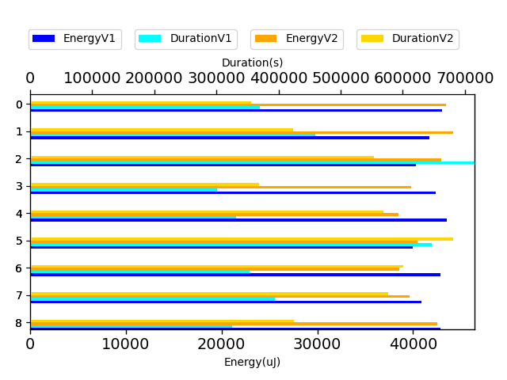

## com.google.gson.functional.PrimitiveTest

| Test | IterationV1 | IterationV2 | DeltaIteration |
| --- | --- | --- | --- |
| com.google.gson.functional.PrimitiveTest-testPrimitiveIntegerAutoboxedSerialization | 16 | 18 | 2 |
| com.google.gson.functional.PrimitiveTest-testFloatInfinitySerialization | 14 | 10 | -4 |
| com.google.gson.functional.PrimitiveTest-testBigIntegerInASingleElementArraySerialization | 30 | 24 | -6 |
| com.google.gson.functional.PrimitiveTest-testNegativeInfinitySerializationNotSupportedByDefault | 17 | 20 | 3 |
| com.google.gson.functional.PrimitiveTest-testDoubleNaNSerialization | 15 | 14 | -1 |
| com.google.gson.functional.PrimitiveTest-testBigDecimalInASingleElementArraySerialization | 21 | 17 | -4 |
| com.google.gson.functional.PrimitiveTest-testMoreSpecificSerialization | 29 | 33 | 4 |
| com.google.gson.functional.PrimitiveTest-testPrimitiveDoubleAutoboxedInASingleElementArraySerialization | 19 | 21 | 2 |
| com.google.gson.functional.PrimitiveTest-testPrimitiveIntegerAutoboxedInASingleElementArraySerialization | 17 | 22 | 5 |
| com.google.gson.functional.PrimitiveTest-testLongAsStringSerialization | 23 | 19 | -4 |
| com.google.gson.functional.PrimitiveTest-testPrimitiveLongAutoboxedInASingleElementArraySerialization | 21 | 22 | 1 |
| com.google.gson.functional.PrimitiveTest-testSmallValueForBigDecimalSerialization | 15 | 15 | 0 |
| com.google.gson.functional.PrimitiveTest-testBigDecimalSerialization | 57 | 54 | -3 |
| com.google.gson.functional.PrimitiveTest-testDoubleInfinitySerializationNotSupportedByDefault | 15 | 15 | 0 |
| com.google.gson.functional.PrimitiveTest-testPrimitiveBooleanAutoboxedInASingleElementArraySerialization | 18 | 24 | 6 |
| com.google.gson.functional.PrimitiveTest-testPrimitiveDoubleAutoboxedSerialization | 29 | 31 | 2 |
| com.google.gson.functional.PrimitiveTest-testPrimitiveBooleanAutoboxedSerialization | 14 | 16 | 2 |
| com.google.gson.functional.PrimitiveTest-testDoubleNaNSerializationNotSupportedByDefault | 12 | 15 | 3 |
| com.google.gson.functional.PrimitiveTest-testNegativeInfinityFloatSerializationNotSupportedByDefault | 11 | 12 | 1 |
| com.google.gson.functional.PrimitiveTest-testShortSerialization | 19 | 14 | -5 |
| com.google.gson.functional.PrimitiveTest-testBigIntegerSerialization | 52 | 54 | 2 |
| com.google.gson.functional.PrimitiveTest-testHtmlCharacterSerialization | 19 | 29 | 10 |
| com.google.gson.functional.PrimitiveTest-testNegativeInfinitySerialization | 17 | 15 | -2 |
| com.google.gson.functional.PrimitiveTest-testByteSerialization | 15 | 14 | -1 |
| com.google.gson.functional.PrimitiveTest-testFloatInfinitySerializationNotSupportedByDefault | 14 | 12 | -2 |
| com.google.gson.functional.PrimitiveTest-testFloatNaNSerialization | 14 | 11 | -3 |
| com.google.gson.functional.PrimitiveTest-testSmallValueForBigIntegerSerialization | 14 | 13 | -1 |
| com.google.gson.functional.PrimitiveTest-testFloatNaNSerializationNotSupportedByDefault | 15 | 17 | 2 |
| com.google.gson.functional.PrimitiveTest-testNumberSerialization | 17 | 21 | 4 |
| com.google.gson.functional.PrimitiveTest-testBigDecimalPreservePrecisionSerialization | 15 | 18 | 3 |
| com.google.gson.functional.PrimitiveTest-testQuotedStringSerializationAndDeserialization | 18 | 21 | 3 |
| com.google.gson.functional.PrimitiveTest-testDoubleInfinitySerialization | 13 | 10 | -3 |
| com.google.gson.functional.PrimitiveTest-testReallyLongValuesSerialization | 10 | 19 | 9 |
| com.google.gson.functional.PrimitiveTest-testPrimitiveLongAutoboxedSerialization | 12 | 12 | 0 |
| com.google.gson.functional.PrimitiveTest-testNegativeInfinityFloatSerialization | 13 | 17 | 4 |

| Test | EnergyV1 | EnergyV2 | DeltaEnergy |
| --- | --- | --- | --- |
| com.google.gson.functional.PrimitiveTest-testPrimitiveIntegerAutoboxedSerialization | 43789.1950378418 | 58702.428886413574 | 14913.233848571777 |
| com.google.gson.functional.PrimitiveTest-testFloatInfinitySerialization | 45584.58270263672 | 42391.328125 | -3193.2545776367188 |
| com.google.gson.functional.PrimitiveTest-testBigIntegerInASingleElementArraySerialization | 40947.26006201282 | 43046.16768705845 | 2098.9076250456274 |
| com.google.gson.functional.PrimitiveTest-testNegativeInfinitySerializationNotSupportedByDefault | 42793.60467529297 | 42463.30343055725 | -330.3012447357178 |
| com.google.gson.functional.PrimitiveTest-testDoubleNaNSerialization | 42419.35610961914 | 42774.32604980469 | 354.9699401855469 |
| com.google.gson.functional.PrimitiveTest-testBigDecimalInASingleElementArraySerialization | 42763.33804607391 | 43409.75079345703 | 646.4127473831177 |
| com.google.gson.functional.PrimitiveTest-testMoreSpecificSerialization | 54986.17331665009 | 46296.03678457579 | -8690.136532074306 |
| com.google.gson.functional.PrimitiveTest-testPrimitiveDoubleAutoboxedInASingleElementArraySerialization | 42098.17551803589 | 41559.799691200256 | -538.3758268356323 |
| com.google.gson.functional.PrimitiveTest-testPrimitiveIntegerAutoboxedInASingleElementArraySerialization | 45541.5174407959 | 41319.12409448624 | -4222.393346309662 |
| com.google.gson.functional.PrimitiveTest-testLongAsStringSerialization | 45078.12777757645 | 42819.88886642456 | -2258.238911151886 |
| com.google.gson.functional.PrimitiveTest-testPrimitiveLongAutoboxedInASingleElementArraySerialization | 43657.43741893768 | 42330.683656692505 | -1326.7537622451782 |
| com.google.gson.functional.PrimitiveTest-testSmallValueForBigDecimalSerialization | 41006.623596191406 | 44149.25732421875 | 3142.6337280273438 |
| com.google.gson.functional.PrimitiveTest-testBigDecimalSerialization | 62854.79895840885 | 57231.74358594447 | -5623.055372464383 |
| com.google.gson.functional.PrimitiveTest-testDoubleInfinitySerializationNotSupportedByDefault | 41790.14306640625 | 43649.01574707031 | 1858.8726806640625 |
| com.google.gson.functional.PrimitiveTest-testPrimitiveBooleanAutoboxedInASingleElementArraySerialization | 44131.774826049805 | 43747.18964219093 | -384.58518385887146 |
| com.google.gson.functional.PrimitiveTest-testPrimitiveDoubleAutoboxedSerialization | 56144.538078363985 | 42255.294154219795 | -13889.24392414419 |
| com.google.gson.functional.PrimitiveTest-testPrimitiveBooleanAutoboxedSerialization | 44099.361083984375 | 41528.53936767578 | -2570.8217163085938 |
| com.google.gson.functional.PrimitiveTest-testDoubleNaNSerializationNotSupportedByDefault | 43628.1533203125 | 43218.95935058594 | -409.1939697265625 |
| com.google.gson.functional.PrimitiveTest-testNegativeInfinityFloatSerializationNotSupportedByDefault | 42726.5263671875 | 40955.82177734375 | -1770.70458984375 |
| com.google.gson.functional.PrimitiveTest-testShortSerialization | 44413.44968032837 | 41308.638671875 | -3104.811008453369 |
| com.google.gson.functional.PrimitiveTest-testBigIntegerSerialization | 44913.54488285567 | 42272.16561754035 | -2641.3792653153214 |
| com.google.gson.functional.PrimitiveTest-testHtmlCharacterSerialization | 43011.22957229614 | 43908.984532985836 | 897.7549606896937 |
| com.google.gson.functional.PrimitiveTest-testNegativeInfinitySerialization | 44451.559967041016 | 43422.18325805664 | -1029.376708984375 |
| com.google.gson.functional.PrimitiveTest-testByteSerialization | 46868.66638183594 | 42050.9228515625 | -4817.7435302734375 |
| com.google.gson.functional.PrimitiveTest-testFloatInfinitySerializationNotSupportedByDefault | 41378.30236816406 | 43142.98291015625 | 1764.6805419921875 |
| com.google.gson.functional.PrimitiveTest-testFloatNaNSerialization | 39644.19006347656 | 41835.3515625 | 2191.1614990234375 |
| com.google.gson.functional.PrimitiveTest-testSmallValueForBigIntegerSerialization | 41873.87585449219 | 42660.63232421875 | 786.7564697265625 |
| com.google.gson.functional.PrimitiveTest-testFloatNaNSerializationNotSupportedByDefault | 42781.326232910156 | 42361.833755493164 | -419.4924774169922 |
| com.google.gson.functional.PrimitiveTest-testNumberSerialization | 40460.24822998047 | 43408.65527534485 | 2948.40704536438 |
| com.google.gson.functional.PrimitiveTest-testBigDecimalPreservePrecisionSerialization | 43110.648864746094 | 39324.9527053833 | -3785.696159362793 |
| com.google.gson.functional.PrimitiveTest-testQuotedStringSerializationAndDeserialization | 39684.83596038818 | 51434.635749816895 | 11749.799789428711 |
| com.google.gson.functional.PrimitiveTest-testDoubleInfinitySerialization | 41735.24853515625 | 44380.640625 | 2645.39208984375 |
| com.google.gson.functional.PrimitiveTest-testReallyLongValuesSerialization | 44115.576171875 | 38357.96608734131 | -5757.610084533691 |
| com.google.gson.functional.PrimitiveTest-testPrimitiveLongAutoboxedSerialization | 42859.0439453125 | 40076.2275390625 | -2782.81640625 |
| com.google.gson.functional.PrimitiveTest-testNegativeInfinityFloatSerialization | 43265.82958984375 | 41123.310150146484 | -2142.5194396972656 |

| Test | DurationV1 | DurationsV2 | DeltaDuration |
| --- | --- | --- | --- |
| com.google.gson.functional.PrimitiveTest-testPrimitiveIntegerAutoboxedSerialization | 375753.58389282227 | 2019279.2651367188 | 1643525.6812438965 |
| com.google.gson.functional.PrimitiveTest-testFloatInfinitySerialization | 404511.04998779297 | 373522.47265625 | -30988.57733154297 |
| com.google.gson.functional.PrimitiveTest-testBigIntegerInASingleElementArraySerialization | 476531.61360474955 | 549638.2668609619 | 73106.65325621236 |
| com.google.gson.functional.PrimitiveTest-testNegativeInfinitySerializationNotSupportedByDefault | 426934.51906585693 | 339636.49687194824 | -87298.02219390869 |
| com.google.gson.functional.PrimitiveTest-testDoubleNaNSerialization | 375271.88958740234 | 322486.9914550781 | -52784.89813232422 |
| com.google.gson.functional.PrimitiveTest-testBigDecimalInASingleElementArraySerialization | 419607.6171607971 | 494828.3984375 | 75220.78127670288 |
| com.google.gson.functional.PrimitiveTest-testMoreSpecificSerialization | 788919.3811359443 | 581762.2337383744 | -207157.14739756985 |
| com.google.gson.functional.PrimitiveTest-testPrimitiveDoubleAutoboxedInASingleElementArraySerialization | 508204.9691925049 | 492357.6093406677 | -15847.359851837158 |
| com.google.gson.functional.PrimitiveTest-testPrimitiveIntegerAutoboxedInASingleElementArraySerialization | 653014.7828369141 | 404782.8378100395 | -248231.94502687454 |
| com.google.gson.functional.PrimitiveTest-testLongAsStringSerialization | 422813.47388768196 | 370990.6923866272 | -51822.781501054764 |
| com.google.gson.functional.PrimitiveTest-testPrimitiveLongAutoboxedInASingleElementArraySerialization | 432890.4020547867 | 410614.3541660309 | -22276.0478887558 |
| com.google.gson.functional.PrimitiveTest-testSmallValueForBigDecimalSerialization | 343580.45416259766 | 335099.1872558594 | -8481.266906738281 |
| com.google.gson.functional.PrimitiveTest-testBigDecimalSerialization | 1625726.3349413953 | 1999132.9941795992 | 373406.6592382039 |
| com.google.gson.functional.PrimitiveTest-testDoubleInfinitySerializationNotSupportedByDefault | 369096.57025146484 | 346388.52673339844 | -22708.043518066406 |
| com.google.gson.functional.PrimitiveTest-testPrimitiveBooleanAutoboxedInASingleElementArraySerialization | 506130.4062652588 | 359387.68036830425 | -146742.72589695454 |
| com.google.gson.functional.PrimitiveTest-testPrimitiveDoubleAutoboxedSerialization | 905085.5421689935 | 930502.7360359724 | 25417.193866978865 |
| com.google.gson.functional.PrimitiveTest-testPrimitiveBooleanAutoboxedSerialization | 344523.212890625 | 366825.72357177734 | 22302.510681152344 |
| com.google.gson.functional.PrimitiveTest-testDoubleNaNSerializationNotSupportedByDefault | 415659.73876953125 | 367808.3411254883 | -47851.39764404297 |
| com.google.gson.functional.PrimitiveTest-testNegativeInfinityFloatSerializationNotSupportedByDefault | 350648.765625 | 345626.55078125 | -5022.21484375 |
| com.google.gson.functional.PrimitiveTest-testShortSerialization | 416961.58306884766 | 591219.6483154297 | 174258.06524658203 |
| com.google.gson.functional.PrimitiveTest-testBigIntegerSerialization | 1090160.7101220023 | 1109036.786395513 | 18876.0762735107 |
| com.google.gson.functional.PrimitiveTest-testHtmlCharacterSerialization | 378192.3276901245 | 338157.9060854651 | -40034.42160465941 |
| com.google.gson.functional.PrimitiveTest-testNegativeInfinitySerialization | 400287.822555542 | 386481.2119140625 | -13806.610641479492 |
| com.google.gson.functional.PrimitiveTest-testByteSerialization | 346329.4293823242 | 323755.3681640625 | -22574.06121826172 |
| com.google.gson.functional.PrimitiveTest-testFloatInfinitySerializationNotSupportedByDefault | 343703.7458496094 | 332728.83740234375 | -10974.908447265625 |
| com.google.gson.functional.PrimitiveTest-testFloatNaNSerialization | 398277.2303466797 | 325326.015625 | -72951.21472167969 |
| com.google.gson.functional.PrimitiveTest-testSmallValueForBigIntegerSerialization | 366309.8631591797 | 331028.9670410156 | -35280.89611816406 |
| com.google.gson.functional.PrimitiveTest-testFloatNaNSerializationNotSupportedByDefault | 384505.580078125 | 349202.34059143066 | -35303.239486694336 |
| com.google.gson.functional.PrimitiveTest-testNumberSerialization | 315144.77180480957 | 413874.1534099579 | 98729.38160514832 |
| com.google.gson.functional.PrimitiveTest-testBigDecimalPreservePrecisionSerialization | 367840.451171875 | 405072.70027923584 | 37232.24910736084 |
| com.google.gson.functional.PrimitiveTest-testQuotedStringSerializationAndDeserialization | 692939.1090621948 | 795293.8513936996 | 102354.74233150482 |
| com.google.gson.functional.PrimitiveTest-testDoubleInfinitySerialization | 337879.7077636719 | 354888.96484375 | 17009.257080078125 |
| com.google.gson.functional.PrimitiveTest-testReallyLongValuesSerialization | 418145.169921875 | 530275.2108039856 | 112130.0408821106 |
| com.google.gson.functional.PrimitiveTest-testPrimitiveLongAutoboxedSerialization | 296292.962890625 | 472462.05859375 | 176169.095703125 |
| com.google.gson.functional.PrimitiveTest-testNegativeInfinityFloatSerialization | 335438.4895019531 | 357943.62908935547 | 22505.139587402344 |

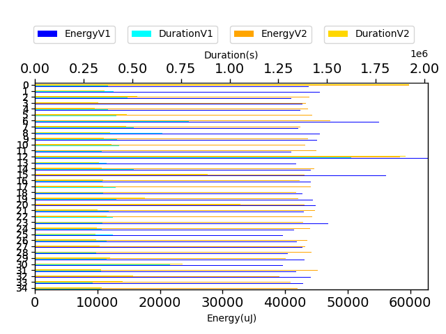

## com.google.gson.functional.ConcurrencyTest

| Test | IterationV1 | IterationV2 | DeltaIteration |
| --- | --- | --- | --- |
| com.google.gson.functional.ConcurrencyTest-testSingleThreadSerialization | 64 | 66 | 2 |
| com.google.gson.functional.ConcurrencyTest-testMultiThreadSerialization | 99 | 99 | 0 |

| Test | EnergyV1 | EnergyV2 | DeltaEnergy |
| --- | --- | --- | --- |
| com.google.gson.functional.ConcurrencyTest-testSingleThreadSerialization | 43394.155730578284 | 45664.92500831834 | 2270.769277740059 |
| com.google.gson.functional.ConcurrencyTest-testMultiThreadSerialization | 310608.3215790867 | 389655.8839171636 | 79047.56233807688 |

| Test | DurationV1 | DurationsV2 | DeltaDuration |
| --- | --- | --- | --- |
| com.google.gson.functional.ConcurrencyTest-testSingleThreadSerialization | 1231189.6901170479 | 739178.8982655505 | -492010.7918514974 |
| com.google.gson.functional.ConcurrencyTest-testMultiThreadSerialization | 7164089.502348704 | 9363491.590595718 | 2199402.088247014 |

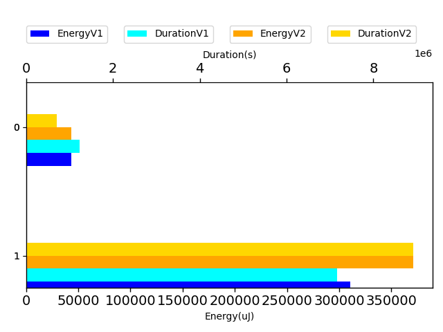

## com.google.gson.functional.FieldNamingTest

| Test | IterationV1 | IterationV2 | DeltaIteration |
| --- | --- | --- | --- |
| com.google.gson.functional.FieldNamingTest-testIdentity | 88 | 88 | 0 |
| com.google.gson.functional.FieldNamingTest-testLowerCaseWithUnderscores | 43 | 41 | -2 |
| com.google.gson.functional.FieldNamingTest-testLowerCaseWithDashes | 34 | 41 | 7 |
| com.google.gson.functional.FieldNamingTest-testUpperCamelCaseWithSpaces | 37 | 41 | 4 |
| com.google.gson.functional.FieldNamingTest-testUpperCamelCase | 44 | 35 | -9 |

| Test | EnergyV1 | EnergyV2 | DeltaEnergy |
| --- | --- | --- | --- |
| com.google.gson.functional.FieldNamingTest-testIdentity | 45698.06742733525 | 43211.21519812796 | -2486.8522292072885 |
| com.google.gson.functional.FieldNamingTest-testLowerCaseWithUnderscores | 42949.12110903722 | 42200.673245513724 | -748.4478635234991 |
| com.google.gson.functional.FieldNamingTest-testLowerCaseWithDashes | 40985.59417633398 | 42450.245944175156 | 1464.6517678411765 |
| com.google.gson.functional.FieldNamingTest-testUpperCamelCaseWithSpaces | 43038.071388213415 | 41171.71045164179 | -1866.3609365716256 |
| com.google.gson.functional.FieldNamingTest-testUpperCamelCase | 44114.33901191387 | 41521.379761479446 | -2592.9592504344255 |

| Test | DurationV1 | DurationsV2 | DeltaDuration |
| --- | --- | --- | --- |
| com.google.gson.functional.FieldNamingTest-testIdentity | 1003666.373151012 | 1094621.4689728082 | 90955.09582179622 |
| com.google.gson.functional.FieldNamingTest-testLowerCaseWithUnderscores | 869697.2675201764 | 537565.7402687198 | -332131.5272514565 |
| com.google.gson.functional.FieldNamingTest-testLowerCaseWithDashes | 595874.7747691907 | 523975.5174335146 | -71899.25733567611 |
| com.google.gson.functional.FieldNamingTest-testUpperCamelCaseWithSpaces | 731625.1300731439 | 586124.4343525225 | -145500.69572062138 |
| com.google.gson.functional.FieldNamingTest-testUpperCamelCase | 741319.9404996615 | 581638.9300433667 | -159681.01045629475 |

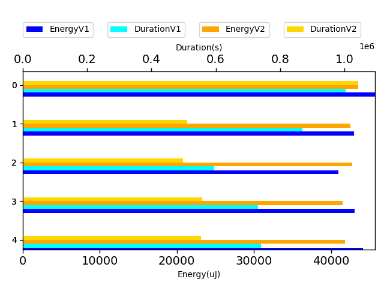

## com.google.gson.functional.RawSerializationTest

| Test | IterationV1 | IterationV2 | DeltaIteration |
| --- | --- | --- | --- |
| com.google.gson.functional.RawSerializationTest-testThreeLevelParameterizedObject | 83 | 84 | 1 |
| com.google.gson.functional.RawSerializationTest-testParameterizedObject | 86 | 84 | -2 |
| com.google.gson.functional.RawSerializationTest-testTwoLevelParameterizedObject | 73 | 69 | -4 |
| com.google.gson.functional.RawSerializationTest-testCollectionOfObjects | 63 | 71 | 8 |
| com.google.gson.functional.RawSerializationTest-testCollectionOfPrimitives | 29 | 31 | 2 |

| Test | EnergyV1 | EnergyV2 | DeltaEnergy |
| --- | --- | --- | --- |
| com.google.gson.functional.RawSerializationTest-testThreeLevelParameterizedObject | 45718.62956671172 | 44267.575057617345 | -1451.0545090943779 |
| com.google.gson.functional.RawSerializationTest-testParameterizedObject | 49412.55016720956 | 50645.48786043284 | 1232.9376932232772 |
| com.google.gson.functional.RawSerializationTest-testTwoLevelParameterizedObject | 40884.313320537105 | 46192.755788621114 | 5308.442468084009 |
| com.google.gson.functional.RawSerializationTest-testCollectionOfObjects | 50219.723249775256 | 43680.067534780115 | -6539.65571499514 |
| com.google.gson.functional.RawSerializationTest-testCollectionOfPrimitives | 110705.54347402975 | 44295.359325957485 | -66410.18414807227 |

| Test | DurationV1 | DurationsV2 | DeltaDuration |
| --- | --- | --- | --- |
| com.google.gson.functional.RawSerializationTest-testThreeLevelParameterizedObject | 1052023.3558314834 | 1006995.9502624967 | -45027.405568986665 |
| com.google.gson.functional.RawSerializationTest-testParameterizedObject | 1159207.5725460476 | 1138306.36059529 | -20901.21195075754 |
| com.google.gson.functional.RawSerializationTest-testTwoLevelParameterizedObject | 973094.9402256559 | 990305.0779047019 | 17210.13767904602 |
| com.google.gson.functional.RawSerializationTest-testCollectionOfObjects | 972496.6889584848 | 717886.3803825742 | -254610.30857591063 |
| com.google.gson.functional.RawSerializationTest-testCollectionOfPrimitives | 3493177.1519009136 | 485462.2218738543 | -3007714.9300270593 |

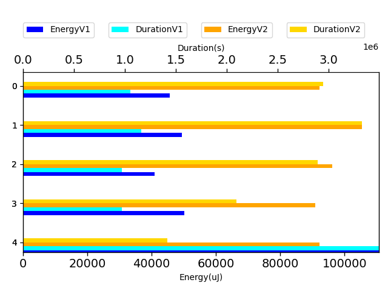

## com.google.gson.functional.SecurityTest

| Test | IterationV1 | IterationV2 | DeltaIteration |
| --- | --- | --- | --- |
| com.google.gson.functional.SecurityTest-testNonExecutableJsonSerialization | 39 | 37 | -2 |
| com.google.gson.functional.SecurityTest-testJsonWithNonExectuableTokenSerialization | 19 | 14 | -5 |

| Test | EnergyV1 | EnergyV2 | DeltaEnergy |
| --- | --- | --- | --- |
| com.google.gson.functional.SecurityTest-testNonExecutableJsonSerialization | 52084.429630199396 | 53102.38083778137 | 1017.951207581973 |
| com.google.gson.functional.SecurityTest-testJsonWithNonExectuableTokenSerialization | 44136.95881652832 | 43058.02392578125 | -1078.9348907470703 |

| Test | DurationV1 | DurationsV2 | DeltaDuration |
| --- | --- | --- | --- |
| com.google.gson.functional.SecurityTest-testNonExecutableJsonSerialization | 932098.8468006183 | 1457534.6019199744 | 525435.7551193561 |
| com.google.gson.functional.SecurityTest-testJsonWithNonExectuableTokenSerialization | 426893.51766967773 | 315259.45068359375 | -111634.06698608398 |

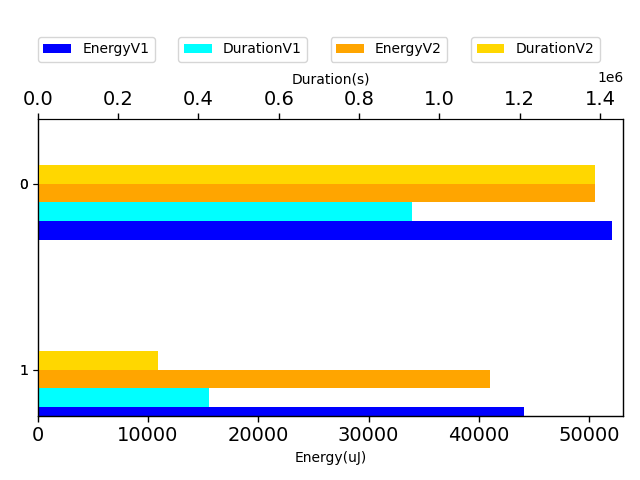

## com.google.gson.functional.MapAsArrayTypeAdapterTest

| Test | IterationV1 | IterationV2 | DeltaIteration |
| --- | --- | --- | --- |
| com.google.gson.functional.MapAsArrayTypeAdapterTest-testSerializeComplexMapWithTypeAdapter | 99 | 99 | 0 |
| com.google.gson.functional.MapAsArrayTypeAdapterTest-testMapWithTypeVariableSerialization | 95 | 89 | -6 |
| com.google.gson.functional.MapAsArrayTypeAdapterTest-testMultipleEnableComplexKeyRegistrationHasNoEffect | 69 | 69 | 0 |

| Test | EnergyV1 | EnergyV2 | DeltaEnergy |
| --- | --- | --- | --- |
| com.google.gson.functional.MapAsArrayTypeAdapterTest-testSerializeComplexMapWithTypeAdapter | 82970.0319489061 | 73214.8629317096 | -9755.169017196487 |
| com.google.gson.functional.MapAsArrayTypeAdapterTest-testMapWithTypeVariableSerialization | 42915.45097162492 | 41420.74505658391 | -1494.7059150410132 |
| com.google.gson.functional.MapAsArrayTypeAdapterTest-testMultipleEnableComplexKeyRegistrationHasNoEffect | 42372.571171052216 | 41386.89421600618 | -985.6769550460376 |

| Test | DurationV1 | DurationsV2 | DeltaDuration |
| --- | --- | --- | --- |
| com.google.gson.functional.MapAsArrayTypeAdapterTest-testSerializeComplexMapWithTypeAdapter | 1998449.9844238786 | 1853273.2725125756 | -145176.711911303 |
| com.google.gson.functional.MapAsArrayTypeAdapterTest-testMapWithTypeVariableSerialization | 1045295.6417986599 | 974741.7981174095 | -70553.84368125047 |
| com.google.gson.functional.MapAsArrayTypeAdapterTest-testMultipleEnableComplexKeyRegistrationHasNoEffect | 805696.9038404555 | 871605.8825253138 | 65908.9786848583 |

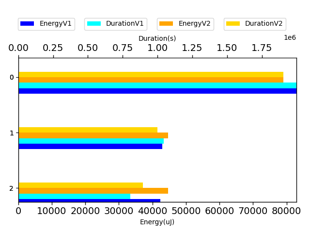

## com.google.gson.functional.CustomTypeAdaptersTest

| Test | IterationV1 | IterationV2 | DeltaIteration |
| --- | --- | --- | --- |
| com.google.gson.functional.CustomTypeAdaptersTest-testCustomTypeAdapterDoesNotAppliesToSubClasses | 84 | 79 | -5 |
| com.google.gson.functional.CustomTypeAdaptersTest-testCustomAdapterInvokedForCollectionElementSerialization | 27 | 20 | -7 |
| com.google.gson.functional.CustomTypeAdaptersTest-testRegisterHierarchyAdapterForDate | 73 | 70 | -3 |
| com.google.gson.functional.CustomTypeAdaptersTest-testCustomAdapterInvokedForCollectionElementSerializationWithType | 88 | 87 | -1 |
| com.google.gson.functional.CustomTypeAdaptersTest-testEnsureCustomSerializerNotInvokedForNullValues | 77 | 85 | 8 |
| com.google.gson.functional.CustomTypeAdaptersTest-testCustomAdapterInvokedForMapElementSerializationWithType | 48 | 50 | 2 |
| com.google.gson.functional.CustomTypeAdaptersTest-testCustomSerializers | 66 | 58 | -8 |
| com.google.gson.functional.CustomTypeAdaptersTest-testCustomSerializerInvokedForPrimitives | 37 | 39 | 2 |
| com.google.gson.functional.CustomTypeAdaptersTest-testCustomNestedSerializers | 61 | 63 | 2 |
| com.google.gson.functional.CustomTypeAdaptersTest-testCustomAdapterInvokedForMapElementSerialization | 17 | 21 | 4 |
| com.google.gson.functional.CustomTypeAdaptersTest-testCustomByteArraySerializer | 44 | 42 | -2 |
| com.google.gson.functional.CustomTypeAdaptersTest-testCustomTypeAdapterAppliesToSubClassesSerializedAsBaseClass | 43 | 50 | 7 |

| Test | EnergyV1 | EnergyV2 | DeltaEnergy |
| --- | --- | --- | --- |
| com.google.gson.functional.CustomTypeAdaptersTest-testCustomTypeAdapterDoesNotAppliesToSubClasses | 44555.048505289174 | 43110.34794827248 | -1444.7005570166948 |
| com.google.gson.functional.CustomTypeAdaptersTest-testCustomAdapterInvokedForCollectionElementSerialization | 44949.658350773156 | 44163.20751667023 | -786.4508341029286 |
| com.google.gson.functional.CustomTypeAdaptersTest-testRegisterHierarchyAdapterForDate | 43677.27003626454 | 72458.22316506544 | 28780.953128800902 |
| com.google.gson.functional.CustomTypeAdaptersTest-testCustomAdapterInvokedForCollectionElementSerializationWithType | 71177.70167237257 | 43899.75590981808 | -27277.94576255449 |
| com.google.gson.functional.CustomTypeAdaptersTest-testEnsureCustomSerializerNotInvokedForNullValues | 43943.87968646268 | 44525.79787714708 | 581.9181906844024 |
| com.google.gson.functional.CustomTypeAdaptersTest-testCustomAdapterInvokedForMapElementSerializationWithType | 43801.001822207196 | 38604.981235836094 | -5196.020586371102 |
| com.google.gson.functional.CustomTypeAdaptersTest-testCustomSerializers | 45377.21371406905 | 269941.0488356822 | 224563.83512161317 |
| com.google.gson.functional.CustomTypeAdaptersTest-testCustomSerializerInvokedForPrimitives | 44870.10298225097 | 45008.45601426416 | 138.3530320131831 |
| com.google.gson.functional.CustomTypeAdaptersTest-testCustomNestedSerializers | 44194.55207509604 | 45030.05539589898 | 835.5033208029345 |
| com.google.gson.functional.CustomTypeAdaptersTest-testCustomAdapterInvokedForMapElementSerialization | 41328.28536987305 | 41060.98349761963 | -267.30187225341797 |
| com.google.gson.functional.CustomTypeAdaptersTest-testCustomByteArraySerializer | 45983.207790843095 | 42402.02748265442 | -3581.1803081886756 |
| com.google.gson.functional.CustomTypeAdaptersTest-testCustomTypeAdapterAppliesToSubClassesSerializedAsBaseClass | 45801.286383149265 | 42028.564686672005 | -3772.7216964772597 |

| Test | DurationV1 | DurationsV2 | DeltaDuration |
| --- | --- | --- | --- |
| com.google.gson.functional.CustomTypeAdaptersTest-testCustomTypeAdapterDoesNotAppliesToSubClasses | 1161525.642761591 | 1098844.040406068 | -62681.6023555228 |
| com.google.gson.functional.CustomTypeAdaptersTest-testCustomAdapterInvokedForCollectionElementSerialization | 588586.6173682585 | 464581.7278356552 | -124004.88953260332 |
| com.google.gson.functional.CustomTypeAdaptersTest-testRegisterHierarchyAdapterForDate | 1189741.4851001306 | 1449473.0486834338 | 259731.56358330324 |
| com.google.gson.functional.CustomTypeAdaptersTest-testCustomAdapterInvokedForCollectionElementSerializationWithType | 1479249.489594014 | 1286693.0860452743 | -192556.40354873962 |
| com.google.gson.functional.CustomTypeAdaptersTest-testEnsureCustomSerializerNotInvokedForNullValues | 1139290.0631135586 | 1195747.9621563493 | 56457.899042790756 |
| com.google.gson.functional.CustomTypeAdaptersTest-testCustomAdapterInvokedForMapElementSerializationWithType | 827686.5389141788 | 916825.2010219235 | 89138.6621077446 |
| com.google.gson.functional.CustomTypeAdaptersTest-testCustomSerializers | 977697.2308021871 | 8231195.602324326 | 7253498.371522139 |
| com.google.gson.functional.CustomTypeAdaptersTest-testCustomSerializerInvokedForPrimitives | 651488.3221812777 | 604014.1044522433 | -47474.21772903437 |
| com.google.gson.functional.CustomTypeAdaptersTest-testCustomNestedSerializers | 950005.4609135679 | 982342.8160052726 | 32337.355091704638 |
| com.google.gson.functional.CustomTypeAdaptersTest-testCustomAdapterInvokedForMapElementSerialization | 344849.6720275879 | 432442.5186595917 | 87592.84663200378 |
| com.google.gson.functional.CustomTypeAdaptersTest-testCustomByteArraySerializer | 672126.5903904254 | 632982.3423803614 | -39144.24801006401 |
| com.google.gson.functional.CustomTypeAdaptersTest-testCustomTypeAdapterAppliesToSubClassesSerializedAsBaseClass | 604206.950095987 | 640126.4082912923 | 35919.45819530531 |

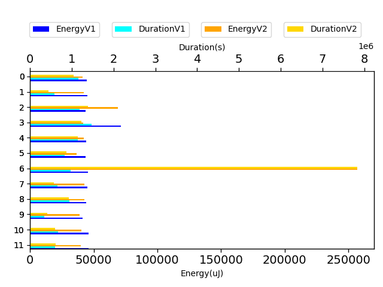

## com.google.gson.functional.CustomSerializerTest

| Test | IterationV1 | IterationV2 | DeltaIteration |
| --- | --- | --- | --- |
| com.google.gson.functional.CustomSerializerTest-testSubClassSerializerInvokedForBaseClassFieldsHoldingSubClassInstances | 68 | 62 | -6 |
| com.google.gson.functional.CustomSerializerTest-testBaseClassSerializerInvokedForBaseClassFieldsHoldingSubClassInstances | 42 | 41 | -1 |
| com.google.gson.functional.CustomSerializerTest-testSerializerReturnsNull | 43 | 39 | -4 |
| com.google.gson.functional.CustomSerializerTest-testSubClassSerializerInvokedForBaseClassFieldsHoldingArrayOfSubClassInstances | 42 | 32 | -10 |
| com.google.gson.functional.CustomSerializerTest-testBaseClassSerializerInvokedForBaseClassFields | 37 | 31 | -6 |

| Test | EnergyV1 | EnergyV2 | DeltaEnergy |
| --- | --- | --- | --- |
| com.google.gson.functional.CustomSerializerTest-testSubClassSerializerInvokedForBaseClassFieldsHoldingSubClassInstances | 96773.42218477918 | 74473.05698478954 | -22300.36519998964 |
| com.google.gson.functional.CustomSerializerTest-testBaseClassSerializerInvokedForBaseClassFieldsHoldingSubClassInstances | 40708.074479213756 | 42745.21729586141 | 2037.1428166476544 |
| com.google.gson.functional.CustomSerializerTest-testSerializerReturnsNull | 42115.33259267337 | 43230.14223584731 | 1114.8096431739395 |
| com.google.gson.functional.CustomSerializerTest-testSubClassSerializerInvokedForBaseClassFieldsHoldingArrayOfSubClassInstances | 44381.35942409318 | 43939.60566390026 | -441.75376019291434 |
| com.google.gson.functional.CustomSerializerTest-testBaseClassSerializerInvokedForBaseClassFields | 41756.57246316572 | 42521.71972807776 | 765.1472649120406 |

| Test | DurationV1 | DurationsV2 | DeltaDuration |
| --- | --- | --- | --- |
| com.google.gson.functional.CustomSerializerTest-testSubClassSerializerInvokedForBaseClassFieldsHoldingSubClassInstances | 2622092.7737713326 | 1365636.548081133 | -1256456.2256901995 |
| com.google.gson.functional.CustomSerializerTest-testBaseClassSerializerInvokedForBaseClassFieldsHoldingSubClassInstances | 553171.0427247 | 548204.1480634811 | -4966.894661218859 |
| com.google.gson.functional.CustomSerializerTest-testSerializerReturnsNull | 612793.1215616141 | 590040.6445059462 | -22752.4770556679 |
| com.google.gson.functional.CustomSerializerTest-testSubClassSerializerInvokedForBaseClassFieldsHoldingArrayOfSubClassInstances | 625419.7110303357 | 581593.7429625278 | -43825.96806780796 |
| com.google.gson.functional.CustomSerializerTest-testBaseClassSerializerInvokedForBaseClassFields | 502204.2402419538 | 494298.5718415985 | -7905.668400355324 |

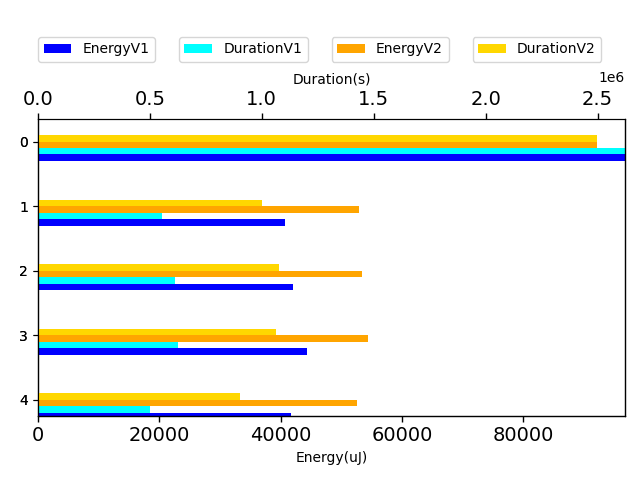

## com.google.gson.functional.PrettyPrintingTest

| Test | IterationV1 | IterationV2 | DeltaIteration |
| --- | --- | --- | --- |
| com.google.gson.functional.PrettyPrintingTest-testMap | 25 | 32 | 7 |
| com.google.gson.functional.PrettyPrintingTest-testPrettyPrintArrayOfObjects | 57 | 42 | -15 |
| com.google.gson.functional.PrettyPrintingTest-testPrettyPrintList | 79 | 67 | -12 |
| com.google.gson.functional.PrettyPrintingTest-testMultipleArrays | 30 | 20 | -10 |
| com.google.gson.functional.PrettyPrintingTest-testPrettyPrintArrayOfPrimitiveArrays | 19 | 19 | 0 |
| com.google.gson.functional.PrettyPrintingTest-testPrettyPrintListOfPrimitiveArrays | 38 | 28 | -10 |
| com.google.gson.functional.PrettyPrintingTest-testEmptyMapField | 59 | 73 | 14 |
| com.google.gson.functional.PrettyPrintingTest-testPrettyPrintArrayOfPrimitives | 19 | 10 | -9 |

| Test | EnergyV1 | EnergyV2 | DeltaEnergy |
| --- | --- | --- | --- |
| com.google.gson.functional.PrettyPrintingTest-testMap | 42692.58413049579 | 42431.70721309399 | -260.87691740179434 |
| com.google.gson.functional.PrettyPrintingTest-testPrettyPrintArrayOfObjects | 61486.24283398285 | 54004.839545858646 | -7481.403288124202 |
| com.google.gson.functional.PrettyPrintingTest-testPrettyPrintList | 44319.56209611078 | 131835.58012692322 | 87516.01803081244 |
| com.google.gson.functional.PrettyPrintingTest-testMultipleArrays | 44196.701362391 | 39704.380279541016 | -4492.321082849987 |
| com.google.gson.functional.PrettyPrintingTest-testPrettyPrintArrayOfPrimitiveArrays | 42472.91618347168 | 40095.22534942627 | -2377.69083404541 |
| com.google.gson.functional.PrettyPrintingTest-testPrettyPrintListOfPrimitiveArrays | 42211.425104226575 | 37367.52633570135 | -4843.898768525229 |
| com.google.gson.functional.PrettyPrintingTest-testEmptyMapField | 47195.222500675634 | 54299.82726082681 | 7104.604760151175 |
| com.google.gson.functional.PrettyPrintingTest-testPrettyPrintArrayOfPrimitives | 43230.14122772217 | 38048.783203125 | -5181.358024597168 |

| Test | DurationV1 | DurationsV2 | DeltaDuration |
| --- | --- | --- | --- |
| com.google.gson.functional.PrettyPrintingTest-testMap | 406157.5263504088 | 451606.52725428436 | 45449.00090387557 |
| com.google.gson.functional.PrettyPrintingTest-testPrettyPrintArrayOfObjects | 1179966.4426509517 | 1408695.5276599592 | 228729.08500900748 |
| com.google.gson.functional.PrettyPrintingTest-testPrettyPrintList | 1501915.1704908232 | 4144022.7430893243 | 2642107.572598501 |
| com.google.gson.functional.PrettyPrintingTest-testMultipleArrays | 532158.5987345437 | 555514.1363601685 | 23355.5376256248 |
| com.google.gson.functional.PrettyPrintingTest-testPrettyPrintArrayOfPrimitiveArrays | 580935.7984695435 | 425156.5593948364 | -155779.23907470703 |
| com.google.gson.functional.PrettyPrintingTest-testPrettyPrintListOfPrimitiveArrays | 478305.478725433 | 865455.9285344966 | 387150.4498090636 |
| com.google.gson.functional.PrettyPrintingTest-testEmptyMapField | 1372834.774926795 | 1555784.752388209 | 182949.97746141418 |
| com.google.gson.functional.PrettyPrintingTest-testPrettyPrintArrayOfPrimitives | 474876.2807197571 | 729552.86328125 | 254676.58256149292 |

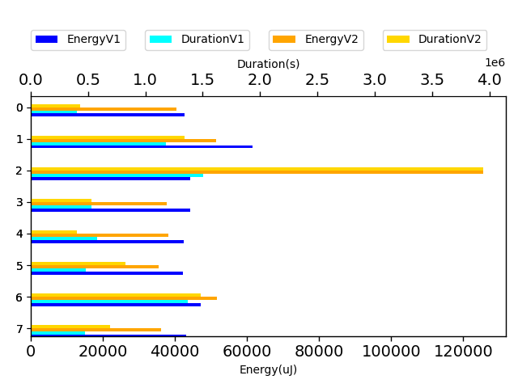

## com.google.gson.functional.JsonTreeTest

| Test | IterationV1 | IterationV2 | DeltaIteration |
| --- | --- | --- | --- |
| com.google.gson.functional.JsonTreeTest-testJsonTreeToString | 69 | 72 | 3 |
| com.google.gson.functional.JsonTreeTest-testToJsonTreeObjectType | 65 | 66 | 1 |
| com.google.gson.functional.JsonTreeTest-testJsonTreeNull | 35 | 35 | 0 |
| com.google.gson.functional.JsonTreeTest-testToJsonTree | 52 | 53 | 1 |

| Test | EnergyV1 | EnergyV2 | DeltaEnergy |
| --- | --- | --- | --- |
| com.google.gson.functional.JsonTreeTest-testJsonTreeToString | 57982.48555019987 | 113404.9620770443 | 55422.47652684443 |
| com.google.gson.functional.JsonTreeTest-testToJsonTreeObjectType | 44172.2730861615 | 43238.57555654613 | -933.6975296153687 |
| com.google.gson.functional.JsonTreeTest-testJsonTreeNull | 45624.61101898656 | 41417.52563221374 | -4207.085386772815 |
| com.google.gson.functional.JsonTreeTest-testToJsonTree | 75576.06334904672 | 60702.06800542133 | -14873.995343625385 |

| Test | DurationV1 | DurationsV2 | DeltaDuration |
| --- | --- | --- | --- |
| com.google.gson.functional.JsonTreeTest-testJsonTreeToString | 1484896.1150745489 | 3394226.043906647 | 1909329.928832098 |
| com.google.gson.functional.JsonTreeTest-testToJsonTreeObjectType | 888885.8125975896 | 957747.5034420256 | 68861.69084443606 |
| com.google.gson.functional.JsonTreeTest-testJsonTreeNull | 759979.4076235723 | 903197.0236443726 | 143217.6160208003 |
| com.google.gson.functional.JsonTreeTest-testToJsonTree | 1662561.6843344374 | 1360587.1609392804 | -301974.52339515695 |

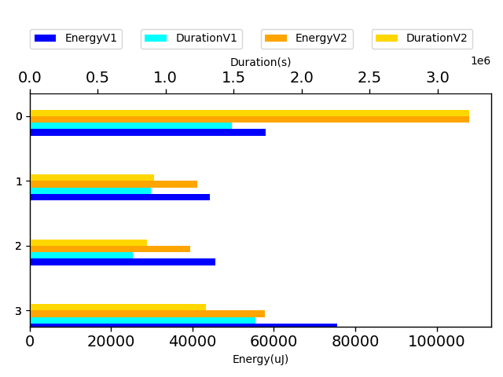

## com.google.gson.GsonTypeAdapterTest

| Test | IterationV1 | IterationV2 | DeltaIteration |
| --- | --- | --- | --- |
| com.google.gson.GsonTypeAdapterTest-testTypeAdapterThrowsException | 29 | 24 | -5 |
| com.google.gson.GsonTypeAdapterTest-testDeserializerForAbstractClass | 99 | 98 | -1 |
| com.google.gson.GsonTypeAdapterTest-testTypeAdapterProperlyConvertsTypes | 23 | 19 | -4 |
| com.google.gson.GsonTypeAdapterTest-testTypeAdapterDoesNotAffectNonAdaptedTypes | 18 | 21 | 3 |

| Test | EnergyV1 | EnergyV2 | DeltaEnergy |
| --- | --- | --- | --- |
| com.google.gson.GsonTypeAdapterTest-testTypeAdapterThrowsException | 84165.39165397361 | 43983.17606604099 | -40182.21558793262 |
| com.google.gson.GsonTypeAdapterTest-testDeserializerForAbstractClass | 60470.17830927173 | 78162.48381732 | 17692.305508048266 |
| com.google.gson.GsonTypeAdapterTest-testTypeAdapterProperlyConvertsTypes | 42874.270159721375 | 42750.60944747925 | -123.66071224212646 |
| com.google.gson.GsonTypeAdapterTest-testTypeAdapterDoesNotAffectNonAdaptedTypes | 42685.36808013916 | 44338.44680309296 | 1653.0787229537964 |

| Test | DurationV1 | DurationsV2 | DeltaDuration |
| --- | --- | --- | --- |
| com.google.gson.GsonTypeAdapterTest-testTypeAdapterThrowsException | 2802511.28254609 | 486337.1704096794 | -2316174.1121364105 |
| com.google.gson.GsonTypeAdapterTest-testDeserializerForAbstractClass | 1702099.1602694057 | 1718775.19478827 | 16676.03451886424 |
| com.google.gson.GsonTypeAdapterTest-testTypeAdapterProperlyConvertsTypes | 383494.377600193 | 406542.11110305786 | 23047.733502864838 |
| com.google.gson.GsonTypeAdapterTest-testTypeAdapterDoesNotAffectNonAdaptedTypes | 609105.0094146729 | 436733.9664859772 | -172371.04292869568 |

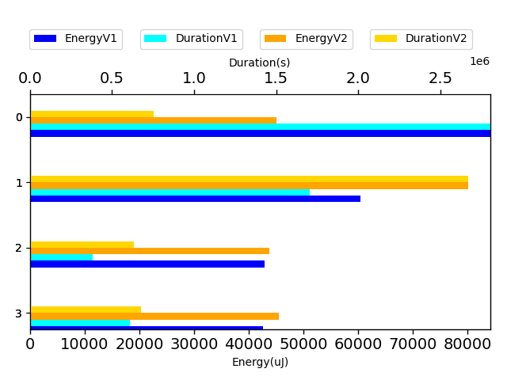

## com.google.gson.MixedStreamTest

| Test | IterationV1 | IterationV2 | DeltaIteration |
| --- | --- | --- | --- |
| com.google.gson.MixedStreamTest-testWriteInvalidState | 24 | 21 | -3 |
| com.google.gson.MixedStreamTest-testWriteHtmlSafe | 64 | 67 | 3 |
| com.google.gson.MixedStreamTest-testWriteLenient | 65 | 61 | -4 |
| com.google.gson.MixedStreamTest-testWriteMixedStreamed | 32 | 36 | 4 |
| com.google.gson.MixedStreamTest-testWriteDoesNotMutateState | 37 | 39 | 2 |
| com.google.gson.MixedStreamTest-testWriteClosed | 26 | 20 | -6 |

| Test | EnergyV1 | EnergyV2 | DeltaEnergy |
| --- | --- | --- | --- |
| com.google.gson.MixedStreamTest-testWriteInvalidState | 43712.106270074844 | 41046.205099105835 | -2665.9011709690094 |
| com.google.gson.MixedStreamTest-testWriteHtmlSafe | 41358.68238057551 | 43060.62068534826 | 1701.938304772746 |
| com.google.gson.MixedStreamTest-testWriteLenient | 47307.75584587972 | 63881.329596335076 | 16573.573750455354 |
| com.google.gson.MixedStreamTest-testWriteMixedStreamed | 45196.51409609942 | 44015.571771790215 | -1180.9423243092024 |
| com.google.gson.MixedStreamTest-testWriteDoesNotMutateState | 45300.29809275034 | 41556.9879324298 | -3743.310160320536 |
| com.google.gson.MixedStreamTest-testWriteClosed | 42985.52672380209 | 45680.0066947937 | 2694.4799709916115 |

| Test | DurationV1 | DurationsV2 | DeltaDuration |
| --- | --- | --- | --- |
| com.google.gson.MixedStreamTest-testWriteInvalidState | 432754.5736371875 | 461791.5619459152 | 29036.98830872774 |
| com.google.gson.MixedStreamTest-testWriteHtmlSafe | 765612.3965974213 | 831755.3441140782 | 66142.94751665695 |
| com.google.gson.MixedStreamTest-testWriteLenient | 715240.7427114203 | 1667746.7619876994 | 952506.0192762791 |
| com.google.gson.MixedStreamTest-testWriteMixedStreamed | 593091.3496948862 | 575005.998553174 | -18085.35114171228 |
| com.google.gson.MixedStreamTest-testWriteDoesNotMutateState | 515425.5273716925 | 432633.75328921614 | -82791.77408247633 |
| com.google.gson.MixedStreamTest-testWriteClosed | 463251.6504354477 | 445481.03851127625 | -17770.611924171448 |

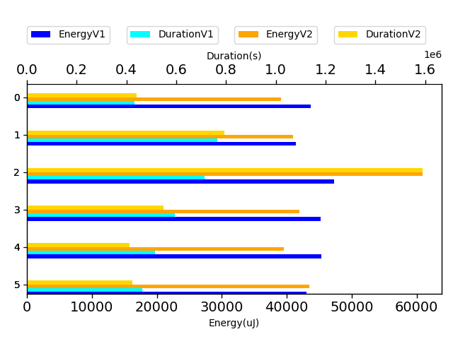

## com.google.gson.functional.InterfaceTest

| Test | IterationV1 | IterationV2 | DeltaIteration |
| --- | --- | --- | --- |
| com.google.gson.functional.InterfaceTest-testSerializingInterfaceObjectField | 62 | 54 | -8 |
| com.google.gson.functional.InterfaceTest-testSerializingObjectImplementingInterface | 47 | 43 | -4 |

| Test | EnergyV1 | EnergyV2 | DeltaEnergy |
| --- | --- | --- | --- |
| com.google.gson.functional.InterfaceTest-testSerializingInterfaceObjectField | 42626.74912450272 | 43593.64596255355 | 966.8968380508304 |
| com.google.gson.functional.InterfaceTest-testSerializingObjectImplementingInterface | 45327.127411638765 | 42688.113034817026 | -2639.0143768217386 |

| Test | DurationV1 | DurationsV2 | DeltaDuration |
| --- | --- | --- | --- |
| com.google.gson.functional.InterfaceTest-testSerializingInterfaceObjectField | 831283.5730640097 | 943862.4534017077 | 112578.88033769804 |
| com.google.gson.functional.InterfaceTest-testSerializingObjectImplementingInterface | 601147.4909843171 | 648949.7503647066 | 47802.25938038947 |

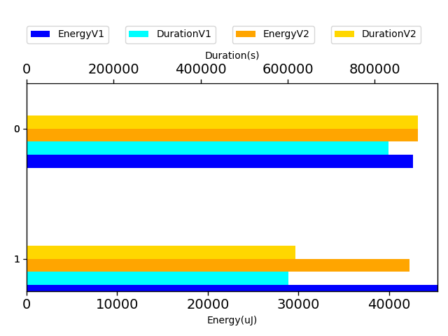

## com.google.gson.OverrideCoreTypeAdaptersTest

| Test | IterationV1 | IterationV2 | DeltaIteration |
| --- | --- | --- | --- |
| com.google.gson.OverrideCoreTypeAdaptersTest-testOverrideWrapperBooleanAdapter | 34 | 35 | 1 |
| com.google.gson.OverrideCoreTypeAdaptersTest-testOverridePrimitiveBooleanAdapter | 14 | 18 | 4 |
| com.google.gson.OverrideCoreTypeAdaptersTest-testOverrideStringAdapter | 20 | 22 | 2 |

| Test | EnergyV1 | EnergyV2 | DeltaEnergy |
| --- | --- | --- | --- |
| com.google.gson.OverrideCoreTypeAdaptersTest-testOverrideWrapperBooleanAdapter | 47194.54823215562 | 45451.68432797908 | -1742.8639041765418 |
| com.google.gson.OverrideCoreTypeAdaptersTest-testOverridePrimitiveBooleanAdapter | 42160.18054199219 | 41790.165534973145 | -370.01500701904297 |
| com.google.gson.OverrideCoreTypeAdaptersTest-testOverrideStringAdapter | 39854.05913925171 | 40672.484929561615 | 818.425790309906 |

| Test | DurationV1 | DurationsV2 | DeltaDuration |
| --- | --- | --- | --- |
| com.google.gson.OverrideCoreTypeAdaptersTest-testOverrideWrapperBooleanAdapter | 1082473.4428995089 | 562107.2132184403 | -520366.22968106857 |
| com.google.gson.OverrideCoreTypeAdaptersTest-testOverridePrimitiveBooleanAdapter | 453659.65490722656 | 436595.5464782715 | -17064.108428955078 |
| com.google.gson.OverrideCoreTypeAdaptersTest-testOverrideStringAdapter | 475394.0328884125 | 469554.51894569397 | -5839.513942718506 |

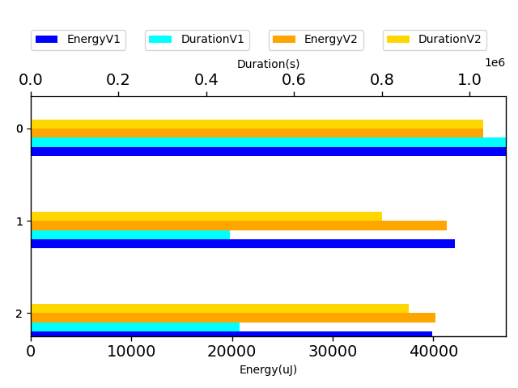

## com.google.gson.functional.JavaUtilTest

| Test | IterationV1 | IterationV2 | DeltaIteration |
| --- | --- | --- | --- |
| com.google.gson.functional.JavaUtilTest-testProperties | 29 | 24 | -5 |
| com.google.gson.functional.JavaUtilTest-testCurrency | 99 | 99 | 0 |

| Test | EnergyV1 | EnergyV2 | DeltaEnergy |
| --- | --- | --- | --- |
| com.google.gson.functional.JavaUtilTest-testProperties | 39628.98473522812 | 43318.086337804794 | 3689.101602576673 |
| com.google.gson.functional.JavaUtilTest-testCurrency | 129493.47265258754 | 84033.89971083711 | -45459.57294175043 |

| Test | DurationV1 | DurationsV2 | DeltaDuration |
| --- | --- | --- | --- |
| com.google.gson.functional.JavaUtilTest-testProperties | 746034.9200681448 | 637131.2431993484 | -108903.67686879635 |
| com.google.gson.functional.JavaUtilTest-testCurrency | 3313804.8635961427 | 2217978.37661149 | -1095826.486984653 |

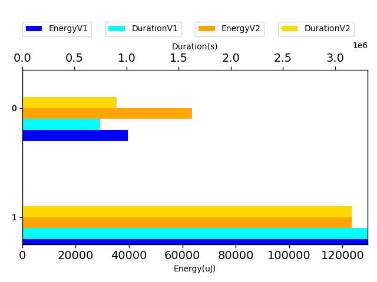

## com.google.gson.DefaultInetAddressTypeAdapterTest

| Test | IterationV1 | IterationV2 | DeltaIteration |
| --- | --- | --- | --- |
| com.google.gson.DefaultInetAddressTypeAdapterTest-testInetAddressSerializationAndDeserialization | 99 | 99 | 0 |

| Test | EnergyV1 | EnergyV2 | DeltaEnergy |
| --- | --- | --- | --- |
| com.google.gson.DefaultInetAddressTypeAdapterTest-testInetAddressSerializationAndDeserialization | 75636.49615623275 | 90264.05421951992 | 14627.558063287172 |

| Test | DurationV1 | DurationsV2 | DeltaDuration |
| --- | --- | --- | --- |
| com.google.gson.DefaultInetAddressTypeAdapterTest-testInetAddressSerializationAndDeserialization | 2257420.151064476 | 2121437.7815760775 | -135982.36948839854 |

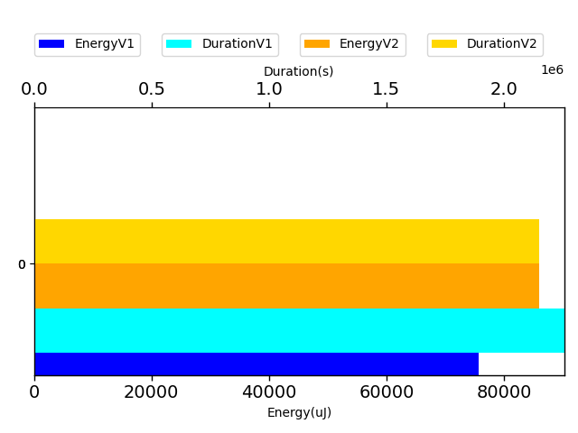

## com.google.gson.functional.PrimitiveCharacterTest

| Test | IterationV1 | IterationV2 | DeltaIteration |
| --- | --- | --- | --- |
| com.google.gson.functional.PrimitiveCharacterTest-testPrimitiveCharacterAutoboxedSerialization | 28 | 24 | -4 |

| Test | EnergyV1 | EnergyV2 | DeltaEnergy |
| --- | --- | --- | --- |
| com.google.gson.functional.PrimitiveCharacterTest-testPrimitiveCharacterAutoboxedSerialization | 44186.21867574379 | 51695.2697108984 | 7509.051035154611 |

| Test | DurationV1 | DurationsV2 | DeltaDuration |
| --- | --- | --- | --- |
| com.google.gson.functional.PrimitiveCharacterTest-testPrimitiveCharacterAutoboxedSerialization | 530089.7846187465 | 873607.9903574586 | 343518.2057387121 |

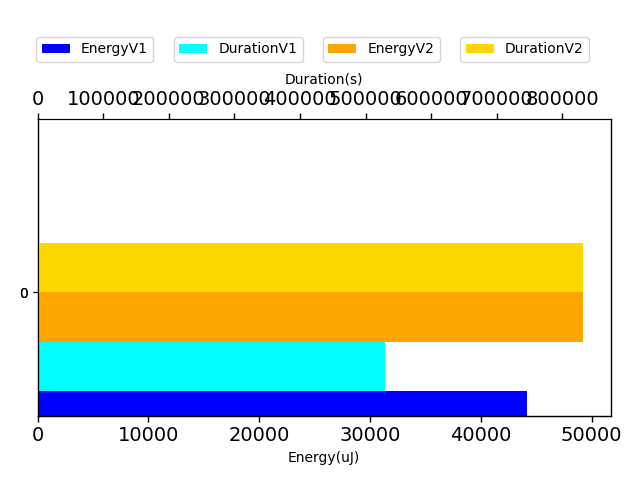

## com.google.gson.GsonBuilderTest

| Test | IterationV1 | IterationV2 | DeltaIteration |
| --- | --- | --- | --- |
| com.google.gson.GsonBuilderTest-testTransientFieldExclusion | 42 | 46 | 4 |
| com.google.gson.GsonBuilderTest-testExcludeFieldsWithModifiers | 52 | 51 | -1 |

| Test | EnergyV1 | EnergyV2 | DeltaEnergy |
| --- | --- | --- | --- |
| com.google.gson.GsonBuilderTest-testTransientFieldExclusion | 44374.480614536675 | 43601.04168306118 | -773.4389314754953 |
| com.google.gson.GsonBuilderTest-testExcludeFieldsWithModifiers | 46602.54366302702 | 45379.84056985981 | -1222.7030931672125 |

| Test | DurationV1 | DurationsV2 | DeltaDuration |
| --- | --- | --- | --- |
| com.google.gson.GsonBuilderTest-testTransientFieldExclusion | 825282.3121765447 | 778297.4272329244 | -46984.8849436203 |
| com.google.gson.GsonBuilderTest-testExcludeFieldsWithModifiers | 1051876.2798540131 | 750677.4073302052 | -301198.8725238079 |

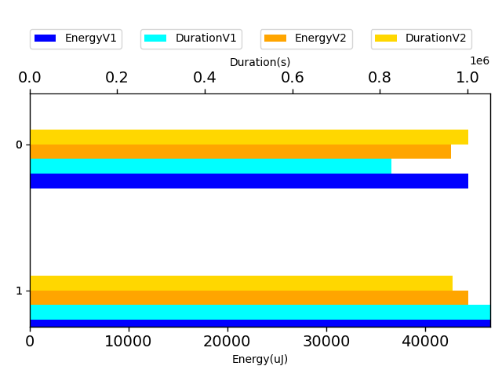

## com.google.gson.functional.InternationalizationTest

| Test | IterationV1 | IterationV2 | DeltaIteration |
| --- | --- | --- | --- |
| com.google.gson.functional.InternationalizationTest-testStringsWithUnicodeChineseCharactersSerialization | 48 | 64 | 16 |

| Test | EnergyV1 | EnergyV2 | DeltaEnergy |
| --- | --- | --- | --- |
| com.google.gson.functional.InternationalizationTest-testStringsWithUnicodeChineseCharactersSerialization | 42419.01668071118 | 41720.542316224615 | -698.4743644865666 |

| Test | DurationV1 | DurationsV2 | DeltaDuration |
| --- | --- | --- | --- |
| com.google.gson.functional.InternationalizationTest-testStringsWithUnicodeChineseCharactersSerialization | 810465.9606862161 | 820614.8198831533 | 10148.859196937177 |

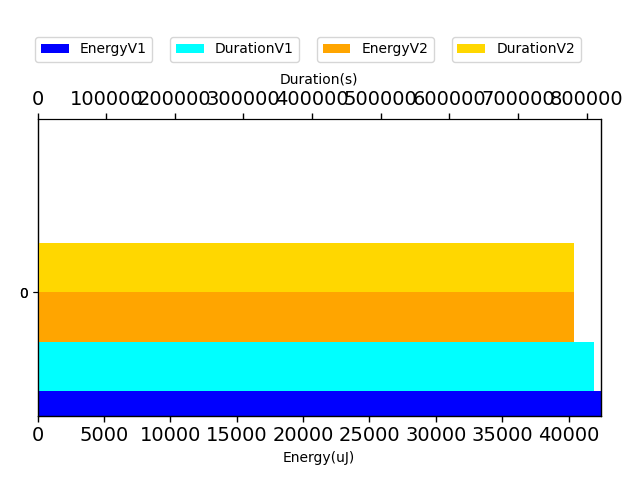

## com.google.gson.regression.JsonAdapterNullSafeTest

| Test | IterationV1 | IterationV2 | DeltaIteration |
| --- | --- | --- | --- |
| com.google.gson.regression.JsonAdapterNullSafeTest-testNullSafeBugSerialize | 88 | 89 | 1 |

| Test | EnergyV1 | EnergyV2 | DeltaEnergy |
| --- | --- | --- | --- |
| com.google.gson.regression.JsonAdapterNullSafeTest-testNullSafeBugSerialize | 87845.7099395655 | 42604.48190178389 | -45241.228037781606 |

| Test | DurationV1 | DurationsV2 | DeltaDuration |
| --- | --- | --- | --- |
| com.google.gson.regression.JsonAdapterNullSafeTest-testNullSafeBugSerialize | 2378379.2134866156 | 1142785.1597323795 | -1235594.053754236 |

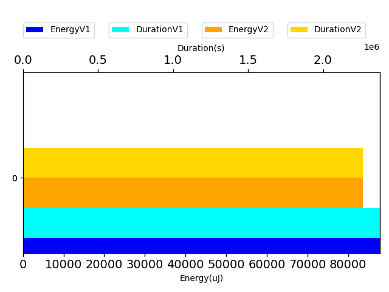

## com.google.gson.functional.TreeTypeAdaptersTest

| Test | IterationV1 | IterationV2 | DeltaIteration |
| --- | --- | --- | --- |
| com.google.gson.functional.TreeTypeAdaptersTest-testSerializeId | 92 | 89 | -3 |

| Test | EnergyV1 | EnergyV2 | DeltaEnergy |
| --- | --- | --- | --- |
| com.google.gson.functional.TreeTypeAdaptersTest-testSerializeId | 43880.8705609264 | 42774.512145929206 | -1106.358414997194 |

| Test | DurationV1 | DurationsV2 | DeltaDuration |
| --- | --- | --- | --- |
| com.google.gson.functional.TreeTypeAdaptersTest-testSerializeId | 1189276.0670008902 | 1400869.6772173285 | 211593.6102164383 |

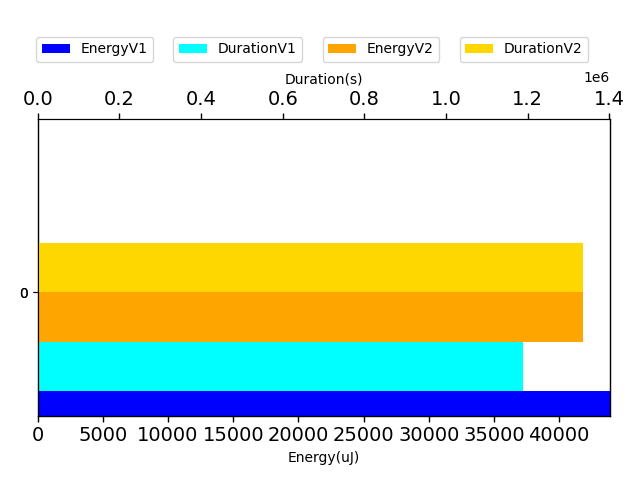

## com.google.gson.JsonParserTest

| Test | IterationV1 | IterationV2 | DeltaIteration |
| --- | --- | --- | --- |
| com.google.gson.JsonParserTest-testReadWriteTwoObjects | 77 | 68 | -9 |

| Test | EnergyV1 | EnergyV2 | DeltaEnergy |
| --- | --- | --- | --- |
| com.google.gson.JsonParserTest-testReadWriteTwoObjects | 41924.084664843904 | 54683.722883469294 | 12759.63821862539 |

| Test | DurationV1 | DurationsV2 | DeltaDuration |
| --- | --- | --- | --- |
| com.google.gson.JsonParserTest-testReadWriteTwoObjects | 1212595.8510164253 | 1151903.5704228424 | -60692.280593582895 |

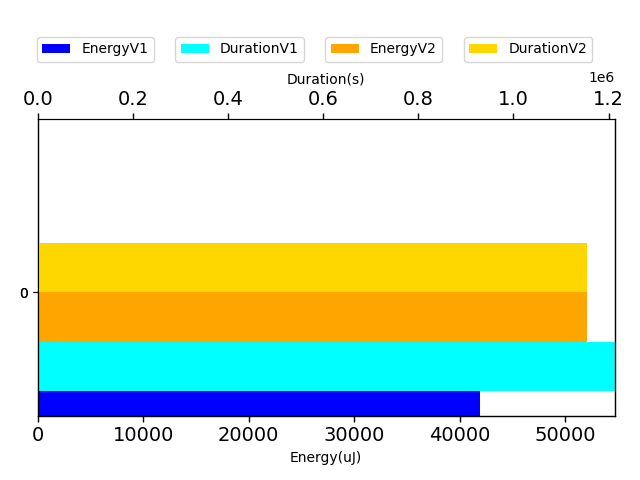

## com.google.gson.functional.FieldExclusionTest

| Test | IterationV1 | IterationV2 | DeltaIteration |
| --- | --- | --- | --- |
| com.google.gson.functional.FieldExclusionTest-testDefaultInnerClassExclusion | 77 | 73 | -4 |
| com.google.gson.functional.FieldExclusionTest-testInnerClassExclusion | 23 | 15 | -8 |
| com.google.gson.functional.FieldExclusionTest-testDefaultNestedStaticClassIncluded | 35 | 51 | 16 |

| Test | EnergyV1 | EnergyV2 | DeltaEnergy |
| --- | --- | --- | --- |
| com.google.gson.functional.FieldExclusionTest-testDefaultInnerClassExclusion | 45420.474831050815 | 48325.044101489635 | 2904.5692704388202 |
| com.google.gson.functional.FieldExclusionTest-testInnerClassExclusion | 42046.708797216415 | 43014.10861206055 | 967.3998148441315 |
| com.google.gson.functional.FieldExclusionTest-testDefaultNestedStaticClassIncluded | 43654.35468234838 | 43125.47961161668 | -528.875070731694 |

| Test | DurationV1 | DurationsV2 | DeltaDuration |
| --- | --- | --- | --- |
| com.google.gson.functional.FieldExclusionTest-testDefaultInnerClassExclusion | 949137.7045996629 | 1038157.2460228507 | 89019.54142318782 |
| com.google.gson.functional.FieldExclusionTest-testInnerClassExclusion | 434797.7790477276 | 659787.6526489258 | 224989.8736011982 |
| com.google.gson.functional.FieldExclusionTest-testDefaultNestedStaticClassIncluded | 553604.2295204569 | 605308.7390686455 | 51704.50954818865 |

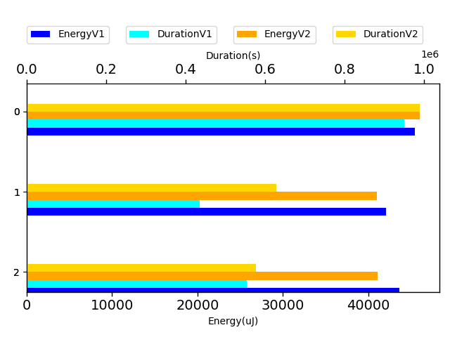

## com.google.gson.functional.UncategorizedTest

| Test | IterationV1 | IterationV2 | DeltaIteration |
| --- | --- | --- | --- |
| com.google.gson.functional.UncategorizedTest-testGsonInstanceReusableForSerializationAndDeserialization | 41 | 30 | -11 |
| com.google.gson.functional.UncategorizedTest-testStaticFieldsAreNotSerialized | 39 | 37 | -2 |
| com.google.gson.functional.UncategorizedTest-testObjectEqualButNotSameSerialization | 38 | 28 | -10 |

| Test | EnergyV1 | EnergyV2 | DeltaEnergy |
| --- | --- | --- | --- |
| com.google.gson.functional.UncategorizedTest-testGsonInstanceReusableForSerializationAndDeserialization | 44734.90883197565 | 45149.08362769708 | 414.174795721432 |
| com.google.gson.functional.UncategorizedTest-testStaticFieldsAreNotSerialized | 43151.37840717776 | 44961.25797547173 | 1809.8795682939672 |
| com.google.gson.functional.UncategorizedTest-testObjectEqualButNotSameSerialization | 45248.54905081208 | 45534.126648418605 | 285.577597606527 |

| Test | DurationV1 | DurationsV2 | DeltaDuration |
| --- | --- | --- | --- |
| com.google.gson.functional.UncategorizedTest-testGsonInstanceReusableForSerializationAndDeserialization | 774575.1234136849 | 720317.3187644407 | -54257.80464924418 |
| com.google.gson.functional.UncategorizedTest-testStaticFieldsAreNotSerialized | 651285.7110244564 | 555655.6308867959 | -95630.0801376605 |
| com.google.gson.functional.UncategorizedTest-testObjectEqualButNotSameSerialization | 492724.04650576104 | 556311.1893724576 | 63587.14286669652 |

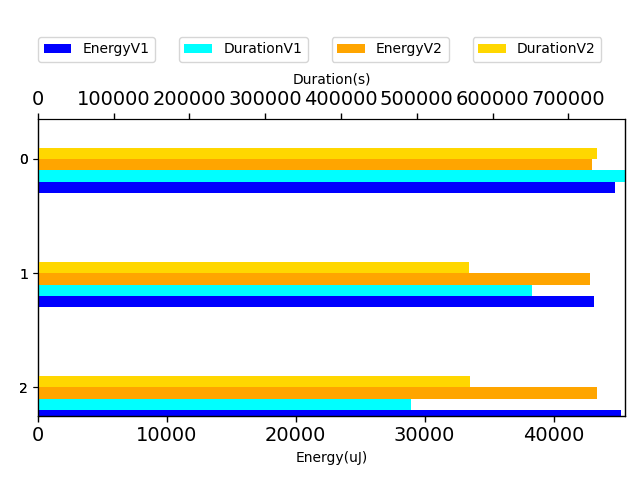

## com.google.gson.functional.EscapingTest

| Test | IterationV1 | IterationV2 | DeltaIteration |
| --- | --- | --- | --- |
| com.google.gson.functional.EscapingTest-testGsonAcceptsEscapedAndNonEscapedJsonDeserialization | 59 | 57 | -2 |
| com.google.gson.functional.EscapingTest-testEscapingObjectFields | 38 | 45 | 7 |
| com.google.gson.functional.EscapingTest-testEscapeAllHtmlCharacters | 30 | 24 | -6 |
| com.google.gson.functional.EscapingTest-testGsonDoubleDeserialization | 37 | 39 | 2 |
| com.google.gson.functional.EscapingTest-testEscapingQuotesInStringArray | 31 | 35 | 4 |

| Test | EnergyV1 | EnergyV2 | DeltaEnergy |
| --- | --- | --- | --- |
| com.google.gson.functional.EscapingTest-testGsonAcceptsEscapedAndNonEscapedJsonDeserialization | 57027.59527556042 | 43147.94124139391 | -13879.65403416651 |
| com.google.gson.functional.EscapingTest-testEscapingObjectFields | 71946.57834672085 | 42877.264476498734 | -29069.31387022212 |
| com.google.gson.functional.EscapingTest-testEscapeAllHtmlCharacters | 38248.61689526588 | 42962.16035050154 | 4713.54345523566 |
| com.google.gson.functional.EscapingTest-testGsonDoubleDeserialization | 37502.41175011311 | 41416.73088495543 | 3914.3191348423206 |
| com.google.gson.functional.EscapingTest-testEscapingQuotesInStringArray | 81864.34322865959 | 44227.04485639738 | -37637.298372262216 |

| Test | DurationV1 | DurationsV2 | DeltaDuration |
| --- | --- | --- | --- |
| com.google.gson.functional.EscapingTest-testGsonAcceptsEscapedAndNonEscapedJsonDeserialization | 1592750.1343571306 | 1164446.1031196713 | -428304.0312374593 |
| com.google.gson.functional.EscapingTest-testEscapingObjectFields | 1711758.0770191918 | 1239381.7977961355 | -472376.2792230563 |
| com.google.gson.functional.EscapingTest-testEscapeAllHtmlCharacters | 904225.5933030955 | 677669.009621799 | -226556.58368129656 |
| com.google.gson.functional.EscapingTest-testGsonDoubleDeserialization | 910950.5057193984 | 490752.0207830844 | -420198.484936314 |
| com.google.gson.functional.EscapingTest-testEscapingQuotesInStringArray | 2928250.8247973556 | 1058770.5518879313 | -1869480.2729094243 |

## com.google.gson.functional.PrintFormattingTest

| Test | IterationV1 | IterationV2 | DeltaIteration |
| --- | --- | --- | --- |
| com.google.gson.functional.PrintFormattingTest-testCompactFormattingLeavesNoWhiteSpace | 79 | 74 | -5 |

| Test | EnergyV1 | EnergyV2 | DeltaEnergy |
| --- | --- | --- | --- |
| com.google.gson.functional.PrintFormattingTest-testCompactFormattingLeavesNoWhiteSpace | 268008.3095055907 | 47154.0456063952 | -220854.2638991955 |

| Test | DurationV1 | DurationsV2 | DeltaDuration |
| --- | --- | --- | --- |
| com.google.gson.functional.PrintFormattingTest-testCompactFormattingLeavesNoWhiteSpace | 8506776.139747724 | 1291378.65134802 | -7215397.488399704 |

## com.google.gson.functional.GsonVersionDiagnosticsTest

| Test | IterationV1 | IterationV2 | DeltaIteration |
| --- | --- | --- | --- |
| com.google.gson.functional.GsonVersionDiagnosticsTest-testAssertionErrorInSerializationPrintsVersion | 34 | 40 | 6 |

| Test | EnergyV1 | EnergyV2 | DeltaEnergy |
| --- | --- | --- | --- |
| com.google.gson.functional.GsonVersionDiagnosticsTest-testAssertionErrorInSerializationPrintsVersion | 43738.91877490352 | 40853.57042491725 | -2885.3483499862705 |

| Test | DurationV1 | DurationsV2 | DeltaDuration |
| --- | --- | --- | --- |
| com.google.gson.functional.GsonVersionDiagnosticsTest-testAssertionErrorInSerializationPrintsVersion | 611582.3667517232 | 577553.0294815956 | -34029.33727012761 |

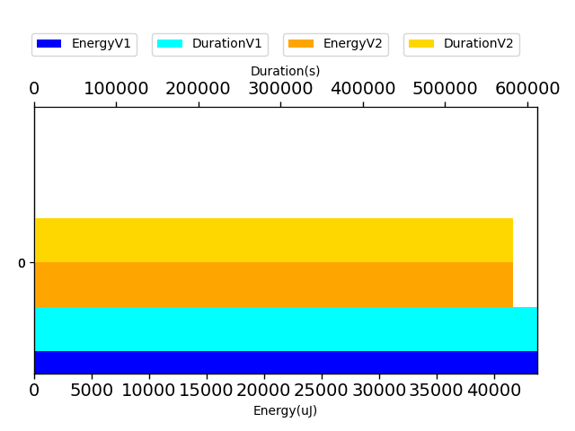

## com.google.gson.LongSerializationPolicyTest

| Test | IterationV1 | IterationV2 | DeltaIteration |
| --- | --- | --- | --- |
| com.google.gson.LongSerializationPolicyTest-testDefaultLongSerializationIntegration | 27 | 28 | 1 |
| com.google.gson.LongSerializationPolicyTest-testStringLongSerializationIntegration | 20 | 18 | -2 |

| Test | EnergyV1 | EnergyV2 | DeltaEnergy |
| --- | --- | --- | --- |
| com.google.gson.LongSerializationPolicyTest-testDefaultLongSerializationIntegration | 186048.3325213641 | 78061.94172815979 | -107986.39079320431 |
| com.google.gson.LongSerializationPolicyTest-testStringLongSerializationIntegration | 43287.55225563049 | 44040.54462432861 | 752.9923686981201 |

| Test | DurationV1 | DurationsV2 | DeltaDuration |
| --- | --- | --- | --- |
| com.google.gson.LongSerializationPolicyTest-testDefaultLongSerializationIntegration | 5166407.648384973 | 1474922.0265516713 | -3691485.621833302 |
| com.google.gson.LongSerializationPolicyTest-testStringLongSerializationIntegration | 621487.2761039734 | 381174.24269104004 | -240313.03341293335 |

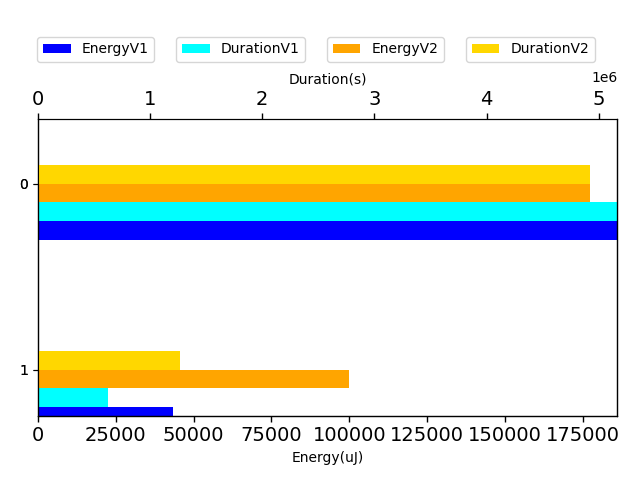

